# SCIENCE CHINA Information Sciences

# . RESEARCH PAPER .

September 2025, Vol. 68, Iss. 9, 192302:1–192302[:12](#page-11-0) <https://doi.org/10.1007/s11432-024-4369-2>

# Chaotic optoelectronic oscillators-based dual-function radar-communication system

Huanhuan XIONG, Ning JIANG\* , Anran LI, Meizhi CHE, Chengmo WANG, Qiang ZHANG, Yiqun ZHANG & Kun QIU

School of Information and Communication Engineering, University of Electronic Science and Technology of China, Chengdu 611731, China

Received 14 October 2024/Revised 21 February 2025/Accepted 25 March 2025/Published online 24 July 2025

Abstract We propose and demonstrate a novel dual-function radar-communication (DFRC) system based on chaotic optoelectronic oscillators (OEOs). Differing from conventional optical chaos communication systems, wherein the time delay signature (TDS) of chaotic signals produced by optical or optoelectronic feedback is deemed detrimental, in the proposed DFRC system, two independent OEO-generated chaotic signals with different TDSs are encoded as bits "0" and "1" for communication, and simultaneously utilized for radar ranging. The numerical simulation results demonstrate that the proposed system can effectively perform information-hiding transmission as well as target ranging functions simultaneously, and satisfactory performance for both functions can be maintained even under low signal-to-noise ratio scenarios. In addition, a TDS-based sidelobe suppression algorithm is proposed to enhance the range performance, with which the TDS-induced sidelobes can be efficiently suppressed. A data rate of 250 Mbps, a radar ranging resolution of 0.013 m, and a detection probability of ranging above 0.95 in a dual-target scenario are achieved with the appropriate system parameters and the aid of the TDS-SS algorithm.

Keywords dual-function radar-communication, chaotic optoelectronic oscillator, optical chaos communication, time delay signature, sidelobe suppression algorithm

Citation Xiong H H, Jiang N, Li A R, et al. Chaotic optoelectronic oscillators-based dual-function radar-communication system. Sci China Inf Sci, 2025, 68(9): 192302,<https://doi.org/10.1007/s11432-024-4369-2>

## 1 Introduction

In recent years, integrated systems with dual functions of radar and communication (DFRC) have been favored, which achieve wireless communication and radar functions through a unified system that effectively mitigates spectrum resource constraints and facilitates hardware sharing, holding substantial significance in both civilian and military domains [\[1\]](#page-10-0). DFRC signal design is the basis of the DFRC technology, with two primary schemes [\[2–](#page-10-1)[4\]](#page-10-2). The first scheme involves combining radar and communication waveforms through multiplexing techniques such as time division multiplexing [\[5\]](#page-10-3) and frequency division multiplexing [\[6\]](#page-10-4) to form an integrated waveform. While this scheme effectively addresses interference issues between radar and communication from different dimensions, it could potentially result in resource wastage in alternative dimensions. The second scheme involves optimizing a unified waveform such as linear frequency modulation (LFM) [\[7,](#page-10-5)[8\]](#page-10-6), orthogonal frequency division multiplexing (OFDM) [\[9,](#page-10-7)[10\]](#page-10-8) and orthogonal time frequency space (OTFS) [\[11\]](#page-10-9) to support radar and communication functions simultaneously. This scheme offers the benefit of resource sharing within the system, thereby promoting system integration [\[12\]](#page-11-1). However, these schemes often exhibit a bias toward either radar or communication functionality, resulting in inherent trade-offs between the performance of communication and radar [\[13\]](#page-11-2).

Chaotic signals characterized by noise-like features and broad bandwidth along with favorable deltalike auto-correlation characteristics, can be generated through various methods, including semiconductor laser [\[14](#page-11-3)[–16\]](#page-11-4), optoelectronic oscillator [\[17\]](#page-11-5), memristor [\[18\]](#page-11-6), and nonlinear mappings such as the tent map [\[19\]](#page-11-7) and logistic map [\[20\]](#page-11-8), have exhibited substantial promise in both radar [\[21,](#page-11-9)[22\]](#page-11-10) and communication applications [\[23,](#page-11-11)[24\]](#page-11-12). The wideband characteristic of chaotic signals facilitates a high communication

\* Corresponding author (email: uestc nj@uestc.edu.cn)

transmission rate and enhanced ranging resolution in radar applications. Hence, the exploration of DFRC systems utilizing chaotic signals holds significant importance. In the field of chaotic radar and communication, optically generated chaotic signals are more commonly used because they can more easily generate chaotic signals with bandwidths exceeding gigahertz, compared to electrical methods or nonlinear mappings. In chaotic radar systems, research efforts focus on generating chaotic signals with flat and wide power spectrum [25], whereas in communication systems, the emphasis is on enhancing security and transmission rates [26]. However, most studies have treated radar and communication functions independently. Recently, Yang et al. [27] utilized a chaotic optoelectronic oscillator (OEO) to generate a wideband chaotic signal as a radio frequency carrier, and the DFRC waveform was generated by mixing the carrier with an on-off keying (OOK) signal through intensity modulation. They experimentally achieved a communication rate of 125 Mbps and a radar ranging resolution of 7 cm. Despite these advancements, research on DFRC systems based on optical chaos remains in its early stages, with many challenges yet to be addressed.

In this paper, we propose a novel DFRC system based on chaotic OEOs. At the transmitter, two chaotic signals with different time delay signatures (TDSs) are generated through OEOs, which exhibit wide-bandwidth characteristics. In our proposed system, the communication signals are encoded with different TDSs using the chaos shift keying (CSK) technique to generate the DFRC waveform. At the communication receiver, the received signal is equalized first, followed by auto-correlation to achieve information recovery. Meanwhile, at the radar receiver, target detection is achieved through cross-correlation between the reference signal and the echo signal. Additionally, a TDS-based sidelobe suppression (TDS-SS) algorithm is proposed to address the issue of high sidelobes caused by TDS. The numerical simulations of the proposed system are performed. The results demonstrate the feasibility of using electro-optic chaos in the DFRC system, the noise immunity of the proposed system, and the effectiveness of the proposed algorithm in sidelobe suppression.

## 2 Configuration and theoretical model

Figure 1 depicts the overall structure of the proposed DFRC system, which is composed of four parts, namely the chaotic signal generation module, the transmitter, the communication receiver, and the radar receiver. The chaotic signal generation module is used to generate a modulated chaotic signal. The signal transmission module modulates the information onto the chaotic carrier to form an integrated waveform for transmission. The communication receiver and radar receiver respectively realize the functions of information transmission and radar detection. The principles of these four main components are described in detail as follows.

## 2.1 Chaotic signal generation based OEO

The chaotic signal generation module is a typical OEO structure, which mainly consists of a laser diode (LD), Mach-Zehnder modulator (MZM), fiber delay line (DL), and photodetector (PD). Initially, the laser emitted by the LD passes through the MZM, DL, and variable optical attenuator (VOA), and then converts the optical signal into an electrical signal through a PD. The function of the DL is to control the delay of the system loop, and the delay is also called the TDS. After passing through the amplifier (AMP), a segment of the electrical signal is connected to the MZM to serve as the signal voltage applied to the MZM, while another segment is utilized for information modulation. By changing the gain of the loop and the DC bias of the MZM, the system can generate a chaotic signal.

The chaotic signal generation model can be represented by the Ikeda equation [28]

$$\left(1 + \frac{\mu}{\theta}\right)x(t) + \mu \frac{\mathrm{d}}{\mathrm{d}t}x(t) + \frac{1}{\theta} \int x(t)\mathrm{d}t = \beta \cos^2(x(t-\tau) + \varphi),\tag{1}$$

where  $x(t) = \pi V(t)/(2V_{\pi})$ ,  $\varphi = \pi V_{\text{bias}}/(2V_{\pi 0})$  are dimensionless output signal and DC bias phase of MZM, respectively. V(t) and  $V_{\text{bias}}$  are drive voltage and bias voltage, while  $V_{\pi}$  and  $V_{\pi 0}$  are half-wave voltages of the RF input port and the DC bias port of MZM.  $\mu$  and  $\theta$  are response times corresponding to high cut-off frequency  $f_H$  and low cut-off frequency  $f_L$  of the equivalent bandpass filter caused by electrical components. The relationship between the cut-off frequencies and the response times is given by  $f_H = (2\pi\mu)^{-1}$  and  $f_L = (2\pi\theta)^{-1}$ .  $\beta = \pi g\alpha \text{GRP}_0/(2V_{\pi})$  is the Ikeda gain, where  $\alpha$  and G represent

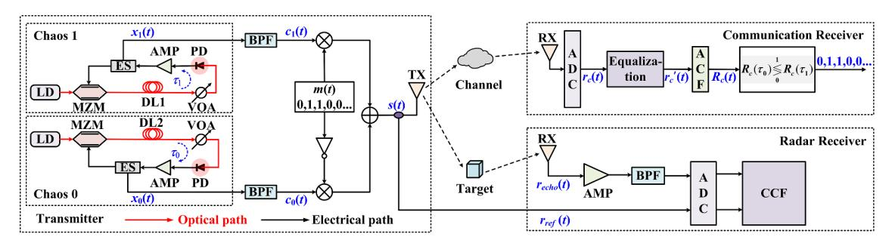

Figure 1 (Color online) Schematic diagram of the DFRC system based on chaotic optoelectronic oscillators. LD, laser diode; MZM, Mach-Zehnder modulator; DL, fiber delay line; PD, photodetector; VOA, variable optical attenuator; AMP, amplifier; BPF, bandpass filter; ES, electrical splitter; TX, transmitter antenna; RX, receiver antenna; ADC, analog-to-digital converter; ACF, auto-correlation function; CCF, cross-correlation function.

the loss and gain of the system loop, respectively. While g and R represent the responsivity and resistance of the photodetector, and  $P_0$  is the optical power entering the MZM.  $\tau$  is the TDS of the chaos system. Eq. (1) can be rewritten as

$$\begin{cases}
\frac{\mathrm{d}}{\mathrm{d}t}x(t) = -\frac{1}{\mu} \left[ \left( 1 + \frac{\mu}{\theta} \right) x(t) + \frac{1}{\theta} y(t) - \beta \cos^2(x(t-\tau) + \varphi) \right], \\
\frac{\mathrm{d}}{\mathrm{d}t}y(t) = x(t),
\end{cases} \tag{2}$$

where y(t) is defined as

$$y(t) = \int x(t)dt. \tag{3}$$

A chaotic signal can be generated by solving (2) using the fourth-order Runge-Kutta algorithm.

#### 2.2 Dual-function signal transmission

Firstly, the transmitter generates two chaotic signal sources  $x_0(t)$  and  $x_1(t)$ , each with TDSs of  $\tau_0$  and  $\tau_1$ , respectively, symbolizing the TDS of the entire system as  $(\tau_0, \tau_1)$ . The generated chaotic signals, characterized by their wide spectrum, are filtered through bandpass filters (BPFs) to match the bandwidth of the transmitter antenna, resulting in the filtered signals denoted as  $c_0(t)$  and  $c_1(t)$ . The passbands of all BPFs in the system are assumed to be the same unless otherwise specified. The communication information m(t) is multiplied by  $c_1(t)$  through a multiplier, while the reversed communication information is multiplied by  $c_0(t)$ . The two resulting signals are then superimposed via an adder to form a dual-function transmitted signal s(t). One part is transmitted through an antenna, and the other part is sent as the reference signal  $r_{ref}(t)$  to the radar receiver. The transmitted signal s(t) is expressed numerically as

$$s(t) = m(t)c_1(t) + [1 - m(t)]c_0(t).$$
(4)

The modulation method employed at the transmitter is CSK. In this scheme, bit "0" and bit "1" are encoded using chaotic signals with TDSs of  $\tau_0$  and  $\tau_1$ , respectively.

#### 2.3 Communication receiving

At the communication receiver, the signal is received and sampled by an analog-to-digital converter (ADC), which is denoted as  $r_c(t)$ . Under the multipath channel,  $r_c(t)$  is represented as

$$r_c(t) = s(t) * h(t) + n(t) = \sum_{p=1}^{P} \alpha_p s(t - \tau_p^c) + n(t),$$
 (5)

where the symbol "\*" is the convolution operation. h(t) is the impulse response of the channel, which can be expressed as

$$h(t) = \sum_{p=1}^{P} \alpha_p \delta(t - \tau_p^c), \tag{6}$$

where  $\alpha_p$  and  $\tau_p^c$  are the gain and delay of path p, respectively.  $\delta(t)$  is the Dirac delta function, P is the total number of paths, and n(t) is the Gaussian noise.

Before the information can be demodulated, it is necessary to equalize the received signal. In our proposed system, assuming that h(t) is known, the following equilibrium is utilized:

$$r'_c(t) = \text{IFFT}\left\{\frac{\text{FFT}\{r_c(t)\}}{\text{FFT}\{h(t)\}}\right\}.$$
 (7)

Subsequently, the auto-correlation function (ACF) is computed for each bit period of the equalized signal. The ACF of a signal  $\xi(t)$  can be calculated using the following equation:

$$R_c(\Delta t) = \frac{\langle (\xi(t + \Delta t) - \langle \xi(t + \Delta t) \rangle) \cdot (\xi(t) - \langle \xi(t) \rangle) \rangle}{\sqrt{\langle (\xi(t + \Delta t) - \langle \xi(t + \Delta t) \rangle)^2 \rangle \cdot \langle (\xi(t) - \langle \xi(t) \rangle)^2 \rangle}},$$
(8)

where  $\langle \cdot \rangle$  is the mean value operation,  $\Delta t$  indicates the lag time. Information demodulation is achieved by comparing the relative magnitudes of the values at delays  $\tau_0$  and  $\tau_1$  in the ACF result  $R_c(t)$ . If  $R_c(\tau_1) > R_c(\tau_0)$ , the demodulation result is bit "1"; otherwise it is bit "0".

## 2.4 Radar detection

Chaotic radar is commonly used for ranging [21,29] and imaging [30], whereas in our system, only the ranging function is considered. The transmitted signal s(t) is reflected by the targets, and the resulting echo signal is  $r_{\rm echo}(t)$ . Subsequently, after passing through the AMP and the BPF,  $r_{\rm echo}(t)$  is down-sampled by the ADC together with the reference signal  $r_{\rm ref}(t)$ . Due to the delta-like auto-correlation property inherent in chaotic signals, the position information of targets can be effectively determined according to the peak of the cross-correlation function (CCF) between  $r_{\rm ref}(t)$  and  $r_{\rm echo}(t)$ . The CCF between two signals  $\xi_1(t)$  and  $\xi_2(t)$  can be computed using (9), where the symbols have the same meaning as in (8).

$$R_{\rm er}(\Delta t) = \frac{\langle (\xi_1(t+\Delta t) - \langle \xi_1(t+\Delta t) \rangle) \cdot (\xi_2(t) - \langle \xi_2(t) \rangle) \rangle}{\sqrt{\langle (\xi_1(t+\Delta t) - \langle \xi_1(t+\Delta t) \rangle)^2 \rangle \cdot \langle (\xi_2(t) - \langle \xi_2(t) \rangle)^2 \rangle}}.$$
 (9)

## 3 Simulation results

## 3.1 Characteristics of the transmitted signal

Firstly, the characteristics of the transmitted signal are analyzed. The transmitted signal is composed of two chaotic signals with different TDSs, so the chaotic signal sources are briefly analyzed first. Since wireless communication in this DFRC system is achieved by encoding the TDSs of chaotic signals, a more pronounced TDS leads to better communication performance. To generate chaotic signals with pronounced TDSs, the fundamental simulation parameters of the OEO are set as follows [31–33]:  $\mu = 15.9$  ps (corresponding to a cut-off frequency of 10 GHz),  $\theta = 0.796$  ns (corresponding to a cut-off frequency of 200 MHz),  $\beta = 5$  and  $\varphi = -\pi/4$ .

Figure 2 shows the time series, power spectrum, and ACF for TDS of 0.5 (blue curve) and 0.9 ns (red curve), respectively. As depicted in Figures 2(a) and (b), the temporal waveforms exhibit a typical chaotic state with fast-irregular oscillation. Additionally, Figures 2(c) and (d) reveal their wide power spectrum. Notably, there are some equally spaced peaks in the power spectrum, with frequency intervals equal to the reciprocal of the TDS values. Figures 2(e) and (f) present the ACF of the chaotic signals, showcasing peaks at the positions corresponding to the TDS and their integer multiples. Therefore, TDS can serve as a crucial feature of chaotic signals, capable of generating chaotic signals with varying TDSs by controlling the delay of the system loop. In the field of secure chaotic optical communication, researchers frequently view TDS as an undesirable feature since it may leak the external cavity length and feedback strength of the chaos generation module, and therefore strive to suppress TDS to enhance the confidentiality of communication systems [34,35]. However, since the proposed system demodulates information based on the distinct positions of the TDS, it is considered beneficial for facilitating the communication function within our system.

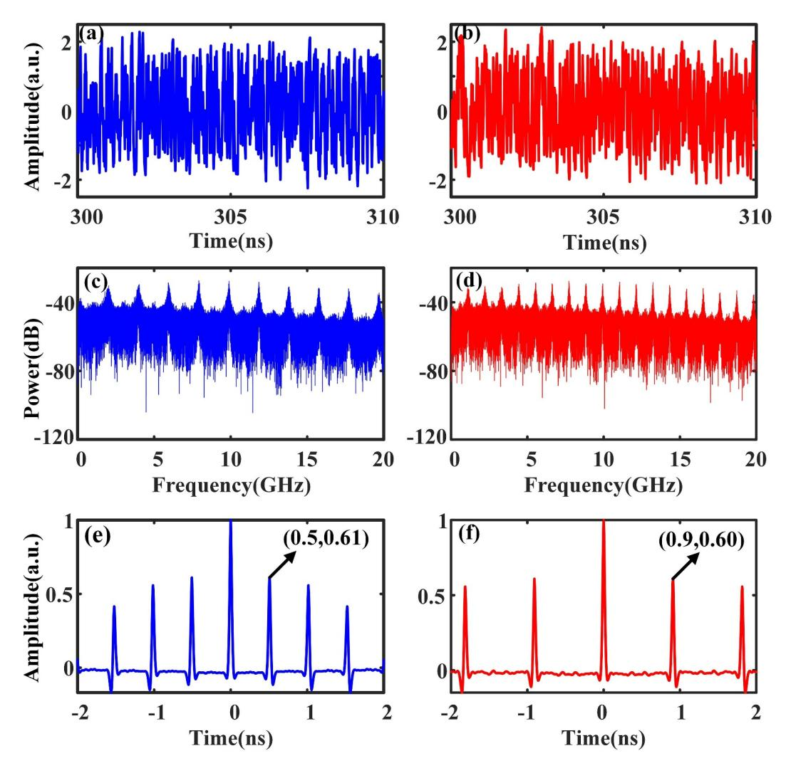

Figure 2 (Color online) Characteristics of chaotic signals. (a) and (b) are time series; (c) and (d) are power spectrum; (e) and (f) are ACF curves. The blue curves and red curves represent TDS of 0.5 and 0.9 ns, respectively.

Figure 3 illustrates the ACF curve of the transmitted signal, and the passband of all BPFs is set to 1–10 GHz unless otherwise specified. Unlike the chaotic signals commonly used in radar systems, the ACF of the transmitted signal in this system exhibits not only a sharp main lobe but also sidelobes induced by the system's TDS. Consequently, this signal is not conducive to radar detection and we will present the corresponding algorithm in subsequent sections. Additionally, the full width at half maximum (FWHM) of the signal is approximately 0.058 ns, which determines the ranging resolution of the system. Simultaneously, the first inter-zero interval in the ACF is defined as the main lobe width (MLW), which is approximately 0.094 ns for this transmitted signal.

## 3.2 Communication performance

Secondly, the communication performance of the system is analyzed under additive white Gaussian noise (AWGN) channels as well as multipath Rayleigh fading channels. In this analysis, only two-path Rayleigh fading channels are considered, with delays of  $\tau_1^c = 0$  ns and  $\tau_2^c = 100$  ns, and average power gains of  $E(\alpha_1^2) = 2/3$  and  $E(\alpha_2^2) = 1/3$ , respectively. The bit error rate (BER) is used to evaluate the communication performance, and each result is obtained by the Monte Carlo algorithm.

Figure 4 depicts the BER of different TDS combinations under both AWGN and multipath Rayleigh fading channels, with a data rate of 100 Mbps. Under both the AWGN and multipath channels, the BER is lower and communication performance is better when using TDS combinations such as (0.5, 0.9) ns or (1.0, 1.5) ns, compared to combinations like (0.5, 1.0) ns or (1.0, 2.0) ns. It is noteworthy that an integer multiple relationship exists between the TDS values when encountering high BERs. This

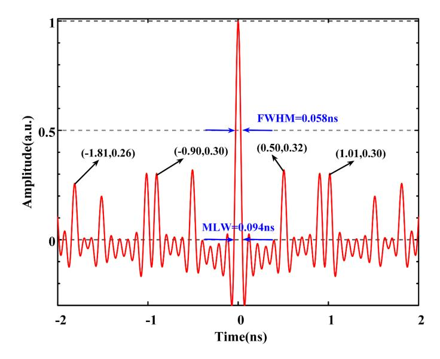

Figure 3 (Color online) ACF curve of the transmitted signal.

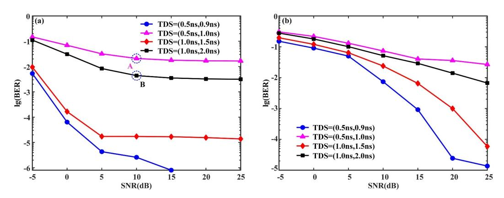

Figure 4 (Color online) BER performance vs. communication SNR (signal-to-noise ratio) under different TDS combinations. (a) AWGN channel; (b) two-path Rayleigh fading channel.

phenomenon arises because when performing auto-correlation on a chaotic signal with a pronounced TDS, peaks occur at both the positions of the TDS and its integer multiples. When the auto-correlation time is limited, the peaks at the integer multiples of the TDS may surpass those at the TDS itself, potentially leading to a higher BER. Figure [5](#page-6-0) illustrates the ACF curves of the chaotic signal in a bit period with TDS of 0.5 and 1.0 ns, corresponding to parameters represented by points A and B in Figure [4\(](#page-5-1)a), respectively. It is noticeable that the values at the doubled TDS position are slightly larger than those at the single TDS position, which results in incorrectly demodulating bit "0" into bit "1". Furthermore, our simulation reveals that the majority of incorrect demodulations indeed convert bit "0" into bit "1", which is consistent with our analysis. Therefore, to achieve better communication performance of the system, it is advisable to select TDS combinations that do not exhibit integer multiple relationships.

Furthermore, to determine the maximum achievable data rate of the system, Figure [6](#page-6-1) shows the BER performance at different communication rates given a TDS combination of (0.5, 0.9) ns. It is indicated that higher data rates result in higher BERs and poorer communication performance. This is attributed to the fact that the higher data rate corresponds to a shorter bit period, making it challenging to distinguish the TDSs corresponding to binary bits during information demodulation. With a hard decision forward error correction (HD-FEC) threshold of BER = 3.8 × 10−3 , our scheme can achieve reliable communication with a maximum rate of 250 Mbps in both AWGN and multipath channels. The insets in Figure [6\(](#page-6-1)a) show the eye diagrams of the transmitted signals at data rates of 100 Mbps and 250 Mbps, respectively, and it can be seen that the eye diagrams are completely closed, indicating that the information is completely hidden, which demonstrates that the system has a certain level of security.

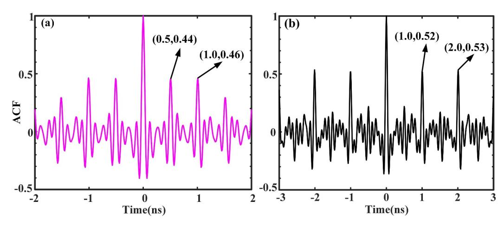

Figure 5 (Color online) ACF of chaotic signal in a bit period. (a) and (b) correspond to points A and B in Figure 4(a), respectively.

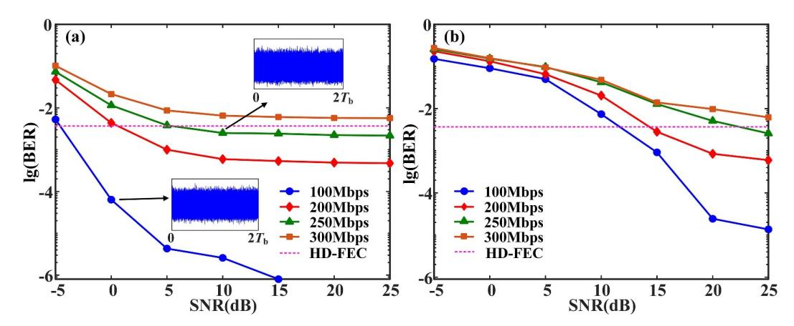

Figure 6 (Color online) BER performance vs. communication SNR under different data rates. (a) AWGN channel; (b) two-path Rayleigh fading channel. The insets in (a) show the eye diagrams corresponding to the respective parameters and Tb is the symbol period.

Additionally, at a data rate of 100 Mbps, the system can achieve a BER of less than 10−5 in the lower SNR of the AWGN channel, and a BER of less than 10−3 in the multipath channel when the SNR is 15 dB. These results demonstrate that the proposed system is resilient to multipath effects and can achieve reliable communication in some harsh environments.

In the proposed system, a 9 GHz bandwidth signal has been employed to achieve a maximum data rate of 250 Mbps for message transmission. However, our scheme exhibits lower spectral efficiency compared to contemporary communication systems. It is worth mentioning that since the information demodulation is carried out by distinguishing the TDSs of the chaotic signals based on the auto-correlation operation, which requires a sufficiently long auto-correlation time, the maximum transmission data rate is limited. Nevertheless, our scheme not only demonstrates the capability to facilitate normal communication under low SNR conditions, but also the ability of the system to hide information. This resilience holds significant implications for specific scenarios, such as battlefield environments characterized by severe electromagnetic interference [\[36\]](#page-11-23).

## 3.3 Ranging performance

Next, the radar ranging performance of the proposed system is analyzed, where the passband of BPF is set to 1–10 GHz, the TDS of the system is (0.5, 0.9) ns, and the data rate is 100 Mbps. All targets are considered ideal point targets.

Figure [7](#page-7-0) shows the results of single-target and dual-target ranging of the system under an SNR condition of −10 dB. From the results, it can be seen that the targets are detectable using the cross-correlation algorithm. However, numerous sidelobes are observed around the target, as shown by the red dashed

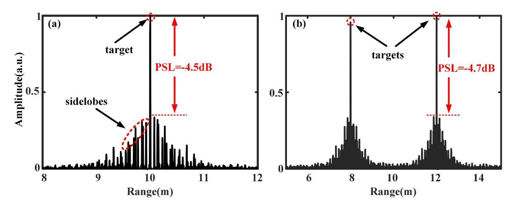

Figure 7 (Color online) Ranging results of (a) single target and (b) dual targets.

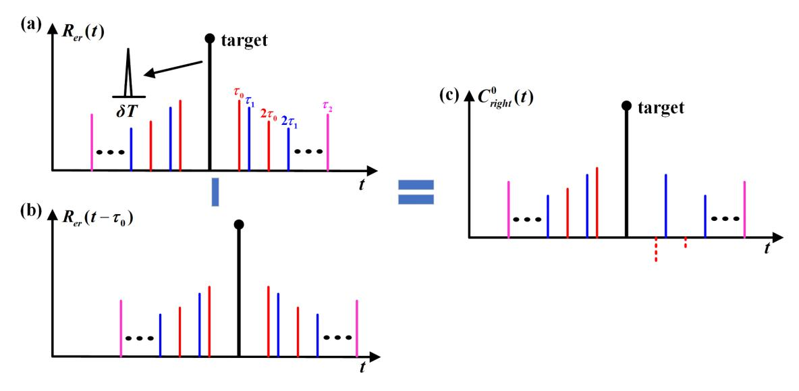

Figure 8 (Color online) Operation principle diagrams of the TDS-SS algorithm. (a) Cross-correlation ranging result; (b) original ranging result with a  $\tau_0$  delay; (c) result of subtracting the delayed component from the original ranging result.

line in Figure 7(a). To evaluate the ranging performance of the system, the peak-sidelobe level (PSL) is calculated, which is defined as

$$PSL = 10\log_{10} \frac{|P_s|}{|P_m|},\tag{10}$$

where  $P_m$  and  $P_s$  are the peak values of the main lobe and the maximum sidelobe level in the CCF trace of the echo signal and reference signal, respectively. From Figure 7, the results have high PSL in both single-target and dual-target ranging, which are -4.5 and -4.7 dB, respectively. The presence of these sidelobes is attributed to the TDS of the chaotic signal generation system. In multi-target ranging scenarios, these sidelobes may cause misjudgment of the target positions, underscoring the necessity of employing appropriate algorithms for effective sidelobe suppression.

Here, we propose a TDS-SS algorithm for sidelobes caused by TDS to improve ranging performance. The basic operation principle is illustrated in Figure 8, where  $R_{\rm er}(t)$  represents the ranging result generated by the CCF,  $\tau_0$  and  $\tau_1$  are the TDSs of the system, and  $\tau_2$  is the least common multiple of  $\tau_0$  and  $\tau_1$ .  $\delta T$  represents the MLW of the transmitted signal. The symbols on the colored sidelobes indicate the time delay between the sidelobes and the target. It can be seen that the sidelobes appear at positions  $\tau_0$ ,  $\tau_1$ ,  $2\tau_0$ ,  $2\tau_1$ , etc., with the sidelobe at  $\tau_2$  being higher than its neighboring sidelobes. Take the red sidelobes on the right side of the target as an example (caused by  $\tau_0$ ). By delaying  $R_{\rm er}(t)$  by  $\tau_0$ , the result is shown in Figure 8(b). Subtracting the delayed result  $R_{\rm er}(t-\tau_0)$  from  $R_{\rm er}(t)$  gives  $C_{\rm right}^0(t)$ , as shown in Figure 8(c). It is evident that the values at  $\tau_0$  and  $2\tau_0$  are below 0 (red dotted line), while the amplitudes of other sidelobes are reduced but remain positive. The sidelobes can be eliminated by

#### Algorithm 1 TDS-SS algorithm.

Require: The ranging result based on CCF, Rer(t); the TDSs of the system, τ0 and τ1; the MLW of the transmitted signal, δT. Ensure: The final ranging result, Rer(t).

- 1: C left,right(t) = Rer(t) − Rer(t ± τi), i = 0, 1, 2, where τ2 is the least common multiple of τ0 and τ1;
- 2: Find the time points in C i left and C i right that are less than 0, and the set of time points is T;
- 3: Rer(T) = 0; Rer(t) is manifested as a combination of a series of pulses;
- 4: Set the threshold to δT. Delete pulses with pulse width less than the threshold in Rer(t).

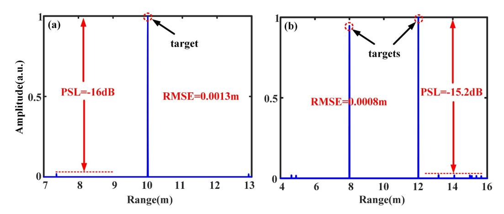

Figure 9 (Color online) Ranging results of (a) single target and (b) dual targets with the utilization of the TDS-SS algorithm.

setting the negative value positions to 0 in Rer(t).

Based on this operation principle, the proposed TDS-SS algorithm is outlined in Algorithm [1.](#page-8-0) In step 1, Rer(t) requires an extra delay of τ2. This is necessary because the sidelobes at a distance of τ2 from the targets may surpass those at τ0 and τ1, and delaying only τ0 and τ1 is insufficient to eliminate the sidelobes at τ2. Besides, the pulse deletion operation is performed in step 4. On the one hand, due to the low sampling rate, accurately shifting the main lobe to align with the sidelobe position through delay is challenging. Consequently, only a portion of the sidelobes is eliminated during the delay process, necessitating additional sidelobe elimination. On the other hand, this operation can further eliminate the impact of noise, resulting in cleaner detection results.

Figure [9](#page-8-1) shows the ranging results of single and dual targets post-application of the TDS-SS algorithm. At the same time, the root mean square error (RMSE) of the ranging results is calculated, and the formula is

RMSE = 
$$\sqrt{\frac{1}{N} \sum_{i=1}^{N} (\hat{x}_i - x_i)^2}$$
, (11)

where ˆxi and xi represent the detected position and ideal position of the i-th target, respectively, and N denotes the total number of targets. The position ˆxi is determined by comparing the peak value of the ranging result with a predefined threshold that is set to 0.1 here. Specifically, if the peak value of a position reaches or exceeds this threshold, a target is considered to be present at that position. As shown in Figure [9,](#page-8-1) the quantity of sidelobes is significantly reduced, resulting in cleaner results. The PSLs are reduced to approximately −16 and −15.2 dB, respectively. Additionally, the RMSEs are 0.0013 and 0.0008 m, respectively, indicating that the targets are successfully detected. To further demonstrate the effect of the algorithm on the suppression of sidelobes, Figure [10](#page-9-0) depicts the PSLs of the ranging results before and after algorithm implementation in a single-target scenario. As observed from the blue curve, the PSL is significantly reduced after using the TDS-SS algorithm, which indicates that the sidelobes are suppressed, thus demonstrating the effectiveness of the algorithm.

At the same time, the ranging resolution of this system is analyzed. The FWHM of the transmitted signal is approximately 0.058 ns, which corresponds to a theoretical ranging resolution of 0.009 m according to the formula ∆R = c × FWHM/2, where ∆R and c denote the ranging resolution and the light velocity in free space, respectively. To verify the ranging resolution of this system, Figure [11](#page-9-1) shows the ranging results for two pairs of targets: one with distances of 20 and 20.01 m, and the other with distances of 20 and 20.013 m, employing the TDS-SS algorithm in two distinct scenarios. When the difference in target distances is 0.01 m, the system encounters challenges in effectively distinguishing between the two targets. However, with a distance difference of 0.013 m, the system demonstrates the

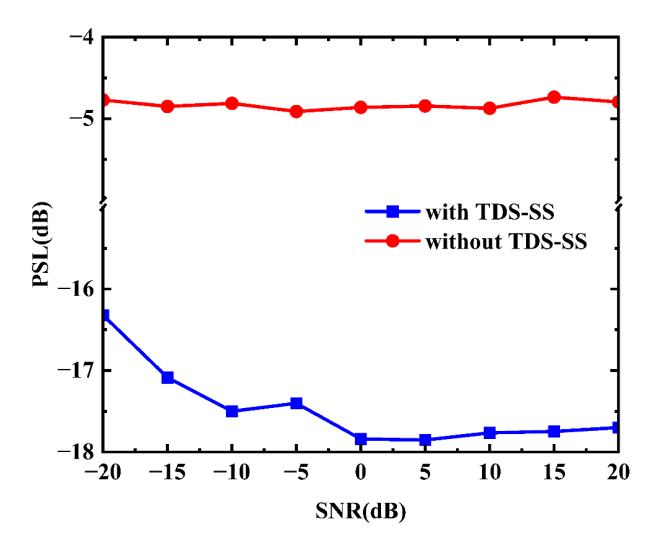

Figure 10 (Color online) PSL of single-target ranging with or without TDS-SS algorithm.

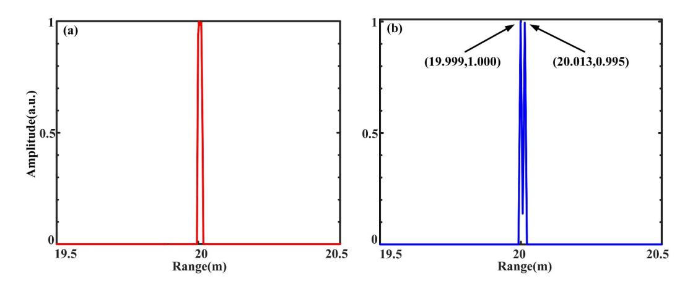

Figure 11 (Color online) Ranging results. (a) The positions of dual-target are 20 and 20.01 m; (b) the positions of dual-target are 20 and 20.013 m.

capability to discriminate between the targets. Nevertheless, the inherent limitation of the low sampling rate introduces deviations in the detected target positions. The simulation results are not much different from theoretical expectations, and the ranging resolution of the system is roughly 0.013 m.

## 3.4 Overall performance

Finally, the effect of data rate on both communication and ranging performance is discussed, where the system TDS is set to (0.5, 0.9) ns, and the signal bandwidth ranges from 1–10 GHz. Communication analysis focuses only on the AWGN channel, and the dual targets are randomly distributed in the range of 5–12 m. The simulation is repeated 1000 times, and the RMSE of the ranging is calculated. If the RMSE is less than 0.01, the ranging is successful. Figure [12](#page-10-10) shows the relationship between the BER and detection probability with respect to the SNR and data rate. Since the sidelobes in the ACF of the transmitted signal remain unchanged at different rates, the data rate has no significant impact on the radar detection performance. On the other hand, due to that the BPF at the receiver filters out most of the noise, only a small amount of noise is included in the echo signal, combined with the matched filtering effect of cross-correlation technique, which provides a largest output SNR, and consequently, the variation of SNR also does not show evident influence on the detection probability. Therefore, the detection probability remains at a relatively stable level in the vicinity of 0.97. Based on these results, in the proposed system, priority is given to communication performance, and the radar ranging function is realized under the premise of the system being able to achieve reliable communication. Indeed, the dual function of the system also has robust performance under low SNR, indicating that our system is

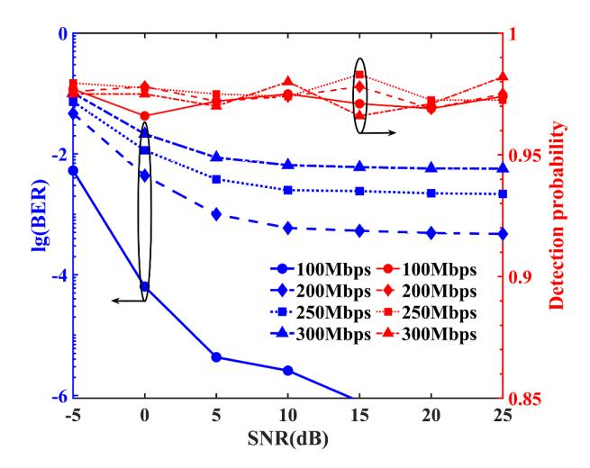

Figure 12 (Color online) Effect of data rate on communication and ranging performance.

noise-resistant. To summarize, the proposed scheme achieves communication rates of up to 250 Mbps while maintaining a detection probability of ranging above 0.95 in a dual-target scenario.

## 4 Conclusion

In summary, a novel DFRC system based on chaotic optoelectronic oscillators is proposed. The numerical simulations and discussion are conducted to evaluate the radar and communication performance of the system. The DFRC waveform is generated by encoding binary sequences with two different TDSs using the CSK technique. The results show that the proposed system achieves information transmission while the information can be completely hidden. However, this waveform will bring higher sidelobes caused by TDS when used for ranging. To enhance the performance of the ranging, the TDS-SS algorithm has been designed, and simulation results demonstrate the effectiveness of the algorithm in sidelobe suppression. Besides, under the TDS combination of (0.5, 0.9) ns and the signal bandwidth of 9 GHz, the proposed system is capable of achieving a communication rate of up to 250 Mbps and maintains a low BER even under low SNR conditions, which is of great interest for certain scenarios with severe electromagnetic interference. Additionally, the radar achieves a ranging resolution of 0.013 m and a detection probability of 0.95 in a dual-target scenario with the utilization of the TDS-SS algorithm. These results demonstrate the feasibility of using electro-optic chaos in the DFRC system, which paves a new way for the application of chaotic OEO in such systems.

Acknowledgements This work was supported in part by National Natural Science Foundation of China (Grant Nos. 62171087, 62475036).

## References

- 1 Liu F, Masouros C, Petropulu A P, et al. Joint radar and communication design: applications, state-of-the-art, and the road ahead. [IEEE Trans Commun,](https://doi.org/10.1109/TCOMM.2020.2973976) 2020, 68: 3834–3862
- 2 Wei Z, Qu H, Wang Y, et al. Integrated sensing and communication signals toward 5G-A and 6G: a survey. IEEE Internet Things J, 2023, 10: 11068–11092
- 3 Ya[ng J, Yu X X, Sha M H, et al. Signal design for MIMO dual-function systems with permutation learning.](https://doi.org/10.1007/s11432-022-3651-8) Sci China Inf Sci, 2023, 66: 202303
- 4 Zhou Z C, Li[u B, Shen B S, et al. Doppler-resilient waveform design in integrated MIMO radar-communication systems.](https://doi.org/10.1007/s11432-022-3733-2) Sci China Inf Sci, 2024, 67: 112301
- 5 Takahara H, Ohno K, Itami M. A study on UWB radar assisted by inter-vehicle communication for safety applications. In: Proceedings of the IEEE International Conference on Vehicular Electronics and Safety, Istanbul, 2012. 99–104
- 6 Winkler V, Detlefsen J. Automotive 24 GHz pulse radar extended by a DQPSK communication channel. In: Proceedings of the European Radar Conference, Munich, 2007. 138–141
- 7 Liang D, Chen Y. Photonics-enabled joint communication-radar system with improved detection performance and looser symbol length limitation based on resampling and phase compensation. [Opt Laser Tech,](https://doi.org/10.1016/j.optlastec.2023.109638) 2023, 165: 109638
- 8 Li X, Zhou Y, Wang G, et al. Photonic joint radar and communication system using a chirp-polarity coded LFM waveform. [Opt Commun,](https://doi.org/10.1016/j.optcom.2023.130091) 2024, 552: 130091
- 9 Chen Y, Liao G, Liu Y, et al. Joint subcarrier and power allocation for integrated OFDM waveform in radcom systems. [IEEE Commun Lett,](https://doi.org/10.1109/LCOMM.2022.3216865) 2023, 27: 253–257
- 10 Liu S W, Zhang Z H, Yu W X. Circulate shifted OFDM chirp waveform diversity design with digital beamforming for MIMO SAR. [Sci China Inf Sci,](https://doi.org/10.1007/s11432-016-9003-9) 2017, 60: 102307
- 11 Wu K, Zhang J A, Huang X, et al. OTFS-based joint communication and sensing for future industrial IoT. IEEE Int Things J, 2023, 10: 1973–1989

- 12 Feng Z, Fang Z, Wei Z, et al. Joint radar and communication: a survey. [China Commun,](https://doi.org/10.23919/JCC.2020.01.001) 2020, 17: 1–27
- 13 Pappu C S, Beal A N, Flores B C. Chaos based frequency modulation for joint monostatic and bistatic radar-communication systems. [Remote Sens,](https://doi.org/10.3390/rs13204113) 2021, 13: 4113
- 14 Zhao A, Jiang N, Liu S, et al. Wideband time delay signature-suppressed chaos generation using self-phase-modulated feedback semiconductor laser cascaded with dispersive component. [J Lightwave Technol,](https://doi.org/10.1109/JLT.2019.2929539) 2019, 37: 5132–5139
- 15 Huang Y, Gu S Q, Feng Y H, et al. Wideband chaos generation using a VCSEL with intensity modulation optical injection for random number generation. [Sci China Inf Sci,](https://doi.org/10.1007/s11432-023-4002-6) 2024, 67: 169401
- 16 Zhang L, Su L, Li S, et al. Regulation of cluster synchronization in multilayer networks of delay coupled semiconductor lasers with the use of disjoint layer symmetry. [Opt Express,](https://doi.org/10.1364/OE.502251) 2024, 32: 1123–1134
- 17 Wu R, Wang Z, Wang Z, et al. True random bit generator based on optoelectronic oscillator with randomly distributed feedback. [Opt Laser Tech,](https://doi.org/10.1016/j.optlastec.2024.111008) 2024, 176: 111008
- 18 Zhang [L, Li Z, Peng Y. A hidden grid multi-scroll chaotic system coined with two multi-stable memristors.](https://doi.org/10.1016/j.chaos.2024.115109) Chaos Solitons Fractals, 2024, 185: 115109
- 19 Wu X, Zhu B, Hu Y, et al. A novel colour image encryption scheme using rectangular transform-enhanced chaotic tent maps. [IEEE Access,](https://doi.org/10.1109/ACCESS.2017.2692043) 2017, 5: 6429–6436
- 20 Valle J, Machica[o J, Bruno O M. Chaotical PRNG based on composition of logistic and tent maps using deep-zoom.](https://doi.org/10.1016/j.chaos.2022.112296) Chaos Solitons Fractals, 2022, 161: 112296
- 21 Wang B J, Wang Y C, Kong L Q, et al. Multi-target real-time ranging with chaotic laser radar. [Chin Opt Lett,](https://doi.org/10.3788/COL20080611.0868) 2008, 6: 868–870
- 22 Lin F Y, Liu J M. Chaotic lidar. [IEEE J Sel Top Quantum Electron,](https://doi.org/10.1109/JSTQE.2004.835296) 2004, 10: 991–997
- 23 Ma H F, Kan H B. A new scheme of digital communication using chaotic signals in MIMO channels. [Sci China Inf Sci,](https://doi.org/10.1007/s11432-011-4352-2) 2012, 55: 2183–2193
- 24 Kaddoum G. Wireless chaos-based communication systems: a comprehensive survey. [IEEE Access,](https://doi.org/10.1109/ACCESS.2016.2572730) 2016, 4: 2621–2648
- 25 Zhong D, Chen Y, Xi J, et al. Experimental demonstration of omnidirectional multi-target ranging leveraging an asymmetric coupling semiconductor laser network. [Opt Laser Tech,](https://doi.org/10.1016/j.optlastec.2024.111251) 2024, 179: 111251
- 26 Li M J, Zhou X F, Wang F, et al. Research on chaotic secure optical communication system based on dispersion keying with time delay signatures concealment. [Chaos Solitons Fractals,](https://doi.org/10.1016/j.chaos.2024.114720) 2024, 182: 114720
- 27 Yang B, Sun J S, Chi H, et al. Joint radar and communication system based on a chaotic optoelectronic oscillator. Optics Commun, 2023, 554: 130123
- 28 Lavrov R, Peil M, Jacquot M, et al. Electro-optic delay oscillator with nonlocal nonlinearity: optical phase dynamics, chaos,
- and synchronization. [Phys Rev E,](https://doi.org/10.1103/PhysRevE.80.026207) 2009, 80: 026207 29 Lukashchuk A, Riemensberger J, Tusnin A, et al. Chaotic microcomb-based parallel ranging. [Nat Photon,](https://doi.org/10.1038/s41566-023-01246-5) 2023, 17: 814–821
- 30 Chen R, Shu H, Shen B, et al. Breaking the temporal and frequency congestion of LiDAR by parallel chaos. [Nat Photon,](https://doi.org/10.1038/s41566-023-01158-4) 2023, 17: 306–314
- 31 Xu Z, Tian H, Zhang L, et al. High-resolution radar ranging based on the ultra-wideband chaotic optoelectronic oscillator. [Opt Express,](https://doi.org/10.1364/OE.492329) 2023, 31: 22594–22602
- 32 Feng J, Jiang L, Yan L, et al. Modeling of a multi-parameter chaotic optoelectronic oscillator based on the Fourier neural operator. [Opt Express,](https://doi.org/10.1364/OE.474053) 2022, 30: 44798–44813
- 33 Feng C, Li S S, Li J, et al. Numerical and experimental investigation of a dispersive optoelectronic oscillator for chaotic time-delay signature suppression. [Opt Express,](https://doi.org/10.1364/OE.484659) 2023, 31: 13073–13083
- 34 Zhao A, Jiang N, Peng J, et al. Parallel generation of low-correlation wideband complex chaotic signals using CW laser and external-cavity laser with self-phase-modulated injection. [Opto-Electron Adv,](https://doi.org/10.29026/oea.2022.200026) 2022, 5: 200026
- 35 Li N Q, Pan W, Xiang S Y, et al. Quantifying the complexity of the chaotic intensity of an external-cavity semiconductor laser via sample entropy. IEEE J Quantum Electron, 2014, 50: 1–8
- 36 Li X F, Hao X J, Wang L D, et al. Research on in-band electromagnetic interference effect of communication system. In: Proceedings of the IEEE MTT-S International Microwave Workshop Series on Advanced Materials and Processes for RF and THz Applications, Chengdu, 2016. 1–4