# **Photonic-aided Doppler-robust ISAC system based on index modulation and chirp multiplexing**

**ZHOU YIXIAO, LI XUAN, \* ZHAO SHANGHONG, WANG GUODONG, WANG RUIQIONG, MENG QINGQING, XIE LINGRUI, QIN HAO, AND ZHU ZIHANG**

*College of Information and Navigation, Air Force Engineering University, Xi'an, Shaanxi 710003, China \* lixuanrch@163.com*

**Abstract:** Integrated sensing and communication (ISAC) is considered to be a pivotal trend in the development of the low-Earth-orbit (LEO) satellite networks. The previous demonstrations have faced challenges in accommodating significant Doppler frequency shifts of high-mobility environments. Therefore, in this work, a photonic-aided Doppler robust ISAC system is proposed and demonstrated. A chirp-multiplexed and index modulated linearly frequency modulated (IM-LFM) waveform is designed and generated by a dual polarization up-converter, which consists of a dual-wavelength laser, a circulator, a fiber Bragg grating (FBG), a dual parallel quadrature phase shift keying modulator (DP-QPSKM), a polarization beam splitter, and two high-speed photodetectors. A photonic dual polarization radar receiver is designed for dual channel de-chirp processing, while the communication reception and demodulation are implemented through down conversion and FFT operation. A 16.3-17.826 GHz IM-LFM waveform is experimentally generated and demonstrated for ISAC purposes. The sensing range resolution is better than 0.146 meters with a probability larger than 86%, and a 29.99-Mbps rate communication is achieved with a 500 kHz Doppler frequency shift. This scheme is particularly suitable for high-mobility ISAC applications.

© 2025 Optica Publishing Group under the terms of the [Optica Open Access Publishing Agreement](https://doi.org/10.1364/OA_License_v2#VOR-OA)

# **1. Introduction**

Integrated sensing and communication (ISAC) technology significantly enhances the efficiency of spectrum, energy, and hardware resources, thereby providing substantial performance gains for various wireless systems. This advancement addresses the demands for extensive connectivity and high-precision sensing in the next-generation wireless networks [\[1–](#page-21-0)[3\]](#page-21-1). As a critical component of these networks, low-Earth-orbit (LEO) satellite networks offer broad coverage and low communication latency [\[4\]](#page-21-2). The deployment of the ISAC on the LEO platforms enables allweather remote sensing capabilities alongside wide-area communication services, effectively conserving valuable resources such as payload capacity, orbital slots, and spectral bandwidth [\[5\]](#page-21-3), [\[6\]](#page-21-4). To attain superior sensing and communication performance, high frequency bands such as Ku, Ka, Q and V bands have been widely employed in the satellite-based systems [\[7\]](#page-21-5). However, the ISAC systems based on the traditional radio frequency (RF) architectures face critical limitations, including constrained spectral resources, elevated hardware costs, complex cross-domain interference management, and severe Doppler frequency shift which caused by the high velocities of the satellites.

In contrast, the photonic technology offers extensive operational bandwidth, reduced transmission loss, enhanced flexibility, and immunity to electromagnetic interference. Thus, it has been considered as an ideal solution to improve the ISAC system performance [\[8\]](#page-21-6), [\[9\]](#page-21-7). Recent advancements of the photonic-aided ISAC systems can be divided into two different types. The first one employs photonic architectures with multiplexing technique to integrate the two

#564416 https://doi.org/10.1364/OE.564416

functions in the high frequency band [\[10](#page-21-8)[–13\]](#page-21-9). In [\[11\]](#page-21-10), the frequency-division multiplexing based LFM signal and QPSK signal are up-converted to W-band via optical heterodyne mixing. In [\[13\]](#page-21-9), Terahertz band time division multiplexed LFM signal and 128QAM signal are obtained. These approaches can achieve tens of Gbps data rate and sub-centimeter range resolution. Despite the ease of implementation, these multiplexing-based schemes have lower efficiency of resource utilization. On the other hand, the second type employs photonic architectures with waveform sharing technique, which facilitates sensing and communication within the same time, frequency, as well as enhances the resource utilization efficiency and the integrated system gain [\[14\]](#page-21-11). In this type, OFDM-based or LFM-based shared waveforms are predominantly designed depending on the priority of the ISAC system and then frequency-converted through photonic technology. In [\[15\]](#page-21-12), an OFDM-based waveform is up-converted by using an optical-electrical oscillator (OEO) to simultaneously achieve communication with bit rate of 6.4 Gbps and sensing with range resolution of 7.5 cm. Furthermore, to reduce receiver complexity and improve overall performance, advanced approaches have been developed, incorporating photonic-assisted analog-to-digital conversion (ADC) [\[16\]](#page-21-13), self-coherence mechanisms [\[17\]](#page-21-14), and carrier recovery algorithms [\[18\]](#page-21-15). However, the OFDM-based waveform suffers high peak-to-average ratio (PAPR) and limited Doppler tolerance, which may hinder the application for moving targets detection. In sensing-centric photonic-aided ISAC systems, the LFM waveform serves as the carrier, while the communication data is carried by modulating the amplitude, frequency or phase of the carrier [\[19–](#page-21-16)[23\]](#page-22-0). By employing intra-pulse coding, these systems can achieve data rates exceeding 10 Gbps and range resolutions at the centimeter level [\[22\]](#page-21-17). Nevertheless, high-speed communication modulation will degrade the performance of the sensing function. To reduce this impact, a DC component is added to the communication symbols, nevertheless, this approach restricts the communication range. In [\[24\]](#page-22-1), a photonic-aided ISAC scheme combining OFDM and LFM waveforms is proposed and demonstrated a data rate of 8 Gbps and a range resolution of 1.5 cm. This method provides constant envelope and offers high communication capacity. However, the communication demodulation is highly sensitive to phase variations. The aforementioned approaches are primarily designed for mobile communication scenarios with favorable channel conditions and low-speed mobility, such as vehicular networks. However, platforms like LEO satellites with dynamic Doppler shifts as large as hundreds of kilohertz have not been considered [\[25\]](#page-22-2). This condition will take substantial challenges for the ISAC system.

Long range (LoRa) waveform is a frequency circular shift form of the LFM signal. The waveform can provide high spreading gain and Doppler tolerance, making it a promising choice for Internet of Things (IoT) applications within the LEO satellite systems [\[26](#page-22-3)[,27,](#page-22-4)[28\]](#page-22-5). However, the communication data rate remains a significant limitation of the LoRa system. Index modulation can be used to improve the communication efficiency by offering extra levels for modulation [\[29\]](#page-22-6). Currently, LoRa-based waveforms are primarily designed for communication purpose, employing techniques like interleaving and folding to improve efficiency. However, these operations disrupt the internal structure of LFM pulses, limiting their performance in radar applications. In this paper, the index-modulation and LoRa waveforms are comprehensively considered to design an IM-LFM waveform for ISAC purpose, where the slope and circular shift of the LFM waveform are used as indexes to load communication information without changing the internal structure of LFM pulses. Furthermore, a photonic-aided Doppler-robust ISAC system is proposed. A photonic polarization multiplexed up-converter, a coherent chirp multiplexed radar receiver and a communication receiver are constructed to perform Ku band chirp multiplexed IM-LFM signal generation, dual channel de-chirp operation and communication information recovery. The system is experimentally demonstrated. A 16.3-17.826 GHz chirp multiplexed LFM waveform is generated and processed to pursuit ISAC purpose. For the sensing function, a range resolution superior to 0.146 meter is achieved with a probability larger than 80%. For back-to-back communication, a data rate of 29.99 Mbps is demonstrated with a Doppler frequency up to 500

kHz, the bit error rate (BER) is maintained below the 7% pre-forward error correction (pre-FEC) threshold, confirming the robustness of the system under significant Doppler effects.

# **2. Principle**

# *2.1. Index modulated and chirp multiplexed ISAC waveform*

We design an IM-LFM shared waveform to pursuit ISAC purpose, furthermore, we employ chirp multiplexing to enhance the system performance. As shown in Fig. [1,](#page-2-0) both the slope and the circular shift of an LFM pulse serve as the indexes to modulate the communication data. The complex form of an up-chirped LFM pulse is given by

$$c_i(t) = e^{j2\pi(f_0t + \frac{1}{2}k_it^2)}, t \in [0, T], i \in \{1, 2, \dots, K\}$$
(1)

where *f* 0, *ki* and *T* are the initial frequency, slope and the duration of the LFM pulse, *i* denotes the index of the slope, and *K* is a total number of the slopes. Moreover, *ki* can be further expressed as

$$k_i = \frac{B_{\min} + (i-1)\Delta B}{T} \tag{2}$$

where *B*min and ∆*B* are even integers, which represent the minimum bandwidth and the minimum bandwidth interval of the LFM pulses with varying slopes. As the slope is insensitive to the Doppler frequency shift, the slope modulation can provide good Doppler robustness.

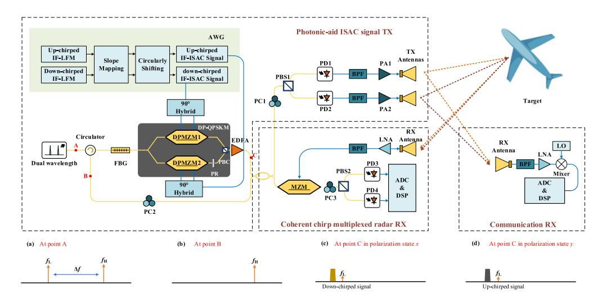

**Fig. 1.** Schematic diagram of the proposed photonic-aided ISAC system based on index modulation and chirp multiplexing. AWG, arbitrary waveform generator; FBG, fiber Bragg grating; EDFA, erbium-doped fiber amplifier; DP-QPSKM, dual parallel quadrature phase shift keying modulator; DPMZM, dual parallel Mach-Zehnder modulator; PR, polarization rotator; PBC, polarization beam combiner; PBS polarization beam splitter; OC, optical coupler; PD, photodetector; BPF, band-pass filter; PA, power amplifier; MZM, Mach-Zehnder modulator; PC, polarization controller; LNA, low noise amplifier; ADC, analog to digital converter; DSP, digital signal processing; LO, local oscillator;

The circular shift modulation is equivalent to frequency shift keying modulation of the LFM waveform without occupying extra bandwidth [\[30\]](#page-22-7). An LFM pulse with a circular shift *t*0 is

given by

$$\begin{cases} c_i(t+t_0), t \in [0, T-t_0) \\ c_i(t-T+t_0), t \in [T-t_0, T] \end{cases}$$
(3)

Assuming that the discrete form of  $c_i(t)$  is  $x_i(n)$  when the sample rate is  $f_s$ , then the discrete form of (3) can be written as

$$\begin{cases} x_{i}(n+m), n \in [0, f_{s}T - m) \\ x_{i}(n-f_{s}T+m), n \in [f_{s}T - m, f_{s}T] \end{cases} \\ = \begin{cases} \exp\left(j\pi(2f_{0}\frac{n+m}{f_{s}} + k_{i}(\frac{n+m}{f_{s}})^{2})\right), n \in [0, f_{s}T - m) \\ \exp\left(j\pi(2f_{0}(\frac{n+m}{f_{s}} - T) + k_{i}(\frac{n+m}{f_{s}} - T)^{2})\right), n \in [f_{s}T - m, f_{s}T] \end{cases} \\ = \begin{cases} \exp\left(j\pi(2(f_{0} + \frac{k_{i}m}{f_{s}}))\frac{n}{f_{s}} + k_{i}(\frac{n}{f_{s}})^{2}\right) \\ \exp\left(j\pi(2f_{0}m + k_{i}(\frac{m}{f_{s}})^{2})\right), n \in [0, f_{s}T - m) \\ \exp\left(j\pi(2(f_{0} + \frac{k_{i}m}{f_{s}} - k_{i}T))\frac{n}{f_{s}} + k_{i}(\frac{n}{f_{s}})^{2}\right) \\ \exp\left(j\pi(2(f_{0} - k_{i}\frac{T}{f_{s}})m + k_{i}(\frac{m}{f_{s}})^{2} + k_{i}T^{2})\right), n \in [f_{s}T - m, f_{s}T] \end{cases}$$

$$m \in \{1, 2, 3, \dots, f_{s}T\} \text{ and } m/f_{s} = t_{0} \text{ is satisfied. It should be noted that both } f_{s} \text{ and } f_{s}T - f_{s}T \text{ and } f_{s}T - f_{s}T \text{ and } f_{s}T - f_{s}T \text{ and } f_{s}T - f_{s}T \text{ and } f_{s}T - f_{s}T \text{ and } f_{s}T - f_{s}T \text{ and } f_{s}T - f_{s}T \text{ and } f_{s}T - f_{s}T \text{ and } f_{s}T - f_{s}T \text{ and } f_{s}T - f_{s}T \text{ and } f_{s}T - f_{s}T \text{ and } f_{s}T - f_{s}T \text{ and } f_{s}T - f_{s}T \text{ and } f_{s}T - f_{s}T \text{ and } f_{s}T - f_{s}T \text{ and } f_{s}T - f_{s}T \text{ and } f_{s}T - f_{s}T \text{ and } f_{s}T - f_{s}T \text{ and } f_{s}T - f_{s}T \text{ and } f_{s}T - f_{s}T \text{ and } f_{s}T - f_{s}T \text{ and } f_{s}T - f_{s}T \text{ and } f_{s}T - f_{s}T - f_{s}T \text{ and } f_{s}T - f_{s}T \text{ and } f_{s}T - f_{s}T \text{ and } f_{s}T - f_{s}T \text{ and } f_{s}T - f_{s}T \text{ and } f_{s}T - f_{s}T \text{ and } f_{s}T - f_{s}T \text{ and } f_{s}T - f_{s}T \text{ and } f_{s}T - f_{s}T \text{ and } f_{s}T - f_{s}T \text{ and } f_{s}T - f_{s}T \text{ and } f_{s}T - f_{s}T \text{ and } f_{s}T - f_{s}T \text{ and } f_{s}T - f_{s}T \text{ and } f_{s}T - f_{s}T \text{ and } f_{s}T - f_{s}T - f_{s}T \text{ and } f_{s}T - f_{s}T \text{ and } f_{s}T - f_{s}T \text{ and } f_{s}T - f_{s}T \text{ and } f_{s}T - f_{s}T \text{ and } f_{s}T - f_{s}T \text{ and } f_{s}T - f_{s}T \text{ and } f_{s}T - f_{s}T \text{ and } f_{s}T - f_{s}T \text{ and } f_{s}T - f_{s}T \text{ and } f_{s}T - f_{s}T \text{ and } f_{s}T - f_{s}T \text{ and } f_{s}T - f_{s}T \text{ and } f_{s}T - f_{s}T \text{ and } f_{s}T - f_{s}T \text{ and } f_{s}T - f_{s}T$$

where n and  $m \in \{1,2,3,\ldots,f_sT\}$ , and  $m/f_s = t_0$  is satisfied. It should be noted that both  $f_s$  and  $f_sT$  are even integer. If the sample rate is exactly equal to the bandwidth of the LFM pulse, i.e.,  $f_s = k_iT$ , then (4) can be rewritten as

$$\begin{cases} x_{i}(n+m), n \in [0, m) \\ x_{i}(n-T+m), n \in [m, f_{s}T] \end{cases}$$

$$= \begin{cases} \exp\left(j\pi(2(f_{0} + \frac{m}{T}))\frac{n}{f_{s}} + k_{i}(\frac{n}{f_{s}})^{2}\right)\right) \\ \times \exp\left(j\pi(2f_{0}m + k_{i}(\frac{n}{f_{s}})^{2})\right), n \in [0, f_{s}T - m) \end{cases}$$

$$= \begin{cases} \exp\left(j\pi(2(f_{0} + \frac{m}{T}))\frac{n}{f_{s}} + k_{i}(\frac{n}{f_{s}})^{2}\right)\right) \\ \times \exp\left(j\pi(2f_{0}m + k_{i}(\frac{n}{f_{s}})^{2})\right) \\ \times \exp\left(j\pi(2f_{0}m + k_{i}(\frac{n}{f_{s}})^{2})\right) \\ \times \exp(-j\pi(2n + 2m - f_{s}T)), n \in [f_{s}T - m, f_{s}T] \end{cases}$$

$$= x_{i}(n + m), n \in [0, f_{s}T]$$

$$(5)$$

As can be observed in (5), the LFM pulse is circular shifted by m can be considered as an LFM pulse with an initial frequency of  $f_0 + m/T$  in the digital domain. Compared to the frequency shift keying modulation of the LFM signal, the circular shift modulation occupies a constant bandwidth, thus offering better bandwidth efficiency.

Let's define the positive integers p and q as the circular shift index and the minimum shift, and  $f_s T/q = L$  (L is a positive integer). Then, the index modulated LFM pulse can be expressed as

$$x_i(n+pq), n \in [0, f_sT], p \in \{0, 1, \dots, L-1\}$$
 (6)

According to (5) and (6), the minimum frequency shift caused by circular shift  $\Delta F$  can be defined as q/T. For the LFM pulse with a slope of  $k_i$ , the number of the available circular shift indexes  $L_i$  is given by

$$L_i = \frac{B_{\min} + (i-1)\Delta B}{\Delta F} \tag{7}$$

Note that  $L_i$  should be an integer, therefore,  $\Delta B$  should be an integer which is multiple of the minimum frequency interval  $\Delta F$ . Since K slopes are available, the maximum communication

data rate of the IM-LFM signal is expressed as

$$R = PRF \cdot \log_2(\sum_{i}^{K} L_i)$$

$$= PRF \cdot \begin{bmatrix} (\log_2 K + \log_2(B_{\min} + \frac{1}{2}(K - 1) \cdot \Delta B)) \\ -\log_2 \Delta F \end{bmatrix}$$
(8)

Additionally, as shown in Fig. 1, by employing chirp multiplexing, the index modulation can also be applied to down-chirp LFM pulses with initial frequency of  $f_0 + B_{\text{max}}$ , where  $B_{\text{max}}$  represents the maximum bandwidth of the LFM pulses. As a result, the communication rate can be improved twice without occupying extra spectrum.

Table 1 presents a comparison between several typical LFM-based ISAC waveforms, LoRa waveforms, and the IM-LFM waveform proposed in this study. B and T denote the bandwidth and time duration of the LFM carrier in these waveforms, respectively, while  $B_{\rm A}$  represents the frequency bandwidth of the IM-LFM waveform. All these signals maintain a duty cycle of 1. Compared with PSK-LFM, QAM-LFM, and CE-OFDM-LFM, the IM-LFM signal, based on LoRa modulation, sacrifices some spectral efficiency but achieves spreading gain and excellent Doppler tolerance, making it more suitable for long-range and high-dynamic scenarios. Unlike most LoRa-based waveforms, IM-LFM significantly improves spectral efficiency while maintaining compatibility with ISAC applications. Although foled chirp rate shift keying (FCrSK)-LoRa waveforms also employ slope index to enhance spectral efficiency, their use of a uniform bandwidth causes spectral aliasing in high-slope signals, rendering them unsuitable for target detection.

Table 1. Comparison on waveform characteristics

| Waveform                 | Maximum spetral efficiency (bps/Hz)       | Doppler tolerance | Spreading Gain Enabled | ISAC feasibility |
|--------------------------|-------------------------------------------------|----------------------|------------------------------|---------------------|
| PSK-LFM [20–22]       | $\log_2 M$                                      | Bad                  | No                           | Good                |
| QAM-LFM [23]          | $\log_2 M$                                      | Bad                  | No                           | Good                |
| CE-OFDM- LFM [24]  | $\log_2 M$                                      | Bad                  | No                           | Good                |
| Basic-LoRa [26]          | log 2 BT/BT                          | Good                 | Yes                          | Good                |
| SSK-LoRa [30]         | $(\log_2 BT + 1)/BT$                            | Good                 | Yes                          | Good                |
| ICS-LoRa [31]         | $(\log_2 BT + \log_2 3 + 3)/BT$                 | Good                 | Yes                          | Bad                 |
| SSK-ICS- LoRa [32] | $(\log_2 BT + \log_2 3 + 4)/BT$                 | Good                 | Yes                          | Bad                 |
| FCrSK- LoRa [33]   | $\frac{(\log_2 BT + \log_2}{K)/BT}$             | Good                 | Yes                          | Bad                 |
| IM-LFM                   | $(\log_2 B_{\rm A}T + \log_2 K + 1)/B_{\rm A}T$ | Good                 | Yes                          | Good                |
| (This work)              |                                                 |                      |                              |                     |

# *2.2. IF-ISAC waveform generation*

It should be noted that, *f* s = *kiT* is is fundamental to establishing the equivalence between circular shift modulation and frequency shift modulation of the IM-LFM signal. Though this condition can be satified in the receiving end through flexible resampling. But for the transmitting end, a unified sampling rate is needed to obtain the discrete form of the signal. The generation process of the IM-LFM signal is introduced as below.

Taking the up-chirped signal as an example. Firstly, the communication symbol is mapped to index *i* and *p*. Subsequently, a dicrete sequence of the LFM signal *yu*−*i*(*n*), n = 1,2, . . . *fstT*, which has a slope is generated. Under the sampling rate *kiT*, the circular shift should be *pq*. When employing a unified sampling rate *fst*, the required shift become round(*fstpq*/*kiT*), where round(·) denotes the function to get the nearest integer. Although this introduces quantization errors, their impact is negligible.. Then the decrete form of the IM-LFM signal can be given by

$$y_{IM}(n) = \begin{cases} y_{u-i}(n + \text{round}(f_{st}pq/k_iT)), n \in [0, \text{round}(f_{st}pq/k_iT)) \\ y_{u-i}(n - T + \text{round}(f_{st}pq/k_iT)), n \in [\text{round}(f_{st}pq/k_iT), f_sT] \end{cases}$$
(9)

This signal is subsequently up-converted to the intermediate (IF), yielding the IF signal exp(*j*2π*f* IF*n*/ *fst*)·*y*IM(*n*). The obtained descrete IF signal is loaded to an arbitrary waveform generator (AWG) to perform digital-to-analog conversion. Assume that the analog form of the descrete IF up-chirped signal is *s*up(*t*), then the up-chirped IF-ISAC signal output by the AWG can be expressed as

$$\frac{s_{up}(t) + \overline{s_{up}(t)}}{2} \tag{10}$$

where (·) denotes conjugation.

Similarly, the down-chirped IF-ISAC signal (*s*down(*t*) + *s*down(*t*))/2 can also generated by the AWG. The obtained waveform is sent into the photonic-aided ISAC transmitter to perform frequency up-conversion to higher frequency band.

# *2.3. Photonic-aided ISAC transceiver*

Figure [1](#page-2-0) presents the schematic diagram of the proposed photonic-aided ISAC transceiver. In the transceiver, a photonic dual polarization frequency up-converter is established to generate the chirp-multiplexed index modulated ISAC signal. The key contribution of the dual polarization design lies in its ability to generate up-chirped and down-chirped ISAC signals independently. This prevents the signals from combining and creating large envelope variations, which can cause nonlinear distortion in power amplifier of the transmitter. The converter consists of a dual-wavelength laser source, a circulator, a fiber Bragg gratting (FBG), a dual parallel quadrature phase shift keying modulator (DP-QPSKM), a polarization beam splitter (PBS1), and two high-speed photodetectors (PD1 and PD2). The dual-wavelength signal output from the laser has a frequency interval of ∆*f*, as shown in Fig. [1\(](#page-2-0)a), then, the dual wavelengths are separated by the circulator and the FBG. The separated single-tone optical signal with the lower frequency is applied to the DP-QPSKM. The down-chirped IF-ISAC signal is divided into two parts by a 90° hybrid and then modulated to the upper QPSKM. Similarly, the up-chirped IF-ISAC signal is modulated to the bottom QPSKM. Both QPSKMs are performing lower single sideband (LSSB) modulation to generate -1st order sidebands of the IF-ISAC signals, as shown in Fig. [1\(](#page-2-0)c) and (d). This can be realized by biasing the sub-modulators of the QPSKMs at minimum transmission point (MITP) and the main bias at quadrature transmission point (QTP). Thus, the optical signal

at the output of the DP-QPSKM can be expressed as

$$\begin{bmatrix} E_{c-x}(t) \\ E_{c-y}(t) \end{bmatrix} \propto E_{in} J_1(\alpha) \exp(2\pi f_L t) \begin{bmatrix} \overline{s_{down}(t)} \\ \overline{s_{up}(t)} \end{bmatrix}$$
(11)

where  $E_{in}$  and  $f_L$  are the amplitude and frequency of the optical carrier for the DP-QPSKM,  $s_{down}(t)$  and  $s_{up}(t)$  are the complex form of the down-chirped and up-chirped IF-ISAC signals,  $J_n(\cdot)$  denotes the n-th order Bessel function of the first kind, and  $\alpha$  is the modulation index of each QPSKM,  $\overline{(\cdot)}$  denotes conjugation. At point B as shown in Fig. 1, the polarization state of the separated wavelength with a frequency of  $f_H$  is adjusted by a PC to form a 45° angle with the polarization state x. Then, the optical signals of the two brunches are coupled by a 2×2 optical coupler (OC). The output of the OC can be given by

$$\begin{bmatrix} E_{OC-x}(t) \\ E_{OC-y}(t) \end{bmatrix} \propto E_{in} \begin{pmatrix} J_1(\alpha) \exp(2\pi f_L t) \begin{bmatrix} \overline{s_{down}(t)} \\ \overline{s_{up}(t)} \end{bmatrix} \\ + \frac{\sqrt{2}}{2} \begin{bmatrix} \exp(2\pi f_H t) \\ \exp(2\pi f_H t) \end{bmatrix} \end{pmatrix}$$
(12)

After optical to electrical conversion, the obtained photo-currents in PD1 and PD2 can be given by

$$\begin{bmatrix} I_{PD1}(t) \\ I_{PD2}(t) \end{bmatrix} \propto \eta(\sqrt{2} + J_1(\alpha))$$

$$\cdot \text{Re} \left\{ \begin{bmatrix} \exp(2\pi\Delta f t) \cdot s_{down}(t) \\ \exp(2\pi\Delta f t) \cdot s_{up}(t) \end{bmatrix} \right\}$$
(13)

where  $\eta$  is the responsivity of the PDs, Re $\{\cdot\}$  represents the real part of a complex signal. Therefore, the chirp multiplexed IM-LFM signal up-converted by  $\Delta f$  is successfully generated.

The optical signal output by the OC can also serve as reference optical carrier to perform coherent de-chirp processing. In the coherent chirp multiplexed radar receiver, the echo signals are sent into the MZM after band-pass filtering and amplification. Assume that  $s_{\text{down}}(t)$  and  $s_{\text{up}}(t)$  can be expressed as

$$s_{down}(t) = \begin{cases} \exp\left(j\pi \begin{bmatrix} 2(f_0 + B_{max})(t + t_{down}) \\ -k_{down}(t + t_{down})^2 \end{bmatrix} \right) \\ t \in [0, T - t_{down}) \\ \exp\left(j\pi \begin{bmatrix} 2(f_0 + B_{max})(t + t_{down} - T) \\ -k_{down}(t + t_{down} - T)^2 \end{bmatrix} \right) \\ t \in [T - t_{down}, T] \\ s_{up}(t) = \begin{cases} \exp\left(j\pi \begin{bmatrix} 2f_0(t + t_{up}) \\ +k_{up}(t + t_{up})^2 \end{bmatrix} \right), t \in [0, T - t_{up}) \\ \exp\left(j\pi \begin{bmatrix} 2f_0(t + t_{up} - T) \\ +k_{up}(t + t_{up} - T)^2 \end{bmatrix} \right), t \in [T - t_{up}, T] \end{cases}$$

where  $k_{\rm up}$ ,  $k_{\rm down}$ ,  $t_{\rm up}$  and  $t_{\rm down}$  are the slopes and the circular time shifts of  $s_{\rm down}(t)$  and  $s_{\rm up}(t)$ . Then, the down-chirped and up-chirped components in the echoes are given by

$$\begin{bmatrix} Ec_{down}(t) \\ Ec_{up}(t) \end{bmatrix} = \begin{cases} 0, t \in [0, \tau) \\ Re(\exp(2\pi\Delta f t)) \begin{bmatrix} s_{down}(t - \tau) \\ s_{up}(t - \tau) \end{bmatrix}, t \in [\tau, T] \end{cases}$$
(15)

in which  $\tau$  is the round-trip delay of the echo signals. The MZM is working at the quadrature transmission point (QTP) to obtain  $\pm 1$ st order sidebands. PBS2 are utilized to separate the down-chirped and up-chirped optical reference signals. The separated signals are injected to the low-speed PDs (PD3 and PD4) to perform optical de-chirp operation. The output of PD3 and PD4 can be expressed as

$$i_{PD3}(t) \propto \begin{cases} \cos \left( \frac{2\pi k_{down} \tau t - \pi k_{down} \tau^{2}}{-2\pi (f_{0} + B_{\max} - k_{down} t_{down}) \tau} \right) \\ t \in [\tau, T - t_{down}) \cup [\tau + T - t_{down}, T] \\ \cos \left( \frac{2\pi k_{down} (\tau - T) t + \pi k_{down} (T^{2} - \tau^{2})}{-2\pi (f_{0} + B_{\max} - k_{down} t_{down}) (\tau - T)} \right) \\ t \in [T - t_{down}, \tau + T - t_{down}) \\ \cos \left( \frac{2\pi k_{up} \tau t - \pi k_{up} \tau^{2}}{+2\pi (f_{0} + k_{up} t_{up}) \tau} \right) \\ t \in [\tau, T - t_{up}) \cup [\tau + T - t_{up}, T] \\ \cos \left( \frac{2\pi k_{up} (\tau - T) t + \pi k_{up} (T^{2} - \tau^{2})}{+2\pi (f_{0} + k_{up} t_{up}) (\tau - T)} \right) \\ t \in [T - t_{up}, \tau + T - t_{up}) \end{cases}$$

$$(16)$$

Note that the power spectral density of the cross-mixed signal which is obtained by mixing the up-chirped and down-chirped components is much lower than that of the de-chirped signal, therefore, they can be neglected. From (13), it is clear that the de-chirped signal of the circular shifted LFM pulse contains two frequency components. According to section A, if the outputs of PD3 and PD4 are down-sampled at rates of  $k_{\text{down}}T$  and  $k_{\text{up}}T$  respectively, then (13) can be rewritten as

$$i_{PD3}(n_{down}) \propto \cos \begin{pmatrix} 2\pi k_{down} \tau \frac{n_{down}}{k_{down}T} - \pi k_{down} \tau^{2} \\ -2\pi (f_{0} + B_{\max} - k_{down}t_{down})\tau \end{pmatrix}$$

$$, n_{down} \in \{ \operatorname{round}(k_{down}T \cdot \tau), \dots, k_{down}T^{2} \}$$

$$i_{PD4}(n_{up}) \propto \cos \begin{pmatrix} 2\pi k_{up} \tau \frac{n_{up}}{k_{up}T} - \pi k_{up} \tau^{2} \\ +2\pi (f_{0} + k_{up}t_{up})\tau \end{pmatrix}$$

$$, n_{up} \in \{ \operatorname{round}(k_{up}T \cdot \tau), \dots, k_{up}T^{2} \}$$

$$(17)$$

Thus, by applying fast Fourier transform (FFT) to the down-sampled signals, the range profiles of the detected targets can be obtained.

In the communication receiver, the ISAC signals are captured, band-pass filtered, amplified and down-converted by a receiving antenna, a BPF, a low noise amplifier (LNA) and a mixer. After that, the obtained IF signals are digitized by an analog-to-digital converter (ADC) to demodulate the communication data in the digital domain. The demodulation method is further introduced in the next section.

### 2.4. Communication demodulation method

Figure 2 illustrates the demodulation method to recover the communication symbols. Assume that the slope index and the circular shift index of the received up-chirped IF-ISAC signal are denoted by i and p, respectively. The sampled signal is firstly IQ down-converted to the base band. To recover the slope index, de-chirp operation with different slopes is performed. Thus, the obtained signal can be given as

$$s_{dc}(n) = \begin{cases} \beta \exp\left(j\pi(2k_{i}\frac{pq}{f_{s}^{2}}n + (k_{i} - k_{r})\frac{n^{2}}{f_{s}^{2}})\right) \\ \cdot \exp\left(j\pi(2f_{0}\frac{pq}{f_{s}} + k_{i}\frac{p^{2}q^{2}}{f_{s}^{2}})\right) \\ , n \in [0, f_{s}T - pq) \\ \beta \exp\left(j\pi(2k_{i}(\frac{pq}{f_{s}^{2}} - \frac{T}{f_{s}})n + (k_{i} - k_{r})\frac{n^{2}}{f_{s}^{2}})\right) \\ \cdot \exp\left(j\pi(2f_{0}\frac{pq}{f_{s}} - k_{i}(2\frac{pq}{f_{s}}T - \frac{p^{2}q^{2}}{f_{s}^{2}} - T^{2}))\right) \\ , n \in [f_{s}T - pq, f_{s}T] \end{cases}$$
(18)

where  $k_r$  is the slope of the local signal utilized to perform the de-chirp operation, and  $\beta$  denotes the amplitude of the de-chirped signal. As illustrated in (16), when the slopes are matched, i.e., i = r, a single- or dual-tone signal can be obtained. In the case of a slope mismatch, i.e.,  $i \neq r$ , the de-chirped signal comprises two LFM signals with different carrier frequencies.

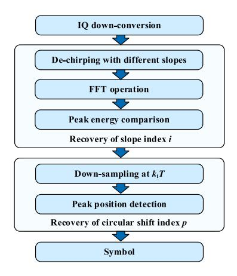

Fig. 2. The schematic diagram of the communication demodulation method.

As an example, Fig. 3 gives the normalized spectra of the de-chirped signals with their slope matched (red) and mismatched (blue). It is evident that when the slope of the local signal matches that of the received signal, the peak value of the de-chirped spectrum is significantly higher compared to that of the mismatched situation. Consequently, the slope index of the received signal can be accurately recovered by performing FFT and peak comparison to the de-chirped signals.

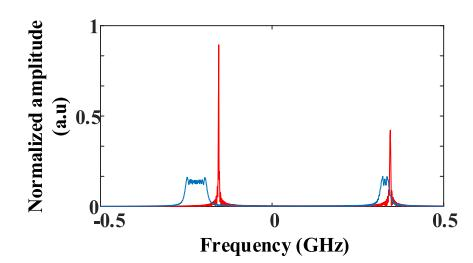

**Fig. 3.** The spectra of the slope matched (red) and slope mismatched (blue) de-chirped signal.

Once the slope index *i* is determined, the de-chirped signal with a matched slope can be obtained. By down-sampling this signal at a rate of *kiT*, the resultant signal can be expressed as

$$s_{down-dc}(n) = \beta \exp\left(j\pi \left(2\frac{pq}{k_i T^2}n + (k_i - k_r)\frac{n^2}{k_i^2 T^2}\right)\right) \cdot \exp\left(j\pi \left(2f_0\frac{pq}{k_i T} + \frac{p^2 q^2}{k_i T^2}\right)\right), n \in [0, k_i T^2]$$
(19)

As evident from (19), the circular shift index *p* is linearly related to the frequency of the down-sampled signal. Consequently, the index *p* can be determined by conducting peak position detection on the spectrum of the signal. Finally, according to the slope index *i* and circular shift index *p*, the corresponding communication symbol can be recovered.

### **3. Numerous results of waveform performance**

To investigate the performance of the designed IM-LFM waveform, we conduct the numerical simulation to estimate the communication BER under strong Doppler frequency shift. A comparison is made with three typical types of sensing-centric ISAC waveforms used in photonicaided ISAC systems, i.e. PSK-LFM [\[22\]](#page-21-17), CE-OFDM-LFM [\[24\]](#page-22-1), QAM-LFM waveforms [\[23\]](#page-22-0), to demonstrate the superiority of the proposed waveform. The trade-off between sensing and communication functions are also studied. By leveraging the quasi-orthogonality of LFM signals with different slopes, the maximum unambiguous range (MUR) of the proposed ISAC system can be increased without reducing the pulse repetition frequency (PRF). This approach alleviates the trade-off between communication rate and maximum unambiguous range.

### *3.1. Bit error rate performance under significant Doppler frequency shift conditions*

The parameters setting of the numerical simulation is presented in Table [1.](#page-4-0) This section analyzes the BER performance of PSK-LFM, CE-OFDM-LFM, QAM-LFM and the proposed IM-LFM waveforms under a Gaussian channel model. To ensure a fair comparison among these three waveforms, the fundamental parameters including pulse width, PRF, data rate, and average bandwidth are standardized to 1 µs, 1 MHz, ∼30 Mbps and 1.027 GHz, respectively. It should be noted that since the bandwidth of IM-LFM signals varies dynamically, we have aligned their average bandwidth with the bandwidths of other signals for consistent comparison.The BER performance curves are collected under different signal to noise ratio (SNR) in Fig. [4.](#page-10-0) SNR is defined as the ratio of signal power to noise power. These curves are obtained from the mean values of ten independent simulation results, each one obtained by transmitting 20,000 pulses at Doppler frequency shifts of 0, 100, and 500 kHz.

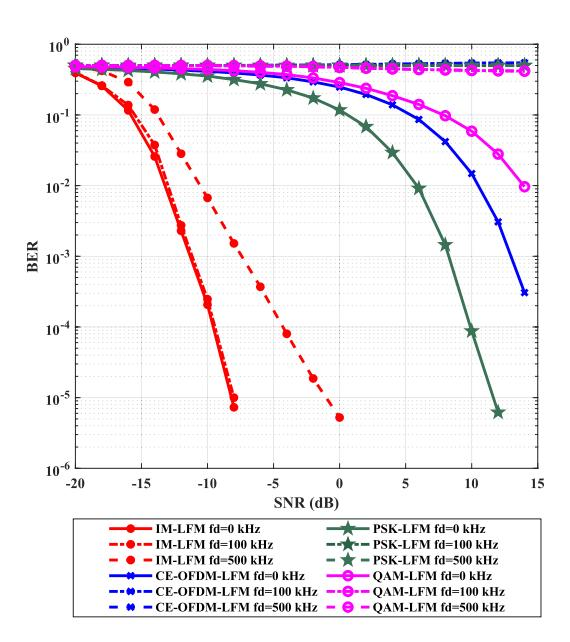

**Fig. 4.** BER versus SNR curves under Doppler frequency shift conditions of the IM-LFM, the CE-OFDM-LFM [\[24\]](#page-22-1), the PSK-LFM [\[22\]](#page-21-17) and the QAM-LFM [\[23\]](#page-22-0) waveforms

Under static conditions (zero Doppler shift), the proposed IM-LFM waveform outperforms the rest waveforms, achieving the same BER with 20-dB lower SNR. This advantage arises from the efficient use of LFM spread-spectrum gain, which significantly improves the noise resistance. Such performance makes the IM-LFM waveform ideal for low-power devices or long-distance communication. When a Doppler shift *fd* exists, the limitations of the PSK-LFM, CE-OFDM-LFM and QAM-LFM signals become evident, since their demodulation is highly sensitive to phase variation. As Fig. [5](#page-10-1) shows, the BER rapidly degrades to 0.5 at *fd* =100 kHz. However, the IM-LFM waveform still can provide reliable performance. The BER slightly degrades with high Doppler frequency. At *fd* =100 kHz and SNR = 0 dB, the BER of the IM-LFM waveform stays below 10−5 , showing strong tolerance to Doppler distortion.

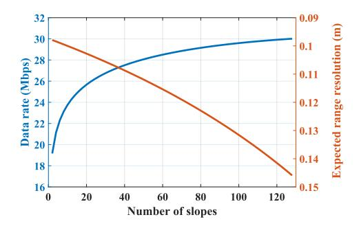

**Fig. 5.** Data rate versus number of slopes curve (blue) and expected range resolution versus number of slopes curve (orange).

### 3.2. Performance trade-off between sensing and communication functions

### 3.2.1. Range resolution and communication rate

Since the slope of the IM-LFM waveform is used to convey communication information, the bandwidth of the LFM pulses will vary continuously during the process of data transmission. For a LFM pulse with a slope of  $k_i$ , its bandwidth  $B_i$  is defined as  $k_iT$ . Then, the range resolution of this pulse is given by

$$\Delta D(B_i) = \frac{c}{2B_i} \tag{20}$$

It is evident that the range resolution of the IM-LFM waveform is not a constant value but varies dynamically. Notably, the range resolution fluctuates between a minimum and a maximum value with a certain probability. Here, we assume that all communication symbols occur with equal probability, and use the expected range resolution to evaluate the detection performance of the IM-LFM waveform. Given a fixed maximum bandwidth  $B_{\text{max}}$  and a minimum bandwidth interval  $\Delta B$ , the expected range resolution can be expressed as

$$E\{\Delta D(B_i)\} = E\left\{\frac{c}{2B_i}\right\}$$

$$= \sum_{i}^{K} p(B_i) \cdot \frac{c}{2B_i}$$

$$\approx \sum_{i}^{K} \frac{2B_i}{K(2B_{\text{max}} - (K - 1)\Delta B)} \cdot \frac{c}{2B_i}$$

$$= \frac{c}{2B_{\text{max}} - (K - 1)\Delta B}$$
(21)

where *K* is the total number of the slope indexes. Correspondingly, the data rate of the IM-LFM waveform can be given by

$$R = 2 \cdot PRF \cdot \begin{bmatrix} (\log_2 K + \log_2 (B_{\text{max}} - \frac{1}{2}(K - 1) \cdot \Delta B)) \\ -\log_2 \Delta F \end{bmatrix}$$
 (22)

Given the bandwidth interval  $\Delta B = 8$  MHz and the maximum bandwidth  $B_{\rm max} = 1.536$  GHz, the variations of data rate and expected range resolution with the slope number K are illustrated in Fig. 5. Generally, it is observed that the expected range resolution degrades as the data rate increases. Specifically, the expected range resolution shows a more pronounced decrease with the increment of K, while the data rate initially rises sharply and then levels off. Since the bandwidth of the waveform cannot be less than zero, the upper limit of K is also determined when  $B_{\rm max}$  is fixed. It implies that the data rate is constrained by  $B_{\rm max}$ . When K reaches to a certain level, further increase of K performs limited gain in data rate but significant deterioration in expected range resolution. Therefore, in practical applications, the optimal parameters should be chosen based on the performance trade-off.

### 3.2.2. Maximum unambiguous range and communication rate

Traditional inter-pulse coding ISAC waveform has a limited data rate as the PRF. The maximum unambiguous range (MUR) of a radar is normally defined as MUR = c/(2PRF). A smaller PRF increases the MUR but lowers the data rate. Luckily, the LFM pulses with different slopes exhibit low cross-correlation coefficients, which can suppress inter-pulse interference and avoid range ambiguity. We can quantify this property as the signal-to-self-interference ratio (SSIR), which is defined as the ratio of the auto-correlation to cross-correlation peaks. When the SSIR exceeds a

threshold, the slopes can be considered has no interference. By designing the communication sequence to ensure the slopes in continuous N IM-LFM pulses are unique, the lower bound of the MUR inf  $r_{\rm ua}$  can be increased to

$$\inf r_{ua} = N \frac{c}{2 \cdot PRF} \tag{23}$$

Assuming I is the set of slope indexes of the formal N-1 LFM pulses, the number of bits  $R_v$  that the current pulse can carry is expressed as

$$R_{\nu} = PRF \cdot \left[ \log_2(\sum_{i \notin I} B_i) - \log_2 \Delta F \right]$$
 (24)

Thus, the average data rate of the designed IM-LFM waveform is given by

$$R \approx E(R_{\nu}) = PRF \cdot \left[ E(\log_{2}(\sum_{i \notin I} B_{i})) - \log_{2} \Delta F \right]$$

$$\approx PRF \cdot \left[ \log_{2}(\sum_{i}^{K} B_{i} - (N-1)E(B_{i})) - \log_{2} \Delta F \right]$$

$$-\log_{2} \Delta F$$
(25)

In practical scenarios, it is essential to achieve a certain level of the SSIR to suppress the inter-pulse interference. As shown in the blue curve of Fig. 6(a), increasing the bandwidth interval  $\Delta B$  directly improves the minimum SSIR. When  $\Delta B$  = 16 MHz, the SSIR exceeds 10 dB, and when  $\Delta B$  = 64 MHz, the SSIR reaches 20 dB. However, under fixed bandwidth constraints ( $B_{\text{max}}$  = 1.536 GHz and  $B_{\text{min}}$  = 0.512 GHz), a larger  $\Delta B$  will reduce the number of the available pulse slopes, as displayed in the orange curve in Fig. 6(a), thereby lowering the average data rate. The trade-off between the communication performance and the MUR is quantified in Fig. 6(b). When extending MUR from 150 to 1500 m, the average data rate decreases by only 0.67 Mbps (SSIR = 12.14 dB), 1.06 Mbps (SSIR = 15.48 dB), and 2.69 Mbps (SSIR = 19.03 dB). These results confirm that the IM-LFM waveform can achieve larger MUR with considerable communication rate loss compared with the traditional inter-pulse waveforms.

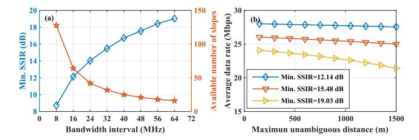

**Fig. 6.** (a) Minimum SSIR versus bandwidth increment curve (blue) and available number of slopes versus bandwidth increment curve (orange). (b) Average data rate versus maximum unambiguous distance curve with different minimum SSIR.

### 4. Experiment demonstration

### 4.1. Generation of Ku-Band chirp multiplexed IM-LFM ISAC signals

Due to the experimental equipment limitations, the proof-of-concept demonstration is carried out based on the setup shown in Fig. 7. The coherent dual-wavelength source is made up by

a laser diode (LD, Conquer, KG-TLS-15-C), an MZM1 (Conquer, KG-AM-15-40-PP-FA), a microwave signal source (MSG), an Erbium-doped fiber amplifier (EDFA1), and an optical filter (OF). A 1550.284 nm optical carrier with a power of 14 dBm and a linewidth of 100kHz is generated by the LD. The carrier is then injected into MZM1. MZM1 is driven by a 16 GHz single-tone RF signal output from the MSG and operating at quadrature transmission point (QTP). After the OF and EDFA1, the optical carrier and -1st order optical sideband are extracted and amplified. Then, the FBG is employed for wavelength separation. As shown in Fig. [8\(](#page-14-0)a-b), the resulting spectra obtained by an optical spectrum analyzer (OSA, APEX AP208x) feature two wavelengths with 16 GHz interval. These selected wavelengths exhibit suppression ratios of 26.41 dB and 30.93 dB against the residual sidebands. The lower-frequency wavelength is applied to the DP-QPSKM (Sumitomo, T-SBZH1.5-20PD-ADC). This modulator enables polarization-multiplexed up-conversion of the IF-ISAC signals. To verify the polarization isolation, we fed 1 GHz (RF1) and 2 GHz (RF2) single-tone signals generated by a multi-channel AWG (Seayear, 1652B) into the two arms of the DP-QPSKM. These signals undergo LSSB modulation. The measured optical spectra at two polarization direction are shown in Fig. [8\(](#page-14-0)c) and (d), which demonstrate a polarization isolation ratio over 17.76 dB.

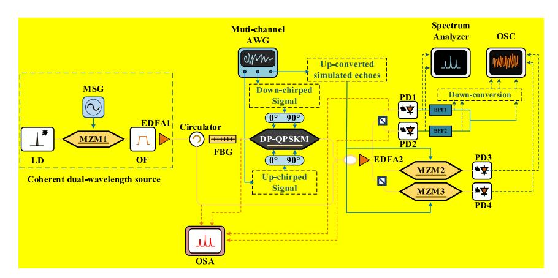

**Fig. 7.** The experimental setup of the proposed ISAC system.MSG, microwave signal generator; OF, optical filter; OSA, optical spectrum analyzer.

Following the specifications in Table.1, the down-chirped and up-chirped IF-LFM signals with frequencies ranging from 0.3 to 1.828 GHz are generate by the AWG. These signals are fed into the two brunches of the DP-QPSKM through two 90° hybrid couplers to produce LSSB signals. then, the generated LSSB signals are combined with another optical wavelength emitted from the reflection port of the FBG. The measured optical spectra at the input of PD1 and PD2 (Conquer, KG-PD-50 GHz) are given in Fig. [8\(](#page-14-0)e) and (f). The spurious-sideband suppression ratios of the two LSSB signals are 9.21 and 9.89 dB because of the limited extinction ratio of the modulator.

Figure [9\(](#page-14-1)a) and (b) give the electrical spectra of the generated Ku-band up-chirped and down-chirped IM-LFM signals generated by the PDs with responsivities of 0.9 A/W. The spectra are measured by a spectrum analyzer (Seayear, AV4036E). Signals ranging from 16.3 to 17.828 GHz can be observed in the spectra. Though, the undesired components are not well suppressed, the desired signals can be extracted via band-pass filtering before the transmission.

In addition, the temporal waveforms of the down-converted IM-LFM signals extracted by an oscilloscope (OSC, Tektronics, MSO64B) are shown in Fig. [9\(](#page-14-1)c) and (e). Thanks to the isolation of the up- and down-chirped IM-LFM generation, the measured temporal waveforms show low-PAPR of 3.4 and 3.6 dB, which indicates a relative flat envelope of the waveforms. This is beneficial for maintaining the operational range of the ISAC system. The time-frequency

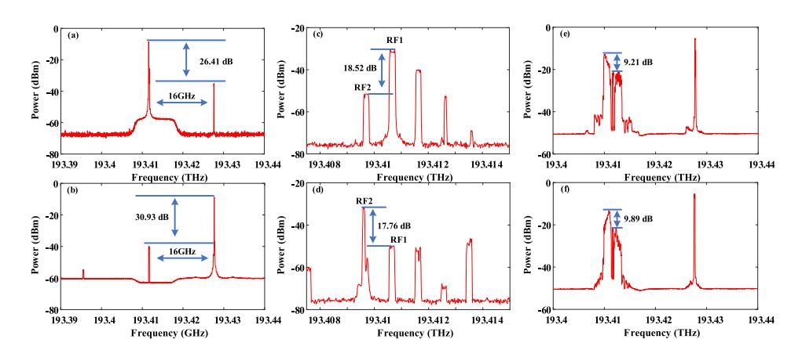

**Fig. 8.** Measured optical spectra at the (a) transmission port and (b) reflection port of the FBG. Measured optical spectra at the output of DP-QPSKM in (c) polarization state *x* and (d) polarization state *y*. Measured optical spectra at the input of (e) PD1 and (f) PD2.

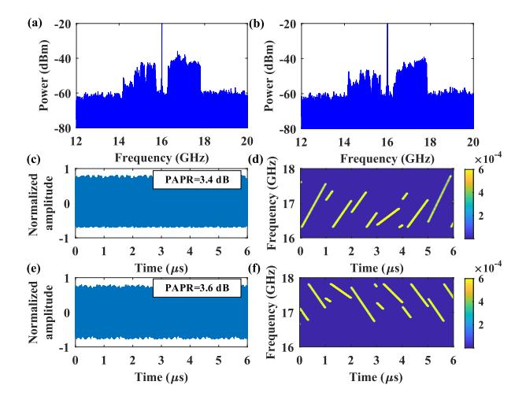

**Fig. 9.** Measured spectra of the (a) up-chirped and (b) down-chirped Ku-band ISAC signals, measured (c) temporal waveform and (d) spectrogram of the up-chirped Ku-band ISAC signals, measured (e) temporal waveform and (f) spectrogram of the down-chirped Ku-band ISAC signals.

distributions of the generated signals are illustrated in Fig. [9\(](#page-14-1)d) and (f). It is evident that the slope and circular shift of the IM-LFM signals are successfully modulated.

# *4.2. Demonstration of target detection*

To more flexibly validate the radar function of the proposed chirp multiplexed IM-LFM signal, a semi-physical target detection experiment is conducted. Based on the simulated target detection scenarios, the IF echo signal is generated by the AWG and then fed into the radar receiver after up-conversion.

Here, the radar echo of a target 15 m away from the transmitter is simulated and generated. This echo is fed into the MZM in the radar receiver to perform double-sideband modulation. Through polarization beam splitting and optoelectronic conversion, optical de-chirp operation of the Ku band chirp-multiplexed IM-LFM waveform is implemented. Dual-channel range profiles are subsequently recorded at PD3 and PD4 using a multi-channel oscilloscope (OSC) operating at 400 MSa/s. As demonstrated in Fig. [10\(](#page-15-0)a) and (b), range profiles obtained with a 1.528 GHz signal bandwidth show distinct peaks at 14.63 m and 14.57 m. These measurements correspond to deviations of 0.37 m and 0.43 m from the theoretical 15-m target distance. It should be emphasized that the received echo contains both up-chirped and down-chirped LFM components simultaneously. The red curve in Fig. [10\(](#page-15-0)a) shows the range profile with the single-chirp echo. Compared to the red curve, the blue range profile obtained from dual-chirp echo exhibits higher baseline noise, but the spurious-sideband suppression ratio decreases slightly from 25.37 to 21.04 dB. This limited degradation confirms the low cross-correlation coefficient between the up-chirp and down-chirp signals.

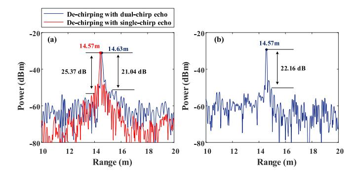

**Fig. 10.** (a) Range profiles obtained at PD3 with single-chirp echo signal (red) and dual-chirp echo signal (blue), (b) range profile obtained at PD4.

Since the instantaneous bandwidth of the IM-LFM waveform is continuously varying, the proposed ISAC system features a dynamic range resolution. According to (19), the expected range resolution of the obtained waveform should be ∼0.146 m. To validate this, we simulated two adjacent targets at 15 m and 15.15 m, generating corresponding echo signals for radar receiver analysis. The range profiles with signal bandwidth of 0.512 GHz, 0.768 GHz, 1.28 GHz and 1.528 GHz are presented in Fig. [11\(](#page-16-0)a)-(d). When the bandwidth is larger than 0.768 GHz, the two targets can be distinguished. To further investigate the probabilistic characteristics of the system range resolution, an IM-LFM signal consisting of 20,000 pulses is sampled and analyzed. The communication symbols embedded in this signal were generated randomly with equal probability. From these 20,000 pulses, we statistically analyze the probability of different range resolutions. This process is repeated 10 times, and the average values are calculated to estimate the cumulative distribution function (CDF) of the system range resolution. The curve illustrates the probability that the range resolution of the proposed ISAC system exceeds various

threshold values. The statistical results obtained from the experiments are in agreement with the theoretical curves. Specifically, the expected 0.146-m resolution threshold can be guaranteed in approximately 60% in single-channel detection instances. The system reliability can be enhanced through dual-channel data fusion. By implementing cross-channel optimization, the expected resolution can be ensured with a probability more than 86%.

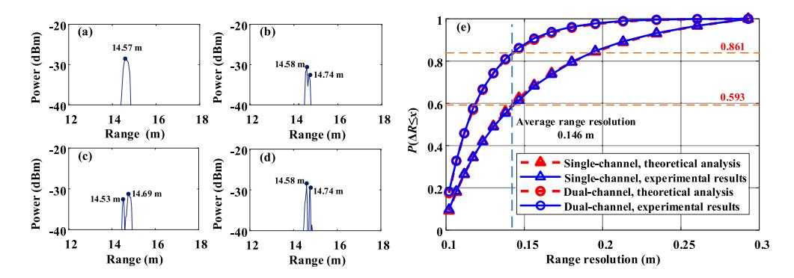

**Fig. 11.** Measured range profiles with signal bandwidth of (a) 0.512 GHz, (b) 0.768 GHz, (c) 1.28 GHz and (d) 1.528 GHz; (e) cumulative distribution of range resolution.

The feasibility of the radar MUR extension is also studied. ∆*B* is set to be 16, 32 and 64 MHz, respectively. The de-chirp results of two targets with distance of 15 and 165 m are shown in Fig. [12\(](#page-16-1)a). Since the PRT of the ISAC pulses are set to be 1 µs, the de-chirped peaks of a 15-m and a 165-m targets will be overlapped if the slopes of the pulses are constant. However, compared to the range profile of the 15-m target, the power peaks of the 165-m targets with different ∆*B* are reduced by 9.1, 12.5 and 15.4 dB in Fig. [12\(](#page-16-1)a). Thus, the echo of the 165-m target will not cause ambiguity to the detection of the 15-m target. Correspondingly, if a 1-µs time delay is introduced to the reference, the 165-m target can be detected without range ambiguity. Furthermore, the minimum SSIR of the IM-LFM signals with varying bandwidth intervals are measured, with results averaged over 10 experiments. As illustrated in Fig. [12\(](#page-16-1)b), in contrast to simulation outcomes, the experimental results exhibit higher cross-correlation coefficients between signals of different bandwidths. This discrepancy is attributed to non-ideal factors within the system, such as phase noise from the laser source and the limited linearity of the generated signals. In practical applications, the bandwidth interval should be selected based on the detection range to extend the radar MUR.

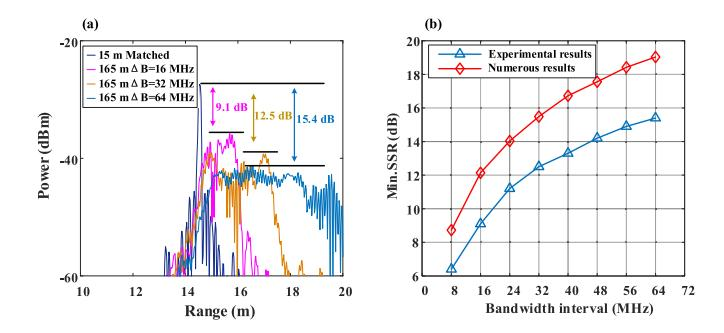

**Fig. 12.** (a) The de-chirp results of two targets at 15 and 165 m when ∆*B* is set as 16, 32 and 64 MHz; (b) measured minimum SSIR versus bandwidth increment curve.

# *4.3. Communication performance*

For communication function, a back-to-back data transmission based on the parameters setting in Table.1 is conducted. The generated chirp-multiplexed IM-LFM waveform with a data rate of 29.99 Mbps are down converted to the intermediate frequency and then be demodulated in the digital domain. The signal power after down-conversion is measured to be -8.42 dBm. To evaluate the communication performance of the ISAC system, Gaussian white noise with power level ranging from -15 to 5 dBm is added to the sampled signal. Then, the demodulated BER is measured, and the result is shown in Fig. [13\(](#page-17-0)a). The noise power margin to keep the BER below the 7% pre-FEC threshold (3.8 × 10−3 ) is 0 dBm. The BER performance under strong Doppler shifts is the key metric for evaluating the Doppler robustness of the proposed system. Thus, we introduce frequency shift to the digital local oscillator. The demodulated BER is measured at a noise level of -15 dBm, and the result is shown in Fig. [13\(](#page-17-0)b). The BER at a frequency shift of 500 kHz is around 10−3 , which is below the threshold. The result shows that the system has excellent Doppler tolerance.

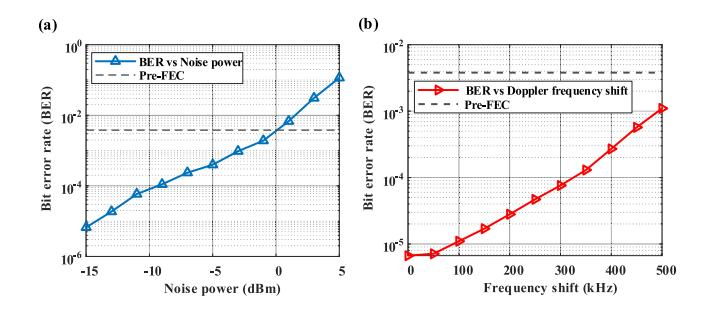

**Fig. 13.** (a) BER performance versus noise power; (b) BER performance versus the frequency offset of the local oscillator.

# **5. Discussion**

# *5.1. Polarization isolation and cross-channel interference*

The most significant contribution of employing dual polarization architecture is to generate the up-chirped and down-chirped ISAC waveforms independently so that their envelope can remain constant. When polarization isolation is non-ideal, one channel in the photonic up-converter will simultaneously contain both up-chirped and down-chirped signals, resulting in envelope fluctuations in the output waveform and an increase in PAPR. A simulation is performed to investigate the impact of polarization isolation. Figure [14\(](#page-18-0)a) and (b) in the following figure shows the up-chirped and down-chirped IM-LFM waveforms with ideal polarization separation. As can be observed, the waveforms have flat envelopes with a PAPR of 3 dB. By adjusting the polarization isolation to be 0 dB, the resulting waveforms of the two channels are shown Fig. [14\(](#page-18-0)c) and (d). Compared with the ideal case, the waveform envelope exhibits significant fluctuations, and the PAPR increases to approximately 6 dB. Figure [14\(](#page-18-0)e) presents the PAPR of generated signals under polarization isolation ranging from 0 to 20 dB. The results demonstrate an inverse relationship between polarization isolation and signal PAPR, with the waveform envelope exhibiting progressively reduced fluctuations as isolation increases. When polarization isolation approaches 20 dB, the corresponding PAPR is around 3.2 dB, which is closed to the ideal value of 3 dB. In experiments, the proposed scheme achieves a polarization isolation of 17.76 dB, resulting in a PAPR of approximately 3.5 dB, indicating minimal performance degradation.

Dual polarization architecture is also the key to perform dual-channel target detection. Under non-ideal polarization isolation conditions, the LO signals in each channel contain both up- and

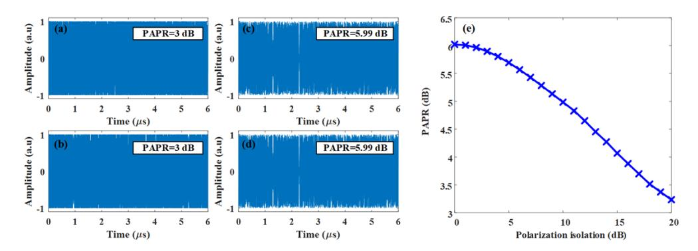

**Fig. 14.** The (a) up-chirped and (b) down-chirped IM-LFM waveforms under ideal polarization isolation. The (c) up-chirped and (d) down-chirped IM-LFM waveforms under 0-dB polarization isolation. (e) The PAPR versus polarization isolation curve.

down-chirped components, consequently degrading the SSR in target detection. Assuming the LO signal in the up-chirped channel can be expressed as,

$$s_{ref-up}(t) = s_U(t) + \gamma s_D(t)$$
 (26)

where  $s_{\rm U}(t)$  and  $s_{\rm D}(t)$  represents the up- and down-chirped components, which have the same amplitude. represents the cross-channel interference coefficient induced by non-ideal polarization isolation. By using it, polarization isolation can be defined as  $P_s = -20\log\gamma$ . If the echo signal is given by  $Ec(t) = \varepsilon(s_{\rm U}(t-\tau) + s_{\rm D}(t-\tau))$ , in which denotes the amplitude response, then the correlation function of the LO signal and the echo signal can be expressed as

$$\operatorname{corr}(s_{ref-up}(t), Ec(t)) = \varepsilon \begin{pmatrix} \operatorname{corr}(s_{U}(t), s_{U}(t-\tau)) + \gamma \operatorname{corr}(s_{D}(t), s_{D}(t-\tau)) \\ + \gamma \operatorname{corr}(s_{U}(t), s_{D}(t-\tau)) + \gamma \operatorname{corr}(s_{D}(t), s_{U}(t-\tau)) \end{pmatrix}$$

$$= \varepsilon \begin{pmatrix} \operatorname{corr}(s_{U}(t), s_{U}(t-\tau)) + \gamma \operatorname{corr}(s_{D}(t), s_{D}(t-\tau)) \\ + 2\gamma \operatorname{corr}(s_{U}(t), s_{D}(t-\tau)) \end{pmatrix}$$
(27)

in which corr(x,y) denotes the correlation function of x and y. Consequently, the SSR target detection can be given by

$$SSR_{\text{det ection}} = 20 \log \left( \min \left\{ \frac{\max(\text{corr}(s_U(t), s_U(t-\tau))}{\lambda \max(\text{corr}(s_D(t), s_D(t-\tau))}, \frac{\max(\text{corr}(s_U(t), s_U(t-\tau))}{2\lambda \max(\text{corr}(s_U(t), s_D(t-\tau))} \right\} \right)$$

$$= \min \left\{ P_S, 20 \log \left( \frac{\max(\text{corr}(s_U(t), s_U(t-\tau))}{2\lambda \max(\text{corr}(s_U(t), s_D(t-\tau))} \right) \right\}$$
(28)

As illustrated in (26), the SSR of target detection is defined by two key factors, which are polarization isolation and the correlation coefficient between up- and down-chirped components. A degradation in polarization isolation can lead to deteriorated SSR detection performance, consequently reducing the capability to detect weak signals.

To investigate the correlation coefficient between up- and down-chirped components, the SSIR are measured under different slopes. Based on the analysis in formula (16), the SSIR between up- and down-chirped signals exhibits a positive correlation with their slope difference, or equivalently, with the sum of their bandwidths. The SSIR versus bandwidth sum curve are shown in Fig. 15. Since the IM-LFM waveform have a bandwidth ranging from 0.512-1.528

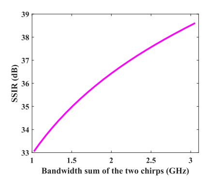

**Fig. 15.** The SSIR versus bandwidth sum curves.

GHz, the bandwidth sum can vary from 1.024-3.056 GHz. Generally, the SSIR is higher than 33 dB, which indicates minimum influence to target detection.

Therefore, the SSR performance in target detection for this system is primarily constrained by polarization isolation, which can be improved through hardware integration to achieve more stable polarization characteristics.

# *5.2. Impact of phase noise*

In practical engineering applications, components such as LD, modulators, amplifiers and etc. Inevitably introduce certain levels of phase noise, which degrades the linearity of LFM signals and consequently compromises system performance. As shown in Fig. [12\(](#page-16-1)b), the quasi-orthogonality between LFM signals with different slopes calculated based on the experiment results exhibits significantly degraded performance compared to theoretical values.Due to the difficulty in precisely controlling phase noise in experiments, this section employs numerical simulations by incorporating Gaussian-distributed phase noise with varying intensity levels into the signals to systematically investigate its impacts.

Figure [16\(](#page-20-0)a) gives the de-chirped spectra under ideal case and -50-dBc/Hz phase noise. As evidenced, the presence of phase noise significantly elevates the noise floor in de-chirped spectrum, consequently degrading the dechirped SSR. Figure [16\(](#page-20-0)b) illustrates the variation of dechirped SSR with different phase noise levels. When phase noise remains below -80 dBc/Hz@1 MHz, the SSR degradation progresses relatively slowly. However, as phase noise intensifies beyond this threshold, a pronounced acceleration in SSR deterioration becomes apparent. This may compromise both noise immunity in communication and the detection capability of weak echoes in sensing applications.

The de-chirped spectra of LFM signals with different bandwidth interval under ideal condition and -50-dBc/Hz are present in Fig. [17\(](#page-20-1)a) and (b). Compared with the ideal scenario, the dechirped spectra exhibit both reduced peak amplitudes and significantly elevated noise floors, although the quasi-orthogonality between LFM signals with different slopes remains preserved. Furthermore, the SSIR versus bandwidth interval curves under different phase noise are plotted in Fig. [17\(](#page-20-1)c) after 10 runs. When the phase noise remains below -70 dBc/Hz@1 MHz, the performance curve closely approximates the ideal scenario, demonstrating no significant increase in cross-correlation coefficients between LFM signals of different slopes. However, as phase noise intensifies beyond this threshold, a marked deterioration in SSIR occurs. When the phase noise intensity reaches -40 dBc/Hz@1 MHz, the quasi-orthogonal characteristics are essentially compromised. The cross-correlation coefficient between the up- and down-chirped signals investigated in Fig. [17\(](#page-20-1)d) demonstrate good agreement with those in Fig. [17\(](#page-20-1)c). Thus, to ensure optimal communication

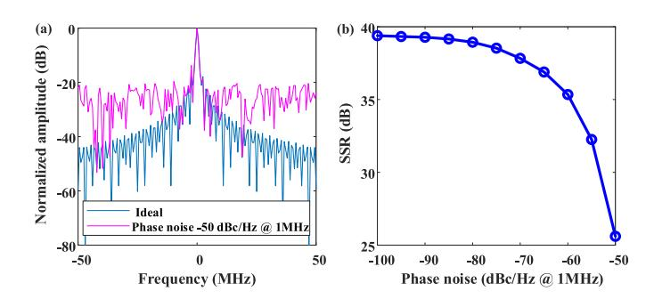

**Fig. 16.** (a) The de-chirped spectra of the ideal signal (blue) and the signal with phase noise (purple). (b) The SSR of the de-chirped spectra under different phase noise.

and sensing performance, the system's phase noise must be maintained below -70 dBc/Hz@1 MHz.

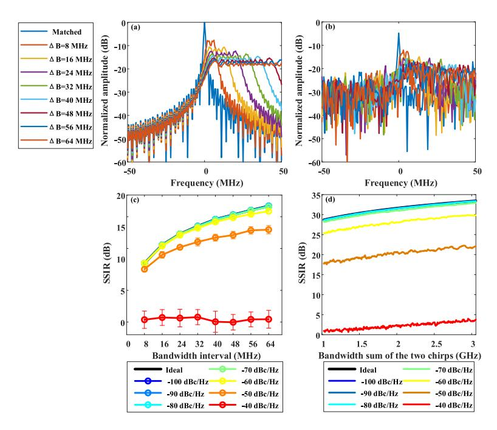

**Fig. 17.** (a) The ideal de-chirped spectra of the signals with different ∆*B* and (b) the de-chirped spectra under -50-dBc/Hz @1 MHz phase noise. (c) The SSIR versus bandwidth interval curves under different phase noise. (d) The SSIR versus bandwidth sum curves under different phase noise.

### **6. Conclusion**

In summary, a photonic-aided Doppler robust ISAC system based on index modulation and chirp multiplexing is proposed and experimentally demonstrated. The chirp-multiplexed, slopes and circular shifts modulated ISAC waveform is designed. In the transmitter, the integrated waveform is frequency up-converted in the optical domain. In the radar receiver, optical dual-channel de-chirp structure is achieved to process the chirp-multiplexed waveform, while

in the communication receiver, FFT and down-sampling are used to extract the slope and the circular shift index. The communication and sensing performance of the IM-LFM signal is analyzed. The results show that, the IM-LFM signal has better Doppler robustness compared to the PSK-LFM, CE-OFDM-LFM and QAM-LFM signals, furthermore, the radar MUR can be improved by using the designed waveform. The photonic-aided Ku band ISAC system is experimentally demonstrated. The IM-LFM signal with bandwidth ranging from 0.512 to 1.536 GHz is generated and processed. The radar range resolution better than 0.146 m with probability over 86% is achieved. For back-to-back communication with rate of 29.99 Mbps, the BER remains under the 7% pre-FEC threshold when the Doppler frequency shift is 500 kHz. The proposed ISAC system demonstrates excellent Doppler robustness and communication reliability, making it promising for high-mobility scenarios such as LEO satellite ISAC applications.

**Acknowledgment.** X. Li thanks the Youth Innovation Team of Shaanxi Universities Foundation for help identifying collaborators for this work.

**Disclosures.** The authors declare no conflicts of interest.

**Data availability.** No data were generated or analyzed in the presented research.

### **References**

- 1. W. Saad, M. Bennis, and M. Chen, "A vision of 6G wireless systems: Applications, trends, technologies, and open research problems," [IEEE Network](https://doi.org/10.1109/MNET.001.1900287) **34**(3), 134–142 (2020).
- 2. F. Liu, C. Masouros, A. P. Petropulu, *et al.*, "Joint radar and communication design: Applications, state-of-the-art, and the road ahead," [IEEE Trans. Commun.](https://doi.org/10.1109/TCOMM.2020.2973976) **68**(6), 3834–3862 (2020).
- 3. F. Liu, Y. Cui, C. Masouros, *et al.*, "Integrated sensing and communications: Towards dual-functional wireless networks for 6G and beyond," [IEEE J. Sel. Areas Commun.](https://doi.org/10.1109/JSAC.2022.3156632) **40**(6), 1728–1767 (2022).
- 4. X. Luo, H.-H. Chen, and Q. Guo, "LEO/VLEO satellite communications in 6G and beyond networks–Technologies, applications, and challenges," [IEEE Network](https://doi.org/10.1109/MNET.2024.3353806) **38**(5), 273–285 (2024).
- 5. P. Mróz, A. Otarola, T. A. Prince, *et al.*, "Impact of the SpaceX Starlink satellites on the Zwicky transient facility survey observations," [Astrophys. J. Lett.](https://doi.org/10.3847/2041-8213/ac470a) **924**(2), L30 (2022).
- 6. L. Yin, Z. Liu, M. R. B. Shankar, *et al.*, "Integrated sensing and communications enabled low Earth orbit satellite systems," [IEEE Network](https://doi.org/10.1109/MNET.2024.3371172) **38**(6), 252–258 (2024).
- 7. J. Wang, "Development status and implications of large low-Earth-orbit constellations," China Space **6**, 39–45 (2024).
- 8. X. Li, "Research progress of integrated radar-communication waveform based on linear frequency modulation," Laser Optoelectron. Prog. **60**(5), 43–45 (2023).
- 9. S. Pan and Y. Zhang, "Microwave photonic radars," [J. Lightwave Technol.](https://doi.org/10.1109/JLT.2020.2993166) **38**(19), 5450–5484 (2020).
- 10. Y. Wang, J. Ding, M. Wang, *et al.*, "W-band simultaneous vector signal generation and radar detection based on photonic frequency quadrupling," [Opt. Lett.](https://doi.org/10.1364/OL.447876) **47**(3), 537–540 (2022).
- 11. Y. Wang, J. Liu, J. Ding, *et al.*, "Joint communication and radar sensing functions system based on photonics at the W-band," [Opt. Express](https://doi.org/10.1364/OE.449153) **30**(8), 13404–13415 (2022).
- 12. S. Jia, X. Yu, S. Wang, *et al.*, "A unified system with integrated generation of high-speed communication and high-resolution sensing signals based on THz photonics," [J. Lightwave Technol.](https://doi.org/10.1109/JLT.2018.2863684) **36**(19), 4549–4556 (2018).
- 13. Y. Wang, W. Li, J. Ding, *et al.*, "Integrated high-resolution radar and long-distance communication based on photonics in terahertz band," [J. Lightwave Technol.](https://doi.org/10.1109/JLT.2022.3143849) **40**(9), 2731–2738 (2022).
- 14. A. Hassanien, M. G. Amin, Y. D. Zhang, *et al.*, "Signaling strategies for dual-function radar communications: An overview," [IEEE Aerosp. Electron. Syst. Mag.](https://doi.org/10.1109/MAES.2016.150225) **31**(10), 36–45 (2016).
- 15. Z. Xue, S. Li, J. Li, *et al.*, "OFDM radar and communication joint system using optoelectronic oscillator with phase noise degradation analysis and mitigation," [J. Lightwave Technol.](https://doi.org/10.1109/JLT.2022.3156573) **40**(13), 4101–4109 (2022).
- 16. Y. Liu, A. Deng, S. Hua, *et al.*, "Photonic ADC-based scheme for joint wireless communication and radar by adopting a broadband OFDM shared signal," [Opt. Lett.](https://doi.org/10.1364/OL.473975) **47**(20), 5421–5424 (2022).
- 17. F. Liu, P. Li, N. Zhong, *et al.*, "Millimeter-wave over fiber integrated sensing and communication system using self-coherent OFDM," [Opt. Express](https://doi.org/10.1364/OE.513686) **32**(9), 15493–15506 (2024).
- 18. H. Yan, X. Li, X. Pan, *et al.*, "W-band photonic-aided mm-wave ISAC system enabled by a shared OFDM signal waveform and a two-stage carrier frequency recovery algorithm," [Opt. Lett.](https://doi.org/10.1364/OL.537847) **49**(18), 5280–5283 (2024).
- 19. H. Nie, F. Zhang, Y. Yang, *et al.*, "Photonics-based integrated communication and radar system," in Proc. Int. Top. Meet. Microw. Photon., 1–4 (2019).
- 20. S. Wang, D. Liang, and C. Yang, "Photonics-assisted joint communication-radar system based on a QPSK-sliced linearly frequency-modulated signal," [Appl. Opt.](https://doi.org/10.1364/AO.456287) **61**(16), 4752–4760 (2022).
- 21. M. Lei, B. Hua, Y. Cai, *et al.*, "Photonics-aided integrated sensing and communications in mmW bands based on a DC-offset QPSK-encoded LFMCW," [Opt. Express](https://doi.org/10.1364/OE.474055) **30**(24), 43088–43103 (2022).
- 22. Z. Lyu, L. Zhang, H. Zhang, *et al.*, "Radar-centric photonic terahertz integrated sensing and communication system based on LFM-PSK waveform," [IEEE Trans. Microwave Theory Tech.](https://doi.org/10.1109/TMTT.2023.3267546) **71**(11), 5019–5027 (2023).

- 23. Z. Lyu, L. Zhang, H. Zhang, *et al.*, "Multi-channel photonic THz-ISAC system based on integrated LFM-QAM waveform," [J. Lightwave Technol.](https://doi.org/10.1109/JLT.2024.3392282) **42**(11), 3981–3988 (2024).
- 24. W. Bai, P. Li, X. Zou, *et al.*, "Millimeter-wave joint radar and communication system based on photonic frequencymultiplying constant envelope LFM-OFDM," [Opt. Express](https://doi.org/10.1364/OE.461508) **30**(15), 26407–26425 (2022).
- 25. H. Rouzegar and M. Ghanbarisabagh, "Estimation of Doppler curve for LEO satellites," [Wirel. Pers. Commun.](https://doi.org/10.1007/s11277-019-06517-5) **108**(4), 2195–2212 (2019).
- 26. T. Wu, D. Qu, and G. Zhang, "Research on LoRa adaptability in the LEO satellites Internet of Things," in *Proc. Int. Wireless Commun. Mobile Comput. Conf.*, 1–6 (2019).
- 27. A. Roy, H. B. Nemade, and R. Bhattacharjee, "Symmetry chirp modulation waveform design for LEO satellite IoT communication," [IEEE Commun. Lett.](https://doi.org/10.1109/LCOMM.2019.2933211) **23**(10), 1836–1839 (2019).
- 28. G. Ferré and M. A. Ben Temim, "A dual waveform differential chirp spread spectrum transceiver for LEO satellite communications," in *Proc. IEEE Int. Conf. Commun.*, 1–6 (2021).
- 29. J.-M. Kang, "A new index modulation for LoRa," [IEEE Internet Things J](https://doi.org/10.1109/JIOT.2023.3240521) **10**(13), 11938–11939 (2023).
- 30. M. Hanif and H. H. Nguyen, "Slope-shift keying LoRa-based modulation," [IEEE Internet Things J](https://doi.org/10.1109/JIOT.2020.3004318) **8**(1), 211–221 (2021).
- 31. T. Elshabrawy and J. Robert, "Interleaved chirp spreading LoRa-based modulation," [IEEE Internet Things J](https://doi.org/10.1109/JIOT.2019.2892294) **6**(2), 3855–3863 (2019).
- 32. A. Mondal, M. Hanif, and H. H. Nguyen, "SSK-ICS LoRa: a LoRa-based modulation scheme with constant envelope and enhanced data rate," [IEEE Commun. Lett.](https://doi.org/10.1109/LCOMM.2022.3150666) **26**(5), 1185–1189 (2022).
- 33. C. Yang, M. Wang, L. Zheng, *et al.*, "Folded chirp-rate shift keying modulation for LEO satellite IoT," [IEEE Access](https://doi.org/10.1109/ACCESS.2019.2930327) **7**, 99451–99461 (2019).