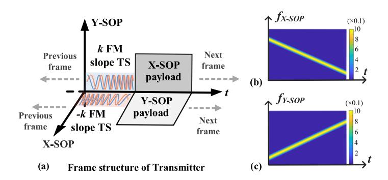
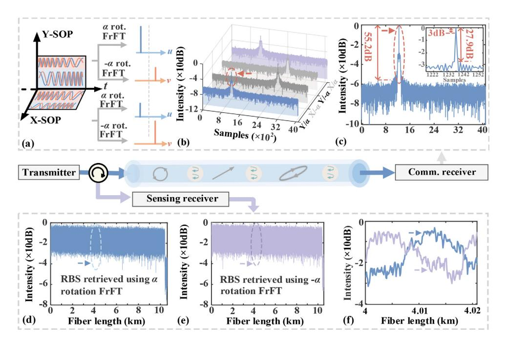
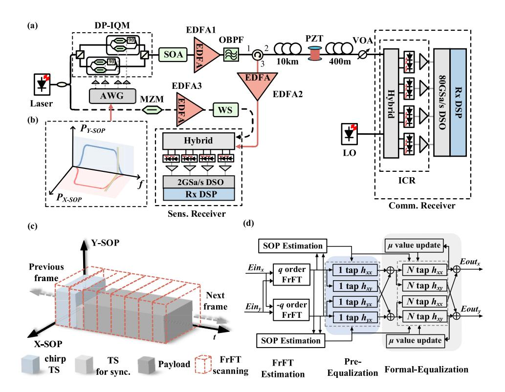
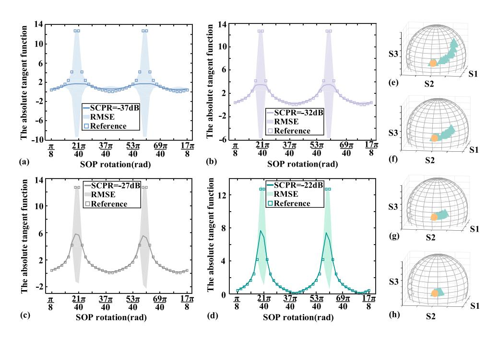
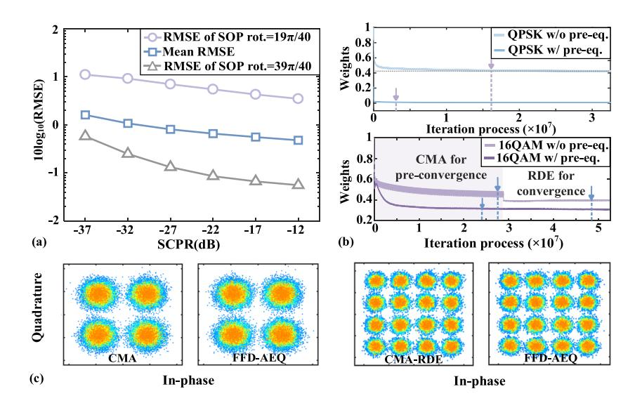
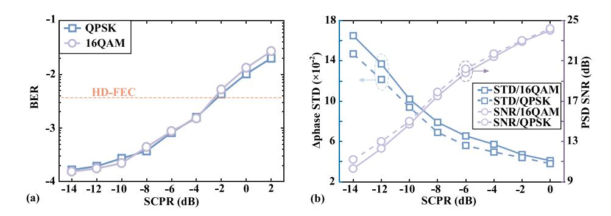
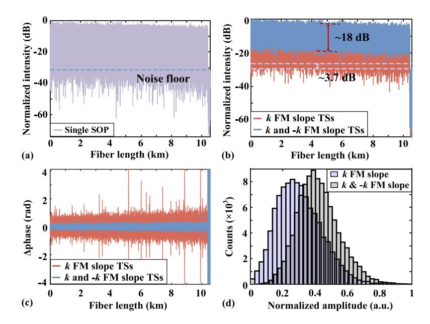
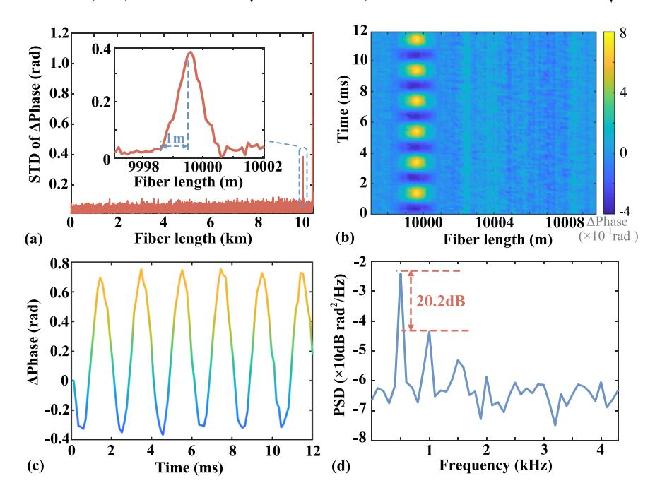
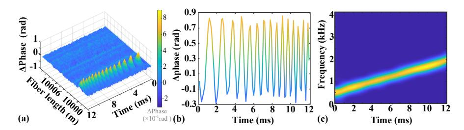

# **Endogenous integration of communication and interference fading free sensing using telecom pilots via joint polarization-fraction domain multiplexing**

**LI WANG, 1,**† **YUE WANG, 1,**† **ZHONGHONG LIN, 2 HAOZE [Y](https://orcid.org/0000-0001-8669-4186)U, 2 YIBIN LI, 1 CHAO LU, 2 CHANGYUAN YU, 1,3 AND MING TANG2,4**

**Abstract:** In this paper, we propose telecom pilots originally designed for polarization rotation estimation to achieve distributed acoustic sensing (DAS) for standard coherent system. Characterized by joint polarization-fraction domain multiplexing, the telecom pilots deployed in orthogonal polarizations have identical sweep bandwidths but opposite frequency modulation (FM) slopes. Through fractional Fourier transform (FrFT) processing, the telecom pilots can converge to fractional energy peaks and then be distinguished, thereby achieving state of polarization (SOP) rotation monitoring for communication. While for sensing, the Rayleigh backscattering (RBS) light-waves of different telecom pilots serving as sensing probes can not only be compressed but also extracted by FrFT. Therefore, the RBS can be used to suppress interference fading due to independent fluctuation. The feasibility of endogenous integration of sensing and communication (ISAC) is verified by an experiment of 200Gb/s DP-QPSK and 400Gb/s DP-16QAM transmission over 10.4 km fiber, co-existing with interference-fading free DAS. The fading-free DAS is demonstrated through dynamic measurements of single or sweep frequency vibrations, attaining spatial resolution of 1 m. The intensity fluctuation over 50 dB is reduced to 18 dB, with the lowest intensity of synthesized trace being 3.7 dB higher than the noise floor.

© 2025 Optica Publishing Group under the terms of the [Optica Open Access Publishing Agreement](https://doi.org/10.1364/OA_License_v2#VOR-OA)

# **1. Introduction**

With rapid proliferation of internet of things (IoT), smart city and low-altitude surveillance, the application of beyond 5G (B5G) and 6G era is driving communication networks to evolve from mere data-transmission into intelligent infrastructures capable of integration of sensing and communication (ISAC) [\[1](#page-12-0)[,2\]](#page-12-1). Optical fiber networks, as the backbone of global connectivity spanning transoceanic links to fiber-to-the-home (FTTH) deployments, have emerged as a natural platform for ISAC due to their dual role for both data transmission and distributed sensing [\[3](#page-12-2)[–5\]](#page-12-3). Crucially, Coherent optical network provides an unprecedented opportunity to achieve ISAC. Given the widespread deployment and full optical field recovery, coherent optical network approaching to single-wavelength 400G for backbone networks is now sinking in data center interconnects and access networks [\[6,](#page-12-4)[7\]](#page-12-5). Therefore, it enables the potential for ISAC and presents a promising avenue for enhancing the utility and efficiency of optical fiber networks.

The ISAC in coherent optical networks has been explored through phase-sensitive optical time-domain reflectometry (φ-OTDR) by integrating telecom payloads and sensing probes via frequency-division multiplexing (FDM) [\[8](#page-12-6)[–10\]](#page-13-0). However, such an approach merely shares the

*1Photonics Research Center, Department of Electrical and Electronic Engineering, Hong Kong Polytechnic University, Hong Kong SAR 999077, China*

*2National Engineering Laboratory of Next Generation Internet Access Networks, School of Optical and Electronic Information, Huazhong University of Science and Technology, Wuhan 430074, China*

*3 [changyuan.yu@polyu.edu.hk](mailto:changyuan.yu@polyu.edu.hk)*

*4 [tangming@mail.hust.edu.cn](mailto:tangming@mail.hust.edu.cn)*

†These authors contributed equally.

fiber medium with two distinct transceivers, leading to substantial infrastructure costs. It has been suggested that sensing probe can share the transmitter over a bidirectional data center interconnect which uses self-homodyne coherent detection for telecom payload [\[11\]](#page-13-1). Nevertheless, this requires bidirectional self-homodyne structures, and a dedicated channel must be reserved exclusively for the sensing function. An alternative scheme to realize ISAC is to implement distributed acoustic sensing (DAS) through space division multiplexing in seven-core fiber cable, although this is impractical considering the as-deployed single-mode-fiber (SMF) networks [\[12\]](#page-13-2). A common drawback of these methods is that sensing and communication functions operate independently, sharing only the physical fiber resource. To facilitate cooperative functionality between sensing and communication, the optical pilot, carrier or information-bearing signal initially intended for communication can be repurposed for sensing, thereby achieving endogenous ISAC [\[13](#page-13-3)[–18\]](#page-13-4). There have been several proposals to achieve endogenous ISAC through multiple input multiple output (MIMO) adaptive equalization or phase recovery without dedicated sensing probe [\[13](#page-13-3)[–20\]](#page-13-5). Nevertheless, the forward transmission-based sensing schemes suffer from inherent limitations in localization accuracy and the ability to handle multiple vibration sources. Another approach to realize endogenous ISAC involves replacing the optical carrier with the linear frequency modulation (LFM) carrier, which can not only mitigate chromatic dispersion (CD)-induced power fading but also realize high-performance DAS [\[19\]](#page-13-6). However, this integration scheme only works for intensity-modulation direct-detection (IM-DD) systems. Recently, multi-frequency telecom pilots designed for synchronization serve as sensing probes to achieve enhanced frequency response [\[20\]](#page-13-5). However, the pilots need three spectral gaps to be located in, which is preferable in digital subcarrier multiplexing.

In this paper, an endogenous ISAC has been proposed for standard coherent detection system. Instead of allocating a dedicated sensing probe, the telecom pilots designed for state of polarization (SOP) rotation estimation have been repurposed for DAS. Characterized by identical spectrums but opposite frequency modulation (FM) slopes, the telecom pilots of dual SOPs are orthogonal to each other in fractional domain. By leveraging matched fractional Fourier transform (FrFT), the energy of telecom pilots can be gathered to the utmost extent and used to monitor SOP rotation. Besides, the RBS signals characterized by different FM slopes can not only be compressed but also distinguished within corresponding fraction domain. Consequently, the RBS signals can be aggregated to simultaneously suppress interference fading and polarization fading. The experiment of endogenous ISAC has been verified through 200Gb/s dual-polarization quadrature phase-shift keying (DP-QPSK) and 400Gb/s DP 16-ary quadrature amplitude modulation (DP-16QAM) signals transmission over 10.4 km fiber, co-existing with interference-fading free DAS. The root mean square error (RMSE) of SOP rotation estimation is 0.48. The feedforward adaptive equalization (FFD-AEQ) based on SOP rotation can employ 1-tap MIMO for pre-equalization and adaptive weight coefficients, thereby achieving 83.8% reduction for equalization convergence of communication. While for DAS, the intensity fluctuation is reduced from over 50 dB to 18 dB with the lowest intensity being 3.7 dB higher than noise floor, resulting in fading free performance. The fading-free ISAC is demonstrated experimentally with 1 m spatial resolution (SR) under dynamic measurements of 500 Hz single-frequency vibration or sweep-frequency vibration ranging from 500 Hz to 2kHz.

### **2. Principle**

# *2.1. Brief introduction of FrFT*

Typically, a chirp signal can be expressed in the following form:

$$S(t) = A \cdot \exp[j(2\pi f t + \pi k t^2)] \tag{1}$$

where *T*, *f* and *k* represent signal duration, initial frequency and FM slope respectively. As shown in Fig. [1,](#page-2-0) the chirp signal *S*(*t*) with non-stationary frequency adjustment possesses large

time width and bandwidth, making it unsuitable for processing in either the time or frequency domain. As generalization of the Fourier transform, fractional Fourier transform (FrFT) has been utilized to express signals on an orthonormal basis constituted by chirps [\[21\]](#page-13-7). The operation of FrFT can be defined as a rotation of time-frequency coordinates with an angle of α, which can facilitate signal analysis in both the time and frequency domains. The chirp signal undergoing FrFT operation can be expressed as [\[21](#page-13-7)[,22\]](#page-13-8):

$$F_{\alpha}(u) = \int_{-\infty}^{+\infty} S(t)\sqrt{1 - j\cot\alpha} \cdot \exp\left[j\pi \frac{u^2 + t^2}{2}\cot\alpha - j2\pi u t \csc\alpha\right] dt$$

$$= A\sqrt{1 - j\cot\alpha} \exp(j\pi u^2 \cot\alpha) \int_{-\infty}^{+\infty} \exp[j\pi \frac{k + \cot\alpha}{2} t^2 - j2\pi (f - u \csc\alpha)t] dt$$

$$\int_{-\infty}^{\infty} Impulse signal$$

$$Chirp signal$$

$$Chirp signal$$

$$\alpha = \pi/2$$

$$0$$

$$\alpha = \pi/2$$

$$0$$

$$0$$

$$\alpha = \pi/2$$

$$0$$

$$0$$

$$0$$

$$0$$

$$0$$

$$0$$

$$0$$

$$0$$

$$0$$

$$0$$

**Fig. 1.** (a) Fourier transform can be regarded as FrFT with 90-degree rotation in Wigner plane. (b) Optimal fraction domain where time-frequency distribution of chirp squeezes to its minimum.

When rotation angle of FrFT satisfies the relationship of *k* = -cotα, Eq. (2) can be transformed to conventional Fourier transform operation for rectangular pulse signal. From perspective of time-frequency distribution (Wigner plane) illustrated in Fig. [1\(](#page-2-0)a), direct current (DC) signal is parallel to *t*-axis since the frequency of DC signal corresponds to a fixed value 0. After application of Fourier transform, the DC signal becomes an impulse signal aligned with *f*-axis, which can be regarded as a 90-degree rotation by the FrFT in time-frequency distribution. It is noteworthy that the chirp signal represented by a slope line can be interpreted as a direct current (DC) signal obtained through rotating it by a specific angle. The specific angle is relevant to the FM slope of chirp signal. Therefore, the chirp signal will converge into a peak of impulse signal after matched FrFT rotation. The process is equivalent to decomposing one Fourier transform into two FrFTs. The chirp signal with *k* FM slope after matched FrFT rotation of angle α can be expressed as:

$$F_{\alpha}(u) = A\sqrt{1 - j\cot\alpha}\exp(j\pi u^2\cot\alpha)T \cdot \sin c[T(u\csc\alpha - f)]$$
 (3)

From Eq. (3), it can be observed that there exists optimal fractional domain after rotation of time-frequency coordinates for chirp signal with FM slope *k*, where the LFM signal distribution squeezes to its minimum and the energy of the chirp signal can be gathered to the utmost extent. The peak after convergence in α rotation fractional domain is also illustrated in Fig. [1.](#page-2-0) The digital fractional Fourier transform (DFrFT) computation algorithms used in this work is based on sampling and decomposition approach [\[1–](#page-12-0)[4\]](#page-12-7). It has been demonstrated that the computational complexity of FrFT is *O*(*N* × log2(*N*)) where *N* is the sample length of FrFT window. Thus, the computation of the fractional transform does not sacrifice the computation efficiency compared with the ordinary Fourier transform.

### 2.2. Telecom chirp TSs for SOP rotation estimation

To estimate SOP rotation and achieve distributed sensing simultaneously, one chirp pilots (which will be represented as chirp training sequences in the following) with FM slope k is deployed in Y-SOP of transmitter. The transmitted chirp training sequence (TS) in Y-SOP can be expressed as:

$$S_y = rect(\frac{t}{T})\exp[j(2\pi f_y t + \pi k t^2)]$$
 (4)

where  $f_y$  is initial frequency for chirp TS in Y-SOP. While for the chirp TS in X-SOP, the frequency modulation slope is opposite to that of Y-SOP, which can be expressed as:

$$S_x = rect(\frac{t}{T}) \exp[j(2\pi f_x t - \pi k t^2)]$$
 (5)

where  $f_x$  is initial frequency for chirp TS in X-SOP. The  $f_x$  and  $f_y$  satisfies the relationship that can be written as:

$$f_{x} = f_{y} + kT \tag{6}$$

As illustrated in Fig. 2(a), dual polarization (DP) chirp TSs or sensing probes are inserted prior to the telecom payload. It is evident that the initial frequency of X-SOP chirp TS corresponds to cut-off frequency of Y-SOP chirp TS and vice versa. Figure 2(b) and (c) shows time-frequency distribution of DP chirp TSs. The chirp TSs propagating in fiber is affected by SOP evolution, leading to overlap with each other. The received signal can be expressed as:

$$\begin{bmatrix} Rx \\ Ry \end{bmatrix} = \begin{bmatrix} S_x \cdot \cos\theta - S_y \cdot \sin\theta e^{-j\gamma} \\ S_x \cdot \sin\theta e^{j\gamma} + S_y \cdot \cos\theta \end{bmatrix}$$
 (7)

where  $\gamma$  denotes the phase retarder, and  $\theta$  corresponds to the SOP rotation. According to relationship of k = -cot $\alpha$  in Eq. (3), FrFT with  $\alpha$  rotation angle converges a chirp signal with k FM slope, but it does not generate an aggregated peak for a chirp signal with FM slope -k. Therefore, the chirp signal with specific FM slope can still be extracted in the matched fractional Fourier domain even if it is affected by other chirp signals with distinct FrFT rotation. Namely,  $S_x$  and  $S_y$  with opposite FM slopes are orthogonal to each other in fractional domain even though the frequency spectrums are overlap. Considering the effect of SOP evolution, the chirp TS of k FM slope overlaps with that of -k FM slope in receiver. For received X-SOP, FrFT operations with  $\alpha$  and - $\alpha$  rotation are applied to received signal, resulting in convergence of k and -k FM slope TS respectively. The converged peak power in fraction domain of  $\alpha$  rotation is denoted as  $X_\alpha$  and  $X_{-\alpha}$ . Likewise, the peak power of  $\alpha$  and - $\alpha$  rotated chirp TSs of received Y-SOP are defined as  $Y_\alpha$  and  $Y_{-\alpha}$  respectively. Figure 3(a) demonstrates that the received DP chirp TSs are distinctly extracted through matched FrFT operations. The received TSs undergoing matched FrFT operations can be represented:

$$A_{c}^{2}I\begin{bmatrix}\cos^{2}\theta\\\sin^{2}\theta\\\sin^{2}\theta\\\cos^{2}\theta\end{bmatrix} + \begin{bmatrix}-A_{c}q_{1}\sin 2\theta\cos(\gamma-\eta_{1})\\A_{c}q_{2}\sin 2\theta\sin(\gamma+\eta_{2})\\A_{c}q_{1}\sin 2\theta\cos(\gamma-\eta_{1})\\-A_{c}q_{2}\sin 2\theta\sin(\gamma+\eta_{2})\end{bmatrix} + \begin{bmatrix}q_{1}^{2}\sin^{2}\theta\\q_{2}^{2}\cos^{2}\theta\\q_{1}^{2}\cos^{2}\theta\end{bmatrix} = \begin{bmatrix}X_{\alpha}\\X_{-\alpha}\\Y_{\alpha}\\Y_{-\alpha}\end{bmatrix}$$

$$(8)$$

where *I* denotes  $4 \times 4$  identity matrix.  $A_c$  denotes the convergence peak value of transmitted TS in matched fractional domain. For determined FM slope,  $A_c$  is dependent on the energy of transmitted TS.  $q_1$  ( $q_2$ ) and  $q_1$  ( $q_2$ ) represent amplitude and phase of fractional noise when performing unmatched FrFT operations. The fractional noise term  $q_1$  or  $q_2$  is much smaller

than aggregated peak *Ac* due to significant convergence of matched FrFT. Therefore, the energy distribution between Yα and Xα can be expressed as:

$$\frac{Y_{\alpha}}{X_{\alpha}} = \frac{\sin^{2}\theta + q_{1}\sin 2\theta\cos(\gamma - \eta_{1})/A_{c} + q_{1}^{2}\cos^{2}\theta/A_{c}^{2}}{\cos^{2}\theta - q_{1}\sin 2\theta\cos(\gamma - \eta_{1})/A_{c} + q_{1}^{2}\sin^{2}\theta/A_{c}^{2}} \approx \tan^{2}\theta, q_{1} \le 1 \ll A_{c}$$
(9)

**Fig. 2.** (a) Transmitted frame composed of chirp TSs and telecom payload. (b),(c) Timefrequency distribution of X-SOP and Y-SOP chirp TS respectively.

**Fig. 3.** (a) Only matched rotation FrFT can converge a chirp signal with specific FM slope. (b) Converged peaks can be distinguished after performing matched FrFT. (c) Zoom-in view of peak of α rotation FrFT on Y-SOP. (d),(e) Intensity trace obtained using α and -α rotation FrFT operations. (f) Zoom-in view of intensity traces.

Likewise, the tangent function of SOP rotation angle can also obtained by energy distribution between X−α and Y−α. After obtaining *Ac* through sum of Xα and Yα (or X−α and Y−α), the

SOP rotation can be achieved by:

$$\theta = \frac{1}{2} \cdot \left[ \arctan\left(\frac{Y_{\alpha}}{X_{\alpha}}\right)^{\frac{1}{2}} + \arctan\left(\frac{X_{-\alpha}}{Y_{-\varepsilon}}\right)^{\frac{1}{2}} \right]$$
 (10)

In order to investigate extraction performance of FrFT for received TSs suffering SOP evolution, DP chirp TSs are transmitted through 10.4 km fiber and then received by standard coherent receiver. At the receiver, chirp TS of k FM slope is overlapped with that of -k FM slope due to effect of SOP evolution. Consequently, convergence peaks appear when performing  $\alpha$  and  $-\alpha$  rotation FrFT operations for received Y-SOP, which are shown in blue and light gray labels of Fig. 3(b). It is intuitively clear that the TS can converge in matched fractional domain even affected by SOP evolution. The zoom-in view of converged peak of Y-SOP is illustrated in Fig. 3(c). Despite the impact of the -k FM slope chirp TS serving as background noise, the ratio of peaks to fractional noise floor still achieves 55.2 dB.

### 2.3. Telecom chirp TSs to achieve DAS of interference fading-suppression

For distributed optical fiber sensing of ISAC system, the detected RBS signal is represented by the convolution between the homodyne impulse response of fiber h(t) under local oscillator (LO) and the chirp TSs. The h(t) can be regarded as consisting of a large number of statistically independent and identically distributed random complex variables. Hence, each coefficient of power spectral density of h(t) may encounter random fluctuation dependent on frequency, leading to dramatical fluctuation of detected RBS signal. The interference fading resulting from destructive interference region leads to erroneous phase demodulation when signal intensity is lower than the noise floor (the noise with highest intensity). For receiver, the detected RBS light-waves of DP chirp TSs are composed of distinct frequency components at each time (except when two RBS light-waves coincide). The spectrum components at same time for two chirp TSs or probes can be regarded as having independent intensity fluctuation since the impulse response of fiber is statistically independent on each frequency. Through leveraging the frequency selectivity of interference fluctuation, the chirp TSs originally designed for SOP rotation estimation can be used for suppressing interference fading rather than specially allocating a sensing probe for ISAC. It is noteworthy that  $S_x$  and  $S_y$  are orthogonal to each other from perspective of fractional domain even though they are completely overlap in frequency domain. Hence, the matched FrFT operation can be applied to distinguish RBS signals of TSs with opposite FM slopes. Furthermore, the matched FrFT can converge the chirp TS, which means that it can compress the amplitude envelope of the or probe into a sinc pulse according to Eq. (3). The fractional Fourier domain width of the main lobe for LFM signal can be expressed as: $u = \cos \alpha / kT$ .

As illustrated in Fig. 3(c), the peak attained after the matched FrFT exhibits outstanding performance with high peak to side lobe ratio (PSLR) approximate to 27.9 dB. The ultra-narrow full width of peak for 3 dB is 1 sample. Due to high-performance of PLSR, the matched FrFT can reduce the impact of RBS light-waves of telecom payload on that of chirp since telecom payload cannot be converged to energy peak in corresponding fraction domain [23]. To investigate the characteristics of RBS light-waves of different chirp TSs, the RBS signals through applying matched FrFT to different received SOPs are aggregated using the rotated vector sum method. The chirp TS or sensing probe of which the sweep bandwidth ranges from 50 MHz to 250 MHz. The synthesized intensity trace depicted in blue color is recovered using  $\alpha$  rotation FrFT on dual SOPs of receiver, which is shown in Fig. 3(d). It can be observed that many locations have very weak optical intensity, even lower than the noise floor at some positions due to the severe interference fading. The synthesized intensity trace recovered using  $-\alpha$  rotation FrFT on dual received SOPs is shown in Fig. 3(e). The zoom-in view of the traces from 4000 m to 4020 m are also investigated. The RBS traces obtained from different FM slopes vary, and the positions where interference fading occurs are also distinct. Therefore, the RBS light-waves from DP chirp

TSs initially designed for SOP rotation estimation can be used for eliminating interference fading to achieve the endogenous ISAC.

## **3. Experimental setup, results and discussions**

### *3.1. Experimental setup*

To verify the feasibility of endogenous ISAC using DP chirp TS, the experiment of 50GBaud QPSK/16QAM signal is conducted and shown in Fig. [4\(](#page-7-0)a). The transponder of ISAC system comprises the transmitter, the communication receiver, and the sensing receiver. In transmitter, the narrow linewidth laser (NKT E15, ∼100 Hz) operating at wavelength of 1550.12 nm is divided into two branches by polarization maintaining coupler. One tributary serves as local oscillator for self-homodyne sensing detection, while the other is modulated by the electrical signal via an 90GSa/s arbitrary waveform generator (Keysight M8196A). The sweep bandwidth and probe pulse width of dual polarization chirp TSs are 200 MHz and 182 ns, respectively. Considering that bandwidth of TS is much smaller than that of telecom payload, TSs share bandwidth with telecom payload through inserting them at spectrum edge to minimize the influence, which is shown in Fig. [4\(](#page-7-0)b). Due to the limitation of memory depth of arbitrary waveform generator, the shutter semiconductor optical amplifier (SOA) is used to chop the signal at the period of round-trip time (120µs) to avoid superimposition of RBS light-waves. The ISAC frame composed of chirp TSs, telecom payload and synchronization TS in time domain is shown in Fig. [4\(](#page-7-0)c). Since FrFT TS with larger FrFT rotation of time-frequency leads to better resolution of time offset and vice versa, the TS with 0.9 FrFT order and 210 samples is utilized for synchronization rather than chirp TSs for DAS [\[22\]](#page-13-8). In order to find the position of the TS for frame synchronization, the received signals are scanned block by block [\[23\]](#page-13-9). The frame synchronization can be achieved through converged peak shifts in matched fraction domain. After amplified by EDFA1, the ISAC signal is filtered by 0.8 nm optical bandpass filter (OBPF) to remove the amplified spontaneous emission (ASE) noise. Then the signal is injected into two fibers (10 km and 400 m) which are connected through piezoelectric transducer (PZT). The fiber with length of 1 m is wrapped on the PZT. At the coherent communication side, the ISAC signal for is detected by an coherent receiver which consists of hybrid and 43 GHz balanced photodiode (BPD). After coherent detection, the received analog signal is digitized by a digital storage oscilloscope (DSO, Keysight DSAZ594A) with a sampling rate of 80 GSa/s per channel. At sensing receiving side with self-coherent detection, The RBS signal obtained from the fiber enters the signal port of the integrated coherent receiver (ICR, Neophotonic class 40) with four-channel BPDs. Subsequently, four waveforms are captured by DSO operating with sampling rate of 1GSa/s. Finally, the captured waveforms are processed offline in MATLAB.

### *3.2. Experimental results and discussions*

Since the chirp TSs serving as sensing probe shares the transmitter with telecom payload, it would address the power distribution between chirp TSs and telecom payload defined as sensing-to-communication power ratio (SCPR):

$$SCPR = 20 \cdot \log_{10}(\frac{|A_s|}{|A_c|}) \tag{11}$$

where *As* and *Ac* denote the amplitude of the sensing probe and telecom payload, respectively. Fixing optical power launched into the fiber to 3 dBm, the SCPR is adjusted to investigate the performance of SOP rotation estimation. The variable optical attenuator (VOA) is utilized to set received optical power (ROP) to -33dBm. As shown in Fig. [5\(](#page-8-0)a), the step size of pre-set static SOP rotation is π/20. The references are obtained using weight coefficients of MIMO after the convergence of iteration. From Fig. [5\(](#page-8-0)a) to (d), it can be observed that the semi-transparent

**Fig. 4.** (a) The experiment setup of endogenous ISAC. EDFA: erbium doped fiber amplifier. (b) Chirp TSs and telecom payload shown in frequency domain. (c) ISAC frame in time domain. (d) The chirp TSs enable FFD-AEQ employing 1-tap MIMO of pre-equalization and adaptive initial weight coefficients.

error bars depicting RMSEs degrade at SOP rotation corresponding to (2*n* + 1)/2π, where *n* is an integer. This deterioration can be attributed to that the energy from the chirp TS in one orthogonal SOP does not fully transfer to its counterpart, resulting in the estimation tangent value not reaching infinity. The RMSEs decrease as the SCPR increases due to more powerful converged peak in fraction domain. For SCPR = -22 dB, the RMSE of SOP rotation equivalent to 19π/40 and 35π/40 is 5.87 and 0.03, respectively. Figure [5\(](#page-8-0)e) to (h) correspond to SOPs estimated by SCPR from -37db to -22 dB. The yellow circular dots and green triangle dots represent SOPs corresponding to reference SOP and measured SOPs on Poincaré sphere. The related phase retarders are obtained by MIMO coefficients. The RMSE of estimated absolute tanθ as function of different SCPRs is also explored in Fig. [6\(](#page-8-1)a). The mean RMSE corresponding to SCPR from -37 to -12 dB improves from 1.62 to 0.48. The RMSE of SOP = 39π/40 corresponding to SCPR from -37 to -12 dB improves from 0.58 to 0.06.

The capability to monitor SOP rotation facilitates the deployment of feedforward adaptive equalization (FFD-AEQ), as depicted in Fig. [4\(](#page-7-0)d). For each SOP, the TSs undergoes different FrFTs to obtain SOP rotation. The SOP rotation estimation is followed by the application of inverse SOP channel response through a 1-tap MIMO equalizer for pre-polarization demultiplexing. Subsequently, formal equalization is performed on the received signal using a 31-tap FIR sub-equalizer. It is noteworthy that the initial central weight of formal equalization can be adaptively optimized rather than identity matrix. The iteration process of central tap modulus between conventional AEQ and FFD-AEQ have been investigated in Fig. [6\(](#page-8-1)b). Superior to

**Fig. 5.** (a), (b), (c) and (d) correspond to estimation of tangent function of SOP rotation versus SOP rotation reference when SCPR = -37 dB, -32 dB, -27 dB and -22 dB respectively. (e), (f), (g) and (h) correspond to estimated SOPs on Poincaré sphere when SCPR = -37 dB, -32 dB, -27 dB and -22 dB respectively.

**Fig. 6.** (a) The different types of RMSE for estimated SOP rotation versus different SCPRs. (b) The iteration process of conventional AEQ and FFD-AEQ. RDE: radius decision equalization. (c) QPSK and 16QAM constellations after equalization of conventional AEQ and FFD-AEQ.

conventional constant modulus algorithm (CMA) with  $1.6 \times 10^7$  iterations of QPSK, the FFD-AEQ can converge in approximately  $2.6 \times 10^6$  iterations, thereby achieving 83.8% reduction for convergence. This improvement is attributed to 1-tap MIMO for pre-equalization and adaptive weight coefficients based on chirp TS, which can facilitate approach of payload to the region where polarization demultiplexing is effectively achieved. The QPSK and 16QAM constellations after different AEQs and phase recovery are shown in Fig. 6(c). It can be observed that the constellation processed by FFD-AEQ is similar to that by conventional AEQ. Figure 7(a) demonstrates the effect of chirp TS on communication performance. The ROP for QPSK and 16QAM are -33dBm and -25dBm, respectively. As the SCPR increases from -14 dB to 2 dB, BER progressively degrades, eventually exceeding hard-ware forward error correction (HD-FEC) threshold. This degradation occurs because high power chirp TS reduces the effective number of bits (ENOB) of digital-to-analog-converter (DAC) and analog-to-digital-converter (ADC) for the payload, as the TS shares the transmitter with telecom payload. The quantization noise from ADC and DAC dominates and degrades the BER performance when the TS is powerful. Consequently, it is imperative to investigate the impact of SCPR on DAS and achieve the trade-off between sensing and communication performance. Figure 7(b) illustrates the standard deviation (STD) of differential phase ( $\Delta$  phase) and power spectral density (PSD) signal-to-noise ratio (SNR) at the PZT position as a function of SCPR. For each SOP, the received RBS undergoes sliding filtering through  $\alpha$  and  $-\alpha$  rotated FrFT, resulting in compression of signal. The length of FrFT window matches to that of transmitted chirp TS. Subsequently, the rotated-vector-sum (RVS) is employed to achieve polarization diversity reception. The block sliding window FrFT (BSW-FrFT) combined with moving rotated-vector average (MRVA) is utilized to slide average along the "distance" axis to mitigate intensity fluctuation [24,25]. It is noteworthy that this method can reduce noise power while sacrifice spatial resolution. The sliding times and the differential distance are selected as 3 and 2 sampling points respectively to balance performance between interference-fading suppression and spatial resolution. Taking 200 MHz sweep bandwidth and 182 ns duration of chirp TS into account, the time-domain width of main lobe of one sliding time is  $\Delta u \approx 5$  ns corresponding to 0.5 m spatial resolution. Through utilizing MRVA with sliding times of 3 and differential samples of 2, the length between 10 and 90% rising edge is 10 sample points under 1GSa/s sampling rate, resulting in an approximate final spatial resolution of 1 m. The  $\Delta$  phase STD along the sensing fiber is calculated using 50 traces of probing periods. For SNR below 21 dB, the  $\Delta$  phase STD significantly improves as the SCPR increases. Above this threshold, the demodulated  $\Delta$  phase is severely affected by the laser phase noise, which limits further improvement. Compared with the 16-QAM communication, the ISAC system utilizing QPSK signal demonstrates superior integrated sensing-communication performance due to its lower peak-to-average power ratio (PAPR), which alleviates quantization noise. To balance the performance between sensing and communication, an optimal SCPR of -6 dB is selected to use in the following experimental demonstrations.

To verify the fading mitigation performance of chirp TS, the RBS signals from different SOPs and rotated FrFT operations are aggregated using the rotated vector sum (RVS) method to investigate the characteristics of synthesized signals. Figure 8(a) shows the intensity traces recovered using RBS of single received SOP and single rotation FrFT. It is observed that most intensities are lower than the noise floor are observed due to drastic fluctuation fall below the noise floor (the highest-intensity noise level) due to drastic fluctuations exceeding 50 dB. The fluctuation arises from not only destructive interference region of RBS light-waves but also inevitable polarization fading. As shown in Fig. 8(b), the intensity traces of dual SOPs with  $\alpha$  rotated FrFT (corresponding to k FM slope chirp TS), reveal that many spatial samples remain affected by fading. Superior to these results, the lowest optical intensity of the trace obtained by  $\alpha$  and  $-\alpha$  rotated FrFT operations is 3.7 dB higher than the noise floor, achieving interference fading free performance. The intensity fluctuation is reduced to about 18 dB. Figure 8(c) compares

**Fig. 7.** (a) The BER performance versus SCPR for QPSK and 16QAM signal. (b) The phase STD and PSD SNR versus SCPR for QPSK and 16QAM transmission system.

the demodulated differential phase from the single and dual FrFT rotations under sensing gauge length of 1 m. Under fading-free conditions, the perturbation zone is distinctly resolved in the phase trace, with no detectable demodulation errors. To quantitatively compare the characteristics of signals from single and dual FrFT rotations, the histograms of normalized optical intensity of retrieved traces within one period are calculated, which is shown in Fig. For the dual SOPs applied by only α rotated FrFT, the histograms exhibit typical Rayleigh distribution with peaks located at around 0.24. When performing dual FrFT rotations, the histograms are right shifted with peaks centered at 0.41. This indicates that the fading probability will be reduced because the probability of the low intensity is decreased.

**Fig. 8.** (a) Intensity trace obtained using single received SOP and rotation FrFT. (b) The comparison between intensity trace using only single rotation FrFT and dual rotation FrFTs. (c) The demodulated differential phases obtained using single and dual rotation FrFTs. (d) The probability distributions of the normalized optical intensity.

Figure [9\(](#page-11-0)a) illustrates the STD of the differential phases utilizing QPSK signal in ISAC system, which characterizes the distributed phase fluctuation and the spatial resolution. It can

be found that all phase demodulation errors are eliminated. The perturbation zone distinctly highlighted in the phase trace. The rising and falling edges between 10 and 90% representing the spatial resolution are about 1 m. To demonstrate that the disturbance can be restored exactly, dynamic measurements have been implemented. In experiment, sinusoidal waveform with 500 Hz frequency is used to modulate the PZT. The vibration induced by PZT, which exhibits the time-varying phase proportional to strain at corresponding position, is clearly visible in Fig. 9(b). No obvious distortion can be observed from the demodulated dynamic phase in time-space distribution. The demodulated phase waveform is demonstrated in Fig. 9(c), which shows that 500 Hz vibration frequency can be extracted correctly at the vibration location. A cross-section of the PSD at the PZT position is depicted in Fig. 9(d). The 500 Hz vibration frequency is correctly recovered. The SNR of 500 Hz frequency is 20.2 dB. Hence, the maximum noise level is  $-43.5 \text{rad}^2/\text{Hz}$ , i.e.,  $6.7 \times 10^{-3} \text{ rad}/\sqrt{\text{Hz}}$ . Therefore, the strain resolution is  $0.73 \text{ ne}/\sqrt{\text{Hz}}$ .

**Fig. 9.** (a) Phase SD distribution along sensing fiber with 1 m fiber wrapped on PZT. (b) Time-space distribution of the demodulated differential phase for 500 Hz vibration. (c) The corresponding time-domain signal. (d) The power spectral density at the vibration position.

In addition to fixed-frequency, vibration with a chirp frequency ranging from  $500 \, \text{Hz}$  to  $2 \, \text{kHz}$  is applied to the PZT. The measured time-space differential phase distribution is presented in Fig. 10(a). It is evident from the time-space differential phase distribution that the demodulated vibration frequency increases over time. The vibration chirp is clearly restored, which can be shown in Fig. 10(b). The time-frequency spectrum is calculated using the short-time FFT with a Hamming window, as shown in Fig. 10(c). It can be observed that the vibration frequency increases linearly with time in time-frequency distribution.

**Fig. 10.** (a) Temporal evolution of the demodulated differential phase for chirped frequency vibration. (b) The corresponding time-domain signal. (c) Time-frequency distribution of the demodulated sweeping frequency vibration.

### 4. Conclusions

In this paper, we have proposed an endogenous ISAC utilizing telecom TS for SOP rotation estimation rather than allocating dedicated sensing probe in standard coherent system. Characterized by being orthogonal to each other, the telecom TSs with specific FM slopes can be extracted to realize SOP rotation estimation by leveraging FrFT combined with MIMO. In addition to communication, the matched FrFT can not only compress the sensing signal but also distinguish the RBS of different telecom TSs. Consequently, the RBS signals with independent intensity fluctuation can be extracted to mitigate polarization fading and interference fading simultaneously. The experiment of endogenous ISAC has been verified through 200Gb/s DP-QPSK and 400Gb/s DP-16QAM signals over 10.4 km fiber transmission, co-existing with interference-fading free DAS. For forward communication, the RMSE of SOP rotation estimation is 0.48. The FFD-AEO based on SOP rotation can achieve 83.8% reduction for equalization convergence. While for backward sensing, with Originally designed for SOP rotation estimation, the intensity fluctuations from over 50 dB to 18 dB with the lowest intensity of the synthesized trace is 3.7 dB higher than noise floor, resulting in fading free performance. The vibration of sensing frequency of 500 Hz and 1 m SR are successfully verified. The ability for recovering vibration of chirped frequency signal with a chirp frequency ranged from 500 Hz to 2 kHz is also demonstrated.

**Funding.** National Natural Science Foundation of China (62225110); Hong Kong General Research Fund (15236424 QCK1).

**Disclosures.** The authors declare no conflicts of interest.

**Data availability.** Data underlying the results presented in this paper are not publicly available at this time but may be obtained from the authors upon reasonable request.

### References

- 1. M. R. E. Fifth Generation Fixed Network (F5 G); F5 G Generation Definition Release #1, ETSI GR F5 G 001 (2020).
-  G. Wang, Z. Pang, F. Wang, et al., "Urban fiber based laser interferometry for traffic monitoring and analysis," J. Lightwave Technol. 41(1), 347–354 (2023).
-  E. Ip, Y. K. Huang, G. Wellbrock, et al., "Vibration Detection and Localization Using Modified Digital Coherent Telecom Transponders," J. Lightwave Technol. 40(5), 1472–1482 (2022).
-  C. Zhang, X. Tang, G. Wang, et al., "Field Test of Communication Cable for Environmental Monitoring," in Optical Fiber Communication Conference, paper Tu2J.7 (2024).
-  J. C. Castellanos, Z. Zhan, V. Kamalov, et al., "Optical polarization-based sensing and localization of submarine earthquakes," in Optical Fiber Communication Conference, paper M1H.4 (2022).
-  N. Suzuki, H. Miura, K. Mochizuki, et al., "Simplified digital coherent-based beyond-100G optical access systems for B5G/6G," J. Opt. Commun. Netw. 14(1), A1 (2022).
-  D. Zhang, M. Zuo, H. Chen, et al., "Technological prospection and requirements of 800G transmission systems for ultra-long-haul all-optical terrestrial backbone networks," J. Lightwave Technol. 41(12), 3774–3782 (2023).
-  E. Ip, Y. K. Huang, M.-F. Huang, et al., "DAS over 1,007-km hybrid link with 10-Tb/s DP-16QAM co-propagation using frequency-diverse chirped pulses," J. Lightwave Technol. 41(4), 1077–1086 (2023).

- 9. M. F. Huang, P. Ji, T. Wang, *et al.*, "First field trial of distributed fiber optical sensing and high-speed communication over an operational telecom network," [J. Lightwave Technol.](https://doi.org/10.1109/JLT.2019.2935422) **38**(1), 75–81 (2020).
- 10. S. Guerrier, K. Benyahya, C. Dorize, *et al.*, "Vibration detection and localization in buried fiber cable after 80 km of SSMF using digital coherent sensing system with co-propagating 600Gb/s WDM channels," in *Optical Fiber Communication Conference*, paper M2F.3 (2022).
- 11. E. Ip, Y. Huang, T. Wang, *et al.*, "Distributed acoustic sensing for datacenter optical interconnects using self-homodyne coherent detection," in *Optical Fiber Communication Conference*, paper W1G. 4 (2022).
- 12. Y. Chen, Y. Xiao, S. Chen, *et al.*, "Field Trials of Communication and Sensing System in Space Division Multiplexing Optical Fiber Cable," [IEEE Commun. Mag.](https://doi.org/10.1109/MCOM.004.2200885) **61**(8), 182–188 (2023).
- 13. K. Abdelli, M. Lonardi, J. Gripp, *et al.*, "Anomaly detection and localization in optical networks using vision transformer and SOP monitoring," in *Optical Fiber Communication Conference*, paper Tu2J (2024).
- 14. K. S. Y. Skarvang, S Bjørnstad, E Saethre, *et al.*, "Local wind impact sensing using state of polarization measurement on a live short-haul aerial fibre cable," in *Optical Fiber Communication Conference*, paper Tu2J (2024).
- 15. Z. Zhan, M. Cantono, V. Kamalov, *et al.*, "Optical polarization–based seismic and water wave sensing on transoceanic cables," [Science](https://doi.org/10.1126/science.abe6648) **371**(6532), 931–936 (2021).
- 16. S. Guerrier, H. Mardoyan, C. Dorize, *et al.*, "Field Detection and Localization of Digging Excavator Events using MIMO Digital Fiber Sensing over a Deployed Optical Network for Proactive Fiber Break Prevention," in *Optical Fiber Communication Conference*, paper Tu2J. 6 (2024).
- 17. T. Zeng, W. Li, S. Hu, *et al.*, "Monitoring acoustic vibrations in optical fibers by estimating polarization matrix variation with the integration of coherent optical communication and sensing," [Opt. Express](https://doi.org/10.1364/OE.501082) **31**(23), 37630–37644 (2023).
- 18. B. Yang, J. Tang, C. Cheng, *et al.*, "Integrated Communication and Enhanced Forward Phase-based Sensing Based on Frequency-Domain Pilot Tones in DSCM Systems Using 100 kHz ECLs," [J. Lightwave Technol.](https://doi.org/10.1109/JLT.2024.3510371) **43**(6), 2664–2671 (2025).
- 19. H. He, L. Jiang, Y. Pan, *et al.*, "Integrated sensing and communication in an optical fibre," [Light: Sci. Appl.](https://doi.org/10.1038/s41377-022-01067-1) **12**(1), 25 (2023).
- 20. Z. Hu, M. Zhang, Y. Li, *et al.*, "Enabling endogenous distributed acoustic sensing in a digital subcarrier coherent transmission system," [Opt. Lett.](https://doi.org/10.1364/OL.524132) **49**(11), 3166–3169 (2024).
- 21. T. Erseghe, P. Kraniauskas, and G. Carioraro, "Unified fractional Fourier transform and sampling theorem," [IEEE](https://doi.org/10.1109/78.806089) [Trans. Signal Process.](https://doi.org/10.1109/78.806089) **47**(12), 3419–3423 (1999).
- 22. H. Zhou, X. Li, M. Tang, *et al.*, "Joint timing/frequency offset estimation and correction based on FrFT encoded training symbols for PDM CO-OFDM systems," [Opt. Express](https://doi.org/10.1364/OE.24.028256) **24**(25), 28256–28269 (2016).
- 23. L. Wang, H. Jiang, H. He, *et al.*, "PMD estimation and its enabled feedforward adaptive equalization based on superimposed FrFT training sequences," [Opt. Lett.](https://doi.org/10.1364/OL.417598) **46**(7), 1526–1529 (2021).
- 24. H. Qian, B. Luo, H. He, *et al.*, "Fading-free φ-OTDR evaluation based on the statistical analysis of phase hopping," [Appl. Opt.](https://doi.org/10.1364/AO.463145) **61**(23), 6729–6735 (2022).
- 25. L. Wang, J. Wang, L. Lu, *et al.*, "Interference fading free φ-OTDR using dual polarization multi-subcarrier LFM signals with MIMO in fractional domain," [J. Lightwave Technol.](https://doi.org/10.1109/JLT.2024.3416351) **42**(18), 6501–6510 (2024).