# **PHOTONICS Research**

# Integrated ultra-large dynamic vibration sensing with fronthaul analog radio-over-fiber transmission

JINGCHUAN WANG, 1 D JUNWEI ZHANG, 2, \* D ALAN PAK TAO LAU, 1 AND CHAO LU1

<sup>1</sup>Photonics Research Institute, Department of Electrical and Electronic Engineering, The Hong Kong Polytechnic University, Hong Kong SAR, China

<sup>2</sup>School of Electronics and Information Technology, Sun Yat-sen University, Guangzhou 510725, China \*Corresponding author: zhangjw253@mail.sysu.edu.cn

Received 16 December 2024; revised 27 April 2025; accepted 29 May 2025; posted 30 May 2025 (Doc. ID 553098); published 1 August 2025

The utilization of optical fiber in fronthaul transmission within radio access networks (RANs) offers significant advantages in terms of high quality, stability, and long-reach capabilities. Simultaneously, distributed acoustic sensing (DAS) enables network surveillance and human activity detection through environmental monitoring. However, the implementation of large-scale strain measurement remains a challenge. In this paper, we propose a novel linear frequency modulated (LFM) pilot-aided radio OFDM fronthaul waveform specifically designed for integrated sensing and communication over fiber (ISACoF). The continuous LFM pilots facilitate the demodulation process at the communication side and serve as sensing probes to detect vibrations along the fiber using pulse compression techniques. Furthermore, by leveraging the large bandwidth of OFDM radio signals, the frequency-demodulated DAS enabled by multiple LFM pilots overcomes the limitations of traditional phase-demodulated DAS in scenarios involving large dynamic vibrations. We experimentally demonstrate the transmission of OFDM radio signals through a 10-km fiber and a 4-m free-space channel, assisted by 128 LFM pilots. By utilizing millimeter-wave (MMW) radio signals operating within a frequency range of 27.2 GHz to 29 GHz and a bandwidth of 1.8 GHz, dynamic vibration measurements of up to 6  $\mu\epsilon$  are achieved. Additionally, by optimizing the power ratio between OFDM payloads and LFM pilots, we achieve a sensing sensitivity of 0.81 ne/ $\sqrt{\text{Hz}}$  and a demodulated signal-to-noise ratio of over 20 dB for 64-QAM-OFDM. Various modulation formats and vibration waveforms are validated via experiments, thereby confirming the feasibility of implementing the proposed ISACoF system in practical RAN design. © 2025 Chinese Laser Press

https://doi.org/10.1364/PRJ.553098

#### 1. INTRODUCTION

In the era of 5G and beyond, massive wireless data traffic is transmitted between user equipment (UE) and network operators, predominantly over optical fiber through the radio access network [1-3]. To meet the demand for millimeter wave and THz band wireless communication, photonics-based radio generation provides a promising solution for establishing high-quality and long-distance base stations (BS) [4–6]. The fronthaul radio over fiber (RoF) technique, which is divided into analog RoF (A-RoF) and digital RoF (D-RoF), focuses on transmitting radio signals from a centralized unit (CU) or distributed units (DUs) to an active antenna unit (AAU) [7-9]. Subsequently, at the AAU side, the optical signals are converted into wireless radio signals for broadcasting, as shown in Fig. 1. A-RoF, which transmits analog radio waveforms without quantization, provides high spectrum efficiency and low system complexity [10-12]. By combining heterodyne reception with A-RoF, MMW and THz signals can be generated at remote antennas without the need for additional upconversion components or optical signal demodulation.

As network operators ensure high capacity and fidelity in front-haul communication, they also explore the potential benefits of ubiquitous optical fibers, such as optical sensing [13–15]. Indeed, optical sensing can "illuminate" the fiber, making various events visible [16,17], particularly for significant disturbances to the fiber. Some previous research [18,19] successfully implemented vibration sensing with the coexistence of RAN. However, the integration of sensing and communication in these works is not sufficiently seamless, and their cost is relatively high. Therefore, there is an urgent need to monitor the mobile front-haul network in a cost-effective manner.

The phase sensitive optical time domain reflectometry ( $\phi$ -OTDR), commonly known as distributive acoustic sensing (DAS) [20,21], is therefore highly suitable for capturing the

<span id="page-1-0"></span>

Fig. 1. Schematic diagram of an optical fiber-connected radio access network fronthaul. In 5G fronthaul, CUs or DUs serve as the signal control and processing units of the distributed network, while AAUs handle the wireless radio signal up/down-conversion and emission.

fast-changing perturbations along the RAN. Featured without the swept laser [\[22](#page-11-0)] and bi-directional setup [\[23](#page-11-0)], DAS can demodulate the Rayleigh backscattered (RBS) signal from a standard single-mode fiber (SSMF) to obtain dynamic environmental information, such as events induced vibrations or intrusion detection. However, for classic DAS systems via phase demodulation, large-scale vibration can cause the phase to jump beyond [−π, π], leading to the issue of phase unwrapping and restricting the dynamic range measurement in practice [\[24](#page-11-0)]. To realize large dynamic vibration sensing, Froggatt and Moore [[25\]](#page-11-0) utilized the shift of the RBS intensity spectrum, also known as frequency demodulation, to recover the strain, while it requires multiple or swept wavelength lasers to obtain the backscattered spectrum pattern of each scattering point along the fiber. The laser requirement for the frequency demodulation method is then eliminated by the chirped pulse OTDR, whose frequency linearly changes inside the pulse [\[26](#page-11-0)]. It should be noted that the dynamic range of frequency demodulation DAS corresponds to the overall spectrum width, which is always very limited due to the narrowband signal and inexpensive equipment of the sensing setup. However, integrating the DAS into the telecommunication system can potentially resolve this dynamic range issue, owing to the shared GHz level telecommunication setup.

Recently, integrated sensing and communication over fiber (ISACoF) technique has emerged as a promising solution for practical implementation of optical sensing [\[27](#page-11-0)]. While the distributed fibers form a large communication network, ISACoF has the potential to transform deployed fibers into massive sensors. Optical sensing and optical communication, which exhibit distinct characteristics but share the same optical cable, can be multiplexed using various methods, such as frequency band [[28\]](#page-11-0), space and mode [[29,30](#page-11-0)], transceiver [\[31](#page-11-0)], or even the demodulation process [[32\]](#page-11-0). There is also a new hybrid ISACoF waveform that modulates the communication signal using a linear frequency modulated (LFM) carrier [\[33](#page-11-0)], but it is only applicable to intensity modulated direct detection (IM-DD) systems. If classified by the sensing method, these ISACoF systems can be divided into forward sensing systems [\[34](#page-11-0),[35\]](#page-11-0) and backscattered sensing systems [\[36](#page-12-0),[37\]](#page-12-0). Generally, these works set up a simultaneous system for sensing and communication, yet they still fail to achieve seamless integration with the communication signal. In other words, most of the existing schemes only allocate a portion of the channel from the communication system for sensing in either frequency or space. Therefore, exploring the perfect coexistence form between optical sensing and telecommunication systems remains an unsolved challenge.

Here, to the best of our knowledge, we present for the first time a large dynamic vibration sensing method integrated into the RoF communication system by utilizing LFM pilots, without any modifications to communication transmitters. Furthermore, we demonstrate a joint optical-wireless communication experiment, transmitting the designed orthogonal frequency division multiplexing (OFDM) frame to the MMW phased array over a long-distance fiber while simultaneously sensing perturbations around the fiber. The LFM pilots, regularly inserted every few subcarriers of the radio OFDM signal, serve dual purposes. On the one hand, they are used for channel estimation and carrier recovery in communication digital signal processing (DSP). On the other hand, by means of pulse compression, the LFM pilots function as sensing probe pulses, achieving seamless integration of the DAS and RoF systems. Moreover, the dynamic range of the vibration measurement is significantly improved, thanks to the use of a large bandwidth communication setup to generate a sensing probe signal.

## 2. METHODS OF INTEGRATED SENSING AND COMMUNICATION OVER FIBER

## A. LFM Pilots Aided OFDM RoF Transmission

The designed OFDM symbol frame structure for analog RoF transmission with LFM pilots is shown in Fig. 2. Each OFDM frame consists of five functional parts. The frame head is a temporal domain sequence with excellent auto-correlation properties and a steep roll-off area for fine frequency offset estimation (FOE) and frame synchronization. Next, a training sequence with a single OFDM symbol is included for channel estimation initialization. LFM pilots are then periodically inserted into the frequency grid at fixed subcarrier intervals for coarse FOE and channel estimation. These pilots are continuous across frames to enable post-processing and sensing functions. The direct current (DC) carrier at zero frequency is left unused to avoid low-frequency noise [[38\]](#page-12-0), such as the relative intensity noise (RIN) of the lasers. Finally, the data payload fills the remaining frequency resource grid, completing the OFDM frame.

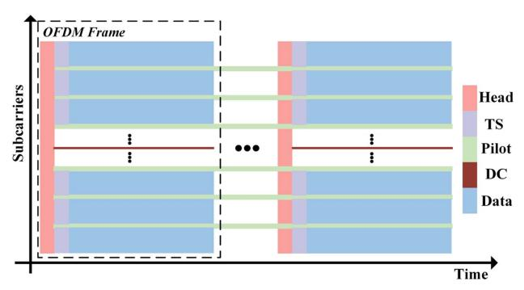

Fig. 2. Designed OFDM frame structure with multiple LFM pilots. By leaving one or more subcarriers empty at a certain interval among communication subcarriers in OFDM modulation, the LFM pilots are located in unused frequency slots. The inserted pilot sequence can facilitate both communication signal demodulation and vibration sensing.

<span id="page-2-0"></span>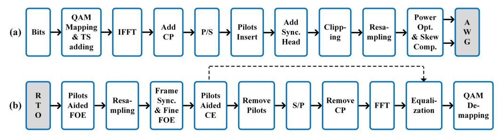

**Fig. 3.** Fronthaul OFDM communication DSP flow for the transmitter and receiver sides. (a) The QAM-modulated OFDM symbols are generated and projected, with a cyclic prefix added to each symbol. A synchronization header is included at the beginning of each frame, followed by several training symbols to enable initial channel estimation. LFM pilots are inserted at specific intervals of subcarriers in the frequency domain. Before transmitting the signal to the fiber and wireless channels, calibration is performed using S-parameter measurements. (b) Owing to the heterodyne A-RoF architecture adopted, distortions from both fiber and wireless channels are jointly processed. LFM pilots assist in both digital down-conversion to the baseband and channel estimation. After their information is extracted, the LFM pilots can be removed.

The communication DSP flow of the transmitter side is shown in Fig. 3(a). The transmitted bits are first mapped into quadrature amplitude modulation (QAM) for each subcarrier, with only one training symbol added in front of the payload to perform the initialization of the channel estimation. The modulation format of the training symbol is binary phase shift keying (BPSK). It should be noted that we periodically vacate one or more subcarriers at a fixed interval of channels to spare the space for LFM pilots. After the inverse fast Fourier transform (IFFT), OFDM symbols in the time domain are added cycle prefixes (CPs) to eliminate the inter-symbol interference (ISI) and maintain the orthogonality between subcarriers.

Then, we insert LFM pilots into these grids by directly adding them to the serial data stream, filling the notches of the spectrum. The LFM pilots can be expressed as

$$P(t) = \sum_{k=1}^{N_p} A(t) \exp\left(j \cdot \left(2\pi \left(kf_{\text{int}} - \frac{1}{2}\gamma T_0\right)t + \pi \gamma t^2\right)\right) + \sum_{k=-N_p}^{-1} A(t) \exp\left(j \cdot \left(2\pi \left(kf_{\text{int}} + \frac{1}{2}\gamma T_0\right)t - \pi \gamma t^2\right)\right),$$
(1)

where P(t),  $2N_p$ , A(t),  $f_{\rm int}$ ,  $\gamma$ , and  $T_0$  are inserted LFM pilots, number of pilots, window function, interval of frequency, chirp rate, and duration time, respectively. Channel estimation and coarse FOE can be implemented using LFM pilots, while the time duration of each LFM pilot is across several frames and the frequency is separated from the data subcarriers. After loading the LFM pilots, a sequence of robust frame synchronization and fine FOE is inserted at the beginning of each frame [39]. The synchronization head exhibits excellent autocorrelation properties, characterized by a high peak-to-sidelobe ratio (PSLR), and can also be utilized for fine FOE in the subsequent receiver DSP. Thanks to the peak-to-average power ratio (PAPR) optimization of superimposed LFM pilots using a genetic algorithm (GA) (see Appendix A), the final OFDM frame before the clipping process achieves a relatively low PAPR.

After propagation through the optical fiber, the OFDM signal undergoes pulse evolution governed by the nonlinear Schrödinger equation. Given that fronthaul transmission

distances are typically below 50 km and the bandwidth of the wireless OFDM signal is at the GHz level, the effects of chromatic dispersion and fiber nonlinearity can be neglected. Thus, in a typical short-reach optical front-haul system, the main challenges for receiver-side DSP in OFDM demodulation are carrier recovery, including frequency offset estimation (FOE) and phase recovery, as well as channel estimation of the frequency response.

Details of the receiver-side DSP flow are shown in Fig. 3(b). Moreover, these DSP procedures can also be effective after the wireless channel, enabling joint processing of the OFDM signal throughout the entire optical and wireless channel in an analog RoF system. Initially, we need to coarsely estimate the carrier frequency of the OFDM symbol using the LFM pilots before resampling the raw data to an appropriate sample rate for further DSP. The estimated frequency offset can be expressed as

$$f_{\text{coarse}} = \frac{1}{2N_p} \left( \sum_{k=1}^{N_p} f_k + \sum_{k=-N_p}^{-1} f_k \right),$$
 (2)

where  $f_k$  are the frequencies of the symmetric LFM pilots. Then, we perform OFDM frame synchronization and fine FOE using the frame head, with the synchronization principles and fine FOE metrics detailed in Appendix B. The synchronization sequence used has a very high accuracy of correct detection and is robust to frequency offset and deep fade. After these processes, we obtain a complete OFDM symbol in the baseband without frequency offset.

Figure 4 shows the de-chirp process of the LFM pilots to obtain the frequency response, which assists in the subsequent equalization and removal of the LFM pilots. First, we multiply the signal by the LFM signal with an inverse chirp rate  $\exp(-j\pi\gamma t^2)$ . Then, a multi-band digital bandpass filter is applied to filter out the de-chirped LFM pilots in the positive sideband, which can then be used for frequency response estimation and subtracted from the signal. Similarly, this operation is repeated for the negative sideband. The OFDM signal, now devoid of LFM pilots, can then be processed in the same way as in the standard demodulation stages. After serial-to-parallel (S/P) conversion, CP removal, and FFT, the OFDM symbols are equalized using the obtained frequency response before QAM demapping. It should be noted that the initial phase

<span id="page-3-0"></span>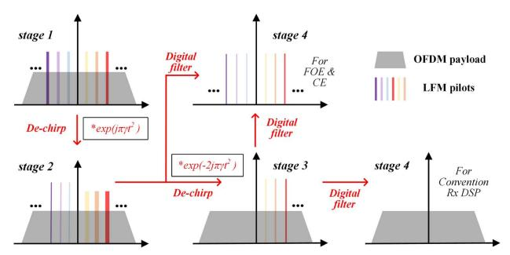

**Fig. 4.** Using LFM pilots for frequency offset estimation (FOE) and channel estimation (CE). Stage 1: the received OFDM spectrum with the LFM pilots. Stage 2: a chirp is inversely multiplied to convert the lower sideband LFM pilots into discrete multi-tone frequencies. Stage 3: after a digital filter isolates the lower sideband pilots, another chirp is applied to transform the upper sideband LFM pilots into discrete multi-tone frequencies, which are then filtered out. Stage 4: the multiple LFM pilots are separated from the OFDM payloads. The LFM part is sent to the FOE and CE module, and the payloads are sent to conventional DSP.

of each subcarrier is provided by a one-symbol-length training sequence, and a simple phase rotation within  $\pm 5$  deg is required to mitigate the residual phase offset. In addition, the power ratio between the communication payload and the LFM pilots should be carefully chosen to balance both communication and sensing performance, as discussed in the experimental section.

## **B. LFM Pilots Aided Ultra-large Dynamic Vibration Sensing**

In traditional DAS systems, a pulse is launched into the fiber, and RBS light is received and demodulated at the transmitter side as the pulse propagates along the fiber. Since the sensing resolution is determined by the pulse width, achieving higher sensing resolution requires a narrower pulse width. However, narrow pulses with low power result in shorter sensing lengths, leading to a trade-off between sensing length and resolution in traditional DAS systems. Furthermore, it is challenging to seamlessly integrate traditional pulse-based DAS with deployed communication systems.

Fortunately, pulse compression DAS mitigates the trade-off between sensing length and resolution, as it does not require the probe signal to be a pulse, unlike traditional DAS systems. The scheme of pulse compression DAS is shown in Fig. 5. We first consider a continuous repeated LFM signal as an example. After injecting the repeated LFM signal into the fiber, the received RBS signal motivated by the continuous probe can be expressed as

$$r(t) = (\exp(j(2\pi k f_{st}t + \pi \gamma t^2))\operatorname{rect}(t/T))_{\text{repeated}} * h_{\text{FUT}}(t),$$

(3)

where  $h_{\text{FUT}}(t)$  denotes the ideal impulse response of a fiber backscattered system, \* represents the convolution operation, and  $f_{\text{st}}$  and T are the start frequency and the repetition period of the continuous LFM probe, respectively. Therefore, by

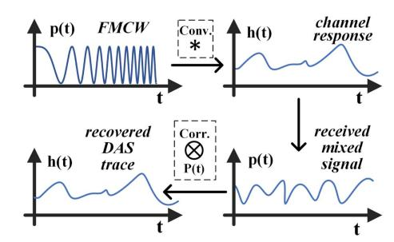

**Fig. 5.** Operating theory of the LFM/frequency-modulated continuous-wave (FMCW) pulse-compression DAS.

continuously sliding a match filter to correlate with the received RBS signal, we can obtain

$$s(t) = r(t) \otimes \exp(j(2\pi k f_{st}t + \pi \gamma t^2)) = p(t) * h_{FUT}(t)$$

$$= \left(\frac{\sin(\pi \gamma (T - |t|)t)}{\pi \gamma t} \exp\left(j2\pi \left(f_{st} + \frac{\gamma T}{2}\right)t\right)\right)$$

$$* h_{FUT}(t),$$
(4)

where  $\otimes$  denotes the correlation operation, and p(t) is the equivalent probe pulse, which is also known as the compressed pulse. Therefore, the true  $\phi$ -OTDR traces are acquired using the aforementioned sliding match filter, with the sensing resolution determined by the 3 dB bandwidth of the auto-correlation peak. Moreover, due to the continuous probe signal instead of a pulse, the power of the equivalent pulse can be significantly higher, bypassing the limitations of fiber nonlinearities such as modulation instability (MI) and stimulated Brillouin scattering (SBS), thereby enabling long-haul sensing in pulse compression DAS.

If there is strain on the fiber somewhere, a phase difference  $\delta \phi$  can be detected by interrogating the fiber, which can be analytically expressed as [40]

$$\delta\phi_{ij} = \frac{4\pi f_c}{c} (n \cdot \Delta z_{ij} + \Delta n \cdot z_{ij}) = \frac{4\pi f_c}{c} (n + C_e) z_{ij} \Delta \varepsilon,$$
(5)

where  $f_c$  is the carrier frequency, n is the effective refractive index,  $z_{ij}$  is the distance between ith and jth scattering elements,  $C_{\varepsilon}$  is strain refractive index parameter, and  $\Delta \varepsilon$  denotes the magnitude of the strain. In Eq. (5), the time-varying term  $\delta \phi$  can be compensated by a frequency shift  $f_{\rm shift}$  shown as

$$\delta\phi_{ij} = \frac{4\pi n z_{ij}}{f} f_{\text{shift}}.$$
 (6)

Hence, we establish a unique mapping from the strain intensity to the shift of the RBS spectrum if we can obtain OTDR traces of different wavelengths. In contrast, the output phase shift of the DAS system based on the phase demodulation always falls within the range of  $-\pi$  to  $+\pi$ . Table 1 compares a series of key parameters between the phase demodulation method and the frequency demodulation method. In the case of a probe wavelength around

(7)

<span id="page-4-0"></span>Table 1. Comparison between Frequency Demodulation and Phase Demodulation in DAS Using the LFM Pilots

| Demodulation       | Frequency                                  | Phase                                   |
|--------------------|--------------------------------------------|-----------------------------------------|
| Fading             | No fading                                  | Polarization &<br>interference fading   |
| Computation load   | High                                       | Low                                     |
| Resolution         | Corresponding<br>to the probe<br>bandwidth | Corresponding to the<br>probe bandwidth |
| Static measurement | Yes                                        | No                                      |
| Strain sensitivity | Coarse                                     | Fine                                    |
| Dynamic range      | Large                                      | Narrow                                  |

1550 nm, 1 με corresponds to a 150-MHz frequency shift of the RBS spectrum [\[25](#page-11-0)].

According to Eq. ([1\)](#page-2-0), we can make use of multiple LFM pilots to reconstruct an RBS spectrum. The frequency demodulation enabled by multiple LFM pilots is shown in Fig. 6. The integrated scheme utilizes multiple LFM pilots in OFDM communication and effectively leverages the large bandwidth characteristics of communication signals to achieve a high dynamic range sensing.

Figure 7 shows the DSP flow after receiving the backscattered sensing signal stimulated by the LFM pilots of forward transmission. A simple synchronization is carried out between segments to mitigate the jitter of the sampling trigger, followed by the frequency demodulation or phase demodulation. The least mean square (LMS) algorithm is adopted to obtain the frequency shift of certain positions between segments, eventually demodulating the vibration [\[41\]](#page-12-0). The mean square error (MSE) of the LMS can be expressed as

$$MSE(t, \Delta f) = \frac{1}{F - |\Delta f|} \sum_{f = -F + |\Delta f|}^{F - |\Delta f|} (h_{ref}(t, f + \Delta f) - h_{mea}(t, f))^{2}$$

where F is the frequency spectrum range, equal to the whole OFDM communication bandwidth. MSE is calculated with each frequency shift Δf between the reference RBS spectrum href and the measurement RBS spectrum hmea, while our goal is to minimum the MSE. Hence, the frequency shift could be derived as

$$f_{\text{shift}} = \underset{\Delta f}{\operatorname{arg\,min}}(\text{MSE}_{\text{ref,mea}}).$$
 (8)

Furthermore, to enhance the spectrum resolution, interpolation can be performed [[42](#page-12-0)] between the LFM pilots, whose frequency is located at the interval of certain subcarriers number. By using the frequency demodulation method, an ultra-large

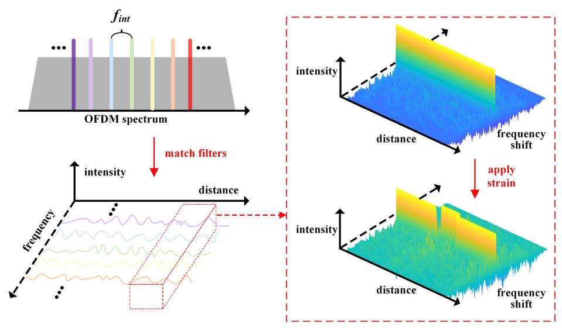

Fig. 6. Matched filters are used to obtain ϕ-OTDR traces from different LFM pilots. In the frequency domain, LFM pilots are inserted at specific intervals of subcarriers within the OFDM spectrum, separated from the subcarriers carrying payloads. At the sensing receiver, matched filters are applied to each LFM pilot, reconstructing the RBS spectrum at each point along the fiber. If strain occurs at a specific point, the demodulated RBS spectrum shifts accordingly.

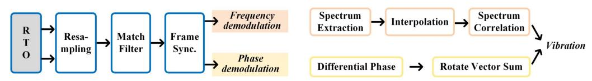

Fig. 7. The two demodulation methods of DAS for recovering vibration are frequency demodulation and phase demodulation. In frequency demodulation, the DSP compares the RBS spectra at different times, while in phase demodulation, the DSP compares the differential phase at different times.

dynamic range for vibration sensing can be achieved with the help of LFM pilots through the proposed ISACoF scheme.

## 3. PROOF-OF-CONCEPT EXPERIMENT AND RESULTS

We carry on the experiment to verify the proposed integrated large dynamic sensing and communication scheme over an RoF system, as shown in Fig. 8. The linewidth of the fiber laser (NKT X15) used in the ISAC scheme is around 100 Hz to ensure sufficient coherent length. An intensity modulator (iXblue MX-LN-40) is driven by a microwave signal generator (Keysight E8257D) to generate two sideband carriers, while the frequency of the electrical microwave signal determines the radio band of the OFDM signal. Then, the light is split into two tributaries by a polarization maintained optical coupler (PM-OC) to keep the same polarization for both sidebands. In the upper arm, an arbitrary waveform generator (AWG, Keysight M8190A) with a sampling rate of 12 GSa/s is used to generate the OFDM baseband signal. We first generate the OFDM signal occupying about 1.8-GHz bandwidth and composed of 896 subcarriers, every 7 of which insert an LFM pilot tone to perform sensing and channel estimation. It should be noted that each LFM pilot occupies 2 subcarrier grids to avoid crosstalk between pilots and data channels. Subsequently, the analog OFDM signal is directly modulated by an IQ modulator (Fujitsu 7962EP) without a digital quantization procedure. Meanwhile, the lower sideband carrier is amplified by a polarization maintained EDFA to adjust the carrier-to-signal power ratio. In the following, the upper arm and the lower arm are combined by a PM-OC and then transmitted to a 10-km fiber under test (FUT) spool after an EDFA. There is also a 60-m piezoelectrical transducer (PZT) at the end of the fiber, and a variable optical attenuator (VOA) is used before the photodiode (PD) to keep the received optical power the same. In the AAU side, only one PD is needed to receive the optical radio signal. Therefore, the heterodyne A-RoF scheme can take advantage of the no up-converting process remotely. The radio signal directly generated by the PD can then be sent to the phased array antenna, as detailed in Appendix [C.](#page-10-0) The two MMW phased arrays with a 3-dB bandwidth between 27.2 GHz and 29 GHz can operate in two modes, one is the intermediate frequency (IF) mode and the other is the RF mode, corresponding to two types of wireless transceivers. Due to the low quantum efficiency of the PIN diode, we increase the adjustable transmitter gain up to 55 dB before free space transmission, including gains from a low noise amplifier (LNA), a power amplifier (PA), and an antenna. After 4-m transmission, the radio OFDM signal is detected by the other MMW phased array and then mixed into an IF signal. The IF waveform is directly captured and sampled by an 80-GSa/s oscilloscope (Keysight DSAZ594A), followed by the post communication DSP flow. Meanwhile, we use an integrated coherent receiver (ICR) and a 4-GSa/s oscilloscope to demodulate the sensing results and match the bandwidth of RBS signal.

We first analyze the communication performance of the LFM pilot aided RoF system. The baseband OFDM spectrum is shown in Fig. [9](#page-6-0)(a), with an inset providing a zoomed-in view of the spectrum. The LFM signal is periodically distributed at an interval of 7 subcarriers, 5 of which are allocated to OFDM payloads and 2 to pilots. This interval was carefully selected to achieve desirable trade-offs among communication performance, sensing sensitivity and range, and overall spectral efficiency under the experimental conditions. To address the PAPR increase caused by multiple LFM pilots, the genetic algorithm (GA), as detailed in Appendix [A](#page-9-0), is used to adaptively adjust the initial phase of the pilots. Figure [9\(](#page-6-0)b) compares the PAPR values under different initial phase allocation methods for varying numbers of subcarriers. We define the power ratio between the OFDM payloads and the LFM pilots as the signalto-pilot ratio (STPR). For a fair comparison, simulations are conducted under STPR = 6 dB when pilots are inserted. Without pilots, the PAPR of the OFDM payload is approximately 10–11 dB. When LFM pilots are inserted and their initial phases are optimized using GA, the PAPR increases by about 0.5 dB. In contrast, conventional quadratic phase distribution and random phase distribution increase the PAPR by more than 1 dB. It is worth noting that GA has a more significant effect on PAPR reduction under lower STPRs. For further investigation, the number of subcarriers, subcarrier spacing, STPR, and sweeping bandwidth of the LFM pilot are fixed at 896, 2 MHz, 6 dB, and 2 MHz, respectively.

Since the radio signal is generated by the beat between the single optical tone and the IQ-modulated OFDM signal, the carrier-to-signal power ratio (CSPR) is defined as the power

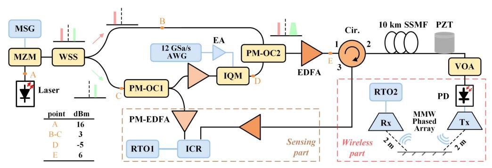

Fig. 8. MMW optical-wireless fronthaul experimental setup. MSG, microwave signal generator; MZM, Mach–Zehnder modulator; WSS, wavelength selective switch; PM-OC, polarization maintained optical coupler; IQM, IQ modulator; EDFA, erbium-doped fiber amplifier; EA, electrical amplifier; Cir, circulator; PZT, piezoelectric transducer; VOA, variable optical attenuator; PD, photodiode; RTO, real-time oscilloscope; ICR, integrated coherent receiver.

<span id="page-6-0"></span>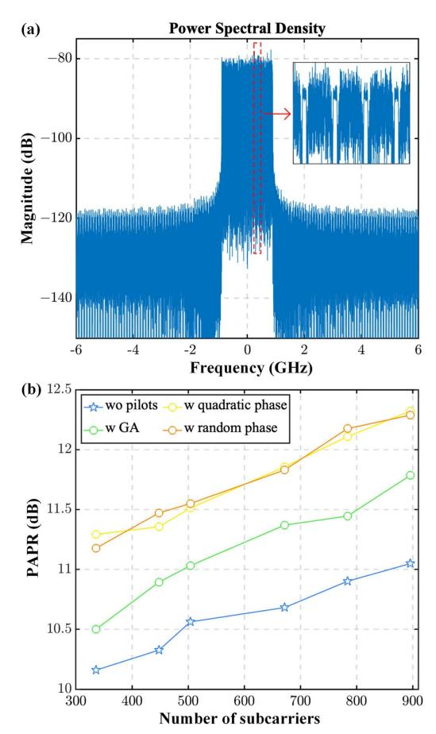

Fig. 9. (a) Baseband frequency spectrum of the transmitted OFDM symbols, consisting of 896 subcarriers and a bandwidth of 1.8 GHz. (b) PAPR of the entire OFDM signal, including both LFM pilots and OFDM payloads. The impact of different initial phase distributions on PAPR is analyzed.

ratio between them. Because the single optical tone is much stronger than the IQ-modulated OFDM signal, its power can be treated as the launch power (LP) of the fiber system. We transmit 64-QAM modulated OFDM symbols and scan the CSPR to evaluate the relationship between CSPR and bit error rate (BER) performance at LP = 7 dBm. Initially, the phased array is switched to the IF mode, centering the PD-received OFDM signal at 2.9 GHz. After evaluating the transmission performance in the IF mode, we switch the phased array to the RF mode, without electrical up-conversion inside it, simulating a practical situation where no local oscillator (LO) is present at the AAU side. Figure 10(a) shows that when CSPR exceeds 11 dB, BER significantly increases as CSPR increases. However, when CSPR is below 10 dB, this trend becomes less apparent, indicating that the OFDM signal, which beats with the high-power single tone, enters the gain saturation region at CSPR < 10 dB. This also suggests that a CSPR of 10 dB is sufficient to avoid being the dominant noise source in the system. Additionally, the BER in the RF mode outperforms that in IF mode, likely due to circuit losses during up-conversion, pink noise, or distortions caused by the mixer, such as LO leakage and conversion noise [\[43](#page-12-0)]. Therefore, RF mode is used for

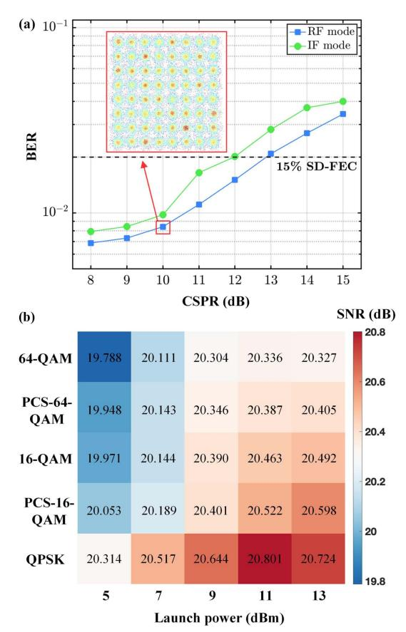

Fig. 10. (a) Relationship between communication performance and CSPR is evaluated for 64-QAM-OFDM modulation, a transmission distance of 10 km, a signal-to-pilot ratio (STPR) of 6 dB, and a fiber launch power of 7 dBm. The BER remains below the 15% softdecision forward error correction (SD-FEC) threshold when the CSPR is less than 13 dB. (b) Additionally, the communication performance is measured for different modulation formats and fiber input powers at CSPR = 10 dB. The modulation formats include QPSK, PCS-16-QAM, 16-QAM, PCS-64-QAM, and 64-QAM, while the launch power ranges from 5 dBm to 13 dBm.

subsequent experiments, corresponding to the photonics-generated MMW heterodyne RoF demonstration.

Next, we fix CSPR = 10 dB and STPR = 6 dB and vary the LP and modulation formats, as shown in Fig. 10(b). We observe that high launch powers are feasible in this radio access network since fiber nonlinearity is negligible within a 10-km distance. It is only when LP exceeds 10-dBm that the demodulated SNR remains unchanged or slightly decreases, likely due to the stimulated Brillouin scattering (SBS) effect of the single optical tone. Additionally, both probabilistic constellationshaped 16-QAM and 64-QAM (PCS-16-QAM and PCS-64-QAM) are evaluated with entropies of 3 bits/symbol and 5 bits/symbol, respectively.

We further examine the relationship between STPR and transmission performance. With CSPR = 10 dB and LP = 10 dBm, we vary the STPR from 3 dB to 12 dB and the pilot interval from 5 to 21 subcarriers to investigate BER variation for the 16-QAM OFDM radio system. Since the LFM pilots also serve as sensing probes, a lower STPR enhances

<span id="page-7-0"></span>sensing performance. However, because the OFDM payloads and LFM pilots share the total available optical power and quantization levels, reducing STPR consequently degrades communication performance. Figure 11(a) confirms that decreasing STPR leads to a deterioration in BER. Furthermore, the sweeping bandwidth of the LFM pilots, set here at 2 MHz, occupies 50% of the bandwidth allocated for the two subcarriers. We then adjust the sweeping bandwidth, effectively varying the percentage of pilot occupancy within the 2-subcarrier bandwidth. Figure 11(b) shows that communication performance degrades with an increase in the sweeping bandwidth of the LFM pilot. This degradation occurs due to the overlap between adjacent subcarriers and pilots in the frequency domain, degrading their SNR when the LFM pilots are removed. However, there also exists a tradeoff between the sweeping bandwidth of the LFM pilots and communication performance. Specifically, the sensing resolution in pulse-compression DAS systems is directly proportional to the sweeping bandwidth of the LFM pilots. Potential methods for increasing the sweeping bandwidth include expanding the overall communication bandwidth, reducing the total number of subcarriers, or allocating additional subcarriers exclusively for pilot signals. Considering practical simplicity and balancing the trade-off between sensing and communication

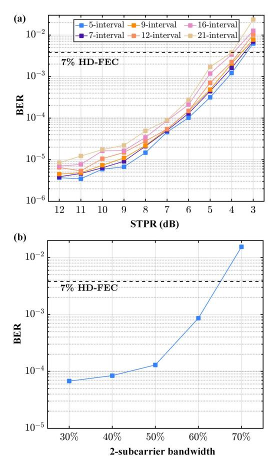

Fig. 11. (a) Communication performance is evaluated for different STPRs and pilot intervals, with CSPR = 10 dB and LP = 10 dBm. (b) Relationship between the BER of all subcarriers and the sweeping bandwidth of the LFM pilots.

performance, we selected a moderate subcarrier occupancy rate of 50% (corresponding to a bandwidth of 2 MHz) and an STPR of 6 dB for the subsequent sensing experiments.

After coherently receiving the RBS signal stimulated by the radio OFDM signal, matched filters are used to obtain DAS traces at different frequencies. Thanks to frequency isolation, each DAS trace achieves a high SNR above the noise floor, sufficient for short-reach access networks below 20 km. Figure 12(a) shows the unique RBS spectrum of each point along the 10-km fiber, where the color represents intensity. During the experiment, 128 DAS traces are obtained from 128 LFM pilots with an STPR of 6 dB, and the duration of each pilot is 200 μs. When strain or vibration is applied to a specific section of the fiber, the RBS spectrum shifts in proportion to the intensity of the vibration. Moreover, cubic polynomial interpolation with a factor of 100 is used to fit the RBS spectrum of each point, improving the accuracy of measurement. A 60-m PZT is placed at the end of the fiber and is first driven by an 80-Hz, 1-V peak-to-peak (Vpp) sine waveform. To achieve a 1-kHz interrogation rate for the DAS system, the oscilloscope is triggered with pulses of a 1 kHz repetition period. From the waterfall plot shown in Fig. 12(b), a periodic frequency shift is observed at approximately 9.84 km, indicating vibration at the end of the fiber.

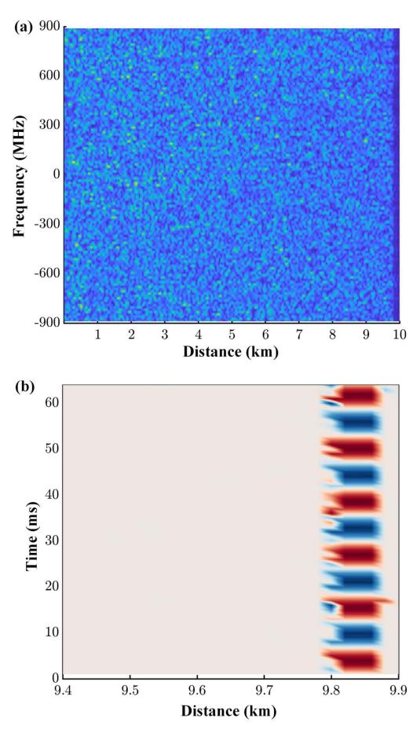

Fig. 12. (a) RBS spectrum after matched filtering along the 10-km fiber. Different colors represent varying RBS intensities across different frequencies and distances. (b) Time-distance waterfall plot near the end of the 10 km fiber, where a 60 m PZT is located.

The PZT driving voltage is then varied to verify the linear response between the applied strain and the frequency shift, as shown in Fig. 13(a). Notably, the 1.8-GHz OFDM bandwidth enables the measurement of frequency shifts up to 900 MHz, corresponding to a 6-με vibration. Additionally, the 2-MHz sweeping bandwidth yields a sensing resolution of 50 m, as illustrated in Fig. 13(b). In this trace for a specific segment, a frequency shift is clearly observed, indicating strain at that moment. It should be noted that the communication RoF signal bandwidth is typically fixed, implying that the maximum achievable dynamic range is also fixed. As a result, we can optimize sensing sensitivity to achieve the best possible performance at a defined dynamic range. Moreover, owing to the large bandwidth available from ROF signals (compared to conventional dedicated DAS probes), the ISACoF system inherently offers an improved dynamic range compared with most previously reported DAS systems [[40\]](#page-12-0), thus effectively accommodating varying levels of vibration intensity in practical applications.

The frequency response of the vibration measurement is tested by applying a chirp-driven signal ranging from 20 Hz to 100 Hz to the PZT. Figure 14(a) demonstrates a flat frequency response, and the chirp vibration is successfully

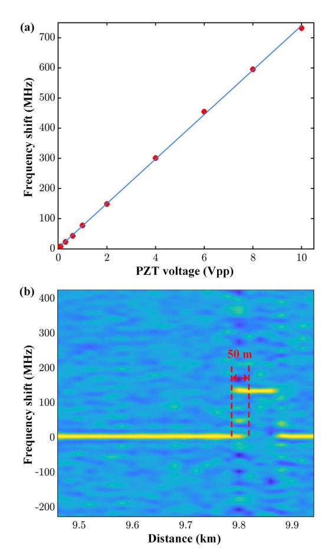

Fig. 13. (a) Applied PZT voltages and their corresponding frequency shifts in the RBS spectrum. The fitted curve demonstrates high linearity. (b) The RBS spectrum at the vibration point shifts proportionally to the vibration intensity, while the sensing resolution is determined by the equivalent pulse width.

recovered, validating the system's ability to capture acoustic signals over a wide frequency range. To compare phase demodulation and frequency demodulation, we also perform phase demodulation by summing the DAS traces using the rotated-vector-sum (RVS) method, as described in Fig. [7.](#page-4-0) After normalizing the two recovered vibration waveforms at the same point but using different methods, Fig. 14(b) shows that vibration is successfully demodulated through the frequency method, while the phase demodulation waveform wraps due to large vibrations.

To analyze sensing sensitivity at the end of the 10-km fiber, a long-term RBS signal lasting 2 seconds is collected under a 50-Hz sinewave vibration, as shown in Fig. [15\(](#page-9-0)a). After normalization with a window function, the single-sideband (SSB) power spectral density (PSD) of the recovered waveform is derived. The noise floor is approximately −45 dB across frequencies, corresponding to a strain sensitivity of 0.81 nε∕ ffiffiffiffiffiffi Hz p . Finally, to investigate how STPR influences sensing sensitivity, Fig. [15\(](#page-9-0)b) scans the STPR from 3 dB to 10 dB to observe the measured strain sensitivity under different power ratios between communication payloads and pilots, together with 4 different pilot intervals. Referring to Figs. [11\(](#page-7-0)a) and [15](#page-9-0)(b), an STPR of 6 dB represents an effective trade-off for the experimental performance, as at this point the BER is well

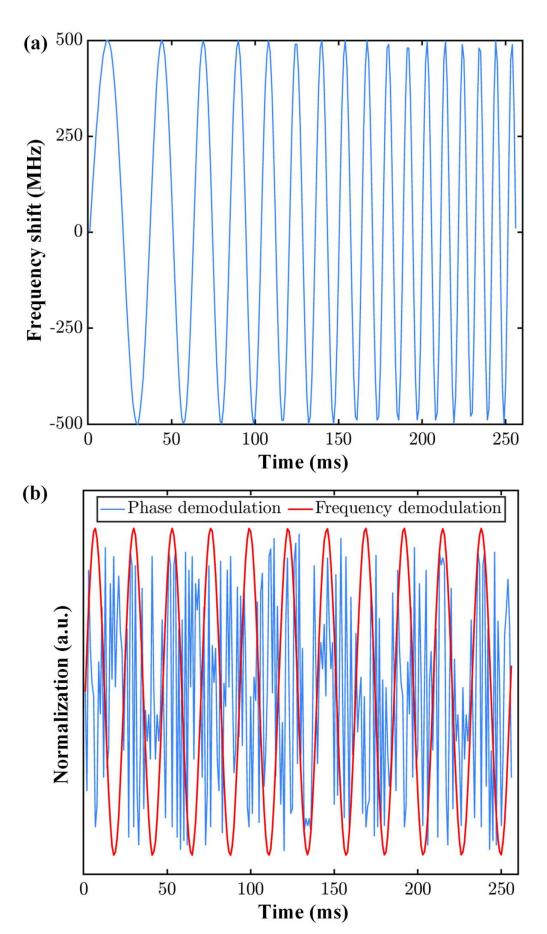

Fig. 14. (a) Recovered chirp-wave vibration with a frequency sweep from 20 Hz to 100 Hz. (b) Comparison of phase demodulation (blue line) and frequency demodulation (red line) for recovering the same sine-wave vibration under a 2Vpp voltage applied to the PZT.

<span id="page-9-0"></span>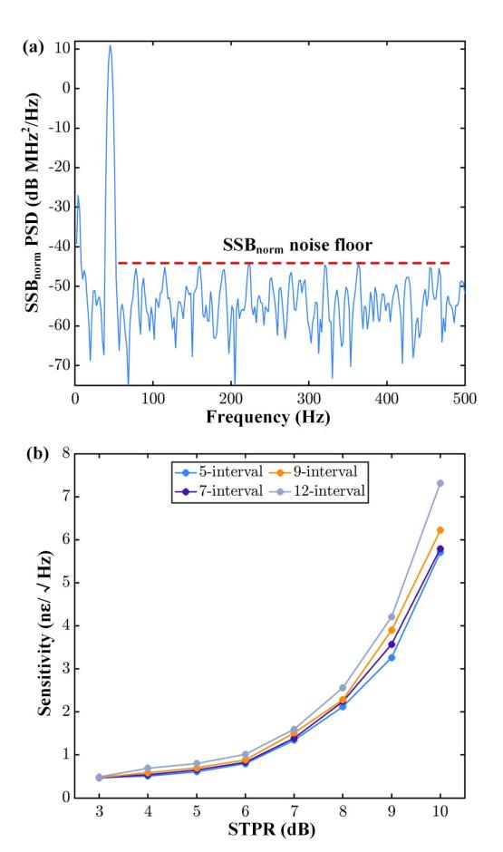

**Fig. 15.** (a) 50-Hz vibration is sampled over a duration of 2 s, and its normalized single-sideband power spectral density is calculated to determine the sensing sensitivity at the fiber end. (b) The relationship between the sensing sensitivity and the STPR shows that sensing sensitivity decreases as STPR increases.

below the FEC threshold, and sensing sensitivity has not yet decreased significantly.

By designing a combined waveform simultaneously utilized for both communication and sensing, the proposed ISACoF scheme, employing multiple LFM pilots, achieves more seamless integration compared to the LFM-carrier-based ISACoF system previously demonstrated for 5G RoF fronthaul scenarios [44]. Furthermore, unlike wavelength-division multiplexing (WDM)-based ISACoF systems [45–47], this approach of directly reusing communication pilots as DAS probe signals significantly enhances spectral efficiency, thereby realizing a highly cost-effective ISACoF solution.

#### 4. CONCLUSION

In this paper, we have designed and demonstrated a novel LFM pilot aided OFDM signal that is compatible with existing communication setups in practice. The continuous LFM pilots not only assist in the demodulation process at the communication receiver-side DSP but also serve as sensing probes to detect strain or vibration along the fiber using pulse compression techniques. Furthermore, leveraging the large bandwidth of the communication OFDM symbol, an ultra-large dynamic range

for frequency-demodulated vibration sensing can be achieved, thereby overcoming the limitations of traditional phase-demodulation-based DAS in large-scale vibration scenarios.

We have experimentally validated the proposed ISACoF method by transmitting 128-LFM-pilot-aided OFDM symbols through a 10-km fiber and 4-m free-space channel. With a 1.8-GHz MMW radio signal operating within a frequency range of 27.2 GHz to 29 GHz, dynamic vibration measurements of up to 6  $\mu$ s have been achieved. Through optimization of the power ratio between OFDM payloads and LFM pilots, a sensing sensitivity of 0.81 ne/ $\sqrt{\rm Hz}$  has been attained, along with a demodulated SNR exceeding 20 dB for 64-QAM-OFDM at an STPR of 6 dB. Additionally, the system parameters can be comprehensively designed and optimized in accordance with the specific requirements of practical applications, with trade-offs between sensing and communication dynamically and adaptively adjusted over time in response to evolving operational scenarios and practical needs.

# APPENDIX A: MINIMIZING THE PAPR OF DESIGNED OFDM SYMBOLS

Multiple LFM pilots with certain initial phase distributions can lead to a higher PAPR, which is undesirable for the quantization process. Therefore, it is crucial to determine the optimal initial phase distribution of LFM pilots to minimize PAPR. To achieve this, a GA can be used to iteratively update the optimal initial phase distribution.

#### **Algorithm 1.** GA for minimizing PAPR

```
Initialize parameters:
2:
     P(t) \leftarrow \text{LFM pilots}; \ 2N_p \leftarrow \text{number of pilots};
     N_{q} \leftarrow generation; P_{s} \leftarrow population size;
     C_r^{\circ} \leftarrow crossover rate; M_r \leftarrow mutation rate
     Initialize population:
6:
     P_s \times 2N_p random phase matrix \mathbf{P_m}
7:
     Define PAPR as the function of P(t), 2N_p, \mathbf{P_m}
8:
     Define fitness as the function of the negative PAPR
9:
10: for 1: N_{\sigma} do
11:
          Calculate fitness for each individual
12:
          Sort population by fitness
13:
          new population P_{new} = sort(P_m);
          while size(\mathbf{P_{new}}) < P_s do
14:
15:
             Randomly select two parents
16:
             if rand < C_r met then
17:
                Perform crossover, obtain offspring P_1
             if rand < M_r met then
18:
19:
                Perform mutation, obtain offspring P2
20:
             \mathbf{P}_{\text{new}} = [\mathbf{P}_{\text{new}}; \mathbf{P}_1; \mathbf{P}_2]
21:
          P_{\rm m} = P_{\rm new}
22: Output PAPR of the best solution: calculate and display
```

By defining PAPR as the target or fitness function in the GA, an optimal phase distribution can be obtained after several generations, maximizing the fitness function. The population size and number of generations significantly impact the runtime and complexity of the GA. However, we only need to calculate the initial phase distribution once since the LFM pilots remain unchanged during transmission. It has been shown that the GA can efficiently reduce the PAPR of multiple LFM pilots'

<span id="page-10-0"></span>superposition. For instance, the PAPR of a 128-LFM-pilot superposition with a duration of 200  $\mu$ s can be reduced to below 3 dB, compared to the commonly used quadratic phase distribution. Optimizing the PAPR of LFM pilots to a very low level helps reduce data points exceeding the threshold after combining with the payload, resulting in fewer points being discarded in the subsequent clipping process.

# APPENDIX B: THE OPERATION THEORY OF SYNCHRONIZATION AND FINE FOE SEQUENCE

In order to achieve high-precision synchronization and accurate frequency offset estimation while maintaining the cyclic prefix structure, we use the specially designed training sequence [39]. The employed training sequence **p** can be expressed as

$$\mathbf{p} = [A, A, -A, -A, A, -A, -A, -A],$$
  
 $A = \text{FFT}_{N/L}(C),$  (B1)

where A denotes the repeated identical pattern, N is the total length of training sequence, and L=8 for our training sequence. The repeated pattern is Zadoff–Chu sequence here to present a low PAPR and a high auto-correlation characteristic. Our goal is to find the maximum of the metric  $\Lambda$  and therefore the time index d, which can be expressed as

$$\Lambda(d) = \left(\frac{L}{L-1} \frac{|P(d)|}{E(d)}\right)^2,$$
 (B2)

where

$$P(d) = \sum_{L-2}^{k=0} b(k) \cdot \sum_{N/L-1}^{m=0} r^*(d+kN/L+m)$$
$$\cdot r(d+(k+1)N/L+m),$$
 (B3)

$$E(d) = \sum_{i=0}^{N/L-1} \sum_{k=0}^{L-1} |r(d+i+kN/L)|^2,$$
 (B4)

and b(k) = p(k)p(k+1), k = 0,1,...,L-1.

Then, the fine frequency offset estimator will also be given by the training sequence,

$$\Delta f = L/2\pi \sum_{m=1}^{L/2} \omega(m)\varphi(m), \qquad (B5)$$

where

$$\omega(m) = \frac{3(L-m)(L-m+1) - L^2/4}{L/2(L^2-1)},$$
 (B6)

$$\varphi(m) = [\arg\{R_y(m)\} - \arg\{R_y(m-1)\}]_{2\pi}, \quad 1 \le m \le L/2,$$
(B7)

$$R_{y}(m) = \frac{1}{N - mN/L} \sum_{k=mN/L}^{N-1} y(k - MN/L)y(k),$$
 
$$0 \le m \le L/2,$$
 (B8)

where  $[x]_{2\pi}$  represents the modulo  $2\pi$  operation and  $\arg\{R_{\nu}(m)\}$  is the argument of  $R_{\nu}(m)$ .

## APPENDIX C: MMW RADIO TRANSMITTER AND RECEIVER USING PHASED ARRAY

The wireless part, consisting of optical devices and two RF chains, is detailed in Fig. 16. To simulate a practical photonics-assisted MMW active antenna unit (AAU), we use an optical fiber to transmit the MMW OFDM signal and convert the optical information into radio signals using a high-bandwidth PD (Finisar 2150RQ, 40-GHz). The integrated 64-element phased array transmitter can operate in either IF mode or RF mode, both of which emit MMW radio signals into the air with a beam width of 12 deg. Inside the RF chain of the transmitter phased array, the output signal from the PD is first filtered and then pre-amplified by an LNA, followed by an up-conversion mixer when operating in IF mode. A PA and a variable attenuator (ATT) are added before splitting the radio signal into 64 channels, each with adjustable phases. Each element also includes an amplifier with variable gain ranging from 8.5 to 25 dB. Overall, the maximum adjustable gain, including antenna gain, is 65 dB.

On the receiver side, the 16-element phased array captures the MMW radio signal with a relatively wide reception angle and down-converts it to an IF signal ranging from 2 GHz to 3.8 GHz. The 16 elements are divided into 4 groups, with each group linked to a real-time oscilloscope (RTO). Both

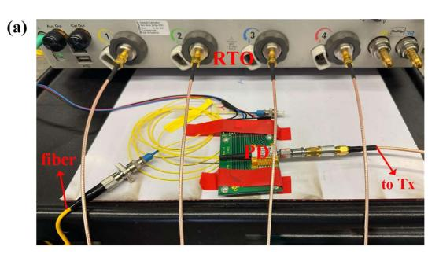

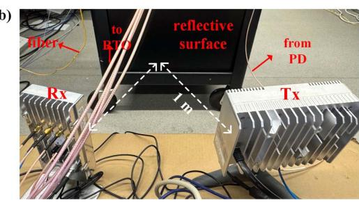

**Fig. 16.** MMW radio signal generation and reception setup. (a) The OFDM symbol beats with a single-frequency light after being received by the photodiode. The photonics-assisted MMW generation eliminates the need for an up-conversion process in the electrical domain. (b) A 64-element MMW phased array serves as the transmitter (Tx) antenna, while a 16-element MMW phased array serves as the receiver (Rx) antenna. The transmission data from the Tx are fed by the photodiode, and the received radio signal from the Rx is sent to the RTO. A reflective surface is used to construct a fixed-length wireless channel. The experimental MMW wireless transmission operates in the Ka band, ranging from 27.2 GHz to 29 GHz.

<span id="page-11-0"></span>the Tx and Rx MMW phased arrays operate in the frequency band of 27.2 GHz to 29 GHz, also known as the Ka-band. An iron plate is used as a reflective surface, enabling the radio OFDM signal to undergo 4-m free-space transmission. The collected data are then processed offline and sent to the receiver-side DSP flow, as illustrated in Fig. [3](#page-2-0). It should be noted that in multi-user simultaneous access scenarios, pilot contamination may occur when employing our proposed ISACoF scheme. Nevertheless, this issue can be effectively mitigated through beamforming techniques enabled by MMW phased arrays. Specifically, beamforming allows each user to predominantly receive signals from a distinct spatial direction associated with a particular base station, significantly reducing interference caused by pilots transmitted from other base stations.

Funding. Hong Kong Government (GRF 15227321, GRF 15212924).

Disclosures. The authors declare no conflicts of interest.

Data Availability. Data underlying the results presented in this paper are not publicly available at this time but may be obtained from the authors upon reasonable request.

### REFERENCES

- 1. C. Ranaweera, C. Lim, Y. Tao, et al., "Design and deployment of optical x-haul for 5G, 6G, and beyond: progress and challenges," [J. Opt.](https://doi.org/10.1364/JOCN.492334) [Commun. Netw.](https://doi.org/10.1364/JOCN.492334) 15, D56–D66 (2023).
- 2. E. Agrell, M. Karlsson, F. Poletti, et al., "Roadmap on optical communications," J. Opt. 26[, 093001 \(2024\).](https://doi.org/10.1088/2040-8986/ad261f)
- 3. C. Ranaweera, J. Kua, I. Dias, et al., "4G to 6G: disruptions and drivers for optical access," [J. Opt. Commun. Netw.](https://doi.org/10.1364/JOCN.440798) 14, A143–A153 (2022).
- 4. X. Pang, O. Ozolins, S. Jia, et al., "Bridging the terahertz gap: photonics-assisted free-space communications from the submillimeterwave to the mid-infrared," [J. Lightwave Technol.](https://doi.org/10.1109/JLT.2022.3153139) 40, 3149–3162 [\(2022\).](https://doi.org/10.1109/JLT.2022.3153139)
- 5. A. Hirata, M. Harada, and T. Nagatsuma, "120-GHz wireless link using photonic techniques for generation, modulation, and emission of millimeter-wave signals," [J. Lightwave Technol.](https://doi.org/10.1109/JLT.2003.814395) 21, 2145–2153 [\(2003\).](https://doi.org/10.1109/JLT.2003.814395)
- 6. T. Nagatsuma, G. Ducournau, and C. C. Renaud, "Advances in terahertz communications accelerated by photonics," [Nat. Photonics](https://doi.org/10.1038/nphoton.2016.65) 10, 371–[379 \(2016\).](https://doi.org/10.1038/nphoton.2016.65)
- 7. K.-I. Kitayama, A. Maruta, and Y. Yoshida, "Digital coherent technology for optical fiber and radio-over-fiber transmission systems," [J. Lightwave Technol.](https://doi.org/10.1109/JLT.2014.2310461) 32, 3411–3420 (2014).
- 8. P. Li, R. Xu, Z. Dai, et al., "A high spectral efficiency radio over fiber link based on coherent detection and digital phase noise cancellation," [J. Lightwave Technol.](https://doi.org/10.1109/JLT.2021.3104466) 39, 6443–6449 (2021).
- 9. A. Zin, M. Bongsu, S. Idrus, et al., "An overview of radio-over-fiber network technology," in International Conference on Photonics 2010 (IEEE, 2010), pp. 1–3.
- 10. A. Delmade, C. Browning, T. Verolet, et al., "Optical heterodyne analog radio-over-fiber link for millimeter-wave wireless systems," [J. Lightwave Technol.](https://doi.org/10.1109/JLT.2020.3032923) 39, 465–474 (2020).
- 11. Y. Zhu, X. Fang, C. Zhang, et al., "Analog RoF fronthaul carrying 27.6- Tb/s CPRI-equivalent rate and 512-QAM with sideband modulation for IQ imbalance separation and bi-directional transmission," in Optical Fiber Communication Conference (Optica Publishing Group, 2024), paper Tu3K-6.
- 12. H. Ji, C. Sun, and W. Shieh, "Spectral efficiency comparison between analog and digital RoF for mobile fronthaul transmission link," [J. Lightwave Technol.](https://doi.org/10.1109/JLT.2020.3003123) 38, 5617–5623 (2020).

- 13. Z. He and Q. Liu, "Optical fiber distributed acoustic sensors: a review," [J. Lightwave Technol.](https://doi.org/10.1109/JLT.2021.3059771) 39, 3671–3686 (2021).
- 14. Y. Rao, "Study on fiber-optic low-coherence interferometric and fiber Bragg grating sensors," [Photonic Sens.](https://doi.org/10.1007/s13320-011-0042-3) 1, 382–400 [\(2011\)](https://doi.org/10.1007/s13320-011-0042-3).
- 15. G. Marra, C. Clivati, R. Luckett, et al., "Ultrastable laser interferometry for earthquake detection with terrestrial and submarine cables," Science 361, 486–[490 \(2018\)](https://doi.org/10.1126/science.aat4458).
- 16. C. Pendão and I. Silva, "Optical fiber sensors and sensing networks: overview of the main principles and applications," [Sensors](https://doi.org/10.3390/s22197554) 22, 7554 [\(2022\)](https://doi.org/10.3390/s22197554).
- 17. M. A. Rahman, H. Taheri, F. Dababneh, et al., "A review of distributed acoustic sensing applications for railroad condition monitoring," [Mech.](https://doi.org/10.1016/j.ymssp.2023.110983) [Syst. Sig. Process.](https://doi.org/10.1016/j.ymssp.2023.110983) 208, 110983 (2024).
- 18. X. Jiang, C. Huang, X. Wang, et al., "Gnss-over-fiber sensing system for high precision 3D nodal displacement and vibration detection," [IEEE Photonics Technol. Lett.](https://doi.org/10.1109/LPT.2023.3251369) 35, 402–405 (2023).
- 19. M. Liu, J. Wang, C. Liu, et al., "Coexistence of distributed sensing and ultra-simple coherent RoF based front-haul for radio access network," [J. Lightwave Technol.](https://doi.org/10.1109/JLT.2025.3555486) 43, 5669–5675 (2025).
- 20. H. Zheng, J. Zhang, N. Guo, et al., "Distributed optical fiber sensor for dynamic measurement," [J. Lightwave Technol.](https://doi.org/10.1109/JLT.2020.3039812) 39, 3801–3811 [\(2020\)](https://doi.org/10.1109/JLT.2020.3039812).
- 21. Z. Wang, B. Lu, Q. Ye, et al., "Recent progress in distributed fiber acoustic sensing with Φ-OTDR," Sensors 20[, 6594 \(2020\).](https://doi.org/10.3390/s20226594)
- 22. F. Ito, X. Fan, and Y. Koshikiya, "Long-range coherent OFDR with light source phase noise compensation," [J. Lightwave Technol.](https://doi.org/10.1109/JLT.2011.2167598) 30, 1015– [1024 \(2011\)](https://doi.org/10.1109/JLT.2011.2167598).
- 23. H. He, S. Chen, C. Zhao, et al., "Sweep-free Brillouin optical correlation domain analysis utilizing digital optical frequency comb," in 2023 Optical Fiber Communications Conference and Exhibition (OFC) (IEEE, 2023), pp. 1–3.
- 24. Z. Wang, L. Zhang, S. Wang, et al., "Coherent Φ-OTDR based on I/Q demodulation and homodyne detection," [Opt. Express](https://doi.org/10.1364/OE.24.000853) 24, 853–858 [\(2016\)](https://doi.org/10.1364/OE.24.000853).
- 25. M. Froggatt and J. Moore, "High-spatial-resolution distributed strain measurement in optical fiber with Rayleigh scatter," [Appl. Opt.](https://doi.org/10.1364/AO.37.001735) 37, 1735–[1740 \(1998\)](https://doi.org/10.1364/AO.37.001735).
- 26. J. Xiong, Z. Wang, Y. Wu, et al., "Single-shot COTDR using subchirped-pulse extraction algorithm for distributed strain sensing," [J. Lightwave Technol.](https://doi.org/10.1109/JLT.2020.2968632) 38, 2028–2036 (2020).
- 27. E. Ip, J. Fang, Y. Li, et al., "Distributed fiber sensor network using telecom cables as sensing media: technology advancements and applications," [J. Opt. Commun. Netw.](https://doi.org/10.1364/JOCN.439175) 14, A61–A68 (2022).
- 28. C. Dorize, S. Guerrier, E. Awwad, et al., "Advanced fiber sensing leveraging coherent systems technology for smart network monitoring," in Optical Fiber Communication Conference (Optica Publishing Group, 2022), paper M2F–6.
- 29. J. Tang, X. Li, C. Cheng, et al., "Distributed vibration sensing and simultaneous self-homodyne transmission of single-carrier net 5.36 Tb/s signal using 7-core fiber," in Optical Fiber Communications Conference and Exhibition (OFC) (IEEE, 2024), pp. 1–3.
- 30. J. M. Marin, I. Ashry, O. Alkhazragi, et al., "Simultaneous distributed acoustic sensing and communication over a two-mode fiber," [Opt.](https://doi.org/10.1364/OL.473502) Lett. 47, 6321–[6324 \(2022\)](https://doi.org/10.1364/OL.473502).
- 31. G. Marra, D. Fairweather, V. Kamalov, et al., "Optical interferometry– based array of seafloor environmental sensors using a transoceanic submarine cable," Science 376, 874–[879 \(2022\).](https://doi.org/10.1126/science.abo1939)
- 32. Y. Yan, L. Lu, X. Wu, et al., "Simultaneous communications and vibration sensing over a single 100-km deployed fiber link by fiber interferometry," in Optical Fiber Communications Conference and Exhibition (OFC) (IEEE, 2023), pp. 1–3.
- 33. H. He, L. Jiang, Y. Pan, et al., "Integrated sensing and communication in an optical fibre," [Light Sci. Appl.](https://doi.org/10.1038/s41377-022-01067-1) 12, 25 (2023).
- 34. L. Andrenacci, D. Pilori, S. Pellegrini, et al., "Comparison between phase and polarization sensing using coherent transceivers over deployed metro fibers," in Optical Fiber Communication Conference (Optica Publishing Group, 2024), paper M2K–2.
- 35. E. Ip, Y.-K. Huang, G. Wellbrock, et al., "Vibration detection and localization using modified digital coherent telecom transponders," [J. Lightwave Technol.](https://doi.org/10.1109/JLT.2021.3137768) 40, 1472–1482 (2022).

- <span id="page-12-0"></span>36. Z. Hu, Y. Chen, H. Jiang, et al., "Enabling cost-effective high-performance vibration sensing in digital subcarrier multiplexing systems," Opt. Express 31, 32114–[32125 \(2023\).](https://doi.org/10.1364/OE.497616)
- 37. M. Mazur, N. K. Fontaine, R. Ryf, et al., "Real-time in-line coherent distributed sensing over a legacy submarine cable," in Optical Fiber Communication Conference (Optica Publishing Group, 2024), paper Th4B–8.
- 38. K. Seong, M. Mohseni, and J. M. Cioffi, "Optimal resource allocation for OFDM downlink systems," in IEEE International Symposium on Information Theory (IEEE, 2006), pp. 1394–1398.
- 39. H. Minn, V. K. Bhargava, and K. B. Letaief, "A robust timing and frequency synchronization for OFDM systems," [IEEE Trans. Wireless](https://doi.org/10.1109/TWC.2003.814346) Commun. 24, 822–[839 \(2003\).](https://doi.org/10.1109/TWC.2003.814346)
- 40. Y. Wang, H. Zheng, H. Wu, et al., "Coherent OTDR with large dynamic range based on double-sideband linear frequency modulation pulse," Opt. Express 31, 17165–[17174 \(2023\).](https://doi.org/10.1364/OE.485616)
- 41. S. Liehr, S. Münzenberger, and K. Krebber, "Wavelength-scanning coherent OTDR for dynamic high strain resolution sensing," [Opt.](https://doi.org/10.1364/OE.26.010573) Express 26, 10573–[10588 \(2018\)](https://doi.org/10.1364/OE.26.010573).

- 42. L. Costa, H. F. Martins, S. Martín-López, et al., "Fully distributed optical fiber strain sensor with 10–12 ε / ffiffiffiffiffiffi Hz p sensitivity," [J. Lightwave](https://doi.org/10.1109/JLT.2019.2904560) Technol. 37, 4487–[4495 \(2019\)](https://doi.org/10.1109/JLT.2019.2904560).
- 43. H. Darabi and A. A. Abidi, "Noise in RF-CMOS mixers: a simple physical model," [IEEE J. Solid-State Circuits](https://doi.org/10.1109/4.818916) 35, 15–25 (2000).
- 44. J. Wang, L. Lu, Y. Yan, et al., "Joint-design of ultra high resolution vibration sensing and optical heterodyne mm-wave RoF," in Conference on Lasers and Electro-Optics (CLEO) (Optica Publishing Group, 2024), paper SW4N.4.
- 45. M.-F. Huang, M. Salemi, Y. Chen, et al., "First field trial of distributed fiber optical sensing and high-speed communication over an operational telecom network," [J. Lightwave Technol.](https://doi.org/10.1109/JLT.2019.2935422) 38, 75–81 (2019).
- 46. Y.-K. Huang, Z. Wang, E. Ip, et al., "Field trial of coexistence and simultaneous switching of real-time fiber sensing and 400GbE supporting DCI and 5G mobile services," in Optical Fiber Communications Conference and Exhibition (OFC), (IEEE, 2023), pp. 1–3.
- 47. J. Wang, M. Liu, J. Zhang, et al., "Forward polarization sensing triggered area-focus DAS over a bidirectional coherent network," [Opt.](https://doi.org/10.1364/OL.554903) Lett. 50, 2227–[2230 \(2025\)](https://doi.org/10.1364/OL.554903).