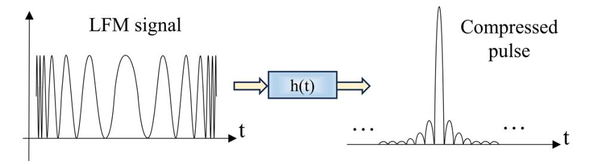
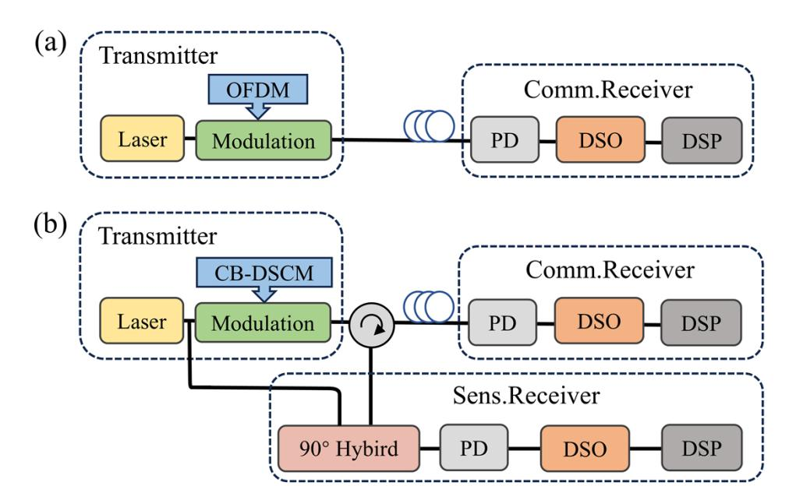
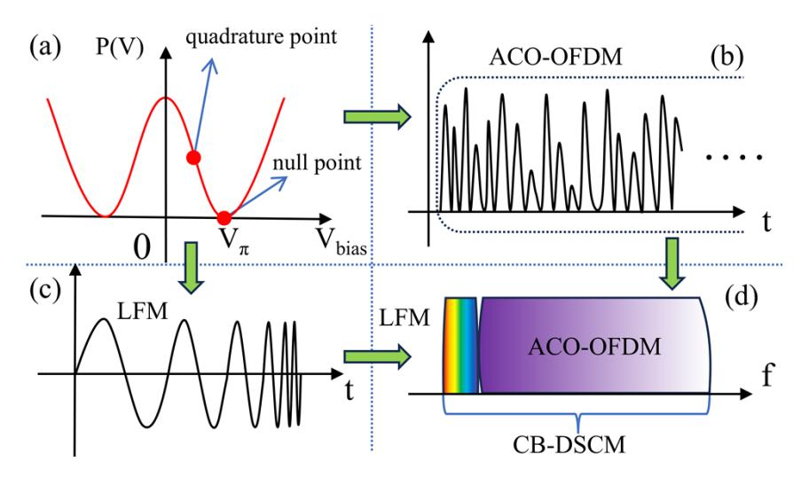
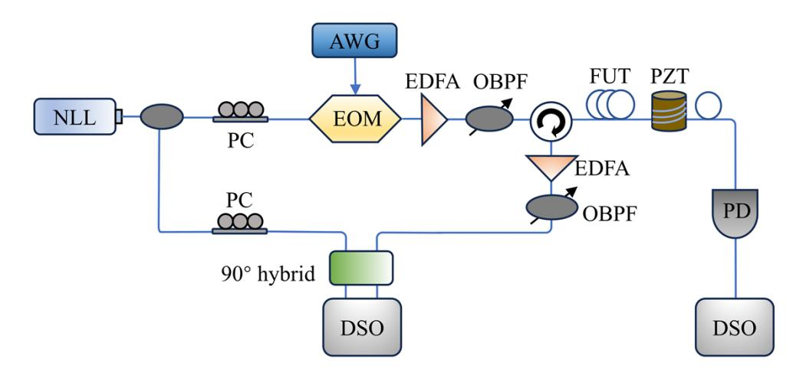
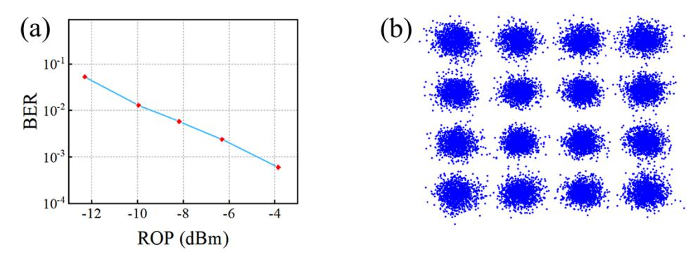
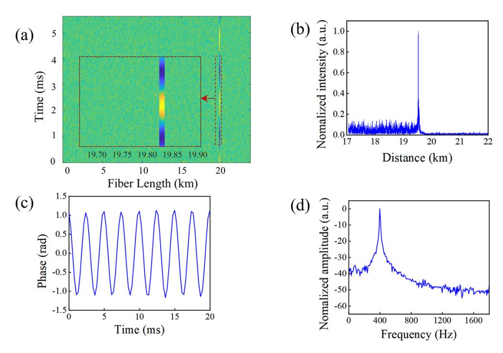
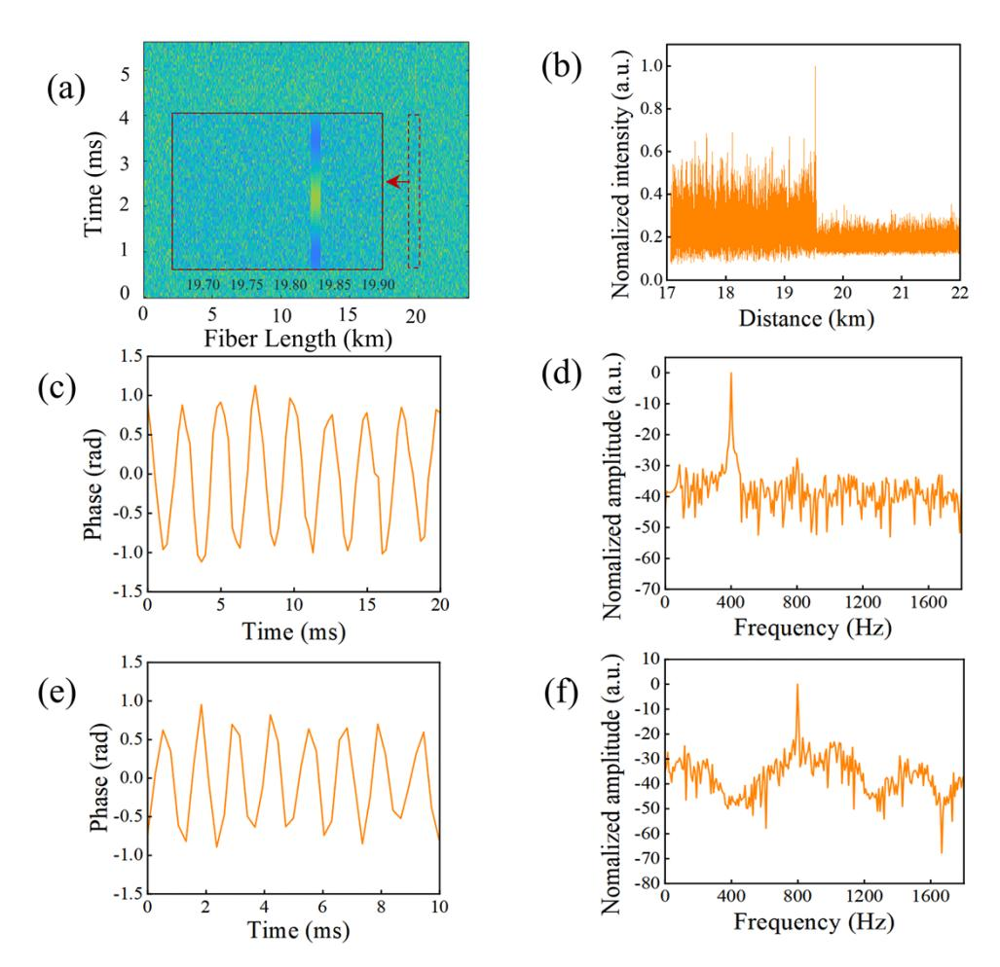

# **Common bias-digital subcarrier multiplexing scheme for integrated sensing and communication in short-reach optical transmission systems**

**JIN SHI, 1,2 YU HAN, 1,2 YAHUI LI, 1,2 XIN GUI, 3 XUELEI FU, 1,2 AND ZHENGYING LI 1,2,3,\***

**Abstract:** The integration of sensing and communication (ISAC) based on optical fibers has been a key enabling technique to achieve high-speed communication while ubiquitous sensing. In this paper, to ensure the coexistence of communication signal and sensing signal in low-cost optical access networks i.e., intensity modulation/direct detection (IM/DD) based short-reach optical transmission systems, a common bias-digital subcarrier multiplexing (CB-DSCM) scheme is proposed for ISAC signal generation. To assure distributed fiber acoustic sensing (DAS) signal having high spatial resolution and longer detection distance, linear frequency modulation (LFM) pulse compression technique, biased at the null point of the modulator, is used for sensing signal generation at the transmitter, and coherent detection is employed at the receiver. Then, due to the bias voltage at null point, asymmetrically clipped optical orthogonal frequency division multiplexing (ACO-OFDM) signal is utilized to carry communication signal in the IM/DD system. Therefore, both signals can be simultaneously transmitted using the already deployed modulator, enabling integrated sensing and communication in short-reach optical transmission systems. Experimental results demonstrate that, the proposed CB-DSCM scheme can achieve a net bit rate of 3.01 Gb/s with a bit error rate (BER) as low as 6 × 10−4 over a 19.8 km fiber-optic transmission link, while it can successfully reconstruct various vibration signals with a spatial resolution of 1 m in short-reach optical transmission systems.

© 2025 Optica Publishing Group under the terms of the [Optica Open Access Publishing Agreement](https://doi.org/10.1364/OA_License_v2#VOR-OA)

# **1. Introduction**

The exponential growth of global data demands has driven telecommunications operators to establish extensive optical fiber infrastructures, forming the backbone of modern residential, metropolitan, and transportation networks [\[1\]](#page-9-0). While these infrastructures have traditionally focused on high-speed data transmission, their potential extends far beyond communication. Optical fibers inherently possess sensing capabilities, enabling them to act as distributed environmental monitors. This dual functionality—combining communication and sensing—promises to transform optical networks into multifunctional platforms for smart cities and communities, enhancing infrastructure value through applications like seismic detection, traffic monitoring [\[2\]](#page-9-1), and security systems [\[3\]](#page-9-2). The integration of sensing and communication (ISAC) in optical networks has thus emerged as a pivotal research frontier.

Recent advances in optical fiber networks have demonstrated their dual utility in environmental sensing and communication. Techniques such as laser interference [\[4\]](#page-9-3) and polarization state analysis [\[5\]](#page-10-0) enable seismic and water wave monitoring, while bidirectional telecom signals with

#565431 https://doi.org/10.1364/OE.565431 Journal © 2025 Received 17 Apr 2025; revised 22 Jun 2025; accepted 23 Jun 2025; published 7 Jul 2025

*1 the School of Information Engineering, Wuhan University of Technology, Wuhan 430070, China 2Hubei Key Laboratory of Broadband Wireless Communication and Sensor Networks, Wuhan University of Technology, Wuhan 430070, China*

*3The National Engineering Research Center of Fiber Optic Sensing Technology and Networks, Wuhan University of Technology, Wuhan 430070, China*

*\* zhyli@whut.edu.cn*

coherent detection allow vibration localization [\[6\]](#page-10-1). However, these methods face limitations in disturbance retrieval due to the integral effect in fibers [\[5\]](#page-10-0), restricting their application to stable environments like transoceanic links. Similarly, phase-sensitive optical time-domain reflectometry (Φ-OTDR), a cornerstone of distributed acoustic sensing (DAS), has been deployed for high-sensitivity tasks such as traffic monitoring [\[7\]](#page-10-2) and geological detection [\[8\]](#page-10-3). To integrate Φ-OTDR into communication systems, multiplexing techniques (e.g., mode-division multiplexing [\[9\]](#page-10-4), wavelength-division multiplexing [\[10\]](#page-10-5), or frequency-division multiplexing [\[11\]](#page-10-6)) have been explored. Yet these approaches merely share fiber infrastructure by dedicating channels to sensing, failing to unify sensing and communication into a single system. This not only perpetuates functional independence but also compromises spectral efficiency, as DAS occupies bandwidth that could otherwise serve communication. Furthermore, the limited reach of traditional DAS (tens of kilometers) mismatches the demands of long-haul systems, making short-reach networks a more viable platform for integration.

Therefore, several ISAC schemes for short-reach optical transmission systems have been proposed and experimentally demonstrated. Brillouin optical time domain reflectometry (BOTDR) sensing has been combined with digital subcarrier multiplexing (DSCM)-based communication to realize ISAC functionality [\[12\]](#page-10-7). However, in such systems, separate modulators are required for the sensing and communication channels, which increases the overall complexity of the ISAC system. In contrast, a digital linear frequency modulated (LFM) sensing signal is combined with a DSCM communication signal, enabling simultaneous sensing and data transmission through a shared transmitter within a coherent communication system framework. This configuration achieves system throughputs exceeding 100 Gb/s while maintaining excellent DAS performance [\[13](#page-10-8)[–14\]](#page-10-9). However, the aforementioned ISAC schemes are primarily based on coherent communication systems, which involve high-cost components such as I/Q modulators and coherent receivers. Therefore, realizing ISAC in low-cost Intensity modulation/direct detection (IM/DD) systems remains a significant challenge and deserves further investigation.

IM/DD is widely regarded as a viable solution for short-reach systems, owing to its efficient resource utilization and low-cost network maintenance [\[15\]](#page-10-10). These advantages have led to the widespread deployment of optical fiber networks throughout urban environments, making them a ubiquitous part of the infrastructure. Then it is massively deployed for last miles between the internet service provider and the customer such as residential districts, enterprise parks, schools, etc. Meanwhile, due to the high spectral efficiency, flexible modulation capabilities, and efficient frequency-domain equalization provided by orthogonal frequency division multiplexing (OFDM) employing quadrature amplitude modulation (QAM) [\[16\]](#page-10-11), a significant number of studies have explored its integration into IM/DD systems to enhance performance and address the challenges inherent in optical communication [\[16](#page-10-11)[–17\]](#page-10-12). Thus, the integration of OFDM-based IM/DD system and DAS might be good choices for implementing ISAC in optical fibers, especially for the short/middle range application scenarios. It is worth noting that DAS typically relies on coherent detection at the receiver, which is fundamentally different from the IM/DD scheme, especially in terms of the bias point requirement. Therefore, integrating DAS systems into IM/DD systems urgently requires further investigation.

In this paper, to enabling the both signals coexistence of IM/DD and DAS system using coherent detection, a common bias-digital subcarrier multiplexing (CB-DSCM) scheme is proposed and experimentally demonstrated. The CB-DSCM scheme consists of asymmetrically clipped optics orthogonal frequency division multiplexing (ACO-OFDM) signal and LFM signal. Both signals can be simultaneously transmitted using only one modulator biased at the null point. It requires no any change at the transmitter with existing optical transmission system, remarkably reducing the system deployment cost. The experiments demonstrate that the proposed CB-DSCM scheme achieves a transmission rate of 3.01 Gb/s over 19.8 km of optical fiber with a bit error rate (BER)

as low as  $6.0 \times 10^{-4}$ , while simultaneously enabling distributed vibration measurements with a spatial resolution of 1 m.

### 2. Operation principles

### 2.1. φ-OTDR based DAS system

 $\phi$ -OTDR is widely used in various fields as a fiber optic sensor. Its basic principle is to emit pulsed detection light into the optical fiber and receive the rayleigh backscattering (RBS) light at each point of the optical fiber. The RBS light carries the strain, vibration or temperature information of each position. By demodulating and analyzing the phase of the RBS light, distributed sensing and localization along the entire path of the optical fiber can be achieved. However, traditional pulsed light has the problem of mutual limitation of transmission distance and spatial resolution. Therefore, this paper chooses LFM light as the detection light to solve this problem, and uses coherent reception technology to obtain the phase information of the scattered light and improve the signal quality.

If pulsed light is used to detect long distances, the pulse power, that is, the pulse width, needs to be increased. However, the increase in pulse width will increase the spatial resolution of the system, which leads to a restriction between the detection distance and the spatial resolution. The introduction of LFM light based on pulse compression can break this restriction [18]. As shown in Fig. 1, the basic process is to perform matched filtering on the LFM at the digital end to obtain the corresponding signal.

**Fig. 1.** LFM based on pulse compression.

Its phase expression  $\theta(t)$  is:

$$\theta(t) = (2\pi f t + \pi \kappa t^2) \operatorname{rect}(t/T)$$
 (1)

where  $\kappa$  is the chirp rate, f is the frequency, t is the time, T is the pulse width of the chirped pulse, rect() is the rectangular function. The output light  $E_o(t)$  through the electro-optical modulator (EOM) can be expressed as:

$$E_o(t) = \left(\frac{\pi\gamma}{2}\right) E_i e^{j\left[\varphi_0 + \frac{\pi V_{bias}}{2V\pi}\right]} \left\{ e^{j(2\pi ft + \theta(t))} + e^{j(2\pi ft - \theta(t))} \right\} \operatorname{rect}(t/T)$$
 (2)

where  $\gamma = V_{AC}/V_{\pi}$  represents the modulation depth,  $V_{AC}$  is the modulation voltage amplitude,  $V_{\pi}$  is the EOM half-wave voltage,  $\varphi_0$  represents the inherent phase difference between the two beams of light that pass through the EOM, and  $V_{bias}$  represents the bias voltage.

The modulated light  $E_o(t)$  is scattered after passing through the optical fiber, and beats with the local oscillator (LO) at the receiving end to generate a beat signal  $E_{beat}(t)$ . Then, the beat signal passes through the matched filter h(t) corresponding to the detection light to achieve pulse

compression. The matched filter h(t) is:

$$h(t) = e^{j(2\pi ft + \pi \kappa t^2)} \operatorname{rect}(t/T)$$
(3)

Finally, the equivalent signal s(t) along the optical fiber path can be obtained for subsequent data processing.

$$s(t) = E_{beat}(t) * h(t) \tag{4}$$

Before receiving data and processing data, this work optimizes the receiving end and chooses to use coherent reception to obtain sensor signals. Coherent reception is widely used in optical communications. Compared with direct detection, it can not only obtain physical parameters such as amplitude, frequency, and phase of optical signals, but also improve sensitivity. Applying it to  $\phi$ -OTDR and coordinating it with IQ demodulation can obtain the phase information of RBS light, thereby obtaining external vibration information [19].

Assume that the RBS light  $E_R(t)$  collected by the  $\varphi$ -OTDR sensing system is:

$$E_R(t) = E_s(t)e^{j2\pi(f + \Delta f)t + j\varphi(t)}$$
(5)

where  $E_s(t)$  represents the amplitude of the RBS light, f is the frequency of the laser light source,  $\Delta f$  is the frequency shift added by the EOM, and  $\varphi(t)$  is the phase of the response function needed. The RBS light is mixed with the LO, and the mixed light can be expressed as:

$$LO = E_{LO}e^{j2\pi ft} \tag{6}$$

and

$$E = E_R(t) + LO = E_{mix}e^{j2\pi ft}$$
(7)

where  $E_{LO}$  is the amplitude of LO;  $E_{mix}$  is the envelope of the mixed light E, which can be expressed as:

$$E_{mix} = E_{heat} + E_{LO} \tag{8}$$

and

$$E_{beat} = E_s(t)e^{j2\pi(f + \Delta f)t + j\varphi(t)}$$
(9)

I/Q detection is used to simultaneously obtain the light intensity of the in-phase channel and the orthogonal channel. The orthogonal channel intensity is the mixed intensity of LO and RBS light that produces a 90° phase shift. The in-phase signal I(t) and the orthogonal signal Q(t) are expressed as:

$$I(t) = |E|^2 = |E_{mix}|^2 = E_{LO}^2 + E_s^2(t) + 2E_{LO}E_s(t)\cos[2\pi\Delta ft + \varphi(t)]$$
 (10)

and

$$Q(t) = E_{LO}^{2} + E_{s}^{2}(t) + 2E_{LO}E_{s}(t)\sin[2\pi\Delta f t + \varphi(t)]$$
(11)

If  $E_s^2(t)$  is small enough compared to the last term in (10) and (11), the AC components of the in-phase signal I(t) and the quadrature signal Q(t) can be used as the real and imaginary parts of  $E_{beat}$ , respectively. Therefore, (9) can be rewritten as:

$$E_{beat} = I_{AC}(t) + jQ_{AC}(t) \tag{12}$$

where the subscript AC represents the AC component. Then,  $\varphi(t)$  can be expressed as:

$$\varphi(t) = \arctan(Q_{AC}(t)/I_{AC}(t)) \tag{13}$$

Finally, the disturbance signal is demodulated by the change of  $\varphi(t)$ . When the detection light is LFM light, combining (2), (3), (4) and (12), the equivalent signal s(t) after pulse compression

processing can be obtained as follows:

$$s(t) = E_{beat}(t) * h(t) = A e^{i[\varphi_0 + \frac{\pi V_{bias}}{2V_{\pi}}]} h_{FUT} * \left[ \frac{\sin[\pi \kappa (T - |t|)t]}{\pi \kappa t} e^{\pm j2\pi (f + \kappa T/2)t} \right]$$
(14)

where  $A=(\pi\gamma/2)E_{Lo}$ ,  $h_{FUT}$  is the impulse response of FUT. Taking the absolute value of the equivalent signal s(t) can obtain the equivalent light intensity signal along the optical fiber path. The phase  $\varphi(t)$  of each scattering point of the optical fiber is obtained according to the in-phase signal I(t) and the orthogonal signal Q(t) after matched filtering and (13). Then, the external disturbance can be restored according to the change of phase  $\varphi(t)$ .

In addition, although the frequency of the LFM pulse varies with time, it is still essentially a pulsed signal. Therefore, the detectable acoustic frequency range in our system is fundamentally limited by the pulse repetition rate, following the Nyquist sampling theorem. In this work, the duration of the LFM pulse is  $262~\mu s$ , corresponding to a pulse repetition rate of approximately 3.8~kHz.

### 2.2. CB-DSCM for ISAC

Conventional OFDM based IM/DD optical transmission system is illustrated in Fig. 2(a). To enable the integration of sensing and communication signals using a single modulator in the system, a key design constraint is that both signals must be modulated at the same bias point of the EOM to ensure effective signal combination. For distributed sensing, LFM signals are typically biased at the null point of the EOM to achieve high extinction ratios for the sensing signals. Moreover, coherent detection at the receiver is used to recover the phase information required for sensing. For high-spectral-efficiency OFDM transmission in IM/DD systems, the two commonly used schemes are DCO-OFDM and ACO-OFDM [20]. While DCO-OFDM offers higher spectral efficiency by utilizing all subcarriers, it requires a significant DC bias to ensure non-negative intensity signals, leading to reduced power efficiency. In contrast, ACO-OFDM inherently avoids the need for DC bias by using only odd subcarriers. Its time-domain signal exhibits antisymmetric properties, resulting in a zero-mean waveform that can be directly clipped

Fig. 2. (a) Typical IM/DD system with OFDM; (b) IM/DD system with CB-DSCM.

to non-negative values without distorting the information-bearing components, leading to higher power efficiency [\[21\]](#page-10-16). Therefore, by leveraging the compatibility of ACO-OFDM with null-point modulation, LFM and ACO-OFDM signals could be combined using a single EOM, thereby forming the proposed CB-DSCM scheme that enables simultaneous sensing and communication as the system architecture shown in Fig. [2\(](#page-4-0)b).

The detailed integration process of the CB-DSCM scheme is illustrated in Fig. [4.](#page-6-0) The optical power transfer function of the intensity modulator as a function of the applied bias voltage is shown in Fig. [3\(](#page-5-0)a). The generated ACO-OFDM signal and LFM signal are depicted in Fig. [3\(](#page-5-0)b) and Fig. [3\(](#page-5-0)c), respectively. These two signals are integrated via frequency-division multiplexing to form CB-DSCM signal as shown in Fig. [3\(](#page-5-0)d). The integrated signal is then fed into an intensity modulator biased at the null point for electro-optic conversion, enabling the transmission of the ISAC signal. As discussed earlier, the use of LFM signals effectively address the constraints of transmission distance and spatial resolution in traditional sensing systems. Its spatial resolution is defined [\[22\]](#page-10-17):

$$SR = c/2nB \tag{15}$$

where *B* is the bandwidth of LFM signal, *n* is the refractive index of the optical fiber, and *c* is the speed of light. Compared with the spatial resolution of conventional pulsed light detection, the determining parameter changes from the pulse duration to the bandwidth of the LFM signal.

**Fig. 3.** The integration process of CB-DSCM. (a) EOM bias point and output signal relationship; (b) ACO-OFDM signal in time domain; (c) LFM signal in time domain; (d) The frequency domain structure of CB-DSCM.

The CB-DSCM signal not only benefits from the high robustness and power efficiency of the ACO-OFDM signal but also incorporates the high spatial resolution advantage of the LFM signal. Additionally, because these two signals are multiplexed in the frequency domain, the utilization of the frequency band is highly flexible.

### **3. Experimental setup**

The experimental setup is shown in Fig. [4.](#page-6-0) A continuous-wave narrow linewidth laser (NLL, NP Photonics RLFM-25-1-1550, linewidth <700 Hz) is used as the light source, with a center wavelength of 1550 nm and an output power of 10 dBm. The laser output is split into two paths using a 90:10 optical coupler (OC), and each path is subsequently connected to a polarization controller (PC). In the lower branch (10%), a portion of the optical power is tapped and used as

**Fig. 4.** The experimental setup of the proposed ISAC system.

the local oscillator (LO). In the upper branch (90%), the optical signal is modulated by an EOM (iXblue MXER-LN-10) with a composite signal consisting of LFM and ACO-OFDM signal. The ACO-OFDM is generated using a 1024-point IFFT, in which 205 odd subcarriers are employed to carry data symbols using 16-QAM modulation. A 64-sample cyclic prefix is added to each symbol to mitigate inter-symbol interference. The EOM is biased at its null point and driven by modulation signals from an arbitrary waveform generator (AWG, keysight M8195A), operating at a symbol rate of 4 GSa/s. As a result, the system achieves a net data rate of 3.01 Gb/s. To increase the launch power, the modulated optical signal is amplified using an erbium-doped fiber amplifier (EDFA) and then filtered by an optical band-pass filter (OBPF) to stabilize the transmission wavelength near 1550 nm before being launched into a 19.8 km fiber under test (FUT). The bandwidth of the experimental signal is 2 GHz, the oscilloscope sampling rates of sensing and communication are 1 GSa/s and 5 GSa/s respectively, and in order to ensure that there is no crosstalk between the sensing lights, the period of the modulation signal should be greater than 198 us. This work set the period of the modulation signal as 262 us.

The receiver is divided into two parts, the first is the reception of the sensing signal. The RBS light carrying the sensing information is connected to the EDFA via the optical circulator to compensate for the loss of optical power in the fiber. The OBPF and LO are simultaneously connected to a 90° hybrid coherent receiver (fujitsu FIM24706, 22 GHz bandwidth). Finally, the electrical signals from I port and Q port are simultaneously connected to a digital storage oscilloscope (DSO, Lecroy WaveMaster 8Zi-B, 30 GHz bandwidth, 80 GSa/s sampling rate) to obtain the sensing signal. To verify the feasibility of sensing, a piezoelectric transducer (PZT) is attached near the end of the fiber to generate vibration signals, with an additional 20 meters of fiber reserved beyond the PZT.

The other part of receiver is for communication. The optical communication signal is accessed to the photodetectors (PD) at the forward end of the optical fiber, and the electrical signal output from the PD is accessed to the DSO to obtain the communication signal.

### **4. Experimental results**

Firstly, the communication performance of the proposed ISAC system is evaluated. The transmitted signal for ISAC consists of an LFM signal with a bandwidth ranging from 20 MHz to 120 MHz, and an ACO-OFDM signal with a bandwidth ranging from 200 MHz to 2 GHz. After performing symbol synchronization, channel estimation, and equalization, the BER performance

under different received optical power (ROP) levels is presented in Fig. 5(a). As the ROP decreases from -3.8 dBm to -12.3 dBm, the BER increases from  $6.0 \times 10^{-4}$  to  $5.3 \times 10^{-2}$ , indicating that increasing the received optical power effectively reduces the BER. The constellation diagram of the received ACO-OFDM signal is shown in Fig. 5(b), where the signal points are clearly distinguishable, demonstrating successful demodulation. These experimental results confirm that the proposed CB-DSCM scheme effectively enables optical communication within the integrated ISAC system.

**Fig. 5.** The communication performance in the CB-DSCM based ISAC system. (a) The relationship of ROP and BER; (b) The received signal constellation diagram at the ROP of -11.1 dBm.

Then, we analyzed the sensing performance without the presence of the communication signal. A sinusoidal signal with a frequency of 400 Hz is applied to the PZT and the corresponding experimental results are illustrated in Fig. 6. The spatiotemporal distribution of the demodulated strain along a 19.8 km fiber is illustrated in Fig. 6(a), where only the LFM sensing signal is used. As observed, the strain remains nearly constant along the entire fiber except at the distal end, where a clear periodic strain response is present. To further determine the vibration location, the calculated intensity variations along the fiber over multiple time periods are presented in Fig. 6(b). The region with the maximum variation is accurately located at 19.8 km, which corresponds precisely to the position of the PZT. The recovered time-domain sinusoidal signal is shown in Fig. 6(c), and its corresponding PSD is presented in Fig. 6(d). The signal exhibits a distinct spectral peak around 400 Hz, with a signal-to-noise ratio (SNR) of 14.3 dB [23], consistent with the frequency of the externally applied vibration at the 19.8 km location.

Finally, we analyzed the sensing performance when the communication signal is superimposed onto the transmitted signal. The corresponding spatiotemporal thermogram under this condition is shown in Fig. 7(a). Compared to Fig. 6(a), a higher noise level is observed, and the clarity of the periodic strain pattern is slightly reduced. However, periodic strain signatures at the fiber end remain clearly identifiable, indicating that the sensing functionality is still maintained even with the presence of the communication signal. Figure 7(b) presents the intensity variations along the fiber over multiple vibration periods. Compared to Fig. 6(b), although the vibration source can still be accurately located at 19.8 km, the noise floor is noticeably elevated. This suggests that the introduction of the communication signal introduces interference into the sensing process, particularly affecting the localization accuracy, which depends on the amplitude variations of the backscattered light intensity. Figure 7(c) and (e) show the demodulated vibration signals at frequencies of 400 Hz and 800 Hz, respectively, with their corresponding PSDs presented in Fig. 7(d) and (f). The calculated SNRs for these two cases are 14.0 dB and 13.5 dB, respectively, both of which are slightly lower than those shown in Fig. 6. These experimental results demonstrate that sensing functionality remains achievable even when the communication

**Fig. 6.** The sensing results without communications. (a) 3D view of the demodulated vibration phase in time-distance plane; (b) the localization of the vibration position; (c) demodulated 400 Hz sinusoidal vibration signal; (d) the PSD of the demodulated signal.

signal is superimposed onto the transmitted waveform, thereby validating the effectiveness of the proposed CB-DSCM scheme.

## **5. Conclusion**

In this paper, a CB-DSCM scheme for the ISAC is proposed and experimentally demonstrated in the IM/DD based short-reach optical transmission systems. The CB-DSCM is composed of LFM signal for DAS and ACO-OFDM with 16-QAM for optical communication. Compared with conventional optical pulse-based DAS, the use of an LFM signal enables higher spatial resolution and extended sensing range. ACO-OFDM, on the other hand, provides high power efficiency by eliminating the need for a DC bias and is inherently compatible with the LFM-based DAS signal, allowing both to be modulated using the same EOM without requiring modifications to the transmitter structure. Furthermore, digital subcarrier allocation enables flexible adjustment of the two signals to minimize mutual interference. Experimental results show that the proposed CB-DSCM scheme successfully supports simultaneous communication and sensing over 19.8 km of optical fiber. The system achieves a net data rate of 3.01 Gb/s with a BER as low as 6 × 10−4 , while maintaining a spatial resolution of 1 m for vibration sensing, thereby validating the effectiveness of the proposed ISAC architecture.

**Fig. 7.** The sensing performance in the CB-DSCM based ISAC system. (a) 3D view of the demodulated vibration phase in time-distance plane; (b) the localization of the vibration position; (c) demodulated 400 Hz sinusoidal vibration signal; (d) the PSD of the demodulated 400 Hz sinusoidal vibration signal; (e) demodulated 800 Hz sinusoidal vibration signal; (f) the PSD of the demodulated 800 Hz sinusoidal vibration signal.

**Funding.** Natural Science Foundation of Hubei Province (2023AFB176); Natural Science Foundation of Chongqing Municipality (2024NSCQ-MSX2644); National Natural Science Foundation of China (U24A20306, 62275205, 62075171, 62471347).

**Disclosures.** The authors declare no conflicts of interest.

**Data availability.** Data underlying the results presented in this paper are not publicly available at this time but may be obtained from the authors upon reasonable request.

### **References**

- 1. M. Wen, Q. Li, K. J. Kim, *et al.*, "Private 5 G Networks: Concepts, Architectures, and Research Landscape," [J. Sel.](https://doi.org/10.1109/JSTSP.2021.3137669) [Top. Sign. Proces.](https://doi.org/10.1109/JSTSP.2021.3137669) **16**(1), 7–25 (2022).
- 2. R. Tucker, M. Ruffini, L. Valcarenghi, *et al.*, "Connected OFCity: Technology innovations for a smart city project [Invited]," [J. Opt. Commun. Netw.](https://doi.org/10.1364/JOCN.9.00A245) **9**(2), A245–A255 (2017).
- 3. E. Ip, J. Fang, Y. Li, *et al.*, "Distributed fiber sensor network using telecom cables as sensing media: technology advancements and applications [Invited]," [J. Opt. Commun. Netw.](https://doi.org/10.1364/JOCN.439175) **14**(1), A61–A68 (2022).
- 4. G. Marra, C. Clivati, R. Luckett, *et al.*, "Ultrastable laser interferometry for earthquake detection with terrestrial and submarine cables," [Science](https://doi.org/10.1126/science.aat4458) **361**(6401), 486–490 (2018).

- 5. Z. Zhan, M. Cantono, V. Kamalov, *et al.*, "Optical polarization–based seismic and water wave sensing on transoceanic cables," [Science](https://doi.org/10.1126/science.abe6648) **371**(6532), 931–936 (2021).
- 6. E. Ip, Y. Huang, G. Wellbrock, *et al.*, "Vibration Detection and Localization Using Modified Digital Coherent Telecom Transponders," [J. Lightwave Technol.](https://doi.org/10.1109/JLT.2021.3137768) **40**(5), 1472–1482 (2022).
- 7. H. Liu, J. Ma, T. Xu, *et al.*, "Vehicle Detection and Classification Using Distributed Fiber Optic Acoustic Sensing," [IEEE Trans. Veh. Technol.](https://doi.org/10.1109/TVT.2019.2962334) **69**(2), 1363–1374 (2020).
- 8. T. Zhu, J. Shen, and E. R. Martin, "Sensing Earth and environment dynamics by telecommunication fiber-optic sensors: an urban experiment in Pennsylvania, USA," [Solid Earth](https://doi.org/10.5194/se-12-219-2021) **12**(1), 219–235 (2021).
- 9. S. Guerrier, K. Benyahya, C. Dorize, *et al.*, "Vibration Detection and Localization in Buried Fiber Cable after 80 km of SSMF using Digital Coherent Sensing System with Co-Propagating 600Gb/s WDM Channels," in *2022 Optical Fiber Communications Conference and Exhibition (OFC)* (2022), pp. 1–3.
- 10. J. M. Marin, I. Ashry, O. Alkhazragi, *et al.*, "Simultaneous distributed acoustic sensing and communication over a two-mode fiber," [Opt. Lett.](https://doi.org/10.1364/OL.473502) **47**(24), 6321–6324 (2022).
- 11. H. He, L. Jiang, Y. Pan, *et al.*, "Integrated sensing and communication in an optical fibre," [Light: Sci. Appl.](https://doi.org/10.1038/s41377-022-01067-1) **12**(1), 25 (2023).
- 12. S. Jin, J. Song, Z. Yang, *et al.*, "Single-Channel Integrated Sensing and Communication Based on Spontaneous Brillouin Scattering," *ECOC 2024; 50th European Conference on Optical Communication* (2024), pp. 1679–1682.
- 13. Z. Hu, Y. Chen, H. Jiang, *et al.*, "Enabling cost-effective high-performance vibration sensing in digital subcarrier multiplexing systems," [Opt. Express](https://doi.org/10.1364/OE.497616) **31**(20), 32114–32125 (2023).
- 14. Z. Hu, M. Zhang, Y. Li, *et al.*, "Enabling endogenous distributed acoustic sensing in a digital subcarrier coherent transmission system," [Opt. Lett.](https://doi.org/10.1364/OL.524132) **49**(11), 3166–3169 (2024).
- 15. W. Zhang, Z. Fan, and J. Zhao, "Reliability-aware subcarrier mapping strategy of QC-LDPC encoded symbols in bandwidth-limited IM/DD OFDM systems," [Opt. Express](https://doi.org/10.1364/OE.434756) **29**(22), 35400–35413 (2021).
- 16. J. Zhang, L. Lu, H. Tan, *et al.*, "CD-Aware OCT Precoding for C-Band 100-Gb/s IM/DD OFDM Transmission over 50-km SSMF," in *2024 Optical Fiber Communications Conference and Exhibition (OFC)*, (2024), pp. 1–3.
- 17. S. Hu, J. Zhang, J. Tang, *et al.*, "Adaptive Hybrid Iterative Linearization Algorithms for IM/DD Optical Transmission Systems," [J. Lightwave Technol.](https://doi.org/10.1109/JLT.2023.3243917) **41**(14), 4644–4654 (2023).
- 18. Y. Wang, H. Zheng, H. Wu, *et al.*, "Coherent OTDR with large dynamic range based on double-sideband linear frequency modulation pulse," [Opt. Express](https://doi.org/10.1364/OE.485616) **31**(11), 17165–17174 (2023).
- 19. Z. Ma, M. Zhang, J. Jiang, *et al.*, "Fiber-Optic Distributed Acoustic Sensing Technology Based on Linear Frequency Modulation Pulses," lop **60**(11), 1106002 (2023).
- 20. S. D. Dissanayake and J. Armstrong, "Comparison of ACO-OFDM, DCO-OFDM and ADO-OFDM in IM/DD Systems," [J. Lightwave Technol.](https://doi.org/10.1109/JLT.2013.2241731) **31**(7), 1063–1072 (2013).
- 21. K. Asadzadeh, A. Dabbo, and S. Hranilovic, "Receiver design for asymmetrically clipped optical OFDM," in 2011 IEEE GLOBECOM Workshops (GC Wkshps) (2011), pp. 777–781.
- 22. D. Chen, Q. Liu, X. Fan, *et al.*, "Distributed Fiber-Optic Acoustic Sensor With Enhanced Response Bandwidth and High Signal-to-Noise Ratio," [J. Lightwave Technol.](https://doi.org/10.1109/JLT.2017.2657640) **35**(10), 2037–2043 (2017).
- 23. Y. Dong, X. Chen, E. Liu, *et al.*, "Quantitative measurement of dynamic nanostrain based on a phase-sensitive optical time domain reflectometer," [Appl. Opt.](https://doi.org/10.1364/AO.55.007810) **55**(28), 7810–7815 (2016).