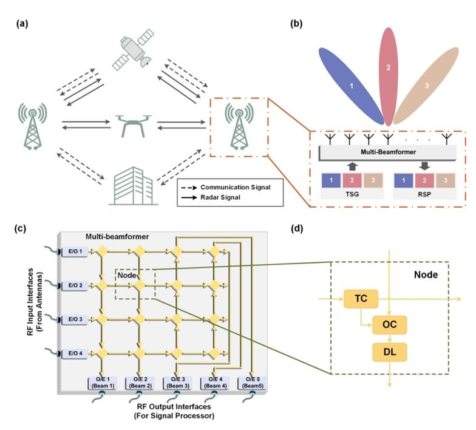
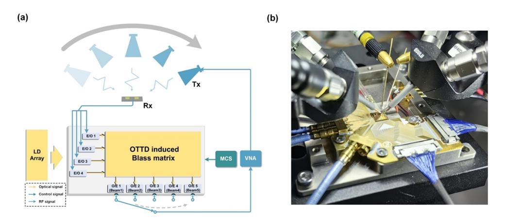
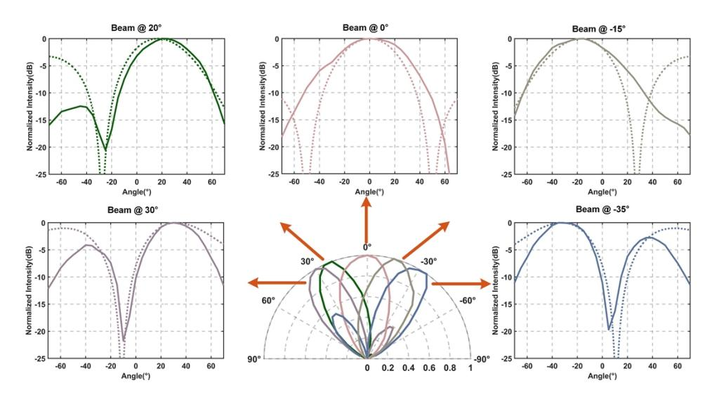
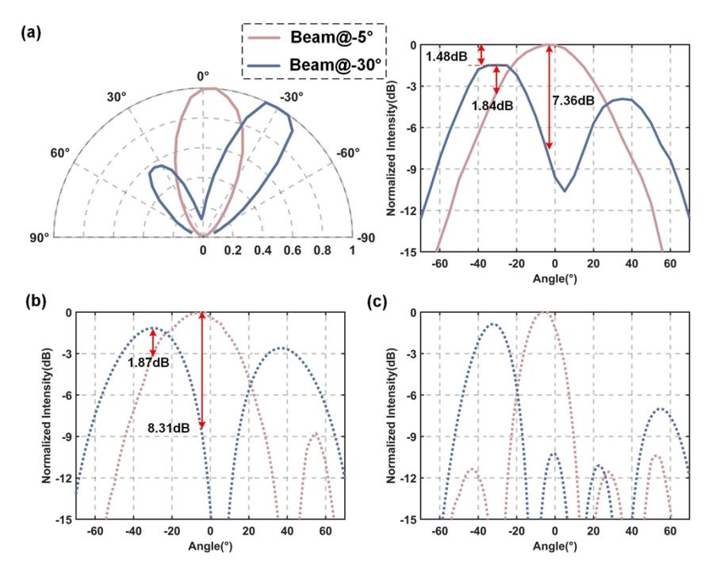
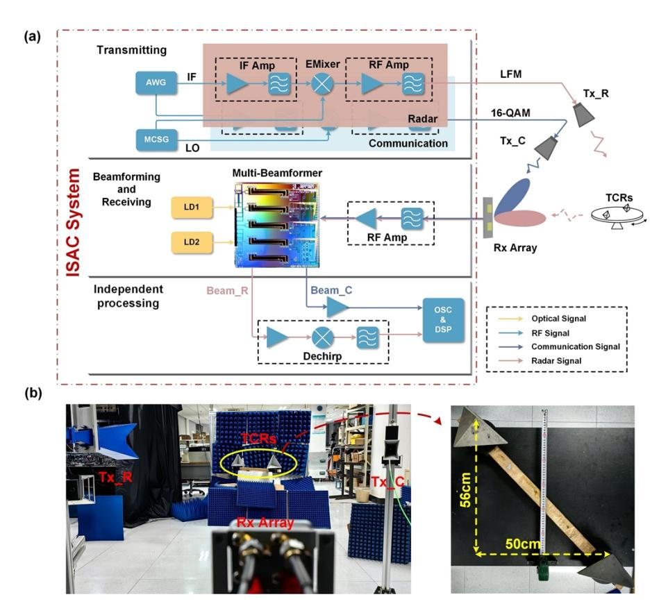
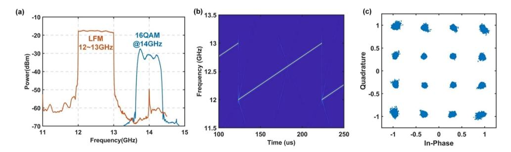
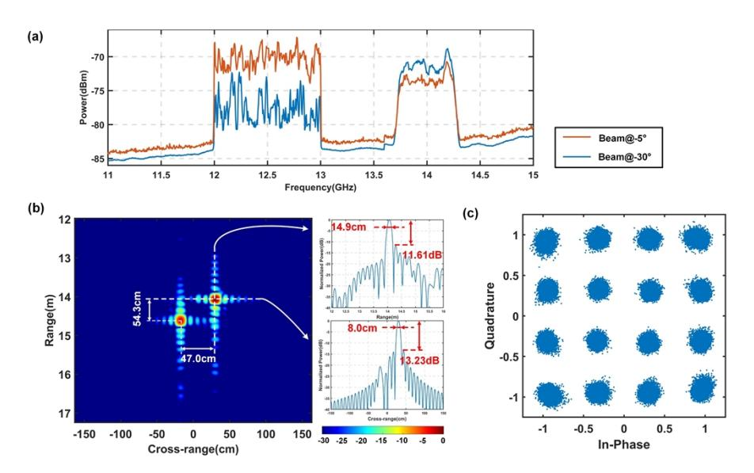

# **Integrated sensing and communication system based on a photonic integrated broadband multi-beamformer**

**RUIXUAN WANG, 1,2 WEICHAO MA, 1,3,4 JIANWEI LIU, 1,2 HONGRU XU, 1,2 ZICHAO SHEN, 1,2 AND WANGZHE LI 1,2,\***

**Abstract:** An integrated sensing and communication (ISAC) system enabled by a photonic integrated broadband multi-beamformer is proposed and demonstrated. The integrated multibeamformer, which employs an optical true-time-delay induced Blass matrix framework for reception, is capable of simultaneously synthesizing five squint-free beams directed at distinct angles across the entire Ku-band spectrum. Benefiting from space division multiplexing endowed by multi-beamforming, the system performs simultaneous broadband radar sensing and highspeed wireless communication. A proof-of-concept experiment on the ISAC system utilizing the photonic broadband multi-beamformer has been conducted, demonstrating simultaneous high-resolution microwave imaging with a 1 GHz bandwidth and wireless communication with a 2.4 Gbps data rate. The experiment validates the ISAC system architecture based on an integrated photonic multi-beamformer and highlights its promising potential for an advanced multimodal information system.

© 2025 Optica Publishing Group under the terms of the [Optica Open Access Publishing Agreement](https://doi.org/10.1364/OA_License_v2#VOR-OA)

# **1. Introduction**

Integrated sensing and communication (ISAC) systems enable simultaneous implementation of radar sensing and wireless communication functions by leveraging hardware resource sharing, spectrum allocation, and interference suppression techniques, recognized as a promising solution to address the issues of spectrum resource scarcity and for a variety of applications, such as autonomous driving, unmanned aerial vehicle and satellite communications [\[1–](#page-11-0)[4\]](#page-11-1). In order to balance inherent conflicts for ISAC systems, extensive research studies have been conducted in recent years [\[5](#page-11-2)[–14\]](#page-11-3). Among them, the multi-beamforming approach has attracted notable attention due to extended spatial flexibility. High-performance multi-beamformers, serving as the core devices of the systems, are utilized to generate multiple beams simultaneously, thereby facilitating the adaptable distribution of spatial resources. Consequently, ISAC systems based on multi-beamforming obviate the necessity for a joint design of radar and communication waveforms, thereby imposing fewer constraints on the respective subsystems and mitigating the dependency on intricate signal processing algorithms, which provide enhanced flexibility. These advantages make them well-suited for a wider range of potential application scenarios.

However, multi-beamforming ISAC systems based on traditional electronic devices exhibit several significant limitations that hinder their performance. For the analog beamforming (ABF) architecture, due to the limitations of electronic bottlenecks and the significant insert losses introduced by electronic true-time-delay lines (TTDLs), electrical multi-beamformer has

#555053 https://doi.org/10.1364/OE.555053

*1National Key Laboratory of Microwave Imaging, Aerospace Information Research Institute, Chinese Academy of Sciences, Beijing 100190, China*

*2The School of Electronics, Electrical and Communication Engineering, University of Chinese Academy of Sciences, Beijing 100049, China*

*3Guangdong Provincial Key Laboratory of Terahertz Quantum Electromagnetics, GBA Branch of Aerospace Information Research Institute, Chinese Academy of Sciences, Guangzhou 510700, China*

*4[mawc01@aircas.ac.cn](mailto:mawc01@aircas.ac.cn)*

*\*wzli@mail.ie.ac.cn*

difficulties meeting the requirements of wide-band wide-angle scanning covering high frequency bands. Consequently, it becomes difficult to support the high-resolution sensing and high-speed transmission capabilities required for ISAC systems [\[15](#page-11-4)[–18\]](#page-11-5). Besides, with regard to the digital beamforming (DBF) architecture, performance, power consumption and cost of analog-to-digital converters (ADCs) and digital-to-analog converters (DACs) have become significant constraints on the expansion of DBF towards higher operating frequency, wider instantaneous bandwidth, and large-scale development [\[19](#page-11-6)[,20\]](#page-11-7).

Recent advancements in microwave photonic (MWP) technologies offer promising solutions to realize ISAC systems based on multi-beamforming [\[21](#page-11-8)[,22\]](#page-12-0). Firstly, the incorporation of ultra-low loss optical waveguides into optical multi-beamforming networks (OMBFNs) based on true-time-delay (TTD) significantly reduces the insertion loss, which can not only support squint-free beam synthesis of broadband signals but also enhance the feasibility for large-scale expansion [\[23–](#page-12-1)[28\]](#page-12-2). Secondly, MWP technology provides extensive operational bandwidth, versatile multiplexing schemes, and inherent immunity to electromagnetic interference [\[29](#page-12-3)[–31\]](#page-12-4). This feature can realize full-band coverage by a single optoelectronic link, simplifying system architecture while reducing the overall number of components. Furthermore, the advancement of photonic integrated circuits (PIC) technology effectively mitigates the environmental impacts on the performance of optical fiber components, further reducing costs and enhancing reliability. This progress facilitates the broader adoption of multi-beamformers in practical application scenarios. An OMBFN based on a phase-shifting Blass matrix framework, fabricated on a silicon nitride (SiN) platform, is designed for scan-on-receiver (SCORE) synthetic aperture radar (SAR) and enabled the simultaneous synthesis of three beams with a maximum instantaneous bandwidth of 390 MHz [\[32](#page-12-5)[,33\]](#page-12-6). Another SiN-based multi-beamformer, also designed for SAR applications, employs a Butler matrix framework based on optical true-time-delay (OTTD) waveguides, supporting the synthesis of eight beams in the same dimension and extending the instantaneous bandwidth to 800 MHz [\[34\]](#page-12-7). The aforementioned studies are primarily focused on radar sensing systems. To date, there has been no demonstration of an ISAC system based on photonic integrated multi-beamformers.

In this work, we proposed and demonstrated an ISAC system based on a photonic integrated broadband multi-beamformer that employs an OTTD-induced Blass matrix framework for reception. The beamformer is characterized using a two-channel antenna array, with a comprehensive analysis of beam quality and inter-beam crosstalk. In order to verify the ISAC system, two beams of the multi-beamformer are utilized, by space division multiplexing (SDM), to respectively receive a linear frequency-modulated (LFM) analog signal for radar imaging with 1 GHz bandwidth and a 16-quadrature amplitude modulation (16-QAM) digital signal for wireless communication with 2.4 Gbps data rate at the same time. The results fully demonstrate the potential of the multi-beamformer in realizing high-quality, broadband multi-beamforming for radar sensing and wireless communication scenarios. Finally, several shortcomings and the corresponding optimization methods of this photonic integrated broadband multi-beamformer for the ISAC system are discussed.

### **2. Framework of ISAC systems based on multi-beamforming**

ISAC systems based on multi-beamforming overcome the limitations of traditional systems in the time and frequency domains, enabling flexible signal selection tailored to different application scenarios to fulfill diverse functional requirements. Figure [1\(](#page-2-0)a) shows some typical application scenarios for ISAC systems based on multi-beamforming. For instance, in Earth observation and satellite communication applications, ISAC-enabled payloads leverage multiple radar beams to construct multi-dimensional remote sensing channels, achieving high-resolution wide-swath imaging, and moving target detection. Simultaneously, multiple communication beams support high-speed remote sensing data transmission and multi-user parallel communication, greatly

enhancing the payload's overall efficiency and mission adaptability. In urban low-altitude surveillance, ISAC systems generate multiple radar beams for real-time environmental sensing, allowing for the simultaneous monitoring and tracking of multiple unmanned aerial vehicles (UAVs). Concurrently, multiple communication beams facilitate low-latency information exchange, significantly enhancing airspace utilization efficiency and regulatory capabilities. The multi-beam collaborative mechanism not only optimizes resource utilization but also provides a highly efficient and flexible solution for integrated communication and sensing tasks in complex operational environments.

**Fig. 1.** (a) The schematic diagram of application scenarios for ISAC systems based on multi-beamforming. (b) The framework of an ISAC system based on a multi-beamformers. TSG: transmission signal generator. RSP: receiving signal processor. The schematic diagram of (c) the photonic integrated broadband multi-beamformer and (d) the interconnected node. E/O: electro-to-optical conversion. O/E: optical-to-electro conversion. TC: tunable coupler. OC: optical combiner. DL: delay line.

ISAC systems based on multi-beamforming are advanced solutions that integrate radar sensing and wireless communication functions on the same hardware platform by efficiently utilizing the SDM capability of the multi-beamformers. Figure [1\(](#page-2-0)b) shows the framework diagram of the ISAC system, which includes multiple groups of transmission signal generators (TSGs) and receiving signal processors (RSPs), along with a shared multi-beamformer and antenna array. At the transmission side, the TSGs independently generate the required digital communication signals and radar sensing signals whose parameters can be designed by aligned with the performance and compatibility requirements of the multi-beamformer. The multi- signals are subsequently fed into the input interface of the multi-beamformer, radiated toward multiple desired spatial directions by the multi-beamforming capabilities. At the receiving end, radar echo signals containing target information and the communication transmission signals from various spatial regions are separated by the multi-beamformer and routed through different output channels to the RSPs. By leveraging prior information and applying appropriate processing algorithms for radar sensing and wireless communication signals, the desired sensing target information and communication

transmission data will be extracted accurately. To achieve optimal compatibility between high-resolution radar sensing and high-speed communication functions in the ISAC system, the multi-beamformer must exhibit a wide operational frequency range, large instantaneous bandwidth, and precise beam-pointing capabilities. These specifications are ideally suited to the advantages provided by the proposed photonic integrated broadband multi-beamformer.

The architecture of the photonic integrated broadband multi-beamformer for receiving in the ISAC system, depicted in Fig. [1\(](#page-2-0)c), is constructed on a standard silicon-on-insulator (SOI) platform, utilizing an OTTD-induced Blass matrix framework. The photonic chip incorporates all active and passive components, except for the optical source. Furthermore, in contrast to the traditional Blass matrix, this network replaces phase shifters with delay units, enabling squint-free multi-beamforming across the entire Ku band.

The multi-beamformer is designed for RF-to-RF operation with four input interfaces and five output interfaces and is used on the receiving side of the ISAC system. The input interfaces correspond to the RF signals received from four antenna channels, while the output interfaces deliver the RF signals from synthesized beams directed at five distinct angles. The received RF signals from each input channel are modulated by Mach-Zehnder modulator (MZMs) operating at the quadrature point. The resulting optically carried RF signals are then directed to the OMBFN based on the OTTD-induced Blass matrix. This network consists of five delay waveguide groups, each with identical lengths, positioned between the four input channels to establish delay gradients corresponding to the beam directions. These delay waveguides are interconnected through designed nodes, as shown in Fig. [1\(](#page-2-0)d), composed of tunable couplers (TCs), optical combiners (OCs), and crossings, enabling precise routing of the optical carrier RF signals and accurate power distribution across the beams. Upon passing through the OMBFN, the optically carried RF signals from the four input channels are redistributed to the five output ports. Each output channel contains the signals from all input channels, with the delay gradients corresponding to the beam directions. Following photodetectors (PDs), the signals undergo optical-to-electro conversion, thereby enabling multi-beamforming simultaneously. The optical source, implemented externally as a multi-wavelength laser array with some wavelength spacings, served a dual purpose: it mitigates multipath effects caused by destructive interference of optical signals traversing different paths and prevents the introduction of new spurious signals by mixing the optically carried RF signals between different channels. It can ensure accurate broadband multi-beamforming while minimizing mutual interference between channels. Further details on the beamformer design and test results can be found in our previous work [\[35\]](#page-12-8). The multi-beamformer enables the simultaneous synthesis of multiple broadband beams and facilitates the segmentation and multiplexing of the radiation space. Specifically, each beam can be associated with a distinct functional signal, thereby enabling the realization of ISAC.

To facilitate evaluating the functionality of ISAC, the photonic integrated broadband multibeamformer has been partially packaged to support experimental testing. The packaging incorporated optical interfaces, DC control interfaces for the network nodes, and RF output interfaces connected to the on-chip PDs. For the RF input ports, probe-based connections are utilized to deliver the received signals from antennas.

### **3. Experiments and results**

A series of experiments have been conducted to verify the ISAC system based on the photonic integrated broadband multi-beamformer. Firstly, the actual synthesized beam of the multibeamformer has been characterized and measured. On the one hand, the control signals have been characterized and the radiation pattern of the five beams has been measured under the independent operation of the photonic integrated broadband multi-beamformer, with the measured results being compared to the theoretical radiation patterns based on the design parameters. On the other hand, according to the laboratory environment, two beams (respectively corresponding to

radar sensing and wireless communication transmission) have been selected to perform control signal characterization and directional pattern measurement under the state of simultaneous operation and the interference between them also has been analyzed. Secondly, on the basis of the dual-beam results, the ISAC functionality has been verified by setting up an ISAC system based on the photonic integrated broadband multi-beamformer, which is subsequently used to conduct rotating target imaging and communication signal transmission tests. It is noteworthy that all subsequent experiments, including the characterization and measurements of radiation pattern and ISAC system validation, are performed using the partially packaged multi-beamformer. Moreover, due to constraints of the test conditions, two input channels have been employed to demonstrate the broadband multi-beamforming capability and validate the ISAC functionalities. Despite these limitations, the setup provides a controlled and reliable platform to verify the system's performance and functional integrity under practical conditions.

## *3.1. Beams characterization of the photonic integrated broadband multi-beamformer*

In order to validate the beamforming performance of the photonic integrated broadband multibeamformer, a measurement setup has been established to characterize the synthesized antenna radiation patterns, as shown in Fig. [2\(](#page-5-0)a). The setup includes a mechanical arm capable of rotating and holding position at any angle within the plane, controlled via a central pivot. A horn antenna, mounted at the end of the mechanical arm, serves as the transmitting antenna. The horn antenna is connected to the output of an electronic vector network analyzer (VNA), which provides the excitation signal. On the same horizontal axis as the pivot, a 1 × 2 microstrip array antenna with a center frequency of 14 GHz is positioned as the receiving antenna. The array features an element spacing of 0.65 times the center wavelength, approximately 1.39 cm. This measurement setup meets the conditions for testing far-field patterns. Signals received by the array elements are amplified and then fed as RF inputs to the first and second channels of the integrated broadband multi-beamformer. The five RF output ports of the multi-beamformer are connected sequentially to the VNA's input ports for measurement. The optical carriers for the two input channels are provided by independent laser sources (NKT photonics Koheras BASIK and Santec WSL-100), with their wavelengths and optical powers set to 1550.1713nm, 14.3 dBm, and 1552.122 nm, 13.0 dBm, respectively. The wavelength separation is sufficient to prevent inter-channel interference for the Ku-band. While power imbalances between channels do not affect the central direction of the synthesized beams, they influence beamwidth and grating lobes. These imbalances can be compensated for in subsequent stages using erbium-doped fiber amplifiers (EDFAs, Keopsys CEFA-C). Additionally, the TCs within the nodes of OMBFN and the bias points of the MZMs are controlled via multi-channel sources (MCSs, NI PXIe-4162 and Rohde & Schwarz HMP4040), ensuring precise control of the network parameters to enable accurate and reliable beamforming performance. The test scenario of the partially packaged multi-beamformer is depicted in Fig. [2\(](#page-5-0)b).

Using the setup described above, the patterns of five individual beams have been initially characterized and measured. A 14 GHz fixed frequency RF signal, generated by the calibrated VNA, is amplified and fed into the RF input port of the integrated broadband multi-beamformer. The on-chip MZMs are both biased at the quadrature points, while the TCs within the OMBFN are adjusted to sequentially route the optically carried RF signal to the five output ports. These signals are then converted back to the RF domain and directed to the receiving ports of the VNA for measurement. This process has completed the measurement of the antenna transmission characteristics and the multi-beamformer's S-parameters. To obtain the patterns, the mechanical arm has been rotated incrementally across a scanning range from -70° to 70° with a step of 5°, while measuring the S-parameters at each angle. The S-parameters are normalized to obtain the radiation patterns of the synthesized beams. Figure [3](#page-5-1) shows the measured radiation patterns of the five individual beams and the comparison with the theoretically calculated pattern results. The

measured center pointing angles of the five synthesized beams are 20°, 30°, 0°, -35°, and -15°, aligning closely with the theoretical predictions. Minor deviations observed in the measurements are attributed to performance discrepancies between the RF components in the two input channels, especially the difference in the length of the connecting coaxial cables. These results confirm the capability of the integrated broadband multi-beamformer to generate relatively accurate radiation patterns that are consistent with theoretical expectations.

Next, the third and fourth beams, directed at 0° and -30° respectively, are selected to verify the ISAC system based on the photonic integrated broadband multi-beamformer. These two beams are chosen due to their suitability for the testing environment and their ability to minimize potential inter-beam crosstalk caused by beam overlap. To further mitigate the impact of interference on communication decoding and radar imaging, the carrier frequencies of the

**Fig. 2.** (a) The measurement setup for characterizing the antenna radiation patterns of integrated broadband multi-beamformer. LD: laser diode. VNA: vector network analyzer. MCS: multi-channel source. RF: radio frequency. (b) The photo of the photonic integrated broadband multi-beamformer being tested.

**Fig. 3.** The comparison of the measured radiation patterns (the solid lines) of 5 single beams with the theoretically calculated patterns (the dotted lines).

radar and communication signals are assigned distinct values. Moreover, using distinct carrier frequencies expands spectral allocation, providing a more comprehensive validation of the multi-beamformer's broadband characteristics.

To mitigate the impact of thermal crosstalk during the characterization of the TCs' control signals, a particle swarm optimization (PSO) algorithm is employed to optimize the control signals, and the TCs associated with the two channels are tuned and characterized independently. Furthermore, the objective function of the PSO algorithm is defined as the geometric mean of the photocurrents of the two beam outputs. This approach not only concentrates the signal power on the selected beams but also ensures a more balanced power distribution between them. Additionally, in order to balance the optical power between the two input channels and enhance the output power of the integrated broadband multi-beamformer, EDFAs have been placed after the two lasers to boost the optical carriers' power to 20 dBm. The radiation patterns of the dual beams characterized and optimized through this process are shown in Fig. [4\(](#page-7-0)a). Consequently, we measured the antenna radiation patterns of the third beam at 12.5 GHz and the fourth beam at 14 GHz simultaneously. The dual beams are centered at -5° and -30° respectively, exhibiting slight deviations from the single-beam measurement results in Fig. [3.](#page-5-1) Compared to the single-beam measurement experiment, the dual-beam measurement experiment incorporates an additional set of 4-meter-long RF coaxial cables used to extend the antenna distance, better aligning with the operational conditions of a practical ISAC validation system. Therefore, the length discrepancy in these RF cables introduces a delay variation, resulting in slight deviations in beam directions. The mutual influence between the two beams has been also measured and analyzed. The radiation intensity at each beam's center direction is evaluated in the presence of the other beam. The intensity difference between the two beams has been measured to be 1.48 dB. The variation is primarily due to beam broadening and the appearance of sidelobes as the scan angle increases, resulting in energy dispersion and a reduction in main lobe intensity. The crosstalk between the two beams has been measured at their center directions, with values of 1.84 dB and 7.36 dB, respectively. Given that the center frequency of the antenna array is 14 GHz, the operating frequency at 12.5 GHz results in a reduction in gain and an increase in beamwidth. The simulation results of the dual-beam pattern, derived from the antenna test measurements at these two frequencies, are presented in Fig. [4\(](#page-7-0)b). It can be observed that the actual measured results and the simulation results of the dual-beam pattern are in close agreement. The crosstalk can be further minimized by optimizing the antenna design and increasing the number of receiving antenna channels to narrow the beamwidth and enhance isolation between the beams. To assess the impact of increasing the number of antenna channels on crosstalk suppression, we conduct simulations of dual-beam synthesis using a four-channel configuration under identical conditions. As shown in Fig. [4\(](#page-7-0)c), the crosstalk between the dual beams is no longer dominated by main lobe overlap but is instead determined by the characteristics of the sidelobes, with a crosstalk suppression ratio exceeding 10 dB. Moreover, by adjusting the amplitude weights of different channels, sidelobe levels can be effectively optimized, further enhancing crosstalk suppression between beams.

### *3.2. Verification test of the ISAC system*

Based on the measurement results of the dual-beam configuration, the experiment for verifying the functions of the ISAC system based on the photonic integrated broadband multi-beamformer has been conducted. To adapt to the laboratory environment, the beam pointed at -5° is used to perform radar imaging, while the beam directed at -30° is utilized for communication signal transmission. As shown in Fig. [5\(](#page-8-0)a), the experimental setup is divided into three main components. The first component is the ISAC system, which is based on the photonic integrated broadband multi-beamformer. The system is comprised of three modules, designated as signals transmitting, multi-beamforming and signals receiving, and independent processing. The second component

**Fig. 4.** (a) The measured radiation patterns of the dual beams. (b) The simulation pattern of the dual beams based on the test results of the antenna array. (c) The simulation results of the dual-beam radiation patterns for a four-channel uniform linear array

comprises the signal transmission and reception antennas. Two independent Ku-band horn antennas are employed for transmitting the communication and radar signals respectively, while the receiving antenna consists of the 1 × 2 microstrip array with a center frequency of 14 GHz. The third component represents the radar sensing scenario, as depicted in Fig. [5\(](#page-8-0)b), where two trihedral corner reflectors (TCRs) are placed on a rotating platform in the horizontal plane, and the center of the rotating platform with a speed of 60°/s is around 4.5 m far from radar antennas. The relative positions between TCRs are marked, with a range separation of 56 cm and a cross-range separation of 50 cm.

For the transmitting of signals, since the devices used for generation and transmission of the radar sensing and wireless communication signals are the same, they are briefly marked in Fig. [5\(](#page-8-0)a), with pink and blue boxes representing the generation chains of radar signal and communication signal respectively. Two channels of a dual-channel arbitrary waveform generator (AWG, Keysight 8910A) are used to generate intermediate frequency (IF) signals: a 16-QAM signal with a carrier frequency of 3.5 GHz, a symbol rate of 600 MBaud (i.e. 2.4 Gbps data rate) and a period of 100 us, and a LFM signal with a center frequency of 3.5 GHz, a bandwidth of 1 GHz and a period of 100 us. The IF signals are filtered by intermediate frequency (IF) band-pass filters (BPFs, passband from 3 GHz to 4.25 GHz) and amplified, before being fed into the IF ports of two electrical mixers (EMixers, Marki MM10626HS and MT3H0113 L). A multi-channel signal generator (MCSG, SLFS2220 T) provides local oscillator (LO) signals with the power of 15 dBm and the frequencies of 10.5 GHz and 9 GHz for the two mixers respectively. The upconverted signals at the RF ports of the mixers are subsequently filtered using RF BPFs (passband from 11.9 GHz to 15.1 GHz) and amplified, resulting in the desired transmitted signals: a 16-QAM signal with a carrier frequency of 14 GHz and a symbol rate of 600 MBaud, and an LFM signal with a center frequency of 12.5 GHz and a bandwidth of 1

**Fig. 5.** (a) The detailed setup of the experiment for verifying the functions of the ISAC systems using the integrated broadband multi-beamformer. (b) Photos of the actual experimental scene. AWG: arbitrary waveform generator. MCSG: multi-channel signal generator. LD: laser diode. EMixer: electrical mixer. IF: intermediate frequency. LO: local oscillator. TCR: trihedral corner reflector. OSC: oscilloscope. DSP: digital signal processing.

GHz. The frequency spectra of the dual signals are shown in Fig. [6\(](#page-9-0)a), measured by an electrical spectrum analyzer (ESA, Agilent PXA-N9030A). To mitigate the impact of the nonlinearity of the RF devices in the transmitting chain on the radar imaging, a pre-distortion compensation process for the LFM signal is applied to achieve a linearity result of 0.0091. And the error vector magnitude (EVM) of the transmitted 16-QAM is 3.29%. It is important to note that the amplifiers for the two signals operate in different regions. The amplifiers for the 16-QAM signal operate in the linear region to minimize nonlinear distortion, ensuring that the amplitude and phase of the 16-QAM signal remain intact. In contrast, the amplifiers for the LFM signal are utilized to operate in the saturated nonlinear region, producing a flatter envelope, thereby enabling more accurate target location information to be extracted from the received echo signal. Since both the communication transmission signal and radar echo signal share the same path before entering the multi-beamformer in the receive chain, it is essential to carefully control the transmission power of the 16-QAM and LFM signals, which ensures that the 16-QAM signal remains unaffected by the nonlinear distortion of the amplifiers in the receive chain, while still maintaining good radar imaging quality. The total transmission power of the 16-QAM signal is -7.78 dBm, while the LFM signal has a transmission power of 20.11 dBm and a power flatness of 1.38 dB in the entire

band. The time-frequency analysis result of the LFM signal and the constellation diagram of the 16-QAM signal are respectively depicted in Fig. [6\(](#page-9-0)b) and (c).

**Fig. 6.** (a)The measured spectra of the transmitted LFM signal (the red line) and 16-QAM signal (the blue line) in the transmitter. (b) the time-frequency analysis of the transmitted LFM signal. (c) the constellation diagram of the transmitted 16-QAM signal.

For beamforming and reception of signals, the 1 × 2 receiving array simultaneously captures radar echo signals reflected by the TCRs from the beam pointed at -5°and 16-QAM signals from the beam directed at -30°. After filtered by RF BPFs (passband from 11.56 GHz to 17.32 GHz) and amplified by linear amplifiers (SHF S824A), the received signals are fed into the RF input ports of the integrated broadband multi-beamformer via baluns (Marki BAL-0050). The operating state of the multi-beamformer is adjusted to match that of the dual-beam characterization. Subsequently, the received communication transmission signal and radar echo signal are obtained from the output ports corresponding to the two beams. The spectra of the signals received from the beams pointed at -5° and -30°, measured directly by the ESA, are shown in Fig. [7\(](#page-10-0)a). Meanwhile, the total power of the LFM and 16-QAM signals in both beams has been measured, as shown in Table [1.](#page-9-1) For the LFM signal, the power received by the beam pointed at -5° is -39.44 dBm, while the power received by the beam directed at -30° is -46.30 dBm, resulting in a power difference of 6.86 dB. Similarly, for the 16-QAM signal, the power received by the beam pointed at -5° is -44.61 dBm, and the power received by the beam directed at -30° is -42.78 dBm, with a power difference of 1.83 dB. These results demonstrate that the inter-beam crosstalk between the two received signals is consistent with the measurements from the previous dual-beam characterization.

**Table 1. The power of the LFM and 16-QAM signals received from the dual beams**

| Power of signals       | Beam@- 5°(dBm) | Beam@- 30°(dBm) | Difference(dB) | Inter-beam crosstalk(dB) |
|------------------------|-------------------|--------------------|----------------|-----------------------------|
| LFM (Radar)            | -39.44            | -46.30             | 6.86           | 7.36                        |
| 16-QAM (Communication) | -44.61            | -42.78             | 1.83           | 1.84                        |

Finally, the signals separated by the multi-beamformer have been respectively processed. For the radar echo signals which are received from the beam directed at -5°, a de-chirp approach is used for signal processing. After power compensation, the echo signal received by the integrated broadband multi-beamformer is injected into the RF port of an EMixer (Marki MM11140 H). The reference signal for radar reception, split from the transmitted radar signal before the transmission antenna using a power splitter, is attenuated and fed into the LO port of the EMixer. After down-conversion, the output IF signal, which represents the de-chirp signal, is filtered by a low-pass filter (LPF, passband from DC to 49 MHz) to remove the high-frequency components and then sent to the oscilloscope with a sampling rate of 100 MSa/s for acquisition. The imaging results of targets have been obtained by two-dimensional pulse compression and time-frequency analysis, as depicted in Fig. [7\(](#page-10-0)b). The calculated range separation between the

**Fig. 7.** (a) The measured spectra of received signals of beam directed at -5° (the orange line, for radar sensing function) and beam pointed -30° (the blue line, for wireless communication function) (b) The microwave image of a pair of TCRs after digital signal processing, and the pulse compression results of range and cross-range slices. (c) The constellation diagram of the received 16-QAM signal.

two targets is 54.3 cm and the cross-range separation is 47.0 cm, which is consistent with the actual situation. Subsequently, the pulse compression results of two dimensions obtained in the range and cross-range slices of the target point are also shown in Fig. [7\(](#page-10-0)b). The calculated range resolution is 14.9 cm with a peak sidelobe ratio (PSLR) of 11.61 dB, while the cross-range resolution is 8.0 cm and the PSLR is 13.23 dB, both of which align closely with the theoretical values.

For the communication function, the signal received by the beam pointed at -30° has been amplified and directly fed into an oscilloscope (OSC, Keysight 92004A) with a sampling rate of 40 GSa/s for waveform acquisition. To mitigate the impact of radar echoes on the communication signal processing, the acquired signal is digitally filtered to retain only the frequency range from 13.5 GHz to 14.5 GHz. Subsequently, the signal is down-converted to baseband in the digital domain and processed by standard digital communication techniques, including carrier recovery, constant modulus algorithm (CMA), and decision-directed least mean square (DDLMS) algorithm. The resulting constellation diagram of the received 16-QAM signal is shown in Fig. [7\(](#page-10-0)c). The bit error rate (BER) of the signal transmission is 8.15 × 10−7 , and the EVM is 6.74%. These results effectively demonstrate the capability of ISAC systems based on the photonic integrated broadband multi-beamformer to simultaneously achieve high-resolution radar imaging and high-speed wireless communication.

# **4. Conclusion**

In this paper, we have developed an ISAC system based on the photonic integrated broadband multibeamformer, alongside comprehensive beam quality measurements and evaluations conducted within a dual-beam operational framework. On this basis, high-resolution imaging of TCRs is achieved by processing LFM signal with 1 GHz bandwidth, and wireless communication is realized by receiving 16-QAM signal with 2.4 Gbps data rate at the same time, which highlights the potential of the multi-beamformer for achieving high-quality, broadband beamforming

for ISAC systems. Nonetheless, several limitations are encountered, including the limited number of receiving channels and the relatively wide beamwidth, which leads to inter-beam crosstalk. Furthermore, the operational frequency range of the antennas and filters imposes a significant constraint on the overall performance of the multi-beamformer, thereby limiting both the bandwidth of the LFM signal and the transmission rate of the QAM signal. Moving forward, we aim to iteratively optimize the integrated broadband multi-beamformer to mitigate these limitations and further enhance the performance of the ISAC system.

**Funding.** National Natural Science Foundation of China (61988102); Science and Disruptive Technology Program, AIRCAS (E2Z201010F); Chinese Academy of Sciences Key Project (RCJJ-145-24-16); Science and Technology Planning Project of Guangdong Province (2019B090909011); Program of GBA Branch of AIRCAS (E0Z2D10600); Key Research Program of Frontier Science, Chinese Academy of Sciences (ZDBS-LY-JSC016); Special Project for Research and Development in Key areas of Guangdong Province (2020B0101110002); National Key Laboratory Foundation of China (E13D01012F).

**Disclosures.** The authors declare no conflicts of interest.

**Data availability.** Data underlying the results presented in this paper are not publicly available at this time but may be obtained from the authors upon reasonable request.

### **References**

- 1. A. Hassanien, M. G. Amin, E. Aboutanios, *et al.*, "Dual-function radar communication systems: A solution to the spectrum congestion problem," [IEEE Signal Process. Mag.](https://doi.org/10.1109/MSP.2019.2900571) **36**(5), 115–126 (2019).
- 2. F. Liu, Y. Cui, C. Masouros, *et al.*, "Integrated sensing and communications: Toward dual-functional wireless networks for 6 G and beyond," [IEEE J. on Sel. Areas Commun.](https://doi.org/10.1109/JSAC.2022.3156632) **40**(6), 1728–1767 (2022).
- 3. L. Han and K. Wu, "Joint wireless communication and radar sensing systems state of the art and future prospects," [IET Microwaves Antenna & Prop.](https://doi.org/10.1049/iet-map.2012.0450) **7**(11), 876–885 (2013).
- 4. H. T. Hayvaci and B. Tavli, "Spectrum sharing in radar and wireless communication systems: A review," in *2014 International Conference on Electromagnetics in Advanced Applications (ICEAA)* (2014), pp. 810–813.
- 5. Y. Luo, J. A. Zhang, X. Huang, *et al.*, "Optimization and quantization of multibeam beamforming vector for joint communication and radio sensing," [IEEE Trans. Commun.](https://doi.org/10.1109/TCOMM.2019.2923627) **67**(9), 6468–6482 (2019).
- 6. Y. Luo, J. A. Zhang, X. Huang, *et al.*, "Multibeam optimization for joint communication and radio sensing using analog antenna arrays," [IEEE Trans. Veh. Technol.](https://doi.org/10.1109/TVT.2020.3006481) **69**(10), 11000–11013 (2020).
- 7. Y. Zhuo, Z. Sha, and Z. Wang, "Multibeam joint communication and radar sensing: Beamforming design and interference cancellation," [IEEE Commun. Lett.](https://doi.org/10.1109/LCOMM.2022.3179687) **26**(8), 1888–1892 (2022).
- 8. K. Wu, J. A. Zhang, X. Huang, *et al.*, "Green joint communications and sensing employing analog multi-beam antenna arrays," [IEEE Commun. Mag.](https://doi.org/10.1109/MCOM.007.2200495) **61**(7), 172–178 (2023).
- 9. Y. Liu, G. Liao, J. Xu, *et al.*, "Adaptive OFDM integrated radar and communications waveform design based on information theory," [IEEE Commun. Lett.](https://doi.org/10.1109/LCOMM.2017.2723890) **21**(10), 2174–2177 (2017).
- 10. Y. Liu, G. Liao, Z. Yang, *et al.*, "Multiobjective optimal waveform design for OFDM integrated radar and communication systems," [Signal Process](https://doi.org/10.1016/j.sigpro.2017.06.026) **141**, 331–342 (2017).
- 11. F. Liu, L. Zhou, C. Masouros, *et al.*, "Toward dual-functional radar-communication systems: Optimal waveform design," [IEEE Trans. Signal Process.](https://doi.org/10.1109/TSP.2018.2847648) **66**(16), 4264–4279 (2018).
- 12. P. Kumari, S. A. Vorobyov, and R. W. Heath, "Adaptive virtual waveform design for millimeter-wave joint communication–radar," [IEEE Trans. Signal Process.](https://doi.org/10.1109/TSP.2019.2956689) **68**, 715–730 (2020).
- 13. M. F. Keskin, V. Koivunen, and H. Wymeersch, "Limited feedforward waveform design for OFDM dual-functional radar-communications," [IEEE Trans. Signal Process.](https://doi.org/10.1109/TSP.2021.3076894) **69**, 2955–2970 (2021).
- 14. M. Zubair, S. Ahmed, and M.-S. Alouini, "Generalized fully coherent closed-form receiver design for joint radar and communication system," [IEEE Trans. Commun.](https://doi.org/10.1109/TCOMM.2022.3208340) **70**(11), 7683–7695 (2022).
- 15. T.-S. Chu and H. Hashemi, "True-time-delay-based multi-beam arrays," [IEEE Trans. Microwave Theory Techn.](https://doi.org/10.1109/TMTT.2013.2271119) **61**(8), 3072–3082 (2013).
- 16. R. Rotman, M. Tur, and L. Yaron, "True time delay in phased arrays," [Proc. IEEE](https://doi.org/10.1109/JPROC.2016.2515122) **104**(3), 504–518 (2016).
- 17. T. Chaloun, L. Boccia, E. Arnieri, *et al.*, "Electronically steerable antennas for future heterogeneous communication networks: Review and perspectives," [IEEE J. Microw.](https://doi.org/10.1109/JMW.2022.3202626) **2**(4), 545–581 (2022).
- 18. R. J. Mailloux, *Phased Array Antenna Handbook*, Artech House Antennas and Propagation Library (Artech House, 2005), 2nd ed.
- 19. S. Kutty and D. Sen, "Beamforming for millimeter wave communications: an inclusive survey," [IEEE Commun.](https://doi.org/10.1109/COMST.2015.2504600) [Surv. Tutorials](https://doi.org/10.1109/COMST.2015.2504600) **18**(2), 949–973 (2016).
- 20. S. Dutta, C. N. Barati, D. Ramirez, *et al.*, "A case for digital beamforming at mmwave," [IEEE Trans. Wireless](https://doi.org/10.1109/TWC.2019.2948329) [Commun.](https://doi.org/10.1109/TWC.2019.2948329) **19**(2), 756–770 (2020).
- 21. S. R. Forrest and R. B. Taylor, "Optically controlled phased array radar," in *International Topical Meeting on Microwave Photonics. MWP '96 Technical Digest. Satellite Workshop (Cat. No.96TH8153)*, (1996), pp. 193–196.

- 22. C. Tsokos, C. Kouloumentas, E. Mylonas, *et al.*, "Analysis of a multibeam optical beamforming network based on Blass matrix architecture," [J. Lightwave Technol.](https://doi.org/10.1109/JLT.2018.2841861) **36**(16), 3354–3372 (2018).
- 23. L. Z. Linjie Zhou, X. W. Xinyi Wang, L. L. Liangjun Lu, *et al.*, "Integrated optical delay lines: a review and perspective [Invited]," [Chin. Opt. Lett.](https://doi.org/10.3788/COL201816.101301) **16**(10), 101301 (2018).
- 24. D. Marpaung, J. Yao, and J. Capmany, "Integrated microwave photonics," [Nat. Photonics](https://doi.org/10.1038/s41566-018-0310-5) **13**(2), 80–90 (2019).
- 25. X. Xu, J. Wu, T. G. Nguyen, *et al.*, "Photonic microwave true time delays for phased array antennas using a 49 GHz FSR integrated optical micro-comb source [Invited]," [Photonics Res.](https://doi.org/10.1364/PRJ.6.000B30) **6**(5), B30 (2018).
- 26. S. Hong, L. Zhang, Y. Wang, *et al.*, "Ultralow-loss compact silicon photonic waveguide spirals and delay lines," [Photonics Res.](https://doi.org/10.1364/PRJ.437726) **10**(1), 1 (2022).
- 27. D. Lin, S. Shi, P. Liu, *et al.*, "Low loss silicon nitride 1×4 microwave photonic beamforming chip," [Opt. Express](https://doi.org/10.1364/OE.469322) **30**(17), 30672 (2022).
- 28. J. Pérez Santacruz, S. Rommel, C. Roeloffzen, *et al.*, "Incoherent optical beamformer for ARoF Fronthaul in Mm-Wave 5 G/6 G Networks," [J. Lightwave Technol.](https://doi.org/10.1109/JLT.2022.3221861) **41**(5), 1325–1334 (2023).
- 29. J. Capmany and D. Novak, "Microwave photonics combines two worlds," [Nat. Photonics](https://doi.org/10.1038/nphoton.2007.89) **1**(6), 319–330 (2007).
- 30. L. R. Chen, "Silicon photonics for microwave photonics applications," [J. Lightwave Technol.](https://doi.org/10.1109/JLT.2016.2613861) **35**(4), 824–835 (2017).
- 31. K. Entesari, S. Palermo, C. Madsen, *et al.*, "Silicon photonics for microwave applications: programmable filters and beamformers," [IEEE Microwave](https://doi.org/10.1109/MMM.2020.2998703) **21**(9), 20–42 (2020).
- 32. M. Reza, G. Serafino, T. Otto, *et al.*, "Design and performance estimation of a photonic integrated beamforming receiver for scan-on-receive synthetic aperture radar," [J. Lightwave Technol.](https://doi.org/10.1109/JLT.2021.3119225) **39**(24), 7588–7599 (2021).
- 33. A. W. Mohammad, C. G. Roeloffzen, P. W. Van Dijk, *et al.*, "Design, fabrication, and characterization of a hybrid integrated photonic module for a synthetic aperture radar receiver," [J. Lightwave Technol.](https://doi.org/10.1109/JLT.2023.3318473) **42**(2), 760–770 (2024).
- 34. T. Mengual, V. C. Duarte, V. Polo, *et al.*, "Miniaturised photonic front-end for the next generation of space SAR applications," in *International Conference on Space Optics — ICSO 2020*, Z. Sodnik, B. Cugny, and N. Karafolas, eds. (SPIE, Online Only, France, 2021), p. 184.
- 35. R. Wang, W. Ma, S.-Y. Li, *et al.*, "An active integrated broadband multi-beamformer using optical true-time delay induced blass matrix," [J. Lightwave Technol.](https://doi.org/10.1109/JLT.2025.3526668) **43**(8), 3876–3883 (2025).