Contents lists available at [ScienceDirect](www.sciencedirect.com/science/journal/22150986)

# Engineering Science and Technology, an International Journal

journal homepage: [www.elsevier.com/locate/jestch](https://www.elsevier.com/locate/jestch)

Full Length Article

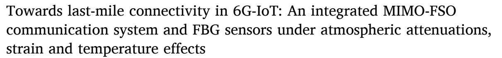

R. Arunachalam , Rupali Singh \* [,](https://orcid.org/0000-0003-0562-8369) M. Vinoth Kumar

*Department of Electronics and Communication Engineering, Faculty of Engineering and Technology, SRM Institute of Science and Technology, Delhi-NCR Campus, Modinagar, UP 201204, India*

#### ARTICLE INFO

#### *Keywords:* Integrated sensing and communication Free Space Optical (FSO) Fiber Bragg Grating (FBG) Temperature sensor Strain sensor

#### ABSTRACT

Free-space optical (FSO) communication is an advanced wireless optical communication technology that provides high-speed data services for 6th-generation wireless communication and Internet of Things (IoT) networks. In light of developing a 6G IoT network in an open environment, this paper analyses the impact of temperature and strain on FSO communication links using Fiber Bragg Grating (FBG) sensors. FSO systems are sensitive to temperature variations, and the position of the receiving telescope can be altered by mechanical strain that can affect the refractive index of the atmosphere, leading to signal attenuation and pointing errors. The current work proposes a model that integrates FBG sensors with an FSO channel for simultaneous strain and temperature measurements and a compensator that overcomes severe signal attenuations. Also, the impact of atmospheric attenuations on FSO systems is analysed. Scintillation models for weak, moderate and strong turbulence conditions are analysed, and the performance of the gamma-gamma turbulence model has been used to observe the MIMO FSO channel. The results are observed for FSO links with the atmospheric attenuations with FBG sensors that reflect the pointing errors at the receiver, showing a comprehensive ability to capture strain and temperature parameters. For the transmission of 10 Gb/s data, it was observed that the inclusion of the Multiple input and multiple-output (MIMO)-FSO technique significantly reduces bit errors from − 3.12494 dB to − 35.018 dB and increase signal power from 52.4 dBm to 58.9 dBm, indicating the adaptability of this integrated strategy for FSO communication with FBG sensors for last mile connectivity in 6G-IoT applications.

## **1. Introduction**

Development in the Internet of Things (IoT) technology requires high-speed wireless connections and sensor networks. Free space optical (FSO) is an optical wireless communication that supports high-data-rate transmission and offers secure connectivity in IoT networks. Since the FSO link uses point-to-point optical networks and operates in the electromagnetically free optical band, it is suitable for deployment in areas with significant RF signal traffic [\[1,2\]](#page-9-0). FBG sensors have also been increasingly integrated into the IoT because of their corrosion resistance, resistance to electromagnetic and radio frequency interference, and small size and weight. The sensing capability of FBGs can be seen in accelerometers for smart healthcare in consumer electronics and environmental monitoring, making them crucial in sensor technology and communications [\[3,4\].](#page-9-0)

Although FSO stands out as a promising technology to transmit data through free space, offering high bandwidth and low latency, the reliability and performance of FSO systems can be influenced by environmental factors, such as temperature variations, mechanical strains, and atmospheric conditions [\[5\]](#page-9-0).

Research on FSO communication is essential for advancing the optical communication field and addressing various challenges associated with this technology [6–[8\].](#page-9-0) Addressing these challenges requires innovative solutions, and one such solution lies in integrating FBG sensors with the receiver of the FSO communication system, which are known for their sensitivity to various physical parameters and have demonstrated their efficiency in monitoring environmental effects in diverse applications [\[9,10\].](#page-9-0) FSO technology enables the rapid transmission of data between satellites located in space along with 6G IoT applications that can be enhanced via mmWave, FSO, and underwater wireless optical communication [\[11](#page-9-0)–14]. These technologies can enhance spectral

*E-mail address:* [rupalis@srmist.edu.in](mailto:rupalis@srmist.edu.in) (R. Singh).

\* Corresponding author.

| Nomenclature |                                                                | Pr  | Received optical power        |
|--------------|----------------------------------------------------------------|-----|-------------------------------|
|              |                                                                | Pt  | Transmitted power             |
| Symbol       | Description                                                    | Dr  | Receiving antenna diameter    |
| Pe           | Photoelastic constant                                          | Dt  | Transmitting antenna diameter |
| ∊            | Induced strain                                                 | θ   | Beam divergence angle         |
| ζ            | Thermal optic coefficient                                      | α   | Specific attenuation          |
| ΔT           | Temperature variation                                          | Z   | Transmission range.           |
| μX           | Mean of the received intensity                                 | λB  | Bragg wavelength              |
| σX           | Variance                                                       | ne  | Effective index               |
| σ2 R      | Rytov variance thatislessthan 1 for weak turbulence            | Λ   | Grating periodicity           |
| C2           | Refractive index structure constant                            | ε   | Longitudinal strain           |
| n k       | Optical wavenumber(2π/λ)                                       | ΔT  | Temperature change            |
| L            | FSO link length                                                | pe  | Photo-elastic coefficient     |
| σ            | Attenuation coefficient                                        | αTE | Thermal expansion coefficient |
| V            | Visibility                                                     | αTO | Thermos optic coefficient     |
| λ            | Wavelength in nanometres                                       | F   | Force by pointing error       |
| q(v)         | Particle size distribution coefficient that is described using | E   | Young's modulus               |
|              | the Kruse model and which is widely used                       | A   | Cross sectional area          |

**Table 1**  System properties.

| Components/Parameters                                                       | Value                 |
|-----------------------------------------------------------------------------|-----------------------|
| PRBS – Bit-rate, Sequence-length                                            | 10Gb/s                |
| CW Laser – Wavelength, Transmission power, Linewidth                     | 1552nm, 20dBm, 10 MHz |
| MZM Extinction ratio                                                        | 30 dB                 |
| Optical amplifiers Gain, Noise figure                                       | 20dB, 4dB             |
| FSO links – Transmission telescope aperture,                                | 5cm, 20cm, 0.25       |
| Receiver telescope aperture, Beam Divergence, Index refraction structure | mrad5*10− 15m− 2/3    |
| White light source – Frequency, Average Power                               | 1550 nm, − 130 dB     |
| FBG Sensor –Wavelength shift for temperature and strain                  | 1545 nm, 1550 nm      |
| PIN Photo-detector's responsivity, dark-current                             | 1A/W, 10nA            |

**Table 2**  Visibility and atmospheric losses for 1550 nm wavelength.

| Weather condition          | Visibility (km) | Attenuation (dB/km) |
|----------------------------|-----------------|---------------------|
| Thick fog                  | 0.2             | 75                  |
| Moderate fog               | 0.5             | 28.9                |
| Light fog/Storm            | 0.77            | 18.3                |
| Very light fog/Heavy rain  | 1.9             | 6.9                 |
| Very light mist/light rain | 4               | 3.1                 |
|                            | 5.9             | 2                   |
| Clear air                  | 18.1            | 0.6                 |
|                            | 20              | 0.54                |

efficiency, enabling the transmission of large volumes of data within a certain bandwidth.

This work addresses severe signal losses while transmitting user data through the optical wireless communication network. It proposes a novel technique that integrates a MIMO FSO link with an FBG sensor and

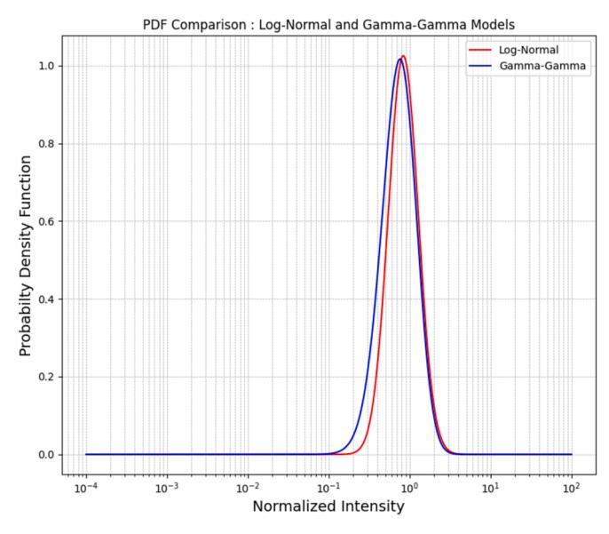

**Fig. 2.** Probability Density Function comparison of scintillation models.

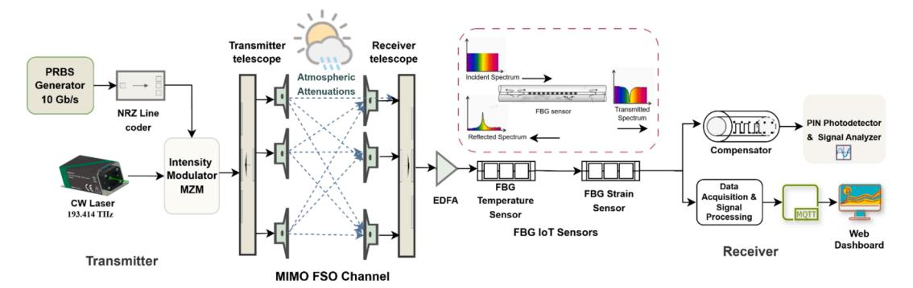

**Fig. 1.** Proposed integrated FSO communication and FBG sensing system.

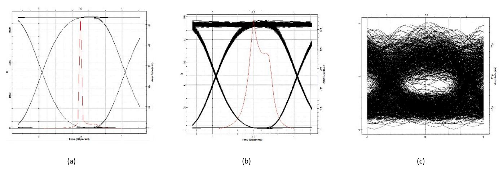

**Fig. 3.** Eye Diagrams – FSO link range under clear air with attenuation of 0.54 dB/km condition (a) 9.6 km, (b) 28 km, (c) 69.6 km.

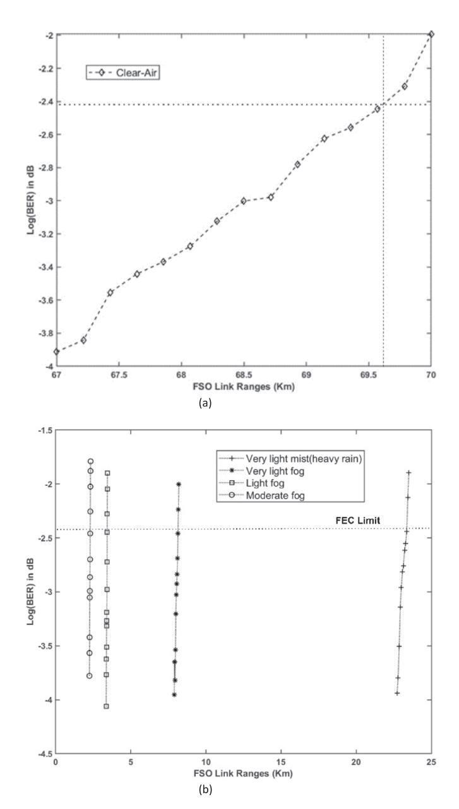

**Fig. 4.** BER vs FSO link ranges under (a) Clear air – attenuation, (b) very light mist (heavy rain), very light fog, light fog and moderate fog.

compensation at the receiver. Atmospheric turbulence models for weak, moderate, and strong levels are analysed and compared. Then, the system is integrated with FBG sensors that show the impact of misalignment at the receiver. Overall, the purpose of integration is to set up real-time monitoring and quick reactions to structural changes.

Section II reviews the related works, and Section III provides extensive details of system architecture and the causes of signal attenuations. Section IV discusses the results in detail, and Section V concludes the work.

## **2. Related works**

The section provides an overview of several research studies conducted to examine the performance of FSO networks for 6G and IoT applications. Previous research reported that the hybrid FSO system with radio frequency and FSO with visible light communication link in an open environment communication for signal attenuations in different atmospheric conditions, scintillations, and turbulence [15–[17\].](#page-9-0) An adaptive combining technique was proposed by the article [\[18\]](#page-9-0), in which the authors combined FSO and RF channels. To check the reliability of the system, the closed-form expressions were derived for outage probability and symbol error rate, where authors used the Malaga ´ channel model for analysis and extended their work to a UAVassisted system in which the Gamma Gamma turbulence model was used [\[19\]](#page-9-0). The log-normal distribution model is commonly employed to analyse the FSO networks under weak turbulence. However, the Gamma Gamma model is preferred when addressing moderate to heavy turbulence [\[20,21\]](#page-9-0). The article [\[22\]](#page-9-0) presents the Malaga ´ channel model with a low-density parity check-based MIMO-OFDM-based FSO link. The MIMO analysis becomes complicated because the mathematical analysis uses the Meijer-G function.

In the article [\[23\],](#page-9-0) the authors proposed a hybrid optical fibre and FSO channel, including an FBG sensor head for monitoring bridge conditions. In case of bridge damage, the transmission path switches from a fibre optic channel to a free-space optical. FBG sensors monitor the physical state of resources and infrastructure in IoT applications. Authors in the article [\[3\]](#page-9-0) proposed FBG-based accelerometers to monitor the activity levels of elders living alone. In the work [\[24\]](#page-9-0), the authors tested an FBG sensor arrangement with two Gaussian apodised sensors using OptiGrating. Then, the customised FBGs were put into OptiSystem for analysis. Two FBGs with varying centre wavelengths were chosen to differentiate strain and temperature to test the modelling tools' capacity to deliver and integrate sensor installations. The temperature sensitivity and strain measurements are 1.2 pm/μstrain and 14.4 pm/◦C, respectively. In their work [\[25\],](#page-9-0) authors compare methods for reducing dispersion in single-mode fibres at 10 Gbps and 40 Gbps by combining uniform FBG and Gaussian-apodized chirped FBG. The simulations

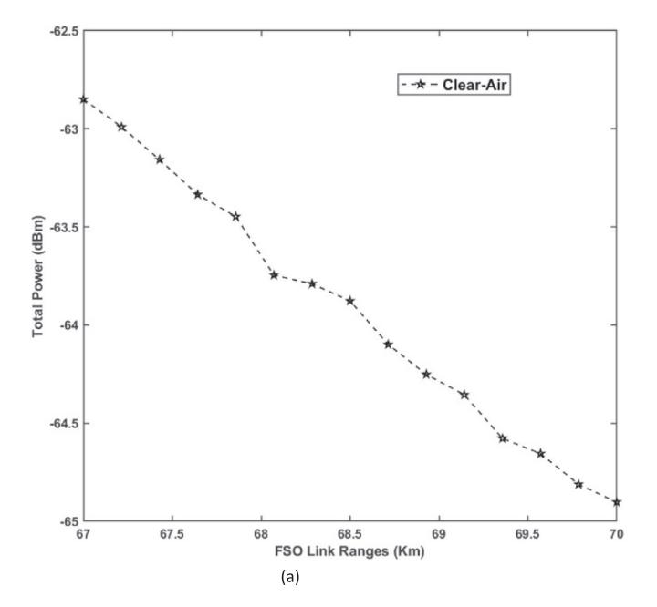

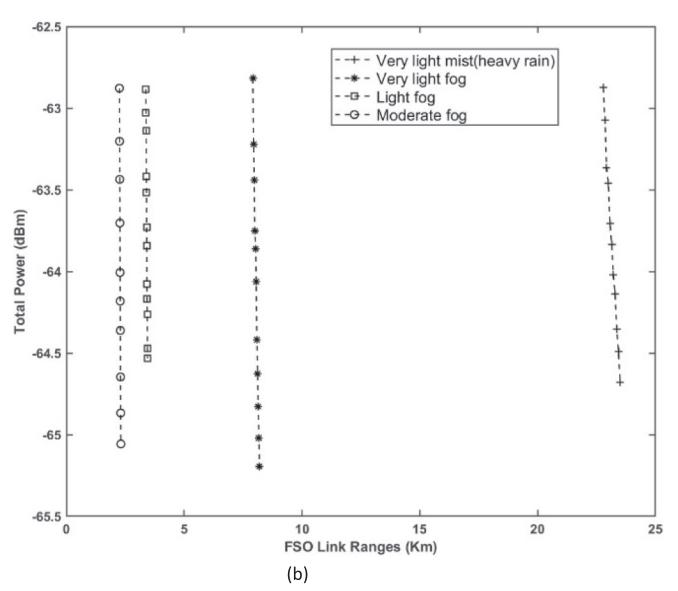

**Fig. 5.** Received power vs FSO link ranges under (a) Clear air − attenuation, (b) very light mist (heavy rain), very light fog, light fog and moderate fog.

demonstrated that cascading FBG designs increase single-mode fibre reach and quality factors.

Several researchers have analysed research on MIMO-based and wavelength division multiplexed FSO links with various modulation techniques in adverse weather conditions in previous works [\[26,27\]](#page-9-0). Authors in [\[28\]](#page-9-0), developed a methodology to improve bandwidth efficiency for FSO systems using multilevel modulation, OAM, and PPM. Adaptive spatial modulation (SM), spatial pulse position modulation (SPPM), and diversity addressed atmospheric attenuations and optical nonlinearity. In [\[29\]](#page-9-0), authors showed a hybrid model combining M− ary PPM and SM for MIMO to improve BER, SNR, and sensitivity under various turbulences. The authors in [\[30\]](#page-9-0) and [\[31\]](#page-9-0) proposed a spatial multiplexing technique that uses MIMO transceivers to enhance the transmission range of an FSO system. All works investigated the impact of pointing errors on the MIMO channel systems based on Malaga turbulent channels and a Gamma-Gamma (GG) turbulence model. Authors in [\[32\]](#page-9-0) and [\[33\]](#page-9-0) presented a DWDM-FSO communication system that uses MIMO techniques with eight channels, each transmitting 2.5 Gbps at a distance of 1.5 Km. The diversity combining techniques such as maximum-ratio combining (MRC), selection combining (SC), and equalgain combining (EGC), the performance metrics evaluated comprise BER, outage probability (OP), and SNR.

## *2.1. Limitations of implementing FSO communication*

Present RF wireless communication networks struggle to achieve data throughput coverage up to the last mile in 6G-IoT technology.

- High data rates and secure connections by FSO communications can resolve the challenge. The related work listed much research on FSO for 6G applications and the research issues with implementation and signal attenuations due to variations in atmospheric conditions.
- However, the signal loss due to the mechanical strain and temperature variations can be resolved if FSO is to reach its full potential for IoT deployments.
- Due to the interaction challenges between the FSO channel and FBG sensor, modulation affects system efficiency with FBG sensors. FSO links are susceptible to atmospheric turbulence, making modulation important for system robustness.

#### **3. System design**

This section contains thorough information about the proposed system design. Essentially, the suggested system begins with the transmitter, which includes a PRBS generator for test data, NRZ encoding for signal modulation, a 1552 nm CW laser for optical carrier generation, and a Mach-Zehnder Modulator (MZM) intensity modulation. The MIMO-based FSO channel improves dependability while reducing atmospheric turbulence effects such as scattering and absorption. Embedded FBG sensors inspect strain and temperature variations, allowing for real-time identification of position faults. A homogeneous FBG compensator rectifies wavelength shifts and chromatic dispersion while maintaining signal quality. The receiver evaluates performance measures involving BER and received signal power in different meteorological conditions. Environmental data gathered by FBG sensors is sent via MQTT to a web dashboard, offering real-time system insights and allowing for proactive modifications, making it perfect for secure, dependable communication and monitoring in harsh situations. The system parameters are listed in [Table 1.Table 2.](#page-1-0)

## *3.1. Transmitter*

As shown in [Fig. 1](#page-1-0), the transmitter section consists of a pseudorandom bit sequence generator (PRBS) set to 10 Gbps. The information is coded by non-return to zero-line codes, which connects the information signal to the intensity modulator. The carrier signal is generated by a continuous wave (CW) laser that is set to 1552 nm wavelength. The information signal in electrical form and the light signal from the CW laser are the inputs to the intensity modulator. The MZM has been used as an intensity modulator with two identical waveguides linked to two 3 dB couplers. The electro-optic effect in MZM allows for controlling refractive indices in waveguide branches by applying an externally given voltage. The output exhibits both constructive and destructive interference depending on the applied voltage. Amplitude modulation is simple and effective for intensitybased encoding of fibre Bragg grating sensor data, but turbulence causes amplitude fluctuations.

## *3.2. Free space optical channel*

Mathematical models of turbulence models of FSO channel are described as Log-Normal and Gamma-Gamma for weak and moderate to strong levels. The log-normal model makes the assumption that changes in received intensity result from small random variations in the refrac-

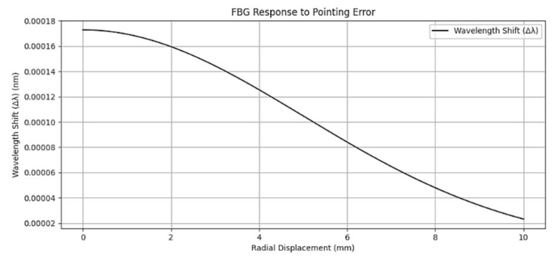

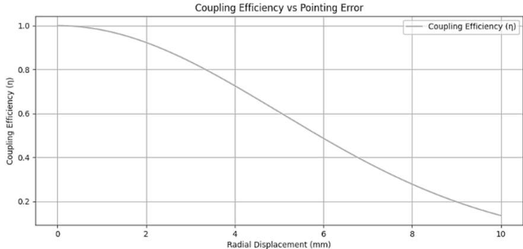

Fig. 6. Fiber Bragg Grating Response to Pointing Error.

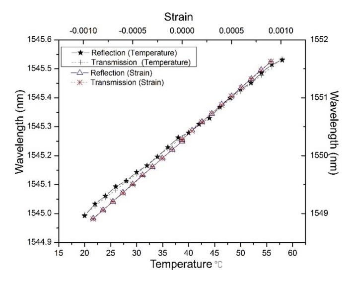

**Fig. 7.** Result of FBG sensor — wavelength shift due to temperature variation (Center wavelength set to 1545 nm) and due to applied strain (Center wavelength set to 1550 nm).

tive index. The probability density function (PDF) of intensity in Lognormal is shown as ref,

$$f_I(I) = \frac{1}{I\sqrt{2\pi\sigma_X^2}} exp(-\frac{(\ln I - \mu_X)^2}{2\sigma_X^2})$$
 (1)

$$\sigma_{\scriptscriptstyle X}^2 = ln(1+\sigma_{\scriptscriptstyle R}^2)$$

## Rytovvariance:

$$\sigma_R^2 = 1.23C_n^2k^{7/6}L^{11/6}$$

The bit error rate for the on–off keying technique is derived as follows:

$$BER = rac{1}{2} \operatorname{erfc} \left( rac{\sqrt{P_r^2}}{\sqrt{N_0}} 
ight)$$

Log-normal is not valid for strong turbulence. The Gamma-Gamma model is appropriate for moderate-to-strong turbulence. It encompasses both small-scale and large-scale turbulence effects. The scintillation phenomenon is most accurately described by the Gamma-Gamma model, which results from atmospheric turbulence-induced random variation in the optical power received.

The PDF of Gamma-Gamma distribution is expressed as [34,35]:

$$f_{I}(I_{mn}) = \frac{2(\alpha\beta)^{\frac{\alpha+\beta}{2}}}{\Gamma(\alpha)\Gamma(\beta)} I_{mn}^{\frac{\alpha+\beta}{2}-1} K_{\alpha-\beta}(2\sqrt{\alpha\beta I_{mn}})$$
 (2)

Where  $\Gamma(^*)-\gamma$  function,  $K_v(^*)-$  fifth order modified Bessel function of the II order type.

The most critical parameters  $\alpha$  and  $\beta$  are small-scale and large-scale turbulence region parameters derived from atmospheric conditions using the following formula [35,36]

$$\alpha = \left[ \exp\left(\frac{0.49\chi^2}{(1 + 0.18d^2 + 0.56\chi^{\frac{12}{5}})^{\frac{7}{6}}}\right) - 1 \right]^{-1}$$
 (3)

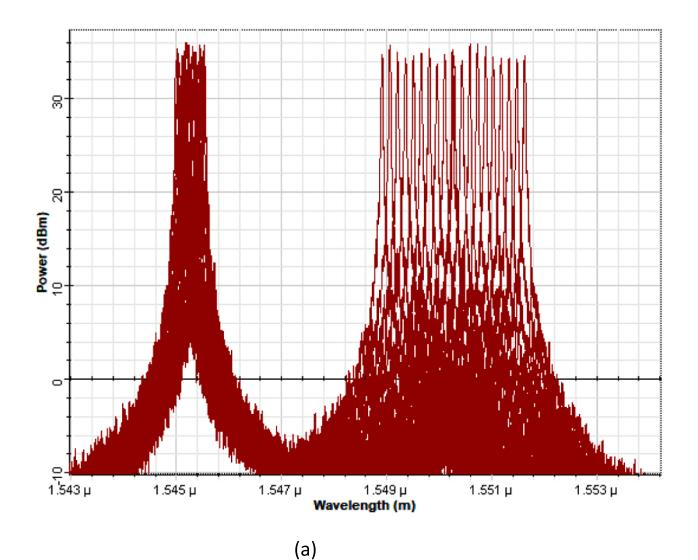

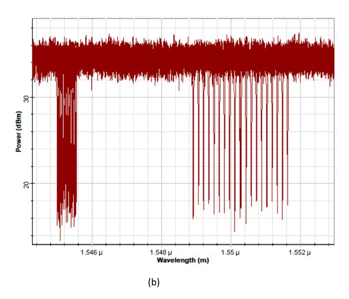

Fig. 8. FBG sensor signal (a) Shifted and reflected signal powers, (b) Shifted and transmitted signal power.

$$\beta = \left[ exp \left( \frac{0.51\chi^2 \left( 1 + 0.69\chi^{\frac{12}{5}} \right)^{\frac{-5}{6}}}{\left( 1 + 0.9d^2 + 0.62d^2\chi^{\frac{12}{5}} \right)^{\frac{7}{6}}} \right) - 1 \right]^{-1}$$
 (4)

Where  $\chi^2=0.5~C_n^2 K^{7/6} L^{11/6}$ ,  $d=((kD)^2/4L)(1/2)$ ,  $k=2\pi/\lambda$ . D – Diameter of the receiver lens aperture, L – link distance in meters, depending on the degree of turbulence  $C_n^2$  – The index of refractive structure parameter varies from  $10^{-13} \mathrm{m}^{-2/3}$  to  $10^{-17} \mathrm{m}^{-2/3}$  as strong to weak turbulence.

Bit error rate for on-off keying technique is derived as follows:

$$BER = \frac{1}{2} \int_{0}^{\infty} \operatorname{erfc}\left(\sqrt{\frac{I}{N_0}}\right) p_I(I) dI$$

Both models are compared in this work, and the Gamma-Gamma model is used in FSO communication systems due to its versatility. In contrast, the Log-Normal model is better for mild turbulence. The observed BER for both scintillation models is discussed in the next section. In this work, the PDF of a Gamma-Gamma model is employed to model the effects of atmospheric turbulence. Also, The MIMO technique, which transmits and receives data using multiple antennas, is used in this system.

#### 3.3. Estimation of signal attenuation due to weather conditions

A model for atmospheric attenuation was developed by [37],

$$\sigma(dB/km) = \frac{3.912}{V(km)} \left(\frac{\lambda}{550nm}\right)^{-q(\nu)}$$
(5)

Where,  $\sigma$  — attenuation coefficient, V — Visibility,  $\lambda$  — Wavelength in nanometres. q(v) — the particle size distribution coefficient that is described using the Kruse model and which is widely used.

$$q(v) = \begin{cases} 1.6V & \text{if } > 50 \text{ km} \\ 1.3 & \text{if } 6 \text{ km} < V < 50 \text{ km} \\ 0.16V + 0.34 & \text{if } 1 \text{ km} < V < 6 \text{ km} \\ V - 0.5 & \text{if } 0.5 \text{ km} < V < 1 \text{ km} \\ 0 & \text{if } V < 0.5 \text{ km} \end{cases}$$
(6)

The revised model for estimating a loss in signal intensity resulting from fog and smoke is as follows [37,38]:

$$\sigma(dB/km) = \frac{17}{V} \left(\frac{\lambda}{550}\right)^{-q(v)} \tag{7}$$

Equation (6) evaluates the system to determine the atmospheric attenuation values in dB/km listed in Table II. These variables are used to evaluate the proposed system's performance in various visibility conditions.

The received optical power from the free space channel can be mathematically described by Vishwakarma and Swaminathan [16],

$$P_r = P_t \frac{D_r^2}{[D_t + (\theta^* Z)]^2} *10^{(\frac{-aZ}{10})}$$
(8)

 $P_r$  – Received optical power,  $P_t$  – Transmitted power,  $D_r$  –Receiving antenna diameter,  $D_t$  – Transmitting antenna diameter,  $\theta$  – Beam divergence angle,  $\alpha$  – Specific attenuation Z – Transmission range.

Section IV analyses the proposed system's impact on power due to severe atmospheric attenuations, strain, and temperature effects and discusses the results.

#### 3.4. Receiver

FBG sensors integrated at the receiver are used in the proposed system to monitor open environmental conditions that could affect the optical link's performance. A PIN photo-detector detects the optical signal at the receiver, and a low-pass Bessel filter filters out high-frequency components and noise. A current is produced by the photo-diode in direct proportion to the intensity of the incident light when exposed to light. After processing this electrical signal, the transmitted data is extracted, and the BER analysers examine the lowest BER performance.

#### 3.5. Fiber Bragg grating sensor and the compensator

Temperature and strain will influence the wavelength and transfer functions in the Bragg grating of FBG sensors. Temperature changes and stress/strain variations affect the optical characteristics of an FBG. The fundamental equation determines the Bragg grating's wavelength,

$$\lambda_B = 2n_e \Lambda \tag{9}$$

Where  $\lambda_B$  is the Bragg wavelength,  $n_e$  is the effective index, and  $\Lambda$  is the grating periodicity.

The transmission and reflection depend upon the strength of the coupling and the phase mismatch. The reflection and transmission of the fibre grating sensor as a function of wavelength ( $\lambda$ ) can be written as [39]

$$r(\lambda) = \frac{iKsinh(QL)}{Qcosh(QL) - i\Delta\beta sinh(QL)}$$
 (10)

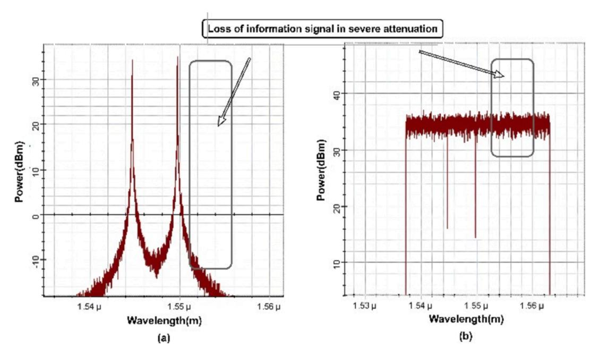

**Fig. 9.** FBG sensor signal in proposed system under severe attenuation by temperature and strain (a) Reflected signal power, (b) Transmitted signal power.

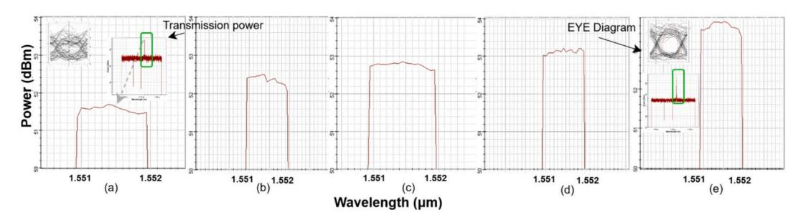

**Fig. 10.** Eye Diagrams – MIMO FSO and integrated FBG sensor system under clear air condition.

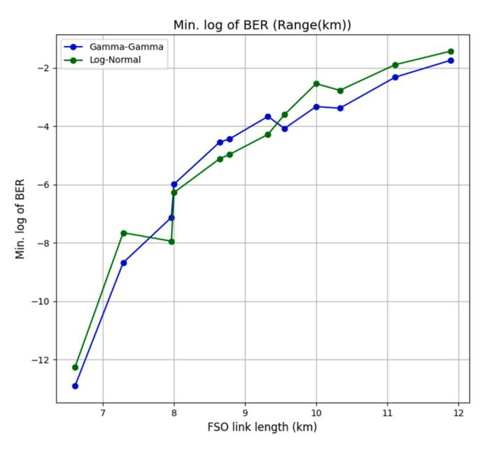

**Fig. 11.** BER vs Transmission link length for scintillation models Gamma-Gamma and Log-Normal.

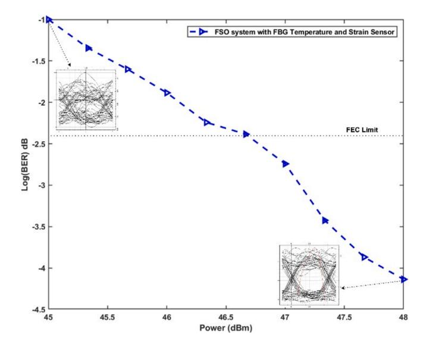

**Fig. 12.** BER vs Transmission power in a proposed system under clear atmospheric conditions and 10 km FSO link range with temperature and strain effects.

**Table 3**Comparison of MIMO scheme, compensator with single FSO system in present work.

| FSO system with Temperature and Strain effects | Log(BER) in dB | Received power in dB |
|------------------------------------------------|-------------------|----------------------|
| FSO system                                     | -3.12494          | 52.4                 |
| 2 x 2 MIMO                                     | -8.1691           | 55.6                 |
| 2 x 2 MIMO with Compensator                    | -19.283           | 55.7                 |
| 4 x 4 MIMO                                     | -24.987           | 58.7                 |
| 4 x 4 MIMO with Compensator                    | -35.018           | 58.9                 |

**Table 4**Comparison of various techniques used to achieve data rate and FSO link length.

| Reference          | Technique used                                  | Channel model                                         | Data rate | FSO link range |
|--------------------|-------------------------------------------------|-------------------------------------------------------|--------------|----------------------|
| [41]               | All-optical regenerate and forward        | Gamma-Gamma                                           | 6 Gbps    | 1 km                 |
| [42]               | Optical phase conjugation compensation          | Experimental – Collimator (ThorlabsF810FC-1550) | 5 Gbps    | 1 km                 |
| [21]               | SAC-OCDMA-based FSO system with DDDW code | Gamma-Gamma                                           | 1 Gbps    | 6.9 km               |
| Proposed System | MIMO FSO- FBG sensor integration             | Gamma-Gamma                                           | 10 Gbps   | 10 km                |

$$t(\lambda) = \frac{Q}{Q \cosh(QL) - i\Delta\beta \sinh(QL)}$$
(11)

Where

$$Q(\lambda) = \sqrt{|K|^2 - |\Delta\beta|^2}$$

 $K(\lambda)=\Delta n\pi/\lambda$  is the coupling strength,  $\Delta n$  is the index modulation, L is the grating length,  $\Delta\beta=2\pi n_e(\lambda^{-1}-\lambda_B^{-1})$  is the phase mismatch.

#### • The sensing effect

The shift in the Bragg wavelength  $\lambda_B$  caused by external forces acting on the FBG is the source of the sensing effect. When  $\lambda_B$  changes, the spectra of reflection and transmission will vary as well. The equation is defined in terms of the external effects, which are assumed to be the longitudinal strain and temperature acting on the grating  $\lambda_B = 2n_e\Lambda$  becomes [39]

$$\Delta \lambda_B = 2 \left( \frac{\partial n_e}{\partial T} \Lambda \Delta T + n_e \frac{\partial \Lambda}{\partial T} \Delta T + \frac{\partial n_e}{\partial l} \Lambda \Delta l + n_e \frac{\partial \Lambda}{\partial l} \Delta l \right)$$
(12)

which is rewritten as,

$$\frac{\Delta \lambda_{B1}}{\lambda_{B1}} = (\alpha_{TE} + \alpha_{TO}) \Delta T \tag{13}$$

$$\frac{\Delta \lambda_{B2}}{\lambda_{B2}} = (1 - p_e)\varepsilon + (\alpha_{TE} + \alpha_{TO})\Delta T \tag{14}$$

Where  $\varepsilon$  – longitudinal strain,  $\Delta T$  – temperature change,  $p_e$  – photoelastic coefficient,  $\alpha_{TE}$  – thermal expansion coefficient, and  $\alpha_{TO}$  – thermos optic coefficient.

This work uses two FBG sensors to sense temperature and the strain effects. Equations (12) and (13) are solved to get both the temperature and strain. The depicted arrangement is seen in Fig. 7.

## • Pointing error sensing using FBG sensor

FBG sensors connected with the FSO channel detect the pointing

error, which involves mechanical and temperature changes brought on by misaligned beams at the receiver. These variations provide indirect information regarding pointing errors.  $\lambda_B$  given in Equation (9) specifies the Bragg wavelength and variations in Bragg wavelength by the strain can be represented by,

$$\Delta \lambda_B = \lambda_B ((1 - P_e) \in -\zeta \Delta T) \tag{15}$$

The impact of pointing error, which is malalignment in beams, leads to temperature and strain effects in the FBG sensor.

#### Compensator

The compensator connected to the receiver section in the system mitigates the effects of dispersion. Dispersion causes signal distortion and limits the achievable data rates. A dispersion compensating fibre (DCF) component is used, and properties such as length and dispersion coefficient are configured to overcome the impact of signal dispersion.

#### 3.6. Mathematical modelling - FBG strain effects to pointing displacement

Considering r to be the pointing displacement, the induced strain  $\in$  on the receiver surface is modelled as.

$$\epsilon = \frac{F}{EA} \tag{16}$$

Where F is the force by pointing error, E is Young's modulus, and A is the cross-sectional area. Then  $\Delta \lambda_B$  is by the effect of  $\in$  can be given as

$$\Delta \lambda_B = \lambda_B ((1 - P_e) \in$$

Also, the misalignment impacts the coupling efficiency.  $\eta$  as

$$\eta = \exp(-\frac{r^2}{2\omega_s^2})\tag{17}$$

Where,  $\omega_z$  – Beam waist.

Algorithm 1 discusses how the proposed system analyses signal attenuations and how interfacing the FSO link with the FBG sensor solves challenges. The wavelength shift of the FBG sensor was used to monitor strain and temperature, and FSO communication signal attenuation under various environments was examined.

**Input:** PRBS, Weather Conditions (C), FSO Link Range (R)

Laser Parameters: Wavelength=1552 nm, Transmission power=20 dBm, Laser linewidth=0.1MHz

Output: Bits Error Rates BER, Maximum Distance of FSO link Range (at FEC limits)

Integrated FSO communication FBG sensing system

Step 1: analyze\_fso\_system():

End

Calculate the Maximum distance of the FSO Link Range Measured at FEC (limits) and signal power required.

Measure log (BER) and power in dB

8

## **4. Results and discussions**

The proposed FSO system integrated with the FBG IoT sensor has been analysed for received bit error rate (BER) and signal power, as well as an eye diagram. The sensor is tested with transmitted and reflected optical power. First, the FSO system is analysed under various atmospheric attenuation ranges of 0*.*54*dB/km*, 2*dB/km*, 6*.*9*dB/km*, 18*.*3*dB/km*, and 28*.*9*dB/km* for clear air, very light mist (heavy rain), very light fog, light fog, and moderate fog, respectively.

[Fig. 2](#page-1-0) outlines the calculations of the log-normal and gamma-gamma turbulence models, which mostly concentrate on the PDF (probability density function) of the intensity variations generated by air turbulence. Bit Error Rate (BER) for modulation technique On-Off Keying (OOK) is computed using these PDF and it could be noted that the Gamma-Gamma model accommodates greater intensity withering under intense turbulence; however, the Log-Normal model has a narrower and less slanted distribution. [Fig. 3](#page-2-0) shows the maximum supported FSO link ranges under clear atmospheric conditions. [Fig. 3](#page-2-0)(a) shows an eye diagram at 9.6 km with the wider eye open and the eye closing as the distance increased. The maximum supported FSO link range of 69.6 km under ideal conditions is shown in [Fig. 3](#page-2-0)(c), which is in acceptable BER (≤ 2 × 10− 3, i.e., FEC limit) [\[40\]](#page-9-0).

[Fig. 4](#page-2-0) shows the BER received and the maximum FSO link range obtained under different weather conditions. In [Fig. 4\(](#page-2-0)a), the graph illustrates that an FSO channel's maximum distance is 69.6 km when attenuation is 0.54 dB/km, and in [Fig. 4\(](#page-2-0)b), the graph illustrates 23.4 km for 2 dB/km, 8.1 km for 6.9 dB/km, 3.2 km for 18.3 dB/km, and 2.4 km for 28.9 dB/km. The BER increases as the free space channel attenuation increases.

[Fig. 5](#page-3-0) displays the received power during the signal propagation through clear air, rain, and fog conditions. Various atmospheric conditions affect the received optical power. [Fig. 5\(](#page-3-0)a) shows reduced received optical power from − 62.8 dBm to − 64.9 dBm under a clear atmosphere. [Fig. 5](#page-3-0)(b) shows the power results from atmospheric attenuations and FSO link length under rain and fog conditions.

Mist consists of tiny water droplets suspended in the air. Furthermore, raindrops in the atmosphere scatter and absorb the optical signal, significantly decreasing received optical power. The attenuation of the optical signal in light fog is moderate, leading to a moderate decrease in received optical power. Moderate fog contains a higher density of water droplets than light fog, leading to increased power reduction.

Previous results show that the signal attenuations in FSO systems are only due to atmospheric conditions. The FBG sensors analyse the impact of strain and temperature, which are shown in upcoming results and discussions. The FSO system under clear atmospheric conditions with temperature and strain effects has been considered for further investigation. The proposed system includes two FBG sensors, as shown in [Fig. 1.](#page-1-0) The sensors sense the changes in temperature and strain, which will shift a Bragg wavelength. An effective analysis of the FBG sensor involves systematically varying the temperature and stress/strain levels. The wavelengths are set to 1545 nm and 1550 nm in the first and second FBG sensors, respectively.

[Fig. 6](#page-4-0) shows the FBG response and the coupling efficiency for pointing errors. *λB*was set to 1550 nm and E represents the strain, *ωz* characterizes the Gaussian beam at the receiver side. The pointing displacement range r varies from 0 mm to 10 mm. [Fig. 6a](#page-4-0) displays the pointing error detection as wavelength shift when displacement increased, and 6b shows a decrement in the coupling efficiency. It has been observed from the result that the FBG sensors technique provides quantifying minor displacements resulting from wavelength variations, and the sensitivity depends upon the strain and material characteristics. Pointing errors reduce coupling efficiency, resulting in an increased BER and decreased received power.

[Fig. 7](#page-4-0) displays the sensor's sensing capability as wavelengths shift. Equation [\(14\)](#page-7-0) shows the variation in the Bragg wavelength when both strain and temperature are influenced. The FBG sensor is connected to an interrogator, and the data acquisition module collects the sensor data. The wavelength shift information is subsequently transmitted to an IoT web server for real-time monitoring via the MQTT protocol.

[Fig. 8](#page-5-0) displays the resultant reflection and transmission spectra observed by the interrogation setup. This approach has created a setup in which the sensing system is interrogated at specific intervals. At intervals of one second, these interrogation points responses are monitored. Each second, there is a 2 ◦C increase in temperature and a 10e-5 range of strain increase. An interrogator emits a stream of optical signals every second, traversing the system and returning, followed by another stream transmitted a second later. Thus, with each time step, the system is interrogated.

A carrier wave signal wavelength in continuous wave laser is set at 1552 nm, and transmission power is 20 dBm, which carries 10 Gb/s data through the FSO channel in this system. [Fig. 9](#page-6-0) depicts the impact of severe attenuations due to temperature and strain in the FSO communication system. The information signal is severely lost, as shown by signal spectra from the FBG sensor component. The impact of temperature and the signal attenuation required to increase the transmission power upto 65 dBm and strain leads to pointing errors, which completely lose the information signal at the receiver.

The proposed system integrates MIMO FSO channels with the FBG sensors. A MIMO technique integrates signals from several apertures to expand the communication range. The system is analysed with MIMO channels, increasing the transmission power. Additionally, the compensator mitigates the dispersion in optical signals, leading to enhanced signal quality. [Fig. 10](#page-6-0) presents the results of received power while increasing the transmission power from 46 dBm, 46.6 dBm, 47 dBm, 47.6 dBm and 48 dBm. The results indicate that the impact of increased transmission power helps retrieve the information signal. [Fig. 12](#page-6-0) illustrates the BER that achieved the FEC limit for 46.6 dBm transmission power.

[Fig. 11](#page-6-0) shows the observed result for both scintillation models. The FSO link length is set from 6 km to 12 km. The BER is relatively low and constant for short FSO links, which have a small amount of scintillation. As the FSO link rises, the scintillation variance also increases, which results in higher swipes in the received signal intensity and an increased BER. The log-normal model is not suitable for strong-intensity fading and implies mild turbulence, which results in a gradual BER variation.

In the Gamma-Gamma turbulence model, both scales of turbulence are taken into consideration because the BER is slightly higher than the log-normal model when it comes to short FSO links that experience moderate turbulence observed from an 8 km link distance. As the length of the FSO link rises, the intensity of the scintillation increases as well, which results in a more severe fading of the signal, as observed from 9.6 km of FSO link length. This causes a non-linear increase in the BER. The Gamma-Gamma model is more realistic than the log-normal model in terms of depicting intensity fading for long channels.

Improvements in signal power and BER are analysed step by step and compared as listed in [Table 3.](#page-7-0) The final investigation evaluated the performance of the MIMO FSO and the integrated FBG sensor system set to 46.6 dBm transmission power using single 1 x 1, dual 2 x2 , and 4 x 4 FSO channels with the compensator to overcome the impact of temperature and strain effects. The BER value is greatly reduced as a difference of 31.9 dB from the FSO system with severe attenuations to the system with 4 x 4 MIMO FSO channels and the compensator. The received power increased to 6.5 dBm. [Table 4](#page-7-0) shows the comparison of the present work with previous works.

## **5. Conclusion**

The proposed system addresses severe signal losses due to various atmospheric conditions, temperature, and strain in the FSO channel integrated with the FBG sensors and compensator. The system significantly enhances the ability to analyse and monitor open environment data. The system shows the capability of adapting to varying levels of

laser power, thereby resolving the reduction in the intensity of the transmitted signal. MIMO channels improve system performance metrics, and embedding the compensator reduces dispersion and increases signal quality. Increased input CW laser power and 4 x 4 MIMO FSO channels with the compensator significantly improve BER and received power. The required transmission power has been reduced from 65 dBm to 46.6 dBm and can achieve the acceptable FSO link range of 10 km. The proposed system offers high-speed and secure communication, along with precise environmental measurements, facilitating the development of 6G wireless sensor IoT networks. The work can be extended by incorporating advanced modulation and signal processing techniques to support increased FSO link length and equalization of the required information.

## **CRediT authorship contribution statement**

**R. Arunachalam:** Conceptualization, Data curation, Formal analysis, Investigation, Writing – original draft. **Rupali Singh:** Writing – review & editing, Supervision, Project administration, Formal analysis. **M. Vinoth Kumar:** Methodology, Resources, Software, Writing – review & editing.

## **Declaration of competing interest**

The authors declare that they have no known competing financial interests or personal relationships that could have appeared to influence the work reported in this paper.

#### **References**

- [1] [Y.C. Manie, C.-K. Yao, T.-Y. Yeh, Y.-C. Teng, P.-C. Peng, Laser-based optical](http://refhub.elsevier.com/S2215-0986(25)00013-8/h0005)  [wireless communications for internet of things \(IoT\) application,](http://refhub.elsevier.com/S2215-0986(25)00013-8/h0005) *IEEE Internet Things J.* [9 \(23\) \(2022\) 24466](http://refhub.elsevier.com/S2215-0986(25)00013-8/h0005)–24476.
- [2] R. Kılıç, N. Kumbasar, E.A. Oral, I.Y. Ozbek, Drone classification using RF signal based spectral features, *Eng. Sci. Technol. Int. J.* 28 (2022) 101028, [https://doi.org/](https://doi.org/10.1016/j.jestch.2021.06.008)  [10.1016/j.jestch.2021.06.008](https://doi.org/10.1016/j.jestch.2021.06.008).
- [3] M. Rocha, Indoor localization using fiber Bragg grating-based accelerometers for smart healthcare, *IEEE Trans. Consum. Electron.* 70 (1) (2024) 68–77, [https://doi.](https://doi.org/10.1109/TCE.2023.3299082)  [org/10.1109/TCE.2023.3299082](https://doi.org/10.1109/TCE.2023.3299082).
- [4] A.G. Mohapatra, A. Mohanty, A. Khanna, D. Gupta, A.K. Dutta, A. Alkhayyat, Enhancing consumer electronics in healthcare 4.0: integrating passive FBG sensor and IoMT technology for remote HRV monitoring, *IEEE Trans. Consum. Electron.*  (2024) 1, <https://doi.org/10.1109/TCE.2024.3424975>.
- [5] [A. Mansour, R. Mesleh, M. Abaza, New challenges in wireless and free space optical](http://refhub.elsevier.com/S2215-0986(25)00013-8/h0025)  [communications,](http://refhub.elsevier.com/S2215-0986(25)00013-8/h0025) *Opt. Lasers Eng.* 89 (2017) 95–108.
- [6] H. Singh, N. Mittal, R. Miglani, H. Singh, G.S. Gaba, M. Hedabou, Design and analysis of high-speed free space optical (FSO) communication system for supporting fifth generation (5G) data services in diverse geographical locations of India, *IEEE Photonics J.* 13 (5) (2021) 1–12, [https://doi.org/10.1109/](https://doi.org/10.1109/JPHOT.2021.3113650) [JPHOT.2021.3113650](https://doi.org/10.1109/JPHOT.2021.3113650).
- [7] [M.V. Kumar, V. Kumar, Investigation of a coherent dual-polarized 16-QAM 16](http://refhub.elsevier.com/S2215-0986(25)00013-8/h0035)  channel WDM FSO gamma–[gamma fading system under various atmospheric](http://refhub.elsevier.com/S2215-0986(25)00013-8/h0035)  losses, *[J. Mod. Opt.](http://refhub.elsevier.com/S2215-0986(25)00013-8/h0035)* (2022) 1–12.
- [8] M. Kumari, A. Sharma, S. Chaudhary, High-speed spiral-phase donut-modes-based hybrid FSO-MMF communication system by incorporating OCDMA scheme, *Photonics* 10 (1) (2023) 1, <https://doi.org/10.3390/photonics10010094>.
- [9] M.A. Gonzalez-Reyna, Laser temperature sensor based on a fiber Bragg grating, *IEEE Photon. Technol. Lett.* 27 (11) (2015) 1141–1144, [https://doi.org/10.1109/](https://doi.org/10.1109/LPT.2015.2406572) [LPT.2015.2406572.](https://doi.org/10.1109/LPT.2015.2406572)
- [10] Z. Chen, L. Yuan, G. Hefferman, T. Wei, Terahertz fiber Bragg grating for distributed sensing, *IEEE Photon. Technol. Lett.* 27 (10) (2015) 1084–1087, [https://](https://doi.org/10.1109/LPT.2015.2407580)  [doi.org/10.1109/LPT.2015.2407580.](https://doi.org/10.1109/LPT.2015.2407580)
- [11] S. Li, L. Yang, J. Zhang, P.S. Bithas, T.A. Tsiftsis, M.-S. Alouini, Mixed THz/FSO relaying systems: statistical analysis and performance evaluation, *IEEE Trans. Wirel. Commun.* 21 (12) (2022) 10996–11010, [https://doi.org/10.1109/](https://doi.org/10.1109/TWC.2022.3188698) [TWC.2022.3188698.](https://doi.org/10.1109/TWC.2022.3188698)
- [12] Md. Abu Sufian, N. Hussain, N. Kim, Quasi-binomial series-fed array for performance improvement of millimeter-wave antenna for 5G MIMO applications, *Eng. Sci. Technol. Int. J.* 47 (2023) 101548, [https://doi.org/10.1016/j.](https://doi.org/10.1016/j.jestch.2023.101548)  [jestch.2023.101548.](https://doi.org/10.1016/j.jestch.2023.101548)
- [13] S. Srivastava, S. Gupta, V.K. Sachan, G. Saxena, S.S. Srikant, High gain circularly polarized graphene inspired dielectric resonator antenna for 6G IOT THz optical communication and optical refractive index Biosensing applications, *Eng. Sci. Technol. Int. J.* 49 (2024) 101603, <https://doi.org/10.1016/j.jestch.2023.101603>.
- [14] S. Chaudhary, Performance investigation of a VLC-PDM based UWOC system under adverse underwater conditions with varying chlorophyll levels, *Opt. Commun.* 573 (2024) 131025, [https://doi.org/10.1016/j.optcom.2024.131025.](https://doi.org/10.1016/j.optcom.2024.131025)

- [15] [S. Sharma, A.S. Madhukumar, R. Swaminathan, Effect of pointing errors on the](http://refhub.elsevier.com/S2215-0986(25)00013-8/h0075)  [performance of hybrid FSO/RF networks,](http://refhub.elsevier.com/S2215-0986(25)00013-8/h0075) *IEEE Access* 7 (2019) 131418–131434.
- [16] [N. Vishwakarma, R. Swaminathan, Performance analysis of hybrid FSO/RF](http://refhub.elsevier.com/S2215-0986(25)00013-8/h0080) [communication over generalized fading models,](http://refhub.elsevier.com/S2215-0986(25)00013-8/h0080) *Opt. Commun.* 487 (2021) 126796.
- [17] S. Chaudhary *et al.*, "Frontiers | Hybrid MDM-PDM Based Ro-FSO System for Broadband Services by Incorporating Donut Modes Under Diverse Weather Conditions", doi: 10.3389/fphy.2021.756232.
- [18] G. Xu, M. Xu, Q. Zhang, Z. Song, Cooperative FSO/RF space-air-ground integrated network system with adaptive combining: a performance analysis, *IEEE Trans. Wirel. Commun.* 23 (11) (2024) 17279–17293, [https://doi.org/10.1109/](https://doi.org/10.1109/TWC.2024.3452642)  [TWC.2024.3452642.](https://doi.org/10.1109/TWC.2024.3452642)
- [19] L. Qu, G. Xu, Z. Zeng, N. Zhang, Q. Zhang, UAV-assisted RF/FSO relay system for space-air-ground integrated network: a performance analysis, *IEEE Trans. Wirel. Commun.* 21 (8) (Aug. 2022) 6211–6225, [https://doi.org/10.1109/](https://doi.org/10.1109/TWC.2022.3147823)  [TWC.2022.3147823.](https://doi.org/10.1109/TWC.2022.3147823)
- [20] I.A. Alimi, P.P. Monteiro, Performance analysis of 5G and beyond mixed THz/FSO relaying communication systems, *Opt. Laser Technol.* 176 (2024) 110917, [https://](https://doi.org/10.1016/j.optlastec.2024.110917)  [doi.org/10.1016/j.optlastec.2024.110917](https://doi.org/10.1016/j.optlastec.2024.110917).
- [21] [N. Kumar, V. Khandelwal, Performance limits of SAC-OCDMA-based FSO system](http://refhub.elsevier.com/S2215-0986(25)00013-8/h0105)  over gamma–[gamma fading using DDDW code,](http://refhub.elsevier.com/S2215-0986(25)00013-8/h0105) *J. Opt.* (2023) 1–12.
- [22] D. Anandkumar, R.G. Sangeetha, Performance evaluation of LDPC-coded power series based M´ alaga (Ḿ) distributed MIMO/FSO link with M-QAM and pointing error, *IEEE Access* 10 (2022) 62037–62055, [https://doi.org/10.1109/](https://doi.org/10.1109/ACCESS.2022.3180835)  [ACCESS.2022.3180835.](https://doi.org/10.1109/ACCESS.2022.3180835)
- [23] [Y.-L. Yu, S.-K. Liaw, H.-H. Chou, H. Le-Minh, Z. Ghassemlooy, A hybrid optical](http://refhub.elsevier.com/S2215-0986(25)00013-8/h0115) [fiber and FSO system for bidirectional communications used in bridges,](http://refhub.elsevier.com/S2215-0986(25)00013-8/h0115) *IEEE Photonics J.* [7 \(6\) \(2015\) 1](http://refhub.elsevier.com/S2215-0986(25)00013-8/h0115)–9.
- [24] [M.M. Elgaud, M.S.D. Zan, A.A.G. Abushagur, A.A.A. Bakar, Analysis of](http://refhub.elsevier.com/S2215-0986(25)00013-8/h0120) [independent strain-temperature fiber Bragg grating sensing technique using](http://refhub.elsevier.com/S2215-0986(25)00013-8/h0120)  OptiSystem and OptiGrating, in: In *[2016 IEEE 6th International Conference on](http://refhub.elsevier.com/S2215-0986(25)00013-8/h0120)  [Photonics \(ICP](http://refhub.elsevier.com/S2215-0986(25)00013-8/h0120)*, 2016, pp. 1–3.
- [25] I. Nsengiyumva, E. Mwangi, G. Kamucha, A comparative study of chromatic dispersion compensation in 10 Gbps SMF and 40 Gbps OTDM systems using a cascaded Gaussian linear apodized chirped fibre Bragg grating design, *Heliyon* 8 (4) (2022) e09308, [https://doi.org/10.1016/j.heliyon.2022.e09308.](https://doi.org/10.1016/j.heliyon.2022.e09308)
- [26] S. Chaudhary, Y. Meng, A. Sharma, M.A. Naeem. "MIMO and PDM-based intersatellite optical link for high-speed data transfer and remote sensing application", doi: 10.1371/journal.pone.0313342.
- [27] Anuranjana, S. Kaur, R. Goyal, S. Chaudhary, 1000 Gbps MDM-WDM FSO link employing DP-QPSK modulation scheme under the effect of fog, *Optik* 257 (2022) 168809, [https://doi.org/10.1016/j.ijleo.2022.168809.](https://doi.org/10.1016/j.ijleo.2022.168809)
- [28] E.E. Elsayed, Atmospheric turbulence mitigation of MIMO-RF/FSO DWDM communication systems using advanced diversity multiplexing with hybrid N-SM/ OMI M-ary spatial pulse-position modulation schemes, *Opt. Commun.* 562 (2024) 130558, [https://doi.org/10.1016/j.optcom.2024.130558.](https://doi.org/10.1016/j.optcom.2024.130558)
- [29] E.E. Elsayed, B.B. Yousif, Performance enhancement of hybrid diversity for M-ary modified pulse-position modulation and spatial modulation of MIMO-FSO systems under the atmospheric turbulence effects with geometric spreading, *Opt. Quantum Electron.* 52 (12) (2020) 12, <https://doi.org/10.1007/s11082-020-02612-1>.
- [30] D. Chen, L. Tang, M. Wang, Y. Liu, Performance analysis of MIMO FSO adaptive mode switching in Malaga turbulent channels with pointing error, *Opt. Laser Technol.* 181 (2025) 111967, [https://doi.org/10.1016/j.optlastec.2024.111967.](https://doi.org/10.1016/j.optlastec.2024.111967)
- [31] [M.R. Bhatnagar, Z. Ghassemlooy, Performance analysis of gamma](http://refhub.elsevier.com/S2215-0986(25)00013-8/h0155)–gamma fading [FSO MIMO links with pointing errors,](http://refhub.elsevier.com/S2215-0986(25)00013-8/h0155) *J. Light Technol.* 34 (9) (2016) 2158–2169.
- [32] E.E. Elsayed, et al., Coding techniques for diversity enhancement of dense wavelength division multiplexing MIMO-FSO fault protection protocols systems over atmospheric turbulence channels, *IET Optoelectron.* 18 (1–2) (2024) 11–31, <https://doi.org/10.1049/ote2.12111>.
- [33] E.E. Elsayed, B.B. Yousif, M.M. Alzalabani, Performance enhancement of the power penalty in DWDM FSO communication using DPPM and OOK modulation, *Opt. Quantum Electron.* 50 (7) (2018) 7, <https://doi.org/10.1007/s11082-018-1508-y>.
- [34] [L.C. Andrews, R.L. Phillips, C.Y. Hopen,](http://refhub.elsevier.com/S2215-0986(25)00013-8/h0170) *Laser Beam Scintillation with Applications*, [vol. 99, SPIE Press, 2001.](http://refhub.elsevier.com/S2215-0986(25)00013-8/h0170)
- [35] [L.C. Andrews, R.L. Phillips, Laser beam propagation through random media,](http://refhub.elsevier.com/S2215-0986(25)00013-8/h0175) *Laser [Beam Propag. Random Media Second Ed.](http://refhub.elsevier.com/S2215-0986(25)00013-8/h0175)* (2005).
- [36] [N. Letzepis, A.G.I. Fabregas, Outage probability of the Gaussian MIMO free-space](http://refhub.elsevier.com/S2215-0986(25)00013-8/h0180)  [optical channel with PPM,](http://refhub.elsevier.com/S2215-0986(25)00013-8/h0180) *IEEE Trans. Commun.* 57 (12) (2009) 3682–3690.
- [37] [I.I. Kim, B. McArthur, E.J. Korevaar, Comparison of laser beam propagation at 785](http://refhub.elsevier.com/S2215-0986(25)00013-8/h0185)  [nm and 1550 nm in fog and haze for optical wireless communications,](http://refhub.elsevier.com/S2215-0986(25)00013-8/h0185) *Opt. Wirel. [Commun. III SPIE](http://refhub.elsevier.com/S2215-0986(25)00013-8/h0185)* (2001) 26–37.
- [38] M. Ijaz, Z. Ghassemlooy, J. Pesek, O. Fiser, H.L. Minh, E. Bentley, Modeling of fog and smoke attenuation in free space optical communications link under controlled laboratory conditions, *J. Light Technol.* 31 (11) (2013) 1720–1726, [https://doi.org/](https://doi.org/10.1109/JLT.2013.2257683)  [10.1109/JLT.2013.2257683.](https://doi.org/10.1109/JLT.2013.2257683)
- [39] [M.M. Werneck, R. Allil, B.A. Ribeiro, F.V. Nazar](http://refhub.elsevier.com/S2215-0986(25)00013-8/h0195)´e, A guide to fiber Bragg grating sensors, *[Curr. Trends Short- Long-Period Fiber Gratings](http://refhub.elsevier.com/S2215-0986(25)00013-8/h0195)* (2013) 1–24.
- [40] "Dual-polarization multi-band OFDM versus single-carrier DP-QPSK for 100 Gb/s long-haul WDM transmission over legacy infrastructure." Accessed: Jan. 25, 2022. [Online]. Available: [https://www.osapublishing.org/oe/fulltext.cfm?uri](https://www.osapublishing.org/oe/fulltext.cfm?uri=oe-21-14-16982%26id=259011)=oe-21- [14-16982](https://www.osapublishing.org/oe/fulltext.cfm?uri=oe-21-14-16982%26id=259011)&id=259011.
- [41] [A.J. Aljohani, J. Mirza, S. Ghafoor, A novel regeneration technique for free space](http://refhub.elsevier.com/S2215-0986(25)00013-8/h0205)  [optical communication systems,](http://refhub.elsevier.com/S2215-0986(25)00013-8/h0205) *IEEE Commun. Lett.* 25 (1) (2020) 196–199.
- [42] [J. Chen, Free-space communication turbulence compensation by optical phase](http://refhub.elsevier.com/S2215-0986(25)00013-8/h0210) conjugation, *[IEEE Photonics J.](http://refhub.elsevier.com/S2215-0986(25)00013-8/h0210)* 12 (5) (2020) 1–11.