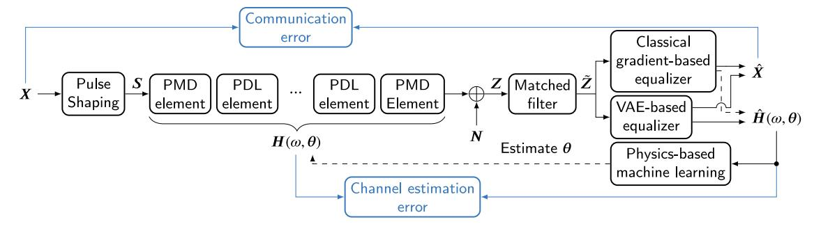
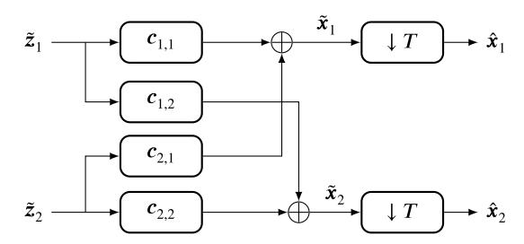
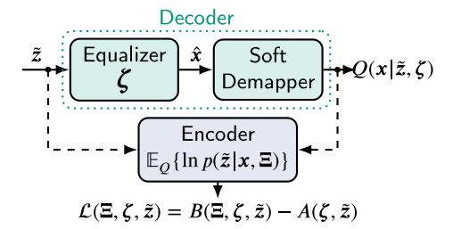
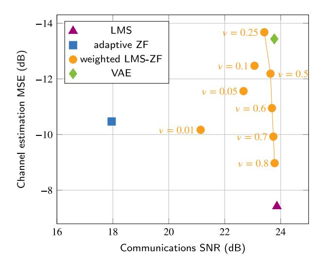
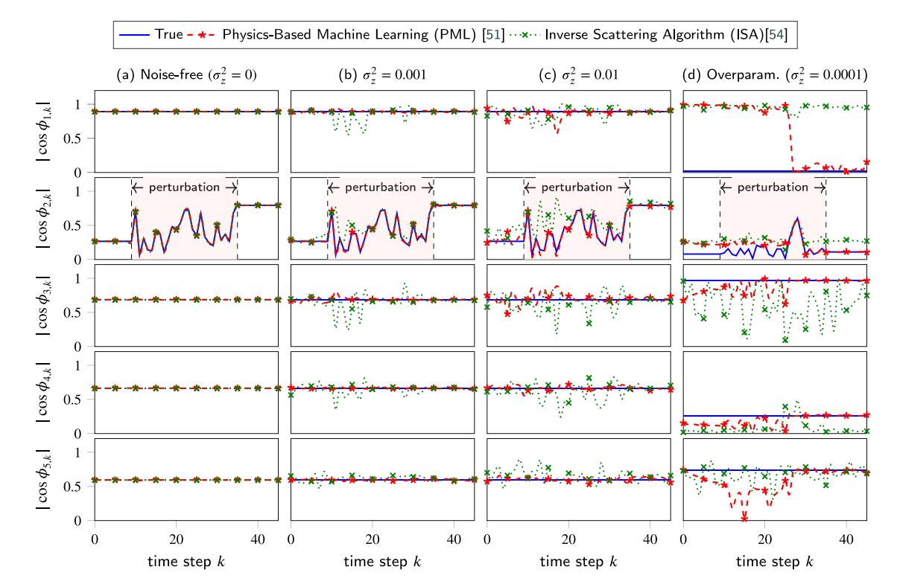

Contents lists available at [ScienceDirect](https://www.elsevier.com/locate/yofte)

# Optical Fiber Technology

journal homepage: [www.elsevier.com/locate/yofte](https://www.elsevier.com/locate/yofte)

# Machine learning opportunities for integrated polarization sensing and communication in optical fibers

Andrej Rode [a](#page-0-0) ,[∗](#page-0-1),[1](#page-0-2) , Mohammad Farsi [b](#page-0-3) , Vincent Lauinger [a](#page-0-0) , Magnus Karlsson [c](#page-0-4) , Erik Agrell [b](#page-0-3) , Laurent Schmalen [a](#page-0-0) , Christian Häger [b](#page-0-3)

- a *Communications Engineering Lab (CEL), Karlsruhe Institute of Technology, Karlsruhe, Germany*
- b *Department of Electrical Engineering, Chalmers University of Technology, Gothenburg, Sweden*
- c *Department of Microtechnology and Nanoscience, Chalmers University of Technology, Gothenburg, Sweden*

# A R T I C L E I N F O

#### *Keywords:* End-to-end autoencoders Machine learning Physics-based learning Polarization sensing Variational autoencoders

### A B S T R A C T

As the bedrock of the Internet, optical fibers are ubiquitously deployed and historically dedicated to ensuring robust data transmission. Leveraging their extensive installation, recent endeavors have focused on utilizing these telecommunication fibers also for environmental sensing, exploiting their inherent sensitivity to various environmental disturbances. In this paper, we consider integrated sensing and communication (ISAC) systems that combine data transmission and sensing functionalities, by monitoring the state of polarization to detect environmental changes. In particular, we investigate various machine learning techniques to enhance the performance and capabilities of such polarization-based ISAC systems. Gradient-based techniques such as adaptive zero-forcing equalization are examined for their potential to enhance sensing accuracy at the expense of communication performance, with strategies discussed for mitigating this trade-off. Additionally, the paper reviews novel machine-learning-based approaches for blind channel estimation using variational autoencoders, aimed at improving channel estimates compared to traditional adaptive equalization methods. We also discuss the problem of distributed polarization sensing and review a recent physics-based learning approach for Jones matrix factorization, potentially enabling spatial resolution of sensed events. Lastly, we discuss the potential of leveraging dual-functional autoencoders to optimize ISAC transmitters and the corresponding transmit waveforms. Our paper underscores the potential of telecom fibers for joint data transmission and environmental sensing, facilitated by advancements in digital signal processing and machine learning.

# **1. Introduction**

With the emergence of optical fiber communications as the backbone of the Internet, optical fibers are deployed virtually everywhere. While their primary use is to ensure reliable data transmission, many recent studies have investigated the possibility of repurposing such fibers into environmental sensors [[1](#page-8-0)[–3\]](#page-8-1). Indeed, optical fibers have been harnessed for dedicated sensing applications for several decades, playing an important role in environments that require sensitive, precise, and rapid monitoring [\[4–](#page-8-2)[9](#page-9-0)].

Traditional fiber sensing works by launching a probing signal into the fiber and examining the subsequent backscattered light. This backscattered light carries the imprint of various external influences such as changes in temperature, pressure, or mechanical strain. By translating time-of-flight information into distances, one can further pinpoint where a specific disturbance occurred along the fiber's length. This feature, known as distributed optical fiber sensing (DOFS), has revolutionized various industries with applications ranging from monitoring pressure variations in pipelines to overseeing structural integrity of critical infrastructures [\[10](#page-9-1)[–12](#page-9-2)].

Whereas dedicated fiber sensing applications utilize fibers not intended for simultaneous data transmission, telecom fibers can be buried deep beneath the ground, lie on the ocean floor surrounded by massive amounts of protective shielding, or simply hang in the air suspended from poles. Even though these are not exactly scenarios envisioned for sensing, it has been shown that DOFS techniques applied on telecom fibers are sensitive enough to pick up urban traffic patterns [[13,](#page-9-3)[14](#page-9-4)], seismic activities [\[15](#page-9-5)[–18](#page-9-6)] or even whale movements [\[19](#page-9-7)]. See also [[20–](#page-9-8) [22\]](#page-9-9) for an overview of related work.

*E-mail address:* [rode@kit.edu](mailto:rode@kit.edu) (A. Rode).

∗ Corresponding author.

1 A. Rode conducted this research while he was visiting the Communication Systems Group at the Department of Electrical Engineering, Chalmers University of Technology, Gothenburg, Sweden.

While the backscatter-based approaches used in the above papers can provide accurate and spatially-resolved sensing information, they suffer from multiple drawbacks. In particular, they require extra equipment, have limited range, are often incompatible with existing telecom infrastructure such as optical amplifiers, and sacrifice valuable communication bandwidth. A different, less intrusive, approach is to unify both functionalities into an integrated sensing and communication (ISAC) system. Prior work has shown that sensing functionality can indeed be built on top of standard digital signal processing (DSP) blocks that are already widely implemented in current coherent optical communication receivers such as phase estimation [23,24] or adaptive equalization [25,26]. This paper focuses on the latter approach, which aims at the extraction of the signal's state of polarization (SOP). The SOP is known to be sensitive to the surrounding environment [27–30] and has to be estimated continuously in communication receivers to compensate the observed signal.

The idea of using polarization information for sensing purposes was investigated for example in [31], where SOP changes of an out-of-band (non-information-carrying) laser are tracked and processed using a Markov state model. The authors in [25] show that SOP information can be extracted directly from a standard coherent telecom receiver and propose an approach to monitor certain mechanical stresses applied to the fiber. In recent field trials over submarine links [26,32], it was shown that SOP monitoring is sufficiently accurate to allow for seismic and water wave sensing. Subsequent work has shown that similar approaches are also applicable in urban settings [33] and over aerial fiber links [34,35]. See also [36–39] for related works.

In this paper, we explore opportunities to apply techniques from machine learning to optimize the performance of optical ISAC systems, focusing on polarization sensing. Indeed, the workhorse that enables polarization sensing in current coherent telecom transponders is an adaptive multiple-input multiple-output (MIMO) equalizer [40,41]. From a machine learning perspective, such equalizers perform gradient-based *online learning* via least mean square (LMS) filtering [42]. With this perspective, the paper covers the following topics:

- · Adaptive Zero-Forcing Equalization and Trade-offs between Communication and Sensing: Adaptive equalizers in optical receivers are optimized using purely communication-centric loss functions, in particular minimizing the error between transmitted and received (or estimated) data symbols. As a result, the acquired equalizer taps do not necessarily converge to the inverse of the (estimated) Jones matrix of the channel. Here, we explore the use of adaptive zero-forcing (ZF) equalization [43,44] and show some examples where such equalizers can provide more accurate estimates of the Jones matrix, which may translate into improved sensing performance and higher sensitivity. While adaptive ZF comes at the expense of a loss in communication performance (due to possible noise enhancement), we also show that by weighting (or interpolating) the regression vectors of LMS and ZF (defined in Eqs. (15) and (16) below), one can achieve flexible trade-offs between communication and sensing performance.
- Dedicated Blind Channel Estimation using Variational Autoencoders: In the communication context, a novel blind equalization algorithm called the VAE was recently introduced in [45]. It utilizes state-of-the-art machine learning techniques and inherently separates the machine learning models for communication (i.e., equalization) and sensing (i.e., channel estimation) without required labeled training data. We review our recent works in [46–50] on VAE-based equalization for optical systems and show that this approach can be used to explicitly learn the MIMO channel impulse responses and provide a more accurate channel estimate compared to adaptive LMS algorithms without the need for pilot symbols which reduce spectral efficiency.

- Distributed Polarization Sensing via Jones Matrix Factorization: A major issue with current polarization sensing is that it does not allow for event localization, i.e., distributed sensing. This is because adaptive equalizers only acquire SOP information that is integrated over the entire propagation distance. Here, we review the recently proposed physics-based machine learning (PML) approach in [51], which aims at recovering spatially resolved polarization information by factorizing the estimated Jones matrix into individual responses. We show that this approach leads to improved noise resilience compared to previous inverse scattering algorithms (ISAs) [52–54], while highlighting challenges related to model overparameterization.
- ISAC Transmitter Trade-Offs and Waveform Optimization: In addition to the receiver DSP algorithms discussed so far, we also examine communication–sensing trade-offs associated with ISAC transmitter design. Furthermore, we highlight the potential of leveraging advanced machine learning methods such as dual-functional autoencoders (AEs) to optimize transmit waveforms and enhance both communication and sensing capabilities.

Lastly, we remark that machine learning has already been extensively studied to improve communication performance of coherent optical transmission systems, particularly in nonlinear settings, see, e.g., [55–65] and references therein. Moreover, there has also been significant work on utilizing machine learning to process raw sensing data, e.g., for event detection and classification [66–76]. On the other hand, the learning-based ISAC approaches discussed in this paper operate at a lower level, targeting instead the accurate *acquisition* of raw sensing data, while simultaneously ensuring reliable data transmission.

The remainder of this paper is structured as follows. First, in Section 2 we introduce the system model that is used in the remainder of this paper. The system model captures key features of the optical channel as it is observed in the DSP and highlights parts of the system where we believe that machine learning can provide a benefit for ISAC. In Section 3, we discuss the application of adaptive ZF and VAEs, and numerically investigate the associated trade-offs between communication and sensing performance. While we discuss the retrieval of channel parameters up to this point, in Section 4 we discuss how we can apply machine learning to infer location information about the physical channel from the estimated overall channel impulse response. Transmitter trade-offs and optimization opportunities using machine learning techniques are discussed in Section 5. Finally, the paper is concluded in Section 6.

#### 2. System model

In Fig. 1, we show the considered system model. At the transmitter, we choose  $2N_{\mathrm{sym}}$  transmit symbols  $X \in \mathbb{C}^{2 \times N_{\mathrm{sym}}}$  according to a desired probability mass function  $P(\mathcal{M})$  over a constellation alphabet  $\mathcal{M}$ . The transmit symbols X are upsampled T times and a root-raised-cosine (RRC) pulse-shaping filter is applied to obtain the transmit signal  $S = (s_1 \ s_2)^\mathsf{T} \in \mathbb{C}^{2 \times N_{\mathrm{sym}} T}$ . Then, we apply the optical channel transfer matrix  $H(\omega,\theta) \in \mathbb{C}^{2 \times 2}$  in the frequency domain, add additive white Gaussian noise (AWGN)  $N = (n_1 \ n_2)^\mathsf{T}$  where each component of N is independent and identically distributed according to  $\mathcal{N}\left(0,\sigma_{\mathrm{w}}^2\right)$ , and obtain the received signal

$$Z = \mathcal{F}^{-1} \left( H \left( \omega, \theta \right) \mathcal{F} \left( S \right) \right) + N, \tag{1}$$

where  $\theta$  is a vector of channel parameters, and  $\mathcal{F}$  and  $\mathcal{F}^{-1}$  are the Fourier transform and inverse Fourier transform respectively. The parameter vector  $\theta$  and the optical channel model used in our work are described in more detail below in Section 2.1.

Fig. 1. Considered system model to study integrated polarization sensing and communication. Transmit symbols X are sent through an optical channel model with PMD, PDL, and additive noise. Gradient-based equalizers and VAE-based equalizers obtain the communication symbols estimate  $\hat{X}$  and channel estimate  $\hat{H}(\omega,\theta)$  (Section 3). Physics-based machine learning aims to infer the underlying channel parameters  $\theta$  from the channel estimate (Section 4).

At the receiver, we first apply a matched filter to the received signal Z separately for each polarization to obtain  $\tilde{Z}$ . The signal  $\tilde{Z}=(\tilde{z}_1\ \tilde{z}_2)^{\tilde{1}}$  is then processed by a linear  $2\times 2$  MIMO equalizer with a set of complex-valued parameter vectors  $\tilde{c}_k=\{c_{1,1,k},c_{1,2,k},c_{2,1,k},c_{2,2,k}\}$ . The subscript k indicates that at each time-step an updated parameter vector is used by the equalizer. Each parameter vector  $c_{p,q,k}\in\mathbb{C}^{2L+1\times 1}$  contains the 2L+1 complex taps of the equalizer to apply to the signal on polarization q, to obtain part of the signal on polarization p at time step k. At the input of the equalizer we only use a part of the received signal  $\check{z}_{p,k}=(\tilde{z}_{p,k-L}\ \dots\ \tilde{z}_{p,k}\ \dots\ \tilde{z}_{p,k+L})^{\intercal}\in\mathbb{C}^{2L+1\times 1}$  on each polarization p, which corresponds to the number of equalizer taps, to return the equalized signal

$$\tilde{x}_{p,k} = \sum_{i=1}^{2} \tilde{z}_{i,k}^{\mathsf{T}} c_{p,i,k} \tag{2}$$

on polarization p at time step k. The equalized signal  $\tilde{\mathbf{x}}_p = (\tilde{x}_{p,0} \dots \tilde{x}_{p,N_{\text{sym}}T})^{\mathsf{T}}$  on each polarization p is then further downsampled by a factor T to get  $(\hat{\mathbf{x}}_1 \ \hat{\mathbf{x}}_2)^{\mathsf{T}} = \hat{\mathbf{X}}$ . We visualize the operation of the linear MIMO equalizer in Fig. 2.

Simultaneously, we use the equalizers to find the channel estimate  $\hat{H}\left(\omega,\theta\right)$ . The channel transfer matrix estimate  $\hat{H}\left(\omega,\theta\right)$  is either derived from the parameter vectors  $\tilde{c}_k$  of the equalizers or explicitly learned and provided by VAE-based equalizers. The precise operation of the considered equalizers and channel estimation techniques is described in Section 3. In Section 4, we discuss how to further process the (noisy) channel estimate to find the underlying channel parameters  $\theta$ .

#### 2.1. Optical fiber channel model

We model the optical fiber in terms of the linear polarization-dependent effects which can observed in the DSP, in particular polarization mode dispersion (PMD) and polarization dependent loss (PDL). We assume that chromatic dispersion (CD) can be sufficiently removed with a static frequency domain equalizer and therefore we are not including it in the system model. For simplicity, we also do not consider nonlinear channel effects on the transmission signal in our investigation.

We use the standard retarder plate model, where each fiber realization is modeled as N independent polarization-maintaining fiber plates [77] with varying differential group delay (DGD) and PDL. At each fiber plate, a random state of polarization (SOP) rotation is introduced to the signal and combined with DGD this models the PMD. The frequency-dependent channel transfer matrix is given by3

$$\boldsymbol{H}\left(\omega,\boldsymbol{\theta}\right) = \prod_{n=1}^{N} \boldsymbol{R}_{n} \boldsymbol{Q}_{n}\left(\omega\right) \boldsymbol{\Gamma}_{n},\tag{3}$$

**Fig. 2.** Block diagram of a 2 × 2 MIMO equalizer, where we use  $\tilde{Z} = (\tilde{z}_1 \ \tilde{z}_2)^{\mathsf{T}}$ ,  $\hat{X} = (\hat{x}_1 \ \hat{x}_2)^{\mathsf{T}}$ , and complex valued parameter vectors  $c_{(\cdot)}$ . The equalizer also performs a T-fold downsampling.

where, in each segment n,  $R_n \in \mathbb{C}^{2 \times 2}$  is a random polarization rotation matrix, the matrix  $Q_n(\omega) \in \mathbb{C}^{2 \times 2}$  describes the DGD, and the matrix  $\Gamma_n \in \mathbb{R}^{2 \times 2}$  describes the PDL. In particular, the polarization rotation matrix is

$$\mathbf{R}_{n} = \mathbf{I}_{2} \cos \left(\theta_{n}\right) - \mathrm{j} \, \mathbf{a}_{n}^{\mathsf{T}} \vec{\boldsymbol{\sigma}} \sin \left(\theta_{n}\right),\tag{4}$$

where  $I_2$  is a  $2 \times 2$  identity matrix,

$$\vec{\sigma} = \begin{pmatrix} \begin{pmatrix} 1 & 0 \\ 0 & -1 \end{pmatrix} & \begin{pmatrix} 0 & 1 \\ 1 & 0 \end{pmatrix} & \begin{pmatrix} 0 & -j \\ j & 0 \end{pmatrix} \end{pmatrix}$$
 (5)

is the tensor of Pauli spin matrices,  $\vartheta_n$  is a rotation angle, and  $a_n \in \mathbb{C}^{3\times 1\times 1}$  is a unit vector  $\|a_n\|^2=1$ . The operation  $a_n^\intercal \vec{\sigma}$  should be interpreted as a linear combination of the Pauli spin matrices. The accumulated DGD  $\tau_n$  at each segment is modeled with

$$\mathbf{Q}_{n}(\omega) = \begin{pmatrix} e^{-j\frac{\tau_{n}}{2}\frac{dz}{L_{c}}\omega} & 0\\ 0 & e^{j\frac{\tau_{n}}{2}\frac{dz}{L_{c}}\omega} \end{pmatrix}, \tag{6}$$

where  $L_{\rm c}$  is the PMD correlation length and  $\Delta z$  is the length of each segment. The PDL for each segment k is modeled by a matrix

$$\Gamma_n = \begin{pmatrix} e^{\frac{\gamma_n}{2}\Delta z} & 0\\ 0 & e^{-\frac{\gamma_n}{2}\Delta z} \end{pmatrix}. \tag{7}$$

This matrix applies a differential loss term  $\mathrm{e}^{\gamma_n \Delta z}$  to a given segment n. While this does not correctly represent the effects physically since it amplifies the signal on one polarization and attenuates the signal on the other polarization, it correctly captures the effects of the PDL in the DSP. The matrices  $\mathbf{R}_n$  and  $\mathbf{Q}_n(\omega)$  are unitary, while the PDL matrix  $\Gamma_n$  in general is non-unitary. The vector  $\boldsymbol{\theta}$  comprises the underlying channel parameters  $\tau_n$ ,  $\gamma_n$ ,  $\vartheta_n$  and  $\mathbf{a}_n$  across all N segments.

&lt;sup>2 In practical systems, the matched filter is not applied separately from the equalizer, rather it is contained within the equalizer. Here, we apply a dedicated matched filter to ensure that the subsequent equalizer only reverts the channel effects and not the additional inter-symbol interference introduced by the RRC pulse-shaping filter, which allows for easier performance assessment.

&lt;sup>3 We use the convention  $\prod_{n=1}^{N} \mathbf{A}_n = \mathbf{A}_N \mathbf{A}_{N-1} \cdots \mathbf{A}_1$ .

#### 2.2. Performance metrics

To assess the communication performance of the equalizers, we use the signal-to-noise ratio (SNR)

$$SNR = 10 \log_{10} \left( \frac{\mathbb{E}\left( \|\boldsymbol{X}\|_{F}^{2} \right)}{\mathbb{E}\left( \left\| \boldsymbol{X} - \hat{\boldsymbol{X}} \right\|_{F}^{2} \right)} \right), \tag{8}$$

where  $\|\cdot\|_{\mathrm{F}}^2$  denotes the Frobenius norm.

Optical fiber sensing has the goal of measuring environmental quantities that induce a change in the properties of the optical fiber. We can measure this change in the properties in optical fiber communication as a change of the channel impulse response or equivalently as a change in the channel transfer matrix  $H(\omega,\theta)$ . Together with the channel transfer matrix estimate  $\hat{H}(\omega,\theta)$ , we assess sensing performance via the mean squared error

$$MSE = \frac{1}{L_f} \sum_{i=1}^{L_f} \left\| \hat{\boldsymbol{H}} \left( \omega_i, \boldsymbol{\theta} \right) - \boldsymbol{H} \left( \omega_i, \boldsymbol{\theta} \right) \right\|_F^2$$
 (9)

over  $L_{\rm f}$  discrete frequencies  $\omega_i$  within the usable signal bandwidth. In our system model, this usable signal bandwidth corresponds approximately to the symbol rate.

# 3. Adaptive equalization for integrated polarization sensing and communication

In this section, we discuss how adaptive equalizers can be used to obtain the channel estimate  $\hat{H}$   $(\omega,\theta)$ , while performing their intended purpose of equalizing the received communication signal. In Section 3.1, we will discuss the difference between the adaptive LMS and ZF in terms of communication and sensing performance. While the LMS algorithm has seen wide adoption in adaptive equalizers, we will discuss opportunities and challenges to use the ZF algorithm for ISAC. In Section 3.2 we will discuss the recently-proposed VAE equalizer and how we can exploit its structure for ISAC systems.

#### 3.1. Classical gradient-based adaptive equalization

To enable communications over unknown linear channels, gradient-descent-based adaptive equalizer algorithms have been employed in communications engineering at least since the introduction of the LMS algorithm by Widrow in [78,79] and the adaptive ZF equalizer by Lucky in [43,44]. For  $2\times 2$  MIMO systems, the equalization operation of the adaptive LMS and adaptive ZF equalizer can be realized with a butterfly filter structure, depicted in Fig. 2.

The interesting part of the adaptive LMS and ZF equalizer is the set of parameter update equations. Together with the error

$$\epsilon_{p,k} = x_{p,k} - \hat{x}_{p,k}. \tag{10}$$

at the current time step k and polarization p between a known pilot symbol  $x_{p,k}$  and the output of the equalizer  $\hat{x}_{p,k}$ , and a regression vector  $\mathbf{y}_{p,k} \in \mathbb{C}^{2L-1\times 1}$ , an updated set of parameters can be calculated for the next time step. We will introduce the used regression vectors in (15) and (16) for the adaptive LMS and adaptive ZF equalizer respectively. In [44,80], the adaptive parameter update was derived for a single-input single-output (SISO) channel. In [40], update equations for a decision-directed LMS are given for a dual-polarization  $2\times 2$  MIMO equalizer, which we can use to formulate the update of the parameter vectors

$$c_{1,1,k+1} \leftarrow c_{1,1,k} + 2\mu\epsilon_{1,k}\mathbf{y}_{1,k}^*$$
 (11)

$$c_{1,2,k+1} \leftarrow c_{1,2,k} + 2\mu\epsilon_{1,k}\mathbf{y}_{2,k}^*$$
 (12)

$$c_{2,2,k+1} \leftarrow c_{2,2,k} + 2\mu\epsilon_{2,k}\mathbf{y}_{2,k}^* \tag{13}$$

$$c_{2,1,k+1} \leftarrow c_{2,1,k} + 2\mu\epsilon_{2,k}\mathbf{y}_{1,k}^*. \tag{14}$$

The variable  $\mu$  is a user-defined step size, which is the only free parameter of the adaptive update equations. The proper selection of the step size is crucial to control both robustness and speed of convergence. The calculation of the error signal  $\epsilon_{p,k}$  requires prior knowledge of a pilot sequence. After initial convergence with a known pilot sequence, the operation is commonly switched to a decision-directed mode, where a (delayed) feedback is used after a hard decision on a symbol from the constellation alphabet  $\mathcal M$  has been performed with a sufficiently small symbol error rate. The parameter vectors  $\tilde c_k$  are then used to estimate the sent information symbol according to the principle of the  $2\times 2$  butterfly filter. Downsampling the received signal by a factor of T is achieved by advancing the received signal and the known pilot sequence by T samples for processing in the next time step.

This general description of the update equations is the same for the adaptive LMS and the adaptive ZF algorithm. The difference between them lies in the choice of regression vectors. The regression vector in case of the LMS equalizer is

$$\mathbf{y}_{p,k}^{(\mathrm{LMS})} = \begin{pmatrix} \tilde{z}_{p,k-L} & \dots & \tilde{z}_{p,k} & \dots & \tilde{z}_{p,k+L} \end{pmatrix}^{\mathsf{T}}$$
 (15)

and

$$\mathbf{y}_{n,k}^{(\mathrm{ZF})} = \begin{pmatrix} x_{p,k-L} & \dots & x_{k,l} & \dots & x_{p,k+L} \end{pmatrix}^{\mathsf{T}}$$
(16)

in case of the ZF equalizer. The regression vector of the LMS equalizer can be derived from minimizing the mean squared error (MSE) between the estimated symbol and the known pilot symbol. For the ZF equalizer, the regression vector can be derived from the minimization of the peak distortion [80].

It is known that the application of the ZF algorithm leads to noise enhancement, while the LMS algorithm leads to solutions more robust to noise. For ISAC systems, we want to explore equalizer algorithms which do not only show a good communication performance and robustness in noisy environments but simultaneously provide a more accurate channel estimate. Therefore, we propose to combine the regression vectors of the LMS and ZF algorithms to form a weighted regression vector

$$y_{p,k}^{(LMS-ZF)} = \sqrt{\nu} y_{p,k}^{(LMS)} + \sqrt{1 - \nu} y_{p,k}^{(ZF)},$$
(17)

where  $\nu \in [0, 1]$  is the weight given to the adaptive LMS algorithm over the adaptive ZF algorithm.

The parameter update equations only help us to obtain parameter vectors  $\tilde{c}_k$ , but they do not directly give  $\hat{H}\left(\omega,\theta\right)$ . The parameter vectors  $\tilde{c}_k$  define the equalizer in the time domain. Following the concept of zero-forcing, we can calculate the ZF inverse to  $\tilde{c}_k$  and use that as a channel estimate. We follow the approach in [81] to calculate the inverse in the context of a multiuser MIMO channel. First, we expand each of the parameter vectors  $c_{p,q,k}$  contained in  $\tilde{c}_k$  to its corresponding Toeplitz form  $C_{p,q,k} \in \mathbb{C}^{2L+2\times 2(2L+1)}$ . Then we combine the four Toeplitz form parameter matrices to a larger compound matrix  $C_{\mathrm{T},k} \in \mathbb{C}^{2(2L+2)\times 2(2L+1)}$ , which corresponds to the operation [81, Eq. (4)]. Now, this compound matrix fully describes the operation of the equalizer when the received and filtered signals  $\tilde{Z}_k$  on the two polarizations are stacked and multiplied from the right

$$\begin{pmatrix} \check{\mathbf{x}}_{1,k} \\ \check{\mathbf{x}}_{2,k} \end{pmatrix} = C_{\mathrm{T},k} \begin{pmatrix} \dot{\mathbf{z}}_{1,k} \\ \dot{\mathbf{z}}_{2,k} \end{pmatrix},\tag{18}$$

where  $\dot{z}_{p,k}=(\tilde{z}_{p,k-(2L+1)}\dots \tilde{z}_{p,k+(2L)})^\intercal$  and  $\check{\mathbf{x}}_{p,k}\in\mathbb{C}^{2L+2\times 1}$ . With the compound parameter matrix, we can calculate an estimated channel impulse response in the time-domain

$$\hat{h}_{\varrho,p,k} = \left( C_{T,k} C_{T,k}^{H} \right)^{-1} C_{T,k} e_{\varrho,p} \tag{19}$$

for output polarization p and time delay  $\varrho$ . The vector  $e_{\varrho,p}$  is a unit vector with a single one entry. This selects the channel impulse responses for polarization p at a time delay  $\varrho$ . In theory, the delay  $\varrho$  can be chosen freely, however in practice it is beneficial to select  $\varrho=L+1$  to center the channel impulse response around the center tap. The

Fig. 3. Block diagram of the VAE-based equalizer. Note that, in contrast to end-to-end AEs, both encoder and decoder (colored blocks) are parts of the receiver only.

vector  $\hat{\boldsymbol{h}}_{\varrho,p} = (\hat{\boldsymbol{h}}_{\varrho,1,p}\hat{\boldsymbol{h}}_{\varrho,2,p})^{\mathsf{T}}$  contains the stacked version of the channel impulse response  $\hat{\boldsymbol{h}}_{\varrho,1,p}$  observed between polarization 1 and p and the channel impulse response  $\hat{\boldsymbol{h}}_{\varrho,2,p}$  observed between polarization 2 and p. This is the inverse to the MIMO ZF solution described in more detail in [81, Eq.(27)]. Equipped with the set of channel impulse responses  $\{\hat{\boldsymbol{h}}_{\varrho,1,1},\hat{\boldsymbol{h}}_{\varrho,1,2},\hat{\boldsymbol{h}}_{\varrho,2,1},\hat{\boldsymbol{h}}_{\varrho,2,2}\}$  we can assemble the  $2\times 2$  Jones matrix and apply the discrete Fourier transform to obtain an estimate of the channel transfer matrix  $\hat{\boldsymbol{H}}_{\varrho}(\omega,\theta)$ . With the aforementioned selection of  $\varrho=L+1$  we get a channel estimate  $\hat{\boldsymbol{H}}(\omega,\theta)=\hat{\boldsymbol{H}}_{L+1}(\omega,\theta)$ .

#### 3.2. Variational autoencoders for integrated sensing and communications

Ideally, both DSP algorithms of an ISAC system, i.e., the channel estimation and equalization, should be derived from a common criterion and optimized jointly to ensure the best overall performance. This is the case for the novel equalization algorithm based on a VAE. It combines a classical adaptive equalizer with an adaptive channel estimator and jointly optimizes both blindly, i.e., without pilot symbols as required for the algorithms in Section 3.1 which reduce the spectral efficiency. Originally introduced as maximum likelihood approximating channel equalizer in [45], we extended the concept to higher-order modulation formats and probabilistic constellation shaping and applied it to a linear dispersive optical channel model in [46]. In [48] we showed that the VAE equalizer can be used to reliably start-up blind equalizers in coherent optical communications at working points where other state-of-the-art blind equalization algorithms fail. The robust start-up has further been leveraged for a blind joint channel estimation and symbol detection on time-variant linear inter-symbol-interference

Using the observation of the received sequence  $\tilde{z}$  after the transmission of some unknown data sequence x over an unknown channel, we want to estimate the parameters  $\Xi=(h_{11},h_{12},h_{21},h_{22},\hat{\sigma}_{\rm w})$  of the transmission channel, i.e., the noise variance  $\hat{\sigma}_{\rm w}$  and the channel impulse responses composing a  $2\times 2$  butterfly estimator. Specifically, we want to find the best channel estimate for the given (observed) received sequence  $\tilde{z}$ , i.e., the maximization of the (log-) likelihood function

$$\hat{\Xi} = \arg \max_{z} \ln \left( p(\tilde{z}|\Xi) \right) \tag{20}$$

which, however, is usually intractable since its computation would require the summation over all possible transmit sequences.

Instead, the log-likelihood can be re-written using Bayes' theorem

$$\ln p(\tilde{z}|\Xi) = \ln \frac{p(\tilde{z}|x,\Xi) \cdot p(x)}{p(x|\tilde{z})} . \tag{21}$$

We note that the transmit sequence x is independent from the parameters  $\Xi$ , i.e.,  $p(x|\tilde{z},\Xi) = p(x|\tilde{z})$  and  $p(x|\Xi) = p(x)$ . While we can consider the prior distribution p(x) as known (e.g., uniform or Maxwell–Boltzmann distribution), the true posterior distribution  $p(x|\tilde{z})$  is unknown. VAEs are based on *variational inference*, which introduces a parametric function to find the best variational approximation

Table 1
Simulation parameters for the numerical results in Section 3.3.

| Constellation             | $\mathcal{M}$                | 64-QAM                               |
|---------------------------|------------------------------|--------------------------------------|
| Probability mass function | $p(\mathcal{M})$             | uniform                              |
| AWGN                      | $\frac{1}{\sigma_{\rm w}^2}$ | 25 dB                                |
| Fiber length              | $L_{ m fiber}^{ m w}$        | 1000 km                              |
| PMD elements              | N                            | 10 000                               |
| PMD coefficient           | D                            | $0.3 \mathrm{ps}/\sqrt{\mathrm{km}}$ |
| PDL elements              |                              | 5                                    |
| PDL attenuation           | γ                            | U(0.1, 0.3)  dB                      |
| Channel realizations      |                              | 1000                                 |
| Transmit symbols          |                              | 20 000                               |
| Equalizer length          | 2L + 1                       | 25                                   |
| LMS and LMS-ZF step size  | $\mu$                        | $5 \times 10^{-4}$                   |
| ZF step size              | $\mu$                        | $1 \times 10^{-3}$                   |
| VAE step size             | $\mu$                        | $3 \times 10^{-3}$                   |
| Symbol rate               |                              | 100 GBd                              |
| Samples per symbol        | T                            | 2                                    |
| Simulation bandwidth      |                              | 800 GHz                              |

 $Q(x|\tilde{z},\zeta) \in Q$  from a family of possible distributions Q by varying the parameters  $\zeta$  [83,84]. Then, the log-likelihood can be re-written as

$$\ln p(\tilde{z}|\tilde{z}) = D_{KL} \left( Q(x|\tilde{z},\zeta) \| p(x|\tilde{z}) \right) + \text{ELBO}(Q)$$

$$\geq \text{ELBO}(Q)$$
(22)

with the Kullback–Leibler divergence  $D_{KL}(u \parallel v)$  as a measure of similarity between two densities (u and v), which is non-negative and zero for u = v. Since  $p(\tilde{z}|\Xi)$  is also called *evidence*, the term on the right hand side of (22) is called *evidence lower bound (ELBO)*, with

ELBO 
$$(Q) = \underbrace{\mathbb{E}_{Q} \left\{ \ln p(\tilde{\mathbf{z}}|\mathbf{x}, \boldsymbol{\Xi}) \right\}}_{=:B} - D_{\text{KL}} \left( Q(\mathbf{x}|\tilde{\mathbf{z}}, \boldsymbol{\phi}) \parallel P(\mathbf{x}) \right),$$
 (23)

where  $\mathbb{E}_{O}\left\{\cdot\right\}$  is the expectation with respect to the approximated posterior density  $Q(x|\tilde{z},\zeta)$ . The ELBO can then be used as a proxy to maximize the evidence by jointly optimizing the parameters of the channel estimation  $\Xi$  and  $\zeta$  of the variational approximation  $Q(x|\tilde{z},\zeta)$ , e.g., by using an Adam optimizer [85]. The latter updates the parameters based on gradient-descent with momentum for a batch of  $N_{\rm batch}$ samples with a learning rate  $\mu$ . The ELBO corresponds to the same loss as derived for the blind equalizer in [46] and can be implemented as sketched in Fig. 3 as a VAE at the receiver. In fact, the variational approximation can be interpreted as a joint equalization and (soft) demapping, and could be any parametric function including neural networks. In order to have a fair comparison with the other algorithms, we use a classical  $2 \times 2$  butterfly finite impulse response (FIR) structure and a Gaussian soft demapper with variance  $\sigma^2_{\rm demap}$  (which can be either a hyperparameter or updated by the optimizer as well), so the parameters  $\zeta$  correspond to the equalizer taps  $\tilde{c}_k$  as introduced in Section 3.1. The main differences of the VAE approach compared to the other algorithms is that, firstly, the channel is estimated directly and not via filter inversion, and, secondly, no pilot symbols are required for the parameter update. While prior work mainly focuses on either the communication or the estimation performance of the VAE approach, we highlight the ISAC characteristic in this paper. Future work could further analyze the hyperparameter tuning with respect to ISAC and may optimize the filter structures to extract more interpretable information.

In [47], we further generalized the concept for channel estimators based on memory polynomials and linked it to a regularized decision-directed LMS, which we used to update frequency-domain equalizers [49] and low-complexity non-linear equalizers [50].

Fig. 4. Adaptive equalizer sensing–communication trade-off. For the weighted LMS-ZF algorithm the chosen parameter  $\nu$  is noted at the corresponding mark.

#### 3.3. Numerical results

We evaluate the communication and sensing performance of the ZF, LMS, LMS-ZF, and VAE equalizers according to the introduced performance metrics in Section 2.2.4 We give the set of default simulation parameters for the numerical results in this section in Table 1. While the number of PMD segments is  $N=10\,000$ , we chose to limit the number of active PDL elements to 5, where these active elements are equally spaced along the full fiber length.

For each channel realization, we initialize  $\theta_n$  and  $a_n \in \mathbb{C}^{3\times 1\times 1}$  according to [86, Summary]. To model the DGD for an optical fiber of length  $L_{\mathrm{fiber}}$ , we split the fiber span into  $N = \lfloor L_{\mathrm{fiber}}/L_{\mathrm{c}} \rfloor$  segments. The DGD per segment is then distributed according to

$$\tau_n \sim \mathcal{N}\left(\frac{\tau}{\sqrt{N}}, \left(\frac{\tau}{5\sqrt{N}}\right)^2\right),$$
(24)

where

$$\tau = \sqrt{\frac{8L_{\text{fiber}}}{3\pi}}D\tag{25}$$

is the mean DGD over the fiber span with a diffusion constant D in  $ps/\sqrt{km}$  [87].

We study the performance of the different equalizers in the steadystate operation. This means that we simulate a time-invariant channel with PMD, PDL, and AWGN and provide a sufficient number of known pilot symbols such that the equalizers can converge.

The LMS, ZF, and LMS-ZF equalizers use the first 19000 transmit symbols as pilots to converge their parameter vectors  $\tilde{c}_k$ . Due to known start-up convergence problems, 5 of the adaptive ZF equalizer, the LMS equalizer is used to initialize the parameter vector with the first 2000 symbols to provide a stable working point.

In Fig. 4, we show the average communication signal-to-noise ratio (SNR) and the average channel estimation MSE for 1000 channel realizations. We observe that the adaptive ZF algorithm exhibits the worst communication SNR of all tested algorithms. It is especially interesting to see that the interpolation between the LMS and ZF regression vectors does not only interpolate the performance in a region between the

performance of the ZF and the LMS algorithm. But already a small weight  $\nu=0.25$  shows significant improvement in the communication performance from 18 dB to 23 dB while simultaneously reducing the MSE in the channel estimation compared to the ZF algorithm. This is an unexpected result, as one would think that interpolating the weights would also interpolate the performance. A possible explanation for this behavior is that interpolation of the ZF regression vector with the LMS regression vector has a stabilizing effect on the convergence of the adaptive ZF algorithm. In [88], the SISO version of the adaptive ZF algorithm has been studied. In particular, it has been highlighted that for certain worst-case sequences, the adaptive ZF algorithm diverges. In a communication setting, where the transmitted sequence cannot be controlled, certain worst-case sequences may drive the adaptive ZF out of convergence, albeit slowly.

Further increase of the weight parameter  $\nu$  shows an interpolation between  $\nu=0.25$  and  $\nu=1.0$ , where the latter corresponds to the LMS algorithm, since the ZF regression vector values are not used at all. For the selected channel parameters, the useful range of parameters for the LMS-ZF equalizer is between  $\nu=0.25$  and  $\nu=1.0$ , where it is not beneficial to select  $\nu$  smaller than 0.25. We expect this region to change depending on the channel parameterization, especially the experienced noise at the receiver.

The VAE equalizer was simulated with 200 000 transmit symbols. This is because our implementation of the VAE algorithm performs batch-wise updates with a batch-size of 200 and is a blind algorithm. Both factors contribute to a slower convergence rate compared to the symbol-wise updates performed by the LMS and ZF equalizers. It has been shown that the convergence rate of the VAE can be improved by tuning the hyperparameters or using a flexible step size [46]. Additionally, due to the lack of pilot symbols, the VAE equalizer may converge to a solution that has a flipped polarization and a constant phase offset of a multiple of  $\pi/2$  compared to the transmit symbols X. We correct this polarization flip and phase offset for both the signal  $\hat{X}$  and the channel estimate  $\hat{H}(\omega,\theta)$ . Furthermore, we can observe that the VAE provides an improved channel estimation while having an average communication performance similar to LMS-ZF with a weight

# 4. Physics-based machine learning for distributed polarization sensing

In, e.g., [25,26], the extraction and processing of sensing information is limited to tracking the accumulated SOP at the channel center frequency over the entire propagation distance. However, this approach does not provide distributed (i.e., spatially resolved) location information about external environmental events. Coarse localization information can be obtained by assuming per-span readouts of polarization data [89] or access to multiple optical paths [38,90]. To improve localization accuracy, time-resolved backscattering approaches for distributed polarization sensing similar to traditional DOFS techniques have been recently investigated in [91–93]. However, since backscatter is blocked by optical amplifiers, applying such methods in amplified multi-span systems requires a bidirectional link topology in combination with (typically high-loss) loop-back reflectors in order for the backscatter signal to reach the transmitter, thereby limiting applicability.

Here, we review the approach recently proposed in [51], which employs physics-based machine learning [57,64] to estimate spatially resolved parameters of the optical fiber channel by factorizing the full channel state information in the form of the noisy received Jones matrix at the receiver. Properly estimating PMD and PDL enhances spatial resolution due to the non-commutative nature of their corresponding Jones matrices. This enables a more accurate characterization of spatial dependencies, as demonstrated in [51]. Tracking PMD however, requires a sufficient bandwidth in the adaptive receiver filter. The PDL is likely to be more effective for estimating the spatial dependencies,

&lt;sup>4 Open-source implementations are provided at https://github.com/kit-cel/pol\_sensing\_communication.

 $^5$  In [80] it is pointed out that a sufficiently large eye-opening must be already available in the received signal for robust convergence of the adaptive ZF algorithm.

as it typically arises from localized components, such as reconfigurable optical add-drop multiplexers or amplifiers, whereas the PMD effects are often distributed over the transmission fiber. Note that high PDL does not straightforwardly enhance distributed sensing performance. While it may introduce greater degrees of freedom, high PDL can also lead to situations where the received signal power becomes comparable to the noise level, ultimately degrading sensing accuracy. Compared to [89–93], this approach does not require a special link topology and only assumes access to the estimated (linear) Jones matrix at the receiver. It is therefore compatible with the standard DSP approaches based on adaptive equalization or VAEs described in the previous section. We note that this approach is also closely related to work on distributed PMD compensation [87,94–100] and longitudinal path and PDL monitoring [101–104].

#### 4.1. Modified channel model

The problem of recovering spatially resolved polarization information from estimated Jones matrices has been previously studied via the so-called ISA [52–54]. To allow for direct comparisons to the ISA, we consider a slight modification of the channel model in (3), where the rotation matrices are parametrized in the same way as in [54]. Moreover, we additionally assume that the underlying rotation parameters are time-varying to account for external environmental disturbances. In particular, we redefine (4) with a rotation matrix defined at segment n as

$$\mathbf{R}_{n,k} = \begin{bmatrix} \cos \phi_{n,k} & \mathrm{j} \, \mathrm{e}^{\mathrm{j} \, \psi_{n,k}} \sin \phi_{n,k} \\ \mathrm{j} \, \mathrm{e}^{-\mathrm{j} \, \psi_{n,k}} \sin \phi_{n,k} & \cos \phi_{n,k} \end{bmatrix},\tag{26}$$

where  $\phi_{n,k}$  and  $\psi_{n,k}$  are time-varying rotation angles and k refers to the time index. Substituting  $R_{n,k}$  from (26) in (3) gives a time-varying channel transfer matrix. Note that unlike the rotation matrices described in (4), which produce a uniform distribution over the Poincaré sphere, the model defined in (26) represents a special case that does not necessarily result in a uniform distribution over the Poincaré sphere.

To model the time-dependence, we assume that the rotation angles remain static when the fiber is undisturbed and become dynamic under disturbances. Specifically, we assume that environmental disturbances cause temporal fluctuations in the rotation angles  $\phi_{n,k}$  and  $\psi_{n,k}$ , which are modeled as Wiener processes, characterized by

$$\phi_{n,k} = \phi_{n,k-1} + \Phi_{n,k},\tag{27}$$

$$\psi_{n,k} = \psi_{n,k-1} + \Psi_{n,k}. \tag{28}$$

Here,  $\Phi_{n,k}$  and  $\Psi_{n,k}$  are normally distributed with a mean of zero and standard deviations  $\sigma_{\Phi_{n,k}}$  and  $\sigma_{\Psi_{n,k}}$ , respectively, representing the intensity of environmental fluctuations. Larger values of  $\sigma_{\Phi_{n,k}}$  and  $\sigma_{\Psi_{n,k}}$  indicate more significant environmental changes. The model assumes a timescale for the dynamic polarization perturbation that is significantly slower than the DGD parameters  $\tau_n$ .

Let  $\theta_k = \left\{ \gamma_n, \phi_{n,k}, \psi_{n,k}, \tau_n \right\}_{n=1}^N$  represent all the underlying channel parameters, where  $\gamma_n$  denotes the PDL ratio parameter, and  $\tau_n$  represents the per-section DGD parameters. The channel matrix (3) at time k and frequency  $\omega$  can be fully described using  $\theta_k$ . Therefore, extracting  $\theta_k$  from the estimated channel matrix at the receiver enables the receiver to pinpoint the location of the environmental disturbance by capturing the time-dependency of the parameters in  $\theta_k$ . In the following, we review two algorithms that try to reconstruct  $\theta_k$  from the noisy estimate of the channel  $\hat{\boldsymbol{H}}(\omega,\theta_k)$  obtained, e.g., from the channel estimation techniques introduced in Section 3.

## 4.2. Inverse scattering algorithm

The use of an ISA to extract the DGD profile from the overall impulse response (i.e., the time-domain Jones matrix) was first explored in [52,53]. This technique was further advanced in [54] to handle PDL, enabling the recovery of both DGD and PDL profiles. The ISA method

is theoretically accurate for the scenarios discussed in these references, assuming that the overall impulse response is completely known and free from noise.

The ISA algorithm analytically calculates the values of the unknown underlying channel parameters  $\theta_k$  containing the SOP rotation, PDL, and DGD parameters of each section at time k and is performed iteratively in the time domain by first taking the inverse Fourier transform of the noisy estimate of the Jones matrix  $\hat{H}(\omega,\theta_k)$ . Then it calculates the unknown parameter values for the last section N, i.e.,  $a_N$ ,  $\phi_{N,k}$ , and  $\psi_{N,k}$ , and subsequently employs these values to construct the equivalent total channel response for sections 1 to N-1, effectively removing the last section from the model. By repeating these steps, all the subsequent parameters will be obtained. We emphasize that in the ISA algorithm proposed by [54], the DGD parameters  $\tau_k$  are assumed to be identical and known for all sections, eliminating the need for their estimation.

#### 4.3. Physics-based machine learning (PML) approach

As previously mentioned, the ISA algorithm [54] is accurate when the channel matrix is known and noise-free; however, as we show in Section 4.4, its performance deteriorates in the presence of noise. To address the noise sensitivity of ISA, a PML method has been recently proposed in [51] based on the approach in [57,64]. This method directly parameterizes the propagation model and simultaneously optimizes all its underlying parameters,  $\theta_k$ , improving robustness to noise.

Let the set of trainable parameters be denoted as  $\hat{\theta}_k = \{\hat{\gamma}_n, \hat{\phi}_{n,k}, \hat{\psi}_{n,k}\}_{n=1}^N$ . Then, we define the frequency-averaged cost function as

$$\mathcal{L}(\hat{\boldsymbol{\theta}}_k) = \sum_{i=1}^{L_f} \left\| \hat{\boldsymbol{H}}(\omega_i; \boldsymbol{\theta}_k) - \boldsymbol{H}(\omega_i; \hat{\boldsymbol{\theta}}_k) \right\|_F^2, \tag{29}$$

where  $L_{\rm f}$  represents the number of frequency samples. This loss function is then minimized iteratively using a gradient-descent optimizer with a learning rate of  $\mu$  and M number of iterations. Note that we only have access to the overall noisy channel response  $\hat{H}(\omega_i; \theta_k)$  without knowing its underlying parameters  $\theta_k$ .

#### 4.4. Numerical results

For the numerical results6, we consider N=5 fiber segments. Within each segment, the PDL parameter  $\gamma_n$  is sampled from a uniform distribution in the range [0.07,0.17] (equivalent to [0.3,0.7] dB PDL). Additionally, the initial rotation parameters  $\phi_{n,0}$  and  $\psi_{n,0}$  are uniformly sampled from  $[-\pi,\pi)$ . The DGD parameter  $\tau_n=\frac{L_c}{dz}$  and is assumed to be known and constant across all segments. This assumption is necessary for the ISA method, while the PML approach could potentially be extended to learn unknown DGD elements, as demonstrated in [105].

For the PML approach, the Adam optimizer is used with M=300 iterations and a learning rate of  $\mu=0.05$ . All trainable parameters  $\hat{\theta}_k$  are initialized to zero at k=0 and then tracked for k>0. The frequency samples in the loss function correspond to a  $1/\tau_n$  sampling distance in the frequency domain, with  $L_{\rm f}=N$ . It was verified that increasing the number of frequency samples does not affect the results.

Finally, to model an environmental disturbance, it is assumed that an incidence occurs within segment n=2 at  $k\in[15,35]$  that only affects parameters  $\phi_{2,k}$  and  $\psi_{2,k}$  with  $\sigma_{\Phi_{2,k}}=\sigma_{\Psi_{2,k}}=0.1$  for  $k\in[15,35]$  and  $\sigma_{\Phi_{2,k}}=\sigma_{\Psi_{2,k}}=0$  elsewhere.

&lt;sup>6 Open-source implementations are provided at https://github.com/Mohammadfarsi1994/physics-based-distributed-polarization-sensing.

**Fig. 5.** Numerical results: (a)–(c) trackable channel realization with varying amounts of noise; (d) non-trackable realization [\[51](#page-9-31), Fig. 1].

#### *4.4.1. Trackable cases*

[Fig.](#page-7-1) [5](#page-7-1) compares the tracking capability of the ISA and the learning approach by plotting | cos *,*| for all sections in four different scenarios. As depicted in [Fig.](#page-7-1) [5](#page-7-1)(a), when the channel estimation is perfect (noise-free), both approaches are able to track the perturbation, pinpointing its location and timing. However, when the channel response is subject to estimation noise ([Fig.](#page-7-1) [5\(](#page-7-1)b)–(c)), the PML approach exhibits improved noise resilience by successfully tracking and identifying the perturbation's location and timing, whereas the ISA looses its ability to track or precisely determine the affected section.

# *4.4.2. Non-trackable cases*

For certain realizations of the channel parameters , the channel response ( ; ) could be described with a smaller number of independent channel parameters. In this case, multiple different can produce nearly identical channel responses ( ; ). An example of this phenomenon is illustrated in [Fig.](#page-7-1) [5](#page-7-1)(d). In such cases, the two algorithms exhibit different behaviors. For the ISA, noise-induced numerical instabilities lead to mismatches between the overall response and the estimated parameters, causing them to deviate from the actual underlying channel parameters . On the other hand, PML achieves a channel response ( ; *̂* ) that remains closely aligned with the true response ( ; ), due to the specific loss function used. However, the model is effectively overparameterized because various parameter configurations can yield nearly identical responses, which prevents finding a stable and unique solution. A potential avenue for future work involves modeling the actual channel response using a reduced number of sections, which may offer a solution to the overparameterization problem by trading off localization resolution.

#### **5. Transmitter trade-offs and optimization opportunities**

So far, we have considered the design of polarization-based ISAC systems by discussing various receiver DSP algorithms, assuming the transmission of standard communication signals. In this section, we briefly discuss opportunities to optimize also the transmitter and underlying waveforms through the lens of dual-functional system design. Previous research on dual-functional transmitters for ISAC over optical fibers has focused on backscatter-based DOFS sensing with the intention of improving spectral efficiency and/or reducing hardware cost compared to utilizing separate sensing and communication systems. For example, the authors in [\[106\]](#page-10-25) showed that probing signals used for distributed acoustic sensing (DAS) can be multiplexed together with data-carrying digital subcarriers in the frequency domain. Other proposed integration schemes merge DAS sensing probes and data signals by replacing the optical carrier with linear frequency modulation (LMF) [\[107\]](#page-10-26) or by inserting LMF sensing probes into the training signals of communication data frames [[108](#page-10-27)], thereby sharing both the same spectrum and transmitter hardware for sensing and communication.

In general, the transmitted signal in ISAC systems serves a dual role as it may be chosen to either maximize communication performance or aid with channel estimation, thereby enhancing sensing functionality. In [[109](#page-10-28)], it was shown that this dual role gives rise to fundamental trade-offs that, for example, involve balancing the ''degree of randomness'' of the transmitted signal, where sensing tends to prefer deterministic probing signals while communication prefers signals that are maximally random. Applying such insights to the considered system setup, transmitter trade-offs between communication and polarization sensing could for example be achieved by increasing the frequency of pilot transmissions or suitably adjusting the modulation format, thereby improving the tracking capabilities of adaptive equalizers. While this may lead to a temporary decrease in communication performance (e.g., sacrificing data throughput or accepting higher error rates), it could provide a more granular and accurate picture of an unfolding environmental event. After the event ends, normal communication operations can be restored.

A possible avenue for future work to tackle the problem of designing dual-functional ISAC waveforms for polarization sensing could rely on dual-functional autoencoders (AEs). Indeed, treating a communication system as a denoising AE can facilitate transmitter optimizations, and, more generally, joint transmitter and receiver design [[110](#page-10-29)]. AE approaches have already been widely studied for optical systems assuming many different system setups [[111](#page-10-30)[–120\]](#page-11-0). However, these papers consider purely communication-centric design, where the optimization is based on metrics like error rates, or suitable surrogate loss functions such as cross-entropy. Dual-functional autoencoders AEs have been recently studied in the context of wireless ISAC [\[121–](#page-11-1)[124](#page-11-2)], where weighting loss functions for sensing and communication can be used to optimize dual-functional beamformers and corresponding receiver algorithms. This approach allows for flexible optimization of both sensing and communication capabilities within the same framework. Similar approaches could be applicable in optical domains as well, for example by devising sensing-centric optimization metrics similar to the one used in adaptive ZF.[7](#page-8-4) However, we leave this as an open avenue for future research.

#### **6. Conclusion and future work**

In this paper, we studied the communication performance and channel sensing utility of different adaptive equalizer algorithms in the context of ISAC for optical fiber communication. In a numerical simulation we found that the adaptive ZF algorithm shows the previously reported convergence problems at startup. When interpolating the regression vector between the adaptive ZF and LMS algorithm we could find significant improvement in channel estimation, exceeding the performance of the adaptive ZF algorithm. Similarly, the recently introduced pilot-less VAE equalizer with its dedicated channel parameter estimation maintains a significantly improved channel estimation compared to the LMS equalizer, while maintaining a very good communication performance. Further investigation of the presented LMS-ZF and VAE equalizer on a time-varying optical channel is required to test the tracking performance for channels with polarization drift. In particular, the tracking accuracy may be of significance to enable novel sensing applications.

A critical gap in the literature is the lack of realistic time-varying channel models that accurately describe how various environmental perturbations lead to variations in the model parameters over time. Here and in [\[51](#page-9-31)], it was assumed that environmental disturbances affect only the SOP rotation elements (*,, ,*) and we modeled their time dependence using random walks. This simplifying assumption was made due to the lack of more realistic channel models. In [\[32](#page-9-17)], it was shown how dynamic polarization fluctuations induced by hydrostatic pressure resulting from, e.g., earthquakes, relate to relative birefringence fluctuations in long-haul submarine cables . However, it is not immediately clear how to integrate the insights from [\[32](#page-9-17)] into the model [\(3\)](#page-2-5). Moreover, other types of events or deployment scenarios lack corresponding models that describe the environmental impact on the underlying fiber channel parameters. Developing such models therefore presents a significant opportunity to facilitate further study of polarization-based ISAC systems, develop new data-driven algorithms, and accurately assess their performance trade-offs.

#### **CRediT authorship contribution statement**

**Andrej Rode:** Investigation, Methodology, Writing – original draft, Writing – review & editing. **Mohammad Farsi:** Investigation, Methodology, Writing – original draft, Writing – review & editing. **Vincent Lauinger:** Investigation, Methodology, Writing – original draft, Writing – review & editing. **Magnus Karlsson:** Funding acquisition, Methodology, Supervision, Writing – review & editing. **Erik Agrell:** Funding acquisition, Methodology, Supervision, Writing – review & editing. **Laurent Schmalen:** Funding acquisition, Methodology, Supervision, Writing – review & editing. **Christian Häger:** Funding acquisition, Investigation, Methodology, Supervision, Writing – original draft, Writing – review & editing.

#### **Declaration of competing interest**

The authors declare the following financial interests/personal relationships which may be considered as potential competing interests: Andrej Rode reports financial support and travel were provided by Karlsruhe Institut of Technology Karlsruhe House of Young Scientists. Andrej Rode reports financial support was provided by European Research Council. Laurent Schmalen reports financial support was provided by European Research Council. Christian Haeger reports financial support was provided by Swedish Research Council. Vincent Lauinger reports financial support was provided by German Federal Ministry of Education and Research. Mohammad Farsi reports financial support was provided by Knut and Alice Wallenberg Foundation. Erik Agrell reports financial support was provided by Knut and Alice Wallenberg Foundation. If there are other authors, they declare that they have no known competing financial interests or personal relationships that could have appeared to influence the work reported in this paper.

### **Acknowledgments**

The work of A. Rode and L. Schmalen was supported by the European Research Council (ERC) under the European Union's Horizon 2020 research and innovation programme (grant agreement No. 101 001899).

The research visit of A. Rode at the Chalmers University of Technology was supported by the Karlsruhe House of Young Scientists (KHYS).

The work of C. Häger was supported by the Swedish Research Council under grant no. 2020-04718.

The work of M. Farsi and E. Agrell was supported by the Knut and Alice Wallenberg Foundation, Sweden under grant no. 2018.0090.

Parts of this work was carried out in the framework of the CELTIC-NEXT project AI-NET-ANTILLAS (C2019/3-3) and was funded by the German Federal Ministry of Education and Research (BMBF) under grant agreement 16KIS1316.

#### **Data availability**

Data will be made available on request.

## **References**

- [1] N.J. Lindsey, E.R. Martin, Fiber-optic [seismology,](http://refhub.elsevier.com/S1068-5200(24)00392-4/sb1) Annu. Rev. Earth Planet. Sci. 49 (1) (2021) [309–336.](http://refhub.elsevier.com/S1068-5200(24)00392-4/sb1)
- [2] E. Ip, F. Ravet, H. Martins, M.-F. Huang, T. [Okamoto,](http://refhub.elsevier.com/S1068-5200(24)00392-4/sb2) S. Han, C. Narisetty, J. Fang, Y.-K. Huang, M. Salemi, E. [Rochat,](http://refhub.elsevier.com/S1068-5200(24)00392-4/sb2) F. Briffod, A. Goy, M. Del Rosario [Fernandez-Ruiz,](http://refhub.elsevier.com/S1068-5200(24)00392-4/sb2) M.G. Herraez, Using global existing fiber networks for [environmental](http://refhub.elsevier.com/S1068-5200(24)00392-4/sb2) sensing, Proc. IEEE 110 (11) (2022) 1853–1888.
- [3] G.A. [Wellbrock,](http://refhub.elsevier.com/S1068-5200(24)00392-4/sb3) T.J. Xia, M.-F. Huang, S. Han, Y. Chen, T. Wang, Y. Aono, Explore benefits of [distributed](http://refhub.elsevier.com/S1068-5200(24)00392-4/sb3) fiber optic sensing for optical network service providers, J. Lightw. Technol. 41 (12) (2023) [3758–3766.](http://refhub.elsevier.com/S1068-5200(24)00392-4/sb3)
- [4] M.K. Barnoski, S.M. Jensen, Fiber [waveguides:](http://refhub.elsevier.com/S1068-5200(24)00392-4/sb4) a novel technique for investigating attenuation [characteristics,](http://refhub.elsevier.com/S1068-5200(24)00392-4/sb4) Appl. Opt. 15 (9) (1976) 2112–2115.
- [5] T. Horiguchi, K. Shimizu, T. Kurashima, M. Tateda, Y. Koyamada, [Development](http://refhub.elsevier.com/S1068-5200(24)00392-4/sb5) of a [distributed](http://refhub.elsevier.com/S1068-5200(24)00392-4/sb5) sensing technique using Brillouin scattering, J. Lightw. Technol. 13 (7) (1995) [1296–1302.](http://refhub.elsevier.com/S1068-5200(24)00392-4/sb5)
- [6] M.A. Farahani, T. Gogolla, [Spontaneous](http://refhub.elsevier.com/S1068-5200(24)00392-4/sb6) Raman scattering in optical fibers with modulated probe light for distributed [temperature](http://refhub.elsevier.com/S1068-5200(24)00392-4/sb6) Raman remote sensing, J. Lightw. Technol. 17 (8) (1999) [1379–1391.](http://refhub.elsevier.com/S1068-5200(24)00392-4/sb6)
- [7] A. Rogers, Distributed [optical-fibre](http://refhub.elsevier.com/S1068-5200(24)00392-4/sb7) sensing, Meas. Sci. Technol. 10 (8) (1999) [R75–R99.](http://refhub.elsevier.com/S1068-5200(24)00392-4/sb7)
- [8] S. Russell, K. Brady, J. Dakin, Real-time location of multiple [time-varying](http://refhub.elsevier.com/S1068-5200(24)00392-4/sb8) strain [disturbances,](http://refhub.elsevier.com/S1068-5200(24)00392-4/sb8) acting over a 40-km fiber section, using a novel dual-Sagnac [interferometer,](http://refhub.elsevier.com/S1068-5200(24)00392-4/sb8) J. Lightw. Technol. 19 (2) (2001) 205–213.

7 Note that the ZF optimization criterion is not given in the form of a traditional loss function, but in terms of a system of equations which is then solved using gradient descent [[43,](#page-9-26)[80\]](#page-10-6)

- [9] Q. Liu, Z. He, T. Tokunaga, Sensing the earth crustal [deformation](http://refhub.elsevier.com/S1068-5200(24)00392-4/sb9) with [nano-strain](http://refhub.elsevier.com/S1068-5200(24)00392-4/sb9) resolution fiber-optic sensors, Opt. Express 23 (11) (2015) [A428–A436.](http://refhub.elsevier.com/S1068-5200(24)00392-4/sb9)
- [10] Y. Lu, T. Zhu, L. Chen, X. Bao, [Distributed](http://refhub.elsevier.com/S1068-5200(24)00392-4/sb10) vibration sensor based on coherent detection of [phase-OTDR,](http://refhub.elsevier.com/S1068-5200(24)00392-4/sb10) J. Lightw. Technol. 28 (22) (2010) 3243–3249.
- [11] L. Thévenaz, Brillouin distributed [time-domain](http://refhub.elsevier.com/S1068-5200(24)00392-4/sb11) sensing in optical fibers: state of the art and perspectives, Front. [Optoelectron.](http://refhub.elsevier.com/S1068-5200(24)00392-4/sb11) China 3 (1) (2010) 13–21.
- [12] X. Bao, L. Chen, Recent progress in [distributed](http://refhub.elsevier.com/S1068-5200(24)00392-4/sb12) fiber optic sensors, Sensors 12 (7) (2012) [8601–8639.](http://refhub.elsevier.com/S1068-5200(24)00392-4/sb12)
- [13] S. Liang, X. Zhao, R. Liu, X. [Zhang,](http://refhub.elsevier.com/S1068-5200(24)00392-4/sb13) L. Wang, X. Zhang, Y. Lv, F. Meng, Fiberoptic auditory nerve of ground in the suburb: For traffic flow [monitoring,](http://refhub.elsevier.com/S1068-5200(24)00392-4/sb13) IEEE Access 7 (2019) [166704–166710.](http://refhub.elsevier.com/S1068-5200(24)00392-4/sb13)
- [14] M.F. Huang, P. Ji, T. Wang, Y. Aono, M. [Salemi,](http://refhub.elsevier.com/S1068-5200(24)00392-4/sb14) Y. Chen, J. Zhao, T.J. Xia, G.A. Wellbrock, Y.K. Huang, G. Milione, E. Ip, First field trial of [distributed](http://refhub.elsevier.com/S1068-5200(24)00392-4/sb14) fiber optical sensing and high-speed [communication](http://refhub.elsevier.com/S1068-5200(24)00392-4/sb14) over an operational telecom [network,](http://refhub.elsevier.com/S1068-5200(24)00392-4/sb14) J. Lightw. Technol. 38 (1) (2020) 75–81.
- [15] N.J. Lindsey, E.R. Martin, D.S. Dreger, B. [Freifeld,](http://refhub.elsevier.com/S1068-5200(24)00392-4/sb15) S. Cole, S.R. James, B.L. Biondi, J.B. [Ajo-Franklin,](http://refhub.elsevier.com/S1068-5200(24)00392-4/sb15) Fiber-optic network observations of earthquake wavefields, Geophy. Res. Lett. 44 (23) (2017) [11792–11799.](http://refhub.elsevier.com/S1068-5200(24)00392-4/sb15)
- [16] P. Jousset, T. Reinsch, T. Ryberg, H. Blanck, A. Clarke, R. [Aghayev,](http://refhub.elsevier.com/S1068-5200(24)00392-4/sb16) G.P. Hersir, J. Henninges, M. Weber, C.M. Krawczyk, Dynamic strain [determination](http://refhub.elsevier.com/S1068-5200(24)00392-4/sb16) using fibre-optic cables allows imaging of [seismological](http://refhub.elsevier.com/S1068-5200(24)00392-4/sb16) and structural features, Nat. [Commun.](http://refhub.elsevier.com/S1068-5200(24)00392-4/sb16) 9 (1) (2018).
- [17] H.F. Martins, M.R. [Fernández-Ruiz,](http://refhub.elsevier.com/S1068-5200(24)00392-4/sb17) L. Costa, E. Williams, Z. Zhan, S. Martin-Lopez, M. [Gonzalez-Herraez,](http://refhub.elsevier.com/S1068-5200(24)00392-4/sb17) Monitoring of remote seismic events in [metropolitan](http://refhub.elsevier.com/S1068-5200(24)00392-4/sb17) area fibers using distributed acoustic sensing (DAS) and [spatiotemporal](http://refhub.elsevier.com/S1068-5200(24)00392-4/sb17) signal processing, in: Proc. OFC, San Diego, CA, 2019.
- [18] M.R. [Fernández-Ruiz,](http://refhub.elsevier.com/S1068-5200(24)00392-4/sb18) M.A. Soto, E.F. Williams, S. Martin-Lopez, Z. Zhan, M. [Gonzalez-Herraez,](http://refhub.elsevier.com/S1068-5200(24)00392-4/sb18) H.F. Martins, Distributed acoustic sensing for seismic activity [monitoring,](http://refhub.elsevier.com/S1068-5200(24)00392-4/sb18) APL Photonics 5 (3) (2020) 030901.
- [19] M. Landrø, L. Bouffaut, H.J. Kriesell, J.R. Potter, R.A. [Rørstadbotnen,](http://refhub.elsevier.com/S1068-5200(24)00392-4/sb19) K. [Taweesintananon,](http://refhub.elsevier.com/S1068-5200(24)00392-4/sb19) S.E. Johansen, J.K. Brenne, A. Haukanes, O. Schjelderup, F. Storvik, Sensing whales, storms, ships and [earthquakes](http://refhub.elsevier.com/S1068-5200(24)00392-4/sb19) using an Arctic fibre optic cable, Sci. Rep. 12 (1) (2022) [19226.](http://refhub.elsevier.com/S1068-5200(24)00392-4/sb19)
- [20] G.A. [Wellbrock,](http://refhub.elsevier.com/S1068-5200(24)00392-4/sb20) T.J. Xia, M.-F. Huang, J. Fang, Y. Chen, C. Narisetty, D. Peterson, J.M. Moore, A. Scarpaci, P. [Westbrook,](http://refhub.elsevier.com/S1068-5200(24)00392-4/sb20) J. Li, R. Lingle, T. Wang, Y. Aono, Perimeter intrusion detection with [backscattering](http://refhub.elsevier.com/S1068-5200(24)00392-4/sb20) enhanced fiber using telecom cables as sensing [backhaul,](http://refhub.elsevier.com/S1068-5200(24)00392-4/sb20) in: Proc. OFC, San Diego, CA, 2022.
- [21] S. Guerrier, K. Benyahya, C. Dorize, E. Awwad, H. Mardoyan, J. [Renaudier,](http://refhub.elsevier.com/S1068-5200(24)00392-4/sb21) Vibration detection and [localization](http://refhub.elsevier.com/S1068-5200(24)00392-4/sb21) in buried fiber cable after 80km of SSMF using digital coherent sensing system with [co-propagating](http://refhub.elsevier.com/S1068-5200(24)00392-4/sb21) 600Gb/s WDM [channels,](http://refhub.elsevier.com/S1068-5200(24)00392-4/sb21) in: Proc. OFC, San Diego, CA, 2022.
- [22] T. Wang, M.-F. Huang, S. Han, C. Narisetty, [Employing](http://refhub.elsevier.com/S1068-5200(24)00392-4/sb22) fiber sensing and onpremise AI solutions for cable safety protection over telecom [infrastructure,](http://refhub.elsevier.com/S1068-5200(24)00392-4/sb22) in: Proc. OFC, San [Diego,](http://refhub.elsevier.com/S1068-5200(24)00392-4/sb22) CA, 2022.
- [23] E. Ip, J. Fang, Y. Li, Q. Wang, M.-F. Huang, M. [Salemi,](http://refhub.elsevier.com/S1068-5200(24)00392-4/sb23) Y.-K. Huang, Distributed fiber sensor network using telecom cables as sensing media: [technology](http://refhub.elsevier.com/S1068-5200(24)00392-4/sb23) [advancements](http://refhub.elsevier.com/S1068-5200(24)00392-4/sb23) and applications, J. Opt. Commun. Netw. 14 (1) (2022).
- [24] E. Ip, Y.-K. Huang, G. [Wellbrock,](http://refhub.elsevier.com/S1068-5200(24)00392-4/sb24) T. Xia, M.-F. Huang, T. Wang, Y. Aono, Vibration detection and [localization](http://refhub.elsevier.com/S1068-5200(24)00392-4/sb24) using modified digital coherent telecom [transponders,](http://refhub.elsevier.com/S1068-5200(24)00392-4/sb24) J. Lightw. Technol. 40 (5) (2022) 1472–1482.
- [25] F. Boitier, V. Lemaire, J. Pesic, L. Chavarría, P. Layec, S. Bigo, E. [Dutisseuil,](http://refhub.elsevier.com/S1068-5200(24)00392-4/sb25) [Proactive](http://refhub.elsevier.com/S1068-5200(24)00392-4/sb25) fiber damage detection in real-time coherent receiver, in: Proc. ECOC, [2017.](http://refhub.elsevier.com/S1068-5200(24)00392-4/sb25)
- [26] Z. Zhan, M. Cantono, V. [Kamalov,](http://refhub.elsevier.com/S1068-5200(24)00392-4/sb26) A. Mecozzi, R. Müller, S. Yin, J.C. Castellanos, Optical [polarization–based](http://refhub.elsevier.com/S1068-5200(24)00392-4/sb26) seismic and water wave sensing on [transoceanic](http://refhub.elsevier.com/S1068-5200(24)00392-4/sb26) cables, Science 371 (6532) (2021) 931–936.
- [27] M. Karlsson, J. Brentel, P.A. Andrekson, Long-term [measurement](http://refhub.elsevier.com/S1068-5200(24)00392-4/sb27) of PMD and [polarization](http://refhub.elsevier.com/S1068-5200(24)00392-4/sb27) drift in installed fibers, J. Lightw. Technol. 18 (7) (2000) 941–951.
- [28] D. Waddy, Ping Lu, Liang Chen, Xiaoyi Bao, Fast state of [polarization](http://refhub.elsevier.com/S1068-5200(24)00392-4/sb28) changes in aerial fiber under different climatic [conditions,](http://refhub.elsevier.com/S1068-5200(24)00392-4/sb28) IEEE Photonics Technol. Lett. 13 (9) (2001) [1035–1037.](http://refhub.elsevier.com/S1068-5200(24)00392-4/sb28)
- [29] J. Wuttke, P. Krummrich, J. Rosch, [Polarization](http://refhub.elsevier.com/S1068-5200(24)00392-4/sb29) oscillations in aerial fiber caused by wind and [power-line](http://refhub.elsevier.com/S1068-5200(24)00392-4/sb29) current, IEEE Photonics Technol. Lett. 15 (6) (2003) [882–884.](http://refhub.elsevier.com/S1068-5200(24)00392-4/sb29)
- [30] D. Charlton, S. Clarke, D. Doucet, M. [O'Sullivan,](http://refhub.elsevier.com/S1068-5200(24)00392-4/sb30) D.L. Peterson, D. Wilson, G. Wellbrock, M. Bélanger, Field [measurements](http://refhub.elsevier.com/S1068-5200(24)00392-4/sb30) of SOP transients in OPGW, with time and location [correlation](http://refhub.elsevier.com/S1068-5200(24)00392-4/sb30) to lightning strikes, Opt. Express 25 (9) (2017) [9689.](http://refhub.elsevier.com/S1068-5200(24)00392-4/sb30)
- [31] J. Pesic, E. Le Rouzic, N. Brochier, L. Dupont, Proactive [restoration](http://refhub.elsevier.com/S1068-5200(24)00392-4/sb31) of optical links based on the [classification](http://refhub.elsevier.com/S1068-5200(24)00392-4/sb31) of events, in: Proc. ONDM, 2011.
- [32] A. Mecozzi, M. Cantono, J.C. [Castellanos,](http://refhub.elsevier.com/S1068-5200(24)00392-4/sb32) V. Kamalov, R. Muller, Z. Zhan, [Polarization](http://refhub.elsevier.com/S1068-5200(24)00392-4/sb32) sensing using submarine optical cables, Optica 8 (6) (2021) 788.
- [33] R. Bratovich, A. D'Amico, F. Aquilino, R. Pastorelli, V. Curri, [Surveillance](http://refhub.elsevier.com/S1068-5200(24)00392-4/sb33) of [metropolitan](http://refhub.elsevier.com/S1068-5200(24)00392-4/sb33) anthropic activities by WDM 10G optical data channels, 2022.
- [34] M. Mazur, D. Wallberg, L. [Dallachiesa,](http://refhub.elsevier.com/S1068-5200(24)00392-4/sb34) E. Börjeson, R. Ryf, M. Bergroth, B. Josefsson, N.K. Fontaine, H. Chen, D.T. Neilson, J. Schröder, P. [Larsson-Edefors,](http://refhub.elsevier.com/S1068-5200(24)00392-4/sb34) M. Karlsson, Field trial of [FPGA-based](http://refhub.elsevier.com/S1068-5200(24)00392-4/sb34) real-time sensing transceiver over 524 km of live aerial fiber, in: Proc. OFC, San [Diego,](http://refhub.elsevier.com/S1068-5200(24)00392-4/sb34) CA, 2023.

- [35] M. Mazur, L. [Dallachiesa,](http://refhub.elsevier.com/S1068-5200(24)00392-4/sb35) R. Ryf, D. Wallberg, E. Börjesson, M. Bergroth, B. Josefsson, N.K. Fontaine, H. Chen, D.T. Neilson, J. Schröder, P. [Larsson-Edefors,](http://refhub.elsevier.com/S1068-5200(24)00392-4/sb35) M. Karlsson, Real-time [monitoring](http://refhub.elsevier.com/S1068-5200(24)00392-4/sb35) of cable break in a live fiber network using a coherent [transceiver](http://refhub.elsevier.com/S1068-5200(24)00392-4/sb35) prototype, in: Proc. OFC, San Diego, CA, 2024.
- [36] M. Mazur, J.C. Castellanos, R. Ryf, E. Borjeson, T. [Chodkiewicz,](http://refhub.elsevier.com/S1068-5200(24)00392-4/sb36) V. Kamalov, S. Yin, N.K. Fontaine, H. Chen, L. [Dallachiesa,](http://refhub.elsevier.com/S1068-5200(24)00392-4/sb36) S. Corteselli, P. Copping, J. Gripp, A. Mortelette, B. Kowalski, R. Dellinger, D.T. Neilson, P. [Larsson-Edefors,](http://refhub.elsevier.com/S1068-5200(24)00392-4/sb36) [Transoceanic](http://refhub.elsevier.com/S1068-5200(24)00392-4/sb36) phase and polarization fiber sensing using real-time coherent transceiver, in: Proc. Optical Fiber [Communication](http://refhub.elsevier.com/S1068-5200(24)00392-4/sb36) Conf., OFC, San Diego, CA, [2022.](http://refhub.elsevier.com/S1068-5200(24)00392-4/sb36)
- [37] K.S.Y. Skarvang, S. Bjørnstad, R.A. Rørstadbotnen, K. [Bozorgebrahimi,](http://refhub.elsevier.com/S1068-5200(24)00392-4/sb37) D.R. Hjelme, [Observation](http://refhub.elsevier.com/S1068-5200(24)00392-4/sb37) of local small magnitude earthquakes using state of polarization monitoring in a 250km passive arctic submarine [communication](http://refhub.elsevier.com/S1068-5200(24)00392-4/sb37) cable, in: Proc. Optical Fiber [Communication](http://refhub.elsevier.com/S1068-5200(24)00392-4/sb37) Conf., OFC, San Diego, CA, 2023.
- [38] H. Awad, F. Usmani, E. Virgillito, R. [Bratovich,](http://refhub.elsevier.com/S1068-5200(24)00392-4/sb38) R. Proietti, S. Straullu, F. Aquilino, R. Pastorelli, V. Curri, [Environmental](http://refhub.elsevier.com/S1068-5200(24)00392-4/sb38) surveillance through machine [learning-empowered](http://refhub.elsevier.com/S1068-5200(24)00392-4/sb38) utilization of optical networks, Sensors 24 (10) (2024) [3041.](http://refhub.elsevier.com/S1068-5200(24)00392-4/sb38)
- [39] S. Bjørnstad, K.S.Y. Skarvang, D.R. Hjelme, A. Tunheim, F. [Fjermestad,](http://refhub.elsevier.com/S1068-5200(24)00392-4/sb39) E. Østerli, First impact movement [characterization](http://refhub.elsevier.com/S1068-5200(24)00392-4/sb39) of shallow buried live subseacable, in: Proc. Optical Fiber [Communication](http://refhub.elsevier.com/S1068-5200(24)00392-4/sb39) Conf., OFC, San Diego, CA, [2024.](http://refhub.elsevier.com/S1068-5200(24)00392-4/sb39)
- [40] S.J. Savory, Digital filters for coherent optical [receivers,](http://refhub.elsevier.com/S1068-5200(24)00392-4/sb40) Opt. Express 16 (2) (2008) [804–817.](http://refhub.elsevier.com/S1068-5200(24)00392-4/sb40)
- [41] S.J. Savory, Digital coherent optical receivers: Algorithms and [subsystems,](http://refhub.elsevier.com/S1068-5200(24)00392-4/sb41) IEEE J. Sel. Top. Quantum Electron. 16 (5) (2010) [1164–1179.](http://refhub.elsevier.com/S1068-5200(24)00392-4/sb41)
- [42] P.S.R. Diniz, Adaptive Filtering, Springer US, Boston, MA, 2013, [Publication](http://refhub.elsevier.com/S1068-5200(24)00392-4/sb42) Title: Adaptive [Filtering.](http://refhub.elsevier.com/S1068-5200(24)00392-4/sb42)
- [43] R.W. Lucky, Automatic equalization for digital [communication,](http://refhub.elsevier.com/S1068-5200(24)00392-4/sb43) Bell Syst. Tech. J. 44 (4) (1965) [547–588.](http://refhub.elsevier.com/S1068-5200(24)00392-4/sb43)
- [44] R.W. Lucky, Techniques for adaptive equalization of digital [communication](http://refhub.elsevier.com/S1068-5200(24)00392-4/sb44) systems, Bell Syst. Tech. J. 45 (2) (1966) [255–286.](http://refhub.elsevier.com/S1068-5200(24)00392-4/sb44)
- [45] A. Caciularu, D. Burshtein, [Unsupervised](http://refhub.elsevier.com/S1068-5200(24)00392-4/sb45) linear and nonlinear channel equalization and decoding using variational [autoencoders,](http://refhub.elsevier.com/S1068-5200(24)00392-4/sb45) IEEE Trans. Cogn. Commun. Netw. 6 (3) (2020) [1003–1018.](http://refhub.elsevier.com/S1068-5200(24)00392-4/sb45)
- [46] V. Lauinger, F. Buchali, L. Schmalen, Blind [equalization](http://refhub.elsevier.com/S1068-5200(24)00392-4/sb46) and channel estimation in coherent optical [communications](http://refhub.elsevier.com/S1068-5200(24)00392-4/sb46) using variational autoencoders, IEEE J. Sel. Areas Commun. 40 (9) (2022) [2529–2539.](http://refhub.elsevier.com/S1068-5200(24)00392-4/sb46)
- [47] J. Song, V. Lauinger, C. Häger, J. Schröder, A. Graell i Amat, L. [Schmalen,](http://refhub.elsevier.com/S1068-5200(24)00392-4/sb47) H. Wymeersch, Blind [frequency-domain](http://refhub.elsevier.com/S1068-5200(24)00392-4/sb47) equalization using vector-quantized variational autoencoders, in: Proc. European Conf. Optical [Communication,](http://refhub.elsevier.com/S1068-5200(24)00392-4/sb47) ECOC, [Glasgow,](http://refhub.elsevier.com/S1068-5200(24)00392-4/sb47) UK, 2023.
- [48] V. Lauinger, F. Buchali, L. Schmalen, [Improving](http://refhub.elsevier.com/S1068-5200(24)00392-4/sb48) the bootstrap of blind equalizers with variational autoencoders, in: Proc. Optical Fiber [Communication](http://refhub.elsevier.com/S1068-5200(24)00392-4/sb48) Conf., OFC, San [Diego,](http://refhub.elsevier.com/S1068-5200(24)00392-4/sb48) CA, 2023.
- [49] J. Song, V. Lauinger, Y. Wu, C. Häger, J. [Schröder,](http://refhub.elsevier.com/S1068-5200(24)00392-4/sb49) A. Graell i Amat, L. Schmalen, H. Wymeersch, Blind channel equalization using [vector-quantized](http://refhub.elsevier.com/S1068-5200(24)00392-4/sb49) variational autoencoders, 2023, [arXiv:2302.11687](http://refhub.elsevier.com/S1068-5200(24)00392-4/sb49) [eess.SP].
- [50] V. Lauinger, P. Matalla, J. Ney, N. Wehn, S. Randel, L. Schmalen, [Fully-blind](http://refhub.elsevier.com/S1068-5200(24)00392-4/sb50) neural network based [equalization](http://refhub.elsevier.com/S1068-5200(24)00392-4/sb50) for severe nonlinear distortions in 112 Gbit/s passive optical networks, in: Proc. Optical Fiber [Communication](http://refhub.elsevier.com/S1068-5200(24)00392-4/sb50) Conf., OFC, San [Diego,](http://refhub.elsevier.com/S1068-5200(24)00392-4/sb50) CA, 2024.
- [51] M. Farsi, C. Häger, M. Karlsson, E. Agrell, Learning to extract [distributed](http://refhub.elsevier.com/S1068-5200(24)00392-4/sb51) [polarization](http://refhub.elsevier.com/S1068-5200(24)00392-4/sb51) sensing data from noisy jones matrices, in: Proc. Optical Fiber [Communication](http://refhub.elsevier.com/S1068-5200(24)00392-4/sb51) Conf., OFC, San Diego, CA, 2024.
- [52] S.E. Harris, E.O. [Ammann,](http://refhub.elsevier.com/S1068-5200(24)00392-4/sb52) I.C. Chang, Optical network synthesis using birefringent crystals. I synthesis of lossless networks of [equal-length](http://refhub.elsevier.com/S1068-5200(24)00392-4/sb52) crystals, J. Opt. Soc. Am. 54 (10) [\(1964\)](http://refhub.elsevier.com/S1068-5200(24)00392-4/sb52) 1267.
- [53] L. Moller, Filter synthesis for broad-band PMD [compensation](http://refhub.elsevier.com/S1068-5200(24)00392-4/sb53) in WDM systems, IEEE Photon. Technol. Lett. 12 (9) (2000) [1258–1260.](http://refhub.elsevier.com/S1068-5200(24)00392-4/sb53)
- [54] R. Noé, B. Koch, D. Sandel, V. Mirvoda, [Polarization-dependent](http://refhub.elsevier.com/S1068-5200(24)00392-4/sb54) loss: New definition and [measurement](http://refhub.elsevier.com/S1068-5200(24)00392-4/sb54) techniques, J. Lightw. Technol. 33 (10) (2015) [2127–2138.](http://refhub.elsevier.com/S1068-5200(24)00392-4/sb54)
- [55] T. Shen, A. Lau, Fiber nonlinearity [compensation](http://refhub.elsevier.com/S1068-5200(24)00392-4/sb55) using extreme learning machine for DSP-based coherent [communication](http://refhub.elsevier.com/S1068-5200(24)00392-4/sb55) systems, in: Proc. OECC, 2011.
- [56] D. Wang, M. Zhang, Z. Li, C. Song, M. Fu, J. Li, X. Chen, System [impairment](http://refhub.elsevier.com/S1068-5200(24)00392-4/sb56) compensation in coherent optical [communications](http://refhub.elsevier.com/S1068-5200(24)00392-4/sb56) by using a bio-inspired detector based on artificial neural network and genetic [algorithm,](http://refhub.elsevier.com/S1068-5200(24)00392-4/sb56) Opt. Commun. 399 [\(2017\)](http://refhub.elsevier.com/S1068-5200(24)00392-4/sb56) 1–12.
- [57] C. Häger, H.D. Pfister, Nonlinear [interference](http://refhub.elsevier.com/S1068-5200(24)00392-4/sb57) mitigation via deep neural networks, in: Proc. Optical Fiber [Communication](http://refhub.elsevier.com/S1068-5200(24)00392-4/sb57) Conf., OFC, San Diego, CA, [2018.](http://refhub.elsevier.com/S1068-5200(24)00392-4/sb57)
- [58] V. Kamalov, L. [Jovanovski,](http://refhub.elsevier.com/S1068-5200(24)00392-4/sb58) V. Vusirikala, S. Zhang, F. Yaman, K. Nakamura, T. Inoue, E. Mateo, Y. Inada, [Evolution](http://refhub.elsevier.com/S1068-5200(24)00392-4/sb58) from 8QAM live traffic to PS 64-QAM with [neural-network](http://refhub.elsevier.com/S1068-5200(24)00392-4/sb58) based nonlinearity compensation on 11000 km open subsea [cable,](http://refhub.elsevier.com/S1068-5200(24)00392-4/sb58) in: Proc. OFC, 2018.
- [59] O. Sidelnikov, A. Redyuk, S. Sygletos, Equalization [performance](http://refhub.elsevier.com/S1068-5200(24)00392-4/sb59) and complexity analysis of dynamic deep neural networks in long haul [transmission](http://refhub.elsevier.com/S1068-5200(24)00392-4/sb59) systems, Opt. Express 26 (25) (2018) [32765–32776.](http://refhub.elsevier.com/S1068-5200(24)00392-4/sb59)

- [60] S. Zhang, F. Yaman, K. Nakamura, T. Inoue, V. Kamalov, L. [Jovanovski,](http://refhub.elsevier.com/S1068-5200(24)00392-4/sb60) V. Vusirikala, E. Mateo, Y. Inada, T. Wang, Field and lab [experimental](http://refhub.elsevier.com/S1068-5200(24)00392-4/sb60) [demonstration](http://refhub.elsevier.com/S1068-5200(24)00392-4/sb60) of nonlinear impairment compensation using neural networks, Nature Commun. 10 (1) (2019) 1–8, ISBN: [4146701910.](http://refhub.elsevier.com/S1068-5200(24)00392-4/sb60)
- [61] F.N. Khan, Q. Fan, C. Lu, A.P.T. Lau, An optical [communication's](http://refhub.elsevier.com/S1068-5200(24)00392-4/sb61) perspective on machine learning and its [applications,](http://refhub.elsevier.com/S1068-5200(24)00392-4/sb61) J. Lightw. Technol. 37 (2) (2019) [493–516.](http://refhub.elsevier.com/S1068-5200(24)00392-4/sb61)
- [62] T. [Koike-Akino,](http://refhub.elsevier.com/S1068-5200(24)00392-4/sb62) Y. Wang, D. Millar, K. Kojima, K. Parsons, Neural turbo equalization: Deep learning for fiber-optic nonlinearity [compensation,](http://refhub.elsevier.com/S1068-5200(24)00392-4/sb62) J. Lightw. Technol. 38 (11) (2020) [3059–3066.](http://refhub.elsevier.com/S1068-5200(24)00392-4/sb62)
- [63] S. Deligiannidis, A. Bogris, C. Mesaritakis, Y. Kopsinis, [Compensation](http://refhub.elsevier.com/S1068-5200(24)00392-4/sb63) of fiber [nonlinearities](http://refhub.elsevier.com/S1068-5200(24)00392-4/sb63) in digital coherent systems leveraging long short-term memory neural networks, J. Lightw. Technol. 38 (21) (2020) [5991–5999.](http://refhub.elsevier.com/S1068-5200(24)00392-4/sb63)
- [64] C. Häger, H.D. Pfister, [Physics-based](http://refhub.elsevier.com/S1068-5200(24)00392-4/sb64) deep learning for fiber-optic communication systems, IEEE J. Sel. Areas [Commun.](http://refhub.elsevier.com/S1068-5200(24)00392-4/sb64) 39 (1) (2021) 280–294.
- [65] P.J. Freire, A. Napoli, B. Spinnler, N.M.S. da Costa, S.K. Turitsyn, J. [Prilepsky,](http://refhub.elsevier.com/S1068-5200(24)00392-4/sb65) Neural [networks-based](http://refhub.elsevier.com/S1068-5200(24)00392-4/sb65) equalizers for coherent optical transmission: Caveats and pitfalls, IEEE J. Sel. Top. [Quantum](http://refhub.elsevier.com/S1068-5200(24)00392-4/sb65) Electron. (2022) 1–23.
- [66] L. Shiloh, A. Eyal, R. Giryes, Efficient processing of [distributed](http://refhub.elsevier.com/S1068-5200(24)00392-4/sb66) acoustic sensing data using a deep learning [approach,](http://refhub.elsevier.com/S1068-5200(24)00392-4/sb66) J. Lightw. Technol. 37 (18) (2019) [4755–4762.](http://refhub.elsevier.com/S1068-5200(24)00392-4/sb66)
- [67] P. [Westbrook,](http://refhub.elsevier.com/S1068-5200(24)00392-4/sb67) Big data on the horizon from a new generation of distributed optical fiber sensors, APL [Photonics](http://refhub.elsevier.com/S1068-5200(24)00392-4/sb67) 5 (2) (2020).
- [68] M. Wada, Y. Maeda, H. [Shimabara,](http://refhub.elsevier.com/S1068-5200(24)00392-4/sb68) T. Aihara, Manhole locating technique using distributed vibration sensing and machine learning, in: Proc. OFC, [Washington,](http://refhub.elsevier.com/S1068-5200(24)00392-4/sb68) DC, [2021.](http://refhub.elsevier.com/S1068-5200(24)00392-4/sb68)
- [69] K. Abdelli, F. Azendorf, H. Grieser, C. [Tropschug,](http://refhub.elsevier.com/S1068-5200(24)00392-4/sb69) S. Pachnicke, Gated recurrent unit based [autoencoder](http://refhub.elsevier.com/S1068-5200(24)00392-4/sb69) for optical link fault diagnosis in passive optical networks, in: Proc. European Conf. Optical [Communication,](http://refhub.elsevier.com/S1068-5200(24)00392-4/sb69) ECOC, Bordeaux, [France,](http://refhub.elsevier.com/S1068-5200(24)00392-4/sb69) 2021.
- [70] Y. Lu, Y. Tian, S. Han, E. Cosatto, S. Ozharar, Y. Ding, Automatic [fine-grained](http://refhub.elsevier.com/S1068-5200(24)00392-4/sb70) [localization](http://refhub.elsevier.com/S1068-5200(24)00392-4/sb70) of utility pole landmarks on distributed acoustic sensing traces based on bilinear resnets, in: Proc. IEEE Int. Conf. [Acoustics,](http://refhub.elsevier.com/S1068-5200(24)00392-4/sb70) Speech and Signal [Processing,](http://refhub.elsevier.com/S1068-5200(24)00392-4/sb70) ICASSP, Toronto, Canada, 2021.
- [71] K. Abdelli, H. Grieser, C. [Tropschug,](http://refhub.elsevier.com/S1068-5200(24)00392-4/sb71) S. Pachnicke, Optical fiber fault detection and localization in a noisy OTDR trace based on denoising [convolutional](http://refhub.elsevier.com/S1068-5200(24)00392-4/sb71) autoencoder and [bidirectional](http://refhub.elsevier.com/S1068-5200(24)00392-4/sb71) long short-term memory, J. Lightw. Technol. 40 (8) (2022) [2254–2264.](http://refhub.elsevier.com/S1068-5200(24)00392-4/sb71)
- [72] D. Wang, C. Zhang, W. Chen, H. Yang, M. [Zhang,](http://refhub.elsevier.com/S1068-5200(24)00392-4/sb72) A.P.T. Lau, A review of machine [learning-based](http://refhub.elsevier.com/S1068-5200(24)00392-4/sb72) failure management in optical networks, Sci. China Inf. Sci. [\(2022\).](http://refhub.elsevier.com/S1068-5200(24)00392-4/sb72)
- [73] A. [Bukharin,](http://refhub.elsevier.com/S1068-5200(24)00392-4/sb73) S. Han, Y. Chen, M.-F. Huang, Y.-K. Huang, Y. Xie, T. Wang, Ambient [noise-based](http://refhub.elsevier.com/S1068-5200(24)00392-4/sb73) weakly supervised manhole localization methods over deployed fiber [networks,](http://refhub.elsevier.com/S1068-5200(24)00392-4/sb73) Opt. Express 31 (6) (2023) 9591.
- [74] L. Sadighi, S. Karlsson, C. Natalino, M. Furdek, Machine [learning-based](http://refhub.elsevier.com/S1068-5200(24)00392-4/sb74) polarization signature analysis for detection and categorization of [eavesdropping](http://refhub.elsevier.com/S1068-5200(24)00392-4/sb74) and harmful events, in: Proc. Optical Fiber [Communication](http://refhub.elsevier.com/S1068-5200(24)00392-4/sb74) Conf., OFC, San Diego, CA, [2024.](http://refhub.elsevier.com/S1068-5200(24)00392-4/sb74)
- [75] K. Abdelli, M. [Lonardi,](http://refhub.elsevier.com/S1068-5200(24)00392-4/sb75) J. Gripp, D. Correa, S. Olsson, F. Boitier, P. Layec, Anomaly detection and localization in optical networks using vision [transformer](http://refhub.elsevier.com/S1068-5200(24)00392-4/sb75) and SOP monitoring, in: Proc. Optical Fiber [Communication](http://refhub.elsevier.com/S1068-5200(24)00392-4/sb75) Conf., OFC, San [Diego,](http://refhub.elsevier.com/S1068-5200(24)00392-4/sb75) CA, 2024.
- [76] F. Usmani, H. Awad, E. Virgillito, R. [Bratovich,](http://refhub.elsevier.com/S1068-5200(24)00392-4/sb76) S. Straullu, F. Aquilino, R. Proietti, R. Pastorelli, V. Curri, [Earthquake](http://refhub.elsevier.com/S1068-5200(24)00392-4/sb76) early warning through terrestrial optical [networks:](http://refhub.elsevier.com/S1068-5200(24)00392-4/sb76) A Bi-GRU attention model approach on SOP data, in: Proc. Optical Fiber [Communication](http://refhub.elsevier.com/S1068-5200(24)00392-4/sb76) Conf., OFC, San Diego, CA, 2024.
- [77] A. Dal Forno, A. Paradisi, R. Passy, J. von der Weid, [Experimental](http://refhub.elsevier.com/S1068-5200(24)00392-4/sb77) and theoretical modeling of [polarization-mode](http://refhub.elsevier.com/S1068-5200(24)00392-4/sb77) dispersion in single-mode fibers, IEEE Photon. Techn. Lett. 12 (3) (2000) [296–298.](http://refhub.elsevier.com/S1068-5200(24)00392-4/sb77)
- [78] B. Widrow, M.E. Hoff, Adaptive [Switching](http://refhub.elsevier.com/S1068-5200(24)00392-4/sb78) Circuits, Technical Report, Defense Technical [Information](http://refhub.elsevier.com/S1068-5200(24)00392-4/sb78) Center, Fort Belvoir, VA, 1960.
- [79] B. Widrow, J. Glover, J. McCool, J. Kaunitz, C. [Williams,](http://refhub.elsevier.com/S1068-5200(24)00392-4/sb79) R. Hearn, J. Zeidler, J. Eugene Dong, R. Goodlin, Adaptive noise [cancelling:](http://refhub.elsevier.com/S1068-5200(24)00392-4/sb79) Principles and [applications,](http://refhub.elsevier.com/S1068-5200(24)00392-4/sb79) Proc. IEEE 63 (12) (1975) 1692–1716.
- [80] J.G. Proakis, M. Salehi, Digital [Communications,](http://refhub.elsevier.com/S1068-5200(24)00392-4/sb80) Fifth ed., McGraw-Hill, Boston, [2008.](http://refhub.elsevier.com/S1068-5200(24)00392-4/sb80)
- [81] M. Rupp, Robust design of adaptive [equalizers,](http://refhub.elsevier.com/S1068-5200(24)00392-4/sb81) IEEE Trans. Signal Process. 60 (4) (2012) [1612–1626.](http://refhub.elsevier.com/S1068-5200(24)00392-4/sb81)
- [82] L. Schmid, T. Raviv, N. Shlezinger, L. Schmalen, Blind channel estimation and joint symbol detection with data-driven factor graphs, 2024, [arXiv:2401.12627.](http://arxiv.org/abs/2401.12627)
- [83] D.P. Kingma, M. Welling, [Auto-encoding](http://refhub.elsevier.com/S1068-5200(24)00392-4/sb83) variational Bayes, in: Proc. Internat. Conf. Learn. [Represent.,](http://refhub.elsevier.com/S1068-5200(24)00392-4/sb83) ICLR, 2014.
- [84] D.M. Blei, A. [Kucukelbir,](http://refhub.elsevier.com/S1068-5200(24)00392-4/sb84) J.D. McAuliffe, Variational inference: A review for [statisticians,](http://refhub.elsevier.com/S1068-5200(24)00392-4/sb84) J. Amer. Statist. Assoc. 112 (518) (2017) 859–877.
- [85] D.P. Kingma, J. Ba, Adam: A method for stochastic optimization, 2014, Preprint [arXiv:1412.6980.](http://arxiv.org/abs/1412.6980)
- [86] C.B. Czegledi, M. Karlsson, E. Agrell, P. [Johannisson,](http://refhub.elsevier.com/S1068-5200(24)00392-4/sb86) Polarization drift channel model for coherent [fibre-optic](http://refhub.elsevier.com/S1068-5200(24)00392-4/sb86) systems, Sci. Rep. 6 (1) (2016) 21217.
- [87] C.B. [Czegledi,](http://refhub.elsevier.com/S1068-5200(24)00392-4/sb87) G. Liga, D. Lavery, M. Karlsson, E. Agrell, S.J. Savory, P. Bayvel, Digital backpropagation accounting for [polarization-mode](http://refhub.elsevier.com/S1068-5200(24)00392-4/sb87) dispersion, Opt. Express 25 (3) (2017) [1903–1915.](http://refhub.elsevier.com/S1068-5200(24)00392-4/sb87)

- [88] M. Rupp, [Convergence](http://refhub.elsevier.com/S1068-5200(24)00392-4/sb88) properties of adaptive equalizer algorithms, IEEE Trans. Signal Process. 59 (6) (2011) [2562–2574.](http://refhub.elsevier.com/S1068-5200(24)00392-4/sb88)
- [89] J.E. [Simsarian,](http://refhub.elsevier.com/S1068-5200(24)00392-4/sb89) P.J. Winzer, Shake before break: Per-span fiber sensing with in-line polarization monitoring, in: Proc. Optical Fiber [Communication](http://refhub.elsevier.com/S1068-5200(24)00392-4/sb89) Conf., OFC, Los [Angeles,](http://refhub.elsevier.com/S1068-5200(24)00392-4/sb89) CA, 2017.
- [90] J.C. [Castellanos,](http://refhub.elsevier.com/S1068-5200(24)00392-4/sb90) Z. Zhan, V. Kamalov, M. Cantono, S. Yin, A. Mecozzi, S. Bhattacharya, R.M. Allen, Optical [polarization-based](http://refhub.elsevier.com/S1068-5200(24)00392-4/sb90) sensing and localization of submarine earthquakes, in: Proc. Optical Fiber [Communication](http://refhub.elsevier.com/S1068-5200(24)00392-4/sb90) Conf., OFC, San [Diego,](http://refhub.elsevier.com/S1068-5200(24)00392-4/sb90) CA, 2022.
- [91] L. Costa, S. Varughese, P. Mertz, V. Kamalov, Z. Zhan, [Localization](http://refhub.elsevier.com/S1068-5200(24)00392-4/sb91) of seismic waves with submarine fiber optics using [polarization-only](http://refhub.elsevier.com/S1068-5200(24)00392-4/sb91) measurements, [Comms.](http://refhub.elsevier.com/S1068-5200(24)00392-4/sb91) Eng. 2 (1) (2023).
- [92] F. Yaman, Y. Li, S. Han, T. Inoue, E. Mateo, Y. Inada, [Polarization](http://refhub.elsevier.com/S1068-5200(24)00392-4/sb92) sensing using [polarization](http://refhub.elsevier.com/S1068-5200(24)00392-4/sb92) rotation matrix eigenvalue method, in: Proc. Optical Fiber [Communication](http://refhub.elsevier.com/S1068-5200(24)00392-4/sb92) Conf., OFC, San Diego, CA, 2023.
- [93] A. Mecozzi, Sensing with submarine optical cables, 2024, [arXiv:2403.18448](http://refhub.elsevier.com/S1068-5200(24)00392-4/sb93) [\[physics\].](http://refhub.elsevier.com/S1068-5200(24)00392-4/sb93)
- [94] K. Goroshko, H. Louchet, A. Richter, Overcoming [performance](http://refhub.elsevier.com/S1068-5200(24)00392-4/sb94) limitations of digital back [propagation](http://refhub.elsevier.com/S1068-5200(24)00392-4/sb94) due to polarization mode dispersion, in: Proc. Int. Conf. [Transparent](http://refhub.elsevier.com/S1068-5200(24)00392-4/sb94) Optical Networks, ICTON, Trento, Italy, 2016.
- [95] G. Liga, C. Czegledi, P. Bayvel, A [PMD-adaptive](http://refhub.elsevier.com/S1068-5200(24)00392-4/sb95) DBP receiver based on SNR [optimization,](http://refhub.elsevier.com/S1068-5200(24)00392-4/sb95) in: Proc. OFC, 2018.
- [96] B.I. Bitachon, A. Ghazisaeidi, M. [Eppenberger,](http://refhub.elsevier.com/S1068-5200(24)00392-4/sb96) B. Baeurle, M. Ayata, J. Leuthold, Deep learning based digital [backpropagation](http://refhub.elsevier.com/S1068-5200(24)00392-4/sb96) demonstrating {SNR} gain at low complexity in a 1200 km [transmission](http://refhub.elsevier.com/S1068-5200(24)00392-4/sb96) link, Opt. Express 28 (20) (2020) [29318–29334.](http://refhub.elsevier.com/S1068-5200(24)00392-4/sb96)
- [97] R.M. Bütler, C. Häger, H.D. Pfister, G. Liga, A. Alvarado, [Model-based](http://refhub.elsevier.com/S1068-5200(24)00392-4/sb97) machine learning for joint digital [backpropagation](http://refhub.elsevier.com/S1068-5200(24)00392-4/sb97) and PMD compensation, J. Lightw. Technol. 39 (4) (2021) [949–959.](http://refhub.elsevier.com/S1068-5200(24)00392-4/sb97)
- [98] P. Jain, L. Lampe, J. Mitra, Joint PMD tracking and nonlinearity [compensation](http://refhub.elsevier.com/S1068-5200(24)00392-4/sb98) with deep neural networks, J. Lightw. Technol. 41 (12) (2023) [3957–3966.](http://refhub.elsevier.com/S1068-5200(24)00392-4/sb98)
- [99] M. [Abu-romoh,](http://refhub.elsevier.com/S1068-5200(24)00392-4/sb99) N. Costa, Y. Jaouën, A. Napoli, J. Pedro, B. Spinnler, M. Yousefi, Equalization in [dispersion-managed](http://refhub.elsevier.com/S1068-5200(24)00392-4/sb99) systems using learned digital [back-propagation,](http://refhub.elsevier.com/S1068-5200(24)00392-4/sb99) Optics Continuum 2 (10) (2023) 2088.
- [100] K. Liu, E. Börjeson, C. Häger, P. [Larsson-Edefors,](http://refhub.elsevier.com/S1068-5200(24)00392-4/sb100) FPGA implementation of multilayer machine learning [equalizer](http://refhub.elsevier.com/S1068-5200(24)00392-4/sb100) with on-chip training, in: Proc. Optical Fiber [Communication](http://refhub.elsevier.com/S1068-5200(24)00392-4/sb100) Conf., OFC, San Diego, CA, 2023.
- [101] T. Sasai, M. Nakamura, E. Yamazaki, S. [Yamamoto,](http://refhub.elsevier.com/S1068-5200(24)00392-4/sb101) H. Nishizawa, Y. Kisaka, Digital longitudinal monitoring of optical fiber [communication](http://refhub.elsevier.com/S1068-5200(24)00392-4/sb101) link, J. Lightw. Technol. 40 (8) (2022) [2390–2408.](http://refhub.elsevier.com/S1068-5200(24)00392-4/sb101)
- [102] M. Eto, K. Tajima, S. Yoshida, S. Oda, T. Hoshida, [Location-resolved](http://refhub.elsevier.com/S1068-5200(24)00392-4/sb102) PDL monitoring with Rx-side digital signal processing in multi-span optical [transmission](http://refhub.elsevier.com/S1068-5200(24)00392-4/sb102) system, in: Proc. Optical Fiber [Communication](http://refhub.elsevier.com/S1068-5200(24)00392-4/sb102) Conf., OFC 2022, San Diego, CA, [2022.](http://refhub.elsevier.com/S1068-5200(24)00392-4/sb102)
- [103] A. May, E. Awwad, P. Ramantanis, P. Ciblat, [Receiver-based](http://refhub.elsevier.com/S1068-5200(24)00392-4/sb103) localization and estimation of polarization dependent loss, in: Proc. [Opto-Electronics](http://refhub.elsevier.com/S1068-5200(24)00392-4/sb103) and [Commun.](http://refhub.elsevier.com/S1068-5200(24)00392-4/sb103) Conf., OECC, Toyama, Japan, 2022.
- [104] M. [Takahashi,](http://refhub.elsevier.com/S1068-5200(24)00392-4/sb104) T. Sasai, E. Yamazaki, Y. Kisaka, DSP-based PDL estimation and localization in multi-span optical link using least [squares-based](http://refhub.elsevier.com/S1068-5200(24)00392-4/sb104) longitudinal power monitoring, in: Proc. [Opto-Electronics](http://refhub.elsevier.com/S1068-5200(24)00392-4/sb104) and Commun. Conf., OECC, [Shanghai,](http://refhub.elsevier.com/S1068-5200(24)00392-4/sb104) China, 2023.
- [105] R.M. Bütler, C. Häger, H.D. Pfister, G. Liga, A. Alvarado, [Model-based](http://refhub.elsevier.com/S1068-5200(24)00392-4/sb105) machine learning for joint digital [backpropagation](http://refhub.elsevier.com/S1068-5200(24)00392-4/sb105) and PMD compensation, J. Lightw. Technol. 39 (4) (2020) [949–959.](http://refhub.elsevier.com/S1068-5200(24)00392-4/sb105)
- [106] Z. Hu, C. Zhao, Y. Chen, M. Zhang, J. Chen, W. Li, M. Tang, [Simultaneous](http://refhub.elsevier.com/S1068-5200(24)00392-4/sb106) distributed acoustic sensing and [communication](http://refhub.elsevier.com/S1068-5200(24)00392-4/sb106) in digital subcarrier multiplexing systems, in: Proc. European Conf. Optical [Communication,](http://refhub.elsevier.com/S1068-5200(24)00392-4/sb106) ECOC, Glasgow, UK, [2024.](http://refhub.elsevier.com/S1068-5200(24)00392-4/sb106)
- [107] H. He, L. Jiang, Y. Pan, A. Yi, X. Zou, W. Pan, A.E. [Willner,](http://refhub.elsevier.com/S1068-5200(24)00392-4/sb107) X. Fan, Z. He, L. Yan, Integrated sensing and [communication](http://refhub.elsevier.com/S1068-5200(24)00392-4/sb107) in an optical fibre, Light Sci. Appl. 12 (1) [\(2023\)](http://refhub.elsevier.com/S1068-5200(24)00392-4/sb107) 25.
- [108] J. Wang, L. Lu, L. Wang, Y. Yan, A.P.T. Lau, C. Lu, [High-efficiency](http://refhub.elsevier.com/S1068-5200(24)00392-4/sb108) ISAC to enable [sub-meter](http://refhub.elsevier.com/S1068-5200(24)00392-4/sb108) level vibration sensing for coherent fiber networks, in: Proc. Optical Fiber [Communication](http://refhub.elsevier.com/S1068-5200(24)00392-4/sb108) Conf., OFC, San Diego, CA, 2024.
- [109] Y. Xiong, F. Liu, Y. Cui, W. Yuan, T.X. Han, G. Caire, On the [fundamental](http://refhub.elsevier.com/S1068-5200(24)00392-4/sb109) tradeoff of integrated sensing and [communications](http://refhub.elsevier.com/S1068-5200(24)00392-4/sb109) under Gaussian channels, IEEE Trans. Inform. Theory 69 (9) (2023) [5723–5751.](http://refhub.elsevier.com/S1068-5200(24)00392-4/sb109)
- [110] T. O'Shea, J. Hoydis, An [introduction](http://refhub.elsevier.com/S1068-5200(24)00392-4/sb110) to deep learning for the physical layer, IEEE Trans. Cogn. [Commun.](http://refhub.elsevier.com/S1068-5200(24)00392-4/sb110) Netw. 3 (4) (2017) 563–575.
- [111] S. Li, C. Häger, N. Garcia, H. [Wymeersch,](http://refhub.elsevier.com/S1068-5200(24)00392-4/sb111) Achievable information rates for nonlinear fiber [communication](http://refhub.elsevier.com/S1068-5200(24)00392-4/sb111) via end-to-end autoencoder learning, in: Proc. European Conf. Optical [Communication,](http://refhub.elsevier.com/S1068-5200(24)00392-4/sb111) ECOC, Rome, Italy, 2018.
- [112] B. Karanov, M. [Chagnon,](http://refhub.elsevier.com/S1068-5200(24)00392-4/sb112) F. Thouin, T.A. Eriksson, H. Bülow, D. Lavery, P. Bayvel, L. Schmalen, End-to-end deep learning of optical fiber [communications,](http://refhub.elsevier.com/S1068-5200(24)00392-4/sb112) J. Lightw. Technol. 36 (20) (2018) [4843–4855.](http://refhub.elsevier.com/S1068-5200(24)00392-4/sb112)
- [113] R.T. Jones, T.A. Eriksson, M.P. Yankov, D. Zibar, Deep learning of [geometric](http://refhub.elsevier.com/S1068-5200(24)00392-4/sb113) constellation shaping including fiber [nonlinearities,](http://refhub.elsevier.com/S1068-5200(24)00392-4/sb113) in: Proc. European Conf. Optical [Communication,](http://refhub.elsevier.com/S1068-5200(24)00392-4/sb113) ECOC, Rome, Italy, 2018.
- [114] R.T. Jones, M.P. Yankov, D. Zibar, [End-to-end](http://refhub.elsevier.com/S1068-5200(24)00392-4/sb114) learning for GMI optimized geometric constellation shape, in: Proc. European Conf. Optical [Communication,](http://refhub.elsevier.com/S1068-5200(24)00392-4/sb114) ECOC, Dublin, [Ireland,](http://refhub.elsevier.com/S1068-5200(24)00392-4/sb114) 2019.

- [115] K. Gümüs, A. Alvarado, B. Chen, C. Häger, E. Agrell, [End-to-end](http://refhub.elsevier.com/S1068-5200(24)00392-4/sb115) learning of geometrical shaping maximizing generalized mutual [information,](http://refhub.elsevier.com/S1068-5200(24)00392-4/sb115) in: Proc. Optical Fiber [Communication](http://refhub.elsevier.com/S1068-5200(24)00392-4/sb115) Conf., OFC, San Diego, CA, 2020.
- [116] T. Uhlemann, S. Cammerer, A. Span, S. Dörner, S. ten Brink, [Deep-learning](http://refhub.elsevier.com/S1068-5200(24)00392-4/sb116) autoencoder for coherent and nonlinear optical [communication,](http://refhub.elsevier.com/S1068-5200(24)00392-4/sb116) in: IEEE/ITG Symp. Photon. Netw., SPN, Leipzig, [Germany,](http://refhub.elsevier.com/S1068-5200(24)00392-4/sb116) 2020.
- [117] S. Gaiarin, F. Da Ros, R.T. Jones, D. Zibar, End-to-end [optimization](http://refhub.elsevier.com/S1068-5200(24)00392-4/sb117) of coherent optical [communications](http://refhub.elsevier.com/S1068-5200(24)00392-4/sb117) over the split-step Fourier method guided by the nonlinear Fourier [transform](http://refhub.elsevier.com/S1068-5200(24)00392-4/sb117) theory, J. Lightw. Technol. 39 (2) (2021) 418–428.
- [118] M. Srinivasan, J. Song, A. [Grabowski,](http://refhub.elsevier.com/S1068-5200(24)00392-4/sb118) K. Szczerba, H.K. Iversen, M.N. Schmidt, D. Zibar, J. Schröder, A. Larsson, C. Häger, H. [Wymeersch,](http://refhub.elsevier.com/S1068-5200(24)00392-4/sb118) End-to-end learning for VCSEL-based optical interconnects: [State-of-the-art,](http://refhub.elsevier.com/S1068-5200(24)00392-4/sb118) challenges, and [opportunities,](http://refhub.elsevier.com/S1068-5200(24)00392-4/sb118) J. Lightw. Technol. 41 (11) (2023) 3261–3277.
- [119] O. Jovanovic, F. Da Ros, D. Zibar, M.P. Yankov, Geometric [constellation](http://refhub.elsevier.com/S1068-5200(24)00392-4/sb119) shaping for fiber-optic channels via [end-to-end](http://refhub.elsevier.com/S1068-5200(24)00392-4/sb119) learning, J. Lightw. Technol. 41 (12) (2023) [3726–3736.](http://refhub.elsevier.com/S1068-5200(24)00392-4/sb119)

- [120] A. Rode, B. Geiger, S. Chimmalgi, L. Schmalen, End-to-end [optimization](http://refhub.elsevier.com/S1068-5200(24)00392-4/sb120) of constellation shaping for Wiener phase noise channels with a [differentiable](http://refhub.elsevier.com/S1068-5200(24)00392-4/sb120) blind phase search, J. Lightw. Technol. 41 (12) (2023) [3849–3859.](http://refhub.elsevier.com/S1068-5200(24)00392-4/sb120)
- [121] J.M. Mateos-Ramos, J. Song, Y. Wu, C. Häger, M.F. Keskin, V. [Yajnanarayana,](http://refhub.elsevier.com/S1068-5200(24)00392-4/sb121) H. Wymeersch, End-to-end learning for integrated sensing and [communication,](http://refhub.elsevier.com/S1068-5200(24)00392-4/sb121) in: Proc. IEEE Int. Conf. [Communications,](http://refhub.elsevier.com/S1068-5200(24)00392-4/sb121) ICC, Seoul, South Korea, 2022.
- [122] J.M. [Mateos-Ramos,](http://refhub.elsevier.com/S1068-5200(24)00392-4/sb122) C. Häger, M.F. Keskin, L.L. Magoarou, H. Wymeersch, Model-driven end-to-end learning for integrated sensing and [communication,](http://refhub.elsevier.com/S1068-5200(24)00392-4/sb122) in: Proc. IEEE Int. Conf. [Communications,](http://refhub.elsevier.com/S1068-5200(24)00392-4/sb122) ICC, Rome, Italy, 2023.
- [123] C. Muth, L. Schmalen, [Autoencoder-based](http://refhub.elsevier.com/S1068-5200(24)00392-4/sb123) joint communication and sensing of multiple targets, in: Proc. ITG Conf. Systems, [Communications,](http://refhub.elsevier.com/S1068-5200(24)00392-4/sb123) Coding, SCC, [Braunschweig,](http://refhub.elsevier.com/S1068-5200(24)00392-4/sb123) Germany, 2023.
- [124] J.M. [Mateos-Ramos,](http://refhub.elsevier.com/S1068-5200(24)00392-4/sb124) B. Chatelier, C. Häger, M.F. Keskin, L.L. Magoarou, H. Wymeersch, [Semi-supervised](http://refhub.elsevier.com/S1068-5200(24)00392-4/sb124) end-to-end learning for integrated sensing and [communications,](http://refhub.elsevier.com/S1068-5200(24)00392-4/sb124) in: Proc. Int. Conf. Mach. Learning for Communication and [Networking,](http://refhub.elsevier.com/S1068-5200(24)00392-4/sb124) ICMLCN, Stockholm, Sweden, 2024.