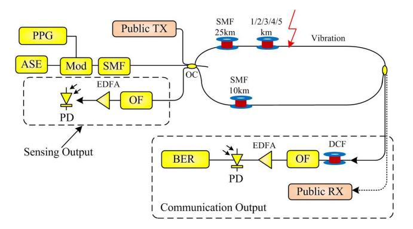
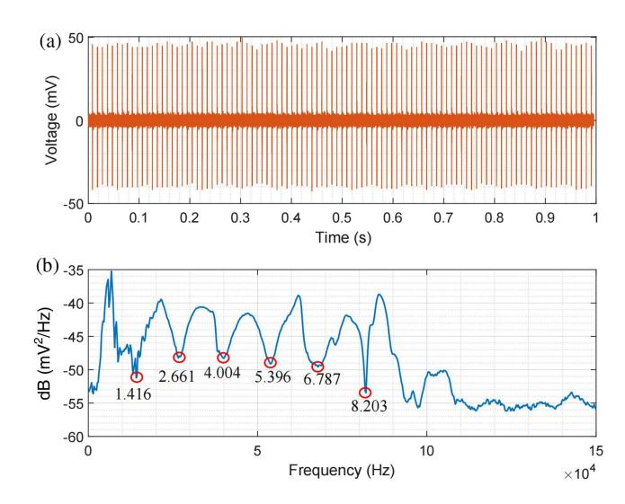
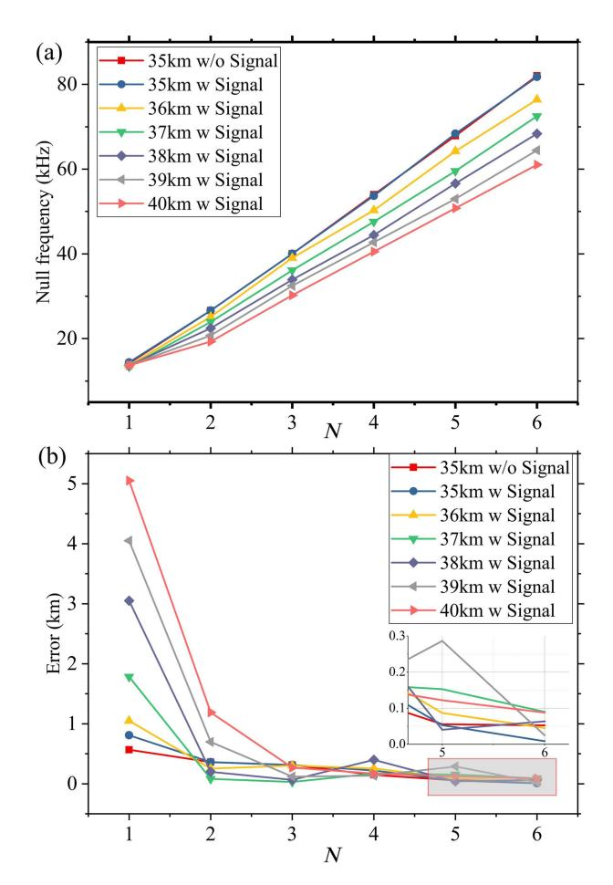
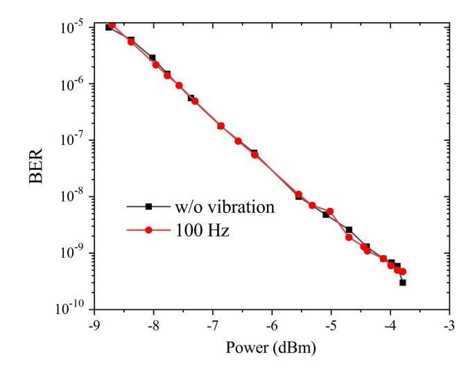
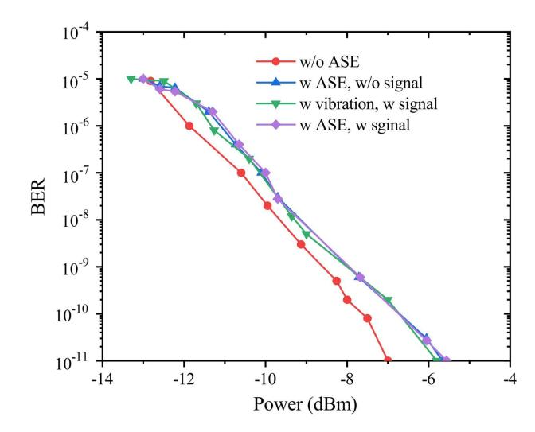

# Integrated optical covert sensing and communication

Huatao Zhu (朱华涛)1, Xiangming Xu (徐向明)1\*, Zhanqi Liu (刘占琪)1, and Jie Zhang (张 杰)2

\*Corresponding author: xuxiangming15@nudt.edu.cn Received July 10, 2024 | Accepted August 6, 2024 | Posted Online January 13, 2025

Amplified spontaneous emission (ASE) is the most natural optical carrier for covertly conveying messages in the photonic layer and simultaneously serves as a typical optical carrier in optical sensors. Here, an innovative scheme for integrating covert sensing and communication based on ASE light is proposed and demonstrated through a proof-of-concept experiment. The optical covert sensor, based on a Sagnac structure, detects the location of vibration by searching the null frequency in the spectrum. The experimental results show that the impact of covert sensing on covert communication is negligible, and the bit error rate (BER) performance verifies the feasibility of the integration of optical covert sensing and communication. It may be used in the metropolitan area optical network.

**Keywords:** physical layer security; optical communication; covert communication; integrated sensing and communication. **DOI:** 10.3788/COL202523.020602

#### 1. Introduction

Over the past decades, the development of fiber-optic networks has revolutionized the telecommunications industry, and optical fibers exist anywhere in modern society[1-4]. For the optical network, optical signals face the threat of being eavesdropped and attacked. How to secure optical networks has attracted extensive research, which can be categorized into two main areas: intrusion detection of optical fibers[5-7], and information safeguarding at the photonic layer[8-11]. Unfortunately, these two security measures operate independently and thus need separate deployment of intrusion detection systems and information safeguarding systems.

Enabling the secure optical transmission system to have the ability to detect attacks allows it to make dynamic adjustments to different types of attacks, improving the security, flexibility, and intelligence of the security transmission system. How to make a secure optical transmission system capable of detecting attacks is the same problem faced by fiber optic's integrated communication and sensing.

A field trial demonstrated the feasibility of integrating distributed fiber optical sensing and high-speed communication in the same fiber, leveraging wavelength division multiplexing [12]. This pioneering effort shows that telecom fiber infrastructures can also provide sensing functions, opening up a new realm of possibilities for fiber-optic networks. Building upon this foundation, researchers have successfully utilized these fibers to measure and monitor seismic activities and water waves [13,14], showing the versatility and adaptability of fiber-optic sensing

technologies. Additionally[15], it has demonstrated the simultaneous transmission of data and distributed vibration sensing within the same wavelength.

However, integrating sensing and communication within the same fiber offers significant advantages. However, this approach reveals the presence of a transmission link, potentially drawing the unwanted attention of an attacker. To mitigate this vulnerability, covert sensing and communication techniques present a possible solution.

In this Letter, an integrated covert sensing and communication method is proposed for the first time to the best of our knowledge. The integration of covert sensing and communication is presented in the same fiber, the same time, and the same wavelength. A proof-of-concept experiment is set up to verify the feasibility of the proposed method. The influence of the noise on the sensing, which is introduced by communication is investigated. In addition, the influence of the structure of the interferometer on communication performance is also studied.

### 2. Principle and System Model

The configuration of the optical covert sensing and communication system is shown in Fig. 1, which consists of a public communication channel, a covert communication channel, and a sensing channel based on a Sagnac interferometer[16].

The public communication channel, designed for open transmission, comprises a public transmitter, a 25-km span of G.652 single-mode fiber (SMF), and a public receiver. In the

&lt;sup>1College of Information and Communication, National University of Defense Technology, Wuhan 430010, China

&lt;sup>2 State Key Laboratory of Information Photonic and Optical Communication, Beijing University of Posts and Telecommunications, Beijing 100876, China

**Fig. 1.** Setup of the proof-of-concept experiment. ASE, amplified spontaneous emission; PPG, pulse pattern generator; SMF, single-mode fiber; EDFA, erbium-doped fiber amplifier; PD, photon detector; OF, optical filter; BER, bit error rate; DCF, dispersion compensation fiber; TX, transmitter; RX, receiver.

transmitter of the covert communication channel, the amplified spontaneous emission (ASE) light without optical filtering is modulated by 1.25 Gbps signals from a pulse pattern generator (PPG) with on-off keying. Then, the modulated ASE light is spread by an SMF span in the time domain, and the spread ASE light is sent to the Sagnac structure through a  $3 \times 3$  optical coupler. The Sagnac loop is formed by two 3 x 3 optical couplers, a 25-km span of SMF, a 10-km span of SMF, and a short span of SMF with varying lengths. An external vibration source is located between the 10-km span of SMF and others. The Sagnac interferometer splits the incoming modulated ASE and public signal light into two counter-propagating paths along the loop. For the communication purpose, the clockwise propagating public and covert communication signal travel along the 25-km span of the SMF and the short length-varying fiber, and then exits the interferometer through the  $3 \times 3$  optical coupler to reach its designated receiver. As for the sensing purpose, the two counter-propagating ASE lights interfere at the  $3 \times 3$  optical coupler and are then sent to the sensing receiver.

In the sensing receiver, the received signal is filtered by an optical filter (OF) to suppress the public optical signal and out-of-band optical noise. After the signal output from the OF, it is amplified by an erbium-doped fiber amplifier (EDFA) and sent into a photon detector (PD) for vibration sensing along the fiber. In the communication receiver, the received signal is compressed by a dispersion compensation fiber (DCF) in the time domain, and then the compressed signal is filtered by an OF to suppress the public signal and noise. The filtered signal is then amplified by the EDFA and sent to the PD for detection. The detected signal is then fed into a bit error rate (BER) tester for performance testing.

In the transmission link, the Sagnac interferometer is constructed jointly by the transmission fiber and the optical coupler to sense the vibration along the fiber. Therefore, the covert signals can perform both covert communication and covert sensing functions at the same time and with the same wavelength.

In the Sagnac interferometer, the output of the modulated ASE light is split into two parts and directed into two counter-propagating directions along the Sagnac loop. When the Sagnac

interferometer is placed in a silent environment, the optical paths of these two counter-propagating parts are identical, so when they are recombined and interfere with the sensing output, the output intensity does not change. In this experiment, a 1-meter-long fiber optic cable of the Sagnac loop is wound around a piezoelectric transducer (PZT) ring with a 130 kHz resonance frequency, which is used to generate the vibration signal and stretch the fiber, thus changing the phase of the transmitted light. When selecting a PZT, it is necessary to consider that its resonance frequency is as large as possible to avoid drowning the components of the null frequency. Due to the difference in the time taken by the clockwise and counterclockwise propagating lights to travel from the coupler to the location where vibration occurs, the phase changes experienced by the two are also different, resulting in a phase difference.

Assuming the region affected by the vibration is much smaller than the overall interferometer length, the phase difference can be written as

$$\Phi = \Delta \Psi + \varphi(t - \tau_1) - \varphi(t - \tau_2), \tag{1}$$

where  $\Delta\Psi$  represents the constant non-reciprocal phase shift introduced into the system,  $\varphi(t)$  is the time-dependent phase shift induced by vibration, and  $\tau_1$  and  $\tau_2$  represent, respectively, the propagation time from the coupler to the vibrating region of the two clockwise and counterclockwise propagating lights. We assume the distance from the vibration point to the fiber coupler in the clockwise and counterclockwise directions are  $R_1$  and  $R_2$ , respectively. Then,  $\tau_1 = nR_1/c$  and  $\tau_2 = nR_2/c$ , where n is the effective index of the optical fiber, and c is the speed of light.

In the case that the vibration signal is  $\varphi_0 \sin(\omega_s t)$ , the sensing output power from the Sagnac interferometer can be described as

$$P(t) = \frac{P_0}{2} \{1 - \cos[\Delta \Psi + \varphi(t - \tau_1) - \varphi(t - \tau_2)]\}$$

$$+ \frac{1}{(2\pi)^2} \iint_{\exp[j(\omega - \omega')t + \varphi(\omega) - \varphi(\omega')]}^{\sqrt{N_{\rm sp}(\omega)N_{\rm sp}(\omega')}} d\omega d\omega'$$

$$= \frac{P_0}{2} \{1 + \sin[\varphi_0 \sin(\omega_s t - \omega_s \tau_1) - \varphi_0 \sin(\omega_s t - \omega_s \tau_2)]\}$$

$$+ \frac{1}{(2\pi)^2} \iint_{\exp[j(\omega - \omega')t + \varphi(\omega) - \varphi(\omega')]}^{\sqrt{N_{\rm sp}(\omega)N_{\rm sp}(\omega')}} d\omega d\omega', \tag{2}$$

where  $P_0$  is the optical intensity of the optical signal and  $N_{\rm sp}$  is the power spectral density of the ASE noise. The second part of Eq. (2) is the ASE-ASE beat noise, which results in the increase of the noise floor. In this setup,  $\Delta\Psi$  is set as  $\pi/2$ . Assuming the vibration signal is small, the alternating current part induced by vibration can be written as

$$P_{\rm AC}(t) \approx -P_0 \varphi_0 \, \cos[\omega_s t - \omega_s(\tau_1 + \tau_2)/2] \sin[\omega_s(\tau_1 - \tau_2)/2] \,. \tag{3}$$

This part is oscillating with an amplitude of  $P_0\varphi_0$  sin  $[\omega_s(\tau_1 - \tau_2)/2]$  and a frequency of  $\omega_s$ . It can be found that the amplitude is zero when the following equation is satisfied,

$$\frac{\omega_s(\tau_1 - \tau_2)}{2} = N\pi, \quad N = 1, 2, 3 \dots,$$
 (4)

where N is an integer. By identifying the null frequency  $f_{\rm null}$  of the zero-amplitude points from the frequency spectrum of the oscillation optical intensity, we could correlate the location of the vibration source according to

$$f_{\text{null}} = \frac{\omega_{\text{null}}}{2\pi} = \frac{Nc}{n(L - 2R_1)},\tag{5}$$

where  $L = R_1 + R_2$  is the length of the interferometer.

## 3. Results and Analysis

After setting up the proof-of-concept experiment, our investigation focused on several key aspects. First, we examined the feasibility of utilizing the modulated ASE signal for covert optical sensing purposes. Second, we explored the impact of electrical noise, introduced through the modulation process, on the accuracy of optical sensing. Additionally, we assessed the performance of covert sensing under power constraints.

This analysis was divided into two main sections. The first section investigated the impact of communication on covert sensing, while the second section examined the impact of vibrations on the transmission performance.

#### 3.1. The impact of communication on covert sensing

Here, a 1 m-long fiber optic cable of the Sagnac loop is wound around a PZT ring with a 130 kHz resonance frequency. The PZT is driven by a series of electrical pulses with a frequency of 100 Hz, a duty cycle of 0.01%, and an amplitude of 2 V. This frequency is chosen because it allows each electrical pulse applied to the PZT sufficient time to decay and require a low storage depth on the oscilloscope. Here, the initial values of  $R_1$  and  $R_2$  are 10 and 25 km, respectively.

In the sensing receiver, the detected waveform in the time domain and the corresponding power spectrum density are shown in Fig. 2. As can be seen, the vibration signal with a frequency of 100 Hz is clear from the time domain waveform in Fig. 2(a). To reduce the variance of the frequency estimate and eliminate the effects of noise, the Welch method is used to produce the frequency spectrum. The spectrum in Fig. 2(b) reveals a prominent series of null frequency points, and the vibration location can thus be accurately calculated through Eq. (5). Therefore, the covert signal can be used for sensing the vibration in the transmission link.

Communication noise is introduced by modulation and its source is the modulating signal. Since the frequency of the modulating signal is relatively high compared to the sensing signal, the additional noise introduced by the modulation interferes less with the low-frequency sensing signal. Noise is filtered out during sensing analysis because of its high frequency. Environmental factors can also affect sensing, such as

Fig. 2. Waveform and frequency of the signal.

temperature, but temperature changes slowly and therefore has less impact on the measurement of the sensing signal.

To further ascertain the viability of covert sensing, the fiber length was adjusted by changing the length of the short SMF span from 0 to 5 km. The results are depicted in Fig. 3. As can be seen from Fig. 3(a), a linear increase in the null frequency is observed with the progression of N, the order of the null frequency. Notably, however, there is a pronounced deviation for the first null frequency. This discrepancy can be attributed to the presence of noise within the transmission link and the surrounding environment. As Fig. 3(b) shows, the measurement error between the actual location and the derived location through the null frequency points decreases with N. Therefore, the location can be calculated accurately by the high null frequency. The reason behind this can be found in Ref. [17]. When N reaches 6, the measurement error can be as low as 20 m, demonstrating the high precision of fiber optic sensing based on the Sagnac loop.

In addition, comparing the sensing measurement with and without the modulated signal from the PPG, the null frequency in spectrum and measurement error show a tiny difference between them when N is larger than 1. This shows that covert communication has a negligible impact on covert sensing, allowing for accurate vibration location measurement even with concurrent communication. For different PPGs, the noise received by the sensing receiver will be different due to the different electrical noises in the PPG. This affects the resolution of the null frequency.

#### 3.2. The impact of sensing on covert communication

To verify the feasibility of covert communication when integrated with covert sensing mechanisms, here we analyze the impact of sensing on covert communication. From the structure of the Sagnac interferometer, no anti-clock signal enters the covert channel receiver. Consequently, the signal received at the covert channel receiver in this proposed scheme remains

Fig. 3. Experimental results of different positions. (a) The measured null frequency and (b) the error of the calculated position.

the same as that in a traditional unidirectional transmission system.

From the perspective of vibration analysis, the frequency of the vibration signal is maintained at 100 Hz. Figure 4 illustrates the BER curves for the covert channel with and without vibration. It is evident from the figure that the two BER curves are nearly superimposable, indicating that the vibration exerts minimal influence on the transmission performance of the covert channel. Because the ASE carrier is integrated for sensing and communication, sensing does not have an additional impact on communication compared to other sensing methods such as optical time-domain reflectometers.

In addition, the BER curves of the public channel under vibration are measured and shown in Fig. 5. The average optical power of a public channel is −1 dBm, and the average optical power of a covert channel is −13 dBm. In the absence of ASE noise, the sensitivity of the public channel receiver was observed to be approximately 1 dB less than that in other scenarios. However, the BER curves for the public channel, whether subjected to ASE noise alongside the covert signal, exposed to ASE noise without the covert signal, or experiencing both ASE noise and vibration, were found to be nearly identical. This suggests that the covert channel imposes negligible impact on the public

Fig. 4. BER curves of the covert channel with and without vibration.

Fig. 5. BER curves of the public channel under vibration.

channel and that the performance of covert sensing remains consistent under these conditions. With different optical receivers, the sensitivity will be different. However, the vibration has little effect on the receiver with intensity detection. This is because vibration-induced phase changes cannot be converted into intensity noise in direct detection. In addition, the frequency of vibration is low relative to the covert communication signal.

## 4. Conclusions

In this Letter, an integrated optical covert sensing and communication method is proposed and demonstrated by a proof-ofconcept experiment. The sensing and communication systems have the same optical source based on the ASE light, and the optical covert sensor is based on a Sagnac structure. The covert communication signal has less power than the public channel. As the experimental results show, covert sensing has little impact on covert communication, and covert communication is the same when the order of null frequency is larger than 1. The integrated optical covert sensing and communication systems are working at the same time and the same wavelength. This work may simplify the system structure to enrich the system functions of optical communications.

## Acknowledgements

This work was supported by the National Natural Science Foundation of China (Nos. 62301569, 12404447, and 62471472).

# References

- 1. E. E. Elsayed, "Atmospheric turbulence mitigation of MIMO-RF/FSO DWDM communication systems using advanced diversity multiplexing with hybrid N-SM/OMI M-ary spatial pulse-position modulation schemes," [Opt.](https://doi.org/10.1016/j.optcom.2024.130558) [Commun.](https://doi.org/10.1016/j.optcom.2024.130558) 562, 130558 (2024).
- 2. E. E. Elsayed, M. R. Hayal, I. Nurhidayat,et al.,"Coding techniques for diversity enhancement of dense wavelength division multiplexing MIMO-RF/FSO fault protection protocols systems over atmospheric turbulence channels," [IET Optoelectron.](https://doi.org/10.1049/ote2.12111) 18, 11 (2024).
- 3. J. Jia, B. Dong, L. Tao, et al., "Demonstration of radar-aided flexible communication in a photonics-based W-band distributed integrated sensing and communication system for 6G," [Chin. Opt. Lett.](https://doi.org/https://www.researching.cn/articles/OJ21d19f74b29b516f) 22, 1671 (2024).
- 4. B. Shen, X. Zhang, Y. Wang, et al., "Reliable intracavity reflection for selfinjection locking lasers and microcomb generation," [Photonics Res.](https://doi.org/10.1364/PRJ.511627) 12, A41 (2024).

- 5. S. Zhang, T. He, H. Li, et al., "Modified data augmentation integration method for robust intrusion events recognition with fiber optic das system," [J. Lightwave Technol.](https://doi.org/10.1109/JLT.2023.3321103) 42, 1423 (2024).
- 6. A. Vikram, S. K. Patel, A. Chaturvedi, et al., "Detecting accurate parametric intrusions using optical fiber sensors for long-distance data communication system," [Opt. Fiber Technol.](https://doi.org/10.1016/j.yofte.2023.103453) 80, 103453 (2023).
- 7. J.-T. Li, B. Chang, J.-T. Du, et al., "Coherently parallel fiber-optic distributed acoustic sensing using dual Kerr soliton microcombs," [Sci. Adv.](https://doi.org/10.1126/sciadv.adf8666) 10, eadf8666 (2024).
- 8. K. Zhu, S. Wei, Y. Li, et al., "Quantum noise stream cipher scheme with triangular quadrature amplitude modulation and secret probabilistic shaping," [J. Lightwave Technol.](https://doi.org/10.1109/JLT.2023.3321103) 42, 1423 (2024).
- 9. L. Zhang, Q. Deng, H. Zhang, et al., "Quantum noise secured terahertz communications," [IEEE J. Sel. Top Quantum](https://doi.org/10.1103/PhysRevA.74.052309) 29, 1 (2023).
- 10. K. Tanizawa and F. Futami, "If-over-fiber transmission of ofdm quantumnoise randomized psk cipher for physical layer encryption of wireless signals," [J. Lightwave Technol.](https://doi.org/10.1109/JLT.2021.3119603) 40, 1698 (2022).
- 11. Z. Gao, Z. Deng, L. Zhang, et al., "10 gbps classical secure key distribution based on temporal steganography and private chaotic phase scrambling," [Photonics Res.](https://doi.org/10.1364/PRJ.502992) 12, 321 (2024).
- 12. M.-F. Huang, P. Ji, T. Wang, et al., "First field trial of distributed fiber optical sensing and high-speed communication over an operational telecom network," [J. Lightwave Technol.](https://doi.org/10.1109/JLT.2019.2935422) 38, 75 (2020).
- 13. Z. Zhan, M. Cantono, V. Kamalov, et al., "Optical polarization-based seismic and water wave sensing on transoceanic cables," [Science](https://doi.org/10.1126/science.abe6648) 371, 931 (2021).
- 14. G. Marra, D. M. Fairweather, V. Kamalov, et al., "Optical interferometrybased array of seafloor environmental sensors using a transoceanic submarine cable," [Science](https://doi.org/10.1126/science.abo1939) 376, 874 (2022).
- 15. H. He, L. Jiang, Y. Pan, et al., "Integrated sensing and communication in an optical fibre," [Light Sci. Appl.](https://doi.org/10.1038/s41377-022-01067-1) 12, 25 (2023).
- 16. F. Teng, D. Yi, X. Hong, et al., "Distributed fiber optics disturbance sensor using a dual-SAGNAC interferometer," [Opt. Lett.](https://doi.org/10.1364/OL.44.005101) 44, 5101 (2019).
- 17. Y. Wang, X. Liu, B. Jin, et al., "Optical fiber vibration sensor using chaotic laser," [IEEE Photonics Technol. Lett.](https://doi.org/10.1109/LPT.2017.2707071) 29, 1336 (2017).