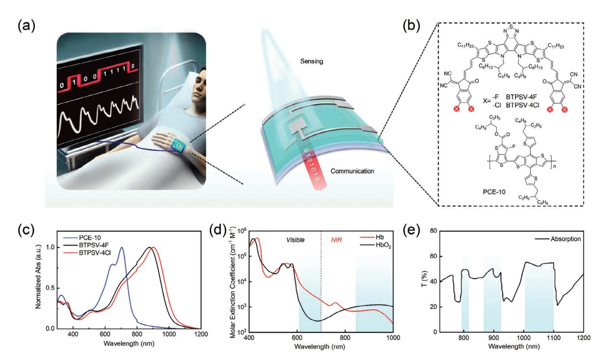
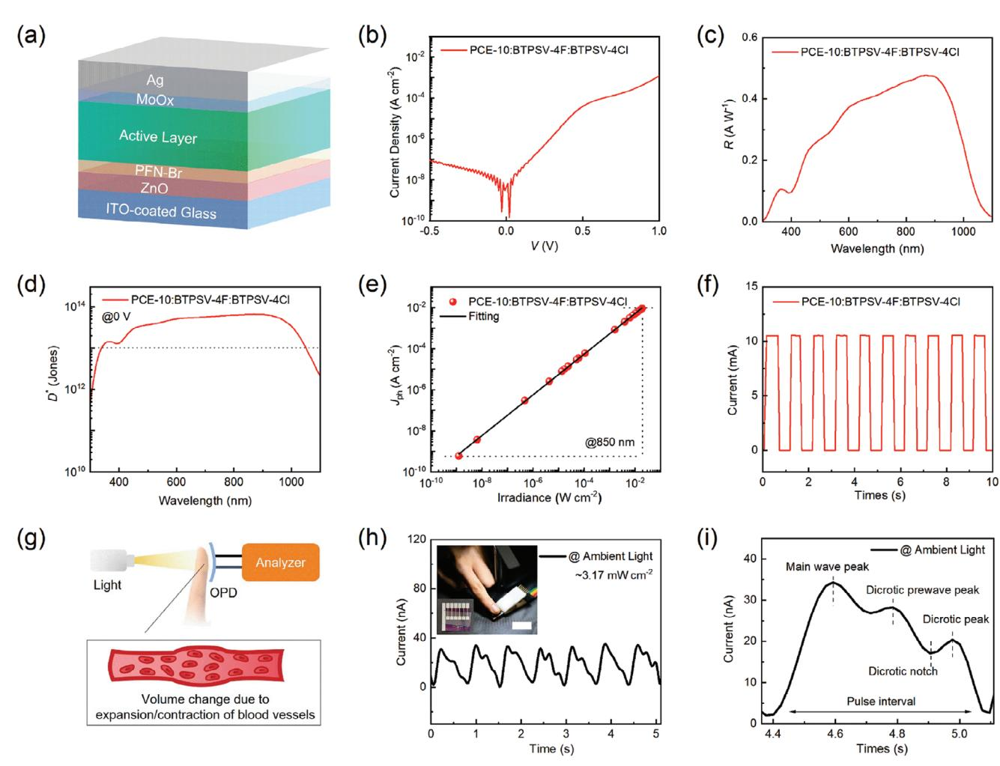
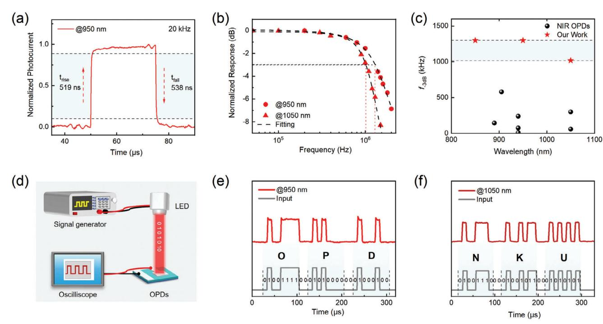
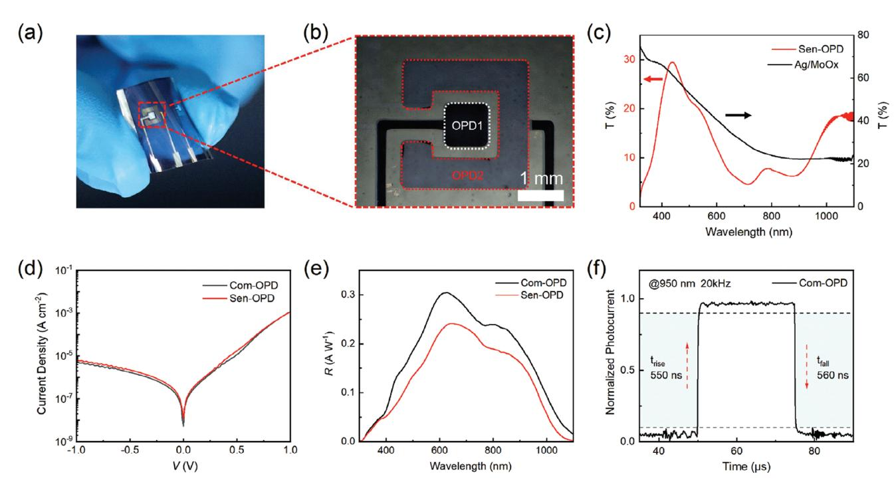
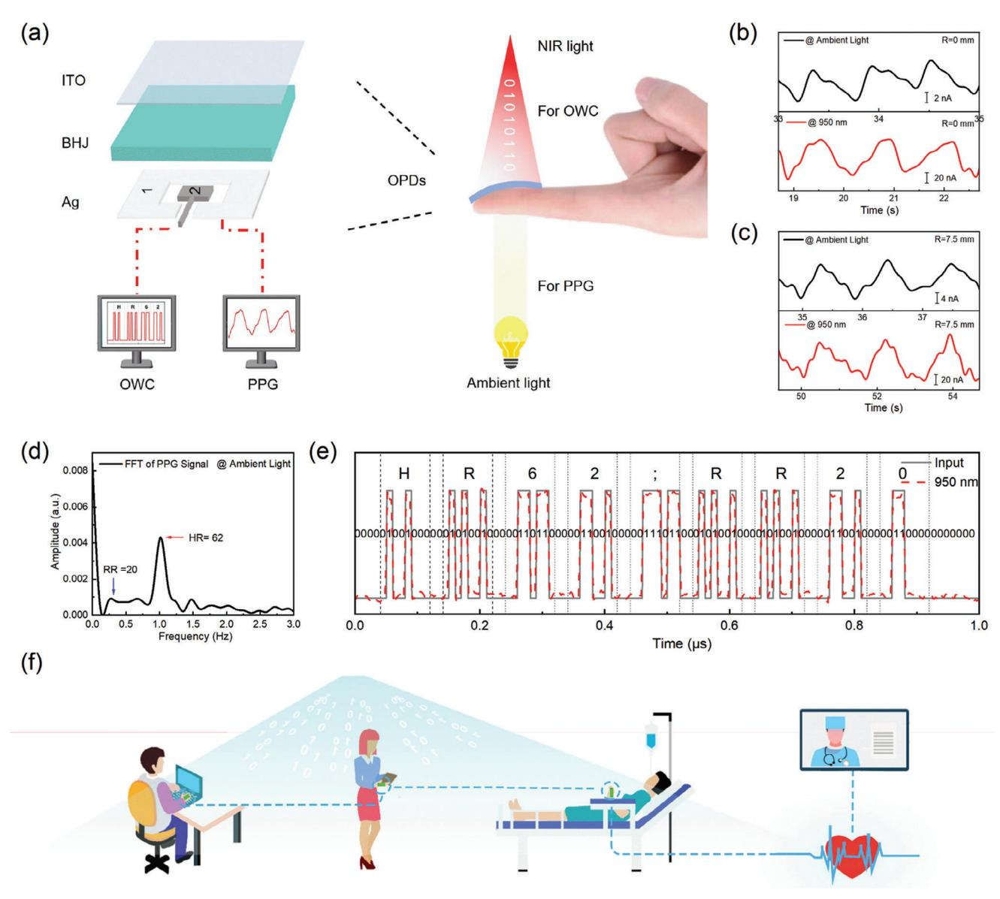

**[www.afm-journal.de](http://www.afm-journal.de)**

# **High-Speed Flexible Near-Infrared Organic Photodetectors for Self-Powered Optical Integrated Sensing and Communications**

*Yingjun Xia, Jing Zhang, Tingting Guo, Hui Wang, Chen Geng, Yu Zhu, Ruiman Han, Yanqing Yang, Guangkun Song, Xiangjian Wan, Guanghui Li,\* and Yongsheng Chen*

**Integrated sensing and communications (ISAC) based on radio frequency (RF), merging the sensing and communication functionalities into a single platform, can effectively address the increasing demand for spectrums due to the proliferation of wireless devices. However, the ISAC commonly suffers from spectrum scarcity, high power consumption, and limited sensing capabilities. Here flexible self-powered optical ISAC (O-ISAC) is proposed and fabricated by preparing a high-speed near-infrared organic photodetector (NIR OPD) that exhibits a broad photodetection ranging from 300 to 1100 nm, specific detectivity over 1013 Jones, and −3 dB cutoff frequency over 1 MHz ( = 1050 nm) in self-powered mode, ranking as the fastest among self-powered NIR OPDs in the region above 1000 nm. The device is fabricated by incorporating a narrow-bandgap non-fullerene acceptor BTPSV-4Cl into the PCE-10:BTPSV-4F system to finely tune the film morphology and reduce trap states and energetic disorder. The semitransparent and regular NIR OPDs are integrated on one substrate to fabricate flexible O-ISAC, realizing simultaneous accurate vital signs monitoring and high-speed data transmission under ambient, sunlight, and NIR lighting conditions. It is envisioned that the proposed O-ISAC will inspire a new generation of wireless technology to address RF limitations for emerging applications, such as intelligent healthcare, autonomous vehicles, and security.**

Integrated Sensing and Communications (ISAC), consolidating sensing and communication functionalities by utilizing the same spectrum and hardware facilities, represents the cutting-edge technique for next-generation wireless communication technologies (beyond 5 and 6 G).[\[1–3\]](#page-8-0) However, the current wireless technology using radio frequency (RF) suffers from spectrum scarcity (Frequency Range 1:450–6000 MHz; Frequency Range 2:24250–52600 MHz) paired with low data transmission speed (≈1 Gbps) and limited sensing capabilities with high power consumption.[\[4,5\]](#page-8-0) Visible (vis) Nearinfrared (NIR) light spectrums, ranging from 400 to 800 Terahertz (THz), offer a vast bandwidth for ultra-high-speed optical wireless communication (OWC) up to 100 Gbps.[\[6–10\]](#page-8-0) Moreover, due to its superior penetration capabilities, the NIR light has been widely used in non-invasive vital signs monitoring,[\[11,12\]](#page-8-0) imaging,[\[13,14\]](#page-8-0) and remote surveillance.[\[15\]](#page-8-0) By harnessing these properties, optical integrated sensing and communications (O-ISAC), achieving sensing and communication functions via light, can effectively address the current wireless networks' spectrum and data transmission speed bottlenecks while offering enhanced sensing functionalities beyond classical wireless networks.[\[16\]](#page-8-0) Furthermore, the flexible O-ISAC can seamlessly conform

to the skin to receive omnidirectional light, which enables continuous health monitoring and high-speed information transmission. Such a system has tremendous potential in predicting

Y. Xia, J. Zhang, T. Guo, C. Geng, Y. Zhu, R. Han, Y. Yang, G. Song, X. Wan, G. Li, Y. Chen

The Centre of Nanoscale Science and Technology and Key Laboratory of

Functional Polymer Materials Institute of Polymer Chemistry

Tianjin Key Laboratory of functional polymer materials

College of Chemistry Nankai University Tianjin 300071, China

E-mail: [ghli1127@nankai.edu.cn](mailto:ghli1127@nankai.edu.cn)

The ORCID identification number(s) for the author(s) of this article can be found under <https://doi.org/10.1002/adfm.202412813>

**DOI: 10.1002/adfm.202412813**

Y. Xia, J. Zhang, T. Guo, C. Geng, Y. Zhu, R. Han, Y. Yang, G. Song, X. Wan, G. Li, Y. Chen

State Key Laboratory of Elemento-Organic Chemistry Frontiers Science Center for New Organic Matter

Nankai University Tianjin 300071, China

H. Wang

The CAS Key Laboratory of Human-Machine Intelligence-Synergy Systems

Shenzhen Institutes of Advanced Technology Chinese Academy of Sciences (CAS)

Shenzhen 518055, China

Y. Chen Renewable Energy Conversion and Storage Center (RECAST) Nankai University Tianjin 300071, China

personal health crises such as stroke, heart disease, and sudden cardiac arrest, as well as monitoring global epidemic diseases (COVID-19, SARS, Monkeypox, etc) and remote surgery risk through big data analysis.[\[11,17–21\]](#page-8-0) However, conventional inorganic photodetectors (PDs), as the core component of O-ISAC, commonly suffer from mechanical rigidity, small area, weak absorption efficiency, and fixed bandgap, hindering their applications in flexible O-ISAC.[\[22,23\]](#page-8-0) Addressing these issues requires developing flexible high-performance PDs and designing sophisticated device architecture to meet the flexible O-ISAC requirements.

Solution-processed organic photodetectors (OPDs) combine the inherent flexibility and solution-processed capability of organic materials, along with superior optoelectronic properties such as tunable bandgap (300–3000 nm), structural versatility, and high absorption efficiency (*>*105 cm−1).[\[11,21,24\]](#page-8-0) The operation mechanism of OPD primarily comprises four steps: 1) exciton generation from photon absorption; 2) exciton diffusion to the interface of donor and acceptor to generate charge transfer excitons; 3) the separation of charge transfer excitons into free charges at the interface of donor/acceptor; 4) free charge transport and collection at the electrodes. Despite these devices having remarked considerable breakthroughs in Vis-NIR light detection for various sensing applications, their slow response speed (μsms) in the NIR II region above 1000 nm hinders their application in high-speed optical communication.[\[13,14,25–28\]](#page-8-0) This limitation stems from the intrinsically low mobility of organic semiconductors associated with disordered microstructures and trap states in active layers.[\[29\]](#page-9-0) Additionally, these structural defects also diminish the energy barrier between the donor HOMOs and acceptor LUMOs, facilitating charge excitons from donor HO-MOs to acceptor LUMOs and resulting in high noise current and low sensitivity in NIR OPDs.[\[30–33\]](#page-9-0) Various material and device strategies have been extensively employed to address these challenges, including halogenation,[\[33\]](#page-9-0) side chains,[\[34,35\]](#page-9-0) core/end unit extension, and multiple components.[\[6,28,36\]](#page-8-0) Among these approaches, the halogenation of the end group has been widely utilized to adjust donors' -conjugated electronic and crystalline properties, realizing numerous successful cases in developing high-performance non-fullerene acceptors (NFAs).[\[36–39\]](#page-9-0) Moreover, different types of halogen atoms on the end groups of NFAs have different influences on the optoelectronic properties of NFAs.[\[40–45\]](#page-9-0) Multiple component strategy is another efficient and straightforward approach to finely tune the properties of active films, which commonly suffer from spectrum dilution effect in the near-infrared region and require thick active films to absorb NIR light efficiently,[\[14,46\]](#page-8-0) resulting in a slow response in NIR OPDs.[\[14,47\]](#page-8-0) Moreover, there remains a significant research gap in designing flexible O-ISAC based on NIR OPDs, lacking designing guidelines in this domain. Thus, it is imperative to develop facile and practical strategies to improve the response speed of OPDs, along with developing novel device architectures to simultaneously realize optical sensing and communication functions.

Here, we fabricated the first flexible self-powered O-ISAC based on high-speed NIR OPDs, achieving high-sensitivity vital signs detection and high-speed optical communication through visible and NIR light. We first prepared high-speed NIR OPDs using an ultranarrow bandgap NFA, BTPSV-4F, achieving a broad photodetection ranging from 300 to 1100 nm. Combining the advantages of the halogenation of end groups and the concerns of the multiple-component strategy, we proposed using the identical central backbones as the host NFA along with a different halogenation end group as a third component to improve the optoelectronic performance of OPD. The similar chemical structures and absorption profiles of the third components and the host acceptors ensure the excellent compatibility of these two NFAs without spectral dilution effect. Here, we introduced BTPSV-4Cl NFA as the third component in the PCE-10:BTPSV-4F system to adjust the properties of active films. Consequently, the introduction of BTPSV-4Cl in the binary device efficiently tuned the film morphologies and reduced trap states and energetic disorders in photoactive films without spectra dilution effect. As a result, the ternary NIR OPD exhibits a remarkable specific detectivity (*D\**) of 6.50 × 1013 Jones and a −3 dB cutoff frequency of 1.02 MHz ( = 1050 nm) in self-powered mode, ranking as the highest response speed in the NIR region above 1000 nm among solutionprocessed self-powered OPDs. Furthermore, we successfully prepared a flexible self-powered O-ISAC by integrating semitransparent and regular OPDs on one flexible substrate, realizing simultaneous accurate heart pulse monitoring and high-speed optical wireless communication (OWC) under ambient visible, NIR light, and sunlight. The proposed flexible O-ISAC based on highperformance NIR OPDs, preserving optical communication and high-sensitivity vital signs monitoring across a broad spectrum with various intensities, will inspire a new generation of wireless technology to address the spectrum and sensing limitations of current RF technology, offering prospective and potential applications in healthcare, industrial IoT, autonomous vehicles and intelligent transportation, and defense and security.

#### **1. Materials Synthesis and Characterizations**

The schematic and concept of O-ISAC, featuring flexible OPDs for concurrent optical sensing and communication, is shown in **Figure 1**[a.](#page-2-0) Here, the O-ISAC ingeniously integrates two NIR OPDs with identical photoactive layers: the compact regular OPD is centrally positioned to receive high-frequency Vis-NIR light for optical communication, which is surrounded by a larger-size semitransparent NIR OPD that captures the faint light emission from skin or tissues for vitality monitoring. To realize a broad spectra detection from visible to NIR region beyond 1000 nm, we selected the ultranarrow bandgap acceptor BTPSV-4F for the NIR OPD. To combine the advantages of different halogen atoms in NFAs and finely tune the film's morphologies without the spectrum dilution effect, we synthesized BTPSV-4Cl by substituting Cl atoms for F atoms in the end group of BTPSV-4F, acting as the guest acceptor. Figure [1b](#page-2-0) illustrates the chemical structures of BTPSV-4Cl and BTPSV-4F NFAs. The detailed synthetic process and characterizations of these targeted acceptors are described in Scheme S1 and Figures S1–S13 (Supporting Information). PCE-10 was selected as the polymer donor due to its suitable energy level and complementary absorption spectrum (Figure [1c;](#page-2-0) Figures S14 and S15 and Table S1, Supporting Information). As shown in Figure [1c,](#page-2-0) NFAs and PCE-10 exhibit strong absorption from 300 to 1034 nm in the film states. Compared to BTPSV-4F, the BTPSV-4Cl NFA exhibits a slight redshift in the film state, suggesting enhanced molecular packing in its solid state. Oxygenated hemoglobin (HbO2) exhibits dominant absorption in the

**Figure 1.** a) Concept and device layout of O-ISAC based on NIR OPDs. b) Chemical structures of PCE-10, BTPSV-4F, and BTPSV-4Cl. c) Normalized thin film absorption profiles of PCE-10, BTPSV-4F, and BTPSV-4Cl. d) Absorption profiles of Hb and HbO2 in the 400 to 1000 nm range. e) Atmosphspheric window ranging from 700 to 1200 nm.

NIR region above 800 nm, while hemoglobin (Hb) absorbs primarily in the visible region (Figure 1d). Therefore, a broadband Vis-NIR OPD is necessary to simultaneously measure the absorption of HbO2 and Hb, which is beneficial for calculating blood oxygen saturation by leveraging their difference in spectral absorption. Notably, the combined absorption spectrums of PCE-10 and NFAs cover the blood absorption region and optical communication window, fully satisfying the spectral requirements of O-ISAC for vital signs detection and optical wireless communication (Figure 1d,e).[\[48,49\]](#page-9-0)

## **2. High-Sensitivity NIR OPDs for Photoplethysmography Measurement**

To efficiently suppress the dark current and enhance the photodetection properties of OPDs, we adopted an inverted device architecture comprising Glass/ITO/ZnO/PFN-Br/Active Layer/MoOx/Ag (**Figure 2**[a\)](#page-3-0). The Experiment Section extensively details the fabrication and optimization process of OPDs. All OPDs were measured in self-powered mode to reduce dark current and energy consumption. When the weight ratio of BTPSV-4Cl increased to 30% of NFAs in the PCE-10:BTPSV-4F system, the ternary OPD demonstrated the lowest dark current density and highest external quantum efficiency (EQE), ranking the best optoelectronic performance among these NIR OPDs (Figure S16, Supporting Information). As shown in Figure [2b,](#page-3-0) the optimal ternary NIR OPD exhibits a dark current density of 0.17 nA cm−2 in self-powered mode.

Responsivity (*R*) is a crucial figure-of-merit for evaluating the sensitivity of OPDs, calculated from EQE values as follows:[\[11,20\]](#page-8-0)

$$R = \frac{EQE}{100\%} \times \frac{\lambda_{\text{input}}}{1240 \,(\text{nm W A}^{-1})}$$
 (1)

where input represents the incident light wavelength. Here, we defined the effective responsivity range by identifying the shortest and longest wavelengths at which the responsivity reaches 10% of its maximum (cut-on wavelength cut-on and cut-off wavelength cut-off, respectively). Benefiting from the similar chemical structures and close spectral absorption profiles of BTPSV-4F and BTPSV-4Cl, the introduction of BTPSV-4Cl does not cause a spectra dilution effect in the NIR region, thereby preserving the detection range of OPDs and high responsivities in the NIR region. Compared to the binary OPD with PCE-10:BTPSV-4F, the ternary OPD exhibits a broad and improved responsivity within 300–1100 nm, peaking at 0.48 A W−1 at 870 nm (Figure [2c;](#page-3-0) Table S2, Supporting Information). The effective responsivity range of the ternary OPD is 330–1065 nm, aligning closely with the detection range of Si PDs. Owing to the low dark current density and high responsivity, the ternary NIR OPD demonstrates a high specific detectivity (*D\**) for ultraweak optical detection, which is calculated according to the following equation:[\[13\]](#page-8-0)

$$D^* = \frac{R\sqrt{A}}{S_{\rm n}} \tag{2}$$

**Figure 2.** a) Device structure of NIR OPD. b) *J–V* curve of the ternary NIR OPD in the dark. Responsivity c) and Specific detectivity d) of the ternary NIR OPD in self-powered mode. e) Linear dynamic range of the ternary NIR OPD under irradiation of 850 nm LED in self-powered mode. f) *I–T* curve of the ternary NIR OPD under ambient light modulation with a frequency of 1 Hz. g) Schematic of PPG measurement in the transmission mode. h) Pulse signals measured using the ternary NIR OPD under ambient light irradiation, the effective size of OPD is 2.0 × 2.0 mm2 and the scale bar is 1 cm. i) Details of a single pulse signal obtained from Figure 2h.

*S*n and *A* are PD's noise and effective size, respectively. Given the impact of the flick noise, we measured *S*n with a frequency of 10 Hz of all OPDs, in which the ternary NIR OPD (30% BTPSV-4Cl) exhibits the lowest *S*n of 8.00 × 10−14 A Hz−1/2, corresponding to the resulting *D\** of 2.93 × 1013 cm Hz1/2 W−1 (Figure S17, Supporting Information). Assuming that shot noise from the dark current predominates as the primary component of overall noise, we can calculate the *D*\* as follows:[\[50\]](#page-9-0)

$$D^* = \frac{R\sqrt{A}}{S_{\rm n}} = \frac{R}{\sqrt{2qJ_{\rm d}}} \tag{3}$$

where *J*d is the dark current density. Benefiting from high responsivity and low dark current, as shown in Figure 2d and Figure S18 (Supporting Information), the ternary NIR OPD exhibits a peak *D*\* of 6.50 × 1013 Jones at 870 nm in self-powered mode, which is higher than that of the binary OPDs with BTPSV-4F (4.99 × 1013 Jones) and BTPSV-4Cl (2.50 × 1013 Jones).

The linear dynamic range (LDR) quantifies the range within which the OPD exhibits a linear relationship between the photocurrent and the incident optical power. Mathematically, LDR can be calculated as follows:[\[50\]](#page-9-0)

$$LDR = 20 \log \frac{I_{\text{upper}}}{I_{\text{lower}}} \tag{4}$$

where *I*upper and *I*lower denote the maximum and minimum photocurrent values demonstrating linearity. As shown in Figure 2e, the ternary NIR OPD exhibits an LDR of 144 dB at 850 nm, allowing direct measurement of the incident light within the range of 1.23 nW cm−2 to 20 mW cm−2. After operating for 27 000 cycles under ambient light (3.17 mW cm−2) with an on/off frequency of 1 Hz, the ternary NIR OPD exhibits a highly stable photoresponse with a negligible deviation of 1% (Figure 2f; Figures S19 and S20, Supporting Information).

Since only 0.1 percent of light can penetrate through the finger when conducting photoplethysmography (PPG)

**Figure 3.** a) Photoresponse and recovery times of the ternary NIR OPD under light irradiation of 950 nm with a modulation frequency of 20 kHz. b) −3 dB cutoff frequency of the NIR OPD under 950 and 1050 nm light irradiation. c) Summary of −3 dB cutoff frequencies of NIR OPDs. d) Schematic of optical wireless communication. e) The signals are composed of an ASCII code for "OPD" and received by the NIR OPD under irradiation of 950 nm. f) The signals are composed of an ASCII code for "NKU" and received by the NIR OPD under irradiation of 1050 nm.

measurement in the transmission mode, high-sensitivity OPDs are required to detect the ultraweak light signals passing through the finger. Figure [2g](#page-3-0) displays the schematic setup of the PPG measurement in the transmission mode. Based on measurements of cardiovascular flow characteristics through observing repetitive systolic and diastolic behavior under ambient light, we obtained consistent and repetitive pulse signals using ternary NIR OPDs (Figure [2h\)](#page-3-0). Moreover, there are discernable peaks in a relatively complete pulse wave period, which can be used to evaluate the cardiovascular system (Figure [2i\)](#page-3-0). From the average systolic pulse interval (PI) of 0.74 s, we can calculate a resting pulse rate (RPR) via the following equation:

$$RPR = \frac{60}{PI} \tag{5}$$

where PI is the average systolic interval of the pulse. Consequently, the RPR of the researcher reaches 81 bpm, aligning with the standard range for individuals over the age of ten years (60–100 bpm).

# **3. High-Speed NIR OPDs for Optical Wireless Communication**

The response speed of OPD plays a crucial role in optical communication, determining the data transmission speed, capacity, and accuracy of the wireless optical communication system. To accurately examine the response speed of ternary NIR OPDs and mitigate the overestimation, we introduced a steady-state current measurement in both dark and under 950 nm NIR light instead of the commonly reported TPC measurement. The temporal characteristics of ternary NIR OPDs are characterized under square wave pulses (950 nm, 20 kHz). The rise time (*t*rise) and fall time (*t*fall) are determined from the time interval for the photoresponse to rise/fall from 10% to 90% of steady-state values. The response time can be calculated as follows:

$$t = (t_{\rm rise} + t_{\rm fall})/2 \tag{6}$$

As shown in **Figures 3**a and S21 (Supporting Information), the ternary NIR OPD (30% BTPSV-4Cl) exhibits impressive rise and fall times of 519 and 538 ns, respectively, with a photoresponse time of 528.5 ns in self-powered mode, which reduces ≈40% compared with the binary OPD with BTPSV-4F (*t*rise/*t*fall = 794/689 ns, *t* = 741.5 ns). The significantly improved photoresponse speed can be attributed to the higher and more balanced charge mobilities than binary OPD with BTPSV-4F (Figure S22, Supporting Information). Theoretically, the data transmission speed is determined by the −3 dB cutoff frequency (*f*-3 dB) of OPDs, which is directly affected by the photoresponse time. Notably, the ternary device operating at zero bias shows *f*-3 dB of 1.30, 1.30, and 1.02 MHz under the light irradiation of 850, 950, and 1050 nm, respectively, demonstrating a considerable potential in high-speed optical communication (Figure 3b; Figure S23 and Table S3, Supporting Information). As summarized in Figure 3c and Table S4 (Supporting Information), the ternary NIR OPD presents the highest photoresponse speed in the NIR region above 1000 nm compared to other reported NIR OPDs. To demonstrate the feasibility of NIR OPD in optical communication, we integrated the ternary NIR OPD with the optical

communication system for wireless data transmission under NIR light. Figure [3d](#page-4-0) displays the schematic setup of the optical wireless communication system, consisting of a signal generator, LED, oscilloscope, and NIR OPD. As shown in Figures [3e,f,](#page-4-0) the ternary NIR OPD exhibits clear output signals with a high consistency with the LED input signals at 950 and 1050 nm.

According to the Shockley-Read-Hall (SRH) theory, an electron is thermally excited from the edge of donor HOMO (CT ground state) to the acceptor LUMO under the assistance of a trap state, contributing to the noise current.[\[13,32\]](#page-8-0) Moreover, charge transport generally proceeds via hoping in highly disordered systems composed of polycrystalline or amorphous organic films, where charges require high enough energy to overcome the barrier created by energetic disorders according to the Arrheniuslike law:[\[29\]](#page-9-0)

$$\mu_0 = \mu_\infty \exp\left(-\Delta/k_{\rm B}T\right) \tag{7}$$

where Δ is activation energy and increases with the amount of disorder. Assuming that the traps are homogeneously dispersed, the mobility can be expressed as:

$$\mu = \mu_0 \ \alpha \exp\left(-E_{\rm t}/kT\right) \tag{8}$$

where *E*t is the trapping energy and is the ratio between the density of delocalized levels available for transport and the density of traps. Therefore, reducing trap states and energetic disorder in OPDs can reduce the noise current and improve charge mobilities, improving sensitivity and response speed.

To enlighten the underlying mechanism of improved performance of OPDs with the ternary strategy of introducing BTPSV-4Cl, we initially quantified the energetic disorder of OPDs by Urbach Energy (*E*U), which is utilized to describe the width of the tails of the electronic density of states (DOS) and reflects the degree of overall energetic disorder.[\[51\]](#page-9-0) Significantly, as shown in Figure S24 and Table S5 (Supporting Information), the ternary NIR OPD exhibits a meager *E*U value of 17.72 meV, which is close to the binary OPD with BTPSV-4F (17.59 meV) and much lower than the binary OPD with BTPSV-4Cl (19.24 meV). Moreover, as shown in Figure S25 and Table S6 (Supporting Information), the ternary NIR OPD shows a significantly reduced trap density of 6.34 × 1015 cm−3 according to the Mott-Shockley analysis at various bias voltages, lower than binary OPDs with BTPSV-4F (7.71 × 1015 cm−3) and BTPSV-4Cl (8.11 × 1015 cm−3). Consequently, the ternary NIR OPD demonstrates high hole and electron mobilities of 4.44 and 4.24 cm2 V−1 s−1, respectively, with a balanced mobility ratio of 1.05, close to the ideal value 1, ensuring efficient and rapid charge transport in the BHJ blend film (Table S7, Supporting Information). These results indicate that introducing 30% BTPSV-4Cl in the PCE-10:BTPSV-4F system reduces trap states, thereby reducing noise and improving charge mobilities. To further investigate the reasons for the reduced trap states and energetic disorders after the introduction of BTPSV-4Cl, atomic force microscopy (AFM) and grazing-incidence wide-angle X-ray scattering (GIWAXS) were conducted to study the morphologies of BHJ blend films. As shown in Figure S26 (Supporting Information), the blend film of ternary OPD shows smooth surfaces with a suitable surface roughness of 1.14 nm compared to the binary films with PCE-10:BTPSV-4F (1.02 nm) and PCE-10:BTPSV- 4Cl (1.23 nm), which is expected to promote charge separation and transport. From the GIWAXS results of the blend films of binary and ternary OPDs (Figure S27 and Table S8, Supporting Information), the film of the ternary device shows a stronger - stacking (010) peak in the out-of-plane (OOP) direction at ≈1.66 Å−1 than that of the binary blends based PCE-10:BTPSV-4F (1.65 Å−1) and PCE-10:BTPSV-4Cl (1.63 Å−1), with a smaller – stacking distance (*d*, 3.79 Å) than that of the binary blends based PCE-10:BTPSV-4F (3.81 Å) and PCE-10:BTPSV-4Cl (3.85 Å), indicating an enhanced molecular packing in the ternary blend film. According to the Scherrer equation, the crystal coherence lengths (CCL) of the ternary blends reach 23.91 Å in the OOP direction, which is larger than that of PCE-10:BTPSV-4F (23.72 Å) and PCE-10:BTPSV-4Cl (22.98 Å). Thus, the reduced – stacking distance and enhanced CCL of the ternary OPD with 30% BTPSV-4Cl lead to an appropriate phase morphology with enhanced crystallinity. Consequently, the introduction of BTPSV-4Cl in the PCE-10:BTPSV-4F system efficiently optimizes the film morphology, enhances intermolecular stacking, and reduces trap states and energetic disorders, which in turn improves the device performance such as sensitivity and response speed.

# **4. Device Architecture and Optoelectronic Performance of Flexible O-ISAC**

We initially developed a high-performance flexible ternary NIR OPD with excellent mechanical stability, which shows negligible photoresponse degradation (*<*0.1%) after mechanical 10 000 times with a radius of 7.5 mm (Figures S28 and S29, Supporting Information), ensuring its application in flexible O-ISAC for simultaneous vital signs monitor and optical wireless communication (OWC). As shown in **Figure 4**[a,b,](#page-6-0) the flexible O-ISAC system comprises a compact regular NIR OPD and a large-area semitransparent NIR OPD, in which the regular OPD with the size of 1.0 × 1.0 mm2 and an effective area of 1.0 mm2 serves as an optical communication chip (Com-OPD) while the semitransparent OPD with the size of 3.0 × 3.0 mm2 and an effective area of 6.0 mm2, functions as the sensing chip (Sen-OPD). The optimized thickness of the Ag electrode for semitransparent OPD is 6 nm, which primarily considers achieving a balanced trade-off between sensitivity and transparency. The Method Section and Supporting Information describe the detailed fabrication and optimization process of O-ISAC. As shown in Figure [4c,](#page-6-0) the ultrathin Ag film exhibits a transmittance of up to 30% in the visible region, allowing light to reach the photoactive layer for PPG measurement. Notably, Com-OPD and Sen-OPD exhibit comparable dark current densities of 5.40 × 10−9 A cm−2 and 1.19 × 10−8 A cm−2 in self-powered mode, respectively, ensuring high specific detectivity for ultraweak light detection (Figure [4d\)](#page-6-0). As shown in Figure [4e,](#page-6-0) the peak responsivity of Com-OPD (0.31 A W−1, = 640 nm) is higher than the semitransparent Sen-OPD (0.24 A W−1, = 640 nm) as more photons can be reflected by Ag electrodes and subsequently be absorbed by the photoactive layer. Benefiting from the high responsivity and low dark current of OPDs in O-ISAC, Com- and Sen-OPDs exhibit *D\** over 1012 Jones across the spectrum from 370 to 1015 nm (Figure S30 and Table S9, Supporting Information). Owing to the high mobility of active film and high conductivity of the Ag top electrode, the Com-OPD exhibits response/recovery times of 550/560 ns under light

**Figure 4.** a) Optical images of O-ISAC based on the NIR OPDs and b) the detailed layout of OPDs. c) Transmittance of semitransparent Sen-OPD and ultrathin Ag/MoOx film. d) *J–V* curves of Com-OPD and Sen-OPD in the dark. e) Responsivities of Com-OPD and Sen-OPD in self-powered mode. f) Photoresponse and recovery times of Com-OPD under irradiation of 950 nm with a modulation frequency of 20 kHz.

irradiation of 950 nm with a modulation frequency of 20 kHz (Figure 4f). Overview, high sensitivity, fast response speed, and outstanding mechanical flexibility of flexible NIR OPDs ensure the practical applicability of O-ISAC in wearable electronics for vitality sensing and high-speed wireless optical communication.

#### **5. Applications of Flexible O-ISAC System**

Realizing simultaneous sensing and communication by sharing the same spectrum and hardware represents an inevitable trend in developing next-generation wireless networks. To demonstrate the effectiveness of our flexible O-ISAC for wearable electronics, as shown in **Figure 5**[a,](#page-7-0) we attach the flexible O-ISAC to a finger to simultaneously monitor pulse signals and receive highspeed modulated incident light for optical wireless communication. Com-OPD connects with the oscilloscope to receive the optical signals emitted from the LED modulated by the signal generator, while Sen-OPD detects the faint light passing through fingers. In addition to attaching to fingers, the flexible O-ISAC can be attached to other curved substrates for sensing and communication, such as mice and pens (Figure S31, Supporting Information). The semitransparent Sen-OPD exhibits a stable *I–T* curve when irradiating the Sen-OPD from the side of the Ag top electrode using 950 nm light (Figure S32, Supporting Information). When irradiating the finger using indoor ambient and 950 nm NIR light, the Sen-OPD exhibits clear PPG signals in self-powered mode (Figure [5b\)](#page-7-0). Moreover, the device shows distinct pulse signals under irradiation with various intensities in ambient light (0.45 to 3.17 mW cm−2) and sunlight (0.03 to 0.8 sun), which effectively broadens their practical applications (Figures S33 and S34, Supporting Information). Owing to the high flexibility of the Sen-OPD, it displays a stable and precise PPG waveform under bending with a radius of 7.5 mm (Figure [5c\)](#page-7-0). By analyzing the PPG data using the Fast Fourier Transform (FFT), we can convert the time domain of the PPG signals into the frequency domain to obtain the heart rate (HR) and respiration rate (RR).[\[52\]](#page-9-0) As shown in Figure [5d,](#page-7-0) the peak at the frequency of 0.33 Hz in the FFT waveform represents the RR of 20 breaths per minute (bpm), while the high-amplitude peak observed at the frequency of 1.03 Hz corresponds to the HR of 62 bpm. After walking slowly for 5 min, the RR and HR increase to 40 and 100 bpm, respectively, which exhibits a high consistency with the commercial smartwatches (Figure S35, Supporting Information). Visible and NIR LEDs can emit high-frequency light signals by coding the information using a signal generator via the American Standard Code for Information Interchange (ASCII). These optical signals are converted into electric signals via OPD and displayed on the oscilloscope. As shown in Figure [5e](#page-7-0) and Figure S36 (Supporting Information), the flexible O-ISAC successfully transmits the PPG results using ambient and NIR light in self-powered mode: 'HR:62; RR:20′. To confirm the practical applications of the flexible O-ISAC, we designed a readout integrated circuit for optical communication (Figure S37, Supporting Information), achieving real-time audio transmission via O-ISAC under ambient visible and NIR light (Video S1 and Video S2, Supporting Information). Owing to the high-speed optical communication and high-sensitivity optical sensing functions, the flexible O-ISAC displays significant potential applications in intelligent medical care, remote surgery, and IoT that require highspeed data transmission and high-sensitivity sensing (Figure [5f\)](#page-7-0). Moreover, these encouraging findings directly prove that flexible O-ISAC has significant potential to revolutionize next-generation

**Figure 5.** a) Working principles of flexible O-ISAC for simultaneous PPG measurement and OWC. b,c) Pulse signals obtained from semitransparent Sen-OPD with and without bending under ambient and NIR light. d) The respiration rate (RR) and heart rate (HR) are calculated via FFT. e) Output signals of HR and RR results using optical wireless communication with the light of 950 nm. f) Examples of applications of flexible O-ISAC system.

wireless technology via light with a broad spectrum, addressing current RF communication system limitations.

### **6. Conclusion**

In conclusion, we have successfully fabricated a flexible selfpowered O-ISAC based on high-performance NIR OPDs, simultaneously realizing optical sensing and communication under ambient visible and NIR light. We introduce the narrow-bandgap BTPSV-4Cl NFA into the PCE-10:BTPSV-4F system to finely tune the film morphology, efficiently reducing trap states and energetic disorders and significantly improving sensitivity and response speed. The resulting NIR OPD exhibits a broad photodetection ranging from 300 to 1100 nm comparable to Si PD, *D\** of over 1013 Jones, and -3 dB cutoff frequency above 1 MHz ( = 1050 nm) in self-powered mode, ranking as the fastest among solution-processed self-powered OPDs in the NIR II region above 1000 nm. After working in ambient (light intensity 3.17 mW cm−2) for 27 000 cycles, the device can maintain over 99% initial photoresponse. More importantly, the flexible NIR OPD demonstrates negligible performance degradation (*<*0.1%) after mechanical bending 500 cycles. Based on the outstanding performance of the NIR OPD, a flexible O-ISAC, fabricated by integrating regular and semitransparent OPDs, realizes simultaneous accurate vital signs monitoring and high-speed data transmission under ambient visible and NIR lighting conditions without energy consumption. We believe the novel self-powered O-ISAC based on high-speed NIR OPDs will revolutionize ISAC **[www.advancedsciencenews.com](http://www.advancedsciencenews.com) [www.afm-journal.de](http://www.afm-journal.de)**

applications in next-generation wireless technologies, particularly wearable electronics for intelligent healthcare, remote

surgery, autonomous vehicles, industrial IoT, and defense and

security.

# **7. Experimental Section**

*Device Fabrication*: Devices on ITO/glass substrates were fabricated with an inverted structure of ITO/ZnO/PFN-Br/Active Layer/MoOx/Ag. The materials used in the experiment were purchased and used without further purification. The ITO-coated glass substrates (17 × 17 mm) were sequentially cleaned in an ultrasonic bath with detergent water, deionized water, acetone, and isopropyl alcohol for 15 min each, then dried via purging with nitrogen. Subsequently, ITO/Glass substrates were treated with UV exposure for 15 min in a UV-ozone chamber before use. To prepare the sol-gel zinc oxide (ZnO) electron transporting layer on the ITO substrate, 0.05 g of zinc acetate was dissolved in 2 mL of 2-methoxyethanol with 14 μL of ethanolamine and agitated at room temperature for 12 h. The ITO substrates were then spun using the sol-gel ZnO precursor solution to form a 30 nm thick film, which was subsequently annealed at 200 °C for one hour in the air. After that, the ITO substrates with the ZnO layer were transferred to a glovebox filled with nitrogen. A thin film of PFN-Br was spin-coated onto the ZnO layer to modify the interfacial properties. The donor/acceptor mixture solution was then spin-coated onto the PFN-Br layer to form a photoactive film with a thickness of ≈130 nm, followed by annealing at 105 °C for 10 min. In this case, PCE-10 and NFAs (1:1.5) were mixed and dissolved in chloroform (the total concentration is 20 mg mL−1 with 0.5% CN). Then, MoOx (2 nm) and Ag (100 nm) films were sequentially deposited on the blend films by thermal evaporation under a vacuum of 2 × 10−5 torr. The effective area of each device is 2 Х 2 mm2. The flexible devices on ITO/PET substrates had the same device structure as the rigid devices. For the flexible devices, the electron transporting layer was prepared by spin-coating a ZnO nanoparticle solution (20 mg mL−1 n-butanol solution) onto the ITO/PET substrate followed by annealing at 120 °C for 10 min in the air. The remaining steps were the same as those for the regular devices.

*Characterizations*: OPDs were tested in an electromagnetic shielding box to reduce external electromagnetic interference, with all tests conducted in the air. A semiconductor device analyzer (KEYSIGHT, B1500A) recorded dark current and photocurrent. The noise current was conducted using the semiconductor analyzer and then digitized using FFT analysis. EQE measurements were performed over a range of 300–1100 nm using an Enlitech QE-R EQE system, which was equipped with a standard Si diode. The transient response was captured by a digital oscilloscope (Tektronix MDO32), using square wave pulse light generated by a function generator (RIGOL, DG 1022). A series of light intensities, calibrated by an optical power meter (PM100D) coupled with a Si detector (S121C), was used to measure the linear dynamic range under these conditions. Thin-film thicknesses were determined using a Dektak 150 surface profiler. Current signals of the flexible OPD arrays were also tested using the semiconductor device analyzer.

### **Supporting Information**

Supporting Information is available from the Wiley Online Library or from the author.

#### **Acknowledgements**

Y.X. and J.Z. contributed equally to this work. The authors gratefully acknowledge the financial support from the National Key Research and Development Program of China (2022YFA1203304, 2022YFB4200400, 2023YFE0210400, 2019YFA0705900), NSFC (21935007, 52025033, 52373189, 22361132530), Natural Science Foundation of Tianjin, China (23JCZDJC01160).

# **Conflict of Interest**

The authors declare no conflict of interest.

# **Data Availability Statement**

The data that support the findings of this study are available in the supplementary material of this article.

# **Keywords**

flexible near-infrared photodetectors, narrow bandgap non-fullerene acceptors, optical integrated sensing and communications (O-ISAC), optical wireless communication, organic photodetectors, photoplethysmography

> Received: July 18, 2024 Revised: August 13, 2024 Published online: September 2, 2024

16163028, 2025, 2, Downloaded from https://advanced.onlinelibrary.wiley.com/doi/10.1002/adfm.202412813 by T.C. Cumhurbaskanligi Kulliyesi, Wiley Online Library on [28/12/2025]. See the Terms and Conditions (https://onlinelibrary.wiley.com/terms-and-conditions) on Wiley Online Library for rules of use; OA articles are governed by the applicable Creative Commons License

- [1] F. Liu, Y. Cui, C. Masouros, J. Xu, T. X. Han, Y. C. Eldar, S. Buzzi, *IEEE J. Sel. Areas Commun.* **2022**, *40*, 1728.
- [2] Y. Cui, F. Liu, X. Jing, J. Mu, *IEEE Netw.* **2021**, *35*, 158.
- [3] A. Liu, Z. Huang, M. Li, Y. Wan, W. Li, T. X. Han, C. Liu, R. Du, D. K. P. Tan, J. Lu, Y. Shen, F. Colone, K. Chetty, *IEEE Commun. Surv. Tutor.* **2022**, *24*, 994.
- [4] J. A. Adebusola, A. A. Ariyo, O. A. Elisha, A. M. Olubunmi, O. O. Julius, in 2020 Int. Conf. Math. Comput. Eng. Comput. Sci. ICMCECS, IEEE **2020**, pp. 1–4.
- [5] O. Shurdi, L. Ruci, A. Biberaj, G. Mesi, *Eur. Sci. J. ESJ* **2021**, *17*, 315.
- [6] Y. Zhu, H. Chen, R. Han, H. Qin, Z. Yao, H. Liu, Y. Ma, X. Wan, G. Li, Y. Chen, *Natl. Sci. Rev.* **2024**, *11*, nwad311.
- [7] N. Chi, Y. Zhou, Y. Wei, F. Hu, *IEEE Veh. Technol. Mag.* **2020**, *15*, 93.
- [8] G. P. Agrawal, *Fiber-Optic Communication Systems*, Edition 4, John Wiley & Sons, Hoboken, NJ, USA, **2012** pp. 128–181, ch 4.
- [9] J. Clark, G. Lanzani, *Nature. Photon.* **2010**, *4*, 438.
- [10] J. Zheng, D. Yang, D. Guo, L. Yang, J. Li, D. Ma, *ACS Photonics* **2023**, *10*, 1382.
- [11] P. C. Y. Chow, T. Someya, *Adv. Mater.* **2020**, *32*, 1902045.
- [12] G. Chen, Y. Cao, Y. Tang, X. Yang, Y. Liu, D. Huang, Y. Zhang, C. Li, Q. Wang, *Adv. Sci.* **2020**, *7*, 1903783.
- [13] Y. Xia, C. Geng, X. Bi, M. Li, Y. Zhu, Z. Yao, X. Wan, G. Li, Y. Chen, *Adv. Opt. Mater.* **2024**, *12*, 2301518.
- [14] Y. Song, Z. Zhong, P. He, G. Yu, Q. Xue, L. Lan, F. Huang, *Adv. Mater.* **2022**, *34*, 2201827.
- [15] C. Hu, *Remote Sens. Environ.* **2021**, *259*, 112414.
- [16] H. He, L. Jiang, Y. Pan, A. Yi, X. Zou, W. Pan, A. E. Willner, X. Fan, Z. He, L. Yan, *Light Sci. Appl.* **2023**, *12*, 25.
- [17] H. C. Ates, P. Q. Nguyen, L. Gonzalez-Macia, E. Morales-Narváez, F. Güder, J. J. Collins, C. Dincer, *Nat. Rev. Mater.* **2022**, *7*, 887.
- [18] A. Keshet, L. Reicher, N. Bar, E. Segal, *Nat. Metab.* **2023**, *5*, 563.
- [19] K. Bayoumy, M. Gaber, A. Elshafeey, O. Mhaimeed, E. H. Dineen, F. A. Marvel, S. S. Martin, E. D. Muse, M. P. Turakhia, K. G. Tarakji, M. B. Elshazly, *Nat. Rev. Cardiol.* **2021**, *18*, 581.
- [20] D. Yang, D. Ma, *Adv. Opt. Mater.* **2019**, *7*, 1800522.
- [21] F. P. García de Arquer, A. Armin, P. Meredith, E. H. Sargent, *Nat. Rev. Mater.* **2017**, *2*, 16100.
- [22] W. Yang, J. Chen, Y. Zhang, Y. Zhang, J.-H. He, X. Fang, *Adv. Funct. Mater.* **2019**, *29*, 1808182.
- [23] J. Michel, J. Liu, L. C. Kimerling, *Nature. Photon.* **2010**, *4*, 527.
- [24] Z. Zhao, C. Xu, L. Niu, X. Zhang, F. Zhang, *Laser Photonics Rev.* **2020**, *14*, 2000262.

**[www.advancedsciencenews.com](http://www.advancedsciencenews.com) [www.afm-journal.de](http://www.afm-journal.de)**

- [38] Y. Zou, H. Chen, X. Bi, X. Xu, H. Wang, M. Lin, Z. Ma, M. Zhang, C. Li, X. Wan, *Energy Environ. Sci.* **2022**, *15*, 3519.
- [39] Y. Wang, Y. Zhang, N. Qiu, H. Feng, H. Gao, B. Kan, Y. Ma, C. Li, X. Wan, Y. Chen, *Adv. Energy Mater.* **2018**, *8*, 1702870.
- [40] H. Liang, H. Chen, P. Wang, Y. Zhu, Y. Zhang, W. Feng, K. Ma, Y. Lin, Z. Ma, G. Long, *Adv. Funct. Mater.* **2023**, *33*, 2301573.
- [41] H.-H. Gao, Y. Sun, X. Wan, X. Ke, H. Feng, B. Kan, Y. Wang, Y. Zhang,
- C. Li, Y. Chen, *Adv. Sci.* **2018**, *5*, 1800307. [42] B. Kan, J. Zhang, F. Liu, X. Wan, C. Li, X. Ke, Y. Wang, H. Feng, Y.
- Zhang, G. Long, *Adv. Mater.* **2018**, *30*, 1704904. [43] B. Kan, H. Feng, H. Yao, M. Chang, X. Wan, C. Li, J. Hou, Y. Chen, *Sci.*
- *China Chem.* **2018**, *61*, 1307. [44] Y. Cui, H. Yao, J. Zhang, T. Zhang, Y. Wang, L. Hong, K. Xian, B. Xu,
- S. Zhang, J. Peng, *Nat. Commun.* **2019**, *10*, 2515.
- [45] R. Sun, Y. Wu, X. Yang, Y. Gao, Z. Chen, K. Li, J. Qiao, T. Wang, J. Guo, C. Liu, *Adv. Mater.* **2022**, *34*, 2110147.
- [46] W. Li, Y. Xu, X. Meng, Z. Xiao, R. Li, L. Jiang, L. Cui, M. Zheng, C. Liu, L. Ding, Q. Lin, *Adv. Funct. Mater.* **2019**, *29*, 1808948.
- [47] L. Zuo, S. B. Jo, Y. Li, Y. Meng, R. J. Stoddard, Y. Liu, F. Lin, X. Shi, F. Liu, H. W. Hillhouse, D. S. Ginger, H. Chen, A. K.-Y. Jen, *Nat. Nanotechnol.* **2022**, *17*, 53.
- [48] H. Liu, K. Ivanov, Y. Wang, L. Wang, *Biomed. Eng. Online* **2015**, *14*, 52.
- [49] A. G. Alkholidi, K. S. Altowij, *Contemp. Issues Wirel. Commun.* **2014**, *5*, 159.
- [50] J. Liu, M. Gao, J. Kim, Z. Zhou, D. S. Chung, H. Yin, L. Ye, *Mater. Today* **2021**, *51*, 475.
- [51] C. Kaiser, O. J. Sandberg, N. Zarrabi, W. Li, P. Meredith, A. Armin, *Nat. Commun.* **2021**, *12*, 3988.
- [52] Z. Lou, J. Tao, B. Wei, X. Jiang, S. Cheng, Z. Wang, C. Qin, R. Liang, H. Guo, L. Zhu, *Adv. Sci.* **2023**, *10*, 2304174.

- [25] J. Huang, J. Lee, J. Vollbrecht, V. V. Brus, A. L. Dixon, D. X. Cao, Z. Zhu, Z. Du, H. Wang, K. Cho, G. C. Bazan, T.-Q. Nguyen, *Adv. Mater.* **2020**, *32*, 1906027.
- [26] C. Fuentes-Hernandez, W.-F. Chou, T. M. Khan, L. Diniz, J. Lukens, F. A. Larrain, V. A. Rodriguez-Toro, B. Kippelen, *Science* **2020**, *370*, 698.
- [27] Y. Wei, H. Chen, T. Liu, S. Wang, Y. Jiang, Y. Song, J. Zhang, X. Zhang, G. Lu, F. Huang, Z. Wei, H. Huang, *Adv. Funct. Mater.* **2021**, *31*, 2106326.
- [28] M. Babics, H. Bristow, W. Zhang, A. Wadsworth, M. Neophytou, N. Gasparini, I. McCulloch, *J. Mater. Chem. C.* **2021**, *9*, 2375.
- [29] V. Coropceanu, J. Cornil, D. A. da Silva Filho, Y. Olivier, R. Silbey, J.-L. Brédas, *Chem. Rev.* **2007**, *107*, 926.
- [30] X. Ma, H. Bin, B. T. van Gorkom, T. P. van der Pol, M. J. Dyson, C. H. Weijtens, M. Fattori, S. C. Meskers, A. J. van Breemen, D. Tordera, R. A. J. Janssen, G. H. Gelinck, *Adv. Mater.* **2023**, *35*, 2209598.
- [31] O. J. Sandberg, C. Kaiser, S. Zeiske, N. Zarrabi, S. Gielen, W. Maes, K. Vandewal, P. Meredith, A. Armin, *Nature. Photon.* **2023**, *17*, 368.
- [32] J. Kublitski, A. Hofacker, B. K. Boroujeni, J. Benduhn, V. C. Nikolis, C. Kaiser, D. Spoltore, H. Kleemann, A. Fischer, F. Ellinger, K. Vandewal, K. Leo, *Nat. Commun.* **2021**, *12*, 551.
- [33] Z. Wu, N. Li, N. Eedugurala, J. D. Azoulay, D.-S. Leem, T. N. Ng, *Npj Flex. Electron.* **2020**, *4*, 6.
- [34] L. Lv, J. Yu, X. Sui, J. Wu, X. Dong, G. Lu, X. Liu, A. Peng, H. Huang, *J. Mater. Chem. C* **2019**, *7*, 5739.
- [35] J. Lee, S.-J. Ko, H. Lee, J. Huang, Z. Zhu, M. Seifrid, J. Vollbrecht, V. V. Brus, A. Karki, H. Wang, K. Cho, T.-Q. Nguyen, G. C. Bazan, *ACS Energy Lett.* **2019**, *4*, 1401.
- [36] Y. Zhu, J. Zhang, H. Qin, G. Song, Z. Yao, Z. Quan, Y. Yang, X. Wan, G. Li, Y. Chen, *Appl. Phys. Lett.* **2024**, *124*.
- [37] H. Chen, H. Liang, Z. Guo, Y. Zhu, Z. Zhang, Z. Li, X. Cao, H. Wang, W. Feng, Y. Zou, *Angew. Chem.* **2022**, *134*, 202209580.