# Hybrid MRR-Assisted Long-Range SDMA for RO-ISAC Systems in Industry IoT Applications

Xin Xiong, *Student Member, IEEE*, Haochuan Wang, *Student Member, IEEE*, Sihua Shao, *Senior Member, IEEE*, Chen Chen, *Senior Member, IEEE*

*Abstract*—Retro-reflective optical wireless systems provide a compelling solution for passive uplink in integrated sensing and communication (ISAC) applications. However, supporting practical uplink concurrency is hindered by two fundamental challenges: the limited operational range of modulated retroreflectors (MRRs) and the severe inter-tag uplink interference which becomes particularly severe in near–far scenarios. To overcome these limitations, we propose a system that achieves spatial division multiple access (SDMA) by co-designing a hybrid retro-reflector architecture with a successive interference cancellation (SIC)-based signal processing framework. The hybrid design on each tag integrates an unmodulated retro-reflector (URR) for ranging with an MRR that embeds an on-off keying (OOK) ID. At the receiver, our SIC framework leverages the distinct time delays from spatially diverse tags to resolve signal superposition, successfully recovering weaker, previously masked signals. We validate this approach through high-fidelity simulations parameterized by experimental data from a custombuilt, high-power optical testbed. Simulation results validate the concept, demonstrating simultaneous ranging and communication for two concurrent tags; the system achieves centimeterlevel ranging accuracy at a 5-meter range while maintaining a communication uplink of several hundred hertz per tag at a bit-error rate below 10−3 . Crucially, our analysis provides a comprehensive characterization of the system's performance bottlenecks, establishing the fundamental trade-off between light source bandwidth and the achievable tag concurrency.

*Index Terms*—modulating retro-reflector, integrated sensing and communication, optical wireless communication, ranging, spatial division multiple access.

## I. INTRODUCTION

Integrated sensing and communication (ISAC) is an emerging paradigm for next-generation wireless systems, with significant potential for indoor applications such as logistics, healthcare, and tracking. In environments where radio frequency (RF) signals are restricted or perform poorly, such as in warehouses or hospitals, optical wireless communication (OWC) offers a compelling alternative. Within the broader field of OWC, the retro-reflective optical (RO) system offers a distinct advantage for ISAC. They enable tags with low

This work was supported by the National Science Foundation under grant no. CNS-2323050. (*Corresponding author: Sihua Shao.*)

- X. Xiong is with the Department of Electrical Engineering, Colorado School of Mines, Golden, CO 80401 USA (e-mail: xin xiong@mines.edu).
- H. Wang is with the School of Microelectronics and Communication Engineering, Chongqing University, Chongqing 400044, China (e-mail: 202312131101t@stu.cqu.edu.cn).
- S. Shao is with the Department of Electrical Engineering, Colorado School of Mines, Golden, CO 80401 USA (e-mail: sihua.shao@mines.edu).
- C. Chen is with the School of Microelectronics and Communication Engineering, Chongqing University, Chongqing 400044, China (e-mail: c.chen@cqu.edu.cn).

size, weight, and power (SWaP) by creating a passive uplink that simply modulates reflected light. However, enabling a practical RO-ISAC system for a large number of mobile tags presents significant challenges, particularly for the uplink. Passive uplinks using retro-reflectors are an attractive lowpower solution, but they often suffer from weak return signals and, critically, from inter-tag interference, where signals from multiple tags with vastly different power levels are superimposed at the receiver. This can lead to a near-far problem where weaker tags are completely masked by stronger ones.

To address these challenges, this paper proposes a novel RO-ISAC system that co-designs a hybrid optical front-end with a signal processing framework. Our approach utilizes a hybrid retro-reflector architecture on each tag, which combines a stable, unmodulated retro-reflector (URR) for high-precision ranging with a modulated retro-reflector (MRR) for embedding a unique ID via on-off keying (OOK). The core of our signal processing framework is the uplink cross-correlation, which serves a dual purpose: it performs ranging by identifying the signal's time-of-flight, and it simultaneously functions as a form of spatial division multiple access (SDMA). However, the simultaneous presence of multiple tags creates inter-tag interference, where a stronger signal can completely mask a weaker one. The key to resolving the inter-tag interference is our signal processing scheme based on successive interference cancellation (SIC). By leveraging the spatial diversity among tags—which manifests as distinct time delays in the received signal—our method detects and subtracts the strongest tag's signal from the composite waveform, thereby revealing the previously hidden signals from weaker tags.

To fully characterize the system's end-to-end performance, this work provides a comprehensive analysis of the entire signal chain, examining the interplay between the light source, the channel formed by the various retro-reflective materials, and the receiver front-end. This system-level evaluation, conducted on a purpose-built experimental testbed, leads to the following key contributions:

- 1) We propose and analyze a hybrid URR/MRR architecture that provides both a robust signal for ranging and a modulated signal for communication.
- 2) We develop a signal processing framework using crosscorrelation and SIC that functions as a form of SDMA, enabling the separation of superimposed signals from concurrent tags.
- 3) We design a high-power reader using commercial offthe-shelf (COTS) LEDs and develop a DC-biased testbed capable of transmitting arbitrary downlink waveforms.

0000–0000/00\$00.00 © 2025 IEEE

- We experimentally investigate various retroreflector and optical modulator materials and characterize the retroreflected DC and AC signal strengths with a tag positioned on the user plane at a vertical distance of 5 m.
- 4) We simulate the ISAC performance under a highbandwidth optical source, parameterized using our experimental measurements. We evaluate the impact of oversampling on spatial resolution and, through two-tag simulations under various near–far scenarios, benchmark key performance metrics including ranging accuracy and tag concurrency.

## II. RELATED WORKS

OWC is a promising technology for 6G networks [1], where related positioning techniques commonly rely on received signal strength (RSS), angle of arrival (AoA), and time of flight (ToF) [2]. Owing to its dominant line-of-sight (LoS) propagation, OWC achieves superior ranging accuracy compared to RF-based systems [3]–[5], making it particularly suitable for environments such as industrial logistics, hospitals, and underground tunnels.

While OWC and related sensing techniques offer unique advantages on their own, the future direction lies in systems that integrate both sensing and communication [6]. This integrated approach is advantageous as it enhances spectral efficiency and increases data throughput. In optical ISAC systems, the RO-ISAC system is a highly promising solution due to its characteristics of low power consumption, high security, and low interference. Foundational work in RO-ISAC system has established basic channel models. Orthogonal frequency-division multiplexing (OFDM) shows great potential as an ISAC waveform, owing to its high spectral efficiency. The work in [7] develops channel models for both point and area light sources, and subsequently analyzes the comparative communication and sensing performance of direct current biased optical OFDM (DCO-OFDM) and asymmetrically clipped optical OFDM (ACO-OFDM). The enhanced asymmetrically clipped direct-current-biased optical (EADO-OFDM) scheme, introduced in [8], enables the dynamic tuning of communication and sensing features by flexibly allocating subcarriers between its spectrally efficient DCO-OFDM and power-efficient ACO-OFDM parts. OFDM signals for ToFbased ranging have considerable application potential in both optical ISAC and RO-ISAC. In [9], a time-division duplexing (TDD)-based interference cancellation scheme is proposed for a RO-ISAC system using OFDM signals, achieving communication with centimeter-level ranging error at a 1-meter distance. In [10], a method for 3D positioning in a RO-ISAC system is demonstrated using multiple transceivers, successfully achieving sensing with a vertical distance of approximately 2 m between the light sources and the target. However, existing studies typically rely on short-range testbeds with a single tag or employ highly concentrated light sources to extend the communication range. Consequently, the performance of long-range RO-ISAC systems, especially for ISAC under dispersive LED light sources, remains an area requiring further investigation.

The uplink has always been a bottleneck in RO-ISAC systems [11]. In addition to the significant decrease in retroreflected signal power, to enable modulation of the retroreflected signal, a liquid crystal (LC) shutter is introduced at the retro-reflective end [12]. The addition of the modulating material further weakens the power of the retro-reflected signal. To address these challenges, we propose a hybrid architecture in this work. This architecture decouples the functions of sensing and communication by incorporating two distinct components. The presence of a passive URR provides a stable and continuous signal return, ensuring the robust operation of the sensing functionality. In parallel, an LCbased MRR establishes a low-speed uplink communication channel. While this approach guarantees sensing stability, the challenge of successfully extracting the extremely weak MRR communication signal from the overwhelmingly stronger URR sensing signal and ambient noise remains. This challenge is further compounded in a multi-tag scenario, which presents the even greater task of separating the individual sensing and communication signals from different tags. In the broader field of wireless communications, non-orthogonal multiple access (NOMA) has been proposed to solve this exact issue [13]. While SIC is well-studied for RF NOMA, its application to resolve the unique near-far problem inherent in passive optical RO-ISAC systems remains an open area for research.

Several studies have addressed multi-access in short-range systems using directional light sources. Existing approaches fall into two categories: MAC-layer coordination and physicallayer feature extraction. In [14], a binary exponential backoff algorithm is employed to mitigate collisions through temporal scheduling. The work in [15] achieves multi-access by characterizing the unique manufacturing tolerances and waveform properties of LC shutters at specific spatial positions. However, this method faces challenges in dynamic environments: because the feature set depends on the exact angle and distance between the shutter and the light source, even minimal spatial displacements require the system to reextract features, constraining its usability in mobile contexts. The comparison with related works is summarized in Table I.

To address the aforementioned multi-tag separation challenge, this work introduces a novel approach to SDMA. Unlike conventional SDMA techniques [16] that rely on hardwarecentric beamforming, our work achieves spatial separation purely through signal processing by leveraging the inherent properties of cross-correlation at the receiver to distinguish users by their unique time delays, which manifest as distinct peaks in the correlation domain.

## III. DESIGN PRINCIPLES

This paper presents a RO-ISAC system capable of simultaneously ranging and communicating with multiple mobile tags, as conceptually illustrated in Fig. 1. The system geometry consists of a central luminaire that transmits a downlink OFDM signal (Fig. 1a), which is chosen to facilitate efficient multi-user communication via OFDMA in downlink. As our work focuses on the uplink, the detailed implementation of the downlink is not detailed in this paper. The downlink signal

| Category           | Reference | Dispersive Light | Passive Uplink | ISAC     | Reader-Tag Distance                                    | Multi-Tag Concurrency                                         |
|--------------------|-----------|---------------------|-------------------|----------|--------------------------------------------------------|---------------------------------------------------------------|
| Single             | [7]       | ✓                   | ×                 | <b>√</b> | 0.7 m using a single LED module                        | N/A                                                           |
| link               | [9]       | ✓                   | ×                 | <b>√</b> | 1 m using a single LED module                          | N/A                                                           |
| Multiple access | [14]      | ×                   | ✓                 | ×        | 50 m using a car headlight; tag footprint is ≈30× ours | Binary exponential backoff induces high latency               |
| access             | [15]      | ×                   | ✓                 | ×        | 3.75 m using a handheld flashlight                     | Requires stationary tags; relies on manufacturing fingerprint |
| Our solution    | -         | ✓                   | ✓                 | <b>√</b> | 5 m using an indoor light and a hybrid URR+MRR tag     | Spatially diverse and mobile tags can transmit concurrently   |

TABLE I COMPARATIVE ANALYSIS OF RELATED WORKS

is modulated and retro-reflected by two mobile tags. Each tag modulates the signal with its own unique low-frequency OOK data stream-100 Hz for Tag 1 (Fig. 1b) and 80 Hz for Tag 2 (Fig. 1c)—and retro-reflects the composite signal back to a co-located central receiver. The frequencies are chosen based on the low cutoff frequency of the Twisted Nematic (TN) liquid crystal shutter, as explained in Section IV-B. In this system, spatial resolution is conceptualized as a series of concentric regions on a 2D plane, which we term *conflict* regions (CRs). Each CR spans a radial distance corresponding to one discrete delay step, representing the area where tags share the same discrete round-trip delay. When two tags are located within the same CR, their signals overlap in the digital domain and become inseparable. In contrast, when the tags reside in different CRs, we can successfully separate their signals digitally. This resolution limit is determined by the receiver's sampling rate (see (2)) and is illustrated in Fig. 1.

The core challenge—and contribution—of this work lies in processing the uplink signals. During each time slot, the two returning OFDM signals overlap at the receiver with only a minimal differential propagation delay (for example, if the round-trip distance between the two tags and the light source differs by 2 m, the resulting delay is only 2 m/c  $\approx$  6.7 ns, which is negligible compared with a typical OFDM symbol duration). The resulting composite signal is cross-correlated with the transmitted signal to generate a time-delay profile (see (1)), as illustrated in the central timing diagram of Fig. 1. At the end of each time slot, a cross-correlation peak plot is produced, as shown in Fig. 1d. The top panel of Fig. 1d shows that directly cross-correlating the composite signal reveals only the peak corresponding to the stronger signal (Tag 1 at a delay of 84 samples). The peak from the weaker signal (Tag 2 at 90 samples) is completely masked by the dominant signal, making direct decoding impossible. Consequently, the weaker signal can only be recovered after applying our SIC algorithm, as clearly shown in the bottom panel of Fig. 1d.

Beyond ranging, this framework also enables communication. Taking Tag 1 as an example, the cross-correlation peak it produces is recorded during each time slot. After collecting a sufficient number of time slots, these recorded peaks are plotted to form Fig. 1e, which exhibits the characteristics of an OOK waveform. This waveform is then passed through a sliding integrator and a threshold detector to reliably demodulate the tag's original bit sequence (Fig. 1f).

## A. Time-region cross-correlation

The discrete cross-correlation is used to find the time delay as the lag k that maximizes the similarity between the received discrete signal r[n] and the transmitted signal x[n]:

$$\hat{k} = \arg\max_{k} \sum_{n} r[n] \cdot x^*[n-k] \tag{1}$$

where n represents the sample index, k is the estimated delay in samples, and  $x^*[n]$  is the complex conjugate of x[n]. The correlation peak position corresponds to the round-trip ToF and is used to infer each tag's spatial location, while variations in the peak structure carry information modulated by the tags through their respective MRRs.

The position of the correlation peak reflects the roundtrip delay of the reflected optical signal. Given the extremely high speed of light, the resolution of this delay estimation is fundamentally limited by the receiver's sampling rate. The delay, in terms of discrete sample points, can be expressed as:

$$n_{\text{delay}} = \frac{2 \cdot d}{c} \cdot f_s \tag{2}$$

where d is the distance between the light source and the tag, cis the light speed, and  $f_s$  is the receiver's sampling frequency.

For example, with a sampling rate of 2.5 GHz and a light source mounted 5 meters above the floor, all positions within a horizontal radius of approximately 0.606 meter result in the same delay index. This implies that each discrete delay value corresponds to a CR centered around the light source, which is shown in Fig. 1.

Within each delay-defined CR, finer ranging is achieved by analyzing the amplitude of the correlation peak. Because integer-point delays only occur at the precise edges of each CR, the sampling points within the interior of a CR exhibit a non-integer offset. This non-integer offset introduces additional fluctuations to the cross-correlation peak. In our analysis, we accounted for this impact and confirmed that while it does introduce fluctuations, the cross-correlation peak still maintains a clear monotonically decreasing characteristic within the span of a single CP due to three dominant compounding effects.

- 1) Longer optical path: As the tag moves farther from the center, the round-trip optical distance increases, resulting in greater free-space path loss.
- 2) Reduced retro-reflector efficiency: At oblique angles, the active reflecting area of the corner cube retro-reflector diminishes, leading to weaker returned signals [17].

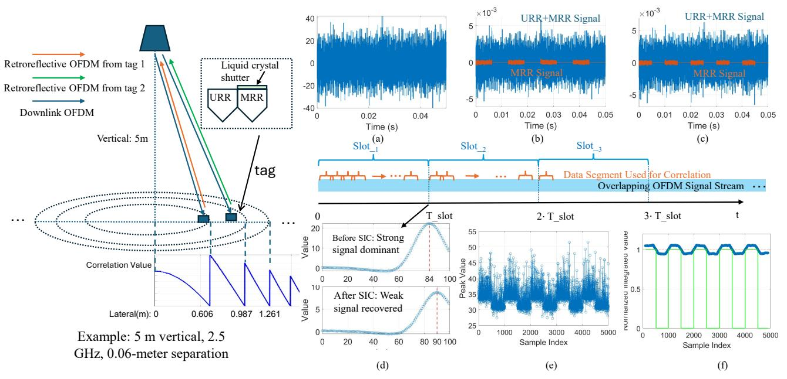

Fig. 1. System diagram and signal processing: The main panel shows the retro-reflection geometry. (a) Transmitted OFDM signal; (b, c) returned signals from Tag 1 (100 Hz) and Tag 2 (80 Hz) with OOK modulation (Orange: MRR signal; Blue: MRR+URR signal); (d) cross-correlation profile showing the recovery of the weaker tag's signal after applying SIC; (e) time-series of a recovered peak forming the OOK profile; (f) final demodulated bit stream.

 Receiver angular sensitivity: The receiver receives light at a steeper incident angle, which reduces its optical response due to angular falloff in its responsivity.

By mapping the measured peak amplitude to a precharacterized attenuation profile, the tag's position can be further refined within the CR. This two-stage positioning method combines Time-of-Flight (ToF) for coarse ranging with signal fingerprinting for fine-grained ranging, enabling high accuracy from passive optical reflections.

In the proposed system, the MRR region on each tag performs uplink communication by modulating the retroreflected signal using an OOK waveform. Due to the limited transmittance of the LC modulator, the retroreflected signal during the "on" period consists of the unmodulated OFDM signal plus approximately 10% of the modulated signal that passes through the LC twice. During the "off" period, the modulated signal is fully suppressed, and only the unmodulated OFDM component from the URR region is reflected.

The resulting sequence of correlation peak amplitudes reflects the underlying OOK pattern. Fig. 1e illustrates how the bitstream is recovered. The raw sequence of peak amplitudes, which exhibits asymmetric noise-like fluctuations, is first smoothed using a sliding integrator with a window size matched to the OOK symbol duration. A threshold is then applied to the smoothed signal to demodulate the final bits.

#### B. Hybrid MRR and URR

To achieve both accurate ranging and passive uplink communication, each tag employs a hybrid retro-reflective structure comprising a co-located URR and MRR, as shown in Fig. 1. This architecture is designed to leverage the URR to establish a stable signal foundation for both ranging and

communication. Specifically, the URR provides a strong, stable, unmodulated reflection that creates a robust sub-channel for the communication link. Simultaneously, the co-location of the two reflectors introduces a mechanism for controlling the modulation depth: by precisely designing the ratio of the reflective areas of the URR and the MRR, we can adjust the modulation depth of the superimposed signal. In this configuration, the URR serves as a crucial spatial reference. Its distinct cross-correlation peak separates the total retroreflected signal from the ambient background, enabling the system to accurately determine the tag's CR and track peak variations for demodulating the MRR signal.

# C. Successive Interference Cancellation for Multi-Region Signal Separation

Our approach to SIC is designed specifically for ToF ranging and differs fundamentally from conventional SIC employed in NOMA systems. Unlike traditional NOMA, which relies on significant power disparity for power-domain separation and accurate, real-time Channel State Information (CSI), our implementation operates entirely in the time domain. Signals are differentiated based on their unique ToF signatures, identified as distinct correlation peaks, rather than pre-allocated power levels. Furthermore, because our system operates in a LoS-dominant scenario where the channel response is primarily a function of distance, the required channel information is inherently obtained from the cross-correlation process, eliminating the need for explicit CSI estimation.

This SIC mechanism is critical for addressing the challenge in which an insufficient sampling rate can cause the strong tag signal to mask the weak one during concurrent uplink

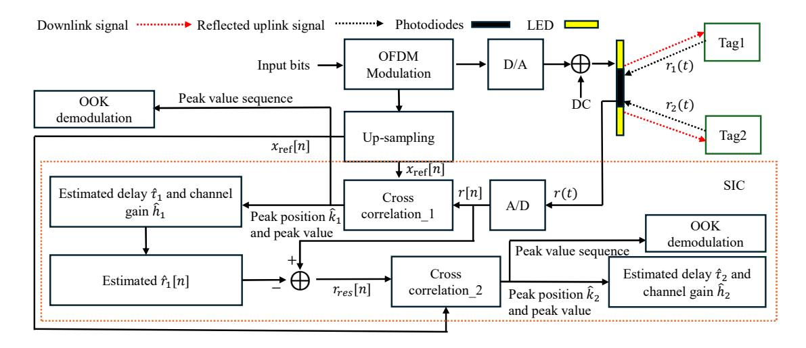

Fig. 2. Schematic illustration of the system workflow and the SIC-based signal processing.

transmission, as illustrated in Fig. 1d. Initially, the total received signal in analog domain, r(t), can be modeled as:

$$r(t) = s_1(t - \tau_1) + s_2(t - \tau_2) + n(t)$$
(3)

where  $s_1(t)$  and  $s_2(t)$  represent the reflected signals from the two tags, delayed by  $\tau_1$  and  $\tau_2$ , respectively, and n(t) denotes additive noise. As shown in the receiver block diagram in Fig. 2, to perform SIC digitally, the continuous signal r(t) is first passed through an Analog-to-Digital (A/D) converter. Sampling at a period  $T_s$  yields the discrete-time signal  $r[n] = r(nT_s)$ . Correspondingly, the transmitted reference waveform is up-sampled to match the receiver rate, resulting in the reference sequence  $x_{\rm ref}[n]$ . Assuming that the channel gain  $\hat{h}_1$  at different locations is known from prior calibration, the digital SIC process is carried out in four steps:

1) Dominant Delay Estimation: We first locate the discrete sample delay  $\hat{k}_1$  (corresponding to the physical delay  $\hat{\tau}_1 = \hat{k}_1 T_s + \Delta \tau$ , where  $\Delta \tau$  is determined by the cross-correlation peak value in each CR) of the strongest signal. This is achieved by identifying the peak of the discrete cross-correlation between the received samples r[n] and the reference sequence  $x_{\rm ref}[n]$  over a single OFDM symbol of length L:

$$\hat{k}_1 = \arg\max_{k} \left( \sum_{m=0}^{L-1} r[m] \cdot x_{\text{ref}}^*[m-k] \right)$$
 (4)

2) Signal Reconstruction: Using the estimated delay  $\hat{\tau}_1$ , the corresponding channel gain  $\hat{h}_1$  is retrieved from a precalibrated lookup table. The estimated digital signal of the dominant tag,  $\hat{\tau}_1[n]$ , is then reconstructed as:

$$\hat{r}_1[n] = \hat{h}_1 \cdot x_{\text{ref}}[n - \hat{k}_1] \tag{5}$$

3) Interference Cancellation: The reconstructed digital signal  $\hat{r}_1[n]$  is subtracted from the original discrete-time received signal r[n] to obtain the residual signal:

$$r_{\text{res}}[n] = r[n] - \hat{r}_1[n]$$
 (6)

4) Weak Signal Recovery: Finally, a second round of discrete cross-correlation is performed on the residual signal  $r_{\rm res}[n]$ —which now primarily contains the weaker signal—to determine the second delay estimate,  $\hat{k}_2$ :

$$\hat{k}_2 = \arg\max_{k} \left( \sum_{m=0}^{L-1} r_{\text{res}}[m] \cdot x_{\text{ref}}^*[m-k] \right)$$
 (7)

This digital process effectively removes the masking effect of the strong tag.

Since the cross-correlation is performed in the digital domain, the correlation peaks are inherently discrete. Consequently, the system's resolvability is determined by the temporal granularity of the receiver, specifically the sampling period  $T_s$  (the inverse of the sampling rate). To distinguish between two reflections, their time-of-flight difference must exceed this sampling interval. If the relative delay between signals is smaller than  $T_s$ , the cross-correlation peaks merge into a single discrete sample point, making it impossible to separate the signals digitally.

While this work demonstrates the SIC framework in a two-tag scenario, the approach is theoretically scalable to N concurrent tags by iteratively applying the "estimate-and-subtract" procedure. In such a generalized scheme, the algorithm sequentially identifies and removes the strongest remaining signal in each iteration. However, practical scalability is limited by error propagation: imperfect cancellation in early stages leaves residual interference, which accumulates with each iteration, progressively degrading the Signal-to-Interference-plus-Noise Ratio (SINR) for weaker subsequent signals. Additionally, computational latency increases linearly with the number of tags, potentially posing challenges for real-time processing in dense tag environments.

## IV. EXPERIMENTAL RESULTS

This section aims to evaluate the feasibility of using commercially available LEDs for OFDM-based cross-correlation ranging. For the downlink transmitter, we designed and constructed a custom LED array, addressing key issues such as

thermal management and the linear operating I-V region. On the retro-reflector side, we conducted a systematic performance comparison of LC modulators and corner cube retro-reflectors to assess their applicability in uplink transmission. On the uplink receiver side, we tested different approaches, including parallel-connected bare photodiodes with a large active area but limited bandwidth, as well as a COTS photodetector with a smaller active area but higher bandwidth. Overall, by carefully selecting commercially available components and parameters for each stage of the RO-ISAC system, we established an experimental platform that can achieve the desired system-level performance under practical conditions.

## A. LED Light Source Design and Setup

In this experiment, the light source is a self-fabricated PCB-based LED array, where Thorlabs LEDSW50 LEDs were soldered on an aluminum-based PCB. The preparation involved three key steps:

1) Thermal Management: The design of the dispersive transmitter array was guided by the dual objectives of achieving a downlink illumination level on the user plane while maximizing uplink signal strength. To provide approximately 200 lux in a 5-meter range, the array was populated with 200 surface-mount LEDs. The geometric arrangement of these LEDs is critical for uplink. As established in [17], the radius of the array disk shall be the same as the diameter of corner cube retro-reflector. As shown in Fig. 3a, the disk radius is 50 mm. Considering all possible tag locations on the user plane, the downlink optical signals from LEDs positioned near the central receiver on the disk are more likely to be retroreflected back to the receiver. This occurs because, at larger horizontal offsets, the leaf-shaped effective reflecting area reduces to include only the LEDs surrounding the receiver at the disk center, as illustrated in Fig. 7 of [17]. Therefore, instead of a uniform distribution, the LEDs were arranged in a circular array with a radially graded density, increasing towards the center. This centrally-weighted configuration, depicted in Fig. 4a, enhances the uplink's signal-to-noise ratio (SNR) without compromising the overall illumination footprint. The central area of the array was left vacant to accommodate the optical receiver.

The LED array design presented a challenge in thermal management, as nonuniform temperatures across the board can degrade the consistency of the system's frequency response. To address this, an aluminum-based PCB was selected as the substrate material for its superior thermal conductivity.

A preliminary validation was performed on small prototype boards. Thermal imaging revealed that the metal core PCB provided excellent heat spreading, resulting in a highly uniform temperature distribution across the active area, which depicted in Fig. 3a. To further investigate performance under a more demanding layout, a larger board with 30 LEDs was designed, as shown in Fig. 3a. On this board, the LEDs were arranged in a non-uniform, centrally-weighted configuration across three concentric rings. The innermost ring was the most densely populated, with the spacing between LEDs and between the rings increasing radially outwards. We found

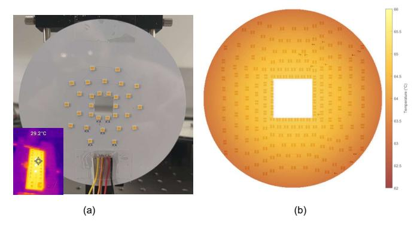

Fig. 3. Measured: (a) The LED board with its non-uniform distribution of 30 LEDs; the inset in the bottom-left shows a thermal camera image of a smaller, 10-LED rectangular board; (b) The heat map of the final, large luminaire, constructed from temperature data measured by thermometers.

that even with this non-uniform heat load, temperature measurements confirmed the excellent performance of the PCB, revealing a temperature differential of only 3 °C between the densely populated center and the sparser edge.

However, this second test also revealed that while the temperature distribution was almost uniform, the absolute stable operating temperature of the board approached the LEDs' maximum rated limit, which is 80 °C. This finding established that for reliable, long-term operation with 200 LEDs (to achieve 200 lux in a 5-meter range), the aluminum-core PCB must be paired with a sufficiently large heat sink to effectively dissipate the total thermal load. After fabricating the final light board, we mounted the PCB onto the heat sink DigiKey 345-PADLED-16580-ND. Once the light source reached a stable temperature, we measured the temperature from the center to the edge. As shown in Fig. 3b, the central temperature was approximately 66 °C, while the edge temperature was approximately 62 °C, confirming that the temperature distribution across the entire lamp remained uniform.

In Fig. 4a, the final design comprises 216 LEDs in six groups, each consisting of 36 LEDs connected in series, with the groups connected in parallel. All LEDs are driven by the same DC bias and AC amplitude  $V_{\rm pp}$ . The LED spacing increases linearly from the center outward: the innermost ring has a spacing of 5 mm between adjacent LEDs, and each successive ring increases this spacing by 1 mm.

2) DC/AC Signal Combination: Fig. 5a illustrates the signal generation and driving circuitry for the light source. To drive the LED with both a DC bias and an AC-modulated OFDM signal, a bias-tee circuit was employed. The DC bias was supplied by a Keithley 2230-60-3 DC power source, while the AC signal was generated by an arbitrary waveform generator (AWG) and subsequently amplified by an ADA4870EBZ linear amplifier. The DC input was connected to the DC port of the bias tee, and the amplified AC input was connected to the RF port. The combined signal was then delivered through the bias tee's output port to the LED fixture. Since the LED array required a high operating voltage (up to 100 V) and current (up to 1 A), a high-voltage, high-current, and wideband bias tee was necessary. An ESDEMC High Voltage TLP Bias Tee was selected, which can withstand up to 450 V DC voltage,

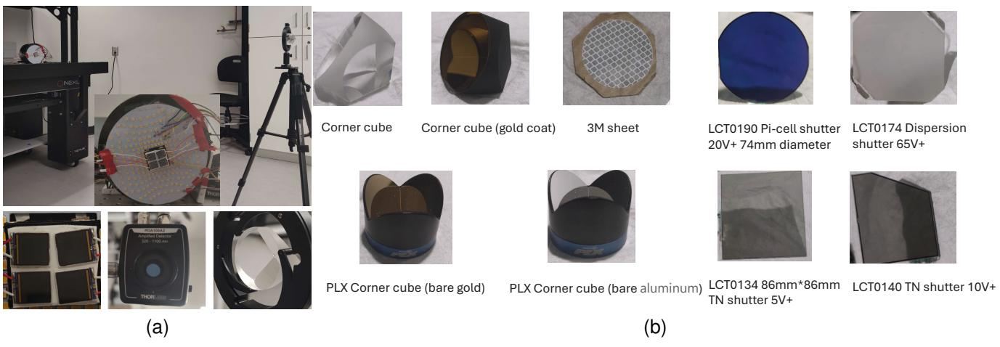

Fig. 4. Experimental setup and key optical components. (a) Photograph of the physical experimental setup, showing the integrated light source/photodiode receiver, the external high-speed photodetector, and a corner cube retro-reflector. (b) Catalog of the components evaluated: the five retro-reflector types (left) and the four LC modulators (right).

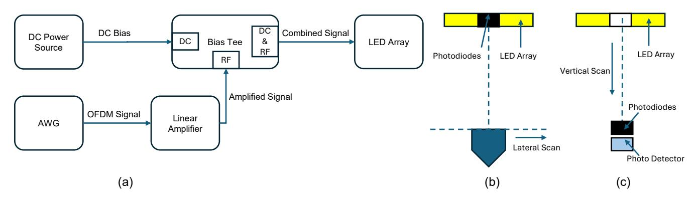

Fig. 5. Schematics of the experimental setup:(a) transmitter driver circuit using a bias-tee; (b) lateral scanning geometry of the corner cube; (C) vertical translation setup for detector calibration.

# 2 A DC current, and provides a 5 GHz bandwidth—sufficient to accommodate the OFDM signal spectrum.

3) Linearity Characterization: To ensure the fidelity of signal modulation, we first investigated the linear operating region of the commercial LEDs. A small PCB test board was designed to characterize the relationship between the emitted optical power and the driving voltage/current for various series and parallel configurations.

The experimental results are shown in Fig. 6. A key finding was that, within the operating voltage range of interest, the received optical power exhibited a remarkably linear relationship with the applied voltage, which is consistent with the approximately linear characteristics of the I-V curve in the operating region presented in the LED's datasheet. In contrast, the relationship between optical power and current was observed to be a slightly convex curve. Furthermore, the experiment also compared the stability of series and parallel configurations. The series configuration, due to its inherent current-sharing characteristic, yielded a more stable output curve, whereas the parallel configuration exhibited more fluctuations, attributable to minor variations in the characteristics of individual LEDs.

Based on the conclusions from this small-scale experiment—namely, that voltage modulation offers superior

linearity and that a series configuration is more stable—we established our final design strategy. Although equipment limitations precluded a fully series-connected array, we implemented a configuration of 36 series-connected LEDs per group. Based on this design, the characterization of the linear operating region for the entire array was then performed.

To determine the linear operating region of the entire LED array, we adopted the method described in [18]. Specifically, the DC bias and the amplitude of the AC signal ( $V_{\rm pp}$ ) were varied, and the presence or absence of harmonics in the frequency domain was used as the criterion for linearity. As shown in Fig. 6g, the harmonic components gradually decreased as  $V_{\rm pp}$  was reduced from  $0.8V_{\rm pp}$  to  $0.2V_{\rm pp}$ , until they became unobservable. Finally, From our real-time observation on the oscilloscope, the linear operating region of the array was identified, corresponding to a DC bias of 3 V and an AC amplitude of  $V_{\rm pp}=0.336$  V for each LED.

## B. Retro-reflector and OOK Frequency Selection

In this section, we evaluate the performance of different commercially available corner cubes without modulation. The setup is shown in Fig. 4. Four parallel-connected photodiodes were placed at the center of the light source, and a corner cube was positioned 1.6 m away. The cube was then moved

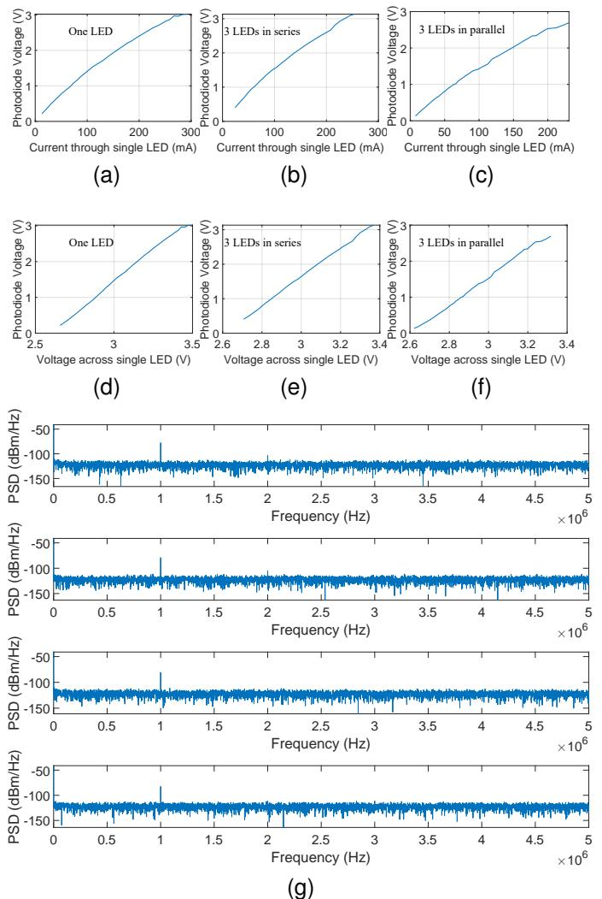

Fig. 6. Measured: Electro-optical response characterization for different LED configurations. The top row (a-c) plots the photodetector output voltage as a function of the driving current (L-I response). The bottom row (d-f) plots the photodetector output voltage as a function of the driving voltage (L-V response). Three configurations are compared: a single LED (a, d), three LEDs in series (b, e), and three LEDs in parallel (c, f). (g): The linear operating region of the entire LED panel. The four subfigures show the LED panel driven by a DC bias of 3 V with AC peak-to-peak voltages of 0.8 V, 0.6 V, 0.4 V, and 0.2 V, respectively.

laterally while recording the voltage from the photodiodes. This experiment was specifically conducted to determine the ratio between the MRR and URR return signals. The measured ratio serves as the essential reference value for the modulation depth in our system.

1) Corner Cube Selection without Modulation: The devices tested were: (i) a glass corner cube based on total internal reflection (TIR) [19]; (ii) the same glass corner cube with an additional gold coating on its reflective surfaces [20]; (iii) a hollow corner cube with aluminum-coated surfaces [21]; (iv) a hollow corner cube with gold-coated surfaces [22]; and (v) a 3M reflective material [23]. For the 3M material, we tested two sample sizes: one with a 50 mm diameter and another with a 100 mm diameter.

The results are shown in Fig. 7a. The corner cube retro-

reflector (CCR) based on TIR shows the highest back-reflection efficiency over a lateral displacement range from 0 cm to 80 cm. The performance ranking of the other elements is as follows: the hollow aluminum (Al) coated corner cube is second, while the two gold (Au) coated corner cubes show nearly identical performance.

The 3M flexible micro-prism array reflective sheet presents a different performance curve. Its absolute reflectivity is the lowest in the 0–70 cm test range, but its intensity roll-off as a function of lateral displacement is the most gradual of the tested materials, indicating a wider off-axis response range.

The results from the large-area sample with a 100 mm diameter confirm that the material's total back-reflection is enhanced with an increase in area.

2) LC and Corner Cube Selection with Modulation: To evaluate the integrated system, we tested combinations of retro-reflective elements and LC devices. The retroreflective elements were the same five types listed previously. The LC devices tested were:

- 1) A TN shutter with a 5V operating voltage.
- 2) A TN shutter with a 10V operating voltage.
- 3) A Pi-cell LC device.
- 4) A polymer-dispersed liquid crystal (PDLC) device.

The device photos are shown in Fig. 5b. The LC shutter was positioned at the front of the corner cube. A drive voltage was applied to each LC device to maintain it in its ON-state, corresponding to its maximum transmittance. We then measured the total optical reflectance of the combined system (LC shutter + CCR).

With a 5V-driven TN shutter (Fig. 7b), the hollow aluminum (Al) coated corner cube exhibited the highest combined performance. With a 10V-driven TN shutter (Fig. 7c), the hollow Alcoated prism also showed the highest performance; however, the total reflected optical intensity of the system was lower compared to the 5V case.

When a Pi-cell LC was used (Fig. 7d), the combined performance of the TIR, hollow Al-coated, and hollow Au-coated corner cubes were similar. The combination with the gold-coated solid glass corner cube and the 3M reflective sheet yielded lower efficiency.

Tests with the PDLC are shown in Fig. 7e. The reflected intensity for this configuration attenuated rapidly with lateral displacement.

Furthermore, for active modulation applications requiring the integration of a LC, the optimal configuration identified in this study is the combination of the 5V-driven TN LC shutter and the hollow, aluminum (Al) coated corner cube. This configuration effectively circumvents the polarization mismatch issue [24] inherent to the TIR prism, thereby achieving the highest uplink modulation efficiency. Note that the adoption of a TN LC shutter imposes specific requirements on the system's driving signal. TN devices are typically driven by an AC square wave signal to prevent material degradation caused by ion migration effects, with a typical operating frequency range of 30 Hz to 1 kHz. Therefore, the 80 Hz and 100 Hz driving frequencies selected for the simulation next are situated well within this optimal operational range, representing a rational choice for ensuring stable modulation performance.

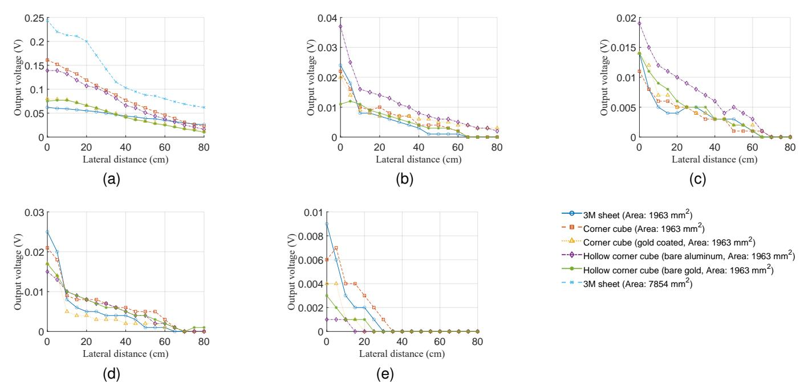

Fig. 7. Measured: Retro-reflected optical power as a function of lateral distance for the five evaluated modulation configurations. Each plot contains the response curves for all five retro-reflector types. (a) Baseline performance without any LC modulator. The subsequent plots show the system performance when integrated with: (b) a 5 V Twisted Nematic (TN) shutter; (c) a 10 V TN shutter; (d) a Pi-cell device; and (e) a Polymer-Dispersed Liquid Crystal (PDLC) device. (Note: The reference to Fig. 5 in the text implies another figure showing the setup, which is not included here.)

## C. Light Reader

We compared two different receiver settings: a custom array composed of four bare photodiodes (FDS1010) [25] (each with a 10mm×10mm photosensitive area) connected in parallel, and a commercial packaged photodetector (PDA100A2) [26].

Theoretically, increasing the total photosensitive area by paralleling multiple photodiodes is an effective strategy for improving SNR [17]. However, in our experiments using an OFDM signal, several issues were identified that rendered the custom photodiode array unsuitable as a receiver. Due to insufficient electromagnetic shielding, the array was highly susceptible to thermal noise and inter-channel crosstalk. Furthermore, connecting multiple photodiodes in parallel increased the total junction capacitance, which in turn limited the detector's response speed and reduced its effective bandwidth.

The experimental results indicate that the lead wire length is a critical factor influencing the total system thermal noise level. Shortening the bare lead wire length from 12 cm to 2 cm significantly reduced the system's thermal noise level by 4.4 dB, from -67.2 dBV to -71.6 dBV. As a performance benchmark, the integrated commercial photodetector exhibited a background noise floor of only -97 dBV under the same testing environment. The commercial detector's noise level was lower by 25 dBV.

A key structural limitation of the current setup is the solid-body heat sink, which lacks a central through-hole. This prevents the main photodetector from being mounted at the ideal on-axis position, forcing the use of a substitute photodiode array for now. Future work will involve designing a new heat sink with a central aperture, which will allow for the precise mounting of both a lens and the photodetector to

achieve optimal optical alignment and mitigate thermal noise from the light source.

Alternatively, in this work, we adopt an indirect measurement scheme to evaluate and extrapolate the expected received signal intensity. This approach leverages a clear division of functions between two distinct receiver types, each selected based on its specific characteristics, as illustrated in the bottom panel of Fig. 4a.

Step 1: Characterization of the DC Signal Profile for the Retro-Reflected Path: This setup is shown in Fig. 5b. Four parallel-connected photodiodes were placed at the center of the light source. We positioned a corner cube 5 m away from the light source and moved it laterally while recording the voltage from the photodiodes at the light source.

The distance of 5 m closely corresponds to the typical ceiling height of a modern warehouse. Using this comprehensive experiment, we employed our combined light source and photodetector setup to measure the received optical intensity distribution across various positions on the ground. The measured signal intensity will serve as one of the key parameters for our simulation studies.

This step aims to precisely measure the DC optical power returned exclusively by the corner cube at various spatial positions. The corner scanned along a lateral path (from y=0 to 2.5 m). This lateral scan is designed to replicate the system's operational status in a realistic application scenario. At each lateral position y, the steady-state DC voltage was recorded. To eliminate interference from ambient light and background stray reflections, a background subtraction technique was employed (i.e., subtracting the reading taken without the corner cube from the reading taken with it). The This yielded a clean DC signal profile,  $V_{\rm LF}(y)$ , representing

only the signal contribution from the corner cube. In addition to static interference, we also considered the impact of the OFDM signal scattering off the background. We assume that the retro-reflection from the URR is significantly stronger than this background scattering, making the cross-correlation contribution from any background-induced uplink negligible. We validated this assumption by modeling the entire indoor environment, including the diffuse reflection coefficient of the ground, which confirmed that the impact of such diffuse reflections on the cross-correlation was minimal.

Step 2: Establishing the DC Voltage to AC Amplitude Calibration Map: This setup is shown in Fig. 5c. The parallel-connected photodiodes were removed from the center of the light source. We moved the photodiodes and photodetector vertically. This step is the core of the methodology, designed to establish a reliable mapping function that can directly translate any DC voltage measured by the photodiodes into the corresponding AC signal amplitude that a high-speed photodetector would measure at the same location.

To create this map, we chose to perform the calibration by moving the detectors vertically along the optical axis. This approach was selected because vertical displacement provides the purest method for varying the received optical intensity, governed primarily by the physically clear inverse-square law.

The calibration procedure was as follows: First, using the high-speed photodetector, the 1 MHz AC signal amplitude,  $A_{\rm HF}(x)$ , was measured at various vertical distances, x. Subsequently, the photodetector was replaced with the low-speed photodiodes at the exact same spatial points, x, and the corresponding DC voltage,  $V_{\rm LF}(x)$ , was measured. This colocated measurement procedure yielded a series of one-to-one corresponding data pairs (DC voltage, AC amplitude). By fitting a function to this data, a direct calibration map, g, was established to perform the precise conversion from  $V_{\rm LF}$  to  $A_{\rm HF}$ . The function provides an excellent fit to the actual data, as demonstrated by the high R-squared values of 0.9963 and 0.9990, which is shown in Fig. 8.

Step 3: Derivation of the Final AC Signal Profile: As shown in Fig. 8, the final step involves applying the calibration map to the experimental data from Step 1. Each voltage value from the DC signal profile  $\tilde{V}_{\rm LF}(y)$ , which was measured under the realistic scenario of lateral movement, was individually input into the mapping function g established in Step 2.

$$A_{\text{sig}}(y) = g(\tilde{V}_{\text{LF}}(y)) \tag{8}$$

Through this process, the high-frequency AC signal profile, which could not be measured directly, was derived from the measurable DC signal profile. The resulting curve,  $A_{\rm sig}(y)$ , accurately describes the intensity variation of the 1 MHz modulated signal across the retro-reflected channel, providing a critical data foundation for subsequent SNR analysis and channel modeling.

The LED light source array used in this study has a measured -20 dB modulation bandwidth of approximately 4 MHz. Given that the system operates within this low bandwidth, it is reasonable to assume that the dominant noise source at the receiver is the thermal noise. This value was determined

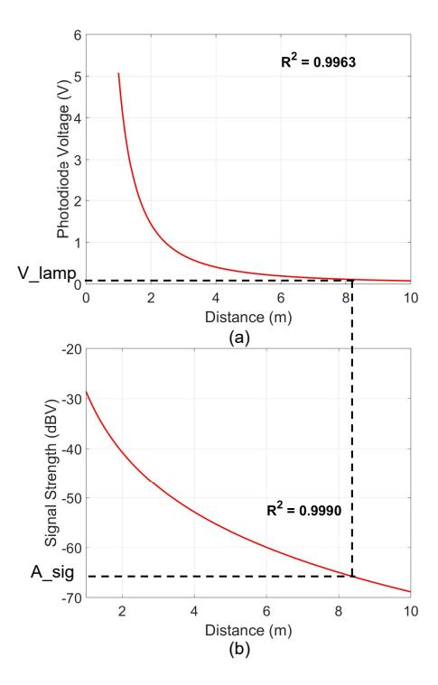

Fig. 8. Measured: (a) Fitted curve for the DC voltage from the photodiode as a function of distance. (b) Fitted curve for the signal strength from the photodetector as a function of distance.

empirically by measuring the noise level of the integrated commercial photodetector, and was found to be -97 dBV.

## V. EXPERIMENTS DRIVEN SIMULATION RESULTS

To ensure that the simulation framework accurately reflects the real-world testbed, the numerical parameters were explicitly calibrated using preliminary hardware characterization. The connection between the simulation model and experimental conditions is established through three key physical aspects:

Signal Power and Noise Floor: The geometric setup (distances and angles) in the simulation mirrors the physical dimensions of the testbed. The optical power budget is derived from the specific LED driver settings used in the experiment (3 V DC bias with 0.336 V AC drive per LED). Furthermore, the noise model is anchored to the experimentally measured electrical noise floor of -97 dBV (dominated by thermal noise), ensuring that the simulated SNR distribution matches the laboratory environment.

Modulation Depth: The retro-reflective properties are modeled based on measurements of the retro-reflectors and modulators. Specifically, the simulation adopts the experimentally determined modulation depth, with the OOK modulation amplitude of the MRR set to 1/10 of the unmodulated component.

Frequency Response: To capture the bandwidth limitations, the frequency-dependent attenuation of the LED transmitter was characterized via a frequency sweep. This measured transfer function is directly applied as a weighting filter to the simulated OFDM subcarriers, reproducing the actual low-pass characteristics of the channel.

In both preliminary measurements and simulation analysis, we observed that the oversampling rate (OSR), defined as

the ratio between the receiver ADC sampling rate and the transmitter DAC sampling rate, has a decisive impact on positioning accuracy. The necessity for a high OSR stems from the need to achieve high spatial resolution using bandwidth-limited commercial LEDs. To obtain a distance resolution of approximately 6 cm, a receiver-side sampling rate of 2.5 GHz is required. Given that the transmitter DAC is matched to the 4 MHz bandwidth of the LED, this configuration results in a high OSR of several hundred, which is critical to the system's performance. The overall simulation study is therefore divided into three parts:

- (1) Single-region positioning using real LED bandwidth: Based on the measured 4 MHz bandwidth of our LED panel, and under a vertical LED-to-surface distance of 5 m, we simulate the SNR at different horizontal positions. Using an OSR of 2, we estimate the tag's location within a single region solely based on the amplitude of the correlation peak. As the LED bandwidth is low, all positions within the LED's halfpower angle range produce the same peak location, making amplitude-based inference necessary. We implement a location fingerprinting method composed of an offline database creation stage and an online positioning stage. In the offline stage, we build a fingerprint map by dividing the ground plane into distinct regions based on their radial distances. The mean amplitude of the resulting cross-correlation peaks is then calculated and stored as the unique fingerprint for that specific location. In the online stage, to determine a robot's position, a new random OFDM signal is used for the measurement. The resulting correlation peak amplitude is compared against the pre-computed values in the fingerprint database. The robot's location is then estimated to be the region corresponding to the fingerprint with the minimum difference.
- (2) Multi-region, multi-tag ranging with higher sampling: Building on the same SNR profile, we simulate a receiver sampling rate of 2.5 GHz to investigate the effect of increased bandwidth on region separation. We explore how larger LED bandwidth improves the spatial resolution and enables differentiation of tags in adjacent regions.
- (3) Hybrid URR-MRR structure for joint ranging and communication: Finally, we incorporate the hybrid retro-reflector structure described earlier. By combining URR reflections for accurate ranging and MRR reflections for uplink signaling, the simulation demonstrates reliable identification and ranging of multiple tags under realistic optical constraints.

These simulations, supported by our current hardware implementation, confirm that the system is fully capable of achieving long-range localization. However, with regard to multi-access capability, a clear distinction must be made: simultaneous multi-access for 2D localization is not yet feasible with the current setup. This limitation is primarily due to the restricted modulation bandwidth of the light source and the inherent constraints in the 2D spatial mapping process.

## A. Single-Region Ranging Using Measured Parameters

In the simulation, one OFDM symbol  $(N_{\rm sym}=1)$  with an IFFT size of  $128~(N_{\rm ifft}=128)$  and 63 active subcarriers  $(N_{\rm data}=63)$  is employed, while the noise level is set to

 $-97.72\,\mathrm{dBV}$ . We evaluated the ranging performance using the measured parameters of the designed LED array. The system bandwidth was set to 4 MHz, corresponding to the  $-20\,\mathrm{dB}$  bandwidth of the light source, and the OSR was fixed at 2. Under these conditions, we simulated the system's ability to perform ranging within a single CR. The cumulative distribution function (CDF) of the ranging error was plotted to evaluate performance. Results show that 95% of the ranging errors fall within the centimeter-level range, demonstrating that centimeter-level precision is achievable under realistic bandwidth constraints in a single-CR setting.

Although the low sampling rate yields only a single resolvable region, we analyze ranging error as a function of lateral distance to expose potential spatial non-uniformity. We partition the illuminated area into three lateral subregions—center (0–0.5 m), mid (0.9–1.4 m), and edge (1.8–2.3 m)—and compute the empirical CDF of the ranging error within each sub-region. These three CDFs are then compared with the overall error distribution. This stratified analysis shows that, even under a nominal single-region condition, error behavior may differ between the center and the periphery.

As shown in Fig. 9, it can be observed that the ranging error reaches its maximum at the luminaire center. Although the SNR is highest at this position, the conversion from one-dimensional resolution to two-dimensional resolution introduces the most significant degradation in accuracy. In contrast, at the edges of the luminaire, the ranging error also increases, since the SNR has dropped to a relatively low level.

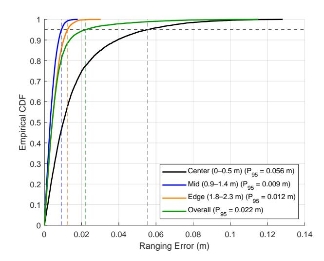

Fig. 9. Simulated: Empirical CDF of ranging error under single-region condition for overall and three lateral sub-regions.

## B. Impact of OSR and SNR on Peak Detection Accuracy

In the second simulation, we investigate how the OSR and SNR affect the accuracy of peak position detection in the time-region cross-correlation process. A high OSR is required to create multiple resolvable CRs, which forms the basis of multiregion ranging. While micro-LEDs can achieve the required GHz-level bandwidth, they are highly specialized components that would significantly increase a luminaire's cost. For this reason, standard commercial LED lights do not provide this

level of performance. Under such bandwidth-limited conditions, oversampling is necessary to emulate the multi-region effect. To analyze the effect of OSR and SNR on region classification accuracy, we fixed the receiver sampling rate at 2.5 GHz and varied the OSR by modifying the transmitter's DAC sampling rate. Since the transmitter DAC rate is chosen to match the signal bandwidth, a lower bandwidth directly corresponds to a higher OSR. For this study, we make a simplified assumption that the lamp has a sufficiently flat bandwidth, implemented in our simulation by ensuring all baseband OFDM subcarriers have equal gain.

The noise floor is fixed at  $-97.72\,\mathrm{dBV}$ . The tag is fixed at a delay of 88 integer samples (this corresponds to a horizontal offset at 1.686 meters), while only OSR and SNR are varied to evaluate their impact on region classification accuracy. The simulation is conducted with only one tag in the environment, eliminating interference from overlapping signals.

We evaluate the probability of correctly identifying the true peak location. Specifically, we evaluate system performance under OSRs of 50, 100, 200, and 500. As shown in Fig. 10, The results show that the peak position accuracy is primarily determined by OSR. Within the tested SNR range from 40 dB to 10 dB, the accuracy remains relatively stable and fluctuates around a fixed value for each OSR. No significant degradation in ranging performance is observed as SNR decreases, indicating that OSR—and by extension, the effective signal bandwidth—is the dominant factor limiting peak localization precision. When the SNR drops below 10 dB, a noticeable, though not abrupt, decline in region classification accuracy can be observed. This suggests that SNR itself has only a limited effect on classification accuracy: within a region, even as the SNR decreases near the edges, high accuracy can still be maintained over a wide range, and only when the tag is exactly at the region boundary does the accuracy show a significant decline. This observation is consistent with the results of the first simulation, where only at the very edge of a region does the ranging accuracy increase noticeably.

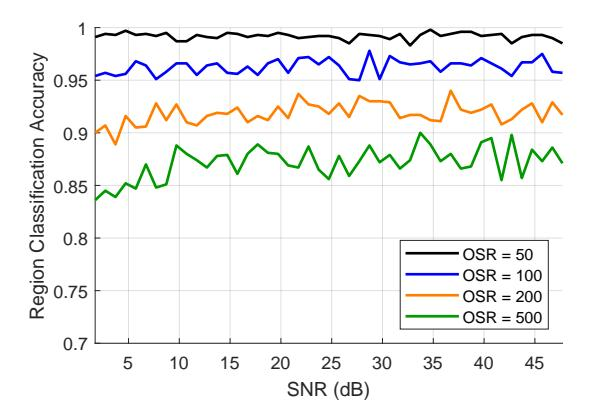

Fig. 10. Simulated: Impact of OSR on the Accuracy of Peak Positioning

C. Spatial Multiplexing Capability under High-Resolution Sampling

The parameters of the third simulation follow those of the second experiment, where the LED array is assumed to provide a sufficiently flat bandwidth. Both the background noise and the RSS are taken directly from the previous experimental data. The receiver sampling rate is fixed at 2.5 GHz. In this scenario, two tags are placed in different regions. Each tag is equipped with two retro-reflectors: a URR for positioning and an MRR for communication, both sharing the same optical channel. The MRR is driven by an OOK signal to generate a tag-specific ID: the first tag is assigned 100 Hz, while the second tag is assigned 80 Hz. The OOK modulation depth is set to one-tenth of the unmodulated received signal power. Within each 0.05 s observation window, the system performs ranging using the unmodulated signal while simultaneously decoding the OOK-modulated information. The ranging performance and bit error rate (BER) are then evaluated under different OSRs.

We explore two scenarios in this setup: (1) when two tags are positioned in adjacent regions, and (2) when the two tags are located with multiple regions apart. In both cases, the cross-correlation peaks may overlap due to the limited resolution of region separation, especially under fractional delays. We further investigate the application of SIC to mitigate the strong-signal interference and recover the weak signal's peak with improved accuracy.

In our simulations, we selected Region 2, Region 3, and Region 8 for detailed analysis. We varied the tag's lateral offset within Region 2, while in Regions 3 and 8 the tag's position was generated randomly. Since the signal in Region 2 is relatively strong, gradually increasing the offset within this region effectively reduces the RSS. This allows us to first observe several common and representative effects as the signal degrades, before analyzing the more challenging cases in Regions 3 and 8.

The experimental results presented in Fig. 11 reveal several key insights into the system's performance.

First, regarding the sampling parameters, a comparison between the upper panels (a–d) and lower panels (e–h) demonstrates that a lower OSR yields superior performance in both ranging and communication. Reducing the OSR improves both BER and region classification accuracy, regardless of whether SIC is applied.

Second, the results confirm the critical role of SIC in near–far scenarios. Regardless of the specific tag distribution, SIC significantly enhances the recovery of distant signals, which is particularly evident in the BER improvements shown in Fig. 11(a), (c), (e), and (g). As the signal strength of the near user (Region 2) decreases, the recovery of the weaker tag (e.g., in Regions 3 and 8) improves, directly validating the effectiveness of our SIC-based SDMA approach in mitigating strong interference.

Third, the spatial distribution of the tags significantly impacts performance due to varying masking effects. When the weak signal is located in Region 8—significantly deviating from the light source—it experiences a stronger masking effect from the Region 2 signal compared to the Region 3 scenario. Consequently, recovery of the Region 8 signal is more challenging. Furthermore, when a tag is positioned at the boundary between regions, a zone of reduced ranging accuracy is observed. This degradation is attributed not only to the lower

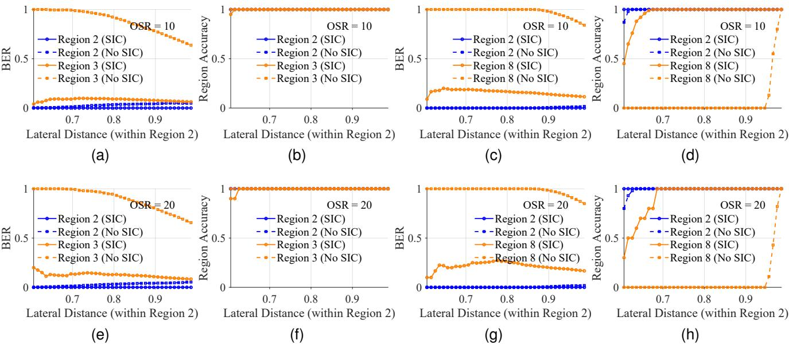

Fig. 11. Simulation results under different conditions. Performance metrics are shown as a function of the lateral offset of Tag 1 within Region 2. Panels (a)–(d) correspond to an OSR of 10, while panels (e)–(h) correspond to an OSR of 20. Specifically: (a) BER and (b) region classification accuracy when tags are located in Regions 2 and 3; (c) BER and (d) accuracy when tags are located in Regions 2 and 8; (e) BER and (f) accuracy when tags are located in Regions 2 and 8

SNR but also to energy leakage from the correlation peak, which compromises ranging precision.

Finally, a fundamental trade-off between interference and resolution is observed when tags are in adjacent regions. In this specific case, accuracy without SIC is marginally higher than with SIC. This occurs because, in very tight spacing, the correlation peaks and their sidelobes tend to reinforce one another, making the composite peak distinguishable without subtraction. Despite this edge case, SIC remains essential for robust multi-tag operation in well-separated scenarios (e.g., Region 2 vs. Region 8), where it provides a decisive advantage in OOK signal recovery.

#### VI. CONCLUSION

This paper proposes and demonstrates a multi-tag RO-ISAC system that achieves long-range SDMA under a dispersive light source through a novel hybrid MRR structure and OFDM-based cross-correlation. Using COTS components, we comprehensively evaluate the performance of the transmission, reflection, and reception links over distances up to 5 m and identify the key bottlenecks limiting system performance. The core contributions of this work are threefold: (1) it is the first to establish that the LED source's modulation bandwidth is the dominant factor governing multi-tag positioning accuracy and uplink concurrency; (2) it validates the feasibility of future system scaling by addressing the near-far problem in a twotag scenario; and (3) it provides practical design guidelines for component selection through a systematic evaluation of COTS devices. For applications where high-bandwidth light sources are available, the proposed system can be extended into a high-precision, high-concurrency ISAC solution.

This study also has several limitations. On the hardware side, the current testbed lacks real-time processing capability, and its non-integrated design may introduce inaccuracies in SNR measurements. On the algorithmic side, the existing channel estimation and SIC strategies are susceptible to error accumulation, which constrains performance as the number of tags increases. Future work will focus on developing an integrated hardware transceiver for real-time operation, designing more robust channel estimation and SIC algorithms to support larger tag populations, and extending the system from one-dimensional ranging to two-dimensional positioning.

### REFERENCES

- [1] N. Chi, Y. Zhou, Y. Wei, and F. Hu, "Visible Light Communication in 6G: Advances, Challenges, and Prospects," *IEEE Vehicular Technology Magazine*, vol. 15, no. 4, pp. 93–102, Dec. 2020. [Online]. Available: https://ieeexplore.ieee.org/abstract/document/9208801
- [2] P. S. Farahsari, A. Farahzadi, J. Rezazadeh, and A. Bagheri, "A Survey on Indoor Positioning Systems for IoT-Based Applications," *IEEE Internet of Things Journal*, vol. 9, no. 10, pp. 7680–7699, May 2022. [Online]. Available: https://ieeexplore.ieee.org/abstract/document/ 9703681
- [3] X. Yang, Z. Wu, and Q. Zhang, "Bluetooth Indoor Localization With Gaussian–Bernoulli Restricted Boltzmann Machine Plus Liquid State Machine," *IEEE Transactions on Instrumentation and Measurement*, vol. 71, pp. 1–8, 2022. [Online]. Available: https://ieeexplore.ieee.org/ document/9670468/
- [4] M. Martalo, S. Perri, G. Verdano, F. De Mola, F. Monica, and G. Ferrari, "Improved UWB TDoA-Based Positioning Using a Single Hotspot for Industrial IoT Applications," *IEEE Transactions on Industrial Informatics*, vol. 18, no. 6, pp. 3915–3925, Jun. 2022. [Online]. Available: https://ieeexplore.ieee.org/document/9535299/
- [5] A. R. Jimenez Ruiz and F. Seco Granja, "Comparing Ubisense, BeSpoon, and DecaWave UWB Location Systems: Indoor Performance Analysis," *IEEE Transactions on Instrumentation and Measurement*, vol. 66, no. 8, pp. 2106–2117, Aug. 2017. [Online]. Available: http://ieeexplore.ieee.org/document/7891540/
- [6] C.-X. Wang, X. You, X. Gao, X. Zhu, Z. Li, C. Zhang, H. Wang, Y. Huang, Y. Chen, H. Haas, J. S. Thompson, E. G. Larsson, M. D. Renzo, W. Tong, P. Zhu, X. Shen, H. V. Poor, and L. Hanzo, "On the Road to 6G: Visions, Requirements, Key Technologies, and Testbeds," *IEEE Communications Surveys & Tutorials*, vol. 25, no. 2, pp. 905–974, 2023. [Online]. Available: https://ieeexplore.ieee.org/abstract/document/10054381

- [7] Y. Cui, C. Chen, Y. Cai, Z. Zeng, M. Liu, J. Ye, S. Shao, and H. Haas, "Retroreflective optical ISAC using OFDM: channel modeling and performance analysis," *Optics Letters*, vol. 49, no. 15, p. 4214, Aug. 2024. [Online]. Available: https://opg.optica.org/abstract. cfm?URI=ol-49-15-4214
- [8] Y. Wen, F. Yang, J. Song, and Z. Han, "Optical Wireless Integrated Sensing and Communication Based on EADO-OFDM: A Flexible Resource Allocation Perspective," *IEEE Transactions on Wireless Communications*, vol. 24, no. 8, pp. 6964–6979, Aug. 2025. [Online]. Available: https://ieeexplore.ieee.org/document/10960484/
- [9] H. Wang, C. Chen, Z. Zeng, S. Shao, and H. Haas, "Bidirectional Retroreflective Optical ISAC Using Time Division Duplexing and Clipped OFDM," *IEEE Photonics Technology Letters*, vol. 37, no. 10, pp. 587–590, May 2025. [Online]. Available: https://ieeexplore.ieee. org/document/10879576/
- [10] H. Wang, Z. Zeng, C. Chen, B. Zhu, S. Shao, and M. Liu, "Retroreflective Optical ISAC Supporting 3D Positioning in Indoor Environments," in *2024 Asia Communications and Photonics Conference (ACP) and International Conference on Information Photonics and Optical Communications (IPOC)*. Beijing, China: IEEE, Nov. 2024, pp. 1–5. [Online]. Available: https://ieeexplore.ieee.org/document/10809915/
- [11] H.-J. Moon, C.-B. Chae, and M.-S. Alouini, "Performance Analysis of Passive Retro-Reflector Based Tracking in Free-Space Optical Communications With Pointing Errors," *IEEE Transactions on Vehicular Technology*, vol. 72, no. 8, pp. 10 982–10 987, Aug. 2023. [Online]. Available: https://ieeexplore.ieee.org/abstract/document/10066845
- [12] "Liquid Crystal Displays (LCD) from Liquid Crystal Technologies." [Online]. Available: http://www.liquidcrystaltechnologies.com/
- [13] L. Dai, B. Wang, Y. Yuan, S. Han, I. Chih-lin, and Z. Wang, "Non-orthogonal multiple access for 5G: solutions, challenges, opportunities, and future research trends," *IEEE Communications Magazine*, vol. 53, no. 9, pp. 74–81, Sep. 2015. [Online]. Available: https://ieeexplore.ieee.org/abstract/document/7263349
- [14] C. Xu, K. Xu, L. Feng, and B. Liang, "RetroV2X: A new vehicle-to-everything (V2X) paradigm with visible light backscatter networking," *Fundamental Research*, vol. 5, no. 3, pp. 1204–1213, May 2025. [Online]. Available: https://www.sciencedirect.com/science/ article/pii/S2667325823001243
- [15] K. Xu, C. Gong, B. Liang, Y. Wu, B. Di, L. Song, and C. Xu, "Low-Latency Visible Light Backscatter Networking with RetroMUMIMO," in *Proceedings of the 20th ACM Conference on Embedded Networked Sensor Systems*, ser. SenSys '22. New York, NY, USA: Association for Computing Machinery, Jan. 2023, pp. 448–461. [Online]. Available: https://dl.acm.org/doi/10.1145/3560905.3568507
- [16] M. Di Renzo, A. Zappone, M. Debbah, M.-S. Alouini, C. Yuen, J. de Rosny, and S. Tretyakov, "Smart Radio Environments Empowered by Reconfigurable Intelligent Surfaces: How It Works, State of Research, and The Road Ahead," *IEEE Journal on Selected Areas in Communications*, vol. 38, no. 11, pp. 2450–2525, Nov. 2020. [Online]. Available: https://ieeexplore.ieee.org/abstract/document/9140329
- [17] S. Shao, A. Salustri, A. Khreishah, C. Xu, and S. Ma, "R-VLCP: Channel Modeling and Simulation in Retroreflective Visible Light Communication and Positioning Systems," *IEEE Internet of Things Journal*, vol. 10, no. 13, pp. 11 429–11 439, Jul. 2023. [Online]. Available: https://ieeexplore.ieee.org/abstract/document/10044960
- [18] A. Ahmed, G. Dzhezyan, H. Aboutahoun, V. Chu, J. DiViccaro, V. Ohanian, S. Rezaeiboroujerdi, I. Saheb, E. Urban, J. Wu, M. Kulhandjian, H. Kulhandjian, and M. B. Rahaim, "SDR Beyond Radio: An Out-of-Tree GNURadio Library for Simulation and Deployment of Multi-Cell / Multi-User Optical Wireless Communications."
- [19] "TIR Retroreflector Prisms." [Online]. Available: https://www. thorlabschina.cn
- [20] "Specular Retroreflector Prisms." [Online]. Available: https://www. thorlabs.com/newgrouppage9.cfm?objectgroup id=13580
- [21] "PLX Hollow Retroreflector ULPR-15-5-C | MEETOPTICS." [Online]. Available: https://www.meetoptics.com/mirrors/retroreflectors/ hollow-retroreflector/s/plx/p/ULPR-15-5-C
- [22] "PLX Hollow Retroreflector ULPR-20-5-H | MEETOPTICS." [Online]. Available: https://www.meetoptics.com/mirrors/retroreflectors/ hollow-retroreflector/s/plx/p/ULPR-20-5-H
- [23] "3M™ Diamond Grade™ Translucent DG³ Reflective Sheeting Series 4090T," archive Location: US Layout: Desktop. [Online]. Available: https://www.3m.com/3M/en US/p/d/b5005619002/
- [24] I. Thorlabs. (2025) Specular retroreflector prisms. Accessed: 2025-10- 12. [Online]. Available: https://www.thorlabs.com/newgrouppage9.cfm? objectgroup id=13580

- [25] "Thorlabs FDS1010 Si Photodiode, 65 ns Rise Time, 350 1100 nm, 10 mm x 10 mm Active Area." [Online]. Available: https://www.thorlabschina.cn
- [26] "Thorlabs PDA100A2 Si Switchable Gain Detector, 320 1100 nm, 11 MHz BW, 75.4 mm², Universal 8-32 / M4 Taps." [Online]. Available: https://www.thorlabschina.cn