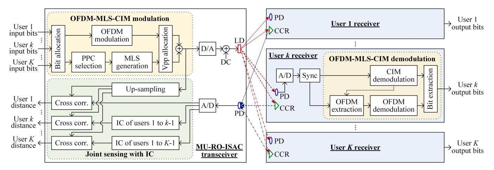
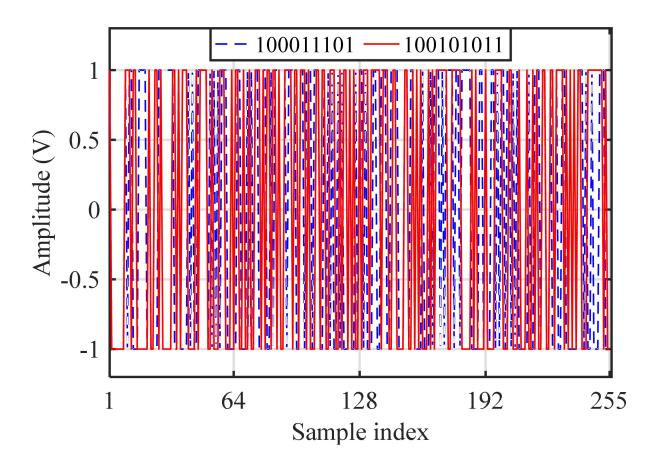
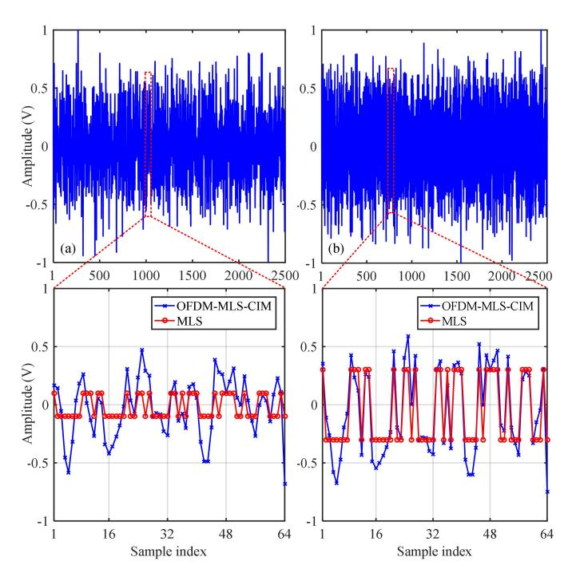
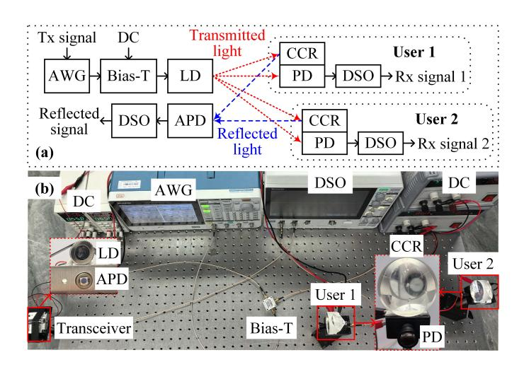
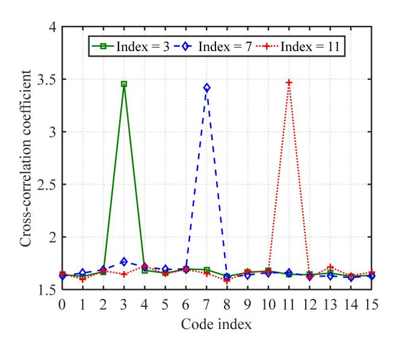
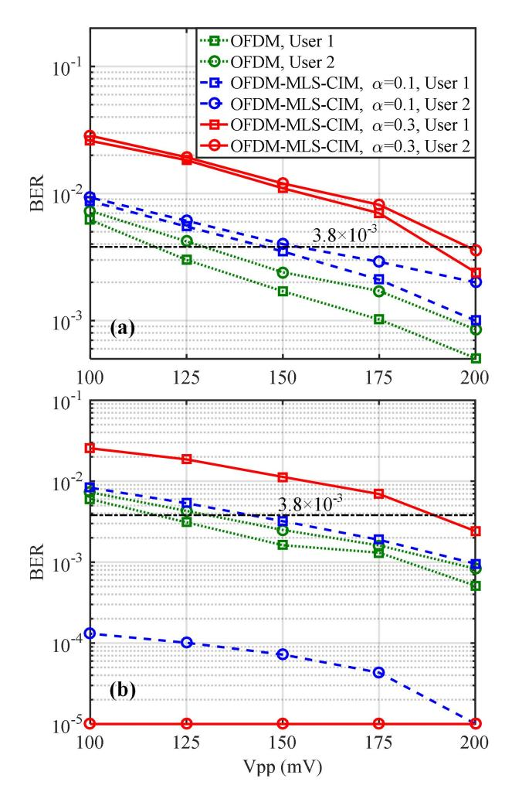
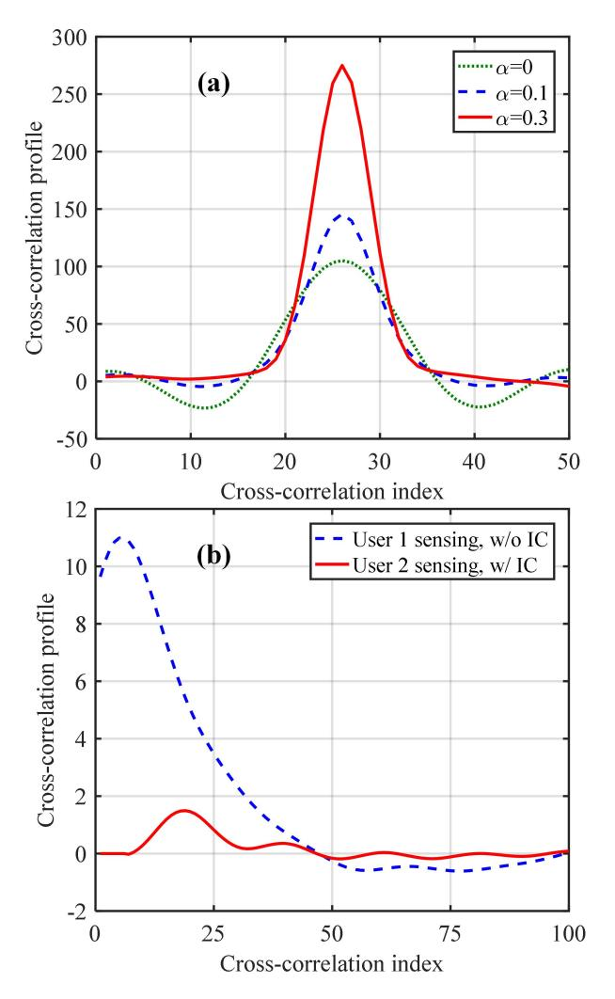
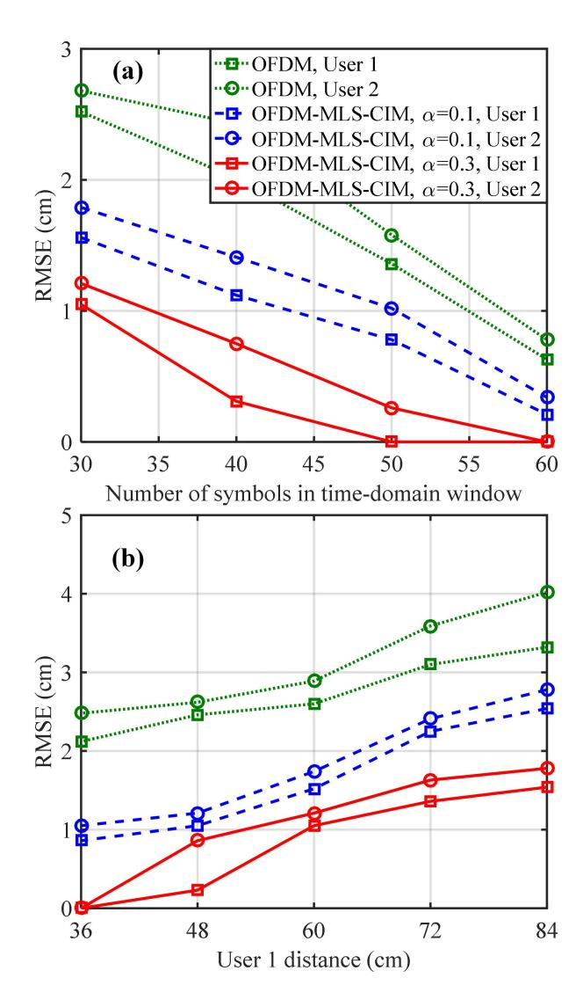

# Multiuser Retroreflective Optical ISAC: Waveform Design, Joint Sensing and Multiple Access

Weiren Wang, Chen Chen, *Senior Member, IEEE*, Haochuan Wang, Zhihong Zeng, Dengke Wang, Jia Ye, Meiwei Kong, Min Liu, and Harald Haas, *Fellow, IEEE*

*Abstract*—Optical wireless integrated sensing and communication (ISAC) has revealed great potential to satisfy the requirements of both large communication capacity and high sensing accuracy in the sixth-generation (6G) networks. In this paper, we propose and experimentally demonstrate a multiuser retroreflective optical ISAC (MU-RO-ISAC) system. To simultaneously support communication and sensing for multiple users, a novel orthogonal frequency division multiplexing-embedded maximum length sequence with code index modulation (OFDM-MLS-CIM) waveform is proposed. Utilizing the proposed OFDM-MLS-CIM waveform, multiuser joint sensing and multiple access schemes are further designed accordingly. Compared with pure OFDM, OFDM-MLS-CIM can support flexible performance trade-off between communication and sensing and it can also transmit additional index bits via CIM during MLS generation. Proofof-concept experiments are conducted to evaluate the feasibility of the proposed MU-RO-ISAC system using OFDM-MLS-CIM. Experimental results show that, in a two-user RO-ISAC system, the users' bit error rates (BERs) can reach the 7% forward error correction (FEC) coding threshold of 3.8×10−3 while centimeter accuracy ranging can be successfully achieved for both users.

*Index Terms*—Retroreflective optical integrated sensing and communication (RO-ISAC), waveform design, joint sensing, interference cancellation, multiple access.

# I. INTRODUCTION

O WING to its ability to simultaneously support communication and sensing, integrated sensing and communication (ISAC) has received tremendous attention in recent years, which has been widely envisioned as a key enabling technology for the sixth-generation (6G) networks [1]. To achieve both large communication capacity and high sensing accuracy, sufficient signal bandwidth is generally required in ISAC systems [2]. Considering the fact that radio-frequency

This work was supported in part by the National Natural Science Foundation of China under Grant 62271091 and 62501088, in part by the Chongqing Municipal Young Talents Program under Grant cstc2024ycjh-bgzxm0018, and in part by the Fundamental Research Funds for the Central Universities under Grant 2024CDJXY020. *(Corresponding authors: Chen Chen; Dengke Wang)*

Weiren Wang, Chen Chen, Haochuan Wang, Zhihong Zeng, Dengke Wang, and Min Liu are with the School of Microelectronics and Communication Engineering, Chongqing University, Chongqing 400044, China (e-mail: 20231201022g@cqu.edu.cn; c.chen@cqu.edu.cn; 202312131101t@stu.cqu.edu.cn; zhihong.zeng@cqu.edu.cn; dengke.wang@cqu.edu.cn; liumin@cqu.edu.cn).

Jia Ye is with the State Key Laboratory of Power Transmission Equipment Technology, School of Electrical Engineering, Chongqing University, Chongqing 400044, China (e-mail: jia.ye@cqu.edu.cn).

Meiwei Kong is with the State Key Laboratory of Marine Geology, Tongji University, Shanghai 200092, China (e-mail: 22503@tongji.edu.cn).

Harald Haas is with the department of Engineering, University of Cambridge, 9 JJ Thomson Avenue, Cambridge CB3 0FA, UK (e-mail: huh21@cam.ac.uk).

(RF) based ISAC systems usually have a limited usable signal bandwidth, it is challenging for RF-ISAC systems to meet the high capacity and accuracy requirements [3]. In comparison to RF-ISAC systems, optical wireless ISAC systems can fully exploit the abundant bandwidth of light to satisfy the required communication capacity and sensing accuracy [4], [5].

1

Lately, retroreflective optical ISAC (RO-ISAC) has been further proposed which introduces a retroreflective module such as corner cube reflector (CCR) to enhance the intensity of the reflected optical signal via light retroreflection [6]. Although RO-ISAC reveals its potential for future 6G networks, the research of RO-ISAC is still at the early stage which mainly focuses on the topics such as channel modeling, waveform design, bidirectional transmission, etc. For channel modeling in RO-ISAC systems, both a point source model and an area source model of the reflected sensing channel were proposed in [6]. For waveform design in RO-ISAC systems, multiple integrated waveforms were proposed such as pulse sequence sensing and pulse position modulation (PSS-PPM) [7], integrated pulse amplitude modulation (PAM) [8], orthogonal frequency division multiplexing (OFDM) waveforms [9]–[11], hybrid PAM and OFDM waveform [12], OFDM-embedded maximum length sequence (OFDM-MLS) [13], and so on. For bidirectional transmission in RO-ISAC systems, time division duplexing based half-duplex bidirectional transmission was proposed in [14] and wavelength division duplexing based fullduplex bidirectional transmission was proposed in [12]. Moreover, an optical integrated communication, sensing, and power transfer (O-ICSPT) system was experimentally validated in [15], which further integrates wireless optical power transfer into the RO-ISAC system. As can be found from the existing literature, the current RO-ISAC research mostly considers a point-to-point RO-ISAC system which only performs singleuser communication and single-target sensing. However, practical RO-ISAC systems might consist of multiple users and hence both multiuser communication and multi-target sensing should be considered in RO-ISAC systems [16].

To the best of our knowledge, multiuser optical wireless ISAC systems have only been reported in [18] and [17] so far. In [18], an optical phased array has been adopted to enable concurrent multiuser communication and environment imaging via optical beamforming. Although the use of optical phased array can efficiently realize multi-beam optical wireless ISAC and hence support multiple users, the overall implementation complexity and cost of the system can be relatively high. In [17], non-orthogonal multiple access (NOMA) has been employed to serve multiple users where multiple OFDM signals

TABLE I COMPARISON OF THE PROPOSED MU-RO-ISAC SYSTEM WITH STATE-OF-THE-ART OPTICAL ISAC SYSTEMS

| Reference | Number of users | Waveform            | Multiple access       | Additional index bits | Simulation/experiment |
|-----------|-----------------|---------------------|-----------------------|-----------------------|-----------------------|
| [7]       | 1               | PSS-PPM             | Not applicable        | No                    | Simulation            |
| [9]       | 1               | OFDM                | Not applicable        | No                    | Experiment            |
| [10]      | 1               | OFDM                | Not applicable        | No                    | Simulation            |
| [12]      | 1               | Hybrid PAM and OFDM | Not applicable        | No                    | Experiment            |
| [13]      | 1               | OFDM-MLS            | Not applicable        | No                    | Experiment            |
| [17]      | 2               | OFDM                | NOMA                  | No                    | Simulation            |
| This work | 2               | OFDM-MLS-CIM        | Hybrid OFDMA and IMMA | Yes                   | Experiment            |

Fig. 1. Schematic diagram of the proposed MU-RO-ISAC system using OFDM-MLS-CIM. corr.: correlation, sync: synchronization.

are individually clipped before the NOMA superposition so as to mitigate clipping distortion propagation. Nevertheless, the research of multiuser RO-ISAC (MU-RO-ISAC) is still in the early stage and it is of practical significance to propose and design low-complexity and low-cost MU-RO-ISAC systems to serve multiple users.

To this end, in this paper, we for the first time propose and experimentally demonstrate a MU-RO-ISAC system, where the waveform design, joint sensing and multiple access issues are investigated. For clarity, a comprehensive comparison between the proposed MU-RO-ISAC system and the stateof-the-art optical ISAC systems is provided in Table I. The main contributions of this paper can further be summarized as follows:

- A novel ISAC waveform named OFDM-MLS with code index modulation (OFDM-MLS-CIM) is designed, which not only benefits from the flexible performance trade-off between communication and sensing but also provides the unique CIM ability to transmit additional index bits without compromising the overall performance.
- A joint sensing scheme based on the OFDM-MLS-CIM waveform is developed, where interference cancellation (IC) is adopted to remove inter-user interference and hence ensure satisfactory sensing performance for all users in the MU-RO-ISAC system.
- A hybrid multiple access scheme based on the OFDM-MLS-CIM waveform is further proposed, which can support flexible allocation of OFDM and CIM bits to the serving users according to their data rate requirements and channel conditions.

• Extensive experimental results are presented to evaluate the performance of the proposed MU-RO-ISAC system using OFDM-MLS-CIM. The obtained results demonstrate the feasibility to achieve both high-speed communication and high-accuracy ranging in a proof-of-concept two-user RO-ISAC setup.

The remainder of this paper is organized as follows. In Section II, we describe the principle of a general MU-RO-ISAC system, where the proposed waveform design, joint sensing and multiple access schemes are introduced in detail. In Sections III, experiments are conducted and the results are discussed. Section IV concludes the paper.

## II. PRINCIPLE

In this section, the principle of the proposed MU-RO-ISAC system using OFDM-MLS-CIM is first described, and then three key techniques of the MU-RO-ISAC system including waveform design, joint sensing and multiple access are discussed in detail.

#### *A. System Principle*

Fig. 1 depicts the schematic diagram of the proposed MU-RO-ISAC system using OFDM-MLS-CIM. As we can see, the MU-RO-ISAC system mainly consists of one MU-RO-ISAC transceiver and K user receivers. At the MU-RO-ISAC transceiver, the input bits of totally K users are first modulated into the OFDM-MLS-CIM signal via OFDM-MLS-CIM modulation, and the OFDM-MLS-CIM waveform is used to realize both communication and sensing in the MU-RO-ISAC system.

TABLE II CIM MAPPING TABLE FOR n = 8

| Index bits | Code index | PPC code  |  |
|------------|------------|-----------|--|
| 0000       | 0          | 100011101 |  |
| 0001       | 1          | 100101011 |  |
| 0011       | 2          | 100101101 |  |
| 0010       | 3          | 101001101 |  |
| 0110       | 4          | 101111111 |  |
| 0111       | 5          | 101100011 |  |
| 0101       | 6          | 101100101 |  |
| 0100       | 7          | 101101001 |  |
| 1100       | 8          | 101110001 |  |
| 1101       | 9          | 110000011 |  |
| 1111       | 10         | 110001101 |  |
| 1110       | 11         | 110101001 |  |
| 1010       | 12         | 111000011 |  |
| 1011       | 13         | 111001111 |  |
| 1001       | 14         | 111100111 |  |
| 1000       | 15         | 111110101 |  |

After digital-to-analog (D/A) conversion, the OFDM-MLS-CIM signal is further combined with a direct current (DC) bias and the resultant signal is employed to modulate the intensity of the light emitted by the laser diode (LD) transmitter. At each user receiver, a photo-detector (PD) is adopted to convert the detected optical signal into an electrical signal and analog-todigital (A/D) conversion is further conducted to obtain a digital OFDM-MLS-CIM signal. Subsequently, time synchronization is executed and OFDM-MLS-CIM demodulation is performed to recover the transmitted bits for each user. The detailed procedures of OFDM-MLS-CIM modulation and demodulation will be discussed in Subsection II.B.

To achieve simultaneous communication and sensing, a corner cube reflector (CCR) is equipped by each user receiver to reflect the optical signal emitted by LD back to the MU-RO-ISAC transceiver via retroreflection. It can be seen from Fig. 1 that the MU-RO-ISAC transceiver is also equipped with a PD to capture all the reflected optical signals from the K users. After A/D conversion, the obtained mixed signal is utilized to perform multiuser joint sensing. The principle of joint sensing will be introduced in Subsection II.C. Moreover, to efficiently support multiuser communication in the MU-RO-ISAC system, a novel multiple access scheme based on OFDM-MLS-CIM is further proposed and its principle will be discussed in Subsection II.D. Although only downlink communication is considered in the proposed MU-RO-ISAC system, bidirectional communication can be efficiently supported by applying time division duplexing [14] or wavelength division duplexing [12], which is not the focus of this paper.

## *B. Waveform Design*

In the proposed MU-RO-ISAC system, OFDM-MLS-CIM is designed as the waveform to support both communication and sensing for the K users. During the OFDM-MLS-CIM modulation at the MU-RO-ISAC transceiver, as shown in Fig. 1, bit allocation is first performed with respect to the input bits of totally K users which converts all the input bits into two bit streams. Specifically, one bit stream is modulated into a real-valued time-domain OFDM signal via OFDM modulation,

Fig. 2. Illustration of two 8th-order MLS signals with different PPC codes.

while the other bit stream is used to select a specific primitive polynomial coefficients (PPC) code out of a group of PPC codes and the selected PPC code is then adopted to generate the corresponding MLS signal accordingly. It is known that a bipolar MLS signal with length L = 2n − 1 is generated by a linear feedback shift-register using a PPC code with order n, and multiple PPC codes are available to generate the MLS signals with the same length [19]. For example, as given in Table II, there are a total of 16 PPC codes available to generate 16 distinctive 8th-order MLS signals. It should be noted that the MLS signals with the same order or length have exactly the same correlation performance. Therefore, it is feasible to perform CIM by transmitting four index bits to select one out of 16 PPC codes to generate the corresponding 8th-order MLS signal. Fig. 2 illustrates two 8th-order MLS signals with two PPC codes of 100011101 and 100101011. As can be seen, the generated two 8th-order MLS signals are clearly distinct from each other.

After OFDM modulation and MLS generation, the resultant OFDM and MLS signals are superposed together to obtain the OFDM-MLS-CIM signal. Considering the superior communication performance of OFDM and the excellent sensing performance of MLS, it is feasible to adjust the amplitudes of the bipolar OFDM and MLS signals before signal superposition so as to adaptively balance the communication and sensing performance of the resultant OFDM-MLS-CIM signal. As a result, peak-to-peak voltage (VPP) allocation is executed before signal superposition during the OFDM-MLS-CIM modulation at the MU-RO-ISAC transceiver.

Letting VOFDM and VMLS respectively denote the VPP values of bipolar OFDM and MLS signals, the VPP allocation ratio α is defined as follows:

$$\alpha = \frac{V_{\text{MLS}}}{V_{\text{MLS}} + V_{\text{OFDM}}} = \frac{V_{\text{MLS}}}{V_{\text{OFDM-MLS-CIM}}}$$
(1)

where VOFDM-MLS-CIM = VMLS +VOFDM denotes the VPP of the superposed OFDM-MLS-CIM signal. Letting xOFDM and xMLS respectively denote the bipolar OFDM and MLS signals, the superposed OFDM-MLS-CIM signal x can be represented by

$$x = \alpha x_{\text{MLS}} + (1 - \alpha) x_{\text{OFDM}} \tag{2}$$

Fig. 3. Illustration of the superposed OFDM-MLS-CIM waveforms with a  $V_{PP}$  allocation ratio of (a)  $\alpha$  = 0.1 and (b)  $\alpha$  = 0.3.

According to (2), it can be found that the OFDM-MLS-CIM signal becomes a pure OFDM signal when  $\alpha = 0$ , while it becomes a pure MLS signal when  $\alpha = 1$ . It should also be noted that the bipolar OFDM and MLS signals are superposed without upsampling, and zero samples can be added at the end of the MLS signal such that the length of the MLS signal can match the length of the OFDM signal for successful superposition. Figs. 3(a) and (b) depict the superposed OFDM-MLS-CIM waveforms with a  $V_{PP}$  allocation ratio of  $\alpha = 0.1$ and 0.3, respectively. As we can see, the superposed OFDM-MLS-CIM waveforms always have a fixed VPP of 2 V which is not affected by the adopted VPP allocation ratio. Moreover, when the  $V_{PP}$  allocation ratio  $\alpha$  is increased from 0.1 to 0.3, the amplitudes of the superposed OFDM-MLS-CIM waveform are moved away from the zero value, making the superposed OFDM-MLS-CIM waveform more close to the MLS signal. Hence, flexible trade-off between communication and sensing performance can be enabled by adjusting the VPP allocation ratio  $\alpha$  according to the practical system requirements. Since a larger  $V_{PP}$  allocation ratio leads to a smaller  $V_{PP}$  of the OFDM signal, two relatively small VPP allocation ratios of 0.1 and 0.3 are considered here to ensure satisfactory communication performance of the MU-RO-ISAC system.

Assuming the OFDM-MLS-CIM signal is generated with an inverse fast Fourier transform (IFFT) size of  $N_{\rm IFFT}$ , a data-subcarrier number of  $N_{\rm data}$ , a constellation order of M, and a D/A sampling rate of  $S_{\rm D/A}$ , the data rate achieved by OFDM modulation is given by

$$R_{\text{OFDM}} = \frac{N_{\text{data}} S_{\text{D/A}} \log_2 M}{N_{\text{IFFT}}} \tag{3}$$

Moreover, assuming the zero-padded MLS signal has the same length of  $N_{\rm IFFT}$  as that of the OFDM signal and the PPC code

group size for PPC selection is G, the data rate achieved by CIM modulation is obtained by

$$R_{\text{CIM}} = \frac{S_{\text{D/A}} \lfloor \log_2 G \rfloor}{N_{\text{IFFT}}} \tag{4}$$

where  $\lfloor \cdot \rfloor$  represents the floor operator. According to (3) and (4), it can be seen that the CIM modulation rate  $R_{\text{CIM}}$  might be smaller than the OFDM modulation rate  $R_{\text{OFDM}}$ . Nevertheless,  $R_{\text{CIM}}$  is achieved additionally by performing CIM modulation at the MU-RO-ISAC transceiver and it has been verified in the following experimental results that CIM modulation will not affect OFDM demodulation at the user receiver.

For OFDM-MLS-CIM demodulation at the user receiver, as shown in Fig. 1, CIM demodulation is first carried out to identify the selected PPC code and then recover the transmitted index bits accordingly. More specifically, the CIM demodulation is realized via the cross-correlation calculation between the synchronized OFDM-MLS-CIM signal and the candidate MLS signals. Let y and  $x_{\rm MLS}^m$  denote the received OFDM-MLS-CIM signal and the nth-order MLS signal with respect to the m-th PPC code in the PPC code set, respectively. The index of the PPC code in the PPC code set which corresponds to the nth-order MLS signal achieving a maximum cross-correlation value with the received OFDM-MLS-CIM signal can be identified by

$$m^{\dagger} = \underset{m}{\operatorname{argmax}} \sum_{i=1}^{L} y_i x_{\text{MLS},i}^m \tag{5}$$

where  $L=2^n-1$  is the length of the cross-correlation window. After successfully identifying the index of the PPC code in the PPC code set, the transmitted index bits can be obtained in accordance with the CIM mapping table (e.g., Table II for the case of n=8). Accordingly, the embedded OFDM signal can be extracted as follows:

$$\hat{x}_{\text{OFDM}} = y - h\alpha x_{\text{MLS}}^{m^{\dagger}} \tag{6}$$

where h denotes the channel attenuation coefficient and  $x_{\rm MLS}^{m^\dagger}$  represents the nth-order MLS signal generated by using the  $m^\dagger$ -th PPC code. Subsequently, OFDM demodulation is performed to recover the transmitted OFDM bits. According to the bit allocation scheme adopted at the MU-RO-ISAC transceiver, the output bits of each user can be extracted from the recovered index bits and OFDM bits.

Although the proposed OFDM-MLS-CIM waveform in this current work and the OFDM-MLS waveform in our previous work [13] are both generated via the superposition of OFDM and MLS signals, there are key differences between these two waveforms. Specifically, the OFDM-MLS waveform can achieve flexible performance trade-off between communication and sensing, but the superposed MLS signal cannot carry additional information. In contrast, the OFDM-MLS-CIM waveform not only benefits from the flexible performance trade-off between communication and sensing but also provides the unique CIM ability to transmit additional index bits without compromising the overall performance. Moreover, hybrid multiple access schemes can be further developed based on the OFDM-MLS-CIM waveform, which will be discussed in Section II.D.

## *C. Joint Sensing*

At the MU-RO-ISAC transceiver, the detected mixed signal after A/D conversion is used to execute joint sensing for totally K users, which can be expressed as follows:

$$s = \sum_{k=1}^{K} h_k x + z \tag{7}$$

where hk denotes the channel attenuation coefficient with respect to the k-th user and z represents the additive noise. To measure the distance between the MU-RO-ISAC transceiver and each user, cross-correlation-based time of flight (TOF) estimation is adopted here, which calculates the cross-correlation value of the received time-domain signal and the upsampled version of the transmitted signal due to the upsampling process of A/D conversion.

To realize joint sensing for multiple users simultaneously, IC can be performed at the MU-RO-ISAC transceiver so as to remove inter-user interference. Assuming the K users are sorted according to their channel attenuation coefficients hk in the descending order, the sensing for the first user with the largest channel attenuation coefficient is directly processed with respect to the mixed signal s while the sensing for the other users is handled with IC. For the sensing of the first user (i.e., User 1), as reported in [6], the maximum likelihood (ML) estimation of TOF via the cross-correlation calculation with respect to User 1 can be described by

$$\hat{\tau}_1 = \arg\max_{\tau} \sum_{j=0}^{W-1} s(j) x^*(j-\tau)$$
 (8)

where x ∗ denotes the upsampled version of the transmitted signal x and W is the length of the cross-correlation window. Given the estimated TOF value τˆ1, the distance d1 between the MU-RO-ISAC transceiver and User 1 is estimated by ˆd1 = cτˆ1/2, where c is the speed of light. Assuming the sampling rate of A/D conversion at the MU-RO-ISAC transceiver is SA/D, the ranging resolution is given by

$$\Delta d = \frac{c}{2S_{\text{A/D}}} \tag{9}$$

For the sensing of the g-th user with g = 2, 3, · · · , K, the inter-user interference caused by User 1 to User g-1 is first removed and the resultant signal after performing IC is expressed by

$$s_g = s - \sum_{v=1}^{g-1} h_v x \tag{10}$$

where hv denotes the channel attenuation coefficient of the v-th user with v = 1, 2, · · · , g − 1. After obtaining sg, the TOF value τˆg with respect to User g can be estimated via the cross-correlation calculation as follows

$$\hat{\tau}_g = \arg\max_{\tau} \sum_{j=0}^{W-1} s_g(j) x^*(j-\tau)$$
 (11)

and the distance dg between the MU-RO-ISAC transceiver and User g is estimated by ˆdg = cτˆg/2 accordingly.

In this work, only ranging is considered for users in the MU-RO-ISAC system. By deploying multiple MU-RO-ISAC

TABLE III BIT ALLOCATION IN OFDM-MLS-CIM

| Mode   | User 1                 | User 2        |
|--------|------------------------|---------------|
| Mode A | OFDM bits and CIM bits | OFDM bits     |
| Mode B | OFDM bits              | CIM bits only |

transceivers to obtain multiple distance estimates for each user, two-dimensional (2D) or three-dimensional (3D) positioning can be efficiently realized [20], [21].

## *D. Multiple Access*

In the MU-RO-ISAC system, the OFDM-MLS-CIM signal will be used to support K users for simultaneous communication. It can be seen from Fig. 1 that the OFDM-MLS-CIM signal transmits not only OFDM bits but also CIM bits, and the data rate of OFDM modulation can be higher than that of CIM modulation. Based on OFDM-MLS-CIM, a novel multiple access scheme is further proposed for the MU-RO-ISAC system. For simplicity and without loss of generality, we here consider a two-user RO-ISAC system in the following to introduce the proposed multiple access scheme based OFDM-MLS-CIM. For the two-user RO-ISAC system consisting of a near user (i.e., User 1) and a far user (i.e., User 2), Table III gives the two representative bit allocation modes in OFDM-MLS-CIM for two users. For bit allocation Mode A, User 1 is allocated with both OFDM bits and CIM bits, while User 2 is allocated with OFDM bits. Through joint allocation of OFDM and CIM bits, User 1 and User 2 can achieve the same data rate. In contrast, for bit allocation Mode B, User 1 is allocated with all the OFDM bits while User 2 is allocated with CIM bits only, and hence User 1 has a higher data rate than User 2. It should be noted that bit allocation Mode A is more suitable for the case that two users have comparable channel conditions, while bit allocation Mode B is more preferable for the case that two users have distinct channel conditions.

It can be clearly observed from Table III that the proposed multiple access scheme based on OFDM-MLS-CIM might be considered as a hybrid scheme of orthogonal frequency division multiplexing access (OFDMA) and index modulation multiple access (IMMA) [22]. The two bit allocation modes in OFDM-MLS-CIM for two users given in Table III are just two representative examples for communication performance evaluation of the two-user RO-ISAC system. In practical MU-RO-ISAC systems, flexible allocation of OFDM and CIM bits can be implemented to satisfy the data rate requirements of all the serving users in the system, which is beyond the scope of this paper and will be investigated in our future work.

# III. EXPERIMENTS AND DISCUSSIONS

#### *A. Experimental Setup*

In this section, we conduct proof-of-concept experiments to investigate the communication and sensing performance of the proposed MU-RO-ISAC system using OFDM-MLS-CIM. For simplicity and without loss of generality, a two-user case is considered in the experimental evaluations where User 1 is the near user while User 2 is the far user.

Fig. 4. Experimental setup of the two-user RO-ISAC system: (a) hardware setup and (b) top-view photo of hardware testbed.

Figs. 4(a) and (b) depict the experimental hardware setup of a two-user RO-ISAC system and the top-view photo of hardware testbed in the lab environment, respectively. As we can see, the RO-ISAC transceiver consists of a LD transmitter (HL63603TG) and avalanche photo-diode (APD, Hamamatsu C12702-12), while each user receiver consists of a PD module (HCCLS2021MOD01-RX) and a CCR (Thorlabs PS976). In this experimental setup, the distance between the RO-ISAC transceiver and User 1 (i.e., near user) is in the range from 36 to 84 cm with a step of 12 cm, while the distance between the RO-ISAC transceiver and User 2 (i.e., far user) is fixed at 108 cm. As shown in Fig. 4(a), the OFDM-MLS-CIM signal is first generated offline using MATLAB and then uploaded to an arbitrary waveform generator (AWG, Tektronix AFG31102) with a sampling rate of 500 MSa/s. The AWG output signal is further combined with a direct-current (DC) bias of 2.6 V via a bias tee (Bias-T, Mini-Circuits ZFBT-6GW+) and the resultant signal is used to drive the LD for optical signal generation. After free-space transmission, the optical signal is captured by the PD modules of two users. The detected electrical signals are recorded by a two-channel digital storage oscilloscope (DSO, Tektronix MDO32) with a sampling rate of 2.5 GSa/s for each channel and the obtained digital signals are processed offline using MATLAB. Moreover, the CCRs equipped by two users respectively reflect the optical signals back to the twouser RO-ISAC transceiver, where the APD detects the mixed reflected optical signal and the resultant digital signal is also recorded by the DSO with a sampling rate of 2.5 GSa/s for further offline processing with MATLAB.

During OFDM modulation, the IFFT size is NIFFT = 256, the data-subcarrier number is Ndata = 64, the binary phase shift keying (BPSK) constellation is used with M = 2, and a clipping ratio of 11 dB is adopted to clip the time-domain OFDM signal for peak-to-average power ratio (PAPR) reduction. The AWG sampling rate and the DSO sampling rate are set to SD/A = 500 MSa/s and SA/D = 2.5 GSa/s, respectively, with a upsampling ratio of 5. Hence, according to (3), the data rate of OFDM modulation is 125 Mbps. Moreover, a MLS signal with order n = 8 and a PPC code group size of G = 16 is adopted

TABLE IV EXPERIMENTAL PARAMETERS

| Parameter                     | Value                 |  |
|-------------------------------|-----------------------|--|
| Number of users               | 2                     |  |
| User 1 distance               | 36, 48, 60, 72, 84 cm |  |
| User 2 distance               | 108 cm                |  |
| IFFT size                     | 256                   |  |
| Number of data subcarriers    | 64                    |  |
| OFDM modulation constellation | BPSK                  |  |
| OFDM clipping ratio           | 11 dB                 |  |
| AWG sampling rate             | 500 MSa/s             |  |
| DSO sampling rate             | 2.5 GSa/s             |  |
| Up-sampling ratio             | 5                     |  |
| OFDM rate                     | 125 Mbps              |  |
| Degree of MLS signal          | 8                     |  |
| Size of PPC code group        | 16                    |  |
| CIM rate                      | 7.8 Mbps              |  |
| Ranging resolution            | 6 cm                  |  |

TABLE V RESOURCE ALLOCATION IN OFDM AND OFDM-MLS-CIM

| Case                                         | User 1                        | User 2            |
|----------------------------------------------|-------------------------------|-------------------|
| Mode A with OFDM                             | DS 35-68                      | DS 1-34           |
| Mode B with OFDM Mode A with OFDM-MLS-CIM | DS 5-68 DS 35-64, CIM bits | DS 1-4 DS 1-34 |
| Mode B with OFDM-MLS-CIM                     | DS 1-64                       | CIM bits          |

to perform CIM modulation. As a result, according to (4), the data rate of CIM modulation is about 7.8 Mbps. Therefore, the overall data rate of the OFDM-MLS-CIM signal is 132.8 Mbps. Given the light speed of c = 3 × 108 m/s, according to (9), the ranging resolution is 6 cm. The detailed experimental parameters are listed in Table IV.

## *B. Communication Performance*

Based on the above experimental setup, we first evaluate the communication performance of the two-user RO-ISAC system. Fig. 5 shows the performance of CIM demodulation based on cross correlation for the received OFDM-MLS-CIM signal with 8th-order MLS and a total of 16 PPC codes, which is measured at the position of User 2 with a distance of 108 cm, a VPP of 200 mV and a VPP allocation ratio of 0.3. As we can see, for the representative three code indexes of 3, 7 and 11, a cross-correlation coefficient peak of about 3.5 can be observed for each code index when the selected code index matches the one adopted in the OFDM-MLS-CIM signal. In contrast, the cross-correlation coefficient remains stable around 1.6 when the selected code index does not match the one adopted in the OFDM-MLS-CIM signal. According to Fig. 5, it can be concluded that the CIM demodulation based on cross correlation can be successfully performed at the user receiver to not only recover the CIM bits but also facilitate OFDM extraction for further OFDM demodulation.

Next, we compare the communication performance of the two-user RO-ISAC system using pure OFDM and the proposed OFDM-MLS-CIM. For fair performance comparison, the pure OFDM signal utilizes a total of 68 subcarriers for data transmission so as to achieve the same data rate of 132.8 Mbps as the OFDM-MLS-CIM signal. The detailed resource allocation

Fig. 5. Performance of CIM demodulation based on cross correlation.

using OFDM and OFDM-MLS-CIM for two users with respect to the two bit allocation modes in Table III is provided in Table V, where DS denotes data subcarriers. Hence, the data rates of User 1 and User 2 for Mode A are both 66.4 Mbps, while the data rates of User 1 and User 2 for Mode B are 125 and 7.8 Mbps, respectively.

Fig. 6 shows the bit error rate (BER) versus the  $V_{PP}$  of the AWG output signal for two users with two bit allocation modes, where the distances of User 1 (i.e., near user) and User 2 (i.e., far user) are fixed at 60 and 108 cm, respectively. For the bit allocation Mode A, as shown in Fig. 6(a), User 1 always has a better BER performance than User 2 due to its better channel condition which leads to a higher received signal-tonoise ratio (SNR). The BER performance of two users using OFDM-MLS-CIM with  $\alpha = 0.1$  and 0.3 is generally worse than that using pure OFDM (i.e., OFDM-MLS-CIM with  $\alpha$  = 0). This is because a portion of the total VPP is allocated for MLS signal transmission in OFDM-MLS-CIM, resulting in a reduced SNR when compared with pure OFDM. Moreover, it can also be observed that the BER values of two users using OFDM-MLS-CIM are greatly increased when the VPP allocation ratio  $\alpha$  is enlarged from 0.1 to 0.3. Nevertheless, for a VPP of 200 mV, both User 1 and User 2 using OFDM-MLS-CIM with  $\alpha$  = 0.1 and 0.3 can reach the 7% forward error correction (FEC) coding threshold of  $3.8 \times 10^{-3}$ . For the bit allocation Mode B, as shown in Fig. 6(b), it is interesting to see that the BER of User 2 using OFDM-MLS-CIM with  $\alpha = 0.1$ and 0.3 is significantly lower than that using OFDM, which is mainly owing to the excellent CIM demodulation performance based on cross correlation. Moreover, when the VPP allocation ratio  $\alpha$  is increased from 0.1 to 0.3, the BER of User 2 within the  $V_{PP}$  range from 100 to 200 mV always below  $1 \times 10^{-5}$ . It can be concluded from Figs. 6(a) and (b) that the overall BER performance of the two-user RO-ISAC system using OFDM-MLS-CIM can be improved by selecting a proper resource allocation scheme according to the users' data rate requirements and channel conditions. Although a two-user case is evaluated, it is feasible to support more than two users

Fig. 6. BER vs. AWG output  $V_{PP}$  for two users with bit allocation (a) Mode A and (b) Mode B. The BER below  $1\times 10^{-5}$  is truncated to  $1\times 10^{-5}$ .

by employing the hybrid OFDMA and IMMA scheme based on OFDM-MLS-CIM in the MU-RO-ISAC system.

## C. Sensing Performance

We further evaluate the sensing performance of the twouser RO-ISAC system. Fig. 7(a) shows the cross-correlation performance of the transmitted OFDM-MLS-CIM signal with a time-domain window consisting of 10 OFDM-MLS-CIM symbols. As we can see, the cross-correlation profile for OFDM-MLS-CIM with  $\alpha = 0$  (i.e., pure OFDM) has a peak value of about 105, while the peak values are increased to 146 and 275 when  $\alpha$  is enlarged to 0.1 and 0.3, respectively. Since a higher peak value indicates a superior cross-correlation performance, the OFDM-MLS-CIM signal with a larger  $\alpha$ value is more favorable for sensing in the two-user RO-ISAC system. Nevertheless, with the increase of the  $\alpha$  value in OFDM-MLS-CIM, the allocated VPP for OFDM becomes smaller, resulting in reduced communication performance. Therefore, two reasonable  $\alpha$  values of 0.1 and 0.3 are selected for the experimental evaluations. Fig. 7(b) shows the crosscorrelation performance of two-user joint sensing, where the time-domain window consists of 30 upsampled OFDM-MLS-CIM symbols. It can be seen that the cross-correlation profile

Fig. 7. Cross-correlation performance of (a) the transmitted OFDM-MLS-CIM signal and (b) two-user joint sensing. w/o: without, w/: with.

without performing IC only has one peak which can be used to estimate the TOF for User 1 (i.e., the near user), while the peak corresponding to User 2 (i.e., the far user) is invisible in the cross-correlation profile due to the strong interference caused by User 1 which has a much better channel condition than User 2. As a result, IC is necessary to realize successful multiuser joint sensing here. As shown in Fig. 7(b), the original peak corresponding to User 1 is removed in the resultant crosscorrelation profile with IC and a new peak appears which can be used to estimate the TOF for User 2. Fig. 7(b) shows the feasibility of using IC to efficiently realize joint sensing for two users in the RO-ISAC system. Although a simple twouser case is considered here, the IC-aided joint sensing can be effective to support more than two users in general MU-RO-ISAC systems.

Finally, we investigate the sensing performance of the twouser RO-ISAC system in terms of the ranging root mean square error (RMSE). Fig. 8(a) depicts the ranging RMSE versus the number of symbols in time-domain window for both OFDM and OFDM-MLS-CIM, where the distances of User 1 and User 2 are fixed at 60 and 108 cm, respectively. As we can see, with the increase of the number of symbols in time-domain

Fig. 8. Ranging performance: (a) RMSE vs. the number of symbols in timedomain window and (b) RMSE vs. User 1 distance.

window for cross-correlation calculation, the ranging RMSE is gradually reduced for both users using OFDM and OFDM-MLS-CIM. Moreover, for both User 1 and User 2, the highest ranging RMSE is always obtained by using OFDM while the lowest ranging RMSE is obtained by employing OFDM-MLS-CIM with α = 0.3, which demonstrates the superior sensing performance of OFDM-MLS-CIM in comparison to pure OFDM. In addition, the ranging RMSE is further reduced when the VPP allocation ratio α is increased from 0.1 to 0.3. Specifically, with a time-domain window consisting of 50 symbols, the ranging RMSE values are reduced from 0.8 and 1.0 cm to 0 and 0.3 cm for User 1 and User 2, respectively. Fig. 8(b) shows the ranging RMSE versus User 1 distance for both OFDM and OFDM-MLS-CIM with the time-domain window consisting of 30 symbols, where User 1 distance is in the range from 36 to 84 cm with a step of 12 cm and User 2 distance is fixed at 108 cm. As can be seen, with the increase of User 1 distance, the ranging RMSE values for both User 1 and User 2 are gradually increased accordingly although User 2 distance is a fixed value, which is mainly because of the error propagation effect during the IC-aided joint sensing. Therefore, to enable joint sensing for more than two users in the MU-RO-ISAC system, the mitigation of adverse error propagation effect should be addressed to enhance the sensing performance, which will be investigated in our future work.

## IV. CONCLUSION

In this paper, we have proposed and experimentally demonstrated a MU-RO-ISAC system using a novel OFDM-MLS-CIM waveform. By adjusting the VPP allocation ratio in OFDM-MLS-CIM, flexible performance trade-off between communication and sensing can be efficiently realized. Moreover, by introducing multiple distinctive MLS signals in the generation of the superposed OFDM-MLS-CIM signal, additional index bits can be transmitted through CIM. Based on the proposed OFDM-MLS-CIM waveform, the corresponding joint sensing and multiple access schemes have been further designed. Proof-of-concept experiments successfully demonstrate the feasibility of achieving high-speed communication and high-accuracy ranging in the two-user RO-ISAC system. In our future work, we will investigate simultaneous communication and 2D/3D positioning in the MU-RO-ISAC system with a large number of users.

### REFERENCES

- [1] F. Liu, Y. Cui, C. Masouros, J. Xu, T. X. Han, Y. C. Eldar, and S. Buzzi, "Integrated sensing and communications: Toward dual-functional wireless networks for 6G and beyond," *IEEE Journal on Selected Areas in Communications*, vol. 40, no. 6, pp. 1728–1767, 2022.
- [2] N. Gonzalez-Prelcic, M. F. Keskin, O. Kaltiokallio, M. Valkama, ´ D. Dardari, X. Shen, Y. Shen, M. Bayraktar, and H. Wymeersch, "The integrated sensing and communication revolution for 6G: Vision, techniques, and applications," *Proceedings of the IEEE*, vol. 112, no. 7, pp. 676–723, 2024.
- [3] C. Liang, J. Li, S. Liu, F. Yang, Y. Dong, J. Song, X.-P. Zhang, and W. Ding, "Integrated sensing, lighting and communication based on visible light communication: A review," *Digital Signal Processing*, p. 104340, 2023.
- [4] Y. Wen, F. Yang, J. Song, and Z. Han, "Optical integrated sensing and communication: Architectures, potentials and challenges," *IEEE Internet of Things Magazine*, vol. 7, no. 4, pp. 68–74, 2024.
- [5] R. Zhang, Y. Shao, M. Li, L. Lu, and Y. C. Eldar, "Optical integrated sensing and communication with light-emitting diode," *IEEE Internet of Things Journal*, vol. 12, no. 9, pp. 12 896–12 911, 2024.
- [6] Y. Cui, C. Chen, Y. Cai, Z. Zeng, M. Liu, J. Ye, S. Shao, and H. Haas, "Retroreflective optical ISAC using OFDM: Channel modeling and performance analysis," *Optics Letters*, vol. 49, no. 15, pp. 4214–4217, 2024.
- [7] Y. Wen, F. Yang, J. Song, and Z. Han, "Pulse sequence sensing and pulse position modulation for optical integrated sensing and communication," *IEEE Communications Letters*, vol. 27, no. 6, pp. 1525–1529, 2023.
- [8] J. Wang, N. Huang, C. Gong, W. Wang, and X. Li, "PAM waveform design for joint communication and sensing based on visible light," *IEEE Internet of Things Journal*, vol. 11, no. 11, pp. 20 731–20 742, 2024.
- [9] E. B. Muller, V. N. Silva, P. P. Monteiro, and M. C. Medeiros, "Joint optical wireless communication and localization using OFDM," *IEEE Photonics Technology Letters*, vol. 34, no. 14, pp. 757–760, 2022.
- [10] Y. Wen, F. Yang, J. Song, and Z. Han, "Free space optical integrated sensing and communication based on DCO-OFDM: Performance metrics and resource allocation," *IEEE Internet of Things Journal*, vol. 12, no. 2, pp. 2158–2173, 2025.
- [11] Y. Wen, F. Yang, J. Song, and Z. Han, "Optical wireless integrated sensing and communication based on EADO-OFDM: A flexible resource allocation perspective," *IEEE Transactions on Wireless Communications*, vol. 24, no. 8, pp. 6964–6979, 2025.
- [12] S. Chen, C. Chen, Z. Zeng, Y. Yang, and H. Haas, "Full-duplex RO-ISAC system: Wavelength division duplexing and hybrid waveform design," *IEEE Photonics Technology Letters*, vol. 37, no. 15, pp. 869– 872, 2025.

- [13] J. Du, C. Chen, Z. Zeng, D. Wang, J. Ye, J. Song, and H. Haas, "Flexible waveform design for RO-ISAC based on OFDM-embedded maximum length sequence," *IEEE Wireless Communications Letters*, vol. 14, no. 10, pp. 3334–3338, 2025.
- [14] H. Wang, C. Chen, Z. Zeng, S. Shao, and H. Haas, "Bidirectional retroreflective optical ISAC using time division duplexing and clipped OFDM," *IEEE Photonics Technology Letters*, vol. 37, no. 10, pp. 587– 590, 2025.
- [15] T. Chu, J. Ye, C. Chen, X. Guo, Z. Zeng, S. Guo, H. Haas, and M.- S. Alouini, "Revolutionizing 6g: Experimental validation of an optical integrated communication, sensing, and power transfer system," *IEEE Journal on Selected Areas in Communications*, 2025.
- [16] Z. Zhao, Z. Liu, R. Jiang, Z. Li, X.-P. Zhang, X. Tang, and Y. Dong, "Joint beamforming for multi-target detection and multi-user communication in ISAC systems," *IEEE Transactions on Vehicular Technology*, vol. 94, no. 9, pp. 14 938–14 942, 2025.
- [17] N. N. Luong, C. T. Nguyen, and T. V. Pham, "Performance analysis of NOMA-assisted optical OFDM ISAC systems with clipping distortion," *arXiv preprint arXiv:2511.02282*, 2025.
- [18] Y. Wen, F. Yang, J. Song, and Z. Han, "Optical wireless integrated sensing and communication based on optical phased array: Performance metric and optimal beamforming," *IEEE Transactions on Wireless Communications*, vol. 24, no. 9, pp. 7221–7236, 2025.
- [19] M. Cohn and A. Lempel, "On fast M-sequence transforms (Corresp.)," *IEEE Transactions on Information Theory*, vol. 23, no. 1, pp. 135–137, 1977.
- [20] H. Wang, Z. Zeng, C. Chen, B. Zhu, S. Shao, and M. Liu, "Retroreflective optical ISAC supporting 3D positioning in indoor environments," in *Proceedings of Asia Communications and Photonics Conference (ACP)*, 2024, pp. 1–5.
- [21] W. Wang, H. Wang, Z. Zeng, C. He, and C. Chen, "UAV-aided flying retroreflective optical ISAC with angle diversity transmitters," in *Proceedings of OptoElectronics and Communications Conference (OECC) and International Conference on Photonics in Switching and Computing (PSC)*. IEEE, 2025, pp. 1–4.
- [22] Z. Zeng, Y. Du, Y. Qian, M. Liu, and C. Chen, "Index modulation multiple access-aided multi-user VLC for Internet of Medical Things," *Optics Express*, vol. 32, no. 25, pp. 44 478–44 487, 2024.