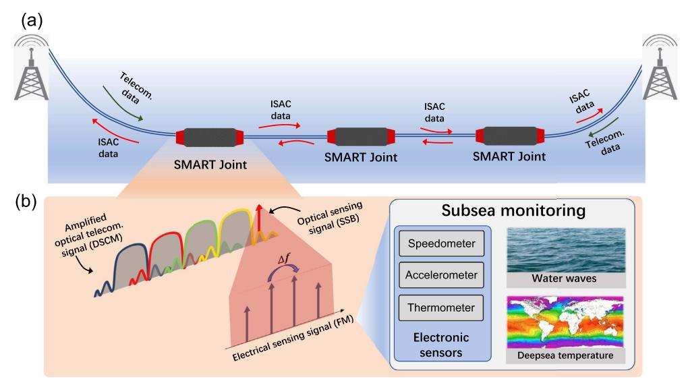
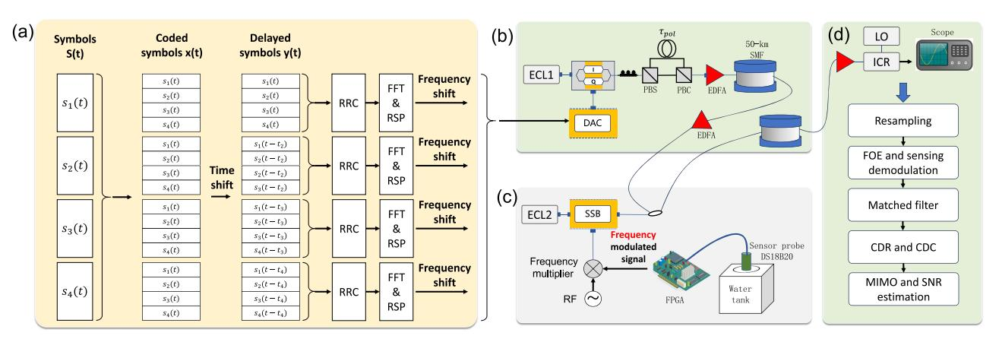
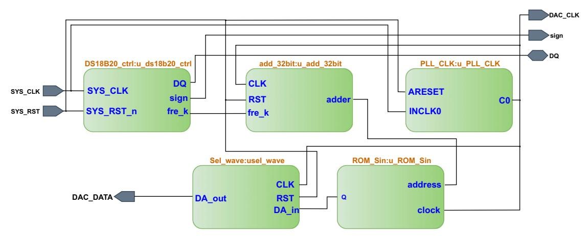
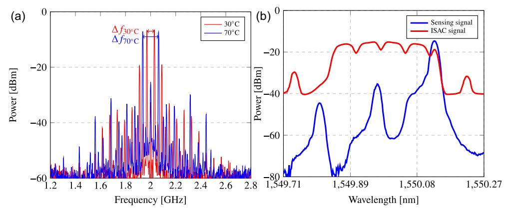
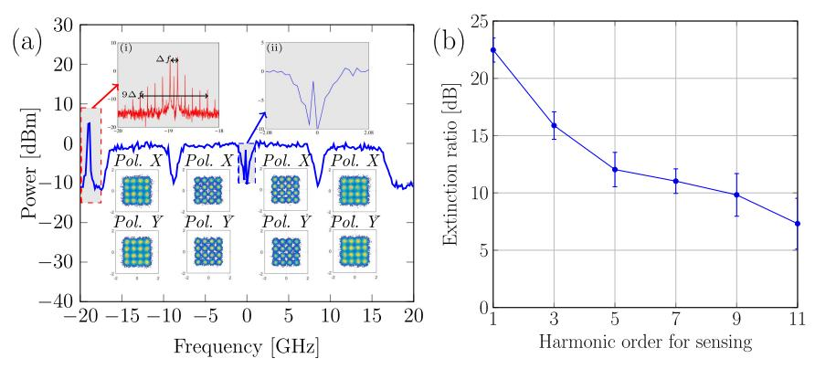
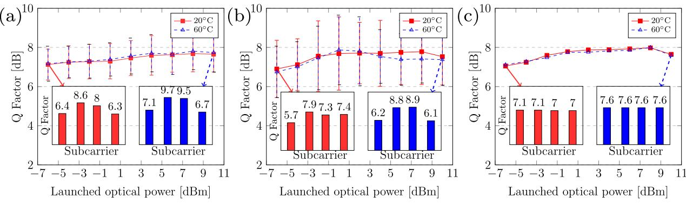
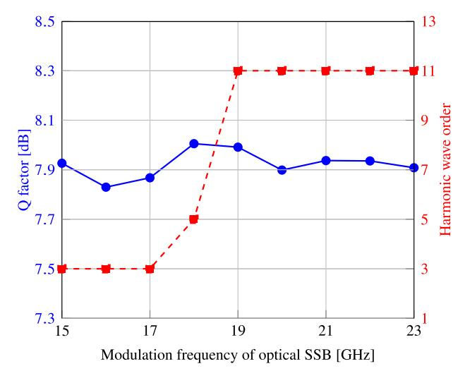
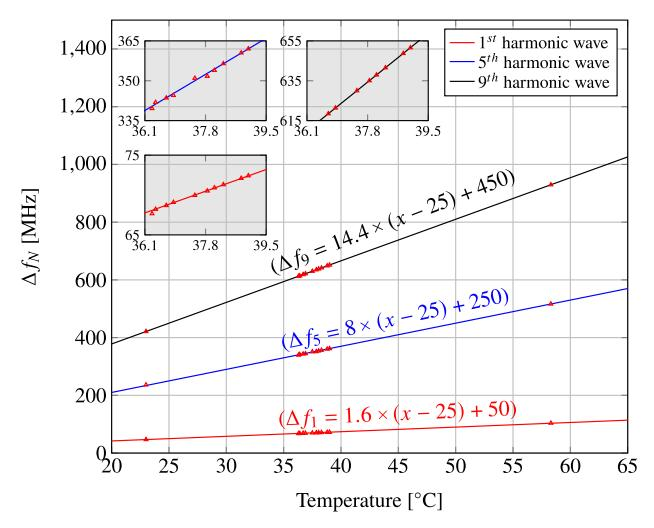
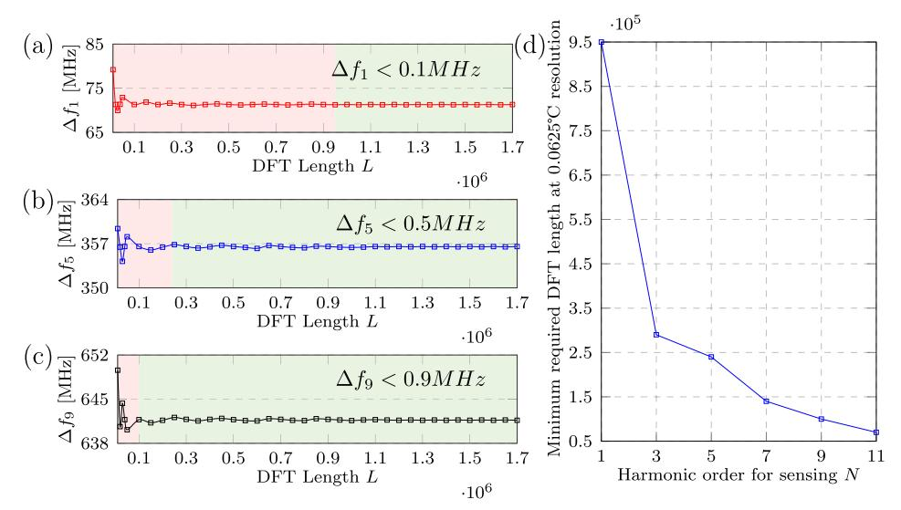
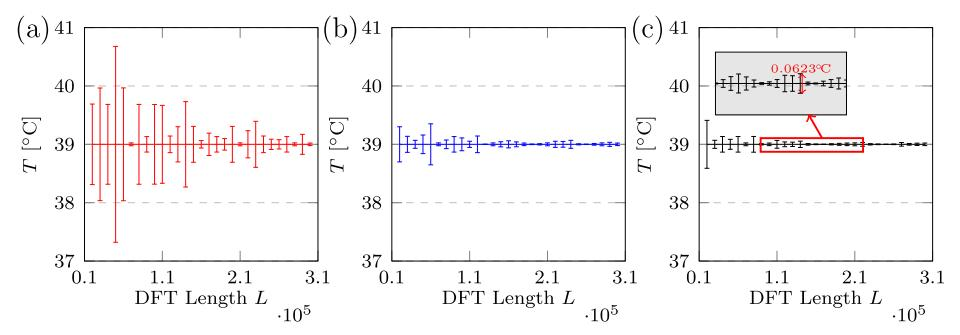

## Advanced SMART network: empowering subsea monitoring with dense photonic integrated sensing and communication

JIAQI CAI, LIN SUN,\* YONGFU WU, WEIYE WANG, YI CAI, GORDON NING LIU, AND GANGXIANG SHEN School of Electronic and Information Engineering, Soochow University, Suzhou 215006, China \*Corresponding author: [linsun@suda.edu.cn](mailto:linsun@suda.edu.cn)

Received 24 March 2025; revised 6 August 2025; accepted 11 August 2025; posted 13 August 2025 (Doc. ID 563034); published 29 October 2025

The scientific monitoring and reliable telecommunications (SMART) initiative, led by a joint task force including ITU, aims to integrate electronic sensors into undersea telecommunications cables for real-time and high-sensitivity subsea monitoring. The current integrated sensing and communication (ISAC) solution to the SMART application still relies on wavelength band multiplexing of sensing information via Ethernet switches, leading to optical communication bandwidth waste. To achieve the dense and low-interference ISAC for SMART network applications, we demonstrate the co-transmissions of coherent optical digital subcarrier modulation (DSCM) communication signals and temperature sensing information in the SMART system. Besides the co-transmission capability, the special design of the sensing transmission format is made to enable the compatible DSP with DSCM communications, which shares the same wavelength channel. Moreover, due to the different physical locations of the in-line sensing joints to the communication transceivers in the SMART system, it is hard to align the wavelength of the communication laser and the sensing one, which cannot ensure the precise allocation of sensing information into the frequency blanks of DSCM communication signals. To deal with these two issues, the sensing information at inline joints is proposed to be modulated in the manner of optical single-sideband (SSB) modulation and frequency modulation (FM), and then the precise allocation into the frequency blanks of DSCM communication signals can be realized, along with the full compatibility to demodulate the sensed temperature using the traditional frequency offset estimation in coherent DSP. Experiments on a two-span repeatered single-mode fiber link validate the integration of 20 GBaud optical DP-QAM16 transmissions and real-time temperature sensing at a sensing joint. Advanced communications are enabled by implementing space-time coding on DSCM communication signals, with 0.2 dB Q factor improvement. As for the sensing functionality, the temperature sensing resolution at 0.0625°C, which reaches the limitation of the employed electronic thermometer DS18B20, has been obtained by using the communication-compatible DSP. We believe the proposed ISAC scheme along with the corresponding DSP flowchart makes sense for monitoring the subsea via the advanced SMART cables. © 2025 Chinese Laser Press

<https://doi.org/10.1364/PRJ.563034>

### 1. INTRODUCTION

Nowadays, vast amounts of international data transmit through fiber-optic telecommunication submarine cables. These cables, forming a massive infrastructure, could serve as a natural resource for subsea monitoring if integrated sensing and communication (ISAC) on submarine cables were feasible. This would greatly enhance our understanding of the marine environment. From the perspective of sensor types, current ISAC demonstrations for submarine applications encompass both optical and electronic sensing methods. The commonly used optical approach involves distributed fiber sensing (DFS), which is based on optical fiber scattering. This method not only senses changes but also identifies their locations simultaneously. For instance, strain sensing over a 2227 km range with a 10 m spatial

resolution has been achieved using wavelength division multiplexing (WDM) of multiple distributed acoustic sensing (DAS) channels [\[1](#page-8-0)]. Beyond the DFS method, feedforward sensing can be realized by analyzing the evolution of the optical field using the same receiver as that used for communication. Theoretically, the optical polarization states from the output of standard coherent telecommunication submarine cables can monitor geophysical events like ocean waves and earthquakes along the cable. Real-time monitoring of polarization states on a 10,000 km field-deployed submarine cable has detected multiple moderate-to-large earthquakes along the cable [[2\]](#page-8-0).

On the other hand, the scientific monitoring and reliable telecommunications (SMART) network, proposed and standardized in 2018 by a joint task force including ITU, is an ISAC configuration for subsea monitoring via telecommunication cables [[3\]](#page-8-0). In the SMART cable, real-time sensing information from electronic sensors in repeaters is modulated and transmitted over the same physical channels as communication data. Despite offering only discrete sensing through multiple sensing joints (unlike DFS's distributed sensing functionality), it excels in high sensitivity and scalability, supporting accelerometers, speed sensors, thermometers, and other electronic sensors [\[4](#page-8-0)].

There are existing advanced multiplexing methods in ISAC systems, but the majorities are based on optical DFS systems. In phase-sensitive optical time-domain reflectometry (ϕ-OTDR) integrated into coherent optical communication systems, WDM [[1,5\]](#page-8-0), frequency division multiplexing (FDM) [[6,7](#page-8-0)], and space division multiplexing (SDM) [\[8](#page-8-0)] schemes have been proposed. These allow simultaneous high-speed data transmission and DFS within shared optical infrastructures. In current optical DFS systems, digital subcarrier modulation (DSCM) has been used to improve spectrum utilization efficiency, by allocating the sensing probe into the frequency blanks of DSCM communication signals [[9,10](#page-8-0)]. However, for SMART configuration supporting high-sensitivity real-time subsea monitoring, the current solution to co-transmissions of sensing information with communication signals still employs Ethernet switches to exchange data from electronic sensors at sensing joints [[3,11](#page-8-0)]. This approach, which uses different wavelength bands for sensing data transmissions, wastes WDM channel resources and reduces the spectral efficiency of optical communications. Consequently, the dense ISAC is also highly required for SMART applications, ensuring high-spectrum efficiency communications.

In this study, we concentrate on the dense and compatible ISAC realizations for the SMART network application, using DSCM of communication signals. Different from the DFSbased ISAC whose sensing probe can be generated by the same transmitter with communication use, there is the main challenge in the SMART configuration to precisely allocate the sensing information into the frequency blanks of communication signals due to the different locations of communication transmitters at shores and the in-line sensing laser sources. In this work, to deal with the issue due to the wavelength misalignment between sensing and communication lasers, joint electrical frequency modulation (FM) and optical single-sideband (SSB) modulation are proposed to flexibly tune the allocated frequency of sensing signals, realizing the dense and low-interference ISAC. This joint electrical and optical modulation could generate frequency subcarriers for describing sensing information precisely within the frequency blank of optical DSCM communication signals. Consequently, sensing information demodulation can be achieved through frequency estimation, a process also required in the frequency offset estimation (FOE) stage of coherent communication DSP. This enables good compatibility for ISAC signal demodulation. Experiments are performed on a two-span single-mode fiber (SMF) link, integrating real-time temperature monitoring into a 20 GBaud DP-QAM16 communication system. The communication performance of DSCM is also advanced with implementing the equalization of space-time coding, providing over 0.2 dB Q factor gain. In addition, using the same coherent receiver for communications, the DS18B20 thermometer-based sensing information at the sensing joint in the fiber link can be monitored, achieving the 0.0625°C temperature resolution. Moreover, using the higher-order harmonic wave up to the 9th one, the decreased discrete Fourier transform (DFT) length, as required to accurately demodulate the FMmodulated sensing information, can be obtained. Such an advantage could increase the monitoring speed by 9 times compared with using the 1st harmonic wave.

### 2. PRINCIPLE OF THE PROPOSED ISAC SCHEME FOR THE ADVANCED SMART NETWORK

The schematic diagram of the proposed advanced SMART network is illustrated in Fig. 1(a). The capability of subsea monitoring can be realized based on the telecommunication

Fig. 1. Schematic diagram of the proposed SMART network.

submarine cable, via a specific design of SMART joints, which includes both optical amplifiers and E/O conversions of sensing information obtained from electronic sensors. As depicted in Fig. 1(b), the transmitted signals at first need to be amplified to compensate for the single-span fiber loss. The communication signals are in the modulation type of DSCM with four individual subcarriers per wavelength. As for the sensing functionality, varieties of electronic sensors can be accommodated in the sensing joint including the speedometer, accelerometer, and thermometer, to realize the real-time monitoring of deep-sea waves and temperature variations. It is noted that the speedometer and accelerometer can be shielded in the sensing joints jacket, while the thermometer probe needs to be exposed directly in water. Then, the monitored digital sensing information is recorded and frequency modulated into electrical sensing signals by a FPGA. Due to the misalignment of the laser wavelength in the sensing joint with the laser at shores, the optical SSB modulation at the sensing joint is used to adaptively allocate the sensing information at the frequency blanks of DSCM signals, and then they are coupled into the optical ISAC signal. Consequently, in the proposed advanced SMART network, all the sensing joints within cables as well as optical transceivers at shores share the real-time monitoring information.

# A. Dense and Compatible ISAC Based on DSCM and Frequency Modulation of Sensing Information

The frequency blank of root raised cosine (RRC) filtering during DSCM could be used to allocate the sensing information correspondingly. For the purpose of narrowly shaping individual subcarriers of DSCM signals, the utilization of the RRC filter lies in its dual capability of strictly confining signal bandwidth while simultaneously suppressing inter-symbol interference (ISI) through controlled inter-symbol overlapping [12]. The impulse response of an RRC filter can be expressed as

$$h(t) = \frac{\sin\left(\frac{\pi t}{D_s}\right)}{\frac{\pi t}{D_s}} \cdot \frac{\cos\left(\frac{\pi \alpha t}{D_s}\right)}{1 - \left(\frac{2\alpha t}{D_s}\right)^2},$$
(1)

where  $D_s$  denotes the symbol duration and  $\alpha \in [0,1]$  represents the roll-off factor that governs the bandwidth occupancy of the filter.

Onto the frequency domain, the magnitude frequency response of the RRC filter is characterized by its piecewise-defined spectral profile with controlled out-of-band attenuation. The normalized frequency response can be mathematically defined as

$$|H(f)| = \begin{cases} 1, & |f| \le \frac{1-\alpha}{2D_i} \\ \sqrt{\frac{1}{2} \left( 1 - \sin\left(\frac{\pi D_i}{\alpha} \left( |f| - \frac{1}{2D_i} \right) \right) \right)}, & \frac{\alpha}{2D_i} < |f| \le \frac{1+\alpha}{2D_i}. \\ 0, & |f| > \frac{1+\alpha}{2D_i}. \end{cases}$$

It indicates that the spectral magnitude of the RRC shaped signal strictly vanishes when  $|f| > \frac{1+\alpha}{2D}$ .

Consequently, we retain the DSCM guard band to accommodate the placement of sensing signals, while ensuring effective

separation from communication signals in optical fibers. We adopt a frequency modulation scheme to convert the digital sensor information to analog mode. The corresponding motivation is to desire a compatible frequency demodulation by DFT, which is also needed for communication DSP, as long as the frequency-sweeping range of frequency-modulated sensing information is in the sampling bandwidth of ISAC signals. To realize the frequency modulation of the digital sensing information, a look-up table (LUT) can be built in a field-programmable gate array (FPGA) to numerically characterize the frequency-temperature dependence in a linear manner, which can be described by

$$f_0(T) = kT + b, (3)$$

where k and b represent the linear coefficients of the LUT, which are arbitrarily programmed by the FPGA. T denotes the sensed temperature value, which is obtained from the sensing probe, and  $f_0(T)$  denotes the modulated frequency by the FPGA-controlled digital-to-analog converter (DAC).

However, due to the unshared clock of communication signals and frequency-modulated sensing signals, which are generated at different physical positions, it is hard to estimate the accurate frequency of frequency-modulated sensing signals. To deal with this issue, we proposed to use the analog mixer with the assistance of an electrical local oscillator (LO) to generate the multiple imaged harmonic waves, whose relative frequency between images strictly equals the integer times of  $\Delta f_0$ , which then enables the precise sensing demodulation. The relative frequency between the Nth images of harmonic waves at the mixer radio frequency (RF) output can be given by

$$\Delta f_N(T) = 2N \cdot f_0(T), \quad N = 1,2,3,...$$
 (4)

The relative frequency  $\Delta f_N(T)$  could be estimated by the DFT process in the FOE stage of coherent communication DSP, as long as the frequency-modulated signals are out-of-band of the communication signals. Moreover, due to the frequency chirp amplification from using the higher-order harmonic waves, the enlarged  $\Delta f_N(T)$  can be estimated with an increased accuracy in the DFT process. To realize it, we employ the optical SSB modulation for the adaptive allocation of FM-modulation sensing information at the frequency blank of DSCM signals. In addition, the employment of optical SSB modulation enables the feasibility of residual-carrier-assisted FOE by allocating the sensing information on the other side of the residual carrier to avoid interference.

For demodulating the frequency-modulated sensing signals using the communication-compatible DSP, the discrete Fourier transform (DFT) process in the FOE stage could be directly used for the frequency estimations on the harmonic components, which describe the sensed temperature. The frequency resolution of DFT can be given by

$$f_{\rm DFT} = \frac{f_s}{I},\tag{5}$$

where  $f_s$  and L represent the sampling rate and the DFT length, respectively. Assuming the temperature resolution of the employed electronic sensor is  $T_{\min}$ , then according to Eq. (4) the corresponding frequency change for the imaged Nth wave is

$$\Delta f_{\min} = 2N \cdot kT_{\min}, \quad N = 1, 2, 3, \dots$$
 (6)

To achieve accurate frequency estimation of DFT with the ability to monitor the minimum temperature change of  $T_{\min}$ ,  $f_{\text{DFT}}$  must be less than  $\Delta f_{\min}$ . Then we can get the required DFT length:

$$L > \frac{f_s}{2N \cdot (kT_{\min})}.$$
 (7)

It indicates that the required DFT length L decreases as the harmonic order N increases, when  $T_{\min}$ ,  $f_s$  are constant. In addition, the higher level of the slope k helps further reduce the DFT length, thus resulting in faster monitoring using the communication-compatible DSP.

### **B.** Improved Communication Performance with Advanced DSP

Due to device bandwidth limitations and the varying signal-tonoise ratio (SNR) conditions at different frequencies, the signal qualities among all subcarriers are imbalanced [13]. Frequencydomain finite impulse response (FIR) filters could be utilized to equalize the imbalance for DSCM [14,15]. In this work, we proposed to use the coded-modulation approach to compensate for the inconsistent performance of subcarriers by implementing the space-time coded DSP. Space-time coding is a commonly used equalization method in wireless communications [16,17] and also is applied to address the polarization-dependent loss (PDL) [18] in the SMF link and mode-dependent loss in the multi-mode fiber (MMF) link [19]. Different from the published works in wireless communications systems and PDL mitigation, the motivation of using space-time coding in this paper is to address the special distortions of DSCM communication signals (inconsistent SNRs of subcarriers) in the proposed ISAC system, by treating the DSCM subcarriers as spatial channels to equalize.

The original symbol sequence vector is presented as  $\mathbf{s} = [s_1, s_2, ..., s_M]^T$ , where M is the subcarrier count. Before RRC filtering during DSCM, the space-time coded symbols can be given by

$$\mathbf{x} = \frac{1}{\sqrt{M}} H_M \mathbf{s},\tag{8}$$

where  $H_M$  is the Hadamard matrix with the order of M [20]. In this work, M is set at 4, which corresponds to the subcarrier

number. The received signals  $x_1$ ,  $x_2$ ,  $x_3$ ,  $x_4$  after transmissions are linear combinations of the original symbol sequence vector and imbalanced noise  $n_1$ ,  $n_2$ ,  $n_3$ ,  $n_4$  for four subcarrier channels:

$$\begin{bmatrix} x_1 \\ x_2 \\ x_3 \\ x_4 \end{bmatrix} = \begin{bmatrix} s_1 + s_2 + s_3 + s_4 + n_1 \\ s_1 - s_2 + s_3 - s_4 + n_2 \\ s_1 - s_2 - s_3 + s_4 + n_3 \\ s_1 - s_2 - s_3 + s_4 + n_4 \end{bmatrix}.$$
 (9)

At the receiver, the four-row signals  $x_1$ ,  $x_2$ ,  $x_3$ ,  $x_4$  for spacetime decoding are obtained after digital subcarrier demodulation. Following DSP-based recovery, these signals are decoded by multiplying them with the inverse Hadamard matrix  $H^{-1}$ :

$$\mathbf{x}_{\text{decode}} = H^{-1} \times \begin{bmatrix} x_1 \\ x_2 \\ x_3 \\ x_4 \end{bmatrix} = \begin{bmatrix} s_1 + \frac{n_1 + n_2 + n_3 + n_4}{4} \\ s_2 + \frac{n_1 + n_2 + n_3 + n_4}{4} \\ s_3 + \frac{n_1 + n_2 + n_3 + n_4}{4} \\ s_4 + \frac{n_1 + n_2 + n_3 + n_4}{4} \end{bmatrix}.$$

Consequently, the equalization of imbalanced noise distributions over individual subcarriers of DSCM can be realized by implementing space-time coded DSCM signaling, as indicated by the right-hand side of Eq. (10). Because both space-time encoding and DSCM signaling are performed in the digital domain, there is no complexity regarding parallel tributary synchronization. As for the space-time coded DSP complexity, the real-valued multiplication number can be used as a metric to evaluate. The space-time encoding at the Tx and decoding at the Rx both involve matrix multiplication between time-slotted symbols and the space-time coded Hadamard matrix. Given the four subcarriers of DSCM in this work, the Hadamard matrix dimension is 4. Thus, for space-time encoding and decoding, the real-valued multiplications per single-polarization complex symbol are  $4 \times 2$  (real and imaginaryparts)  $\times 2$  (Tx and Rx) = 16.

#### 3. EXPERIMENTAL DEMONSTRATION

To verify the proposed ISAC scheme, experimental demonstrations were conducted on two-span SMF transmission link with a sensing joint at the optical in-line amplification position, as

Fig. 2. Experimental setup. (a) Space-time coded DSCM signaling process. RSP, range spectrum processing. (b) Two-span 100 km optical communication link. (c) Implemented sensing joint. (d) Compatible DSP for both communication and sensing functionalities.

shown in Fig. [2](#page-3-0). As previously mentioned, the frequency blanks of DSCM can be used to allocate sensing information, achieving dense ISAC. To balance signal quality across subcarriers, the space-time coded DSCM signaling process is illustrated in Fig. [2](#page-3-0)(a). Four parallel tributaries of 1 SPS (symbol per second) symbols are multiplied with a Hadamard matrix, generating four tributaries of coded symbols xt. These four lanes are then delayed for individual subcarrier modulation, followed by RRC filtering, fast Fourier transform (FFT), upsampling by 4, and frequency shifting. Consequently, the transmitted symbols st spread across all DSCM subcarriers, supporting the balanced performance even with frequency domain distortions.

The physical link emulating the ISAC configuration is depicted in Fig. [2\(](#page-3-0)b). At the transmitter, the light source generated by an external cavity laser (ECL) is modulated by the I/Q modulator at the bandwidth of 40 GHz. A digitalto-analog converter (DAC) is realized by an arbitrary waveform generator (AWG) at an analog bandwidth of 45 GHz generated I and Q signal to drive the two branches of I/Q modulator. Then, a polarization division multiplexing emulator (PDME) is employed to construct the dual-polarization optical signals, which consists of a polarization beam splitter (PBS), a polarization beam combiner (PBC), and a delay fiber with approximately 10 ns delay (τpol) for polarization decorrelation purpose. A pre-amplification is conducted using an erbiumdoped fiber amplifier (EDFA), for boosting the optical power at −26 dBm after PDME. Then a spool of G654.E SMF is used for the first span transmission.

At the repeater with implementing the sensor joint, a thermometer probe is used to monitor the temperature in a water tank, as depicted in Fig. [2\(](#page-3-0)c). The used probe DS18B20 is a digital temperature sensor manufactured by Maxim Integrated, providing the temperature measurements in Celsius with programmable resolution up to 12 bits. We use the higher 8 bits to describe the integer temperature, which corresponds to the maximum range from −55°C to 125°C, and the lower 4 bits are for the decimals resulting in a temperature resolution of 0.0625°C. Then the real-time monitored temperature variation is captured and mapped on the frequency of DAC, which is also driven by the FPGA. The on-board DAC of the FPGA has a bandwidth limitation at 100 MHz; thus, the frequency swept range is designed at the range from 0 to 64 MHz. During

the experiments, the temperature-to-frequency LUT was constructed as single-port read-only memory (ROM) within the FPGA by instantiating the ROM IP core on the Quartus II platform. As illustrated by the synthesized register transfer level (RTL) schematic diagram in Fig. 3, the address of generated ROM depends on the output of the DS18B20 module via constructing an adder module between ROM and DS18B20 modules. Consequently, the frequency value of sinusoidal waves can be linked with the sensed temperature, thus generating frequency-modulated sensing signals. This design features a temperature input range of 0°C to 80°C for the LUT, with a corresponding output frequency range of 0– 64 MHz. The 50 kHz frequency step aligns with the 0.0625°C temperature resolution of the DS18B20 thermometer. To allocate the sensing information into the frequency blank of DSCM, we employ an additional laser source in the sensing joint whose emitting frequency is similar to the communication one. The coarse wavelength alignment is conducted at first by setting communication and sensing lasers both at 1549.97 nm. The fluctuating frequency offset between the communication and sensing lasers is monitored by constructing an interferometer, and then is sent into the remotely controlled RF source, which drives the optical SSB modulator. Due to the Baud rate of DSCM communication being 20 GBaud in this study, the frequency blank area that can be allocated by sensing signals is below but near 20 GHz. With adaptively tuning the RF of optical SSB, the spectral offset impact between the sensing and communication lasers can be mitigated, which enables a low interference between sensing and communication. Moreover, a high level up to a 20 dB carrier suppression ratio is required to mitigate the impact of the optical sensing carrier on the base-band communication performance. Consequently, an analog mixer is used to shift the baseband frequency modulated signals onto RFs. Then the optical 3 dB coupler is used to integrate the sensing information and the amplified communication signals passively. Such an adaptive wavelength allocation of sensing information provides a degree of freedom to realize the dense and low-interference ISAC even if the communication Baud rate changes.

At the receiver, the transmitted optical ISAC signal is received and detected by an integrated coherent receiver (ICR) and recorded by a digital storage oscilloscope (DSO). For

Fig. 3. Synthesized RTL logic schematic for frequency modulation of the sensed temperature.

Fig. 4. Modulation and multiplexing of sensing information: (a) electrical spectrum of the frequency modulated waveform under different temperatures; (b) optical spectrum of the sensing waveform and ISAC waveform.

demodulating the sensing and communication signals, off-line DSP is performed compatibly on the MATLAB platform, including resampling down to 4 SPS, FOE, a matched filter, clock data recovery (CDR), chromatic dispersion compensation (CDC), and multiple-input and multiple-output (MIMO) equalization. Because the sensing information is in the type of frequency modulated signals, the necessary FFT process of the FOE stage for communication DSP can be at the same time used for demodulation of sensing signals. Four segments of the DSCM signal are shifted to base band and truncated according to the transmitter-side waveform configuration, and then the Q factors can be estimated by comparing the transmitted symbols and the demodulated ones.

As shown in Fig. 4(a), the electrical spectrum of frequency modulated signals after analog mixer has a character of the imaged high-order harmonic wave. This phenomenon without the image suppression could introduce two advantages. The first one has no need of a precise frequency alignment between the sensing and communication lasers because the relative frequency between the imaged Nth harmonic waves could precisely exhibit the frequency shift due to the temperature variation only. The second advantage is the frequency chirp amplification via analyzing the higher-order harmonic wave at the demodulation stage, which could provide a more accurate frequency estimation during the DFT process. Figure 4(b) depicts

the optical spectrum of the sensing signal and ISAC signal at the sensing joint. The sensing signal shows a good character of the SSB with carrier suppression over 20 dB. Moreover, as indicated by the individual spectral peak out of the DSCM band for the ISAC signal spectrum in Fig. 4(b), the coarse wavelength alignment between sensing and communication lasers is achieved, which is beneficial to a low interference between sensing and communication. After ISAC, the corresponding optical spectrum exhibits four subcarriers and the sensing carrier out of the communication band.

### 4. RESULTS AND DISCUSSION

Based on the experiment setup in Fig. [2](#page-3-0), we captured and resampled the ISAC signals after two-span 100 km optical transmissions. To investigate the interference between sensing and communication, which requires mitigation at best, we estimate the Q factors of 100 km transmitted 20 GBaud DP-QAM16 signals after digital subcarrier demodulation, under different temperature conditions. The corresponding reconstructed electrical spectrum is given in Fig. 5(a). By resampling the 20 GBaud signals at 2 SPS, it indicates the existence of the frequency blank for DSCM due to the RRC filtering.

As for the ISAC signals, the manipulation of the third phase bias in the optical SSB modulator could help allocate the sens-

Fig. 5. (a) Electrical spectrum of the ISAC signals (insets are constellations of DSCM subcarriers). (b) Extinction ratios of different-order harmonic waves for sensing.

Fig. 6. Q factors of 100 km transmitted DP-QAM16 signals under different launched optical powers: (a) traditional DSCM signaling; (b) using FFE over DSCM; (c) using space-time coding equalization over DSCM.

ing signals at a different side of the residual carrier. By setting the driving frequency of the optical SSB at 20 GHz, the corresponding position can be indicated in inset (i) of Fig. [5](#page-5-0)(a). Although the relative frequency between the sensing laser and communication one is not aligned precisely, the relative frequency between the imaged harmonic waves can be used to refer to the LUT, which describes the relationship between modulated frequency and sensed temperature. The highest order of the harmonic wave can be up to 11 with a minimum extinction ratio (ER) over 5 dB, as indicated by inset (i) of Fig. [5\(](#page-5-0)a). As indicated by the inset in Fig. [5\(](#page-5-0)a), the uneven constellation performance of different subcarriers can be observed due to the inconsistent SNR conditions. As mentioned before, the higher-order harmonic wave could be used to amplify the frequency chirp due to the temperature change, thus resulting in the enhanced frequency estimation accuracy at the DFT stage of DSP. However, the reduced extinction ratios of higher-order harmonic waves may lead to the deteriorated sensing sensitivity. Figure [5\(](#page-5-0)b) denotes the extinction ratios of different-order harmonic waves for sensing. Although the fluctuation of the ER can be observed, positive ER values can be ensured with a harmonic order below 9, which is enough for sensing demodulation via the frequency estimation approach. As for the communication functionality, because the frequency shift operation is required for digital subcarrier demodulation, a precise sequence synchronization at the frequency domain is essential via the FOE DSP based on the optical carrier as depicted in inset (ii) of Fig. [5](#page-5-0)(a). Moreover, the demodulated constellation of DSCM signals with launched optical power (LOP) at 1 dBm is also given below the corresponding subcarrier spectrum. It exhibits a character of the imbalanced signaling performance among all subcarriers, with a higher signaling quality for those subcarriers close to the base band. At the same time, the higher-frequency subcarriers show a worse signaling performance, which can be attributed by the enhanced noise level at the higher frequency for electro-optical devices in optical transceivers.

Q factors against LOP values under different temperature conditions are depicted in Fig. 6. In general, the impact of the additional sensing functionality on the communication performance can be ignored, as indicated by the little difference of Q factors between the cases of 20°C and 60°C. At the same time, the characteristic of Q factor independence from LOP indicates the effective mitigation of fiber nonlinearity via DSCM, even with LOP values up to 11 dBm. On the other hand, the deviation among all subcarriers' Q factors can be seen by the error bar in Fig. 6(a), which is due to the frequency-domain imbalanced performance. As shown in the insets of Fig. 6(a), the Q values of the higher-frequency subcarriers are nearly 2 dB lower than those of the base-band subcarriers. To deal with the issue, we employ the space-time coding to process DSCM signals by treating the individual subcarriers as the space channels for equalization. For comparative investigations, Q factors of DSCM signals processed by the commonly used equalization of feed-forward equalization (FFE) are also illustrated by Fig. 6(b). FFE is implemented before digital subcarrier demodulation to equalize the imperfect frequency response. Improved Q factors can be obtained by FFE over the traditional DSCM signals, as indicated by Figs. 6(a) and 6(b). However, FFE is not able to balance Q factors of all subcarriers as shown in the inset of Fig. 6(b). Q factors against LOPs with the assistance of space-time coding can be indicated by the error bar curves in Fig. 6(c). After using space-time coded DSCM signals, the equalized subcarriers show consistent Q factor performance with overall improvement. Typically, at an LOP of 8 dBm,

Fig. 7. Impact of optical SSB modulation frequency on ISAC performance: Q factors and the maximum visible harmonic wave order.

space-time coding equalization improves the  $\it Q$  factor by 0.2 dB over traditional DSCM signaling.

As previously mentioned, the spectral blanks of the communication signals arise from frequency shifting during DSCM signaling. These blanks allow frequency-modulated sensing signals to be allocated without frequency-domain interference. Given the different physical positions of the laser sources for sensing and communication, perfect wavelength alignment is unattainable. Thus, adaptively tuning the RF of optical SSB modulation is essential. This ensures communication and sensing signals are separated in the frequency domain. Figure 7 shows the impact of the RF in optical SSB modulation on ISAC performance, including communication Q factors and the maximum visible harmonic wave order. From a communication perspective, Q performance shows good robustness to optical SSB modulation frequency drift. This is because the

**Fig. 8.** Measured frequency difference  $\Delta f$  between the different-order imaged harmonic waves at the mixer RF output with frequency-modulated sensing information.

limited interference from frequency-modulated subcarriers has minimal impact. For the sensing function, if frequency-modulated sensing signals are misallocated into the DSCM subcarrier band, the maximum visible harmonic wave order drops to 3.

To investigate the demodulation performance of sensing information, we at first measure the frequency difference between the imaged harmonic waves at the mixer RF output, which multiplies the frequency-modulated sensing information and the electrical LO. The measured results with the fitting lines at different temperature conditions are plotted in Fig. 8. The fitting lines are implemented through the LUT of the FPGA. The temperature sensor used in this system features a resolution of 0.0625°C with an associated frequency range of 50 kHz. Based on this relationship, the scaling factor k in Eq. (6) is determined to be 800 kHz/°C. Temperature values in the horizontal coordinate are calibrated by the embedded thermometer of the water tank, and the small range from 36.3°C to 39°C is referred from the mercury thermometer, which is indicated in the insets of Fig. 8. In general, the measured frequency difference between the imaged harmonic waves is linearly proportional to temperature change. Limited by the DAC bandwidth on the FPGA board, the frequency sweeping range of DAC is up to 64 MHz. As for the higher-order ones, the frequency range can be magnified over 2 GHz via using the 9th harmonic wave, which can be estimated by the improved accuracy. The fitting linear equations for the 1st, 5th, and 9th are given above the corresponding lines. Because the employed temperature sensors have a resolution  $T_{\min}$  at 0.0625°C, according to Eq. (6), the corresponding minimum frequency changes due to temperature deviation are 0.1 MHz, 0.5 MHz, and 0.9 MHz for the 1st, 5th, and 9th, respectively.

As mentioned by Eq. (7), the demodulation resolution of temperature by using the communication-compatible DSP depends on the DFT resolution  $f_{\rm DFT}$  and sampling rate  $f_s$ . With fixing the DFT sampling rate  $f_s$  at four samples per symbol, the longer DFT length L results in an increased DFT resolution; then the improved sensing accuracy, however, leads to a slowing down of

**Fig. 9.** Measured relative frequency  $\Delta f_N$  against DFT length L using different orders of harmonic waves generated by sensing information for (a) 1st, (b) 5th, and (c) 9th. (d) Minimum required DFT length to achieve the saturated sensing performance using different harmonic orders.

Fig. 10. Error bars of the sensed temperature at different DFT lengths, by analyzing different-order harmonic waves: (a) 1st, (b) 5th, and (c) 9th.

the demodulation process. As depicted in Figs. [9](#page-7-0)(a)–[9\(](#page-7-0)c), according to the temperature resolution of DS18B20 sensor at 0.0625°C, which corresponds to 0.1 MHz frequency deviation, the minimum DFT lengths L to ensure the sufficient DFT resolution f DFT are 950,000, 240,000, and 100,000 samples, using the 1st, 5th, and 9th harmonic waves, respectively. Consequently, the frequency measurement accuracy is fundamentally limited by the frequency resolution of the DFT. While longer DFT lengths improve frequency resolution, they simultaneously increase computational complexity. To enhance temperature demodulation accuracy with a fast processing speed without compromising frequency resolution, we employ higher-order harmonics for the frequency estimation. As illustrated in Fig. [9\(](#page-7-0)d), the minimum required DFT length to achieve the saturated sensing performance varies significantly with harmonic order: achieving equivalent frequency precision demands a DFT length approximately 9 times longer for the fundamental (1st order) harmonic compared to the 9th order harmonic.

According to the FPGA-programmed temperature-to-frequency LUT implemented at the sensing joint, the error bar curves of temperature estimation are given in Fig. 10. In general, a more accurate temperature sensing can be obtained with using a longer length of DFT during DSP at the receiver, approaching the 0.0625°C resolution limit of the DS18B20 thermometer. Using the higher-order harmonic waves for sensing signal demodulation, a reduced error of the sensed temperature can be obtained as depicted in the Figs. 10(b) and 10(c). Moreover, as indicated by Fig. 10(c), the deviation of the sensed temperature fluctuates within the range at 0.0625°C, proving the feasibility of achieving the employed thermometer's performance limitations at the sensing joint.

### 5. CONCLUSION

In this study, we propose an advanced ISAC scheme for the SMART network applications, with ultra-dense multiplexing of communication and sensing with low interference. Based on that, the perfect compatibility is also exhibited using communication-compatible DSP to process the sensing information. Moreover, the assistance of the advanced DSPs including the space-time coding and frequency estimation on the higher-order harmonic waves further improves the signaling performance of the ISAC system, realizing 20 GBaud DP-QAM16 100-km transmissions along with the real-time temperature sensing with resolution at 0.0625°C.

Funding. National Natural Science Foundation of China (62475178); Yangtze River Delta Region Integration Project (2024CSJGG2600).

Disclosures. The authors declare no conflicts of interest.

Data Availability. Data underlying the results presented in this paper are not publicly available at this time but may be obtained from the authors upon reasonable request.

### REFERENCES

- 1. E. Rønnekleiv, T. Sørgård, D. Klimentov, et al., "Range-scalable distributed acoustic sensing with EDFA repeaters demonstrated over 2227 km," Opt. Lett. 50, 25–[28 \(2025\)](https://doi.org/10.1364/OL.542267).
- 2. A. Mecozzi, M. Cantono, J. C. Castellanos, et al., "Polarization sensing using submarine optical cables," [Optica](https://doi.org/10.1364/OPTICA.424307) 8, 788–795 [\(2021\).](https://doi.org/10.1364/OPTICA.424307)
- 3. S. Lentz and B. Howe, "Scientific monitoring and reliable telecommunications (SMART) cable systems: integration of sensors into telecommunications repeaters," in OCEANS—MTS/IEEE Kobe Techno-Oceans (OTO) (2018), pp. 1–7.
- 4. B. M. Howe, M. Angove, J. Aucan, et al., "SMART subsea cables for observing the earth and ocean, mitigating environmental hazards, and supporting the blue economy," [Front. Earth Sci.](https://doi.org/10.3389/feart.2021.775544) 9, [775544 \(2022\)](https://doi.org/10.3389/feart.2021.775544).
- 5. J.-T. Li, B. Chang, J.-T. Du, et al., "Coherently parallel fiber-optic distributed acoustic sensing using dual Kerr soliton microcombs," [Sci.](https://doi.org/10.1126/sciadv.adf8666)
- Adv. 10[, eadf8666 \(2024\)](https://doi.org/10.1126/sciadv.adf8666). 6. E. Ip, Y.-K. Huang, M.-F. Huang, et al., "DAS over 1,007-km hybrid link with 10-Tb/s DP-16QAM co-propagation using frequency-diverse
- chirped pulses," [J. Lightwave Technol.](https://doi.org/10.1109/JLT.2022.3219369) 41, 1077–1086 (2023). 7. Y. Wakisaka, H. Takahashi, D. Iida, et al., "Broad-bandwidth and accurate optical vibration sensing by using FDM Φ-OTDR with linear regression analysis of multi-frequency phase responses," [Opt.](https://doi.org/10.1364/OE.491920) Express 31, 27990–[28009 \(2023\).](https://doi.org/10.1364/OE.491920)
- 8. Z. Zhao, Y. Dang, M. Tang, et al., "Enabling simultaneous DAS and DTS through space-division multiplexing based on multicore fiber," [J. Lightwave Technol.](https://doi.org/10.1109/JLT.2018.2878559) 36, 5707–5713 (2018).
- 9. Z. Hu, M. Zhang, Y. Li, et al., "Enabling endogenous distributed acoustic sensing in a digital subcarrier coherent transmission system," [Opt.](https://doi.org/10.1364/OL.524132) Lett. 49, 3166–[3169 \(2024\).](https://doi.org/10.1364/OL.524132)
- 10. Z. Hu, Y. Chen, H. Jiang, et al., "Enabling cost-effective high-performance vibration sensing in digital subcarrier multiplexing systems," Opt. Express 31, 32114–[32125 \(2023\).](https://doi.org/10.1364/OE.497616)
- 11. B. M. Howe, B. K. Arbic, J. Aucan, et al., "SMART cables for observing the global ocean: science and implementation," [Front. Mar. Sci.](https://doi.org/10.3389/fmars.2019.00424) 6, 424 [\(2019\)](https://doi.org/10.3389/fmars.2019.00424).
- 12. M. Qiu, Q. Zhuge, M. Chagnon, et al., "Digital subcarrier multiplexing for fiber nonlinearity mitigation in coherent optical communication systems," Opt. Express 22, 18770–[18777 \(2014\).](https://doi.org/10.1364/OE.22.018770)

- 13. H. Sun, M. Torbatian, M. Karimi, et al., "800G DSP ASIC design using probabilistic shaping and digital sub-carrier multiplexing," [J. Lightwave](https://doi.org/10.1109/JLT.2020.2996188) Technol. 38, 4744–[4756 \(2020\)](https://doi.org/10.1109/JLT.2020.2996188).
- 14. Z. Fan, J. Luo, B. Zheng, et al., "Subband processing for OQAM digital-subcarrier-multiplexing optical coherent systems," [J. Lightwave](https://doi.org/10.1109/JLT.2025.3531386) Technol. 43, 4218–[4232 \(2025\)](https://doi.org/10.1109/JLT.2025.3531386).
- 15. H. Lin, T. Jin, J. Zhang, et al., "Paired-subcarrier equalization for phase noise and transmitter IQ skew in digital subcarrier multiplexing system," Opt. Express 31, 41178–[41190 \(2023\)](https://doi.org/10.1364/OE.503444).
- 16. Y. Liu, L. Xiang, L.-L. Yang, et al., "Space-time coded generalized spatial modulation for sparse code division multiple access," [IEEE](https://doi.org/10.1109/TWC.2021.3067376) [Trans. Wirel. Commun.](https://doi.org/10.1109/TWC.2021.3067376) 20, 5359–5372 (2021).
- 17. L. Xiao, D. Chen, I. Hemadeh, et al., "Generalized space time block coded spatial modulation for open-loop massive MIMO downlink

- communication systems," [IEEE Trans. Commun.](https://doi.org/10.1109/TCOMM.2020.3012464) 68, 6858–6871 [\(2020\)](https://doi.org/10.1109/TCOMM.2020.3012464).
- 18. E. Meron, A. Andrusier, M. Feder, et al., "Use of space-time coding in coherent polarization-multiplexed systems suffering from polarizationdependent loss," Opt. Lett. 35, 3547–[3549 \(2010\).](https://doi.org/10.1364/OL.35.003547)
- 19. E.-M. Amhoud, G. R.-B. Othman, L. Bigot, et al., "Experimental demonstration of space-time coding for MDL mitigation in few-mode fiber transmission systems," in European Conference on Optical Communication (ECOC) (2017), pp. 1–3.
- 20. K. Shibahara, T. Mizuno, H. Takara, et al., "Space-time codingassisted transmission for mitigation of MDL impact on mode-division multiplexed signals," in Optical Fiber Communications Conference and Exhibition (OFC) (2016), pp. 1–3.