# Photonics-Assisted Millimeter-Wave Integrated Sensing and Communication Based on OTFS

Yanyi Wang , Shufan Di , Dongju Du , Yingxiong Song , Qianwu Zhang , Junjie Zhang , Mingxu Wang , and Jianjun Yu , Fellow, IEEE, Fellow, Optica

Abstract—In the future 6G networks, the integrated sensing and communication (ISAC) technologies in the millimeter-wave (mmWave) band will foster innovation across multiple emerging fields, bringing substantial improvements to society. To address the limitations of ISAC systems based on conventional electronic methods in the mmWave band, the photonics-assisted scheme has been developed, offering advantages such as wide operating bandwidth and immunity to electromagnetic interference. However, in increasing non-line-of-sight (NLOS) propagation scenarios, the prevalent multipath effects significantly degrade the performance of photonics-assisted mmWave ISAC systems. In this paper, we propose a novel photonics-assisted mmWave ISAC system employing the orthogonal time frequency space (OTFS) modulation. The system employs OTFS modulation to map data to the delay-Doppler (DD) domain, enhancing the communication performance in NLOS scenarios. Experimental results demonstrate a 15.71 Gbit/s net data rate and 3 cm range resolution over 1 m wireless link. Furthermore, the proposed OTFS-based ISAC system demonstrates promising potential for NLOS scenarios by improving communication performance while maintaining high sensing resolution.

Index Terms—Integrated sensing and communication, mmWave, orthogonal time frequency space, photonics-assisted.

## I. INTRODUCTION

ITH the continuous evolution of information technology, future sixth-generation (6G) networks are projected to achieve significant breakthroughs in three critical factors: improved spectrum efficiency, ultra-high-speed data transmission, and precise environmental sensing [1]. To realize these challenging goals, the millimeter-wave (mmWave) integrated sensing and communication (ISAC) systems have emerged as a pivotal research focus, offering promising solutions for more

Received 27 June 2025; revised 22 August 2025; accepted 17 September 2025. Date of publication 23 September 2025; date of current version 2 December 2025. This work was supported in part by the National Natural Science Foundation of China under Grant 62401353 and Grant U24B20142 and in part by the Open Fund of State Key Laboratory of Photonics and Communications, Shanghai Jiao Tong University, China. (Corresponding authors: Yanyi Wang; Dongju Du.)

Yanyi Wang, Shufan Di, Dongju Du, Yingxiong Song, Qianwu Zhang, and Junjie Zhang are with the Key Laboratory of Specialty Fiber Optics and Optical Access Networks, Shanghai University, Shanghai 200444, China (e-mail: yanyiwang@shu.edu.cn; dishufan@shu.edu.cn; dongju@shu.edu.cn; herosf@shu.edu.cn; zhangqianwu@shu.edu.cn; zjj@staff.shu.edu.cn).

Mingxu Wang and Jianjun Yu are with the Key Laboratory for Information Science of Electromagnetic Waves (MoE), Fudan University, Shanghai 200433, China (e-mail: 21110720068@m.fudan.edu.cn; jianjun@fudan.edu.cn).

Color versions of one or more figures in this article are available at https://doi.org/10.1109/JLT.2025.3613544.

Digital Object Identifier 10.1109/JLT.2025.3613544

scenarios [2]. In frontier fields such as the Internet of Things [3], autonomous driving [4], and unmanned aerial vehicles [5], mmWave ISAC systems are capable of dynamically adjusting beamforming and resource allocation by leveraging the high-resolution sensing of obstacle/user distributions, thereby meeting the demand for low-latency communication and enhancing network coverage capabilities. However, the application of mmWave-ISAC in conventional electrical domain is severely hindered by electric-related bottlenecks, including limited operating bandwidth, poor tunability, and susceptibility to electromagnetic interference. Overall, electronics-based mmWave ISAC systems face significant challenges in future development [6].

In contrast, photonics-assisted mmWave ISAC systems feature large operating bandwidth, low frequency-dependent loss, and strong resistance to electromagnetic interference, making it capable of surpassing the limitations of traditional electronic systems [7], [8], [9], [10], [11], [12]. Over the past few years, photonics-assisted ISAC mmWave systems have undergone rapid evolution [13], [14], [15], [16], [17], [18], [19], [20], [21], [22]. Owing to its superior spectral efficiency and seamless compatibility with mainstream communication architectures, orthogonal frequency division multiplexing (OFDM) schemes have been extensively implemented in current ISAC systems. In [13], the author presents a photonics-assisted ISAC system utilizing OFDM-based modulated-symbol domain matched filtering, achieving remarkable performance with 4.56 Gbit/s data rate, 1.88 cm range resolution and millimeter-level ranging accuracy. To reduce the sensitivity to carrier frequency offset (CFO) and phase noise, the self-coherent technique is introduced into OFDM, enabling a communication data rate of 16 Gbit/s and 4.8 cm range resolution [14]. Moreover, an ISAC scheme employing frequency-domain filtering is demonstrated to decrease the sidelobe interference to OFDM signals, achieving a 47.06 Gbit/s communication data rate while enabling a 0.96 range resolution cm [15]. Particularly, an OFDM-based nonorthogonal multiple access (NOMA) scheme integrated with linearly frequency modulated (LFM) signals in [16] achieved multi-user communication and multi-target detection. After 0.8m transmission, the system demonstrated a distance estimation error of 1.2 cm and BER of  $8.5 \times 10^{-4}$ , while achieving a total throughput of 3.125 Gb/s for two users. Due to the large time-bandwidth product and excellent Doppler tolerance, the LFM signal can be selected as an effective alternative to OFDM. In [17], a compact photonic ISAC approach enables the

0733-8724 © 2025 IEEE. All rights reserved, including rights for text and data mining, and training of artificial intelligence and similar technologies. Personal use is permitted, but republication/redistribution requires IEEE permission. See https://www.ieee.org/publications/rights/index.html for more information.

generation of frequency-agile LFM signal with 0.15 m range resolution while maintaining a 4 Mbps data rate. Subsequently, the dual-LFM preamble-free synchronization scheme is designed and dramatically improved both spectral efficiency (20 Gbit/s) and power consumption (<0.5% overhead) [18]. Besides, the hybrid approach combining LFM and constantenvelope (CE) OFDM has proven particularly effective, simultaneously addressing peak-to-average power ratio (PAPR) reduction and range resolution of 1.5 cm with an 8 Gbit/s data rate [19]. Moreover, through the employment of the artificial neural network (ANN), the work in [20] enhanced the receiver sensitivity and normalized generalized mutual information (NGMI) of GS-16QAM OFDM-LFM joint communication-radar signals after 0.8 m wireless transmission, while achieving centimeterlevel multi-target ranging. Furthermore, the extension to terahertz (THz) band enables new possibilities for ISAC systems with superior performance. The time-frequency dual-functional waveform realizes an 18.448 Gbit/s communication data rate and a 7.5 cm range resolution [21], while the latest timefrequency architecture demonstrates that the range resolution can be enhanced to 8 mm, and the data rate can be increased to 88 Gbit/s [22].

However, the mmWave OFDM ISAC systems mentioned above inherently suffer from multipath interference (MPI) in the following scenarios: multipath propagation in non-line-of-sight (NLOS) wireless links and optical reflections at discrete points in the optical link, leading to performance degradation in mmWave OFDM ISAC systems.

To address the issues aforementioned, an advanced modulation technique has been developed, which is called orthogonal time frequency space (OTFS) [23]. In OTFS systems, data symbols are multiplexed using 2D orthogonal basis functions in the delay-Doppler (DD) domain, contrasting with conventional time-frequency (TF) domain [24]. In the TF domain, multipath and Doppler effects result in deep fades and dense channel properties, making recovery susceptible to noise, whereas in the DD domain, the channel is transformed into sparse model with energy concentrated around specific delays and Doppler shifts, ensuring robust performance in liner time-varying channels [25]. Furthermore, OTFS modulation demonstrates several superiorities compared to conventional OFDM techniques. Firstly, the number of subcarriers and symbols in multicarrier modulation is given as M and N, then the OFDM exhibits a complexity of  $O(MN \log M)$  to map the symbol matrix to the transmitted vector, while OTFS scheme's time complexity is  $O(MN \log N)$ . In most cases M > N is satisfied, thus OTFS's modulation complexity is lower than that of OFDM. Secondly, the OTFS signal demonstrates a lower PAPR than OFDM, providing significant advantages in millimeter-wave wireless communications with high-power amplifiers [26]. Thirdly, OTFS systems only require guard intervals between adjacent frames, unlike OFDM which inserts them between every two time slots, leading to better frame space efficiency. It is noteworthy that in radar implementations, the transmission duration can be shortened using OTFS compared with OFDM, allowing longer ranging capability and higher target-tracking rate [27]. Besides, the inherent connection between DD domain parameters and sensing applications enables the delay and Doppler frequency in the DD domain to be directly converted into the range and velocity of sensing targets [28]. Moreover, unlike OFDM-based radar, OTFS radar systems are capable of avoiding from severe inter-carrier interference (ICI) resulting from the orthogonality degradation among subcarriers, enabling the measurement of the larger Doppler frequency for target velocity detection [29]. Therefore, we can conclude that the OTFS can be a superior choice than conventional OFDM in ISAC systems.

Although previous work has been conducted on photonics-aided OTFS communication systems [30], there is still a lack of research on ISAC using OTFS waveform based on photonics. In this paper, a photonics-assisted ISAC system employing OTFS modulation is proposed and demonstrated in the experiment. The experiment successfully demonstrates the communication and sensing functionalities of OTFS waveform carried with 16-QAM signal over a transmission distance of 1m, exhibiting a net data rate of 15.71 Gbit/s and a 3 cm range resolution. From our investigation, this work presents the first realization of the photonics-assisted ISAC based on OTFS.

#### II. PRINCIPLE

At the beginning of the section, we introduce the fundamental concepts of OTFS and then elaborate on the modulation procedure from symbol mapping to waveform generation. Next, we detail the signal processing workflows, including OTFS demodulation at both the communication and radar receivers. Then, we investigate the trade-off between communication and radar performance within the ISAC framework. Finally, we introduce the photonics-assisted OTFS-ISAC system for further experimental validation.

Fig. 1 illustrates the generation scheme of OTFS waveform. The core of OTFS modulation is to transmit the data symbols by placing them on a DD grid. Given the bandwidth  $B=M\Delta f$  and the duration  $T_d=NT$  of the transmitted signal, where M and N represent the number of subcarriers and symbols, while  $\Delta f$  and T denote the subcarrier interval and time slot duration, respectively. To achieve optimal orthogonal allocation of time-frequency resources in OTFS, the relationship between T and  $\Delta f$  satisfies:  $T \cdot \Delta f = 1$ . A DD grid composed of  $M \times N$  bins can be described as

$$\Gamma = \left\{ \left( \frac{k}{NT}, \frac{l}{M\Delta f} \right), k = 0, \dots, N-1, l = 0, \dots, M-1 \right\},\$$

where  $\frac{1}{M\Delta f}$  and  $\frac{1}{NT}$  are quantization steps for the delay and Doppler axes, also can be regarded as delay resolution and Doppler resolution.

At the transmitter, the initial stage of the OTFS modulation is to map the bitstream PRBS Tx into MN data symbols following the Q-ary quadrature amplitude modulation (QAM) alphabet  $\Theta$ . These data symbols denoted as  $x_{dd}[k,l]$  are placed in an M-row by N-column format on the DD grid. Since all symbols in the OTFS system are subjected to virtually identical channel effects, a single pilot symbol can be inserted on the DD grid to reflex the channel effects for all data symbols. On the receiver, the DD domain channel estimation can be achieved by analyzing

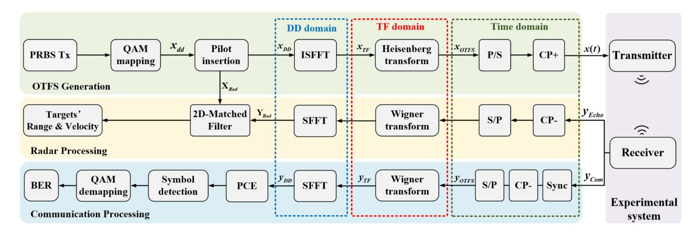

Fig. 1. Generation scheme of OTFS waveform and the flow of radar/communication signal processing.

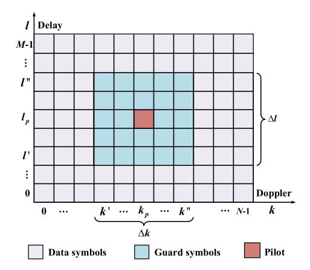

Fig. 2. The arrangement of pilot and data symbols in the DD domain.

the induced delay and Doppler shifts from the received pilot as Ref. [31]. The arrangement of pilot and data symbols in the DD domain is illustrated in Fig. 2. To avoid interference between pilot and data symbols, a total of  $\Delta l \cdot \Delta k$  zero-padding guard symbols spanning [l', l''] over the delay axis and [k', k''] over the Doppler axis are inserted around the pilot.

The obtained symbols in the DD domain can be expressed as

$$x_{DD}[k,l] =$$

Subsequently, the inverse symplectic finite Fourier transform (ISFFT) operation converts the DD domain symbols  $x_{DD}[k,l]$  into their TF representation, which can be written as

$$x_{TF}[n,m] = \frac{1}{\sqrt{MN}} \sum_{k=0}^{N-1} \sum_{l=0}^{M-1} x_{DD}[k,l] e^{j2\pi(\frac{nk}{N} - \frac{ml}{M})}.$$
 (3)

The ISFFT is essentially a two-dimensional transformation that can be split into an M/N-point FFT over the delay/ Doppler axis to symbols in the DD domain. After ISFFT, the obtained TF signal will be converted to time domain with the transmit pulse shaping filtering waveform  $U_{tx}(t)$  (a rectangular pulse

waveform is used in this paper), as follows

$$x_{OTFS}(t) = \sum_{n=0}^{N-1} \sum_{m=0}^{M-1} X_{TF}[n, m] U_{tx}(t - nT) e^{j2\pi m\Delta f(t - nT)}.$$
(4)

The operation called the Heisenberg transform is the extension of OFDM, facilitating the conversion of TF domain symbols into the time domain. Following the parallel-to-serial (P/S) conversion, the insertion of cyclic prefix (CP) will be performed to the beginning of the vectorized time-domain signal for inter-symbol interference reduction. Then, the continuous-time signal x(t) is transmitted to wireless link after up conversion. The detailed digital signal processing (DSP) to the received signal is comprised of two parts—communication and radar processing.

### A. Communication Receiver Processing

In the communication receiver, the received signal  $y_{Com}(t)$  undergoes synchronization, cyclic prefix (CP) removal, and serial-to-parallel (S/P) conversion, generating the time-domain signal  $y_{OTFS}(t)$ . Then the OTFS demodulation is performed to  $y_{OTFS}(t)$ , which consists of two steps. Firstly, the time domain signal is transformed back to the TF domain through the Wigner transform, formulated as

$$y_{TF}[n,m] = \int U_{rx}^*(t-nT)y_{OTFS}(t)e^{-j2\pi m\Delta f(t-nT)}dt,$$
(5)

where  $U_{rx}(t)$  is receive pulse shaping filtering waveform and is identical to  $U_{tx}(t)$ , and  $U_{rx}^*$  is conjugated to  $U_{rx}(t)$ . Afterwards, the symplectic finite Fourier transform (SFFT) is applied to TF domain signal  $Y_{TF}[m, n]$ , and we can obtain the DD domain symbol  $y_{DD}[k, l]$ , which can be formulated as

$$y_{DD}[k,l] = \frac{1}{\sqrt{MN}} \sum_{n=0}^{N-1} \sum_{m=0}^{M-1} Y_{TF}[n,m] e^{-j2\pi(\frac{nk}{N} - \frac{ml}{M})}.$$
 (6)

Clearly, the Wigner transform and SFFT are inverse counterparts of the Heisenberg transform and ISFFT in the modulation process

Subsequently, the QAM signals are recovered through pilotaided channel estimation (PCE) and message passing (MP) data detection, and the communication performance of OTFS signals will be evaluated through bit error rate (BER) testing.

### B. Rada Receiver Processing

In the radar receiver, the received echo signal  $y_{Echo}(t)$  undergoes CP removal, S/P conversion and OTFS demodulation involving the Wigner transform and SFFT, the received radar information matrix  $M \times N$   $\mathbf{Y_{rad}}$ can be obtained. We assume  $\mathbf{X_{rad}}$  represents the matrix form of transmitted signal  $x_{DD}[k,l]$  mentioned above, then the relation between the radar transmitted and echo signals can be expressed as

$$\mathbf{y_{rad}} = \mathbf{H}\mathbf{x_{rad}} + \boldsymbol{\varphi},\tag{7}$$

where  $\mathbf{H} \in \mathbb{C}^{MN \times MN}$  is the information matrix of the target and  $\mathbf{y_{rad}}, \mathbf{x_{rad}} \in \mathbb{C}^{MN \times 1}$  represent the column-vectorized forms of matrices  $\mathbf{Y_{rad}}$  and  $\mathbf{X_{rad}}$ , while  $\boldsymbol{\varphi} \in \mathbb{C}^{MN \times 1}$  denotes the Gaussian noise vector. Meanwhile, (7) can be rewritten in an alternative form as

$$\mathbf{y_{rad}} = \mathbf{Z}\mathbf{h_0} + \boldsymbol{\varphi},\tag{8}$$

where  $\mathbf{Z} \in \mathbb{C}^{MN \times MN}$ ,  $\mathbf{h_0} \in \mathbb{C}^{MN \times 1}$  is the information vector of target detection, and the (i,j)-th entry of matrix  $\mathbf{Z}$ can be computed from the elements of  $\mathbf{X_{rad}}$  as, (9) shown at the bottom of this page, where  $0 \le i = k_1 + Nl_1 \le MN - 1, 0 \le j = k_2 + Nl_2 \le MN - 1$ , and the notation  $\mathbf{I}_{M/N}$  represents the modulo M/N operation. Subsequently, the estimate of  $\mathbf{h_0}$  in (7) can be calculated using 2D-matched filter (MF) algorithm in Ref. [27] as

$$\mathbf{h_0} = \mathbf{Z}^H \mathbf{y_{rad}},\tag{10}$$

where  $\mathbf{Z}^H$  is the Hermitian transpose of  $\mathbf{Z}$ .

Afterwards, the target information vector  $\mathbf{h_0}$  is reshaped into an  $M \times N$  matrix  $\mathbf{h_1}$  according to the format of  $\mathbf{X_{rad}}$ . By identifying the positions of elements in the  $\mathbf{h_1}$  with magnitudes substantially exceeding the noise gate in the DD plane, the delay tap  $l_i$  and Doppler tap  $k_i$  of the i-th target can be obtained. For better illustration, we present a simulation case with five radar targets and visualize the matrix  $\mathbf{h_1}$  in Fig. 3 as an example. In the example, we transmit OTFS signals carrying 16-QAM symbols and set both M and N to be 64. As shown in the Fig. 3, both delay and Doppler taps can be extracted separately for each target. Consequently, the range R and velocity V of the i-th target can be calculated by

$$\frac{\tau_i}{2} = \frac{R}{c_0}, \frac{\nu_i}{2} = f_c \frac{V}{c_0},\tag{11}$$

in which

$$\tau_i = \frac{l_i}{M\Delta f}, \nu_i = \frac{k_i}{NT},$$

where  $f_c$  denotes the carrier frequency,  $c_0$  is the light speed,  $\tau_i$  refers to the delay of round-trip propagation between the

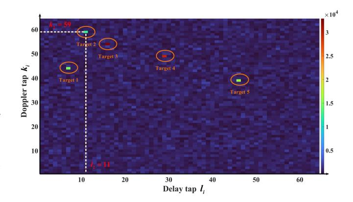

Fig. 3. Visualized radar's channel response matrix  $h_1$ .

transmitter and the *i*-th target, and  $\nu_i$  is the Doppler shift of the *i*-th target.

# C. Performance Trade-Off Between OTFS Communication and Radar

Considering that the signal bandwidth is typically fixed in practical experiments, we focus on discussing the performance trade-off between communication and radar under the constraint of a fixed bandwidth in this paper.

At the transmitter, since the transmitted symbols are drawn from an alphabet  $\Theta$ , they are mutually independent and identically distributed (i.i.d.) characterized by zero mean and a variance of  $\sigma^2 = E\{|x_{DD}[k,l]|^2\}$ . According to Ref. [26], when the transmit pulse shaping filter employs a rectangular waveform in the paper, the upper bound on the PAPR of the transmitted signal can be expressed as

$$PAPR_{max} = \frac{N \max_{x_{DD}[k,l] \in \Theta} |x_{DD}[k,l]|^2}{\sigma^2}, \quad (12)$$

where  $x_{DD}[k,l]$  denotes the transmitted symbols from the QAM alphabet  $\Theta$ . For the OTFS signal with rectangular pulse shaping, the complementary cumulative distribution function (CCDF) of the PAPR can be derived under the assumption of mutually uncorrelated transmitted samples as

$$CCDF = P(PAPR > \gamma_0) \approx 1 - (1 - e^{-\gamma_0})^{MN},$$
 (13)

where PAPRmax is simplified as  $\gamma_0$ . It can be observed from (13) that the probability of the transmitted signal's PAPR exceeding the theoretical threshold grows with the increasing subcarrier count M, leading to a decline in communication performance.

For radar functionality, the Doppler resolution can be expressed as:

$$\Delta \nu = \frac{1}{NT} = \frac{B}{MN},\tag{14}$$

$$\mathbf{Z}[i,j] = \begin{cases} \mathbf{X_{rad}}[[k_1 - k_2]_N, [l_1 - l_2]_M] e^{-j2\pi \frac{k_1}{N}} e^{j2\pi \frac{[k_2]_N[l_1 - l_2]_M}{MN}} & l_1 < l_2 \\ \mathbf{X_{rad}}[[k_1 - k_2]_N, [l_1 - l_2]_M] e^{j2\pi \frac{[k_2]_N[l_1 - l_2]_M}{MN}} & l_1 \ge l_2 \end{cases}, \tag{9}$$

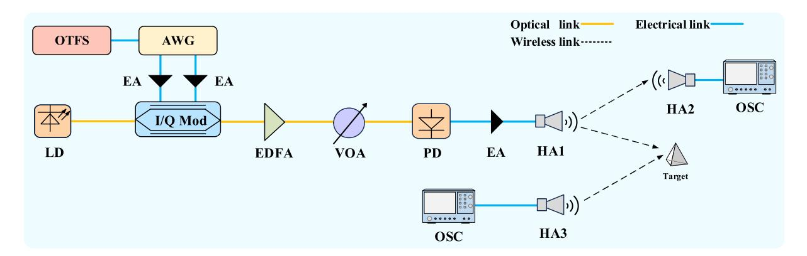

Fig. 4. Structure of the photonics-assisted ISAC system based on OTFS. LD: laser diode, AWG: arbitrary waveform generator, EA: electrical amplifier, I/Q Mod: in-phase/quadrature modulator, EDFA: erbium-doped fiber amplifier, VOA: variable optical attenuator, PD: photodiode, HA: horn antenna, OSC: oscilloscope.

where B is the signal bandwidth. Obviously, with the number of subcarriers M rises, the Doppler resolution of the system increases, indicating an improvement in radar performance.

Overall, under a fixed bandwidth, an optimal operating point is expected to exist for the trade-off between radar and communication performance in the ISAC system as the subcarrier number of the transmitted signal varies.

### D. Photonics-Assisted Mmwave ISAC Based on OTFS

As shown in Fig. 4, we propose a photonics-assisted ISAC system based on OTFS. At the transmitter, the optical carrier generated from the laser diode (LD) is injected into the I/Q modulator, which is expressed as

$$E_c = E_0 e^{j2\pi f_c t},\tag{15}$$

where  $E_0$  and  $f_c$  represent the amplitude and frequency of the optical carrier, respectively. Then the OTFS signal  $S_{OTFS}(t) = S_{BB}e^{j2\pi f_{s1}t}$  and virtual subcarrier signal  $S_{sub}(t) = Ce^{-j2\pi f_{s2}t}$  jointly drive the I/Q modulator, where  $f_{s1}$ ,  $f_{s2}$ denote the frequency of the signals and  $S_{BB}$  represents the baseband OTFS signal derived in (4). In the I/Q modulator, both Mach-Zehnder modulators (MZM) are set to share an identical half-wave voltage of  $V_{\pi}$ . Subsequently, the IQ modulator imposes the signal onto the optical carrier, which can be derived as

$$E_{I/Q} \propto -E_0 \left[ J_1(m_0) J_0(m_1) e^{j2\pi (f_{s1} + f_c)t} + J_0(m_0) J_1(m_1) e^{j2\pi (f_c - f_{s2})t} \right], \tag{16}$$

where  $m_0 = \frac{\pi \cdot S_{BB}}{2V_\pi}$ ,  $m_1 = \frac{\pi \cdot C}{2V_\pi}$  denote the modulation index, and  $J_n(n=0,1)$  represents the *n*-th order Bessel function of the first kind. The output of photodetector (PD) is written as follows

$$I_{RF}(t) \propto RE_0^2 \left\{ 2J_1(m_0)J_0(m_1)J_0(m_0)J_1(m_1) \right.$$
  
 $\times \cos 2\pi f_{RF}t \right\},$  (17)

where R represents the PD sensitivity and  $f_{RF} = f_{s1} + f_{s2}$  denotes the radio frequency of the radio frequency (RF) of the signal. After PD, the OTFS mmWave signal is radiated to the free space through a horn antenna (HA1). Finally, after capturing

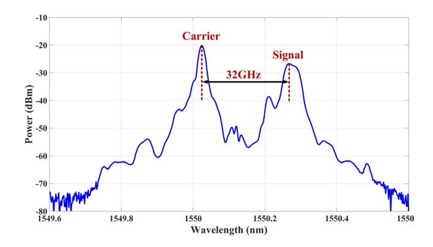

Fig. 5. Measured optical spectra (0.2-nm resolution) after IQ Mod.

echoes through HA2 and HA3 respectively, communication and radar receivers perform further DSP as described in the previous sections.

### III. EXPERIMENTAL SETUP AND RESULTS

An experiment is carried out based on the configuration in Fig. 4 to verify the ISAC performance of the proposed photonicsassisted OTFS system. The linewidth of the LD selected in the experiment is less than 100 kHz. An optical carrier at 1544.3 nm generated by the narrow-linewidth LD is injected into an I/Q modulator (Fujitsu FTM7961), featuring a 3 dB bandwidth of 40 GHz. An arbitrary waveform generator (AWG, Keysight 8192 A) is employed to convert the offline-generated right-sideband OTFS signal at 12 GHz and left-sideband virtual subcarrier signal at 20 GHz into analog signals. After 23 dB amplification by the parallel electrical amplifiers (EA, SHF S807 C), the analog signals are then sent to drive the I/Q modulator. The output spectra of the I/Q modulator are measured by an optical spectra analyzer (OSA, YOKOGAWA AQ6370C), with results presented in Fig. 5. To compensate for the insertion loss of the modulator, an erbium-doped fiber amplifier (EDFA) is used to amplify the optical signal. Afterwards, we utilize a variable optical attenuator (VOA) to adjust the optical power, followed by the photodetection in a PD (Finisar, XPDV2120R). After PD, the mmWave OTFS signal is finally generated. Additionally, another

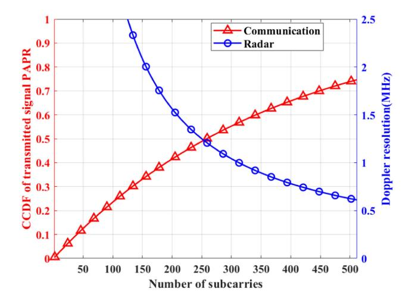

Fig. 6. CCDFs of transmitted communication signal and Doppler resolution of radar under different number of subcarriers under a fixed bandwidth.

EA (SHF M827A) provides 11 dB gain to the signal, and the amplified mmWave signal is radiated through the 25 dBi HA1. In the communication receiver, the mmWave signal is received by the HA2 after 1 m of free-space propagation. In the radar receiver, the target-reflected echo is detected by the HA3. Due to the restrictions imposed by the limited gain of the EA and HA, both the wireless communication transmission distance and the range between the radar and the target are set to within 1 m in the current experiment. By means of high-gain components, longer wireless communication distance and radar detection range can be achieved. The waveform of the mmWave signal at the radar and communication receiver are acquired by the oscilloscope (OSC, Keysight DSAZ592A).

According to (13) and (14), the CCDF of PAPR and  $\Delta\nu$ , which separately characterize the communication and radar performance of OTFS signals, exhibit a positive and negative dependence on the number of subcarriers, respectively. Thus, a performance trade-off between communication and radar can be identified in the ISAC system. As illustrated in Fig. 6, the 5 Gbaud OTFS waveform carrying 16-QAM signal is simulated to analyze the impact of subcarrier numbers on communication and radar performance. It can be observed from the image (red line) that the signal's communication performance indicated by the CCDF of PAPR decreases as the number of subcarriers varying from 2 to 512. On the contrary, the Doppler resolution (blue line), reflecting the radar performance of the signal, can be improved by increasing the subcarrier numbers. It can be observed that the suggested number of subcarriers in our system is around 256, which enables an excellent communication performance while maintaining acceptable velocity measurement performance.

In this work, we employ a DD domain grid of size M=256 and N=16. The DD domain pilot for PCE is placed at the center the center of the grid at coordinates (128,8), with a zero-padding guard interval of size  $200\times3$  to prevent interference between pilot and data symbols. The received DD domain pilots are shown in Fig. 7, characterizing signals' transmission on multipath. Since the experiment is conducted in a static multipath environment, the same-colored pilots in the

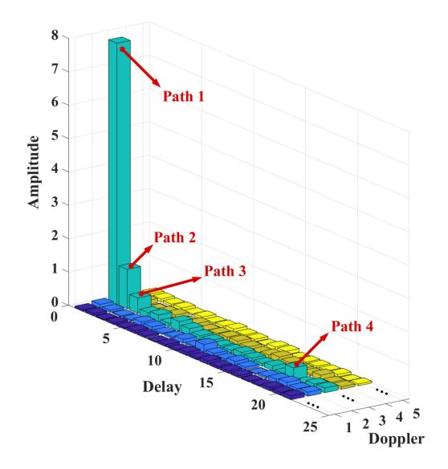

Fig. 7. Received DD domain pilot.

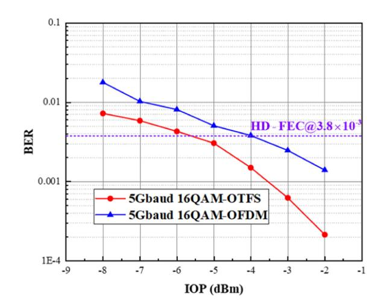

Fig. 8. Measured BERs versus IOP for different schemes to transmit 5Gbaud 16-QAM signal.

figure indicate the signal's propagation on paths with different delays but identical zero Doppler shifts. It can be observed that numerous received pilots exhibit low amplitudes in the figure. Thus, we establish a pilot threshold to assess path validity in the pilot selection. The pilots below the threshold will be regarded as noise, and their corresponding paths' contributions to the signal will be ignored. As a result, only 4 significant paths were considered in the following data detection.

In the communication demonstrations, we initially compare the BER performance of OTFS and OFDM signals to transmit 16-QAM symbols. It is clearly demonstrated that the OTFS modulation scheme outperforms OFDM under identical multipath conditions. As illustrated in Fig. 8, the OTFS signal achieve superior BER performance in NLOS scenario due to its enhanced resistance to MPI. As the input optical power (IOP) increases, the BER improvement efficiency of OFDM signals is remarkably lower than that of OTFS. It should be noted that OTFS signal exhibits a 1.5 dB improvement in IOP sensitivity over OFDM at

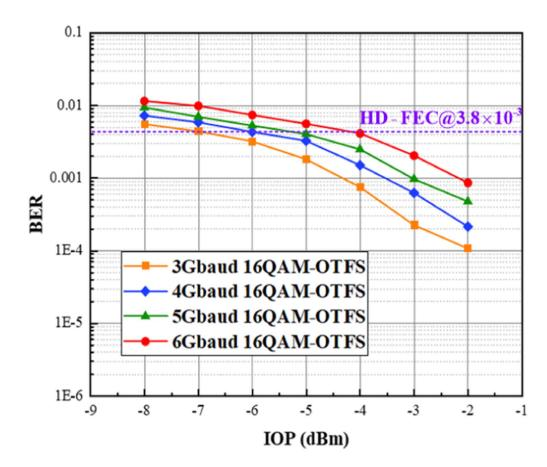

Fig. 9. Measured BERs versus IOP for different baud rate of the 16QAM-OTFS signal.

the hard-decision forward error correction (HD-FEC) threshold of  $3.8\times 10^{-3}$ .

Besides, we measured the BER of OTFS waveform carrying 16-QAM signal with different baud rate versus varying IOP. As shown in Fig. 9, when the baud rate of the transmitted symbols decreases from 6 Gbaud to 3 Gbaud, the IOP margin required to maintain the BER below the HD-FEC threshold of  $3.8\times10^{-3}$  is improved by approximately 5 dB. Since the CP with a length of 8% of the OTFS frame duration is appended for ISI mitigation, the net data rate of the 16QAM-OTFS operating at 5 Gbaud can be calculated as

$$R_{b} = \frac{MN \log_{2} Q}{NT} \cdot (1 - \alpha_{p}) \cdot (1 - \eta_{CP})$$

$$= \frac{256 \cdot 16 \cdot \log_{2} 16}{16 \cdot \frac{1}{5/256}} \cdot \left(1 - \frac{200 \cdot 3}{256 \cdot 16}\right) \cdot (1 - 8\%)$$

$$\approx 15.71 Gbit/s. \tag{18}$$

Where  $\alpha_p$  and  $\eta_{CP}$  denote the overhead ratio of pilot and CP, respectively.

Furthermore, we also evaluate the communication performance of OTFS signals loaded with high-order QAM data. As illustrated in Fig. 10, when a 64QAM-OTFS signal at 2 Gbaud is transmitted, the IOP of the system must exceed  $-4~\mathrm{dBm}$  to keep the received BER below the soft-decision forward error correction (SD-FEC) threshold of  $1\times10^{-2}$ . While the baud rate increases to 4 Gbaud, an additional 3 dB of IOP is required to meet the SD-FEC requirement.

In the radar function demonstrations, the 5 Gbaud 16QAM-OTFS waveform is employed. Firstly, we conducted a set of experiments to evaluate the single-target ranging performance of the system. A corner reflector is employed and positioned 21 cm, 60 cm, and 93 cm away from the radar receiving antenna, respectively. Figs. 11 to 13 show the range-velocity profiles obtained from the single-target detection at different distances. Since the target remains stationary, the target peaks are all located on the axes where the velocity is zero. The peak amplitude in the figure corresponds to echo intensity of the target, where

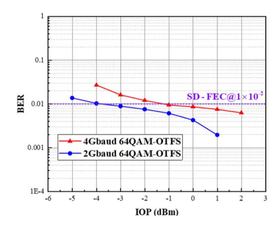

Fig. 10. Measured BERs versus IOP for different baud rate of the 64QAM-OTFS signal.

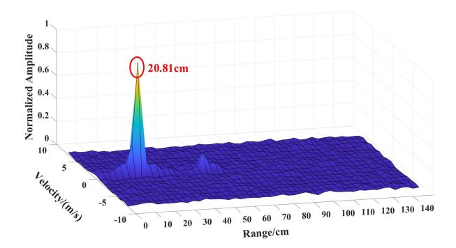

Fig. 11. Detected range for single-target at 21 cm.

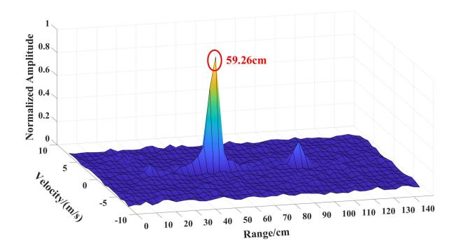

Fig. 12. Detected range for single-target at 60 cm.

the prominent yellow-tipped peak represents the target under test, while lower-amplitude blue peaks and irregular fluctuations correspond to irrelevant targets and clutter in the experiment. In the figures, the clearly distinguished peaks corresponding to the measured distances of 20.81 cm, 59.26 cm, and 93.19 cm, with the maximum absolute error is 0.74 cm. Taking into account the measuring tool deviation, the experiment results confirm the radar's high-precision ranging capability.

Furthermore, we employed two corner reflector targets to test the radar's multi-target ranging capability. In the experiment, two corner reflectors are placed at distances of 51 cm, 102 cm and 36 cm, 21 cm away from the radar receiving antenna,

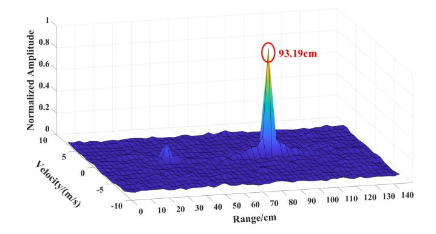

Fig. 13. Detected range for single-target at 93 cm.

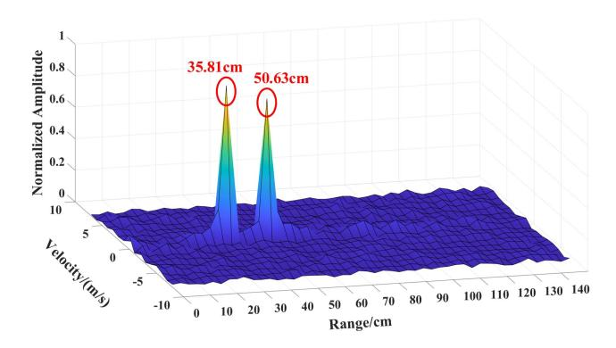

Fig. 14. Detected ranges for multi-target at 51 cm and 36 cm.

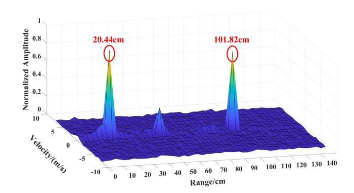

Fig. 15. Detected ranges for multi-target at 102 cm and 21 cm.

respectively. As shown in Figs. 14 and 15, two targets are simultaneously measured in the range-velocity profile with ranges of 50.63 cm, 101.82 cm and 35.81 cm, 20.44 cm, respectively. As can be observed, the multi-target ranging results indicate the peak-to-peak separations of 14.82 cm and 81.38 cm, which is close to the true values of 15 cm and 81 cm. Notably, according to the principle of electromagnetic wave attenuation, target echo amplitude is inversely proportional to distance from radar. Therefore, in the measured range-velocity profiles containing two targets, the target with higher amplitude indicates shorter distance from radar transmitter, while the lower one corresponds to a longer range.

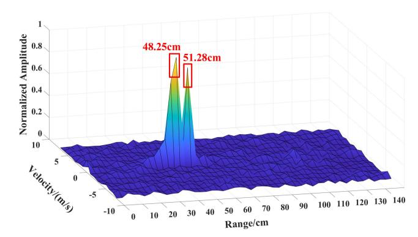

Fig. 16. Range resolution validation with target separation close to 3 cm.

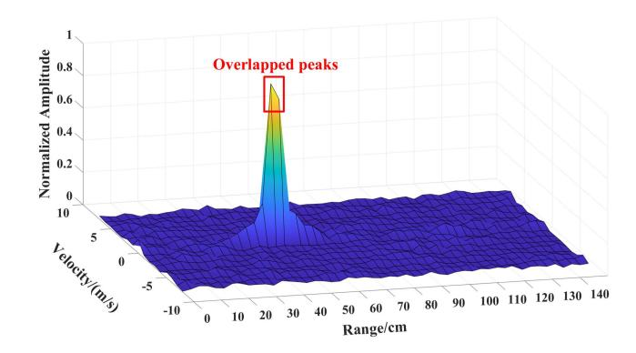

Fig. 17. Range resolution validation with target separation approximately set to 2.99 cm.

Following this, we investigate the radar's resolution performance by adjusting the distance between two closely-spaced corner reflectors. Given the OTFS signal a bandwidth of 5 GHz in the experiment, the radar's range resolution can be calculated as  $\Delta R = \frac{c}{2M\Delta f} = \frac{c}{2B} = 3 \ cm$ . In the initial setup, reflectors were placed with their spacing close to the theoretical resolution of 3 cm. As shown in Fig. 16, the two measured targets are locating at 51.28 cm and 48.25 cm, with a separation of 3.03 cm slightly larger than the theoretical resolution. To evaluate the range resolution threshold, the position of one reflector was moved 0.4 cm from 51.28 cm to 51.24 cm while keeping the other stationary. After the slight movement, the spacing between two targets was approximately set to be 2.99 cm. As observed in Fig. 17, the 0.4 cm reduction of the target separation resulted in the complete peak overlap when the target spacing became marginally less than 3 cm, thereby verifying the system's minimum resolvable distance of 3 cm, which agrees well with the theoretical value.

## IV. CONCLUSION

The authors propose and experimentally validate a photonics-assisted ISAC system using OTFS waveforms in the mmWave band. After transmission over a 1m wireless link, the 16QAM-OTFS system achieved a net data rate of 15.71 Gbit/s and range resolution of 3 cm. Besides, we compare the communication performance of the system with different OTFS and OFDM schemes in a NLOS scenario. The result shows that OTFS

signal exhibits superior BER performance and a 1.5 dB improvement in IOP sensitivity over OFDM. Moreover, single-target and multi-target ranging experiments are conducted to validate the sensing capability of OTFS-based radar. In conclusion, the photonics-assisted OTFS approach shows great potential for future mmWave ISAC applications.

# REFERENCES

- [1] S. Chen, Y.-C. Liang, S. Sun, S. Kang, W. Cheng, and M. Peng, "Vision, requirements, and technology trend of 6G: How to tackle the challenges of system coverage, capacity, user data-rate and movement speed," *IEEE Wireless Commun.*, vol. 27, no. 2, pp. 218–228, Apr. 2020.
- [2] W. Bai et al., "Microwave photonics promotes emerging integrated sensing and communication technology," *APL Photon*, vol. 10, no. 3, Mar. 2025, Art. no. 031101.
- [3] Z. Qadir, K. N. Le, N. Saeed, and H. S. Munawar, "Towards 6G Internet of Things: Recent advances, use cases, and open challenges," *ICT Exp.*, vol. 9, no. 3, pp. 296–312, Jun. 2023.
- [4] X. Liu, H. Zhang, K. Sun, K. Long, and G. K. Karagiannidis, "AI-driven integration of sensing and communication in the 6G era," *IEEE Netw.*, vol. 38, no. 3, pp. 210–217, May 2024.
- [5] K. Meng et al., "UAV-enabled integrated sensing and communication: Opportunities and challenges," *IEEE Wireless Commun.*, vol. 31, no. 2, pp. 97–104, Apr. 2024.
- [6] L. Wang, X. Wang, and S. Pan, "Microwave photonics empowered integrated sensing and communication for 6G," *IEEE Trans. Microw. Theory Techn.*, vol. 73, no. 8, pp. 5295–5315, Aug. 2025.
- [7] J. Capmany and D. Novak, "Microwave photonics combines two worlds," *Nature Photon.*, vol. 1, no. 6, pp. 319–330, Jun. 2007.
- [8] P. Ghelfi et al., "A fully photonics-based coherent radar system," *Nature*, vol. 507, no. 7492, pp. 341–345, Mar. 2014.
- [9] D. Marpaung, J. Yao, and J. Capmany, "Integrated microwave photonics," *Nature Photon.*, vol. 13, no. 2, pp. 80–90, Feb. 2019.
- [10] J. Yao, "Microwave photonics sensors," *J. Lightw. Technol.*, vol. 39, no. 12, pp. 3626–3637, Jun. 2021.
- [11] J. Yao, "Microwave photonics systems," *J. Lightw. Technol.*, vol. 40, no. 20, pp. 6595–6607, Oct. 2022.
- [12] H. Emami, N. Sarkhosh, E. R. L. Lara, and A. Mitchell, "Reconfigurable photonics feed for sinuous antenna," *J. Lightw. Technol.*, vol. 30, no. 16, pp. 2725–2732, Aug. 2012.
- [13] L. Yin and J. He, "Modulated-symbol domain matched filtering scheme for photonics-assisted integrated sensing and communication system based on a single OFDM waveform," *Opt. Lett.*, vol. 49, no. 8, pp. 2153–2156, 2024.
- [14] F. Liu et al., "Millimeter-wave over fiber integrated sensing and communication system using self-coherent OFDM," *Opt. Exp.*, vol. 32, no. 9, pp. 15493–15506, Apr. 2024.

- [15] J. Liu et al., "W-band photonics-aided OFDM system integrating sensing and communication with phase noise suppression scheme," *Opt. Laser Technol.*, vol. 180, Jan. 2025, Art. no. 111432.
- [16] R. Song and J. He, "OFDM-NOMA combined with LFM signal for W-band communication and radar detection simultaneously," *Opt. Lett.*, vol. 47, no. 11, pp. 2931–2934, Jun. 2022.
- [17] Y. Zhou, S. Zhao, X. Li, and G. Wang, "Photonics generation of frequency agile LFM signals for ISAC systems," *Opt. Quantum Electron.*, vol. 56, no. 12, Nov. 2024, Art. no. 1908.
- [18] Z. Lyu et al., "Preamble-free synchronization based on dual-chirp waveforms for photonics THz-ISAC," *J. Lightw. Technol.*, vol. 42, no. 8, pp. 2657–2665, Apr. 2024.
- [19] W. Bai et al., "Millimeter-wave joint radar and communication system based on photonic frequency-multiplying constant envelope LFM-OFDM," *Opt. Exp.*, vol. 30, no. 15, pp. 26407–26425, 2022.
- [20] J. Liang, J. He, R. Song, and Y. Xiao, "GS-16QAM OFDM with ANN scheme combined with LFM signal for joint communication and radar sensing system," *Opt. Lett.*, vol. 48, no. 13, pp. 3459–3462, Jul. 2023.
- [21] Y. Liu, X. Deng, N. Zhong, X. Zou, W. Pan, and L. Yan, "Simulation of constant-envelope THz integrated sensing and communication system based on photonics with 2D positioning," in *Proc. Asia Commun. Photon. Conf. Int. Conf. Inf. Photon. Opt. Commun.*, 2024, pp. 1–5.
- [22] J. Zhang et al., "Photonics-aided THz integrated sensing and communication system based on a subcarrier-chirp inter-embedded waveform," *IEEE Open J. Commun. Soc.*, vol. 6, pp. 2993–3003, 2025.
- [23] R. Hadani et al., "Orthogonal time frequency space modulation," in *Proc. IEEE Wireless Commun. Netw. Conf.*, 2017, pp. 1–6.
- [24] L. Gaudio, G. Colavolpe, and G. Caire, "OTFS vs. OFDM in the presence of sparsity: A fair comparison," *IEEE Trans. Wireless Commun.*, vol. 21, no. 6, pp. 4410–4423, Jun. 2022.
- [25] Y. Hong, T. Thaj, and E. Viterbo, *Delay-Doppler Communications: Principles and Applications*. London, U.K.: Elsevier, 2022.
- [26] G. D. Surabhi, R. M. Augustine, and A. Chockalingam, "Peak-to-average power ratio of OTFS modulation," *IEEE Commun. Lett.*, vol. 23, no. 6, pp. 999–1002, Jun. 2019.
- [27] P. Raviteja, K. T. Phan, Y. Hong, and E. Viterbo, "Orthogonal time frequency space (OTFS) modulation based radar system," in *Proc. IEEE Radar Conf.*, Apr. 2019, pp. 1–6.
- [28] K. Zhang, Z. Li, W. Yuan, Y. Cai, and F. Gao, "Radar sensing via OTFS signaling," *China Commun.*, vol. 20, no. 9, pp. 34–45, Sep. 2023.
- [29] W. Yuan et al., "From OTFS to DD-ISAC: Integrating sensing and communications in the delay Doppler domain," *IEEE Wireless Commun.*, vol. 31, no. 6, pp. 152–160, Dec. 2024.
- [30] M. Wang et al., "Research on orthogonal time frequency space in a 125-GHz mmWave indoor wireless communication system," *J. Lightw. Technol.*, vol. 43, no. 12, pp. 5762–5772, Jun. 2025.
- [31] P. Raviteja, K. T. Phan, and Y. Hong, "Embedded pilot-aided channel estimation for OTFS in delay–Doppler channels," *IEEE Trans. Veh. Technol.*, vol. 68, no. 5, pp. 4906–4917, May 2019.