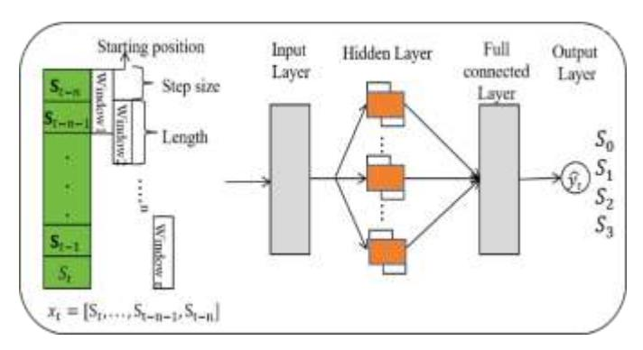
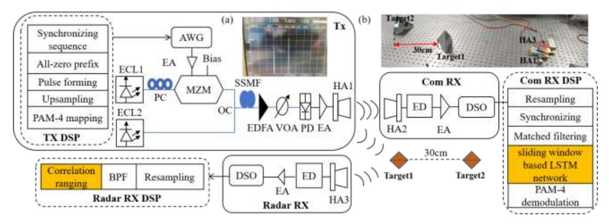
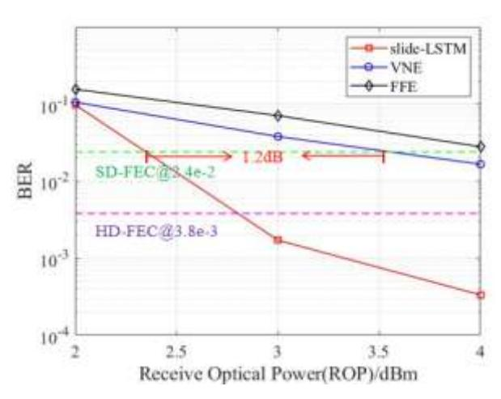
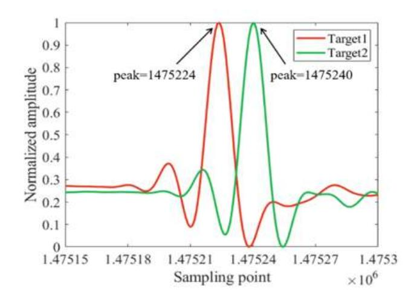
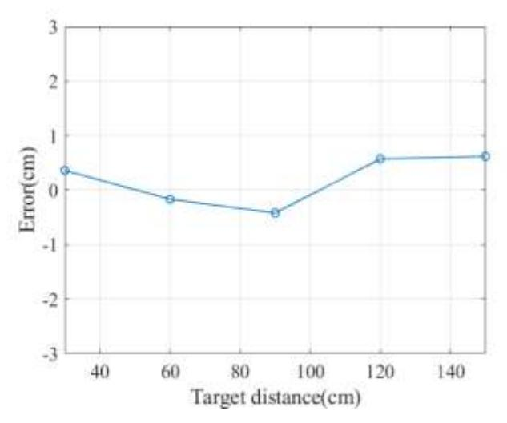

# Sliding window-based LSTM scheme for PAM-4 photonics-assisted W-band ISAC systems

Jing He\*, Shijie Xiao, Chi Ying, Zuo Chen, Yaoqiang Xiao [1](#page-0-0)

*Abstract***—In this Letter, a sliding window-based long shortterm memory (LSTM) network and a correlation-based ranging scheme are proposed for a 4-level pulse amplitude modulation (PAM-4) photonics-assisted W-band integrated sensing and communication (ISAC) system. Employing the proposed method, a single PAM-4 waveform is capable of implementing both communication and sensing simultaneously. Moreover, the sliding window-based LSTM network can effectively improve receiver sensitivity. By utilizing the correlation-based ranging scheme, the centimeter-level ranging resolution can be achieved. The experimental results show that, compared with Volterra Seriesbased Nonlinear Equalizer (VNE), a receiver sensitivity gain of 1.2 dB is obtained at the Soft-Decision Forward Error Correction (SD-FEC) limit. In addition, the ranging resolution reachs up to 1.875 cm, and the average ranging error is 0.43 cm.** *Index Terms***—ISAC, PAM-4, LSTM.**

## I. INTRODUCTION

ecently, with the growing demand for high-speed communication and high-precision sensing in emerging applications such as intelligent factories and smart transportation, integrated sensing and communication (ISAC) technology has received significant research attention [1-2]. Photonic-assisted millimeter wave (MMW) and terahertz band can be used in ISAC systems due to its ultra-high transmission bandwidth for high-speed data communication and improving radar sensing resolution [3-4]. The design of waveforms is important in photonic-assisted ISAC system, and it is focused on multiplexed waveforms and single waveforms. For multiplexed waveform, various multiplexing schemes are investigated, including time division multiplexing (TDM) [2], frequency division multiplexing (FDM) such as linear frequency modulation (LFM) signal combined with phase shift keying (PSK) [5], and non-orthogonal multiple access (NOMA) [6-7]. However, the source employed for radar ranging cannot be used for communication simultaneously, thereby reducing the communication efficiency. For single waveforms, orthogonal frequency division multiplexing (OFDM) [8-9] and orthogonal time frequency space (OTFS) [10] are proposed and experimentally demonstrated. Meanwhile, machine learning (ML) algorithm is adopted in photonic-assisted ISAC systems. In [11], an integrated geometrically shaped (GS)-16QAM OFDM waveform combined with an ML-based scheme is proposed to improve communication and sensing performance. Among ML techinques, long short-term memory (LSTM) network, with its capabilities of self-learning, self-organizing and self-adaptive, is used for the equalization of communication system. A multi-symbol output-neural network based on LSTM is proposed for nonlinear equalization in high-speed short reach optical interconnects, and a 212 Gbit/s PAM-4 optical link is R

This work is supported in part by National Natural Science Foundation of China (62427815, 61775054); in part by National Key R&D Rrogram of China (2021YFB2206600).

experimentally demonstrated [12]. The adoption of a unified signal is favorable for ISAC implementation. PAM-4 signals are widely adopted in high-speed optical interconnects and optical access networks due to its high spectral efficiency [13]. In addition to the advantages in optical communication, utilizing PAM-4 waveform for ISAC offers the benefit of seamlessly achieving dual functionality. However, there is a lack of research on ISAC system using PAM-4 waveform based on photonics.

In this letter, a sliding window-based LSTM network and a correlation-based ranging scheme are proposed and experimentally demonstrated in a PAM-4 photonics-aided Wband ISAC system. A single PAM-4 waveform is employed to realize the dual functionalities of communication and radar detection. The generation of W-band MMW signal is based on the optical heterodyne method. Meanwhile, the LSTM network is trained in offline mode, and the pretrained LSTM network is utilized for signal demodulation. In addition, the correlationbased ranging scheme is applied to calculate the radar ranging results. Moreover, the bit error rate (BER) and ranging error are investigated to evaluate the communication performance and radar performance, respectively.

# II. PRINCIPLE

## *A. The sliding window-based LSTM network scheme*

At the transmitter, for the generation of PAM-4 signal, the binary bit streams as "00","01", "11", and "10" are corresponding to the data symbol sequences as 0 , 1 , 2 and 3 , respectively.

The proposed sliding window-based LSTM network method for PAM-4 receiver is shown in Fig. 1. At the digital signal processing (DSP) of communication receiver (Com Rx), for the communication equalization, by using the proposed sliding window-based LSTM network method, the PAM-4 signal with the current time step can be represented as = [ , ⋯ , −−1 , −], where denotes the PAM-4 symbol at the current time, and ∈ {0 , 1 , 2 , 3 }. The sliding window moves along the time direction and splits the signal sequence into multiple subsequences of identical length, then each subsequence is obtained. The subsequence contains the symbol features for demodulation. These subsequences form the input nodes of the input layer, which is followed by the LSTM network model. Subsequently, they are transmitted to a fully connected layer for further processing to obtain the current equalized symbolŝ . Similarly, the corresponding equalized symbols are generated in subsequent time steps with this scheme. The sliding window has pre-set starting position, length, and step size parameters, where the starting position

\*Corresponding author: Jing He (E-mail: jhe@hnu.edu.cn). The authors are with College of Computer Science and Electronic Engineering, Hunan University, Changsha, China.

parameter determines the position of the first data captured by the window, the length parameter determines the length of the data sequence captured by a single window, and the step size parameter determines the sliding length of each window along the time direction of the data sequence. The three parameters are driven by PAM-4 signal. To optimize the overall system performance, these parameters are analyzed. The optimal parameters are that the step size is set as 1, the sliding window length is set as 2 and the start position is set as 0.

In the LSTM network training, the PAM-4 sequence is divided into training and test samples in the ratio of 7:3. Normalization and packing operations are performed on the data for fast network convergence and to avoid neuron saturation. The parameters of LSTM network include the number of input layer, hidden layer, and output layer, corresponding to 1, 128, and 1, respectively. The initial learning rate is 0.005, the learning rate decline cycle and factor refers to 125 and 0.2, and gradient descent algorithm is Adam.

Fig. 1. The proposed sliding window-based LSTM network method for PAM-4 receiver

# B. The correlation-based ranging scheme

At the radar receiver, the PAM-4 signal can be expressed as  $f_r(t) = Re\{A_m p(t)e^{j2\pi f_c t}\} = A_m p(t)cos2\pi f_c t$  (1)

Where p(t) is a pulse of duration,  $f_c$  is the signal frequency and  $A_m$  is the signal amplitude, for PAM-4, "m" represents the amplitude of the four levels, such as  $A_0 = -3$ ,  $A_1 = -1$ ,  $A_2 = 1$  and  $A_3 = 3$ . "00", "01", "11", and "10" are corresponding to the data symbol sequences as  $S_0$ ,  $S_1$ ,  $S_2$  and  $S_3$ . Meanwhile, the amplitudes of the data symbol sequences are corresponding to  $A_0$ ,  $A_1$ ,  $A_2$  and  $A_3$ . The echo signal from the target is captured and down-converted to the IF band, and it is given by

$$g(t) = h(t) * [A_m p(t) \cos(2\pi + \varphi) f_c t] + n(t)$$
 (2)

Where h(t) is the impulse response of the channel and n(t) is the noise superimposed on the signal. A cross-correlation operation is performed between the echo signal of g(t) and the PAM-4 signal of  $f_r(t)$ , and it is expressed as

$$x(t) = f_r(t) \otimes g(t) = \int_{-\infty}^{\infty} f_r(\tau)g(t+\tau)d\tau$$
 (3)

The correlation-based ranging scheme is used to calculate the radar ranging result. The received signals at two different positions will get different peak results after cross-correlation operation, thus, the difference of distances can be calculated as

$$\Delta R = \frac{c\Delta x}{2f} \tag{4}$$

Where c is the speed of light,  $f_s$  is the sampling rate of arbitrary waveform generator (AWG), and  $\Delta x$  is the peak

difference at two positions. In addition, for the distance resolution, it can be expressed as

$$\delta_r = \frac{c}{2f_s} \tag{5}$$

#### III. EXPERIMENTAL SETUP AND RESULT ANALYSIS

The experimental setup of the proposed PAM-4 photonic-assisted W-band ISAC system is shown in Fig. 2. It is divided into three parts: the transmitter (Tx) for communication and radar signal, the communication receiver (Com Rx), and the radar receiver (Radar Rx).

At the transmitter (Tx), the offline signal is generated by modulating the PAM-4 signal, up-sampling, root-raised cosine roll-off pulse forming, adding all-zero prefix, and adding the synchronization sequence. Two continuous light waves with wavelengths of 1556.67 nm and 1555.86 nm are generated from two external cavity lasers (ECL1 and ECL2), respectively. After the continuous light wave from ECL1 passes through the polarization controller (PC), the PAM-4 signals generated by the arbitrary waveform generator (AWG) are modulated by a Mach-Zehnder modulator (MZM). The maximized sampling rate of AWG is 12GSa/s and the analog bandwidth is 4.8GHz. The unmodulated light wave from ECL2 is combined with the modulated light wave through a 3 dB optical coupler (OC). Subsequently, the coupled optical signal is transmitted over 50 km standard single-mode fiber (SSMF) with a transmission loss of around 10 dB. After passing through an erbium-doped fiber amplifier (EDFA) and a variable optical attenuator (VOA), the optical power is adjusted from 2 dBm to 4 dBm. Then it is fed into a photodiode (PD) for photoelectrical conversion to generate a 100 GHz W-band electrical signal. The optical frequency conversion efficiency loss is approximately 5.2 dB. The EDFA and VOA are used to regulate the input power of the PD. Finally, after passing through an electrical amplifier (EA), the PAM-4 W-band ISAC signal is transmitted by a horn antenna (HA). Fig. 2(a) gives the measurement spectrum after passing through the OC.

At the Com Rx, the 100 GHz PAM-4 W-band ISAC signal is captured by another HA after 1-m wireless transmission, the free-space loss reaches approximately 72.4 dB. And the signal is down-converted by an envelope detector (ED) with a bandwidth of 6 GHz. The symbol rate of PAM-4 signal is 0.8 GBaud. After being amplified by another EA, the signal is captured by a digital storage oscilloscope (DSO) for offline DSP, and the sampling rate of DSO is 25GSa/s. The useful signal power is about -59.6 dBm. For the signal-to-noise ratio (SNR) of the received signal, thermal noise and signal distortion noise are mainly considered. With a total noise power of approximately -74.8 dBm, the received SNR is about 15.2 dB. The Com RX DSP includes resampling, symbol synchronization, matched filtering, sliding window-based LSTM network and PAM-4 demodulation.

At the Radar Rx, the experimental scene diagram is shown in Fig. 2(b). The echo reflected by the corner reflector is captured by the HA and down-converted by the envelope detector (ED). After ED, the electrical signal is amplified by another EA and then captured by a DSO. The Radar RX DSP includes resampling, band pass filtering (BPF) and correlation-based ranging calculation. Finally, the measurement of the target

distance and the resolution can be obtained by analyzing the peak spacing through the Eq. (4) and (5).

The BER performance of equalized demodulation under different sliding window lengths is analyzed at received optical power (ROP) of 4dBm and the results are shown in Table 1. As indicated in Table 1, the optimal BER performance is obtained when the sliding window length is 2 and the dataset with the optimized parameters is used to make predictions.

Fig. 2. Experimental setup of the PAM-4 photonic-assisted W-band ISAC system. (a) The optical spectrum after passing through the OC, (b) The experimental scene diagram

**Table 1. The BER with different sliding window lengths**

| Sliding window length | BER       |
|-----------------------|-----------|
| 1                     | 2.17×10-2 |
| 2                     | 3.33×10-4 |
| 3                     | 9.75×10-4 |
| 4                     | 8.21×10-3 |

Fig. 3. The BER performance of VNE, FFE and LSTM scheme

In this letter, the Volterra Series-based Nonlinear Equalizer (VNE) algorithm is selected as a reference to compare with the proposed method. Considering computational complexity, a second-order truncated Volterra series expansion is adopted for the adaptive filter in signal processing. The BER performance of the VNE, Feed Forward Equalizer (FFE) and sliding window-based LSTM network scheme at different ROP is shown in Fig. 3. The sliding window length is set to 2 and the sample rate of AWG is 8GSa/s. The ROP is measured between the VOA and PD. The VNE achieves a BER below 2.4×10-2 when the ROP is 4dBm, outperforming the FFE which exhibits a BER of 2.8×10-2 at the same ROP. Morever, the sliding window-based LSTM network scheme demonstrates superior performance and its BER drops below 3.8×10-3 even at a lower ROP of 3dBm.

As illustrated in Fig. 3, compared to the VNE, the proposed sliding window-based LSTM network scheme enables a 1.2dB improvement in receiver sensitivity under the Soft-Decision Forward Error Correction (SD-FEC) limit.

Fig. 4. The distance estimation results of target detection

In addition, to evaluate the performance of radar target detection, the distance between the two targets and the HA1 is set to 30cm and 60cm, respectively. By using the correlationbased ranging scheme, the distance difference between the two targets can be calculated. The distance estimation results of target detection are shown in the Fig. 4. After applying the correlation-based ranging scheme to the echo signals reflected by the two targets, the signal peaks corresponding to the targets are observed at positions 1475224 and 1475240, respectively. Based on Eq. (4), the estimated distance difference between Target1 and Target2 is 30cm. It confirms the feasibility of radar ranging using a single PAM4 signal.

Moreover, the communication BER performance and radar ranging performance under different sampling rates are compared in Table 2. Five measurement points are chosen at distances of 30, 60, 90, 120, 150cm under sampling rates of 4 GSa/s and 8 GSa/s, respectively. Based on Eq. (5), the calculated resolutions corresponding to the sampling rates of 4 GSa/s and 8 GSa/s are 3.75 and 1.875cm, respectively.

**Table 2. The BER and sensing ranging performance** 

| Sampling rate | The BER of 4dBm ROP | The average ranging errors |
|---------------|------------------------|-------------------------------|
| 4 GSa/s       | 4.49×10-4              | 0.51 cm                       |
| 8 GSa/s       | 3.33×10-4              | 0.43 cm                       |

In Table 2, the average ranging error refers to the average value of the ranging errors for the five measurement points as 30cm, 60cm, 90cm, 120cm, and 150cm. As indicated in Table 2, at sampling rate of 4 GSa/s and 8 GSa/s, the BER meets the Hard-Decision Forward Error Correction (HD-FEC) limit. The system achieves better BER and sensing performance when the sampling rate is 8 GSa/s than when it is 4 GSa/s. Therefore, considering the overall communication performance and radar sensing performance, the optimal sampling rate is set to 8 GSa/s.

Fig. 5. The ranging errors for different ranging measurement points

The ranging errors for different ranging measurement points at a sampling rate of 8 GSa/s are given in Fig. 5, the ranging error is defined as the difference between the average value of five measurements and the actual distance. For instance, when the actual distance is 30 cm, the average of five measurements at 8 GSa/s is 30.36 cm, resultingin a ranging error of 0.36cm. Similarly, a ranging error of 0.62 cm is observed for an actual distance of 150 cm.

# IV. CONCLUSION

In this Letter, a sliding window-based LSTM network and a correlation-based ranging scheme are proposed and experimentally demonstrated in the PAM-4 photonics-assisted W-band ISAC system, which simultaneously realizes the communication and radar ranging functions by using a single PAM-4 signals. The experimental results show that, a BER performance of 10-4 is achieved at the ROP of 4 dBm. Compared with the VNE, a receiver sensitivity gain of 1.2 dB is obtained under SSMF and wireless transmission in the SD-FEC limit. Additionally, the system exhibits a ranging resolution of up to 1.875cm and an average ranging error of 0.43 cm.

## REFERENCES

- [1]. Y. Wang, Z. Dong, J. Ding, W. Li, M. Wang, F. Zhao, and J. Yu, "Photonics-assisted joint high-speed communication and high-resolution radar detection system," Opt. Lett, vol. 46, no. 24, pp. 6103-6106, Nov. 2021.
- [2]. M. Lei, M. Zhu, Y. Cai, M. Fang, W. Luo, J. Zhang, B. Hua, Y.Zou, X. Liu, W. Tong, and J. Yu, "Integration of Sensing and Communication in a W-Band Fiber-Wireless Link Enabled by Electromagnetic Polarization Multiplexing," Journal of Lightwave Technology, vol. 41, no. 23, pp. 71 28-7138, Dec. 2023.
- [3]. B. Liu, J. Liu, and N. Kato, "Optimal Beamformer Design for Millimeter Wave Dual-Functional Radar-Communication Based V2X Systems," IE EE Journal on Selected Areas in Communications, vol. 40, no. 10, pp. 29 80-2993, Oct. 2022.
- [4]. B. Dong, J. Jia, L. Zhong, G. Li, J. Shi, H. Wang, N. Chi, J. Zhang. "Pho tonic-Based Flexible Integrated Sensing and Communication With Multi ple Targets Detection Capability for W-Band Fiber-Wireless Network," I EEE Transactions on Microwave Theory Techniques, vol. 72, no. 8, pp.4 878-4891, Aug. 2024.
- [5]. Z. Lyu, L. Zhang, H. Zhang, Z. Yang, H. Yang, N. Li, L. Li, V. Bobrovs, O. Ozolins, X. Pang, and X. Yu, "Radar-Centric Photonic Terahertz Inte grated Sensing and Communication System Based on LFM-PSK Wavefo rm," IEEE Transactions on Microwave Theory Techniques, vol. 71, no.1 1, pp. 5019-5027, Nov. 2023.
- [6]. R. Song and J. He, "OFDM-NOMA combined with LFM signal for W-b and communication and radar detection simultaneously," Optics Letters, vol. 47, no. 11, pp. 2931-2934, Jun. 2022.
- [7]. J. He, L. Yin, J. Li, S. Xiao, and R. Song, "NOMA-LFM Waveform and ANN Scheme for W-Band Integrated Sensing and Communication Syste m," IEEE Photonics Technology Letters, vol. 36, no. 8, pp. 559-562, Ap r. 2024.
- [8]. L. Yin, and J. He, "Modulated-symbol domain matched filtering scheme for photonic-assisted integrated sensing and communication system base d on a single OFDM waveform," Optics Letters, vol. 49, no. 8, pp. 2153- 2156, Apr. 2024.
- [9]. H. Yan, X. Li, X. Pan, T. Xie, L. Fang, J. Bi, X. Geng, and X. Xin. "Wband photonic-aided mm-wave ISAC system enabled by a shared OFDM signal waveform and a two-stage carrier frequency recovery algorithm," Optics Letters, vol. 49, no. 18, pp. 5280-5283, Sep. 2024.
- [10]. M. Wang, J. Yu, X. Zhao, W. Zhou, J. Chen, X. Yang, C. Bian, Y. Wei, Q, Zhang, Y. Han, P. Tian, S. Xu, Q. Zhang, L, Jiang, U. Rahim, K. Wang, and W. Li. "Research on Orthogonal Time Frequency Space in a 125-GHz mmWave Indoor Wireless Communication System," Journal of Lightwave Technology, vol. 43, no. 12, pp. 5762-5772, Jun. 2025.
- [11]. J. Liang, J. He, R. Song, and Y. Xiao. "GS-16QAM OFDM with ANN s cheme combined with LFM signal for joint communication and radar sen sing system," Optics Letters, vol. 48, no.13, pp. 3459-3462, Jul. 2023.
- [12]. B. Sang, W. Zhou, Y. Tan, M. Kong, C. Wang, M. Wang, L. Zhao, J. Zh ang, and J. Yu, "Low Complexity Neural Network Equalization Based o n Multi-Symbol Output Technique for 200+ Gbps IM/DD Short Reach O ptical System," Journal of Lightwave Technology, vol. 40, no. 9, pp. 289 0-2900, May. 2022.
- [13]. Y. Gu, J. Lambrecht, S. Niu, A. Vandierendonock, D. Bruynsteen, G. Co udyzer, K. Bruyn, J. Bauwelinck, X. Yin, P. Ossieur, "A 160 Gb/s PAM-4 Optical Receiver Using a Fully Differential Transimpedance Amplifier in SiGe BiCMOS," Journal of Lightwave Technology, vol. 42, no. 23, p p. 8237-8244, Dec. 2024.