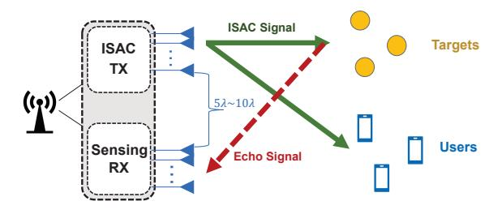
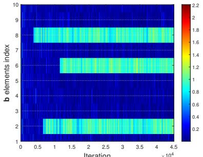
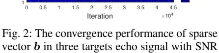
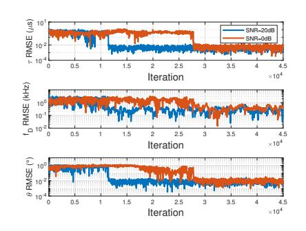
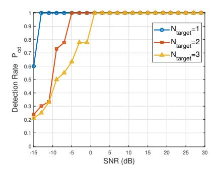
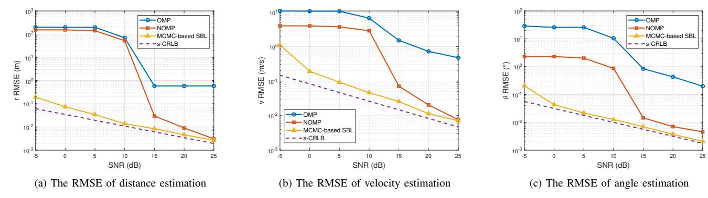

# MCMC-Based Sparse Bayesian Learning for Super-Resolution Receiver in ISAC Systems

Keying Zhu<sup>1</sup> , Xingyu Zhou<sup>1</sup> , Jie Yang1,2,4, Le Liang1,3,4, Shi Jin1,4, Xiao Li<sup>1</sup> <sup>1</sup>National Mobile Communications Research Laboratory, Southeast University, Nanjing 210096, China <sup>2</sup>Key Laboratory of Measurement and Control of Complex Systems of Engineering, Ministry of Education, Southeast University, Nanjing 210096, China <sup>3</sup>Purple Mountain Laboratories, Nanjing 211111, China <sup>4</sup>Frontiers Science Center for Mobile Information Communication and Security, Southeast University, Nanjing 210096, China E-mail: {keyingz, xy zhou, yangjie, lliang, jinshi, li xiao,}@seu.edu.cn

*Abstract*—This paper presents a Markov chain Monte Carlo (MCMC)-based sparse Bayesian learning (SBL) algorithm for super-resolution receiver design, aimed at joint target detection and parameter estimation in integrated sensing and communication (ISAC) systems. Unlike traditional compressed sensing (CS) approaches that rely on large sensing matrices and are limited by on-grid estimation accuracy, our proposed method treats both sparse variables and their associated parameters as random variables, enabling gridless estimation with superresolution and high precision. By leveraging MCMC techniques, our approach avoids the computational burden of matrix inversion while enhancing estimation performance in high-dimensional parameter spaces. Additionally, we introduce a refined MCMC proposal distribution that leverages mini-batch gradients and the Adam optimizer, significantly enhancing convergence while ensuring robust target detection and parameter estimation across varying SNR conditions. Simulation results demonstrate that the proposed algorithm accomplishes an estimation accuracy on the order of 10<sup>−</sup><sup>1</sup> m for range, 10<sup>−</sup><sup>1</sup> m/s for velocity, and 10<sup>−</sup><sup>2</sup> degree for angle, under conditions where the SNR exceeds 10 dB. It achieves superior accuracy and efficiency compared to traditional CS methods, especially in low-SNR ISAC environments.

*Index Terms*—Integrated sensing and communication, sparse Bayesian learning, Markov chain Monte Carlo, parameter estimation

## I. INTRODUCTION

Integrated sensing and communications (ISAC) has become one of the key technologies for the sixth-generation (6G) communications to achieve high-quality wireless connectivity and highly accurate and robust sensing capability [1]. The design of ISAC system involves utilizing existing communication hardware architectures and waveforms to enable dualfunction communication and sensing within cellular networks. Specifically, the perceptive mobile network with multiple input and multiple output (MIMO) arrays transmitting wideband orthogonal frequency division multiplexing (OFDM) signals are often considered, which can provide high directivity, range, and velocity resolution for sensing [2].

Signal processing on the receiver side of the ISAC system is of paramount importance, and it has garnered increasing attention in recent research. The 3D FFT-based algorithm for joint estimation of these three parameters is developed in [3], while the sampling rate fundamentally constrains the accuracy of FFT-based estimation. Recent studies employ compressed sensing (CS) techniques to achieve simultaneous superresolution target detection and three-dimensional parameters estimation [4]. On-grid CS algorithms are often utilized due to their simplicity. Sparse Bayesian learning (SBL) is a typical on-grid CS technique that treats the variables to be estimated as random variables with sparsity-promoting priors and employs variational inference for parameter estimation. However, these algorithms require the construction of large sensing matrices, particularly when multiple estimation parameters are involved, or when high accuracy is demanded, leading to substantial computational and memory consumption. While certain offgrid approaches aim to minimize the size of the sensing matrix by reducing estimation errors on a coarse grid, this strategy sharply increases algorithmic complexity [4], [5]. The atomic norm minimization algorithm enables gridless CS with infinite precision. However, even though this method translates into a convex optimization problem, the computational complexity increases significantly when dealing with large-scale problems and its sensitivity to noise.

Markov chain Monte Carlo (MCMC) is an accurate, sampling-based inference method that converges to the true target distribution by designing an appropriate proposal distribution for sampling [6]. The notable advantages of MCMC are its ability to reach precise posterior inference and robust performance in high-dimensional parameter estimation. Although MCMC methods have garnered significant attention in the MIMO detection domain in recent years [7], [8], their application in the design of receivers for ISAC systems remains largely unexplored. In our algorithm, MCMC allows direct inference of the sparse variables and their associated range-velocity-angle parameters by treating them as random variables. This approach enables super-resolution and infiniteprecision estimation while significantly reducing computational complexity and minimizing memory consumption. Moreover, the MCMC algorithm can leverage gradient information to construct efficient proposal distributions that accelerate the algorithm's convergence [7]–[9]. The use of gradients helps guide the sampler more effectively toward high-probability regions of the posterior.



Fig. 1: The proposed ISAC system.

This study proposes a gridless MCMC-based SBL algorithm for ISAC receiver design, intended to achieve super-resolution target detection and infinite-precision parameter estimation while avoiding the construction of large sensing matrices. Additionally, we introduce structural enhancement into the MCMC proposal distribution to develop a highly efficient algorithm. Experimental results demonstrate that our proposed method dramatically outperforms traditional CS methods in estimation accuracy, especially in low-SNR systems. Furthermore, our method achieves lower algorithmic complexity and robustness across various SNR levels.

### II. SYSTEM MODEL

We consider a mono-static downlink ISAC scenario in an mmWave OFDM-MIMO system as illustrated in Fig. 1. The base station (BS) transmits OFDM waveforms to communicate with K single-antenna users and simultaneously illuminates L point-like targets. Meanwhile, the received echo signals are processed to detect the potential targets and estimate their range-velocity-angle information.

The BS is equipped with two parallel and closely placed uniform linear arrays (ULAs) with the same number of N antenna elements to transmit the downlink signal and receive the echo signal. The antenna spacing is d is  $\lambda/2$ , where  $\lambda$  is the wavelength. We assume that the interval between the ISAC downlink Tx ULA and the sensing Rx ULA is approximately  $5\lambda$  to  $10\lambda$  to effectively eliminate self-interference. The carrier frequency for the transmitted OFDM signal is  $f_c$  and the subcarrier bandwidth is  $\Delta f$ . M and K are the number of OFDM subcarriers and symbols in a single frame, respectively. The total OFDM symbol period is  $T_s$  and is equal to  $T_{cp}+T_d$ , where  $T_d$  is the data symbol duration and is equal to  $1/\Delta f$ , and  $T_{cp}$  is the cyclic prefix (CP) duration. The baseband noiseless OFDM echo signal reflected by L point-like targets can be represented as

$$\mathbf{y}(t) = \sum_{l=1}^{L} b_l \left( \sum_{k=1}^{K} e^{j2\pi f_{\mathrm{D},l}t} \sum_{m=1}^{M} \boldsymbol{x}_{m,k} e^{j2\pi m\Delta f(t-\tau_l)} \times \right.$$

$$\left. \operatorname{rect}\left(\frac{t - (k-1)T_{\mathrm{s}} - \tau_l}{T_{\mathrm{s}}}\right) \right) \mathbf{a}(\theta_{\mathrm{AoA},l}) \mathbf{a}^{\mathrm{H}}(\theta_{\mathrm{AoD},l}),$$

$$(1)$$

where  $b_l$  is the complex gain of l-th target.  $f_{\mathrm{D},l}$  is  $2v_l/\lambda$  represents the Doppler frequency shift induced by the movement of the targets with the radial velocity of  $v_l$ .  $x_{m,k}$  is the

k-th data symbol at the m-th subcarrier, and the  $\operatorname{rect}(t/T)$  depicts a rectangular function with a period of T.  $\tau_l$  is equal to 2R/c indicates the propagation delay, where R is the distance between the targets and the BS, and c represents the light speed.  $\theta_{\text{AoA},l}$  and  $\theta_{\text{AoD},l}$  represent the angle-of-departure (AoD) or the angle-of-arrive (AoA), respectively.  $\mathbf{a}(\theta)$  is the steering vector denoted by  $\mathbf{a}(\theta) = [1, e^{j\pi\frac{d}{\lambda}\sin\theta}, \cdots, e^{j\pi(N-1)\frac{d}{\lambda}\sin\theta}]^T$ , and  $\theta$  is either the AoD or AoA. In the considered mono-static BS system, the number of Tx and Rx antenna is assumed to be equal, denoted by N. The l-th AoD is taken to be identical to l-th AoA, represented by  $\theta_l$  for simplicity.

Considering that the subcarrier bandwidth is much smaller than the carrier frequency, the Doppler shift induced on a single subcarrier can be ignored. In addition, only first-order reflections from the targets are considered due to the high attenuation. Through sampling at each OFDM symbol, removing the CP, and performing a M-point FFT, the frequency domain echo signal on the m-th subcarrier of the k-th OFDM symbol can be represented as

$$\boldsymbol{y}_{m,k} = \sum_{l=1}^{L} b_l \boldsymbol{A}_{m,k,l} \boldsymbol{x}_{m,k} + \boldsymbol{z}_{m,k},$$
 (2)

where  $z_{m,k} \in \mathbb{C}^N$  denotes the independently and identically distributed (i.i.d.) complex Guassian noise with zero mean and variance  $\sigma^2$ , and

$$\mathbf{A}_{m,k,l} = e^{-j2\pi m\tau_l \Delta f} e^{j2\pi k f_{\mathrm{D},l} T_{\mathrm{s}}} \mathbf{a}(\theta_l) \mathbf{a}^{\mathrm{H}}(\theta_l). \tag{3}$$

We detect the number of targets and estimate their range-velocity-angle information simultaneously by processing (2) using the proposed MCMC-based SBL algorithm.

## III. MCMC-BASED SBL ALGORITHM

In this section, we first introduce the probabilistic model and prior probability distribution design for the SBL algorithm. Then we present MCMC approaches within the SBL framework to solve the challenging problem of joint target detection and parameter estimation. Finally, we analyze the complexity of the proposed algorithm.

#### A. Bayesian Probabilistic Model

We represent the received OFDM signal with M subcarriers and K symbol durations, by stacking (2) along the subcarrier and OFDM symbol dimensions as

$$\mathbf{y} = \sum_{l=1}^{L} b_l \mathbf{d}_l + \mathbf{z},$$

$$\mathbf{d}_l = \mathbf{vec}([\mathbf{c}_{1,1,l}, \dots, \mathbf{c}_{M,1,l}, \dots, \mathbf{c}_{M,K,l}]^{\mathrm{T}}) \in \mathbb{C}^{MKN},$$
(4)

where  $c_{m,k,l} \triangleq A_{m,k,l} x_{m,k}$ , and  $d_l$  is a parameterized vector characterized by the unknown parameters  $\tau_l$ ,  $f_{D,l}$  and  $\theta_l$ . Formally, these parameters of interest can be estimated via CS methods. However, conventional CS algorithms typically require a large sensing matrix to ensure the estimation accuracy of the parameters  $\tau_l$ ,  $f_{D,l}$ , and  $\theta_l$ , resulting in significant computational and storage overhead. To achieve high accuracy

while retaining low computational complexity and storage requirements, we propose an enhanced SBL framework, where all unknown parameters are treated as random variables. We first formulate (4) as a sparse signal recovery problem with

$$u = Db + z. (5)$$

where  $D = [d_1, \ldots, d_Q] \in \mathbb{C}^{MKN \times Q}$  includes delay-Doppler-angle information, and  $b = [b_1, \ldots, b_Q] \in \mathbb{C}^Q$  is the unknown sparse weight vector representing the complex gain to be estimated. In contrast to traditional CS algorithms, which assign fixed values to the parameters  $\boldsymbol{\tau} = [\tau_1, \ldots, \tau_Q]^T$ ,  $\boldsymbol{f}_{D,q} = [f_{D,1}, \ldots, f_{D,Q}]^T$  and  $\boldsymbol{\theta} = [\theta_1, \ldots, \theta_Q]^T$  in  $\boldsymbol{D}$ , our algorithm treats these parameters as random variables to be estimated. The sparsity level of  $\boldsymbol{b}$  reflects the number of targets, and its values correspond to the complex gains of the targets. The parameters associated with the selected columns of  $\boldsymbol{D}$  capture the relevant information for each target.

Given the parameters in  $\boldsymbol{D}$  can change freely, our approach reduces the number of columns Q, resulting in a smaller sensing matrix, while achieving gridless accuracy in parameter estimation, which is a significant improvement over traditional on-grid and off-grid CS methods. Despite addressing the trade-off between accuracy and complexity, another challenge is the increased number of parameters to be estimated. Unlike traditional CS algorithms, which only estimate the sparse variable  $\boldsymbol{b}$ , our algorithm also estimates Q additional delay-Doppler-angle parameters. Nevertheless, MCMC is well-suited for such high-dimensional parameter estimation problems.

In the proposed MCMC-based SBL algorithms, we constrain the unknown parameters by defining their explicit prior probability distribution and estimating the parameters from the posterior distribution. As the observation is corrupted by complex additive Gaussian noise, we first write the likelihood distribution as

$$p(\boldsymbol{y}|\boldsymbol{b},\boldsymbol{\tau},\boldsymbol{f}_{\mathrm{D}},\boldsymbol{\theta},\xi) = \prod_{q=1}^{Q} \mathcal{CN}(\boldsymbol{d}_{q}\boldsymbol{b}_{q},\xi^{-1}\boldsymbol{I}), \tag{6}$$

with a Gamma prior distribution placed on inverse noise variance  $\xi=\sigma^{-2}$  as

$$p(\xi) = \Gamma(\xi | \kappa_{\xi}, \chi_{\xi}) = \frac{\chi_{\xi}^{\kappa_{\xi}} \xi^{\kappa_{\xi} - 1} e^{(-\chi_{\xi} \xi)}}{\Gamma(\kappa_{\xi})}, \tag{7}$$

where  $\Gamma(\cdot)$  is Gamma function,  $\kappa_{\xi}$  and  $\chi_{\xi}$  are hyperparameters. Modeling the noise variance to simulate noise conditions under different SNR levels can mitigate the impact of noise on parameter estimation, thereby enhancing the robustness of the algorithm, particularly in low-SNR scenarios.

For the complex gain b, we choose a two-layer hierarchical prior distribution to promote sparsity. The first layer is composed of zero-mean Gaussian distributions

$$p(\boldsymbol{b}|\boldsymbol{\rho}) = \prod_{q=1}^{Q} \mathcal{CN}(0, \rho_q \boldsymbol{I}), \tag{8}$$

where  $\rho = [\rho_1, \rho_2, \dots, \rho_Q]^T$  is the unknown hyperparameter. The prior distribution of  $\rho$ , which forms the second layer, follows a Gamma distribution

$$p(\boldsymbol{\rho}) = \prod_{q=1}^{Q} \Gamma(\rho_q | \kappa_{\rho}, \chi_{\rho}) = \prod_{q=1}^{Q} \frac{\chi_{\rho}^{\kappa_{\rho}} \rho_q^{\kappa_{\rho} - 1} e^{(-\chi_{\rho} \rho_q)}}{\Gamma(\kappa_{\rho})}, \quad (9)$$

where  $\kappa_{\rho}$  and  $\chi_{\rho}$  are hyperparameters shared by all  $\rho_q$  [10]. If  $\rho_q$  approaches infinity, the prior of  $b_q$  converges to Dirac distribution at zero, resulting in  $b_q$  sampled by a value of 0 with great probability. Conversely, if  $\rho_q$  approaches 0, the prior transitions to a zero-mean complex Gaussian distribution, allowing  $b_q$  to take a sampled value.

In practical ISAC systems, the delay, Doppler shift, and AoA or AoD have a certain range, and their priors are always chosen as distributions within a bounded range, such as Beta distribution  $Be(\cdot)$ :

$$p(\tau) = \prod_{q=1}^{Q} \operatorname{Be}(\tau_{q} | \alpha_{\tau}, \beta_{\tau})$$

$$= \prod_{q=1}^{Q} \frac{\Gamma(\alpha_{\tau})\Gamma(\beta_{\tau})}{\tau_{\max} - \tau_{\min}} \frac{\tau_{q} - \tau_{\min}}{\tau_{\max} - \tau_{\min}} \frac{\alpha_{\tau} - 1}{\Gamma(\alpha_{\tau} + \beta_{\tau})},$$
(10)

with  $\alpha_{\tau}=0.5$  and  $\beta_{\tau}=0.5$ . Therefore, the prior of  $\tau$  becomes a bounded distribution over  $[\tau_{\min},\tau_{\max}]$ . The Doppler shift and angle have the same form as (10) within their detection range. We stack all the unknown parameters into a vector  $\boldsymbol{\eta}=[\tau,\boldsymbol{f}_{\mathrm{D}},\boldsymbol{\theta},\boldsymbol{b},\boldsymbol{\rho},\xi]^{\mathrm{T}}$ , and the posterior distribution can be represented as

$$p(\boldsymbol{\eta}|\boldsymbol{y}) = \frac{p(\boldsymbol{y}|\boldsymbol{\eta})p(\boldsymbol{\eta})}{p(\boldsymbol{y})}.$$
 (11)

The complex gain, delay, Doppler shift and angle are assumed to be independent. Therefore, the joint prior is given by

$$p(\boldsymbol{\eta}) = p(\boldsymbol{\tau})p(\boldsymbol{f}_{D})p(\boldsymbol{\theta})p(\boldsymbol{b}|\boldsymbol{\rho})p(\boldsymbol{\rho})p(\boldsymbol{\xi}). \tag{12}$$

### B. MCMC-Based SBL Algorithm Design

We need to infer the high-dimensional unknown parameters  $\eta$  from the posterior distribution (11), which is a complex distribution with many undesired spikes and side lobes. To estimate the target parameters, we employ MCMC, a method that enables the approximation of the desired distribution by generating samples from a Markov chain. The stationary distribution of the chain converges to the target distribution, allowing us to use these samples for Monte Carlo estimation. This approach effectively mitigates the challenges posed by local optima. Consequently, we can choose one of the MCMC frameworks, the Metropolis-Hastings (MH) algorithm, to avoid the calculation of a complex high-dimensional integral term p(y). Within this framework, we utilize the Metropolis-adjusted Langevin algorithm (MALA), which employs the gradients of the posterior distribution to generate proposal distribution. The use of gradients can better navigate complex posterior landscapes and achieve faster convergence in non-convex optimization problems. However, computing gradients over the entire dataset can be inefficient and waste computational

resources. To mitigate this, we introduce a method using minibatch gradient information to construct the proposal distribution, allowing for faster convergence without the need to compute full dataset gradients.

The proposed update rule with the mini-batch gradient is

$$\boldsymbol{\eta}' = \boldsymbol{\eta}_t + \epsilon_t \left( \gamma \bigtriangledown_{\boldsymbol{\eta}_t} \left( \sum_{b=1}^B \log p(y_b | \boldsymbol{\eta}_t) + \log p(\boldsymbol{\eta}_t) \right) \right) + \boldsymbol{n},$$
(13)

where  $\eta_t$  is the sampling state at t-th step,  $\eta'$  is the candidate state based on the proposed update rule,  $\epsilon_t$  is the learning rate decreasing with steps,  $\gamma$  is a scaling parameter that we discuss later,  $B \ll M \times K \times N$  is the batch size, and the log-likelihood probability is obtained by summing the log-likelihood probabilities of the observations in this batch.  $n \sim \mathcal{N}(0, 2\epsilon_t \mathbf{I})$  is the random perturbation introduced to avoid the local optimum problem.

Additionally, we have also employed some techniques to accelerate convergence for this complex posterior distribution. Firstly,  $\eta_t$  can vary more rapidly in some directions than others due to the high dimensionality and strong anisotropy. Moreover, the use of the mini-batch gradient can further exacerbate the problem by increasing the presence of local optima, which in turn leads to increased sampling difficulties. To address these issues and enhance convergence, a positive-definite preconditioning matrix is required for the former problem, and momentum is required for the latter. Fortunately, the Adam optimizer [11] combines both features using the exponential decay average of the first- and second-order moments of the mini-batch gradient. The update rule introduces the momentum term and the variance term

$$M_{t} = \beta_{1} M_{t-1} + (1 - \beta_{1}) g_{t},$$

$$V_{t} = \beta_{2} V_{t-1} + (1 - \beta_{2}) g_{t}^{2},$$
(14)

where  $\beta_1$  and  $\beta_2$  are attenuation coefficients, and  $\boldsymbol{g}_t$  is the minibatch gradient  $\nabla_{\boldsymbol{\eta}_t} \left( \sum_{b=1}^B \log p(y_b | \boldsymbol{\eta_t}) + \log p(\boldsymbol{\eta}_t) \right)$ . Hence, the update becomes

$$\eta' = \eta_t + \frac{\epsilon_t \cdot \hat{M}_t}{\sqrt{\hat{V}_t + \varepsilon}} + n,$$
(15)

where  $\hat{M}_t = \frac{M_t}{1-\beta_1^t}$ ,  $\hat{V}_t = \frac{V_t}{1-\beta_2^t}$ , and  $\varepsilon$  is set to avoid overflow. To facilitate computation, we refine the acceptance probability

$$r = \min \left\{ 1, \frac{\pi(\boldsymbol{\eta}'|\boldsymbol{y})}{\pi(\boldsymbol{\eta}_t|\boldsymbol{y})} \right\}, \tag{16}$$

where  $\pi(\eta'|y)$  is the posterior without intractable denominator p(y) and we neglect the calculation of transition probability.

After computing the acceptance probability, we randomly sample  $\alpha$  from  $\mathcal{U}(0,1)$ . If  $\alpha < r$ , the candidate state  $\eta'$  is accepted and becomes the next state  $\eta_{t+1}$ . If  $\alpha > r$ , the candidate state is rejected, and the next state is retained as the current state, i.e.  $\eta_{t+1} = \eta_t$ . MCMC requires a burnin phase with  $N_{\text{burnin}}$  samples to converge towards the target posterior distribution. After the burn-in period,  $N_{\text{sample}}$  samples are collected, and the average of these samples is the estimated

parameters  $\eta_{\text{est}}$ . The complete MCMC sampling algorithm is summarized in Algorithm 1. It is important to note that the majority of parameters in  $\eta_t$  are bounded. If any parameters in  $\eta_{t+1}$  exceed their specified range during sampling, the entire  $\eta_{t+1}$  will be rejected outright.

## Algorithm 1 MCMC-Based SBL

1: for step t=1 to  $N_{\mathrm{burnin}}+N_{\mathrm{sample}}$  do

**Input:** Randomly initial parameters  $\eta_{\text{initial}}$ , learning rate  $\epsilon_{\text{initial}}$ , mini-batch B, samplers  $\Psi = \emptyset$ , the burn-in count  $N_{\text{burnin}}$ , and the sample number  $N_{\text{sample}}$ . **Output:** Estimated parameters  $\eta_{\text{est}} = [\tau, f_{\text{D}}, \theta, b, \rho, \xi]$ .

Randomly sample a mini-batch of received data from

```
3:
       Compute the gradient g_t over the mini-batch;
       Construct the candidate parameters vector \eta' with Adam
       optimizer via (14) and (15);
       if \eta' is out of the range then
 5:
 6:
          \eta_{t+1} = \eta_t;
 7:
          Break;
 8:
 9:
          Compute the acceptance probability r via (16);
          Generate a random number \alpha from \mathcal{U}(0,1);
10:
11:
          if \alpha < r then
12:
             Accept \eta_{t+1} = \eta';
13:
14:
             \eta_{t+1} = \eta_t;
          end if
15:
          if t > N_{\text{burnin}} then
16:
             \Psi \cup \eta_{t+1};
18:
       end if
19:
20: end for
21: Compute the average value \eta_{\rm est} over \Psi.
```

#### C. Scaling Parameter

We define the average of the accumulated log-likelihoods for each observation as  $\mu(\boldsymbol{\eta}) = \frac{1}{H} \sum_{i=1}^{H} \log p(y_i|\boldsymbol{\eta})$ , where H = MKN. The log-posterior can be written as  $\log p(\eta | y) =$  $H\mu(\eta) + \log p(\eta)$ . Given that the proposed rule leverages minibatch gradient information, it corresponds to utilizing the posterior as  $H\tilde{\mu}(\boldsymbol{\eta}) + \log p(\boldsymbol{\eta})$ , where  $\tilde{\mu}(\boldsymbol{\eta}) = \frac{1}{B} \sum_{j=1}^{B} \log p(y_j | \boldsymbol{\eta})$ is the subsampling of  $\mu(\eta)$ . Typically, the stochastic gradient MCMC naively exploits the aforementioned approximation, leading to a complicated invariant distribution that may significantly deviate from the true posterior. Obviously,  $H\tilde{\mu}(\eta)$ is the unbiased estimator of the log-likelihood  $H\mu(\eta)$ . However,  $e^{H\tilde{\mu}(\eta)}$  does not provide an unbiased estimate of the likelihood  $e^{H\mu(\eta)}$  due to the Jensen's Inequality  $\mathbb{E}[e^{H\tilde{\mu}(\eta)}] \neq e^{H\mathbb{E}[\tilde{\mu}(\eta)]}$ . It is demonstrated in [12] that by constructing appropriate scaling factors to fine-tune the true posterior, which is equivalent to tempering the posterior, this type of bias can be mitigated. We define a scaling parameter in the ISAC system as  $\gamma = H^{\alpha \frac{\log B}{\log H}}/B$ . That is, the stationary distribution of minibatch-based Markov chain sampling is the true posterior raised







Fig. 3: The convergence performance of estimation parameters in three targets echo signal with SNR set to 20 dB.



Fig. 4: Correct detection probability of different dynamic target numbers versus SNR.

by a temperature  $T=\frac{H}{\gamma B}$ . We then employ our algorithm to sample from the modified distribution  $\prod_{b=1}^B p(y_b|\boldsymbol{\eta})^{\frac{\gamma B}{H}} p(\boldsymbol{\eta})$ .

## D. Complexity Analysis

set to 20 dB.

In this subsection, we analyze the computational complexity of the MCMC-based SBL algorithm. The sampling step requires computing the gradient, generating candidate states, and performing acceptance tests. The gradient computation, which requires evaluating the posterior distribution, incurs a cost of  $\mathcal{O}(QB)$ , where  $\mathcal{O}(\cdot)$  denotes the standard asymptotic notation. The operations of updating parameters with an Adam optimizer and performing the acceptance tests involve a relatively low complexity of  $\mathcal{O}(Q)$  and  $\mathcal{O}(QB)$ , respectively. Therefore, the overall cost in sampling is  $\mathcal{O}(QB)$ , which is significantly lower than the complexity  $\mathcal{O}(QMKN)$  of using the full-batch gradient.

## IV. NUMERICAL RESULTS

In this section, we evaluate the performance of the proposed MCMC-based SBL algorithm. In simulations, we set the number of antennas as N=8, the carrier frequency as  $f_c=30$ GHz, the number of subcarriers as M = 128, and the subcarrier bandwidth as  $\Delta f = 120$  kHz. The CP length is selected as  $T_{cp} = \frac{1}{4}T_d$ . The number of targets is generated randomly but less than 5. Parameters of each target are generated following uniform distribution of  $r \in [0, 600]$  m for distance,  $v \in [-30, 30]$  m/s for velocity, and  $\theta_{AoA} \in [-80, 80]$  degrees for direction. The amplitude of l-th complex gain  $b_l$  is simulated as  $\sqrt{\frac{\lambda^2 \sigma_{RCS}}{(4\pi)^3 R^4}}$ , where radar cross-section (RCS)  $\sigma_{RCS}$  is equal to 1, and the phase is randomly selected from  $[0, 2\pi]$ . We select K=14 OFDM symbols as an observation period. We can simulate the echo signal generated by multiple dynamic targets based on these parameters. In the MCMC-based algorithm, we set the sparse variant dimension as Q = 10, which is significantly larger than the target number L. The batch size is B = 100, the temperature parameter is experiencedly selected as 0.03, and Adam attenuation coefficients  $\beta_1$  and  $\beta_2$  are 0.9 and 0.9999.  $\varepsilon$  is set as  $10^{-8}$ . The initial learning rate is 0.15 and its decreasing step is set as 0.001.  $N_{\text{burnin}}$  and  $N_{\text{sample}}$  is set as  $4 \times 10^4$  and 5000.

#### A. Convergence Evaluation

Fig. 2 illustrates the convergence performance of the sparse vector b in a three-target scenario under 20 dB. Results indicate that three distinct peaks emerge in b after approximately 12,000 iterations, indicating significant sparsity in the estimation. These distinct peaks correspond to target locations, crucial for achieving a high target detection rate. These prominent peaks remain stable after sufficient iterations, demonstrating the strong convergence properties of the algorithm. Fig. 3 presents the convergence performance of  $\tau$ ,  $f_D$ , and  $\theta$  in terms of RMSE at each iteration, for both 20 dB and 0 dB SNR conditions. At 20 dB, the RMSE for these parameters shows a steep decline after approximately 12,000 iterations, corresponding to the point when b accurately determines the number of targets. Following this, only minimal additional iterations are needed for the parameters to stabilize at low RMSE values. This indicates the efficiency of using a perception matrix constructed with random variables in parameter estimation. In contrast, under 0 dB, the RMSE exhibits significant fluctuations throughout the iterations, leading to slower convergence. However, once b converges, parameters still shift to a stable state rapidly. Although lower SNR requires more iterations, the parameters achieve relative stability within an acceptable sampling iteration, demonstrating the algorithm's robustness under challenging conditions. The final parameter estimates are obtained by averaging 5,000 stabilized samples, enhancing the robustness and accuracy of the estimation.

## B. Dynamic Target Detection

In our method, we can determine the number of detected targets by counting the significant non-zero elements in sparse vector  $\boldsymbol{b}$ . We empirically select an appropriate threshold  $\sigma_{\text{th}}$  is set as 0.9. When the magnitude of the l-th complex gain  $b_l$  exceeds this threshold, the existence of the l-th target is confirmed. Fig. 4 depicts the performance curve of correct detection probability  $P_{\text{cd}}$  of different dynamic target numbers versus SNR. A correct detection is only considered successful if all targets are accurately identified in the multi-target scenario. The experimental results are based on 100 Monte Carlo trials. For SNR values above 10 dB,  $P_{\text{cd}}$  can almost approach 100% within different target numbers. In the single-target scenario,



Fig. 5: Dynamic target estimation performance versus SNR.

when the SNR is -15 dB, there is still a 60% probability of successful detection. Although  $P_{\rm cd}$  decreases as the number of targets increases due to false alarms or missed detections, the three-target scenario still achieves a successful detection probability of 55% at an SNR of -5 dB.

## C. Dynamic Target Parameter Estimation

Fig. 5 shows the curves of estimation RMSE versus SNR for 1 dynamic target with two CS algorithms: OMP and NOMP. Our MCMC-based SBL algorithm demonstrates excellent parameter estimation performance, with the estimation accuracy for range, velocity, and angle achieving  $10^{-1}$  m,  $10^{-1}$  m/s and  $10^{-2}$ degree respectively at SNR of 10 dB. The proposed algorithm significantly outperforms NOMP and OMP, especially at low SNR. For example, at 0 dB, the range, velocity, and angle accuracies improve by 30 dB, 20 dB, and 20 dB over NOMP. This improvement is due to better noise power modeling, which enhances robustness and precision. In contrast, NOMP and OMP are highly noise-sensitive, and even with Newton refinement in NOMP, their performance gain remains minimal at low SNR. The Cramér-Rao Lower Bound (CRLB) defines the minimum variance for any unbiased estimator, setting a limit on estimation precision in noisy environments. Here, we use the square root of CRLB as the bound of RMSE. As shown in Fig. 5, the s-CRLB provides an ideal reference for the optimal RMSE achievable for each parameter. Our algorithm closely approaches this bound, demonstrating near-optimal performance. In contrast, both NOMP and OMP exhibit a significant gap from the s-CRLB, especially under low SNR, highlighting their noise sensitivity and limitations in achieving optimal accuracy.

#### V. CONCLUSIONS

In this study, we presented an MCMC-based SBL receiver design for joint target detection and parameter estimation in ISAC systems. By avoiding the construction of large sensing matrices, our approach reduces computational complexity and offers super-resolution in target detection and high precision in parameter estimation. The integration of MCMC enhances the estimation performance in high-dimensional spaces and provides robust handling of multiple targets within complex

ISAC environments. Simulation results validate that our method outperforms traditional CS algorithms, particularly in low SNR scenarios. Future work will focus on optimizing the proposal distribution and investigating adaptive MCMC strategies to further improve algorithmic efficiency and scalability for more ISAC applications.

#### ACKNOWLEDGMENT

The work of L. Liang was supported in part by the National Natural Science Foundation of China under Grant 62201145, and in part by the National Key R&D Program of China under Grant 2024YFE0200700. The work was supported in part by the Fundamental Research Funds for the Central Universities 2242022k60004, in part by the Natural Science Foundation of Jiangsu Province under Grant BK20220810, in part by the National Natural Science Foundation of China (NSFC) under Grant 62301156 and 623B2019. The work of Xingyu Zhou was supported in part by the Postgraduate Research & Practice Innovation Program of Jiangsu Province under Grant KYCX24\_0410.

#### REFERENCES

- [1] F. Liu, Y. Cui, C. Masouros, *et al.*, "Integrated sensing and communications: Toward dual-functional wireless networks for 6G and beyond," *IEEE J. Sel. Areas Commun.*, vol. 40, no. 6, pp. 1728–1767, Jun. 2022.
- [2] J. A. Zhang, F. Liu, C. Masouros, et al., "An overview of signal processing techniques for joint communication and radar sensing," *IEEE J. Sel. Top. Signal Process.*, vol. 15, no. 6, pp. 1295–1315, Nov. 2021.
- [3] Z. Xiao, R. Liu, M. Li, et al., "A novel joint angle-range-velocity estimation method for MIMO-OFDM ISAC systems," IEEE Trans. Signal Process., vol. 72, pp. 3805–3818, Aug. 2024
- [4] M. Jian, F. Gao, Z. Tian, et al., "Angle-domain aided UL/DL channel estimation for wideband mmWave massive MIMO systems with beam squint," *IEEE Trans. Wireless Commun.*, vol. 18, no. 7, pp. 3515–3527, Jul. 2019.
- [5] B. Mamandipoor, D. Ramasamy, and U. Madhow, "Newtonized orthogonal matching pursuit: Frequency estimation over the continuum," *IEEE Trans. Signal Process.*, vol. 64, no. 19, pp. 5066–5081, Oct. 2016.
- [6] W. K. Hastings, "Monte carlo sampling methods using markov chains and their applications," *Biometrika*, vol. 57, pp. 97–109, Apr. 1970.

- [7] X. Zhou, L. Liang, J. Zhang, *et al.*, "Gradient-based markov chain monte carlo for MIMO detection," *IEEE Trans. Wireless Commun.*, vol. 23, no. 7, pp. 7566–7581, Jul. 2024.
- [8] X. Zhou, L. Liang, J. Zhang, *et al.*, "Near-optimal MIMO detection using gradient-based MCMC in discrete spaces," Jul. 2024. [Online]. Available: https://arxiv.org/abs/2407.06042.
- [9] M. Welling and Y. W. Teh, "Bayesian learning via stochastic gradient langevin dynamics," in *Proc. Int. Conf. Mach. Learn. (ICML)*, 2011.
- [10] N. L. Pedersen, C. N. Manchon, M. ´ -A. Badiu, *et al.*, "Sparse estimation using bayesian hierarchical prior modeling for real and complex linear models," *Signal processing*, vol. 115, pp. 94– 109, Oct. 2015.
- [11] D. P. Kingma and J. Ba, "Adam: A method for stochastic optimization," *CoRR*, vol. abs/1412.6980, Dec. 2014.
- [12] D. Li and W. H. Wong, "Mini-batch tempered MCMC," Jul. 2018. [Online]. Available: https://arxiv.org/abs/1707.09705.