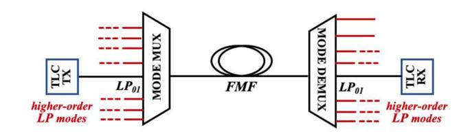
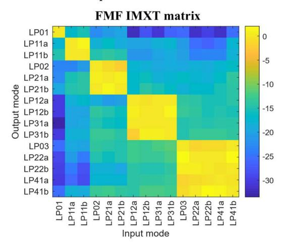
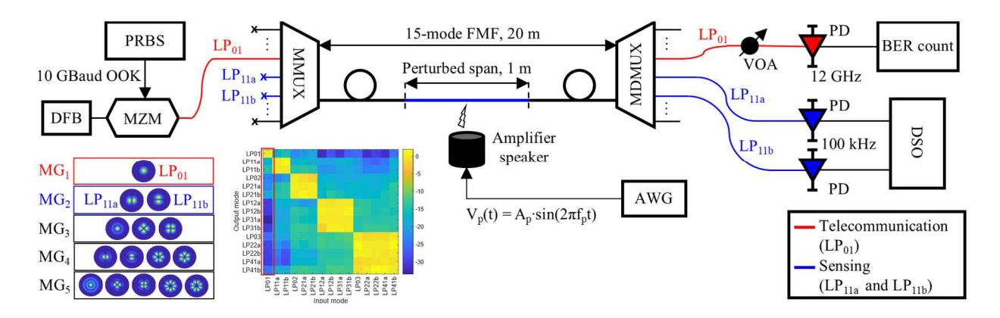
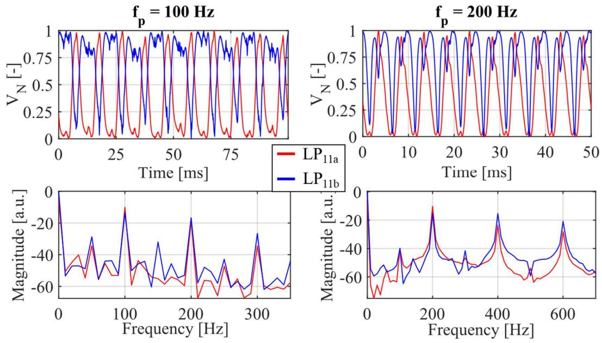
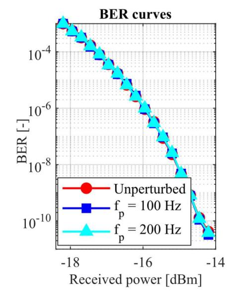

# Exploitation of FMF capabilities for joint communications and sensing

Stefano Gaiani *Dept. Electronics, Information and Bioengineering POLITECNICO DI MILANO*  Milan, Italy stefano.gaiani@polimi.it

Paola Parolari *Dept. Electronics, Information and Bioengineering POLITECNICO DI MILANO*  Milan, Italy paola.parolari@polimi.it

Marco Fasano *Dept. Electronics, Information and Bioengineering POLITECNICO DI MILANO*  Milan, Italy marco.fasano@polimi.it

Paolo Martelli *Dept. Electronics, Information and Bioengineering POLITECNICO DI MILANO*  Milan, Italy paolo.martelli@polimi.it

Alberto Gatto *Dept. Electronics, Information and Bioengineering POLITECNICO DI MILANO*  Milan, Italy alberto.gatto@polimi.it

Pierpaolo Boffi *Dept. Electronics, Information and Bioengineering POLITECNICO DI MILANO*  Milan, Italy pierpaolo.boffi@polimi.it

*Abstract***—Mode-division multiplexing in few-mode fibers is used to provide joint communications and sensing in optical communications. The fundamental mode transports the telecom data, while the crosstalk among the higher-order modes can be exploited to monitor perturbations affecting the fiber.**

*Keywords— Few-mode fiber, multi-mode fiber, fiber sensing, inter-modal crosstalk.* 

#### I. INTRODUCTION

Nowadays, the possibility to make sensitive the telecommunications (TLC) fibers is an ambitious target to pursue joint communications and sensing. On the other hand, few-mode fibers (FMFs) are today proposed for high capacity space-division multiplexing (SDM) transmission, with a careful management of the intermodal crosstalk (IMXT), achieved by full-MIMO based coherent detection [1] or by mode-group transmission [2]. FMFs appears also interesting for applications in optical sensing [3]: in fact, various linearly polarized (LP) modes inside the FMF respond differently when subjected to external perturbations, such as temperature, pressure and strain: consequently, numerous parameters can be analyzed simultaneously by monitoring the interference between two modes [4]. Usually a short spool of FMF, some meters long, spliced between two pieces of standard singlemode fiber (SMF) is used to achieve a SMF-FMF-SMF structure, by exploiting the overlap integral in the splice points between the SMF fundamental mode and the higher-order modes of the FMF [5].

 In this paper we propose a solution to make sensitive the FMF, by analyzing the higher-order modes directly excited by the fundamental mode transporting the TLC data. The higher-modes are excited for free in the FMF by the IMXT introduced by the use of a pair of non-ideal mode multiplexer/demultiplexer (MUX/DEMUX). Their power variation is exploited to detect the perturbation occurring to the FMF. With respect to the SMF-FMF-SMF structure, the employment of the mode MUX/DEMUX allows to properly chose the best higher-order modes to be analyzed to detect FMF perturbations at the best, as well as to assure the TLC data transmission in parallel. We experimentally assess the capabilities of such a few-mode interferometric sensor by current designations by a FMF supporting 15 spatial modes. Joint communications and sensing is demonstrated by propagating over the LP01 mode a 10-Gb/s NRZ signal.

#### II. SENSING FMF SCHEME

The sensing scheme directly embedded in the FMF is illustrated in Fig.1: in the mode MUX the fundamental mode LP01 is excited with the TLC signal, while all the other inputs of the mode MUX are switched off. After propagation in the FMF, the LP01 TLC signal is demultiplexed by the mode DEMUX. The non-ideal behavior of the mode MUX introduces a little IMXT, enough to excite higher-order modes.

After the propagation in the FMF, the higher-order modes are demultiplexed by the last mode DEMUX and their power is analyzed singularly. The advantage of this few-mode interferometric sensor is that the higher-order modes are directly excited by the TLC signal propagating on the fundamental mode: the sensing capabilities of the FMF are achieved for free thanks to the IMXT, accumulated by the mode MUX/DEMUX. No laser sources are necessary to excite the higher-order modes.

Fig. 1. Schematic diagram of the FMF with the TLC signal propagating in the fundamental mode, made sensitive by analyzing the higher-order modes excited owing to the IGXT.

## III. EXPERIMENTAL SET UP

For the experimental assessment of the proposed sensing FMF, we employ a 15-mode fiber supporting 15 spatial modes [6] and 5 mode groups. The fiber design based on a trenchassisted, graded-index profile allows to minimize the IMXT induced by propagation among the modes belonging to different groups, while a strong coupling is expected among the modes belonging to the same group. The mode MUX/DEMUX pair is based on 15 spatial modes multi-plane light conversion (MPLC) [7]. The measured IMXT in backto-back conditions is reported in Fig. 2. As shown in the IMXT matrix, the non-ideal MUX/DEMUX pair introduces IMXT among the mode groups. Preliminary experimentation was done considering propagation over 20 m of FMF inside the mode MUX/DEMUX pair.

Fig. 2. Measured IMXT matrix of the mode MUX/DEMUX pair. The red rectangle highlights the column related to the IMXT from LP01 mode to all the other modes.

As shown in Fig. 3, the TLC signal s(t) to be transported on the fundamental mode LP01 is generated by on-off keying (OOK) modulating at 10 Gbaud the emission of a distributed feedback (DFB) laser at a 1550 nm by means of a LiNbO3 Mach-Zehnder modulator (MZM) with a pseudo-random bit sequence (PRBS) having length 216-1. The 10-Gb/s signal s(t) is then injected in the input port of the mode MUX corresponding to the fundamental LP01 mode of the FMF in output. The launch power of the LP01 mode after the mode MUX is around -2 dBm.

Due to the mode MUX non-ideality, a fraction of the LP01 input power is actually coupled to all the other higher-order modes, according to the IMXT matrix of Fig. 2. As an example, when the fundamental mode LP01 (belonging to the first group) is excited, around -16 dB IMXT is generated owing to the crossing of the MUX/DEMUX pair with the adjacent modes LP11a and LP11b, belonging to the second group. Around -20 dB IMXT is experimented for the modes belonging to the third group (LP02, LP21a and LP21b). The IMXT with the higher group modes is almost negligible. After the propagation in the 15-mode FMF, the fundamental mode and the higher-order modes excited by the IMXT, introduced by the mode MUX and by the FMF propagation, are demultiplexed by the mode DEMUX, transforming the input FMF modes into the different SMF outputs.

Controlled mechanical vibrations with given amplitude and frequency are applied on the FMF by fixing a FMF span around 1-m long to the membrane of an acoustic amplifier speaker, whereas the fiber ends are blocked. The membrane is driven with a voltage sinusoidal signal generated by an arbitrary waveform generator (AWG) at a desired frequency fp, in order to obtain a suitable vibration of the FMF span. The optical signal at the mode DEMUX output corresponding to the LP01 mode, carrying the TLC data with a power of approximately – 6 dBm, is monitored during the application of the mechanical vibration to verify that its performance in terms of bit-error rate (BER) remains unchanged. After crossing a variable optical attenuator (VOA), the TLC signal is directly received by a 12-GHz bandwidth photodiode (PD) and analyzed by a BER tester for BER computation. The optical signals coming from the other mode DEMUX outputs corresponding to the higher-order modes are properly selected and detected by some low-noise 100-kHz bandwidth PDs and monitored by means of an oscilloscope. In particular, we selected LP11a and LP11b, characterized by the higher IMXT.

## IV. SENSING FMF

Fig. 4 shows the experimental results demonstrating the operation of the FMF as a sensor, by analyzing the behavior of the LP11a and LP11b modes, excited for free in our scheme. The reported measures are achieved by applying a low-pass filter to erase the high-frequency noise without affecting the perturbation sinusoid harmonics. Fig. 4 at the top reports the normalized received power in time for the LP11a and LP11b modes (red and blue line respectively), in case of applied perturbation at 100 Hz and 200 Hz. In Fig. 4 at the bottom the power spectra for the LP11a and LP11b modes (again red and blue line respectively), in case of applied perturbation at 100 Hz and 200 Hz.

The excited LP11a and LP11b modes actually sense the perturbation that is applied to the FMF, showing the same periodicity of the applied perturbation. Moreover, in the power spectra it is evident the presence of a peak in correspondence of the used vibration frequency. This result derives from the variation of the amplitude coupling coefficients (describing the IMXT in the FMF) induced by the perturbation. The effect that the perturbation produces on the modes depends by the mode itself: by analyzing the LP11 modes, the two power trends are complementary, one with respect to the other: when LP11a mode power increases, LP11b mode power decreases (and viceversa). Moreover, looking at the spectra, it is easy to observe that the modes suffer in a different way from higher-order harmonics due to the mechanical system non-linear response and non-idealities. Specific modes are variously affected by external events. The employment of a FMF supporting a large number of modes can allow to explore many higher-order modes, suitably chosen thanks to the use of the mode MUX/DEMUX, analyzing their distinct response to monitor different sensing perturbation.

# V. TLC SIGNAL PERFORMANCE

The experimented sensitive FMF is used to transmit a TLC signal on the fundamental mode. No IMXT induced by higherorder modes on the TLC signal is present, considering that the higher-order modes are excited just by the LP01 itself. We verified that the mechanical vibrations applied to the FMF do not affect the BER of the TLC signal owing to possible IMXT on the higher-order modes induced by the perturbation. The impact of the FMF perturbation on TLC signal performance was evaluated by measuring the sensitivity curves as a function of the received optical power, varied at the receiver input by the VOA. The BER curves reported in Fig. 5 are obtained in case of unperturbed FMF (red curve with circles), perturbed FMF with 100 Hz vibration (blue curve with squares), and perturbed FMF with a 200 Hz vibration (cyan curve with triangles). Each curve is built by measuring the BER at 17 different power values, ranging from -18.2 dBm (corresponding to a 10-3 BER) up to -14.2 dBm (corresponding approximately to a 4∙10-11 BER). The three curves are superimposed and no significant detrimental effect of the perturbation is observed on the performance of the TLC signal.

Fig. 3. Experimental set up for the assessment of the sensing FMF. M(D)MUX: mode (de)multiplexer.

Fig. 4. LP11a (in red) and LP11b (in blue) modes response to the vibration applied to the FMF. Top: normalized received power in case of applied vibration at 100 Hz (on the left) and 200 Hz (on the right). Bottom: power spectra in case of applied vibration at 100 Hz (on the left) and 200 Hz (on the right).

#### VI. CONCLUSION

The sensing capabilities of the FMF have been experimented to detect the impact of mechanical perturbations on the FMF, by exploiting the monitoring of the higher-order modes directly excited by the presence of the TLC signal propagating in the fundamental mode. The sensing feature is provided to the FMF for free through the IMXT generated by the fundamental mode transporting the TLC signal, without any detrimental effect on the TLC signal in terms of BER. Preliminary assessment in lab has demonstrated the possibility to provide joint communications and sensing in FMFs.

## ACKNOWLEDGMENT

The authors would like to thank Daniele Orsuti and Ruben Luis for the useful discussion and Cristian Antonelli and Antonio Mecozzi for the mode MUX/DEMUX availability. This work was supported by the European Union – Next Generation EU under the Italian National Recovery and Resilience Plan (NRRP), Mission 4, Component 2, Investment 1.3, CUP D43C22003080001, partnership on "Telecommunications of Future" (PE00000001 - program "RESTART", project RIGOLETTO).

Fig. 5. Measured BER for the LP01 mode transporting the TLC data with unperturbed FMF (red line), FMF perturbed by 100-Hz vibration (blue line), and FMF perturbed by 200-Hz vibration (cyan line).

#### REFERENCES

- [1] G. Rademacher et al., "Peta-bit-per-second optical communications system using a standard cladding diameter 15-mode fiber," Nature Commun., vol. 12, no. 4238, 2021.
- [2] A. Gatto et al., "Partial-MIMO Based Mode-Group Transmission and Routing in a Field-Deployed 15-Mode Network: Throughput, DSP Resources and Network Flexibility," Journal of Lightwave Technology, vol. 42, no. 14, pp. 4720-4732, 2024.
- [3] I. Ashry, A. Trichili, T. Khee Ng, B.S. Ooi, "A Review of Using Few-Mode Fibers for Optical Sensing," IEEE Access, vol. 8, pp. 179592- 179605, 2020.
- [4] N. Irawati, L. Gruner-Nielsen, L.S. Rishoj, K. Rottwitt, "Strain and temperature sensor using few-mode fiber, designing guidelines and results," Optical Fiber Technology, vol. 80, 103465, 2023.

- [5] L. Gruner-Nielsen, M. Vandborg, N. Irawati, K. Rottwitt, M. Lassen, "Simple Few-Mode Sensor with Temperature-Strain Discrimination," in Proc. 2024 European Conference on Optical Communication (ECOC), Frankfurt, Germany, 2024, pp. 1683-1686.
- [6] P. Sillard et al., "Low-differential-mode-group-delay 9-LP-mode fiber", J. Lightw. Technol., vol. 34, no. 2, pp. 425-430, 2016.
- [7] G. Labroille, B. Denolle, P. Jian, P. Genevaux, N. Treps and J.-F. Morizur, "Efficient and mode selective spatial mode multiplexer based on multi-plane light conversion", Opt. Exp., vol. 22, no. 13, pp. 15599- 15607, 2014.

**.**