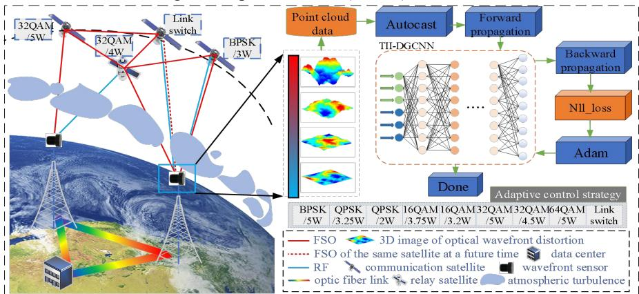
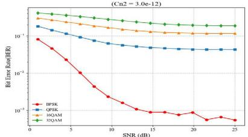
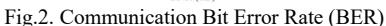
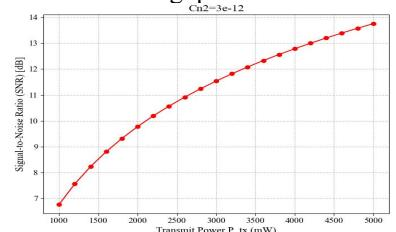
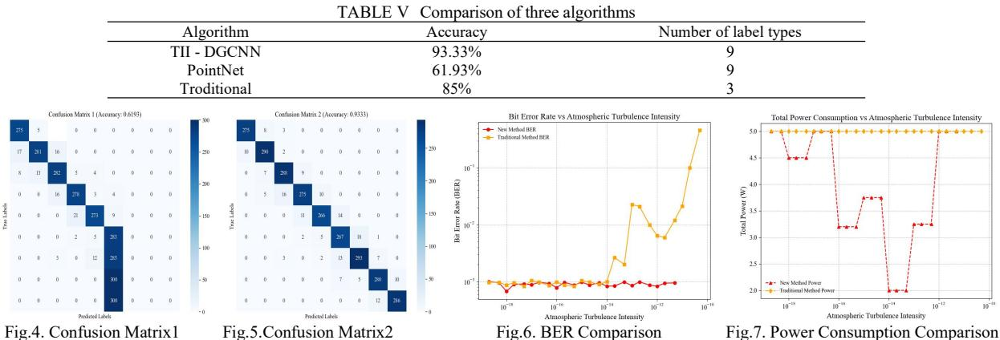

WP-B-16 OECC/PSC 2025

# An Adaptive Control System for Satellite-Ground Laser Communication Based on Integrated Sensing and Communication

Mingyuan Wu1 Hui Yang1,\* Wenxin Liu1 Qiuyan Yao1 Jie Zhang1 Mohamed Cheriet2

1StateKey Laboratory of Information Photonics and Optical Communications,

Beijing University of Posts and Telecommunications, China

2Synchromedia Laboratory for Multimedia Communication in Telepresence, University of Quebec, Canada

Author e-mail address: yanghui@bupt.edu.cn

**Abstract:** We obtain turbulence information from the distorted beam data through a dynamic graph convolutional neural network and perform adaptive communication control. Compared to existing technology, the bit error rate is reduced by 9.64%, and power consumption is reduced by 20.75%. **Keywords:** Free-space optical transmission;

#### I. INTRODUCTION

In recent years, satellite-ground laser communication technology has developed rapidly. In September 2024, the French tech company Unseenlabs achieved the world's first laser communication between a satellite and a commercial ground station, laying the foundation for space-based laser communication applications. However, atmospheric turbulence poses a serious obstacle to high-quality satellite-ground laser communication, as it causes the laser beam to refract, leading to wavefront distortion[1], which affects signal quality. Therefore, accurately sensing turbulence and implementing adaptive control has become a key issue[2]. Currently, atmospheric turbulence identification mainly relies on meteorological data such as wind speed for prediction. However, there are significant differences in the mapping relationship between meteorological data from different regions and turbulence, making the mapping challenging and reducing the accuracy of identification. Additionally, the coarse granularity of identification limits the effectiveness of adaptive control technologies. To address these issues, this paper proposes an atmospheric turbulence identification and adaptive control system based on the Integrated Sensing and Communication (ISAC) framework. In the satellite-ground laser communication process, the communication beam is captured by the wavefront sensor at the receiving end. Due to the impact of atmospheric turbulence, the wavefront is distorted, causing the propagation direction of the sub-beams to shift. Subsequently, the optical detector records the spot positions formed by each subbeam and reconstructs the shape of the entire wavefront, generating a 3D beam distortion map. We innovatively use this 3D beam distortion map as the input to the system. The distortion data of the beam is mapped to the intensity of the turbulence, and an improved dynamic graph convolutional neural network(DGCNN) is used to identify turbulence intensity levels, achieving a nine-class classification of atmospheric turbulence intensity. Based on the identification results, fine-grained dual-layer adaptive control of output power and modulation format is implemented, ensuring highquality communication for the satellite-ground optical network(SGON).

## Fig.1. system architecture diagram

## II. SYSTEM FRAMEWOEK

# A. Introduction of the overall framework

As shown in Fig.1, this paper proposes using a wavefront sensor at the receiver to capture distortion image data of the communication beam and employs a turbulence intensity identification algorithm based on dynamic graph

convolutional neural networks (TII - DGCNN) to achieve precise turbulence classification. Based on the classification results, a fine-grained adaptive control strategy is formulated[3], and the strategy is forwarded to the transmitter via free-space optical(FSO) or radio frequency(RF) communication to ensure normal communication[4][5].

# B. Algorithm Introduction

DGCNN is a deep learning model designed to handle graph data with irregular structures. We use the algorithm to extract the distortion features of the beam, combined with mixed precision training and GradScaler techniques for model training, thereby achieving precise identification of turbulence intensity.

#### TABLE I ALGORITHM PSEUDO CODE PROGRAM

#### Algorithm 1:Turbulence Intensity Identification Algorithm Based on DGCNN(TII - DGCNN)

Input:Three-dimensional beam distortion image data.

Output: The intensity levels of atmospheric turbulence

- 1 Convert the 3D image data into point cloud data
- 2 Map the point cloud data to turbulence intensity levels
- 3 Initialize the DGCNN model with k=10,the Adam optimizer with lr=0.0001,GradScaler for mixed precision training.
- 4 Split the dataset into training (80%) and testing (20%) sets
- 5 Prepare DataLoader for training and testing sets:batch size=32,shuffle=True,num workers=8 (parallel data loading)
- 6 for episodes =  $1 \rightarrow E$  do:
- 7 Load a batch of data using train loader and transfer it to the GPU.
- 8 Perform forward propagation under mixed precision and calculate the loss.
- 9 Compute the negative log-likelihood loss
- 10 Minimize the target loss:NLLLoss(x,y) =  $-\frac{1}{N}\sum_{i} \log(p_{i,y_i})$
- 11 Perform backpropagation and update the parameters using the Adam optimizer
- 12 Update GradScaler to adjust the gradient scaling factor

#### 13 end for

The existing classification of atmospheric turbulence intensity levels, as shown in Table II.

| TARLEII | New  | Classification | Level |
|---------|------|----------------|-------|
| IADLUI  | INCW | Classification | LCVCI |

| Level                | Weak                                      | Moderate                                                                  | Strong                                    |  |  |
|----------------------|-------------------------------------------|---------------------------------------------------------------------------|-------------------------------------------|--|--|
| Turbulence intensity | $C_n^2 \le 6.4 \times 10^{-17}  m^{-2/3}$ | $2.5 \times 10^{-13} m^{-2/3} \ge C_n^2 \ge 6.4 \times 10^{-17} m^{-2/3}$ | $C_n^2 \ge 2.5 \times 10^{-13}  m^{-2/3}$ |  |  |

In our system, we first construct an atmospheric turbulence intensity perception model based on the TII - DGCNN algorithm. We classify the intensity of atmospheric turbulence into 9 levels, as shown in Table III, with finer granularity.

TABLE III New Classification Level

| Level | Turbulence intensity                                                | Level | Turbulence intensity                                                  |
|-------|---------------------------------------------------------------------|-------|-----------------------------------------------------------------------|
| I     | $C_n^2 \le 1 \times 10^{-18}  m^{-2/3}$                             | VI    | $1 \times 10^{-13} m^{-2/3} \ge C_n^2 > 1 \times 10^{-14} m^{-2/3}$   |
| П     | $1 \times 10^{-17} m^{-2/3} \ge C_n^2 > 1 \times 10^{-18} m^{-2/3}$ | VII   | $1 \times 10^{-12}  m^{-2/3} \ge C_n^2 > 1 \times 10^{-13}  m^{-2/3}$ |
| III   | $1 \times 10^{-16} m^{-2/3} \ge C_n^2 > 1 \times 10^{-17} m^{-2/3}$ | VIII  | $3 \times 10^{-12} m^{-2/3} \ge C_n^2 > 1 \times 10^{-12} m^{-2/3}$   |
| IV    | $1 \times 10^{-15} m^{-2/3} \ge C_n^2 > 1 \times 10^{-16} m^{-2/3}$ | IX    | $C_n^2 > 3 \times 10^{-12}  m^{-2/3}$                                 |
| V     | $1 \times 10^{-14} m^{-2/3} \ge C_n^2 > 1 \times 10^{-15} m^{-2/3}$ |       |                                                                       |

# C. Adaptive control strategy.

Adaptive control technology needs to maintain a low bit error rate (not exceeding 0.1%) while achieving efficient data transmission[6]. We simulated the bit error rate (BER) curves for different modulation formats after passing through atmospheric turbulence. As shown in Fig. 2, under level VIII turbulence, only BPSK meets the requirements when the signal-to-noise ratio (SNR) exceeds 13.75dB. Therefore, the system needs to dynamically adjust the communication modulation format to achieve low BER and high network throughput.

Fig.3. signal-to-noise ratio (SNR)

Assuming the maximum output power is 5W, we then simulated the SNR at different optical output powers[7]. As shown in Fig. 3, under level VIII turbulence, when the output power is 5W, the SNR can reach 13.75dB. The system needs to dynamically adjust the power parameters to achieve low-power communication while maintaining a low BER. The relationship between SNR and output power is given by Eq. 2. Ultimately, the adaptive control strategy under different turbulence levels, as shown in Table IV, was developed.

$$SNR(dB) = 10\log_{10}(\frac{P_{tx} \times \exp(-0.033 \cdot C_n^2 \cdot L^{11/6} \cdot \lambda^{-7/6} \cdot L)}{P_{noise}})$$
(2)

where L is the transmission distance,  $\lambda$  is the wavelength of the light,  $C_n^2$  is the refractive index structure constant,  $P_{tx}$  is the output power,  $P_{noise}$  is the noise power, which includes photon noise, thermal noise and background light noise.

| TABLE IV Fine-grained adaptive control strategy |          |            |          |            |             |         |            |         |             |
|-------------------------------------------------|----------|------------|----------|------------|-------------|---------|------------|---------|-------------|
| level                                           | I        | II         | III      | IV         | V           | VI      | VII        | VIII    | IX          |
| Strategy                                        | 64QAM/5W | 32QAM/4.5W | 32QAM/5W | 16QAM/3.2W | 16QAM/3.75W | QPSK/2W | QPSK/3.25W | BPSK/5W | Link switch |

#### III. EXPERIMENTAL RESULT

We first validate the performance of the TII-DGCNN algorithm for atmospheric turbulence intensity level classification through a comparison with multiple algorithms. Then, we conduct a satellite-ground laser communication simulation based on an adaptive control strategy to verify the system's usability. As shown in Fig. 4, for the problem of recognition and classification of 3D datasets, the PointNet algorithm failed to learn the features of small-sized samples, leading to poor classification performance. As shown in Fig. 5, the TII-DGCNN algorithm successfully identified most of the labels. Since the boundary values between the labels are continuous, misclassification between adjacent labels may occur, which is inevitable. Overall, the identification accuracy reached 93.33%, validating the effectiveness of the algorithm. As shown in Table V, compared to traditional algorithms based on meteorological data analysis, the TII-DGCNN algorithm achieves finer classification and higher accuracy in atmospheric turbulence intensity classification.

Inspired by the concept of virtual topology, we assume that the intensity of atmospheric turbulence and relative positions remain unchanged over a very short period of time, and that the current turbulence characteristics can represent those of the surrounding spatial region. Based on the adaptive control strategy shown in Table IV, we conducted simulation verification. In the simulation environment, the laser beam has a wavelength of 1550 nm and a diameter of 1 meter, the vertical distance between the satellite and the ground station is 495 kilometers, the vertical depth of the turbulence region is 15 kilometers, referring to relevant literature, we established a coarse-grained adaptive control strategy for the traditional satellite-to-ground communication mechanism for comparative analysis: when  $C_n^2 \ge 5 \times 10^{-15}$ , the strategy employed is BPSK/5W, and when  $C_n^2 < 5 \times 10^{-15}$ , the strategy employed is 32QAM/5W.

As shown in Figs 6 and 7, under strong turbulence conditions, the lack of a fine-grained adaptive control method in the traditional communication mechanism leads to an increase in the BER. However, by adopting the adaptive control strategy we proposed, the average BER is significantly reduced by 9.64%, and the total power consumption is reduced by 20.75%, thereby validating the feasibility of the system.

# IV. CONCLUSIONS

This paper investigates the issue of stable laser communication between satellites and ground stations under atmospheric turbulence. We established an ISAC system, utilizing the TII-DGCNN algorithm to sense turbulence during the communication process and optimizing the communication mechanism through adaptive control. Simulation results demonstrate that, compared to traditional solutions, the proposed method significantly reduces the BER and output power consumption, enhancing the stability of the SGON. Future work will consider more complex atmospheric models, such as dynamic rain and fog attenuation models, to achieve more comprehensive sensing and adaptive control.

### ACKNOWLEDGMENT

This work has been supported in part by NSFC project (U24A20216), Young Elite Scientists Sponsorship Program by CAST (2023QNRC001), Fund of SKL of IPOC (BUPT) (IPOC2024ZR02), and supported by the Fundamental Research Funds for the Central Universities (2023ZCJH04).

#### REFERENCES

- [1] B. Luo, J. Wang, Y. Yang, J. Lan and Y. Liu, "Evaluation and Enhancement of Laser Power Transfer Efficiency in the Presence of Atmospheric Turbulence," in IEEE Journal of Photovoltaics, vol. 14, no. 3, pp. 466-472, May 2024, doi: 10.1109/JPHOTOV.2024.3372331.
- [2] Z. Niu, H. Yang, Q. Yao, B. Wu, S. Yin and J. Zhang, "Flexible FSO/RF Aerial Topology Reconstruction for High Network Throughput in Dynamic Atmosphere Condition," 2024 IEEE International Conference on Communications Workshops (ICC Workshops), Denver, CO, USA, 2024, pp. 1280-1285, doi: 10.1109/ICCWorkshops59551.2024.10615585.
- [3] Z. Hu, F. Wen, J. Yong, F. Fan, B. Wu and K. Qiu, "Joint Investigation on Routing and Transmission Performance for Dynamic Low-Earth-Orbit (LEO) Optical Networks," 2023 Opto-Electronics and Communications Conference (OECC), Shanghai, China, 2023, pp. 1-4, doi: 10.1109/OECC56963.2023.10209990.
- [4] Z. Niu et al., "Reliable Low-Latency Routing for VLEO Satellite Optical Network: A Multiagent Reinforcement Learning Approach," in IEEE Internet of Things Journal, vol. 12, no. 3, pp. 2309-2321, 1 Feb.1, 2025, doi: 10.1109/JIOT.2024.3457498.
- [5] V. V. Toporovsky, I. V. Galaktionov, A. N. Nikitin, A. V. Kudryashov, V. V. Samarkin and A. L. Rukosuev, "Woofer-tweeter adaptive optical system for atmospheric turbulence mitigation," 2024 International Conference Laser Optics (ICLO), Saint Petersburg, Russian Federation, 2024, pp. 76-76, doi: 10.1109/ICLO59702.2024.10624012.
- [6] Y. Zhang, L. Xie, X. Xie, Z. -Y. Sun and K. Zhang, "Fuzzy Adaptive Control for Stochastic Nonstrict Feedback Systems With Multiple Time-Delays: A Novel Lyapunov-Krasovskii Method," in IEEE Transactions on Fuzzy Systems, vol. 32, no. 6, pp. 3815-3824, June 2024, doi: 10.1109/TFUZZ.2024.3384588.
- [7] M. Sliti and M. Garai, "Performance analysis of FSO communication systems under different atmospheric conditions.," 2023 28th Asia Pacific Conference on Communications (APCC), Sydney, Australia, 2023, pp. 454-458, doi: 10.1109/APCC60132.2023.10460727.