# Low-PAPR OFDM-ISAC Waveform Design Based on Frequency-Domain Phase Differences

Kaimin L[i](https://orcid.org/0009-0007-3938-6747) , Jiahuan Wan[g](https://orcid.org/0000-0002-3449-6337) , Haixia Cui, *Seni[or](https://orcid.org/0000-0002-8281-6251) Member, IEEE*, Bingpeng Zhou [,](https://orcid.org/0000-0003-3764-6609) *Member, IEEE*, and Pingzhi Fan , *Life Fellow, IEEE*

*Abstract***—Low peak-to-average power ratio (PAPR) orthogonal frequency division multiplexing (OFDM) waveform design is a crucial issue in integrated sensing and communication (ISAC). This article introduces an OFDM-ISAC waveform design that utilizes the entire spectrum simultaneously for both communication and sensing by leveraging a novel degree of freedom (DoF): the frequency-domain phase difference (PD). Based on this concept, we develop a novel PD-based OFDM-ISAC waveform structure and utilize it to design a PD-based low-PAPR OFDM-ISAC (PLPOI) waveform. The design is formulated as an optimization problem incorporating four key constraints: 1) the time-frequency relationship equation; 2) frequency-domain unimodular constraints; 3) PD constraints; and 4) time-domain low PAPR requirements. To solve this challenging nonconvex problem, we develop an efficient algorithm, alternating direction method of multipliers (ADMM)-PLPOI, based on the ADMM framework. Extensive simulation results demonstrate that the proposed PLPOI waveform achieves significant improvements in both PAPR and bit error rate (BER) performance compared to conventional OFDM-ISAC waveforms.**

*Index Terms***—Frequency domain phase difference (PD), integrated sensing and communication (ISAC), orthogonal frequency division multiplexing (OFDM), peak-to-average power ratio (PAPR).**

# I. INTRODUCTION

**I** TEGRATED sensing and communication (ISAC) has emerged as a key technology for next-generation wireless networks, driven by the growing demand for spectrum resources [\[1\]](#page-11-0), [\[2\]](#page-11-1), [\[3\]](#page-11-2), [\[4\]](#page-11-3), [\[5\]](#page-11-4), [\[6\]](#page-11-5), which improves system efficiency and meets the practical requirements of sixthgeneration (6G) applications such as vehicle-to-everything [\[7\]](#page-11-6) and massive Internet of Things (IoT) [\[8\]](#page-11-7). The core of

Received 9 July 2025; accepted 9 August 2025. Date of publication 18 August 2025; date of current version 24 October 2025. This work was supported in part by NSFC Project under Grant U23A20274 and Grant 62371478; in part by the Guangdong Basic and Applied Basic Research Foundation under Grant 2024A1515012052; in part by the Science and Technology Plan of Shenzhen under Grant JCYJ20240813151253068; and in part by the South China Normal University Research Development Fund for Young Faculty under Grant 24KJ04. *(Corresponding author: Jiahuan Wang.)*

Kaimin Li, Jiahuan Wang, and Haixia Cui are with the School of Electronic Science and Engineering (School of Microelectronics), South China Normal University, Foshan 528225, China (e-mail: 2023025040@m.scnu.edu.cn; jiahuanwang@m.scnu.edu.cn; cuihaixia@scnu.edu.cn).

Bingpeng Zhou is with the School of Electronics and Communication Engineering, Sun Yat-sen University, Shenzhen 518000, China (e-mail: zhoubp3@mail.sysu.edu.cn).

Pingzhi Fan is with the School of Information Science and Technology, Southwest Jiaotong University, Chengdu 611756, China (e-mail: pzfan@swjtu.edu.cn).

Digital Object Identifier 10.1109/JIOT.2025.3599171

ISAC implementation is waveform design [\[9\]](#page-11-8), which must strike a balance between high-rate data transmission and accurate target detection while addressing practical challenges such as interference and hardware limitations. The orthogonal frequency division multiplexing (OFDM) waveform, employed in existing 4G and 5G systems, is a leading candidate for 6G ISAC due to its multicarrier structure, which provides robustness against frequency-selective fading and supports flexible subcarrier allocation for efficient resource sharing [\[10\]](#page-11-9). However, the high peak-to-average power ratio (PAPR) of OFDM signals poses a challenge for ISAC waveform design, as it reduces the power amplifier efficiency and induces nonlinear distortion, which degrades the communication and sensing performance in ISAC systems [\[11\]](#page-11-10).

Reducing PAPR has always been a critical issue in OFDM waveform design [\[12\]](#page-11-11), [\[13\]](#page-11-12), [\[14\]](#page-11-13), [\[15\]](#page-11-14), [\[16\]](#page-11-15). In conventional communication systems, methods for reducing PAPR primarily include three approaches: 1) signal distortion techniques [\[13\]](#page-11-12); 2) multiple signaling and coding techniques [\[15\]](#page-11-14); and 3) probability techniques [\[14\]](#page-11-13). For signal distortion techniques, recent research focuses on adaptive gain adjustment methods [\[13\]](#page-11-12) and the combination of windowing functions with clipping parameters [\[16\]](#page-11-15), which effectively reduce PAPR while maintaining acceptable bit error rate (BER) performance. In coding techniques, advances have been made through Gaussian matrix-based precoding [\[15\]](#page-11-14) and hybrid precoded-companding schemes [\[16\]](#page-11-15), demonstrating improved PAPR reduction with enhanced BER performance. For multiple signaling techniques, modified selective mapping approaches [\[14\]](#page-11-13) have been developed to reduce computational complexity while maintaining PAPR reduction capability, and lexicographical permutation methods [\[14\]](#page-11-13) have shown promise in reducing system complexity by up to 90% while achieving comparable error performance to traditional selective mapping.

However, PAPR reduction techniques used in communication-only OFDM systems cannot be directly applied to OFDM-ISAC systems, as OFDM-ISAC systems must simultaneously satisfy communication performance and sensing performance. To meet these dual-function requirements, several waveform design methods specifically for OFDM-ISAC systems have been proposed recently. Huang et al. [\[17\]](#page-11-16) aimed to achieve low PAPR while maintaining sensing capability. They considered a flexible RadCom structure in which the communication subcarriers are located in continuous radar frequency bands and proposed an *l*-norm cyclic algorithm (LNCA) to design waveforms that meet the low PAPR requirements. In [\[11\]](#page-11-10), the work focused on enhancing PAPR optimization under zero correlation sidelobe level constraint by introducing a direct optimization approach based on MM technique, which enables PAPR values to approach 1. Furthermore, to address computational complexity in large-scale scenarios, Wu et al. [\[18\]](#page-11-17) proposed an alternating direction method of multipliers (ADMM)-based method that significantly reduces complexity while maintaining fast convergence with large numbers of subcarriers. In addition, in [\[19\]](#page-11-18), an ADMM-based DFRC waveform design method was proposed that minimizes multiuser interference (MUI) under radar similarity and PAPR constraints, and an iterative algorithm was developed to obtain a stable waveform with desired PAPR characteristics. In [\[20\]](#page-11-19), a joint waveform optimization framework was proposed for MIMO-OFDM-based DFRC systems to minimize PAPR while maintaining dual-functional performance. To solve this nonconvex problem, an SDR-based algorithm was proposed to decompose the original problem into parallel subproblems, which can effectively achieve low PAPR.

Nevertheless, existing research mainly focuses on various approaches for PAPR reduction in ISAC systems. Some methods partition the spectrum into a communication band and an optimization band, where the PAPR reduction performance is influenced by the ratio between these bands. Another category of approaches includes a weighted optimization framework [\[21\]](#page-11-20) that balances radar and communication performance using a weighting parameter, and an extended formulation with PAPR constraints for OFDM signals [\[10\]](#page-11-9). In practical applications, if the parameters are not properly selected, achieving satisfactory PAPR optimization becomes increasingly challenging.

To address these limitations, this article proposes a unified OFDM-ISAC waveform design method based on frequencydomain phase difference (PD). Unlike existing approaches, our method enables simultaneous utilization of the entire frequency band for both communication and sensing purposes without weighting parameter. By introducing the concept of frequency-domain PD between the transmit signal and preset information signal, we develop a novel optimization framework that jointly considers PAPR reduction, spectral efficiency, and sensing performance. Through meticulous selection of the PD threshold and optimization of waveform parameters, our approach effectively realizes ISAC functionality while maintaining system performance. The main contributions can be summarized as follows.

- 1) We propose a novel low PAPR OFDM-ISAC waveform design that leverages frequency-domain PD as a new degree of freedom (DoF). Unlike traditional approaches that rely on spectrum partitioning, our approach utilizes the entire spectrum for both communication and sensing simultaneously, based on PD, allowing for more efficient spectrum usage.
- 2) To address the nonconvex optimization problem with coupled constraints, we develop an ADMM-based algorithm that solves the parameter coupling between time-domain PAPR and frequency-domain PD constraints through variable splitting, achieving efficient convergence with FFT-based implementation.

- 3) The proposed PD-based low-PAPR OFDM-ISAC (PLPOI) waveform design effectively reduces PAPR without compromising spectral efficiency. By adjusting the PD threshold θ within its feasible range, we can control PAPR while maintaining the constant modulus property in the frequency domain, which is critical for sensing.
- 4) The proposed waveform demonstrates excellent dualfunctional performance with good BER performance in communication and desirable periodic auto-correlation (PAC) characteristics in sensing, validating its effectiveness for practical OFDM-ISAC systems.

The remainder of this article is organized as follows. Section [II](#page-1-0) introduces the OFDM-ISAC system and waveform structure. In Section [III,](#page-3-0) we propose the OFDM-ISAC waveform optimization problem and introduce the ADMM framework to solve it. In Section [IV,](#page-6-0) Simulation verification are presented to show the superiority of the proposed OFDM-ISAC waveform. Finally, this article's conclusions are detailed in Section [V.](#page-10-0)

*Notations:* Throughout this manuscript, bold lowercase letters represent vectors, while bold uppercase letters represent matrices The symbols (·)∗, (·)*T* and (·)*H* denote the conjugate, transpose and conjugate transpose, respectively. The 2-norm of a vector **a** and the ∞ -norm of a vector **a** are indicated by **a**2 and **a**∞, respectively. The operation ◦ denotes the Hadamard product.

# II. OFDM ISAC SYSTEMS AND PROPOSED WAVEFORM STRUCTURE

## *A. OFDM-ISAC System Model*

Consider an OFDM-ISAC system, which consists of a base station (BS), a communication user, and multiple targets, as illustrated in Fig. [1.](#page-2-0) The BS functions as both a communication transmitter and a sensing receiver. Specifically, it is equipped with a transmit antenna to send OFDM-ISAC signals and a receive antenna to capture echoes [\[17\]](#page-11-16).

In the transmitter, the binary data is modulated via QPSK to obtain the intended frequency-domain communication sequence **c** = [*c*0, *c*1,..., *cN*−1] *T* , where *N* is the number of subcarriers. Then, the proposed PD-based waveform design schem[e1](#page-1-1) is applied to **c**, resulting in the desired frequencydomain ISAC signal **x** ∈ C*N*. After performing an *M*-points inverse discrete Fourier transform (IDFT), the OFDM symbol **s** ∈ C*M* is obtained. The symbol **s** is then transmitted after cyclic prefix (CP) insertion via the radio frequency (RF) chain, where CP is denoted as **s***CP* ∈ C*NCP* and *NCP* is the length of CP.

In the communication receiver, after CP removal operations, the discrete-time received signal undergoes discrete Fourier transform (DFT) transformation to yield its frequency-domain representation [\[22\]](#page-11-21)

$$\mathbf{y}_c = h_c \mathbf{x} + \mathbf{w}_c \tag{1}$$

where *hc* is the communication channel frequency response and **w***c* denotes the frequency-domain noise. In the sensing

1The details of the PD-based waveform design scheme are provided in Sections [II-B](#page-2-1) and [III](#page-3-0)

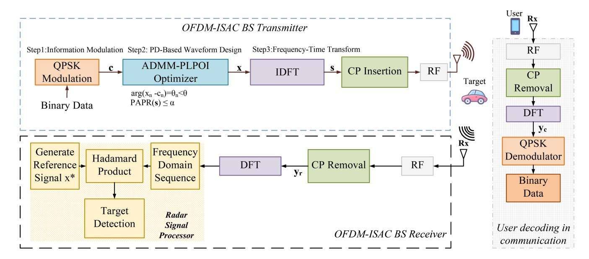

Fig. 1. System model.

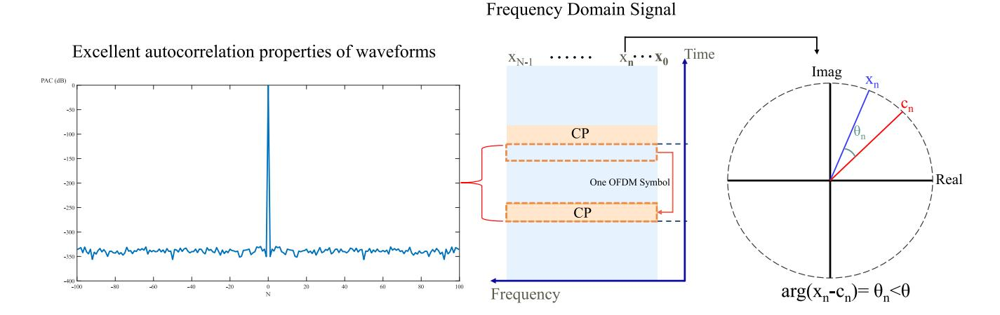

Fig. 2. OFDM-ISAC signal structure.

receiver, the frequency-domain received signal undergoes radar processing following established OFDM radar approaches. The processing involves element-wise operations with the transmitted signal reference to extract range and velocity information, generating a 2-D radar image where peaks correspond to target ranges and velocities [17], [23].

#### B. Proposed PD-Based OFDM-ISAC Waveform Structure

In order to fully utilize spectrum resources, we propose a new OFDM-ISAC waveform structure that simultaneously meets sensing and communication requirements. The proposed waveform structure in frequency domain is given by

$$\mathbf{x} = \mathbf{c} \circ \mathbf{e} \tag{2}$$

where  $\mathbf{x}$  is required to be unimodular, i.e.,

$$|x_n| = 1, n = 0, 1, 2, \dots, N - 1$$
 (3)

which ensures desirable time-domain PAC properties to enhance the sensing performance [17]. Besides, e

 $[e^{i\theta_0}, e^{i\theta_1}, \dots, e^{i\theta_{N-1}}]^T$  represents the phase shift sequence and  $\theta_n$  denotes the PD between  $c_n$  and  $x_n$ , i.e.,

$$arg(x_n - c_n) = \theta_n, \ n = 0, 1, \dots, N - 1.$$
 (4)

By substituting (2) into (1), the frequency-domain received signal at the communication receiver is given by

$$y_n^c = h_c c_n e^{jn\theta_n} + w_n^c, n = 0.1, \dots, N - 1$$
 (5)

where  $y_n^c$  is the *n*th element of  $\mathbf{y}_c$  and  $w_n^c$  is the *n*th element of  $\mathbf{w}_c$ . In order to correctly demodulate the symbol  $c_n$  from  $y_n^c$ , the PD  $\theta_n$  should be constrained by a threshold  $\theta \in (0, \pi/4)$ , i.e.

$$\arg(x_n - c_n) = \theta_n < \theta. \tag{6}$$

As illustrated in Fig. 2, the core idea of the proposed method is to design  $\mathbf{x}$  based on the communication symbols  $\mathbf{c}$ , such that  $\mathbf{x}$  possesses both communication and sensing capabilities. This is achieved by applying a PD  $\theta_n$  to each

communication symbol  $c_n$ . In other words, flexible design of  $\mathbf{x}$  can be achieved by adjusting  $\theta_n$  within an appropriate threshold  $\theta$ , which provides DoF for the design of  $\mathbf{x}$ . Furthermore, by fully exploiting this DoF, the proposed waveform can effectively control the PAPR in the time domain, as discussed below.

For a given  $\mathbf{x} \in \mathbb{C}^N$ , the PAPR of an OFDM waveform is equivalent to that of the four-times oversampled discrete signal  $\mathbf{s} \in \mathbb{C}^M$ , where M = 4N [17], [24], [25], [26],  $\mathbf{s}$  is the inverse DFT (IDFT) of  $\mathbf{x}$ , i.e.,

$$\mathbf{s} = \mathbf{A}\mathbf{x} \tag{7}$$

and  $\mathbf{A} \in \mathbb{C}^{M \times N}$  represents the IDFT matrix [27]

$$\mathbf{A} = \begin{bmatrix} 1 & 1 & 1 & \cdots & 1\\ 1 & e^{j2\pi/M} & e^{j2\pi/2/M} & \cdots & e^{j2\pi(N-1)/M}\\ 1 & e^{j2\pi2/M} & e^{j2\pi4/M} & \cdots & e^{j2\pi2(N-1)/M}\\ \vdots & \vdots & \vdots & \ddots & \vdots\\ 1 & e^{\frac{j2\pi(M-1)}{M}} & e^{\frac{j2\pi2(M-1)}{M}} & \cdots & e^{\frac{j2\pi(M-1)(N-1)}{M}} \end{bmatrix}.$$
(8)

The PAPR of s is defined as [28], [29]

$$PAPR(\mathbf{s}) = \frac{\max_{m=0,1,\dots,M-1} |s_m|^2}{\frac{1}{M} \sum_{m=0}^{M-1} |s_m|^2} = \frac{\|\mathbf{s}\|_{\infty}^2}{\frac{1}{M} \|\mathbf{s}\|_2^2}.$$
 (9)

The low-PAPR requirement for s can be expressed as

$$PAPR(s) < \alpha \tag{10}$$

where  $\alpha$  represents the PAPR threshold.

#### C. Problem Formulation

Based on the proposed PD-based OFDM-ISAC waveform structure in Section II-B, we formulate the following optimization problem to find the PLPOI waveform  $\mathbf{s}$  and its frequency-domain counterpart  $\mathbf{x}$ :

$$P_0$$
: find  $\mathbf{x}$ ,  $\mathbf{s}$  (11a)

$$s.t. \quad \mathbf{A}\mathbf{x} = \mathbf{s} \tag{11b}$$

$$PAPR(s) < \alpha \tag{11c}$$

$$arg(x_n - c_n) < \theta, \ n = 0, 1, \dots, N - 1$$
 (11d)

$$|x_n| = 1, \ n = 0, 1, \dots, N - 1$$
 (11e)

where (11b) represents the time-frequency relationship equation. The low PAPR constraint and PD constraint are guaranteed by (11c) and (11d), respectively. Furthermore, the unimodular constraint (11e) is imposed to guarantee perfect PAC properties.

The optimization problem  $P_0$  is challenging due to the fact that: 1) frequency-domain signal  $\mathbf{x}$  and time-domain signal  $\mathbf{s}$  are tightly coupled in the constraint (11b); 2) the fractional form of PAPR for time-domain signal  $\mathbf{s}$  makes the PAPR inequality constraint (11c) nonconvex; and 3) the PD inequality and unimodular constraint on frequency-domain signal  $\mathbf{x}$  make the (11d) and (11e) both nonconvex.

# III. DESIGN OF PD-BASED LOW-PAPR OFDM-ISAC WAVEFORMS USING AN ADMM-BASED APPROACH

In this section, we address the design of a frequency-domain PLPOI waveform based on the proposed ADMM-based algorithm, referred to as ADMM-PLPOI.

#### A. Proposed ADMM-PLPOI Algorithm

To address these challenges effectively, we propose an efficient iterative algorithm based on ADMM framework. First, the ADMM framework is employed to decouple the variables **x** and **s**, which can transform the original problem into two subproblems that are easier to solve independently [30]. In the following, we introduce the ADMM framework:

$$\mathbf{x}^{(k+1)} = \underset{\mathbf{x} \in \mathcal{X}}{\operatorname{argmin}} \quad L_{\rho_0} \left( \mathbf{x}, \mathbf{s}^{(k)}, \mathbf{y}^{(k)} \right)$$
 (12a)

$$\mathbf{s}^{(k+1)} = \underset{\mathbf{s} \in \mathcal{S}}{\operatorname{argmin}} \quad L_{\rho_0} \left( \mathbf{x}^{(k+1)}, \mathbf{s}, \mathbf{y}^{(k)} \right)$$
 (12b)

$$\mathbf{y}^{(k+1)} = \mathbf{y}^{(k)} + \rho_0(\mathbf{A}\mathbf{x}^{(k+1)} - \mathbf{s}^{(k+1)})$$
 (12c)

where  $\mathbf{x} \in \mathcal{X}$  represents frequency-domain related constraints (11d) and (11e), and  $\mathbf{s} \in \mathcal{S}$  corresponds to time-domain related constraint (11c). In addition,  $L_{\rho_0}(\mathbf{x}, \mathbf{s}, \mathbf{y})$  in (12) is the augmented Lagrangian function, which can be expressed as

$$L_{\rho_0}(\mathbf{x}, \mathbf{s}, \mathbf{y}) = \text{Re}\{\mathbf{y}^H(\mathbf{A}\mathbf{x} - \mathbf{s})\} + \frac{\rho_0}{2}\|\mathbf{A}\mathbf{x} - \mathbf{s}\|_2^2.$$
 (13)

Here, the penalty parameter  $\rho_0 > 0$ , y denotes the Lagrange multiplier, and k indicates the iteration number. Subsequently, we only need to focus on solving subproblems (12a) and (12b).

#### B. Solving Subproblem (12a)

By substituting (13) into (12a), the subproblem (12a) can be transformed into

$$\min_{\mathbf{x} \in \mathbf{C}^N} \quad \text{Re}\left\{\mathbf{y}^{(k)H} \left(\mathbf{A}\mathbf{x} - \mathbf{s}^{(k)}\right)\right\} + \frac{\rho_0}{2} \left\|\mathbf{A}\mathbf{x} - \mathbf{s}^{(k)}\right\|_2^2 \quad (14a)$$

s.t. 
$$\arg(x_n - c_n) < \theta, \ n = 0, 1, \dots, N - 1$$
 (14b)

$$|x_n| = 1, \ n = 0, 1, \dots, N - 1.$$
 (14c)

In fact, the problem (14) is still nonconvex with respect to  $\mathbf{x}$ . In the following, to address this and derive the analytical solution, we first reformulate the objective function into a complete square form, allowing us to obtain a relaxed solution by extending the constraints to  $\mathbb{C}^N$ . Then, we project the relaxed solution onto the nonconvex feasible set defined by constraints (14b) and (14c).

1) Objective Transformation and Relaxation: For the objective transformation, we present the following proposition.

*Proposition 1:* The objective function in (14a) can be equivalent to the following form:

$$\frac{\rho_0 M}{2} \left\| \mathbf{x} - \frac{1}{M} \mathbf{A}^H \left( \mathbf{s}^{(k)} - \frac{1}{\rho_0} \mathbf{y}^{(k)} \right) \right\|_2^2 + \text{const}$$
 (15)

where const denotes a constant term.

*Proof:* Based on the orthogonal property of IDFT matrix **A**, we have

$$\frac{1}{M}\mathbf{A}^{H}\mathbf{A} = \mathbf{I}_{N} \tag{16}$$

where  $\mathbf{I}_N$  is the  $N \times N$  identity matrix. Accordingly, we have

$$\|\mathbf{A}\mathbf{x} - \mathbf{g}\|_{2}^{2}$$

$$= \mathbf{x}^{H} \mathbf{A}^{H} \mathbf{A}\mathbf{x} - 2 \operatorname{Re} \{\mathbf{x}^{H} \mathbf{A}^{H} \mathbf{g}\} + \|\mathbf{g}\|_{2}^{2}$$

$$= M \|\mathbf{x}\|_{2}^{2} - 2 \operatorname{Re} \{\mathbf{x}^{H} \mathbf{A}^{H} \mathbf{g}\} + \|\mathbf{g}\|_{2}^{2}$$

$$= M \|\mathbf{x} - \frac{1}{M} \mathbf{A}^{H} \mathbf{g}\|_{2}^{2} - \frac{1}{M} \|\mathbf{A}^{H} \mathbf{g}\|_{2}^{2} + \|\mathbf{g}\|_{2}^{2}$$
(17)

where  $\mathbf{g} \in \mathbb{C}^{M}$ . Then, based on (17), we complete the square for (14a)

$$\operatorname{Re}\left\{\mathbf{y}^{(k)H}(\mathbf{A}\mathbf{x} - \mathbf{s}^{(k)})\right\} + \frac{\rho_{0}}{2} \left\|\mathbf{A}\mathbf{x} - \mathbf{s}^{(k)}\right\|_{2}^{2}$$

$$= \frac{\rho_{0}}{2} \left(2\operatorname{Re}\left\{\frac{1}{\rho_{0}}\mathbf{y}^{(k)H}(\mathbf{A}\mathbf{x} - \mathbf{s}^{(k)})\right\} + \left\|\mathbf{A}\mathbf{x} - \mathbf{s}^{(k)}\right\|_{2}^{2}\right)$$

$$= \frac{\rho_{0}}{2} \left(\left\|\mathbf{A}\mathbf{x} - \mathbf{s}^{(k)} + \frac{1}{\rho_{0}}\mathbf{y}^{(k)}\right\|_{2}^{2} - \left|\frac{1}{\rho_{0}}\mathbf{y}^{(k)}\right\|_{2}^{2}\right)$$

$$= \frac{\rho_{0}}{2} \left(M\left\|\mathbf{x} - \frac{1}{M}\mathbf{A}^{H}(\mathbf{s}^{(k)} - \frac{1}{\rho_{0}}\mathbf{y}^{(k)})\right\|_{2}^{2} - \left\|\frac{1}{\rho_{0}}\mathbf{y}^{(k)}\right\|_{2}^{2}\right)$$

$$- \frac{1}{M}\left\|\mathbf{A}^{H}\left(\mathbf{s}^{(k)} - \frac{1}{\rho_{0}}\mathbf{y}^{(k)}\right)\right\|_{2}^{2} + \left\|\mathbf{s}^{(k)} - \frac{1}{\rho_{0}}\mathbf{y}^{(k)}\right\|_{2}^{2}\right)$$

$$= \frac{\rho_{0}M}{2}\left\|\mathbf{x} - \frac{1}{M}\mathbf{A}^{H}\left(\mathbf{s}^{(k)} - \frac{1}{\rho_{0}}\mathbf{y}^{(k)}\right)\right\|_{2}^{2} + \operatorname{const}, \quad (18)$$

where const =  $-(1/2\rho_0)\|\mathbf{y}^{(k)}\|_2^2 - (\rho_0/2M)\|\mathbf{A}^H(\mathbf{s}^{(k)} - (1/\rho_0)\mathbf{y}^{(k)})\|_2^2 + (\rho_0/2)\|(\mathbf{s}^{(k)} - (1/\rho_0)\mathbf{y}^{(k)})\|_2^2$ .

According to Proposition 1, the objective function of (14) can be rewritten as (15). Then, we relax (14) into an unconstrained optimization problem

$$\min_{\mathbf{x} \in \mathbb{C}^N} \left\| \mathbf{x} - \frac{1}{M} \mathbf{A}^H \left( \mathbf{s}^{(k)} - \frac{1}{\rho_0} \mathbf{y}^{(k)} \right) \right\|_2^2, \tag{19}$$

The solution to (19) is given by

$$\bar{\mathbf{x}} = \frac{1}{M} \mathbf{A}^H \left( \mathbf{s}^{(k)} - \frac{1}{\rho_0} \mathbf{y}^{(k)} \right), \tag{20}$$

where  $\bar{\mathbf{x}}$  is the relaxed solution of (14).

2) Projection Onto the Nonconvex Feasible Set: Based on the above discussion, now we only need to project  $\bar{\mathbf{x}}$  onto constraints (14b) and (14c), which is equivalent to solving the following optimization problem:

$$\min_{\mathbf{x}} \quad \|\mathbf{x} - \bar{\mathbf{x}}\|_2^2 \tag{21a}$$

s.t. 
$$\arg(x_n - c_n) < \theta, \ n = 0, 1, \dots, N - 1$$
 (21b)

$$|x_n| = 1, \ n = 0, 1, \dots, N - 1.$$
 (21c)

It can be observed that the optimization problem (21) is a unimodular quadratic programming (UQP) problem, which can be solved iteratively using the power method to obtain a local optimum [31]. The solution  $\mathbf{x}^{(k+1)}$  is then updated iteratively with each component  $x_n^{(k+1)}$  solved in parallel as follows:

$$x_n^{(k+1)} = \begin{cases} e^{j \arg\left(\bar{x}_n^{(k)}\right)}, & \text{if } \left| \arg\left(\bar{x}_n^{(k)} - c_n\right) \right| < \theta \\ e^{j (\arg(c_n) + \theta)}, & \text{if } \arg\left(\bar{x}_n^{(k)} - c_n\right) > \theta \\ e^{j (\arg(c_n) - \theta)}, & \text{if } \arg\left(\bar{x}_n^{(k)} - c_n\right) < -\theta \end{cases}$$
(22)

where n = 0, 1, ..., N - 1.

C. Solving Subproblem (12b)

By substituting (13) into (12b), the subproblem (12b) can be transformed into

$$\min_{\mathbf{s} \in \mathbb{C}^{M}} \quad \operatorname{Re} \left\{ \mathbf{y}^{(k)H} \left( \mathbf{A} \mathbf{x}^{(k+1)} - \mathbf{s} \right) \right\} + \frac{\rho_{0}}{2} \left\| \mathbf{A} \mathbf{x}^{(k+1)} - \mathbf{s} \right\|_{2}^{2}$$
(23a)

s.t. 
$$\frac{\|\mathbf{s}\|_{\infty}^2}{\frac{1}{M}\|\mathbf{s}\|_2^2} \le \alpha. \tag{23b}$$

Similar to the objective function transformation in Proposition 1, the problem (23) can be reformulated as

$$\min_{\mathbf{s} \in \mathbb{C}^M} \quad \left\| \mathbf{q}^{(k)} - \mathbf{s} \right\|_2^2 \tag{24a}$$

s.t. 
$$\frac{\|\mathbf{s}\|_{\infty}^2}{\frac{1}{M}\|\mathbf{s}\|_2^2} \le \alpha \tag{24b}$$

where

$$\mathbf{q}^{(k)} = \mathbf{A}\mathbf{x}^{(k+1)} + \frac{1}{\rho_0}\mathbf{y}^{(k)}.$$
 (25)

The problem (24) is still challenging due to the nonconvexity of the PAPR constraint. By jointly considering the constraints (11b) and (11e), one can obtain  $\|\mathbf{s}\|_2^2 = M$ . Thus, the PAPR constraint can be equivalently transformed into the following constraints:

$$\|\mathbf{s}\|_2^2 = M, \text{ and } |s_m| \le \sqrt{\alpha}. \tag{26}$$

Next, we introduce auxiliary variables  $\beta$ ,  $\mathbf{v}$  and let  $\mathbf{s} = \beta \mathbf{v}$ , where  $\beta > 0$  and  $\|\mathbf{v}\|_2^2 = 1$ . By substituting  $\mathbf{s} = \beta \mathbf{v}$  into the objective (24a) and constraint (26), the optimization problem (24) can be reformulated as

$$\min_{\mathbf{v} \in \mathbb{C}^M, \beta > 0} \beta^2 - 2\beta \operatorname{Re} \left( \mathbf{v}^H \mathbf{q}^{(k)} \right)$$
 (27a)

s.t. 
$$|\nu_m| \le \sqrt{\frac{\alpha}{M}}, \quad m = 0, 1, \dots, M - 1$$
 (27b)

$$\|\mathbf{v}\|_2^2 = 1. \tag{27c}$$

Due to the independence of  $\beta$  and  $\mathbf{v}$  in the optimization problem (27), we can optimize one variable while holding the other fixed, thereby enabling a separable optimization approach.

1) Fix  $\beta$ : Given  $\beta > 0$ , the problem (27) can be expressed as

$$\min_{\mathbf{v} \in \mathbb{C}^M} - \operatorname{Re}\left(\mathbf{v}^H \mathbf{q}^{(k)}\right) \tag{28a}$$

s. t. 
$$|\nu_m| \le \sqrt{\frac{\alpha}{M}}, \quad m = 0, 1, \dots, M - 1$$
 (28b)

$$\|\mathbf{v}\|_2^2 = 1\tag{28c}$$

which can be solved using a parallel approach to obtain  $\mathbf{v}^{(k+1)}$  [27]

$$v_m^{(k+1)} = \begin{cases} \frac{q_m^{(k)}}{2\gamma^{(k)}}, & \text{if } \frac{|q_m^{(k)}|}{2\gamma^{(k)}} < \sqrt{\frac{\alpha}{M}} \\ \sqrt{\frac{\alpha}{M}} e^{j \arg\left(q_m^{(k)}\right)}, & \text{otherwise} \end{cases}$$
(29)

where m = 0, 1, ..., M-1. The value of  $\gamma^{(k)}$  is determined via bisection to ensure  $\|\mathbf{v}^{(k+1)}\|_2^2 = 1$ . The details are summarized in Table I.

TABLE I BISECTION METHOD FOR DETERMINING PARAMETER  $\gamma^{(k)}$ 

#### Initialization for k = 0:

Define search interval  $(\gamma_1^{(0)}, \gamma_r^{(0)})$  where

- $\bullet \ \gamma^{(0)} \in (\gamma_{\rm l}^{(0)}, \gamma_{\rm r}^{(0)})$
- $\gamma_{\rm l}^{(0)} = 0$   $\gamma_{\rm r}^{(0)}$  is sufficiently large

#### Iterative Process for $k \geq 0$ :

- 1. Compute the midpoint:  $\gamma^{(k)} = \frac{\gamma_1^{(k)} + \gamma_r^{(k)}}{2}$ . 2. Update the solution vector  $\mathbf{v}^{(k+1)}$  using equation (29). 3. Evaluate  $f(\gamma^{(k)}) = \|\mathbf{v}^{(k+1)}\|_2^2 1$ : If  $f(\gamma^{(k)}) > 0$ : Set  $\gamma_1^{(k+1)} = \gamma^{(k)}$  and  $\gamma_r^{(k+1)} = \gamma_r^{(k)}$ . If  $f(\gamma^{(k)}) < 0$ : Set  $\gamma_1^{(k+1)} = \gamma_1^{(k)}$  and  $\gamma_r^{(k+1)} = \gamma_r^{(k)}$ .

#### **Termination:**

 $\bullet \text{ Set the final value of } \gamma^{(k+1)} = \frac{\gamma_1^{(k+1)} + \gamma_r^{(k+1)}}{2}, \text{ if } |f(\gamma^{(k)})| < \epsilon \;.$ 

# Algorithm 1 ADMM-PLPOI Algorithm for PLPOI Wavefrom Design

#### Input:

- System parameters: N, M
- Control parameters: penalty factor  $\rho_0$ , PAPR threshold  $\alpha$ , PD threshold  $\theta \in (0, \pi/4)$
- Signal parameter: pre-defined information signal c **Initialize:** 
  - Variables:  $(\mathbf{x}^{(0)}, \mathbf{s}^{(0)}, \mathbf{y}^{(0)})$

**Iterate:** For K = 1, 2, 3, ... until K > 150

**step 1:** compute  $\bar{\mathbf{x}}^{(k)} = \frac{1}{M} A^H (\mathbf{s}^{(k)} - \frac{1}{20} \mathbf{y}^{(k)})$ 

step 1: compute 
$$\mathbf{x}^{(k)} = \frac{1}{M}A^{H}(\mathbf{s}^{(k)} - \frac{1}{\rho_{0}}\mathbf{y}^{(k)})$$
  
For  $n = 0, 1, 2, \dots, N - 1$ :
$$x_{n}^{(k+1)} = \begin{cases} e^{j\arg(\bar{x}_{n}^{(k)})} & |\arg(\bar{x}_{n}^{(k)} - c_{n})| < \theta \\ e^{j(\arg(c_{n}) + \theta)} & \arg(\bar{x}_{n}^{(k)} - c_{n}) > \theta \\ e^{j(\arg(c_{n}) - \theta)} & \arg(\bar{x}_{n}^{(k)} - c_{n}) < -\theta \end{cases}$$
step 2: compute  $\mathbf{q}^{(k)} = \mathbf{A}\mathbf{x}^{(k+1)} + \frac{1}{\rho_{0}}\mathbf{y}^{(k)}$ 

**step 3:** compute  $\mathbf{v}^{(k+1)}$  to find  $\gamma^{(k)}$  by binary search

**step 4:** compute  $\beta^{(k+1)} = \max\{\text{Re}\{\mathbf{v}^{(k+1)H}\mathbf{q}^{(k)}\}, 0\}$ 

**step 5:** compute  $\mathbf{s}^{(k+1)} = \beta^{(k+1)} \mathbf{v}^{(k+1)}$ 

step 6: compute  $\mathbf{y}^{(k+1)} = \mathbf{y}^{(k)} + \rho_0(\mathbf{A}\mathbf{x}^{(k+1)} - \mathbf{s}^{(k+1)})$ Output: Optimized signal  $\mathbf{x}^{(k+1)}$  and  $\mathbf{s}^{(k+1)}$  when stopping criteria is met

2) Fix  $\mathbf{v}^{(k+1)}$ : By substituting the solved value of  $\mathbf{v}^{(k+1)}$  into the problem (27), we have

$$\min_{\beta \ge 0} \quad \beta^2 - 2\beta \operatorname{Re}\left(\mathbf{v}^{(k+1)H}\mathbf{q}^{(k)}\right). \tag{30}$$

The solution for  $\beta$  is given by

$$\beta^{(k+1)} = \max \left( \operatorname{Re} \left\{ \mathbf{v}^{(k+1)H} \mathbf{q}^{(k)} \right\}, 0 \right). \tag{31}$$

Then, based on  $s = \beta v$ , along with (29) and (31), we obtain

$$\mathbf{s}^{(k+1)} = \beta^{(k+1)} \mathbf{v}^{(k+1)}. \tag{32}$$

Thus, the ADMM-PLPOI algorithm to problem (11) is summarized in Algorithm 1.

TABLE II Signal Phase Arguments and PD With  $\theta=0.6$ 

| $arg(c_n)$ | $arg(x_n)$ | $arg(x_n) - arg(c_n)$ |
|------------|------------|-----------------------|
| 0.7854     | 0.7895     | 0.0041                |
| -0.7854    | -0.3726    | 0.4128                |
| 0.7854     | 1.3752     | 0.5898                |
| 0.7854     | 1.2929     | 0.5075                |
| -0.7854    | -0.3989    | 0.3865                |
| 0.7854     | 0.9513     | 0.1659                |
| -2.3562    | -2.1435    | 0.2127                |
| -2.3562    | -2.9562    | -0.6000               |
| -0.7854    | -1.3686    | -0.5832               |
| 0.7854     | 1.0339     | 0.2485                |

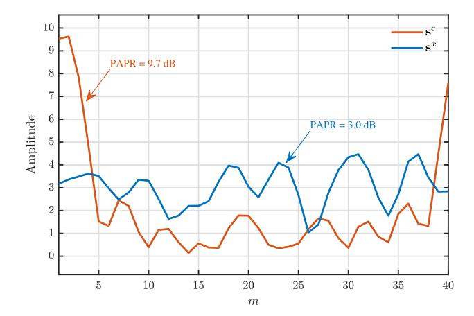

Fig. 3. Amplitudes comparison.

#### D. Simple Example

To demonstrate the effectiveness of our proposed method, we present an illustrative example of the PLPOI waveform

We begin with a conventional communication-only OFDM signal  $s^c$  whose frequency-domain sequenc c is generated using random QPSK modulation. The phases of the frequencydomain sequence c are displayed in the leftmost column of Table II. Initially, this OFDM signal  $s^c$  exhibits a PAPR of 9.7 dB. We then apply our proposed waveform design method with a specified PD threshold  $\theta = 0.6$ , resulting in the PLPOI waveform  $s^x$ , with its corresponding frequency-domain sequence x, also shown in Table II. The results confirm that the PD between sequences c and x remains confined within the interval [-0.6, 0.6], satisfying the predetermined PD constraint.

The PAPR reduction performance is visualized in Fig. 3, which presents the amplitude plots of both  $s^c$  and  $s^x$  alongside their respective PAPR values. The comparison reveals that while the original signal  $s^c$  exhibits large amplitude fluctuations with a PAPR of 9.7 dB, the optimized waveform  $s^x$ demonstrates markedly smaller amplitude variations with a PAPR of only 3.0 dB. This significant reduction in PAPR (a decrease of 6.7 dB) validates the effectiveness of our proposed waveform design method.

#### E. Computational Complexity Analysis

In Algorithm 1, the computational complexity mainly comes from updating  $\mathbf{x}^{(k+1)}$ ,  $\mathbf{q}^{(k+1)}$ , and  $\mathbf{y}^{(k+1)}$ , which can

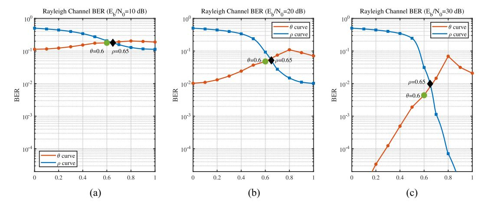

Fig. 4. Relationship curves of  $\theta$ ,  $\rho$ , and BER. (a)  $\theta$ ,  $\rho$ . (b)  $\theta$ ,  $\rho$ . (c)  $\theta$ ,  $\rho$ .

TABLE III SIMULATION PARAMETERS

| Symbol                  | Parameter                                     | Value         |  |  |  |  |  |
|-------------------------|-----------------------------------------------|---------------|--|--|--|--|--|
| OFDM S                  | OFDM System Parameters                        |               |  |  |  |  |  |
| $f_c$                   | Carrier frequency                             | 24 GHz        |  |  |  |  |  |
| B                       | Signal bandwidth                              | 93.1 MHz      |  |  |  |  |  |
| N                       | Number of subcarriers                         | 1024          |  |  |  |  |  |
| $\Delta f$              | Subcarrier spacing                            | 90.9 kHz      |  |  |  |  |  |
| Timing Parameters       |                                               |               |  |  |  |  |  |
| T                       | OFDM symbol duration                          | $11~\mu s$    |  |  |  |  |  |
| $T_{cp}$                | Cyclic prefix duration                        | $1.37~\mu s$  |  |  |  |  |  |
| $T_s$                   | Total OFDM symbol duration                    | 12.37 $\mu s$ |  |  |  |  |  |
| G                       | Number of OFDM symbols per generation         | 256           |  |  |  |  |  |
| Sensing 1               | Sensing Parameters                            |               |  |  |  |  |  |
| $\Delta R$              | Range resolution                              | 1.61 m        |  |  |  |  |  |
| $R_{max}$               | Unambiguous range (limited by $T_{cp}$ )      | 206.25 m      |  |  |  |  |  |
| $\Delta v$              | Velocity resolution                           | 1.97 m/s      |  |  |  |  |  |
| $v_{max}$               | Unambiguous velocity (limited by $\Delta f$ ) | 113 m/s       |  |  |  |  |  |
| Optimization Parameters |                                               |               |  |  |  |  |  |
| $\theta^{-}$            | Phase difference threshold                    | 0.6           |  |  |  |  |  |
| $\rho$                  | Penalty factor                                | 10000         |  |  |  |  |  |
| L                       | Oversampling factor                           | 4             |  |  |  |  |  |
| $\alpha$                | PAPR threshold                                | 1.8 dB        |  |  |  |  |  |

be computed by FFT/IFFT. The complexity of FFT/IFFT for length-N  $\mathbf{x}$  is  $\mathcal{O}(N\log_2 N)$  [27]. Consequently, the computational complexity of computing  $\mathbf{x}^{(k+1)}$  in (22),  $\mathbf{q}^{(k+1)}$  in (25), and  $\mathbf{y}^{(k+1)}$  in (12c) are  $\mathcal{O}(M\log_2 M)$ ,  $\mathcal{O}(N\log_2 N)$ , and  $\mathcal{O}(N\log_2 N)$ , respectively. It should be mentioned that the bisection search process for solving the optimal Lagrange multiplier  $\gamma^{(k)}$  typically requires only a small number of iterations, even for large search intervals, and its computational complexity is comparable to or less than a single FFT/IFFT operation [27]. Therefore, it is negligible compared to the FFT/IFFT operations required to compute  $\mathbf{v}^{(k)}$ . Thus, the total computational complexity of each ADMM-based iteration is roughly  $\mathcal{O}(M\log_2 M)$ .

Convergence Analysis: We have the following theorem on the ADMM-PLPOI algorithm. Its detailed proof is provided in the Appendix.

Theorem 1: Let  $\{\mathbf{x}^k, \mathbf{s}^k, \mathbf{y}^k, k = 1, 2, ..., \}$  be the sequence generated by the proposed ADMM-PLPOI algorithm. If  $\lim_{k \to +\infty} \{\mathbf{x}^k, \mathbf{s}^k, \mathbf{y}^k\} = (\mathbf{x}^{\text{opt}}, \mathbf{s}^{\text{opt}}, \mathbf{y}^{\text{opt}})$ , then  $(\mathbf{x}^{\text{opt}}, \mathbf{s}^{\text{opt}})$  is a KKT point of the problem  $P_0$ .

Remarks: It should be noted that the nonconvex nature of the PD and unimodular constraints in our problem presents significant challenges for convergence analysis. Existing ADMM convergence theories typically rely on convexity assumptions [32], [33], which do not hold in our problem framework due to these nonconvex constraints. Consequently, Theorem 1 characterizes the solution quality upon convergence but does not provide theoretical guarantees for the convergence of the algorithm itself.

#### IV. SIMULATION VERIFICATION

In this section, we present simulation results to evaluate the sensing and communications (S&C) performance of the proposed PLPOI waveforms in OFDM-ISAC systems. The BER is considered as the communication performance metric, while the ambiguity function and radar imaging are used to evaluate sensing performance. Additionally, PAPR is considered for evaluating both S&C performance. The ISAC system parameters are listed in Table III.

#### A. PAPR Performance Analysis

For a comprehensive benchmark comparison, we use the OFDM-ISAC waveform design method presented in [10] as the primary benchmark due to its representativeness in ISAC waveform design. To ensure a fair evaluation, our proposed scheme is compared with this benchmark under similar conditions.

The benchmark method used in our comparison is derived from the frequency-domain expression [21, (16)]. For the single-antenna case, this optimization problem can be formulated as

$$\min_{\mathbf{x}} \quad \rho \|\mathbf{x} - \mathbf{c}\|_{2}^{2} + (1 - \rho) \|\mathbf{x} - \mathbf{x_{0}}\|_{2}^{2}. \tag{33}$$

This formulation is equivalent to (62) in Chen et al. [10] for the single-antenna scenario, where  $\rho$  is a weighting parameter controlling the tradeoff between radar and communication performance,  $\mathbf{x}$  represents the designed integrated waveform,  $\mathbf{c}$  is the communication information signal, and  $\mathbf{x_0}$  is the ideal radar waveform with low PAPR characteristics. The closed-form solution to this problem is

$$\mathbf{x} = \rho \mathbf{c} + (1 - \rho) \mathbf{x_0}. \tag{34}$$

In our implementation of Chen's method, the corresponding time-domain signal of the selected **x0** has a PAPR of approximately 1.46 dB. As illustrated in Fig. [4,](#page-6-3) under Rayleigh channel conditions with different SNR levels (10, 20, and 30 dB), our method with PD threshold θ = 0.6 and the method in [\[10\]](#page-11-9) with parameter ρ = 0.65 are compared. The following performance comparisons are all based on this set of parameters, i.e., (θ , ρ) = (0.6, 0.65).

Additionally, to provide a more comprehensive performance evaluation, we include comparisons with two additional PAPR reduction techniques as supplementary benchmarks. First, we implement the ADMM-based method from [\[18\]](#page-11-17) with weighting parameters *w* = 0.2 and *w* = 0.4, both with a maximum iteration limit of 100. According to [\[18\]](#page-11-17), the parameter *w* = 0.2 provides the optimal PAPR reduction performance for their proposed algorithm. Second, we include the traditional iterative clipping and filtering (ICF) technique [\[34\]](#page-12-0) with a 6 dB clipping ratio, which serves as a classical PAPR reduction baseline for OFDM systems.

Fig. [5](#page-7-0) presents the complementary cumulative distribution function (CCDF) comparison of PAPR among different methods: the random OFDM signals, the waveform design method in [\[10\]](#page-11-9), our proposed PLPOI method introduced in Section [III,](#page-3-0) the ADMM-based approaches from [\[18\]](#page-11-17), and the classical ICF technique [\[34\]](#page-12-0). It can be observed that the random OFDM signals exhibit a relatively high PAPR value of approximately 12 and 13 dB in the worst case, while the method in [\[10\]](#page-11-9) with ρ = 0.65 achieves a PAPR of around 11–12 dB, showing only marginal improvement over the original OFDM. Regarding the ADMM-based approaches [\[18\]](#page-11-17), the method with *w* = 0.2 achieves comparable PAPR performance to our proposed method with θ = 0.6, both reaching approximately 4–5 dB, while the ADMM method with *w* = 0.4 demonstrates moderate PAPR reduction with values around 5–6 dB, which is still significantly better than the primary benchmark but not as effective as the *w* = 0.2 configuration. The classical ICF technique [\[34\]](#page-12-0) provides limited improvement with PAPR values around 6 and 7 dB, demonstrating the constraints of traditional signal distortion approaches.

Furthermore, when adjusting our PD threshold to θ = 0.7, our method achieves even better PAPR reduction performance. While both configurations (θ = 0.6 and θ = 0.7) reach similar PAPR values at the 10−4 probability level, the θ = 0.7 configuration shows more favorable PAPR statistics overall, with its CCDF curve exhibiting lower PAPR values across most of the probability range.

The step-like transitions appearing in the CCDF curves of our proposed method occur because these points rapidly satisfy the strict constraint **s** = **Ax** and reach convergence, limiting the potential for additional PAPR reduction. Despite these characteristics, the overall PAPR reduction performance remains highly effective. This performance improvement can be attributed to the PD introduced in our method, which provides greater optimization flexibility across the entire spectrum, while the approach in [\[10\]](#page-11-9) primarily focuses on balancing the weighted sum of radar similarity and communication MUI within a unified optimization framework.

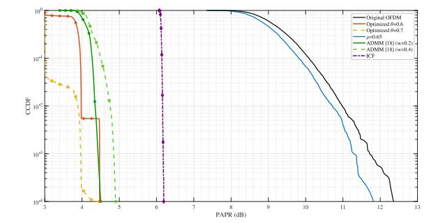

Fig. 5. Comparison of PAPR performance.

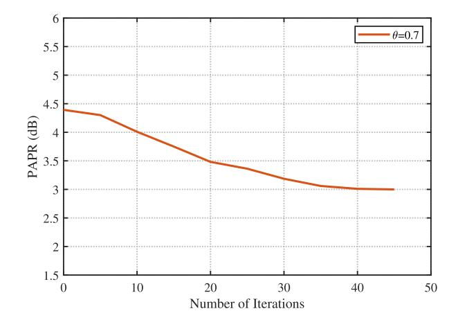

Fig. 6. PAPR versus the number of iterations.

To verify the reliability of this performance improvement, we further investigate the iterative convergence behavior of the PAPR optimization process. As shown in Fig. [6,](#page-7-1) for θ = 0.7, our proposed method achieves effective PAPR reduction within 50 iterations. This fast and stable convergence characteristic validates the algorithm's practicality in realworld applications.

## *B. Communication Performance Analysis*

To enable a fair comparison of communication performance between our proposed method and the benchmark method from [\[10\]](#page-11-9), we identified specific parameter pairs (θ and ρ) that yield equivalent PAPR performance for both approaches. As shown in Fig. [7,](#page-8-0) we established a mapping relationship between these parameters and PAPR values through extensive simulations (10 000 runs), which allowed us to identify intersection points where both methods achieve the same PAPR. Specifically, we selected θ = 0.5 corresponding to ρ = 0.288, and θ = 0.6 corresponding to ρ = 0.161, as these parameter combinations produce equivalent PAPR performance between the two methods. Based on these matched parameter pairs, we can fairly evaluate the communication performance of both approaches under identical PAPR conditions.

The communication performance is evaluated by BER in both AWGN and Rayleigh fading channels. For QPSK signals in AWGN channel, the theoretical BER expression is

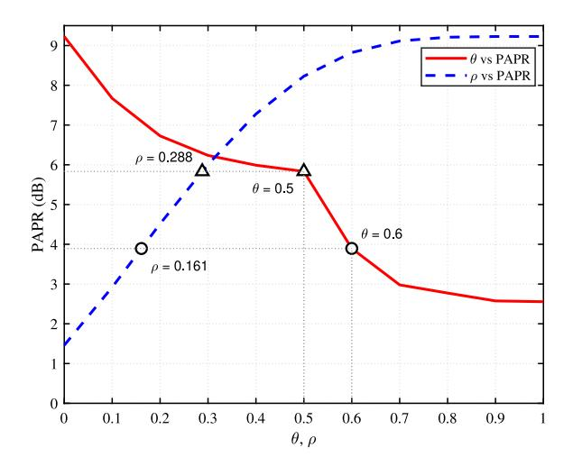

Fig. 7. Comparison of PAPR performance with different parameter values.

given by [35]

$$P_e = \frac{2(M_Q - 1)}{M_Q \log_2 M_Q} Q \left( \sqrt{\frac{6E_b}{N_0} \cdot \frac{\log_2 M_Q}{M_Q^2 - 1}} \right)$$
(35)

where  $M_Q = 4$  represents the modulation order, and Q(x) is the standard error function defined as

$$Q(x) = \frac{1}{\sqrt{2\pi}} \int_{x}^{\infty} e^{-t^2/2} dt.$$
 (36)

For Rayleigh fading channel, the theoretical BER is expressed as [36]

$$P_{e} = \frac{M_{Q} - 1}{M_{Q} \log_{2} M_{Q}} \left( 1 - \sqrt{\frac{3\gamma \log_{2} M_{Q} / (M_{Q}^{2} - 1)}{3\gamma \log_{2} M_{Q} / (M_{Q}^{2} - 1) + 1}} \right)$$
(37)

where  $\gamma = E_b/N_0$  denotes the signal-to-noise ratio.

For the AWGN channel, we examine the BER performance among the theoretical bound, our proposed PD-based approach with  $\theta = 0.5$  and  $\theta = 0.6$ , and the benchmark method in [10] with corresponding parameters  $\rho = 0.288$  and  $\rho =$ 0.161, respectively. As shown in Fig. 8, our method with  $\theta =$ 0.5 achieves substantially better BER performance compared to the method in [10] with  $\rho = 0.288$ . Specifically, as SNR increases beyond 10 dB, our approach with  $\theta = 0.5$ demonstrates significantly superior performance in terms of BER, with the BER curve descending more rapidly compared to the benchmark method with  $\rho = 0.288$ , eventually achieving nearly an order of magnitude lower error rate at higher SNR values. Similarly, comparing our method with  $\theta = 0.6$  to the benchmark with  $\rho = 0.161$ , we still observe performance advantages, though the gap narrows somewhat. The theoretical curve serves as a reference, showing that all practical implementations exhibit expected performance degradation, with our proposed method maintaining closer alignment to this theoretical bound.

To verify the effectiveness of our approach under more practical channel conditions, we conducted tests under Rayleigh fading channel. As illustrated in Fig. 9, the performance

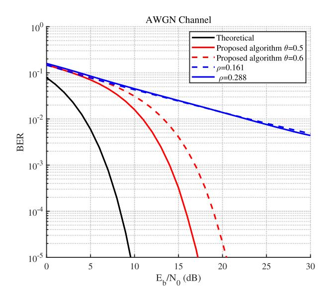

Fig. 8. Comparison of BERs in AWGN channel.

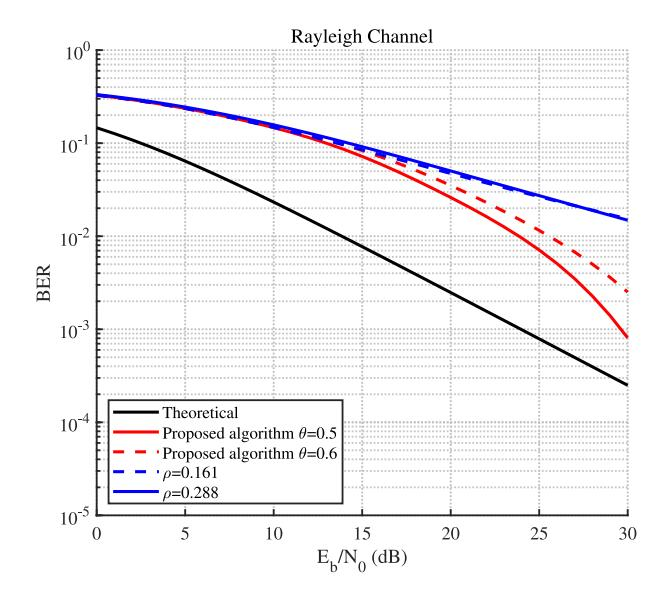

Fig. 9. Comparison of BERs in rayleigh channel.

advantage of our method is maintained in this challenging environment. Specifically, with  $\theta=0.5$ , our proposed method consistently outperforms the benchmark method with  $\rho=0.288$  across the entire  $E_b/N_0$  range, with the performance gap becoming more pronounced at higher SNR values ( $E_b/N_0>20$  dB). For example, at  $E_b/N_0=30$  dB, our method achieves a BER of approximately  $10^{-3}$ , while the benchmark method remains above  $10^{-2}$ . Similarly, our method with  $\theta=0.6$  also outperforms the benchmark approach with  $\rho=0.161$  across the evaluated SNR range. These results confirm that the PD-based approach provides reliable communication performance advantages even under challenging fading conditions, while maintaining equivalent PAPR characteristics.

#### C. Sensing Performance Analysis

Following the SSPA model, practical OFDM-ISAC systems require input back-off (IBO) to avoid nonlinear distortion. The

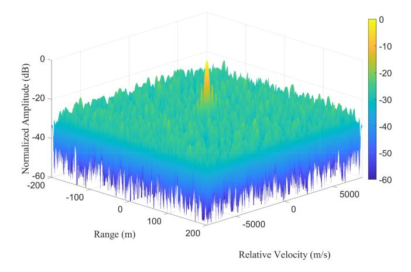

Fig. 10. 3-D plot of proposed waveform's ambiguity function.

IBO is defined as IBO =  $A_{\rm sat}^2/P_{\rm in}$ , where  $A_{\rm sat}$  represents the saturation level and  $P_{\rm in}$  is the input average power. We use the Rapp model parameters  $g_0 = 1$ ,  $A_{\rm sat} = 1$ , p = 2.

This section evaluates the sensing performance of the proposed waveform through analysis of ambiguity function characteristics and radar imaging capability. We first investigate the ambiguity function characteristics, which is a key metric for evaluating radar system resolution. For the OFDM signal, the periodic ambiguity function  $AF_s(\tau, f)$ ,  $t \in \{0, 1, ..., N-1\}$ , is defined as [37], [38]

$$AF_{\mathbf{s}}(\tau, f) = \sum_{m=0}^{M-1} s(m)s^*(m+\tau)e^{j2\pi fm/M}.$$
 (38)

where  $\tau$  is the delay index and f is the Doppler frequency.

Fig. 10 presents a 3-D visualization of the ambiguity function for the proposed PLPOI waveform without noise, where a sharp peak and rapidly decreasing sidelobes can be clearly observed in both range and velocity dimensions.2 The mainlobe exhibits good concentration, indicating the waveform's potential for high-resolution target detection. The ambiguity function cuts at zero velocity (Doppler) and zero range (delay) provide more detailed insights into the waveform's performance, with further details shown in Figs. 11 and 12.

Specifically, Fig. 11 shows the range profile at zero relative velocity, which represents the periodic autocorrelation function of the proposed waveform. Due to the constant modulus property of the frequency-domain signal, this profile exhibits low sidelobes, achieving a PSLR of approximately -330 dB. Meanwhile, Fig. 12 presents the Doppler profile at zero range with a peak sidelobe ratio of -13.5 dB.

The OFDM-based ISAC system can obtain target range and velocity information through the established OFDM radar processing framework originally proposed by [23] and adapted for ISAC applications [17]. The radar processing operates on the frequency-domain received signals collected over *G* consecutive OFDM symbols, forming a received matrix and a reference matrix consisting of the transmitted signal conjugates.

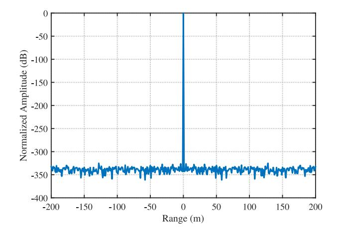

Fig. 11. Range profile at 0 m/s relative velocity.

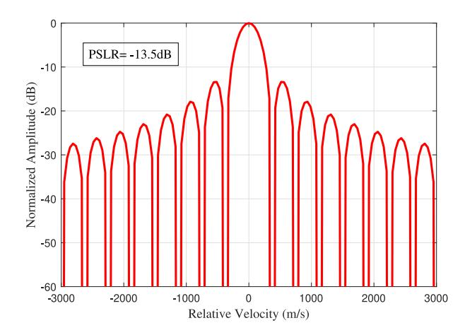

Fig. 12. Relative velocity profile at 0 m range.

The radar processing utilizes the Hadamard product between the received and reference matrices to extract range and velocity information while eliminating the communication data influence. This operation is mathematically equivalent to matched filtering in the frequency domain, preserving the target-related phase information embedded in the roundtrip propagation delays and Doppler shifts [23].

Range processing is implemented through correlationequivalent operations where IDFT transforms reveal peaks corresponding to target distances. The range resolution is fundamentally limited by the signal bandwidth according to  $\Delta_R = c/(2B)$ . The correlation processing provides range compression, concentrating the target energy into sharp peaks at delays corresponding to the roundtrip propagation times.

Velocity processing exploits the phase relationships across consecutive OFDM symbols on each subcarrier. Target motion introduces Doppler frequency shifts that appear as systematic phase changes between symbols separated by the total symbol duration  $T_s$ . DFT operations across the temporal dimension extract these phase progressions, providing velocity resolution of  $\Delta_v = c/(2f_cGT_s)$ .

In multitarget radar scenarios, weak targets can be masked by sidelobes from nearby strong targets, significantly degrading detection performance. In OFDM continuous wave radar signal processing, low or even zero waveform PAC sidelobes

&lt;sup>2By using the parameters in Table III, the range and velocity can be calculated by delay and Doppler, respectively.

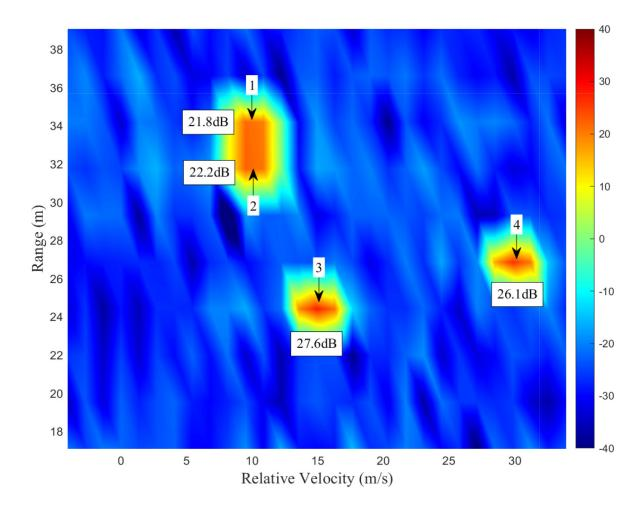

Fig. 13. Radar image obtained with proposed waveform.

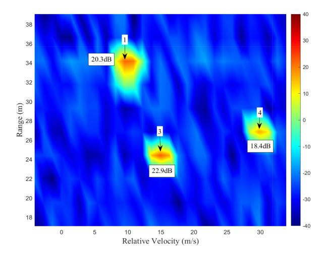

Fig. 14. Radar image obtained with original OFDM waveform.

TABLE IV
TARGET PARAMETERS FOR MULTITARGET DETECTION

| Target | Parameters |                |            |  |  |  |  |
|--------|------------|----------------|------------|--|--|--|--|
| υ      | Range (m)  | Velocity (m/s) | RCS (dBm²) |  |  |  |  |
| 1      | 33         | 10             | 25         |  |  |  |  |
| 2      | 32         | 10             | 3          |  |  |  |  |
| 3      | 25         | 15             | 20         |  |  |  |  |
| 4      | 27         | 30             | 15         |  |  |  |  |

are essential to prevent such masking effects [39]. As illustrated in Fig. 2, our proposed waveform achieves excellent autocorrelation properties with ultralow sidelobes.

In ISAC systems, radar signal transmission follows a dualpath propagation model with spherical wave characteristics. The reflected echo power from a target at distance *R* relative to the RadCom platform is defined as [39]

$$P_{Rx} = \frac{P_{Tx}G_{Tx}G_{Rx}\sigma_{RCS}\lambda^2}{(4\pi)^3 R^4}$$
 (39)

where  $P_{Tx}$  is the transmit power,  $G_{Tx}$  is the transmit antenna gain,  $G_{Rx}$  is the receive antenna processing gain, and  $\sigma_{RCS}$  is the target's radar cross section (RCS).

Conventional OFDM waveforms with higher PAPR require larger IBO to avoid nonlinear distortion, resulting in reduced average transmission power. In contrast, our proposed waveform with significantly lower PAPR enables reduced IBO requirements and higher average power transmission, directly enhancing target detectability through increased  $P_{Tx}$  in the radar equation.

To comprehensively validate the practical sensing advantages, we conduct radar imaging simulations using four point targets with varying RCSs as specified in Table IV. We intentionally place a weak target (Target 2 with RCS =  $3 \text{ dBm}^2$ ) at 32 m in close proximity to a strong target (Target 1 with RCS =  $25 \text{ dBm}^2$ ) at 33 m to create a challenging weak target detection scenario.

The radar images obtained with conventional OFDM and proposed waveforms are shown in Figs. 13 and 14, respectively, normalized to  $\sigma_{RCS} = 0 \text{ dBm}^2$  and R = 10 m. The comparison reveals a dramatic improvement in detection performance. While conventional OFDM successfully detects three targets (Targets 1, 3, and 4), the weak Target 2 is nearly invisible due to sidelobe masking. In contrast, our proposed PLPOI waveform clearly detects all four targets with significantly enhanced peak amplitudes, achieving detection performance gains ranging from 1–5 dB.

#### V. CONCLUSION

In this article, we introduced a novel PD-based OFDM-ISAC waveform structure and designed the corresponding PLPOI waveform. To achieve this, we formulated a nonconvex optimization problem that incorporates the time-frequency relationship equation, frequency-domain unimodular constraints, PD conditions, and a time-domain low-PAPR requirement. To efficiently solve this problem, we developed a low-complexity ADMM-PLPOI algorithm, where closed-form solutions are derived for both time-domain and frequency-domain signals. Numerical simulations verify the effectiveness of the proposed PLPOI waveforms in terms of PAPR and BER performance.

#### APPENDIX

#### PROOF OF THEOREM 1

To prove Theorem 1, we need to establish that any limit point  $(\mathbf{x}^{\text{opt}}, \mathbf{s}^{\text{opt}}, \mathbf{y}^{\text{opt}})$  of the sequence generated by Algorithm 1 is a KKT point of problem  $P_0$ . We analyze the convergence properties of the  $\mathbf{x}$ -update and  $\mathbf{s}$ -update separately, then combine them to establish the overall convergence.

The x-update subproblem (21) is a UQP problem with additional phase constraints

$$\min_{\mathbf{x}} \|\mathbf{x} - \bar{\mathbf{x}}\|_{2}^{2} \quad \text{s.t.} \quad |x_{n}| = 1, |\arg(x_{n} - c_{n})| < \theta.$$
 (40)

This problem structure follows the UQP framework established in [31], with the addition of PD constraints to preserve communication capability. The convergence properties of such UQP problems have been thoroughly analyzed in [31].

For the s-update, we define  $L(\mathbf{x}, \mathbf{s}, \gamma, \mathbf{y})$  and  $L^{\mathbf{s}}(\mathbf{s}, \mathbf{y}, \gamma)$  as the Lagrangian functions of problem  $P_0$  and the s-subproblem (12b), respectively, where  $\gamma$  is the Lagrangian multiplier corresponding to constraint (11c).

To show that  $(\mathbf{x}^{\text{opt}}, \mathbf{s}^{\text{opt}})$  is a KKT point, we need to prove that it, combining  $(\mathbf{y}^{\text{opt}}, \gamma^*)$ , satisfies the conditions of primal feasibility, dual feasibility, complementary slackness, and stationarity, i.e.,

$$\mathbf{x}^{\text{opt}} \in \mathcal{X}, \, \mathbf{s}^{\text{opt}} \in \mathcal{S}$$
 (41a)

$$\nabla_{\mathbf{s}} L(\mathbf{x}^{\text{opt}}, \mathbf{s}^{\text{opt}}, \boldsymbol{\gamma}^*, \mathbf{y}^{\text{opt}}) = 0$$
 (41b)

where  $\mathcal{X}$  and  $\mathcal{S}$  denote the constraints (11d) and (11c), respectively.

Since in every ADMM-Direct iteration,  $\mathbf{x}^{k+1}$  and  $\mathbf{s}^{k+1}$  are located in the feasible region, we can see that the primal feasibility condition (41a) is satisfied.

Now, let us consider (41b).  $\mathbf{s}^{k+1}$  is the minimizers of the problems (12b) in the kth iteration, respectively, they should satisfy

$$\nabla_{\mathbf{s}} L^{\mathbf{s}} \left( \mathbf{s}^{k+1}, \mathbf{y}^{k}, \gamma^{k*} \right) - \rho \left( A \mathbf{x}^{k+1} - \mathbf{s}^{k+1} \right) = 0.$$
 (42)

Since  $\lim_{k\to +\infty} (\mathbf{x}^k, \mathbf{s}^k, \mathbf{y}^k) = (\mathbf{x}^{\text{opt}}, \mathbf{s}^{\text{opt}}, \mathbf{y}^{\text{opt}})$  and  $\mathbf{y}^{k+1} = \mathbf{y}^k + \rho(A\mathbf{x}^{k+1} - \mathbf{s}^{k+1})$ , we can drop the second terms in (42) as  $k \to +\infty$  and obtain

$$\nabla_{\mathbf{s}} L^{\mathbf{s}}(\mathbf{s}^{\text{opt}}, \mathbf{y}^{\text{opt}}, \gamma^*) = 0. \tag{43}$$

Since

$$\nabla_{\mathbf{s}} L^{\mathbf{s}}(\mathbf{s}^{\text{opt}}, \mathbf{y}^{\text{opt}}, \gamma^{*}) = \nabla_{\mathbf{s}} L(\mathbf{x}^{\text{opt}}, \mathbf{s}^{\text{opt}}, \gamma^{*}, \mathbf{y}^{\text{opt}})$$
(44)

we can see that  $(\mathbf{x}^{\text{opt}}, \mathbf{s}^{\text{opt}}, \mathbf{y}^{\text{opt}})$  should satisfy (41b), i.e., it is a stationary point of the Lagrangian function  $L(\mathbf{x}, \mathbf{s}, \gamma, \mathbf{y})$ . This concludes the proof of Theorem 1.

#### REFERENCES

- [1] F. Liu, C. Masouros, A. Li, T. Chai, Y. Cui, and L. Hanzo, "Integrated sensing and communications: Toward dual-functional wireless networks for 6G and beyond," *IEEE J. Sel. Areas Commun.*, vol. 40, no. 6, pp. 1728–1767, Jun. 2022.
- [2] O. B. Akan and M. Arik, "Internet of radars: Sensing versus sending with joint radar-communications," *IEEE Commun. Mag.*, vol. 58, no. 9, pp. 13–19, Sep. 2020.
- [3] Z. Feng, Z. Fang, Z. Wei, X. Chen, Z. Quan, and D. Ji, "Joint radar and communication: A survey," *China Commun.*, vol. 17, no. 1, pp. 1–27, Jan. 2020.
- [4] J. A. Zhang et al., "An overview of signal processing techniques for joint communication and radar sensing," *IEEE J. Sel. Topics Signal Process.*, vol. 15, no. 6, pp. 1295–1315, Nov. 2021.
- [5] A. Liu et al., "A survey on fundamental limits of integrated sensing and communication," *IEEE Commun. Surveys Tuts.*, vol. 24, no. 2, pp. 994–1034, 2nd Quart., 2022.
- [6] F. Liu, C. Masouros, A. P. Petropulu, H. Griffiths, and L. Hanzo, "Joint radar and communication design: Applications, state-of-the-art, and the road ahead," *IEEE Trans. Commun.*, vol. 68, no. 6, pp. 3834–3862, Jun. 2020.
- [7] K. Meng, Q. Wu, W. Chen, and D. Li, "Sensing-assisted communication in vehicular networks with intelligent surface," *IEEE Trans. Veh. Technol.*, vol. 73, no. 1, pp. 876–893, Jan. 2024.
- [8] Q. Qi, X. Chen, C. Zhong, and Z. Zhang, "Integrated sensing, computation and communication in B5G cellular Internet of Things," *IEEE Trans. Wireless Commun.*, vol. 20, no. 1, pp. 332–344, Jan. 2021.
- [9] W. Zhou, R. Zhang, G. Chen, and W. Wu, "Integrated sensing and communication waveform design: A survey," *IEEE Open J. Commun.* Soc., vol. 3, pp. 1930–1949, 2022.

- [10] Y. Chen et al., "Joint design of ISAC waveform under PAPR constraints," China Commun., vol. 21, no. 7, pp. 186–211, Jul. 2024.
- [11] P. Varshney, P. Babu, and P. Stoica, "Low-PAPR OFDM waveform design for radar and communication systems," *IEEE Trans. Radar Syst.*, vol. 1, pp. 69–74, 2023.
- [12] M.-J. Hao and W.-W. Pi, "PAPR reduction in OFDM signals by self-adjustment gain method," *Electronics*, vol. 10, no. 14, p. 1672, Jul. 2021.
- [13] M. Siluveru, D. Nanda, M. Kesoju, and S. K. Rao, "Evaluation of OFDM system in terms of PAPR and BER using PAPR reduction techniques: Windowing and clipping," *Babylon. J. Netw.*, vol. 2024, pp. 1–8, Jan. 2024.
- [14] H. B. Tank, "Low PAPR filtered OFDM using modified selective mapping," J. Electr. Syst., vol. 20, no. 7S, pp. 1255–1265, May 2024.
- [15] I. Cinemre, V. Aydin, and G. Hacioglu, "PAPR reduction through Gaussian pre-coding in DCO-OFDM systems," Opt. Quant. Electron., vol. 56, no. 6, p. 958, Apr. 2024.
- [16] V. J. Arulkarthick, K. Srihari, C. Arvind, M. A. Mukunthan, and R. Sundar, "A hybrid precoded-companding scheme for PAPR reduction in OFDM systems," *Natl. Acad. Sci. Lett.*, vol. 47, no. 3, pp. 285–291, Jun. 2024.
- [17] Y. Huang, S. Hu, S. Ma, Z. Liu, and M. Xiao, "Designing low-PAPR waveform for OFDM-based RadCom systems," *IEEE Trans. Wireless Commun.*, vol. 21, no. 9, pp. 6979–6993, Sep. 2022.
- [18] J. Wu, L. Li, W. Lin, J. Liang, and Z. Han, "ADMM-based low-PAPR OFDM waveform design for dual-functional radar-communication systems," in *Proc. IEEE Int. Conf. Commun.*, Denver, CO, USA, Jun. 2024, pp. 305–310.
- [19] A. Bazzi and M. Chafii, "On integrated sensing and communication waveforms with tunable PAPR," *IEEE Trans. Wireless Commun.*, vol. 22, no. 11, pp. 7345–7360, Nov. 2023.
- [20] X. Hu, C. Masouros, F. Liu, and R. Nissel, "Low-PAPR DFRC MIMO-OFDM waveform design for integrated sensing and communications," in *Proc. IEEE Int. Conf. Commun.*, May 2022, pp. 1599–1604.
- [21] F. Liu, L. Zhou, C. Masouros, A. Li, W. Luo, and A. Petropulu, "Toward dual-functional radar-communication systems: Optimal waveform design," *IEEE Trans. Signal Process.*, vol. 66, no. 16, pp. 4264–4279, Aug. 2018.
- [22] Y. Li, N. Seshadri, and S. Ariyavisitakul, "Channel estimation for OFDM systems with transmitter diversity in mobile wireless channels," *IEEE J. Sel. Areas Commun.*, vol. 17, no. 3, pp. 461–471, Mar. 1999.
- [23] C. Sturm and W. Wiesbeck, "Waveform design and signal processing aspects for fusion of wireless communications and radar sensing," *Proc. IEEE*, vol. 99, no. 7, pp. 1236–1259, Jul. 2011.
- [24] C. Tellambura, "computation of the continuous-time PAR of an OFDM signal with BPSK subcarriers," *IEEE Commun. Lett.*, vol. 5, no. 5, pp. 185–187, May 2001.
- [25] Y. S. Cho and J. Kim, W. Y. Yang, and C. G. Kang, MIMO-OFDM Wireless Communications With MATLAB. Singapore: Wiley, 2010.
- [26] S. H. Han and J. H. Lee, "an overview of peak-to-average power ratio reduction techniques for multicarrier transmission," *IEEE Wireless Commun.*, vol. 12, no. 2, pp. 56–65, Apr. 2005.
- [27] Y. Wang, Y. Wang, and Q. Shi, "Optimized signal distortion for PAPR reduction of OFDM signals with IFFT/FFT complexity via ADMM approaches," *IEEE Trans. Signal Process.*, vol. 67, no. 2, pp. 399–414, Jan. 2019.
- [28] T. Tian, T. Zhang, L. Kong, and Y. Deng, "Transmit/receive beamforming for MIMO-OFDM based dual-function radar and communication," IEEE Trans. Veh. Technol., vol. 70, no. 5, pp. 4693–4708, May 2021.
- [29] F. Wang, C. Pang, J. Zhou, Y. Li, X. Wang, and J. Shi, "Design of complete complementary sequences for ambiguity functions optimization with a PAR constraint," *IEEE Geosci. Remote Sens. Lett.*, vol. 19, 2021, Art. no. 3505705.
- [30] S. Boyd, N. Parikh, E. Chu, B. Peleato, and J. Eckstein, "Distributed optimization and statistical learning via the alternating direction method of multipliers," *Found. Trends Mach. Learn.*, vol. 3, no. 1, pp. 1–122, Jan. 2011.
- [31] M. Soltanalian and P. Stoica, "Designing unimodular codes via quadratic optimization," *IEEE Trans. Signal Process.*, vol. 62, no. 5, pp. 1221–1234, Mar. 2014.
- [32] M. Hong, Z.-Q. Luo, and M. Razaviyayn, "Convergence analysis of alternating direction method of multipliers for a family of nonconvex problems," in *Proc. IEEE Int. Conf. Acoust., Speech Signal Process.* (ICASSP), Apr. 2015, pp. 3836–3840.
- [33] Y. Wang, W. Yin, and J. Zeng, "global convergence of ADMM in nonconvex nonsmooth optimization," *J. Sci. Comput.*, vol. 78, no. 1, pp. 29–63, Jan. 2019.

- [\[34\]](#page-7-2) J. Armstrong, "Peak-to-average power reduction for OFDM by repeated clipping and frequency domain filtering," *Electron. Lett.*, vol. 38, no. 5, pp. 246–247, Feb. 2002.
- [\[35\]](#page-8-3) K. Cho and D. Yoon, "On the general BER expression of one- and twodimensional amplitude modulations," *IEEE Trans. Commun.*, vol. 50, no. 7, pp. 1074–1080, Jul. 2002.
- [\[36\]](#page-8-4) M. K. Simon and M.-S. Alouini, *Digital Communication Over Fading Channels*, 1st ed. New York, NY, USA: Wiley, 2000.
- [\[37\]](#page-9-4) Z. Ye, Z. Zhou, P. Fan, Z. Liu, X. Lei, and X. Tang, "Low ambiguity zone: Theoretical bounds and doppler-resilient sequence design in integrated sensing and communication systems," *IEEE J. Sel. Areas Commun.*, vol. 40, no. 6, pp. 1809–1822, Jun. 2022.
- [\[38\]](#page-9-4) H. He, J. Li, and P. Stoica, *Waveform Design for Active Sensing Systems—A Computational Approach*. New York, NY, USA: Cambridge Univ. Press, 2012, pp. 88–97.
- [\[39\]](#page-10-4) Y. X. Huang, "Integrated communication and radar waveform design and signal processing," Ph.D. dissertation, Nat. Key Lab. Sci. Technol. Commun., Univ. Electron. Sci. Technol. China, Chengdu, China, 2022.

**Haixia Cui** (Senior Member, IEEE) received the M.S. and Ph.D. degrees in communication engineering from South China University of Technology (SCNU), Guangzhou, China, in 2005 and 2011, respectively.

She is currently a Full Professor with the School of Electronic Science and Engineering (School of Microelectronics), SCNU, China. From July 2014 to July 2015, she was an Advanced Visiting Scholar (Visiting Associate Professor) with the Department of Electrical and Computer Engineering,

the University of British Columbia (UBC), Vancouver, Bc, Canada. She has authored or co-authored more than 90 refereed journal and conference papers and two books. She also holds about 30 patents. Her current research interests are in the areas of mobile edge computing, vehicular networks, cooperative communication, wireless resource allocation, 5G/6G, multiple access control, and power control in wireless networks.

**Kaimin Li** is currently pursuing the M.S. degree with the School of Electronic Science and Engineering (School of Microelectronics), South China Normal University, Foshan, China.

Her current research interests include integrated sensing and communication, and waveform design.

**Bingpeng Zhou** (Member, IEEE) received the Ph.D. degree from Southwest Jiaotong University, Chengdu, China, in 2016.

He was a Postdoctoral Fellow with the Hong Kong University of Science and Technology, Hong Kong, from 2016 to 2019. He was a Postdoctoral Researcher with Aalto University, Espoo, Finland, from 2019 to 2020. He was a visiting Ph.D. student with the 5G Innovation Centre, University of Surrey, Guildford, U.K., in 2015. He is currently an Associate Professor with the School of Electronics

and Communication Engineering, Sun Yat-sen University, Shenzhen, China. He was selected for Major Talent Program of Guangdong Province for Distinguished Youth. His research interests include visible light-based positioning, integrated communication and sensing, Bayesian signal processing, and next-generation wireless networks.

**Jiahuan Wang** received the B.S. degree in mathematics and the Ph.D. degree in information and communication engineering from Southwest Jiaotong University, Chengdu, China, in 2014 and 2022, respectively.

He is currently an Assistant Professor with the School of Electronic Science and Engineering (School of Microelectronics), South China Normal University, Foshan, China. His research interests include integrated sensing and communication and waveform design.

**Pingzhi Fan** (Life Fellow, IEEE) received the M.Sc. degree in computer science from Southwest Jiaotong University (SWJTU), Chengdu, China, in 1987, and the Ph.D. degree in electronic engineering from Hull University, Hull, U.K., in 1994.

He is currently a Distinguished Professor with SWJTU, has been a Honorary Dean with the SWJTU-Leeds Joint School since 2015, a Honorary Professor with the University of Nottingham, Ningbo, China, 2025, and a Visiting Professor with Leeds University, Leeds, U.K. since 1997. His

research interests include high mobility wireless communications, multiple access techniques, ISAC, and signal design & coding.

Dr. Fan is a recipient of the U.K. ORS Award in 1992, the National Science Fund for Distinguished Young Scholars in 1998, NSFC, the IEEE VT Society Jack Neubauer Memorial Award in 2018, the IEEE SP Society SPL Best Paper Award in 2018, the IEEE VT Society Best Magazine Paper Award in 2023, and several IEEE conference best paper awards. He served as a Chief Scientist of a National 973 Plan Project (MoST, 2012.1-2016.12). He also served as the General Chair or the TPC Chair of a number of IEEE conferences, including VTC2016Spring, ITW2018, IWSDA2022, PIMRC2023, as well as the coming VTC2025Fall, ISIT2026, and ICC2028. He is an IEEE VTS Distinguished Speaker from 2022 to 2028, and a Fellow of IET, CIE, and CIC.