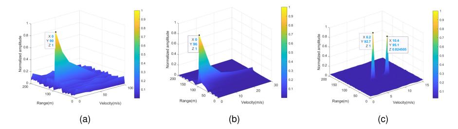
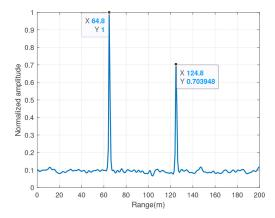
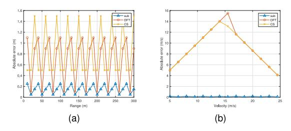
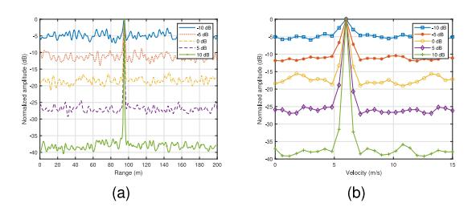
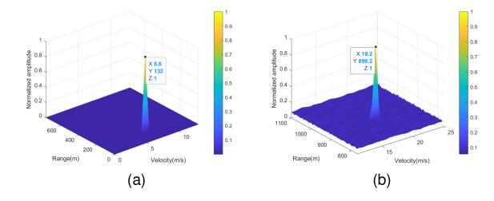

# Three-Stage Super-Resolution Estimation of Target Parameter in OCDM ISAC Systems

Xiaotian Xia®, Rugui Yao®, Senior Member, IEEE, Xi Nan®, Zhan Zhang, Jianfeng Feng®, Ye Fan®, Member, IEEE, and Xiaoya Zuo®, Member, IEEE

Abstract—Integrated sensing and communication (ISAC) systems employing orthogonal chirp division multiplexing (OCDM) signals offer enhanced spectral efficiency and interference resilience, yet face resolution limitations in parameter estimation constrained by time-frequency resources. This letter proposes a three-stage super-resolution framework to achieve high-precision target range and velocity estimation. First, coarse parameter estimation is performed via discrete Fourier transform-based processing on received echo signals. Second, signal compensation is implemented using coarse estimates and prior communication data. Finally, subspace projection combined with ambiguity resolution is employed to overcome physical resolution boundaries, enabling super-resolution parameter extraction. Simulation results demonstrate that the proposed approach can effectively enhance the system's resolution, accurately estimate target parameters, and thereby improve the system's sensing performance.

Index Terms—Integrated sensing and communication (ISAC), orthogonal chirp division multiplexing (OCDM), super-resolution parameter estimation.

#### I. INTRODUCTION

DVANCEMENTS in electronic information technology have driven convergence between communication and sensing systems in hardware and signal processing [1]. Spectrum scarcity has pushed communication systems into higher frequency bands shared with radar systems [2], motivating the development of integrated sensing and communication (ISAC) systems that improve spectral, energy, and hardware

Received 9 June 2025; accepted 24 June 2025. Date of publication 27 June 2025; date of current version 11 September 2025. This work was supported in part by the National Natural Science Foundation of China under Grant 62401473; in part by the Shenzhen Science and Technology Program under Grant JCYJ202408131507335045; in part by the Key R&D Project in Shaanxi Province under Grant 2025CY-YBXM-055; in part by National Key Laboratory of Unmanned Aerial Vehicle Technology in NPU under Grant WR202404; and in part by the Fundamental Research Funds for the Central Universities under Grant G2024WD0159 and Grant D5000240239. The associate editor coordinating the review of this article and approving it for publication was G. Brante. (Corresponding author: Rugui Yao.)

Xiaotian Xia is with the National Elite Institute of Engineering, Northwestern Polytechnical University, Xi'an 710072, China (e-mail: xiaxiaotian@mail.nwpu.edu.cn).

Rugui Yao, Xi Nan, and Xiaoya Zuo are with the School of Electronics and Information, Northwestern Polytechnical University, Xi'an 710072, China (e-mail: yaorg@nwpu.edu.cn; nanxi@mail.nwpu.edu.cn; zuoxy@nwpu.edu.cn).

Zhan Zhang and Jianfeng Feng are with the Beijing Aeronautical Technology Research Institute, Commercial Aircraft Corporation of China, Beijing 102209, China (e-mail: zhangzhan1@comac.cc; fengjianfeng@comac.cc).

Ye Fan is with the School of Electronics and Information, Northwestern Polytechnical University, Xi'an 710072, China, and also with the Research and Development Institute, Northwestern Polytechnical University (Shenzhen Campus), Shenzhen 518063, China (e-mail: fanye@nwpu.edu.cn).

Digital Object Identifier 10.1109/LWC.2025.3583732

efficiency through shared infrastructure [3], [4]. Within ISAC frameworks, integrated waveform design represents a critical research frontier [5]. Orthogonal chirp division multiplexing (OCDM) has emerged as a promising solution for 5G highmobility environments due to its strong interference resilience and robustness against Doppler effects [6], [7].

Existing studies have demonstrated OCDM's strong communication capabilities. As evidenced in [8], OCDM outperforms orthogonal frequency division multiplexing (OFDM) in resisting temporal burst interference and narrowband interference. Lv et al. developed an OCDM-OFDM hybrid waveform system that improves communication rates through orthogonal chirp multiplexing [9]. Subsequent hardware implementations using USRP X310 platforms experimentally confirmed OCDM's advantages in ISAC applications, particularly its lower bit error rates versus OFDM systems [10]. A comparative analysis of ISAC systems supported by chirp signals, OFDM, and OCDM further confirmed the superior communication performance of OCDM [11]. In [12], Li et al. enhanced communication rates significantly by incorporating index modulation with OCDM's subchirp structure. Current OCDM-ISAC sensing implementations predominantly employ discrete Fourier transform (DFT) or compressed sensing (CS)-based parameter estimation methods [9], [10], [11], [12]. However, these approaches face fundamental resolution limitations constrained by time-frequency resource allocation. Improved sensing accuracy requires expanded bandwidth or prolonged symbol durations, conflicting with efficiency optimization objectives. Achieving high-precision range/velocity estimation under constrained spectral and temporal resources therefore remains critical for advancing sensing performance.

To address these limitations, this letter proposes a three-stage super-resolution (TSSR) framework for OCDM-based ISAC systems. The methodology integrates subspace projection-based parameter estimation for processed compensated signals with an innovative ambiguity resolution scheme, systematically enhancing sensing accuracy through ambiguity mitigation. Experimental validation demonstrates precise estimation of target range and velocity parameters, achieving significant sensing performance improvements compared to baseline schemes.

## II. SYSTEM MODEL

In what follows, we introduce the architecture of OCDM-based ISAC system and its corresponding signal formulation.

The transmitted signal structure of the OCDM-ISAC system comprises multiple pulses per frame, with each pulse containing several OCDM symbols. Each symbol carries modulated

communication data while acting as a dual-functional waveform. Consider a frame structure with  $N_{\rm p}$  pulses and  $N_{\rm s}$  symbols per pulse. The baseband representation of the *s*-th symbol within the *p*-th pulse at time instant *t* can be formulated as:

$$x_{p,s}(t) = \sum_{k=0}^{N-1} X(k)\psi_k (t - pT_p - sT_s),$$
 (1)

where  $pT_{\rm p}+sT_{\rm s} < t \le pT_{\rm p}+(s+1)T_{\rm s}, \ p=0,1,\ldots,N_{\rm p}-1, s=0,1,\ldots,N_{\rm s}-1$ . Furthermore,  $T_{\rm s}$  denotes the symbol period, N represents the number of subcarriers, X(k) is the data symbol of the modulation on the k-th subcarrier, and  $T_{\rm p}$  represents the pulse period, with the relationship  $T_{\rm p}=N_{\rm s}T_{\rm s}/\eta$ , where  $\eta$  denotes the duty cycle. In addition,  $\psi_k(t)$  is the k-th chirp signal as a modulated subcarrier, which can be represented in the following manner [13]:

$$\psi_k(t) = e^{j\frac{\pi}{4}} e^{-j\pi \frac{N}{T_s^2} \left(t - k\frac{T_s}{N}\right)^2}, k = 0, 1, \dots, N - 1.$$
 (2)

In monostatic OCDM-ISAC systems, the transmitter concurrently emits OCDM symbols embedded with communication data and receives target-reflected echoes carrying multidimensional parameters such as velocity, range, carrier frequency, and environmental noise. For  $N_{\rm t}$  targets, the *i*-th target is characterized by range  $r_i$  and relative velocity  $v_i$ . For sensing analysis, we focus on the dominant propagation path with sufficient signal quality while neglecting multipath components. The received signal for the *s*-th OCDM symbol in the *p*-th pulse can be modeled as:

$$y_{p,s}(t) = \sum_{i=1}^{N_{t}} A_{i} x_{p,s}(t - \tau_{i}) e^{j2\pi f_{d,i}(t - pT_{p} - sT_{s})} + w_{p,s}(t),$$
(3)

where  $au_i = \frac{2r_i}{c}$  and  $f_{\mathrm{d},i} = \frac{2v_i f_c}{c}$  denote delay and Doppler shift for the *i*-th target,  $A_i$  is the attenuation coefficient,  $f_{\mathrm{c}}$  is the carrier frequency, and w(t) represents Gaussian noise. Transmitted and received signals are sampled at  $T_{\mathrm{s}}/N$ . The sampled transmitted and received signals corresponding to the *s*-th OCDM symbol of the *p*-th pulse are respectively denoted as follows:

$$\mathbf{x}_{p,s} = [x_{p,s}(0), x_{p,s}(1), \dots, x_{p,s}(N-1)]^{\mathrm{T}} \in \mathbb{C}^{N}, \mathbf{y}_{p,s} = [y_{p,s}(0), y_{p,s}(1), \dots, y_{p,s}(N-1)]^{\mathrm{T}} \in \mathbb{C}^{N}.$$
(4)

## III. TSSR TARGET PARAMETER ESTIMATION

To enhance the sensing precision of OCDM-ISAC systems, this section develops a TSSR parameter estimation methodology. The subsequent subsections provide comprehensive descriptions of its implementation details.

## A. Coarse Estimation of Parameters

This section presents a coarse-grained parameter estimation method utilizing  $N_{\rm s}$  symbols within a pulse [11]. The DFT is applied to the sampled signals as described in (4), yielding the frequency-domain representations:

$$\mathbf{F}_{\mathrm{tx},s} = \mathrm{DFT}(\mathbf{x}_{p,s}), \mathbf{F}_{\mathrm{rx},s} = \mathrm{DFT}(\mathbf{y}_{p,s}),$$
 (5)

where  $\mathrm{DFT}(\cdot)$  denotes the DFT operation on the enclosed signal.

Based on the properties of DFT, components containing time delay and Doppler shift can be separated as follows:

$$F_{\text{rx},s}(n) = \text{DFT}\left(\sum_{i=1}^{N_{\text{t}}} A_{i} x_{p,s} \left(n - \tau_{i} \frac{N}{T_{\text{s}}}\right) e^{j2\pi f_{\text{d},i} s T_{\text{s}}} + w(n)\right)$$

$$= \sum_{i=1}^{N_{\text{t}}} A_{i} e^{j2\pi f_{\text{d},i} s T_{\text{s}}} e^{-j2\pi \frac{\tau_{i}}{T} n} F_{\text{tx},s}(n) + F_{w}(n)$$
(6)

Here,  $F_{rx,s}(n)$ ,  $F_{tx,s}(n)$  and  $F_w(n)$  denote the *n*-th elements of  $\mathbf{F}_{rx,s}$ ,  $\mathbf{F}_{tx,s}$  and  $\mathbf{F}_w$ , respectively. In addition,  $\mathbf{F}_w = \mathrm{DFT}(\mathbf{w}_{p,s})$ , where  $\mathbf{w}_{p,s} = [w_{p,s}(0), w_{p,s}(1), \dots, w_{p,s}(N-1)]^\mathrm{T} \in \mathbb{C}^N$  is constructed through sampling of the  $w_{p,s}(t)$ .

By aggregating  $N_s$  symbols, the transmitted and received matrices are constructed as:

$$\mathbf{F}_{\mathrm{tx}} = (\mathbf{F}_{\mathrm{tx},0}, \mathbf{F}_{\mathrm{tx},1}, \dots, \mathbf{F}_{\mathrm{tx},N_{\mathrm{s}}-1}) \in \mathbb{C}^{N \times N_{\mathrm{s}}},$$

$$\mathbf{F}_{\mathrm{rx}} = (\mathbf{F}_{\mathrm{rx},0}, \mathbf{F}_{\mathrm{rx},1}, \dots, \mathbf{F}_{\mathrm{rx},N_{\mathrm{s}}-1}) \in \mathbb{C}^{N \times N_{\mathrm{s}}}.$$
 (7)

The matrix  ${\bf F}$  is computed through  ${\bf F}={\bf F}_{\rm rx}\odot{\bf F}_{\rm tx}^*$ , where  $\odot$  represents the Hadamard product, and  $(\cdot)^*$  denotes the matrix conjugate.

Sequential row-wise DFT and column-wise IDFT operations to matrix  $\tilde{\mathbf{F}}$  ultimately yields the derived matrix  $\tilde{\mathbf{F}}$  [11].

The peaks within matrix  $\mathbf{F}$  are identified, and their corresponding row and column indices are recorded as  $(l_i, m_i)$ , where  $i = 1, 2, ..., N_t$ .

These indices are related to the *i*-th target's range  $r_i$  and velocity  $v_i$  through the following expressions:

$$l_i = |2Nr_i/(cT_s)|, m_i = |2v_i f_c T_s N_s/c|,$$
 (8)

where  $\lfloor \cdot \rfloor$  denotes the floor function. The estimated range  $\hat{r}_{i,\mathrm{DFT}}$  and velocity  $\hat{v}_{i,\mathrm{DFT}}$  are computed as:

$$\hat{r}_{i,\text{DFT}} = \frac{cT_{\text{s}}}{2N} l_i, \hat{v}_{i,\text{DFT}} = \frac{c}{2N_{\text{s}} T_{\text{s}} f_{\text{c}}} m_i.$$
 (9)

The estimation accuracy from (9) is limited by the allocated time-frequency resources, which leads to limited sensing precision. These coarse estimates are subsequently utilized to compensate the received signal  $y_{p,s}$  for further processing.

## B. Super-Resolution Estimation of Parameters

The received signal  $\mathbf{y}_{p,s}$  is compensated by multiplying the reformulated  $\mathbf{y}_{p,s}$  with a compensation matrix (derived from coarse estimates) and an information matrix (constructed from communication data).

The *n*-th element of  $\mathbf{y}_{p,s}$  can be expressed as:

$$y_{p,s}(n) = \sum_{i=0}^{N_{\rm t}} \sum_{k=0}^{N-1} X(k) e^{j\frac{\pi}{4}} e^{-j\pi \frac{N}{T_{\rm s}^2} \left(n\frac{T_{\rm s}}{N} - pT_{\rm p} - sT_{\rm s} - \tau_i - k\frac{T_{\rm s}}{N}\right)^2} \times e^{j2\pi f_{\rm d,i} \left(n\frac{T_{\rm s}}{N} - pT_{\rm p} - sT_{\rm s}\right)} + w_{p,s}(n).$$
(10)

where n = 0, 1, ..., N - 1.  $\mathbf{y}_{p,s,i}$  can be expressed as

$$\mathbf{y}_{p,s} = \sum_{i=0}^{N_{t}} A_{i} e^{j\frac{\pi}{4}} e^{-j\pi \frac{N}{T_{s}^{2}} \tau_{i}^{2}} e^{-j\pi \frac{N}{T_{s}^{2}} \tau_{i} (pT_{p} + sT_{s})}$$

$$\times e^{-j2\pi f_{d,i} sT_{s}} e^{-j2\pi f_{d,i} pT_{p}}$$

$$\times \mathbf{D}_{f_{d,i}} \mathbf{D}_{\tau_{i}} \mathbf{\Phi}^{H} \mathbf{D}_{c} \mathbf{a}_{\tau_{i}} + \mathbf{w}_{p,s}. \tag{11}$$

In (11),  $\mathbf{D}_{f_{\mathrm{d},i}} = \mathrm{diag}[1, \mathrm{e}^{\mathrm{j}2\pi f_{\mathrm{d},i}T_{\mathrm{s}}/N}, \ldots, \mathrm{e}^{\mathrm{j}2\pi f_{\mathrm{d},j}(N-1)T_{\mathrm{s}}/N}]$   $\in \mathbb{C}^{N\times N}, \ \mathbf{D}_{\tau_i} = \mathrm{diag}[1, \mathrm{e}^{\mathrm{j}2\pi 1/T_{\mathrm{s}}\tau_i}, \ldots, \mathrm{e}^{\mathrm{j}2\pi(N-1)/T_{\mathrm{s}}\tau_i}] \in \mathbb{C}^{N\times N}, \ \mathbf{D}_c = \mathrm{diag}[X(0), X(1), \ldots, X(N-1)] \in \mathbb{C}^{N\times N}$  and  $\mathbf{a}_{\tau_i} = [1, \mathrm{e}^{-\mathrm{j}2\pi 1/T_{\mathrm{s}}\tau_i}, \ldots, \mathrm{e}^{-\mathrm{j}2\pi(N-1)/T_{\mathrm{s}}\tau_i}]^{\mathrm{T}} \in \mathbb{C}^N.$  Moreover,  $\Phi$  represents the inverse discrete Fresnel transform matrix. The element located at the n-th row and k-th column is defined as  $\Phi(n,k) = \mathrm{e}^{\mathrm{j}\pi(n-k)^2/N}$ . Additionally,  $\mathrm{diag}(\cdot)$  denotes the operation of constructing a diagonal matrix.

Using the coarse estimates  $\hat{\tau}_{i,\mathrm{DFT}} = 2\hat{r}_{i,\mathrm{DFT}}/c$  and  $\hat{f}_{\mathrm{d},i,\mathrm{DFT}} = 2\hat{v}_{i,\mathrm{DFT}}f_{\mathrm{c}}/c$ , the compensation matrices  $\hat{\mathbf{D}}_{\tau_i}$  and  $\hat{\mathbf{D}}_{f_{\mathrm{d},i}}$  are constructed as:

$$\hat{\mathbf{D}}_{\tau_{i}} = \operatorname{diag} \left[ 1, e^{j2\pi \frac{1}{T_{s}} \hat{\tau}_{i, \text{DFT}}}, \dots, e^{j2\pi \frac{N-1}{T_{s}} \hat{\tau}_{i, \text{DFT}}} \right], 
\hat{\mathbf{D}}_{f_{d, i}} = \operatorname{diag} \left[ 1, e^{j2\pi \hat{f}_{d, i, \text{DFT}} \frac{T_{s}}{N}}, \dots, e^{j2\pi \hat{f}_{d, i, \text{DFT}} \frac{(N-1)T_{s}}{N}} \right].$$
(12)

Given that  $\Phi$  is a unitary matrix and  $\mathbf{D}_c$  is known, the compensation is applied to (11) using  $\Phi$ ,  $\mathbf{D}_c$  and the compensation matrices.

Based on the coarse estimation results, iterative operations are performed by sorting multiple target peaks in descending order of their echo energy. Initially, the target with the strongest echo energy is selected (assigned index i=1). A compensation matrix is constructed using its corresponding coarse estimation. Defining  $\tilde{\mathbf{D}}_{p,s,i} = \mathbf{D}_c^{-1} \Phi \hat{\mathbf{D}}_{\tau_i}^{-1} \hat{\mathbf{D}}_{f_{\mathrm{d},i}}^{-1}$  and  $\mathbf{D}_{p,s,1} = \tilde{\mathbf{D}}_{p,s,1} \mathbf{D}_{f_{\mathrm{d},i}} \mathbf{D}_{\tau_i} \Phi^{\mathrm{H}} \mathbf{D}_c$ , the left multiplication of (11) by  $\tilde{\mathbf{D}}_{p,s,1}$  yields:

$$\mathbf{r}_{p,s,1} = \tilde{\mathbf{D}}_{p,s,1} \mathbf{y}_{p,s} = \sum_{i=0}^{N_{\rm t}} A_i e^{j\frac{\pi}{4}} e^{-j\pi \frac{N}{T_{\rm s}^2} \tau_1^2} e^{-j\pi \frac{N}{T_{\rm s}^2} \tau_i (pT_{\rm p} + sT_{\rm s})} e^{-j2\pi f_{\rm d}, isT_{\rm s}} \times e^{-j2\pi f_{\rm d}, ipT_{\rm p}} \mathbf{D}_{p,s,1} \mathbf{a}_{\tau_i} + \tilde{\mathbf{D}}_{p,s,1} \mathbf{w}_{p,s}.$$
(13)

To achieve joint estimation of range and velocity, the s-th symbol across all pulses are stacked into a column vector as

$$\mathbf{r}_{s,1} = \begin{bmatrix} \mathbf{r}_{0,s,1}^{\mathrm{T}}, \mathbf{r}_{1,s,1}^{\mathrm{T}}, \dots, \mathbf{r}_{N_{\mathrm{p}}-1,s,1}^{\mathrm{T}} \end{bmatrix}^{\mathrm{T}} \in \mathbb{C}^{N_{\mathrm{p}}N}$$

$$= \sum_{i=1}^{N_{\mathrm{t}}} A_{i} e^{j\frac{\pi}{4}} e^{-j\pi \frac{N}{T_{\mathrm{s}}^{2}} \tau_{i}^{2}} e^{-j\pi \frac{N}{T_{\mathrm{s}}^{2}} \tau_{i} (pT_{\mathrm{p}} + sT_{\mathrm{s}})} e^{-j2\pi f_{\mathrm{d},i} sT_{\mathrm{s}}}$$

$$\times \mathbf{D}_{s,1} \mathbf{a}_{\tau_{i},f_{\mathrm{d},i}} + \mathbf{w}_{s}, \tag{14}$$

where  $\mathbf{a}_{\tau_i,f_{\mathrm{d},i}} = \mathbf{a}_{f_{\mathrm{d},i}} \otimes \mathbf{a}_{\tau_i}$  denotes the range-velocity steering vector,  $\mathbf{D}_{s,1} = \mathrm{diag}(\mathbf{D}_{0,s,1},\mathbf{D}_{1,s,1},\ldots,\mathbf{D}_{N_{\mathrm{p}}-1,s,1})$  and  $\mathbf{a}_{f_{\mathrm{d},i}} = [1,\mathrm{e}^{-\mathrm{j}2\pi f_{\mathrm{d},i}T_{\mathrm{p}}},\ldots,\mathrm{e}^{-\mathrm{j}2\pi f_{\mathrm{d},i}(N_{\mathrm{p}}-1)T_{\mathrm{p}}}]^{\mathrm{T}} \in \mathbb{C}^{N_{\mathrm{p}}}$ , with  $\otimes$  indicating the Kronecker product. In addition,  $\mathbf{w}_s$  can be expressed as:

$$\mathbf{w}_{s} = \left[ \left( \tilde{D}_{0,s,1} \mathbf{w}_{0,s} \right)^{\mathrm{T}}, \dots, \left( \tilde{D}_{N_{p}-1,s,1} \mathbf{w}_{N_{p}-1,s} \right)^{\mathrm{T}} \right]^{\mathrm{T}}.$$
(15)

The subspace projection method (detailed implementation will be described later) is then applied to process vector  $\mathbf{r}_{s,1}$ , achieving super-resolution estimation of target parameters. Since only the echo compensation for target i = 1, has been

performed, the fine estimation results of range and velocity (denoted as  $\hat{r}_{\text{sub}}$  and  $\hat{v}_{\text{sub}}$ ) corresponding to the highestenergy echo can be obtained. It should be noted that when using subspace projection method, we should select discrete range and velocity values near the coarse estimation results of compensated targets (e.g.,  $\pm$  coarse resolution step), and when constructing signal subspace, only take the eigenvector of the biggest eigenvalue (i.e., assume  $N_{\rm t}=1$ ) to get fine estimation results. Using these results, we reconstruct the echo signal from target i = 1 (denoted as  $\hat{\mathbf{y}}_{p,s,1}$ ) by replacing coefficients  $r_1$  and  $v_1$  in  $\mathbf{y}_{p,s}$  with  $\hat{r}_{\mathrm{sub}}$  and  $\hat{v}_{\mathrm{sub}}$  respectively, while discarding the noise component  $\mathbf{w}_{p,s}$ . This reconstructed echo is then subtracted from the original signal:  $\mathbf{y}_{p,s}^1 = \mathbf{y}_{p,s} - \mathbf{y}_{p,s}$  $\hat{\mathbf{y}}_{p,s,1}$ . Echo compensation is then applied to the updated signal  $\mathbf{y}_{p,s}^1$  using coarse estimates of the next-strongest target and the aforementioned process is repeated until fine estimates are obtained for all targets.

Therefore, for  $\mathbf{r}_{s,1}$ , the super-resolution estimation of targets' range and velocity is performed using the subspace projection method, as detailed below [14]:

- 1) Using the  $N_{\rm s}$  symbols, the covariance matrix is computed as  $\hat{\mathbf{R}}_{\tau,f_{\rm d}}=1/N_{\rm s}\sum_{s=0}^{N_{\rm s}-1}\mathbf{r}_{s,1}\mathbf{r}_{s,1}^{\rm H}$ .
- 2) The covariance matrix  $\hat{\mathbf{R}}_{\tau,f_{\mathrm{d}}}$  is decomposed as  $\hat{\mathbf{R}}_{\tau,f_{\mathrm{d}}} = \mathbf{U}\Sigma\mathbf{U}^{\mathrm{H}}$ . In this context,  $\Sigma$  is a diagonal matrix consisting of the eigenvalues of  $\hat{\mathbf{R}}_{\tau,f_{\mathrm{d}}}$ , expressed as  $\Sigma = \mathrm{diag}(\lambda_1,\lambda_2,\ldots,\lambda_{N_{\mathrm{p}}N}) \in \mathbb{C}^{N_{\mathrm{p}}N\times N_{\mathrm{p}}N}$ . The eigenvalues are sorted in a non-increasing order, i.e.,  $\lambda_1 \geq \lambda_2 \geq \cdots \geq \lambda_{N_{\mathrm{p}}N}$ . Each column of  $\mathbf{U}$ , denoted as  $\mathbf{u}_1,\mathbf{u}_2,\ldots,\mathbf{u}_{N_{\mathrm{p}}N}$ , corresponds to the eigenvectors associated with the eigenvalues  $\lambda_1,\lambda_2,\ldots,\lambda_{N_{\mathrm{p}}N}$ .
- 3) Extract the eigenvector  $\mathbf{u}_1$  corresponding to the largest eigenvalue.
- 4) A uniform sampling of r and v within a predefined range (e.g.,  $\pm$  coarse resolution step) is performed to compute the corresponding time delay  $\tau$  and Doppler frequency shift  $f_{\rm d}$ . The range-velocity steering vector  $\mathbf{a}_{\tau,f_{\rm d}}$  is then constructed, and the subspace projection spectrum is calculated as

$$P_{\text{sub}}(\tau, f_d) = \frac{1}{\mathbf{a}_{\tau, f_d}^{\mathbf{H}} (\mathbf{I} - \mathbf{u}_1 \mathbf{u}_1^{\mathbf{H}}) \mathbf{a}_{\tau, f_d}},$$
 (16)

where I denotes the identity matrix. Peaks in the spectrum exceeding the threshold  $\gamma_{r,v}$  are identified, and the corresponding time delay  $\hat{\tau}_{\mathrm{sub}}$  and Doppler shift  $\hat{f}_{\mathrm{d,sub}}$  are used to estimate the target range and velocity:

$$\hat{r}_{\text{sub}} = c\hat{\tau}_{\text{sub}}/2, \hat{v}_{\text{sub}} = \lambda \hat{f}_{\text{d.sub}}/2, \tag{17}$$

where  $\lambda = c/f_c$  is the wavelength.

#### C. Ambiguities Resolution of Range and Velocity

The target range is determined through the steering vector  $\mathbf{a}_{\mathcal{T}}$ , yielding a maximum unambiguous range  $\hat{r}_{\mathrm{sub,max}} = \frac{cT_{\mathrm{s}}}{2}$ . Since the transmitted signal is in pulse form, if we estimate the target range using pulse compression, the maximum unambiguous range becomes  $\hat{r}_{\mathrm{pulse,max}} = \frac{cT_{\mathrm{p}}}{2}$ . To enhance the system's maximum unambiguous estimation range, we propose an ambiguities resolution method. To minimize potential errors that may arise during this combination, we define:

$$\alpha = \left[\hat{r}_{\text{pulse}}/\hat{r}_{\text{sub,max}}\right], \hat{r}_q = (\alpha + q)\hat{r}_{\text{sub,max}} + \hat{r}_{\text{sub}}.$$
 (18)

Fig. 1. Results of joint range and velocity estimation. (a) DFT-based method. (b) CS-based method. (c) TSSR method.

TABLE I
COMPUTATIONAL COMPLEXITY OF THREE METHODS

| Methods | Steps               | Complexity                                                            |
|---------|---------------------|-----------------------------------------------------------------------|
| DFT     | Hadamard product    | $O(NN_{\rm s}^2)$                                                     |
|         | DFT                 | $O(NN_{\mathrm{s}}\log N_{\mathrm{s}})$                               |
|         | IDFT                | $O(NN_{\mathrm{s}}\log N_{\mathrm{s}})$                               |
| CS      | Matched filtering   | $O(N_{\rm s}N^2\log N)$                                               |
|         | CS                  | $O(N_{\rm t}N_{\rm r}^2N_{\rm s}^2N)$                                 |
| TSSR    | Coarse estimation   | Same as the DFT-based method                                          |
|         | Signal compensation | $O(N_{\rm p}N_{\rm s}N^2)$                                            |
|         | Subspace projection | $O(N_{\rm s}N_{\rm p}^2N^2) + O((N_{\rm p}N)^3) + O(KN_{\rm p}^2N^2)$ |

where  $\hat{r}_{\mathrm{pulse}}$  is the range estimation obtained based on the pulse-compression method. Here, we adopt an early-late-gate scheme to obtain a more precise estimation. Let q=-1,0,1. For different values of q, calculate the absolute difference between  $\hat{r}_{\mathrm{pulse}}$  and  $\hat{r}_q$ , and select the  $\hat{r}_q$  with the smallest absolute difference as the final estimated target range  $\hat{r}$ .

For velocity estimation, the steering vector  $\mathbf{a}_{f_{\mathrm{d},i}}$  establishes  $\hat{v}_{\mathrm{sub,max}} = \frac{\lambda}{2T_{\mathrm{p}}}$ . DFT-based multi-symbol analysis extends this to  $\hat{v}_{\mathrm{DFT,max}} = \frac{\lambda}{2T_{\mathrm{s}}}$ . We define:

$$\beta = \lfloor \hat{v}_{\text{DFT}} / \hat{v}_{\text{sub,max}} \rfloor, \hat{v}_q = (\beta + q) \hat{v}_{\text{sub, max}} + \hat{v}_{\text{sub.}}$$
(19)

Here,  $\hat{v}_{\mathrm{DFT}}$  represents the velocity estimation obtained using the DFT-based method. Let q=-1,0,1. For different values of q, the absolute difference between  $\hat{v}_q$  and  $\hat{v}_{\mathrm{DFT}}$ , is calculated, and the  $\hat{v}_q$  with the smallest absolute difference is selected as the final estimated target velocity  $\hat{v}$ .

## D. Complexity Analysis

The computational complexity of the DFT-based method, the CS-based method, and the proposed TSSR method is compared in Table I, where  $N_{\rm r}$  and K represent the number of receiving antennas and parameter search points, respectively. The dominant terms for the three steps of our proposed method are  $O(N^2N_{\rm s}^2)$ ,  $O(N_{\rm p}N_{\rm s}N^2)$  and  $O((N_{\rm p}N)^3)$ . As demonstrated by Table I and the simulation results in Section IV, the proposed TSSR method achieves superior parameter estimation accuracy compared to conventional methods. However, its computational complexity is significantly higher than the baseline schemes, making it particularly suitable for high-precision applications with sufficient computational resources. Future work will prioritize complexity reduction.

## IV. SIMULATION RESULT

In this section, simulations evaluate the proposed method's parameter estimation accuracy and ambiguity resolution performance, with DFT-based [11] and CS-based [12] methods as baselines. The simulation parameters are as follows [12]: N=256,  $N_s=16$ ,  $N_p=8$ ,  $T_s=5.12$ us,  $T_p=0.41$  ms, bandwidth B=50 MHz and  $f_c=32$  GHz. Unless otherwise stated, all simulations are conducted under a signal-to-noise ratio (SNR) of 10 dB.

## A. Parameter Estimation Results

Figure 1 presents the joint range-velocity estimation results for two targets positioned at (93 m, 6 m/s) and (95 m, 10 m/s). As demonstrated in Fig. 1a and Fig. 1b, DFT-based and CS-based methods exhibit limited detection capability, each revealing only a single dominant peak corresponding to erroneous estimates of (90 m, 0 m/s) and (96 m, 0 m/s), respectively. These results fail to accurately resolve the true target parameters. In contrast, the proposed super-resolution methodology shown in Fig. 1c achieves precise estimates of (92.8 m, 6.2 m/s) and (95.1 m, 10.4 m/s). The estimation errors remain constrained within 1 m and 1 m/s, demonstrating significant accuracy improvement over baseline schemes. Notably, this enhancement stems from the proposed method's resolution independence from time-frequency resource constraints. The estimation errors are influenced by the parameter sampling intervals for r and v which are set to 0.8 m and 0.6 m/s in this simulation. Reducing these intervals could further decrease estimation errors.

Figure 3 presents parameter estimation errors over range or velocity, demonstrating that the subspace projection-based approach achieves significantly lower errors than baseline methods. In the baseline schemes, range and velocity are uniformly discretized, whereas the proposed method directly selects discrete (r, v) pairs via subspace projection. The parameter estimation differs between the baseline and our proposed scheme. The baseline methods select the largest discrete values, defined by multiples of the resolution, that do not exceed the true parameters, while the proposed method identifies the points closest to the true values with error bounded by the step size. Although increasing range reduces estimation peak magnitudes due to large-scale fading (as shown in Fig. 2), reliable detection remains feasible within acceptable SNR levels and target ranges. Absolute range errors depend primarily on discretization resolution, with performance degradation at longer range manifesting as peak reduction rather than estimation inaccuracy. Velocity estimation simulations were

Fig. 2. Results of range estimation.

Fig. 3. The absolute error of parameter estimation. (a) Range estimation. (b) Velocity estimation.

Fig. 4. Parameter estimation results under different SNR levels. (a) Range estimation. (b) Velocity estimation.

conducted under fixed range and SNR conditions, ensuring validity below the maximum unambiguous velocity limit. As illustrated in Figs. 3a and 3b, both methods exhibit periodic fluctuations in range/velocity estimation errors, attributable to their uniform parameter discretization schemes.

Figures 4a and 4b present range and velocity estimation results under varying SNR conditions. The true target parameters are (95 m, 6 m/s). Across all tested SNR levels, the proposed method accurately estimates these parameters. As the SNR increases, the sidelobe levels in the estimation spectrum decrease progressively from -5 dB to -35 dB. For SNR values above -10 dB, distinct peaks are observed, highlighting the robustness of our method in low-SNR scenarios.

## B. Ambiguity Resolution Performance

Figure 5 presents a comparison of parameter estimation results before and after ambiguity resolution. As illustrated in Fig. 5a, target parameters exceeding system limits (900 m range, 18 m/s velocity) induce estimation errors due to ambiguity, given the system's maximum unambiguous range (768 m) and velocity (11.44 m/s) according to the simulation parameters. Fig. 5b demonstrates successful parameter correction to 899.2 m and 18.2 m/s through our ambiguity resolution method, achieving close alignment with ground truth.

Fig. 5. The parameter estimation results before and after removing ambiguity. (a)Before and after ambiguity resolution. (b) After removing ambiguity.

#### V. CONCLUSION

This letter tackles the resolution constraints in conventional parameter estimation methods caused by limited time-frequency resources. We present a super-resolution estimation framework for OCDM-based ISAC systems, employing DFT and subspace projection techniques to enable high-resolution target parameter extraction. The proposed method incorporates ambiguity resolution to refine estimation precision. Numerical simulations verify significant reductions in range and velocity estimation errors compared with baseline approaches. However, the proposed algorithm's computational complexity remains challenging, warranting future optimization efforts.

#### REFERENCES

- [1] S. Lu et al., "Integrated sensing and communications: Recent advances and ten open challenges," *IEEE Internet Things J.*, vol. 11, no. 11, pp. 19094–19120, Jun. 2024.
- [2] R. Yao et al., "Green integrated cooperative spectrum sensing for cognitive satellite terrestrial networks," *IET Commun.*, vol. 17, no. 14, pp. 1665–1682, Aug. 2023.
- [3] A. Liu et al., "A survey on fundamental limits of integrated sensing and communication," *IEEE Commun. Surveys Tuts.*, vol. 24, no. 2, pp. 994–1034, 2nd Quart., 2022.
- [4] X. Yang et al., "Constellation design for integrated sensing and communication with random waveforms," *IEEE Trans. Wireless Commun.*, vol. 23, no. 11, pp. 17415–17428, Nov. 2024.
- [5] P. Li et al., "MIMO-OFDM ISAC waveform design for range-doppler sidelobe suppression," *IEEE Trans. Wireless Commun.*, vol. 24, no. 2, pp. 1001–1015, Feb. 2025.
- [6] T. Li et al., "Low pilot overhead channel estimation for CP-OFDM-based massive MIMO OTFS system," *IET Commun.*, vol. 16, no. 10, pp. 1071–1082, Jun. 2022.
- [7] B. Wang et al., "Underwater acoustic communications based on OCDM for Internet of Underwater Things," *IEEE Internet Things J.*, vol. 10, no. 24, pp. 22128–22142, Dec. 2023.
- [8] M. S. Omar and X. L. Ma, "Performance analysis of OCDM for wireless communications," *IEEE Trans. Wireless Commun.*, vol. 20, no. 7, pp. 4032–4043, Jul. 2021.
- [9] X. Lv et al., "A joint radar-communication system based on OCDM-OFDM scheme," in *Proc. Int. Conf. Microw. Millim. Wave Technol.* (ICMMT), Dec. 2018, pp. 1–3.
- [10] L. G. D. Oliveira et al., "An OCDM radar-communication system," in *Proc. 14th Eur. Conf. Antennas Propag. (EuCAP)*, Mar. 2020, pp. 1–5.
- [11] L. G. D. Oliveira et al., "Joint radar-communication systems: Modulation schemes and system design," *IEEE Trans. Microwave Theory Techn.*, vol. 70, no. 3, pp. 1521–1551, Mar. 2022.
- [12] S. Li et al., "Orthogonal chirp division multiplexing assisted dual-function radar communication in IoT networks," *IEEE Internet Things J.*, vol. 11, no. 13, pp. 23752–23764, Jul. 2024.
- [13] X. Ouyang and J. Zhao, "Orthogonal chirp division multiplexing," *IEEE Trans. Commun.*, vol. 64, no. 9, pp. 3946–3957, Sep. 2016.
- [14] M. Feng et al., "A reduced-dimension MUSIC algorithm for monostatic FDA-MIMO radar," *IEEE Commun. Lett.*, vol. 25, no. 4, pp. 1279–1282, Apr. 2021.