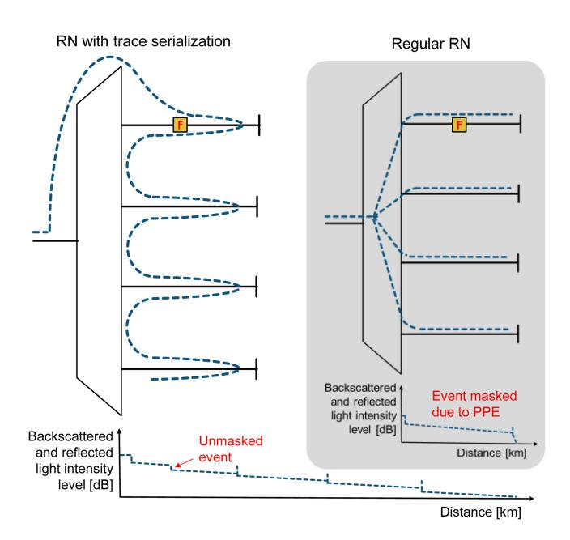
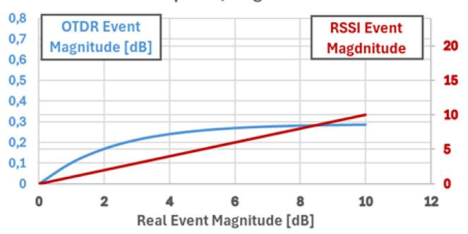
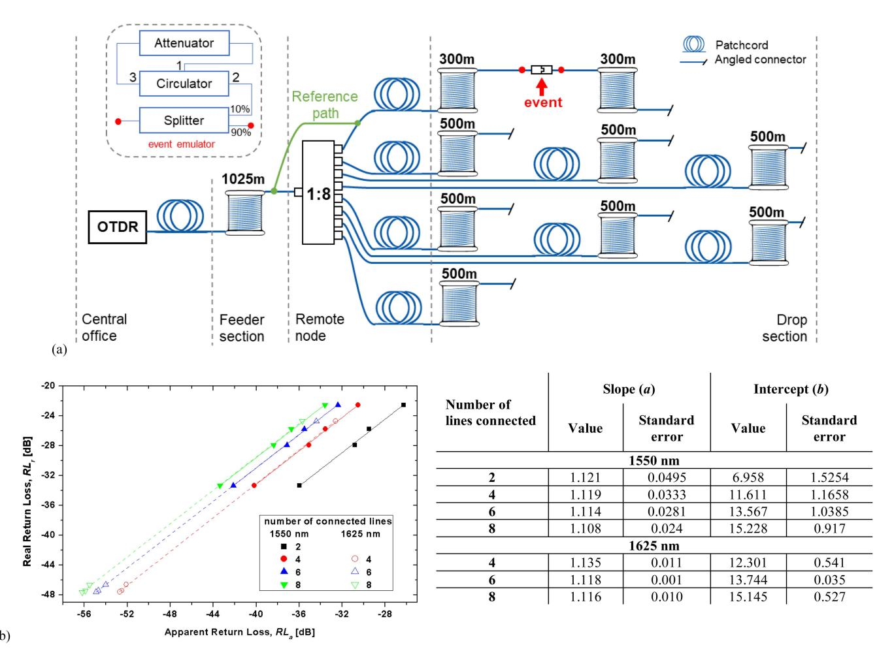
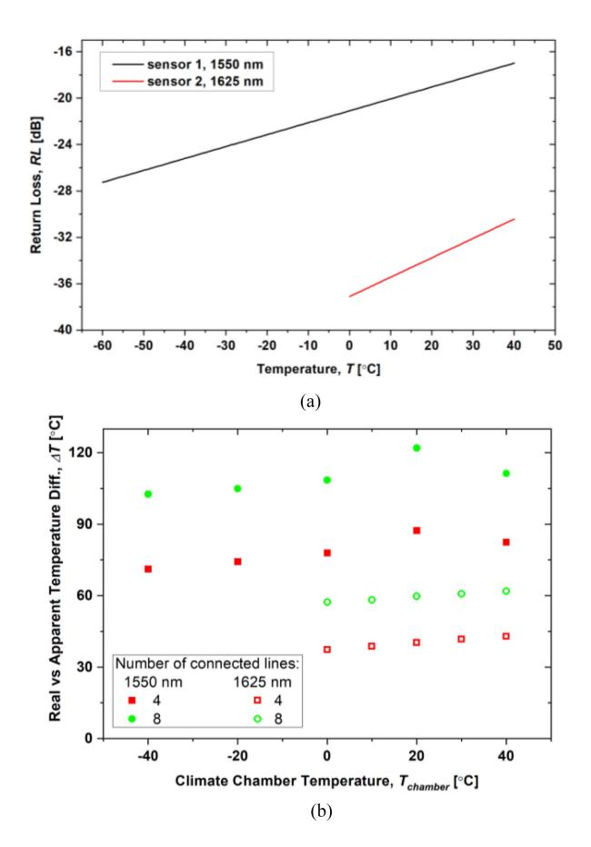
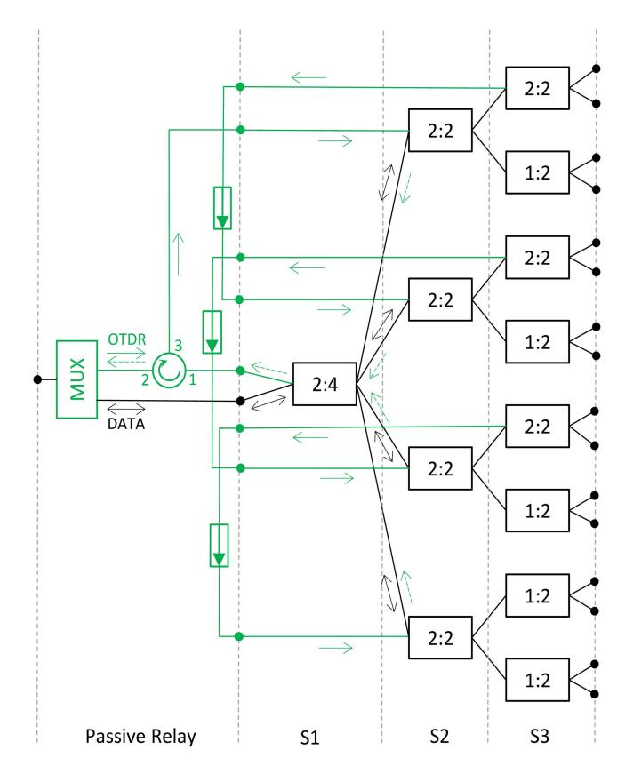
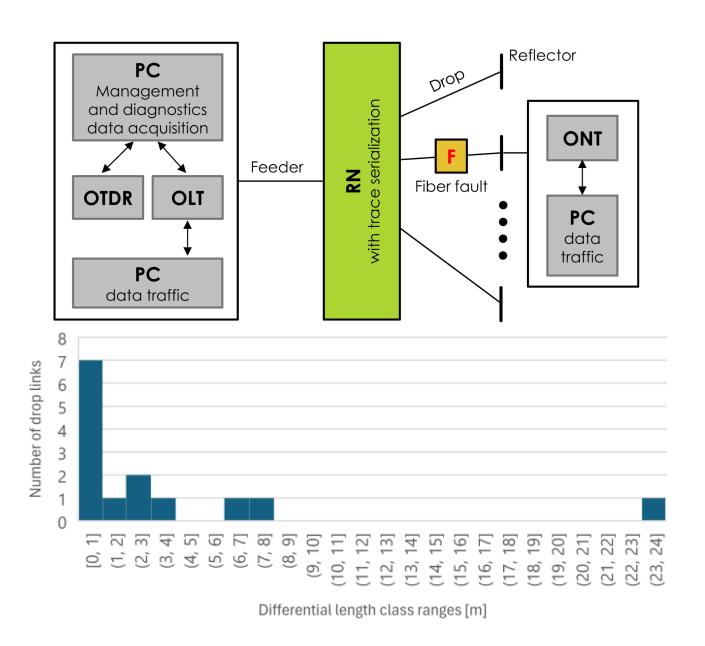
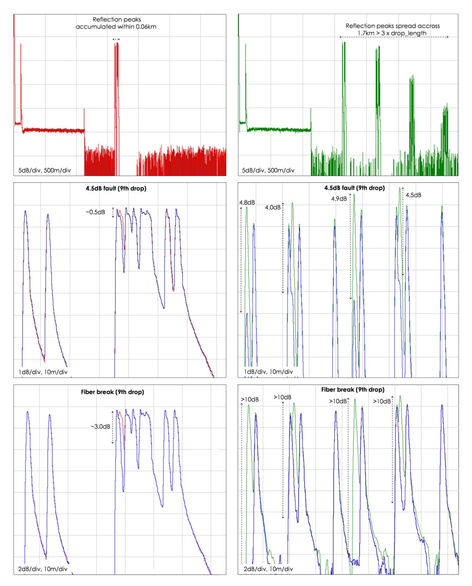
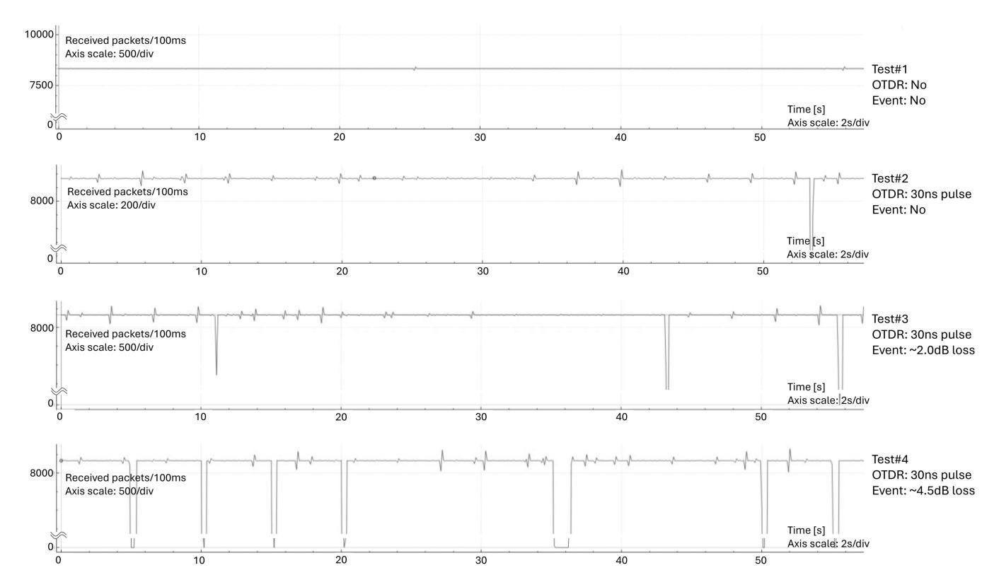

# Parallel Path Effect-Free Remote Monitoring and Sensing in Live XGS-PON Using Legacy Optical Time Domain Reflectometry

Patryk J. Urban *[,](https://orcid.org/0000-0001-5546-3115) Senior Member, IEEE*, Eliza M. Mi´skiewicz [,](https://orcid.org/0000-0002-7093-9254) Daniel Karczewicz, Wojciech Kogut, and Juliusz Kopczy ´nski

*Abstract***—Over decades optical fiber technologies for communications and sensing developed separately. For the purpose of improving communication link reliability optical power level measurement was added to transceiver modules to coarsely detect fiber faults. It was further complemented by optical reflectometry to localize those faults. For the purpose of fiber-optic sensing, which focuses on monitoring of ambient environment, more advanced techniques were developed based on dedicated photonic sensors, fiber sensing and high-end line interrogation units. Recently, we have noticed a new paradigm – the joint communications and sensing, where the fiber-optic infrastructure is not only to be monitored in terms of telecom link diagnosis, but it is also expected to provide detailed information on e.g., temperature, vibration, strain, which can be associated with abnormal activity such as earthquake, fire or intrusion. The optical access network provide great potential for obtaining large volumes of sensing data due to high number of links in the installations. However, these networks are often based on fiber point-to-multipoint architectures comprising optical power splitter, which limits performance of known reflectometry-based supervision originally dedicated to fiber pointto-point links. We present an efficient method for supervision of fiber point-to-multipoint access networks to serve monitoring and sensing purposes. The method is based on an upgraded passive remote node architecture, which realizes reflectometry trace serialization concept. The method enables the application of legacy reflectometers independent from the network protocol and with minimal impact on data transmission.**

*Index Terms***—Monitoring, passive optical network, sensing.**

#### I. INTRODUCTION

**S**INCE the early 1990s we have experienced the development of fiber monitoring technology to ease the maintenance

Received 27 January 2025; revised 19 March 2025 and 11 April 2025; accepted 18 April 2025. Date of publication 21 April 2025; date of current version 16 July 2025. This work was supported in part by the National Centre for Research and Development, Poland, under Agreement EU-REKA/A5GARD/3/2021 as part of the European CELTIC-Next A5GARD Project. *(Corresponding author: Patryk J. Urban.)*

Patryk J. Urban and Eliza M. Mi´skiewicz are with the West Pomeranian University of Technology (ZUT), 70-310 Szczecin, Poland (e-mail: [patryk.](mailto:patryk.j.urban@ieee.org) [j.urban@ieee.org;](mailto:patryk.j.urban@ieee.org) [eliza.miskiewicz@zut.edu.pl\)](mailto:eliza.miskiewicz@zut.edu.pl).

Daniel Karczewicz is with Salling Group 71-627 Szczecin, Poland (e-mail: [karczewicz@sallinggroup.com\)](mailto:karczewicz@sallinggroup.com).

Wojciech Kogut is with CXO Services, 02-972 Warsaw, Poland (e-mail: [wojtekrexar1@gmail.com\)](mailto:wojtekrexar1@gmail.com).

Juliusz Kopczy ´nski is with DLL Partners, 72-010 Police, Poland (e-mail: [kopczynski@dll.com.pl\)](mailto:kopczynski@dll.com.pl).

Color versions of one or more figures in this article are available at [https://doi.org/10.1109/JLT.2025.3563162.](https://doi.org/10.1109/JLT.2025.3563162)

Digital Object Identifier 10.1109/JLT.2025.3563162

of communication networks. But it was after 2000, when the deployment of Passive Optical Network (PON) in fixed Internet access business gained momentum. Now, PON technology supports not only Fiber-To-The-Home (FTTH) services but also mobile transport services for 4G, 5G and it will continue its role undisputedly for next generation communications including massive connectivity for sensors in smart cities [\[1\].](#page-7-0)

As a consequence, network operators will face the risk of high total maintenance costs. Whilst the mainstream development efforts still mostly focus on efficient fiber bandwidth utilization, improvement of supervision of optical networks remains critical as maintaining the integrity of these networks is imperative to satisfy Service Level Agreement (SLA) especially for business customers with short service downtime allowed [\[2\],](#page-7-0) [\[3\].](#page-7-0)

Efficient and effective reactive as well as preventative end-toend fiber monitoring in access domain is high on research agenda and various research groups aim at finding proper solutions to reduce the parameter called Mean-Time-To-Repair (MTTR) or service downtime, and improve network reliability. Detailed requirements concerning fiber-optic access network monitoring have been compiled in [\[4\]](#page-8-0) based on in-depth analysis of several normative documents as referred to therein. Moreover, in the recent European Project A5GARD researchers ran a survey amongst several operators, incl. BT, Orange, Verizon, Exatel, Fiberhost, Telefonica and more, and the results brought a couple of important conclusions [\[5\]:](#page-8-0)

- a) solutions available on the market do not meet some of the essential requirements regarding sensitivity and accuracy in fault localization and measurement in all sections of the PON,
- b) operators keep cost as the beacon for technology adoption, however there are some applications, where cost requirements could be relaxed (e.g., mobile transport).

## *A. Sensing in Passive Optical Networks*

The above was all oriented onto detecting typical telecom fiber link faults such as fiber ruptures, dirty connectors, fiber bends, degrading fiber splices etc. But photonic technologies are also known for its great sensing potential. Conditions of the environment surrounding the optical fiber or a local photonic sensor connected in the fiber-optic transmission line can be immediately detected with high accuracy and resolution

0733-8724 © 2025 IEEE. All rights reserved, including rights for text and data mining, and training of artificial intelligence and similar technologies. Personal use is permitted, but republication/redistribution requires IEEE permission. See https://www.ieee.org/publications/rights/index.html for more information. using high-end line interrogators. This includes detection of vibrations, temperature, strain, which could indicate car traffic, train position, earthquakes, nearby events, degrading infrastructure conditions or overheating infrastructure components e.g., [\[6\],](#page-8-0) [\[7\],](#page-8-0) [\[8\].](#page-8-0) Optical sensors offer several unique advantages over conventional electrical sensors: immunity to electromagnetic interference, excellent fatigue life, easy embeddability, extremely lightweight and small size. There are distributed sensors, where the optical fiber itself is the sensing media, and localized sensors, where special sensing component is introduced into the fiber-optic line [\[9\],](#page-8-0) [\[10\].](#page-8-0) Fiber-based sensors rely on backscattered light and provide best measurement resolution but with a trade-off in Signal-to-Noise Ratio (SNR) and expensive high-end line interrogators. They are suitable for Point-to-Point (PtP) fiber-optic links with a single fiber strand generating the backscatter. The localized sensors are fabricated using fiber grating technology (Fiber Bragg Grating – FBG, Long Period Fiber Grating – LPFG). It offers very reliable results in terms of SNR, but at the same time the density of sensing points (thus, measurement resolution) is very limited. The grating, created by periodically modulated refractive index, acts as a reflective wavelength-selective filter. The resonant wavelength depends on the grating period, which further depends on the strain and temperature of the fiber. Thus, strain and temperature can be monitored by measuring changes in the reflected signal. Several of such sensors can be placed along the fiber to enable costefficient reflectometry-based sensing using single wavelength channel [\[11\].](#page-8-0)

The reflective events can also correspond to fiber faults such as disconnected connector or poor quality splice as well as existing in-line components with acceptable level of return loss. In the access network, dedicated FBG reflectors placed close to the customer end are envisioned for link monitoring provided that the differential length of the drop branches is large enough to avoid overlap of the reflectors' peaks in the reflectometry trace [\[5\].](#page-8-0) That way, the link can be tested by checking peak amplitude difference with respect to the reference measurement results. Analogically to sensing, a non-zero amplitude difference indicates link health issue in a line corresponding to a given peak. In either case (sensing or monitoring), the peak amplitude measurement determines accuracy of the fault magnitude calculation and/or sensor indication, which is crucial for evaluation of the event severity.

Optical fiber monitoring and optical sensing have several fundamental similarities. The most important is that both represent single-ended (or centralized) approaches based on the use of back-scattered and/or back-reflected light as a source of monitoring and sensing information. As a result, nowadays, we see a new paradigm shift, which is the joint monitoring/sensing and communication in fiber optic networks. Ideally, a unified network supervision solution would provide both capabilities. The collected data could be used by third-party companies or city utilities to further optimize their operations[\[12\].](#page-8-0) In fact, in quest of improving revenue stream, telecom operators would consider selling sensing data, which could provoke larger investment in advanced fiber supervision systems.

Fig. 1. Ideal reflectometry trace in a PON based on regular power splitter (right) compared to an ideal trace in a PON based on a RN with trace serialization (left); F – fiber fault.

Sensing in a PtP fiber-optic telecom link, such as long-haul interconnect, has already been addressed in literature, e.g., [\[13\],](#page-8-0) [\[14\].](#page-8-0) This concept of network supervision naturally migrates towards the aforementioned optical access networks due to high volumes of fiber links. Initial sensing-dedicated products are already available on the market (such as in-line sensors for flood detection or sensors to detect telecom cabinet door status) [\[10\]](#page-8-0) and more advanced sensing solutions are being proposed in the research domain (such as the Distributed Fiber Optic Sensing, DFOS [\[15\]](#page-8-0) or interferometry [\[16\]\)](#page-8-0). Recently, new standardization efforts in this subject matter have been briefly reported [\[8\],](#page-8-0) [\[17\],](#page-8-0) but no technical specifications are available in public domain yet besides some generic functional requirements such as: operation on both in-service fiber and dark fiber, monitoring both trunk fiber and drop fibers in a PON, no interference to data traffic.

#### *B. Parallel Path Effect*

Unfortunately, from the network supervision perspective, the access networks are predominantly designed as Point-to-MultiPoint (PtMP) networks based on passive optical power splitter placed in a Remote Node (RN), which make known methods – such as Optical Time Domain Reflectometry or Optical Frequency Domain Reflectometry (OTDR, OFDR, further generalized as OxDR) – unable to detect and localize fiber anomalies with desired accuracy and sensitivity in all drop lines. This is due to the intrinsic Parallel Path Effect (PPE), which was introduced in [\[18\]](#page-8-0) and studied in [\[19\]](#page-8-0) in terms of loss event analysis as indicated in Fig. 1(right). PPE happens when the photodetector of the OxDR system receives the summation of the back-scattered and back-reflected signals from all connected drop lines in a PON. In a standard PON, it always causes inevitable masking of the events in the drop section, which in case of a PtP link would clearly indicate fiber faults. The masking leads to falsification of the real event parameters – insertion loss and return loss – measured by the OxDR. In the worst case, an event signature on the OxDR trace would be totally overlapped by a signature of an event coming from another drop line (called event overlapping) and/or backscattered light from other drop lines connected to the same splitter, explained in detail in [\[20\].](#page-8-0) The same applies to sensing functionality. The presence of adjacent drop lines connected to the same splitter jeopardizes any sensing information that could come from the backscatter generated by a given single drop line or reflection from a localized sensor. Noteworthy, the earlier mentioned papers regarding sensing in the PON focus on using just one [\[16\]](#page-8-0) or two [\[15\]](#page-8-0) drop links beyond the splitter, which from the perspective of network supervision create a PtP link or a PtMP link with the lowest possible split ratio of 1:2, respectively. At the same time other drop lines, which could provide much more sensing data, cannot be used for sensing purposes due to fundamental reasons like the PPE, high signal attenuation in the splitter, and interchannel crosstalk between the data and the sensing signals.

Various solutions have been proposed in literature to address the challenge of detection of fiber anomalies beyond the power splitter in the PON (i.e., loss events, reflective events, sensor activation, sensing-based on backscattering). The authors refer the readers to some comprehensive review publications such as [\[4\],](#page-8-0) [\[21\],](#page-8-0) [\[22\],](#page-8-0) [\[23\].](#page-8-0) However, the presented approaches accept the fact of existence of PPE in a PON and take steps to reduce its impact by using new special measurement/interrogation units, dedicated end-line encoders, special fibers, or at least imposing a requirement of non-zero differential length of fibers in the drop section to separate end-line reflections, which all impact the network design. In [\[24\]](#page-8-0) the authors introduced a concept of a remotely powered controllable splitter monitor, which enabled measurement of the individual drop-lines. While it mitigated the impact of the PPE, it introduced an active node, which is against the fundamental requirement of keeping the outside distribution plant of the fiber access network passive. The most recent works focus on employing also machine learning approaches to identify individual PON branches [\[25\],](#page-8-0) [\[26\],](#page-8-0) [\[27\].](#page-8-0) However, none of the works provide efficient elimination of the root-cause that generates the PPE, which lies in the very nature of every splitter-based PON.

## *C. Reduction of the PPE Impact*

In this paper, we present an efficient implementation of the PON supervision that eliminates PPE using well-established OTDR. The approach converts a traditional OTDR trace of a PtMP PON into a PtP-like trace. It is achieved on an optical layer and without any impact on the data transmission network design. Moreover, it supports PONs with drop-lines of equal lengths (it eliminates the non-zero differential length requirement in the drop section), provides desired event detection sensitivity, and needs just a single point of network upgrade – the passive remote node. We prove the concept in an XGS-PON testbed based on

Fig. 2. Impact of the PPE on non-reflective event detection: blue curve represents OTDR measurement results, and red curve represent RSSI retrieved from the ONT/ONU TX/RX.

commercial components with negligible impact on data channel power budget.

# II. IMPACT OF THE PPE IN PRACTICE

In [\[19\],](#page-8-0) [\[28\]](#page-8-0) the authors addressed the masking of nonreflective events, which introduce only loss to the optical signal. A basic mathematical model for real event magnitude recognition from an OTDR trace impacted by the PPE was proposed, there, and later implemented in the Fiber Plant Manager prototype [\[29\].](#page-8-0) Based on the model, the (masked) event magnitude measured by the OTDR caused by an event located in one of the drop-links connected to a fully-loaded ideal splitter can be expressed with the following formula:

$$\Delta_L = 5 \cdot \log \left( \frac{N}{(N-1) + \alpha} \right) \tag{1}$$

where N is the split ratio, andαis the attenuation factor (linear) of the real event magnitude. The formula is used to plot the masked event magnitude versus the logarithm of the linear attenuation factor representing the real event magnitude in case of a 1:8 splitter (*N* = 8) in Fig. 2. The Received Signal Strength Index (RSSI) values, which is the parameter envisioned as one of the ONT/ONU TX/RX standard diagnostics parameters in PONs, shows the optical power measurement at the module connected to a given drop line. Thus, there is no masking or PPE impacting the measurement, but such supervision relies on the access to PON protocol, it lacks fault position identification and suffers from poor measurement accuracy of +/*−*3 dB [\[30\].](#page-8-0) On the other hand, the OTDR results – although they provide the fault location – clearly show the impact of the PPE on the event magnitude detection. In the example scenario of the fully loaded 1:8 splitter, a 3 dB loss event would be recorded as about 0.2 dB loss event in the OTDR trace, while a 1 dB loss event would be recorded as about 0.1 dB loss event in the OTDR trace, which is nearing the noise threshold of the OTDR receiver. Larger splitters with more drop lines connected would obviously worsen the situation.

In this Section, the authors complement the study from [\[19\],](#page-8-0) [\[28\]](#page-8-0) with the practical impact analysis of the PPE on measurement of reflective events, which, in addition to the transmitted signal attenuation, introduce back-reflection. As explained

Fig. 3. Reflective event measurement: (a) test setup and (b) measurement results *RLr*(*RLa*) of observed reflective event for different splitter loads at 1550 nm and 1625 nm (left) and linear function coefficients (right).

further in the Section, the method retrieves the real return loss (RL*r*) from the apparent return loss (RL*a*), which is measured on the masked OTDR trace.

The experimental setup used in this study is depicted in Fig. 3(a). It included single mode fiber installation and a 1:8 splitter. In one of the drop-branches a reflective event was emulated by means of a variable optical attenuator connected to the unidirectional ports of a circulator, Fig. 3(a) insert. The maximum achievable return loss was about 48 dB, which was the starting value of the real return loss in the following measurements. The real return loss was measured by the OTDR in a reference setup (point-to-point) as indicated in Fig. 3(a)(the reference path marked in green with the event branch and signal by-passing the splitter). The apparent return loss is the return loss measured by the OTDR in a point-to-multipoint setup also shown in Fig. 3(a) (blue color). The latter measurement was performed for different number of connected drop lines (1 to 8) while keeping the event settings unchanged with respect to the reference (point-to-point) measurement. The OTDR measurement time was 3 minutes, the pulse width was 100 ns and two wavelength channels were used: 1550 nm and 1625 nm.

Fig. 3(b) presents measurement results of the real return loss (RL*r*) as a function of the apparent return loss (RL*a*). The relationship exhibits is linear for all tested splitter loads – solid and dashed lines in Fig. 3(b) are linear approximations (RL*r* = a *·* RL*a* + b) of collected data for 1550 nm and 1625 nm, respectively. The values of the linear function coefficients of all fitted curves, Fig. 3(b) (right), differ very little from each other – the standard deviation is about 0.005 for 1550 nm and 0.0085 for 1625 nm.We can use this semi-empirical method to calculate the real return loss RL*r* value of reflective event based on the measured RL*a* value and information on the network architecture. It is sufficient to use a linear equation with adjustable parameters corresponding to the network split ratio and number of connected lines longer than the event position and previously obtained RL*r(*RL*a)* characteristics.

We used this approach to obtain temperature measurement from a sensor embedded in one of the drop-branches in a PON in setup analogical to the one presented in Fig. 3(a). There were two temperature sensors studied, both of them based on an LPFG with sensitivity region around 1550 nm (sensor 1) and 1625 nm (sensor 2) replacing the event emulator in Fig. 3(a) and

Fig. 4. Results of tests with temperature sensors: (a) return loss vs temperature characteristics and (b) temperature measurement offset due to real vs apparent return loss difference.

put in a climate chamber. The temperature (T*chamber*) inside the chamber was changed from *−*60 °C to +40 °C and the same OTDR signal settings were applied as earlier. The *RL* to temperature characteristics of the sensors are given in Fig. 4(a).

Using the linear approximation for cases of 4 and 8 drop lines connected (values of the coefficients *a* and *b*) the RL*r* values were calculated. Next, based on the sensor characteristics the temperatures T(RL*r*) and T(RL*a*) were read out for obtained RL*r* and measured RL*a*. To illustrate the impact of the PPE on the measurement results, we calculated a temperature difference ΔT = T(RL*r*) *−* T(RL*a*) and plotted it as function of the temperature measured directly at the climate chamber, Fig. 4(b). A large offset between the real and masked readouts is clearly visible (min. 35 °C), which turns temperature sensing in a PON extremely inaccurate due to the presence of PPE and dependence of PON characteristics such as split ratio or number of connected lines.

Noteworthy, other sensors that do not follow continuous relation with the stimulus can be still used in the PON. This applies to any two-state sensor e.g., telecom cabinet door sensor based on FBG, which reveals only two operational states: door-closed and door-open represented by high and low reflection amplitude [\[10\].](#page-8-0)

One can clearly see that the PPE has large impact on event magnitude measurement, which applies to both non-reflective

Fig. 5. RN enabling trace serialization: green color represents OTDR signal path (solid arrows indicate OTDR forward and relay paths; dashed arrows indicate backscattered/back-reflected OTDR signal), black color represents data signal path.

and reflective events in PON. The low accuracy of the retrieved values of the real event magnitudes from the masked trace causes the risk of unreliable network supervision: false alarms or missed faults. While the other methods published in the cited works rely on major changes in the network design. None of the methods eliminates the fundamental issue of the PPE.

# III. REDUCTION OF THE PPE

To eliminate entirely the PPE the concept of the OTDR trace serialization was introduced in [\[20\],](#page-8-0) which is a technique in line with the PON supervision requirements in the community-adopted BBF TR-287 [\[18\]](#page-8-0)recommendation (the external and chassis-based architectural approaches as described, therein) and serving both detailed remote fiber fault detection/localization as well as sensing using localized sensors. Here, we discuss a cost-optimized Remote Node (RN) and prove the capability of reliable detection of events in the drop section in the PON.

The concept is based on serialization of the OTDR trace implemented on the physical layer of a PON. The serialization is achieved by means of an OTDR signal relay functionality in the new passive RN as depicted in Fig. 5. There, a regular PON splitter is replaced with three splitting stages of lower individual split-ratios. For the purpose of this work we use 1:16 of total split ratio. At the RN input the PON data signal is separated from the OTDR signal by a multiplexer (MUX). It enters first splitting stage (S1) of 2:4, and follows to the second stage (S2) with 3 dB 2:2 splitters and the third stage (S3) of 3 dB 1:2 or 2:2 splitters. The OTDR signal is forwarded from the RN input to an optical circulator (port#2). It by-passes S1 and it is transmitted through the first S2 splitter (first from the top in Fig. [5\)](#page-4-0), where it combines with the data signal. Next, it is transmitted through a pair of S3 splitters to 4 drop links simultaneously towards the far-end low return-loss reflectors (i.e., standard U-band FBG-based reflectors close to ONUs, not indicated in Fig. [5\)](#page-4-0). In accordance with the requirements in [\[18\]](#page-8-0) the reflectors are wavelength-selective filters which return the OTDR signal back to the RN. There, part of the OTDR signal is put through S3 and S2 splitters as well as the optical circulator. The other part of the returned OTDR signal is relayed from the first S3 splitter to the second S2 splitter through a pair of S3 splitters to the second group of 4 drop links. The process continues until the last group of drop links. The isolators are inserted to prevent from multiple echoes and keep the OTDR trace free from undesired reflection peaks. Similar effect could be achieved by proper trace data processing to cancel such artefacts. Not indicated in Fig. [5,](#page-4-0) the undesired backscattered/back-reflected portion of the OTDR signal propagating also along the data signal paths in the RN is blocked in the MUX. On the other hand, portion of the data signal propagates also along the OTDR dedicated paths in the RN. However, the impact of such optical interchannel upstream signal crosstalk in downstream receiver is expected to be limited by standard optical filtering of upstream/downstream in ONU. The RN is expected to introduce around 0.5–1.0 dB of additional data signal attenuation due to presence of the MUX.

The resulting ideal OTDR trace of a PON with trace serialization concept is schematically shown in Fig. [1\(](#page-1-0)left). Ideally, the PPE would be entirely eliminated, which would enable directl read out the event parameters. Due to the very nature of the converted (serialized) trace, the distance of events detected in the drop section needs to be corrected. This is achievable by a mathematical operation executed on the data exported from the OTDR according to the principle from [\[20\]](#page-8-0) and summarized here. One needs to calculate the distance offset for each drop link that needs to be subtracted from the event position directly measured by the OTDR. The offset for the event in the i-th drop-line is given with the formula:

$$OFFSET_i = \sum_{k=1}^{i} (D_{k-1} + L_k)$$
 (2)

where *i* = 1…*N, N* is the total split ratio of the RN, D*k* (D0 = 0) is the length of the *k*-th drop-line (extracted from the network reference tests), and L*k* is the additional optical path length in the RN connecting the adjacent S3 splitters.

# IV. TEST IN LIVE XGS-PON

The testbed depicted in Fig. 6(top) is composed of commercially available components such as: rack-mounted OTDR (Viavi OTU-8000), TiBiT XGS-PON OLT housed in a switch (Mikrotik CRS-305), and an XGS-PON ONT (Icotera i7404). The XGS-PON is managed by software provided by BISDN

Fig. 6. Testbed setup.

GmbH. The RN is built following the exact architecture as depicted in Fig. [5](#page-4-0) and discussed in the previous Section. It is composed of common discrete passive components all housed in a 1U enclosure. The Optical Distribution Network (ODN) is built on standard single mode fiber. A total of 16 drop links are connected to the RN output ports. Each drop link is ended with a commercial U-band FBG reflector. The differential length in the drop section is close to or below the OTDR best resolution achieved with 2 ns pulsewidth – first class range of 0–1 m in the histogram in Fig. 6(bottom).

In the experimental system, the extra loss imposed by the RN onto the data channels (downstream and upstream) is about 3 dB due to several additional patchcords, optical connectors, and the multiplexer. The extra loss experienced by the OTDR signal is higher compared to a traditional splitter and it accumulates while the signal is conveyed to consecutive groups of drop links. Nonetheless, as we are investigating reflection peaks, the so called scattering Dynamic Range (DR) of the OTDR is less relevant than the reflective DR, which is substantially higher and leaves margin for scaling the RN to higher split ratio. Note, the reflective DR and the scattering DR are well explained in [\[31\]](#page-8-0) and the scalability of the trace serialization concept towards PONs with higher split ratio are explained in [\[20\].](#page-8-0)

Fig. [7\(](#page-6-0)top left) shows a reference OTDR trace with regular RN, and traces with one minor and one major event introduced in one of the drop lines, Fig. [7](#page-6-0) (middle left and bottom left, respectively). The reflection peaks are very close to each other or overlapping, which does not allow for reliable precise measurement of the peak amplitude and event severity assessment. The detected event magnitudes are falsified: around 0.5 dB is detected in the trace while the real event loss was 4.5 dB and only around 3 dB is detected while the real event loss was larger than 10 dB. Such discrepancy between the recorded value and the real value would result in major error of e.g., temperature sensor indication as discussed in Section [II.](#page-2-0)

Fig. 7. OTDR traces for a regular RN (left column) and the new RN (right column): without fiber faults i.e., references traces (top), zoomed trace with minor fiber fault (middle) incl. corresponding reference traces, and zoomed trace with major fiber fault (bottom) also incl. corresponding reference traces.

Fig. 8. Received downstream UDP packets measurement results.

We then applied the new RN and the very large separation of the reflection peaks gave very good visibility of the peak amplitude variation and allowed for detection of various faults and direct readout of the event magnitudes, Fig. [7\(](#page-6-0)right). As the event is present in the drop-line connected to an S3 splitter with one of the ports used in the relay path, the event is represented as a drop in every reflection peak that follows in the serialized trace. The example event of 4.5 dB was directly measured as 4.55 dB (average value across four peaks as indicated in Fig. [7\(](#page-6-0)middle right)), which proves the PPE elimination.

Next, we deployed the new RN in the XGS-PON system to measure the transmission of the UDP packets. Firstly, we verified that there was no performance difference between a system with a regular RN and a system with the new RN for the downstream UDP traffic. Secondly, in a system with the new RN we introduced the OTDR signal and verified that it did not introduce any interchannel crosstalk and thus had no impact on the data transmission (Test#1 and Test#2, Fig. 8). We associate the negligible variations in Test#2 with the imperfect filtering of the strong OTDR signal at the ONT. Naturally, after introducing the attenuation event of ca. 2 dB and ca. 4.5 dB, increase in packet loss was visible in Test#3 and Test#4, respectively. Test#4 addressed the case, when the received optical power at the ONT was reaching the receiver sensitivity threshold. Noteworthy, Test#4 corresponds to the OTDR measurement presented in Fig. [7\(](#page-6-0)middle right). There, the event is well visible, while in a PON with a regular RN, an event causing already substantial packet loss would be hardly detectable using an OTDR technique, Fig. [7\(](#page-6-0)middle left).

# V. SUMMARY

We presented an optimized passive remote node architecture for supervision of fiber PtMP access networks to serve monitoring and sensing purposes. The method leverages on legacy OTDR equipment, which together with the remote node converts a PtMP OTDR trace to a PtP-like trace where traces of individual drop branches are concatenated in series. This avoids the impact of parallel-path effect or the overlap of events and allows to directly measure reflective events or localized sensor reactions in beyond-splitter section of the PON. The proposed method is standalone, PON-protocol independent and introduces negligible impact on the data signal transmission. The method was proven in live XGS-PON system with example 1:16 split ratio and several equidistant drop lines.

#### ACKNOWLEDGMENT

I. Cooper (former BT, now with OpenLightComm), A. Ta´nski (Icotera), K. Kowalik (Fiberhost), D. Fritzsche (BISDN), G. Zegli ´ ˙ nski and A. Niesterowicz (ZUT) are acknowledged for their support.

# REFERENCES

- [1] M. M. H. Adib et al., "Optical-access networks for smart sustainable cities: From network architecture to fiber deployment," *IEEE/Optica J. Opt. Commun. Netw.*, vol. 17, no. 3, pp. 221–232, Mar. 2025.
- [2] Verizon, "Service level agreement internet dedicated services," 2025. Accessed: Mar. 06, 2025. [Online]. Available:<https://tinyurl.com/zhx99f3p>
- [3] Orange Poland, "SLA dla Usług Transmisji Danych," 2025. Accessed: Mar. 06, 2025. [Online]. Available:<https://tinyurl.com/yc58a2ne>

- [4] P. J. Urban, G. C. Amaral, G. Zegli ´ ˙ nski, E. Weinert-Raczka, and J. P. von der Weid, "A tutorial on fiber monitoring for applications in analogue mobile fronthaul," *IEEE Commun. Surv. Tuts.*, vol. 20, no. 4, pp. 2742–2757, Fourthquarter 2018.
- [5] P. J. Urban, "State of the art and development trends in FTTx monitoring (sections 1-3)," Celtic-Next A5GARD, Project Deliverable 3.3, Szczecin, Poland, Dec. 2021.
- [6] P. Di Palma et al., "The role of fiber optic sensors for enhancing power system situational awareness: A review," *Springer Smart Grids Sustain. Energy*, vol. 9, Nov. 2023, Art. no. 2.
- [7] J. L. Santos, "Optical sensors for industry 4.0," *IEEE J. Sel. Topics Quantum Electron.*, vol. 27, no. 6, Nov./Dec. 2021, Art. no. 5600911.
- [8] F. Saliou et al., "Fiber sensing opportunities as a telco," in *Proc. Eur. Conf. Opt. Commun.*, Frankfurt, Germany, 2024.
- [9] B. Culshaw and A. Kersey, "Fiber-optic sensing: A historical perspective," *IEEE/Optica J. Lightw. Technol.*, vol. 26, no. 9, pp. 1064–1078, May 2008.
- [10] ADTRAN, "Advanced link monitoring (ALM)," 2025. [Online]. Available:<https://tinyurl.com/46had6te>
- [11] L. C. G. Valente et al., "Time and wavelength multiplexing of fiber Bragg grating sensors using a commercial OTDR," in *Proc. Opt. Fiber Sensors Conf.*, 2002, pp. 151–154.
- [12] G. Bolton, "Fiber's sensitive and quantum future," *Lightwave*, Feb. 2024. [Online]. Available:<https://tinyurl.com/bdd3c2pf>
- [13] Y. Aono et al., "More than communications: Environment monitoring using existing optical fiber network infrastructure," presented at Opt. Fiber Commun. Conf., San Diego, CA, USA, Mar. 8–12, 2020, Paper W3G.1.
- [14] E. Ip et al., "Distributed fiber sensor network using telecom cables as sensing media: Technology advancements and applications," *IEEE/Optica J. Opt. Commun. Netw.*, vol. 14, no. 1, pp. 61–68, Jan. 2022.
- [15] B. Zhu et al., "Distributed acoustic sensing over passive optical networks using enhanced scatter fiber," presented at Opt. Fiber Commun. Conf., San Diego, CA, USA, Mar. 24–28, 2024, Paper M1K.1.
- [16] M. Fasano et al., "In-service PON safety surveillance by a sustainable interferometric sensor," in *Proc. 50th Eur. Conf. Opt. Commun.*, 2024, pp. 1663–1666.
- [17] J. S. Wey, T. J. Xia, and G. Wellbrock, "Standardization of distributed fiber optic sensing system for terrestrial optical networks," in *Proc. Opt. Fiber Commun. Conf.*, 2024.
- [18] G. Bathrick, "PON optical-layer management," *Broadband Forum*, no. 2, Fremont, California, USA, Tech. Rep. 287, Oct. 2017.
- [19] G. P. Temporão et al., "Feasibility of centralized passive optical network monitoring using passive optical network-tuned optical timedomain reflectometry," *Taylor&Francis Group, Fiber Integr. Opt.*, vol. 32, pp. 117–130, Mar. 2013.
- [20] P. J. Urban, "Mitigation of parallel-path effect for reliable monitoring of passive optical network using standard optical time domain reflectometry," *IEEE/Optica J. Opt. Commun. Netw.*, vol. 15, no. 10, pp. 776–782, Oct. 2023.
- [21] K. Yuksel et al., "Optical layer monitoring in passive optical networks (PONs): A review," in *Proc. Intern. Conf. Transparent Opt. Netw.*, 2008, pp. 92–98.
- [22] M. M. Rad, K. Fouli, H. A. Fathallah, L. A. Rusch, and M. Maier, "Passive optical network monitoring: Challenges and requirements," *IEEE Commun. Mag.*, vol. 49, no. 2, pp. s45–s52, Feb. 2011.
- [23] A. Usman et al., "Optical link monitoring in fibre-to-the-x passive Optical network (FTTx PON): A comprehensive survey," *Elsevier Opt. Switching Netw.*, vol. 39, Nov. 2020, Art. no. 100596.
- [24] J. Hehmann, M. Straub, L. Jentsch, M. Earnshaw, P. Anthapadmanabhan, and T. Pfeiffer, "Remotely powered intelligent splitter monitor for fiber access networks," in *Proc. Eur. Conf. Opt. Commun.*, 2015, pp. 1–3.
- [25] M. Brügge et al., "Live demonstration of ML-based PON characterization and monitoring," presented at Opt. Fiber Commun. Conf., San Diego, CA, USA, Mar. 05–09, 2023, Paper M3Z.7.
- [26] K. Abdelli, C. Tropschug, H. Griesser, and S. Pachnicke, "Faulty branch identification in passive optical networks using machine Learning," *IEEE/Optica J. Opt. Commun. Netw.*, vol. 15, no. 4, pp. 187–196, Apr. 2023.
- [27] M. Straub et al., "ML approaches for OTDR diagnoses in passive optical networks – event detection and classification: Ways for ODN branch assignment," *IEEE/Optica J. Opt. Commun. Netw.*, vol. 16, no. 7, pp. C43–C50, Jul. 2024.
- [28] P. J. Urban, A. Getaneh, J. P. von der Weid, G. P. Temporão, G. Vall-llosera, and J. Chen, "Detection of fiber faults in passive optical networks," *IEEE/Optica J. Opt. Commun. Netw.*, vol. 5, no. 11, pp. 1111–1121, Nov. 2013.

- [29] P. J. Urban, G. Vall-llosera, E. Medeiros, and S. Dahlfort, "Fiber plant manager: An OTDR- and OTM-based passive optical network monitoring system," *IEEE Commun. Mag.*, vol. 51, no. 2, pp. S9–S15, Feb. 2013.
- [30] International Telecommunication Union, "Gigabit-capable passive optical networks (GPON): Physical media dependent (PMD) layer specification," ITU, recommendation G.984.2, Geneva, Switzerland, Aug. 2019.
- [31] D. Anderson et al., *Troubleshooting Optical-Fiber Networks. Understanding and Using Your Optical Time-Domain Reflectometer*. CA, USA: Elsevier Academic, 2004.

**Patryk J. Urban** (Senior Member, IEEE) received the M.Sc. degree in optical telecommunications from the Szczecin University of Technology, Szczecin, Poland, in 2004, the Ph.D. degree in optical access networks from the Eindhoven University of Technology (TU/e), Eindhoven, The Netherlands, in 2009, the habilitation degree in telecommunications from the Warsaw University of Technology (WUT), Warsaw, Poland, in 2017. He received the Professorship from the President of the Republic of Poland, in 2025. During 2010–2018, he was a Senior Researcher with Ericsson Research, Sweden, focused on future optical access network technologies. Since 2019, he has been with the West Pomeranian University of Technology (ZUT), Szczecin, Poland, where he was the Head with Optical Reference Network Laboratory. Since 2024, he has been the Head of the Telecommunications and Photonics Department. He has been a Business and Technology Consultant to startups and SMEs. He has participated in and managed several research collaboration projects. Dr. Urban is currently a Founder and First Chairman of the IEEE Photonics Sweden Chapter, during 2013–2018, and the Chairman of the IEEE Photonics Poland Chapter, 2019. He is also the Vice-Chair of the Polish Optoelectronics Committee of the Association of Polish Electrical Engineers. He is a reviewer for IEEE, Optica Publishing Group, IET, and Elsevier. He is also an Author or Coauthor of nearly 100 publications and more than 50 granted patents and contributions to standardization groups.

**Eliza M. Mi´skiewicz** received the M.Sc. degree in optoelectronic telecommunication systems from the West Pomeranian University of Technology (ZUT), Szczecin, Poland. Since 2012, she has been a Ph.D. student, from 2013 to 2015, she was a Research Assistant, and since 2023, she has been a Education Assistant with the Department of Telecommunications and Photonics, the Faculty of Electrical Engineering, ZUT. She is currently involved in research activities in the field of nonlinear optics, electro-optical properties of semiconductor nanostructures and components for applications in optical communications systems. Her research interests include the influence of thermal phenomena on electro-optical properties and nonlinear optical phenomena in semiconductor heterostructures. She has also been involved in research projects focusing on issues of passive optical networks monitoring.

**Daniel Karczewicz** received the M.Sc. degree in transmission systems from the West Pomeranian University of Technology (ZUT), Szczecin, Poland, in 2024. Since 2024, he has been with Salling Group, Poland. At ZUT he has been involved in research work on passive optical network monitoring as part of his bachelor's and master's degree theses.

**Wojciech Kogut** received the M. Sc. degree in transmission systems from the West Pomeranian University of Technology (ZUT) Szczecin, Poland, in 2024. Since 2024, he has been Self-Employed providing services for CXO Services, Warsaw, Poland, in the field of fiber-optic transmission line configuration and maintenance. At ZUT he has been involved in research work on passive optical network monitoring as part of his bachelor's and master's degree theses.

**Juliusz Kopczy ´nski**received the M. Sc. degree in transmission systems from the West Pomeranian University of Technology (ZUT) Szczecin, Poland, in 2024. Since 2022, he has been a Production Engineer with DLL Partners, Police, Poland, providing telecommunication solutions based on fiber optic technology. At ZUT he has been involved in research work on remote passive optical network monitoring as part of his master's degree thesis. He was also the Chairman of a Student Scientific Association focusing on research on microstructured fibers and fiber-optic sensors.