# **Integration of endogenous sensing and communication based on photonics-enabled cellular base station networks with a spectrum fusion algorithm**

## **YANG ZHAO, JUN WAN, SHAOFU XU, AND WEIWEN ZOU\***

*The State Key Laboratory of Advanced Optical Communication Systems and Networks, Intelligent Microwave Lightwave Integration Innovation Center (imLic), Department of Electronic Engineering, Shanghai Jiao Tong University, 800 Dongchuan Road, Shanghai 200240, China \*wzou@sjtu.edu.cn*

**Abstract:** Endogenous integrated sensing and communication (ISAC) based on cellular base stations (BSs) can simultaneously achieve high-quality imaging and communication, which is one of the key technologies for future applications. However, due to the lack of a communicationcompatible high-resolution algorithm and hardware co-design, current ISAC methods cannot simultaneously balance imaging and communication performance. To address this, we build photonics-enabled cellular BS networks using analog radio-over-fiber (AROF), which can integrate a spectrum fusion algorithm derived from the advanced concept of bandwidth-enhanced microwave forward-looking imaging (MFI) to achieve endogenous ISAC. The spectrum fusion algorithm reconfigures the spatial spectrum to achieve a high-resolution MFI by fusing the spectrum resources of coexisting heterogeneous broadband orthogonal frequency-division multiplexing (OFDM) signals. The photonics-enabled cellular BS network not only satisfies the requirements of the algorithm for synchronization and carrier frequency preservation but also responds to the communication trend of high-efficiency fronthaul. The formulation and simulation results show that the imaging resolution can be significantly improved with the fusion of communication spectrum resources, achieving a higher resolution than that of existing ISAC methods at the same aperture. An ISAC demonstration system is built. The experimental results show that the imaging resolution of the fused communication spectrum resources is ∼3.5 cm × ∼4 cm, and the complex target (vehicle) can be imaged. Additionally, the maximum achievable communication data rate communication rate is 6Gbps.

© 2024 Optica Publishing Group under the terms of the [Optica Open Access Publishing Agreement](https://doi.org/10.1364/OA_License_v2#VOR-OA)

### **1. Introduction**

The development of wireless communication technology has driven emerging applications such as autonomous driving, intelligent cities, etc. [\[1–](#page-16-0)[5\]](#page-17-0). Realizing these advanced applications requires deep integration of high-quality communication and high-resolution imaging. The International Telecommunication Union (ITU) regards the integration of sensing and communication (ISAC), which utilizes cellular base stations (BSs) to achieve seamless collaboration between communication and imaging with high compatibility, as one of the key supporting technologies driving the development of future applications [\[6–](#page-17-1)[10\]](#page-17-2). However, current ISAC methods struggle to achieve high-resolution imaging with standard narrow-bandwidth communication waveform, and lack hardware co-designs for imaging and communication, resulting in an inability to achieve high-quality imaging and communication simultaneously [\[11\]](#page-17-3).

ISAC based on cellular BSs has only attracted attention in the past few years, but early researchers have been working on combining communication and radar functions on the same hardware platform to ensure cost-effective utilization, which is the prototype of ISAC [\[12–](#page-17-4)[21\]](#page-17-5). The performance of related works cannot be balanced simultaneously due to the lack of suitable

algorithms. The relatively straightforward method is to transmit the corresponding communication waveform and radar waveform separately via time-division multiplexing, frequency-division multiplexing or polarization-division multiplexing, which results in low channel resource utilization and increases control complexity [\[15](#page-17-6)[–21\]](#page-17-5). This contradicts the original intention of achieving ISAC with high efficiency and compatibility. Researchers have designed new communication waveforms by splicing and embedding different signals to enhance imaging capabilities [\[22–](#page-17-7)[26\]](#page-17-8). However, the design of new waveforms enhances the imaging capability but causes communication loss. Subsequently, some researchers have begun to focus on how to tradeoff performance between imaging and communication through further waveform optimization designs [\[27–](#page-17-9)[29\]](#page-17-10). Although this approach improves ISAC performance, the optimized waveforms are usually incompatible with standard communication waveforms. This incompatibility may lead to large-scale modifications of standard communication protocols, which imposes additional cost and time burdens, limiting the practical application and deployment of the new technology. Therefore, ISAC realizations need to comprehensively consider compatibility with standard communication. It is well-known that orthogonal frequency-division multiplexing (OFDM) with anti-interference and high efficiency has been widely selected as the standard waveform in communication protocols [\[30,](#page-17-11)[31\]](#page-17-12). Related researchers have also explored the realization of ISAC for OFDM waveform [\[32](#page-17-13)[–34\]](#page-17-14). Their associated imaging algorithm faces challenges in achieving high resolution due to the narrow bandwidth constraints of current Sub-6 G standard. In order to enhance the imaging resolution, a number of algorithms related to spectrum fusion have been proposed, and they mainly focus on enhancing the imaging resolution of the range dimension in range-azimuth imaging through multiple bandwidths [\[35,](#page-17-15)[36\]](#page-18-0). However, range-azimuth imaging suffers from geometric distortion compared to two-dimensional (2D) azimuth imaging. [\[37\]](#page-18-1) has recently theoretically verified the advanced concept that the spectrum resources of a single large bandwidth signal can enhance the azimuthal dimensional imaging resolution, breaking through the bottleneck that the azimuthal dimensional resolution is limited only by the aperture. In addition to the design of waveforms and algorithms, with the development of photonics technology, researchers are gradually exploring the utilization of low loss and large bandwidth photonic technology to realize ISAC systems. For example, photonics technology is used to generate or receive high-frequency, large-bandwidth signals and low-loss signal transmission, thus achieving high-range resolution and high-speed communication [\[38](#page-18-2)[–40\]](#page-18-3). However, these studies focus on improving one-dimensional range imaging resolution, without co-design of their 2D high-resolution algorithms. The ISAC related studies described above are based on the validation of single-transmitter-single-receiver antenna links and do not comprehensively consider the application in cellular BSs layout scenarios.

With the dense cellular networking of BSs, it has become possible to realize the imaging function in cellular BS networks. Researchers have investigated methods of achieving ISAC in cellular BS networks but lack a communication-compatible algorithm that does not modify the standard waveform to achieve high-resolution imaging. In 2021, Zhang *et al.* explored the feasibility and potential issues of extending ISAC over point-to-point links to cellular networks [\[41\]](#page-18-4). In 2022, Cao *et al*. first studied the feasibility of ISAC for cellular BSs and used a modified waveform to enhance the resolution of the inverse synthetic aperture (ISAR) algorithm. However, this affected the communication performance and compatibility of ISAC [\[42\]](#page-18-5). In 2022, Li *et al*. proposed a tomographic algorithm utilizing a combination of distributed BSs, in which a single 5 G signal was used for the numerical simulation [\[43\]](#page-18-6). In 2023, Han *et al.* used the distributed aperture imaging algorithm to jointly calculate the range-azimuth image in the cellular BS network, and simulated and analyzed the performance of this method [\[44\]](#page-18-7). Unfortunately, the imaging resolution needs to be further improved while ensuring communication compatibility to enhance recognition for future applications.

The initial cellular BS networks mainly consider communication and do not synergistically consider the imaging requirements of the future era, making it difficult for current ISAC methods to realize imaging in real-world cellular scenarios, and thus the above work can only provide numerical simulations [\[41–](#page-18-4)[44\]](#page-18-7). Current cellular BS networks use optical modules for digital fronthaul between the baseband unit (BBU) and the remote radio unit (RRU). Transceivers are deployed independently in each RRU, making it challenging to achieve high-precision synchronization for imaging [\[45,](#page-18-8)[46\]](#page-18-9). Secondly, the inevitable loss of carrier frequency and some information caused by different RRUs converting baseband data leads to poor availability of imaging resources [\[47\]](#page-18-10). In addition, the digital fronthaul is under more significant pressure due to growing bandwidth, leading to the analog fronthaul being the future of BS networks [\[48\]](#page-18-11). Therefore, the ISAC method should not only have high-resolution imaging algorithms compatible with standard communication, but also co-design cellular BS networks that meet future requirements for imaging and communication.

In this study, a high-resolution, communication-compatible ISAC method based on photonicsenabled cellular BS networks with a spectrum fusion algorithm was proposed and experimentally demonstrated. The spectrum fusion algorithm is derived from the advanced concept of bandwidthenhanced microwave forward-looking imaging (MFI) resolution. Heterogeneous spectrum resources coexist in BS networks, such as OFDM signals of multiple regimes (3 G/4 G/5 G), OFDM signals of different carrier frequencies in the same regime, and spread-spectrum signals, which are fully fused to obtain rich spatial frequency points and to reconstruct the spatial spectrum matrix to improve the resolution of the MFI. The transceivers are centralized at the central unit (CU) of photonics-enabled cellular BS networks for analog fronthaul to the remote BSs by analog radio-over-fiber (AROF), which ensures the imaging requirements of synchronization and carrier frequency preservation and responds to the communication trend of efficient fronthaul. This ISAC method simultaneously balances communication and imaging performance through the co-design of algorithms and cellular BS networks.

The paper is organized as follows: First, the principle of the ISAC method and the feasibility of cellular BS imaging are analyzed. Second, the formula derivation and simulation verify that the MFI resolution that fully fuses the communication spectrum resources is superior to current ISAC methods. Finally, field test results show that the imaging resolution is ∼3.5 cm×∼4 cm and could effectively image complex targets (vehicle). The maximum achievable communication data rate of the experimental system is 6Gbps.

### **2. Principle and feasibility**

### *2.1. Photonics-enabled cellular BS network*

The photonics-enabled cellular BS network is shown in Fig. [1](#page-3-0) and is divided into CUs, remote BSs, and AROF connections. The transmitters, including the DAC and E/O, and the receivers, including the ADC and O/E, are centrally deployed in the CU, so all transmitters and receivers can be centrally interconnected via optical fibers or cables to achieve high-precision time and phase synchronization for high-resolution imaging. A remote BS mainly comprises optoelectronic interconverters, amplifiers, and antennas. The remote BS either converts the optical signals transmitted by the CU into RF signals, which are then amplified and transmitted, or converts the received radio frequency (RF) signals into optical signals and sends them back to the CU. The analog fronthaul between the CU and the remote BS is carried out through the AROF, and the unprocessed analog RF signal interacts with the CU through the low-loss fiber, which preserves the carrier frequency resources and ensures the high efficiency of the fronthaul. AROF fully utilizes the advantages of photonics, such as easy distribution and low-loss transmission, to ensure efficient and reliable signal interaction over long distances. BSs are characterized by multi-generation heterogeneity and usually have coexisting OFDM signals of multiple standards, including 3 G (third-generation mobile communication technology), 4 G (fourth-generation

mobile communication technology), 5 G (fifth-generation mobile communication technology), and spread-spectrum communication. These coexisting heterogeneous signals can not only meet the communication needs of different users but also carry rich environmental details. However, the spectrum resources of these coexisting OFDM signals in cellular BS networks are typically ignored and should be fully utilized to improve imaging resolution in ISAC.

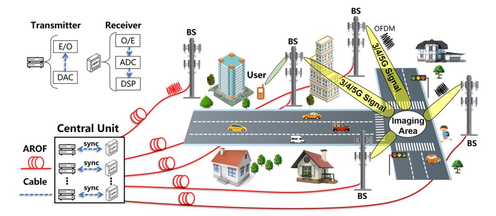

**Fig. 1.** Schematic diagram of photonics-enabled cellular BS network. ADC: analog-todigital converter; DAC digital-to-analog converter; O/E: optic-electro conversion; E/O: electro-optic conversion; DSP: digital signal process.

### *2.2. Spectrum fusion imaging algorithm*

Spectrum fusion imaging is an MFI algorithm that obtains visual images in two azimuthal dimensions. The algorithm is derived from the advanced imaging concept of single-signal bandwidth-enhanced MFI resolution [\[37\]](#page-18-1). [\[37\]](#page-18-1) verified the principle of improving MFI resolution by using the spectrum resources of a single large-bandwidth linear frequency modulation (LFM) signal. In contrast, in order to be compatible with standard communication waveform with limited bandwidth, the algorithm proposed in this paper improves the resolution by fusing the spectrum resources of multiple heterogeneous communication signals, which achieves high-resolution imaging while being compatible with standard communications. The steps in the spectrum fusion imaging algorithm are illustrated in Fig. [2\(](#page-4-0)a). At moment *ti* , a time-domain OFDM modulation signal *p*(*ti*) with n subcarriers and subcarrier spacing of ∆*f* is transmitted at the transmitting antennas (TAs) (*XTn*,*YTn*,*ZTn*), expressed as

$$p(t_i) = \sum_{n=1}^{N} A_n e^{j(2\pi n\Delta f + \psi_n)} \cdot e^{j2\pi f_c t}.$$
 (1)

where *An* and ψ*n* are the amplitude and phase of the modulated symbol on the *nth* subcarrier. *fc* is the carrier frequency. The echo of the OFDM signal after the target scattering is captured by the receiving antennas (RAs) at (*XRn*,*YRn*,*ZTn*). The echo is represented as

$$U = \sum_{o=1}^{O} \sigma(x_o, y_o) \cdot \alpha_L \cdot p(t_i) \cdot exp \left[ j2\pi f \left( t_n - \frac{(r_{Rn} + r_{Tn})}{c} \right) \right]$$

$$= \sum_{t_i=1}^{t_n} \sum_{n=1}^{N} \sum_{o=1}^{O} \sigma(x_o, y_o) \cdot \alpha_L \cdot A_k e^{j\psi_k} \cdot exp \left[ j2\pi (f_c(t_i) + n\Delta f(t_i)) \left( t - \frac{(r_{Rn}(t_i) + r_{Tn}(t_i))}{c} \right) \right].$$
(2)

### Optics EXPRESS

where  $\sigma(x_o, y_o)$  is the scattering coefficient of the target,  $\alpha_L$  is the amplitude attenuation of the path, and  $r_{Rn}$  and  $r_{Tn}$  represent the propagation distances of the TAs and RAs to the target, respectively. c is the microwave speed in a vacuum. From Eq. (2), the random modulation term of the TAs affects the amplitude and phase of the imaging target; therefore, the modulation term of the TAs needs to be eliminated. The transmitting signal is known, and the echo spectrum is then divided by the transmitted signal spectrum to eliminate the TAs' modulation term, which is expressed as

$$U = \sum_{t_i=1}^{t_n} \sum_{n=1}^{N} \sum_{o=1}^{O} \delta(t - t_i) \cdot \sigma(x_o, y_o) \cdot \alpha_L \cdot exp\left[ -j2\pi \frac{(f_c(t_i) + n\Delta f(t_i))}{c} (r_{Rn}(t_i) + r_{Tn}(t_i)) \right].$$
 (3)

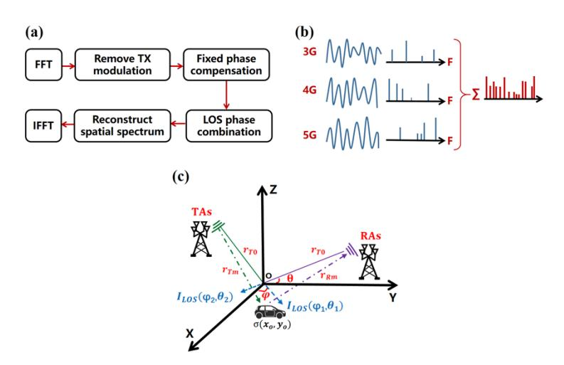

**Fig. 2.** Principle illustration of spectrum fusion imaging algorithm. (a) Imaging algorithm processing steps.(b) Schematic of spectrum resources carrying different spatial information being fused to enhance imaging. (c) Geometric relationship diagram of the imaging algorithm.

The geometric relationship of signal propagation in the imaging algorithm is shown in the Cartesian coordinate system established in Fig. 2(c). The origin of the coordinate system can be set flexibly according to the imaging area, and the target is located at or near the origin. When the distance from the TAs and RAs to the target is much larger than the distance from the target to the origin, the far-field approximation condition is satisfied.  $r_{Rn}$  and  $r_{Tn}$  can be approximated as the sum of the distances of the TAs and RAs to the coordinate origin and the projections of the unit vectors of the target in the direction of the line of sight (LOS) of the TAs and RAs. The projection of the target can be further represented by x- and y-direction components.

$$r_{Rn}(t_i) \approx r_{R0}(t_i) + x_0 \gamma_R(t_i) + y_o \kappa_R(t_i).$$
  
 $r_{Tn}(t_i) \approx r_{T0}(t_i) + x_0 \gamma_T(t_i) + y_o \kappa_T(t_i).$  (4)

where  $r_{T0}$  and  $r_{R0}$  are the distances of TAs and RAs to the coordinate origin, respectively.  $\Upsilon = cos\theta sin\varphi$ ,  $\kappa = cos\theta cos\varphi$  are both position factors. The elevation angles  $\theta$  and azimuth angles  $\varphi$  of TAs and RAs are easily obtainable parameters that can be calculated using the arctangent function from the known coordinates of the antenna positions.  $x_o$  and  $y_o$  are the positions of the target scattering points in the established Cartesian coordinate system, respectively. The spatial samples of all echoes must be transformed into a processable spatial coordinate system

and spatially decoupled. The echo phase is corrected using the known *rT*0 and *rR*0 to contain only the projections of the unit vectors of the target in different LOS directions, and the spatial spectrum can then be decoupled as

$$k_{x} = \sum_{t_{i}=1}^{t_{n}} \sum_{n=1}^{N} \delta(t-t_{i}) \cdot \frac{f_{c}(t_{i}) + n\Delta f(t_{i})}{c} \cdot (\gamma_{T}(t_{i}) + \gamma_{R}(t_{i})).$$

$$k_{y} = \sum_{t_{i}=1}^{t_{n}} \sum_{n=1}^{N} \delta(t-t_{i}) \cdot \frac{f_{c}(t_{i}) + n\Delta f(t_{i})}{c} \cdot (\kappa_{T}(t_{i}) + \kappa_{R}(t_{i})).$$
(5)

where *kx* and *ky* are the spatial frequencies in the *x*- and *y*-direction, respectively. By transforming the geometrical relations described above, the spatial propagation phase of the target echo is represented as a combination of a 2D spatial frequency and a 2D spatial distribution of the target scattering point. The echo spectrum can be further expressed as

$$U = \sum_{t_i=1}^{t_n} \sum_{n=1}^{N} \sum_{o=1}^{O} \delta(t - t_i) \cdot \sigma(x_o, y_o) \cdot exp[-j2\pi(k_x x_o + k_y y_o)].$$
 (6)

The above equation is essentially an expression for the spatial frequency points corresponding to the spatial frequencies of the coexisting signals at different moments. From Fig. [2\(](#page-4-0)b) shows that the spatial frequency points of multiple OFDM signals coexisting at different moments carry different spatial information about the target. The empty spatial spectrum matrix is established with spatial frequencies *kx* and *ky* as horizontal and vertical coordinates respectively. For multi-regime OFDM signals, OFDM signals of the same regimes with varying frequencies of carrier, and spread-spectrum signals coexisting in the BS, the 2D spatial frequencies and corresponding spatial frequency points are extracted for each different frequency. Subsequently, these extracted spatial frequency points are filled into the empty matrix based on the corresponding spatial frequency indexes to form a new spatial spectrum matrix. All the spatial frequency points filled in this spatial spectrum matrix must then be subjected to the cross-convolution operation [\[37\]](#page-18-1). According to the multiplication and addition characteristics of the convolution, new spatial frequencies and corresponding spatial frequency points are obtained, and on the basis of the previous spatial spectrum matrix, the obtained new spatial frequency points are filled into the corresponding spatial frequency coordinates to complete the reconstruction of the final spatial spectrum matrix. This convolution operation makes the spatial frequency points carrying rich target details more densely distributed, thus reducing the undersampling artifacts. The spatial distribution of the target scattering point and the spatial frequency are Fourier transform relationships, so the inverse Fourier transform of the spatial spectrum matrix can realize the spatial decoupling of the Fourier basis, and finally get the high-resolution time-domain image.

The relationship between the fusion of communication spectrum resources and imaging resolution in this model should be quantitatively expressed. The imaging result of the target can usually be regarded as the spatial distribution of the characteristic function of the target filtered by the point spread function (PSF), which generally describes imaging resolution. The time-domain image of the PSF is the shape of the sinc function, which describes the spatial response in the frequency domain. According to the Fourier relation, the spatial resolution in the time domain is inversely proportional to the spatial frequency range in the frequency domain. The spatial frequency range can be defined as the spatial bandwidth, so the larger the spatial bandwidth can inversely perform a higher resolution time-domain image. The 2D imaging resolution *R*ρ=*x*,*y* can be expressed as

$$R_{\rho=x,y} = \sum_{t_i=1}^{t_n} \delta(t - t_i) \left[ \frac{1}{k_{\max,\rho} - k_{\min,\rho}} \right] = \sum_{t_i=1}^{t_n} \delta(t - t_i) \frac{1}{(f_c + B)D_\rho + BS_\rho}.$$
 (7)

where *ti* denotes the heterogeneous OFDM signals that coexist in the BS at different moments. B is the bandwidth.*Sx* = Υ*min* and *Sy* = κ*min* represent the position factors of different TAs and

RAs pairs in the 2D direction, respectively. *Dx* = Υ*max* − Υ*min* and *Dy* = κ*max* − κ*min* denote the equivalent spatial aperture for different combinations of TAs and RAs position factors in both directions, respectively. The factors affecting the bandwidth of communication signals include carrier frequency, subcarrier spacing, subcarrier frequency, and spreading factor. These parameters can be substituted into the Eq. (7), The *x*-direction resolution (*RX*) and *y*-direction resolution (*RY* ) are simplified as follows

$$R_{X} = \frac{1}{\sum_{\substack{t_{i} = 1 \ n=1 \ z=1}}^{n} \sum_{z=1}^{N} \sum_{n=1}^{Z} \delta(t-t_{i})[(f_{c}+z\cdot n(t_{i})\cdot \Delta f(t_{i}))(D_{x}) + ((z\cdot n(t_{i})\cdot \Delta f(t_{i}))(S_{x}))]}}{\sum_{\substack{t_{i} = 1 \ n=1 \ z=1}}^{n} \sum_{z=1}^{N} \sum_{n=1}^{Z} \delta(t-t_{i})[(f_{c}+z\cdot n(t_{i})\cdot \Delta f(t_{i}))(D_{y}) + ((z\cdot n(t_{i})\cdot \Delta f(t_{i}))(S_{y}))]}}.$$
(8)

where *z* is the OFDM spreading factor. *n* is the number of subcarriers and ∆*f* is the subcarrier spacing. Heterogeneous OFDM signals have different frequency ranges, which carry different spectrum resources. From Eq. (8), it can be seen that the spatial aperture formed by distributed BSs and communication spectrum resources jointly determine the imaging resolution. Therefore, under the same spatial aperture, more communication signals carrying different communication spectrum resources are fused can effectively improve the 2D imaging resolution.

In practical environments, pseudo-images generated by multipath effects must be eliminated. Therefore, a method for removing multipath pseudo-images based on the imaging algorithm described above is proposed. The combination of BSs at different locations used for imaging enables the elimination of pseudo-images. The multipath positions under different BSs are random, whereas the target positions are fixed. The multipath results are obtained by separately subtracting and integrating the imaging results for different BS combinations. Subsequently, the multipath pseudo-images are eliminated by subtracting the integrated multipath results from the imaging results. At a fixed-point target position (0.1 m, 0.1 m), multipath effects are simulated for imaging, and the image is filled with red pseudo-images, as shown in Fig. [3\(](#page-6-0)a). In the case of the pseudo-images mentioned above, the image in Fig. [3\(](#page-6-0)b), after processing using the proposed method, is essentially only an image of the point-target result. The inset slice plots in Fig. [3\(](#page-6-0)a) and Fig. [3\(](#page-6-0)b) show that the peaks formed by the multipath are effectively suppressed.

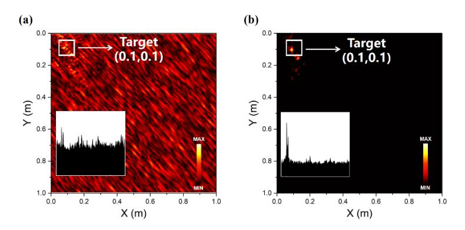

**Fig. 3.** Simulation results for eliminating multipath pseudo-images. (a)The imaging result of random multipath pseudo-images. (b) The imaging result after eliminating multipath pseudo-images by the proposed method.

### *2.3. Feasibility of cellular BS imaging*

BS networks are typically laid out in a hexagonal cellular pattern in which a single BS is a cell.

The seven BSs are combined into a cellular cluster to transmit and receive (without selfreception) to serve the imaging, and the coordinate system is set up as shown in Fig. [4\(](#page-7-0)a), where the *x*- and *y*-axes indicate the horizontal and vertical directions, respectively. The BSs at different locations can be flexibly selected to form a cellular cluster and establish a coordinate system according to the imaging area. Imaging requires a combination of transceivers from multiple-location BSs whose signals must span the communication radius of numerous BSs. The classical radar equation indicates an inverse exponential relationship between the echo power and distance. Therefore, the feasibility of using BSs for imaging needs investigation. Radar imaging has lower requirements for echo signal-to-noise ratio (SNR) than communication, and SNR can be improved through coherent accumulation [\[49\]](#page-18-12). The spectrum fusion algorithm in this paper has been verified through simulation to complete imaging at an SNR of -20 dB, and the imaging results of a point target at different SNRs are shown in the inset in Fig. [4\(](#page-7-0)b). According to the 3rd Generation Partnership Project (3GPP) standard and commercial antenna parameters, the radar equation results are shown in Fig. [4\(](#page-7-0)b), where the BS transmitter power is 53 dBm, antenna gain is 25 dB, 5 G signal carrier frequency is 3.5 GHz, 5 G signal bandwidth is 100 MHz, noise figure is 10 dB, and radar cross-section (RCS) is set to 1 (human) [\[50,](#page-18-13)[51\]](#page-18-14). The results show that cellular BSs can image targets at distances of several kilometers, and the current communication radius of a single BS is approximately a few hundred meters. Thus, the requirement of imaging across the communication radius of multiple BSs can be met.

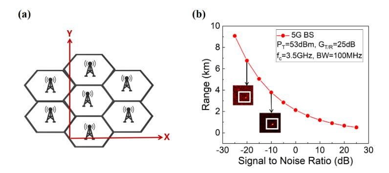

**Fig. 4.** Feasibility analysis of cellular BS network imaging. (a) Schematic diagram of cellular cluster composition and coordinate system establishment. (b) The relationship between imaging distance and SNR under a standard 5 G signal, and the inset shows the point-target imaging results under different SNRs. PT: BS transmitter power; GT/R: antenna gain; fc: carrier-frequency; BW: bandwidth.

### **3. Imaging performance analysis**

With a combination of cellular BS transceivers, the spectrum resources of multiple communication signals coexisting in the BS are fully utilized for spectrum fusion imaging, including OFDM signals of various regimes, OFDM signals of different carrier frequencies in the same regime, and one spread-spectrum signal. The signals generated according to the 3GPP communication standard are listed in Table [1.](#page-8-0) The highest band does not exceed the current commercial Sub-6 G band.

The effects of different parameters on imaging resolution enhancement are quantitatively verified by simulation. Distributed cellular BSs inherently introduce aperture gain to imaging. As shown in Fig. [5\(](#page-8-1)a), the 2D resolution is effectively improved by increasing the number of BSs in the cellular cluster. However, it is yet to be further enhanced by the fusion of spectrum resources. Based on the fixed cellular cluster transceiver combinations, the five OFDM signals in Table [1](#page-8-0) are

| OFDM Signals | Carrier Frequency | Subcarrier Spacing | Bandwidth              |  |
|--------------|-------------------|--------------------|------------------------|--|
| 1            | 2.2GHz            | 15kHz              | 20MHz                  |  |
| 2            | 2.3GHz            | 60KHz              | 100MHz                 |  |
| 3            | 3.2GHz            | 60KHz              | 100MHz                 |  |
| 4            | 4GHz              | 60KHz              | Spread spectrum 1.5GHz |  |
| 5            | 5.9GHz            | 60KHz              | 100MHz                 |  |

**Table 1. Parameters of multiple OFDM signals used**

gradually fused for resolution simulation verification with different carrier frequencies, subcarrier spacings, and numbers of subcarriers. The rich spectrum resources carried by the other signals can effectively extend the spatial spectrum matrix to obtain more detailed information regarding the target. As shown in Fig. [5\(](#page-8-1)b), the 2D resolution significantly improve as the number of signals used increases.

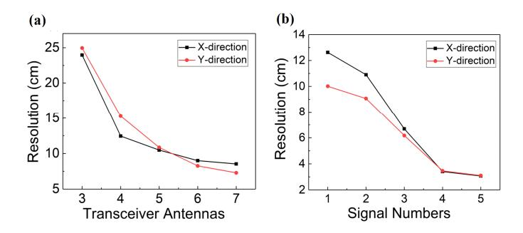

**Fig.5.** Analysis of the relationship between imaging resolution and related parameters. (a) Relationship between the number of BS transceivers and imaging resolution. (b) Relationship between the number of signals used and imaging resolution. **Fig. 5.** Analysis of the relationship between imaging resolution and related parameters. (a) Relationship between the number of BS transceivers and imaging resolution. (b) Relationship between the number of signals used and imaging resolution.

The method is compared with two recently proposed typical ISAC methods for analyzing the 2D resolution by imaging a point target. According to the actual situation of a daily BS, a cellular BS cluster with seven BSs is utilized to transmit and receive signals, and four antennas are set up at the center of each BS, with a spacing of 1 m from front to back and left to right. The cellular hexagonal coverage of each BS is set to 100 m. The above conditions are used as the fixed array conditions for the simulation. The algorithms of both methods [\[27](#page-17-9)[,28\]](#page-17-16) can only use a single signal for simulated imaging, which selects Signal 3 (a standard 5 G signal) in the Sub-6 G band and cannot utilize coexisting spectrum resources. ISAR imaging of a single BS is used in Ref. [\[27\]](#page-17-9). Figure [6\(](#page-9-0)a) shows a 2D image with a resolution of 3.9 cm in the *x*-direction and 150 cm in the *y*-direction. In ISAR imaging, the *x*-direction is the azimuthal dimension, whose resolution is related to the equivalent aperture formed by the rotation angle, and the y-direction represents the distance dimension, whose resolution is associated with the bandwidth. The resolution in the *x*-direction is 3.9 cm, obtained by converting the equivalent aperture of the cellular cluster to the rotation angle of the target in the ISAR. The resolution in the *y*-direction is 150 cm, obtained using a 5 G signal bandwidth of 100 MHz. Because the original paper [\[42\]](#page-18-5) uses a new waveform embedded with linear frequency modulation for imaging, the imaging resolution with standard waveforms is low, resulting in poor compatibility with communication. [\[43\]](#page-18-6) employs a tomographic imaging method that combined distributed cellular BS transceivers and a single 5 G standard signal. However, the resolution depended only on the spatial gain from the distributed BSs. As shown in Fig. [6\(](#page-9-0)b), the resolution is 7.4 cm in the *x*-direction and 6.2

### Optics EXPRESS

cm in the y-direction, and the overall image quality is relatively poor. As shown in Fig. 6(c), an x-direction resolution of 2.9 cm and a y-direction resolution of 2.9 cm are achieved by fusing the coexisting spectrum resources listed in Table 1, which is a significant improvement over the previous two methods.

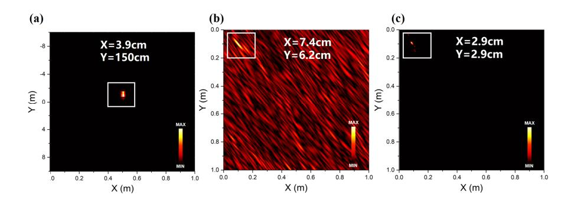

**Fig. 6.** Comparison of imaging simulation between the proposed ISAC method and the other two ISAC methods under the same aperture conditions. (a) Single BS ISAR [42]. (b) Tomography of distributed BSs [43]. (c) Our method.

### 4. Experiments and results

### 4.1. AROF pre-experimental analysis

AROF is an important component to achieve low-loss signal interaction between the CU and the distributed remote BSs, whose high-quality signal interaction can achieve better ISAC performance. Therefore, before the field experiments, it is essential to analyze the impact of the AROF parameter on signal quality based on the existing experimental conditions to achieve optimal signal interaction.

We set up a pre-experiment in the laboratory under the same conditions as the field experiment to analyze the impact of different input optical powers on signal interaction in the AORF, thereby providing a basis for selecting the AROF module in subsequent field experiments. As shown in Fig. 7(a), the tunable laser (ALNAIR LABS TLG-220) outputs light with a center wavelength of 1550 nm and a power of 10 dBm, which passes through a polarization controller (PC) and a MZM (EOSPACE, AX-0MVS-40-PFA-PFA-LV). The DC bias of the MZM is set to the quadrature bias point. The signal 3 in Table 1 generated by the AWG (KEYSIGHT, M8195A) is modulated into the optical path by the MZM. Afterwards, an EDFA1 (ASHOW) and a VOA1 (JOINWIT) are accessed, and the EDFA1 is set to automatic gain control (AGC) mode. The VOA1 is used to simulate changes in the input optical power [52]. The optical signal passes through 500 m SMF (CORNING, SMF-28) and is then fed into EDFA2, which is set to automatic power control (APC) mode. The optical signal then passes through a VOA2 and then into a PD (CONQUER, KG-PT-10G-SM-FA) to be converted into an electrical signal and finally acquired by an OSC (KEYSIGHT, DSO-S 804A). We record the signals with different input optical powers in the range from -20dBm to 16dBm by adjusting VOA1, and calculate the bit error rate (BER) and SNR respectively.

Due to the limitation of laboratory conditions, the maximum input optical power only reaches 16 dBm, and the fiber length is only 500 m. Under this experimental condition, it fails to produce obvious nonlinear effects. As shown in Fig. 8(b) and Fig. 8(c), the experimental results show that the communication BER becomes lower and the SNR becomes higher as the input optical power increases. Therefore, in the subsequent outdoor experiments, we can utilize a higher input optical power. Since we have purchased a packaged AROF module, an AROF module with a

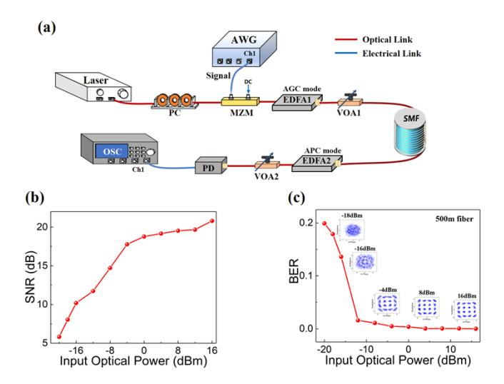

**Fig. 7.** AROF pre-experimental setup and results. (a) Schematic diagram of the AROF pre-experimental setup. (b) Relationship between SNR and input optical power. (c) Relationship between BER and input optical power. AWG: arbitrary waveform generator; OSC: oscilloscope; VOA: variable optical attenuator; SMF: single mode fiber; EDFA: erbium-doped fiber amplifier.

higher input optical power of 10 dBm is selected for the field experiment. However, in future practical applications, the fiber length can often reach several tens of kilometers. Although too high input optical power can improve the SNR, it may generate nonlinear effects and lead to nonlinear distortion of the signal [\[52\]](#page-18-15), which in turn increases the BER and degrades the imaging quality. The input optical power of the AROF module needs to be trade-off selected in future practical scenarios.

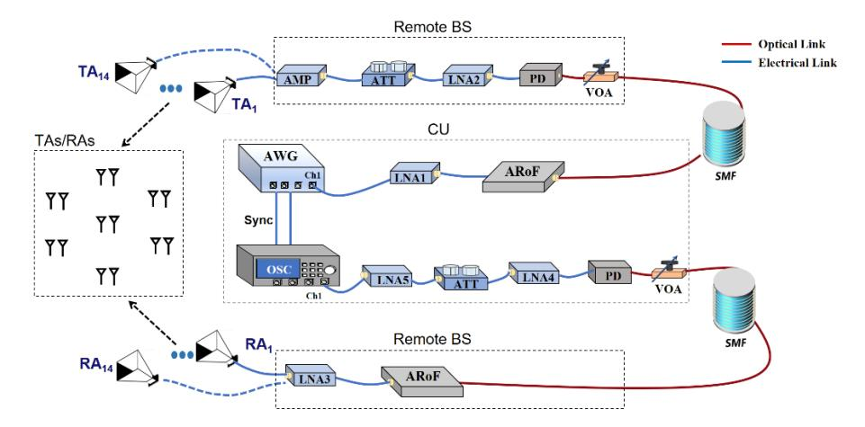

**Fig. 8.** Schematic diagram of the field experimental setup. AMP: amplifier; ATT: attenuator; SMF: single mode fiber; LNA: low-noise amplifier.

### *4.2. Field experimental setup*

To verify the imaging and communication performance of the ISAC method, we build a photonicsenabled cellular BS network in the field and perform experiments. Figure [8](#page-10-1) shows a schematic of

the field experimental setup, which is divided into two parts: the CU and the remote BSs, which are connected by the AROF. To avoid significant errors caused by moving the antennas each time in the experimental field, the positions of all the antennas are measured and calibrated in advance using a laser range finder (LEICA, S910), and all the antennas are fixed at known calibrated positions. A cellular cluster composed of seven BSs is used as a distributed combination for imaging. Due to the limitations of the experimental field, the cellular hexagonal coverage length of each BS is reduced to 5 m. Two antennas are placed at 1 m intervals to the left and right of each BS center, and the seven BSs of the cellular cluster have a total of 14 antennas fixed at the calibrated positions. The height of the antenna is 1.64 m.

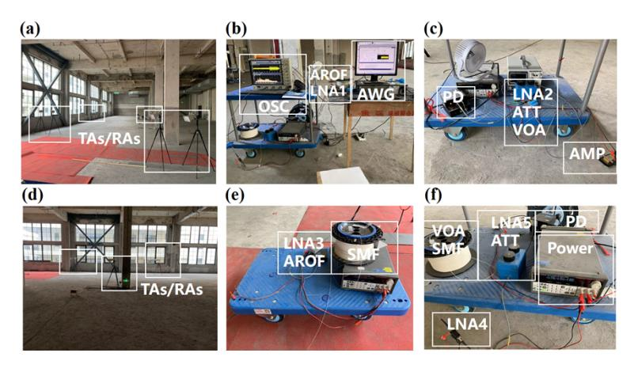

**Fig. 9.** Actual views of the experimental setup in the filed. (a) Transceiver antennas. (b) Transceivers in the CU. (c) Transmitting part of the remote BS. (d) Transceiver antennas. (e) Receiving part of the remote BS. (f) Receiving power amplifier section in the CU.

Each antenna can be used as a transceiver. To avoid RF self-interference, left and right antennas within the same BS do not form transceiver combinations. The other antennas in different BSs are at least 4 m apart, so relatively small crosstalk will not affect the imaging results. Since the experimental system is not a full-duplex system, only time-division duplex can be realized, so each antenna cannot realize self-transmission and self-reception. In total, there are 14 × 12 transceiver combinations. The actual scene of the experimental field and the layout of the antennas are shown in Fig. [9\(](#page-11-0)a) and Fig. [9\(](#page-11-0)d).

The transmitter AWG (KEYSIGHT, M8195A) and receiver OSC (KEYSIGHT, DSO-S 804A) in the CU are placed together and connected using a coaxial cable to achieve synchronization. The actual scene of this part is shown in Fig. [9\(](#page-11-0)b). The five OFDM signals listed in Table [1](#page-8-0) are programmed using MATLAB and uploaded to the AWG. Due to the limitations of the experimental instrument, the AWG transmitted each signal sequentially using time-division multiplexing. Because the maximum transmission power of the AWG is 4 dBm, to improve the SNR, the signal must be amplified by LNA1 (CONNPHY, CLN-1G18G-3025-S) and converted into an optical signal through an AROF (CONQUER, KG-15-12G-M-10-FA). The converted optical signal is transmitted to the remote BS through an 500 m SMF (CORNING, SMF-28). Because the PD used (CONQUER, KG-PT-10G-SM-FA) have a built-in amplifier, the input optical power is limited. The optical power is attenuated to less than 0 dBm by the VOA and connected to the PD to complete the photoelectric conversion. After the electrical signal is power-tuned using LNA2(CONNPHY, CLN-1G18G-3025-S), ATT, and AMP (TALENT, TLPA1G18G-40-33), it is connected to TAs (SHUNZHEN, D2000H1) for transmission. The RAs (SHUNZHEN, D2000H1) of the other BS receive echoes. The echo received by the RAs is amplified using an LNA3 (CONNPHY, CLN-1G18G-3025-S) and then modulated to the AROF.

After 500 m SMF transmission, the optical power is adjusted by the VOA and input to the PD. The electrical signal is amplified by a combination of LNA3 (CONNPHY, CLC-10M-6G-3440-S), ATT, and LNA5 (CONNPHY, CLC-10M-6G-3440-S) and then acquired by the OSC. Since the remote BS is fixed with a total of 14 antennas, the experiment has only one pair of power tuner devices and AROF devices for transmission and reception at the remote BS. The experiment employs time-division multiplexing, where the devices at the remote BS connects sequentially to a TA and RA. After the echo is acquired at that location combination, the associated devices are then connected to the next TA and RA. This process continues until all possible TAs and RAs combinations have been traversed. The relevant devices of the remote BS are placed on the mobile trolley as shown in Fig. [9\(](#page-11-0)c) and Fig. [9\(](#page-11-0)e), respectively. The actual view of the receive amplification link in the CU is shown in Fig. [9\(](#page-11-0)f). In future practical scenarios, all antennas can transmit and receive simultaneously. Since the OFDM signals transmitted by each BS carry different modulation codes, the signals transmitted by different BSs are not correlated. The signals transmitted by each BS are known cooperatively, so each can distinguish the transmitted signal of each BS by matched filtering.

### *4.3. Imaging experiment results*

The imaging capabilities of the ISAC proposed in this study are first validated experimentally. The floor of the target area is covered with wave-absorbing cotton material. The experimental etup is consistent with that described in the previous section. First, the link power gain is verified to ensure the acquisition of target scattering echoes. The antennas farthest from the imaging area are used as transmitters and receivers to confirm the power feasibility. The TA transmitted signal 4 (spread-spectrum signal) to the imaging area with the target and without the target. The echoes received by the RA are then processed by matched filtering to obtain a one-dimensional distance image. The one-dimensional distance image of the imaging region with the target is subtracted from the one-dimensional distance image of the imaging region without the target to obtain the result shown in Fig. [10\(](#page-13-0)a), indicating that target-scattered echo signals are acquired. Thus, the power gain of this experimental link ensure that scattered echoes of the target are acquired for imaging. Secondly, the target echoes must be processed using normalized digital filtering. As shown in the time-frequency diagram of the signal 3 echo in Fig. [10\(](#page-13-0)b), there are some commercial interference signals in the frequency range received by the antenna. Since this is a proof-of-concept experiment, the signals from commercial BSs are non-cooperative and carry unknown modulation phases that can cause deviations in the calculation of spatial frequencies. Therefore, during the experiment, the signals selected in Table [1](#page-8-0) have avoided the commercial communication frequency bands, and try to choose moments with fewer other commercial signals in the echo acquisition. The target echo is digitally band-pass filtered according to the frequency range listed in Table [1](#page-8-0) to avoid residual commercial signals from other frequency bands. Figures [10\(](#page-13-0)c) and [10\(](#page-13-0)d) show the normalized unfiltered signal 3 echo and the normalized filtered echo, respectively. The noise and interference of the filtered signal are significantly reduced. During the data processing of the imaging experiments, echoes obtained from all transceiver combinations are processed separately by normalized band-pass filtering. In addition, although there is a difference in the echo power of signals in different frequency bands. However, according to the Sub-6 G standard, the frequency band does not exceed 6 GHz at most, so the difference in echo power is small. After the normalized filtering mentioned above, the effect of this power difference on imaging is negligible. More importantly, the most important thing in imaging is the accuracy of phase information rather than power difference.

The theoretical resolution of the 2D imaging under this experimental condition is 3.1 cm × 3.2 cm, which is obtained through MATLAB simulation. The imaging resolution can be considered as the ability of an imaging system to distinguish two closely spaced scattering centers [\[53,](#page-18-16)[54\]](#page-18-17). To verify whether the experimental 2D resolution is consistent with the theory, two corner reflectors

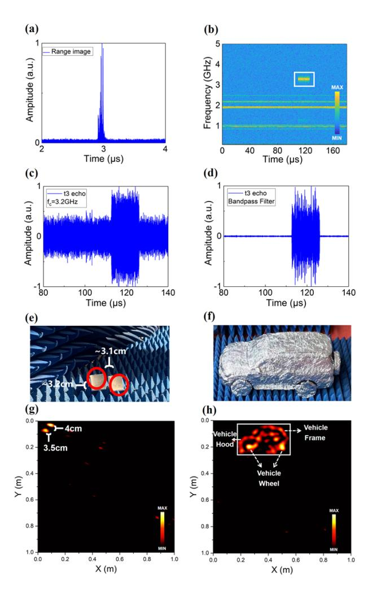

**Fig. 10.** The process of experimental processing and the results of imaging. (a). The experimental result of power verification. (b) Time-frequency analysis of the target echo. (c) Time-domain result of acquired the target echo. (d) Time-domain result after the echo is normalized by digital filtering. (e) Experimental field diagram of point target imaging. (f) Experimental field diagram of vehicle model imaging. (g) The imaging result of the point targets. (h) The imaging result of a vehicle model.

are used as imaging point targets placed on absorbing cotton for resolution verification. The two corner reflectors are staggered by ∼3.1 cm and ∼3.2 cm in the horizontal *x*-direction and vertical *y*-direction, respectively, as shown in Fig. [10\(](#page-13-0)e). The transceiver combinations of each position antenna sequentially transmit and receive the five OFDM signals shown in Table [1,](#page-8-0) and a total of 840 (14 × 12 × 5) echoes are acquired. The acquired echoes are normalized, band-pass filtered, and then divided by the original signal in the frequency domain to remove the modulation information. The spatial frequency points are selected to reconstruct the spatial spectrum matrix for fusion imaging. The experimental field is not an ideal darkroom and exhibited clutter interference from environmental objects. However, the experimental site and the target are static. In order to eliminate the influence of environmental objects and highlight the imaging target, the field that does not contain the target is first imaged by echo acquisition and the field image is subtracted from the image obtained from the final experiment to attenuate the environmental effects. The pseudo-images generated by the target multipath are removed using the method described in Section [2.2.](#page-3-1) Artifacts caused by under-sampling are essentially similar in intensity to the background noise and are eliminated by setting an intensity threshold filter for the image display. The imaging results are shown in Fig. [10\(](#page-13-0)g). Due to non-ideal factors such as antenna position calibration error and systematic deviation in the experiment, the final imaging resolution is ∼3.5 cm×∼4 cm, which is close to the theoretical resolution. In future dynamic environments, if the target is dynamic, all antennas need to complete echo acquisition simultaneously when the target is in a specific posture, otherwise blurred imaging results will be generated due to target jitter, or even be removed as a multipath pseudo-image. If the target is static and the environmental objects are dynamic, it can be analyzed in two cases. If the environmental objects do not change when all antennas complete their acquisition of the target, the imaging result will contain the environmental objects. If the environmental objects have changed during the acquisition, the pseudo-images that can be seen as generated by multipath are eliminated and the final image will still have only the target.

ISAC will serve new applications, such as smart transportation, so the imaging capability of the proposed ISAC method for complex targets, such as vehicles, needs further validation. A vehicle model (∼40 cm × 20 cm) wrapped in tin foil is placed on the wave-absorbing cotton as a target for imaging, as shown in Fig. [10\(](#page-13-0)f). The experimental and data processing procedures are the same as those used for corner reflector imaging. The imaging results are shown in the box in Fig. [10\(](#page-13-0)h), where the overall shape of the vehicle is rendered, including the front hood, frame, and wheels have been displayed. Therefore, in the future, the proposed ISAC architecture can image complex targets and serve advanced applications such as intelligent transportation.

### *4.4. Communication experiment results*

This ISAC method utilizes multiple heterogeneous OFDM signals in a cellular BS network for fusion imaging, so its inherent communication performance is not affected, which does not create a communication burden caused by additional waveform modifications. Because communication does not need to span multiple BSs, the antennas of two adjacent BSs are used separately as transceivers to verify communication performance. Signal 1 (QPSK modulation) and signal 3 (16-QAM modulation) in Table [1](#page-8-0) are used for transmission and reception demodulation.

First, signal 3 is taken as an example, the acquired waveform is localized to the starting position of the signal by frame synchronization, as shown in Fig. [11\(](#page-15-0)a). Then signal 3 is demodulated to obtain the constellation diagram before channel estimation, as shown in Fig. 11(b). The constellation diagram is affected by the inherent noise of the device and the channel propagation noise, resulting in shifts and deviations of the constellation points. Therefore, channel estimation is required to improve the demodulated constellation diagram and reduce the interference of noise on the demodulation result. Next, the constellation diagrams of the two signals after channel estimation are demodulated and the BER is calculated. As shown in Fig. [11\(](#page-15-0)c) and

Fig. [11\(](#page-15-0)d), the BER of the QPSK signal demodulation is 0.0003 (SNR= 10.8), and that of the 16-QAM signal demodulation is 0.0035 (SNR = 10.6). In the experimental system, the maximum communication rate calculated is 6Gbps. Therefore, the proposed ISAC method does not affect inherent communication performance.

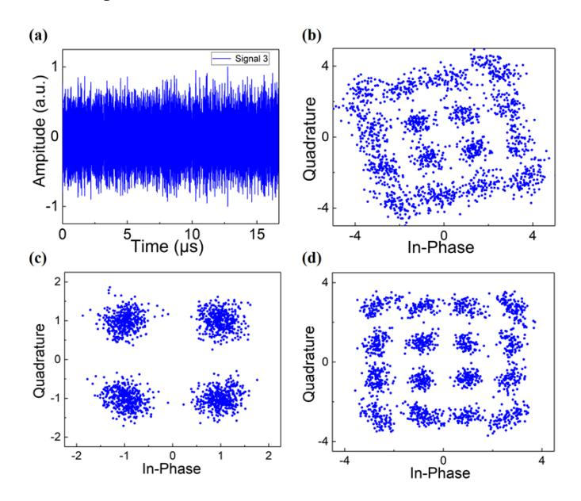

**Fig. 11.** Communication experiment results of the acquired OFDM signal. (a) Signal waveform after frame synchronization. (b) Constellation diagram of signal 3 (16-QAM) before channel estimation. (c) Constellation diagram demodulation of signal 1 (QPSK) after channel estimation. (d) Constellation diagram demodulation of signal 3 (16-QAM) after channel estimation.

### *4.5. Comparison of ISAC methods*

The method is compared with two recently proposed ISAC methods in Table [2.](#page-16-1) We have compared the resolution to other methods in Section [3](#page-7-1) and our imaging resolution is higher than the other methods. The method also compares the PSLR and localization accuracy of different methods. The PSLR of the spectrum fusion method is higher than that of other methods. This is because the spectrum resources of different signals not only expand the spatial spectrum, but also increase the density of spatial frequency filling, thus reducing the side lobes. In terms of localization accuracy, both the proposed method and [\[43\]](#page-18-6) can be directly localized based on the imaging results because both of their projection axes are in the same orthogonal direction to the physical world. The projection axis of [\[42\]](#page-18-5) is the range dimension, which does not match the dimension of the physical world and cannot be localized directly; it needs to be localized again using the two-step numerical method.

Notably, none of the other methods considered the co-design of the cellular BS network and high-resolution algorithm compatible with standard communication waveform. In contrast, this method not only fuses all communication resources to improve the imaging resolution but also co-designs a photonics-enabled cellular BS network that meets the requirements of applying ISAC in real-world scenarios, such as high-precision synchronization, carrier frequency preservation, and analog fronthaul. Experimental results demonstrate that the proposed method is compatible with all current communication waveforms for realizing high-resolution imaging. Algorithm and

**Table 2. Comparison of different ISAC methods**

| Work | Solution         | Imaging resolution                           | PLSR    | Positioning accuracy | Communication compatibility | Experiment |
|------|------------------|----------------------------------------------|---------|----------------------|--------------------------------|------------|
| [42] | Distance-Doppler | 3.9cm × 150cm                                | -15.2dB | Distortion           | Communication incompatible  | No         |
| [43] | Tomographic      | 7.4cm × 6.2cm                                | -12.5dB | No distortion        | Single 5 G signal              | No         |
| Our  | Spectrum fusion  | 2.9cm × 2.9cm 3.5cm × 4cm (experiment) | -17.9dB | No distortion        | All communication signal    | Yes        |

hardware co-design simultaneously ensure high-quality imaging and communication capabilities in real-world scenarios.

### **5. Conclusion**

In this study, we have proposed an endogenous ISAC method compatible with standard communications for realizing high-resolution imaging, empowering cellular BS networks to achieve the extension of transmitting information to sense the world. The ISAC approach is based on a spectrum fusion algorithm derived from the concept of bandwidth-enhanced MFI and a photonics-enabled cellular BS network adapted to the implementation of this algorithm. The spectrum fusion algorithm uses heterogeneous communication signals coexisting in the cellular BS for reconstructing large spatial spectrum matrix to improve 2D imaging resolution. The transceivers are centralized in the CUs of the photonics-enabled cellular BS network, and the CUs are interconnected to the remote BS via the AROF, which ensures the synchronization and carrier frequency preservation requirements of the algorithm and conforms to the future trend of the analog fronthaul for communications. From the perspective of systems research, the principle of the ISAC method and the feasibility of cellular BS imaging are analyzed. Then, it is verified by simulation that the resolution after spectrum resources fusion at the same aperture is better than the current ISAC methods. Finally, a photonics-enabled cellular BS network is built. The experimental results show that the imaging resolution is ∼3.5 cm×∼4 cm, and the complex target can be imaged. The maximum achievable communication data rate of the experimental system is 6Gbps.

More importantly, the proposed ISAC method achieves high quality communication and imaging simultaneously through the co-design of algorithm and hardware. With the further development of communication resources in the future, the imaging resolution of ISAC can be further improved, which opens up more new possibilities for new applications. However, the real-time processing capability of ISAC with a large amount of data deserves to be further optimized.

**Funding.** National Natural Science Foundation of China (T2225023, 62205203).

**Disclosures.** The authors declare no conflicts of interest.

**Data availability.** Data underlying the results presented in this paper are not publicly available at this time but can be obtained from the authors upon reasonable request.

### **References**

- 1. M. Giordani, M. Polese, M. Mezzavilla, *et al.*, "Toward 6 G networks: use cases and technologies," [IEEE Commun.](https://doi.org/10.1109/MCOM.001.1900411) [Mag.](https://doi.org/10.1109/MCOM.001.1900411) **58**(3), 55–61 (2020).
- 2. A. Al-Ansi, AM. Al-Ansi, A. Muthanna, *et al.*, "Survey on intelligence edge computing in 6G: characteristics, challenges, potential use cases, and market drivers," [Future Internet](https://doi.org/10.3390/fi13050118) **13**(5), 118 (2021).
- 3. L. U. Khan, I. Yaqoob, M. Imran, *et al.*, "6 G wireless systems: a vision, architectural elements, and future directions," [IEEE Access](https://doi.org/10.1109/ACCESS.2020.3015289) **8**, 147029–147044 (2020).
- 4. M. Murroni, M. Anedda, M. Fadda, *et al.*, "6G—enabling the new smart city: a survey," [Sensors](https://doi.org/10.3390/s23177528) **23**(17), 7528 (2023).

- 5. Y. Ghildiyal, R. Singh, A. Alkhayyat, *et al.*, "An imperative role of 6 G communication with perspective of industry 4.0: challenges and research directions," [Sustain. Energy Techn.](https://doi.org/10.1016/j.seta.2023.103047) **56**, 103047 (2023).
- 6. U. Demirhan and A. Alkhateeb, "Integrated Sensing and Communication for 6G: ten key machine learning roles," [IEEE Commun. Mag.](https://doi.org/10.1109/MCOM.006.2200480) **61**(5), 113–119 (2023).
- 7. F. Liu, Y. H. Cui, C. Masouros, *et al.*, "Integrated Sensing and Communications: Toward dual-functional wireless networks for 6 G and beyond," [IEEE J. Sel. Area. Comm.](https://doi.org/10.1109/JSAC.2022.3156632) **40**(6), 1728–1767 (2022).
- 8. T. Wild, V. Braun, and H. Viswanathan, "Joint design of communication and sensing for beyond 5 G and 6 G systems," [IEEE Access](https://doi.org/10.1109/ACCESS.2021.3059488) **9**, 30845–30857 (2021).
- 9. M. A. Uusitalo, P. Rugeland, M. R. Boldi, *et al.*, "6 G vision, value, use cases and technologies from european 6 G flagship project Hexa-X," [IEEE Access](https://doi.org/10.1109/ACCESS.2021.3130030) **9**, 160004–160020 (2021).
- 10. Z. Qadir, KN. Le, N. Saeed, *et al.*, "Towards 6 G internet of things: recent advances, use cases, and open challenges," [ICT Express](https://doi.org/10.1016/j.icte.2022.06.006) **9**(3), 296–312 (2023).
- 11. Z. Wei, F. Liu, C. Masouros, *et al.*, "Toward multi-functional 6 G wireless networks: integrating sensing, communication, and security," [IEEE Commun. Mag.](https://doi.org/10.1109/MCOM.002.2100972) **60**(4), 65–71 (2022).
- 12. L. Zheng, M. Lops, Y. C. Eldar, *et al.*, "Radar and communication coexistence: an overview: a review of recent methods," [IEEE Signal Process. Mag.](https://doi.org/10.1109/MSP.2019.2907329) **36**(5), 85–99 (2019).
- 13. F. Liu, C. Masouros, A. P. Petropulu, *et al.*, "Joint radar and communication design: applications, state-of-the-art, and the road ahead," [IEEE Trans. Commun.](https://doi.org/10.1109/TCOMM.2020.2973976) **68**(6), 3834–3862 (2020).
- 14. A. Hassanien, M. Amin, Y. Zhang, *et al.*, "Signaling strategies for dual-function radar communications: an overview," [IEEE Aerosp. Electron. Syst. Mag.](https://doi.org/10.1109/MAES.2016.150225) **31**(10), 36–45 (2016).
- 15. L. Han and K. Wu, "24-GHz integrated radio and radar system capable of time-agile wireless communication and sensing," [IEEE T. Microw. Theory](https://doi.org/10.1109/TMTT.2011.2179552) **60**(3), 619–631 (2012).
- 16. L. Han and K. Wu, "Multifunctional transceiver for future intelligent transportation systems," [IEEE T. Microw.](https://doi.org/10.1109/TMTT.2011.2138156) [Theory](https://doi.org/10.1109/TMTT.2011.2138156) **59**(7), 1879–1892 (2011).
- 17. J. Borky, J. Moghaddasi, and K Wu, "Multifunctional transceiver for future radar sensing and radio communicating data-fusion platform," [IEEE Access](https://doi.org/10.1109/ACCESS.2016.2530979) **4**, 818–838 (2016).
- 18. Y. Wang, Z. Dong, J. Ding, *et al.*, "Photonics-assisted joint high-speed communication and high-resolution radar detection system," [Opt. Lett.](https://doi.org/10.1364/OL.444252) **46**(24), 6103–6106 (2021).
- 19. B. Dong, J. Jia, G. Li, *et al.*, "Demonstration of photonics-based flexible integration of sensing and communication with adaptive waveforms for a W-band fiber-wireless integrated network," [Opt. Express](https://doi.org/10.1364/OE.472693) **30**(22), 40936–40950 (2022).
- 20. B. Dong, J. Jia, G. Li, *et al.*, "Photonic-based W-band flexible TFDM integrated sensing and communication system for fiber-wireless network," in *Optical Fiber Communication Conference* (2023), pp. W4J.5.
- 21. M. Lei, M. Zhu, Y. Cai, *et al.*, "Integration of sensing and communication in a w-band fiber-wireless link enabled by electromagnetic polarization multiplexing," [J. Lightwave Technol.](https://doi.org/10.1109/JLT.2023.3280388) **41**(23), 7128–7138 (2023).
- 22. S. Melo, S. Pinna, A. Bogoni, *et al.*, "Dual-use system combining simultaneous active radar & communication, based on a single photonics-assisted transceiver," in *17th International Radar Symposium* (2016), pp. 1–4.
- 23. S. Jia, X. Yu, S. Wang, *et al.*, "A Unified System with Integrated Generation of High-Speed Communication and High-Resolution Sensing Signals Based on THz Photonics," [J. Lightwave Technol.](https://doi.org/10.1109/JLT.2018.2863684) **36**(19), 4549–4556 (2018).
- 24. H. Nie, F. Zhang, Y. Yang, *et al.*, "Photonics-based integrated communication and radar system," in *International Topical Meeting on Microwave Photonics* (2019), pp. 1–4.
- 25. S. Wang, D. Liang, and Y. Chen, "Photonics-assisted joint communication-radar system based on a QPSK-sliced linearly frequency-modulated signal," [Appl. Opt.](https://doi.org/10.1364/AO.456287) **61**(16), 4752–4760 (2022).
- 26. Z. Xue, S. Li, X. Xue, *et al.*, "Photonics-assisted joint radar and communication system based on an optoelectronic oscillator," [Opt. Express](https://doi.org/10.1364/OE.430910) **29**(14), 22442–22454 (2021).
- 27. F. Zhang, T. Mao, R. Liu, *et al.*, "Cross-domain multicarrier waveform design for integrated sensing and communication," in *IEEE Wireless Communications and Networking Conference (WCNC)* (2024), pp.1–6.
- 28. S. Wang, W. Dai, H. Wang, *et al.*, "Robust waveform design for integrated sensing and communication," [IEEE T.](https://doi.org/10.1109/TSP.2024.3410142) [Signal Proces.](https://doi.org/10.1109/TSP.2024.3410142) **72**, 3122–3138 (2024).
- 29. F. Liu, C. Masouros, T. Ratnarajah, *et al.*, "On range sidelobe reduction for dual-functional radar-communication waveforms," [IEEE Wirel. Commun. Lett.](https://doi.org/10.1109/LWC.2020.2997959) **9**(9), 1572–1576 (2020).
- 30. C. Sturm and W. Wiesbeck, "Waveform design and signal processing aspects for fusion of wireless communications and radar sensing," [Proc. IEEE](https://doi.org/10.1109/JPROC.2011.2131110) **99**(7), 1236–1259 (2011).
- 31. B. Farhang-Boroujeny and H. Moradi, "OFDM Inspired Waveforms for 5 G," [IEEE Commun. Surv. Tut.](https://doi.org/10.1109/COMST.2016.2565566) **18**(4), 2474–2492 (2016).
- 32. S. Liyanaarachchi, T. Riihonen, C. Barneto, *et al.*, "Optimized waveforms for 5G-6 G communication with sensing: theory, simulations and experiments," [IEEE T. Wirel. Commun.](https://doi.org/10.1109/TWC.2021.3091806) **20**(12), 8301–8315 (2021).
- 33. L. Huang, R. Li, S. Liu, *et al.*, "Centralized fiber-distributed data communication and sensing convergence system based on microwave photonics," [J. Lightwave Technol.](https://doi.org/10.1109/JLT.2019.2935903) **37**(21), 5406–5416 (2019).
- 34. L. Yin and J. He, "Modulated-symbol domain matched filtering scheme for photonic-assisted integrated sensing and communication system based on a single OFDM waveform," [Opt. Lett.](https://doi.org/10.1364/OL.518695) **49**(8), 2153–2156 (2024).
- 35. N. Zhong, Y. Du, X. Zou, *et al.*, "Multiple-in-one photonic integrated transceiver for multi-chirp-rate & multi-band ISAR system and coherent fusion processing," J. Lightwave Technol., (to be published).

- 36. X. Wang, F. Cao, C. Ma, *et al.*, "Dual-band coherent microwave photonic radar using linear frequency modulated signals with arbitrary chirp rates," [IEEE J. Sel. Top. Quant.](https://doi.org/10.1109/JSTQE.2023.3272108) **29**(6: Photonic Signal Processing), 1–9 (2023).
- 37. J. Wan, Y. Zhao, W. Weng, *et al.*, "Super-resolution method for microwave front-looking imaging using broadband signals and spatial spectrum shifting," [IEEE T. Microw. Theory](https://doi.org/10.1109/TMTT.2023.3341896) **72**(7), 4309–4316 (2023).
- 38. M. Lei, B. Hua, Y. Cai, *et al.*, "Photonics-aided integrated sensing and communications in mmW bands based on a DC-offset QPSK-encoded LFMCW," [Opt. Express](https://doi.org/10.1364/OE.474055) **30**(24), 43088–43103 (2022).
- 39. W. Bai, P. Li, X Zou, *et al.*, "Photonics-assisted millimeter-wave multiband integrated sensing and communication system using coherent receiving," [IEEE J. Sel. Top. Quant.](https://doi.org/10.1109/JSTQE.2023.3276903) **29**(6: Photonic Signal Processing), 1–11 (2023).
- 40. J. Liu, C. Bian, W. He, *et al.*, "W-band photonics-aided OFDM system integrating sensing and communication with phase noise suppression scheme," [Opt. Laser Technol.](https://doi.org/10.1016/j.optlastec.2024.111432) **180**, 111432 (2025).
- 41. J. Zhang, M. Rahman, K. Wu, *et al.*, "Enabling joint communication and radar sensing in mobile networks—A survey," [IEEE Commun. Surv. Tut.](https://doi.org/10.1109/COMST.2021.3122519) **24**(1), 306–345 (2022).
- 42. P. Cao, "Cellulars imaging for UAV detection," [IEEE Access](https://doi.org/10.1109/ACCESS.2022.3152534) **10**, 24843–24851 (2022).
- 43. H. Li, "Joint communications and sensing using millimeter wave networks: a bonus SAR," in *IEEE International Conference on Communications* (2022), pp. 1–6.
- 44. Z. Han, H. Ding, X. Zhang, *et al.*, "Multistatic Integrated Sensing and Communication System in Cellular Networks," in *IEEE Globecom Workshops Conference* (2023), pp.123–128.
- 45. J. Dong, Q. Sun, Z. Jiao, *et al.*, "Photonics-enabled distributed MIMO radar for high-resolution 3D imaging," [Photonics Res.](https://doi.org/10.1364/PRJ.459762) **10**(7), 1679–1688 (2022).
- 46. S. Maresca, F. Scotti, G. Serafino, *et al.*, "Coherent MIMO radar network enabled by photonics with unprecedented resolution," [Opt. Lett.](https://doi.org/10.1364/OL.391296) **45**(14), 3953–3956 (2020).
- 47. C. Mitsolidou, C. Vagionas, A. Mesodiakaki, *et al.*, "5 G C-RAN optical fronthaul architecture for hotspot areas using OFDM-based analog IFoF waveforms," [Appl. Sci.](https://doi.org/10.3390/app9194059) **9**(19), 4059 (2019).
- 48. S. Rommel, B. Cimoli, E. Grivas, *et al.*, "Real-time demonstration of ARoF fronthaul for high-bandwidth mm-wave 5 G NR signal transmission over multi-core fiber," in *European Conference on Networks and Communications* (2020), pp. 205–208.
- 49. X. Xiao, S. Li, S. Peng, *et al.*, "Photonics-based wideband distributed coherent aperture radar system," [Opt. Express](https://doi.org/10.1364/OE.26.033783) **26**(26), 33783–33796 (2018).
- 50. F. Sanders, K. Calahan, G. Sanders, *et al.*, "The National Telecommunications and Information Administration's (NTIA): Measurements of 5 G new radio spectrum and spatial power emissions for radar altimeter interference analysis," Tech. Rep. 22-562(U.S. Department of Commerce, 2022).
- 51. E. Piuzzi, S. Pisa, P. D'Atanasio, *et al.*, "Radar cross section measurements of the human body for UWB radar applications," in *2012 IEEE International Instrumentation and Measurement Technology Conference Proceedings* (2012), pp. 1290–1293.
- 52. J. Zhang, W. Chen, M. Gao, *et al.*, "K-means-clustering-based fiber nonlinearity equalization techniques for 64-QAM coherent optical communication system," [Opt. Express](https://doi.org/10.1364/OE.25.027570) **25**(22), 27570–27580 (2017).
- 53. Y. Liu, A. Deng, S. Hua, *et al.*, "Photonic ADC-based scheme for joint wireless communication and radar by adopting a broadband OFDM shared signal," [Opt. Lett.](https://doi.org/10.1364/OL.473975) **47**(20), 5421–5424 (2022).
- 54. A. Deng, N. Qian, S. Hua, *et al.*, "High-resolution ISAR imaging based on photonic receiving for high-accuracy automatic target recognition," [Opt. Express](https://doi.org/10.1364/OE.457443) **30**(12), 20580–20588 (2022).