# **Photonics-assisted self-interference cancellation for in-band full-duplex integrated sensing and communication transceiver**

**XIAO YU, 1 JIA YE, 1,3 LIANSHAN YAN, 1,4 [T](https://orcid.org/0000-0002-7240-4229)AO ZHOU, 2 NINGYUAN ZHONG, 1 YUE ZHU, 1 XIHUA ZOU, [1](https://orcid.org/0000-0002-3633-7161) AND WEI PAN1**

**Abstract:** In-band full-duplex (IBFD) operation is essential for both sensing-centric and communication-centric integrated sensing and communications (ISAC) systems. Both types require the monostatic transceiver to overcome the technical challenge of self-interference (SI). To address this challenge, a photonics-assisted self-interference cancellation (SIC) scheme for an IBFD ISAC transceiver is proposed and experimentally demonstrated. By utilizing wavelength division multiplexing, the SI is cancelled by a cancellation reference with matched amplitude and time delay, using two counter-biased Mach-Zehnder modulators. In proof-of-concept experiments, the proposed IBFD ISAC transceiver is tested using a 10 GHz quadrature amplitude modulation (QAM) constant envelope linear frequency modulation orthogonal frequency division multiplexing (CE-LFM-OFDM) ISAC signal with a carrier frequency and a bandwidth of 10 GHz and 2 GHz, respectively. Experimental results show that cancellation depths of 35.29 dB and 32.59 dB are achieved with bandwidths of 1 GHz and 2 GHz, respectively, in the communication receiver. The corresponding weak signal of interest is successfully recovered after effective SIC in the wireless link. The ranging and imaging functions are also experimentally verified. The experimental results show that the cancellation depth of the SI after de-chirping is 23.6 dB when the center frequency and bandwidth of the CE-LFM-OFDM RF signal are 10 GHz and 2 GHz, respectively. A dynamic range increase of 23.84 dB is achieved in imaging function. The corresponding radar ranging resolution of 10 cm is also achieved for radar function. The proposed scheme cancels the SI in both communication and radar receivers, demonstrating excellent performance in the IBFD ISAC transceiver system.

© 2024 Optica Publishing Group under the terms of the [Optica Open Access Publishing Agreement](https://doi.org/10.1364/OA_License_v2#VOR-OA)

# **1. Introduction**

The scarcity of spectrum resources has emerged as a pivotal challenge hindering the advancement of future radio system. To address this pressing challenge, in-band full-duplex (IBFD) operation is increasingly essential, offering exceptional spectral utilization [\[1](#page-16-0)[,2\]](#page-16-1). IBFD operation enables simultaneous transmission and reception on the same frequency band, marking a significant shift from traditional methods like time-division duplexing (TDD) and frequency-division duplexing (FDD). Furthermore, Radio frequency (RF) convergence has been proposed to enhance spectral efficiency amid increasing congestion in wireless domains. Among the most significant advancements are the dual-function integrated sensing and communications (ISAC) systems [\[3\]](#page-16-2). Radar systems, such as frequency-modulated continuous-wave (FMCW) radar, which share similar architecture and operating principles with IBFD operation systems, can transmit and receive simultaneously on the same frequency. This capability eliminates blind spots typical

*1Center for Information Photonics and Communications, School of Information Science and Technology, Southwest Jiaotong University, Chengdu 611756, China*

*2Key Laboratory of Electronic Information Control, Southwest China Research Institute of Electronic Equipment, Chengdu 610036, China*

*3 jiaye@home.swjtu.edu.cn*

*4 lsyan@home.swjtu.edu.cn*

in pulse radar measurement. Therefore, combining FMCW radar and IBFD communication systems to create an IBFD ISAC system could attract significant attention due to its ability to simultaneously offer high-speed data transmission and high-resolution radar sensing. Moreover, the specific transceiver architecture of FMCW radars offers a promising framework for IBFD ISAC systems [\[1\]](#page-16-0). However, a major challenge in IBFD ISAC systems is the severe in-band self-interference (SI) from transmitting to receiving ends due to simultaneous transmission and reception on the same frequency band, which cannot be mitigated by an electrical filter [\[4\]](#page-16-3). Instead, sophisticated active self-interference cancellation (SIC) techniques are required. These techniques aim to eliminate frequency aliasing caused by SI and recover the buried signal of interest (SOI). However, traditional electrical SIC methods are limited by high loss, narrow instantaneous bandwidth, and imprecise device tuning [\[5\]](#page-16-4).

Recently, microwave photonics technology, known for its low loss, large instantaneous bandwidths, precise wide tuning, and strong electromagnetic interference immunity, has been extensively explored as an alternative to conventional electronic methods [\[6](#page-16-5)[,7\]](#page-16-6). This technology is increasingly favored for achieving IBFD operation and ISAC systems. In recent years, many photonic approaches for SIC have been studied for use in IBFD operation and FMCW radar systems. The basic idea of SIC is to generate a counter-phase replica of the SI signal as a cancellation reference by extracting a portion of the transmitting signal. The cancellation reference must have the same amplitude and time delay, but an inverse phase, compared to the SI signal. Various phase inversion methods have been employed in the optical domain to implement SIC using electro-optical modulators. These include two inversed-phase optical sidebands of phase modulators [\[8,](#page-16-7)[9\]](#page-16-8), two counter-biased single-drive Mach-Zehnder modulators (MZMs) [\[10](#page-16-9)[–13\]](#page-16-10), a minimum-transmission-biased dual-drive MZM (DDMZM) [\[14,](#page-16-11)[15\]](#page-16-12), a differently-biased dual-parallel MZM (DPMZM) [\[16,](#page-16-13)[17\]](#page-16-14), and a dual-polarized dual-parallel MZM (DPol-DPMZM) [\[18,](#page-16-15)[19\]](#page-17-0). Cross-gain modulation in semiconductor optical amplifiers (SOAs) can similarly enable phase inversion in the optical domain [\[20\]](#page-17-1). Additionally, various phase inversion methods have been reported in the electrical domain, including the use of a balun [\[21\]](#page-17-2) and a balanced photodetector (BPD) [\[22](#page-17-3)[,23\]](#page-17-4).

In recent years, a variety of photonics-assisted ISAC schemes have been proposed and experimentally demonstrated. These systems typically employ integrated waveform strategies, enhancing spectral and temporal utilization. Linear frequency modulation (LFM) chirps and orthogonal frequency division multiplexing (OFDM) signals are common choices that align with both sensing and communication-centric design strategies [\[3\]](#page-16-2). In sensing-centric photonics-based ISAC systems, LFM signals serve as the radio carrier, with key parameters such as amplitude, phase, and frequency modulated by communication information. For instance, LFM-encoded amplitude shift keying (ASK) integrated waveforms are synthesized using cascaded and paralleled optical intensity modulators [\[24](#page-17-5)[,25\]](#page-17-6). Additionally, a quadrature phase-shift keying (QPSK)-sliced LFM ISAC waveform is generated using a DPol-DPMZM [\[26\]](#page-17-7). Furthermore, a photonicassisted scheme achieving a direct current (DC) offset QPSK-encoded LFM ISAC signal is described in [\[27\]](#page-17-8). Previous work from our lab [\[28](#page-17-9)[–30\]](#page-17-10) proposes an ISAC system based on a photonic-multiplying approach to generate a constant envelope LFM-OFDM (CE-LFM-OFDM) ISAC signal, achieving simultaneous sensing and communication. In communication-centric photonics-based ISAC systems, highly spectral-efficient OFDM signals are widely developed. An OFDM-based ISAC system employing the optoelectronic oscillator technique is proposed and experimentally demonstrated in [\[31\]](#page-17-11). Subsequently, a tunable ISAC system based on an optoelectronic oscillator with sensing and communication capabilities is realized in [\[32\]](#page-17-12). In [\[33\]](#page-17-13), a photonic communication-centric ISAC system employs the virtual-carrier-aided self-coherent OFDM technique to address carrier frequency offset and phase noise issues.

The aforementioned photonics-assisted schemes implement either IBFD communication (or FMCW radar) or ISAC systems separately. Furthermore, these schemes do not address the

comprehensive architecture of ISAC transceiver systems, focusing instead on demonstrating the capabilities of radar transceivers and communication transmitters. Even though two photonicsassisted transceiver schemes incorporating SIC and FMCW radar are proposed in [\[15](#page-16-12)[,19\]](#page-17-0), they do not integrate IBFD communication, thus falling short of fully achieving IBFD ISAC. These efforts highlight the potential to develop IBFD ISAC systems with enhanced capabilities for simultaneous sensing and communication by leveraging the unique advantages of photonics technologies. Future research should focus on integrating IBFD operation within ISAC transceiver architectures to fully exploit the benefits of photonics in achieving high-performance, multifunctional systems.

Therefore, we proposed and experimentally demonstrated a photonic-assisted self-interference cancellation scheme for an in-band full-duplex integrated sensing and communication transceiver. In the transmitter, photonic intensity modulation and wavelength division multiplexing technology are utilized to generate multiple optical signals using an CE-LFM-OFDM ISAC signal in cofrequency and co-time full-duplex mode for radio over fiber (RoF) transmission. One of the optical signals serves as the transmitting signal, while the other functions as the cancellation reference signal. In the receiver, the received signal containing both the SOI and SI is modulated using a counter-biased MZM. Time delay and amplitude matching between the cancellation reference signal and the SI signal are accomplished in the optical domain, followed by multiplexing via a wavelength division multiplexer (WDM). By superimposing the cancellation reference signal, the SI signal is cancelled, and the SOI is recovered for communication and sensing processes after photodetection. In proof-of-concept experiments, the proposed IBFD ISAC transceiver is tested using a 10 GHz CE-LFM-OFDM ISAC RF signal with a quadrature amplitude modulation (QAM) format and a bandwidth of 2 GHz. The experimental results show that cancellation depths of 35.29 dB and 32.59 dB are achieved with bandwidths of 1 GHz and 2 GHz, respectively, in the communication receiver. The corresponding weak SOI is successfully recovered after effective SIC in the wireless link. Using the proposed IBFD ISAC transceiver, the ranging and imaging functions are also experimentally verified. The experimental results show that the cancellation depth of the SI after de-chirping is 23.6 dB when the center frequency and bandwidth of the CE-LFM-OFDM are 10 GHz and 2 GHz, respectively. Additionally, a dynamic range increase of 23.84 dB is achieved in inverse synthetic aperture radar (ISAR) imaging. A 10 cm resolution of the radar ranging is achieved for the radar function. The proposed scheme effectively cancels the SI in both communication and radar receivers, exhibiting excellent performance in the IBFD ISAC transceiver system.

# **2. Principles**

# *2.1. ISAC waveform towards IBFD transmission*

The specific transceiver architecture of FWCW radars offers a promising solution for IBFD operation within ISAC systems. This architecture inherently supports IBFD operation and utilizes continuous transmission rather than pulsed operation [\[1\]](#page-16-0). Although the constant envelope waveform of FWCW radars has limitations, LFM waveforms can efficiently carry communication data in phase. Furthermore, constant envelope communication waveform with a fixed low peak-to-average power ratio (PAPR) offer a promising solution for maximizing the transmit power budget of high-power amplifiers in long-distance ISAC scenarios [\[28\]](#page-17-9). Fortunately, the high PAPR of OFDM signals used for communication can be transformed into a constant envelope via phase modulation, achieving the low PAPR characteristic, known as CE-OFDM [\[34\]](#page-17-14). By combining the characteristics of LFM and CE-OFDM, a constant envelope ISAC waveform has been designed [\[28\]](#page-17-9), which is suitable for our proposed photonics-assisted IBFD ISAC transceiver system. This waveform is based on a sensing sub-band (typically chirp signal) with a sensing bandwidth and a communication sub-band (typically phase modulation signal) with a communication bandwidth. Baseband real-valued OFDM signals carrying communication bits are modulated onto the phase of baseband LFM signal with a sensing instantaneous bandwidth, generating the CE-LFM-OFDM

# **Optics EXPRESS**

ISAC waveform [28–30]. Subsequently, the baseband ISAC waveforms are up-converted to RF signals by mixing them with single-tone signals of the transmitting RF frequency. Consequently, the generated RF ISAC signal can be expressed as

$$s_{ISAC}(t) = V_{RF} \cos \left\{ 2\pi \left[ f_c t + \frac{1}{2} k t^2 + h \cdot m(t) \right] \right\}$$
 (1)

where  $V_{RF}$  and  $f_c$  denote the amplitude and center frequency of the RF ISAC signal, respectively.  $k = B_s/T_c$  represents the sweeping rate (Hz/s) of the baseband LFM signal, where the  $B_s$  is the sensing instantaneous bandwidth and  $T_c$  is the pulse duration time. h represents the phase modulation index (PMI). m(t) represents the baseband real-value OFDM signal.

### 2.2. Photonic IBFD ISAC transceiver system

Figure 1 demonstrates the schematic diagram of the proposed photonic-assisted SIC for the IBFD ISAC transceiver system. In IBFD ISAC transmitter, an electrical ISAC transmitting signal  $s_{ISAC}(t)$  from a transmit source (Tx Source) is sent into a MZM (MZM0) to be converted into an optical signal, where the MZM0 is biased at the positive quadrature transmission point, as shown in Fig. 2. Three optical carriers from three laser diodes (LD0s) are multiplexed through a WDM and then fed into the MZM0. These carriers serve as the transmitting optical signal, communication cancellation reference optical signal, and sensing cancellation reference signal. The optical output fields via the MZM0 can be expressed as

$$E_{MZM0} \propto \sum_{i} E_{i} e^{i\omega_{i}t} \left\{ e^{j\pi \left[\frac{s_{ISAC}(t)}{V_{\pi_{0}}} + \frac{1}{2}\right]} + e^{-j\pi \frac{s_{ISAC}(t)}{V_{\pi_{0}}}} \right\}$$
 (2)

where,  $E_i$  and  $\omega_i$  are the amplitude and angular frequency of the optical carriers, respectively. The subscript i represents the number of LD0s.  $V_{\pi 0}$  is the half-wave voltage of the MZM0. Under the small modulation condition, (2) can be rewritten as

$$E_{MZM0} \propto \sum_{i} E_{i} e^{j\omega_{i}t} \begin{bmatrix} J_{0}(\beta_{0}) \\ -J_{1}(\beta_{0})e^{j\theta(t)} \\ -J_{1}(\beta_{0})e^{-j\theta(t)} \end{bmatrix}$$

$$(3)$$

in which  $\theta(t) = 2\pi f_c t + \pi k t^2 + 2\pi h \cdot m(t)$ .  $J_n$  is the *n*th-order Bessel function of the first kind.  $\beta_0 = V_{RF}/V_{\pi 0}$  is the modulation index of MZM0. Subsequently, the three optical modulated signals are demultiplexed by another WDM and directed into separate devices. One signal is directed to a photodetector (PD0) to generate the transmit RF ISAC signal, while the other two signals serve as cancellation reference signals for communication and radar receivers, respectively. Furthermore, distributed radio systems are commonly employed in ISAC application scenarios [3]. Our proposed scheme modulates the transmitted signal in the optical domain to simulate RoF transmission, thereby supporting the distributed radio system framework necessary for various sensing applications. In the PD0, the optical modulated signal is converted to an electrical signal via optical heterodyne detection, and this electrical signal can be expressed as

$$I_{PD0} \propto I_0 + I_1 \cos[2\pi f_c t + \pi k t^2 + 2\pi h m(t)]$$
 (4)

where  $I_0$  and  $I_1$  are the amplitudes of the DC and fundamental-frequency terms, respectively. Subsequently, the generated RF ISAC signal is amplified by a power amplifier (PA). One portion of the signal serves as the transmitting signal, which is radiated into free space via a transmit antenna (Tx Antenna) for communication with the downlink user end and for sensing the target.

### **Optics EXPRESS**

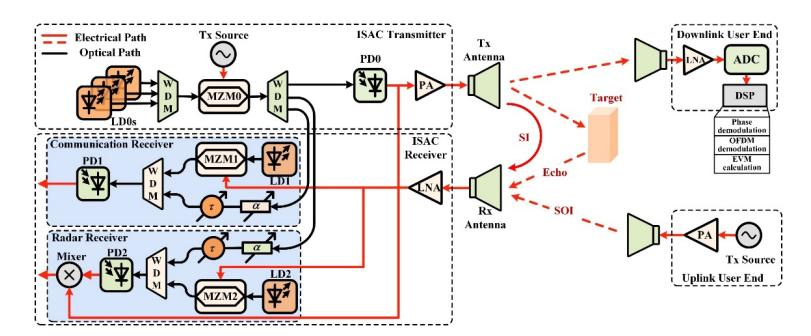

**Fig. 1.** Schematic diagram of the proposed photonic-assisted self-interference cancellation for IBFD ISAC transceiver system. LD, laser diode; WDM, wavelength division multiplexer; MZM, Mach-Zehner modulator; PD, photodetector; PA, power amplifier; Tx, transmitter; Rx, receiver. SI, self-interference; SOI, signal of interest; LNA, low noise amplifier;  $\alpha$ , variable optical attenuator;  $\tau$ , variable optical time delay line; ADC, analog to digital converter; DSP, digital signal processing.

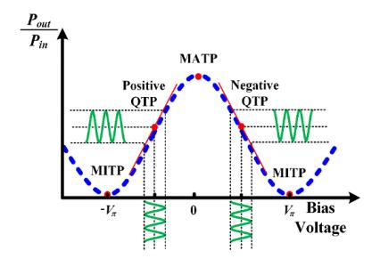

Fig. 2. Transmission curve related to the bias voltage of a Mach–Zehnder modulator.

Another portion is utilized as the de-chirp reference signal to beat with the echo signal, thereby generating the de-chirp signal for radar signal processing.

For the communication function, at the downlink user end, the RF ISAC signal from the proposed transceiver is received by an antenna and then amplified by a low noise amplifier (LNA) to compensate for transmission loss in free space. Subsequently, these RF signals are digitized by an analog-to-digital converter (ADC) for further digital signal processing (DSP), such as coherent down-conversion using the LFM carrier to extract the baseband CE-OFDM signal from the RF ISAC waveform, phase demodulation, OFDM demodulation, and error vector magnitude (EVM) calculation. At the uplink user end, the communication SOI is generated by a Tx source, amplified by a PA, and then radiated into free space via a transmit antenna. For the radar function, the echo signal reflected by a target is generated in free space.

At the receiving antenna (Rx Antenna), the received signal typically includes a SI signal (also known as leakage signal) from the co-site transmitter and a received SOI. The SOI contains sensing echo signals for the radar receiver or the communication SOI from the uplink user end for the communication receiver, as depicted in Fig. 1. The received signal is first amplified by a

# Optics EXPRESS

LNA to compensate for transmission loss in free space. This can be expressed as

$$s_{rec}(t) = s_{SI}(t - \tau_L) + s_{SOI}(t - \tau_R)$$

$$= V_{SI} \cos \begin{bmatrix} 2\pi f_c (t - \tau_L) + \pi k (t - \tau_L)^2 \\ r + hm (t - \tau_L) \end{bmatrix}$$

$$+ V_{recSOI} \cos \begin{bmatrix} 2\pi f_c (t - \tau_R) + \pi k (t - \tau_R)^2 \\ + hm_{recSOI} (t - \tau_R) \end{bmatrix}$$
(5)

where  $V_{SI}$  and  $V_{recSOI}$  represent the amplitude of the SI signal and received SOI, respectively.  $\tau_L$ , and  $\tau_R$  denote the time delay of the SI signal and received SOI, respectively. Due to the similar structure of the communication and radar receivers, their formulas can be combined before the output from PD1 and PD2. This signal is used to modulate an optical carrier from LD1 via MZM1, or from LD2 via MZM2, both biased at the negative quadrature transmission point, as depicted in Fig. 2. Consequently, the resulting optical field output of the MZM1 or MZM2 is

$$E_{MZM1,2} \propto E_{co} e^{j\omega_{co}t} \left\{ e^{j\pi \left[ \frac{s_{rec}(t)}{V_{\pi_{1,2}}} + \frac{3}{2} \right]} + e^{-j\pi \frac{s_{rec}(t)}{V_{\pi_{1,2}}}} \right\}$$
 (6)

where,  $E_{co}$  and  $\omega_{co}$  are the amplitude and angular frequency of the optical carrier from LD1 or LD2, respectively, and  $V_{\pi 1,2}$  denote the half-wave voltage of the MZM1 and MZM2, respectively. Under the small modulation condition, this equation can be expressed as

$$E_{MZM1,2} \propto -E_{co}e^{j\omega_{co}t} \begin{bmatrix} J_{0}(\beta_{1,2}) \\ +J_{1}(\beta_{1,2})e^{j\theta_{rec}(t)} \\ +J_{1}(\beta_{1,2})e^{-j\theta_{rec}(t)} \end{bmatrix}$$
(7)

in which  $\theta_{rec}(t) = 2\pi f_c(t-\tau_L) + \pi k(t-\tau_L)^2 + 2\pi h \cdot m(t-\tau_L) + 2\pi f_c(t-\tau_R) + \pi k(t-\tau_R)^2 + 2\pi h \cdot m_{recSOI}(t-\tau_R)$ , and  $\beta_{1,2} = (V_{SI} + V_{recSOI})/V_{\pi\,1,2}$  is the modulation index of MZM1 and MZM2. The modulated received optical signal is then multiplexed via one port of a WDM. Simultaneously, the power and time delay of the cancellation reference optical signal are adjusted using a variable optical attenuator (VOA) and a variable optical time delay line (VOTDL), respectively. These signals are then multiplexed via another port of a WDM to cancel out the SI signal. They are directed to PD1 and PD2 for the recovery of the electrical signal through optical heterodyne detection. The recovered electrical signal can be expressed as

$$I_{PD1,2} \propto I_{0} + I_{1} \times \begin{cases} \frac{\alpha_{CR}V_{CR}}{V_{\pi 0}} \cos \begin{bmatrix} 2\pi f_{c}(t - \tau_{CR}) \\ +\pi k(t - \tau_{CR})^{2} \\ +2\pi hm(t - \tau_{CR}) \end{bmatrix} \\ -\frac{V_{SI}}{V_{\pi 1}} \cos \begin{bmatrix} 2\pi f_{c}(t - \tau_{L}) \\ +\pi k(t - \tau_{L})^{2} \\ +2\pi hm(t - \tau_{L}) \end{bmatrix} \\ -\frac{V_{recSOI}}{V_{\pi 1}} \cos \begin{bmatrix} 2\pi f_{c}(t - \tau_{R}) \\ +2\pi hm(t - \tau_{L}) \end{bmatrix} \end{cases}$$
(8)

where α*CR* and τ*CR* represent the attenuation and time delay introduced by the VOA and the VOTDL both in the communication and radar receiver, respectively. In this equation, it can be observed that the SI signal will be canceled, and the received SOI will be recovered when α*CRVCR*/*V*π0= *VSI*/*V*π1,2 and τ*CR* =τ*L*. The amplitude and time delay adjustments for the SI signals can be achieved by tuning the VOA and the VOTDL within both the communication and radar receivers. This tuning can initially be performed manually by observing the waveform or spectrum. Alternatively, a real-time adaptive algorithm can automate this process, providing continuous SI cancellation and enhancing stability in dynamic environments [\[35\]](#page-17-15). After cancellation, the recovered received SOI can be directly demodulated in the communication receiver and sent into a mixer to beat with the de-chirp reference signal in the radar receiver. In radar receiver, the generated the de-chirp signal can be written as

$$s_{de-chirped}(t) \propto A_{DE} \cos 2\pi k \tau_E t$$
 (9)

where, *ADE* and *k*τ*E* denote the amplitude and frequency of the de-chirp signal, respectively. For ISAR imaging processing of an IBFD ISAC sensing system, the range profile resolution and cross-range profile resolution can be expressed as

$$\Delta R_r = \frac{c}{2B_s} \tag{10}$$

$$\Delta R_c = \frac{c}{2f_c T_i \varphi} \tag{11}$$

where *c* is the vacuum speed of light, *fc* denotes the center frequency of the transmitting ISAC signal. *Ti* stands for the integration time, and φ represents the rotational angle speed of the imaging target.

# **3. Experiments and results**

### *3.1. Experimental setup*

A proof-of-concept experiment can be conducted using the setup depicted in Fig. [1.](#page-4-0) In the transmitter, different optical carriers with an output power of 13 dBm are generated by a multi-wavelength laser diode (LD0s, Yenista Optics OSICS). These carriers are fed into a MZM (MZM0, Fujitsu FTM7939EKL), which has a 3-dB bandwidth of 30 GHz and a half-wave voltage of 3.5 V, after being multiplexed by a 100 GHz WDM. A CE-LFM-OFDM ISAC waveform, with parameters shown in Table [1,](#page-7-0) is generated by an arbitrary waveform generator (AWG, Keysight M8195A) with a sample rate of 65 GSa/s and then injected into MZM0 to modulate the optical carriers from the WDM, converting them into different wavelength optical signals. One signal serves as the transmitting optical signal and is sent to a PD (PD0, HP 11982A), with a 3-dB bandwidth of 15 GHz and a conversion gain of 300 V/W, to recover the electrical signal. The other signals serve as the cancellation reference optical signal. The recovered electrical signal is split by an electrical coupler (EC) and then serves as a transmitting electrical signal, a simulated SI signal, and a de-chirp reference signal. The transmitting electrical signal is amplified by a power amplifier (PA, SHF 100AP) with a gain of 18 dB and then radiated into free space via a horn antenna. The simulated SI signal is combined with the received signal via an EC. The de-chirp reference signal is injected into a mixer in the radar receiver to process the radar echo signal.

In the communication receiver, a SOI is received by a receiving antenna and then amplified by an LNA (SHF M804B) with a gain of 22 dB. The output of the LNA is combined with the simulated SI signal via an EC to simulate the SI of the IBFD transmission. The hybrid signal is then sent to a MZM (MZM1, Fujitsu FTM7939EKL) to modulate an optical carrier from the LD1 (Yenista Optics OSICS), converting it into an optical signal, which is then fed into a port of

**Table 1. Parameters for generating RF ISAC signal**

| Parameter              |                         | Value   |
|------------------------|-------------------------|---------|
| CE-OFDM                | Bandwidth               | 0.5 GHz |
|                        | Modulation format       | QAM     |
|                        | FFT size                | 2048    |
|                        | Center frequency        | 10 GHz  |
| LFM-CW                 | Instantaneous bandwidth | 1.5 GHz |
|                        | Pulse width             | 40 µs   |
| Phase modulation index |                         | 7       |

a 100 GHz WDM. The cancellation reference optical signal is injected into one channel of a multipath optical delay line (MOTDL) for canceling SI. This channel of the MOTDL contains a VOA with a range of 30 dB and a resolution of 0.1 dB, as well as a VOTDL with a range of 12 ns and a resolution of 0.1 ps. It should be noted that due to the MOTDL having a limited range of adjustment for the time delay, a piece of single-mode fiber (SMF) with a length of 13 m is incorporated between the MZM1 and the WDM to make the time delay difference between the cancellation reference path and received signal path less than 12 ns. Since time delay deviations introduce ripple effects in the SI spectrum and amplitude deviations lead to gradual changes, these observed spectral characteristics can be used to fine-tune the amplitude and time delay of the SI signal. This approach allows us to precisely maintain optimal SIC performance.

After adjustment, the cancellation reference optical signal is fed into another port of the WDM to be multiplexed with the receiving optical signal. These signals are then injected into a PD (PD1, HP 11982A), where the optical signal is converted to an electrical signal. Due to the counter-phase relationship of the SI and the cancellation reference signal, the SI signal is canceled, leaving only the SOI. Due to the similar structure between the communication receiver and radar receiver as well as the device limitation of our lab, the communication receiver and radar receiver can be multiplexed. Therefore, an echo signal in the radar receiver experiences the same process as the SOI in the communication receiver. Afterward, for the communication receiver, the recovered SOI is directly sent to an oscilloscope (OSC) with a bandwidth of 13 GHz and a sample rate of 40 GSa/s for communication signal demodulation. For the radar receiver, the recovered echo signal is sent to a mixer to beat with the de-chirp reference signal, generating the de-chirp signal, which is then sent to an OSC with a sample rate of 200 MSa/s for radar signal processing. It should be noted that the distance limitations for communication and measurement, based on the parameters used in our experiment, extend well beyond the physical dimensions of the room. Additionally, the radiation power utilized in the experiment further constrains this distance, necessitating a short target distance during the experiment.

### *3.2. ISAC waveform generation of IBFD ISAC transmitter*

To evaluate the performance of the ISAC waveform in the proposed IBFD ISAC transmitter, key parameters for the transmitted RF 64-QAM CE-LFM-OFDM ISAC signal are summarized in Table [1.](#page-7-0) A 1.3-meter wireless communication transmission link operating at 10 GHz is established using a pair of RF antennas, a transmit PA (SHF 100AP), and a receive LNA (SHF M804B), as shown in Fig. [3.](#page-8-0) The 10 GHz ISAC signal received by the communication receiver antenna is amplified by the LNA and then directed to an OSC with a sample rate of 40 GSa/s. Subsequently, offline digital signal processing (DSP) is employed to evaluate the quality of the received communication signal. This includes coherent down-conversion using the LFM carrier, phase demodulation, and OFDM demodulation. Figure [4](#page-8-1) displays the measured temporal waveforms, spectrum, spectrogram, and corresponding constellation diagram of the

received ISAC signal. Figure [4\(](#page-8-1)c) presents the time-frequency characteristics by computing the spectrogram of the temporal waveform, indicating a 1.5 GHz instantaneous bandwidth of the LFM carrier from 9.25 GHz to 10.75 GHz. It is evident from Fig. [4\(](#page-8-1)d) that the constellation diagram for the received demodulated signal is clear and well-separated, showing a 5.54% EVM, which meets the 8% threshold for 64-QAM modulation. Note that the result in Fig. [5\(](#page-8-2)b) is obtained by evaluating the temporal waveform in Fig. [5\(](#page-8-2)a) using the fast Fourier transform (FFT).

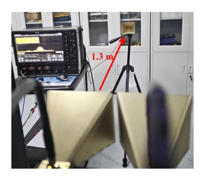

**Fig. 3.** Wireless communication transmission link for the proposed IBFD ISAC transmitter.

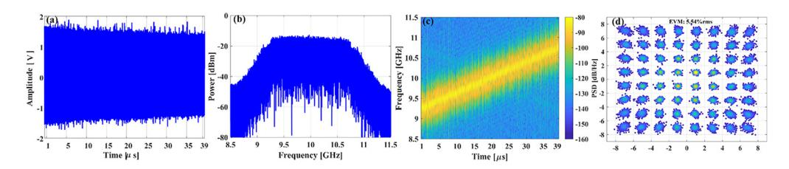

**Fig. 4.** Measured (a) temporal waveforms, (b) spectrum, (c) spectrogram, and (d) corresponding constellation diagram of the received ISAC signal.

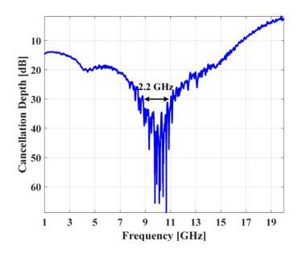

**Fig. 5.** Measured wideband self-interference cancellation depth using the VNA.

### *3.3. SIC performance in IBFD ISAC communication receiver*

To verify the SIC performance of the proposed IBFD ISAC communication receiver, a vector network analyzer (VNA, Anritsu MS4645B) with a bandwidth of 40 GHz is used to measure the cancellation depth curve. A swept single-tone RF signal ranging from 1 GHz to 19.5 GHz is generated and outputted from the VNA. The SIC performance of the proposed experimental

setup is depicted in Fig. [5.](#page-8-2) A cancellation depth of 30 dB is achieved within a bandwidth of 2.2 GHz at a center frequency of 10 GHz after applying the cancellation.

To validate the SIC performance for single-tone signal IBFD communication in the proposed communication receiver, a microwave signal with a carrier frequency of 10 GHz is generated using the AWG and sent into the IBFD ISAC transmitter of the experimental system. Figure [6](#page-9-0) displays the measured electrical spectra of a single-tone SI signal with and without cancellation at a carrier frequency of 10 GHz, monitored using an electrical spectrum analyzer (ESA) with a resolution bandwidth (RBW) of 1 MHz and a video bandwidth (VBW) of 10 kHz. The measurements are conducted by disconnecting (without cancellation) and connecting (with cancellation) the cancellation reference signal. The cancellation depths, defined as the ratios of the SI signal power without cancellation to with cancellation, are measured at 52.08 dB at the carrier frequency of 10 GHz.

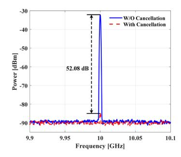

**Fig. 6.** Measured electrical spectra of a single-tone SI signal with and without cancellation when the carrier frequency is 10 GHz.

To assess the SIC performance for wideband microwave signals of IBFD communication in the proposed communication receiver, a 64-QAM CE-LFM-OFDM ISAC waveform with bandwidths of 1 GHz and 2 GHz is generated using the AWG. The 1 GHz bandwidth ISAC signal comprises a 500 MHz instantaneous bandwidth of the LFM carrier carrying a 500 MHz CE-OFDM baseband, while the 2 GHz bandwidth ISAC signal comprises a 1.5 GHz instantaneous bandwidth of the LFM carrier carrying a 500 MHz CE-OFDM baseband. These signals are then transmitted to the IBFD ISAC transmitter of the experimental system, respectively. The RBW and VBW of the ESA are set to 1 MHz and 10 kHz, respectively, for spectra measurement. The corresponding time-frequency characteristics are determined by computing the spectrogram of the temporal waveform captured from the OSC. Figure [7\(](#page-10-0)a) and (b) show the measured electrical spectra with and without cancellation when the bandwidths are 1 GHz and 2 GHz, respectively. Figures [7\(](#page-10-0)c) and [7\(](#page-10-0)e) present the time-frequency characteristics of the captured 1 GHz and 2 GHz bandwidth temporal waveforms without cancellation. Figures [7\(](#page-10-0)d) and [7\(](#page-10-0)f) depict the time-frequency characteristics of the captured 1 GHz and 2 GHz bandwidth temporal waveforms with cancellation. The SI signals demonstrate a bandwidth of 1 GHz from 9.5 GHz to 10.5 GHz and a 2 GHz bandwidth from 9 GHz to 11 GHz, as shown in Figs. [7\(](#page-10-0)c) and [7\(](#page-10-0)d). After cancellation, the corresponding spectrograms show the residual SI with bandwidths of 1 GHz and 2 GHz remaining, as shown in Figs. [7\(](#page-10-0)e) and [7\(](#page-10-0)f). According to the experimental results, the cancellation depths are 35.29 dB and 32.59 dB for the bandwidths of 1 GHz and 2 GHz, respectively.

To assess the recovery of a weak SOI in wideband signal IBFD communication for the proposed communication receiver, the SOI is generated from one port of the AWG and combined with SI. Simultaneously, the transmitting signal from another port of the AWG is injected into MZM0 after amplified, contributing to SI in IBFD communication. It's important to note that both SI and SOI exhibit various modulation formats and bandwidths to mimic scenarios where the two

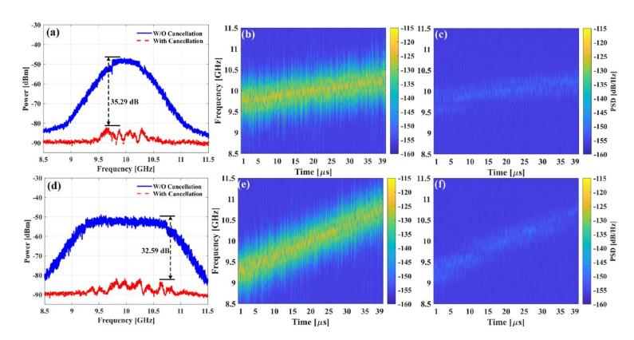

**Fig. 7.** Measured electrical spectra of a wideband self-interference signal with and without cancellation when the bandwidths are (a)1 GHz and (b) 2 GHz. Spectrograms of the temporal waveforms for (c) 1 GHz bandwidth with and (e) without cancellation, and for (d) 2 GHz bandwidth with and (f) without cancellation.

signals differ, such as in quality of service. Figure [8](#page-11-0) illustrates the SOI recovery performance with and without cancellation, showcasing various scenarios: (a) SOI with a bandwidth of 1 GHz and SI signal with a bandwidth of 2 GHz, both employing the 16-QAM CE-LFM-OFDM signal. (b) SOI with a bandwidth of 1 GHz and SI signal with a bandwidth of 2 GHz, both utilizing the 64-QAM CE-LFM-OFDM signal. (c) SOI as a 64-QAM CE-LFM-OFDM signal and SI signal as a 16-QAM CE-LFM-OFDM signal, both having a bandwidth of 1 GHz. (d) SOI as a 64-QAM CE-LFM-OFDM signal and SI signal as a 16-QAM CE-LFM-OFDM signal, both having a bandwidth of 2 GHz. Without cancellation, Fig. [8](#page-11-0) shows the SOI being entirely obscured within the SI signal spectrum. However, optimization of the amplitude and delay mismatches between the SI signal and cancellation reference branches suppresses the SI signal, making the SOI entirely discernible. Figures [9,](#page-11-1) [10,](#page-11-2) [11,](#page-11-3) and [12](#page-12-0) display the spectrograms of SI and SOI and the corresponding constellation diagrams of SOI with and without cancellation, related to Figs. [8\(](#page-11-0)a), (b), (c), and (d), respectively. In Figs. [9,](#page-11-1) [10,](#page-11-2) [11,](#page-11-3) and [12,](#page-12-0) before the SI is canceled, the SOI is completely buried within the SI bandwidth, making the corresponding constellation diagrams (Figs. [9\(](#page-11-1)c), [10\(](#page-11-2)c), [11\(](#page-11-3)c), and [12\(](#page-12-0)c)) unrecognizable. The EVMs in these scenarios are 100.02%, 100.06%, 100.03%, and 100.14%, respectively. After adjusting the amplitude and delay of the cancellation reference signal to match the SI signal, the SI is efficiently suppressed, reducing its effect on the demodulation of the SOI and allowing the SOI to be successfully recovered. As a result, the corresponding constellation diagrams (Figs. [9\(](#page-11-1)d), [10\(](#page-11-2)d), [11\(](#page-11-3)d), and [12\(](#page-12-0)d)) become clear, with EVMs of 8.87%, 4.96%, 4.36%, and 5.21%, respectively. These values fall below the 3GPP-specified EVM limits of 12.5% for 16-QAM and 8% for 64-QAM.

To validate the feasibility of weak SOI recovery for wideband signal IBFD communication in a wireless link using the proposed communication receiver, the SOI is generated from one port of the AWG and transmitted to a horn antenna for communication after amplification by a PA (SHF 100AP). The horn antenna is positioned 1.3 meters away from the receiving antenna of the proposed communication receiver, establishing a wireless communication transmission link. Simultaneously, the transmitting signal from another port of the AWG is injected into MZM0 after amplified, contributing to SI in IBFD communication. Figures [13](#page-12-1) and [14](#page-12-2) illustrate the SOI recovery performance with and without cancellation in the wireless link, where the SOI has a bandwidth of 1 GHz and the SI signal has a bandwidth of 2 GHz. In Fig. [13,](#page-12-1) both the SOI and SI signals are 16-QAM CE-LFM-OFDM signals, while in Fig. [14,](#page-12-2) both the SOI and SI signals are 64-QAM CE-LFM-OFDM signals. While the SOI isn't entirely hidden in the

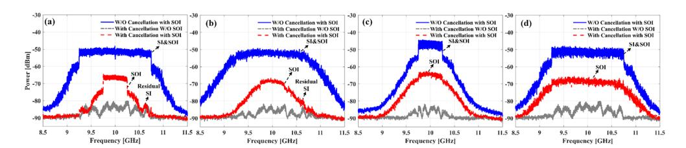

**Fig. 8.** Measured electrical spectra of a wideband self-interference signal with and without cancellation. (a) The SI has a bandwidth of 2 GHz and the SOI has a bandwidth of 1 GHz, both employing the 16-QAM CE-LFM-OFDM signal. (b) The SI has a bandwidth of 2 GHz and the SOI has a bandwidth of 1 GHz, both employing the 64-QAM CE-LFM-OFDM signal. (c) The SI is a 16-QAM CE-LFM-OFDM signal and the SOI is a 64-QAM CE-LFM-OFDM signal, both with a bandwidth of 1 GHz. (d) The SI is a 16-QAM CE-LFM-OFDM signal and the SOI is a 64-QAM CE-LFM-OFDM signal, both with a bandwidth of 2 GHz.

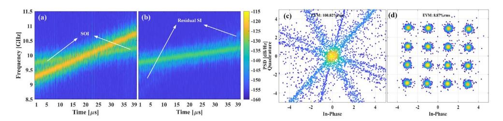

**Fig. 9.** The corresponding spectrograms of SI and SOI and the (a) without and (b) with cancellation, along with the constellation diagram of SOI (c) without and (d) with cancellation, which is related to Fig. [8\(](#page-11-0)a).

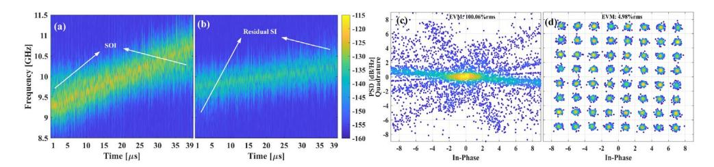

**Fig. 10.** The corresponding spectrograms of SI and SOI and the (a) without and (b) with cancellation, along with the constellation diagram of SOI (c) without and (d) with cancellation, which is related to Fig. [8\(](#page-11-0)b).

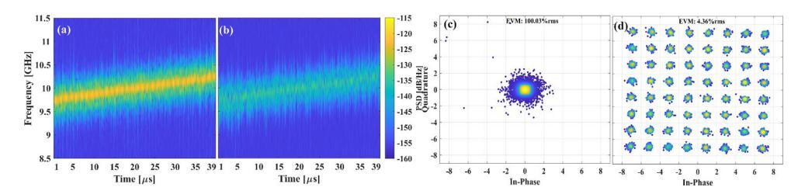

**Fig. 11.** The corresponding spectrograms of SI and SOI and the (a) without and (b) with cancellation, along with the constellation diagram of SOI (c) without and (d) with cancellation, which is related to Fig. [8\(](#page-11-0)c).

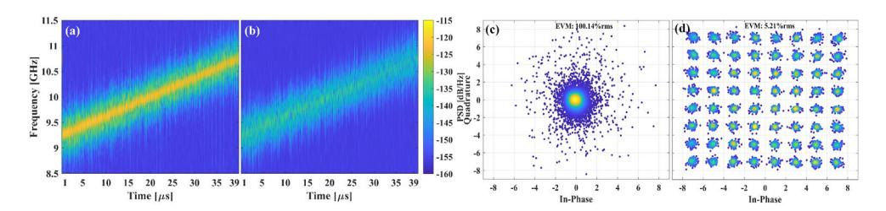

**Fig. 12.** The corresponding spectrograms of SI and SOI and the (a) without and (b) with cancellation, along with the constellation diagram of SOI (c) without and (d) with cancellation, which is related to Fig. [8\(](#page-11-0)d).

SI signal spectrogram, the fast-changing LFM carrier complicates filtering it out for effective demodulation, as shown in Figs. [13](#page-12-1) and [14.](#page-12-2) Despite residual SI remaining after applying SIC, effective demodulation of the SOI yields clear constellation diagrams. This results in a reduction of the EVM from unrecognizable levels (100.3% and 100.09%) to clear levels (12.25% and 6.79%), respectively, within the specified limits.

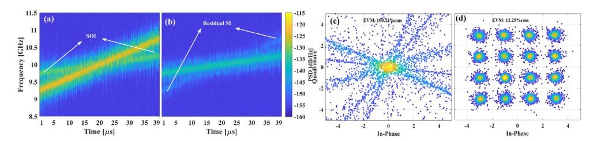

**Fig. 13.** The spectrograms of SI and SOI and the (a) without and (b) with cancellation, along with the constellation diagram of SOI (c) without and (d) with cancellation in wireless link, which the signals both are 16 QAM CE-LFM-OFDM signals.

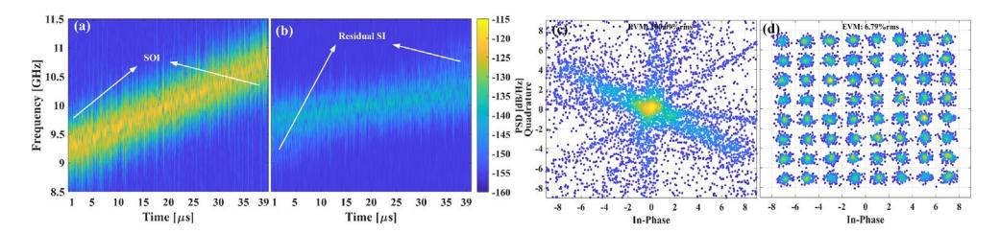

**Fig. 14.** The spectrograms of SI and SOI and the (a) without and (b) with cancellation, along with the constellation diagram of SOI (c) without and (d) with cancellation in wireless link, which the signals both are 64 QAM CE-LFM-OFDM signals.

### *3.4. SIC performance in IBFD ISAC radar receiver*

To validate the measurement performance feasibility of the proposed ISAC radar receiver, a 64 QAM CE-LFM-OFDM ISAC waveform, with key parameters as shown in Table [1,](#page-7-0) is generated using the AWG and then injected into MZM0 after amplification. The transmitted IBFD ISAC signal from the proposed transmitter is radiated into free space via a horn antenna after amplification by PA (SHF 100AP) and received by an antenna to detect targets approximately 1.3 m away from them, as depicted in Fig. [15\(](#page-13-0)a). Subsequently, the echo signals reflected by

the targets are collected by a receiving antenna adjacent to the transmitting one, combined with the SI signal, and then applied to MZM1. For the radar de-chirping process, a mixer is utilized to achieve coherent heterodyne beating between the de-chirp reference and the LFM carrier of the reflected (delayed) ISAC signals, measured by the ESA with an RBW of 100 kHz and a VBW of 3 kHz. Two reflectors are employed to simulate the targets of interest for radar range demonstrations, as depicted in Fig. [15,](#page-13-0) with a distance between them of approximately 10 cm. Figure [16](#page-13-1) displays the range profile results obtained from two reflectors separated by a 10 cm interval for the proposed ISAC radar system. As observed in Fig. [16,](#page-13-1) the distance between the two targets is 10.16 cm, consistent with the theoretical 10 cm range resolution for ISAC signals with a 1.5 GHz instantaneous bandwidth. Without cancellation, the range profiles show three peaks, indicating the SI and the reflected targets. The delayed SI is about 0.1 m away from the receiving antenna, while the first reflector is approximately 1.3 m away. After cancellation, the SI peak is suppressed, preserving the integrity of the target information. The range profiles from the two reflectors show identical peak locations to those obtained profiles without cancellation.

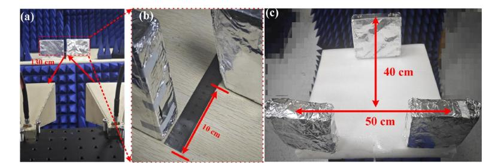

**Fig. 15.** (a) Photograph of two static reflector targets for radar ranging spaced at a distance of 1.3 m; (b) photograph of the two reflector targets spaced at 10 cm intervals for radar detection; (c) photograph of three moving targets on a rotating platform.

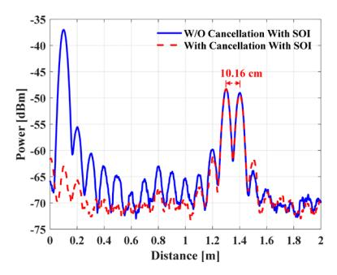

**Fig. 16.** Measured range profile results of two reflectors separated at 10 cm interval.

To verify the SIC performance of the proposed IBFD ISAC radar receiver, the reflector is first removed to validate SIC performance without the echo of the target for radar functionality. Due to the presence of SI, there is a high peak at a distance of 0.1 meters from the receiving antenna, indicating a blind range, as shown in Fig. [17\(](#page-14-0)a). A cancellation depth of 23.6 dB is attained for the radar receiver after canceling SI in the blind range. It can be summarized that de-chirp SI signal can be effectively suppressed after cancellation in the blind range.

To assess the effect of SIC on range measurement at varying distances, a reflector is placed as a target at 0.1-meter intervals up to 0.5 meters from the receiving antenna, with the target echo treated as the SOI. The range profiles obtained at these intervals are depicted in Fig. [17\(](#page-14-0)b)-(f). In Fig. [17\(](#page-14-0)b), without cancellation, the peaks of the target and the SI overlap due to their proximity

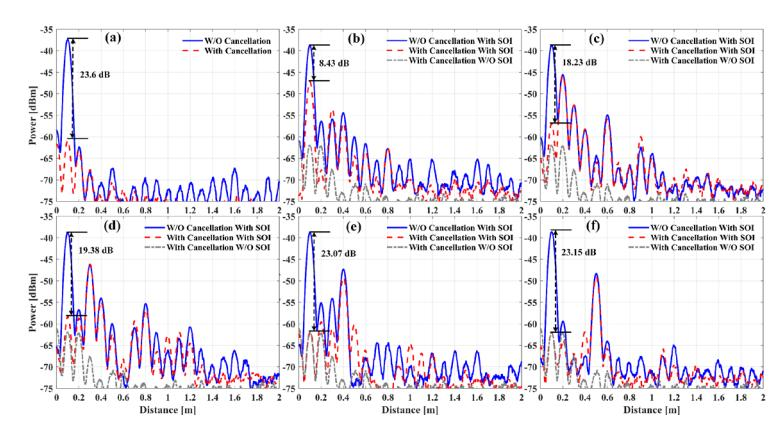

**Fig. 17.** (a) Measured range profile without reflectors, with and without cancellation. (b)-(f) Measured range profile with one reflector at varying distances (0.1 m, 0.2 m, 0.3 m, 0.4 m, and 0.5 m), with and without cancellation, respectively.

to the receiving antenna at a distance of 0.1 meters. However, after cancellation, the target peak becomes clearly discernible, indicating an increase in dynamic range, with an amplitude 8.43 dB lower than the combined peak of the target and SI. In Figs. [17\(](#page-14-0)c)-(f), with the target positioned between 0.2 meters and 0.5 meters from the receiving antenna, the impact of SI diminishes for target measurement. When the target is greater than 0.3 meters away from the receiving antenna, the influence of SI on the target measurement becomes negligible.

To evaluate the SIC performance by implementing ISAR imaging, the de-chirp signal waveforms captured by the OSC are post-processed using MATLAB. The electric rotating platform, rotating at a speed of 4π rad/s, is equipped with three moving targets to emulate dynamic movement, as depicted in Fig. [15\(](#page-13-0)b). According to Eqs. (12) and (13), the theoretical range resolution is 10 cm, and the theoretical cross-range resolution is 2.22 cm. Figure [18](#page-15-0) presents imaging results under various conditions. All imaging data are normalized, with the maximum value across all data used for normalization. In Fig. [18\(](#page-15-0)a), the imaging result is shown without SI and with the removal of imaging targets, illustrating the influence of the background environment on imaging results. Figure [18\(](#page-15-0)b) displays the imaging result with SI applied and subsequently cancelled, alongside the removal of imaging targets, demonstrating the background environment's effect with cancellation. Figures [18\(](#page-15-0)c) and [18\(](#page-15-0)d) depict the imaging results of the three targets without and with cancellation, respectively. The influence of the background environment observed in Fig. [18\(](#page-15-0)a) is also evident in Figs. [18\(](#page-15-0)b)–(d) due to its presence. Based on the imaging results, a strong peak creates a blind area in front of the receiving antenna when SI is not cancelled, affecting target information acquisition in this area in Fig. [18\(](#page-15-0)c). Conversely, when SI is cancelled, the influence of the de-chirp SI signal on imaging is significantly reduced, resulting in lower amplitude compared to the target amplitude, as shown in Fig. [18\(](#page-15-0)d). To clearly compare the increase in dynamic range after cancellation, Figs. [18\(](#page-15-0)c) and [18\(](#page-15-0)d) are combined to compare SI and residual SI imaging results, as illustrated in Fig. [19.](#page-15-1) It can be observed that a measurement dynamic range of 23.84 dB is achieved after cancellation in the blind area under the ISAR imaging scenario.

# *3.5. Performance trade-off between radar and communication functions*

To evaluate the performance trade-off between radar and communication functions be affected by the PMIs of the transmit 10 GHz 64-QAM CE-LFM-OFDM ISAC signals in the proposed transmitter, additional experiments are conducted [\[28\]](#page-17-9). Figure [20](#page-15-2) shows the measured bit error rates (BERs) of the demodulated communication signals and the signal-to-noise ratios (SNRs) of

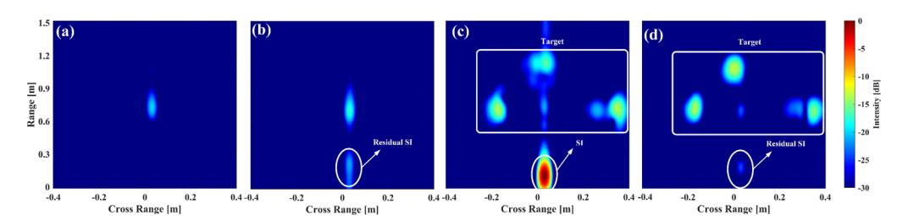

**Fig. 18.** (a) Imaging result without self-interference and the three imaging targets. (b) Imaging result without the three imaging targets but with cancelled self-interference. Imaging results of the three targets: (c) without cancellation and (d) with cancellation.

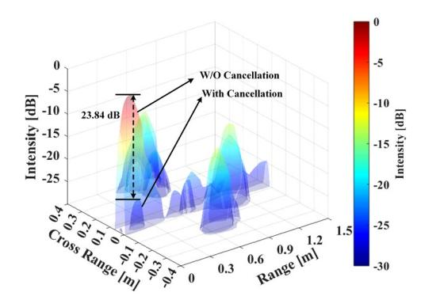

**Fig. 19.** Imaging results of the three targets without cancellation and with cancellation corresponding to the Fig. [18\(](#page-15-0)c) and (d).

the radar de-chirped signals with variable PMIs ranging from 1 to 12. It can be seen from Fig. [20](#page-15-2) that the communication performance, as indicated by BERs, gradually improves with increasing PMIs. However, the SNRs of the de-chirped signals for radar performance decrease as the PMIs increase. Therefore, to achieve an optimal balance performance between communication and radar functions, the recommended PMI value in our proposed scheme is 7.

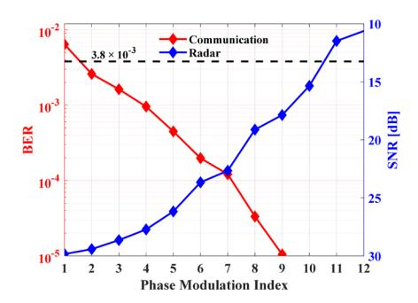

**Fig. 20.** Measured BERs of the demodulated communication signals and SNRs of the de-chirping radar signals versus different phase modulation indexes of the transmit 10 GHz 64-QAM CE-LFM-OFDM ISAC signals in the proposed transmitter.

# **4. Conclusion**

A photonic-assisted SIC for IBFD ISAC transceiver scheme is proposed. The feasibility of the proposed scheme is verified through a proof-of-concept experiment. By leveraging the phase inversion via counter-biased MZMs, matched amplitude and time delay via MOTDL, and wavelength division multiplexing, effective SIC performance is achieved for the proposed transceiver. Experimental results demonstrate cancellation depths of 35.29 dB and 30.29 dB when using 10 GHz 64-QAM CE-LFM-OFDM waveforms with bandwidths of 1 and 2 GHz for communication, respectively. In radar applications, a cancellation depth of 23.6 dB for the SI signal after de-chirping is achieved for distance measurement, resulting in the removal of the blind area and an increase in dynamic range of 23.84 dB in ISAR imaging. Additionally, a 10 cm resolution for radar ranging is achieved. The proposed photonics-assisted transceiver, which is both spectrum and hardware-efficient for IBFD ISAC, shows potential for applications in future 6 G and beyond wireless network scenarios.

**Funding.** National Key Research and Development Program of China (2022YFB2802701); National Natural Science Foundation of China (U23A20376, 62075185, 62271422); Sichuan Science Fund for Distinguished Young Scholars (2024NSFJQ0016).

**Acknowledgments.** The authors would like to thank the anonymous reviewers for their valuable comments that helped improve this paper.

**Disclosures.** The authors declare no conflicts of interest.

**Data availability.** Data underlying the results presented in this paper are not publicly available at this time but may be obtained from the authors upon reasonable request.

### **References**

- 1. T. Riihonen and K. E. Kolodziej, "Full-duplex ISAC," in *Integrated Sensing and Communications*, F. Liu, C. Masouros, and Y. C. Eldar, eds. (Springer Nature, 2023), pp. 537–565.
- 2. D. Bharadia, E. McMilin, and S. Katti, "Full duplex radios," in *Proceedings of the ACM SIGCOMM 2013 Conference on SIGCOMM* (ACM, 2013), pp. 375–386.
- 3. F. Liu, Y. Cui, C. Masouros, *et al.*, "Integrated sensing and communications: toward dual-functional wireless networks for 6 G and beyond," [IEEE J. Select. Areas Commun.](https://doi.org/10.1109/JSAC.2022.3156632) **40**(6), 1728–1767 (2022).
- 4. B. Smida, A. Sabharwal, G. Fodor, *et al.*, "Guest editorial full duplex and its applications," [IEEE J. Select. Areas](https://doi.org/10.1109/JSAC.2023.3292659) [Commun.](https://doi.org/10.1109/JSAC.2023.3292659) **41**(9), 2725–2728 (2023).
- 5. W. Wang, X. Han, J. Wang, *et al.*, "Photonic-assisted RF transceiver with simultaneous image rejection and self-interference cancellation," [J. Lightwave Technol.](https://doi.org/10.1109/JLT.2024.3359478) **42**(21), 7652–7660 (2024).
- 6. J. Capmany and D. Novak, "Microwave photonics combines two worlds," [Nat. Photonics](https://doi.org/10.1038/nphoton.2007.89) **1**(6), 319–330 (2007).
- 7. J. Yao, "Microwave Photonics," [J. Lightwave Technol.](https://doi.org/10.1109/JLT.2008.2009551) **27**(3), 314–335 (2009).
- 8. X. Su, X. Han, S. Fu, *et al.*, "Optical multipath RF self-interference cancellation based on phase modulation for full-duplex communication," [IEEE Photonics J.](https://doi.org/10.1109/JPHOT.2020.3002856) **12**(4), 1–14 (2020).
- 9. X. Han, X. Su, M. Chao, *et al.*, "Integrated photonic RF self-interference cancellation on a silicon platform for full-duplex communication," [Photon. Res.](https://doi.org/10.1364/PRJ.485157) **11**(10), 1635–1646 (2023).
- 10. J. Suarez, K. Kravtsov, and P. R. Prucnal, "Incoherent method of optical interference cancellation for radio-frequency communications," [IEEE J. Quantum Electron.](https://doi.org/10.1109/JQE.2009.2013106) **45**(4), 402–408 (2009).
- 11. J. Chang and P. R. Prucnal, "A novel analog photonic method for broadband multipath interference cancellation," [IEEE Microw. Wireless Compon. Lett.](https://doi.org/10.1109/LMWC.2013.2262261) **23**(7), 377–379 (2013).
- 12. W. Zhou, P. Xiang, Z. Niu, *et al.*, "Wideband optical multipath interference cancellation based on a dispersive element," [IEEE Photon. Technol. Lett.](https://doi.org/10.1109/LPT.2016.2514607) **28**(8), 849–851 (2016).
- 13. K. E. Kolodziej, S. Yegnanarayanan, and B. T. Perry, "Fiber bragg grating delay lines for wideband self-interference cancellation," [IEEE Trans. Microwave Theory Techn.](https://doi.org/10.1109/TMTT.2019.2931973) **67**(10), 4005–4014 (2019).
- 14. Y. Zhang, S. Xiao, H. Feng, *et al.*, "Self-interference cancellation using dual-drive mach-zehnder modulator for in-band full-duplex radio-over-fiber system," [Opt. Express](https://doi.org/10.1364/OE.23.033205) **23**(26), 33205–33213 (2015).
- 15. T. Shi, D. Liang, M. Han, *et al.*, "Photonics-based de-chirping and leakage cancellation for frequency-modulated continuous-wave radar system," [IEEE Trans. Microwave Theory Techn.](https://doi.org/10.1109/TMTT.2022.3186375) **70**(9), 4252–4262 (2022).
- 16. X. Han, B. Huo, Y. Shao, *et al.*, "Optical RF self-interference cancellation by using an integrated dual-parallel MZM," [IEEE Photonics J.](https://doi.org/10.1109/JPHOT.2017.2690944) **9**(2), 1–8 (2017).
- 17. Y. Chen and S. Pan, "Simultaneous wideband radio-frequency self-interference cancellation and frequency downconversion for in-band full-duplex radio-over-fiber systems," [Opt. Lett.](https://doi.org/10.1364/OL.43.003124) **43**(13), 3124–3127 (2018).
- 18. X. P. Hu, D. Zhu, L. Li, *et al.*, "Photonics-based adaptive RF self-interference cancellation and frequency downconversion," [J. Lightwave Technol.](https://doi.org/10.1109/JLT.2021.3133609) **40**(7), 1989–1999 (2022).

- 19. X. Hu, D. Zhu, H. Xiao, *et al.*, "Photonics-based radio frequency self-interference cancellation for radio-over-fiber systems," [Opt. Lett.](https://doi.org/10.1364/OL.462681) **47**(16), 4179–4182 (2022).
- 20. M. P. Chang, C.-L. Lee, B. Wu, *et al.*, "Adaptive optical self-interference cancellation using a semiconductor optical amplifier," [IEEE Photon. Technol. Lett.](https://doi.org/10.1109/LPT.2015.2405498) **27**(9), 1018–1021 (2015).
- 21. Q. Zhou, H. Feng, G. Scott, *et al.*, "Wideband co-site interference cancellation based on hybrid electrical and optical techniques," [Opt. Lett.](https://doi.org/10.1364/OL.39.006537) **39**(22), 6537–6540 (2014).
- 22. M. P. Chang, M. Fok, A. Hofmaier, *et al.*, "Optical analog self-interference cancellation using electro-absorption modulators," [IEEE Microw. Wireless Compon. Lett.](https://doi.org/10.1109/LMWC.2013.2240288) **23**(2), 99–101 (2013).
- 23. X. Yu, J. Ye, L. S. Yan, *et al.*, "Photonic-assisted multipath self-interference cancellation for wideband MIMO radio-over-fiber transmission," [J. Lightwave Technol.](https://doi.org/10.1109/JLT.2021.3080833) **40**(2), 462–469 (2022).
- 24. H. Nie, F. Zhang, Y. Yang, *et al.*, "Photonics-based integrated communication and radar system," in *International Topical Meeting on Microwave Photonics* (2019), pp. 1–4.
- 25. W. Bai, X. Zou, P. Li, *et al.*, "60-GHz photonic millimeter-wave joint radar-communication system," in *International Conference on Microwave and Millimeter Wave Technology* (2021), pp. 1–3.
- 26. S. Wang, D. Liang, and Y. Chen, "Photonics-assisted joint communication-radar system based on a QPSK-sliced linearly frequency-modulated signal," [Appl. Opt.](https://doi.org/10.1364/AO.456287) **61**(16), 4752–4760 (2022).
- 27. M. Lei, B. Hua, Y. Cai, *et al.*, "Photonics-aided integrated sensing and communications in mmW bands based on a DC-offset QPSK-encoded LFMCW," [Opt. Express](https://doi.org/10.1364/OE.474055) **30**(24), 43088–43103 (2022).
- 28. W. Bai, P. Li, X. Zou, *et al.*, "Millimeter-wave joint radar and communication system based on photonic frequencymultiplying constant envelope LFM-OFDM," [Opt. Express](https://doi.org/10.1364/OE.461508) **30**(15), 26407–26425 (2022).
- 29. W. Bai, P. Li, X. Zou, *et al.*, "Photonic super-resolution millimeter-wave joint radar-communication system using self-coherent detection," [Opt. Lett.](https://doi.org/10.1364/OL.472155) **48**(3), 608–611 (2023).
- 30. W. Bai, P. Li, X. Zou, *et al.*, "Photonics-assisted millimeter-wave multiband integrated sensing and communication system using coherent receiving," [IEEE J. Select. Topics Quantum Electron.](https://doi.org/10.1109/JSTQE.2023.3276903) **29**(6: Photonic Signal Processing), 1–11 (2023).
- 31. Z. Xue, S. Li, J. Li, *et al.*, "OFDM radar and communication joint system using opto-electronic oscillator with phase noise degradation analysis and mitigation," [J. Lightwave Technol.](https://doi.org/10.1109/JLT.2022.3156573) **40**(13), 4101–4109 (2022).
- 32. Z. Xue, S. Li, X. Xue, *et al.*, "Tunable K/W-band OFDM integrated radar and communication system based on optoelectronic oscillator for intelligent transportation," [Opt. Express](https://doi.org/10.1364/OE.465197) **30**(20), 35270–35281 (2022).
- 33. F. Liu, P. Li, N. Zhong, *et al.*, "Millimeter-wave over fiber integrated sensing and communication system using self-coherent OFDM," [Opt. Express](https://doi.org/10.1364/OE.513686) **32**(9), 15493–15506 (2024).
- 34. R. Mohseni, A. Sheikhi, and M. A. M. Shirazi, "Constant envelope OFDM signals for radar applications," in *Radar Conference* (IEEE, 2008), pp. 1–5.
- 35. X. Yu, J. Ye, L. Yan, *et al.*, "Real-time adaptive optical self-interference cancellation for in-band full-duplex transmission using SARSA(λ) reinforcement learning," [Opt. Express](https://doi.org/10.1364/OE.486889) **31**(8), 13140–13153 (2023).