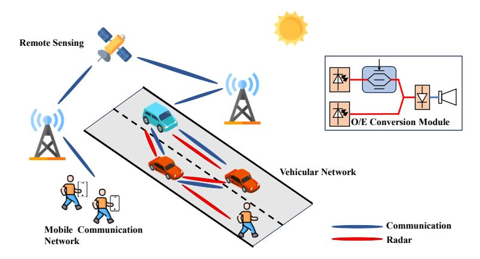
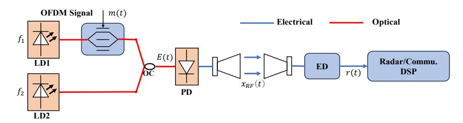
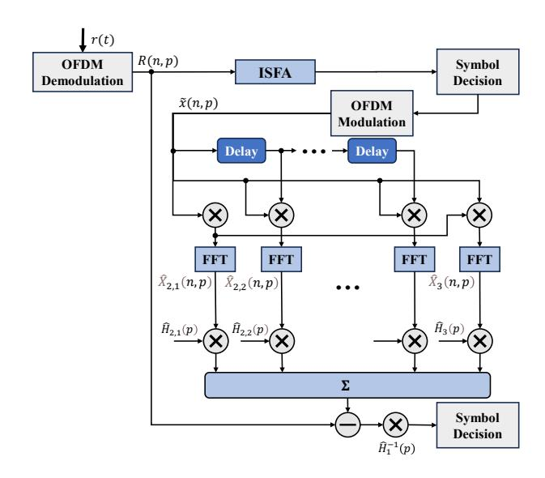
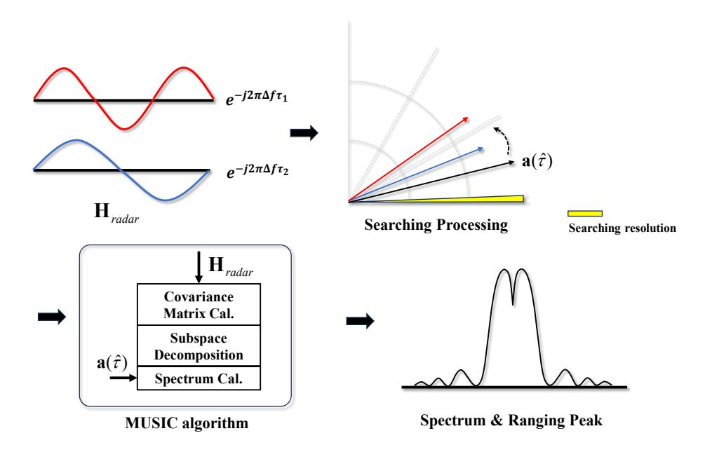
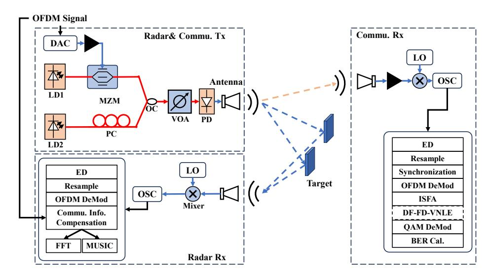
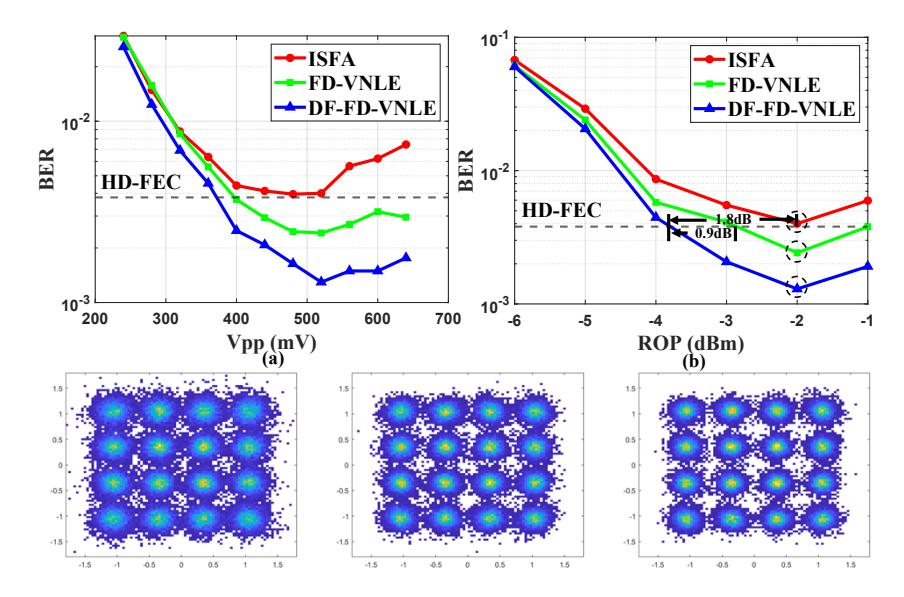
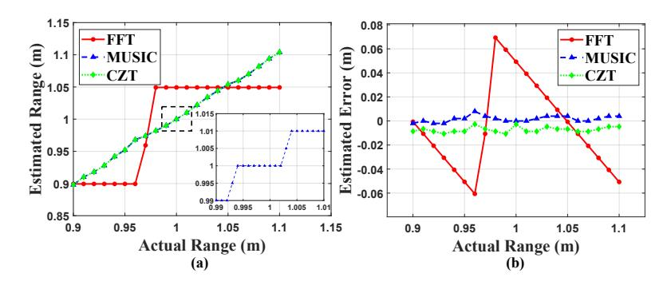
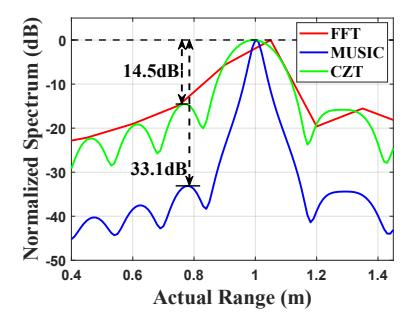
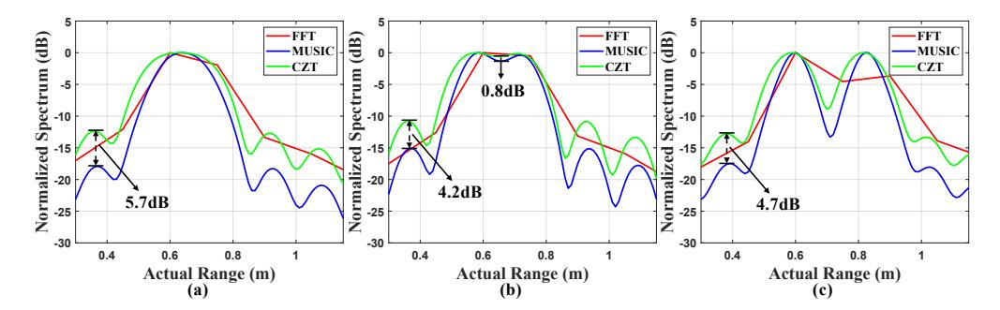

# **Photonics-assisted integrated sensing and communication with ranging resolution improvement by multiple signal classification**

**LANFENG PENG, 1 [M](https://orcid.org/0000-0001-5462-9283)INGZHU YIN, 1 D[ON](https://orcid.org/0000-0002-8771-8992)GDONG ZOU, 1 NAN YANG, 1 YAOQIANG XIAO, 2 AND FAN LI 1,3,\***

**Abstract:** The combination of orthogonal frequency-division multiplexing (OFDM) with photonics-assisted millimeter-wave (MMW) technology serves as an effective solution for realizing integrated sensing and communication (ISAC) systems. In this paper, we experimentally demonstrate a low-cost and simple photonics-assisted OFDM ISAC system using intensity modulation and envelope detection. Nonlinear distortion in the communication function of this ISAC system is compensated using decision feedback frequency domain Volterra nonlinear equalization (DF-FD-VNLE). Furthermore, the multiple signal classification (MUSIC) algorithm, implemented through subspace decomposition, is employed to enhance the low ranging resolution in radar function with limited waveform bandwidth. Experimental results indicate that the DF-FD-VNLE can achieve a 1.8 dB receiver sensitivity improvement at the hard-decision forward error correction (HD-FEC) threshold for the 4 Gbps OFDM signal over 1 m wireless transmission compared to linear equalization and 0.9 dB receiver sensitivity compared to conventional frequency domain Volterra nonlinear equalization (FD-VNLE). By utilizing the MUSIC algorithm, the radar performance is significantly improved compared to fast Fourier transform (FFT), resulting in an enhancement from 15 cm to 1 cm for single target detection and from 21 cm to 10 cm for dual target detection. Additionally, there is a significant improvement in PSLR by 18.6 dB.

© 2024 Optica Publishing Group under the terms of the [Optica Open Access Publishing Agreement](https://doi.org/10.1364/OA_License_v2#VOR-OA)

# **1. Introduction**

As a critical technology for novel applications such as Internet of Things (IoT) and smart transportation, integrated sensing and communication (ISAC) has attracted significant attention in both the academia and industry [\[1,](#page-10-0)[2\]](#page-10-1). The demand for high-speed communication and high-precision sensing in applications such as intelligent transportation is propelling systems towards wider bandwidth and higher carrier frequency [\[3](#page-10-2)[,4\]](#page-10-3). However, using traditional allelectronic approaches to generate millimeter-wave (MMW) or terahertz (THz) signals will inevitably encounter challenges such as high complexity and bandwidth limitation, which will increase the system costs significantly [\[5\]](#page-10-4). In contrast, the photonics-assisted system that utilizes optoelectronic conversion to generate wireless signal is becoming a preferable solution for implementing MMW ISAC. The photonics-assisted MMW ISAC offers numerous advantages, including a flat frequency response, wide optical system bandwidth and high controllability enabled by rapid carrier frequency tuning [\[6\]](#page-10-5). Figure [1](#page-1-0) illustrates the fusion of integrating photonics-assisted system with traditional wireless communication and intelligent transportation system, offering capabilities to the existing infrastructure. The optoelectronic conversion module

*1School of Electronics and Information Technology, Guangdong Provincial Key Laboratory of Opto-Electronic Information Processing Chips and Systems, Sun Yat-sen University, Guangzhou 510275, China*

*2College of Computer Science and Electronic Engineering, Hunan University, Changsha 410082, China 3Southern Marine Science and Engineering Guangdong Laboratory (Zhuhai), Zhuhai 519000, China*

*\* lifan39@mail.sysu.edu.cn*

can be installed in both the base station and the vehicle, linking up modules such as remote sensing, vehicle networks, and mobile communication networks.

**Fig. 1.** Fusion of photonics-assisted system and ISAC.

At present, the ISAC system is typically implemented utilizing the existing wireless infrastructure, facilitating hardware reuse [\[7\]](#page-10-6). Various multiplexing techniques, including time-division multiplexing (TDM) and frequency-division multiplexing (FDM) have been investigated in the ISAC system to improve allocating efficiency between radar and communication functions [\[8](#page-10-7)[–11\]](#page-10-8). In addition, electromagnetic polarization multiplexing has also been reported [\[12\]](#page-10-9). However, for the multiplexing schemes, the source utilized for radar ranging cannot be simultaneously employed for signal communication, thereby reducing the efficiency of signal communication.

Compared to the multiplexing schemes, the integrated waveform method achieves the simultaneous integration of radar and communication within a single waveform, offering a more efficient utilization of wireless resources. One method of integrated waveform design is realized by embedding the communication symbol into the conventional radar waveforms, such as the linear frequency modulation (LFM) waveforms. The generation of Amplitude Shift Keying (ASK)-LFM signals or Phase Shift Keying (PSK)-LFM signals have been reported in Refs. [\[13](#page-10-10)[–15\]](#page-10-11), achieved by embedding symbol intensity or phase into LFM waveforms. Another method for creating integrated waveform is realized by combining radar signal with communication signal, with spectrum-spreading phase coding serving as an example of this approach. By incorporating radar sequence spread codes into communication sequences to generate integrated waveforms, photonics-assisted ISAC systems have been realized, achieving a ranging resolution of 3.5 cm and a communication rate of 1 Gbps [\[16\]](#page-10-12). However, this method is susceptible to signal interference between the two functions, thereby constraining system performance. Conversely, employing a unified signal for ISAC implementation could be more favorable, with OFDM waveform emerging as a feasible solution. The OFDM waveform has gained prominence in 5 G and 6 G standards due to its exceptional reliability and efficiency in communication [\[17\]](#page-10-13). In addition to the advantages in communication, utilizing OFDM waveform for ISAC offers the benefit of seamlessly achieving dual functionality without compromise [\[18\]](#page-10-14). In practical applications, when using an IQ modulator to load complex OFDM signal, complicated digital signal processing techniques (DSPs) are required at the receiving end to mitigate system impairments such as frequency offset and phase noise, resulting in a significant increase in system costs. Utilizing intensity modulation to load signal and employing envelope detection to obtain baseband signal is a simpler and more cost-efficient scheme for the ISAC system [\[19\]](#page-10-15).

Although the photonics-assisted ISAC system based on OFDM has various advantages, there are still some challenges that need to be addressed. The ranging resolution in OFDM ISAC system

is inherently linked to the transmitted signal bandwidth when using fast Fourier transform (FFT) to generating ranging spectrum [\[20](#page-10-16)[–22\]](#page-10-17). Enhancing the signal bandwidth is considered as the most straightforward method to improve ranging resolution. However, the approach of expanding signal bandwidth for improved ranging resolution leads to a significant increase in system cost. Therefore, exploring high ranging resolution scheme under narrow signal bandwidth is crucial. Peak sidelobe ratio (PSLR) is another important metric for evaluating radar performance, which represents the signal-to-noise ratio performance of a radar receiver. The higher the PSLR, the stronger the target extraction ability of the sensing function, which can better distinguish between the target peak and the background noise from ranging spectrum, thereby improving the accuracy and reliability of target detection and tracking. In our previous research, Chirp-Z transform (CZT) is explored to replace FFT to generate and refine the spectrum, thereby enhancing the velocity resolution [\[23\]](#page-10-18). The utilization of CZT can enhance range resolution due to the similarity in processing schemes. However, CZT can only improve the spectrum resolution, without enhancing the PSLR of the spectrum. Apart from the ranging resolution, communication function performance is also essential for the photonics-assisted ISAC system. Nonlinearities in ISAC system, induced by modulation, amplifier, and detection, will seriously distort the performance of the transmitted wireless signal [\[24,](#page-10-19)[25\]](#page-10-20). At present, the Volterra nonlinear equalizer (VNLE) is recognized as an effective approach for addressing those nonlinear impairments and it has been widely employed in high-speed optical communication and fiber-wireless systems [\[26](#page-10-21)[–28\]](#page-10-22). The Time-domain Volterra nonlinear equalizer (TD-VNLE) is utilized to compensated the nonlinear distortion in a photonics-assisted Orthogonal Chirp Division Multiplexing (OCDM) ISAC [\[29\]](#page-10-23). Frequency-domain Volterra nonlinear equalizer (FD-VNLE) which compensates the nonlinear distortion of OFDM signal at subcarriers level leads to computational complexity reduction [\[30\]](#page-10-24). However, there are no studies to investigate the FD-VNLE in ISAC system to improve the performance of communication function.

In this paper, we experimentally demonstrated a low cost and simple photonics-assisted MMW OFDM ISAC system using intensity modulation and envelop detection. The incorporation of following advanced digital signal processing techniques into this system has been introduced for the purpose of enhancing either communication or radar sensing performance for the first time. Low complexity and high-performance DF-FD-VNLE is employed for communication function to compensate signal nonlinear distortion. As for radar function, MUSIC algorithm, realized by subspace decomposition, is introduced to address the issue of low ranging resolution in narrow bandwidth scenarios. Experimental results indicate that the DF-FD-VNLE can yield 1.8 dB and 0.9 dB receiver sensitivity improvement at the HD-FEC threshold for the 4 Gbps OFDM signal over 1 m wireless transmission compared to ISFA and conventional FD-VNLE respectively. Additionally, the utilization of the MUSIC algorithm significantly improves radar ranging resolution, improving the ranging resolution from 15 cm to 1 cm for single target detection and from 21 cm to 10 cm for dual target detection. Meanwhile, the PSLR is increased by 18.6 dB in single target detection by MUSIC algorithm.

# **2. Principle**

In this section, we will simply introduce the system architecture and principle of DSPs used in this paper, along with their corresponding mathematical models. In the following derivation, we will adopt a mathematical model for intensity modulation using a Mach-Zehnder modulator (MZM) operating in push-pull mode, rather than the typical small-signal model. Figure [2](#page-3-0) illustrates the basic structure of the ISAC system we used. Real OFDM signals are modulated onto an optical signal at frequency via an intensity modulator. Then the output signal is coupled with another optical signal at frequency *f*2 to obtain the following signal:

$$E(t) = \left[\cos(\frac{x(t)\pi}{V_{\pi}}) + \sin(\frac{x(t)\pi}{V_{\pi}})\right] \exp(j2\pi f_1 t) + \exp(j2\pi f_2 t), \tag{1}$$

where x(t) represents the OFDM signal and  $V_{\pi}$  represents the half wave voltage of MZM. After undergoing optoelectronic conversion, this signal generates a corresponding wireless signal at frequency  $f_c$ , which can be represented as:

$$x_{RF}(t) = \left[\cos(\frac{x(t)\pi}{V_{\pi}}) + \sin(\frac{x(t)\pi}{V_{\pi}})\right]\cos(2\pi f_c t),\tag{2}$$

where  $f_c = |f_1 - f_2|$  represents desired carrier frequency. Without considering signal attenuation and noise during transmission, the above signal, after envelope detection, is transformed into the following signal:

$$r(t) = 1 + 2\cos(\frac{x(t)\pi}{V_{\pi}})\sin(\frac{x(t)\pi}{V_{\pi}}) = 1 + \sin(\frac{2x(t)\pi}{V_{\pi}}).$$
(3)

**Fig. 2.** Principle and architecture illustrations of proposed photonics-aided MMW ISAC system; LD: Laser diode, ED: envelope detection; OC: optical coupler.

By observing Eq. (3), the signal obtained after envelope detection can be divided into two parts: the DC component and the signal related component. The DC component can be easily removed by subtracting the mean value of r(t), while the signal related component is represented by a sine function, containing the desired signal part and the nonlinear part. This equation implies that the larger the OFDM signal amplitude, the more severe the nonlinearity.

To mitigate the impact of nonlinearity caused by modulation, amplification, and detection, the DF-FD-VNLE is utilized, and its block diagram is depicted in Fig. 3. The subsequent section briefly outlines its process. The first step involves demodulation and equalization of the received OFDM signal. In this step, intra-symbol frequency-domain averaging (ISFA) is used to equalize the demodulated frequency-domain symbols with channel coefficients derived from training sequences. Subsequently, the demodulated symbols are remodulated into time-domain signals after symbol decision to estimate the nonlinear noise. In this paper, we employ a third-order nonlinear model in the frequency domain to describe the received symbols on the *p*th subcarrier in the *n*th OFDM symbol, as follows:

$$R(n,p) = H_1(p)X_1(n,p) + \sum_{k=0}^{\alpha-1} H_{2,k}(p)X_{2,k}(n,p) + H_3(p)X_3(n,p), \tag{4}$$

where  $\alpha$  represents the truncation factor which means the number of second order nonlinear terms.  $X_b(n,p)(b=1,2,3)$  is the bth order frequency domain transmitted symbol and  $H_b(p)$  is bth order frequency-domain coefficients of the pth subcarrier of the nonlinear channel. In this paper, the least squares (LS) algorithm is employed to estimate the taps of the nonlinear channel. By subtracting the nonlinear distortion from the received symbols and equalizing the symbols with a one-tap equalizer using linear channel coefficients, the transmitted symbols can be retrieved. The following equation provides the mathematical expression corresponding to this

equalization algorithm.

$$Y_{DF-FD-VNLE}(n,p) = \hat{H}_{1}^{-1}(p) \times \left[ R(n,p) - \sum_{k=0}^{\alpha-1} \hat{H}_{2,k}(p) \hat{X}_{2,k}(n,p) - \hat{H}_{3}(p) \hat{X}_{3}(n,p) \right]. \tag{5}$$

Fig. 3. Diagram of feedback frequency domain Volterra nonlinear Equalization.

We will now introduce radar processing in the remaining part of this section. For radar functionality, we define the received symbols at the radar receiving end as  $Y_{radar}(n, p)$ , which can be represented by the following equation:

$$Y_{radar}(n,p) = X(n,p) \exp(-j2\pi p\Delta f\tau), \tag{6}$$

where X(n,p) is the transmitted symbol,  $\Delta f$  represents the subcarriers spacing and  $\tau$  represents the delay. It can be observed that the received symbol can be expressed as the product of transmitted symbol and phase shift caused by delay. After communication information compensation, the vector carrying the delay information can be extracted, which we refer to as the radar transfer vector  $\mathbf{H}_{radar}$  and can be expressed as follows:

$$\mathbf{H}_{radar} = \text{vec}[\exp(-i2\pi p\Delta f\tau)]. \tag{7}$$

The objective of radar processing is to extract the desired delay information from the  $\mathbf{H}_{radar}$ . According to the Eq. (7), the ranging spectrum can be obtained by performing FFT on  $\mathbf{H}_{radar}$ . The subcarrier index corresponding to the spectrum peak can be converted into the target distance. The MUSIC algorithm is a parameter estimation algorithm based on subspace decomposition, which utilizes the orthogonality of the noise subspace and signal subspace to estimate parameters by generating spectrum and searching for peak values in the spectrum. The derivation and proof related to the MUSIC algorithm have been presented in some literature [31]. Here, we will specifically discuss the application of the MUSIC algorithm in this system.

Figure 4 illustrates the concepts related to the MUSIC algorithm. Our objective is to achieve a more precise estimation of the delay information within the radar transfer matrix using the MUSIC algorithm. To accomplish this, we need to calculate the covariance matrix of the radar

transfer matrix using the following equation:

$$\mathbf{R}_{HH} = \mathbf{H}_{radar} \mathbf{H}_{radar}^{H},\tag{8}$$

where  $\mathbf{H}_{radar}^{H}$  represents the conjugate transpose of the vector. By performing eigenvalue decomposition and sorting, the eigenvectors corresponding to eigenvalues are decomposed into signal subspace and signal subspace based on the magnitude of the eigenvalues, with the noise subspace denoted as  $\mathbf{E}_{n}$ . Subsequently, we construct the steering vector as follows:

$$\mathbf{a}(\hat{\tau}) = \text{vec}[\exp(-j2\pi\Delta f\hat{\tau})],\tag{9}$$

Fig. 4. Illustrations of Multiple Signal Classification algorithm

where  $\hat{\tau}$  is the delay value we need to estimate, and we can vary it within a given range according to the desired step size. Then, we calculate the corresponding spectrum using the following formula:

$$\mathbf{F} = \frac{1}{\mathbf{a}^H \mathbf{E}_n \mathbf{E}_n^H \mathbf{a}}.$$
 (10)

The denominator of this equation is the inner product of the steering vector and the noise subspace. When the estimated delay matches the actual delay, the steering vector belongs to the signal subspace, leading the above inner product to approach zero. At this point, a significant peak will appear on the spectrum. Conversely, when the estimated delay does not match the actual delay, the situation is the opposite.

## 3. Experiment and result

Figure 5 shows the experimental setup of the photonics-assisted MMW ISAC system using intensity modulation and envelope detection. Real OFDM signal is generated offline using MATLAB and then loaded into a 2.5GSa/s digital-to-analog converter (DAC) for analog signal generation. Subsequently, the generated analog signal is amplified by a power amplifier. An MZM (Fujitsu 7938) modulator with the optical source provided by the laser diode one (LD1) is

employed to realize the electrical-to-optical conversion of the OFDM signal. The optical source provided by the laser diode two (LD2) is served as local oscillator optical signal in heterodyne detection. To improve the signal quality, the optical signal provided by LD2 is adjusted to the same polarization state as LD1 through a polarization controller. Due to the experimental constraints of oscilloscope bandwidth and lack of envelope detector, we did not directly employ an envelope detector to achieve signal detection. As an alternative, the received signal is firstly shifted to an intermediate frequency through a mixer module, and then received by an oscilloscope for conversion into a digital signal. Subsequently, envelope detection is carried out in the digital domain. The envelope detection in the digital domain comprises two steps. Firstly, the analytical signal is obtained through Hilbert transformation, and subsequently, the baseband signal can be derived by squaring the magnitude of the analytical signal. After envelope detection, DSPs, including resampling, synchronization, equalization, and demodulation, are applied to retrieve the transmitted data. It is notably that the DF-FD-VNLE within the dashed box of DSP is an option.

**Fig. 5.** Experimental setup of proposed photonics-assisted ISAC system; DAC: digitalto-analog converter, LD: Laser diode, PD: Photodiode, MZM: Mach-Zehnder modulator, OC: optical couple, PC: polarization controller, VOA: variable optical attenuator, LO: local oscillator, OSC: oscilloscope.

Before the experimental results are discussed, parameter settings utilized in this experiment are provided. Two lasers are working at 193.10THz and 193.13THz respectively, resulting in a millimeter-wave carrier frequency of 30 GHz. The bandwidth of the OFDM signal is 1 GHz and each OFDM symbol contains 128 payload subcarriers. The duration of each symbol is 0.128 microseconds, with an 8 nanoseconds cyclic prefix. Notably, 16-QAM OFDM signal is transmitted in this experiment, resulting in a communication data rate of 4Gbps. The frequency of the local oscillator is set to 26 GHz and the center frequency of intermediate frequency signal is 4 GHz. The wireless transmission distance is 1 m.

The performance of DF-FD-VNLE for the communication function in ISAC system is firstly explored, and the results can be found in Fig. [6.](#page-7-0) To search for the optimal drive signal amplitude and study the influence of nonlinear distortions, the bit error rate (BER) of signal under different Voltage-peak-to-peak at the ROP of –2dBm are measured as shown in Fig. [6\(](#page-7-0)a). It is observed that the BER of signal with ISFA decrease as the drive signal amplitudes increase, while increase when the signal amplitudes are beyond 480 mV. The BER decreases as the drive signal amplitude

increases for FD-VNLE and DF-FD-VNLE signals, but it increases when the signal amplitude exceeds 520 mV. Consequently, for further experimental testing, drive signal amplitude of 480 mV is set for signal with ISFA and 520 mV is set for signal with FD-VNLE and DF-FD-VNLE. Additionally, it can also be observed that when the drive signal amplitude is small, the BER performance of the three equalization schemes exhibits a high degree of similarity. There is only a slight improvement in the DF-FD-VNLE compared to the other two schemes. However, the enhancement brought by the two nonlinear equalization schemes becomes more pronounced as the amplitude of the drive signal increases. Moreover, DF-FD-VNLE outperforms FD-VNLE in terms of BER performance. This result can be explained by the fact that a smaller drive signal amplitude keeps the signal in a linear portion of the sine function. As the drive signal amplitude increases, the impact of nonlinear distortion is enlarged, leading to a more significant degradation in the BER performance of the ISFA scheme compared to the DF-FD-VNLE scheme.

Fig. 6. (a) BER versus drive signal amplitude. (b) BER versus received optical power.

Under the optimal drive signal amplitude, we study the impact of received optical power (ROP) on communication performance. Generally, an increase in ROP will improve the signal-to-noise ratio of signal, thus improving the communication performance. Figure 6(b) presents the signal BER under different ROP. We can observe that as the ROP increases, the BER of signals with all three equalization schemes decrease accordingly. However, as the ROP exceeds -2 dBm, the BER starts to deteriorate with the increase of ROP. This behavior is attributed to the influence of the post-amplifier in the photodetector (PD), which introduces a non-linear response as the ROP is large. Furthermore, it can be observed that the DF-FD-VNLE can achieve a 1.8 dB receiver sensitivity improvement at the hard-decision forward error correction (HD-FEC) threshold compared to ISFA. The DF-FD-VNLE exhibits a 0.9 dB improvement in receiver sensitivity compared to the conventional FD-VNLE. The constellations corresponding to the three dashed boxes from top to bottom in Fig. 6(b) are presented in a sequential order, from left to right, in the insets of Fig. 6. The comparison of the constellation in the insets of Fig. 6 highlights the effectiveness of DF-FD-VNLE on nonlinear distortion compensation.

To demonstrate the radar system's performance, we conducted experiments in both single-target and multi-target scenarios. The results of the single-target experiment are presented in Fig. 7. In the single-target ranging experiment, we set a target distance ranging from 0.9 m to 1.1 m, with a step size of 0.01 m for each distance change. Figure 7(a) shows the curves of estimated target

distance versus actual target distance for all schemes. The estimated target distance curve using the FFT algorithm exhibits a stepwise pattern as the actual distance changes, indicating that only estimates at integer multiples of the distance resolution can be obtained, failing to accurately reflect the actual changes in distance. In contrast, the CZT and MUSIC algorithm both show linear relationship between the estimated target distance and the actual distance, providing a more accurate estimation of the actual distance changes. The Fig. 7(b) shows the estimated error of different algorithm. Among these algorithm, FFT algorithm has the poorest estimation accuracy. The mean errors of CZT and MUSIC are -0.0073 m and 0.0017 m respectively. Combined with the results of Fig. 7(a), both CZT and MUSIC exhibit comparable tracking capabilities for changes in target distance. However, due to the proximity of values near the peak value of CZT, there is a higher likelihood of errors occurring, resulting in slightly larger error compared to MUSIC. Besides, we also conducted an experiment to verify that the single target ranging resolution of the MUSIC algorithm is 1 cm. We set a target to vary from 0.99 m to 1.01 m in 0.001 m increments, and estimated its range. The curve of the estimated distance versus the actual distance is shown in inset of Fig. 7(a), and it also shows a step-like change, with each step separated by 1 cm. The single target ranging resolution of the FFT-based detection scheme is 0.15 m, while the MUSIC algorithm we implemented has a ranging resolution of 0.01 m.

**Fig. 7.** (a) Single target estimated range versus actual range. (b) Estimated error versus actual range.

Moreover, to further evaluate the ranging performance of different algorithms, the single target ranging normalized spectrum is illustrated in Fig. 8, where we can obtain the PSLR of different algorithms. It can be seen that the PSLR of CZT spectrum is 14.5 dB, while the PSLR of the MUSIC spectrum is 33.1 dB. There is a significant difference of 18.6 dB in the PSLR between the two algorithms, indicating that the MUSIC algorithm has better ranging performance.

Fig. 8. Single target normalized ranging spectrum under actual range of 1 m.

Similarly, we conducted experiments with two targets to validate the system's performance in multi-target ranging resolution. Multiple sets of targets of different relative range were selected for the experiment. Figure 9(a) shows the case where two targets are 9 cm apart, with only one peak in the spectra obtained by all methods. This indicates that when the relative range between the two targets is less than 9 cm, all algorithms are unable to distinguish two targets. In Fig. 9(b), the scenario of two targets being 10 cm apart is presented, where the peaks in the spectrum obtained by the FFT method still overlap, while the MUSIC algorithm and CZT algorithm show two peaks. When the relative distance between the two targets is greater than or equal to 10 cm, both CZT and MUSIC algorithm is capable of distinguishing between the two targets. However, there is 0.8 dB improvement in the trough between two algorithm, which makes the peaks of MUSIC spectrum more distinct. Figure 9(c) demonstrates the ability of the FFT method to distinguish two targets in the extreme case where the relative distance between the two targets is 21 cm. Under different relative range, MUSIC exhibited PSLR improvements of 5.7 dB, 4.2 dB, and 4.7 dB compared to CZT. The performance enhancement of the MUSIC algorithm on PSLR is less pronounced in scenarios with multiple targets due to the overlapping of different target spectrum. Nevertheless, this approach still enhances the SNR of the spectrum in a multi-target scenario.

**Fig. 9.** Multitargets normalized ranging spectrum under relative range of (a) 9 cm (b) 10 cm (c) 21cm

# 4. Conclusion

In this paper, we experimentally demonstrate a low cost and simple photonics-assisted MMW OFDM ISAC system, utilizing intensity modulation and envelope detection. We analyze the generation and impact of nonlinear distortion within the system and confirm the corresponding derivations through experimental results. By implementing DF-FD-VNLE, 1.8 dB receiver sensitivity improvement compared to linear equalization and 0.9 dB sensitivity compared to conventional FD-VNLE at the HD-FEC threshold can be found for 4 Gbps 16-QAM OFDM signal over 1 m wireless transmission. Meanwhile, a sensing resolution of 1 cm for the single target and 10 cm for the multi-targets are achieved assisted with the MUSIC algorithm. Due to its simple and excellent performance, the proposed photonics-assisted MMW ISAC system can be regarded as a promising candidate for future 6 G communications.

**Funding.** National Key Research and Development Program of China (2023YFB2906000); National Natural Science Foundation of China (62271517, U2001601, 62035018); Guangdong Basic and Applied Basic Research Foundation (2023B1515020003); State Key Laboratory of Advanced Optical Communication Systems and Networks of China (2024GZKF19).

**Disclosures.** The authors declare no conflicts of interest.

**Data availability.** Data underlying the results presented in this paper are not publicly available at this time but may be obtained from the authors upon reasonable request.

# **References**

- 1. Y. Cui, F. Liu, X. Jing, *et al.*, "Integrating Sensing and Communications for Ubiquitous IoT: Applications, Trends, and Challenges," [IEEE Network](https://doi.org/10.1109/MNET.010.2100152) **35**(5), 158–167 (2021).
- 2. F. Liu, Y. Cui, C. Masouros, *et al.*, "Integrated Sensing and Communications: Toward Dual-Functional Wireless Networks for 6 G and Beyond," [IEEE J. Select. Areas Commun.](https://doi.org/10.1109/JSAC.2022.3156632) **40**(6), 1728–1767 (2022).
- 3. X. Cheng, D. Duan, S. Gao, *et al.*, "Integrated Sensing and Communications (ISAC) for Vehicular Communication Networks (VCN)," [IEEE Internet Things J.](https://doi.org/10.1109/JIOT.2022.3191386) **9**(23), 23441–23451 (2022).
- 4. T. Mao, J. Chen, Q. Wang, *et al.*, "Waveform Design for Joint Sensing and Communications in Millimeter-Wave and Low Terahertz Bands," [IEEE Trans. Commun.](https://doi.org/10.1109/TCOMM.2022.3196685) **70**(10), 7023–7039 (2022).
- 5. Z. Chen, C. Han, Y. Wu, *et al.*, "Terahertz Wireless Communications for 2030 and Beyond: A Cutting-Edge Frontier," [IEEE Commun. Mag.](https://doi.org/10.1109/MCOM.011.2100195) **59**(11), 66–72 (2021).
- 6. Y. Wang, J. Liu, J. Ding, *et al.*, "Joint communication and radar sensing functions system based on photonics at the W-band," [Opt. Express](https://doi.org/10.1364/OE.449153) **30**(8), 13404–13415 (2022).
- 7. J. Yu, Y. Wang, J. Ding, *et al.*, "Broadband Photon-Assisted Terahertz Communication and Sensing," [J. Lightwave](https://doi.org/10.1109/JLT.2023.3252821) [Technol.](https://doi.org/10.1109/JLT.2023.3252821) **41**(11), 3332–3349 (2023).
- 8. Y. Wang, Z. Dong, J. Ding, *et al.*, "Photonics-assisted joint high-speed communication and high-resolution radar detection system," [Opt. Lett.](https://doi.org/10.1364/OL.444252) **46**(24), 6103–6106 (2021).
- 9. Y. Wang, W. Li, J. Ding, *et al.*, "Integrated High-Resolution Radar and Long-Distance Communication Based-on Photonic in Terahertz Band," [J. Lightwave Technol.](https://doi.org/10.1109/JLT.2022.3143849) **40**(9), 2731–2738 (2022).
- 10. N. Zhong, P. Li, W. Bai, *et al.*, "Spectral-Efficient Frequency-Division Photonic Millimeter-Wave Integrated Sensing and Communication System Using Improved Sparse LFM Sub-Bands Fusion," [J. Lightwave Technol.](https://doi.org/10.1109/JLT.2023.3265799) **41**(23), 7105–7114 (2023).
- 11. B. Dong, J. Jia, G. Li, *et al.*, "W-band Photonic-based Integration of Sensing and Communication with Frequencydivision Multiplexed Waveforms in Fiber-wireless Integrated Network," in *2022 Asia Communications and Photonics Conference (ACP)* (2022), pp. 1806–1810.
- 12. M. Lei, M. Zhu, Y. Cai, *et al.*, "Integration of Sensing and Communication in a W-Band Fiber-Wireless Link Enabled by Electromagnetic Polarization Multiplexing," [J. Lightwave Technol.](https://doi.org/10.1109/JLT.2023.3280388) **41**(23), 7128–7138 (2023).
- 13. H. Nie, F. Zhang, Y. Yang, *et al.*, "Photonics-based integrated communication and radar system," in *2019 International Topical Meeting on Microwave Photonics (MWP)* (2019), pp. 1–4.
- 14. Z. Lyu, L. Zhang, H. Zhang, *et al.*, "Radar-Centric Photonic Terahertz Integrated Sensing and Communication System Based on LFM-PSK Waveform," [IEEE Trans. Microwave Theory Techn.](https://doi.org/10.1109/TMTT.2023.3267546) **71**(11), 5019–5027 (2023).
- 15. S. Wang, D. Liang, and Y. Chen, "Photonics-assisted joint communication-radar system based on a QPSK-sliced linearly frequency-modulated signal," [Appl. Opt.](https://doi.org/10.1364/AO.456287) **61**(16), 4752–4760 (2022).
- 16. W. Bai, X. Zou, P. Li, *et al.*, "Photonic Millimeter-Wave Joint Radar Communication System Using Spectrum-Spreading Phase-Coding," [IEEE Trans. Microwave Theory Techn.](https://doi.org/10.1109/TMTT.2021.3138069) **70**(3), 1552–1561 (2022).
- 17. S. D. Liyanaarachchi, T. Riihonen, C. B. Barneto, *et al.*, "Optimized Waveforms for 5G–6 G Communication With Sensing: Theory, Simulations and Experiments," [IEEE Trans. Wireless Commun.](https://doi.org/10.1109/TWC.2021.3091806) **20**(12), 8301–8315 (2021).
- 18. C. Sturm and W. Wiesbeck, "Waveform Design and Signal Processing Aspects for Fusion of Wireless Communications and Radar Sensing," [Proc. IEEE](https://doi.org/10.1109/JPROC.2011.2131110) **99**(7), 1236–1259 (2011).
- 19. R. Song and J. He, "OFDM-NOMA combined with LFM signal for W-band communication and radar detection simultaneously," [Opt. Lett.](https://doi.org/10.1364/OL.460188) **47**(11), 2931–2934 (2022).
- 20. L. Huang, R. Li, S. Liu, *et al.*, "Centralized Fiber-Distributed Data Communication and Sensing Convergence System Based on Microwave Photonics," [J. Lightwave Technol.](https://doi.org/10.1109/JLT.2019.2935903) **37**(21), 5406–5416 (2019).
- 21. Z. Xue, S. Li, X. Xue, *et al.*, "Tunable K/W-band OFDM integrated radar and communication system based on optoelectronic oscillator for intelligent transportation," [Opt. Express](https://doi.org/10.1364/OE.465197) **30**(20), 35270–35281 (2022).
- 22. Z. Xue, S. Li, J. Li, *et al.*, "OFDM Radar and Communication Joint System Using Opto-Electronic Oscillator With Phase Noise Degradation Analysis and Mitigation," [J. Lightwave Technol.](https://doi.org/10.1109/JLT.2022.3156573) **40**(13), 4101–4109 (2022).
- 23. L. Peng, D. Luo, Y. Xiao, *et al.*, "A Photonics-aided MMW OFDM Joint Radar and Communication System with Velocity Accuracy Improvement," in *2023 IEEE Applied Sensing Conference (APSCON)* (2023), pp. 1–3.
- 24. L. Tao, J. Yu, J. Zhang, *et al.*, "Reduction of Intercarrier Interference Based on Window Shaping in OFDM RoF Systems," [IEEE Photon. Technol. Lett.](https://doi.org/10.1109/LPT.2013.2252335) **25**(9), 851–854 (2013).
- 25. P. Li, L. Zhu, X. Zou, *et al.*, "Constant-Envelope OFDM for Power-Efficient and Nonlinearity-Tolerant Heterodyne MMW-RoF System With Envelope Detection," [J. Lightwave Technol.](https://doi.org/10.1109/JLT.2022.3199439) **40**(20), 6882–6890 (2022).
- 26. C. Kottke, C. Caspar, V. Jungnickel, *et al.*, "High speed 160 Gb/s DMT VCSEL transmission using pre-equalization," in *2017 Optical Fiber Communications Conference and Exhibition (OFC)* (2017), pp. 1–3.
- 27. L. Chen, J. Xiao, and J. Yu, "Application of Volterra Nonlinear Compensation in 75-GHz mm-Wave Fiber-Wireless System," [IEEE Photonics J.](https://doi.org/10.1109/JPHOT.2016.2645400) **9**(1), 1–7 (2017).
- 28. J. Zhang, C. Guo, J. Liu, *et al.*, "Low Complexity Frequency-Domain Nonlinear Equalization for 40-Gb/s/wavelength Long-Reach PON," in *2018 Optical Fiber Communications Conference and Exposition (OFC)* (2018), pp. 1–3.
- 29. L. Li, L. Zhang, H. Zhang, *et al.*, "THz-Over-Fiber System With Orthogonal Chirp Division Multiplexing for Integrated Sensing and Communication," [J. Lightwave Technol.](https://doi.org/10.1109/JLT.2023.3311645) **42**(1), 176–183 (2024).
- 30. J. Zhang, C. Guo, J. Liu, *et al.*, "Decision-Feedback Frequency-Domain Volterra Nonlinear Equalizer for IM/DD OFDM Long-Reach PON," [J. Lightwave Technol.](https://doi.org/10.1109/JLT.2019.2915329) **37**(13), 3333–3342 (2019).
- 31. G. H. Golub and C. F. V. Loan, *Matrix Computations* (Johns Hopkins University, 2013).