*Article*

# **Development of an Integrated Communication and Sensing System Using Spread Spectrum and Photonics Technologies**

**Abdulrahman K. [Alza](https://orcid.org/0000-0001-9526-8517)mil † [,](https://orcid.org/0009-0005-1733-8280) Mahmoud A. S[har](https://orcid.org/0000-0003-4157-9277)awy † [,](https://orcid.org/0009-0003-0358-8663) Esam M. Almohimmah [\\*](https://orcid.org/0000-0001-5367-0188) , Amr M. Ragheb [,](https://orcid.org/0000-0002-4449-0182) Ahmed Almaiman and Saleh A. Alshebeili**

> Electrical Engineering Department, King Saud University, Riyadh 11421, Saudi Arabia; 441102467@student.ksu.edu.sa (A.K.A.); 441106006@student.ksu.edu.sa (M.A.S.); aragheb@ksu.edu.sa (A.M.R.); ahalmaiman@ksu.edu.sa (A.A.); dsaleh@ksu.edu.sa (S.A.A.)

- **\*** Correspondence: ealmohimmah@ksu.edu.sa
- † These authors contributed equally to this work.

**Abstract:** In the ever-evolving landscape of modern technology, integrating communication and sensing systems has become increasingly essential for a wide range of applications, from military and defense to autonomous vehicles and beyond. The integration offers a convergence of capabilities that enhances operational efficiency and provides adaptability in complex environments. In this paper, we develop, in simulation and experiment, an integrated communication and sensing system, exploring the cutting-edge utilization of spread spectrum and radio-over-fiber (RoF) photonic technologies. RoF technology inherits the benefits of optical fibers, which include low attenuation and longer reach distance compared to other media. First, we consider the integration of communication and sensing functions using a spread spectrum–binary phase-shift keying waveform. In this integrated system, the sensing function is performed using a radar system. The performance of the proposed system is evaluated in terms of the peak-to-sidelobe ratio of the radar correlator output and the bit error rate for the communication system. The results are obtained through extensive MATLAB simulations. Next, we consider the realization of the proposed integrated communication and sensing system using photonics technology. This phase commences with the utilization of specialized photonics-based software for extensive simulations at different fiber lengths, which is an essential foundational step toward the practical implementation of the proposed system using photonics. Lab experiments are also presented to validate the simulation results.

**Keywords:** integrated sensing and communication (ISAC); joint radar and communication (JRC); spread spectrum; radar; photonics

**Citation:** Alzamil, A.K.; Sharawy, M.A.; Almohimmah, E.M.; Ragheb, A.M.; Almaiman, A.; Alshebeili, S.A. Development of an Integrated Communication and Sensing System Using Spread Spectrum and Photonics Technologies. *Photonics* **2024**, *11*, 861. [https://doi.org/10.3390/](https://doi.org/10.3390/photonics11090861) [photonics11090861](https://doi.org/10.3390/photonics11090861)

Received: 14 August 2024 Revised: 5 September 2024 Accepted: 10 September 2024 Published: 12 September 2024

**Copyright:** © 2024 by the authors. Licensee MDPI, Basel, Switzerland. This article is an open access article distributed under the terms and conditions of the Creative Commons Attribution (CC BY) license [\(https://](https://creativecommons.org/licenses/by/4.0/) [creativecommons.org/licenses/by/](https://creativecommons.org/licenses/by/4.0/) 4.0/).

# **1. Introduction**

# *1.1. Preliminaries*

In the realm of modern technology, radar and communication stand as two pivotal pillars of innovation and progress. Radar, a sophisticated system rooted in electromagnetic waves, plays a crucial role in detecting, tracking, and identifying objects in our physical environment. Whether it is guiding aircraft safely through the skies, enabling weather forecasting, or aiding in military operations, radar's multifaceted applications have revolutionized various industries [\[1\]](#page-15-0). On the other hand, communication, the art of transmitting information, has undergone a remarkable transformation in recent years. From the advent of the internet to the widespread adoption of smartphones, the evolution of communication methods has significantly impacted how we interact, collaborate, and share information on a global scale [\[2\]](#page-15-1).

Communication and radar systems share some common principles while exhibiting distinct differences. Both systems involve transmitting and receiving signals, relying on electromagnetic waves. They employ transmitters to send out signals and receivers to *Photonics* **2024**, *11*, 861 2 of 17

capture and process them. However, the primary purpose of a communication system is to convey information or data from a sender to a specific recipient. In contrast, the primary purpose of radars is to detect and track objects, such as aircraft, ships, or weather patterns. Radar systems emit signals and measure the time it takes for the signals to bounce back, enabling the determination of an object's location, speed, and direction. In contrast, communication systems focus on delivering a message or information reliably, often with error correction mechanisms in place.

Despite their distinct core objectives, communication and radar systems have the potential for a shared architecture. This unique commonality lies in the design of their transmitters, which can be configured to generate a single signal capable of serving both communication and radar purposes. This dual-function capability underscores the versatility and efficiency achieved through a well-designed transmitter, offering the potential for applications that seamlessly integrate communication and radar functionalities within the same system.

As technology advances, the radio frequency front-end architectures of radar and wireless communication systems increasingly resemble each other [\[3](#page-16-0)[,4\]](#page-16-1). This structural similarity allows communication systems to benefit from the advanced hardware of radar systems and vice versa. This paper proposes an ISAC system based on direct sequence spread spectrum (DSSS) technology. Integrating communication and sensing in DSSSbased systems primarily enhances spectral efficiency, improves sensing accuracy and communication reliability, and reduces hardware complexity [\[5\]](#page-16-2). These gains can be summarized as follows:

- By using the same DSSS signal for both communication and sensing, the system can achieve better spectral efficiency. This integration avoids the need for separate frequency bands for communication and radar sensing, leading to more effective use of the available spectrum.
- Since both communication and sensing functions use the same transceiver hardware, there is a reduction in hardware complexity and cost. The shared use of DSSS signals simplifies the design, leading to a more compact and energy-efficient system.
- DSSS has inherent properties that enhance both communication and sensing performance. For communication, the spreading gain of DSSS improves the signal-to-noise ratio (SNR) and provides robustness against jamming and interference, which is advantageous for reliable communication. Meanwhile, the same spreading gain can enhance the resolution and accuracy in sensing tasks using radars.

In any event, to realize an ISAC system, several hypotheses or assumptions are typically required. These include (1) the assumption that communication and sensing can efficiently share spectrum, power, and hardware resources without significantly degrading the performance of either function; (2) the existence of advanced signal processing algorithms that can separate and optimize the dual-purpose signals for both communication and sensing; (3) the ISAC system can operate within the confines of existing communication standards and regulatory requirements for both communication and sensing functions. These hypotheses form the foundational assumptions that must hold true, or be engineered to hold, for a successful realization and operation of an ISAC system.

# *1.2. Related Work*

In recent years, there has been increasing interest in developing ISAC systems, also known as joint radar and communication (JRC) systems. For instance, the study in [\[6\]](#page-16-3) provides a survey of ISAC systems, emphasizing their potential to address spectrum scarcity and mitigate interference in wireless communications by integrating radar and communication functionalities. The study in [\[7\]](#page-16-4) introduces a channel modeling approach for a heterogeneous vehicular ISAC system, where a multi-antenna base station communicates with a multi-antenna vehicular receiver while simultaneously sensing the environment. This study derives time-varying complex channel impulse responses for both sensing and communication channels, highlighting their correlation through shared clusters. Furthermore, *Photonics* **2024**, *11*, 861 3 of 17

the study in [\[8\]](#page-16-5) discusses beamforming design for dual-functional radar-communication systems within 6G networks, focusing on scenarios involving imperfect channel state information. The authors propose an optimization framework to maximize radar output power while ensuring communication quality under probabilistic outage constraints. The study in [\[9\]](#page-16-6) explores the innovative concept of non-orthogonal multiple access (NOMA) in aiding joint radar and multicast–unicast communication systems. This work proposes a framework where an MIMO dual-functional radar-communication base station utilizes the same spectrum to detect radar-centric users while transmitting mixed multicast–unicast messages to both R-users and communication-centric users.

Current joint radar and communication systems may be classified into the following three categories [\[4,](#page-16-1)[5,](#page-16-2)[10\]](#page-16-7):

- Communications centric design. In this class, radar sensing is an add-on to a communication system, where the design priority is on communications. Such a design exploits communication waveform to extract radar information through target echoes.
- Radar-centric design. Conversely, such an approach aims at modulating or introducing information signaling in known radar waveforms.
- Joint design and optimization. This class encompasses systems jointly designed from the start to offer a tunable trade-off between radar and communication performance. The main challenge in JRC development lies in finding suitable waveforms that can be simultaneously employed for information transmission and radar sensing [\[5\]](#page-16-2).

The initial step in implementing ISAC systems involves identifying waveforms suitable for both wireless communications and radar applications. Waveform selection must align with radar requirements, particularly in terms of object range, velocity, and angle determination. Crucial criteria for all three aspects include dynamic range and resolution for effective object detection and separation, as well as robustness against interference and noise, especially in congested spectrum scenarios [\[4\]](#page-16-1). Presently, waveforms like FMCW (frequency-modulated continuous wave), pulsed FM, and other waveforms are being utilized for different radar applications [\[10\]](#page-16-7).

For the communication function, the most critical parameters are data rate and bit error rate (BER). Like radar, the chosen waveform should be resilient to interference, noise, and multipath-induced distortion. Spread spectrum techniques, such as DSSS, enhance robustness by providing a processing gain at the receiver and reducing the power spectral density [\[2\]](#page-15-1). DSSS can be chosen as a basis for ISAC design due to two main characteristics: large bandwidth and pseudorandomness. These characteristics provide several advantages over traditional signals [\[11\]](#page-16-8). Specifically, (1) for radars, DSSS pseudorandom *m*-sequences are employed for discrete phase modulation, generating noise-like transmit signals with robust autocorrelation characteristics [\[12\]](#page-16-9). (2) DSSS signals effectively suppress harmful interferences caused by jamming, simultaneous users sharing the same communication channel, and self-interference due to multipath fading. This interference suppression is achieved by incorporating a randomness pattern into each transmitted waveform known only to the intended receiver. The random pattern serves as the key for establishing communication between the receiver and its corresponding transmitter. (3) Another advantage of spread spectrum signals is their ability to prevent signal eavesdropping. By hiding the signal within the system's background noise through pattern coding, DSSS signals can be transmitted at a low average power across a wide bandwidth. This property results in signals with a low probability of interception (LPI), making them highly recommended for modern radar applications. (4) Additionally, DSSS signals ensure signal privacy by assigning a different pseudorandom pattern to each transmitted signal. Only the intended receiver, with prior knowledge of the specific pattern key used by the transmitter, can successfully demodulate the coded signal. In summary, DSSS signals have robust autocorrelation characteristics, can overcome transmission interference, enhance information security, and provide advantages such as interference suppression, signal hiding within background noise, and signal privacy through the use of pseudorandom patterns. These

*Photonics* **2024**, *11*, 861 4 of 17

characteristics make spread spectrum signals particularly valuable in various applications, including radar systems.

This paper presents an ISAC implementation based on single-carrier signals, which includes coding the transmit signal with pseudorandom sequences, much like spread spectrum communications and m-sequence radar. ISAC implementations based on spread spectrum signals have been reported earlier in the literature [\[13–](#page-16-10)[19\]](#page-16-11). These approaches fall under the category of communication-centric designs. Implementing such techniques involves using high spreading factors to impart favorable autocorrelation properties to the signal due to the good autocorrelation properties of the spreading code.

On the other hand, microwave photonics technology, known for its high operating frequency, broad instantaneous bandwidth, and strong immunity to electromagnetic interference, has been widely applied in radar imaging and wireless communication. Recently, there has been growing interest in using microwave photonics to implement ISAC systems, offering solutions for high-range resolution radar detection and relatively high-capacity communication [\[20–](#page-16-12)[23\]](#page-16-13). Photonics and optical fibers enable long-distance transmission, making them ideal for applications such as border protection, securing restricted areas, or linking a central unit with a remote unit over vast distances. Radio-over-fiber (RoF) technology also simplifies the overall system, enhancing efficiency and cost-effectiveness.

### *1.3. Paper's Contribution*

Among the proposed approaches, a novel millimeter-wave (mm-Wave) ISAC system based on photonics technology and spectrum spreading phase-coding has been explored in [\[10\]](#page-16-7). The work in this paper aligns with that study, and the added contribution to the scientific field in comparison to other existing approaches is elaborated as follows.

- 1. We propose the use of DSSS for integrating radar and communication systems. Leveraging photonics-based technology, our system demonstrates significant advantages over 16 previously reported schemes, offering superior performance compared to alternative ISAC methods; see Table II in [\[10\]](#page-16-7).
- 2. The system architecture we propose is simplified compared to the prior work, making it more suitable for practical applications. Specifically, our system reduces the number of components, such as by avoiding the use of optical filters.
- 3. Additionally, the proposed system in this paper is also fundamentally different from other reported works in that it considers transmission over an RoF channel. This technology directly modulates light with an RF signal and transmits it over optical fibers. Typically, an RoF system comprises a central unit (CU), optical fibers, and remote antenna units (RAUs). The CU serves as a hub for system resources, facilitating resource sharing among multiple RAUs, thereby simplifying network architecture. In addition, RoF technology inherits the benefits of optical fibers, which include low attenuation and longer reach distance compared to other media.

The work in this paper is divided into three distinct parts. The first part involves simulating our ISAC concept using MATLAB to produce results under various scenarios. The second part will utilize VPI Photonics Transmission Makter 11.4, a specialized software tool for designing and simulating optical transmission systems and their components [\[24\]](#page-16-14) to simulate the proposed ISAC system. The third and final part will involve experimentally testing our simulation and design in the laboratory. In particular, our research work will consider (i) the use of one waveform to perform both sensing and communication, (ii) the use of spread spectrum and binary phase-shift modulation to generate the system waveform, as in [\[10\]](#page-16-7), (iii) and the use of photonics technology to simulate and implement the proposed system over the RoF channel.

This research is intended to develop an ISAC system to achieve a data rate of 50 Mbps, a radar maximum unambiguous range of 1200 m, and a radar range resolution of less than 0.5 m. A scenario ideally suited for this application is the detection of slow-moving ground targets, including vehicles, pedestrians, or wildlife, attempting to breach borders or

*Photonics* **2024**, *11*, 861 5 of 17

access protected areas and simultaneously promptly sending warning messages to security personnel, ensuring a swift response to potential threats.

#### *1.4. Paper's Organization*

The structure of the paper is outlined as follows: Section [2](#page-4-0) presents the proposed ISAC system model, exploring the core concept with introductory insights into direct sequence spread spectrum technology. Section [3.1](#page-6-0) evaluates the ISAC system performance through BER for the communication system and peak-to-sidelobe (PSL) ratio of the radar correlator output. Section [3.2](#page-10-0) includes the system model using the photonics technology and presents results obtained using specialized photonics-based software and lab experiments. Section [4](#page-15-2) concludes with final remarks.

#### **2. Proposed ISAC System**

#### *2.1. Concept*

In contemporary technological advancements, the radio frequency front-end architectures in radar and wireless communication technologies are progressively converging. Numerous functions traditionally implemented through hardware components are now transitioning to digital signal processing. Simultaneously, the carrier frequencies utilized in communication systems have shifted into the microwave spectrum, aligning with those historically associated with radar applications. This alignment has paved the way for the seamless integration of both communications and radar functionalities on a shared radio-frequency hardware platform, made easily achievable with today's technology. This innovative platform holds the potential for new system concepts and applications, allowing communication and sensing to operate concurrently, ensuring continuous access to their functions, and partially mitigating the constraints of limited spectral resources.

Figure [1](#page-4-1) depicts the core concept of the proposed ISAC system. The transmitter serves a dual purpose by generating a DSSS signal that fulfills both sensing and communication objectives. To achieve this, a pseudorandom (PN) code comprising *L* bits is generated and subsequently modulated with each incoming information bit. An *N*-bit information sequence is transmitted to establish a single coherent processing interval (CPI) for radar signal processing.

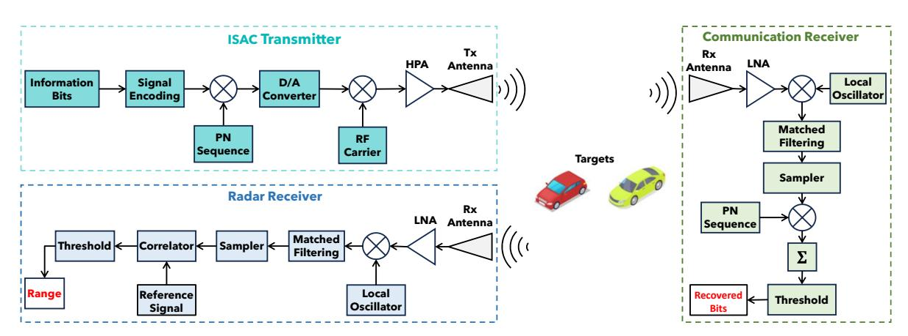

**Figure 1.** Model of the proposed ISAC system.

Upon reception at the communication side, the transmitted signal undergoes matched filtering (MF) and sampling. The sampled signal is then processed using thresholding after performing the despreading and sum operation. The despreading is performed using the same PN code employed at the transmitter.

Concurrently, the radar antenna captures the reflected signal resulting from the presence of an object within its detection range. This signal is subsequently directed to the radar signal processor, which is responsible for determining the range of the target object. The process of analyzing the received signals will involve the utilization of signal

*Photonics* **2024**, *11*, 861 6 of 17

processing techniques, enabling a comprehensive evaluation of the data acquired by the ISAC system.

#### *2.2. Spread Spectrum Signal*

Figure [2](#page-5-0) shows an example of a DSSS signal, where a binary phase-shift keying (BPSK) signal is transmitted at a data rate of *Rb* , with a bit duration of *Tb* = 1/*Rb* . The channel bandwidth is assumed to be *W* Hz. To spread the signal across the entire bandwidth, a pattern generator is used to produce a PN sequence at a rate of *W* pulses/s (chips/s), where *Tc* represents the pulse duration or chip interval. This modulation can be achieved using modulo-2 addition or multiplication operations [\[11\]](#page-16-8). The number of chips (*Nc*) per information bit is determined by the ratio of *Tb* to *Tc* (*Nc* = *Tb*/*Tc*). The time-domain representation of the BPSK signal, PN sequence, and the spread spectrum signal is shown in Figure [2](#page-5-0) for *Tb* = 6*Tc*, or in other words, six chips within a single bit.

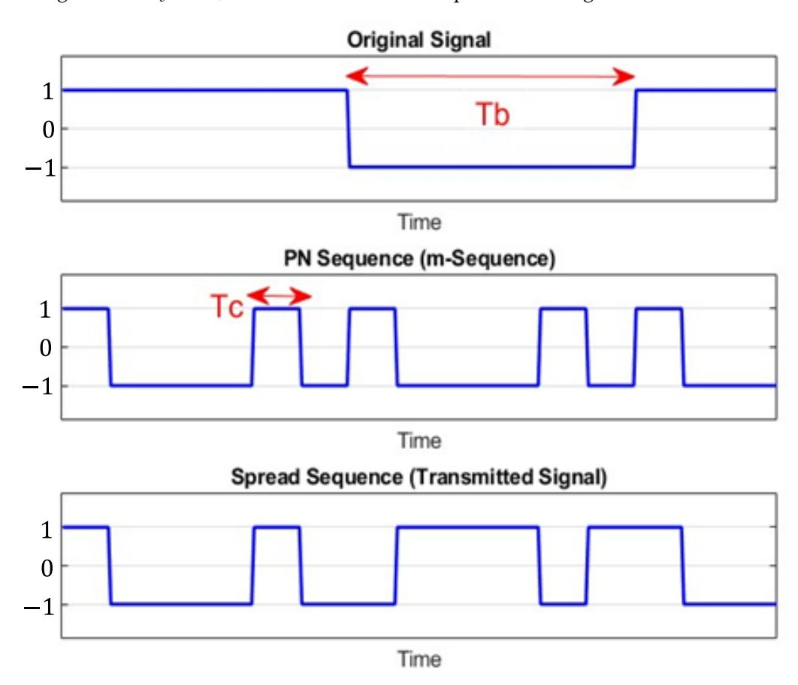

**Figure 2.** Information data, PN sequence, and the resulting DSSS signal.

On the other side, the DSSS receiver can be implemented using either matched filtering (MF) or correlator techniques. In the case of a matched filter-based receiver, as shown in Figure [3,](#page-6-1) the receiver's matched filter output samples are multiplied by the same PN sequence used in the transmitter. The resulting values are then summed together to recover the original transmitted bits. It is important to note that accurate time synchronization is necessary between the PN sequence generated at the receiver and the PN sequence of the incoming signal to ensure proper operation.

*Photonics* **2024**, *11*, 861 7 of 17

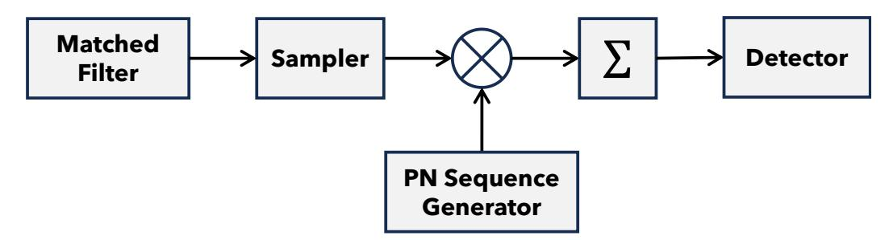

**Figure 3.** Block diagram of MF-based DSSS spread spectrum receiver.

A common method for generating maximal-length PN sequences is utilizing a *q*-stage shift register with linear feedback employing a modulo-2 adder, as depicted in Figure [4.](#page-6-2) The resulting sequence has a length of *L* = 2 *q* − 1 bits. The characteristics of the maximallength sequence are determined by the logic feedback connection described by a generator polynomial over a binary field, the initial states of the shift register, and its length *q*. The PN sequence exhibits periodicity with a period of *L*. The maximum period achievable by a PN sequence produced by a *q*-length shift register is 2 *q* − 1. When the period reaches this maximum length, the PN sequence is referred to as a maximal-length sequence, wherein the number of ones exceeds the number of zeros by one.

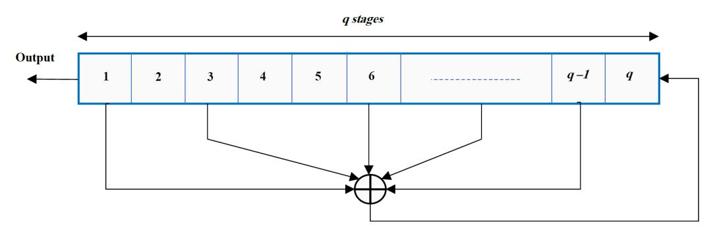

**Figure 4.** *q*-stage shift registers with linear feedback.

The periodic autocorrelation function of a maximal-length sequence is given by [\[14\]](#page-16-15):

$$R(j) = \begin{cases} L, & \text{for } j = 0\\ -1, & \text{for } 1 \le j \le q - 1 \end{cases}$$
 (1)

This indicates that the ratio of the off-peak values *R*(*j*) to the peak value *R*(0) (i.e., *R*(*j*)/*R*(0) = −1/*L*) is small when *L* is large. Consequently, the maximal-length sequences are nearly ideal in terms of their autocorrelation function, but they exhibit relatively large cross-correlation peaks when compared to any two other maximal-length sequences.

### **3. Performance Evaluations**

In this section, we evaluate the performance of the proposed communication and sensing system using a PN code that can be generated, as described in Section [2.2.](#page-5-1) First, the performance of the proposed ISAC system is investigated in an additive white Gaussian noise (AWGN) channel (no fiber). Then, the ISAC system performance is evaluated with a fiber channel. For that purpose, the system model is implemented using photonics technology, and the evaluation is conducted using VPIphotonics 11.4 software and lab experiments.

### *3.1. Fiberless Channel*

Let us consider a scenario where we aim to transmit data at a speed of 50 Mbits/s, which corresponds to a bit duration of 20 ns. Our task is to identify an appropriate random sequence for modulating these data. In the sequel, we consider a standard PN sequence with seven chips per bit. This sequence can be generated using the diagram shown in

*Photonics* **2024**, *11*, 861 8 of 17

Figure [4](#page-6-2) with three shift registers (flip flops). In the simulation, the code-generating polynomial 1 + *X* + *X* 3 is considered.

To produce seven chips for each bit, expanding the signal by a factor of 7, each chip should occupy one-seventh of the total bit duration. Therefore, the chip duration would be 2.86 ns for a bit duration of 20 ns. The final step in creating the communication waveform involves multiplying the intended transmission data by the PN sequence. This process generates the spread signal waveform. In practice, the resulting DSSS signal is often scrambled before transmission [\[10\]](#page-16-7).

#### 3.1.1. Communication System

By employing the spread signal technique using a PN sequence with a chip duration of 2.86 ns, the overall performance of the communication system is evaluated using the BER metric at different values of *Eb*/*N*0, where *Eb* is the bit energy and *N*0 is the noise one-sided power spectral density. For binary BPSK, the BER is given by [\[2\]](#page-15-1):

$$BER = Q(\sqrt{2E_b/N_0}) \tag{2}$$

where *Q*(·) is the *Q*-function. Figure [5](#page-7-0) shows the estimated and theoretical BER values, which are found to be remarkably close, indicating their considerable similarity. The estimated BER results are obtained from a Monte Carlo simulation utilizing the transmission of 1,000,000 information bits. The results presented in Figure [5](#page-7-0) highlight the effectiveness of the spread signal technique, utilizing a seven-chip PN sequence, regarding the reliability of performing signaling over AWGN channels.

Figure [6](#page-8-0) shows the results of transmitting a 'Clock' image over an AWGN channel at *Eb*/*N*0 = −20, −10, and 0 dB. Notably, as *Eb*/*N*0 increases, the quality of the received image improves.

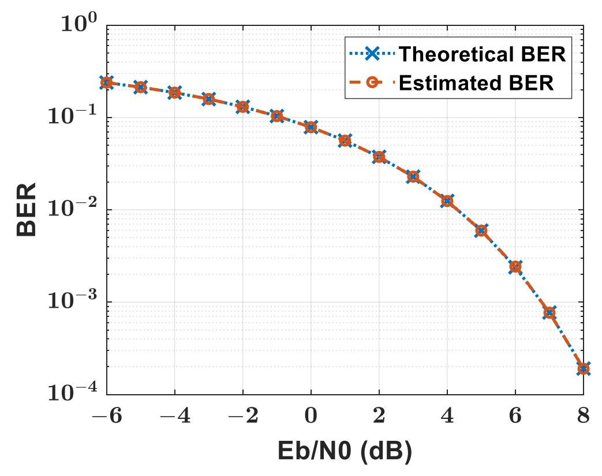

**Figure 5.** Theoretical and estimated BER of the communication system.

*Photonics* **2024**, *11*, 861 9 of 17

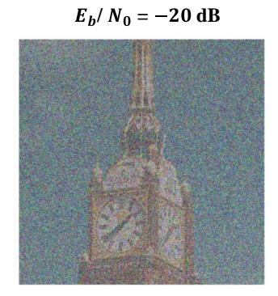

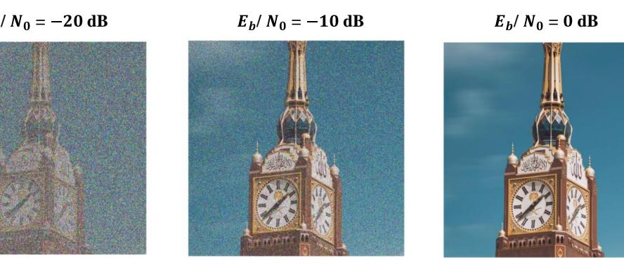

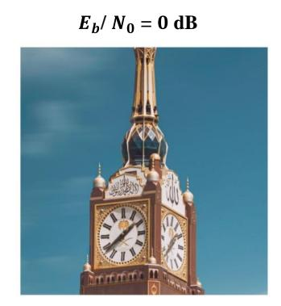

**Figure 6.** Transmitted and received 'Clock' image at *Eb*/*N*0 = −20, −10, and 0 dB.

#### 3.1.2. Radar System

When considering radar systems with spread spectrum waveforms, the signal chip duration is a crucial factor that determines the range resolution, which is related linearly, as follows [\[1\]](#page-15-0):

$$\Delta R = cT_c/2,\tag{3}$$

where *c* is the speed of light and *Tc* is the chip duration. Another significant parameter is the pulse repetition interval (PRI), or, equivalently, the radar waveform duration. This waveform consists of *N* bits with duration *T* = *NTb* . The parameter *T* plays a vital role in controlling the maximum detection range [\[1\]](#page-15-0). That is,

$$R_{\text{max}} = cT/2. (4)$$

To illustrate these concepts, we consider a spread spectrum signal with *N* = 400 bits, PN code of length 7, and radar waveform duration of 8 microseconds (*T* = 8 µs). These parameters result in *R*max = 1200 m and ∆*R* = 43 cm, which allow for the radar system to distinguish between targets that are at least 43 cm apart. The parameters of the transmitted radar signal are summarized in Table [1.](#page-8-1)

**Table 1.** The transmitted signal parameters.

| Signal Parameter                 | Value   |
|----------------------------------|---------|
| Center frequency (fc)            | 28 GHz  |
| Bandwidth (BW)                   | 700 MHz |
| Pulse repetition interval (PRI)  | 8 µs    |
| Maximum unambiguous range (Rmax) | 1200 m  |
| Range resolution (∆R)            | 43 cm   |

Figure [7](#page-9-0) shows the correlator output when there is a target at 250 m. The results are displayed first for noiseless data, where a clear peak appears at the correct distance with 18 dB PSL ratio. The second part of Figure [7](#page-9-0) shows how well the radar system could perform under less-than-ideal conditions. In particular, noise is added to the transmitted signal so that *Eb*/*N*0 = −20 and −40 dB. With this added challenge, the system can still detect the target accurately with a 13.6 and 4.5 dB PSL ratio, respectively.

Additionally, we conducted simulations with two targets positioned at intervals of 21.5, 43, and 215 cm under an *Eb*/*N*0 of −20 dB. The first target is located at a distance of 250 m. The resulting cross-correlation function between the transmitted and received waveforms is illustrated in Figure [8.](#page-9-1) Notably, the figure demonstrates that the resolution limit, theoretically calculated at 43 cm in this case, enables the clear resolution of the two targets as long as they maintain this separation.

*Photonics* **2024**, *11*, 861 10 of 17

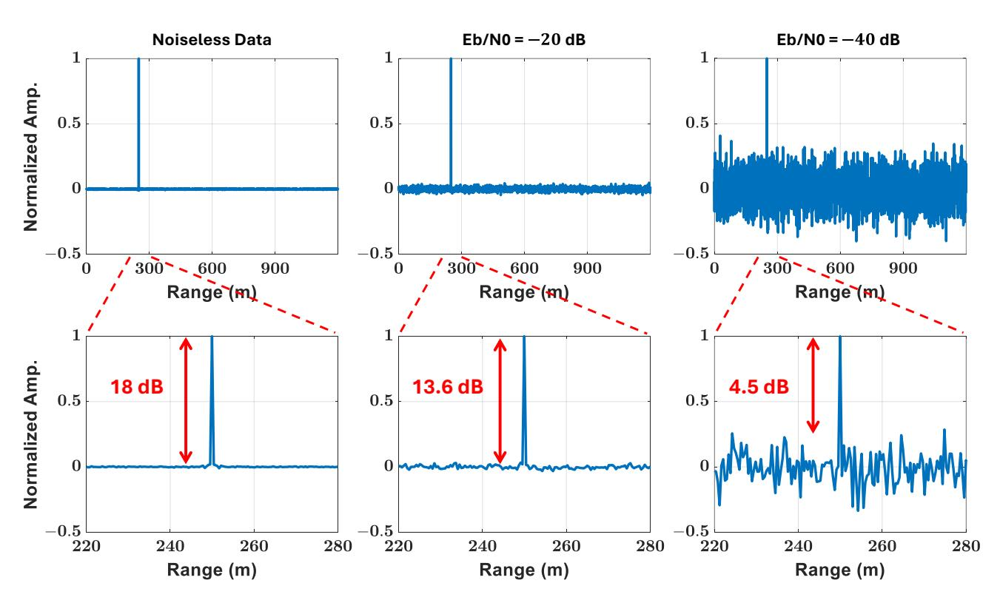

**Figure 7.** The output of radar correlator for noiseless data and for noise levels of *Eb*/*N*0 = −20 and −40 dB.

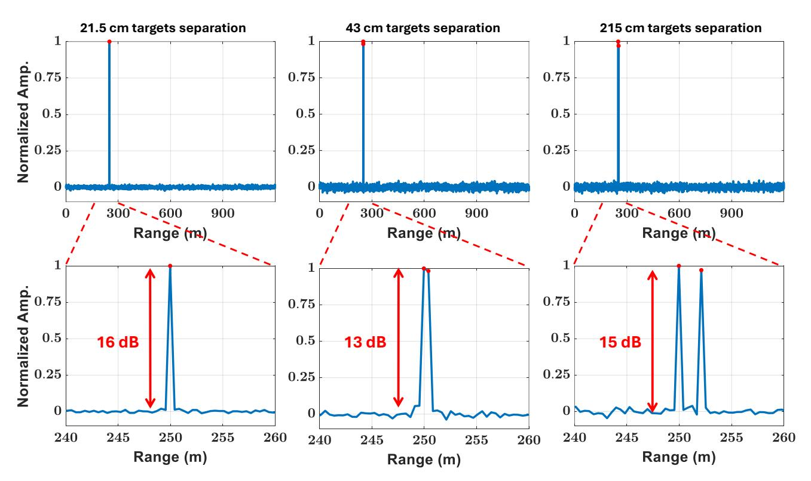

**Figure 8.** The cross-correlation function when two targets are present in the scene at *Eb*/*N*0 = −20 dB.

*Photonics* **2024**, *11*, 861 11 of 17

# *3.2. Fiber Channel*

Figure [9](#page-10-1) illustrates our system, which operates at a carrier frequency of 28 GHz. The system involves several components and stages. A laser diode (LD) generates an optical carrier, which is then split into two paths by an optical coupler—one path for transmission and the other for reception. An arbitrary waveform generator (AWG) produces the RF signal, which is used to modulate the optical carrier via a Mach–Zehnder modulator (MZM). The modulated optical signal is transmitted through a single-mode fiber (SMF) and received by a photodetector (PD), which converts the optical signal into an electrical signal at 28 GHz. This electrical signal is then amplified and wirelessly transmitted. On the communication system side, the received signal is down-converted and processed to extract the information bits. The radar receiver antenna collects the reflected signal. A low-noise amplifier (LNA) amplifies the collected signal and drives another MZM. This MZM modulates the other optical carrier, and the modulated optical signal is sent back through an SMF and converted into an electrical signal using another PD. The electrical signal is subsequently downconverted and processed by an oscilloscope (OSC) for further digital signal processing, enabling target detection and ranging.

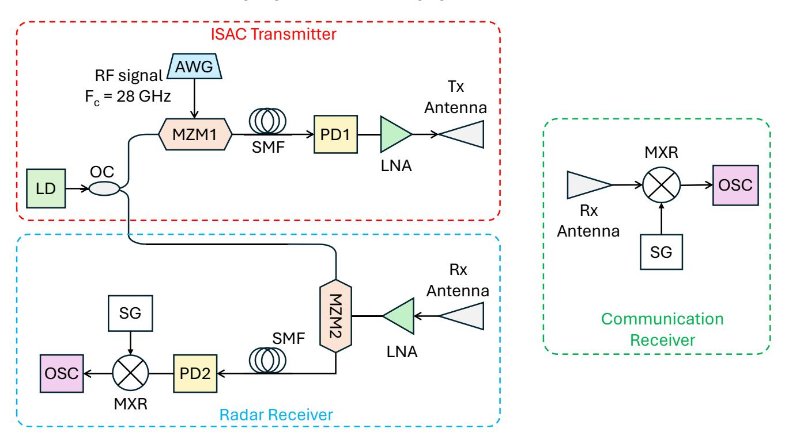

**AWG:** Arbitrary Waveform Generator. **MZM:** Mach-Zehnder Modulator. **LD:** Laser Diode. **OC:** Optical Coupler. **SMF:** single-mode fiber. **PD:** Photo Detector. **HPA:** High Power Amplifier. **SG:** Signal Generator. **MXR:** Mixer. **LNA:** Low Noise Amplifier. **OSC:** Oscilloscope.

**Figure 9.** The proposed ISAC model using photonics technology.

#### 3.2.1. Communication System

A binary phase-shift keying (BPSK) waveform consisting of 20.088 Kbits obtained from the text image shown in Figure [10a](#page-11-0) is generated and spread with a PN sequence by a factor of 7. The resulting signal after scrambling is upconverted to 28 GHz with a bandpass bandwidth of 0.7 GHz. The spread BPSK signal, whose spectrum is depicted in Figure [10b](#page-11-0), modulates the optical carrier, after being scrambled, using an MZM. The optical signal at the output of the MZM propagates through a fiber of different lengths and then is injected into a PD. The output of the PD undergoes amplification before being wirelessly transmitted by a horn antenna. Another horn antenna captures the received signal, and an OSC is used to process it further.

*Photonics* **2024**, *11*, 861 12 of 17

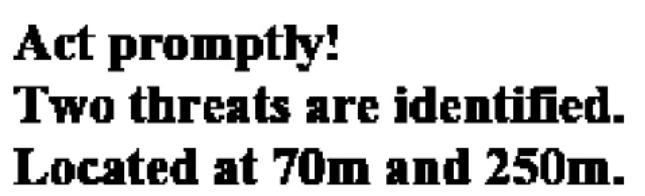

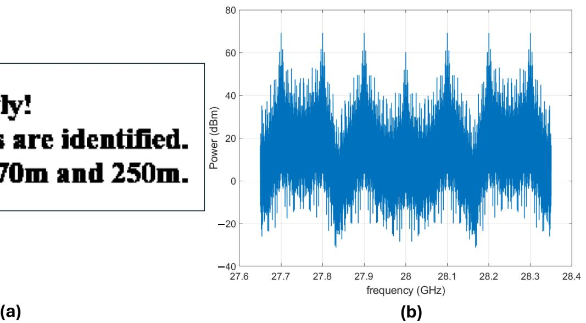

**Figure 10.** (**a**) Transmitted image (box is not included). (**b**) Spectrum of transmitted bandpass DSSS BPSK before scrambling.

Figure [11](#page-11-1) shows the reconstructed images received as the fiber length varies at 10, 25, 50, and 75 km. To better understand the impact of fiber length on system performance, we computed the BER for each fiber length. The BER values for fiber lengths of 10, 25, 50, and 75 are 0, 0.0793, 0, and 0.4132, respectively. Note that the performance at 50 km is better than that of length 25 km and 75 km. This is due to the nature of optical double-sideband (ODSB) transmission, where spectral nulls arise from chromatic dispersion. The number and position of these nulls depend on the fiber length, as shown in Figure [12.](#page-12-0) At a fiber length of 25 km, a spectral null occurs near the 28 GHz carrier frequency, whereas at 50 km, there is no null at 28 GHz. This explains why the performance at 50 km is better than at 25 km.

**10 km 25 km** 

**50 km 75 km** 

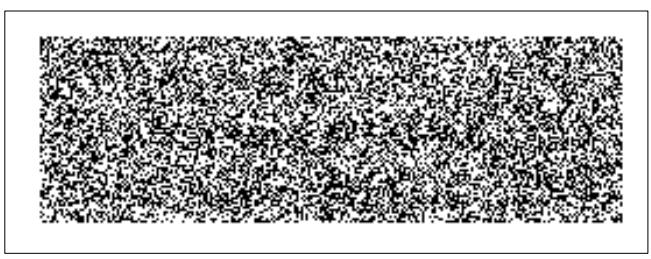

**Figure 11.** The reconstrued image for fiber lengths 10, 25, 50, and 75 km.

*Photonics* **2024**, *11*, 861 13 of 17

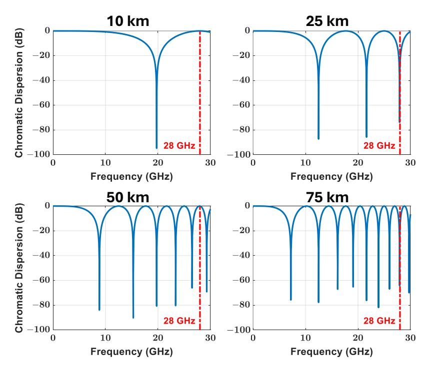

**Figure 12.** Frequency response of fiber for lengths 10, 25, 50, and 75 km.

#### 3.2.2. Radar System

In this phase of our analysis, we revisit the radar parameters outlined in Section [3.1](#page-6-0) and concisely summarized in Table [1.](#page-8-1) Our attention now shifts to Figure [13,](#page-12-1) which presents the correlator output at the radar receiver, specifically when transmitting the text image and subsequently receiving its reflected version via a fiber channel. The length of this fiber channel varies across 10, 25, 50, and 75 km. Evidently, as depicted in the figures, there is a discernible trend: the PSL ratio declines whenever a fiber null exists close to the carrier frequency. This observation underscores the influence of fiber nulls on signal fidelity.

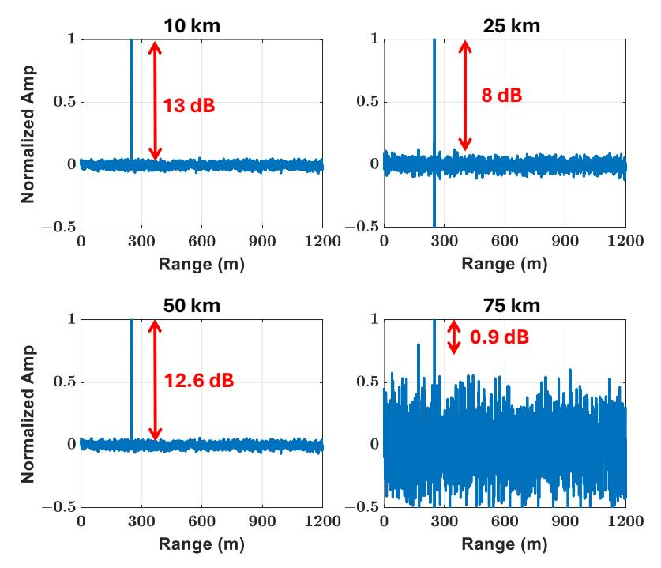

**Figure 13.** The PSL ratio of radar's correlator for fiber lengths 10, 25, 50, and 75 km.

*Photonics* **2024**, *11*, 861 14 of 17

Moreover, Figure [14](#page-13-0) provides insight into another critical aspect: the impact of fiber length on the detectability of two targets separated by a distance of 43 cm, aligning with the theoretical resolution. It is noteworthy that as the carrier frequency becomes closer to fiber nulls, discerning the presence of two closely positioned targets becomes progressively more challenging. This phenomenon highlights the practical implications of fiber nulls not only on signal fidelity but also on the radar system's ability to resolve closely spaced targets, crucial for accurate detection and tracking.

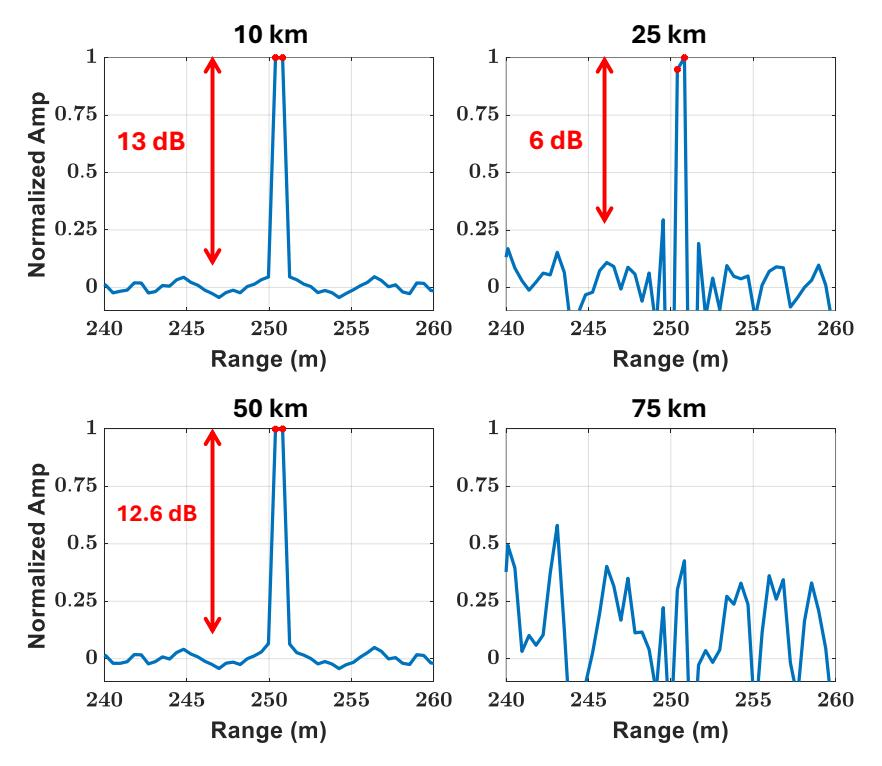

**Figure 14.** The radar's correlator output with two targets separated by 43 cm and for fiber lengths 10, 25, 50, and 75 km.

#### 3.2.3. Lab Experiment

In this experiment, we explore the performance of the proposed ISAC system. The setup is built based on photonics technology, following the model depicted in Figure [9.](#page-10-1) The system employs a transmit signal with a bandwidth of 700 MHz, which is designed to support a data rate of 50 Mbits per second for communication purposes. For the radar functionality, the waveform utilized has a duration of 8 microseconds. This signal is transmitted over a carrier frequency of 28 GHz. Figure [15](#page-14-0) presents the experimental setup. In our experiment, we introduced two distinct targets into the scene, positioned with a separation distance of 43 cm. The channel fiber's length for both transmission and reception within the ISAC system is carefully set to 10 km (one way), ensuring consistency across the setup. Because of the unavailability of optical equipment required to receive the reflection of the transmitted signal, the echo of the radar signal is captured using OSC.

Figure [16](#page-14-1) shows the reconstructed image observed at the output of the communication receiver. As can be seen, the image can be correctly recovered with a 0-BER. Figure [17](#page-14-2) illustrates the performance of the communication system at various levels of received optical power at the PD input in the transmitter part for a fiber channel of 10 km. Figure [17a](#page-14-2) shows the constellation diagram and the corresponding error vector magnitude (EVM) for different levels of the received optical power. An EVM value of 12 is achieved at a transmitted power of −3.8 dB. Figure [17b](#page-14-2) shows the EVM values versus received optical power in the transmitter part.

*Photonics* **2024**, *11*, 861 15 of 17

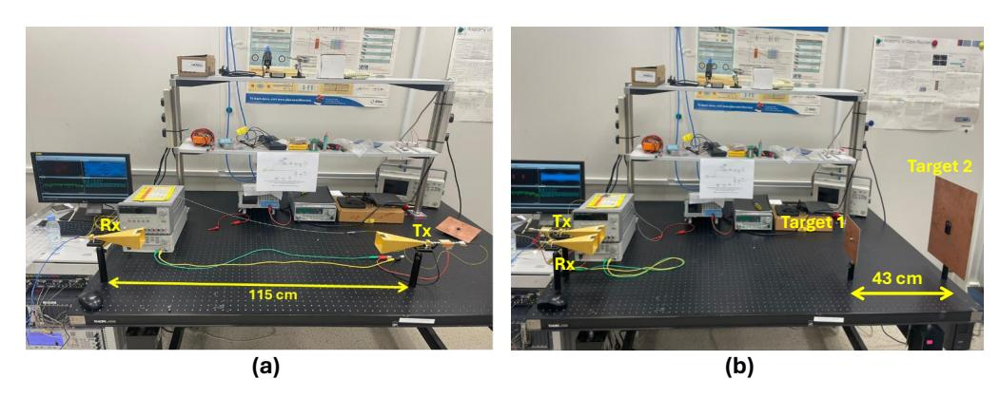

**Figure 15.** The experimental setup for (**a**) communication system; (**b**) radar system.

**Figure 16.** The reconstructed image at the communication receiver for a fiber channel of 10 km.

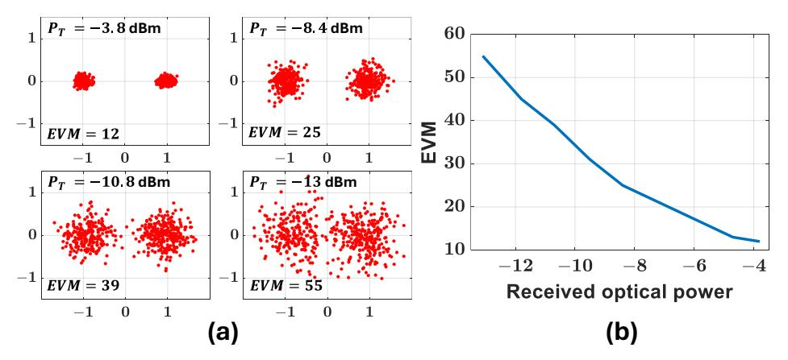

**Figure 17.** Performance of the communication system for a fiber channel of 10 km. (**a**) The constellation diagram versus different received optical power values. (**b**) EVM values versus the received optical power.

Figure [18,](#page-15-3) on the other hand, illustrates the correlator's output at the radar receiver. Encouragingly, the results from both figures align closely with those obtained through simulations, validating the efficacy of our proposed ISAC system. The results show that when the distance between the two targets is 21 cm (which is less than the range resolution), the radar identifies them as a single target. However, when the separation between the two targets precisely equals the range resolution at 43 cm, the radar distinguishes two clear peaks, representing two targets. Moreover, when the separation between the two targets exceeds the range resolution at 128 cm, the radar can still detect two clear peaks. The second target exhibits weaker received power due to its greater distance from the receiver antenna.

These findings highlight the versatility and robustness of the proposed ISAC framework, which seamlessly integrates communication and sensing functionalities. The experimental validation serves as a pivotal milestone, affirming the practical viability of our approach for diverse applications requiring concurrent communication and sensing capabilities.

*Photonics* **2024**, *11*, 861 16 of 17

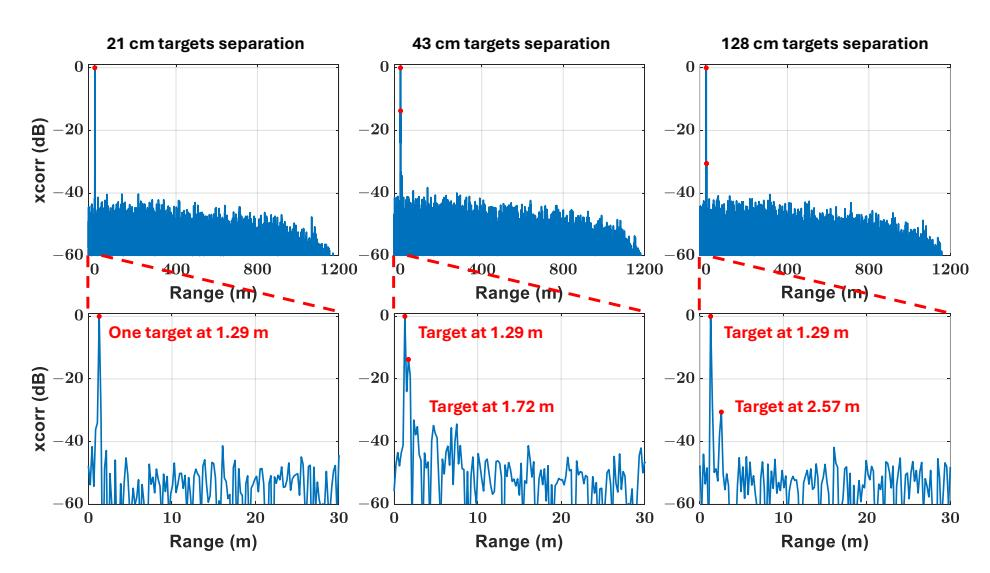

**Figure 18.** The correlator output at the radar receiver for differently separated targets for a fiber channel of 10 km.

### **4. Conclusions**

This paper emphasizes the crucial importance of integrating communication and sensing systems in modern technology, demonstrating their key role in various fields such as defense applications and autonomous vehicles. The study focuses on developing an integrated system that leverages innovative spread spectrum and RoF transmission technologies based on photonics. Simulation findings concerning ODSB transmission reveal a degradation in the performance of both radar and communication systems whenever they operate close to a fiber null. However, notable performance is still achievable at distances up to 50 km. This makes the proposed approach particularly suitable for applications like border protection and securing restricted areas. Simulation results at a carrier frequency of 28 GHz, with a received optical power of −3.8 dBm at the transmitter, show an exceptionally low BER of 0 for the communication system. The detected radar signals demonstrate an 18 dB PSL ratio. Additionally, promising results were obtained from laboratory experiments conducted to validate the ISAC system design.

**Author Contributions:** Conceptualization, S.A.A. and A.A.; methodology, E.M.A. and S.A.A.; software, A.K.A. and M.A.S.; validation, A.K.A., M.A.S., E.M.A. and S.A.A.; formal analysis, E.M.A. and S.A.A.; investigation, A.K.A. and M.A.S.; resources, A.K.A., M.A.S., E.M.A. and A.M.R.; data curation, A.K.A. and M.A.S.; writing—original draft preparation, A.K.A., M.A.S. and S.A.A.; writing—review and editing, A.K.A., M.A.S., E.M.A. and S.A.A.; visualization, A.K.A., M.A.S. and E.M.A.; supervision, A.M.R., A.A. and S.A.A.; project administration, A.M.R., A.A. and S.A.A.; funding acquisition, A.M.R., A.A. and S.A.A. All authors have read and agreed to the published version of the manuscript.

**Funding:** This work was supported by the Researchers Supporting Project, King Saud University, Riyadh, Saudi Arabia, under grant RSP2024R46.

**Institutional Review Board Statement:** Not applicable.

**Informed Consent Statement:** Not applicable.

**Data Availability Statement:** The original contributions presented in the study are included in the article; further inquiries can be directed to the corresponding author.

**Conflicts of Interest:** The authors declare no conflicts of interest.

# **References**

- 1. Mark, A.R.; James, A.S.; William, A.H. *Principles of Modern Radar: Basic Principles*; Institution of Engineering and Technology: London, UK, 2010.
- 2. Haykin, S. *Digital Communication Systems*, 1st ed.; Wiley: Hoboken, NJ, USA, 2013.

*Photonics* **2024**, *11*, 861 17 of 17

3. Akan, O.B.; Arik, M. Internet of radars: Sensing versus sending with joint radar-communications. *IEEE Commun. Mag.* **2020**, *58*, 13–19. [\[CrossRef\]](http://doi.org/10.1109/MCOM.001.1900550)

- 4. Sturm, C.; Wiesbeck, W. Waveform design and signal processing aspects for fusion of wireless communications and radar sensing. *Proc. IEEE* **2011**, *99*, 1236–1259. [\[CrossRef\]](http://dx.doi.org/10.1109/JPROC.2011.2131110)
- 5. Zhang, J.A.; Liu, F.; Masouros, C.; Heath, R.W.; Feng, Z.; Zheng, L.; Petropulu, A. An overview of signal processing techniques for joint communication and radar sensing. *IEEE J. Sel. Top. Signal Process.* **2021**, *15*, 1295–1315. [\[CrossRef\]](http://dx.doi.org/10.1109/JSTSP.2021.3113120)
- 6. Kim, K.; Kim, J.; Joung, J. A Survey on System Configurations of Integrated Sensing and Communication (ISAC) Systems. In Proceedings of the 2022 13th International Conference on Information and Communication Technology Convergence (ICTC), Jeju, Republic of Korea, 19–21 October 2022; pp. 1176–1178. [\[CrossRef\]](http://dx.doi.org/10.1109/ICTC55196.2022.9952602)
- 7. Xiong, B.; Zhang, Z.; Ge, Y.; Wang, H.; Jiang, H.; Wu, L.; Zhang, Z. Channel Modeling for Heterogeneous Vehicular ISAC System with Shared Clusters. In Proceedings of the 2023 IEEE 98th Vehicular Technology Conference (VTC2023-Fall), Hong Kong, 10–13 October 2023; pp. 1–6. [\[CrossRef\]](http://dx.doi.org/10.1109/VTC2023-Fall60731.2023.10333720)
- 8. Bazzi, A.; Chafii, M. On Outage-Based Beamforming Design for Dual-Functional Radar-Communication 6G Systems. *IEEE Trans. Wirel. Commun.* **2023**, *22*, 5598–5612. [\[CrossRef\]](http://dx.doi.org/10.1109/TWC.2023.3235617)
- 9. Mu, X.; Liu, Y.; Guo, L.; Lin, J.; Hanzo, L. NOMA-Aided Joint Radar and Multicast-Unicast Communication Systems. *IEEE J. Sel. Areas Commun.* **2022**, *40*, 1978–1992. [\[CrossRef\]](http://dx.doi.org/10.1109/JSAC.2022.3155524)
- 10. Bai, W.; Zou, X.; Li, P.; Ye, J.; Yang, Y.; Yan, L.; Pan, W.; Yan, L. Photonic millimeter-wave joint radar communication system using spectrum-spreading phase-coding. *IEEE Trans. Microw. Theory Tech.* **2022**, *70*, 1552–1561. [\[CrossRef\]](http://dx.doi.org/10.1109/TMTT.2021.3138069)
- 11. Torrieri, D. *Principles of Spread-Spectrum Communication Systems*; Springer: Berlin/Heidelberg, Germany, 2005; Volume 1.
- 12. Giroto de Oliveira, L.; Antes, T.; Nuss, B.; Bekker, E.; Bhutani, A.; Diewald, A.; Alabd, M.B.; Li, Y.; Pauli, M.; Zwick, T. Doppler Shift Tolerance of Typical Pseudorandom Binary Sequences in PMCW Radar. *Sensors* **2022**, *22*, 3212. [\[CrossRef\]](http://dx.doi.org/10.3390/s22093212) [\[PubMed\]](http://www.ncbi.nlm.nih.gov/pubmed/35590905)
- 13. Tang, L.; Zhang, K.; Dai, H.; Zhu, P.; Liang, Y.C. Analysis and optimization of ambiguity function in radar-communication integrated systems using MPSK-DSSS. *IEEE Wirel. Commun. Lett.* **2019**, *8*, 1546–1549. [\[CrossRef\]](http://dx.doi.org/10.1109/LWC.2019.2926708)
- 14. Xu, S.; Chen, Y.; Zhang, P. Integrated radar and communication based on DS-UWB. In Proceedings of the 2006 3rd International Conference on Ultrawideband and Ultrashort Impulse Signalsm Sevastopol, Ukraine, 18–22 September 2006; IEEE: Piscataway, NJ, USA, 2006; pp. 142–144.
- 15. Roberton, M.; Brown, E. Integrated radar and communications based on chirped spread-spectrum techniques. In Proceedings of the IEEE MTT-S International Microwave Symposium Digest, Philadelphia, PA, USA, 8–13 June 2003; IEEE: Piscataway, NJ, USA, 2003; Volume 1, pp. 611–614.
- 16. Melo, S.; Pinna, S.; Bogoni, A.; Da Costa, I.; Spadoti, D.; Laghezza, F.; Scotti, F.; Cerqueira, S.A. Dual-use system combining simultaneous active radar & communication, based on a single photonics-assisted transceiver. In Proceedings of the 2016 17th International Radar Symposium (IRS), Krakow, Poland, 10–12 May 2016; IEEE: Piscataway, NJ, USA, 2016; pp. 1–4.
- 17. Mizutani, K.; Kohno, R. Inter-vehicle spread spectrum communication and ranging system with concatenated EOE sequence. *IEEE Trans. Intell. Transp. Syst.* **2001**, *2*, 180–191. [\[CrossRef\]](http://dx.doi.org/10.1109/6979.969363)
- 18. Jamil, M.; Zepernick, H.J.; Pettersson, M.I. On integrated radar and communication systems using Oppermann sequences. In Proceedings of the MILCOM 2008–2008 IEEE Military Communications Conference, San Diego, CA, USA, 16–19 November 2008; IEEE: Piscataway, NJ, USA, 2008; pp. 1–6.
- 19. Mizui, K.; Uchida, M.; Nakagawa, M. Vehicle-to-vehicle communication and ranging system using spread spectrum technique (Proposal of Boomerang Transmission System). In Proceedings of the IEEE 43rd Vehicular Technology Conference, Secaucus, NJ, USA, 18–20 May 1993; IEEE: Piscataway, NJ, USA, 1993; pp. 335–338.
- 20. Jia, S.; Wang, S.; Liu, K.; Pang, X.; Zhang, H.; Jin, X.; Zheng, S.; Chi, H.; Zhang, X.; Yu, X. A unified system with integrated generation of high-speed communication and high-resolution sensing signals based on THz photonics. *J. Light. Technol.* **2018**, *36*, 4549–4556. [\[CrossRef\]](http://dx.doi.org/10.1109/JLT.2018.2863684)
- 21. Huang, L.; Li, R.; Liu, S.; Dai, P.; Chen, X. Centralized fiber-distributed data communication and sensing convergence system based on microwave photonics. *J. Light. Technol.* **2019**, *37*, 5406–5416. [\[CrossRef\]](http://dx.doi.org/10.1109/JLT.2019.2935903)
- 22. Nie, H.; Zhang, F.; Yang, Y.; Pan, S. Photonics-based integrated communication and radar system. In Proceedings of the 2019 International Topical Meeting on Microwave Photonics (MWP), Ottawa, ON, Canada, 7–10 October 2019; IEEE: Piscataway, NJ, USA, 2019; pp. 1–4.
- 23. Xue, Z.; Li, S.; Xue, X.; Zheng, X.; Zhou, B. Photonics-assisted joint radar and communication system based on an optoelectronic oscillator. *Opt. Express* **2021**, *29*, 22442–22454. [\[CrossRef\]](http://dx.doi.org/10.1364/OE.430910) [\[PubMed\]](http://www.ncbi.nlm.nih.gov/pubmed/34266007)
- 24. VPIphotonics. VPItransmissionMaker™ Optical Systems. Available online: [https://www.vpiphotonics.com/Tools/](https://www.vpiphotonics.com/Tools/OpticalSystems/) [OpticalSystems/](https://www.vpiphotonics.com/Tools/OpticalSystems/) (accessed on 5 September 2024).

**Disclaimer/Publisher's Note:** The statements, opinions and data contained in all publications are solely those of the individual author(s) and contributor(s) and not of MDPI and/or the editor(s). MDPI and/or the editor(s) disclaim responsibility for any injury to people or property resulting from any ideas, methods, instructions or products referred to in the content.