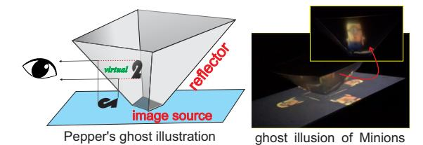
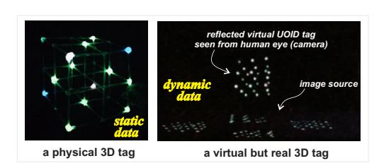
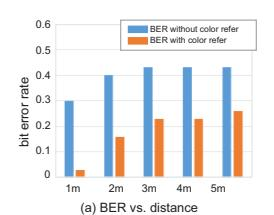
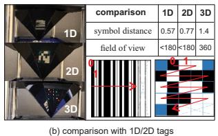

.

Latest updates: [hps://dl.acm.org/doi/10.1145/3672202.3673726](https://dl.acm.org/doi/10.1145/3672202.3673726)

SHORT-PAPER

# POSTER: Holographic Optical Tag enabled Omnidirectional IoT Connection

XIAO [ZHANG](https://dl.acm.org/doi/10.1145/contrib-99659657403), Michigan State [University,](https://dl.acm.org/doi/10.1145/institution-60031707) East Lansing, MI, United States LI [XIAO](https://dl.acm.org/doi/10.1145/contrib-81351593072), Michigan State [University,](https://dl.acm.org/doi/10.1145/institution-60031707) East Lansing, MI, United States MATT [WALTER](https://dl.acm.org/doi/10.1145/contrib-81100639860) MUTKA, Michigan State [University,](https://dl.acm.org/doi/10.1145/institution-60031707) East Lansing, MI, United States

Open Access [Support](https://libraries.acm.org/acmopen) provided by: Michigan State [University](https://dl.acm.org/doi/10.1145/institution-60031707)

PDF Download 3672202.3673726.pdf 28 December 2025 Total Citations: 3 Total Downloads: 674

Published: 04 August 2024

[Citation](https://dl.acm.org/action/exportCiteProcCitation?dois=10.1145%2F3672202.3673726&targetFile=custom-bibtex&format=bibtex) in BibTeX format

ACM [SIGCOMM](https://dl.acm.org/conference/comm) Posters and Demos '24: ACM SIGCOMM 2024 [Conference:](https://dl.acm.org/conference/comm) [Posters](https://dl.acm.org/conference/comm) and Demos

ISBN: 9798400707179

*August 4 - 8, 2024 NSW, Sydney, Australia*

Conference Sponsors: [SIGCOMM](https://dl.acm.org/sig/sigcomm)

# POSTER: Holographic Optical Tag enabled Omnidirectional IoT Connection

Xiao Zhang, Li Xiao, Matt W. Mutka Michigan State University zhan1387@msu.edu,lxiao@cse.msu.edu,mutka@msu.edu

## ABSTRACT

Optical wireless communication (OWC) offers efficient and secure IoT connectivity, leveraging Line-of-Sight (LoS) propagation for location awareness and spatial reuse. However, current OWC systems using LED bulbs or screens face limitations due to narrow transmission angles, hindering scalability for users. We introduce HoloCube, a software-defined OWC system enabling omnidirectional Internet-of-Things (IoT) connections via holographic optical tags. It utilizes virtual 3D cubes with adaptive S-CSK modulation for robust communication. Positioning elements provide double reference for 3D reconstruction and color decoding. Real-world experiments demonstrate HoloCube's performance.

## CCS CONCEPTS

• Computer systems organization → Embedded and cyberphysical systems; • Human-centered computing → Ubiquitous and mobile devices;

## KEYWORDS

Optical Wireless Communication, Holographic Displaying, Joint Sensing and Communication.

#### ACM Reference Format:

Xiao Zhang, Li Xiao, Matt W. Mutka. 2024. POSTER: Holographic Optical Tag enabled Omnidirectional IoT Connection. In ACM SIGCOMM 2024 Conference (ACM SIGCOMM Posters and Demos '24), August 4–8, 2024, Sydney, NSW, Australia. ACM, New York, NY, USA, [2](#page-2-0) pages. [https://doi.org/10.1145/](https://doi.org/10.1145/3672202.3673726) [3672202.3673726](https://doi.org/10.1145/3672202.3673726)

## 1 INTRODUCTION

As wireless technology advances, joint sensing and communication (JSAC) services gain attention for their promise of high-speed, low-latency communication with enhanced security and precise sensing/localization capabilities. They enable future applications such as AR/VR/MR, autonomous navigation, and vehicle/drone networks [\[5,](#page-2-1) [8,](#page-2-2) [10,](#page-2-3) [13\]](#page-2-4). Optical wireless communication (OWC) stands out among JSAC techniques due to its wide spectrum bandwidth, energy-efficient transmitters, and Line-of-Sight (LoS) propagation [\[1,](#page-2-5) [3,](#page-2-6) [4,](#page-2-7) [7,](#page-2-8) [12\]](#page-2-9). These factors ensure secure links, high-speed transmission, and direct 3D location-awareness without interference. However, optical signals require precise pointing between the

ACM SIGCOMM Posters and Demos '24, August 4–8, 2024, Sydney, NSW, Australia © 2024 Copyright held by the owner/author(s). ACM ISBN 979-8-4007-0717-9/24/08. <https://doi.org/10.1145/3672202.3673726> [This work is licensed under a Creative Commons Attribution International 4.0 License.](https://creativecommons.org/licenses/by/4.0/)

Figure 1: Pepper's ghost illustration.

transmitter (e.g., LED or laser diode) and the receiver (e.g., camera, photo diode) for successful communication.

Cameras broaden light perception for broader sensing, but full 3D movement is limited compared to RF wireless technologies due to non-3D optical transmitter design. In U-Star [\[9\]](#page-2-10), authors develop a 3D cube-shaped passive optical tag for omnidirectional scanning underwater, later upgrading to a 3D optical transmitter for integrated localization and communication. However, passive tags can not handle active optical wireless transmission with changing data. To enable omnidirectional optical wireless for massive IoT connection, we design an active optical transmitter with screen and reflector, using commercial low-cost cameras as receivers.

This poster introduces HoloCube, a virtual 3D tag for omnidirectional optical wireless communication. It utilizes the Pepper's ghost effect [\[2\]](#page-2-11) (see Figure [1\)](#page-1-0) to enable a 3D virtual cube for software defined optical camera communication, with the potential for adaptive data rate and resource allocation. Pepper's ghost is a special effect creating transparent ghostly images [\[6\]](#page-2-12). It reflects an image off plexiglass, popularized by John Pepper in the 1800s and commonly used in theaters. Viewers perceive a virtual image reflected on a transparent screen at a 45° angle, giving depth illusion.

## 2 METHODOLOGY

In our HoloCube, the main technical challenges are to generate direction-specific data and decode optical symbols robustly.

Figure 2: The virtual but real 3D HoloCube.

• Tag. HoloCube tags are mounted on ceilings and include a smartphone screen and Pepper's ghost reflector. Connected to the Internet, they serve as optical routers for nearby mobile users or IoT devices. Each tag presents 8 virtual 3D cubes with colored vertex pairs for positioning and spaced data elements with proper spacing gaps.

• Reader. Tag readers are smartphones with commercial cameras. We adopt lightweight YOLO model to track HoloCube tags, classify orientation of the user, estimate relative distances, and parse data using spatial and spectral references.

### 2.1 S-CSK modulation

Unlike static data with the amount of 21 bits in U-Star tags[\[9\]](#page-2-10), our virtual 3D cube's elements can represent time-varying data with separate colors. We apply Color Shift Keying (CSK) [\[11\]](#page-2-13) modulation in multiple spatial elements, named as S-CSK modulation, to increase data rates by combining temporal, spatial and spectrum diversities. Each element has varying amounts of red, green, and blue colors, divided into N scales from 0 to 255. For instance, with N as 16, a color might consist of 240 R (14× 16), 128 G (07× 16), and 48 B (02× 16). We denote these values as , , and respectively.

$$C = \alpha \times R_p / 16 + \beta \times G_p / 16 + \gamma \times B_p / 16 \tag{1}$$

Thus, each data element can denote 2 (16 × 16 × 16) = 12 bits. A 3-order virtual 3D tag can embed 12 × 19 = 228 bits in one frame duration, and 228 bits × 60Hz × 8 directions = 109.4 Kbps data rate with 60 Hz display refresh rate. S-CSK multiplexes data spatially with multiple elements, unlike traditional CSK. These elements avoid interference due to the abundant pixels on both the screen and the camera, using the pinhole imaging principle for separation.

### 2.2 Data Parsing via Double Reference

Each data element provides spatial and spectral details for each frame. Spatial information aids sequential bit retrieval, while spectral characteristics ensure precise data parsing.

- 3D Restoring via Positioning Elements. The captured virtual 3D cube has 4 diagonal vertex pairs in pure red, green, blue, and white. By filtering out these vertices, we can reconstruct the 3D structure of the virtual cube from its 2D image using space geometry principles.
- Color Reference via Positioning Elements. Each data element in the virtual 3D cube combines RGB colors with 16 scales, subject to distortion and attenuation from distance and ambient light. To address this, positioning elements (P.E.) are given a color reference for reliable decoding. Despite varying color distortions, all elements experience similar effects from proximity to the camera and ambient light. Hence, we use the pure colors of positioning elements as a reference to track distortion for other data elements.

## 3 EVALUATION

BER vs. different distances. We set distances between the reader (camera) and the HoloCube tag prototype in range of [1m, 2m, 3m, 4m, 5m] and capture images of the 3-order virtual 3D cube with 8 color scales. As shown in Figure [3](#page-2-14) (a), the BER increases with the increased transmission distance from 0.03 at 1m to 0.26 at 5m. All the BER with color reference are lower significantly than without color reference in decoding, which keep high in all distances.

Comparison with 1D/2D Tags We also explore 1D and 2D virtual codes with the same 1.5cm edge size and 19 embedded data elements, akin to HoloCube, for comparison, see Figure [3](#page-2-14) (b). Symbol Distance. With this edge size, the average symbol

Figure 3: BER results and comparison with 1D/2D tags.

distance from the first data element to others in the virtual 3D cube is 1.4cm. This is 2.45 times and 1.82 times greater than the 1D bar code (0.57cm) and 2D QR code (0.77cm), respectively, due to 3D spatial element embedding instead of linear and planar methods. FOV. While bar/QR codes with our reflector can be scanned in all directions, they appear as 8 codes in 8 planes (sectors), unlike HoloCube's single spatially-unified virtual cube.

## 4 CONCLUSION

HoloCube is designed for omnidirectional optical wireless IoT connections with integrated communication and sensing. Using the Pepper's ghost illusion with 3D spatial and spectral diversities in OWC improves data rate and user experience. We address system design and implementation challenges, especially omnidirectional delivery and robust decoding. Our current HoloCube prototype achieves up to 70 Kbps goodput at 4m, suitable for office use.

### ACKNOWLEDGMENTS

This work was partially supported by the U.S. National Science Foundation under Grants CNS-2226888 and CCF-2007159.

## REFERENCES

- [1] 2019. IEEE Standard for Local and metropolitan area networks–Part 15.7: Short-Range Optical Wireless Communications. IEEE Std 802.15.7 (2019).
- [2] Russell Burdekin. 2015. Pepper's Ghost at the Opera. Theatre Notebook 69, 3 (2015), 152–164.
- [3] Mostafa Zaman Chowdhury, Md Tanvir Hossan, Amirul Islam, and Yeong Min Jang. 2018. A comparative survey of optical wireless technologies: Architectures and applications. IEEE Access 6 (2018), 9819–9840.
- [4] Ye-Sheng Kuo, Pat Pannuto, Ko-Jen Hsiao, and Prabal Dutta. 2014. Luxapose: Indoor positioning with mobile phones and visible light. In Proceedings of the 20th annual international conference on Mobile computing and networking. 447–458.
- [5] Hao Pan, Yi-Chao Chen, Lanqing Yang, Guangtao Xue, Chuang-Wen You, and Xiaoyu Ji. 2019. mQRCode: Secure QR Code Using Nonlinearity of Spatial Frequency in Light. In The 25th Annual International Conference on Mobile Computing and Networking. 1–18.
- [6] John Henry Pepper. 2012. True History of the Ghost: And All about Metempsychosis. Cambridge University Press.
- [7] Zhiqiang Xiao and Yong Zeng. 2022. An overview on integrated localization and communication towards 6G. Science China Information Sciences 65 (2022), 1–46.
- [8] Xiao Zhang. 2023. Exploring Spatial-Temporal Multi-Dimensions in Optical Wireless Communication and Sensing. Ph. D. Dissertation. Michigan State University.
- [9] Xiao Zhang, Hanqing Guo, James Mariani, and Li Xiao. 2022. U-star: An underwater navigation system based on passive 3d optical identification tags. In Proceedings of the 28th Annual International Conference on Mobile Computing And Networking. 648–660.
- [10] Xiao Zhang, Griffin Klevering, Xinyu Lei, Yiwen Hu, Li Xiao, and Guan-Hua Tu. 2023. The Security in Optical Wireless Communication: A Survey. 55, 14s (2023).
- [11] Xiao Zhang, Griffin Klevering, James Mariani, Li Xiao, and Matt W. Mutka. 2023. Boosting Optical Camera Communication via 2D Rolling Blocks. In 2023 IEEE/ACM 31st International Symposium on Quality of Service (IWQoS). 1–4.
- [12] Xiao Zhang, James Mariani, Li Xiao, and Matt W Mutka. 2022. LiFOD: Lighting Extra Data via Fine-grained OWC Dimming. In 2022 19th Annual IEEE International Conference on Sensing, Communication, and Networking (SECON). IEEE.
- [13] Xiao Zhang, James Mariani, Li Xiao, and Matt W. Mutka. 2024. Exploiting Finegrained Dimming with Improved LiFi Throughput. ACM Trans. Sen. Netw. 20, 3, Article 60 (apr 2024), 24 pages.<https://doi.org/10.1145/3643814>