# Preamble-Free Synchronization Based on Dual-chirp Waveforms for Photonic THz-ISAC

Zhidong Lyu®, Lu Zhang®, *Member, IEEE*, Hongqi Zhang®, Zuomin Yang®, Hang Yang®, Lianyi Li®, Changming Zhang®, Vjačeslavs Bobrovs®, *Member, IEEE*, Oskars Ozolins®, *Member, IEEE*, Xiaodan Pang®, *Senior Member, IEEE*, and Xianbin Yu®, *Senior Member, IEEE* 

Abstract—The integrated sensing and communication (ISAC) systems based on the linear frequency modulation (LFM) waveforms have attracted substantial attention. However, existing routines suffer from additional synchronization preamble overhead, which limits both communication and sensing performance. This work, using the dual-chirp with opposite slopes, exploits a preamble-free synchronization scheme for the LFM-based ISAC. We first theoretically analyze the quasi-orthogonal property of the proposed dual-chirp LFM waveform and derive its achievable communication rate and range ambiguity function. A photonicsassisted proof-of-concept ISAC experiment is conducted in the 300 GHz frequency band, achieving a 20 Gbps data rate with a distinguished peak sidelobe ratio (PSLR) of up to 29.2 dB and 1.5 cm range resolution. More importantly, less than 0.5% synchronous power overhead is needed in our scheme. In addition, the performance trade-off induced by the data rate and amplitude ratio is validated in the experiment, which is in line with our theoretical analysis. Therefore, the proposed scheme provides a promising solution for synchronizing LFM-based future ISAC systems.

Manuscript received 11 July 2023; revised 8 October 2023 and 5 December 2023; accepted 15 December 2023. Date of publication 20 December 2023; date of current version 16 April 2024. This work was supported in part by the National Key Research and Development Program of China under Grant 2022YFB2903800, in part by the "Pioneer" and "Leading Goose" Research and Development Program of Zhejiang under Grant 2023C01139, in part by the Natural National Science Foundation of China under Grant 62101483, in part by the Natural Science Foundation of Zhejiang Province under Grant LQ21F010015, and in part by the Vetenskapsrådet under Grant 2019-05197. (Corresponding authors: Xianbin Yu; Lu Zhang.)

Zhidong Lyu, Lu Zhang, Hongqi Zhang, Zuomin Yang, Hang Yang, and Lianyi Li are with the College of Information Science and Electronic Engineering, Zhejiang University, Hangzhou 310027, China (e-mail: zdlyu@zju.edu.cn; zhanglu1993@zju.edu.cn; zhanghongqi@zju.edu.cn; yangzuomin@zju.edu.cn; yanghange@zju.edu.cn; lilianyi@zju.edu.cn).

Changming Zhang is with the Zhejiang Laboratory, Hangzhou 311121, China (e-mail: zhangcm@zhejianglab.com).

Vjačeslavs Bobrovs is with the Institute of Telecommunications, Riga Technical University, 1048 Riga, Latvia (e-mail: vja-ceslavs.bobrovs@rtu.lv).

Oskars Ozolins is with the Applied Physics Department, KTH Royal Institute of Technology, 106 91 Stockholm, Sweden, also with the RISE Research Institutes of Sweden, 164 40 Kista, Sweden, and also with the Institute of Telecommunications, Riga Technical University, 1048, Riga, Latvia (e-mail: ozo-lins@kth.se).

Xiaodan Pang is with the Applied Physics Department, KTH Royal Institute of Technology, 106 91 Stockholm, Sweden, and also with RISE R-search Institutes of Sweden, 164 40 Kista, Sweden (e-mail: xiao-dan@kth.se).

Xianbin Yu is with the Zhejiang Laboratory, Hangzhou 311121, China, and also with the College of Information Science and Electronic Engineering, Zhejiang University, Hangzhou 310027, China (e-mail: xyu@zhejianglab.com).

Color versions of one or more figures in this article are available at https://doi.org/10.1109/JLT.2023.3344788.

Digital Object Identifier 10.1109/JLT.2023.3344788

Index Terms—Dual-chirp waveform, Integrated sensing and communication (ISAC), Peak sidelobe ratio (PSLR), Quasi-orthogonal, Terahertz photonics.

#### I. INTRODUCTION

ITH the increasingly complex electromagnetic environment and higher demands for reliability and connectivity of wireless networks, integrated sensing and communication (ISAC) has attracted considerable attention [1]. The similarity of their frequency spectra, front-end hardware platforms, and baseband signal processing framework encourages the integration of sensing and communication systems [2], [3]. To achieve high-speed communication and high-resolution sensing, ultra-broad available bandwidth resource is needed. Therefore, terahertz band (THz, 0.3–10 THz) has been employed for beyond 100 Gbps data rate transmission [4], [5], millimeter-scale resolution sensing [6], [7], and multiplexing-based THz-ISAC system [8], [9], [10]. Nevertheless, additional hardware over-head and detection blind spots remain inevitable, motivating the research on the integrated waveform design, where a dedicated signal is used for both applications [11].

Benefiting from the distinct advantages of a large modulation bandwidth and low harmonic interference offered by modern photonic devices, photonics-assisted schemes have been extensively investigated for millimeter-wave (MMW) / THz wireless communication and radar sensing [12], [13], which lays the foundation for the research on photonic ISAC systems with dedicated integrated waveforms. For example, due to their multiple degrees of design freedom and dilution to frequency selective fading, multi-carrier waveforms like orthogonal frequency division multiplexing (OFDM) and its variants are appealing [14], [15], [16]. In [14], a novel centralized fiber-distributed integrated system, experimentally demonstrated, is enabled by the partial sequence segmentation OFDM (PTS-OFDM) to reduce the peak-to-average power ratio (PAPR). The demonstration is operated at 28 GHz with 1 m wireless transmission of 1.56 Gbps data rate and 30 cm theoretical range resolution. In addition, to overcome the phase noise sensitivity issue of OFDM, a tunable K/W-band OFDM integrated system based on the optoelectronic oscillator (OEO) is proposed, achieving up to 32 Gbps back-toback transmission and 1.5 cm range resolution in 89-99 GHz frequency band [16].

0733-8724 © 2023 IEEE. Personal use is permitted, but republication/redistribution requires IEEE permission. See https://www.ieee.org/publications/rights/index.html for more information.

Meanwhile, the single-carrier integrated waveform family is a potential candidate because of the highly directional antennas and limited multi-path effect for MMW and THz systems. Moreover, single-carrier waveforms can maintain a low PAPR value, thus decreasing the power backoff distortion of nonlinear devices, such as power amplifiers (PAs) [17], [18]. For example, the direct sequence spread spectrum (DSSS) is employed in an OEO loop, where the communication capacity and unambiguous range are promoted by multi-dimensional processing, achieving a 335.6 Mbps data rate and 7.5 cm range resolution [19]. Subsequently, the DSSS integrated system, demonstrated in [20], is enabled by the Walsh-Hadamard (WH) sequence and the m-sequence. Although the DSSS scheme can provide high security and robustness, the achievable data rate is limited with performance dependence on the selected sequence. Another promising method is to modulate communication symbols on the linear-frequency-modulated (LFM) chirp carrier [21], [22], [23], [24], [25]. In that way, the chromatic dispersion-induced power fading can be effectively mitigated owing to the suppression of stimulated Brillouin scattering by the optical chirp carrier [26]. For instance, the LFM carrier is encoded by direct current (DC)-offset quadrature phase shift keying (QPSK) symbols, achieving 11.5 Gbps wireless data transmission and range detection with 2.0 cm resolution in the 28 GHz band [22]. In the demonstration, the pure LFM signal is used for sensing and the coded one for communication, which is essentially multiplexed with the same time duration and frequency bandwidth. Furthermore, a dual-band integrated system with the constant envelope LFM-OFDM signal has been validated at around 50 GHz, and the self-coherent receiver and heterodyne receiver have been discussed in [23] and [24]. In our previous research, we propose a 330 GHz THz-ISAC system based on the LFM-PSK waveform, reaching a peak sidelobe ratio (PSLR) of 20.9 dB and a range resolution of 1.3 cm with 6 Gbps data transmission [25]. Additionally, a theoretical and experimental analysis of the performance trade-off of the proposed LFM-PSK waveform is conducted.

Regarding the LFM-based ISAC system, accurate signal synchronization at the communication receiver is required to compensate for the LFM carrier mismatch [11], [27]. Among the efforts above, additional preambles and start frame delimiters are needed for synchronization with time resource overhead. Although the authors in [22] propose using a pure chirp signal for synchronization, the communication performance varies drastically due to the DC offset, with an additional power overhead of around 8.3%. Moreover, it is highlighted that the chirp pair with opposite slopes indicates the quasi-orthogonal property and has been well-established in multiple-access and radar sensing [28], [29], [30], [31], which inspires the combination of up-chirp carrier and down-chirp sync pilot for ISAC waveform. This paper proposes a preamble-free synchronization scheme based on the dual-chirp-based waveform for the photonic THz-ISAC system with a theoretical analysis of the quasi-orthogonal property and the effects of the amplitude ratio. Subsequently, a 300 GHz proof-of-concept experiment is carried out, achieving 20 Gbps data rate wireless transmission and 20.9 dB PSLR, with no more than 0.5% synchronous power

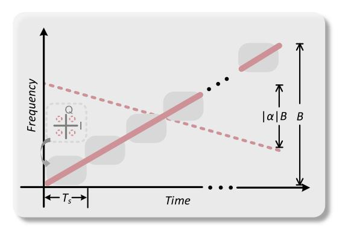

Fig. 1. Principle of dual-chirp-based integrated waveform illustrated in the time-frequency domain.

overhead, corresponding to a sync power saving of more than 13 dB.

#### II. SYSTEM MODEL

#### A. Quasi-Orthogonal Property of Dual-Chirp Waveform

Fig. 1, consisted of the modulated up-chirp carrier and the unmodulated chirp sync pilot, shows the principle of the dual-chirp-based integrated waveform. In general, the continuous chirp waveform with a positive slope can be written as:

$$s_{up}(t) = \exp\left[j\pi \left(2f_0 t + ut^2\right)\right], \ t \in [0, T]$$
 (1)

Where  $f_0$ , u, and T denote the initial frequency, slope rate, and sweep duration of a chirp waveform. The chirp slope is defined as u = B / T, where B is the chirp bandwidth.

Assume the added chirp sync pilot owns the same sweep duration but variable slope, and is given by:

$$s_{pilot}(t) = \exp\left\{j\pi \left[2f_0t + (1-\alpha)Bt + \alpha ut^2\right]\right\}$$
 (2)

where  $-1 \le \alpha \le 1$  is the fractional slope, i.e.,  $\alpha > 0$  indicates an up-chirp pilot and vice versa. Thus, the closed-form cross-correlation coefficient between the up-chirp carrier and the chirp pilot can be derived as:

$$\langle s_{up}, s_{pilot} \rangle = \begin{cases} \frac{C(\sqrt{BT})\cos(\frac{\pi BT}{2}) + S(\sqrt{BT})\sin(\frac{\pi BT}{2})}{\sqrt{BT}} + \operatorname{sinc}(2BT), & \alpha = -1\\ \frac{1}{\sqrt{2BT}} \left[ f_1(\alpha) - f_1^T(\alpha) + f_2(\alpha) + f_2^T(\alpha) \right], & -1 < \alpha < 0\\ \frac{1}{\sqrt{2BT}} \left[ f_3(\alpha) + f_3^T(\alpha) + f_4(\alpha) + f_4^T(\alpha) \right], & 0 \le \alpha < 1\\ \frac{C(\sqrt{BT})}{2\sqrt{BT}} + 1, & \alpha = 1 \end{cases}$$
(3)

where C(x) and S(x) are defined as the cosine integral and the sine integral, i.e.,

$$\begin{cases} C(x) \stackrel{\triangle}{=} \int_0^x \cos(t^2) dt \\ S(x) \stackrel{\triangle}{=} \int_0^x \sin(t^2) dt \end{cases}$$
 (4)

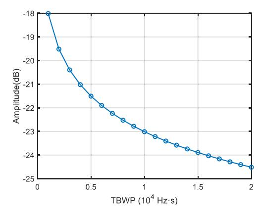

Fig. 2. Cross-correlation coefficient between the up-chirp carrier and the chirp pilot when  $\alpha=-1$ .

 $f_i(x)$  (i = 1, 2, 3, 4) is the temporary function for display clarity, which is shown as follows:

$$\begin{cases}
f_{1}(x) = \frac{\cos\left[\frac{\pi x^{2}BT}{4(x-1)}\right] \cdot \left\{C\left[\frac{x\sqrt{BT}}{\sqrt{2(x-1)}}\right] - C\left[-\frac{(x-2)\sqrt{BT}}{\sqrt{2(x-1)}}\right]\right\}}{\sqrt{x-1}} \\
f_{2}(x) = \frac{\cos\left[\frac{\pi x^{2}BT}{4(x+1)}\right] \cdot \left\{C\left[\frac{x\sqrt{BT}}{\sqrt{2(x+1)}}\right] - C\left[-\frac{(x+2)\sqrt{BT}}{\sqrt{2(x+1)}}\right]\right\}}{\sqrt{x+1}} \\
f_{3}(x) = \frac{2\cos\left[\frac{\pi(x-1)BT}{4}\right] \cdot C\left[\sqrt{\frac{(x+1)BT}{2}}\right]}{\sqrt{x-1}} \\
f_{4}(x) = \frac{\cos\left[\frac{\pi(x-1)^{2}BT}{4(x+1)}\right] \left\{C\left[\frac{(x-1)\sqrt{BT}}{\sqrt{2(x+1)}}\right] - C\left[-\frac{(x+3)\sqrt{BT}}{\sqrt{2(x+1)}}\right]\right\}}{\sqrt{x-1}}
\end{cases}$$

and  $f_i^T(x)$  represents a transform to  $f_i(x)$ , which is defined as:

$$f_i^T(x) \stackrel{\Delta}{=} \{ f_i(x) | C(\cdot) \to S(\cdot), \cos(\cdot) \to \sin(\cdot) \}.$$
 (6)

According to (3), the cross-correlation coefficient between the up-chirp and the chirp pilot is determined by the time-bandwidth product (TBWP). Furthermore, the coefficient is a decreasing function of the TBWP; thus, the increase in bandwidth and time duration leads to the reduction of the correlation coefficient. Fig. 2 demonstrates the correlation coefficient when  $\alpha=-1$ , i.e., the chirp pilot sweeps the same bandwidth but has an opposite slope. It can be seen that the correlation coefficient decreases with the increase of TBWP, indicating that a higher TBWP will reduce the mutual interference between the up-chirp carrier and pilot. In our following experiment, we choose the TBWP as  $10~\rm kHz\cdot s$ , which can provide adequate margin for the communication transmission requirement.

Fig. 3 presents the cross-correlation coefficient versus the fractional slope in theoretical analysis and simulation with a TBWP of  $10\,\mathrm{kHz}$ -s. As shown in the figure, the cross-correlation performance is a monotonically increasing function of the fractional slope, i.e., the correlation amplitude enhances with the increase of the fractional slope. It is noteworthy that the simulation is performed with a modulated up-chirp carrier, while the communication modulation is not considered during the theoretical analysis to simplify the derivation. Overall, the simplified theoretical analysis is in line with the simulation results. Thus, it is concluded that the chirp pilot with the opposite slope, i.e.,  $\alpha = -1$ , can achieve the best cross-correlation performance.

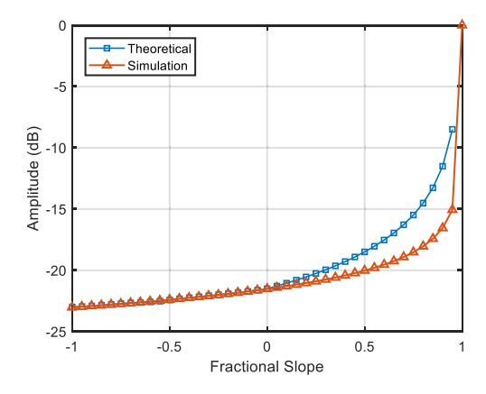

Fig. 3. Cross-correlation coefficient between the up-chirp carrier and the chirp pilot versus the fractional slope.

Furthermore, though the chirp pair with opposite slopes is not strictly orthogonal, a correlation coefficient of -23 dB suffices for signal synchronization and demodulation.

#### B. Dual-Chirp-Based Integrated Waveform Consideration

According to the discussion above, the chirp pair with opposite slopes has the minimum correlation coefficient. A traditional dual-chirp waveform is given by:

$$s_{dual\_tra}(t) = \exp\left[j\pi \left(2f_0t + ut^2\right)\right] / \sqrt{2}$$
$$+ \exp\left[j\pi \left(2f_0t + 2Bt - ut^2\right)\right] / \sqrt{2}. \quad (7)$$

Based on that, we take the up-chirp as the carrier and the down-chirp as the sync pilot. Therefore, the dual-chirp-based integrated waveform can be expressed as:

$$s_{dual}(t) = \sqrt{\beta_u} \exp\left[j\pi \left(2f_0t + ut^2\right) + j\varphi(t)\right] + \sqrt{\beta_d} \exp\left[j\pi \left(2f_0t + 2Bt - ut^2\right)\right]$$
(8)

where  $\beta_u$  is the normalized amplitude of the up-chirp carrier and  $\beta_d$ , the one of the down-chirp sync pilot, which satisfies  $\beta_u + \beta_d = 1$ . And  $\varphi(t)$  represents the communication symbols embedded into the up-chirp carrier with a symbol rate of  $R_B = 1$  /  $T_s$ , where  $T_s$  is the time slot shown in Fig. 1.

According to (8), considering communication, for minimizing interference while ensuring sync performance, we prefer to allocate as little power as possible to the down-chirp sync pilot. Here, the noise level is assumed to remain constant in this instance since it makes sense in a laboratory. We denote the amplitude ratio by  $\rho = (\beta_u/\beta_d)^{1/2}$ , thus, the signal-to-noise ratio (SNR) for the integrated signal, and the signal-to-interference-plus-noise ratio (SINR) for the communication user can be formulated as:

$$\begin{cases} SNR_{isac} = \frac{P_s}{P_n} = \frac{(\beta_u + \beta_d)P_s}{P_n} \\ SINR_{com} = \frac{\beta_u P_s}{\beta_d P_t + P_n} = \frac{\rho^2 SNR_{isac}}{\rho^2 + SNR_{isac} + 1} \end{cases}$$
(9)

where  $P_s$  denotes the integrated signal power and  $P_n$ , the noise power.

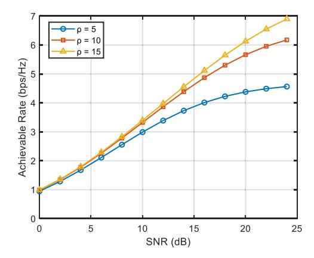

Fig. 4. Achievable rate versus the SNR at different amplitude ratios.

Thus, the maximum achievable rate of the communication user is as follows:

$$C = \log_2 \left( 1 + \text{SINR}_{com} \right). \tag{10}$$

Fig. 4 demonstrates the calculated achievable rate with different amplitude ratios. It can be seen that with the increase of SNR, the achievable rate is enhanced. Moreover, since the achievable rate is mainly limited by the sync pilot interference instead of the system noise at a high SNR [32], the choice of amplitude ratio will significantly affect the achievable rate at the high SNR region. Whereas, in the case of a low SNR, the system noise becomes the major limitation factor, and the achievable rate is not sensitive to the amplitude ratio.

From Fig. 4, a larger amplitude ratio contributes to a higher achievable rate. However, the SNR for synchronization decreases as the amplitude ratio increases, which can be expressed as:

$$SNR_{sync} = \frac{\beta_d P_s}{P_n} = \frac{SNR_{isac}}{1 + \rho^2}.$$
 (11)

Therefore, the amplitude ratio results in the trade-off between communication demodulation and synchronization, which will be experimentally analyzed in Section IV. Another important point is that we perform the synchronization process by the matched filter. Hence, the interference from the modulated upchirp carrier can be ignored according to Fig. 3. And we use  $SNR_{sync}$  instead of  $SINR_{sync}$ .

In addition, concerning the radar performance, our previous work has proposed the closed-form matched filter output of the LFM-PSK waveform [25]. Since the dual-chirp-based integrated waveform is essentially a weighted sum of the modulated upchirp and unmodulated down-chirp, we have:

$$r_{dual}(\tau)$$

$$= \beta_d(T - |\tau|) \cdot |\operatorname{sinc}[\pi \mu \tau (T - |\tau|)]|$$

$$+ \beta_u(T_s - |\tau|) \cdot \left| \operatorname{sinc}[\pi \mu \tau (T_s - |\tau|)] \cdot \frac{\sin(\pi \mu \tau T)}{\sin(\pi \mu \tau T_s)} \right|.$$
(12)

As a result, the dual-chirp-based integrated waveform is similar to the LFM-PSK one, i.e., the PSLR performance will

enhance with the data rate. The low sidelobe level provides immunity to the masking effect of strong targets, which has been analyzed extensively in [25].

According to (12), the theoretical range resolution, under the condition of  $R_B \le B$ , can be calculated as:

$$\Delta r = \frac{c}{2B} = \frac{cT_{3dB}}{2} \tag{13}$$

where c is the vacuum velocity of light, and  $T_{\rm 3dB}$  denotes the measured 3 dB pulse width after the matched filter processing. This resolution is consistent with an unmodulated LFM waveform.

#### III. EXPERIMENTAL SETUP

#### A. Photonic THz-ISAC Transceiver Architecture

Fig. 5 depicts the experimental setup for the proposed dualchirp-based photonic THz-ISAC system. At the transmitter side, the optical frequency comb (OFC) serves as the optical source to generate coherent optical tones. Here, a continuous optical wave is emitted from the laser diode (LD, 1550 nm, <100 kHz linewidth) and then launched into the optical phase modulator (PM, EOSPACE). For minimizing the insertion loss, a polarization controller (PC1) is employed to align the polarization axis with the PM. The radio frequency signal generator (RF) with 37.5 GHz frequency is first amplified by an electrical amplifier with 38 dB gain and then injected into the PM. Fig. 6(a). shows the generated OFC measured by an optical spectrum analyzer (OSA, FINISAR, WaveAnalyzer 1500S, 150 MHz resolution), with each comb line spacing 37.5 GHz. Then, two optical coherent tones with 300 GHz frequency spacing are filtered out by a wavelength selective switch (WSS, FINISAR, WaveShaper 4000A). The optical carrier centered at 193.580 THz, after being amplified by the Erbium-doped fiber amplifier (EDFA1), is injected into an optical in-phase and quadrature modulator (IQ-MOD) for the integrated waveform modulation, where the PC2 is used to optimize the polarization state of the incident optical carrier. The other optical tone centered at 193.280 THz serves as the optical local oscillator (LO) for heterodyne detection, generating the dual-chirp-based THz-ISAC signal.

In our experiment, an arbitrary waveform generator (AWG, Keysight M8194A, 120 GSa/s) is used to generate the base-band integrated signal. The output voltage of the AWG is set as 80 mV to drive the IQ-MOD with a polarization-maintaining variable optical attenuator (VOA1) for controlling the power of the selected optical LO for power balance. Then, the modulated optical carrier is combined with the attenuated optical LO using a 3 dB optical coupler (OC), and the EDFA2 is employed to boost the combined signal. Fig. 6(b) illustrates the optical spectrum of the amplified signal with a frequency spacing of 300 GHz. After polarization alignment by the PC3 and a polarizer, the combined signal is fed into the uni-traveling carrier photodiode (UTC-PD, IOD-PMJ-13001) to perform photo-mixing for the integrated signal generation, during which the VOA2 is used to control the incident optical power. In the wake of the UTC-PD, the integrated signal centered at 300 GHz is generated and radiated into a 1 m line-of-sight (LOS) wireless link by a horn

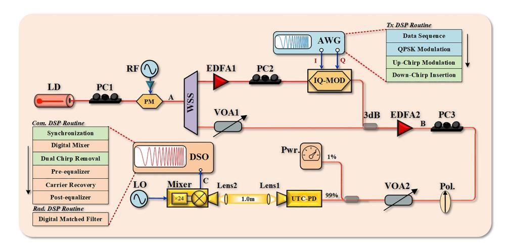

Fig. 5. Schematic of the proposed dual-chirp-based photonic THz-ISAC system architecture. LD: laser diode, PC: polarization controller, PM: phase modulator, RF: radio frequency, WSS: wavelength selective switch, EDFA: Erbium-doped fiber amplifier, AWG: arbitrary waveform generator, IQ-MOD: in-phase and quadrature modulator, VOA: variable optical attenuator, Pol.: polarizer, Pwr.: power meter, UTC-PD: uni-traveling carrier photodiode, DSO: digital storage oscilloscope, LO: local oscillator.

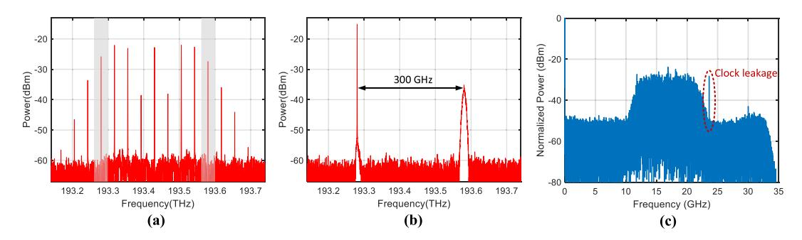

Fig. 6. (a) Optical spectrum of OFC generated by the PM (Point A). (b) Optical spectrum at the output of the EDFA2 (Point B). (c) Electrical spectrum of the received IF signal (Point C).

antenna, where a pair of lenses are employed for the THz beam collimation to reduce the propagation loss. At the reception side, driven by a 24-order frequency multiplied electrical LO signal at 11.8 GHz, the THz signal is down-converted into the intermediate frequency (IF) band through a Schottky mixer (VDI WR3.4, 40 GHz IF bandwidth). The IF signal centered at 16.8 GHz is sent to a real-time digital storage oscilloscope (DSO, Keysight, DSOZ594A, 160 GSa/s), where offline radar sensing and communication demodulation are performed separately in the digital domain. Fig. 6(c)shows the electrical spectrum of the obtained IF signal, and the tone centered at 23.6 GHz is induced by the clock leakage.

#### *B. Digital Signal Processing (DSP) Routine*

The digital signal processing routine is shown in the inset of Fig. 5. At the transmitter, a pseudo-random bit sequence (PRBS) with a length of 215 - 1, serving as the data sequence, is modulated to the QPSK format. Then, the modulated communication symbols are embedded into the up-chirp carrier, and the down-chirp sync pilot with the opposite slope is inserted, as described in [\(8\).](#page-1-0) Here, the chirp bandwidth is set as 10 GHz, with a time duration of 1 μs. According to [\(13\),](#page-1-0) the theoretical range

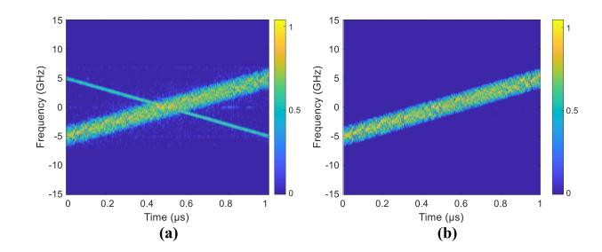

Fig. 7. Spectrogram of the baseband dual-chirp-based integrated signals at the (a) input and (b) output of the LMS filter.

resolution can be estimated to be 1.5 cm. At the communication receiver, based on the matched filter, the captured digital IF signal is synchronized with a down-chirp to find one frame. Note that such a sync pilot can also perform frequency offset compensation and chromatic dispersion measurement[\[33\],\[34\].](#page-8-0) Following the digital mixing, the signal is down-converted from the IF band to the baseband; then, a least mean square (LMS) filter is used to remove the sync pilot, where a modulated up-chirp carrier without the sync pilot functions as the training signal. Fig. 7 shows the spectrogram of the input and output of

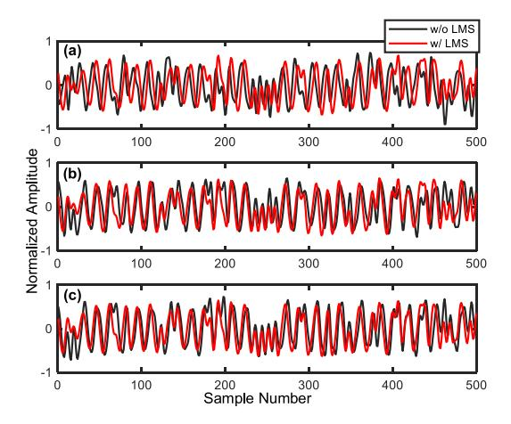

Fig. 8. Temporal waveform of the baseband dual-chirp-based integrated waveform with amplitude ratio at (a) ρ = 5, (b) ρ = 10, and (c) ρ = 15.

the LMS filter, which is performed by the short-time Fourier transform (STFT). As we can see, the down-chirp sync pilot is eliminated, and the up-chirp carrier can be removed by mixing with the conjugate of the corresponding up-chirp. At that point, the obtained baseband signal is theoretically consistent with the common QPSK communication signal [\[35\],](#page-8-0) [\[36\].](#page-8-0) Besides, an equalization module is used to compensate for the system's response and reduce the noise influence. The channel equalization is composed of the linear pre-equalization, carrier recovery, and linear post-equalization. At the radar receiver, the range profile can be obtained by employing a digitally matched filter and duplicating integrated LFM-QAM signal.

# IV. EXPERIMENTAL RESULTS AND DISCUSSIONS

## *A. Temporal Analysis of the Dual-Chirp-Based Integrated Waveform*

In the proposed dual-chirp-based integrated waveform, the amplitude ratio is an essential parameter, which will significantly affect system performance in terms of synchronization, communication, and radar sensing. Fig. 8 presents the temporal waveform of the baseband integrated waveform with different amplitude ratios. As can be seen, there exists the phase discontinuity caused by QPSK symbol modulation, and the trend is generally consistent with the unmodulated chirp. Compared with the temporal waveforms, the exacted signal after the LMS filter at a higher amplitude ratio shows more consistency with the signal before processing, which indicates that larger amplitude ratios introduce lower interference to communications. It is also noteworthy that the signal with an amplitude ratio of 5 has a phase difference after filtering, which can be easily eliminated by the further phase compensation.

## *B. Synchronization Performance of the Dual-Chirp-Based Integrated Waveform*

In the ISAC receiver for communication processing, the obtained integrated signals are synchronized with a down-chirp to track one communication frame. As shown in Fig. 9, the

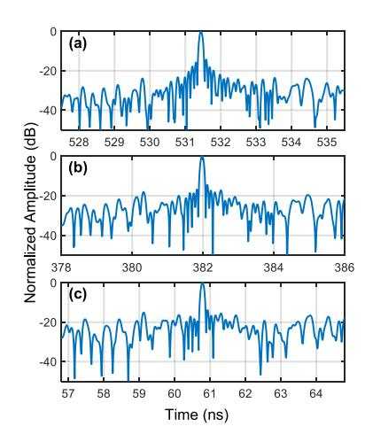

Fig. 9. Synchronization results with amplitude ratio at (a) ρ = 5, (b) ρ = 10, and (c) ρ = 15.

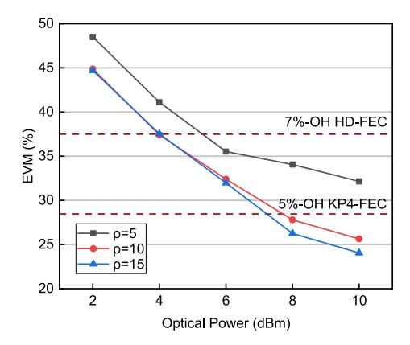

Fig. 10. EVM performance without the LMS filter versus the optical power at different amplitude ratios.

acquired synchronization results feature a clear sync peak.When the amplitude ratio increases from 5 to 15, the corresponding noise floor apparently deteriorates, whereas stays below −14 dB even in the worst situation. Besides, compared with the synchronization scheme in [\[22\],](#page-8-0) whose noise floor reaches 0 dB at an amplitude ratio of 10 / 3, our proposed scheme can achieve an approximate power overhead saving of more than 20 × log10(15 × 0.3) = 13 dB. It should be noted that such a synchronization scheme has no intention to challenge the mature communication synchronization schemes.

## *C. Communication Performance of the Dual-Chirp-Based Integrated Waveform*

To evaluate the communication performance of the dualchirp-based integrated waveform, we concentrate on the impacts of the dual-chirp removal module. Fig. 10 illustrates the error vector magnitude (EVM) performance without the LMS filter when amplitude ratios are equal to 5, 10, and 15, respectively. The data rate is set as 20 Gbps. We can observe that the trend of the EVM curve is consistent with the theoretical analysis in Fig. [4.](#page-3-0) When the optical power exceeds 8 dBm, the EVM performance with the amplitude ratio of 5 reaches the hard-decision

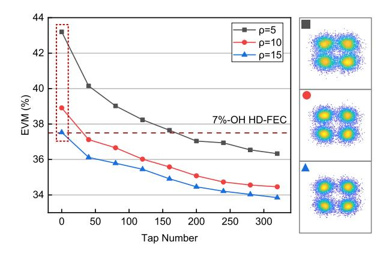

Fig. 11. EVM performance versus the tap number of LMS filter at different amplitude ratios.

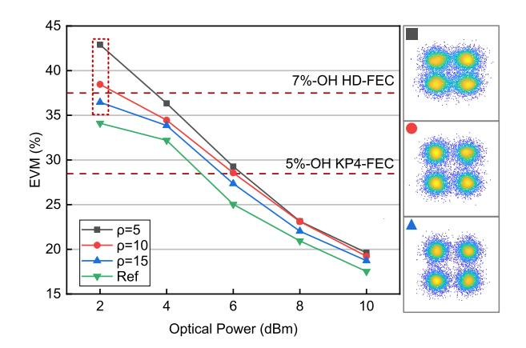

Fig. 12. EVM performance with the LMS filter versus the optical power at different amplitude ratios.

forward error correction (HD-FEC) limit with 7% overhead, while the other amplitude ratios can reach the KP4-FEC limit with 5% FEC overhead [\[37\].](#page-8-0) The difference in EVM performance is caused by sync pilot interference, especially at a high SNR.

Meanwhile, we optimize the tap number of the LMS filter for down-chirp sync pilot removal. Fig. 11 presents the measured EVM performance, where the inset is the constellation diagram without the LMS filter process. The injected optical power to UTC-PD is set as 4 dBm. Here, we take a low optical power as an example, to reveal the effectiveness of such a filter. Please note that the LMS filter is not needed at high optical power such as 10 dBm, because it can reach the KP4-FEC limit without down-chirp removal. From Fig. 11, as the tap number increases, the EVM value tends to converge, i.e., the down-chirp removal module performance is enhanced. Thus, it is the frequency response that mainly affects the removal process.

According to the discussion above, LMS filter's tap number is set as 200 for the following discussion, corresponding to 2.5 ns at 80 GSa/s, which we consider to be an acceptable processing delay. Fig. 12 demonstrates the EVM performance considering the LMS filter, with standard QPSK transmission as a baseline. We can see that, compared with standard QPSK, there exists a slight EVM degradation of no more than 0.5 dB, indicating

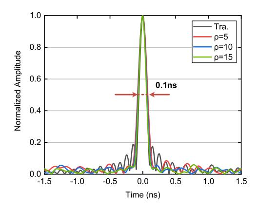

Fig. 13. Autocorrelation of the traditional dual-chirp waveform and the proposed integrated waveform.

the proposed integrated waveform has almost no compromise on the QPSK performance. Moreover, when the optical power is larger than 8 dBm, all amplitude ratios can reach below the KP4-FEC threshold. There is a difference in the trends of EVM performance shown in Figs. 12 and [10,](#page-5-0) which could be due to the algorithm's dependence on the amplitude ratio and SNR. Note that, in the case of high optical power like 10 dBm, the proposed LMS filter can almost eliminate the SINR loss caused by the small amplitude ratio.

## *D. Sensing Performance of the Dual-Chirp-Based Integrated Waveform and Performance Trade-off*

Furthermore, we analyze the sensing performance of the proposed dual-chirp-based waveform through an autocorrelation operation of the entire waveform. Fig. 13 displays the obtained 1-D range profile. Compared with the traditional dual-chirp sensing waveform in [\(7\),](#page-1-0) the PSLR can be enhanced from 14.5 dB to 29.2 dB, resulting in a 14.7 dB PSLR gain induced by communication modulation. Moreover, the PSLR gain increases with the amplitude ratio, since the side-lobe level is a weighted average of the chirp pair. The measured 3 dB pulse width is 0.1 ns, resulting in a 1.5 cm range resolution from [\(13\).](#page-1-0) Besides, from Fig. 13, it is clear that the proposed waveform can achieve a range profile with the thumbtack shape, which benefits from the randomness of modulated symbols. To further verify the radar performance of the proposed integrated waveform, a ranging experiment is also carried out using two stationary metal targets. The measured radar ranging profile is shown in Fig. [14.](#page-7-0) It can be observed that two clear peaks are clearly separated by 1.37 MHz, corresponding to a measured distance of 2.06 cm, which is close to the actual value of 2.00 cm. This observation confirms that the proposed LFM-QAM waveform can accommodate both communication and radar sensing functionalities.

Additionally, we conduct a discussion on the performance trade-off of the proposed integrated waveforms in Fig. [15](#page-7-0) and Fig. [16.](#page-7-0) Fig. [15](#page-7-0) illustrates how the data rate causes a trade-off between the communication EVM and sensing PSLR performance. Particularly, a higher data rate enables a lower side lobe level due to its randomness, yet the EVM performance worsens.

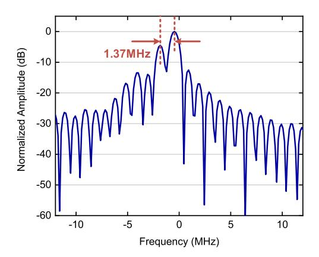

Fig. 14. Measured radar ranging profile with a separated distance of 2.00 cm.

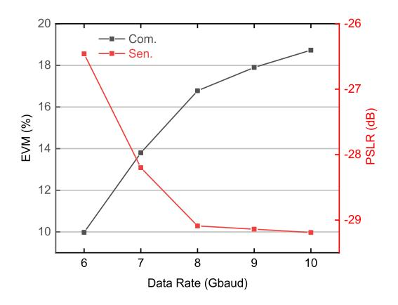

Fig. 15. EVM and PSLR performance versus the data rate.

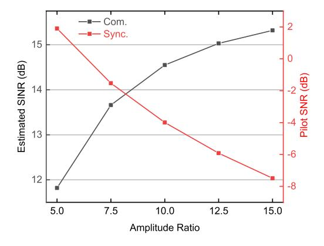

Fig. 16. Estimated SINR and pilot SNR versus the amplitude ratio.

Meanwhile, the PSLR theoretically tends to infinity with the increase of data rate, whereas the system noise floor will limit the lower bound of the sidelobe level [\[38\].](#page-8-0) As a result, the PSLR level remains stable at around 29.2 dB in our experiment. From Fig. 15, a higher data rate within the selected EVM threshold is recommended to enhance PSLR performance. Fig. 16 provides the trade-off between the estimated communication SINR and the sync pilot SNR by the amplitude ratio, where the SNR of the integrated signal is estimated based on the power spectral density (PSD). In that case, a higher amplitude ratio will contribute to a larger SINR for communication demodulation with a lower

TABLE I COMPARISON OF RECENT REPRESENTATIVE PHOTONIC ISAC DEMONSTRATIONS AND OUR SCHEME

| Ref.         | Method     | Operation frequency (GHz) | Data rate (Gbps) | Format | PSLR (dB) | Res. (cm) |
|--------------|------------|---------------------------------|------------------------|--------|--------------|--------------|
| [9]          | FDM        | 104/331                         | 32.0                   | 16QAM  | /            | 3.8          |
| [10]         | TDM        | 340                             | 38.1                   | 64QAM  | ~13.0        | 1.58         |
| [14]         | OFDM       | 28                              | 1.56                   | 16QAM  | 14.5         | 30.0         |
| [15]         | OFDM       | 28                              | 0.8                    | QPSK   | /            | 7.0          |
| [16]         | OFDM       | 94                              | 32                     | 16QAM  | /            | 1.5          |
| [19]         | DSSS       | 24                              | 0.33                   | QPSK   | 20.0         | 7.5          |
| [20]         | DSSS       | 35                              | 1.0                    | BPSK   | 12.1         | 3.0          |
| [21]         | LFM-ASK    | 22                              | 0.1                    | ASK    | 9.5          | 1.8          |
| [22]         | LFM-PSK    | 28                              | 11.5                   | QPSK   | 16.5         | 10.4         |
| [23]         | LFM-OFDM   | 54/61                           | 6.0                    | 64QAM  | ~15.0        | 1.76         |
| [24]         | LFM-OFDM   | 38/52                           | 16.0                   | 16QAM  | /            | 3.75         |
| [25]         | LFM-PSK    | 330                             | 6.0                    | BPSK   | 20.9         | 1.3          |
| This work | Dual-chirp | 300                             | 20.0                   | QPSK   | 29.2         | 1.5          |

SNR for synchronization. Therefore, according to the specific application requirement, an appropriate amplitude ratio should be chosen. For instance, when the THz-ISAC system operates at a high SNR, a higher amplitude ratio is suitable to improve the communication SINR and satisfy the synchronization demand, or vice versa.

Table I lists several recent demonstrations of representative photonics-based ISAC systems regarding the waveform design method, operation frequency, data rate, modulation format, PSLR, and range resolution. Today, there is still no consensus on ISAC waveform design. Among the mainstream solutions, the LFM-based waveforms have attracted much attention, while the sensing metrics, such as PSLR, are limited. In our previous work [\[25\],](#page-8-0) we have achieved a fairly high PSLR value but with a limited data rate. In this research, we further promote the PSLR from 20.9 dB to 29.2 dB with a 20 Gbps data rate, which exhibits the best performance compared with other LFM-based schemes.

# V. CONCLUSION

We experimentally demonstrate a preamble-free photonic THz-ISAC system based on a dual-chirp waveform at 300 GHz, achieving a fairly high PSLR performance and data rate with a novel synchronization scheme for the LFM-based ISAC waveform, with hardware saving negligible communication performance compromise, and acceptable filtering over-head. The proposed waveform is implemented by insetting the chirp pilot with the opposite slope, which is theoretically verified to be quasi-orthogonal with the chirp carrier. In the proof-of-concept experiment, we have achieved a 20 Gbps data rate transmission over a 1 m wireless link with no more than 0.5% sync overhead, reaching 29.2 dB PSLR and a 1.5 cm range resolution. The proposed dual-chirp-based waveform and scheme are validated to feature superiority, providing a promising solution for the synchronization issue of LFM-based waveforms for future THz-ISAC systems.

### REFERENCES

- [1] Z. Feng, Z. Fang, Z. Wei, X. Chen, Z. Quan, and D. Ji, "Joint radar and communication: A survey," *China Commun*, vol. 17, no. 1, pp. 1–27, Jan. 2020.
- [2] K. V. Mishra, M. R. Bhavani Shankar, V. Koivunen, B. Ottersten, and S. A. Vorobyov, "Toward millimeter-wave joint radar communications: A signal processing perspective," *IEEE Signal Process. Mag.*, vol. 36, no. 5, pp. 100–114, Sep. 2019.
- [3] R. Liu, M. Li, H. Luo, Q. Liu, and A. L. Swindlehurst, "Integrated sensing and communication with reconfigurable intelligent surfaces: Opportunities, applications, and future directions," *IEEE Wireless Commun*, vol. 30, no. 1, pp. 50–57, Feb. 2023.
- [4] S. Wang et al., "26.8-m THz wireless transmission of probabilistic shaping 16-QAM-OFDM signals," *APL Photon*, vol. 5, no. 5, May 2020, Art. no. 056105.
- [5] J. Zhang et al., "Real-time demonstration of 103.125-gbps fiber–THz– fiber 2 × 2 MIMO transparent transmission at 360–430 GHz based on photonics," *Opt. Lett.*, vol. 47, no. 5, pp. 1214–1217, Mar. 2022.
- [6] S. Gui, J. Li, and Y. Pi, "Security imaging for multi-target screening based on adaptive scene segmentation with terahertz radar," *IEEE Sensors J*, vol. 19, no. 7, pp. 2675–2684, Apr. 2019.
- [7] Z. Yang, L. Zhang, H. Zhang, H. Yang, Z. Lyu, and X. Yu, "Photonic THz InISAR for 3D positioning with high resolution," *J. Lightw. Technol.*, vol. 41, no. 10, pp. 2999–3006, May 2023.
- [8] A. Kanno, N. Sekine, Y. Uzawa, I. Hosako, and T. Kawanishi, "300-GHz versatile transceiver front-end for both communication and imaging," in *Proc. IEEE 40th Int. Conf. Infrared, Millimeter, Terahertz Waves (IRMMW-THz)*, Aug. 2015, pp. 1–2.
- [9] Y. Wang et al., "Integrated terahertz high-speed data communication and high-resolution radar sensing system based-on photonics," in *Proc. Eur. Conf. Opt. Commun.*, 2021, pp. 1–4.
- [10] Y.Wang et al., "Integrated high-resolution radar and long-distance communication based-on photonic in terahertz band," *J. Lightw. Technol.*, vol. 40, no. 9, pp. 2731–2738, May 2022.
- [11] L. Giroto de Oliveira, B. Nuss, M. B. Alabd, A. Diewald, M. Pauli, and T. Zwick, "Joint radar-communication systems: Modulation schemes and system design," *IEEE Trans. Microw. Theory Techn.*, vol. 70, no. 3, pp. 1521–1551, Mar. 2022.
- [12] J. Yu, X. Li, and W. Zhou, "Tutorial: Broadband fiber-wireless integration for 5G+ communication," *APL Photon*, vol. 3, no. 11, Nov. 2018, Art. no. 111101.
- [13] S. Pan and Y. Zhang, "Microwave photonic radars," *J. Lightw. Technol.*, vol. 38, no. 19, pp. 5450–5484, Oct. 2020.
- [14] L. Huang, R. Li, S. Liu, P. Dai, and X. Chen, "Centralized fiber-distributed data communication and sensing convergence system based on microwave photonics," *J. Lightw. Technol.*, vol. 37, no. 21, pp. 5406–5416, Nov. 2019.
- [15] B. T. Brandão, J. H. Silva, L. S. Leitão, D. Castanheira, F. P. Guiomar, and P. P. Monteiro, "5G-NR based joint radar and communication system using low-cost photonic fronthaul," in *Proc. Int. Topical Meeting Microw. Photon.*, 2021, pp. 1–4.
- [16] Z. Xue, S. Li, J. Li, X. Xue, X. Zheng, and B. Zhou, "Tunable K /W-band OFDM integrated radar and communication system based on optoelectronic oscillator for intelligent transportation," *Opt. Exp.*, vol. 30, no. 20, pp. 35270–35281, Sep. 2022.
- [17] Z. Chen et al., "Terahertz wireless communications for 2030 and beyond: A cutting-edge frontier," *IEEE Commun. Mag.*, vol. 59, no. 11, pp. 66–72, Nov. 2021.
- [18] Y. Wu, F. Lemic, C. Han, and Z. Chen, "Sensing integrated DFT-spread OFDM waveform and deep learning-powered receiver design for terahertz integrated sensing and communication systems," *IEEE Trans. Commun.*, vol. 71, no. 1, pp. 595–610, Jan. 2023.

- [19] Z. Xue, S. Li, X. Xue, X. Zheng, and B. Zhou, "Photonics-assisted joint radar and communication system based on an optoelectronic oscillator," *Opt. Exp.*, vol. 29, no. 14, pp. 22442–22454, Jul. 2022.
- [20] W. Bai et al., "Photonic millimeter-wave joint radar communication system using spectrum-spreading phase-coding," *IEEE Trans. Microw. Theory Techn.*, vol. 70, no. 3, pp. 1552–1561, Mar. 2022.
- [21] H. Nie, F. Zhang, Y. Yang, and S. Pan, "Photonics-based integrated communication and radar system," in *Proc. Int. Topical Meeting Microw. Photon.*, 2019, pp. 1–4.
- [22] M. Lei et al., "Photonics-aided integrated sensing and communications in mmW bands based on a DC-offset QPSK-encoded LFMCW," *Opt. Exp.*, vol. 30, no. 24, pp. 43088–43103, Nov. 2022.
- [23] W. Bai et al., "Photonic super-resolution millimeter-wave joint radarcommunication system using self-coherent detection," *Opt. Lett.*, vol. 48, no. 3, pp. 608–611, Jan. 2023.
- [24] W. Bai et al., "Photonics-assisted millimeter-wave multiband integrated sensing and communication system using coherent receiving," *IEEE J. Sel. Topics Quantum Electron.*, vol. 29, no. 6, Nov./Dec. 2023, Art. no. 7601111.
- [25] Z. Lyu et al., "Radar-centric photonic terahertz integrated sensing and communication system based on LFM-PSK waveform," *IEEE Trans. Microw. Theory Techn.*, vol. 71, no. 11, pp. 5019–5027, Nov. 2023.
- [26] H. He et al., "Integrated sensing and communication in an optical fibre," *Light: Sci. Appl.*, vol. 12, no. 25, pp. 1–14, Jan. 2023.
- [27] N. C. Luong, X. Lu, D. T. Hoang, D. Niyato, and D. I. Kim, "Radio resource management in joint radar and communication: A comprehensive survey," *IEEE Commun. Surveys Tut.*, vol. 23, no. 2, pp. 780–814, Secondquarter, 2021.
- [28] M. O. Khyam, M. Noor-A-Rahim, X. Li, C. Ritz, Y. L. Guan, and S. S. Ge, "Design of chirp waveforms for multiple-access ultrasonic indoor positioning," *IEEE Sensors J*, vol. 18, no. 15, pp. 6375–6390, Aug. 2018.
- [29] N. Hosseini and D. W. Matolak, "Nonlinear quasi-synchronous multi user chirp spread spectrum signaling," *IEEE Trans. Commun.*, vol. 69, no. 5, pp. 3079–3090, May 2021.
- [30] D. Zhu and J. Yao, "Dual-chirp microwave waveform generation using a dual-parallel Mach-Zehnder modulator," *IEEE Photon. Technol. Lett.*, vol. 27, no. 13, pp. 1410–1413, Jul. 2015.
- [31] L. Wang et al., "Photonic generation of multi-format radar waveforms based on an integrated silicon IQ modulator," *IEEE J. Sel. Topics Quantum Electron.*, vol. 28, no. 5, Sep./Oct. 2022, Art. no. 6000207.
- [32] U. Erez, S. Shamai, and R. Zamir, "Capacity and lattice strategies for canceling known interference," *IEEE Trans. Inf. Theory*, vol. 51, no. 11, pp. 3820–3833, Nov. 2005.
- [33] W. Wang, A. Yang, P. Guo, Y. Lu, and Y. Qiao, "Joint OSNR and interchannel nonlinearity estimation method based on fractional Fourier transform," *J. Lightw. Technol.*, vol. 35, no. 20, pp. 4497–4506, Oct. 2017.
- [34] Y. Guo et al., "Joint modulation format identification and frequency offset estimation based on superimposed LFM signal and FrFT," *IEEE Photon. J.*, vol. 11, no. 5, Oct. 2019, Art. no. 7204712.
- [35] X. Pang et al., "25 Gbit/s QPSK hybrid fiber-wireless transmission in the W-band (75–110 GHz) with remote antenna unit for in-building wireless networks," *IEEE Photon. J.*, vol. 4, no. 3, pp. 691–698, Jun. 2012.
- [36] M. Sung et al., "Design considerations of photonic THz communications for 6G networks," *IEEE Wireless Commun*, vol. 28, no. 5, pp. 185–191, Oct. 2021.
- [37] E. Agrell and M. Secondini, "Information-theoretic tools for optical communications engineers," in *Proc. IEEE Photon. Conf.*, 2018, pp. 1–5.
- [38] R. Xie, K. Luo, and T. Jiang, "Waveform design for LFM-MPSK-based integrated radar and communication toward IoT applications," *IEEE Internet Things J*, vol. 9, no. 7, pp. 5128–5141, Apr. 2022.