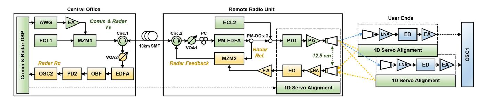
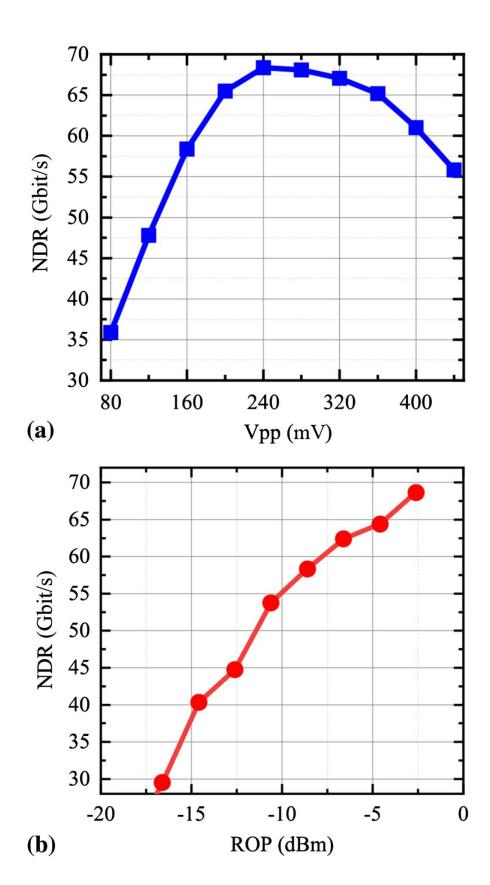
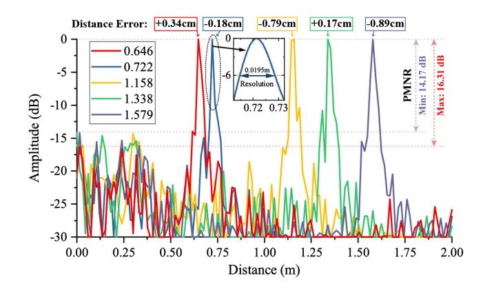
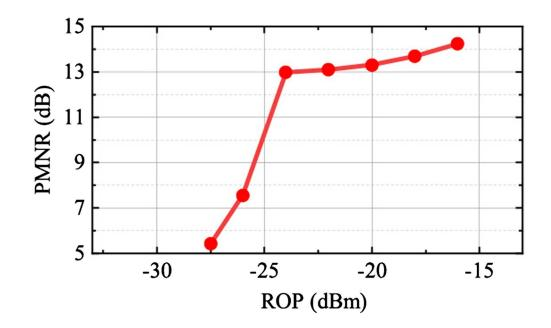
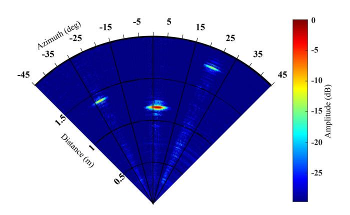
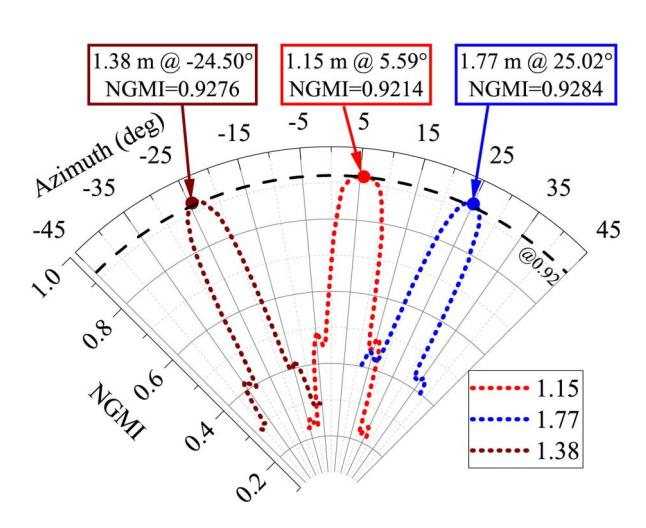
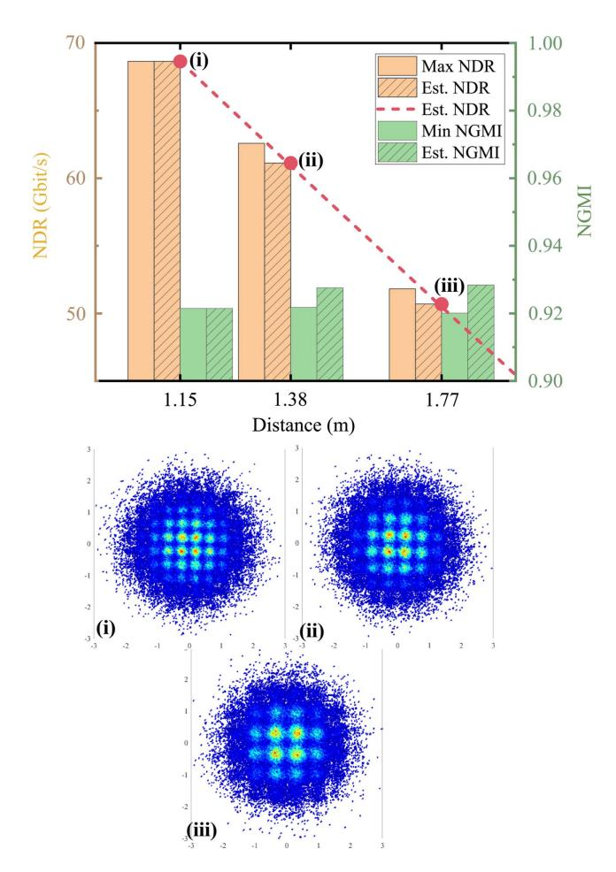

# Demonstration of radar-aided flexible communication in a photonics-based W-band distributed integrated sensing and communication system for 6G

Junlian Jia (贾俊连)1,2, Boyu Dong (董博宇)1,2, Li Tao (陶 理)3, Jianyang Shi (施剑阳)1,2, Nan Chi (迟 楠)1,2,4, and Junwen Zhang (张俊文)2\*

Received May 29, 2023 | Accepted December 13, 2023 | Posted Online April 17, 2024

This paper experimentally demonstrates a distributed photonics-based W-band integrated sensing and communication (ISAC) system, in which radar sensing can aid the communication links in alignment and data rate estimation. As a proof-of-concept, the ISAC system locates the users, guides the alignment, and sets a communication link with the estimated highest data rate. A peak net data rate of 68.6 Gbit/s and a target sensing with a less-than-1-cm error and a sub-2-cm resolution have been tested over a 10-km fiber and a 1.15-m free space transmission in the photonics-based W-band ISAC system. The achievable net data rates of the users at different locations estimated by sensing are experimentally verified.

**Keywords:** integrated sensing and communication; photonics-aided technique; W-band; radar-aided flexible communication.

**DOI:** 10.3788/COL202422.043901

### 1. Introduction

Looking forward to the future world in the 2030s, the sixth-generation wireless communication technology (6G) focuses on connecting everything intelligently with ultra-high data rates and ultra-reliable connections[1]. Higher frequency bands, such as the millimeter-wave (MMW), are considered to expand the limited spectrum resources[2]. Based on the MMW, a higher data rate of communication and the integrated sensing and communication (ISAC) system can be achieved and will perform an important role in  $6G^{[3]}$ . In addition, having an ultra-wide bandwidth and being naturally compatible with fiber-wireless integration, photonics-based MMW systems show their unique advantages in 6G radio access networks (RANs)[4]. However, a higher frequency means a smaller base station coverage[5]. Fiber-wireless integrated transmission would reduce the cost and reduce the size, thus helping the deployment of the increasing micro-base stations. As illustrated in Fig. 1, the central office produces the ISAC signal, and an MMW ISAC remote radio unit (RRU) serves the users a room. Fiber-to-the-room (FTTR) makes it easier to set up the ISAC RRU with the help of photonic techniques, and the ISAC RRU should have the ability of user sensing, beam alignment, and high data rate communication.

In the previous work, we have demonstrated a flexible photonics-based ISAC system and reached a data rate of 41.48 Gbit/s with a sensing resolution better than 1.53 cm[6]. However, the previous work on photonics-based ISAC systems usually lacks cooperation between sensing and communication. In this paper, we demonstrate a photonics-based W-band ISAC system that has the ability of distributed radar sensing signals processing and sensing-guided communication. The communication utilized the probabilistic shaping (PS) single-carrier modulation (SCM) to flexibly adjust the transmitting entropy, thus adjusting the net data rate (NDR) for the users at different locations to maximize the usage of the available capacity. The sensing utilized the linear frequency modulation (LFM) signal to actively detect the location of the users. Communication and sensing signals are multiplexed in time division and sent in different time slots, as shown in Fig. 1.

### 2. Principles

Flexible PS-based communication is a two-stage process that maximizes the data rate according to the link condition. To get the link condition in the first step, the signal-to-noise ratio

1 Key Laboratory of EMW Information (MoE), Fudan University, Shanghai 200433, China

&lt;sup>2 Shanghai ERC of LEO Satellite Communication and Applications, Shanghai CIC of LEO Satellite Communication Technology, Shanghai 200433, China

&lt;sup>3 Science and Technology on Electromagnetic Compatibility Laboratory, China Ship Development and Design Centre, Wuhan 430000, China

&lt;sup>4Peng Cheng Laboratory, Shenzhen 518055, China

\*Corresponding author: junwenzhang@fudan.edu.cn

Fig. 1. Illustration of fiber-to-the-room and ISAC RRU scene.

(SNR) is estimated by measuring the error vector magnitude (EVM) of the received signal[7] as

SNR 
$$\approx \text{EVM}_{\text{RMS}}^2 = \frac{\frac{1}{N} \sum_{n=1}^{N} |S_n - \bar{S}_n|^2}{\frac{1}{m} \sum_{n=1}^{m} |C_n|^2},$$
 (1)

where N denotes the total number of the transmitted symbols,  $S_n$  denotes the nth received symbol,  $\bar{S}_n$  denotes the reference constellation point of  $S_n$ , m denotes the order of the modulation, and  $C_n$  denotes the standard constellation points.

With the estimated SNR, referencing the Shannon limit as  $E = \log_2(1 + (\text{SNR}))$ , a Maxwell–Boltzmann distribution  $P_X$  is approximated to approach the source entropy of the PS signal to be transmitted in the second stage for the Gaussian channels[8]. According to  $P_X$ , the original bits are matched with a constant composition distribution match (CCDM)[9]. The stream is then ready to be sent after forward-error correction (FEC) coding and SCM modulation.

Criteria different from the bit-error rate are used to evaluate the quality of the PS signal transmission since PS introduces extra bits, which are generalized mutual information (GMI) and normalized generalized mutual information (NGMI)[10]. GMI indicates the maximum number of information bits that each transmitted symbol is able to carry in the channel as

$$H_X = -\frac{1}{N} \sum_{n=1}^{N} P_X(x_n) \log_2 P_X(x_n), \tag{2}$$

GMI 
$$\approx H_X - \frac{1}{N} \sum_{n=1}^{N} \sum_{i=1}^{m} \log_2(1 + e^{(-1)^{b_{n,i}} \Lambda_{n,i}}),$$
 (3)

where  $H_X$  denotes the source entropy of the transmitting signal after removing the PS overhead,  $x_n$  denotes the nth symbol,  $b_{n,i}$  denotes the ith bit of the nth symbol, and  $\Lambda_{n,i}$  denotes a random variable distributed according to Ref. [11]. Correspondingly, the maximum number of information bits that each transmitted bit is able to carry is then calculated as NGMI=  $1-(H_X-GMI)/m$ . When the NGMI is greater than the FEC code rate  $R_c$ , error-free decoding of the received signal will be achievable. Therefore, the achievable net data rate (NDR) can be further derived as

$$NDR = BW(H_X - m(1 - R_c)),$$
 (4)

where BW denotes the signal bandwidth. In this paper, we take 0.92 as the threshold of the NGMI, which corresponds to  $R_c = 0.84$ . The NDR is an important metric used to characterize the quality of the communication link. The higher the NDR, the better the link quality.

To maximize the usage of the channel capacity, a precise estimation of the SNR is essential. However, the SNR estimation takes extra resources from the conventional PS communication links. Noted under linear operating conditions, the power of the noise of the components in the system stays almost constant, and the power of the received signal directly dominates the receiving SNR. Therefore, we estimate the power of the received signal with the transmission attenuation in the free space, which is

$$A_{\rm dR}(d) \approx 20 \log_{10}(4\pi df/c),\tag{5}$$

where  $A_{\rm dB}(d)$  denotes the power attenuation in decibels (dB) of a signal with the center frequency of f (in Hz) being transmitted over a distance of d (in m), and  $c \approx 3 \times 10^8$  m/s denotes the speed of light. The difference in the SNR between two transmitted distances  $d_1$  and  $d_2$  would be simply  $A_{\rm dB}(d_1) - A_{\rm dB}(d_2)$ . Hence, the SNR estimation is converted to distance measurement based on a reference SNR baseline.

The distance is measured with the radar sensing signal in the ISAC system. Consider an LFM signal as

$$x_{\text{LFM}}(t) = \text{rect}\left(\frac{t}{T_{\text{LFM}}}\right) \exp(j2\pi f_0 t + j\pi k t^2), \tag{6}$$

where  $\operatorname{rect}(t)$  is the unit rectangular window function, which takes the value 1 when  $0 \le t \le 1$  and 0 at the others;  $T_{\text{LFM}}$  denotes the duration time of each LFM chirp;  $f_0$  denotes the starting frequency of the frequency modulation; and k denotes the slope of the chirp signal. When the echo LFM signal modulates the reference LFM signal, a frequency difference between these two signals will be collected, and the frequency difference represents the distance of the detected target. The relation between the frequency difference and the target distance is

$$\Delta f = k\Delta t = 2kD/c, \ D = c\Delta f/(2k), \tag{7}$$

where  $\Delta f$  denotes the frequency difference,  $\Delta t$  denotes the time difference between transmission of the LFM signal and the reception of the echo signal, and D denotes the target distance. The theoretical resolution of the distance detection is  $\delta_d = c/(2kT_{\rm LFM})$ , and the maximum unambiguous distance is  $D_m = cT_{\rm Period}/2$ , where  $T_{\rm Period}$  is the total time of the LFM chirp signal and the time gap between two chirps.

In addition to the distance measurement, the azimuth of the targeting user can be simply obtained with the help of a servo alignment device. It is noticed that when the spacing between the transmitting antenna and the sensing antenna cannot be neglected compared to the target distance, a correction of the angle should be introduced when the system works in communication mode. The radar sensing presents the target with the reference point of the middle of two antennas at the base station, while the communication requires the transmitting antenna itself to point directly to the user. The correction angle should be calculated as

$$\Delta\theta = \arcsin(D_{\rm ANT}/(2D)),$$
 (8)

where  $\Delta\theta$  denotes the angle correction, and  $D_{\rm ANT}$  denotes the spacing between two antennas of the base station.

### 3. Experimental Setup

We experimentally demonstrated the proposed photonics-based ISAC system, as illustrated in Fig. 2. The communication and radar signals are generated in the CO. The bandwidth of the communication signal is 15 GHz, while the LFM signal is 10 GHz, which is from 5 to 15 GHz, and the lower 5 GHz is reserved for the dechirped sensing signal[6]. The LFM chirp length is  $T_{LFM} = 34.13$  ns, and the time gap between two chirps is 34.13 ns as well. An arbitrary waveform generator (AWG) converts the generated digital signal to an analog signal with a sampling rate of 60 GS/s. The analog signal is amplified by an electrical amplifier (EA) and drives a Mach-Zehnder modulator (MZM). The laser source at the CO is an external cavity laser (ECL) working at the frequency of 193.1 THz. The modulated signal light passes through a circulator that separates the forward and backward signals and is then transmitted to the RRU. The length of the single-mode fiber (SMF) between the

CO and the RRU is 10 km, which is a typical length in the demonstrating scenario. Passing the second circulator at the RRU, the signal light is adjusted by a polarization controller (PC) and sent into a polarization-maintaining erbium-doped fiber amplifier (PM-EDFA). The output of the PM-EDFA is equally divided into two parts by a PM optical coupler (PM-OC). One part is further coupled with the local oscillator (LO), which is an ECL working at 193.1965 THz, for the photonicsbased up-conversion, and the other part is used as the radar reference signal. A photodiode (PD) with a bandwidth of 100 GHz generates the MMW signal by beating the signal light and the LO. The MMW signal is amplified by a power amplifier (PA) and sent by a horn antenna. The UEs receive the communication signal, amplify the MMW signal with a low-noise amplifier (LNA), and detect the baseband signal with an envelope detector (ED). The amplified output of the ED is collected by an oscilloscope (OSC) for communication demodulation.

The radar sensing signal is reflected by the UE and collected by a second horn antenna at the RRU. The distance between the transmitting antenna and the sensing antenna is 12.5 cm for minimizing the location error, the overall size, and the crosstalk transmitted directly between these antennas. Similar to the communication receiver at the UEs, the reflected signal is amplified and down-converted by an ED. The dechirp of the radar signal is accomplished based on the photonics components. An MZM is utilized to modulate the amplified down-converted reflected signal on the radar reference signal to generate the radar feedback signal that directly indicates the information of the detected targets, which acts as the distributed sensing at the RRUs. The radar feedback signal can be locally processed at the RRU as the target information has been extracted by photonics-based dechirping. To demonstrate the feasibility of the sensing unit deployment, the signal is sent back to CO through the circulators and the SMF to test the worst situation. An EDFA at the CO amplifies the radar feedback, and an optical band-pass filter (OBF) is applied to the signal before the signal is collected by a PD with 10 GHz bandwidth. The OBF retains the low frequency of the feedback signal and eliminates the residual LFM signal. The result of the fast Fourier transform (FFT) of the collected signal shows peaks at the detected targets, indicating the distance. The MMW components at the RRU and the UEs are loaded

Fig. 2. Experimental setup. The blue parts serve for communication, the yellow parts serve for sensing, and the green parts serve for both communication and sensing.

on one-dimensional (1D) servo alignment turntables for radar scanning and communication alignment. The turntables are controlled by digital signal processing (DSP) at CO.

# 4. Experimental Results and Discussion

A receiver located at 1.15 m is taken as the reference for the NDR estimation, where the baseline performance of the communication link is investigated. The transmitted constellation is based on a 256-QAM constellation and shape. Figure 3(a) shows the NDR with different peak-to-peak voltage (Vpp) of the AWG output. It is observed that when the Vpp of the AWG output is 240 mV, it is an optimized working condition for communication. Figure 3(b) further shows the NDR when the received optical power (ROP) varies with the 10-km SMF. The ROP is tested at the input port of the PM-EDFA in the RRU and adjusted with a variable optical attenuator (VOA) before the PC. The tested attenuation of the 10-km SMF in optical power is approximately 1.46 dB, and the NDR performance reaches the peak of 68.6 Gbit/s when the ROP is −2.6 dBm.

With the optimal parameters for the communication, the performance of the radar sensing is tested. We tested 5 targets at different distances as shown in Fig. 4. For the LFM signal we applied, the theoretical distance resolution is 1.5 cm, and the

Fig. 3. Achievable communication NDR with a distance of 1.15 m. (a) NDR vs Vpp. (b) NDR vs ROP.

Fig. 4. Radar spectrum of the 5 targets and the resolution with their distance error and the maximum and minimum PMNR labeled. Each spectrum is normalized by its peak value.

actual resolution, which is tested by measuring the −6 dB span of the target peak, is as low as 1.95 cm. All 5 peaks can be clearly distinguished from the noise.

Figure 4 presents the distance error concerning the manual measurements as well. All the errors are far smaller than the theoretical resolution, indicating a precise distance sensing performance. To further quantitatively analyze the performance of the sensing, we introduce the peak-to-maximum-noise ratio (PMNR) which indicates the difference between the target peak and the maximum noise. The PMNR reduces with the target distance increase due to the power attenuation of the reflected signal. The maximum PMNR of 16.31 dB is tested at 0.65 m, and the PMNR stays above 14 dB when testing the target at the distance of 1.58 m.

Figure 5 shows how the PMNR changes when the ROP varies for a target located at 1.15 m. The ROP is tested at the input port of the EDFA at the CO. The target information is carried by the signal in the frequency domain, and therefore the PMNR is not clearly affected by the length of the SMF. The SNR is not sufficient to support the FFT when the ROP is lower than −25 dBm, where the PMNR falls rapidly.

With the help of the servo turntable, the ISAC system has the ability to scan the area, find the users, and send data to the users at the highest available rate. We tested the ISAC system with 3 users located at different distances and azimuths as listed in

Fig. 5. PMNR when ROP varies for a 1.15-m target.

Table 1. The Details of the Users.

| Distance (m) | Azimuth (deg) | Δθ (deg) | ΔSNR (dB) | Estimated NDR (Gbps) |
|-----------------|------------------|-------------|--------------|-------------------------|
| 1.15            | 2.47             | 3.12        | 0            | 68.65                   |
| 1.38            | −27.10           | 2.60        | −1.58        | 61.12                   |
| 1.77            | 23.00            | 2.02        | −3.75        | 50.70                   |

Table 1. The SNR at 1.15 m is chosen as the baseline, and the ΔSNR is estimated by Eq. ([5](#page-1-0)) with the measured distance. Figure 6 shows the location map of these 3 users detected with the ISAC system with the azimuth step of 0.5°. Three targets are clearly detected and precisely located. The targets are smeared along the azimuth axis because of the beam width of the horn antenna, and the center of the targets is taken for the alignment.

With the aid of target sensing and azimuth correction, we have tested the guided communication performance. The measured distances are used to estimate the SNR, and the corrected azimuths are referenced to adjust the pointing of both turntables at the RRU and the UEs. The PS signals generated with the estimated SNR for each user are transmitted, and the NGMI is tested to verify the feasibility. Figure 7 shows the NGMI map of the 3 users with their PS signals. Though the −3 dB beam width of the antenna is 20°, which can be indicated from the figure, the NGMI falls rapidly on misalignment. Therefore, the alignment for high-speed data links is essential, and the ISAC system has the ability to find the best azimuth of communication.

Figure 8 further investigates the gap between the NDR estimated and the one practically tested. It can be noticed that the NGMI values with the estimated signals are not very close to the threshold of 0.92. Thus, we tested the highest achievable NDR after the alignment. The NDR gap is 1.46 Gbps (2.4%) for the 1.38-m target and 1.12 Gbps (2.2%) for the 1.77-m target.

Fig. 6. Location map of the 3 users collected by the ISAC system.

Fig. 7. Communication NGMI map of the 3 users when transmitting the signal with estimated entropy.

Fig. 8. Comparison between the achievable communication NDR and estimated NDR and corresponding NGMI, together with the PS constellations (Est., estimated)

# 5. Conclusion

In conclusion, we have demonstrated an ISAC system working with a W-band MMW for 6G access, which is photonics-based, distributed in sensing, and flexible in communication. The system can actively detect the users, target the users, and establish a high-data-rate communication link guided by sensing. With the SNR estimation guided by sensing, the NDR gap to the highest achievable NDR is less than 2.4%. A 68.65 Gbps transmission is verified through the 10-km SMF and the 1.15-m wireless transmission, with a sensing ability of resolution below 2 cm and an error lower than 1 cm. The estimated achievable net data rates of the users at different locations are experimentally verified.

# Acknowledgements

This work was partially supported by the National Key Research and Development Program of China (No. 2022YFB2903600), the National Natural Science Foundation of China (Nos. 62235005, 62171137, 61925104, 62031011, and 62071444), and the Major Key Project PCL.

### References

1. W. Tong and P. Zhu, 6G: The Next Horizon (Cambridge University Press, 2021).

- 2. N. Al-Falahy and O. Y. K. Alani, "Millimetre wave frequency band as a candidate spectrum for 5G network architecture: a survey," [Phys. Commun.](https://doi.org/10.1016/j.phycom.2018.11.003) 32, 120 (2019).
- 3. O. Li, J. He, K. Zeng, et al., "Integrated sensing and communication in 6G: a prototype of high resolution THz sensing on portable device," in Joint European Conference on Networks and Communications & 6G Summit (EuCNC/6G Summit) (2021), p. 544.
- 4. K. Wang, L. Zhao, and J. Yu, "200 Gbit/s photonics-aided MMW PS-OFDM signals transmission at W-Band enabled by hybrid time-frequency domain equalization," [J. Lightwave Technol.](https://doi.org/10.1109/JLT.2021.3062387) 39, 3137 (2021).
- 5. T. Bai, A. Alkhateeb, and R. Heath, "Coverage and capacity of millimeterwave cellular networks," [IEEE Commun. Mag.](https://doi.org/10.1109/MCOM.2014.6894455) 52, 70 (2014).
- 6. B. Dong, J. Jia, G. Li, et al., "Demonstration of photonics-based flexible integration of sensing and communication with adaptive waveforms for a W-band fiber-wireless integrated network," [Opt. Express](https://doi.org/10.1364/OE.472693) 30, 40936 (2022).
- 7. R. A. Shafik, M. S. Rahman, and A. R. Islam, "On the extended relationships among EVM, BER and SNR as performance metrics," in International Conference on Electrical and Computer Engineering (2006), p. 408.
- 8. F. R. Kschischang and S. Pasupathy, "Optimal nonuniform signaling for Gaussian channels," [IEEE Trans. Inform. Theory](https://doi.org/10.1109/18.256499) 39, 913 (1993).
- 9. P. Schulte and G. Bocherer, "Constant composition distribution matching," [IEEE Trans. Inform. Theory](https://doi.org/10.1109/TIT.2015.2499181) 62, 430 (2016).
- 10. J. Cho, L. Schmalen, and P. J. Winzer,"Normalized generalized mutual information as a forward error correction threshold for probabilistically shaped QAM," in European Conference on Optical Communication (ECOC) (2017), p. 1.
- 11. A. Alvarado, E. Agrell, D. Lavery, et al., "Replacing the soft-decision FEC limit paradigm in the design of optical communication systems," [J.](https://doi.org/10.1109/JLT.2015.2482718) [Lightwave Technol.](https://doi.org/10.1109/JLT.2015.2482718) 34, 707 (2016).