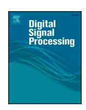
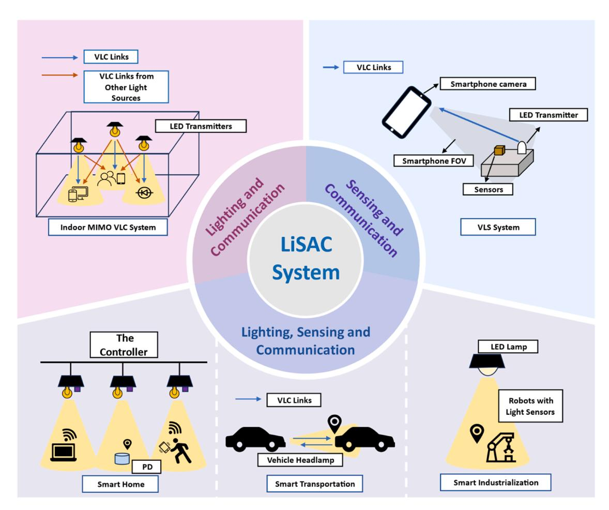
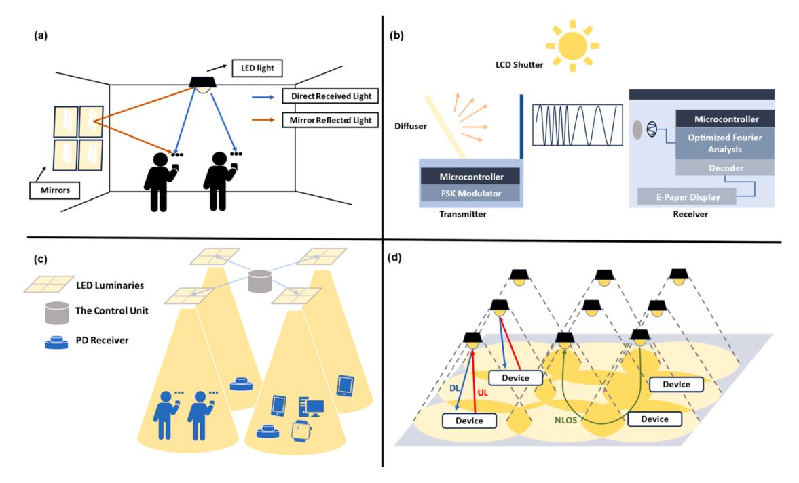
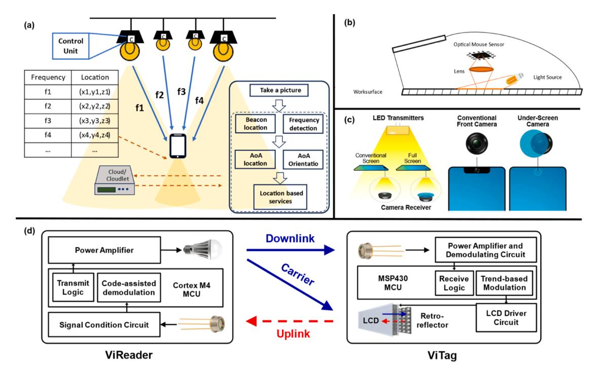
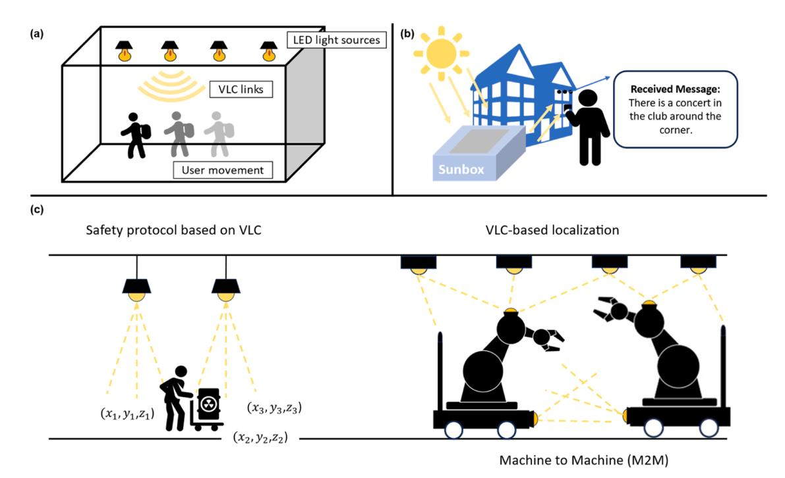
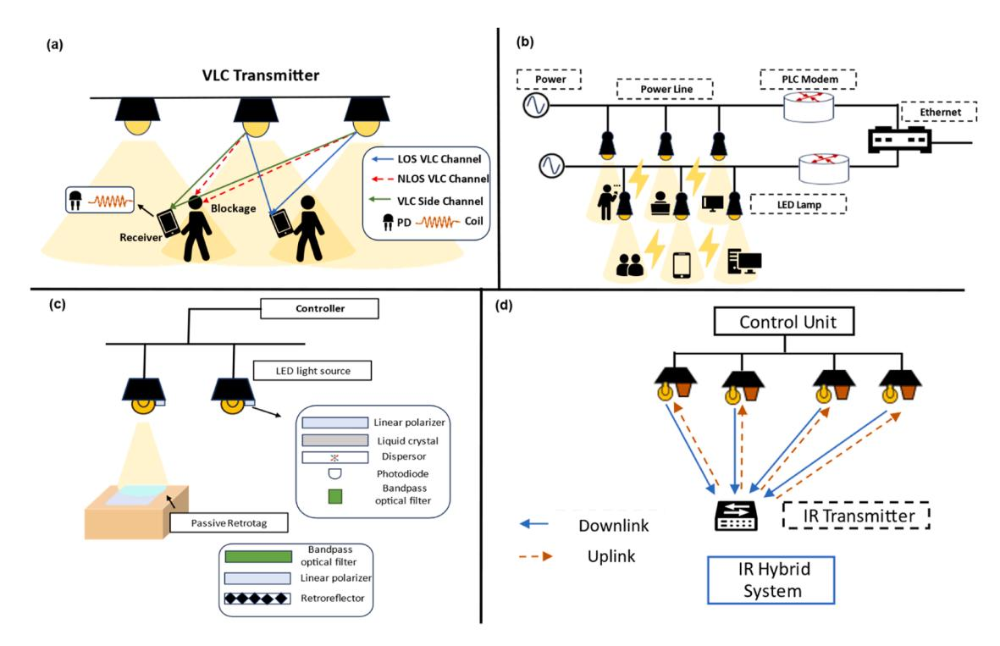
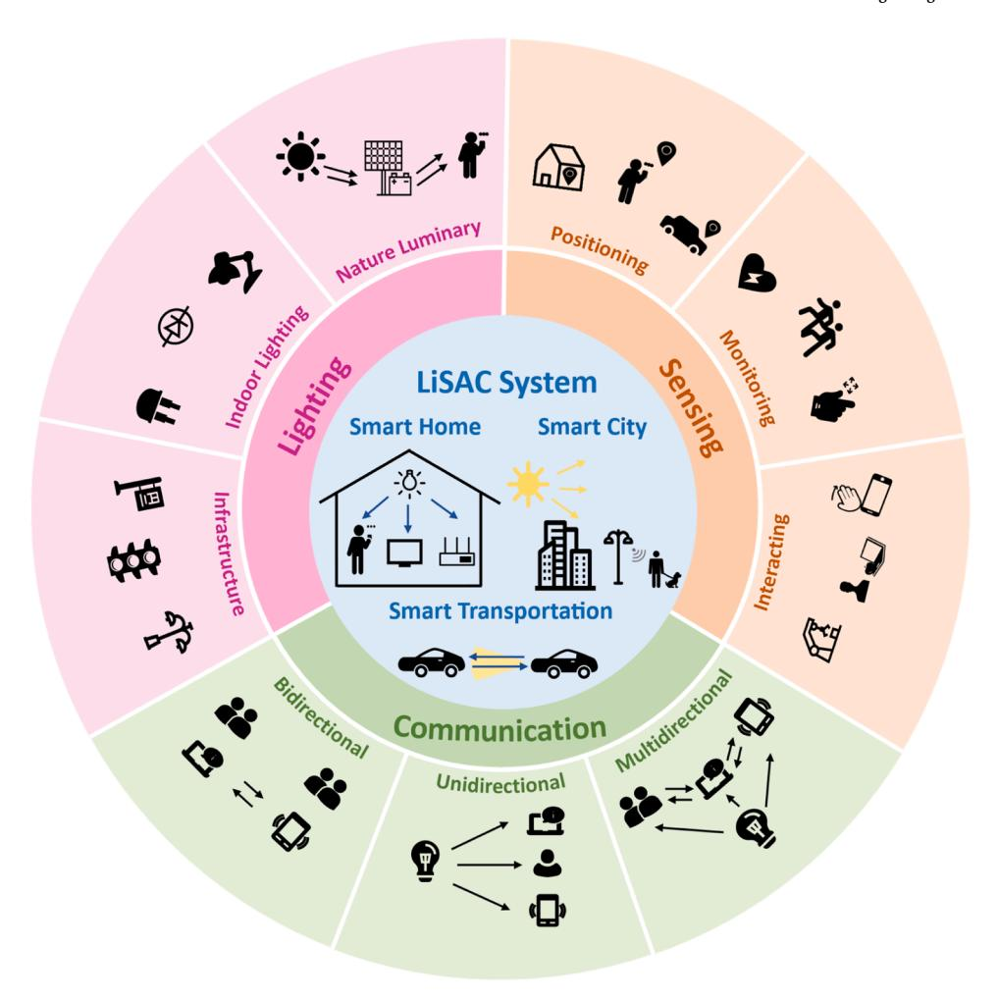

ELSEVIER

Contents lists available at ScienceDirect

## **Digital Signal Processing**

journal homepage: www.elsevier.com/locate/dsp

## Integrated sensing, lighting and communication based on visible light communication: A review

Chenxin Liang a, Jiarong Li a,b, Sicong Liu c,d, Fang Yang e, Yuhan Dong a,b, Jian Song a,e, Xiao-Ping Zhang a,f,g, Wenbo Ding a,b,f,\*

- a Tsinghua-Berkeley Shenzhen Institute, Tsinghua Shenzhen International Graduate School, Tsinghua University, Shenzhen 518055, China
- b Peng Cheng Laboratory, Shenzhen 518055, China
- c Department of Information and Communication Engineering, School of Informatics, Xiamen University, Xiamen 361005, China
- d National Mobile Communications Research Laboratory, Southeast University, Nanjing 210096, China
- e Department of Electronic Engineering, Tsinghua University, Shenzhen 100084, China
- f RISC-V International Open Source Laboratory, Shenzhen 518055, China
- g Department of Electrical and Computer Engineering, Ryerson University, Toronto M5B2K3, Canada

#### ARTICLE INFO

# Keywords: Visible light communication Visible light sensing Integrated sensing and communication

#### ABSTRACT

As wireless communication rapidly evolves and the demand for intelligent connectivity grows, the need for precise sensing integrated with efficient communication becomes paramount. While traditional Integrated Sensing and Communication (ISAC) methods have laid foundational groundwork, they grapple with environmental limitations and significant propagation losses. Visible Light Communication (VLC) emerges as a transformative solution characterized by its high-speed transmission, minimal latency, cost-efficiency, and seamless installation. This paper introduces the Lighting, Sensing, and Communication (LiSAC) concept for VLC and systematically reviews the technical aspects, such as channel characteristics, modulation techniques, and system design. Specifically, this paper presents the evolution of the LiSAC system, its integration with other communication technologies, its applications in various fields, and its challenges. At the end of this paper, we outlooked LiSAC in the future, in which high-quality communication will integrate pinpoint sensing accuracy.

## Introduction

In the rapid development of wireless communication, new modalities, and technological advances continually reshape our communication network structures [1–3]. As the fifth generation (5 G) network has been commercialized, endeavors are underway to conceptualize the framework of the next generation — 6 G. Foreseen as a tremendous advance in network infrastructure, 6 G aims to be characterized by heightened security, adaptability, intelligence, and optimized energy consumption [4]. Traditional wireless communication, from television broadcasts to cellular mobile communication, mostly relies on radio frequency (RF) signals to convey information. Recently, an increasingly crowded spectrum and limited resources have restricted its performance. Electromagnetic interference sets another restriction on its application scenarios. Therefore, to foster the development of the Internet of Things (IoT) [5], smart living spaces [6], intelligent healthcare [7], and advanced transportation systems [8], alternative

communication methods are being explored, such as Terahertz (THz) communication [9], quantum communication (QC) [10], etc. Among these methods, visible light communication (VLC) stands out, featured by its unlicensed ultrawide bandwidth from 430 THz to 790 THz. Meanwhile, VLC has accelerated transmission speed to guarantee its complementary position for indoor RF communication [11,12]. Furthermore, VLC's integration with indoor lighting, specifically via the ubiquity of energy-efficient light-emitting diodes (LEDs), underlines its potent viability for indoor communication, especially in electromagnetic interference-prone environments [13]. Modern infrastructures equipped with abundant luminaries and the physical properties of LED provide a natural platform for VLC, rendering it with characteristics of straightforward setup, economical implementation, minimal energy consumption and user friendliness [14–16]. Except for environmentally friendly indoor luminaries, ambient light like sunlight, can be modulated as information carriers in VLC, which features it with strong environmental sustainability. Additionally, VLC, as a novel

E-mail address: ding.wenbo@sz.tsinghua.edu.cn (W. Ding).

https://doi.org/10.1016/j.dsp.2023.104340

 $^{\ast} \ \ Corresponding \ author.$ 

communication paradigm, provides new insights for the field of digital signal processing. Optical data transmission emerges in at a high speed and prompts the development of IoT, human machine interaction and communication networks. Other optical technologies, for instance, optical computing, are also flourishing leading to an era of light.

Emergent networking paradigms necessitate the amalgamation of communication with auxiliary technologies, such as advanced sensing [\[17\]](#page-15-0), distributed learning [\[18\]](#page-15-0), and edge computing [\[19\]](#page-15-0). In addition to communication, VLC has spawned versatile sensing technologies. Notable examples include visible light positioning (VLP) and visible light sensing (VLS). VLP, capitalizing on VLC's intrinsic advantages, offers precise indoor positioning using ubiquitous luminaries and conventional photodiodes, making it a powerful contender for integration into the 6 G framework. Concurrently, VLS has broad application potentials ranging from human-device interactions to vehicle communications, emphasizing VLC's prowess in merging illumination, communication, and sensing functionalities. Accurate sensing is bound to be a key for future intelligent ecosystems, which has led to the conceptualization of integrated sensing and communication (ISAC). As an incorporation of wireless communication and sensing, ISAC exhibits potential in 6 G networking due to its dual capability of localization and communication [\[20\]](#page-15-0). ISAC's foundational concept originates from radar-based spectrum sharing, and recently technological strides in the wireless sensing arena have broadened its scope. Today's ISAC systems leverage diverse techniques like Wi-Fi, millimeter wave (mmWave), and THz [\[21](#page-15-0)–26]. Though innovative, each modality brings challenges, necessitating further exploration and optimization to realize their full potential in holistic network systems. Aiming to solve the present limitations of ISAC and satisfy the future network architecture, in this paper, we introduce a new concept: Lighting, Sensing, and Communication (LiSAC), i.e., the VLC-based ISAC systems. LiSAC, harnessing the full spectrum of capabilities offered by VLC, is characterized by its adaptability to varied environments, high-quality communication, and accurate sensing abilities. By drawing parallels from ISAC and augmenting it with VLC's advantages, LiSAC presents a promising horizon in the evolving development of wireless communication.

This review is organized as follows. In Section 2, an overview of VLC development and system is provided. The LiSAC system architecture is proposed and analyzed in Section 3, and the applications of LiSAC are introduced in Section 4. In Section 5, we summarize the challenges that LiSAC systems are facing and discuss the prospect of LiSAC. The conclusion is drawn in Section 6. Fig. 1 below gives a comprehensive overview of the review. [Table 1](#page-2-0) summarizes abbreviations of mentioned communication methods and sensing concepts. The contributions are summarized as follows:

- A comprehensive description of the VLC system's architecture has been performed, from fundamental concepts to its core components.
- A perspective on LiSAC has been proposed, involving an analysis of its underlying principles and unique architecture, and the exploration of hybrid LiSAC systems.
- The potential applications of the LiSAC system have been extensively investigated across various fields, such as healthcare, augmented reality, transportation systems, industrial automation, and smart homes.

**Fig. 1.** An Overview of the LiSAC system from three perspectives: integrated lighting and communication, integrated sensing and communication, and integrated lighting, sensing and communication.

**Table 1**Abbreviations and definitions

| Abbreviations | Definitions                                   |  |  |  |
|---------------|-----------------------------------------------|--|--|--|
| CSK           | Color Shift Keying                            |  |  |  |
| FOV           | Field of View                                 |  |  |  |
| ISAC          | Integrated Sensing and Communication          |  |  |  |
| LED           | Light Emitting Diode                          |  |  |  |
| Li-Fi         | Light Fidelity                                |  |  |  |
| MIMO          | Multiple-Input Multiple-Output                |  |  |  |
| mmWave        | millimeter wave                               |  |  |  |
| NOMA          | Non-Orthogonal Multiple Access                |  |  |  |
| OFDM          | Orthogonal Frequency Division Multiplexing    |  |  |  |
| OFDMA         | Orthogonal Frequency Division Multiple Access |  |  |  |
| оок           | On-Off Keying                                 |  |  |  |
| PD            | Photodetector                                 |  |  |  |
| RF            | Radio Frequency                               |  |  |  |
| RIS           | Reconfigurable Intelligent Surfaces           |  |  |  |
| THz           | Terahertz                                     |  |  |  |
| VLC           | Visible Light Communication                   |  |  |  |
| VLP           | Visible Light Positioning                     |  |  |  |
| VLS           | Visible Light Sensing                         |  |  |  |

 The prospects and associated challenges of the LiSAC system have been deeply analyzed, addressing existing VLC limitations, strategies to enhance VLC performance, potential expansions of VLC applications, and integrations with emerging technologies.

#### Basics of visible light communication

In this section, a comprehensive introduction to VLC will be made from the basic knowledge, including channel characteristics and modulation schemes, and from the VLC system's design in light sources, transmitters, receivers, and networks.

#### An overview of visible light communication

VLC refers to communication by modulated light waves, ranging from 380 nm to 750 nm wavelengths, to carry information [14]. VLC can date back to the end of the 19th century when Bell and his assistant invented the photophone, transmitting speech through modulated sunlight. In the 2000s, Tanaka et al. [27] proposed an indoor data transmission system utilizing white LED lights. The system reached a transmission rate of 400 Mbps. After Tanaka's work, an abundance of research has been done on the subject of using LED bulbs to transmit information. The light fidelity (Li-Fi) concept was later brought up in 2011 by Harald Haas and was fully interpreted in 2015 [28]. Till now, research on VLC has been increasing fast, and the technology has been implemented in varied scenarios.

#### Channel characteristics and models

Channel characteristics are one of the fundamental elements of a communication system. Studying the visible light propagation channel model is important to fully understand the VLC system. In this section, we will discuss the channel characteristics from the following aspects.

Light source. In most existing VLC systems, LED transmitters usually serve as the light source. LEDs have two advantages: luminous intensity and transmitted optical power. Luminous intensity is the unit that indicates the energy flux per a solid angle, which briefly refers to the brightness of LEDs from a certain angle. In [29], the calculation of luminous intensity and transmitted power  $P_t$  is given below

$$I = \frac{d\Phi}{d\Omega}, P_t = \int_{A_{\text{min}}}^{A_{\text{max}}} \int_{0}^{2\pi} \Phi_e d\theta d\lambda, \tag{1}$$

where  $\Phi$  is the luminous flux, and  $\Omega$  is the spatial angle.  $A_{max}$  and  $A_{min}$  are determined by the sensitivity curve of the photodiode.  $\Phi_e$  is the energy flux. The integral of LED power distribution in every direction is

the transmitted power.

Received power and path loss. The VLC channel model can be concluded below

$$Y(t) = \gamma X(t) \otimes h(t) + N(t), \tag{2}$$

in which, X(t) is the transmitted signal, h(t) is the impulse response,  $\otimes$  represents the convolution operation, N(t) is the noise, and  $\gamma$  is the detector responsivity. Assuming the radiance of LED follows the Lambertian radiation pattern, according to [30], the DC gain of an optical link channel is given as

$$H(0) = \begin{cases} \frac{(m+1)A}{2\pi D^2} cos^m(\phi) T_s(\psi) g(\psi) \cos(\psi), 0 \le \psi \le \Psi_c \\ 0, \psi > \Psi_c \end{cases}$$
(3)

A is the physical area of a photodetector (PD). The irradiance angle is  $\phi$ , and the incidence angle is  $\psi$ . D is the distance between the transmitter and the receiver,  $g(\psi)$  is the optical concentrator gain, and  $T_s(\psi)$  is the optical filter gain.  $\Psi_c$  is the FOV of the light source. The gain of an idealized optical concentrator is determined by the refractive index and FOV.

Combining (1) and (3), the direct received power of PD can be calculated as the product of DC gain and LED transmitted power. As for the path loss, it can be calculated as the division of the transmitter luminous flux and the receiver luminous flux.

Multipath propagation with reflected paths. In the former section, we have calculated the power of direct light. However, in reality, the light propagates in multiple paths. The receiver does not only receive light directly from LEDs but also reflects light from walls and other objects. From [30], considering only reflection from the wall, the first reflection channel DC gain is

$$dH_{ref} = \begin{cases} \frac{(m+1)A}{2\pi D_1^2 D_2^2} \rho dA_{wall} cos^m(\phi) cos(\alpha) cos(\beta) T_s(\psi) g(\psi) cos(\psi), 0 \le \psi \le \Psi_c \\ 0, \psi > \Psi_c \end{cases}$$

 $D_1$  is the distance between the reflection point and the LED light source.  $D_2$  is the distance between the reflection point and the receiver.  $\rho$  denotes the reflectance factor.  $dA_{wall}$  is the area of the reflection point, which is very small. m stands for the order of Lambertian emission.  $\alpha$  denotes the incidence angle from the light source to the reflection point, and  $\beta$  denotes the irradiance angle from the reflection point to the receiver.  $\phi$  is the irradiance angle from the light source to the reflection point.  $\psi$  is the incidence angle.

In addition to the propagation of reflected paths of walls, the received power is given as below

$$P_{received} = \sum_{i}^{n} \left\{ P_{ti}H(0) + \int P_{ti}dH_{ref}(0) \right\}. \tag{5}$$

 $P_{ii}$  refers to the transmitted power of the *i*-th LED. However, the actual situation is much more complicated. Reflections derive not only from walls but also from other objects. Furthermore, walls consist of diversified materials. Different materials of the reflection surface have various spectral reflectance [31].

*Noise.* The primary noise source of VLC is ambient light from the sun or other artificial illumination sources, shot noise from PDs or ambient light, and thermal noise of PDs [15,30]. Hence, the noises can be expressed as the integration of the above three types of noise. Noise induced by ambient light or other light sources aside from LED can be eliminated using an electrical high pass filter at the receiver because such noise is a DC interference.

#### Modulation and demodulation techniques

Modulation is an essential procedure for information transmission. Typically, a VLC system uses intensity modulation/direct detection (IM/

DD) due to the physical properties of LED luminaries. The light waves cannot be modulated by the amplitude or phase, and the information can only be encoded using light intensity. [32,33]. There are mainly two IM/DD modulation schemes: intensity modulation and color modulation. Intensity modulation utilizes the varying intensity of the light source to transmit data. Color modulation, on the other hand, conveys information by controlling the wavelength of light. Unlike other communication methods, VLC is closely related to indoor illumination. According to the IEEE 802.15.7 standard [34], its modulation schemes must enable the system to reach a high data rate without disturbing human behavior. In other words, the changes in light must not be perceived by humans. Therefore, the luminaries must be equipped with dimming functions and avoid flickering. In this section, several common modulation methods are presented below.

On-Off Keying (OOK). OOK is the simplest modulation scheme of VLC. This method utilizes the on and off state of LED light to represent data bit 0 and bit 1. The off state of a light source doesn't mean that the light is completely turned off. As long as the reduced light intensity can make it easy to distinguish these two states, it can be recognized as the off state. OOK, due to its easy implementation and low cost, has been widely used [35–38].

Variable Pulse Position Modulation (VPPM). There are two kinds of VPPM [39–41], as shown in the following illustration. (a) Pulse Width Modulation (PWM). PWM is realized by controlling the duration of a light pulse. Information in PWM is represented by variable pulse width, and different width denotes the corresponding digital symbol. (b) Pulse Position Modulation (PPM). Digital symbols are represented by the position of the pulse within a fixed interval in PPM, and the data is conveyed by the time delay between the start of the time frame and the start of the pulse.

Color Shift Keying (CSK). CSK is proposed to overcome the disadvantages of low data rates and dimming problems of OOK and VPPM by the IEEE 802.15.7 standard [34]. In CSK, the light source consists of at least three LED chips with the colors red, blue, and yellow. Similar to frequency shift keying (FSK), which uses different frequencies to convey information, it makes use of different luminary colors. The signal is modulated using the intensity of various colored lights. The receiver can receive an organized color pattern to decide what information is transmitted. As an improved method, CSK has drawn the wide attention of researchers in this field and facilitated many works [42–44].

Orthogonal Frequency Division Multiplexing (OFDM). In OFDM, the data stream channel is divided into parallel sub-streams over orthogonal sub-carriers, which enables the system to transmit multiple sub-carriers at the same time without interfering with each other. Therefore, OFDM has the advantage of mitigating inter-symbol inference. However, it is not a standardized modulation scheme; modifications are required for its application in IM/DD systems like VLC. Therefore, enhanced optical OFDM methods like asymmetrically clipped optical orthogonal frequency division multiplexing (ACO—OFDM), direct current biased optical orthogonal frequency division multiplexing (DCO—OFDM), etc., have been devised [1]. Implementation of OFDM in VLC has been done in a large number of studies [45–47]. Furthermore, OFDM can be integrated with other modulation schemes, such as OOK [48].

#### Design of VLC system

#### Light source and materials

The light source is a substantial part of the VLC system. The sources can be roughly classified into two, artificial light sources led by LEDs and natural light sources led by sunlight. With the development of solid-state lighting, LEDs have become the dominant artificial indoor illumination and are often used as VLC transmitters. The main structure of an LED is a p-n junction made of semiconductors such as gallium arsenide, gallium arsenide phosphide, gallium phosphide, or gallium nitride. LEDs work on the principle of electroluminescence. Applying voltage on LEDs, the electrons within combine with the holes in the junction, and this

combination releases energy in the form of photons, which will be seen as emitting light.

LEDs have several advantages, as below:

- Low energy consumption. LEDs are energy efficient and reduce 80% energy consumption than other illumination devices.
- Long lifespan. The standard industrial lifespan of LEDs is 100,000 h or about 10 years. The light intensity drops out to 70%, about 25,000 to 50,000 h.
- Low cost but high brightness. LEDs have a low cost but higher luminous efficiency than traditional light sources.

As a diverse light source, the materials, the luminescence principles, and the proposes of different types of LEDs vary. Table 2 compares several common types of LEDs.

Phosphor Converted LED (pc-LED). Pc-LEDs are a type of LED that uses phosphor materials to convert the narrow-band light emitted by the LED chip into a broader spectrum of light. White light can be generated by combining a blue or UV LED chip with yellow or red-green phosphors. The pc-LED is commonly deployed in VLC systems [50–52].

*Multi-chip LED*. Multi-chip LEDs are a type of LED that contains 3 or more chips with different colors, usually red, green and blue, in one package. This type of LED can produce different colors by combining various chips. Although pc-LEDs cost less, multi-chip LEDs have a wider bandwidth and are; therefore, widely applied in VLC systems [53,54].

*Micro LED* ( $\mu$ -*LED*). A  $\mu$ -LED is a panel display consisting of arrays of microscopic LEDs forming the individual pixel elements. The color of the emitted light depends on the semiconductor material of each pixel. The  $\mu$ -LED is flexible and can be applied in many scenarios, for example, high-speed VLC systems [55,56].

Organic Light Emitting Diodes (OLED). OLEDs use organic materials to generate light. The organic layer is composed of several sub-layers, the hole injection layer, the hole transport layer, the emissive layer, the blocking layer, and the electron transport layer. The emissive layer generates light by emitting photons when excited by an electric field. The OLED is featured with high brightness, high contrast, and flexibility, which is beneficial for improving system performance [57–59].

#### Transmitter design

LED luminaries often act as transmitters in a VLC system. The combination of illumination and transmitter is a special feature of VLC. According to IEEE 802.15.7 standard [34], the transmitter must have dimming functions and work without flickering to provide a healthy and safe illumination environment for humans. On many occasions, the light source acts as the transmitter. In the last section, we have already discussed materials and categories of the most widely used light sources, and in this part, we will concentrate on the dimming and flickering mitigation design of the transmitter.

An indoor light source is usually required to radiate white light for color rendering. There are mainly two methods for white light-emitting. First, it is by combining blue LEDs and yellow phosphor, common for pc-LEDs. The second method is deploying multi-chip LEDs to combine red, green, and blue. The light intensity of the transmitters also has strict standards. It is also worth noting that the transmitter must be able to produce an illuminance in a range of 300–1000 lux for office or residential purposes.

**Table 2**Comparison of different types of LEDs [[49],[50]].

| Category Parameter | pc-LED   | Multi-chip LED | $\mu	ext{-LED}$ | OLED    |
|-----------------------|----------|----------------|-----------------|---------|
| Bandwidth             | 3–5 MHz  | 10–20 MHz      | ≥300 MHz        | ≤1 MHz  |
| Cost                  | Low      | High           | High            | Lowest  |
| Efficacy              | 130 lm/W | 65 lm/W        | N/A             | 45 lm/W |
| Complexity            | Low      | Moderate       | Highest         | High    |

Another important demand for the transmitter is that it must not produce human-perceivable flickering. Through modulation and coding, flickering could be controlled at a level safe for humans. More detailed flickering mitigation methods will be discussed in section 5.

#### *Receiver design*

A typical receiver in VLC consists of a PD, an optical filter, an optical concentrator, and an amplification circuit. Transmitted light is detected in the receiver and then transformed into a current signal. Unwanted light signals like ambient light or light from other illumination are filtered out through the optical filter, which can reduce received noise and improve the signal-to-noise ratio. Interference filters, dichroic filters, and liquid crystal filters are common optical filters. The optical concentrator is used to collect and focus signal from the transmitter in order to increase received power. The concentrator can be Fresnel lenses, compound parabolic concentrators, or non-imaging concentrators. The amplification circuit aims to amplify and process electrical signals and improve signal quality.

Apart from PD-based receivers, image sensors are also used as VLC receivers. Image sensors can be integrated with devices like smartphones, vehicles, or cameras; therefore, they can be used in more scenarios and have better mobility. However, image sensors are more expensive and need more energy.

## *Network architecture*

The optical communication network has been a popular research topic [\[60\]](#page-16-0). A communication system can be divided into two layers: the physical layer and the media access control (MAC) layer. The physical layer is the lowest layer in a communication system, defining how data is transmitted, modulated, and received in the channel. It has been studied in sections 2.1 and 2.2 in the aspect of modulation schemes, channel characteristics, transmitter design, and receiver design. The MAC layer defines how data frames are transmitted over the medium. It is the key to realizing multiple transmitters and multiple receivers communication systems. Several prevalent methods used in the MAC layer will be introduced as follows.

*Time Division Multiple Access (TDMA)*. TDMA is a traditional channel access mechanism to divide single-frequency channels into multiple time slots or frames. In this way, more than one user can share the same frequency band without interfering with each other. TDMA can help solve resource allocation problems and improve communication quality [\[61\]](#page-16-0).

*Space Division Multiple Access (SDMA).* SDMA realizes multiple access through spatial diversity. Multiple LED transmitters and receivers arranged in different configurations in the VLC system enable the system to implement SDMA [\[62\]](#page-16-0).

*Carrier Sense Multiple Access (CSMA).* The IEEE 802.15.7 standard proposed two types of CSMA. The first type disables the beacons of the coordinator, and an unallocated random-access channel is used. Therefore, if a device wants to transmit, it has to wait for a random period of time, the back-off period, and check whether the channel is idle. If the channel is busy, then it has to wait for another random period and then access the channel again. The second type enables the coordinator signals, and the time is divided into signal intervals. Information such as contention access periods (CAP) and contention-free periods (CFP) is contained within the frame. To transmit light signals, the device must locate the start of the next back-off slot and wait for a random period of time before performing a clear channel assessment (CCA). If the channel is free, then the information starts broadcasting, or else it waits for more back-off slots until the next CCA. The implementation of carrier sensing multiple access/collision detection and hidden avoidance increased the saturation throughput by nearly 50% and 100% under the two- and four-node scenarios, respectively [\[63\].](#page-16-0)

*Orthogonal Frequency Division Multiple Access (OFDMA).* OFDMA is an extension of OFDM modulation in the physical layer. Similar to OFDM, OFDMA uses multiple sub-carriers for multiple access, and it aims to improve communication efficiency and flexibility. The OFDMA implementation in the VLC system has reached a data rate of 13.6 Mb/s [\[64\]](#page-16-0). In addition, OFDMA is often integrated with non-orthogonal multiple access (NOMA) to boost system performance [65–[69\].](#page-16-0)

*Code Division Multiple Access (CDMA).* CDMA, also known as OCDMA (Optical Code Division Multiple Access), uses orthogonal optical codes and OOK modulation to enable multiple users to share the same channel. Each device in the CDMA-VLC system is given a code so that the data can be encoded in the time domain by the on-off state of LED transmitters [\[70\]](#page-16-0).

## *Sensing based on visible light*

In addition to the communication medium, visible light is commonly applied as sensing signals likewise. As a sensing signal, visible light has the advantages of abundant source supply, easy acquisition, versatility, and high precision.

*Light-intensity-based/light-pulses-based*. Sensing based on light intensity-related features requires no complex instruments or deployment. Off-the-shelf PDs and LEDs can fit the basic conditions of the simplest VLS system. Automatically, intensity or pulse features become the mainstream VLS indicators. Early in 2003, Dietz et al. devised a smart illumination system only using one LED for both sensing and lighting [\[71\]](#page-16-0). Due to simplicity and efficiency, many recent works still consider intensity as their major sensing feature. To name a few, SMART [\[72\]](#page-16-0) is a cellphone in-air hand gesture recognition prototype, which classifies different gestures depending on the power of reflected light from hands received by smartphone ambient light sensors. LiT [\[73\]](#page-16-0) is a toothbrushing monitoring system utilizing only photosensors and commercial LED toothbrushes. The system relies on light intensity variation to establish an oral cavity model and identify user movements. Additionally, there are abundant light pulses related to sensing, such as DarkLight [\[74\]](#page-16-0), which enables VLC in dark environments using ultra-short LED light pulses.

*Spectrum-based*. The light spectrum is another widely used property of light. Compared to intensity, the spectrum contains more information, including wavelength, absorption lines, and emission lines, and is usually applied in precise sensing. For instance, SpecEye [\[75\]](#page-16-0) utilizes a PN junction for spectrum sensing under various conditions in order to detect screen light exposure. Iris [\[76\]](#page-16-0) is another spectrum-based system aiming for passive indoor localization.

*Polarization-based*. Polarization can occur in all kinds of waves. In light propagation, there are two kinds of polarization, linear polarization and circular polarization. Adding polarization property to light will enrich signal features detected by receivers [\[77\]](#page-16-0). Other light phenomena are often combined with polarization to provide more information. LiTag [\[78\]](#page-16-0) is notably an example that employs light polarization, birefringence, and interference to realize indoor localization.

#### **Overview of LiSAC system**

*LiSAC based on VLC* 

The concept of LiSAC derives from ISAC, and it aims to integrate lighting, sensing, and communication into one system. In order to equip the system with an illumination function, a connection among sensing, lighting, and communication is necessitated, and VLC is a perfect candidate to complete the task. The VLC-based LiSAC system benefits from LEDs' ubiquity. It has strong adaptability to various environments, especially indoor environments, and is easy to deploy. The signal receiver has a simple installation, and it can be integrated with mobile devices. Furthermore, the system can be ensured with VLC's stable highspeed communication and accurate sensing. In this section, we will introduce three types of system architecture of VLC-based LiSAC in detail: integrated lighting and communication, integrated sensing and communication, and integrated lighting, sensing, and communication.

## *Integration of lighting and communication*

A fundamental principle of VLC is that the system must be equipped with dimming control and avoid flickering; therefore, even the simplest VLC system can provide high-quality communication while simultaneously maintaining healthy illumination. A new design of light sources that can enable simultaneous data transmission and illumination consists of white LEDs and RGB LEDs [\[79\]](#page-16-0). The white LEDs are used for illumination, while RGB LEDs aim to transmit information. Apart from the modulation of light sources, accessories such as mirrors are often used to modify brightness and light uniformity. Mushfique et al. proposed a mirror-equipped system to reflect light to darker corners and improve the system signal-to-interference-plus-noise ratio [\[80\],](#page-16-0) as shown in Fig. 2(a). The addition of mirrors will promote the throughput of the communication system. Instead of using artificial luminaries, there is also a system that utilizes a liquid crystal display (LCD) shutter and a diffuser to collect and modulate sunlight, as illustrated in Fig. 2(b) [\[81\]](#page-16-0).

Li et al. provided a two-way VLC system with LED illumination, which supports simultaneous communication between two LED devices [\[84\]](#page-16-0). The system applied OOK modulation and Manchester encoding to reach the optimum trade-off between illumination and communication. To achieve brightness control, it usually requires two modulation schemes, one for data transmission and the other for brightness control. As an improvement, Siddique et al. designed an integrated lighting and communication system with brightness control using only one modulation method called variable-rate multi-pulse-position-modulation [\[85\]](#page-16-0).

The ability to realize multi-user communication is significant in the integration of lighting and communication systems. Narmanlioglu et al. introduced a centralized LED network architecture. Multiple LED light sources on the ceiling are the transmitters of the multiple input multiple output (MIMO) VLC system. The physical layer is built upon DCO-–OFDM [\[86\]](#page-16-0). The multi-user system uses frequency division duplexing and mmWave uplink. Inter-cell inference (ICI) and inter-user inference (IUI) are the two major factors that affect MIMO system performance. Yang et al. proposed a joint precoder and equalizer design based on interference alignment (IA) to mitigate IUI and ICI in multi-cell multi-user MIMO VLC systems [\[82\]](#page-16-0). The optimal transmit precoder and

equalizer are achieved by formulating the joint optimization problem by minimizing the mean squared error under the control of optical power constraints of the VLC system, as shown in Fig. 2(c). Another multi-user multi-cell system design is brought up by Yang et al., which depends on joint LED selection and precoding design [\[87\].](#page-16-0) DenseVLC [\[88\]](#page-16-0) is a massive cell-free MIMO VLC system that enables densely distributed LED transmitters to work simultaneously for multiple users. LightTour [\[83\]](#page-16-0), as shown in Fig. 2(d), is a VLC broadcast system for scenarios like museums. The system accesses points that employ visible light to broadcast audio streams to tourists and utilizes infrared light transmission for the uplink. Mirror-aided MIMO system is also a common design [\[89\].](#page-16-0) The system implements a mirror diversity receiver, which is able to block light from specific directions and enhance the channel gain of light from other directions to reduce channel correlation.

The integration of lighting and communication is an emerging trend in IoT. Wang et al. introduced an algorithm for communication and illumination comprehensively for IoT [\[90\].](#page-16-0) A joint optimization method is proposed to improve illumination uniformity and transmission rates by optimizing the distribution of light source and transmit power adapting the single frequency network.

## *Integration of communication and sensing*

The first integrated visible light communication and sensing system is the iVLC system, which was brought up in 2014 [\[91\].](#page-16-0) The system combines VLC networking and VLC sensing for large scales of mobile users. The system requires a large VLC network rather than a single link, as in many indoor VLC system, which only contains a single light source. iVLC realized posture sensing through composing shadow maps made by mobile users. The light sensors are installed on the floor and compute the illuminance of each LED beacon and shadow components from different light sources to form a shadow map for sensing.

After iVLC, more and more scholars are looking into the combination of sensing and communication. A new trend of integrating VLC and VLS is emerging. The receivers of these two technologies can be identical. A typical integrated system consists of an indoor light source as the transmitter, image sensors or cameras as the receiver, and a control unit. This combination will enable the system to be more versatile and efficient for various applications, for instance, VLP, which owns the

**Fig. 2.** Integration of lighting and communication. (a) Mirror-assisted indoor VLC system [\[80\]](#page-16-0). (b) Sunlight-based VLC system [\[81\].](#page-16-0) (c) Illustration of an indoor VLC luminary system [\[82\].](#page-16-0) (d) An indoor MIMO VLC broadcast system [\[83\].](#page-16-0)

advantages of simultaneous positioning and communication and is one of the most widely applied visible light sensing techniques. Theoretical analyses and in-depth studies of VLP performances and limitations are widely investigated. For example, Keskin et al. did research on the fundamental limitations of three-dimension VLP receivers in both synchronous and asynchronous systems, designed machine learning estimators based on direct and two-step positioning techniques, and compared performance between proposed estimators and theoretical derivations [\[96\]](#page-16-0).

Practical VLP algorithm [\[97,98](#page-16-0)], simulation [[99,100\]](#page-16-0), and system implementation are also prevalent research trends. An early VLP system was brought up in 2014. Kuo et al. proposed an indoor positioning system Luxapose [\[92\]](#page-16-0), which is composed of visible light beacons, smartphones, and a cloud server, as illustrated in Fig. 3(a). The front-facing cameras of smartphones are used to capture pictures periodically. Then, the pictures are processed to see whether there are beacons within. The beacons are used to modulate the LED light sources to perform OOK modulation and are composed of microcontrollers or programmable oscillators. If beacons are likely to appear in the picture, the picture will be decoded, and the beacon coordinate within the picture will be then extracted along with the modulated information. Once the identity and coordinate of the beacon are determined, the position can be calculated through the arrival of angle algorithm. The cloud server can assist the image processing and store the coordinate lookup table and identity lookup table.

Many innovations have been made in the early models and systems. Some of them focus on modifying light sources and attempt to use luminaries other than LEDs. Ma et al. introduced an indoor localization system for IoT devices enabled by visible light, Foglight [\[101\]](#page-16-0). The system takes advantage of digital light processing projectors, which will assign corresponding coordinates to each pixel of the projection area. The coordinates can help encode the projection area. In addition, the DLP projectors can modulate light using digital micro-mirror device chips inside. These chips consist of micro-optical mirrors. Each one of these mirrors can be flipped between two states, on and off, to modulate light by changing projecting images. When projecting images, the

projector plane pixel coordinates are transmitted along, which can provide localization information for IoT devices with low-cost, off-the-shelf light sensors. The sensors can be easily coupled with IoT devices and other sensors, such as thermometers. Therefore, the system enables high-accuracy localization with low energy consumption. Others have tried to improve the LED light source. Zhang et al. made an attempt to change the premise that the positions of LEDs are to be known for localization [\[102\]](#page-16-0). They proposed a system that utilizes two optical angle-of-arrival (AOA) estimators to localize the LEDs. Every estimator has four PDs in different orientations for receiving light signals. The estimator should be placed in the room center to reduce positioning errors. This method can fit the situation where the accurate position of LEDs is unknown, or the total number of LEDs are large.

Such an integrated system can play an important role in other functions, for example, orientation. Zhou et al. provided a simultaneous positioning and orienting (SPAO) scheme based on VLC, which doesn't rely on UE height, transceiver orientation alignment, or inertial measurement units [\[103\]](#page-16-0). Instead, a novel algorithm named particle-assisted stochastic search was used to solve the non-convex optimization problem brought by the received signal power (RSS) localization method. The simulation result shows that the proposed scheme has evident performance gain. Furthermore, integrated sensing and communication is a potential technique for IoT devices and deployment. In order to reduce power consumption for IoT devices and LiSAC systems, solar cells [[104](#page-16-0),[105](#page-16-0)] are an optimal choice to apply. For instance, a solar cell-based visible light sensing E-skin is designed [\[106\].](#page-17-0) Moreover, Liu et al. proposed a system employing camera image sensors and solar cells [\[107\]](#page-17-0). An LED lamp plays the role of the transmitter in the system, and a solar cell is used to receive the light signal and energy. The receiver device contains an environmental sensor and an LED that can send light signals back to cameras. In order to raise the uplink data rate, the camera sensor demodulates the rolling shutter pattern utilizing a second-order polynomial extinction ratio enhancement scheme together with thresholding schemes. Together with environmental sensors, the system can be employed in IoT applications for various purposes. Moreover, LiSAC can be introduced into smart devices. Centaur [\[93\]](#page-16-0), an input system, is

**Fig. 3.** Integration of sensing and communication. (a) Smartphone-based light positioning system [\[92\]](#page-16-0). (b) Illustration of an optical mouse [\[93\]](#page-16-0) CC BY 4.0. (c) Illustration of under-screen camera-based visible light communication and sensing system [\[94\]](#page-16-0). CC BY 4.0. (d) Retroreflector-based visible light sensing communication system [\[95\].](#page-16-0) Copyright 2017, Association for Computing Machinery.

designed to enable tangible interactions on displays. The system is built on the commercial optical mouse, as shown in [Fig. 3](#page-6-0)(b), and the light sensors within can receive the high-frequency light signal from different portions of the displays to realize real-time tracking. Realizing VLC on smartphone under-screen cameras for full-screen devices is also an interesting task. Ye *et al*. [\[94\]](#page-16-0) first proposed the concept of under-screen camera visible light communication and sensing, as illustrated in [Fig. 3](#page-6-0)  (c), and realized a pixel-sweeping algorithm on a prototype.

Visible light backscatter communication (VLBC) is derived from VLC. In the VLBC system, the transmitter and the receiver are the same light source. Retroreflectors and LCD shutters are often used in such systems to reflect and modulate light signals. VLBC systems have low energy consumption and are capable of providing long-range, ubiquitous communication; hence, integration of VLBC and sensing can be applied for a wide range of purposes, especially for IoT devices. PassiveVLC [\[95\]](#page-16-0)  is a typical VLBC-based system that is designed for battery-free IoT applications, as illustrated in [Fig. 3\(](#page-6-0)d). The system consists of two major parts: the ViReader and the ViTag. A ViReader is a typical VLC device that contains the LED light source and the control unit for signal modulation and data transmission. A ViTag is composed of a light sensor, a retroreflective fabric, a transparent LCD shutter, solar panels, and control circuits. For downlink transmission, ViReader sends information applying OOK modulation and light sensors on ViTag to receive and decode the data. For the uplink, the retroreflector reflects received light, and the reflected light is modulated through the LCD shutter, which is controlled by the MCU control circuit powered by solar panels.

#### *Integration of lighting, sensing, and communication*

The fact that light signals received by the sensing system can come from the same source of indoor illumination and the light sensors or image sensors are able to work for both communication and sensing, makes it possible for lighting, sensing, and communication to be integrated into one system. The system will inherit the advantages of VLC and has distinctive features of fine-grained environmental sensing, healthy lighting, and stable high-speed wireless communication with low deployment cost and less energy consumption.

Numerous algorithms and system models have been propounded to enable and optimize the LiSAC system, among which VLP optimization algorithms are particularly favored. Zhou et al. introduced a joint localization and orientation estimation for user equipment (UE) algorithm without previously knowing the LED emission power [\[110\]](#page-17-0). VLP is faced with three major challenges. First, the VLC RSS function leads to a non-convex optimization problem. Secondly, the power emission of LEDs and user orientation may remain unknown in practical cases. Lastly, there are unknown effects on VLP performance from determinants such as NLOS propagation, unknown emission power, and so on. To overcome these challenges, the brought-up algorithm exploits the hidden convex sub-structure to acquire a closed-form update rule for UE orientation and the LED emitting power. The successive linear least square method is employed for the non-convex optimization of UE location. Then the unknown UE location, as well as the UE orientation and the LED emitting power, will be iteratively optimized as per the obtained closed-form update equations until the proposed VLP algorithm converges to a stationary point of the non-convex SPAO problem. ECA-RSSR (Enhanced Camera Assisted Received Signal Strength Ratio) [\[111\]](#page-17-0) is another positioning algorithm that first acquires visible light incidence angles by cameras and then utilizes the received signal strength ratio measured by PDs to calculate the ratios of the distance between LEDs and receivers. This new algorithm can work for both 2D and 3D orientation-free positioning with three LEDs and achieve high coverage.

Ma et al. proposed a system model for integrated visible light positioning and communication (VLPC) [\[112\]](#page-17-0). The model contains one LED lamp and a mobile user with multiple PDs. The channel state information (CSI) is estimated based on localization results rather than sending pilot sequences, for the VLC channel model function is the receiver position. The estimation can reduce the system overhead significantly. Furthermore, the Cramer-Rao lower bound (CRLB) on the positioning error variance and the achievable rate expression for OOK modulation are derived in the system model. The system additionally applies the conditional value-at-risk and block coordinate descent method to solve this non-convex optimization problem and obtain a feasible solution. R-VLCP, retroreflective visible light communication and positioning, is another novel VLPC system model with the advantages of glaring-free, self-alignment, low-size, weight, and power and sniff-proof [\[113\].](#page-17-0) The system mainly consists of LEDs and retro-tags. The LED panels have PDs on them to sense the light signals reflected from the tags. The retro-tags are composed of corner-cube retroreflectors (CCR) with an LCD shutter placed on it. The uplink conveys tags' data, including the RSS value for positioning. Then the channel model to the arbitrary size of PD and CCR is generalized. An open-source ray tracing simulator RetroRay is also developed to validate the channel model, and the test results proved system reliability and showed that the size of PDs and density of CCRs improve communication quality and positioning performance. Wei et al. proposed the VIPAC, visible light integrated positioning and communication, multi-task learning (MTL) LiSAC framework in 2022 [\[114\]](#page-17-0). The framework combines lighting, sensing, positioning, communication, and channel estimation tasks to form a unified architecture. The MTL structure consists of a sparsity-aware shared network and two task-oriented sub-networks. This structure can fully extract inherent sparse features of visible light channels and balance the tasks to achieve maximum benefits. Federated learning is also introduced into the framework to devise a multi-user cooperative VIPAC scheme. From the simulation results, it turns out that VIPAC can significantly elevate the performance of channel estimation and positioning compared to existing systems.

Most existing LiSAC systems are built upon VLP systems, for instance, the RoCLight (Roaming in Connecting Light) system brought up in 2017 [\[115\].](#page-17-0) RoCLight is a lightweight, practical LED-Camera VLC system that provides roaming support and is capable of user tracking. In this system, there are three major components: ceiling LEDs as transmitters, smartphones as receivers, and an LED sensing module for roaming support. When mobile phone users move around, the sensing module of the light system can observe the subtle change of reflected light caused by the movements of users and complete mobility tracking, as shown in [Fig. 4](#page-8-0)  (a). Once the transmitter tracks the users, it automatically connects and sends messages. The messages are decoded utilizing the rolling-shutter effect of CMOS cameras. On this basis, users can receive messages coherently when passing luminaries cells of the RoCLight system.

There are other integrated positioning and communication systems, for example, LiTell [\[116\].](#page-17-0) Light sources in LiTell are unmodified fluorescent lights (FLs), which differ from most VLC and VLP systems. Most LED-based localization systems require circuit modification to the LED driver, while FL's driver can act as an oscillator with a resonance frequency, which is able to skip the procedure of circuit modification. Each FL flickers at a characteristic frequency, and to sample this frequency, optimizations are made on the smartphone camera's sampling mechanics and the rolling shutter effect. Amplifications are made as well to capture distinctive features of characteristic frequency. As for localization, every FL luminary's characteristic frequency is stored in the database. The smartphone cameras then take images near an FL and run sampling and amplifications to calculate the characteristic frequency and compare it with that in the database to estimate the position. Natural light sources such as sunlight can also be leveraged in LiSAC systems. For instance, Sunbox [\[108\]](#page-17-0) is an ambient light-biased system, as illustrated in [Fig. 4](#page-8-0)(b), which utilizes LCDs to modulate ambient light like sunlight and a smartphone camera to receive information.

In addition to the modification of light sources, there are other systems that utilize the NLOS channel to realize visible light sensing. For example, in 2022, Huang et al. introduced a 3-D NLOS VLP system employing a single LED and an image sensor [\[117\].](#page-17-0) A luminance distribution model is brought up for estimating the NLOS link channel gain.

**Fig. 4.** Integration of lighting, sensing, and communication. (a) Illustration of visible light human sensing. (b) Illustration of a sunlight-based LiSAC system [\[108\]](#page-17-0). (c) Illustration of industrial visible light-based communication and localization system [\[109\]](#page-17-0).

The system applies an optical camera communication (OCC) sub-system using the model to obtain the LED transmitter coordinates. The receiver camera captures light signals in two different exposure times, a long one and a short one, and two highlights can be found in the long exposure time picture. These highlights can be regarded as the projections of two virtual LED transmitters, which are in the symmetry and orthographic direction of the real light source. Hence, the receiver coordinates can be calculated from the pixel coordinates of two highlights and the LED coordinates using the image sensing method. Zhu et al. proposed an arcs method for VLP in various applications [\[118\].](#page-17-0) The method utilizes the light sources from a new perspective, where the arc characteristics of circular LED lamps are employed for positioning. The system has a circular luminaire layout. When a complete circular luminaire and an incomplete one are captured by the user's camera, the VLC-assisted perspective circle and arc algorithm (V-PCA) [\[119\]](#page-17-0) will be used. V-PCA, proposed in the former work, extracts geometric features to obtain the normal vector of the luminaire and then acquire the projections of a mark point and the center of the circular light source. Analyzing the normal vector and geometric information, the localization and pose of users can be calculated. If two incomplete circular luminaires are captured, an anti-occlusion VLC-assisted perspective arcs algorithm is introduced in this work to solve blockage problems of VLC. In implementation, a mobile phone is used as a receiver, and the prototype can achieve accurate real-time positioning.

LiSAC systems can be deployed for various purposes and environments. For instance, the light detection and ranging (LiDAR) technique [[120](#page-17-0),[121](#page-17-0)] has become a powerful supplementary tool for radar, especially in vehicles equipped with advanced driving assistance systems. Abuella et al. proposed a light detection and ranging system ViLDAR designed based on vehicle headlamps [\[122\]](#page-17-0). The system estimates speed by analyzing the received headlamp light power variation from approaching vehicles. LiSAC systems can also be widely employed in public service facilities such as schools, malls, and museums. Shi et al. propounded an integrated indoor positioning and broadcasting system [\[123\]](#page-17-0) based on the Internet of radio light. The system utilizes integrated visible light and a 5 G network to provide localization services, multimedia delivery on mobile devices and various interaction services for users. In many cases, LiSAC systems are implemented with IoT devices. Shao et al. introduced the design and prototype of RETRO [\[124\]](#page-17-0), the first 3D real-time tracking localization system, which can localize passive IoT devices without heavy sensing or significant modification on light sources. The system employs the RSSI from the retroreflectors and trilateration algorithm to realize positioning. Furthermore, LiSAC can play an important role in the Industrial Internet of Things (IIoT) for tracking and human-computer interaction [\[109\]](#page-17-0), as shown in Fig. 4(c). [Table 3](#page-9-0) below provides a performance comparision of existing LiSAC systems.

## *LiSAC on hybrid VLC*

VLC, as an emerging new wireless communication technology, although it has its advantages, also faces obstacles such as blockages of light and interference from ambient light sources. Under these circumstances, RF communication and other wireless communication methods can play a complementary role in maintaining communication quality. In addition, hybrid systems have stronger adaptability to various environments for the equipment of two different communication methods. A hybrid LiSAC system can work on two or more networks. The combination can improve the capacity, reliability, security, and diversity of a LiSAC system. In the following sections, we will introduce several common hybrid systems based on the categories of combined methods.

## *Hybrid VLC-RF system*

RF communication is one of the most widely used communication technology. It utilizes frequencies in the electromagnetic spectrum associated with the propagation of radio waves, ranging from about 20 kHz to 30 GHz with the advantages of long communication distance, high data rate, MIMO support, and adaptability to varied environments.

Many models, algorithms, and schemes are proposed for the hybrid VLC-RF system. For instance, Zeng et al. provided a hybrid Wi-Fi Li-Fi network with ultra-high speed and low latency [\[129\].](#page-17-0) OFDAM-based resource allocation is utilized for the Li-Fi system, and an enhanced evolutionary game theory is also propounded for the hybrid system. Hu et al. proposed an optimization scheme for resource allocation and

**Table 3**  Performance analysis of LiSAC systems.

| Reference     | Functions |               |         | Communication Evaluation |                                                                  |            | Sensing Accuracy           |                      | Prototype |
|---------------|-----------|---------------|---------|--------------------------|------------------------------------------------------------------|------------|----------------------------|----------------------|-----------|
|               | Lighting  | Communication | Sensing | BER (b)/ PER (p)      | Maximum Throughput (t)/ Goodput (g)/Data Rate (d)/ MBE (m) | SNR        | Localization Precision     | Orienting Error   |           |
| [79]          | √         | √             |         | ≤ 10− 6(b)               |                                                                  | 15.6 dB |                            |                      |           |
| [80]          | √         | √             |         |                          | 2 Mbps(t)                                                        |            |                            |                      |           |
| [84]          | √         | √             |         | 10− 4 (p)                | 2.5 Kbps(g)                                                      |            |                            |                      | √         |
| [86]          | √         | √             |         |                          | 207.98 Mbps(d)                                                   |            |                            |                      |           |
| [82]          | √         | √             |         | ≤ 10− 3(b)               | 40Mbps(t)                                                        |            |                            |                      |           |
| [87]          | √         | √             |         |                          | 4.8 bit/s/Hz                                                     |            |                            |                      |           |
| [92]          | √         | √             | √       | 10− 4(b)                 |                                                                  |            | 90% within 10 cm           |                      |           |
| [101]         |           | √             | √       | 10− 4(b)                 |                                                                  |            | 95% within 0.315 cm        |                      | √         |
| [102]         |           | √             | √       |                          |                                                                  |            | 4.46 cm (RMSE)             |                      | √         |
| [103]         |           | √             | √       |                          |                                                                  |            | 90% within 10 cm           | 0.07 m 5 deg         |           |
| [107] [95] |           | √ √        | √ √  |                          | 1 Kbps 1 Kbps uplink (d)                                      | 20 dB      |                            |                      | √ √    |
| [113]         | √         | √             | √       |                          |                                                                  |            | 90% within 5 cm            |                      |           |
| [124]         | √         | √             | √       |                          |                                                                  |            | 90% within 2 cm            |                      | √         |
| [114]         | √         | √             | √       |                          |                                                                  |            | 90% within 10 cm           |                      |           |
| [111]         | √         | √             | √       |                          |                                                                  |            | 80% within 8 cm            |                      |           |
| [116]         | √         | √             | √       |                          |                                                                  |            | 90% within 10 cm (stable)/ |                      | √         |
|               |           |               |         |                          |                                                                  |            | 90% within 25 cm (walking) |                      |           |
| [110]         | √         | √             | √       |                          |                                                                  | 40 dB      | 0.5 m                      | 0.0048 m 0.17 deg |           |
| [115]         | √         | √             | √       |                          | 150 Kbps (t)                                                     |            |                            |                      | √         |
| [117]         | √         | √             | √       |                          |                                                                  |            | 90% within 22 cm           |                      | √         |
| [118]         | √         | √             | √       |                          |                                                                  |            | 90% within 10 cm           |                      | √         |
| [123]         | √         | √             | √       |                          | 45.25 Mbps(d)                                                    |            | 0.18 m                     |                      | √         |

network selection in heterogenous VLC/RF wireless networks [\[130\]](#page-17-0). Wang et al. investigated the maximization of energy efficiency and sum achievable rate employing transceiver association and power allocation in a multi-user VLC-RF hybrid system [\[131\]](#page-17-0).

HVLP [\[132\]](#page-17-0) is a typical hybrid RF-VLC indoor positioning system for automatic robots. The system modifies LED luminaries with ZigBee

**Fig. 5.** LiSAC on hybrid VLC. (a) VLC side RF channel system illustration [\[125\].](#page-17-0) (b) An indoor broadband broadcasting system based on PLC and VLC [\[126\]](#page-17-0). (c) IoT-based LiSAC system [\[127\]](#page-17-0). (d) IR-VLC hybrid system [\[128\].](#page-17-0)

**Table 4**  Performance analysis of hybrid LiSAC system.

| Reference | Hybrid Method | Communication Evaluation |                   | Sensing Evaluation    | Prototype            |
|-----------|---------------|--------------------------|-------------------|-----------------------|----------------------|
|           |               |                          | Maximum Data Rate | SER (s)/BER (b)       | Positioning Accuracy |
| [132]     | RF            |                          |                   | 5.8 cm (Median Error) | √                    |
| [194]     | RF            |                          | 10− 3(s)          |                       | √                    |
| [126]     | PLC           | 48 Mb/s                  |                   |                       | √                    |
| [138]     | PLC           | 5 Mb/s                   |                   |                       | √                    |
| [127]     | IoT           |                          |                   | 90% within 12 cm      | √                    |
| [128]     | IR            | 3.75 Gb/s                |                   |                       |                      |
| [151]     | OCC           |                          | 10− 4(b)          |                       | √                    |
| [152]     | UVA           | 361.1515 Mb/s            |                   |                       |                      |

radios, and the transmitter can emit both light signals and RF signals. The localization of HVLP can be divided into two stages. In the first stage, the receivers obtain the Zigbee RSSI streams to locate the room where the robot resides. In the second stage, the system utilizes the VLP system to obtain the precise location of the robots. Zhang et al. proposed a cooperative hybrid VLC-RF system, which consists of a cluster of LED transmitters, a relay, and a destination [\[133\].](#page-17-0) Relays are designed to aid the data transmission between LEDs and destinations. VLC is applied in the relay-LED link, and RF communication is applied in the relay-destination link. In the system, relays are randomly distributed in the coverage of LEDs, while destinations are distributed out of the LED coverage. In these models and networks, the RF system and the VLP system work separately. In 2020, Cui et al. [\[125\]](#page-17-0) proposed a complementary VLC-RF system as well. The system aims to solve the blockage problem of VLC. When the VLC link is blocked, the system will utilize the side RF channel to maintain communication. The receiver contains a light sensor for VLC signals and a coil for RF signals, as [Fig. 5\(](#page-9-0)a) suggests. However, on many occasions, the RF system works simultaneously with the VLC system. Tran et al. proposed a hybrid RF-VLC ultra-small cell network (USCNs), which is composed of multiple optical angle-diversity transmitters, a multi-antenna RF access point (AP), and multiple terminal devices [\[134\]](#page-17-0). RF communication in the network plays a complementary role as a power transfer system. Although USCNs can provide high-capacity, high quality-of-service (QoS), and low-latency wireless communication, the drawbacks of high-power consumption and short transmission range cannot be ignored. Therefore, except for the combination of RF communication and VLC, a novel collaborative RF and lightwave resource allocation scheme is also proposed in the work to solve the RF AP resource allocation optimization problem.

## *Hybrid VLC-PLC system*

Power line communication (PLC) uses electric power lines as the medium to transmit information. Due to the development of the Internet, digital signal processing technology and very large integrated circuits, PLC can be employed in varied applications for remote control, such as home automation and home networking [\[135\].](#page-17-0)

Abundant research has been done on the integration of PLC and VLC [[136](#page-17-0),[137](#page-17-0)]. Such systems can enhance their ubiquity in sensing and communication. The powerline provides electricity and serves as a core network for the LiSAC system, as explored in [[126](#page-17-0),[138,139\]](#page-17-0). A typical model is illustrated in [Fig. 5](#page-9-0)(b). In detail, Zhang et al. proposed a PLC-based visible light network (VLN) [\[140\]](#page-17-0) to realize indoor mobile device tracking and continuous communication. A backend server and powerline backbone are employed as center control of LED APs, which are dynamically clustered depending on the indoor conditions. In the same year, Hu et al. [\[141\]](#page-17-0) proposed PLiFi, a hybrid Wi-Fi-VLC network based on the use of PLC. PLiFi aims to provide a cost-effective method for LED-Internet connection and solve the uplink communication problem existing for VLC. The power line network contains two modems: PLC-VLC modem and PLC-Wi-Fi modem. For the downlink, the

Internet sends the packet first to Wi-Fi APs, then to the LED transmitters, and the LED transmitters will send the packets to end devices. For the uplink, the Wi-Fi APs are directly connected to the end devices.

To optimize the power allocation of the PLC-VLC system, Kashef et al. propounded a parallel RF and PLC-VLC hybrid system [\[142\]](#page-17-0). On the basis of the system, a convex problem is formulated to calculate the minimum transmit power. Feng et al. [\[143\]](#page-17-0) studied the power allocation for the PLC-VLC system as well. The proposed network employs NOMA techniques to increase the downlink bit rate. And a power allocation strategy is devised for the network analyzing the power relationship between PLC and VLC.

#### *VLC and IoT*

IoT is an emerging technology that prompts the economy and industry development. IoT, as an intelligent network, connects smart devices, exchanges information, and realizes multiple purposes such as localization, identification, monitoring, etc. [\[144](#page-17-0)–147]. The promotion of IoT will create tremendous value for various industries and solve obstacles in communication, artificial intelligence, etc.

Due to the ubiquity of LED illumination, LiSAC can be easily employed in IoT systems. Warmerdam et al. provided an IoT lighting system that utilizes VLC for providing connectivity among sensors and luminary devices [\[148\]](#page-17-0). The sensor can provide information for lighting control and act as a data source for other services in the building. The system is validated in simulations and tested in an office lighting testbed. Sho *et al*. [\[127\]](#page-17-0) proposed a more comprehensive visible light localization system PassiveRETRO, for IoT applications, as [Fig. 5\(](#page-9-0)c) illustrates. The system utilizes a retroreflector and LCD shutter to make a completely passive tag for IoT devices to be connected with LED luminaries. The prototype of PassiveRETRO is tested and can achieve centimeter-level positioning accuracy when deploying multiple IoT devices. In addition, Chen et al. introduced a Li-Fi-enabled bidirectional IoT communication system [\[149\]](#page-17-0). Visible light and infrared light are employed respectively as downlink and uplink. To maximize energy efficiency, the NOMA technique is applied to optimize the power allocation of the system.

## *VLC and other communication*

Except for the categories mentioned above, there are other hybrid VLC systems. For instance, IR (Infrared Radiation) VLC system. Alsulami et al. proposed a VLC system with an IR uplink [\[128\]](#page-17-0). Every LED luminary is equipped with a four-branch angle diversity receiver to receive signals from the IR transmitters, as [Fig. 5\(](#page-9-0)d) illustrates. Another IR uplink scheme is proposed by Chen et al., who combined IR communication with Li-Fi [\[150\]](#page-17-0). The performance of an IR uplink transmission system, considering the effects of blockage and random device directions, is estimated in the work. To improve evaluation accuracy, the transmission model is extended on the basis of pulse amplitude modulation with single carrier frequency domain equalization.

Moreover, there is a hybrid OCC-VLC system. Nguyen et al. proposed

an indoor OCC/VLC system [\[151\].](#page-17-0) In the system, OCC and VLC work simultaneously to receive light signals from the same LED light sources. OCC image sensors capture the low-frequency signals, while VLC PDs receive the high-frequency signals. Thus, the hybrid system can be used for multiple indoor applications with a low deployment cost.

Unmanned aerial vehicles (UAV) have been applied in a wide range of human activities, and the integration of UAVs and VLC is able to provide massive connectivity for versatile applications. Pham et al. investigated the NOMA UAV-assisted VLC system, formulated a joint problem of power allocation and UAV placement, and proposed a corresponding solution using the Harris Hawks optimization algorithm [\[152\].](#page-17-0) The solution can boost the system performance and maximize the overall rate of all users. [Table 4](#page-10-0) makes a performance comparision among mentioned hybrid methods as below.

#### **Application of LiSAC**

Due to LiSAC's feature of simultaneous sensing and communication, it can play a major role in many scenarios, for instance, underwater communication [\[153](#page-17-0),[154](#page-17-0)], intelligent transportation, and automatic industry. In this section, common applications of LiSAC will be explored as below.

## *Healthcare and patient monitoring*

LiSAC systems have demonstrated substantial potential for transforming healthcare and patient monitoring [\[155\]](#page-17-0), particularly through the incorporation of VLC. An instrumental application is in the real-time monitoring of vital signs and environmental variables. Research shows that bidirectional multi-hop VLC, a feature of LiSAC systems, can be employed for efficient and extensive indoor fine particulate matter monitoring [\[156\].](#page-17-0) This capability is crucial in indoor healthcare facilities, where monitoring environmental factors directly impacting patient health is critical.

Beyond environmental monitoring, the LiSAC system shows promise in improving emergency response in healthcare settings. Several hybrid systems of VLC and traditional PLC, as explored in [[157,158\]](#page-17-0), can offer an uninterrupted communication channel. This hybrid approach has the potential to enhance the timeliness and efficiency of emergency medical interventions, specifically in indoor hospital applications.

Further adding to the versatility of LiSAC systems, VLC also plays an important role in patient localization and activity sensing, contributing to heightened patient safety and care. The ability to accurately localize patients indoors, supported by VLC-assisted dead reckoning [\[159\]](#page-17-0), aids in advanced patient monitoring. Meanwhile, the use of ceiling photosensors for activity sensing through VLC can enable real-time monitoring of patient activities, bolstering patient safety measures [\[160\]](#page-17-0). Furthermore, VLC can be applied to food quality analysis. BabyNutri [\[161\],](#page-17-0) for instance, estimate the macronutrient in baby food through light spectrum reconstruction.

#### *Augment reality and entertainment*

In the realm of augmented reality and entertainment, LiSAC systems, particularly with their VLC capabilities, have begun to make a noticeable impact. One of the most intriguing applications of VLC in this context involves activity sensing, as illustrated by [\[160\]](#page-17-0). The use of ceiling photosensors for visible light-based activity sensing can significantly improve user experiences in AR/VR environments, enabling more precise and natural interactions within digital worlds.

Furthering this level of interaction, the reconstruction of hand poses using visible light is possible to introduce a new dimension of user engagement in AR/VR experiences [\[162\]](#page-18-0). The ability to accurately replicate and interpret users' hand movements through visible light technologies can enable more immersive and interactive experiences in gaming, design, and other multimedia applications. Taking user interaction a step further, the advent of through-screen visible light sensing empowered by embedded deep learning [\[163\]](#page-18-0) has opened new avenues for intuitive and seamless human-computer interaction. This breakthrough allows devices to perceive and interpret a broad range of user inputs, fostering richer engagement in digital entertainment environments.

Meanwhile, the concept of Light-In-Light-Out (Li-Lo) displays [\[164\]](#page-18-0)  represents another innovative use of LiSAC technology. By harvesting and manipulating light, Li-Lo displays provide novel forms of communication, potentially transforming the way we interact with digital media and enabling more engaging light shows and public displays. In addition, Visible light landmarks for mobile devices offer a compelling application of VLC [\[165\].](#page-18-0) By modulating LED lighting systems, data can be encoded to guide devices within indoor environments. This advancement can enhance applications like indoor navigation, location-based services, and augmented reality while also supporting low-power needs.

#### *Automotive and transportation systems*

LiSAC systems, when incorporated into automotive and transportation systems, have demonstrated significant potential for enhancing both safety and efficiency. Particularly, the adoption of VLC for vehicle-to-vehicle communication has shed light on its viability under practical considerations [\[166\].](#page-18-0) The comprehensive modeling and performance investigation show that VLC systems can provide efficient communication and diverse properties, thereby ensuring more robust and reliable vehicle-to-vehicle connections.

The robustness of vehicular VLC systems is further substantiated by the fundamental analysis of vehicular light communications presented in [\[167\].](#page-18-0) The study's findings emphasize the system's resilience, particularly in the mitigation of sunlight noise, an integral aspect that strengthens VLC's viability in diverse lighting conditions and reinforces its effectiveness in improving road safety. This is further exemplified by the development of an IEEE 802.11-compliant system specifically for outdoor vehicular VLC [\[168\]](#page-18-0). Compliance with a widely recognized standard not only demonstrates the technological maturity of VLC but also enhances its interoperability with other wireless communication systems. This development holds significant promise for seamless communication in complex vehicular networks.

Looking beyond vehicle-to-vehicle connections, the application of VLC extends to infrastructure-to-vehicle communication as well [\[169\]](#page-18-0). The channel modeling and performance analysis indicate that VLC can facilitate efficient communication between infrastructure and vehicles, contributing to the optimization of traffic management and the reduction of road accidents. Moreover, the concept of vehicular VLC networks, as explored in [\[170\],](#page-18-0) goes a step further, envisaging an entire communication network built upon VLC. This networking approach can significantly improve data transmission among vehicles, potentially aiding in real-time traffic updates, efficient navigation, and emergency alerts.

## *Industrial automation*

In industrial automation, LiSAC systems are beginning to play an influential role. Especially the characteristic of low energy consumption renders it a potential choice for Industry 4.0. It takes large amounts of transmitters and sensors to deploy an industrial communication and sensing system, which leads to large energy consumption and waste. However, LiSAC points out a path where existing lighting and surveillance cameras can be applied to industrial communication and sensing. The systems will decrease unnecessary carbon output and work with sustainability [\[190\].](#page-18-0) The versatility and capabilities of VLC, in particular, have sparked innovative developments in various aspects of industrial operations. The implementation of long-range visible light communications using polarized light intensity modulation has

demonstrated the significant potential for VLC to enhance industrial processes [\[171\]](#page-18-0). The POLI system allows for long-distance communication, which can be particularly beneficial in large-scale industrial environments where reliable, wide-range communication is crucial.

Moreover, VLC finds application in the realm of robotics within military warehouses and distribution centers. The VLC-UWB hybrid (VUH) network provides a unique solution for indoor industrial robots [\[172\].](#page-18-0) By incorporating VLC into the operation of industrial robots, the VUH network can enhance the precision and reliability of robotic tasks while improving the efficiency of warehouse operations.

On a related note, the precise indoor localization capabilities of VLC offer significant benefits for mobile robot operations. The use of VLC for indoor localization of mobile robots [\[173\]](#page-18-0) enhances their navigation capabilities in dynamic industrial environments. This could lead to greater efficiency and accuracy in tasks like inventory management, quality control, and complex assembly.

## *Smart homes and cities*

LiSAC systems, especially with the implementation of VLC, are paving the way for transformation within the realms of smart homes [\[174\]](#page-18-0) and cities. There is a natural platform for LiSAC implementation in modern infrastructures due to the ubiquity of indoor LED luminaries. Hence, it needn't much modification on the original indoor structures or any peripherals, for light sources are everywhere. This feature provides users with great convenience, increases user satisfaction and guarantees an ideal smart home blueprint. A striking illustration of this is the capability of VLC to facilitate human identification and tracking [\[175](#page-18-0), [176](#page-18-0)]. This opens the door to personalized experiences within smart homes, enhancing user interactions and security measures.

Furthermore, advances in indoor localization within smart buildings have been made possible through high-precision VLC systems [\[177](#page-18-0), [178](#page-18-0)]. This high-precision localization supports a variety of applications within smart homes, including efficient energy management and improved security measures. Practical applications of human sensing are also within reach [\[179\]](#page-18-0). This could potentially enable more automated and interactive environments, such as light and temperature controls based on occupant location and activities, paving the way for truly personalized user experiences. Integration of VLC with other technologies like Wi-Fi and UWB can result in improved room occupancy estimation capabilities [\[180\]](#page-18-0). Occupancy data collected in real-time can help efficiently manage energy usage within smart homes and buildings.

The integration of LiSAC systems into smart homes and cities is paving the way for interactive, energy-efficient, and user-centric environments. Advancements in human sensing, localization, and interactivity, combined with seamless integration with existing technologies, suggest a bright future for smart home and city applications of LiSAC.

## *Application of wireless communication signals*

*Wi-Fi.* Wi-Fi signals have been implemented in a wide range of fields [\[181\],](#page-18-0) for instance, respiration sensing [\[182\]](#page-18-0), posture recognition [\[183\],](#page-18-0) indoor localization [\[183\]](#page-18-0), material identification [\[184\],](#page-18-0) etc. Wi-Fi is a relatively mature technology compared with VLC; however, it lacks a security guarantee and has higher energy consumption. In addition, VLC can support high-density deployment and large-scale networks, while Wi-Fi signals will easily interfere with each other.

*mmWave*. mmWave is also a powerful RF sensing signal, and there are mmWave-based ISAC systems [\[24\]](#page-15-0). It can achieve high-precision sensing and relatively strong resistance to interference [\[185\].](#page-18-0) Nevertheless, VLC outstands mmWave on the hardware implementation, for mmWave devices need delicate beamforming and antenna design.

*RFID*. Radio frequency identification (RFID) is a common method for tracking and recognition [\[186\];](#page-18-0) therefore, it provides great convenience for logistics or inventory management, manufacturers, transportation, etc. However, VLC can provide localization, tracking and monitoring

services with higher precision and security.

## **Challenges and perspectives**

VLC-based LiSAC system has the advantages of high transmission speed, low energy consumption, ubiquitous sensing ability, etc. In section III and section IV, we have discussed the fundamental principles of the VLC LiSAC system and existing possible applications. It is evident that the LiSAC system has shown great potential in many fields. Yet, LiSAC is also faced with many challenges. In this section, we will analyze these obstacles, limitations, and corresponding solutions. Meanwhile, we will also look into LiSAC's prospects and list a few possible trends for its future development.

## *Overcoming VLC limitations and obstacles*

Undoubtedly, the LiSAC system will encounter the same obstacles and limitations as VLC does. In order to provide a healthy luminary environment and guarantee communication quality and system performance, it is essential to overcome these obstacles. In the following sections, we will introduce several existing problems and corresponding solutions. [Fig. 6](#page-13-0) shows the functions of LiSAC and its potential applications.

## *Blockage of light*

The visible light is likely to be blocked by human bodies, furniture, and other barriers, which is one of the biggest problems that VLC is facing. The blockage could cause a failure of communication and reduce user satisfaction. Solutions from several perspectives have been proposed to alleviate, reduce or eliminate the influence of barriers.

*Applying multiple transmitters and receivers*. When there are multiple components in the communication system, it is more likely that if one channel fails, another one is ready to compensate. Therefore, the MIMO system tends to have stronger resistance against the influence of light blockage or even boosts up system performance. Fath et al. investigated the MIMO VLC system performance under blockage [\[187\]](#page-18-0). A 4 × 4 MIMO system with various algorithms is tested, and it turns out that blocking 4 of the 16 links improves the BER performance of spatial multiplexing MIMO by more than 20 dB.

*Applying the NLOS channel*. In-depth studies on the NLOS channel of VLC have been done for decades. In [188–[190\],](#page-18-0) the NLOS channel and propagation are investigated and analyzed from different perspectives, and the channel characteristics are given. The LiSAC system can utilize the NLOS channel to maintain communication when the LOS link is not available. Zhang et al. designed a VLC NLOS link based on mobile phone cameras [\[191\]](#page-18-0). The camera only receives reflected light signals from the floor. Utilizing the moving exponent average [\[192\]](#page-18-0) algorithm to reduce the blooming effect and improve performance, the system can achieve a transmission rate of 5 Kbps at a distance of 100 cm.

*Applying complementary RF communication.* In section III, we have introduced RF-VLC hybrid systems. RF communication can play a complementary role in the LiSAC system when visible light signals are not available. Cui et al. proposed a method of employing a VLC side RF channel produced by OOK modulation of LEDs [\[193\].](#page-18-0) The VLC receiver can be equipped with coils to cope with RF signals. When the light signals are blocked, the system can switch to the RF signal instead to continue the communication. A concrete system is presented and validated in their later work [\[194\]](#page-18-0).

#### *Flickering problems*

Illumination is a key function of the LiSAC system. To guarantee the quality of illumination, the luminaries must be stable and clear. Moreover, flickering can cause serious detrimental physiological changes in humans and damage to human health[\[195\].](#page-18-0) Therefore, it is essential to eliminate the flickering effect in the LiSAC system.

According to the IEEE 802.15. 7 standard [\[196\],](#page-18-0) flickering frequency

**Fig. 6.** Applications and prospects of LiSAC.

should be above 200 Hz to avoid human percipience. The standard introduces run length limited (RLL) codes to mitigate flickering effects. Manchester coding, 4B6B, and 8B10B coding are some of the most commonly used RLL methods to avoid flickering. Other coding methods are also applied for flickering mitigation. For instance, Mejia et al. designed codes based on finite-state machines [\[197\]](#page-18-0). Other methods such as applying CSK modulation [\[198\]](#page-18-0) and other optimized modulation [[199](#page-18-0),[200](#page-18-0)].

## *Uplink transmission*

To better integrate LiSAC with other devices and employ it in varied environments, building a bidirectional VLC system is inevitable. How to build the uplink has been a challenge for the VLC system. In most circumstances, terminal devices such as mobile phones or IoT devices cannot be easily modified or directly equipped with light sources, for it may lower user satisfaction. Another problem of VLC uplink is its relatively low transmission rate due to the influence of ambient light noise, limited modulation bandwidth, power restriction, etc. There are several schemes to realize uplink transmission without interfering with users and speed up the transmission rate.

*Utilizing RF/IR signals as uplink.* In order to avoid interference from the downlink, noise from ambient light, and extra lighting devices that disturb users, RF or IR signals are often used for VLC uplink, as introduced in Section 3.2.1 and Section 3.2.4.

*Applying retroreflection.* Retroreflectors can directly reflect the incident light to the source; therefore, the uplink signal won't be interfered with by ambient light or incident light. Many systems employed this technique, such as RetroTurbo [\[201\],](#page-18-0) a VLBC system. The system

consists of a tag and a reader. The tag is composed of liquid crystal modulators (LCM) with retroreflectors. The LCM will modulate reflected light signals and send the information. Similar to RetroTurbo, many retroreflection systems utilize LCD shutter or LCM to modulate uplink signals [[37](#page-15-0)[,202,203](#page-18-0)]. The major restriction on this kind of system is the shutter's physical properties, such as its millisecond-scale response time, which confines its use in high-speed transmissions.

*Utilizing relays.* The relay can serve as a hub between the user and the transmitter. Yang et al. proposed a relay-assisted system [\[204\].](#page-18-0) The user will first transmit data to the relay, and then the relay sends information to the control unit. DCO–OFDM is employed in the system to raise spectral efficiency.

## *Expanding LiSAC applications and integration*

Hybrid LiSAC systems, including RF-LiSAC, PLC-LiSAC, IoT-LiSAC, and some others, have been introduced in Section 3.2. However, LiSAC has the potential to further cooperate with technologies in other domains such as RIS, device-to-device technology (D2D) [\[3,](#page-15-0)[205](#page-18-0),[206](#page-18-0)], ultra-wide bandwidth (UWB) [\[207,208](#page-18-0)], machine learning [\[209\],](#page-18-0) etc. Next, we will focus on some prevalent integrations for the LiSAC system.

## *Integrated with RIS*

RIS is a promising technology that can be widely used for multiple purposes, especially in 6 G communication networks [\[210\]](#page-18-0). RIS has excellent performance for providing solutions in skip-zone communication [\[211](#page-18-0)–213] for its ability to change incident signal propagation routes. Hence, RIS is an excellent tool for LiSAC to solve light blockage problems and improve system performance. An intelligent reflecting surface-assisted VLC system model is estimated in [\[214\]](#page-18-0) and proves RIS's ability to ease the blockage problem. Moreover, Abumarshoud et al. investigated potential RIS applications in Li-Fi technology and proposed visions for solving the LOS link blockage problem utilizing RIS [\[215\].](#page-18-0) Ndjiongue et al. propounded a digitally RIS-assisted optical wireless communication (OWC) scheme and discussed the potential of employing RIS further in OWC [\[216\]](#page-19-0). In addition, RIS can expand the communication range and improve signal quality, which is suitable for MIMO systems [\[217\]](#page-19-0).

RIS can be roughly divided into two types: intelligent metasurface reflector (IMR) and intelligent mirror array (IMA). Prevalent IMR material is liquid crystals, graphene, and photoconductive semiconductors. Liquid crystal materials such as LCD shutters are now commonly used in LiSAC systems [[218](#page-19-0),[219\]](#page-19-0). RIS has already been put to use in some LiSAC systems. Singh et al. proposed a VLC-based V2X system utilizing RIS [\[220\].](#page-19-0) To solve the problem that VLC LOS links are easily blocked by buildings and infrastructures, the system utilizes RIS as relays to enable vehicle communication to infrastructures and maintain communication between vehicles.

## *Integrated with UWB*

UWB, as a radio technology, is designed for short-range communication at a high transmission speed and a low power level and is able to provide precise localization and tracking service [\[221\]](#page-19-0).

Due to its features, UWB can be used in the LiSAC system as an uplink or transmission link to solve light blockage problems. Ozdemirli ¨ et al. proposed a contactless scribe-line channel-leakage monitor, which contains a photovoltaic converter for powering from indoor illumination, a VLC downlink for selecting one among multiple monitors, and an ultra-wideband impulse-radio (IR-UWB) uplink for transmitting measured leakage data in the form of impulse repetition frequency [\[222\].](#page-19-0) In the work [\[172\]](#page-18-0), UWB is employed as the primary transmission link and VLC for verification of received downlink packets.

## *Integrated with machine learning*

Machine learning is advancing at an unprecedented pace, and it has been integrated into diverse fields due to its exceptional performance in applications like data processing, image recognition, and more. Machine learning has also been used in wireless communication systems to improve system performance [\[223\].](#page-19-0)

Machine learning can be employed in the LiSAC system from many different perspectives. For example, in the modulation aspect, Khadr et al. proposed a machine learning-based massive augmented spatial modulation scheme [\[224\]](#page-19-0). Support vector machine, logistic regression, and neural networks are respectively introduced to reduce the ASM computational complexity. The technology is frequently utilized in channel modeling as well. Turan et al. designed a novel machine learning-based framework, which evaluates three different methods, multilayer perceptron neural network, radial basis function neural network, and random forest learning and comprises systematic data pre-processing, hyper-parameter selection, training, and validation steps to obtain the best-predicting model [\[225\].](#page-19-0)

For practical implementations, a machine learning-assisted VLP system is designed [\[226\]](#page-19-0). The localization can be divided into two stages: area classification and positioning. A random forest algorithm is used in the area classification stage and divides the room into a centric area with four wall corner zones. In the positioning stage, for the center, a rotatable PD is employed to directly determine the location, and for the corner zones, an integrated extreme learning machine (ELM) and the density-based spatial clustering of applications with noise algorithm (DBSCAN) are devised to improve positioning accuracy. Moreover, Su et al. proposed a four-dimensional VLP model based on a convolutional-recurrent neural network [\[227\].](#page-19-0) The neural network is devised to extract the nonlinear association between RSS values and position coordinates, and simulation results show that the deep

learning-assisted model can reach centimeter-level accuracy.

#### **Conclusion and perspectives**

With the evolution of the 6 G network, novel communication technologies are continually being developed. The ubiquity of LED luminaries and the fusion with illumination and sensing not only makes VLC stand out as an excellent alternative but also enables it to be a potential instrument for ISAC. Inheriting advantages from two technologies, LiSAC has promising prospects in numerous applications.

In this review of LiSAC, we first introduce the development and the fundamental principles of the VLC system, including channel characteristics, modulation schemes, and the basic design of a typical VLC system. Furthermore, we analyze the light source materials, transmitter and receiver design, and the network architecture of the VLC system. Next, a comprehensive overview of the LiSAC system is made from 3 aspects: the integration of lighting and communication, the integration of sensing and communication, and the integration of lighting, sensing, and communication. In each part, the principles, performance, and innovations of existing systems or algorithms are analyzed. In addition, further discussions on the hybrid LiSAC system and LiSAC applications are made. Although LiSAC is developing fast, it is still faced with many potential problems and challenges. This paper reflects on the current obstacles LiSAC systems are dealing with, as well as summarizes existing potential solutions. At last, the review digs into other possible technologies that can be applied in LiSAC systems to improve their performance and extend application fields.

Even though many in-depth studies have been done on LiSAC systems, there are still many potential future directions for us to explore. As such, we summarize several research topics and trends as follows.

*Integrated Optical Carrier Information Network*. The incorporation of optical fiber communication and optical wireless communication is a solution for present limitations on network capacity. Zhang et al. [\[228\]](#page-19-0)  have proposed a fusion network structure, which enables multiple parallel channels concurrently and improves the network throughput. Combining LiSAC with the fusion network will mitigate the drawbacks of both systems, for example, the maintenance difficulty of fiber and the easy blockage of visible light. In addition, it will equip the system with sensing and illumination ability, expanding applications for varied purposes in the 6 G network.

*Data Enabled Optical Infrastructure.* In the digital age, data is indispensable for a variety of applications. Data enabling aims to improve the productivity and capacity of different services. LiSAC, as a promising technology, can provide high-quality data acquisition and transmission support. Its simple integration with the IoT system enables easy access to obtain device or user information [\[229\]](#page-19-0). At the same time, data enabling can optimize network structure for LiSAC and promote system efficiency.

*Ubiquitous Optical Computing.* Utilizing photons to realize information processing and computing has great potential in numerous fields, such as artificial intelligence, communication, etc. The programmable photonic circuits expand the path of general-purpose photonic chips and are a potential tool for sensor optimization [\[230](#page-19-0)–232]. Furthermore, photon-based modulation schemes [\[233\]](#page-19-0) have the potential to be applied in VLC channels and promote noise resistance ability and channel utilization. With the support of optical computing, LiSAC will reach higher sensing precision, improve communication quality, and acquire stronger resistance to interference.

#### **CRediT authorship contribution statement**

**Chenxin Liang:** Conceptualization, Investigation, Writing – original draft. **Jiarong Li:** Conceptualization, Investigation, Writing – original draft. **Sicong Liu:** Writing – review & editing. **Fang Yang:** Writing – review & editing. **Yuhan Dong:** Writing – review & editing. **Jian Song:**  Writing – review & editing. **Xiao-Ping Zhang:** Writing – review &

editing. **Wenbo Ding:** Conceptualization, Supervision, Writing – review & editing.

## **Declaration of Competing Interest**

The authors declare that they have no known competing financial interests or personal relationships that could have appeared to influence the work reported in this paper.

#### **Data availability**

Data will be made available on request.

#### **Acknowledgment**

This research is supported in part by the Tsinghua Shenzhen International Graduate School-Shenzhen Pengrui Young Faculty Program of Shenzhen Pengrui Foundation(No. SZPR2023005), the Shenzhen Science and Technology Program (No. JCYJ20220530143013030), the Shenzhen Science and Technology Innovation Committee -Shenzhen Stable Supporting Key Program (No. WDZC202008180920-33001), the Guangdong Innovative and Entrepreneurial Research Team Program (No. 2021ZT09L197), the National Natural Science Foundation of China (No. 62104125), the Natural Science Foundation of Fujian Province of China (No. 2023J01001), the Open Research Fund of National Mobile Communications Research Laboratory, Southeast University (No. 2023D10).

#### **References**

- [1] [Z. Wang, T. Mao, Q. Wang, Optical OFDM for visible light communications, in:](http://refhub.elsevier.com/S1051-2004(23)00435-9/sbref0001)  [2017 13th International Wireless Communications and Mobile Computing](http://refhub.elsevier.com/S1051-2004(23)00435-9/sbref0001)  [Conference \(IWCMC, 2017, pp. 1190](http://refhub.elsevier.com/S1051-2004(23)00435-9/sbref0001)–1194.
- [2] [Y. Niu, W. Ding, H. Wu, Y. Li, X. Chen, B. Ai, Z. Zhong, Relay-assisted and QoS](http://refhub.elsevier.com/S1051-2004(23)00435-9/sbref0002)  [aware scheduling to overcome blockage in mmWave backhaul networks, IEEE](http://refhub.elsevier.com/S1051-2004(23)00435-9/sbref0002)  [Trans. Veh. Technol. \(2019\) 1733](http://refhub.elsevier.com/S1051-2004(23)00435-9/sbref0002)–1744.
- [3] [X. Xiao, M. Ahmed, X. Chen, Y. Zhao, Y. Li, Z. Han, Accelerating content delivery](http://refhub.elsevier.com/S1051-2004(23)00435-9/sbref0003)  [via efficient resource allocation for network coding aided D2D communications,](http://refhub.elsevier.com/S1051-2004(23)00435-9/sbref0003)  [IEEE Access \(2019\) 115783](http://refhub.elsevier.com/S1051-2004(23)00435-9/sbref0003)–115796.
- [4] [S. Dang, O. Amin, B. Shihada, M.-S. Alouini, What should 6G be? Nat. Electron.](http://refhub.elsevier.com/S1051-2004(23)00435-9/sbref0004)  [\(2020\) 20](http://refhub.elsevier.com/S1051-2004(23)00435-9/sbref0004)–29.
- [5] [Y. Zhang, S. Kasahara, Y. Shen, X. Jiang, J. Wan, Smart contract-based access](http://refhub.elsevier.com/S1051-2004(23)00435-9/sbref0005)  [control for the internet of things, IEEE Internet Things J. \(2018\) 1594](http://refhub.elsevier.com/S1051-2004(23)00435-9/sbref0005)–1605.
- [6] [A. Zanella, N. Bui, A. Castellani, L. Vangelista, M. Zorzi, Internet of things for](http://refhub.elsevier.com/S1051-2004(23)00435-9/sbref0006) [smart cities, IEEE Internet Things J. \(2014\) 22](http://refhub.elsevier.com/S1051-2004(23)00435-9/sbref0006)–32.
- [7] [L. Catarinucci, D. De Donno, L. Mainetti, L. Palano, L. Patrono, M.L. Stefanizzi,](http://refhub.elsevier.com/S1051-2004(23)00435-9/sbref0007)  [L. Tarricone, An IoT-aware architecture for smart healthcare systems, IEEE](http://refhub.elsevier.com/S1051-2004(23)00435-9/sbref0007) [Internet Things J. \(2015\) 515](http://refhub.elsevier.com/S1051-2004(23)00435-9/sbref0007)–526.
- [8] [Z. Yang, K. Yang, L. Lei, K. Zheng, V.C. Leung, Blockchain-based decentralized](http://refhub.elsevier.com/S1051-2004(23)00435-9/sbref0008) [trust management in vehicular networks, IEEE Internet Things J. \(2018\)](http://refhub.elsevier.com/S1051-2004(23)00435-9/sbref0008) 1495–[1505](http://refhub.elsevier.com/S1051-2004(23)00435-9/sbref0008).
- [9] [T. Song, X. Qi, T. Mao, C. Zhang, J. Huang, P. Liang, A. Wang, J. Jiao, N. Yao,](http://refhub.elsevier.com/S1051-2004(23)00435-9/sbref0009) [K. Zhang, Design and experiments of a 0.66-THz short-pulse TE14,5 mode](http://refhub.elsevier.com/S1051-2004(23)00435-9/sbref0009) [second-harmonic gyrotron, IEEE Trans. Electron Devices \(2023\)](http://refhub.elsevier.com/S1051-2004(23)00435-9/sbref0009).
- [10] [M. Rezai, J.A. Salehi, Quantum CDMA communication systems, IEEE Trans. Inf.](http://refhub.elsevier.com/S1051-2004(23)00435-9/sbref0010) [Theory \(2021\) 5526](http://refhub.elsevier.com/S1051-2004(23)00435-9/sbref0010)–5547.
- [11] [I. Stefan, H. Burchardt, H. Haas, Area spectral efficiency performance comparison](http://refhub.elsevier.com/S1051-2004(23)00435-9/sbref0011)  [between VLC and RF femtocell networks, in: 2013 IEEE international conference](http://refhub.elsevier.com/S1051-2004(23)00435-9/sbref0011)  [on communications \(ICC\), 2013, pp. 3825](http://refhub.elsevier.com/S1051-2004(23)00435-9/sbref0011)–3829.
- [12] [X. Wu, M.D. Soltani, L. Zhou, M. Safari, H. Haas, Hybrid LiFi and WiFi networks: a](http://refhub.elsevier.com/S1051-2004(23)00435-9/sbref0012)  [survey, IEEE Commun. Surv. Tutor. \(2021\) 1398](http://refhub.elsevier.com/S1051-2004(23)00435-9/sbref0012)–1420.
- [13] [S. Raggiunto, A. Belli, L. Palma, P. Ceregioli, M. Gattari, P. Pierleoni, An efficient](http://refhub.elsevier.com/S1051-2004(23)00435-9/sbref0013)  [method for led light sources characterization, Electronics \(Basel\) \(2019\) 1089](http://refhub.elsevier.com/S1051-2004(23)00435-9/sbref0013).
- [14] [L.E.M. Matheus, A.B. Vieira, L.F. Vieira, M.A. Vieira, O. Gnawali, Visible light](http://refhub.elsevier.com/S1051-2004(23)00435-9/sbref0014)  [communication: concepts, applications and challenges, IEEE Commun. Surv.](http://refhub.elsevier.com/S1051-2004(23)00435-9/sbref0014)  [Tutor. \(2019\) 3204](http://refhub.elsevier.com/S1051-2004(23)00435-9/sbref0014)–3237.
- [15] [P.H. Pathak, X. Feng, P. Hu, P. Mohapatra, Visible light communication,](http://refhub.elsevier.com/S1051-2004(23)00435-9/sbref0015) [networking, and sensing: a survey, potential and challenges, IEEE Commun. Surv.](http://refhub.elsevier.com/S1051-2004(23)00435-9/sbref0015)  [Tutor. \(2015\) 2047](http://refhub.elsevier.com/S1051-2004(23)00435-9/sbref0015)–2077.
- [16] [S. Aboagye, A. Ibrahim, T.M. Ngatched, O.A. Dobre, VLC in future heterogeneous](http://refhub.elsevier.com/S1051-2004(23)00435-9/sbref0016)  networks: energy–and spectral–[efficiency optimization, in: ICC 2020-2020 IEEE](http://refhub.elsevier.com/S1051-2004(23)00435-9/sbref0016)  [International Conference on Communications \(ICC\), 2020, pp. 1](http://refhub.elsevier.com/S1051-2004(23)00435-9/sbref0016)–7.
- [17] [Z. Wang, J. Li, Y. Jin, J. Wang, F. Yang, G. Li, X. Ni, W. Ding, Sensing beyond](http://refhub.elsevier.com/S1051-2004(23)00435-9/sbref0017) [itself: multi-functional use of ubiquitous signals towards wearable applications,](http://refhub.elsevier.com/S1051-2004(23)00435-9/sbref0017) [Digit Signal Process. \(2021\), 103091.](http://refhub.elsevier.com/S1051-2004(23)00435-9/sbref0017)

- [18] [Z. Zhao, Y. Mao, Y. Liu, L. Song, Y. Ouyang, X. Chen, W. Ding, Towards efficient](http://refhub.elsevier.com/S1051-2004(23)00435-9/sbref0018)  [communications in federated learning: a contemporary survey, J. Franklin Inst.](http://refhub.elsevier.com/S1051-2004(23)00435-9/sbref0018) [\(2023\)](http://refhub.elsevier.com/S1051-2004(23)00435-9/sbref0018).
- [19] [X. Jin, L. Li, F. Dang, X. Chen, Y. Liu, A survey on edge computing for wearable](http://refhub.elsevier.com/S1051-2004(23)00435-9/sbref0019)  [technology, Digit Signal Process. \(2022\), 103146.](http://refhub.elsevier.com/S1051-2004(23)00435-9/sbref0019)
- [20] [J. Wang, N. Varshney, C. Gentile, S. Blandino, J. Chuang, N. Golmie, Integrated](http://refhub.elsevier.com/S1051-2004(23)00435-9/sbref0020) [sensing and communication: enabling techniques, applications, tools and data](http://refhub.elsevier.com/S1051-2004(23)00435-9/sbref0020) [sets, standardization, and future directions, IEEE Internet Things J. \(2022\)](http://refhub.elsevier.com/S1051-2004(23)00435-9/sbref0020)  [23416](http://refhub.elsevier.com/S1051-2004(23)00435-9/sbref0020)–23440.
- [21] [Q. Huang, H. Chen, Q. Zhang, Joint design of sensing and communication systems](http://refhub.elsevier.com/S1051-2004(23)00435-9/sbref0021)  [for smart homes, IEEE Netw \(2020\) 191](http://refhub.elsevier.com/S1051-2004(23)00435-9/sbref0021)–197.
- [22] X. Li, D. Zhang, Q. Lv, J. Xiong, S. Li, Y. Zhang and H. Mei, IndoTrack: device-free indoor human tracking with commodity Wi-Fi, Proceedings of the ACM on Interactive, Mobile, Wearable and Ubiquitous Technologies (2017) 1–22.
- [23] [Q. Zhang, X. Wang, Z. Li, Z. Wei, Design and performance evaluation of joint](http://refhub.elsevier.com/S1051-2004(23)00435-9/sbref0023) [sensing and communication integrated system for 5G mmWave enabled CAVs,](http://refhub.elsevier.com/S1051-2004(23)00435-9/sbref0023)  [IEEE J. Sel. Top. Signal Process. \(2021\) 1500](http://refhub.elsevier.com/S1051-2004(23)00435-9/sbref0023)–1514.
- [24] [Z. Gao, Z. Wan, D. Zheng, S. Tan, C. Masouros, D.W.K. Ng, S. Chen, Integrated](http://refhub.elsevier.com/S1051-2004(23)00435-9/sbref0024)  [sensing and communication with mmWave massive MIMO: a compressed](http://refhub.elsevier.com/S1051-2004(23)00435-9/sbref0024) [sampling perspective, IEEE Trans. Wireless Commun. \(2022\) 1745](http://refhub.elsevier.com/S1051-2004(23)00435-9/sbref0024)–1762.
- [25] [C. Qi, W. Ci, J. Zhang, X. You, Hybrid beamforming for millimeter wave MIMO](http://refhub.elsevier.com/S1051-2004(23)00435-9/sbref0025)  [integrated sensing and communications, IEEE Commun. Lett. \(2022\) 1136](http://refhub.elsevier.com/S1051-2004(23)00435-9/sbref0025)–1140.
- [26] C. Han, Y. Wu, Z. Chen, Y. Chen and G. Wang, THz ISAC: a physical-layer perspective of terahertz integrated sensing and communication, arXiv preprint arXiv:2209.03145 (2022).
- [27] [Y. Tanaka, T. Komine, S. Haruyama, M. Nakagawa, Indoor visible light data](http://refhub.elsevier.com/S1051-2004(23)00435-9/sbref0027)  [transmission system utilizing white LED lights, IEICE Trans. Commun. \(2003\)](http://refhub.elsevier.com/S1051-2004(23)00435-9/sbref0027)  [2440](http://refhub.elsevier.com/S1051-2004(23)00435-9/sbref0027)–2454.
- [28] [H. Haas, L. Yin, Y. Wang, C. Chen, What is lifi? J. Lightwave Technol. \(2015\)](http://refhub.elsevier.com/S1051-2004(23)00435-9/sbref0028) [1533](http://refhub.elsevier.com/S1051-2004(23)00435-9/sbref0028)–1544.
- [29] [T. Komine, M. Nakagawa, Fundamental analysis for visible-light communication](http://refhub.elsevier.com/S1051-2004(23)00435-9/sbref0029)  [system using LED lights, IEEE Trans. Consum. Electron. \(2004\) 100](http://refhub.elsevier.com/S1051-2004(23)00435-9/sbref0029)–107.
- [30] [J.M. Kahn, J.R. Barry, Wireless infrared communications, Proc. IEEE \(1997\)](http://refhub.elsevier.com/S1051-2004(23)00435-9/sbref0030) 265–[298.](http://refhub.elsevier.com/S1051-2004(23)00435-9/sbref0030)
- [31] [K. Lee, H. Park, J.R. Barry, Indoor Channel Characteristics for Visible Light](http://refhub.elsevier.com/S1051-2004(23)00435-9/sbref0031) [Communications, IEEE Communications Letters, 2011, pp. 217](http://refhub.elsevier.com/S1051-2004(23)00435-9/sbref0031)–219.
- [32] [L. Wu, Z. Zhang, J. Dang, H. Liu, Adaptive modulation schemes for visible light](http://refhub.elsevier.com/S1051-2004(23)00435-9/sbref0032) [communications, J. Lightwave Technol. \(2014\) 117](http://refhub.elsevier.com/S1051-2004(23)00435-9/sbref0032)–125.
- [33] [D. Tsonev, S. Videv, H. Haas, Light fidelity \(Li-Fi\): towards all-optical networking,](http://refhub.elsevier.com/S1051-2004(23)00435-9/sbref0033)  [Broadband Access Commun. Technol. VIII 9007 \(2014\), 900702](http://refhub.elsevier.com/S1051-2004(23)00435-9/sbref0033).
- [34] [S. Rajagopal, R.D. Roberts, S.-K. Lim, IEEE 802.15. 7 visible light communication:](http://refhub.elsevier.com/S1051-2004(23)00435-9/sbref0034)  [modulation schemes and dimming support, IEEE Commun. Mag. \(2012\) 72](http://refhub.elsevier.com/S1051-2004(23)00435-9/sbref0034)–82.
- [35] J. Vuˇci´[c, C. Kottke, S. Nerreter, K. Habel, A. Büttner, K.-D. Langer, J.W. Walewski,](http://refhub.elsevier.com/S1051-2004(23)00435-9/sbref0035)  [230 Mbit/s via a wireless visible-light link based on OOK modulation of](http://refhub.elsevier.com/S1051-2004(23)00435-9/sbref0035) [phosphorescent white LEDs, in: 2010 Conference on Optical Fiber](http://refhub.elsevier.com/S1051-2004(23)00435-9/sbref0035) [Communication \(OFC/NFOEC\), collocated National Fiber Optic Engineers](http://refhub.elsevier.com/S1051-2004(23)00435-9/sbref0035) [Conference, 2010, pp. 1](http://refhub.elsevier.com/S1051-2004(23)00435-9/sbref0035)–3.
- [36] [Q. Wang, D. Giustiniano, D. Puccinelli, OpenVLC: software-defined visible light](http://refhub.elsevier.com/S1051-2004(23)00435-9/sbref0036)  [embedded networks, in: Proceedings of the 1st ACM MobiCom Workshop on](http://refhub.elsevier.com/S1051-2004(23)00435-9/sbref0036) [Visible Light Communication Systems, Association for Computing Machinery,](http://refhub.elsevier.com/S1051-2004(23)00435-9/sbref0036)  [2014, pp. 15](http://refhub.elsevier.com/S1051-2004(23)00435-9/sbref0036)–20.
- [37] [J. Li, A. Liu, G. Shen, L. Li, C. Sun, F. Zhao, Retro-VLC: enabling battery-free](http://refhub.elsevier.com/S1051-2004(23)00435-9/sbref0037)  [duplex visible light communication for mobile and IoT applications, in:](http://refhub.elsevier.com/S1051-2004(23)00435-9/sbref0037)  [Proceedings of the 16th International Workshop on Mobile Computing Systems](http://refhub.elsevier.com/S1051-2004(23)00435-9/sbref0037) [and Applications, 2015, pp. 21](http://refhub.elsevier.com/S1051-2004(23)00435-9/sbref0037)–26.
- [38] [J.K. Kwon, Inverse source coding for dimming in visible light communications](http://refhub.elsevier.com/S1051-2004(23)00435-9/sbref0038) [using NRZ-OOK on reliable links, IEEE Photonics Technol. Lett. \(2010\)](http://refhub.elsevier.com/S1051-2004(23)00435-9/sbref0038)  [1455](http://refhub.elsevier.com/S1051-2004(23)00435-9/sbref0038)–1457.
- [39] [D.-s. Shiu, J.M. Kahn, Differential pulse-position modulation for power-efficient](http://refhub.elsevier.com/S1051-2004(23)00435-9/sbref0039) [optical communication, IEEE Trans. Commun. \(1999\) 1201](http://refhub.elsevier.com/S1051-2004(23)00435-9/sbref0039)–1210.
- [40] [G. Ntogari, T. Kamalakis, J. Walewski, T. Sphicopoulos, Combining illumination](http://refhub.elsevier.com/S1051-2004(23)00435-9/sbref0040)  [dimming based on pulse-width modulation with visible-light communications](http://refhub.elsevier.com/S1051-2004(23)00435-9/sbref0040)  [based on discrete multitone, J. Opt. Commun. Network. \(2011\) 56](http://refhub.elsevier.com/S1051-2004(23)00435-9/sbref0040)–65.
- [41] [H. Sugiyama, S. Haruyama, M. Nakagawa, Brightness control methods for](http://refhub.elsevier.com/S1051-2004(23)00435-9/sbref0041) [illumination and visible-light communication systems, in: 2007 Third](http://refhub.elsevier.com/S1051-2004(23)00435-9/sbref0041) [International Conference on Wireless and Mobile Communications \(ICWMC](http://refhub.elsevier.com/S1051-2004(23)00435-9/sbref0041)'07, [2007, p. 78](http://refhub.elsevier.com/S1051-2004(23)00435-9/sbref0041).
- [42] [E. Monteiro, S. Hranilovic, Design and implementation of color-shift keying for](http://refhub.elsevier.com/S1051-2004(23)00435-9/sbref0042) [visible light communications, J. Lightwave Technol. \(2014\) 2053](http://refhub.elsevier.com/S1051-2004(23)00435-9/sbref0042)–2060.
- [43] R. Singh, T. O'[Farrell, J.P. David, An enhanced color shift keying modulation](http://refhub.elsevier.com/S1051-2004(23)00435-9/sbref0043) [scheme for high-speed wireless visible light communications, J. Lightwave](http://refhub.elsevier.com/S1051-2004(23)00435-9/sbref0043)  [Technol. \(2014\) 2582](http://refhub.elsevier.com/S1051-2004(23)00435-9/sbref0043)–2592.
- [44] [L. Dai, Y. Fang, Z. Yang, P. Chen, Y. Li, Protograph LDPC-coded BICM-ID with](http://refhub.elsevier.com/S1051-2004(23)00435-9/sbref0044) [irregular CSK mapping in visible light communication systems, IEEE Trans. Veh.](http://refhub.elsevier.com/S1051-2004(23)00435-9/sbref0044)  [Technol. \(2021\) 11033](http://refhub.elsevier.com/S1051-2004(23)00435-9/sbref0044)–11038.
- [45] [J. Lian, M. Brandt-Pearce, Clipping-enhanced optical OFDM for visible light](http://refhub.elsevier.com/S1051-2004(23)00435-9/sbref0045)  [communication systems, J. Lightwave Technol. \(2019\) 3324](http://refhub.elsevier.com/S1051-2004(23)00435-9/sbref0045)–3332.
- [46] [J.-P.M. Linnartz, X. Deng, P. Van Voorthuisen, Impact of dynamic led non](http://refhub.elsevier.com/S1051-2004(23)00435-9/sbref0046)[linearity on dco-ofdm optical wireless communication, IEEE Commun. Lett.](http://refhub.elsevier.com/S1051-2004(23)00435-9/sbref0046) [\(2021\) 3335](http://refhub.elsevier.com/S1051-2004(23)00435-9/sbref0046)–3339.
- [47] [X. Wan, N. Hua, X. Zheng, Dynamic routing and spectrum assignment in](http://refhub.elsevier.com/S1051-2004(23)00435-9/sbref0047)  [spectrum-flexible transparent optical networks, J. Opt. Commun. Network.](http://refhub.elsevier.com/S1051-2004(23)00435-9/sbref0047) [\(2012\) 603](http://refhub.elsevier.com/S1051-2004(23)00435-9/sbref0047)–613.
- [48] [F. Yang, J. Gao, S. Liu, Novel visible light communication approach based on](http://refhub.elsevier.com/S1051-2004(23)00435-9/sbref0048) [hybrid OOK and ACO-OFDM, IEEE Photonics Technol. Lett. \(2016\) 1585](http://refhub.elsevier.com/S1051-2004(23)00435-9/sbref0048)–1588.

- [49] [D. Karunatilaka, F. Zafar, V. Kalavally, R. Parthiban, LED based indoor visible](http://refhub.elsevier.com/S1051-2004(23)00435-9/sbref0049) [light communications: state of the art, IEEE Commun. Surv. Tutor. \(2015\)](http://refhub.elsevier.com/S1051-2004(23)00435-9/sbref0049)  [1649](http://refhub.elsevier.com/S1051-2004(23)00435-9/sbref0049)–1678.
- [50] [R. Sindhuja, A.R. Shankar, Performance analysis of LEDs in MIMO-OFDM based](http://refhub.elsevier.com/S1051-2004(23)00435-9/sbref0050) [VLC indoor communication, in: 2019 3rd International Conference on Trends in](http://refhub.elsevier.com/S1051-2004(23)00435-9/sbref0050)  [Electronics and Informatics \(ICOEI\), 2019, pp. 1080](http://refhub.elsevier.com/S1051-2004(23)00435-9/sbref0050)–1086.
- [51] [M. Laakso, A.A. Dowhuszko, R. Wichman, Predistortion of OFDM signals for VLC](http://refhub.elsevier.com/S1051-2004(23)00435-9/sbref0051)  [systems using phosphor-converted LEDs, in: 2022 IEEE 23rd International](http://refhub.elsevier.com/S1051-2004(23)00435-9/sbref0051) [Workshop on Signal Processing Advances in Wireless Communication \(SPAWC\),](http://refhub.elsevier.com/S1051-2004(23)00435-9/sbref0051) [2022, pp. 1](http://refhub.elsevier.com/S1051-2004(23)00435-9/sbref0051)–5.
- [52] [N.E. Mahfouz, H.A. Fayed, A. Abd El Aziz, M.H. Aly, Improved light uniformity](http://refhub.elsevier.com/S1051-2004(23)00435-9/sbref0052)  [and SNR employing new LED distribution pattern for indoor applications in VLC](http://refhub.elsevier.com/S1051-2004(23)00435-9/sbref0052)  [system, Opt. Quantum Electron. \(2018\) 1](http://refhub.elsevier.com/S1051-2004(23)00435-9/sbref0052)–18.
- [53] [Z.-G. Sun, H.-Y. Yu, Y.-J. Zhu, Superposition constellation design for multi-user](http://refhub.elsevier.com/S1051-2004(23)00435-9/sbref0053)  [multi-chip visible light communication systems, Opt. Commun. \(2019\) 27](http://refhub.elsevier.com/S1051-2004(23)00435-9/sbref0053)–31.
- [54] [Y. Xiao, Y.-J. Zhu, Z.-G. Sun, Linear pecoding designs for MIMO VLC using multi](http://refhub.elsevier.com/S1051-2004(23)00435-9/sbref0054)[color LEDs under multiple lighting constraints, cryst. \(2018\) 408](http://refhub.elsevier.com/S1051-2004(23)00435-9/sbref0054).
- [55] [L. Wang, Z. Wei, C.-J. Chen, L. Wang, H. Fu, L. Zhang, K.-C. Chen, M.-C. Wu,](http://refhub.elsevier.com/S1051-2004(23)00435-9/sbref0055)  [Y. Dong, Z. Hao, 1.3GHz EO bandwidth GaN-based micro-LED for multi-gigabit](http://refhub.elsevier.com/S1051-2004(23)00435-9/sbref0055) [visible light communication, Photonics Res. \(2021\) 792](http://refhub.elsevier.com/S1051-2004(23)00435-9/sbref0055)–802.
- [56] [K. James Singh, Y.-M. Huang, T. Ahmed, A.-C. Liu, S.-W. Huang Chen, F.-J. Liou,](http://refhub.elsevier.com/S1051-2004(23)00435-9/sbref0056)  [T. Wu, C.-C. Lin, C.-W. Chow, G.-R. Lin, Micro-LED as a promising candidate for](http://refhub.elsevier.com/S1051-2004(23)00435-9/sbref0056)  [high-speed visible light communication, Appl. Sci. \(2020\) 7384](http://refhub.elsevier.com/S1051-2004(23)00435-9/sbref0056).
- [57] [Z.N. Chaleshtori, S. Zvanovec, Z. Ghassemlooy, H.B. Eldeeb, M. Uysal, A flexible](http://refhub.elsevier.com/S1051-2004(23)00435-9/sbref0057)  [OLED VLC system for an office environment, in: 2020 12th International](http://refhub.elsevier.com/S1051-2004(23)00435-9/sbref0057) [Symposium on Communication Systems, Networks and Digital Signal Processing](http://refhub.elsevier.com/S1051-2004(23)00435-9/sbref0057)  [\(CSNDSP\), 2020, pp. 1](http://refhub.elsevier.com/S1051-2004(23)00435-9/sbref0057)–5.
- [58] [Z. Nazari Chaleshtori, Z. Ghassemlooy, H.B. Eldeeb, M. Uysal, S. Zvanovec,](http://refhub.elsevier.com/S1051-2004(23)00435-9/sbref0058) [Utilization of an OLED-based VLC system in office, corridor, and semi-open](http://refhub.elsevier.com/S1051-2004(23)00435-9/sbref0058)  [corridor environments, Sensors \(2020\) 6869](http://refhub.elsevier.com/S1051-2004(23)00435-9/sbref0058).
- [59] [H. Chen, Z. Xu, Q. Gao, S. Li, A 51.6 Mb/s experimental VLC system using a](http://refhub.elsevier.com/S1051-2004(23)00435-9/sbref0059)  [monochromic organic LED, IEEE Photonics J. \(2017\) 1](http://refhub.elsevier.com/S1051-2004(23)00435-9/sbref0059)–12.
- [60] [Y. Zhang, X. Zheng, Q. Li, N. Hua, Y. Li, H. Zhang, Traffic grooming in spectrum](http://refhub.elsevier.com/S1051-2004(23)00435-9/sbref0060)[elastic optical path networks, in: Optical Fiber Communication Conference, 2011,](http://refhub.elsevier.com/S1051-2004(23)00435-9/sbref0060)  [p. OTuI1](http://refhub.elsevier.com/S1051-2004(23)00435-9/sbref0060).
- [61] [A.M. Abdelhady, O. Amin, A. Chaaban, B. Shihada, M.S. Alouini, Downlink](http://refhub.elsevier.com/S1051-2004(23)00435-9/sbref0061) [resource allocation for dynamic TDMA-based VLC systems, IEEE Trans. Wireless](http://refhub.elsevier.com/S1051-2004(23)00435-9/sbref0061)  [Commun. \(2019\) 108](http://refhub.elsevier.com/S1051-2004(23)00435-9/sbref0061)–120.
- [62] [Z. Chen, H. Haas, Space division multiple access in visible light communications,](http://refhub.elsevier.com/S1051-2004(23)00435-9/sbref0062)  [in: 2015 IEEE International Conference on Communications \(ICC\), 2015,](http://refhub.elsevier.com/S1051-2004(23)00435-9/sbref0062)  [pp. 5115](http://refhub.elsevier.com/S1051-2004(23)00435-9/sbref0062)–5119.
- [63] [Q. Wang, D. Giustiniano, Intra-frame bidirectional transmission in networks of](http://refhub.elsevier.com/S1051-2004(23)00435-9/sbref0063)  [visible LEDs, IEEE/ACM Trans. Networking \(2016\) 3607](http://refhub.elsevier.com/S1051-2004(23)00435-9/sbref0063)–3619.
- [64] [J.-Y. Sung, C.-H. Yeh, C.-W. Chow, W.-F. Lin, Y. Liu, Orthogonal frequency](http://refhub.elsevier.com/S1051-2004(23)00435-9/sbref0064)[division multiplexing access \(OFDMA\) based wireless visible light communication](http://refhub.elsevier.com/S1051-2004(23)00435-9/sbref0064)  [\(VLC\) system, Opt. Commun. \(2015\) 261](http://refhub.elsevier.com/S1051-2004(23)00435-9/sbref0064)–268.
- [65] [B. Lin, W. Ye, X. Tang, Z. Ghassemlooy, Experimental demonstration of](http://refhub.elsevier.com/S1051-2004(23)00435-9/sbref0065) [bidirectional NOMA-OFDMA visible light communications, Opt. Express \(2017\)](http://refhub.elsevier.com/S1051-2004(23)00435-9/sbref0065)  [4348](http://refhub.elsevier.com/S1051-2004(23)00435-9/sbref0065)–4355.
- [66] [X. Guan, Q. Yang, Y. Hong, C.C.-K. Chan, Non-orthogonal multiple access with](http://refhub.elsevier.com/S1051-2004(23)00435-9/sbref0066) [phase pre-distortion in visible light communication, Opt. Express \(2016\)](http://refhub.elsevier.com/S1051-2004(23)00435-9/sbref0066)  [25816](http://refhub.elsevier.com/S1051-2004(23)00435-9/sbref0066)–25823.
- [67] [X. Guan, Y. Hong, Q. Yang, C.C.-K. Chan, Phase pre-distortion for non-orthogonal](http://refhub.elsevier.com/S1051-2004(23)00435-9/sbref0067)  [multiple access in visible light communications, in: 2016 Optical Fiber](http://refhub.elsevier.com/S1051-2004(23)00435-9/sbref0067)  [Communications Conference and Exhibition \(OFC\), 2016, pp. 1](http://refhub.elsevier.com/S1051-2004(23)00435-9/sbref0067)–3.
- [68] [X. Guan, Q. Yang, C.-K. Chan, Joint detection of visible light communication](http://refhub.elsevier.com/S1051-2004(23)00435-9/sbref0068)  [signals under non-orthogonal multiple access, IEEE Photonics Technol. Lett.](http://refhub.elsevier.com/S1051-2004(23)00435-9/sbref0068)  [\(2017\) 377](http://refhub.elsevier.com/S1051-2004(23)00435-9/sbref0068)–380.
- [69] [J. Song, T. Cao, H. Zhang, A low complexity NOMA scheme in VLC systems using](http://refhub.elsevier.com/S1051-2004(23)00435-9/sbref0069)  [pulse modulations, in: 2020 29th Wireless and Optical Communications](http://refhub.elsevier.com/S1051-2004(23)00435-9/sbref0069) [Conference \(WOCC\), 2020, pp. 1](http://refhub.elsevier.com/S1051-2004(23)00435-9/sbref0069)–6.
- [70] M.F. Guerra-Medina, O. Gonz´ [alez, B. Rojas-Guillama, J. Martin-Gonzalez,](http://refhub.elsevier.com/S1051-2004(23)00435-9/sbref0070)  [F. Delgado, J. Rabadan, Ethernet-OCDMA system for multi-user visible light](http://refhub.elsevier.com/S1051-2004(23)00435-9/sbref0070) [communications, Electron. Lett. \(2012\) 227](http://refhub.elsevier.com/S1051-2004(23)00435-9/sbref0070)–228.
- [71] [P. Dietz, W. Yerazunis, D. Leigh, Very low-cost sensing and communication using](http://refhub.elsevier.com/S1051-2004(23)00435-9/sbref0071)  [bidirectional LEDs, in: International Conference on Ubiquitous Computing, 2003,](http://refhub.elsevier.com/S1051-2004(23)00435-9/sbref0071)  [pp. 175](http://refhub.elsevier.com/S1051-2004(23)00435-9/sbref0071)–191.
- [72] [Z. Liao, Z. Luo, Q. Huang, L. Zhang, F. Wu, Q. Zhang, Y. Wang, SMART: screen](http://refhub.elsevier.com/S1051-2004(23)00435-9/sbref0072)[based gesture recognition on commodity mobile devices, in: Proceedings of the](http://refhub.elsevier.com/S1051-2004(23)00435-9/sbref0072) [27th Annual International Conference on Mobile Computing and Networking,](http://refhub.elsevier.com/S1051-2004(23)00435-9/sbref0072)  [2021, pp. 283](http://refhub.elsevier.com/S1051-2004(23)00435-9/sbref0072)–295.
- [73] [K. Chen, L. Wang, Y. Huang, K. Wu, L. Wang, LiT: fine-grained Toothbrushing](http://refhub.elsevier.com/S1051-2004(23)00435-9/sbref0073)  [Monitoring with Commercial LED Toothbrush, in: Proceedings of the 29th Annual](http://refhub.elsevier.com/S1051-2004(23)00435-9/sbref0073)  [International Conference on Mobile Computing and Networking, 2023, pp. 1](http://refhub.elsevier.com/S1051-2004(23)00435-9/sbref0073)–16.
- [74] [Z. Tian, K. Wright, X. Zhou, The darklight rises: visible light communication in](http://refhub.elsevier.com/S1051-2004(23)00435-9/sbref0074) [the dark, in: Proceedings of the 22nd Annual International Conference on Mobile](http://refhub.elsevier.com/S1051-2004(23)00435-9/sbref0074)  [Computing and Networking, 2016, pp. 2](http://refhub.elsevier.com/S1051-2004(23)00435-9/sbref0074)–15.
- [75] [Z. Li, A.S. Rathore, B. Chen, C. Song, Z. Yang, W. Xu, SpecEye: towards pervasive](http://refhub.elsevier.com/S1051-2004(23)00435-9/sbref0075)  [and privacy-preserving screen exposure detection in daily life, in: Proceedings of](http://refhub.elsevier.com/S1051-2004(23)00435-9/sbref0075)  [the 17th Annual International Conference on Mobile Systems, Applications, and](http://refhub.elsevier.com/S1051-2004(23)00435-9/sbref0075) [Services, 2019, pp. 103](http://refhub.elsevier.com/S1051-2004(23)00435-9/sbref0075)–116.
- [76] [J. Hu, Y. Wang, H. Jia, W. Hu, M. Hassan, A. Uddin, B. Kusy, M. Youssef, Passive](http://refhub.elsevier.com/S1051-2004(23)00435-9/sbref0076)  [light spectral indoor localization, in: Proceedings of the 28th Annual](http://refhub.elsevier.com/S1051-2004(23)00435-9/sbref0076) [International Conference on Mobile Computing And Networking, 2022,](http://refhub.elsevier.com/S1051-2004(23)00435-9/sbref0076)  [pp. 832](http://refhub.elsevier.com/S1051-2004(23)00435-9/sbref0076)–834.

- [77] [H. Wang, C. Lu, Cplc: visible light communication based on circularly polarized](http://refhub.elsevier.com/S1051-2004(23)00435-9/sbref0077) [light, Procedia Comput Sci \(2018\) 511](http://refhub.elsevier.com/S1051-2004(23)00435-9/sbref0077)–519.
- [78] [P. Xie, L. Li, J. Wang, Y. Liu, LiTag: localization and posture estimation with](http://refhub.elsevier.com/S1051-2004(23)00435-9/sbref0078)  [passive visible light tags, in: Proceedings of the 18th Conference on Embedded](http://refhub.elsevier.com/S1051-2004(23)00435-9/sbref0078) [Networked Sensor Systems, 2020, pp. 123](http://refhub.elsevier.com/S1051-2004(23)00435-9/sbref0078)–135.
- [79] [J. Song, W. Zhang, L. Zhou, X. Zhou, J. Sun, C.X. Wang, A new light source of VLC](http://refhub.elsevier.com/S1051-2004(23)00435-9/sbref0079)  [combining white LEDs and RGB LEDs, in: 2017 IEEE/CIC International](http://refhub.elsevier.com/S1051-2004(23)00435-9/sbref0079)  [Conference on Communications in China \(ICCC\), 2017, pp. 1](http://refhub.elsevier.com/S1051-2004(23)00435-9/sbref0079)–6.
- [80] [S.I. Mushfique, A. Alsharoa, M. Yuksel, MirrorVLC: optimal mirror placement for](http://refhub.elsevier.com/S1051-2004(23)00435-9/sbref0080)  [multielement VLC networks, IEEE Trans. Wireless Commun. \(2022\)](http://refhub.elsevier.com/S1051-2004(23)00435-9/sbref0080)  [10050](http://refhub.elsevier.com/S1051-2004(23)00435-9/sbref0080)–10064.
- [81] [R. Bloom, M.Z. Zamalloa, C. Pai, LuxLink: creating a wireless link from ambient](http://refhub.elsevier.com/S1051-2004(23)00435-9/sbref0081)  [light, in: Proceedings of the 17th Conference on Embedded Networked Sensor](http://refhub.elsevier.com/S1051-2004(23)00435-9/sbref0081)  [Systems, 2019, pp. 166](http://refhub.elsevier.com/S1051-2004(23)00435-9/sbref0081)–178.
- [82] [H. Yang, C. Chen, W.-D. Zhong, A. Alphones, Joint precoder and equalizer design](http://refhub.elsevier.com/S1051-2004(23)00435-9/sbref0082)  [for multi-user multi-cell MIMO VLC systems, IEEE Trans. Veh. Technol. \(2018\)](http://refhub.elsevier.com/S1051-2004(23)00435-9/sbref0082) [11354](http://refhub.elsevier.com/S1051-2004(23)00435-9/sbref0082)–11364.
- [83] [L. Vanmunster, J. Beysens, Q. Wang, S. Pollin, LightTour: enabling museum audio](http://refhub.elsevier.com/S1051-2004(23)00435-9/sbref0083)  tour with visible light, in: EWSN '[21: Proceedings of the 2021 International](http://refhub.elsevier.com/S1051-2004(23)00435-9/sbref0083)  [Conference on Embedded Wireless Systems and Networks, 2021, pp. 43](http://refhub.elsevier.com/S1051-2004(23)00435-9/sbref0083)–54.
- [84] [S. Li, A. Pandharipande, F.M. Willems, Two-way visible light communication and](http://refhub.elsevier.com/S1051-2004(23)00435-9/sbref0084)  [illumination with LEDs, IEEE Trans. Commun. \(2016\) 740](http://refhub.elsevier.com/S1051-2004(23)00435-9/sbref0084)–750.
- [85] [A.B. Siddique, M. Tahir, Joint rate-brightness control using variable rate MPPM](http://refhub.elsevier.com/S1051-2004(23)00435-9/sbref0085)  [for LED based visible light communication systems, IEEE Trans. Wireless](http://refhub.elsevier.com/S1051-2004(23)00435-9/sbref0085)  [Commun. \(2013\) 4604](http://refhub.elsevier.com/S1051-2004(23)00435-9/sbref0085)–4611.
- [86] [O. Narmanlioglu, M. Uysal, Multi-user massive mimo visible light](http://refhub.elsevier.com/S1051-2004(23)00435-9/sbref0086)  [communications with limited pilot transmission, IEEE Trans. Wireless Commun.](http://refhub.elsevier.com/S1051-2004(23)00435-9/sbref0086) [\(2021\) 4197](http://refhub.elsevier.com/S1051-2004(23)00435-9/sbref0086)–4211.
- [87] [Y. Yang, Y. Yang, M. Chen, C. Feng, H. Xia, S. Cui, H.V. Poor, Joint LED selection](http://refhub.elsevier.com/S1051-2004(23)00435-9/sbref0087)  [and precoding optimization for multiple-user multiple-cell VLC systems, IEEE](http://refhub.elsevier.com/S1051-2004(23)00435-9/sbref0087)  [Internet Things J. \(2021\) 6003](http://refhub.elsevier.com/S1051-2004(23)00435-9/sbref0087)–6017.
- [88] [J. Beysens, Q. Wang, A. Galisteo, D. Giustiniano, S. Pollin, A cell-free networking](http://refhub.elsevier.com/S1051-2004(23)00435-9/sbref0088)  [system with visible light, IEEE/ACM Trans. Network. \(2020\) 461](http://refhub.elsevier.com/S1051-2004(23)00435-9/sbref0088)–476.
- [89] [K.-H. Park, H.M. Oubei, W.G. Alheadary, B.S. Ooi, M.-S. Alouini, A novel mirror](http://refhub.elsevier.com/S1051-2004(23)00435-9/sbref0089)[aided non-imaging receiver for indoor 2](http://refhub.elsevier.com/S1051-2004(23)00435-9/sbref0089)×2 MIMO-visible light communication [systems, IEEE Trans. Wireless Commun. \(2017\) 5630](http://refhub.elsevier.com/S1051-2004(23)00435-9/sbref0089)–5643.
- [90] [F. Wang, F. Yang, C. Pan, J. Song, Z. Han, Joint illumination and communication](http://refhub.elsevier.com/S1051-2004(23)00435-9/sbref0090)  [optimization in indoor VLC for IoT applications, IEEE Internet Things J. \(2022\)](http://refhub.elsevier.com/S1051-2004(23)00435-9/sbref0090) [20788](http://refhub.elsevier.com/S1051-2004(23)00435-9/sbref0090)–20800.
- [91] [X. Zhou, A.T. Campbell, Visible light networking and sensing, in: Proceedings of](http://refhub.elsevier.com/S1051-2004(23)00435-9/sbref0091)  [the 1st ACM Workshop on Hot Topics in Wireless, 2014, pp. 55](http://refhub.elsevier.com/S1051-2004(23)00435-9/sbref0091)–60.
- [92] [Y.-S. Kuo, P. Pannuto, K.-J. Hsiao, P. Dutta, Luxapose: indoor positioning with](http://refhub.elsevier.com/S1051-2004(23)00435-9/sbref0092) [mobile phones and visible light, in: Proceedings of the 20th Annual International](http://refhub.elsevier.com/S1051-2004(23)00435-9/sbref0092)  [Conference on Mobile computing and networking, Association for Computing](http://refhub.elsevier.com/S1051-2004(23)00435-9/sbref0092) [Machinery, 2014, pp. 447](http://refhub.elsevier.com/S1051-2004(23)00435-9/sbref0092)–458.
- [93] [Y. Yan, Z. Huang, F. Xudu, Z. Yang, Enabling tangible interaction on non-touch](http://refhub.elsevier.com/S1051-2004(23)00435-9/sbref0093) [displays with optical mouse sensor and visible light communication, in:](http://refhub.elsevier.com/S1051-2004(23)00435-9/sbref0093)  [Proceedings of the 2022 CHI Conference on Human Factors in Computing](http://refhub.elsevier.com/S1051-2004(23)00435-9/sbref0093) [Systems, 2022, pp. 1](http://refhub.elsevier.com/S1051-2004(23)00435-9/sbref0093)–14.
- [94] [H. Ye, J. Xiong, Q. Wang, When VLC meets under-screen camera, in: Proceedings](http://refhub.elsevier.com/S1051-2004(23)00435-9/sbref0094)  [of the 21st Annual International Conference on Mobile Systems, Applications and](http://refhub.elsevier.com/S1051-2004(23)00435-9/sbref0094)  [Services, 2023, pp. 343](http://refhub.elsevier.com/S1051-2004(23)00435-9/sbref0094)–355.
- [95] X. Xu, Y. Shen, J. Yang, C. Xu, G. Shen, G. Chen and Y. Ni, Passivevlc: enabling practical visible light backscatter communication for battery-free iot applications, Proceedings of the 23rd Annual International Conference on Mobile Computing and Networking (2017) 180–192.
- [96] [M.F. Keskin, S. Gezici, O. Arikan, Direct and two-step positioning in visible light](http://refhub.elsevier.com/S1051-2004(23)00435-9/sbref0096)  [systems, IEEE Trans. Commun. \(2017\) 239](http://refhub.elsevier.com/S1051-2004(23)00435-9/sbref0096)–254.
- [97] [H. Zhao, J. Wang, R. Liu, High accuracy indoor visible light positioning](http://refhub.elsevier.com/S1051-2004(23)00435-9/sbref0097) [considering the shapes of illuminators, in: 2019 IEEE International Symposium on](http://refhub.elsevier.com/S1051-2004(23)00435-9/sbref0097)  [Broadband Multimedia Systems and Broadcasting \(BMSB\), 2019, pp. 1](http://refhub.elsevier.com/S1051-2004(23)00435-9/sbref0097)–4.
- [98] [Y.-C. Wu, C.-W. Chow, Y. Liu, Y.-S. Lin, C.-Y. Hong, D.-C. Lin, S.-H. Song, C.-](http://refhub.elsevier.com/S1051-2004(23)00435-9/sbref0098)  [H. Yeh, Received-signal-strength \(RSS\) based 3D visible-light-positioning \(VLP\)](http://refhub.elsevier.com/S1051-2004(23)00435-9/sbref0098)  [system using kernel ridge regression machine learning algorithm with sigmoid](http://refhub.elsevier.com/S1051-2004(23)00435-9/sbref0098) [function data preprocessing method, IEEE Access \(2020\) 214269](http://refhub.elsevier.com/S1051-2004(23)00435-9/sbref0098)–214281.
- [99] [L. Shi, X. Zhang, A. Vladimirescu, Z. Wang, Y. Zhang, J. Wang, J. Garcia,](http://refhub.elsevier.com/S1051-2004(23)00435-9/sbref0099)  [J. Cosmas, A. Kapovits, Experimental testbed for VLC-based localization](http://refhub.elsevier.com/S1051-2004(23)00435-9/sbref0099)  [framework in 5G internet of radio light, in: 2019 26th IEEE International](http://refhub.elsevier.com/S1051-2004(23)00435-9/sbref0099)  [Conference on Electronics, Circuits and Systems \(ICECS\), 2019, pp. 430](http://refhub.elsevier.com/S1051-2004(23)00435-9/sbref0099)–433.
- [100] [Z. Wang, X. Zhang, W. Wang, L. Shi, C. Huang, J. Wang, Y. Zhang, Deep](http://refhub.elsevier.com/S1051-2004(23)00435-9/sbref0100)  [convolutional auto-encoder based indoor light positioning using RSS temporal](http://refhub.elsevier.com/S1051-2004(23)00435-9/sbref0100)  [image, in: 2019 IEEE International Symposium on Broadband Multimedia](http://refhub.elsevier.com/S1051-2004(23)00435-9/sbref0100) [Systems and Broadcasting \(BMSB\), 2019, pp. 1](http://refhub.elsevier.com/S1051-2004(23)00435-9/sbref0100)–5.
- [101] [S. Ma, Q. Liu, P.C.-Y. Sheu, Foglight: visible light-enabled indoor localization](http://refhub.elsevier.com/S1051-2004(23)00435-9/sbref0101) [system for low-power IoT devices, IEEE Internet Things J. \(2017\) 175](http://refhub.elsevier.com/S1051-2004(23)00435-9/sbref0101)–185.
- [102] [K. Zhang, Z. Zhang, B. Zhu, Beacon LED coordinates estimator for easy](http://refhub.elsevier.com/S1051-2004(23)00435-9/sbref0102)  [deployment of visible light positioning systems, IEEE Trans. Wireless Commun.](http://refhub.elsevier.com/S1051-2004(23)00435-9/sbref0102)  [\(2022\) 10208](http://refhub.elsevier.com/S1051-2004(23)00435-9/sbref0102)–10223.
- [103] [B. Zhou, V. Lau, Q. Chen, Y. Cao, Simultaneous positioning and orientating for](http://refhub.elsevier.com/S1051-2004(23)00435-9/sbref0103) [visible light communications: algorithm design and performance analysis, IEEE](http://refhub.elsevier.com/S1051-2004(23)00435-9/sbref0103)  [Trans. Veh. Technol. \(2018\) 11790](http://refhub.elsevier.com/S1051-2004(23)00435-9/sbref0103)–11804.
- [104] [G. Wei, S.R. Forrest, Intermediate-band solar cells employing quantum dots](http://refhub.elsevier.com/S1051-2004(23)00435-9/sbref0104) [embedded in an energy fence barrier, Nano Lett. \(2007\) 218](http://refhub.elsevier.com/S1051-2004(23)00435-9/sbref0104)–222.
- [105] [G. Wei, S. Wang, K. Sun, M.E. Thompson, S.R. Forrest, Solvent-Annealed](http://refhub.elsevier.com/S1051-2004(23)00435-9/sbref0105)  [crystalline squaraine: PC70BM \(1: 6\) solar Cells, Adv. Energy Mater. \(2011\)](http://refhub.elsevier.com/S1051-2004(23)00435-9/sbref0105)  [184](http://refhub.elsevier.com/S1051-2004(23)00435-9/sbref0105)–187.

- [106] [J. Li, C. Ge, J. Tao, J. Wang, X. Xu, X. Chen, W. Gui, X. Liang, W. Ding, in:](http://refhub.elsevier.com/S1051-2004(23)00435-9/sbref0106) [SolareSkin: Self-powered Visible Light Sensing Through a Solar Cell E-Skin](http://refhub.elsevier.com/S1051-2004(23)00435-9/sbref0106) [Adjunct Proceedings of the 2023 ACM International Joint Conference on](http://refhub.elsevier.com/S1051-2004(23)00435-9/sbref0106) Pervasive and Ubiquitous Computing & [the 2023 ACM International Symposium](http://refhub.elsevier.com/S1051-2004(23)00435-9/sbref0106)  [on Wearable Computing, 2023](http://refhub.elsevier.com/S1051-2004(23)00435-9/sbref0106).
- [107] [Y. Liu, H.-Y. Chen, K. Liang, C.-W. Hsu, C.-W. Chow, C.-H. Yeh, Visible light](http://refhub.elsevier.com/S1051-2004(23)00435-9/sbref0107) [communication using receivers of camera image sensor and solar cell, IEEE](http://refhub.elsevier.com/S1051-2004(23)00435-9/sbref0107) [Photonics J. \(2015\) 1](http://refhub.elsevier.com/S1051-2004(23)00435-9/sbref0107)–7.
- [108] [M.C. Tapia, T. Xu, Z. Wu, M.Z. Zamalloa, SunBox: screen-To-camera](http://refhub.elsevier.com/S1051-2004(23)00435-9/sbref0108)  [communication with ambient light, in: Proceedings of the ACM on Interactive,](http://refhub.elsevier.com/S1051-2004(23)00435-9/sbref0108) [Mobile, Wearable and Ubiquitous Technologies, 2022, pp. 1](http://refhub.elsevier.com/S1051-2004(23)00435-9/sbref0108)–26.
- [109] [L. Danys, I. Zolotova, D. Romero, P. Papcun, E. Kajati, R. Jaros, P. Koudelka,](http://refhub.elsevier.com/S1051-2004(23)00435-9/sbref0109) [J. Koziorek, R. Martinek, Visible Light Communication and localization: a study](http://refhub.elsevier.com/S1051-2004(23)00435-9/sbref0109) [on tracking solutions for Industry 4.0 and the Operator 4.0, J. Manuf. Syst. \(2022\)](http://refhub.elsevier.com/S1051-2004(23)00435-9/sbref0109)  [535](http://refhub.elsevier.com/S1051-2004(23)00435-9/sbref0109)–545.
- [110] [B. Zhou, A. Liu, V. Lau, Joint user location and orientation estimation for visible](http://refhub.elsevier.com/S1051-2004(23)00435-9/sbref0110)  [light communication systems with unknown power emission, IEEE Trans.](http://refhub.elsevier.com/S1051-2004(23)00435-9/sbref0110) [Wireless Commun. \(2019\) 5181](http://refhub.elsevier.com/S1051-2004(23)00435-9/sbref0110)–5195.
- [111] [L. Bai, Y. Yang, Z. Zhang, C. Feng, C. Guo, J. Cheng, A high-coverage camera](http://refhub.elsevier.com/S1051-2004(23)00435-9/sbref0111) [assisted received signal strength ratio algorithm for indoor visible light](http://refhub.elsevier.com/S1051-2004(23)00435-9/sbref0111)  [positioning, IEEE Trans. Wireless Commun. \(2021\) 5730](http://refhub.elsevier.com/S1051-2004(23)00435-9/sbref0111)–5743.
- [112] [S. Ma, R. Yang, B. Li, Y. Chen, H. Li, Y. Wu, M. Safari, S. Li, N. Al-Dhahir, Optimal](http://refhub.elsevier.com/S1051-2004(23)00435-9/sbref0112)  [power allocation for integrated visible light positioning and communication](http://refhub.elsevier.com/S1051-2004(23)00435-9/sbref0112) [system with a single LED-lamp, IEEE Trans. Commun. \(2022\) 6734](http://refhub.elsevier.com/S1051-2004(23)00435-9/sbref0112)–6747.
- [113] [S. Shao, A. Salustri, A. Khreishah, C. Xu, S. Ma, R-VLCP: channel modeling and](http://refhub.elsevier.com/S1051-2004(23)00435-9/sbref0113) [simulation in retroreflective visible light communication and positioning systems,](http://refhub.elsevier.com/S1051-2004(23)00435-9/sbref0113)  [IEEE Internet Things J. \(2023\).](http://refhub.elsevier.com/S1051-2004(23)00435-9/sbref0113)
- [114] [T. Wei, S. Liu, X. Du, Visible light integrated positioning and communication: a](http://refhub.elsevier.com/S1051-2004(23)00435-9/sbref0114) [multi-task federated learning framework, IEEE Trans. Mob. Comput. \(2022\).](http://refhub.elsevier.com/S1051-2004(23)00435-9/sbref0114)
- [115] [Y. Yang, S. Ding, J. Hao, J. Luo, Roaming in connecting light: practical visible](http://refhub.elsevier.com/S1051-2004(23)00435-9/sbref0115)  [light communication leveraging LED sensing, in: Proceedings of the 4th ACM](http://refhub.elsevier.com/S1051-2004(23)00435-9/sbref0115) [Workshop on Visible Light Communication Systems, Association for Computing](http://refhub.elsevier.com/S1051-2004(23)00435-9/sbref0115)  [Machinery, 2017, pp. 9](http://refhub.elsevier.com/S1051-2004(23)00435-9/sbref0115)–14.
- [116] [C. Zhang, X. Zhang, Visible light localization using conventional light fixtures and](http://refhub.elsevier.com/S1051-2004(23)00435-9/sbref0116)  [smartphones, IEEE Trans. Mob. Comput. \(2018\) 2968](http://refhub.elsevier.com/S1051-2004(23)00435-9/sbref0116)–2983.
- [117] [T. Huang, B. Lin, Z. Ghassemlooy, N. Jiang, Q. Lai, 3D NLOS VLP based on a](http://refhub.elsevier.com/S1051-2004(23)00435-9/sbref0117) [luminance distribution model for image sensor, IEEE Internet Things J. \(2022\)](http://refhub.elsevier.com/S1051-2004(23)00435-9/sbref0117).
- [118] [Z. Zhu, C. Guo, R. Bao, M. Chen, W. Saad, Y. Yang, Positioning using visible light](http://refhub.elsevier.com/S1051-2004(23)00435-9/sbref0118)  [communications: a perspective arcs approach, IEEE Trans. Wireless Commun.](http://refhub.elsevier.com/S1051-2004(23)00435-9/sbref0118) [\(2023\).](http://refhub.elsevier.com/S1051-2004(23)00435-9/sbref0118)
- [119] [Z. Zhu, Y. Yang, C. Guo, C. Feng, B. Jia, Visible light communication assisted](http://refhub.elsevier.com/S1051-2004(23)00435-9/sbref0119)  [perspective circle and arc algorithm for indoor positioning, in: ICC 2022-IEEE](http://refhub.elsevier.com/S1051-2004(23)00435-9/sbref0119) [International Conference on Communications, 2022, pp. 3832](http://refhub.elsevier.com/S1051-2004(23)00435-9/sbref0119)–3837.
- [120] [Z. Li, Z. Zang, M. Li, H. Fu, LiDAR integrated high-capacity indoor OWC system](http://refhub.elsevier.com/S1051-2004(23)00435-9/sbref0120) [with user localization capability, in: 2021 Optical Fiber Communications](http://refhub.elsevier.com/S1051-2004(23)00435-9/sbref0120)  [Conference and Exhibition \(OFC\), 2021, pp. 1](http://refhub.elsevier.com/S1051-2004(23)00435-9/sbref0120)–3.
- [121] [Z. Li, B. Liu, Z. Zang, Y. Han, L. Wu, C. Liao, H. Fu, Compact solid-state coherent](http://refhub.elsevier.com/S1051-2004(23)00435-9/sbref0121)  [LiDAR based on In-fiber beam scanner, Asia Commun. Photon. Conf. T4D \(2021\)](http://refhub.elsevier.com/S1051-2004(23)00435-9/sbref0121)  [2](http://refhub.elsevier.com/S1051-2004(23)00435-9/sbref0121).
- [122] [H. Abuella, F. Miramirkhani, S. Ekin, M. Uysal, S. Ahmed, ViLDAR](http://refhub.elsevier.com/S1051-2004(23)00435-9/sbref0122)—Visible light [sensing-based speed estimation using vehicle headlamps, IEEE Trans. Veh.](http://refhub.elsevier.com/S1051-2004(23)00435-9/sbref0122)  [Technol. \(2019\) 10406](http://refhub.elsevier.com/S1051-2004(23)00435-9/sbref0122)–10417.
- [123] [L. Shi, D. Shi, X. Zhang, B. Meunier, H. Zhang, Z. Wang, A. Vladimirescu, W. Li,](http://refhub.elsevier.com/S1051-2004(23)00435-9/sbref0123)  [Y. Zhang, J. Cosmas, K. Ali, N. Jawad, R. Zetik, E. Legale, M. Satta, J. Wang,](http://refhub.elsevier.com/S1051-2004(23)00435-9/sbref0123) [J. Song, 5G Internet of radio light positioning system for indoor broadcasting](http://refhub.elsevier.com/S1051-2004(23)00435-9/sbref0123)  [service, IEEE Trans. Broadcast. \(2020\) 534](http://refhub.elsevier.com/S1051-2004(23)00435-9/sbref0123)–544.
- [124] [S. Shao, A. Khreishah, I. Khalil, Enabling real-time indoor tracking of IoT devices](http://refhub.elsevier.com/S1051-2004(23)00435-9/sbref0124)  [through visible light retroreflection, IEEE Trans. Mob. Comput. \(2019\) 836](http://refhub.elsevier.com/S1051-2004(23)00435-9/sbref0124)–851.
- [125] [M. Cui, Q. Wang, J. Xiong, Breaking the limitations of visible light](http://refhub.elsevier.com/S1051-2004(23)00435-9/sbref0125) [communication through its side channel, in: Proceedings of the 18th Conference](http://refhub.elsevier.com/S1051-2004(23)00435-9/sbref0125)  [on Embedded Networked Sensor Systems, Association for Computing Machinery,](http://refhub.elsevier.com/S1051-2004(23)00435-9/sbref0125)  [2020, pp. 232](http://refhub.elsevier.com/S1051-2004(23)00435-9/sbref0125)–244.
- [126] [J. Song, W. Ding, F. Yang, H. Yang, B. Yu, H. Zhang, An indoor broadband](http://refhub.elsevier.com/S1051-2004(23)00435-9/sbref0126) [broadcasting system based on PLC and VLC, IEEE Trans. Broadcast. \(2015\)](http://refhub.elsevier.com/S1051-2004(23)00435-9/sbref0126)  [299](http://refhub.elsevier.com/S1051-2004(23)00435-9/sbref0126)–308.
- [127] [S. Shao, A. Khreishah, J. Paez, Passiveretro: enabling completely passive visible](http://refhub.elsevier.com/S1051-2004(23)00435-9/sbref0127) [light localization for IoT applications, in: IEEE INFOCOM 2019-IEEE Conference](http://refhub.elsevier.com/S1051-2004(23)00435-9/sbref0127)  [on Computer Communications, 2019, pp. 1540](http://refhub.elsevier.com/S1051-2004(23)00435-9/sbref0127)–1548.
- [128] [O.Z. Aletri, M.T. Alresheedi, J.M. Elmirghani, Infrared uplink design for visible](http://refhub.elsevier.com/S1051-2004(23)00435-9/sbref0128)  [light communication \(VLC\) systems with beam steering, in: 2019 IEEE](http://refhub.elsevier.com/S1051-2004(23)00435-9/sbref0128) [International Conference on Computational Science and Engineering \(CSE\) and](http://refhub.elsevier.com/S1051-2004(23)00435-9/sbref0128)  [IEEE International Conference on Embedded and Ubiquitous Computing \(EUC\),](http://refhub.elsevier.com/S1051-2004(23)00435-9/sbref0128) [2019, pp. 57](http://refhub.elsevier.com/S1051-2004(23)00435-9/sbref0128)–60.
- [129] [Z. Zeng, M.D. Soltani, Y. Wang, X. Wu, H. Haas, Realistic indoor hybrid WiFi and](http://refhub.elsevier.com/S1051-2004(23)00435-9/sbref0129)  [OFDMA-based LiFi networks, IEEE Trans. Commun. \(2020\) 2978](http://refhub.elsevier.com/S1051-2004(23)00435-9/sbref0129)–2991.
- [130] [W. Wu, F. Zhou, Q. Yang, Adaptive network resource optimization for](http://refhub.elsevier.com/S1051-2004(23)00435-9/sbref0130) [heterogeneous VLC/RF wireless networks, IEEE Trans. Commun. \(2018\)](http://refhub.elsevier.com/S1051-2004(23)00435-9/sbref0130) 5568–[5581.](http://refhub.elsevier.com/S1051-2004(23)00435-9/sbref0130)
- [131] [F. Wang, F. Yang, C. Pan, J. Song, Z. Han, Hybrid VLC-RF systems with multi](http://refhub.elsevier.com/S1051-2004(23)00435-9/sbref0131)[users for achievable rate and energy efficiency maximization, IEEE Trans.](http://refhub.elsevier.com/S1051-2004(23)00435-9/sbref0131) [Wireless Commun. \(2023\)](http://refhub.elsevier.com/S1051-2004(23)00435-9/sbref0131).
- [132] [D. Konings, B. Parr, C. Waddell, F. Alam, K.M. Arif, E.M. Lai, HVLP: hybrid visible](http://refhub.elsevier.com/S1051-2004(23)00435-9/sbref0132)  [light positioning of a mobile robot, in: 2017 24th International Conference on](http://refhub.elsevier.com/S1051-2004(23)00435-9/sbref0132)  [Mechatronics and Machine Vision in Practice \(M2VIP\), 2017, pp. 1](http://refhub.elsevier.com/S1051-2004(23)00435-9/sbref0132)–6.
- [133] [C. Zhang, J. Ye, G. Pan, Z. Ding, Cooperative hybrid VLC-RF systems with](http://refhub.elsevier.com/S1051-2004(23)00435-9/sbref0133)  [spatially random terminals, IEEE Trans. Commun. \(2018\) 6396](http://refhub.elsevier.com/S1051-2004(23)00435-9/sbref0133)–6408.

- [134] [H.-V. Tran, G. Kaddoum, P.D. Diamantoulakis, C. Abou-Rjeily, G.](http://refhub.elsevier.com/S1051-2004(23)00435-9/sbref0134) [K. Karagiannidis, Ultra-small cell networks with collaborative RF and lightwave](http://refhub.elsevier.com/S1051-2004(23)00435-9/sbref0134)  [power transfer, IEEE Trans. Commun. \(2019\) 6243](http://refhub.elsevier.com/S1051-2004(23)00435-9/sbref0134)–6255.
- [135] [H.C. Ferreira, H. Grove, O. Hooijen, A.H. Vinck, Power line communications: an](http://refhub.elsevier.com/S1051-2004(23)00435-9/sbref0135)  [overview, in: Proceedings of IEEE, AFRICON](http://refhub.elsevier.com/S1051-2004(23)00435-9/sbref0135)'96, 1996, pp. 558–563.
- [136] [A.R. Ndjiongue, H.C. Ferreira, J. Song, F. Yang, L. Cheng, Hybrid PLC-VLC](http://refhub.elsevier.com/S1051-2004(23)00435-9/sbref0136) [channel model and spectral estimation using a nonparametric approach, Trans.](http://refhub.elsevier.com/S1051-2004(23)00435-9/sbref0136)  [Emerg. Telecommun. Technol. \(2017\) e3224](http://refhub.elsevier.com/S1051-2004(23)00435-9/sbref0136).
- [137] [X. Ma, J. Gao, F. Yang, W. Ding, H. Yang, J. Song, Integrated power line and](http://refhub.elsevier.com/S1051-2004(23)00435-9/sbref0137) [visible light communication system compatible with multi-service transmission,](http://refhub.elsevier.com/S1051-2004(23)00435-9/sbref0137)  [IET Commun. \(2017\) 104](http://refhub.elsevier.com/S1051-2004(23)00435-9/sbref0137)–111.
- [138] [J. Song, S. Liu, G. Zhou, B. Yu, W. Ding, F. Yang, H. Zhang, X. Zhang, A. Amara,](http://refhub.elsevier.com/S1051-2004(23)00435-9/sbref0138)  [A cost-effective approach for ubiquitous broadband access based on hybrid PLC-](http://refhub.elsevier.com/S1051-2004(23)00435-9/sbref0138)[VLC system, in: 2016 IEEE International Symposium on Circuits and Systems](http://refhub.elsevier.com/S1051-2004(23)00435-9/sbref0138)  [\(ISCAS\), 2016, pp. 2815](http://refhub.elsevier.com/S1051-2004(23)00435-9/sbref0138)–2818.
- [139] [X. Ma, W. Ding, F. Yang, H. Yang, J. Song, A positioning compatible multi-service](http://refhub.elsevier.com/S1051-2004(23)00435-9/sbref0139)  [transmission system based on the integration of VLC and PLC, in: 2015](http://refhub.elsevier.com/S1051-2004(23)00435-9/sbref0139) [International Wireless Communications and Mobile Computing Conference](http://refhub.elsevier.com/S1051-2004(23)00435-9/sbref0139)  [\(IWCMC\), 2015, pp. 480](http://refhub.elsevier.com/S1051-2004(23)00435-9/sbref0139)–484.
- [140] [J. Zhang, C. Zhang, X. Zhang, S. Banerjee, Towards a visible light network](http://refhub.elsevier.com/S1051-2004(23)00435-9/sbref0140) [architecture for continuous communication and localization, in: Proceedings of](http://refhub.elsevier.com/S1051-2004(23)00435-9/sbref0140) [the 3rd Workshop on Visible Light Communication Systems, 2016, pp. 49](http://refhub.elsevier.com/S1051-2004(23)00435-9/sbref0140)–54.
- [141] [P. Hu, P.H. Pathak, A.K. Das, Z. Yang, P. Mohapatra, PLiFi: hybrid WiFi-VLC](http://refhub.elsevier.com/S1051-2004(23)00435-9/sbref0141) [networking using power lines, in: Proceedings of the 3rd Workshop on Visible](http://refhub.elsevier.com/S1051-2004(23)00435-9/sbref0141) [Light Communication Systems, 2016, pp. 31](http://refhub.elsevier.com/S1051-2004(23)00435-9/sbref0141)–36.
- [142] [M. Kashef, M. Abdallah, N. Al-Dhahir, Transmit power optimization for a hybrid](http://refhub.elsevier.com/S1051-2004(23)00435-9/sbref0142)  [PLC/VLC/RF communication system, IEEE Trans. Green Commun. Netw. \(2017\)](http://refhub.elsevier.com/S1051-2004(23)00435-9/sbref0142)  [234](http://refhub.elsevier.com/S1051-2004(23)00435-9/sbref0142)–245.
- [143] [S. Feng, T. Bai, L. Hanzo, Joint power allocation for the multi-user NOMA](http://refhub.elsevier.com/S1051-2004(23)00435-9/sbref0143)[downlink in a power-line-fed VLC network, IEEE Trans. Veh. Technol. \(2019\)](http://refhub.elsevier.com/S1051-2004(23)00435-9/sbref0143) 5185–[5190.](http://refhub.elsevier.com/S1051-2004(23)00435-9/sbref0143)
- [144] [Z. Wang, C. Hu, D. Zheng, X. Chen, Ultralow-power sensing framework for](http://refhub.elsevier.com/S1051-2004(23)00435-9/sbref0144)  [internet of things: a smart gas meter as a case, IEEE Internet Things J. \(2021\)](http://refhub.elsevier.com/S1051-2004(23)00435-9/sbref0144) 7533–[7544.](http://refhub.elsevier.com/S1051-2004(23)00435-9/sbref0144)
- [145] [C. Zhou, X. Zhang, Toward the Internet of Things application and management: a](http://refhub.elsevier.com/S1051-2004(23)00435-9/sbref0145)  [practical approach, in: Proceeding of IEEE International Symposium on a World](http://refhub.elsevier.com/S1051-2004(23)00435-9/sbref0145) [of Wireless, Mobile and Multimedia Networks 2014, 2014, pp. 1](http://refhub.elsevier.com/S1051-2004(23)00435-9/sbref0145)–6.
- [146] [S. Chen, H. Xu, D. Liu, B. Hu, H. Wang, A vision of IoT: applications, challenges,](http://refhub.elsevier.com/S1051-2004(23)00435-9/sbref0146)  [and opportunities with china perspective, IEEE Internet Things J. \(2014\)](http://refhub.elsevier.com/S1051-2004(23)00435-9/sbref0146)  [349](http://refhub.elsevier.com/S1051-2004(23)00435-9/sbref0146)–359.
- [147] [J. Li, C. Wu, I. Dharmasena, X. Ni, Z. Wang, H. Shen, S.-L. Huang, W. Ding,](http://refhub.elsevier.com/S1051-2004(23)00435-9/sbref0147) [Triboelectric nanogenerators enabled internet of things: a survey, Intell. Converg.](http://refhub.elsevier.com/S1051-2004(23)00435-9/sbref0147)  [Netw. \(2020\) 115](http://refhub.elsevier.com/S1051-2004(23)00435-9/sbref0147)–141.
- [148] [K. Warmerdam, A. Pandharipande, D. Caicedo, Connectivity in IoT indoor](http://refhub.elsevier.com/S1051-2004(23)00435-9/sbref0148)  [lighting systems with visible light communications, in: 2015 IEEE Online](http://refhub.elsevier.com/S1051-2004(23)00435-9/sbref0148)  [Conference on Green Communications \(OnlineGreenComm\), 2015, pp. 47](http://refhub.elsevier.com/S1051-2004(23)00435-9/sbref0148)–52.
- [149] [C. Chen, S. Fu, X. Jian, M. Liu, X. Deng, Z. Ding, NOMA for energy-efficient LiFi](http://refhub.elsevier.com/S1051-2004(23)00435-9/sbref0149)[enabled bidirectional IoT communication, IEEE Trans. Commun. \(2021\)](http://refhub.elsevier.com/S1051-2004(23)00435-9/sbref0149)  1693–[1706.](http://refhub.elsevier.com/S1051-2004(23)00435-9/sbref0149)
- [150] [C. Chen, D.A. Basnayaka, A.A. Purwita, X. Wu, H. Haas, Wireless infrared-based](http://refhub.elsevier.com/S1051-2004(23)00435-9/sbref0150)  [LiFi uplink transmission with link blockage and random device orientation, IEEE](http://refhub.elsevier.com/S1051-2004(23)00435-9/sbref0150)  [Trans. Commun. \(2020\) 1175](http://refhub.elsevier.com/S1051-2004(23)00435-9/sbref0150)–1188.
- [151] [D.T. Nguyen, S. Park, Y. Chae, Y. Park, VLC/OCC hybrid optical wireless systems](http://refhub.elsevier.com/S1051-2004(23)00435-9/sbref0151)  [for versatile indoor applications, IEEE Access \(2019\) 22371](http://refhub.elsevier.com/S1051-2004(23)00435-9/sbref0151)–22376.
- [152] [Q.-V. Pham, T. Huynh-The, M. Alazab, J. Zhao, W.-J. Hwang, Sum-rate](http://refhub.elsevier.com/S1051-2004(23)00435-9/sbref0152) [maximization for UAV-assisted visible light communications using NOMA: swarm](http://refhub.elsevier.com/S1051-2004(23)00435-9/sbref0152)  [intelligence meets machine learning, IEEE Internet Things J. \(2020\)](http://refhub.elsevier.com/S1051-2004(23)00435-9/sbref0152) 10375–[10387.](http://refhub.elsevier.com/S1051-2004(23)00435-9/sbref0152)
- [153] [S. Tang, Y. Dong, X. Zhang, Impulse response modeling for underwater wireless](http://refhub.elsevier.com/S1051-2004(23)00435-9/sbref0153)  [optical communication links, IEEE Trans. Commun. \(2013\) 226](http://refhub.elsevier.com/S1051-2004(23)00435-9/sbref0153)–234.
- [154] [H. Zhang, Y. Dong, Link misalignment for underwater wireless optical](http://refhub.elsevier.com/S1051-2004(23)00435-9/sbref0154) [communications, in: 2015 Advances in Wireless and Optical Communications](http://refhub.elsevier.com/S1051-2004(23)00435-9/sbref0154)  [\(RTUWO\), 2015, pp. 215](http://refhub.elsevier.com/S1051-2004(23)00435-9/sbref0154)–218.
- [155] [J. Li, Z. Xie, Z. Wang, Z. Lin, C. Lu, Z. Zhao, Y. Jin, J. Yin, S. Mu, C. Zhang,](http://refhub.elsevier.com/S1051-2004(23)00435-9/sbref0155) [A triboelectric gait sensor system for human activity recognition and user](http://refhub.elsevier.com/S1051-2004(23)00435-9/sbref0155) [identification, Nano Energy \(2023\), 108473.](http://refhub.elsevier.com/S1051-2004(23)00435-9/sbref0155)
- [156] [M.A.S. Sejan, W.-Y. Chung, Indoor fine particulate matter monitoring in a large](http://refhub.elsevier.com/S1051-2004(23)00435-9/sbref0156) [area using bidirectional multihop VLC, IEEE Internet Things J. \(2020\)](http://refhub.elsevier.com/S1051-2004(23)00435-9/sbref0156)  7214–[7228.](http://refhub.elsevier.com/S1051-2004(23)00435-9/sbref0156)
- [157] [W. Ding, F. Yang, H. Yang, J. Wang, X. Wang, X. Zhang, J. Song, A hybrid power](http://refhub.elsevier.com/S1051-2004(23)00435-9/sbref0157)  [line and visible light communication system for indoor hospital applications,](http://refhub.elsevier.com/S1051-2004(23)00435-9/sbref0157) [Comput. Ind. \(2015\) 170](http://refhub.elsevier.com/S1051-2004(23)00435-9/sbref0157)–178.
- [158] [J. Song, W. Ding, F. Yang, H. Yang, J. Wang, X. Wang, X. Zhang, Indoor hospital](http://refhub.elsevier.com/S1051-2004(23)00435-9/sbref0158)  [communication systems: an integrated solution based on power line and visible](http://refhub.elsevier.com/S1051-2004(23)00435-9/sbref0158)  [light communication, 2014 IEEE Faible Tens. Faible Consomm. \(2014\) 1](http://refhub.elsevier.com/S1051-2004(23)00435-9/sbref0158)–6.
- [159] [B. Hussain, Y. Wang, R. Chen, H.C. Cheng, C.P. Yue, Lidr: visible-light](http://refhub.elsevier.com/S1051-2004(23)00435-9/sbref0159)[communication-assisted dead reckoning for accurate indoor localization, IEEE](http://refhub.elsevier.com/S1051-2004(23)00435-9/sbref0159)  [Internet Things J. \(2022\) 15742](http://refhub.elsevier.com/S1051-2004(23)00435-9/sbref0159)–15755.
- [160] [M. Ibrahim, V. Nguyen, S. Rupavatharam, M. Jawahar, M. Gruteser, R. Howard,](http://refhub.elsevier.com/S1051-2004(23)00435-9/sbref0160)  [Visible light based activity sensing using ceiling photosensors, in: Proceedings of](http://refhub.elsevier.com/S1051-2004(23)00435-9/sbref0160)  [the 3rd Workshop on Visible Light Communication Systems, 2016, pp. 43](http://refhub.elsevier.com/S1051-2004(23)00435-9/sbref0160)–48.
- [161] [H. Hu, Q. Huang, Q. Zhang, BabyNutri: a Cost-Effective Baby Food](http://refhub.elsevier.com/S1051-2004(23)00435-9/sbref0161)  [Macronutrients Analyzer Based on Spectral Reconstruction, in: Proceedings of the](http://refhub.elsevier.com/S1051-2004(23)00435-9/sbref0161)  [ACM on Interactive, Mobile, Wearable and Ubiquitous Technologies, 2023,](http://refhub.elsevier.com/S1051-2004(23)00435-9/sbref0161)  [pp. 1](http://refhub.elsevier.com/S1051-2004(23)00435-9/sbref0161)–30.

- [162] [T. Li, X. Xiong, Y. Xie, G. Hito, X.-D. Yang, X. Zhou, Reconstructing hand poses](http://refhub.elsevier.com/S1051-2004(23)00435-9/sbref0162)  [using visible light, in: Proceedings of the ACM on Interactive, Mobile, Wearable](http://refhub.elsevier.com/S1051-2004(23)00435-9/sbref0162) [and Ubiquitous Technologies, 2017, pp. 1](http://refhub.elsevier.com/S1051-2004(23)00435-9/sbref0162)–20.
- [163] [H. Liu, H. Ye, J. Yang, Q. Wang, Through-screen visible light sensing empowered](http://refhub.elsevier.com/S1051-2004(23)00435-9/sbref0163)  [by embedded deep learning, in: Proceedings of the 19th ACM Conference on](http://refhub.elsevier.com/S1051-2004(23)00435-9/sbref0163)  [Embedded Networked Sensor Systems, 2021, pp. 478](http://refhub.elsevier.com/S1051-2004(23)00435-9/sbref0163)–484.
- [164] [K. Seunarine, D. Kalarikalayil Raju, G. Thomas, S.K. Thomas, A. Pockett,](http://refhub.elsevier.com/S1051-2004(23)00435-9/sbref0164) [T. Reitmaier, C. Steer, T. Owen, Y.K. Meena, S. Robinson, Light-In-Light-Out \(Li-](http://refhub.elsevier.com/S1051-2004(23)00435-9/sbref0164)[Lo\) displays: harvesting and manipulating light to provide novel forms of](http://refhub.elsevier.com/S1051-2004(23)00435-9/sbref0164) [communication, in: Proceedings of the 2022 CHI Conference on Human Factors in](http://refhub.elsevier.com/S1051-2004(23)00435-9/sbref0164)  [Computing Systems, 2022, pp. 1](http://refhub.elsevier.com/S1051-2004(23)00435-9/sbref0164)–15.
- [165] [N. Rajagopal, P. Lazik, A. Rowe, Visual light landmarks for mobile devices, in:](http://refhub.elsevier.com/S1051-2004(23)00435-9/sbref0165) [IPSN-14 Proceedings of the 13th International Symposium on Information](http://refhub.elsevier.com/S1051-2004(23)00435-9/sbref0165) [Processing in Sensor Networks, 2014, pp. 249](http://refhub.elsevier.com/S1051-2004(23)00435-9/sbref0165)–260.
- [166] [P. Sharda, G.S. Reddy, M.R. Bhatnagar, Z. Ghassemlooy, A comprehensive](http://refhub.elsevier.com/S1051-2004(23)00435-9/sbref0166)  [modeling of vehicle-to-vehicle based VLC system under practical considerations,](http://refhub.elsevier.com/S1051-2004(23)00435-9/sbref0166)  [an investigation of performance, and diversity property, IEEE Trans. Commun.](http://refhub.elsevier.com/S1051-2004(23)00435-9/sbref0166) [\(2022\) 3320](http://refhub.elsevier.com/S1051-2004(23)00435-9/sbref0166)–3332.
- [167] [E. Eso, Z. Ghassemlooy, S. Zvanovec, J. Sathian, A. Gholami, Fundamental](http://refhub.elsevier.com/S1051-2004(23)00435-9/sbref0167)  [analysis of vehicular light communications and the mitigation of sunlight noise,](http://refhub.elsevier.com/S1051-2004(23)00435-9/sbref0167) [IEEE Trans. Veh. Technol. \(2021\) 5932](http://refhub.elsevier.com/S1051-2004(23)00435-9/sbref0167)–5943.
- [168] [M.S. Amjad, C. Tebruegge, A. Memedi, S. Kruse, C. Kress, J.C. Scheytt, F. Dressler,](http://refhub.elsevier.com/S1051-2004(23)00435-9/sbref0168)  [Towards an IEEE 802.11 compliant system for outdoor vehicular visible light](http://refhub.elsevier.com/S1051-2004(23)00435-9/sbref0168) [communications, IEEE Trans. Veh. Technol. \(2021\) 5749](http://refhub.elsevier.com/S1051-2004(23)00435-9/sbref0168)–5761.
- [169] [H.B. Eldeeb, M. Elamassie, S.M. Sait, M. Uysal, Infrastructure-to-vehicle visible](http://refhub.elsevier.com/S1051-2004(23)00435-9/sbref0169) [light communications: channel modelling and performance analysis, IEEE Trans.](http://refhub.elsevier.com/S1051-2004(23)00435-9/sbref0169)  [Veh. Technol. \(2022\) 2240](http://refhub.elsevier.com/S1051-2004(23)00435-9/sbref0169)–2250.
- [170] [C.B. Liu, B. Sadeghi, E.W. Knightly, Enabling vehicular visible light](http://refhub.elsevier.com/S1051-2004(23)00435-9/sbref0170) [communication \(V2LC\) networks, in: Proceedings of the Eighth ACM](http://refhub.elsevier.com/S1051-2004(23)00435-9/sbref0170) [International Workshop on Vehicular Inter-Networking, 2011, pp. 41](http://refhub.elsevier.com/S1051-2004(23)00435-9/sbref0170)–50.
- [171] [C.-L. Chan, H.-M. Tsai, K.C.-J. Lin, POLI: long-range visible light communications](http://refhub.elsevier.com/S1051-2004(23)00435-9/sbref0172)  [using polarized light intensity modulation, in: Proceedings of the 15th Annual](http://refhub.elsevier.com/S1051-2004(23)00435-9/sbref0172) [International Conference on Mobile Systems, Applications, and Services,](http://refhub.elsevier.com/S1051-2004(23)00435-9/sbref0172)  [Association for Computing Machinery, 2017, pp. 109](http://refhub.elsevier.com/S1051-2004(23)00435-9/sbref0172)–120.
- [172] [I.S. Igboanusi, C.I. Nwakanma, J.M. Lee, D.-S. Kim, VLC-UWB hybrid \(VUH\)](http://refhub.elsevier.com/S1051-2004(23)00435-9/sbref0173)  [network for indoor industrial robots at military warehouses/distribution centers,](http://refhub.elsevier.com/S1051-2004(23)00435-9/sbref0173)  [in: 2019 International Conference on Information and Communication](http://refhub.elsevier.com/S1051-2004(23)00435-9/sbref0173)  [Technology Convergence \(ICTC\), 2019, pp. 762](http://refhub.elsevier.com/S1051-2004(23)00435-9/sbref0173)–766.
- [173] [H. Sharifi, A. Kumar, F. Alam, K.M. Arif, Indoor localization of mobile robot with](http://refhub.elsevier.com/S1051-2004(23)00435-9/sbref0174)  [visible light communication, in: 2016 12th IEEE/ASME International Conference](http://refhub.elsevier.com/S1051-2004(23)00435-9/sbref0174)  [on Mechatronic and Embedded Systems and Applications \(MESA\), 2016, pp. 1](http://refhub.elsevier.com/S1051-2004(23)00435-9/sbref0174)–6.
- [174] [J. Li, Z. Wang, Z. Zhao, Y. Jin, J. Yin, S.-L. Huang, J. Wang, TriboGait: a deep](http://refhub.elsevier.com/S1051-2004(23)00435-9/sbref0175)  [learning enabled triboelectric gait sensor system for human activity recognition](http://refhub.elsevier.com/S1051-2004(23)00435-9/sbref0175) [and individual identification, in: Adjunct Proceedings of the 2021 ACM](http://refhub.elsevier.com/S1051-2004(23)00435-9/sbref0175)  [International Joint Conference on Pervasive and Ubiquitous Computing and](http://refhub.elsevier.com/S1051-2004(23)00435-9/sbref0175) [Proceedings of the 2021 ACM International Symposium on Wearable Computers,](http://refhub.elsevier.com/S1051-2004(23)00435-9/sbref0175)  [2021, pp. 643](http://refhub.elsevier.com/S1051-2004(23)00435-9/sbref0175)–648.
- [175] [T. Li, C. An, Z. Tian, A.T. Campbell, X. Zhou, Human sensing using visible light](http://refhub.elsevier.com/S1051-2004(23)00435-9/sbref0176) [communication, in: Proceedings of the 21st Annual International Conference on](http://refhub.elsevier.com/S1051-2004(23)00435-9/sbref0176)  [Mobile Computing and Networking, 2015, pp. 331](http://refhub.elsevier.com/S1051-2004(23)00435-9/sbref0176)–344.
- [176] [C. An, T. Li, Z. Tian, A.T. Campbell, X. Zhou, Visible light knows who you are, in:](http://refhub.elsevier.com/S1051-2004(23)00435-9/sbref0177)  [Proceedings of the 2nd International Workshop on Visible Light Communications](http://refhub.elsevier.com/S1051-2004(23)00435-9/sbref0177)  [Systems, 2015, pp. 39](http://refhub.elsevier.com/S1051-2004(23)00435-9/sbref0177)–44.
- [177] [X. Liu, X. Wei, L. Guo, DIMLOC: enabling high-precision visible light localization](http://refhub.elsevier.com/S1051-2004(23)00435-9/sbref0178)  [under dimmable LEDs in smart buildings, IEEE Internet Things J. \(2019\)](http://refhub.elsevier.com/S1051-2004(23)00435-9/sbref0178)  3912–[3924.](http://refhub.elsevier.com/S1051-2004(23)00435-9/sbref0178)
- [178] [S. Zhu, X. Zhang, Enabling high-precision visible light localization in today](http://refhub.elsevier.com/S1051-2004(23)00435-9/sbref0179)'s [buildings, in: Proceedings of the 15th Annual International Conference on Mobile](http://refhub.elsevier.com/S1051-2004(23)00435-9/sbref0179)  [Systems, Applications, and Services, 2017, pp. 96](http://refhub.elsevier.com/S1051-2004(23)00435-9/sbref0179)–108.
- [179] [T. Li, Q. Liu, X. Zhou, Practical human sensing in the light, in: Proceedings of the](http://refhub.elsevier.com/S1051-2004(23)00435-9/sbref0180)  [14th Annual International Conference on Mobile Systems, Applications, and](http://refhub.elsevier.com/S1051-2004(23)00435-9/sbref0180)  [Services, 2016, pp. 71](http://refhub.elsevier.com/S1051-2004(23)00435-9/sbref0180)–84.
- [180] [H. Mohammadmoradi, S. Yin, O. Gnawali, Room occupancy estimation through](http://refhub.elsevier.com/S1051-2004(23)00435-9/sbref0181) [WiFi, UWB, and light sensors mounted on doorways, in: Proceedings of the 2017](http://refhub.elsevier.com/S1051-2004(23)00435-9/sbref0181)  [International Conference on Smart Digital Environment, 2017, pp. 27](http://refhub.elsevier.com/S1051-2004(23)00435-9/sbref0181)–34.
- [181] [Y. Ma, G. Zhou, S. Wang, WiFi sensing with channel state information: a survey,](http://refhub.elsevier.com/S1051-2004(23)00435-9/sbref0182)  [ACM Comput. Surv. \(CSUR\) \(2019\) 1](http://refhub.elsevier.com/S1051-2004(23)00435-9/sbref0182)–36.
- [182] [Y. Zeng, D. Wu, J. Xiong, E. Yi, R. Gao, D. Zhang, FarSense: pushing the range](http://refhub.elsevier.com/S1051-2004(23)00435-9/sbref0183)  [limit of WiFi-based respiration sensing with CSI ratio of two antennas, in:](http://refhub.elsevier.com/S1051-2004(23)00435-9/sbref0183)  [Proceedings of the ACM on Interactive, Mobile, Wearable and Ubiquitous](http://refhub.elsevier.com/S1051-2004(23)00435-9/sbref0183)  [Technologies, 2019, pp. 1](http://refhub.elsevier.com/S1051-2004(23)00435-9/sbref0183)–26.
- [183] [W. Jiang, H. Xue, C. Miao, S. Wang, S. Lin, C. Tian, S. Murali, H. Hu, Z. Sun, L. Su,](http://refhub.elsevier.com/S1051-2004(23)00435-9/sbref0184)  [Towards 3D human pose construction using WiFi, in: Proceedings of the 26th](http://refhub.elsevier.com/S1051-2004(23)00435-9/sbref0184) [Annual International Conference on Mobile Computing and Networking, 2020,](http://refhub.elsevier.com/S1051-2004(23)00435-9/sbref0184)  [pp. 1](http://refhub.elsevier.com/S1051-2004(23)00435-9/sbref0184)–14.
- [184] [C. Feng, J. Xiong, L. Chang, J. Wang, X. Chen, D. Fang, Z. Tang, WiMi: target](http://refhub.elsevier.com/S1051-2004(23)00435-9/sbref0185) [material identification with commodity Wi-Fi devices, in: 2019 IEEE 39th](http://refhub.elsevier.com/S1051-2004(23)00435-9/sbref0185) [International Conference on Distributed Computing Systems \(ICDCS\), 2019,](http://refhub.elsevier.com/S1051-2004(23)00435-9/sbref0185)  [pp. 700](http://refhub.elsevier.com/S1051-2004(23)00435-9/sbref0185)–710.
- [185] [J. Zhang, R. Xi, Y. He, Y. Sun, X. Guo, W. Wang, X. Na, Y. Liu, Z. Shi, T. Gu,](http://refhub.elsevier.com/S1051-2004(23)00435-9/sbref0186)  [A survey of mmWave-based human sensing: technology, platforms and](http://refhub.elsevier.com/S1051-2004(23)00435-9/sbref0186) [applications, IEEE Commun. Surv. Tutor. \(2023\).](http://refhub.elsevier.com/S1051-2004(23)00435-9/sbref0186)
- [186] [H. Landaluce, L. Arjona, A. Perallos, F. Falcone, I. Angulo, F. Muralter, A review](http://refhub.elsevier.com/S1051-2004(23)00435-9/sbref0187)  [of IoT sensing applications and challenges using RFID and wireless sensor](http://refhub.elsevier.com/S1051-2004(23)00435-9/sbref0187)  [networks, Sensors \(2020\) 2495](http://refhub.elsevier.com/S1051-2004(23)00435-9/sbref0187).

- [187] [T. Fath, H. Haas, Performance comparison of MIMO techniques for optical](http://refhub.elsevier.com/S1051-2004(23)00435-9/sbref0188) [wireless communications in indoor environments, IEEE Trans. Commun. \(2012\)](http://refhub.elsevier.com/S1051-2004(23)00435-9/sbref0188) [733](http://refhub.elsevier.com/S1051-2004(23)00435-9/sbref0188)–742.
- [188] [C. Chen, D. Basnayaka, H. Haas, Non-line-of-sight channel impulse response](http://refhub.elsevier.com/S1051-2004(23)00435-9/sbref0189)  [characterisation in visible light communications, in: 2016 IEEE International](http://refhub.elsevier.com/S1051-2004(23)00435-9/sbref0189)  [Conference on Communications \(ICC\), 2016, pp. 1](http://refhub.elsevier.com/S1051-2004(23)00435-9/sbref0189)–6.
- [189] [P.P. Jativa, C.A. Azurdia-Meza, M.R. Canizares, D. Zabala-Blanco, S. Montejo-](http://refhub.elsevier.com/S1051-2004(23)00435-9/sbref0190)[Sanchez, Performance analysis of OFDM-based VLC schemes in NLOS channels,](http://refhub.elsevier.com/S1051-2004(23)00435-9/sbref0190) [2020 South Am. Colloquium Vis. Light Commun. \(SACVC\) \(2020\) 1](http://refhub.elsevier.com/S1051-2004(23)00435-9/sbref0190)–6.
- [190] [C. Chen, D.A. Basnayaka, X. Wu, H. Haas, Efficient analytical calculation of non](http://refhub.elsevier.com/S1051-2004(23)00435-9/sbref0191)[line-of-sight channel impulse response in visible light communications,](http://refhub.elsevier.com/S1051-2004(23)00435-9/sbref0191) [J. Lightwave Technol. \(2017\) 1666](http://refhub.elsevier.com/S1051-2004(23)00435-9/sbref0191)–1682.
- [191] [Z. Zhang, T. Zhang, J. Zhou, Y. Lu, Y. Qiao, Mobile phone camera based visible](http://refhub.elsevier.com/S1051-2004(23)00435-9/sbref0192)  [light communication using non-line-of-sight \(NLOS\) link, in: 2018 International](http://refhub.elsevier.com/S1051-2004(23)00435-9/sbref0192) [Conference on Network Infrastructure and Digital Content \(IC-NIDC\), 2018,](http://refhub.elsevier.com/S1051-2004(23)00435-9/sbref0192)  [pp. 35](http://refhub.elsevier.com/S1051-2004(23)00435-9/sbref0192)–39.
- [192] [Z. Zhang, T. Zhang, J. Zhou, Y. Qiao, A. Yang, Y. Lu, Performance enhancement](http://refhub.elsevier.com/S1051-2004(23)00435-9/sbref0193)  [scheme for mobile-phone based VLC using moving exponent average algorithm,](http://refhub.elsevier.com/S1051-2004(23)00435-9/sbref0193)  [IEEE Photonics J. \(2017\) 1](http://refhub.elsevier.com/S1051-2004(23)00435-9/sbref0193)–7.
- [193] [M. Cui, Y. Feng, Q. Wang, J. Xiong, Sniffing visible light communication through](http://refhub.elsevier.com/S1051-2004(23)00435-9/sbref0194)  [walls, in: Proceedings of the 26th Annual International Conference on Mobile](http://refhub.elsevier.com/S1051-2004(23)00435-9/sbref0194) [Computing and Networking, Association for Computing Machinery, 2020. Article](http://refhub.elsevier.com/S1051-2004(23)00435-9/sbref0194)  [30.](http://refhub.elsevier.com/S1051-2004(23)00435-9/sbref0194)
- [194] [M. Cui, Q. Wang, J. Xiong, Breaking the limitations of visible light](http://refhub.elsevier.com/S1051-2004(23)00435-9/sbref0195) [communication through its side channel, in: Proceedings of the 18th Conference](http://refhub.elsevier.com/S1051-2004(23)00435-9/sbref0195)  [on Embedded Networked Sensor Systems, 2020, pp. 232](http://refhub.elsevier.com/S1051-2004(23)00435-9/sbref0195)–244.
- [195] [S.M. Berman, D.S. Greenhouse, I.L. Bailey, R.D. Clear, T.W. Raasch, Human](http://refhub.elsevier.com/S1051-2004(23)00435-9/sbref0196)  [electroretinogram responses to video displays, fluorescent lighting, and other](http://refhub.elsevier.com/S1051-2004(23)00435-9/sbref0196) [high frequency sources, Optom. Vis. Sci. \(1991\) 645](http://refhub.elsevier.com/S1051-2004(23)00435-9/sbref0196)–662.
- [196] [M. Uysal, F. Miramirkhani, O. Narmanlioglu, T. Baykas, E. Panayirci, IEEE](http://refhub.elsevier.com/S1051-2004(23)00435-9/sbref0197)  [802.15. 7r1 Reference Channel Models for Visible Light Communications, IEEE](http://refhub.elsevier.com/S1051-2004(23)00435-9/sbref0197) [Communications Magazine, 2017, pp. 212](http://refhub.elsevier.com/S1051-2004(23)00435-9/sbref0197)–217.
- [197] [C.E. Mejia, C.N. Georghiades, M.M. Abdallah, Y.H. Al-Badarneh, Code design for](http://refhub.elsevier.com/S1051-2004(23)00435-9/sbref0198)  [flicker mitigation in visible light communications using finite state machines,](http://refhub.elsevier.com/S1051-2004(23)00435-9/sbref0198)  [IEEE Trans. Commun. \(2017\) 2091](http://refhub.elsevier.com/S1051-2004(23)00435-9/sbref0198)–2100.
- [198] [P. Hu, P.H. Pathak, H. Zhang, Z. Yang, P. Mohapatra, High speed led-to-camera](http://refhub.elsevier.com/S1051-2004(23)00435-9/sbref0199)  [communication using color shift keying with flicker mitigation, IEEE Trans. Mob.](http://refhub.elsevier.com/S1051-2004(23)00435-9/sbref0199)  [Comput. \(2019\) 1603](http://refhub.elsevier.com/S1051-2004(23)00435-9/sbref0199)–1617.
- [199] [M. Oh, A flicker mitigation modulation scheme for visible light communications,](http://refhub.elsevier.com/S1051-2004(23)00435-9/sbref0200)  [in: 2013 15th International Conference on Advanced Communications](http://refhub.elsevier.com/S1051-2004(23)00435-9/sbref0200)  [Technology \(ICACT\), 2013, pp. 933](http://refhub.elsevier.com/S1051-2004(23)00435-9/sbref0200)–936.
- [200] [S. He, G. Ren, L. Wu, Z. Sun, Y. Zhao, Flicker mitigation and dimming control](http://refhub.elsevier.com/S1051-2004(23)00435-9/sbref0201) [analyze of duty cycle fixed-mvpm for indoor vlc system, in: 2020 International](http://refhub.elsevier.com/S1051-2004(23)00435-9/sbref0201) [Conference on Computing, Networking and Communications \(ICNC\), 2020,](http://refhub.elsevier.com/S1051-2004(23)00435-9/sbref0201)  [pp. 6](http://refhub.elsevier.com/S1051-2004(23)00435-9/sbref0201)–9.
- [201] [Y. Wu, P. Wang, K. Xu, L. Feng, C. Xu, Turboboosting visible light backscatter](http://refhub.elsevier.com/S1051-2004(23)00435-9/sbref0202) [communication, in: Proceedings of the Annual Conference of the ACM Special](http://refhub.elsevier.com/S1051-2004(23)00435-9/sbref0202)  [Interest Group on Data Communication on the Applications, Technologies,](http://refhub.elsevier.com/S1051-2004(23)00435-9/sbref0202) [Architectures, and Protocols for Computer Communication, 2020, pp. 186](http://refhub.elsevier.com/S1051-2004(23)00435-9/sbref0202)–197.
- [202] [K. Xu, C. Gong, B. Liang, Y. Wu, B. Di, L. Song, C. Xu, Low-latency visible light](http://refhub.elsevier.com/S1051-2004(23)00435-9/sbref0203)  [backscatter networking with RetroMUMIMO, in: Proceedings of the 20th ACM](http://refhub.elsevier.com/S1051-2004(23)00435-9/sbref0203) [Conference on Embedded Networked Sensor Systems, 2022, pp. 448](http://refhub.elsevier.com/S1051-2004(23)00435-9/sbref0203)–461.
- [203] [Y.-L. Wei, H.-I. Wu, H.-C. Wang, H.-M. Tsai, K.C.-J. Lin, R. Boubezari, H. Le Minh,](http://refhub.elsevier.com/S1051-2004(23)00435-9/sbref0204)  [Z. Ghassemlooy, LiCompass: extracting orientation from polarized light, in: IEEE](http://refhub.elsevier.com/S1051-2004(23)00435-9/sbref0204)  [INFOCOM 2017-IEEE Conference on Computer Communications, 2017, pp. 1](http://refhub.elsevier.com/S1051-2004(23)00435-9/sbref0204)–9.
- [204] [Y. Yang, Z. Zeng, J. Cheng, C. Guo, C. Feng, A relay-assisted OFDM system for VLC](http://refhub.elsevier.com/S1051-2004(23)00435-9/sbref0205)  [uplink transmission, IEEE Trans. Commun. \(2019\) 6268](http://refhub.elsevier.com/S1051-2004(23)00435-9/sbref0205)–6281.
- [205] [H. Zhang, W. Ding, J. Song, Z. Han, A hierarchical game approach for visible light](http://refhub.elsevier.com/S1051-2004(23)00435-9/sbref0206)  [communication and D2D heterogeneous network, in: 2016 IEEE Global](http://refhub.elsevier.com/S1051-2004(23)00435-9/sbref0206)  [Communications Conference \(GLOBECOM\), 2016, pp. 1](http://refhub.elsevier.com/S1051-2004(23)00435-9/sbref0206)–6.
- [206] [Y. Niu, Y. Liu, Y. Li, X. Chen, Z. Zhong, Z. Han, Device-to-device communications](http://refhub.elsevier.com/S1051-2004(23)00435-9/sbref0207)  [enabled energy efficient multicast scheduling in mmWave small cells, IEEE Trans.](http://refhub.elsevier.com/S1051-2004(23)00435-9/sbref0207)  [Commun. \(2017\) 1093](http://refhub.elsevier.com/S1051-2004(23)00435-9/sbref0207)–1109.
- [207] [J. Zhang, P.V. Orlik, Z. Sahinoglu, A.F. Molisch, P. Kinney, UWB systems for](http://refhub.elsevier.com/S1051-2004(23)00435-9/sbref0208)  [wireless sensor networks, Proc. IEEE \(2009\) 313](http://refhub.elsevier.com/S1051-2004(23)00435-9/sbref0208)–331.
- [208] [X. Chen, X. Lu, D. Jin, L. Su, L. Zeng, Channel modeling of UWB-based wireless](http://refhub.elsevier.com/S1051-2004(23)00435-9/sbref0209)  [body area networks, in: 2011 IEEE International Conference on Communications](http://refhub.elsevier.com/S1051-2004(23)00435-9/sbref0209)  [\(ICC\), 2011, pp. 1](http://refhub.elsevier.com/S1051-2004(23)00435-9/sbref0209)–5.
- [209] [J. Feng, X. Chen, R. Gao, M. Zeng, Y. Li, Deeptp: an end-to-end neural network for](http://refhub.elsevier.com/S1051-2004(23)00435-9/sbref0210)  [mobile cellular traffic prediction, IEEE Netw. \(2018\) 108](http://refhub.elsevier.com/S1051-2004(23)00435-9/sbref0210)–115.
- [210] [Y. Liu, X. Liu, X. Mu, T. Hou, J. Xu, M. Di Renzo, N. Al-Dhahir, Reconfigurable](http://refhub.elsevier.com/S1051-2004(23)00435-9/sbref0211) [intelligent surfaces: principles and opportunities, IEEE Commun. Surv. Tutor.](http://refhub.elsevier.com/S1051-2004(23)00435-9/sbref0211) [\(2021\) 1546](http://refhub.elsevier.com/S1051-2004(23)00435-9/sbref0211)–1577.
- [211] [X. Yang, C.-K. Wen, S. Jin, MIMO detection for reconfigurable intelligent surface](http://refhub.elsevier.com/S1051-2004(23)00435-9/sbref0212)[assisted millimeter wave systems, IEEE J. Sel. Areas Commun. \(2020\) 1777](http://refhub.elsevier.com/S1051-2004(23)00435-9/sbref0212)–1792.
- [212] [Q. Wu, R. Zhang, Towards smart and reconfigurable environment: intelligent](http://refhub.elsevier.com/S1051-2004(23)00435-9/sbref0213)  [reflecting surface aided wireless network, IEEE Commun. Mag. \(2019\) 106](http://refhub.elsevier.com/S1051-2004(23)00435-9/sbref0213)–112.
- [213] [E. Shtaiwi, H. Zhang, S. Vishwanath, M. Youssef, A. Abdelhadi, Z. Han, Channel](http://refhub.elsevier.com/S1051-2004(23)00435-9/sbref0214)  [estimation approach for RIS assisted MIMO systems, IEEE Trans. Cognit.](http://refhub.elsevier.com/S1051-2004(23)00435-9/sbref0214) [Commun. Network. \(2021\) 452](http://refhub.elsevier.com/S1051-2004(23)00435-9/sbref0214)–465.
- [214] [S. Sun, F. Yang, J. Song, Sum rate maximization for intelligent reflecting surface](http://refhub.elsevier.com/S1051-2004(23)00435-9/sbref0215)[aided visible light communications, IEEE Commun. Lett. \(2021\) 3619](http://refhub.elsevier.com/S1051-2004(23)00435-9/sbref0215)–3623.
- [215] [H. Abumarshoud, L. Mohjazi, O.A. Dobre, M.D. Renzo, M.A. Imran, H. Haas, LiFi](http://refhub.elsevier.com/S1051-2004(23)00435-9/sbref0216)  [through Reconfigurable Intelligent Surfaces: a New Frontier for 6G? IEEE Veh.](http://refhub.elsevier.com/S1051-2004(23)00435-9/sbref0216) [Technol. Mag. \(2022\) 37](http://refhub.elsevier.com/S1051-2004(23)00435-9/sbref0216)–46.

- [216] [A.R. Ndjiongue, T.M.N. Ngatched, O.A. Dobre, H. Haas, Digital RIS \(DRIS\): the](http://refhub.elsevier.com/S1051-2004(23)00435-9/sbref0217) [future of digital beam management in RIS-assisted OWC systems, J. Lightwave](http://refhub.elsevier.com/S1051-2004(23)00435-9/sbref0217) [Technol. \(2022\) 5597](http://refhub.elsevier.com/S1051-2004(23)00435-9/sbref0217)–5604.
- [217] [W. Hao, G. Sun, M. Zeng, Z. Chu, Z. Zhu, O.A. Dobre, P. Xiao, Robust design for](http://refhub.elsevier.com/S1051-2004(23)00435-9/sbref0218)  [intelligent reflecting surface-assisted MIMO-OFDMA terahertz IoT networks, IEEE](http://refhub.elsevier.com/S1051-2004(23)00435-9/sbref0218)  [Internet Things J. \(2021\) 13052](http://refhub.elsevier.com/S1051-2004(23)00435-9/sbref0218)–13064.
- [218] [X. Wang, K. Han, M. Zhang, Modeling the large-scale visible light backscatter](http://refhub.elsevier.com/S1051-2004(23)00435-9/sbref0219) [communication network, in: 2017 23rd Asia-Pacific Conference on](http://refhub.elsevier.com/S1051-2004(23)00435-9/sbref0219) [Communications \(APCC\), 2017, pp. 1](http://refhub.elsevier.com/S1051-2004(23)00435-9/sbref0219)–6.
- [219] [S. Aboagye, A.R. Ndjiongue, T.M. Ngatched, O.A. Dobre, Design and optimization](http://refhub.elsevier.com/S1051-2004(23)00435-9/sbref0220)  [of liquid crystal RIS-based visible light communication receivers, IEEE Photonics](http://refhub.elsevier.com/S1051-2004(23)00435-9/sbref0220)  [J. \(2022\) 1](http://refhub.elsevier.com/S1051-2004(23)00435-9/sbref0220)–7.
- [220] [G. Singh, A. Srivastava, V.A. Bohara, Visible light and reconfigurable intelligent](http://refhub.elsevier.com/S1051-2004(23)00435-9/sbref0221)  [surfaces for beyond 5G V2X communication networks at road intersections, IEEE](http://refhub.elsevier.com/S1051-2004(23)00435-9/sbref0221)  [Trans. Veh. Technol. \(2022\) 8137](http://refhub.elsevier.com/S1051-2004(23)00435-9/sbref0221)–8151.
- [221] [D. Coppens, A. Shahid, S. Lemey, B.V. Herbruggen, C. Marshall, E.D. Poorter, An](http://refhub.elsevier.com/S1051-2004(23)00435-9/sbref0222)  [overview of UWB standards and organizations \(IEEE 802.15.4, FiRa, Apple\):](http://refhub.elsevier.com/S1051-2004(23)00435-9/sbref0222)  [interoperability aspects and future research directions, IEEE Access \(2022\)](http://refhub.elsevier.com/S1051-2004(23)00435-9/sbref0222)  70219–[70241.](http://refhub.elsevier.com/S1051-2004(23)00435-9/sbref0222)
- [222] A. Ozdemirli, ¨ A.A. Yıldız, U. Çilingiroglu, ˘ [Contactless scribe-test monitor with](http://refhub.elsevier.com/S1051-2004(23)00435-9/sbref0223) [photovoltaic power, VLC downlink and IR-UWB uplink, Analog. Integr. Circ.](http://refhub.elsevier.com/S1051-2004(23)00435-9/sbref0223) [Signal Process. \(2021\) 625](http://refhub.elsevier.com/S1051-2004(23)00435-9/sbref0223)–634.
- [223] [Y. Sun, M. Peng, Y. Zhou, Y. Huang, S. Mao, Application of machine learning in](http://refhub.elsevier.com/S1051-2004(23)00435-9/sbref0224)  [wireless networks: key techniques and open issues, IEEE Commun. Surv. Tutor.](http://refhub.elsevier.com/S1051-2004(23)00435-9/sbref0224) [\(2019\) 3072](http://refhub.elsevier.com/S1051-2004(23)00435-9/sbref0224)–3108.
- [224] [M.H. Khadr, I. Walter, H. Elgala, S. Muhaidat, Machine learning-based massive](http://refhub.elsevier.com/S1051-2004(23)00435-9/sbref0225)  [augmented spatial modulation \(ASM\) for IoT VLC systems, IEEE Commun. Lett.](http://refhub.elsevier.com/S1051-2004(23)00435-9/sbref0225) [\(2020\) 494](http://refhub.elsevier.com/S1051-2004(23)00435-9/sbref0225)–498.
- [225] [B. Turan, S. Coleri, Machine learning based channel modeling for vehicular](http://refhub.elsevier.com/S1051-2004(23)00435-9/sbref0226) [visible light communication, IEEE Trans. Veh. Technol. \(2021\) 9659](http://refhub.elsevier.com/S1051-2004(23)00435-9/sbref0226)–9672.
- [226] [R. Liu, Z. Liang, K. Yang, W. Li, Machine learning based visible light indoor](http://refhub.elsevier.com/S1051-2004(23)00435-9/sbref0227)  [positioning with single-LED and single rotatable photo detector, IEEE Photonics J.](http://refhub.elsevier.com/S1051-2004(23)00435-9/sbref0227)  [\(2022\) 1](http://refhub.elsevier.com/S1051-2004(23)00435-9/sbref0227)–11.
- [227] [D. Su, X. Wang, S. Liu, W. Ding, Four-dimensional indoor visible light positioning:](http://refhub.elsevier.com/S1051-2004(23)00435-9/sbref0228)  [a deep-learning-based perspective, J. Franklin Inst. \(2023\) 4071](http://refhub.elsevier.com/S1051-2004(23)00435-9/sbref0228)–4090.
- [228] [C. Zhang, Y. Zhu, B. He, J. Lin, R. Liu, Y. Xu, L. Yi, Q. Zhuge, W. Hu, W. Hu, Clone](http://refhub.elsevier.com/S1051-2004(23)00435-9/sbref0229)[comb-enabled high-capacity digital-analogue fronthaul with high-order](http://refhub.elsevier.com/S1051-2004(23)00435-9/sbref0229)  [modulation formats, Nat. Photonics \(2023\) 1](http://refhub.elsevier.com/S1051-2004(23)00435-9/sbref0229)–9.
- [229] [H. Zhou, M. Zhang, X. Ren, Design and implementation of wireless optical access](http://refhub.elsevier.com/S1051-2004(23)00435-9/sbref0230)  [system for VLC-IoT networks, J. Lightwave Technol. \(2023\) 2369](http://refhub.elsevier.com/S1051-2004(23)00435-9/sbref0230)–2380.
- [230] [X. He, S. Xie, F. Liu, S. Cao, L. Gu, X. Zheng, M. Zhang, Multi-event waveform](http://refhub.elsevier.com/S1051-2004(23)00435-9/sbref0231)[retrieved distributed optical fiber acoustic sensor using dual-pulse heterodyne](http://refhub.elsevier.com/S1051-2004(23)00435-9/sbref0231)  [phase-sensitive OTDR, Opt. Lett. \(2017\) 442](http://refhub.elsevier.com/S1051-2004(23)00435-9/sbref0231)–445.
- [231] [W. Bogaerts, X. Chen, I. Zand, M. Wang, H. Deng, L. Van Iseghem, A. Rahim,](http://refhub.elsevier.com/S1051-2004(23)00435-9/sbref0232)  [U. Khan, Tutorial: programmable integrated photonics, in: 2020 European](http://refhub.elsevier.com/S1051-2004(23)00435-9/sbref0232)  [Conference on Optical Communications \(ECOC\), 2020, pp. 1](http://refhub.elsevier.com/S1051-2004(23)00435-9/sbref0232)–3.
- [232] D. P´erez-Lopez, ´ [Large-scale programmable integrated photonic circuits: from](http://refhub.elsevier.com/S1051-2004(23)00435-9/sbref0233)  [microwave photonics to optical computing, in: 2022 Optical Fiber](http://refhub.elsevier.com/S1051-2004(23)00435-9/sbref0233)  [Communications Conference and Exhibition \(OFC\), 2022, pp. 1](http://refhub.elsevier.com/S1051-2004(23)00435-9/sbref0233)–3.
- [233] [X. Zhou, X. Zheng, H. Wen, H. Zhang, Y. Guo, B. Zhou, All optical arbitrary](http://refhub.elsevier.com/S1051-2004(23)00435-9/sbref0234)  [waveform generation by optical frequency comb based on cascading intensity](http://refhub.elsevier.com/S1051-2004(23)00435-9/sbref0234)  [modulation, Opt. Commun. \(2011\) 3706](http://refhub.elsevier.com/S1051-2004(23)00435-9/sbref0234)–3710.

**Chenxin Liang** received the BEng. degrees from Tianjin University in 2023. She is currently pursuing her PhD degree in Data Science and Information Technology at Smart Sensing and Robotics (SSR) group, Tsinghua University. Her research interests include visible light communication and ubiquitous sensing. [liangcx23@mails.tsinghua.edu.cn].

**Jiarong Li** received a BEng degree (Hons.) in electronic science and technology from the University of Electronic Science and Technology of China in 2019. He also got an MS degree (Hons.) in Data Science and Information Technology from Tsinghua University and an MEng degree in Industrial Engineering and Operation Research from UC Berkeley, both in 2022. He is currently pursuing a PhD degree in Data Science at Tsinghua University. His-research interests include ubiquitous sensing and visible light communication. [li-jr22@mails.tsinghua.edu. cn].

**Sicong Liu** received his B.S.E. in electronic engineering from Tsinghua University, Beijing, China in 2012. He received his PhD degree in electronic engineering with highest honor in Tsinghua University in 2017. His-current research interests lie in integrated sensing and communication (ISAC), visible light communication (VLC), compressed sensing (CS), and AIassisted communications. He served as the publication chair in IEEE SmartGridComm 2019, TPC Chair of IEEE ISPLC 2021, Workshop Chair of IEEE ICCC 2021, Session Chair of IEEE ICC 2019, Track Chair of IEEE ICCE 2019, and TPC member in many international academic conferences including IEEE ICC/ Globecom, etc. In addition, he serves in the Editorial Board of academic journals including Future Internet Journal, Sensors

Journal, and Frontiers in Communications and Networks. He is also a Senior Member of IEEE and China Institute of Communications (CIC), and a Member of ACM and China Institute of Electronics (CIE). [liusc@xmu.edu.cn].

**Fang Yang** received his B.S.E. and Ph.D. degrees in electronic engineering from Tsinghua University, Beijing, China, in 2005 and 2009, respectively. He is currently working as an associate professor with the Research Institute of Information Technology, Tsinghua University. He has published over 120 peerreviewed journal and conference papers. He holds over 40 Chinese patents and two PCT patents. His-research interests are in the fields of channel coding, channel estimation, interference cancellation, and signal processing techniques for communication systems, especially in power line communication, visible light communication, and digital television terrestrial broadcasting. He received the IEEE Scott Helt Memorial Award (best paper award in IEEE Transactions in

Broadcasting) in 2015. He is the Secretary General of Sub-Committee 25 of the China National Information Technology Standardization (SAC/TC28/SC25), and a fellow of IET. [fangyang@tsinghua.edu.cn].

**Yuhan Dong** received his B.S. and M.S. respectively in radio technology and information system and information and communication engineering from Tsinghua University in 1998 and 2002. He finished his Ph.D. in electrical engineering from North Carolina State University in 2005. He is currently an associate professor and a PhD supervisor in Tsinghua University. His-research interests include wireless communications and networking, machine learning and optimization, sensor networks and applications, artificial intelligence and healthcare, intelligent transportation and vehicle-infrastructure cooperation. He received the Second Prize of Shenzhen Science and Technology Progress Award in 2022 and the Third Prize of the 11th Junior Faculty Teaching Competition in En-

gineering Field in 2019. He also serves as Senior member of Institute of Electrical and Electronics Engineers (IEEE), Senior member of Chinese Society of Optical Engineering (CSOE), Topic Editor for MDPI Photonics, Reviewer of National Natural Science Foundation of China (NSFC), etc. [dongyuhan@sz.tsinghua.edu.cn].

**Jian Song** received his B. Eng and PhD degrees from Electronic Engineering Department, Tsinghua University, China in 1990 and 1995, respectively and worked for the same university upon his graduation. He then conducted Postdoctoral research work in The Chinese University of Hong Kong and University of Waterloo, Canada in 1996 and 1997, respectively. Dr. Song then joined the industry and has been with the Advance Development Group of Hughes Network Systems in USA for seven years before joining the faculty team in Tsinghua in 2005 as a full professor. He is very active in serving the IEEE community and now Editor-in-Chief of ITU Journal of ICT Discoveries, Associate Editor of IEEE Transactions on Broadcasting. He has been the technical committee members for many con-

ferences, organized DTV related workshops in VTC'2010 Fall and ICC 2008, given invited talks and served as panelist. Prof. Song is the TPC Co-chair of the ISPLC2012, ICC2012 Cochair of the Symposium of the selected area, and General Chair of the Healthcom2012, General Chair of IEEE BMSB 2014. He also has strong tie with industry and now serves on the Communications Technologies Domain Advisory Committee of Hong Kong Applied Science and Technology Research Institute. [jsong@tsinghua.edu.cn].

**Xiao-Ping Zhang** received his B.S. and Ph.D. degrees from Tsinghua University in Electronic Engineering. He holds an MBA in Finance, Economics and Entrepreneurship with Honors from the University of Chicago Booth School of Business, Chicago, IL. His-research interests are in the fields of data science, multimedia signal processing, statistical modeling, AI/machine learning, Internet of things and electronic systems, visible light communication and optical computing, smart city, and applications in big data, finance and marketing. He is Fellow of the Canadian Academy of Engineering, Fellow of the Engineering Institute of Canada, Fellow of IEEE. He is the Editor-in-Chief for the IEEE JOURNAL OF SELECTED TOPICS IN SIGNAL PRO-CESSING; Chair of Image, Video, and Multidimensional Signal

Processing Technical Committee (IVMSP TC). [xiaoping.zhang@sz.tsinghua.edu.cn].

**Wenbo Ding** received the BS and Ph.D. degrees (Hons.) from Tsinghua University in 2011 and 2016, respectively. He worked as a postdoctoral research fellow at Georgia Tech under the supervision of Professor Z. L. Wang from 2016 to 2019. He is now a tenure-track associate professor and PhD supervisor at Tsinghua-Berkeley Shenzhen Institute, Tsinghua Shenzhen International Graduate School, Tsinghua University, where he leads the Smart Sensing and Robotics (SSR) group. His-research interests are diverse and interdisciplinary, which include selfpowered sensors, energy harvesting, and wearable devices for health and soft robotics with the help of signal processing, machine learning, and mobile computing. He has received many prestigious awards, including the Gold Medal of the 47th

International Exhibition of Inventions Geneva and the IEEE Scott Helt Memorial Award. [ding.wenbo@sz.tsinghua.edu.cn].