Contents lists available at [ScienceDirect](www.sciencedirect.com/science/journal/00304018)

# Optics Communications

journal homepage: [www.elsevier.com/locate/optcom](https://www.elsevier.com/locate/optcom) 

# Photonic joint radar and communication system using a chirp-polarity coded LFM waveform

Xuan Li \* , Yixiao Zhou, Guodong Wang, Shanghong Zhao, Zihang Zhu

*Information and Navigation School, Air Force Engineering University, 710077, Xi'an, China* 

ARTICLE INFO

*Keywords:*  Joint radar and communication Chirp-polarity coding Linear frequency modulation Optical de-chirping

### ABSTRACT

A photonic joint radar and communication system using a frequency improved, bandwidth doubled, chirppolarity coded linear frequency modulation (LFM) waveform is proposed and demonstrated. In the scheme, a dual-polarization modulator is driven by a repetitive LFM waveform and an RF signal to generate different optical sidebands in two orthogonal polarization directions. Then, the orthogonally polarized optical sidebands are filtered and polarization modulated to achieve chirp-polarity coding. The generated signal is employed to simultaneously perform dual functions. Both the radar echo and the communication reception are processed based on optical de-chirping. The approach is demonstrated by simulation. A chirp-polarity coded LFM waveform with central frequency of 24 GHz, bandwidth of 8 GHz, bit rate of 10 Mbit/s is generated and processed for dual functions. The radar range resolution, unambiguous range, and range-Doppler resolution are investigated. The optical demodulation of the communication is verified, and the speed improvement of communication is discussed.

# **1. Introduction**

With the rapid development of radio-frequency (RF) technology, new applications are continuously emerged to accommodate both radar detection and wireless communication. For example, the frequency of 5G communication has expanded to the usual radar band, which promotes spectrum sharing of the two systems [\[1\]](#page-5-0). The intelligent transportation system requires the vehicle to fulfill precise detection of environment and communication with accessible networks in the meantime [\[2\]](#page-5-0). In the military filed, both radar and communication are needed for the electronic warfare equipment [\[3\]](#page-5-0). Therefore, joint radar and communication (JRC) is becoming an essential desire to feature the system low cost, less hardware redundancy, high spectrum efficiency, mitigated electromagnetic interference (EMI) and improved reconfiguration [[4](#page-5-0)].

One key problem of the JRC system is the design of dual-function waveform [[5](#page-5-0)]. The most straightforward method is using multiplexing technique to make the radar and communication signals co-exist in different time slots, frequency bands, emitting directions or chirp polarities [6–[8\]](#page-5-0). Nevertheless, the two signals are generated separately, the hardware structure, spectrum efficiency and power consumption need to be optimized. The other method is using sharing technique, in which one single waveform is employed to simultaneously perform different functions. For example, the cyclic prefix of a communication orthogonal frequency division multiplexing (OFDM) signal or the sequence of a communication direct sequence spread spectrum (DSSS) signal can be used to perform radar function [[9](#page-6-0),[10\]](#page-6-0). However, the envelope of OFDM signal is fluctuated, while correlation operation of DSSS signal has large time delay. On the other hand, the communication data can be modulated to a radar linear frequency modulation (LFM) signal by controlling the amplitude, phase, or frequency of the waveform [\[11](#page-6-0)–13]. Nevertheless, the amplitude modulation suffers from envelop fluctuation, the phase modulation deteriorates the detection accuracy, while the frequency modulation has poor spectrum efficiency.

Another problem of the JRC system is the generation and processing of the dual-function waveform. Traditionally, the RF waveform was achieved based on electronic technique but suffered from electronic bottlenecks. Compared with the electronic one, photonic technique is capable of generating and processing RF waveform with high frequency and broad bandwidth [\[14,15](#page-6-0)]. For example, heterodyning of two laser sources can be used to improve the frequency of the dual-function signal to millimeter-wave or THz band [16–[18\]](#page-6-0). Besides that, optical carrier suppression modulation or optoelectronic oscillator also can be used to improve the frequency of the dual-function signal with a released

*E-mail address:* [lixuanrch@163.com](mailto:lixuanrch@163.com) (X. Li).

\* Corresponding author.

requirement of the RF local oscillator [19–21]. Furthermore, if the LFM signal is used to construct the dual-function waveform, optical frequency multiplication or optical frequency-time stitching can be used to expand the bandwidth of the signal to improve the radar performance, while optical de-chirping can be used to simplify the detection processing [18,22–24], consequently, both high resolution and low time delay can be achieved. As can be seen, photonic technique shows attractive prospect in the JRC system, especially in the generation and processing of the LFM-based dual-function signal.

In this paper, a photonic JRC system using a shared LFM-based dualfunction signal is designed to improve the resource efficiency of the transceiver as well as simplify the generation and processing of broadband waveform. In the shared signal, the chirp polarity is exploited to convey the binary data stream with "1" corresponding to up-chirp and where  $\omega_c$  is the angular frequency of the optical carrier,  $\beta$  is the modulation index of MZM1, s(t) is the phase of the driving LFM signal, m is the modulation index of both MZM2 and MZM3,  $\omega_1$  is the angular frequency of the RF signal,  $\theta$  is the DC bias phase of MZM4, x and y represent the two orthogonal polarization directions. In the scheme, the driving LFM signal is a repetitive linearly up-chirped waveform with pulse width of T and repetition period of T. Here, only one single LFM waveform is considered and s(t) can be given by

$$s(t) = \omega t + kt^2, 0 < t \le T \tag{2}$$

where  $\omega$  and  $k/\pi$  are the initial angular frequency and the chirp rate of the LFM signal, respectively. Then, equation (1) can be further expressed by using the Jacobi-Anger expansion as

$$E_{x}(t) \propto rect\left(\frac{t-T/2}{T}\right) e^{i\omega_{c}t} \left[ J_{0}(\beta) - J_{2}(\beta) e^{-j2s(t)} - J_{2}(\beta) e^{j2s(t)} + J_{3}(m) e^{-j3\omega_{1}t} - J_{1}(m) e^{-j\omega_{1}t} - J_{1}(m) e^{i\omega_{1}t} + J_{3}(m) e^{j3\omega_{1}t} \right]$$

$$E_{y}(t) \propto rect\left(\frac{t-T/2}{T}\right) e^{i\omega_{c}t} \left[ \cos\frac{\theta}{2} + J_{3}(m) e^{-j3\omega_{1}t} - J_{1}(m) e^{-j\omega_{1}t} + J_{3}(m) e^{j3\omega_{1}t} \right]$$
(3)

"0" corresponding to down-chirp [25]. In the scheme, a repetitive up-chirped LFM signal is comprehensively frequency improved, bandwidth expanded, chirp-polarity coded and de-chirping processed in the optical domain to simultaneously perform radar and communication functions.

#### 2. Principle

Fig. 1 shows the chirp-polarity coded LFM signal generator of the proposed photonic joint system. The generator consists of a laser diode (LD), an integrated dual-polarization quadrature phase shift keying modulator (DP-QPSKM), an optical filter (OF), a polarization modulator (PolM), a linear polarizer (Pol), and a photodetector (PD). A lightwave output from the LD is sent to the DP-QPSKM. In the modulator, two QPSKMs are parallelly placed and combined by a polarization beam combiner (PBC), each QPSKM consists of two sub-Mach-Zehnder modulators (MZMs). In QPSKM1, the upper MZM (MZM1) is biased at the maximum transmission point and is driven by an electrical LFM signal, while the lower MZM (MZM2) is biased at the minimum transmission point (MITP) and is driven by an RF signal. In QPSKM2, the upper MZM (MZM3) is biased at the MITP and is also driven by the RF signal, while the lower MZM (MZM4) is only DC biased. To simplify the analysis, four MZMs have identical parameters. The insertion loss of the elements in the system is neglected. At the output of the DP-QPSKM, the optical signals along the two principal axes of the PBC can be expressed as

$$\begin{split} E_{x}(t) \propto & e^{i\omega_{c}t} \left[ e^{j\beta \cos[s(t)]} + e^{-j\beta \cos[s(t)]} + e^{jm \cos(\omega_{1}t)} e^{j\frac{\pi}{2}} + e^{-jm \cos(\omega_{1}t)} e^{-j\frac{\pi}{2}} \right] \\ E_{y}(t) \propto & e^{i\omega_{c}t} \left[ e^{im \cos(\omega_{1}t)} e^{j\frac{\pi}{2}} + e^{-jm \cos(\omega_{1}t)} e^{-j\frac{\pi}{2}} + e^{j\frac{\theta}{2}} + e^{-j\frac{\theta}{2}} \right] \end{split} \tag{1}$$

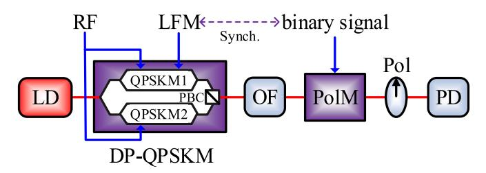

Fig. 1. The proposed chirp-polarity coded LFM signal generator.

where  $J_n$  is the *n*th-order Bessel function of the first kind, the higher order sidebands of the optical signals are ignored.

After that, the modulation parameters are set to satisfy the following conditions

$$J_1(m) = 0$$

$$J_0(\beta) = J_3(m) = -\cos\frac{\theta}{2}$$
(4)

As shown in Fig. 2, the modulation index m can be set as 3.83 to suppress the first-order RF sidebands, the modulation index  $\beta$  can be set as 1.66 to make the optical carrier and the upper third-order RF sideband have the same power in the x-axis, while the DC bias phase  $\theta$  can be set as 1.28 $\pi$  to make the optical carrier in the y-axis has the same power but opposite phase with the one in the x-axis.

Then, the OF is followed to remove the components with frequency lower than the optical carrier, as shown in Fig. 3(a). Consequently, in the *x*-axis, the optical carrier, the upper second-order chirp sideband and the upper third-order RF sideband are obtained, while in the *y*-axis, the optical carrier and the upper third-order RF sideband are generated. The two orthogonally polarized components output from the OF are given by

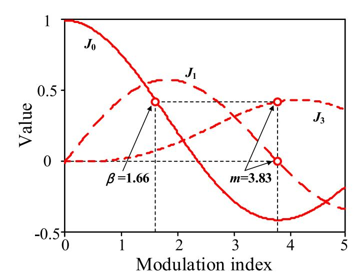

Fig. 2. Relationship between the modulation indices.

Fig. 3. (a)Optical spectra and polarization states after the modulator, (b)optical spectra after the Pol and the chirp polarity of the generated waveform.

$$\begin{split} E_{OF-x}(t) \propto & rect\left(\frac{t-T/2}{T}\right) e^{j\omega_c t} \left[J_0(\beta) - J_2(\beta) e^{j2s(t)} + J_0(\beta) e^{j3\omega_1 t}\right] \\ E_{OF-y}(t) \propto & rect\left(\frac{t-T/2}{T}\right) e^{j\omega_c t} \left[-J_0(\beta) + J_0(\beta) e^{j3\omega_1 t}\right] \end{split} \tag{5}$$

After the OF, the PolM is followed to phase modulate the orthogonally polarized optical signal with a binary sequence. The phase modulation index is set as  $\pi/2$ . The Pol is placed after the PolM, the principal axis of the Pol is oriented at an angle of  $45^{\circ}$  to one principal axis of the PolM. The optical signal output from the Pol is given by

$$E_{P}(t) \propto \begin{cases} rect \left( \frac{t - T/2}{T} \right) e^{j\omega_{c}t} \left[ 2J_{0}(\beta) e^{j3\omega_{1}t} - J_{2}(\beta) e^{j2s(t)} \right], \text{ for bit } '0'' \\ rect \left( \frac{t - T/2}{T} \right) e^{j\omega_{c}t} e^{j\frac{\pi}{2}} \left[ 2J_{0}(\beta) - J_{2}(\beta) e^{j2s(t)} \right], \text{ for bit } '1'' \end{cases}$$
(6)

It can be seen that, for bit "0", the second-order chirp sideband and the third-order RF sideband are obtained, while for bit "1", the second-order chirp sideband and the optical carrier are reserved, as shown in Fig. 3(b). Then, when the frequency of the RF signal is set as  $\omega_1$ =4 ( $\omega$ +kT)/3, the AC term output from the PD is given by

$$i_{AC}(t) \propto \begin{cases} rect\left(\frac{t-T/2}{T}\right) \cdot \cos\left(2\omega t + 4kTt - 2kt^2\right), \text{ for bit } "0" \\ rect\left(\frac{t-T/2}{T}\right) \cdot \cos\left(2\omega t + 2kt^2\right), \text{ for bit } "1" \end{cases}$$
(7)

As a result, an LFM waveform with angular frequency down-chirped form  $2\omega+4$  kT to  $2\omega$  or up-chirped from  $2\omega$  to  $2\omega+4$  kT can be generated, as shown in Fig. 3(b). The bandwidth of the generated waveform is increased twice compared with the one of the driving LFM signal, so the radar detection accuracy can be improved. The central angular frequency of the generated LFM signal is  $2\omega+2$  kT, which is also improved. It is worth noting that, an OF is used in the generator, which may hinder the system tunability. As shown in Fig. 3, the rising edge of the OF is

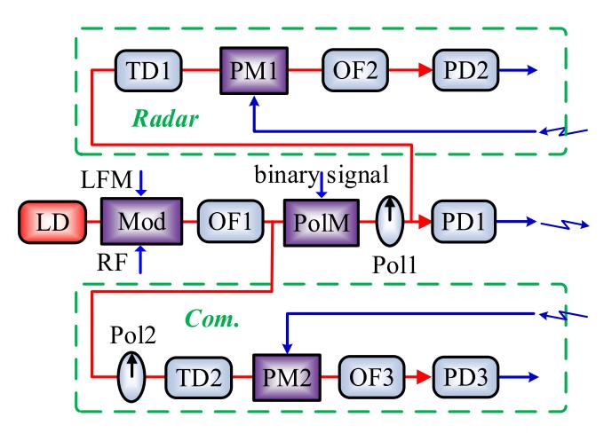

Fig. 4. Schematic diagram of the photonic JRC system.

used to divide the optical and the lower second-order chirp sideband, therefore, the minimum achievable frequency of the generated signal equals the rising edge bandwidth of the OF (several GHz). On the other hand, the maximum frequency of the generated signal is just limited by the electronic devices, which is twice the maximum value of the input signal. As a result, both the central frequency and bandwidth of the generated signal have large tunable range.

To circumvent the electronic bottlenecks and achieve real time processing for the generated waveform, optical de-chirping for both radar detection and communication demodulation are performed based on the proposed signal generator, as shown in Fig. 4. In the joint system, the generated shared signal output from PD1 is filtered, amplified and then emitted. The echo reflected from the target is sent to a phase modulator (PM1) to modulate with an optical reference signal. The optical reference signal is extracted from the output of Pol1. An optical time delayer (TD1) is placed before PM1 to make  $\tau << T$ , where  $\tau$  is the time difference between the reference signal and the echo. Mathematically, when only one up-chirped basic waveform is considered, the output of PM1 can be given by

$$\begin{split} E_{PM1}(t) &\propto rect \left( \frac{t - T/2}{T} \right) rect \left( \frac{t - T/2 - \tau}{T} \right) e^{i\omega_{c}t} \left[ 2J_{0}(\beta) - J_{2}(\beta) e^{j2s(t)} \right] \\ &e^{i\eta_{1} \cos[2s(t-\tau)]} = rect \left( \frac{t - (T+\tau)/2}{T-\tau} \right) e^{i\left(\omega_{c}t + 2\omega t + 2kt^{2}\right)} \\ &\left[ 2J_{0}(\beta)J_{1}(\eta_{1}) e^{j\frac{\pi}{2}} e^{-j\left(2\omega\tau - 2kt^{2} + 4k\pi t\right)} - J_{2}(\beta)J_{0}(\eta_{1}) \right] + \dots \right\} \end{split} \tag{8}$$

where  $\eta_1$  is the modulation index of PM1. An optical filter (OF2) is employed after PM1 to filter the components around the frequency  $\omega_c+2\omega+4$  kT. After optical to electrical conversion, the AC term of PD2 can be expressed as

$$i_{2AC}(t) \propto rect \left(\frac{t - (T + \tau)/2}{T - \tau}\right) \sin\left(4k\tau t + 2\omega \tau - 2k\tau^2\right)$$
 (9)

The frequency of the generated signal is related to the time delay as  $4k\tau$ . Correspondingly, the distance of the target can be obtained.

One benefit of the chirp-polarity coding operation is the velocity-distance decoupling for moving target detection [26]. Assuming that the target has a distance of  $R_m$  and a radial velocity of  $v_m$ , the light has a speed of c, at the output of PD2, two de-chirped frequencies  $f_1$  and  $f_2$  will be obtained, and the parameters of the target can be expressed as

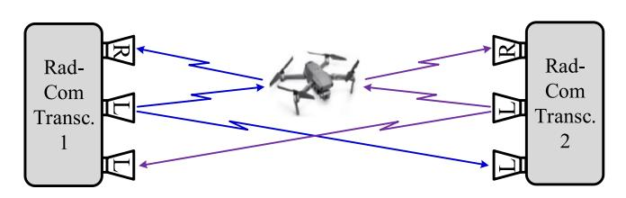

Fig. 5. The scenario of JRC by using two identical transceivers.

$$R_{m} = \frac{\pi c(f_{1} + f_{2})}{8k}$$

$$v_{m} = \frac{\pi c(f_{1} - f_{2})}{4(\omega + kT)}$$
(10)

Fig. 5 shows a typical application scenario by using two proposed transceivers to simultaneously perform radar detection and wireless communication. It should be noted that, the echo of transceiver 1 may be mingled with the communication signal which is emitted from transceiver 2. This problem can be resolved by using frequency division method, but with low spectral efficiency. Here, we distinguish the two signals in the polarization domain. Assuming that the emitting signal from the transceiver is a left-handed circularly polarized (LHCP) wave, the polarization state will be maintained for direct transmission. However, the wave will be changed to right-handed circularly polarized (RHCP) one after reflection. Based on this characteristic, when the transceiver has an LHCP emitting antenna, an RHCP radar receiving antenna and an LHCP communication receiving antenna, the detection echo from the target and the communication signal from another transceiver can be separated. In this configuration, the two transceivers can have identical signal format, frequency and bandwidth.

Then, the received communication signal can be demodulated in the optical domain, as shown in Fig. 4. In this part, the optical reference signal is the  $E_{OF-x}(t)$  of equation (5). It can be extracted by using Pol2. After that, TD2 is used to make the initial time of one sub-waveform in the optical reference signal have a time delay  $\tau_0$  with the received communication signal. Then, the reception of communication is phase modulated to  $E_{OF-x}(t)$  in PM2, the output of PM2 is given by

$$E_{PM2}(t) \propto E_{OF-x}(t-\tau_0) \begin{cases} e^{j\eta_2 \cos(2\omega t + 4kTt - 2kt^2)}, \text{ for bit } 0'' \\ e^{j\eta_2 \cos(2\omega t + 2kt^2)}, \text{ for bit } 1'' \end{cases}$$
 (11)

where  $\eta_2$  is the modulation index of PM2. OF3 is placed after PM2 to filter the components near the optical carrier. After optical to electrical conversion, the AC term of PD3 can be expressed as

$$i_{3AC}(t) \propto rect \left(\frac{t - (T + \tau_0)/2}{T - \tau_0}\right) \begin{cases} \cos(4kTt - 4kt^2), \text{ for bit } "0" \\ \cos(4k\tau_0 t), \text{ for bit } "1" \end{cases}$$
 (12)

As can be seen, the optical demodulation actually is de-chirping operation. By using an electrical bandpass filter (EBPF) with central frequency of  $4k\tau_0$ , the communication information can be recovered.

### 3. Simulation results and discussion

A simulation is performed to verify the proposed scheme. First, the signal generator is demonstrated. The laser source has a central frequency of 193.1 THz and an output power of 16 dBm. Each MZM of the integrated modulator has an extinction ratio (ER) of 30 dB. The input LFM signal has a central frequency of 12 GHz, a bandwidth of 4 GHz, a time duration of 100 ns and a repetitive frequency of 10 MHz. The input RF signal has a central frequency of 16 GHz. The input binary sequence of the PolM has a bit rate of 10 Mbit/s. Fig. 6 shows the output spectra of QPSKM1 and QPSKM2. The output of QPSKM1 has an optical carrier, 2 s-order chirp sidebands and two third-order RF sidebands, while the output of QPSKM2 has an optical carrier and two third-order RF sidebands. The optical carrier and the RF sidebands output from the two modulators have equal power. Due to the finite ER, residual first-order chirp sidebands and second-order RF sidebands are reserved, but the power are 20 and 30 dB lower than the corresponding desired sidebands.

The OF in the generator has a central frequency of 193.124 THz and a bandwidth of 50 GHz. Fig. 7 shows the output spectra of the Pol. For bit "1", the upper third-order RF sideband is eliminated, the optical carrier and upper chirp sideband are obtained. For bit "0", the chirp sideband and upper third-order RF sideband are generated. It is worth noting that, due to the finite ER, the optical carrier cannot be totally suppressed for bit "0", but the power of the residual optical carrier is 30 dB lower than

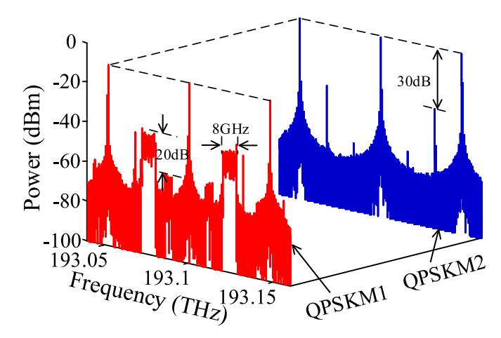

Fig. 6. The output optical spectra of QPSKM1 and QPSKM2.

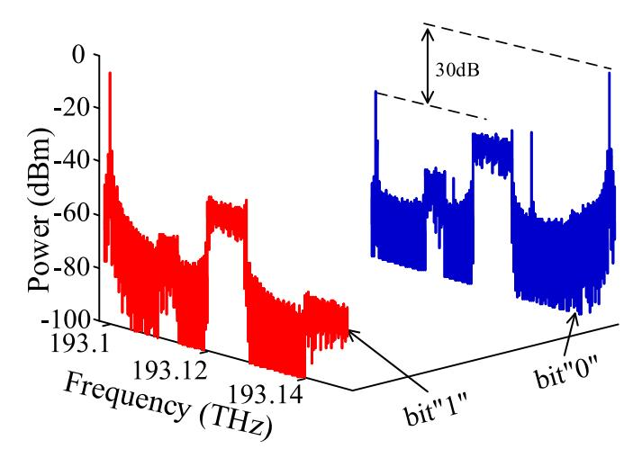

Fig. 7. The output optical spectra of the Pol.

the RF sideband. When the other nonideal factors such as the parameter differences of the MZMs are considered, more undesired optical components will be generated. To guarantee the performance of the generated signal, filtering operation in either optical or electrical domain should be employed.

Then, the bit sequence put into the PolM is set as "1011011001". After the PD, an EBPF with central frequency of 24 GHz and bandwidth of 10 GHz is used to remove the undesired components. Fig. 8 shows the waveform and instantaneous frequency of the signal output from the filter. As can be seen, the chirp-polarity of each basic waveform is coded. The central frequency of the signal is improved from 12 GHz to 24 GHz, the bandwidth of the signal is expanded from 4 GHz to 8 GHz. It also can be seen that, within each down chirp period, there is a residual up chirp component. This is caused by the undesired optical carrier which we previously shown in Fig. 7.

The generated chirp-polarity coded LFM signal is used to achieve radar function. The radar detection subsystem is constructed as shown in Fig. 4. OF2 has a central frequency of 193.124 THz and a bandwidth of 10 GHz. After PD2, a DC blocker and an electrical lowpass filter (ELPF) with bandwidth of 600 MHz are used. The chirp-polarity coded LFM signal is divided into two parts and respectively delayed for 2.5 and 2.625 ns to simulate two different targets. The two delayed signals are coupled and put into the radar detection subsystem. Fig. 9 shows the electrical spectrum of the de-chirping result, which agrees well with the

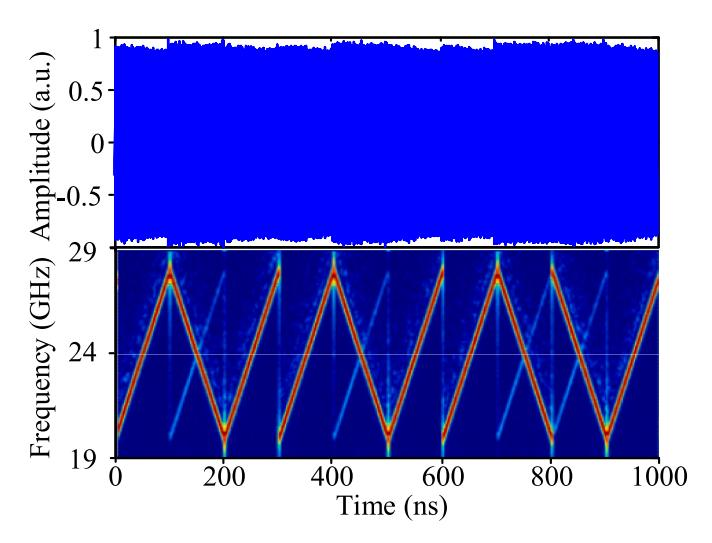

**Fig. 8.** The waveform and instantaneous frequency of the generated signal.

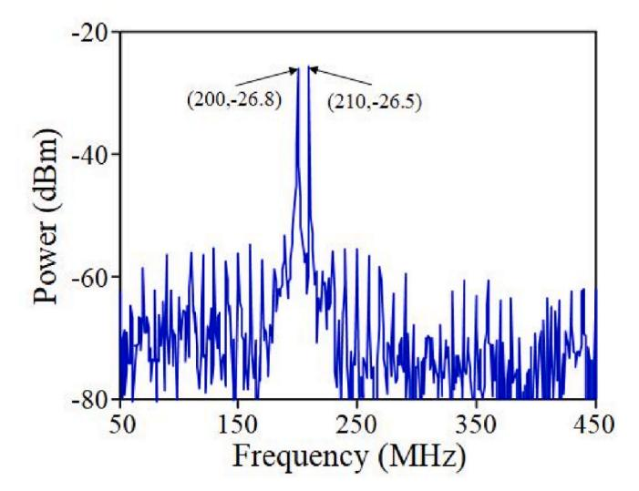

**Fig. 9.** The de-chirping result of two different targets.

theoretical analysis. The two targets can be distinguished. Thanks to the bandwidth doubling operation, the range resolution of the generated signal is 1.875 cm, which is twice that of the input LFM signal.

Traditionally, the radar unambiguous range is inversely proportional to the repetitive frequency of the LFM waveform. For the input repetitive LFM signal, the radar unambiguous range can be calculated as 15 m. Fig. 10(a) shows the de-chirping results of two different echoes when the input repetitive LFM signal is employed for radar detection. The line represents the result of the echo with a time delay of 2 ns, while the dotted line represents the result of the echo with a time delay of 52 ns. As can be seen, the two targets are totally mingled. For comparison, Fig. 10 (b) shows the de-chirping results of two different echoes when the generated chirp-polarity coded signal is employed. The line shows the result when a time delay of 2 ns is introduced, it can be seen that, a frequency of 160 MHz is obtained. The dotted line shows the result of the echo with a time delay of 52 ns, there is no peak in the spectrum. In this situation, the time delay of TD1 in the radar detection subsystem should be adjusted to another given value. As can be seen, the radar unambiguous range is expanded, and the value can be improved to 15 *N* m, where *N* is the length of the bit sequence.

Furthermore, the detection for a moving target is investigated. A frequency shift of 200 kHz and a time delay of 2 ns is introduced to the generated chirp-polarity coded LFM signal to simulate the velocity and distance of the moving target. Then the signal is put into the radar detection subsystem. The output electrical spectrum is shown in [Fig. 11](#page-5-0). Two frequencies of 159.795 and 160.205 MHz are obtained. The calculated time delay is 2 ns, which agrees well with the input parameter. The Doppler frequency is calculated as 205 kHz, which is very close to the input value. It is worth noting that, the accuracy of the speed measurement can be improved when a higher Doppler frequency is obtained, which can be achieved by using a signal with higher central frequency.

Finally, the communication function is verified. The communication demodulation subsystem is constructed as shown in [Fig. 4](#page-2-0). In this study, TD2 is adjusted to 0.75 ns. The generated chirp-polarity coded LFM signal is directly put into PM2. OF3 has a central frequency of 193.1 THz and a bandwidth of 3 GHz. After PD3, an EBPF with frequency of 60 MHz and bandwidth of 20 MHz is used. [Fig. 12](#page-5-0) shows the normalized waveform of the demodulated signal. The dotted line shows the input binary waveform. As can been seen, the communication information can be recovered.

It should be noted that, the demodulated output of bit "0" is a broad baseband signal, as shown in equation [\(12\)](#page-3-0). The amplitude of demodulated bit "0" is determined by the bandwidth of the EBPF, which is further determined by the communication bit rate. Therefore, the demodulation performance is inversely proportional to the communication speed *Rb*. When the EBPF has a bandwidth of 2*Rb*, the amplitude ratio *R* of demodulated bit "1" and bit "0" can be expressed as *R*=2*kT*/ *Rb*. [Fig. 13](#page-5-0) shows the electrical spectra of the demodulated output with different communication speed. For the 10 Mbit/s situation, the ratio *R*  is about 26 dB, which agrees well with the calculated value (8 GHz/20 MHz). For the 100 Mbit/s situation, the time delay of TD2 is adjusted to 0.5 ns, the demodulated spectrum has a peak with frequency of 400 MHz, and the ratio *R* is deteriorated to 16 dB. To further improve the communication speed, the correlation operation should be employed, but at the cost of high hardware requirement and large time delay.

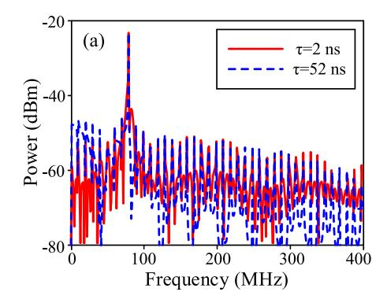

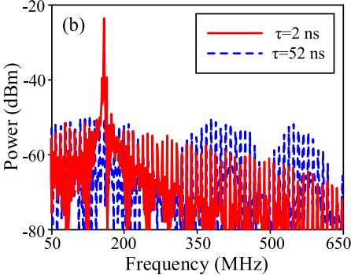

**Fig. 10.** The de-chirping results of two different targets when (a) input repetitive LFM signal and (b) generated shared signal are used.

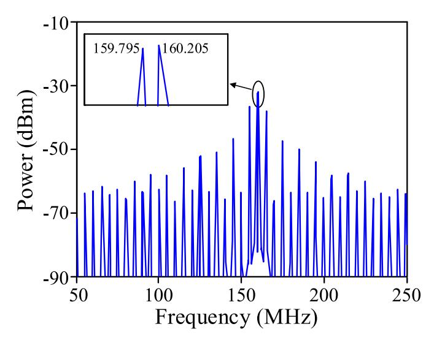

**Fig. 11.** The de-chirping result of one moving target.

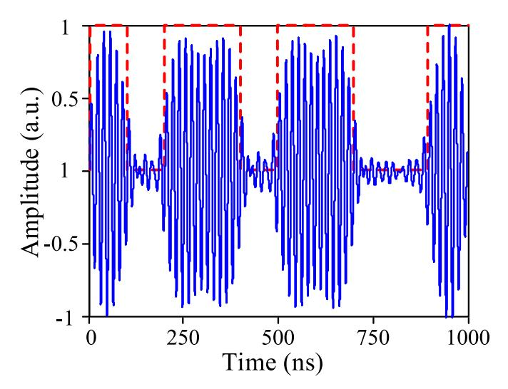

**Fig. 12.** The demodulation result of communication.

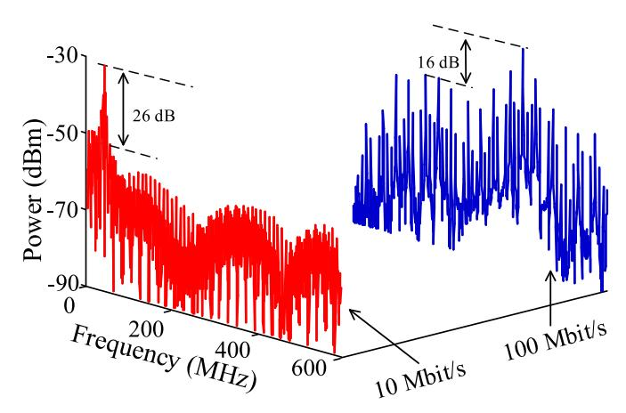

**Fig. 13.** The demodulated spectra with different communication bit rate.

It is worth noting that the radar unambiguous range can be guaranteed when a high communication speed is employed. The unambiguous range of the chirp-polarity coded LFM signal can be calculated as *cN/*(2*Rb*). As a result, for high communication speed application, the radar unambiguous range can be compensated or even improved by increasing the length of the communication bit sequence.

#### **4. Conclusion**

A photonic JRC system using shared waveform was proposed and investigated. A LFM signal was frequency improved, bandwidth expanded, chirp-polarity coded and then employed to simultaneously perform dual functions. To achieve real time processing, optical dechirping was used for both radar detection and communication demodulation. The proposed scheme was verified by simulation. A chirp-polarity coded LFM waveform with frequency of 24 GHz, bandwidth of 8 GHz, communication bit rate of 10 Mbit/s was generated. Then, the photonic radar detection subsystem was demonstrated to verify the radar performance. The results show that, the shared waveform has high range resolution, expanded unambiguous range and velocity-distance detection capability. Finally, the photonic communication demodulation subsystem was constructed to verify the communication performance. The results show that, the shared waveform can be optically de-chirped to recover the communication data, the demodulation performance will be deteriorated when the communication speed is increased.

## **Declaration of competing interest**

The authors declare the following financial interests/personal relationships which may be considered as potential competing interests: Zihang Zhu reports financial support was provided by the National Natural Science Foundation of China. Zihang Zhu reports financial support was provided by the Youth Innovation Team of Shaanxi Universities.

## **Data availability**

Data will be made available on request.

## **Acknowledgements**

This work was supported by the National Natural Science Foundation of China (62001505) and the Youth Innovation Team of Shaanxi Universities (2022-106).

# **References**

- [1] [A. Hassanien, M.G. Amin, E. Aboutanios, et al., Dual-Function Radar](http://refhub.elsevier.com/S0030-4018(23)00839-8/sref1) [Communication Systems: a solution to the spectrum congestion problem, IEEE](http://refhub.elsevier.com/S0030-4018(23)00839-8/sref1) [Signal Process. Mag. 36 \(2019\) 115](http://refhub.elsevier.com/S0030-4018(23)00839-8/sref1)–126.
- [2] [F. Liu, C. Masouros, A tutorial on joint radar and communication transmission for](http://refhub.elsevier.com/S0030-4018(23)00839-8/sref2)  [vehicular networks-Part II: state of the art and challenges ahead, IEEE Commun.](http://refhub.elsevier.com/S0030-4018(23)00839-8/sref2)  [Lett. 25 \(2021\) 327](http://refhub.elsevier.com/S0030-4018(23)00839-8/sref2)–331.
- [3] [W.M. Peter, J.D. David, Multifunction RF systems for naval platforms, Sensors 18](http://refhub.elsevier.com/S0030-4018(23)00839-8/sref3)  [\(2018\) 2076.](http://refhub.elsevier.com/S0030-4018(23)00839-8/sref3)
- [4] [F. Liu, C. Masouros, A.P. Petropulu, et al., Joint radar and communication design:](http://refhub.elsevier.com/S0030-4018(23)00839-8/sref4)  [applications, state-of-the-art, and the road ahead, IEEE Trans. Commun. 68 \(2020\)](http://refhub.elsevier.com/S0030-4018(23)00839-8/sref4)  3834–[3862.](http://refhub.elsevier.com/S0030-4018(23)00839-8/sref4)
- [5] [K.V. Mishra, M. Shankar, V. Koivunen, et al., Toward millimeter wave joint radar](http://refhub.elsevier.com/S0030-4018(23)00839-8/sref5)[communications: a signal processing perspective, IEEE Signal Process. Mag. 36](http://refhub.elsevier.com/S0030-4018(23)00839-8/sref5)  [\(2019\) 100](http://refhub.elsevier.com/S0030-4018(23)00839-8/sref5)–114.
- [6] [L. Han, K. Wu, Multifunctional transceiver for future intelligent transportation](http://refhub.elsevier.com/S0030-4018(23)00839-8/sref6)  [systems, IEEE Trans. Microw. Theor. Tech. 59 \(2011\) 1879](http://refhub.elsevier.com/S0030-4018(23)00839-8/sref6)–1892.
- [7] [A. Hassanien, M.G. Amin, Y.D. Zhang, et al., Dual-function radar-communications:](http://refhub.elsevier.com/S0030-4018(23)00839-8/sref7)  [information embedding using sidelobe control and waveform diversity, IEEE Trans.](http://refhub.elsevier.com/S0030-4018(23)00839-8/sref7)  [Signal Process. 64 \(2016\) 2168](http://refhub.elsevier.com/S0030-4018(23)00839-8/sref7)–2181.

- [8] [N.S. George, S.S. Rahul, R.B. Elliott, Ultra-Wideband multifunctional](http://refhub.elsevier.com/S0030-4018(23)00839-8/sref8)  [communications/radar system, IEEE Trans. Microw. Theor. Tech. 55 \(2007\)](http://refhub.elsevier.com/S0030-4018(23)00839-8/sref8)  1431–[1436.](http://refhub.elsevier.com/S0030-4018(23)00839-8/sref8)
- [9] [T. Zhang, X.G. Xia, OFDM synthetic aperture radar imaging with sufficient cyclic](http://refhub.elsevier.com/S0030-4018(23)00839-8/sref9)  [prefix, IEEE Trans. Geosci. Rem. Sens. 53 \(2014\) 394](http://refhub.elsevier.com/S0030-4018(23)00839-8/sref9)–404.
- [10] [L. Tang, K. Zhang, H.P. Dai, et al., Analysis and optimization of ambiguity function](http://refhub.elsevier.com/S0030-4018(23)00839-8/sref10)  [in radar-communication integrated systems using MPSK-DSSS, IEEE Wireless](http://refhub.elsevier.com/S0030-4018(23)00839-8/sref10)  [Commun. Lett. 8 \(2019\) 1546](http://refhub.elsevier.com/S0030-4018(23)00839-8/sref10)–1549.
- [11] [P. Barrenechea, F. Elferink, J. Janssen, FMCW Radar with Broadband](http://refhub.elsevier.com/S0030-4018(23)00839-8/sref11) [Communication Capability, 2007 European Radar Conference. Oct. 10-12, 2007,](http://refhub.elsevier.com/S0030-4018(23)00839-8/sref11)  [IEEE, Munich, Germany. New York, 2007, pp. 130](http://refhub.elsevier.com/S0030-4018(23)00839-8/sref11)–133.
- [12] [M. Nowak, M. Wicks, Z. Zhang, et al., Co-designed radar-communication using](http://refhub.elsevier.com/S0030-4018(23)00839-8/sref12) [linear frequency modulation waveform, IEEE Aero. Electron. Syst. Mag. 31 \(2016\)](http://refhub.elsevier.com/S0030-4018(23)00839-8/sref12)  28–[35.](http://refhub.elsevier.com/S0030-4018(23)00839-8/sref12)
- [13] [C. Yang, M. Wang, L. Zheng, et al., Dual function system with shared spectrum](http://refhub.elsevier.com/S0030-4018(23)00839-8/sref13) [using FMCW, IEEE Access 6 \(2018\) 79026](http://refhub.elsevier.com/S0030-4018(23)00839-8/sref13)–79038.
- [14] [A. Wang, J. Wo, X. Luo, et al., Ka-band microwave photonic ultra-wideband](http://refhub.elsevier.com/S0030-4018(23)00839-8/sref14) [imaging radar for capturing quantitative target information, Opt Express 26 \(2018\)](http://refhub.elsevier.com/S0030-4018(23)00839-8/sref14)  [20708](http://refhub.elsevier.com/S0030-4018(23)00839-8/sref14)–20717.
- [15] [D. Zhu, S. Pan, Broadband cognitive radio enabled by photonics, J. Lightwave](http://refhub.elsevier.com/S0030-4018(23)00839-8/sref15)  [Technol. 38 \(2020\) 3076](http://refhub.elsevier.com/S0030-4018(23)00839-8/sref15)–3088.
- [16] [S. Jia, X. Yu, S. Wang, et al., A unified system with integrated generation of high](http://refhub.elsevier.com/S0030-4018(23)00839-8/sref16)[speed communication and high-resolution sensing signals based on THz photonics,](http://refhub.elsevier.com/S0030-4018(23)00839-8/sref16)  [J. Lightwave Technol. 36 \(2018\) 4549](http://refhub.elsevier.com/S0030-4018(23)00839-8/sref16)–4556.
- [17] [Y. Wang, W. Li, J. Ding, et al., Integrated high-resolution radar and long-distance](http://refhub.elsevier.com/S0030-4018(23)00839-8/sref17)  [communication based-on photonic in terahertz band, J. Lightwave Technol. 40](http://refhub.elsevier.com/S0030-4018(23)00839-8/sref17) [\(2022\) 2731](http://refhub.elsevier.com/S0030-4018(23)00839-8/sref17)–2738.

- [18] [W. Bai, X. Zou, P. Li, et al., 60-GHz photonic millimeter-wave joint radar](http://refhub.elsevier.com/S0030-4018(23)00839-8/sref18)  [communication system, in: 2021 International Conference on Microwave and](http://refhub.elsevier.com/S0030-4018(23)00839-8/sref18)  [Millimeter Wave Technology, ICMMT\), 2021, pp. 1](http://refhub.elsevier.com/S0030-4018(23)00839-8/sref18)–3.
- [19] [L. Huang, R. Li, S. Liu, et al., Centralized fiber-distributed data communication and](http://refhub.elsevier.com/S0030-4018(23)00839-8/sref19)  [sensing convergence system based on microwave photonics, J. Lightwave Technol.](http://refhub.elsevier.com/S0030-4018(23)00839-8/sref19)  [37 \(2019\) 5406](http://refhub.elsevier.com/S0030-4018(23)00839-8/sref19)–5416.
- [20] [W. Bai, X. Zou, P. Li, et al., Photonic millimeter-wave joint radar-communication](http://refhub.elsevier.com/S0030-4018(23)00839-8/sref20) [system using spectrum spreading phase-coding, IEEE Trans. Microw. Theor. Tech.](http://refhub.elsevier.com/S0030-4018(23)00839-8/sref20)  [70 \(2022\) 1552](http://refhub.elsevier.com/S0030-4018(23)00839-8/sref20)–1561.
- [21] [Z. Xue, S. Li, X. Xue, et al., Photonics-assisted joint radar and communication](http://refhub.elsevier.com/S0030-4018(23)00839-8/sref21)  [system based on an optoelectronic oscillator, Opt Express 29 \(2021\) 22442](http://refhub.elsevier.com/S0030-4018(23)00839-8/sref21)–22454.
- [22] [H. Nie, F. Zhang, Y. Yang, S. Pan, Photonics-based integrated communication and](http://refhub.elsevier.com/S0030-4018(23)00839-8/sref22)  [radar system, in: International Topical Meeting on Microwave Photonics, MWP\),](http://refhub.elsevier.com/S0030-4018(23)00839-8/sref22) [2019, pp. 1](http://refhub.elsevier.com/S0030-4018(23)00839-8/sref22)–4.
- [23] [W. Bai, P. Li, X. Zou, et al., Millimeter-wave joint radar and communication system](http://refhub.elsevier.com/S0030-4018(23)00839-8/sref23)  [based on photonic frequency-multiplying constant envelope LFM-OFDM, Opt](http://refhub.elsevier.com/S0030-4018(23)00839-8/sref23)  [Express 30 \(2022\) 26407](http://refhub.elsevier.com/S0030-4018(23)00839-8/sref23)–26425.
- [24] [X. Li, S. Zhao, G. Wang, et al., Photonic generation and application of a bandwidth](http://refhub.elsevier.com/S0030-4018(23)00839-8/sref24)  [multiplied linearly chirped signal with phase modulation capability, IEEE Access 4](http://refhub.elsevier.com/S0030-4018(23)00839-8/sref24)  [\(2021\) 82618](http://refhub.elsevier.com/S0030-4018(23)00839-8/sref24)–82629.
- [25] [A. Springer, M. Huemer, L. Reindl, et al., A robust ultra-broad band wireless](http://refhub.elsevier.com/S0030-4018(23)00839-8/sref25)  [communication system using SAW chirped delay lines, IEEE Trans. Microw. Theor.](http://refhub.elsevier.com/S0030-4018(23)00839-8/sref25)  [Tech. 46 \(1998\) 2213](http://refhub.elsevier.com/S0030-4018(23)00839-8/sref25)–2218.
- [26] [X. Li, S. Zhao, Z. Zhu, et al., Photonic generation of frequency and bandwidth](http://refhub.elsevier.com/S0030-4018(23)00839-8/sref26) [multiplying dual-chirp microwave waveform, IEEE Photon. J. 9 \(2017\) 1](http://refhub.elsevier.com/S0030-4018(23)00839-8/sref26)–14.