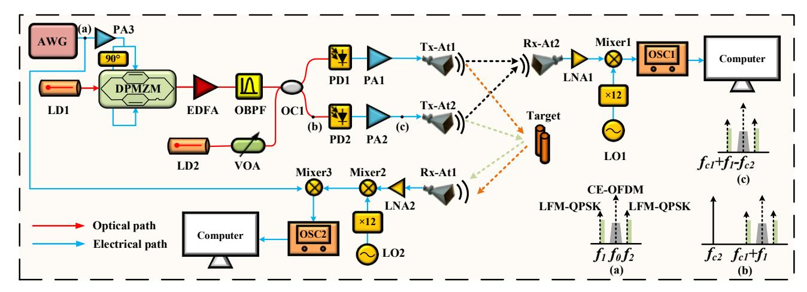
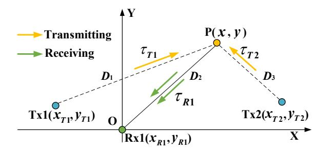
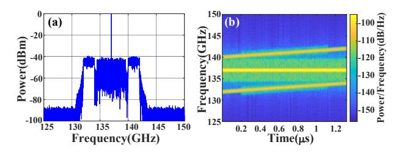
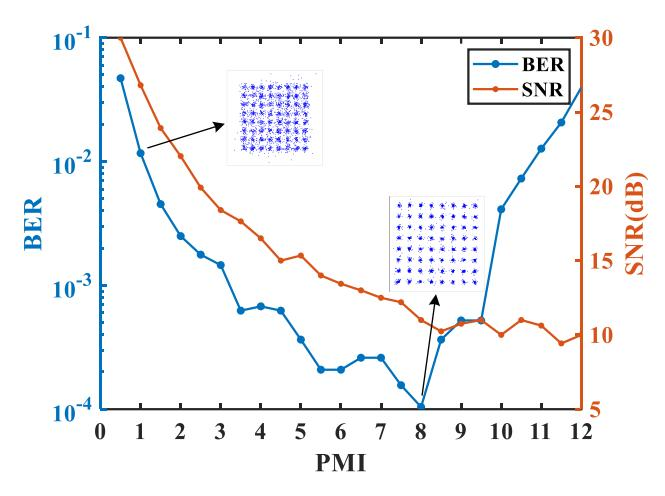
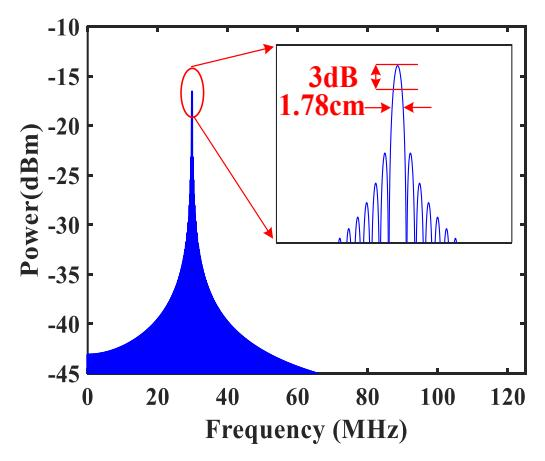
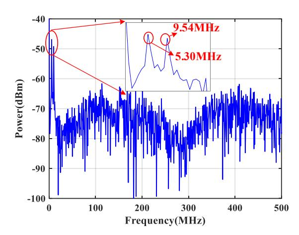

# Simulation of Constant-envelope THz Integrated Sensing and Communication System based on Photonics with 2D Positioning

Yuxin Liu, Xiong Deng, Ningyuan Zhong, Xihua Zou, Wei Pan, Lianshan Yan

Center for Information Photonics and Communications, Southwest Jiaotong University, Chengdu, China.

Abstract—The terahertz (THz) band combined with microwave photonics (MWP) offers a promising solution for achieving ultra-high data rates and radar resolution in integrated sensing and communication (ISAC) systems. Inspired by the constant envelope orthogonal frequency division multiplexing (CE-OFDM), the ISAC signal is designed with two linear frequency modulation (LFM) bands and CE-OFDM in between. In particular, the two LFM sub-bands carry the DCoffset quadrature phase shift keying (QPSK) communication signal to increase the data rate. In this paper, we propose a novel THz MWP ISAC system and simulation is carried out to verify the two-dimensional (2D) positioning function. It possesses a 18.448 Gbit/s communication data rate and a 1.78 cm equivalent radar range resolution achieved by coherent fusion processing (CFP), characterized by a low peak-to-average power ratio (PAPR). In addition, CFP enables high spectral-efficiency. The performance shows two error-free 1.25 GHz QPSK signals and a 5 GHz 64-QAM CE-OFDM signal with a bit error rate (BER) of ~10-4. In addition, the 2D positioning function is successfully verified within 2 m distance by using the trilateration method, and the error is less than 5.81 cm. The low PAPR effectively mitigates nonlinear distortion in communication and enhances target detection in radar, demonstrating significant potential for future applications. To the best of our knowledge, this is the first demonstration of a THz ISAC system integrating 2D positioning and CFP.

Keywords—microwave photonics (MWP), terahertz (THz), ISAC, coherent fusion processing (CFP), 2D positioning

## I. INTRODUCTION

The increasing demand for higher data transmission rate and enhanced sensing capabilities in the sixth-generation (6G) wireless networks has led to intensive research into higher frequency bands. Among these, the terahertz (THz) band (0.1 THz-10 THz) has received considerable attention due to its abundant spectrum resources, narrow beam angle, and high carrier frequencies [1]. Recent studies have focused on THz integrated sensing and communication (ISAC) combined with microwave photonics (MWP) technology, which possesses advantages of low phase noise, low power consumption, high spectral purity, and high sensitivity [2].

Designing an ISAC waveform through shared signal resources is crucial for achieving high performance in THz ISAC systems. This can be accomplished through strategies such as allocating resources on non-overlapping resource across code, spectrum, and time, as well as fully unified waveform [3]. For example, the code division multiplexing (CDM) Ka-band photonic ISAC system utilized phase coding and spectral spread multiplexing, achieving a communication rate of over 1 Gbit/s with a 3.5 cm radar range resolution [4]. Frequency division multiplexing (FDM) [5] and time division multiplexing (TDM) [6] schemes have similarly demonstrated

high communication rates up to 18/38.1 Gbit/s and radar resolutions of 2.14/1.58 cm.

The fully unified ISAC waveform design focuses on the development a highly integrated ISAC signal, and OFDM signal plays a vital role in ISAC systems. For instance, a photonics ISAC system with a virtual-carrier-aided self-coherent OFDM technique achieved 16 Gbit/s communication rate, ~4.8 cm range resolution and ~4 mm range accuracy [7]. Another OFDM-based system using optoelectronic oscillators (OEOs) achieved range resolutions of 7.5/1.5 cm at 12.8/32 Gbit/s within the K/W band [8]. However, the limitation of high PAPR in OFDM signal decreases power amplifier efficiency, leading to signal distortion [9].

In this paper, we propose and simulate a photonics CE THz ISAC system for 2D positioning. Drawing inspiration from [10], the ISAC signal is constructed by embedding a 5 GHz 64QAM CE-OFDM communication signal into two LFM sub-bands modulated by 1.25 GHz DC-offset QPSK signals. The 132-142 GHz ISAC signal is generated via direct optical heterodyne up-conversion. A communication data rate of 18.448 Gbit/s is achieved, and an equivalent radar range resolution of 1.78 cm is demonstrated through coherent fusion processing (CFP). Besides, building on the trilateration algorithm [11], accurate 2D positioning is accomplished with an error of less than 5.81 cm within a distance of 2 m. Moreover, nonlinear distortion can be mitigated with low PAPR communication, as well as improves target detection and reduces sidelobe interference in radar [12]. It reveals potential of the photonics CE THz ISAC system with highrate communication and accurate target positioning with high resolution.

#### II. OPERATION PRINCIPLE

## A. Simulation Setup

Fig. 1 shows a schematic diagram of the proposed system. The baseband CE-OFDM signal can be expressed as:

$$s_{CE-OFDM}(t) = A_0 \cdot \exp\{j[\varphi_0 + 2\pi h \cdot s(t)]\}, \qquad (1)$$

where  $A_0$  and  $\varphi_0$  represent the amplitude and phase shift of the CE-OFDM signal, respectively. s(t) represents the real-valued OFDM signal, and h is the phase modulation index (PMI). Then a DC-offset LFM-QPSK ISAC signal [13] is generated which can be expressed as:

$$s_{LFM-QPSK}(t) = \left[s_{QPSK}(t) + A\right] \cdot \exp\left[j2\pi\left(f_s t + \frac{1}{2}kt^2\right)\right], (2)$$

where  $s_{QPSK}(t)$  represents the real-value of QPSK communication signal; A defined as the ratio compared to

Fig. 1 Schematic diagram of the proposed CE THz ISAC system. LD: laser diode; DPMZM: dual-parallel Mach-Zehnder modulator; AWG: arbitrary waveform generator; EDFA: erbium-doped fiber amplifier; VOA: variable optical attenuator; OBPF: optical bandpass filter; OC: optical coupler; PD: photodetector; PA: power amplifier; Tx-At: transmitting antenna; Rx-At: receiving antenna; LNA: low noise amplifier; LO: local oscillator; OSC: oscilloscope. (a), (b), (c): the specific structure of the signal at the corresponding nodes.

the QPSK communication signal;  $f_s$  and k is the initial frequency and chirp slope of the LFM signal, respectively. The slope  $k = B/T_0$  directly correlates with the signal's instantaneous bandwidth B and pulse duration  $T_0$ .

Subsequently, the CE-OFDM communication signal is combined with two LFM sub-bands carrying QPSK using FDM scheme to form the intermediate frequency (IF) ISAC signal, which can be formulated as:

$$s_{ISAC}(t) = \left[ s_{QPSK1}(t) + A_1 \right] \cdot \exp \left[ j2\pi \left( f_1 t + \frac{1}{2}kt^2 \right) \right]$$

$$+ s_{CE-OFDM}(t) \cdot \exp \left( j2\pi f_2 t \right)$$

$$+ \left[ s_{QPSK2}(t) + A_2 \right] \cdot \exp \left[ j2\pi \left( f_3 t + \frac{1}{2}kt^2 \right) \right],$$
(3)

where  $s_{QPSK1}(t)$  and  $s_{QPSK2}(t)$  represent the QPSK signals transmitted in the lower and higher LFM sub-bands, respectively;  $A_1$  and  $A_2$  denote the DC offset of the LFM-QPSK signals;  $f_1$  and  $f_3$  are the initial frequencies of the lower and higher LFM sub-bands, respectively,  $f_2$  is the center frequency of the CE-OFDM signal and  $f_1 < f_2 < f_3$ . Fig. 1(a) illustrates the structure of the IF ISAC signal, with the positions of each frequency component clearly indicated.

The optical carrier emitted from the laser diode (LD1) is injected into a DPMZM. The electrical IF ISAC signal is then applied to DPMZM through an electrical 90° hybrid to realize carrier-suppressed single-sideband (CS-SSB) modulation. It is then amplified by an erbium-doped fiber amplifier (EDFA), and the optical bandpass filter (OBPF) can be used for filtering out superfluous frequencies. The optical carrier from LD2 is controlled by a variable optical attenuator (VOA) to match the power of the data-carrying sideband. Two paths are combined and divided into two channels with an optical coupler (OC1). Under small signal modulation conditions, the output of OC1 can be written as

$$E_{OC1}(t) \approx E_{c1}J_1(\gamma)s_{ISAC}(t) \cdot \exp(j2\pi f_{c1}t) + E_{c2} \cdot \exp(j2\pi f_{c2}t),$$
(4)

where  $E_{c1}$ ,  $f_{c1}$  are the amplitude and center frequency of the optical carrier from LD1, while  $E_{c2}$ ,  $f_{c2}$  denote the amplitude and center frequency of the optical carrier from LD2,  $J_n(\cdot)$  denotes the first kind of n-th Bessel function, and  $\gamma$  is the modulation index of DPMZM. The two channels are then sent to high-speed PD1 and PD2 for optical heterodyne detection, respectively:

$$I_{PD}(t) \propto \eta s_{ISAC}(t) \cdot \exp\left[j2\pi (f_{c1} - f_{c2})t\right],$$
 (5)

where  $\eta$  denotes the responsivity of PD1 and PD2. As a result, the THz ISAC signal centered at  $f_{c1} + f_0 - f_{c2}$  is generated.

To realize the communication function, the THz ISAC signal is captured by the receiving antenna (Rx-At2) and power compensated by a low-noise amplifier (LNA1). It is then mixed with a frequency-upconverted signal from LO1 for coherent down-conversion processing, captured by the real-time OSC. Subsequently, digital signal processing (DSP) operations are performed to retrieve communication symbols.

As for the radar function, echo signals from the target are collected by the radar receiving antenna (Rx-At1), LNA2 is used to amplify the THz echoes:

$$s_{echo}(t) \propto \left[ s_{QPSKm}(t) + A_m \right]$$

$$\cdot \exp \left\{ j2\pi \left[ \left( f_{c1} + f_m - f_{c2} + k\tau \right) t + \frac{1}{2}kt^2 \right] \right\},$$
(6)

where  $\tau$  denotes the round-trip time delay, and m represents the m-th(m=1,2) LFM sub-band. The coherent down-conversion can be realized by mixing it with the reference electrical IF ISAC signal from the AWG for coherent dechirping. The de-chirped signal can be expressed as

$$s_{de-chirped-m}(t) \propto \left[ s_{QPSKm}(t) + A_m \right] \cdot \exp(j2\pi k\tau t)$$

$$= s_{QPSKm}(t) \cdot \exp(j2\pi k\tau t) + A_m \cdot \exp(j2\pi k\tau t).$$
(7)

The first term consists of a de-chirped carrier modulated by the QPSK signal, accompanied by signal-to-signal beating interference (SSBI). The second term is a pure de-chirped carrier derived from the pure THz LFM in Eq. (5). By optimizing the DC offset, this term can be emphasized, facilitating for precise extraction of the delay-related frequency and thereby enables accurate 2D positioning.

## B. 2D Positioning Scenario Setup

Fig. 2 The geometric schematic of MISO scenario with two transmitting antennas and one receiving antennas. Tx1, Tx2: the transmitting antennas; Rx1: the receiving antenna; P: target;  $D_1$ ,  $D_2$ ,  $D_3$ : the distances from Tx1, Rx, Tx2 to P, respectively.  $\tau_{Tm}$  (m=1,2),  $\tau_{Rn}$  (n=1): transmitting delay, receiving delay, respectively.

In the MISO scenario, two THz signals from two sources propagates through space, reflect off a target P, and are received by a single receiver. Using a Cartesian coordinate system, the positions of P, Txs and Rx are defined, as illustrated in Fig. 2, allowing for the calculation of time delays for the signal paths. The time of arrival (TOA) is derived from these delays, providing a relationship for determining the distance from the antennas to the target.

$$D_{1} + D_{2} = \sqrt{(x - x_{T1})^{2} + (y - y_{T1})^{2}} + \sqrt{(x - x_{R1})^{2} + (y - y_{R1})^{2}}$$

$$D_{2} + D_{3} = \sqrt{(x - x_{T2})^{2} + (y - y_{T2})^{2}} + \sqrt{(x - x_{R1})^{2} + (y - y_{R1})^{2}}$$
(8)

The relationship between the above positional parameters can be geometrically understood as the equation for the intersection of two ellipses, typically resulting in two symmetrical points. Generally, only one of these points is needed, corresponding to the location of the target P. Therefore, if the coordinates of the three antenna positions are known,  $D_1 + D_2$  and  $D_2 + D_3$  are known, then the 2D coordinates of the target can be obtained by solving equation (8). According to the frequency of the de-chirped signal with  $f_k = k\tau_{mn}$ , the TOA can be obtained according to  $\tau_{mn} = f_k / k$ , thus 2D coordinate (x, y) of the target P can be solved. It is worth mentioning that  $\tau_{Tm}$  and  $\tau_{Rn}$  cannot be obtained separately, however  $\tau_{mn}$  can be obtained by dechirping the signal with  $f_k$ . If Tx1, Tx2, and Rx1 are replaced with three transceivers,  $\tau_{Tm}$  and  $\tau_{Rn}$  can be obtained to achieve three-dimensional (3D) positioning.

#### III. SIMULATION RESULTS

The simulation was performed based on the setup shown in Fig. 1. The IF ISAC signal is generated using the parameters summarized in Table I. Initially, an optical carrier is emitted by LD1 with a power of 23 dBm at 193.1 THz. The baseband CE-OFDM signal is upconverted to obtain the IF CE-OFDM signal centered at 7 GHz. Then, LFM sub-bands with initial frequencies of 2 GHz and 10 GHz are generated with a pulse duration of 1.32 µs and instantaneous bandwidth of 2 GHz, respectively. Subsequently, the 1.25 GHz DC-offset QPSK signal is used to modulate the phase of the LFM signal,

resulting in the generation of the LFM-QPSK sub-bands. In the simulation, an AWG with a sampling rate of 320 GSa/s is used to drive DPMZM via a power amplifier (PA3) and an electrical 90° hybrid. Subsequently, the output of the DPMZM is amplified by an EDFA with a gain of 25 dB. The optical IF ISAC signal is then obtained by passing through an OBPF. After that, the signal is optically coupled with a 10 dBm optical carrier at 192.97 THz emitted by LD2. Then the output of OC1 is split into two channels for generating THz signals. Consequently, a THz ISAC signal consisting of a 5 GHz bandwidth CE-OFDM signal and two 2 GHz LFM sub-bands modulated by 1.25 GHz bandwidth QPSK signal is generated, occupying the frequency bands from 132 GHz to 142 GHz. Fig. 3 shows the measured spectrograms of the generated THz ISAC signal. Eventually, the THz ISAC signal is amplified by PA1 or PA2 with a gain of 20 dB, and then further radiated into the free space through Tx-At1 and Tx-At2, respectively.

| Table I THE MAI | N PARAMETERS | FOR IF ISAC SIGNAL |
|-----------------|--------------|--------------------|
|                 |              |                    |

| Signals | Parameters              | Values       |
|---------|-------------------------|--------------|
| LFM     | Initial frequency       | 2 GHz,10 GHz |
|         | Instantaneous bandwidth | 2 GHz        |
|         | Pulse width             | 1.32 us      |
| QPSK    | Instantaneous bandwidth | 1.25 GHz     |
| CE-OFDM | Center frequency        | 7 GHz        |
|         | Bandwidth               | 5 GHz        |
|         | Modulation formal       | 64-QAM       |
|         | Length of Cyclic Prefix | 128          |
|         | Phase modulation index  | 3.5          |

Fig. 3 The measured (a) spectrum and (b) spectrogram of the generated THz ISAC signal.

# A. Demonstration of Communication Function

Initially, the communication performance is demonstrated by collecting ISAC signal and then amplified by LNA1. The 130 GHz LO1 signal generated by the 12-fold of the 10.83 GHz single-tone signal is used to obtain a down-conversion IF ISAC signal with a bandwidth of ~10 GHz. Subsequently, the IF ISAC signal was digitized using OSC1. Finally, offline DSP operations are carried out. The 64-QAM CE-OFDM communication signal has a bandwidth of 5 GHz, providing a data rate of 15 Gbit/s. Two 1.25 GHz QPSK signals contribute additional 3.448 Gbit/s data rate. This results in a total communication data rate of 18.448 Gbit/s.

To explore the effect of PMI on communication performance, the BER of the 64QAM CE-OFDM signal with a fixed 5 GHz bandwidth is measured by sweeping the PMI by 0.5, as shown in Fig. 4 (blue line). Apparently, the BER stays below the 7% pre-forward error correction (pre-FEC) limit of  $3.8 \times 10^{-3}$  from 1.75 to 10.

## *B. Radar Function Demonstration*

Further simulations were conducted to verify the radar function. The echo is collected by Rx-At1. Subsequently, the amplified signal of LNA2 is coherently down-converted to the IF domain with the 130 GHz LO2 signal generated by 12 octaves, and mixed with the 2~12 GHz reference electrical IF ISAC signal for mixing to obtain the de-chirped signal, which is captured by the OSC2.

Fig. 4 Measured BER (blue) and SNR (orange) at different PMI.

Based on the communication performance evaluation, the impact of PMI on radar performance isinvestigated. As shown in Fig. 4 (orange line), the radar signal-to-noise ratio (SNR) decreases as the PMI increases. The increase in PMI distorts the sensing signals on both sidebands, raises the noise floor, and consequently reduces the SNR. The issue arises from the insufficient guard interval between the CE-OFDM and the two side sub-bands. The decrease of SNR by PMI can be mitigated with increasing insufficient guard interval.

As shown in Fig. 5, the equivalent bandwidth is 10 GHz after synthesizing the two LFM sub-bands using CFP, resulting in a 3 dB bandwidth corresponding to an equivalent range resolution of 1.78 cm. This emphasizes the system's high spectral efficiency, achieving 10 GHz bandwidthequivalent performance with just two 2 GHz radar signals, while reserving the additional frequency bands for communication.

Fig. 5 Equivalent radar range resolution after CFP.

To verify the 2D positioning capability of the system, the coordinate of target P is set to (70.0 cm, 50.0 cm), and the position coordinates of Tx1, Tx2, and Rx1 are (-40.0 cm, 30.0 cm), (60.0 cm, 30.0 cm), (0.0 cm, 0.0 cm), respectively. As shown in Fig. 6, the de-chirped signal peaks are located at 5.30 MHz and 9.54 MHz, respectively. Through the digital positioning algorithm described in Section II, the 2D position of the target is (69.048 cm, 48.517 cm), thus the positioning error is ~1.76 cm. To distinguish between the two channels, polarization multiplexing technique is employed.

Fig. 6 The peak locations of the de-chirped signal.

Table II COMPARISON OF THE ACTUAL AND ESTIMATED POSITIONS

| Actual Position (cm) | Estimated Position (cm) | Position Error (cm) |
|-------------------------|----------------------------|---------------------|
| (70.0, 45.0)            | (69.048, 48.517)           | 3.64 cm             |
| (70.0, 50.0)            | (69.048, 48.517)           | 1.76 cm             |
| (70.0, 55.0)            | (75.477, 53.035)           | 5.81 cm             |
| (65.0, 50.0)            | (69.048, 48.517)           | 4.31 cm             |
| (75.0, 50.0)            | (75.477, 53.036)           | 3.07 cm             |

To further study the positioning accuracy of the system, the target is set in different positions, and the different positions and corresponding positioning results are given in Table II. Subsequently, the actual position is compared with the estimated position, and the positioning error is calculated, as shown in Table II. The maximum positioning error is 5.81 cm, demonstrating high positioning accuracy.

# IV. CONCLUSION

In conclusion, a photonics CE THz ISAC system with 2D positioning function is proposed. Operating in the 10 GHz bandwidth around 132 GHz, the proposed system achieves a communication data rate of up to 18.448 Gbit/s and a radar range resolution of 7.5 cm in simulations. Additionally, a corresponding distance resolution of 1.78 cm was obtained using the CFP technique. The digital positioning algorithm employed yields a maximum error of 5.81 cm within a distance of 2 m. The system demonstrates significant potential for future applications in high-speed communication and high-resolution target localization.

# ACKNOWLEDGMENT

This work was supported by China National Key R&D Programmes under Grant 2021YFB2800801, 2021YFB2800305, National Natural Science Foundation of China under Grant 62101465, 62001174, 62271422, U23A20376, and Sichuan Outstanding Youth Science and Technology Talents Project under Grant 2022JDJQ0047.

# REFERENCES

- [1] H. Zhang, L. Zhang, S. Wang, Z. Lu, Z. Yang, S. Liu, and X. Yu, "Tbit/s multi-dimensional multiplexing THz-over-fiber for 6G wireless communication," *J. Lightw. Technol*., vol. 39, no. 18, pp. 5783-5790, Sep. 2021.
- [2] S. Pan and Y. Zhang, "Microwave photonic radars," *J. Lightw. Technol*., vol. 38, no. 19, pp. 5450-5484, Oct. 2020.
- [3] F. Liu et al., "Integrated sensing and communications: toward dualfunctional wireless networks for 6G and beyond," *IEEE J. Sel. Areas Commun*., vol. 40, no. 6, pp. 1728-1767, Jun. 2022.
- [4] W. Bai et al., "Photonic millimeter-wave joint radar communication system using spectrum-spreading phase-coding," *IEEE Trans. Microw. Theory Techn*., vol. 70, no. 3, pp. 1552-1561, Mar. 2022.
- [5] N. Zhong, P. Li, W. Bai, W. Pan, L. Yan and X. Zou, "Spectral-efficient frequency-division photonic millimeter-wave integrated sensing and communication system using improved sparse LFM sub-bands fusion," *J. Lightw. Technol*., vol. 41, no. 23, pp. 7105-7114, Dec. 2023.
- [6] Y. Wang et al., "Integrated high-resolution radar and long-distance communication based-on photonic in Terahertz band," *J. Lightw. Technol*., vol. 40, no. 9, pp. 2731-2738, May. 2022.
- [7] Z. Xue, S. Li, X. Xue, X. Zheng, and B. Zhou, "Tunable K/W-band OFDM integrated radar and communication system based on optoelectronic oscillator for intelligent transportation," *Opt. Exp*., vol. 30, no. 20, pp. 35270-35281, Sep. 2022.
- [8] F. Liu, P. Li, N. Zhong, X. Deng, L. Yan, W. Pan, and X. Zou, "Millimeter-wave over fiber integrated sensing and communication system using self-coherent OFDM," *Opt. Exp*., vol. 32, no. 9, pp. 15493-15506, Apr. 2024.
- [9] T. -H. Dang, V. -N. Tran and L. -C. Nguyen, "Active constellation modification technique for PAPR reduction of OFDM signals," *IEEE Access.*, vol. 11, pp. 137779-137797, Dec. 2023.
- [10] W. Bai, P. Li, X. Zou, Z. Zhou, W. Pan, L. Yan, B. Luo, X. Fang, L. Jiang, and L. Chen, "Millimeter-wave joint radar and communication system based on photonic frequency-multiplying constant envelope LFM-OFDM," *Opt. Exp*., vol. 30, pp. 26407-26425, Jul. 2022.
- [11] S. Sadowski and P. Spachos, "RSSI-based indoor localization with the internet of things," *IEEE Access.*, vol. 6, pp. 30149-30161, Jun. 2018.
- [12] H. Li, Z. Ding, S. Tian, S. Jin, "Robust Adaptive Transmit Beamforming under the Constraint of Low Peak-to-Average Ratio," *Sensors*., vol. 22, no. 19, Oct. 2022.
- [13] M. Lei, B. Hua, Y. Cai, J. Zhang, Y. Zou, W. Tong, X. Liu, M. Fang, J. Yu, and M. Zhu, "Photonics-aided integrated sensing and communications in mmW bands based on a DC-offset QPSK-encoded LFMCW," *Opt. Exp*., vol. 30, pp. 43088-43103, Nov. 2022.