# Channel Characterization and Modeling for VLC-IoE Applications in 6G: A Survey

Pan Tan[g](https://orcid.org/0000-0003-0432-7361) , *Member, IEEE*, Yue Yin [,](https://orcid.org/0009-0008-0089-9577) Yu Ton[g,](https://orcid.org/0000-0003-2570-703X) Shuo Liu, Linchao Li [,](https://orcid.org/0000-0001-6095-2263) Tao Jiang [,](https://orcid.org/0000-0001-5369-8068) Qixing Wang, and Mingzhe Chen , *Senior Member, IEEE*

*Abstract***—Visible light communication (VLC) is considered a promising technology for enabling Internet of Everything (IoE) applications in the sixth generation (6G), owing to its specific advantages over radio frequency (RF) communications. A comprehensive understanding of VLC channel characteristics and models is imperative for optimizing VLC technology, designing systems, and evaluating performance. This article presents an overview of ongoing research in channel characterization and modeling for VLC-IoE applications in the context of 6G. Recent advancements are systematically summarized, encompassing channel modeling methods, application scenarios, emerging combining technologies, such as reconfigurable intelligent surfaces (RISs) and integrated sensing and communication (ISAC), and distinctive channel characteristics. Additionally, future research directions in these domains are outlined to provide insights into forthcoming investigations for VLC-IoE applications in 6G.**

*Index Terms***—Channel characterization, channel modeling, Internet of Everything (IoE), sixth generation (6G), visible light communication (VLC).**

# I. INTRODUCTION

## *A. Overview of IoE and 6G*

**I** NTERNET of Things (IoT) is a network consisting of sensors, software, and other technologies, which speeds data collection and exchange over the Internet [\[1\]](#page-19-0). While the concept of IoT has historical roots [\[2\]](#page-19-1), recent advancements in emerging technologies, e.g., cloud computing and mobile technologies, have rendered its practical implementation feasible [\[3\]](#page-19-2). IoT technology finds possible applications in diverse

Manuscript received 30 March 2024; revised 1 June 2024 and 28 June 2024; accepted 11 July 2024. Date of publication 26 July 2024; date of current version 24 October 2024. This work was supported in part by the National Natural Science Foundation of China under Grant 62201086, Grant 62101069, and Grant 61925102; in part by the Beijing University of Posts and Telecommunications-China Mobile Research Institute Joint Innovation Center; and in part by the State Key Laboratory of Information Photonics and Optical Communications (BUPT), China, under Grant IPOC2023ZT02. *(Corresponding author: Yue Yin.)*

Pan Tang, Yue Yin, Yu Tong, Shuo Liu, and Linchao Li are with the Beijing University of Posts and Telecommunications, Beijing 100876, China (e-mail: tangpan27@bupt.edu.cn; yinyue18@bupt.edu.cn; guduty@ bupt.edu.cn; liushuo99@bupt.edu.cn; lilinchao@bupt.edu.cn).

Tao Jiang and Qixing Wang are with China Mobile Research Institute, Beijing 100053, China (e-mail: jiangtao@chinamobile.com; wangqixing@ chinamobile.com).

Mingzhe Chen is with the Department of Electrical and Computer Engineering and the Frost Institute for Data Science and Computing, University of Miami, Coral Gables, FL 33146 USA (e-mail: mingzhe.chen@ miami.edu).

Digital Object Identifier 10.1109/JIOT.2024.3430326

industries, such as transportation [\[4\]](#page-19-3), healthcare [\[5\]](#page-19-4), manufacturing [\[6\]](#page-19-5), agriculture [\[7\]](#page-19-6), and smart cities [\[8\]](#page-19-7). According to recent statistics from Statista [\[9\]](#page-20-0), there are approximately 17.08 billion connected IoT devices, a figure projected to nearly double to 29.42 billion by 2030.

The fifth generation (5G) has been commercialized to support IoT applications [\[10\]](#page-20-1). Notably, the anticipated sixth generation (6G) is expected to introduce novel service qualities and enhance user experiences within existing IoT systems, leveraging advanced capabilities and emerging communication technologies [\[10\]](#page-20-1), [\[11\]](#page-20-2). In June 2023, the framework for 6G was delineated during the 44th International Telecommunications Union Radiocommunication (ITU-R) Sector Working Group 5D meeting [\[12\]](#page-20-3). This framework outlines 15 key capabilities for 6G technologies, including six new capabilities: 1) coverage; 2) sensing-related capabilities; 3) artificial intelligence (AI)-related capabilities; 4) sustainability; 5) interoperability; and 6) positioning [\[13\]](#page-20-4), [\[14\]](#page-20-5). Additionally, projected usage scenarios for 6G encompass immersive communication, hyper-reliable and low-latency communication, ubiquitous connectivity, massive communication, AI and communications [\[15\]](#page-20-6), and integrated sensing and communication (ISAC) [\[16\]](#page-20-7). 6G, envisaged as a paradigm of ubiquitous wireless intelligence, is expected to accommodate a vast number of devices intelligently within the Internet of Everything (IoE) framework, extending its application to smart cities, intelligent transport systems, and sectors, such as healthcare, agriculture, energy, and environmental monitoring [\[11\]](#page-20-2).

To realize these usage scenarios, numerous new technologies have been proposed. Some of these technologies adhere to the traditional evolutionary paradigm, employing strategies, such as leveraging higher frequencies and wider bandwidths to enhance data rates, as seen in terahertz (THz) communications and visible light communication (VLC) technologies [\[17\]](#page-20-8), [\[18\]](#page-20-9), [\[19\]](#page-20-10). Extremely large-scale multipleinput–multiple-output (MIMO) technology represents another approach, deploying numerous antennas in the spatial domain to significantly enhance spectrum efficiency [\[20\]](#page-20-11). Conversely, novel enabling technologies, such as reconfigurable intelligent surfaces (RISs) and ISAC, break away from traditional evolutionary concepts [\[21\]](#page-20-12), [\[22\]](#page-20-13).

## *B. Advantages of VLCs Over RF Communications*

In ascending order of frequency and descending order of wavelength, electromagnetic waves encompass radio waves,

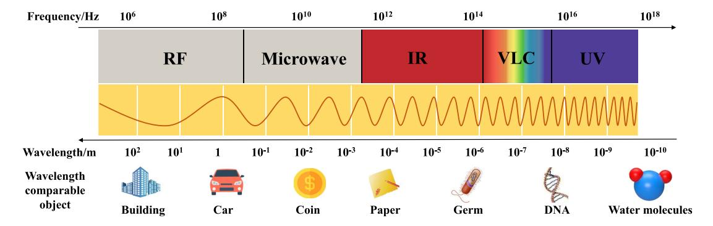

Fig. 1. Electromagnetic wave spectrum.

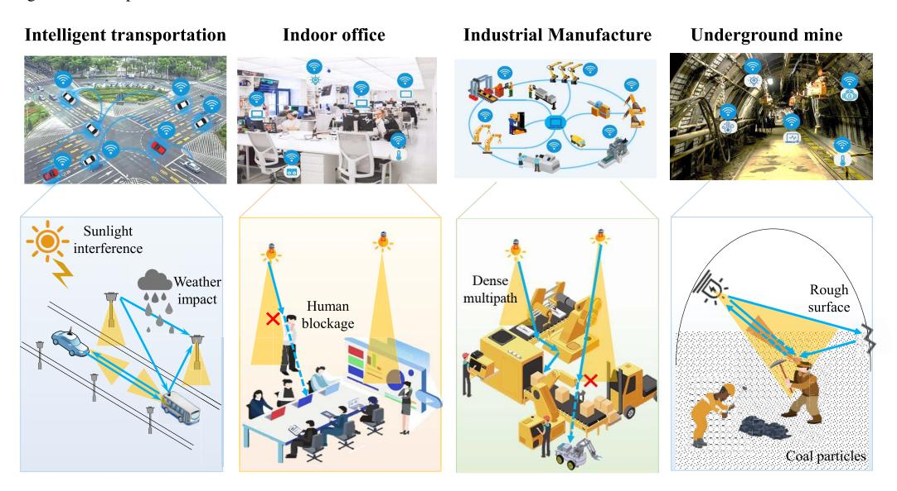

Fig. 2. Examples of 6G VLC-IoE applications and corresponding propagation channel characteristics.

microwaves, infrared (IR) radiation, visible light (VL), ultraviolet (UV) radiation, X-rays, and gamma rays. Among these, radio waves (below 3000 GHz) are commonly employed in mobile communications due to their low propagation loss and wide divergence characteristics [\[23\]](#page-20-14). VLC utilizes VL (430–790 THz) as a transmission medium, constituting a subset of optical wireless communications technologies [\[24\]](#page-20-15), as depicted in Fig. [1.](#page-1-0) VL possesses exceedingly short wavelengths, ranging from 380 to 700 nm, akin to the dimensions of deoxyribonucleic acid (DNA). With the advancement of lightemitting diodes (LEDs), VLC can address both illumination requirements and high-speed transmission demands [\[25\]](#page-20-16). Freespace VLC systems can attain data rates as high as 15.73 Gb/s [\[26\]](#page-20-17), rendering VLC a promising supplementary access technology to radio frequency (RF) methods for enabling IoE applications in 6G. In detail, VLCs have the following unique features and advantages over RF communications: higher bandwidth [\[27\]](#page-20-18), lower cost [\[28\]](#page-20-19), enhanced security [\[29\]](#page-20-20), reduced interference [\[30\]](#page-20-21), energy consumption [\[31\]](#page-20-22), and no health risks to human beings [\[32\]](#page-20-23).

The aforementioned advantages of VLCs over RF communications render VLC an appealing choice for IoE applications in 6G, as illustrated in Fig. [2.](#page-1-1) For instance, in intelligent transportation and industrial manufacturing, the high bandwidth enables the processing of real-time, high-capacity service for VLC. In indoor offices and underground mines, the ubiquitous

presence of light sources greatly reduces usage costs, and the enhanced security ensures the isolation of current regions from external areas, which enables VLCs to be effectively utilized to capitalize. In the IoE applications of VLC, many distinctive channel characteristics are also exhibited. For example, in intelligent transportation, outdoor sunlight and weather conditions can interfere with VL transmission. In indoor offices, the mobile human can cause a blockage effect due to weak penetration and diffraction ability of VL. As VLC technology continues to evolve, further research and development efforts should be dedicated to fully realizing its potential and reaping its benefits across various domains.

#### *C. Characteristics of VLC Channels*

The wireless propagation channel serves as the medium through which electromagnetic waves propagate, facilitating the connection between the transmitter (Tx) and the receiver (Rx). The properties of this channel delineate the ultimate performance limits of wireless communications [\[33\]](#page-20-24). Additionally, VLC channel models serve as prerequisites for evaluating system performance, optimizing algorithms, and planning networks within VLC-IoE systems [\[34\]](#page-20-25). Consequently, a comprehensive understanding of VLC channels is imperative. Relative to RF channels, VLC channels exhibit distinct characteristics primarily attributable to their extremely high frequency and correspondingly small wavelength [\[35\]](#page-20-26), as illustrated in Fig. [2.](#page-1-1) For instance, three unique attributes of VLC channels are explicated below.

- 1) *Weak Penetration and Diffraction Ability:* Penetration and diffraction are phenomena contingent upon wavelength. Hence, VL, with its exceptionally small wavelengths, is more prone to reflection and scattering when interacting with scatterers, thereby diminishing its overall penetration through materials. Additionally, as VL traverses a material, the absorption process gradually reduces its intensity and penetrative capacity [\[36\]](#page-20-27), [\[37\]](#page-20-28).
- 2) *Weak Multipath Dispersion:* The abbreviated wavelength of VL renders it less susceptible to significant diffraction, scattering, and reflection when encountering obstacles or traversing materials. Consequently, VL primarily follows more direct paths, mitigating the occurrence of multiple copies arriving at the receiver with significant disparities in propagation characteristics [\[38\]](#page-20-29). Therefore, VL propagation predominantly transpires in a Line-of-Sight (LoS) manner, reducing the likelihood of multipath dispersion.
- 3) *Susceptible to Weather Conditions:* The wavelength of VL (approximately 400–700 nm) closely approximates the diameter of a cell. At these wavelengths, the principal atmospheric absorbers comprise water molecules, carbon dioxide, and ozone. Furthermore, atmospheric particles, such as rain, snow, and hail, introduce varying scattering and absorption effects on VL. Consequently, VL propagation attenuation is susceptible to fluctuations in weather conditions [\[39\]](#page-20-30).

#### *D. Related Surveys*

In the recent couple of years, there have been some surveys on the VLC channels field. For example, in [\[35\]](#page-20-26), a review of five typical channel models of VLC systems in indoor scenarios was given. On the contrary, the channel models in free-space optical communication systems (outdoor wireless optical communication) were surveyed in [\[40\]](#page-20-31). In [\[41\]](#page-20-32), a comprehensive review of optical wireless communications channel measurement campaigns and channel models is given. For VLC-IoE applications, some typical communication environments are considered, such as indoor, outdoor, underground, and underwater. Miramirkhani and Uysal [\[42\]](#page-20-33) also gave a survey of indoor VLC channel models. Especially, VLC scenarios with mobility were considered. The effect of receiver location and rotation for a mobile indoor user was investigated. For the VLC-based medical body sensor networks (MBSNs), a review of channel modeling activities was presented in [\[43\]](#page-20-34). Yahia et al. [\[44\]](#page-20-35) presented a comprehensive survey of VLC channel modeling techniques in typical scenarios, such as indoor, outdoor, underwater, and underground environments. Also, future research directions for VLC channel models were discussed.

All the above surveys have contributed to the research on VLC channels. However, as far as we know, no work considers the need for VLC-IoE applications in 6G in terms of channel models. As discussed in Section [I-A,](#page-0-0) new technologies and application scenarios appear in 6G, which bring new characteristics and modeling challenges for VLC channels.

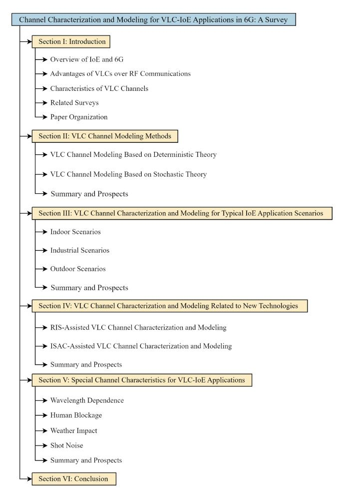

Fig. 3. Organization of this article.

To fill this gap, we propose a comprehensive survey of the channel research for VLC-IoE applications in 6G from four aspects, i.e., channel modeling technologies, typical application scenarios, new enabling technologies, and special channel characteristics.

#### *E. Article Organization*

The remainder of this article is organized as follows. Section [II](#page-2-0) introduces regular methods of VLC channel modeling, including deterministic and statistical methods. Section [III](#page-5-0) reviews recent progress in channel characterization and modeling in typical VLC-IoE application scenarios. For the new technologies, e.g., RIS and ISAC, that are considered enabling technologies in 6G, Section [IV](#page-10-0) gives a survey on VLC channel research activities combined with these new technologies. Section [V](#page-14-0) reviews the research on special characteristics of VLC channels over RF channels. Conclusions and future research directions are presented in Section [VI.](#page-19-8) Fig. [3](#page-2-1) shows the organization of this article. A list of all abbreviations in this article is given in the Appendix for searching quickly.

# II. VLC CHANNEL MODELING METHODS

Since the recursive model was proposed [\[45\]](#page-20-36), VLC channel modeling methods have undergone considerable development,

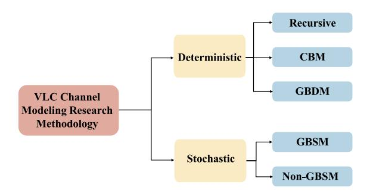

Fig. 4. Summary of VLC channel modeling methods.

from geometric-based statistical models to deterministic models based on ray tracing. This section gives a review of VLC channel modeling methods, mainly including deterministic channel modeling and statistical channel modeling methods. The grouping results of modeling methods are shown in the Fig. [4.](#page-3-0) Deterministic channel models mainly includes recursive model [\[45\]](#page-20-36), [\[46\]](#page-20-37), [\[47\]](#page-20-38), [\[48\]](#page-20-39), ceiling bounce model (CBM) [\[49\]](#page-20-40), [\[50\]](#page-20-41), and ray-tracing methods [\[51\]](#page-20-42), [\[52\]](#page-20-43), [\[53\]](#page-20-44), [\[54\]](#page-20-45), while statistical channel models is divided into geometry-based statistical model (GBSM) [\[55\]](#page-20-46), [\[56\]](#page-21-0), [\[57\]](#page-21-1), [\[58\]](#page-21-2), [\[59\]](#page-21-3), [\[60\]](#page-21-4), [\[61\]](#page-21-5) and nongeometry-based statistical model (non-GBSM), and nongeometry-based model includes Monte Carlo algorithm model [\[62\]](#page-21-6), [\[63\]](#page-21-7) and measurement-based models [\[38\]](#page-20-29), [\[39\]](#page-20-30), [\[64\]](#page-21-8), [\[65\]](#page-21-9), [\[66\]](#page-21-10), [\[67\]](#page-21-11), [\[68\]](#page-21-12), [\[69\]](#page-21-13), [\[70\]](#page-21-14), [\[71\]](#page-21-15). In the following, the basic theory and research progress of these VLC channel modeling methods are discussed in detail.

#### *A. VLC Channel Modeling Based on Deterministic Theory*

*1) Recursive Model:* The recursive model is proposed in [\[45\]](#page-20-36) to simulate the multipath effect indoors. The basic principle of this method is to divide the reflective surface into small pieces ε with *A* area, which is both the receiver ε*r* for the section of light before this reflection and the source ε*s* for the section of light after this reflection, calculate each reflection separately and add them up to get channel impulse response (CIR).

Here, the LoS part that has not been reflected is easiest to represent, as in

$$h^{0}(t) \approx \frac{(m+1)A_{R}}{2\pi D^{2}} \cos^{m}(\phi) \cos(\theta) \delta(t - D/c)$$
 (1)

where *D* is the distance between the Tx and Rx, *AR* is the area of the receiving area, and φ represents the angle of irradiance, also typically denoted as the Angle of Deviation (AoD).

For *hk* that has been reflected *k* (*k* > 0) times, it can be expressed as

$$h^{k}(t; S, R) \approx \sum_{i=1}^{N} \rho \varepsilon_{i}^{r} h^{(0)}(t; S, \varepsilon_{i}^{r}) * h^{(k-1)}(t; \varepsilon_{i}^{s}, R)$$

$$= \frac{m+1}{2\pi} \sum_{i=1}^{n} \frac{\cos^{m}(\phi) \cos(\theta)}{D^{2}}$$

$$\times \operatorname{rect}(2\theta/\pi) h^{(k-1)}(t - D/c; s_{i}, R) \Delta A \quad (2)$$

where *N* represents the total number of reflecting surfaces ε, ρ represents the reflection coefficient, and *si* represents the

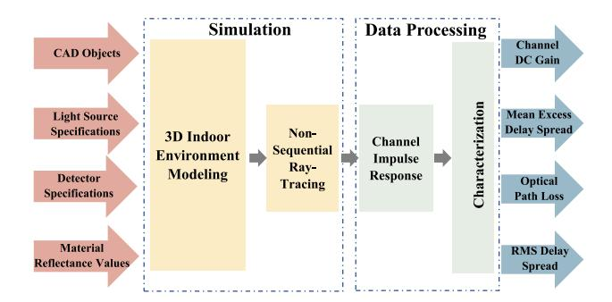

Fig. 5. Overview of GBDMs based on Zemax [\[53\]](#page-20-44).

position of ε*i*. The recursive method is classical and still used in many scenarios [\[47\]](#page-20-38).

To decrease the computational effort associated with handling multiple reflections, based on the recursive model, the iterative model was proposed [\[46\]](#page-20-37). The principle difference between the iterative and recursive models is simply the order of computation, but the use of iterative methods is more computer-friendly and therefore more efficient than the recursive model [\[48\]](#page-20-39).

*2) CBM:* To reduce the computational complexity, [\[49\]](#page-20-40) proposed the CBM by simplifying the environment. The specific constraint is that the impulse response is caused only by diffuse reflections from a single infinite plane (approximating the ceiling). And, the Tx and Rx are placed horizontally side by side in the same position and both are at the same distance from the ceiling. The CIR obtained in this way is easy to compute and has low computational complexity, as in

$$h(t) = \frac{\rho A_R}{3\pi H^2} \frac{6(2H/c)^6}{(t+2H/c)^7} u(t)$$
 (3)

where *u*(*t*) is the unit step function, and *H* represents the height difference between the Tx and Rx. Since the method is easy to calculate and fits better with the actual environment, it has been applied a great deal up to now [\[50\]](#page-20-41).

*3) Geometry-Based Deterministic Models Based on Ray Tracing:* Drawing upon the principles of geometric optics and the uniformity of diffraction, numerous optical design software packages incorporate ray-tracing capabilities. In the context of [\[51\]](#page-20-42), the nonsequential ray-tracing functionality of ZEMAX is leveraged to model VLC channels. As depicted in Fig. [5,](#page-3-1) this methodology allows for the importation of computer-aided design (CAD) models, facilitating the simulation of a diverse array of objects and materials by establishing various surface layers. Additionally, by fine-tuning a range of reflection and scattering coefficients, the software can effectively simulate phenomena, such as specular reflection, diffuse reflection, and other forms of light interaction. Owing to the ray-tracing functionality of ZEMAX, renowned for its high fidelity in simulations [\[52\]](#page-20-43), reference channel models have been meticulously developed using this sophisticated technique within the paradigms of IEEE 802.15.7r1 [\[53\]](#page-20-44) and IEEE 802.11bb [\[72\]](#page-21-16). These models have been widely adopted and integrated into the field of indoor VLC channel modeling, contributing to the advancement of the technology in various scenarios [\[38\]](#page-20-29), [\[54\]](#page-20-45).

## *B. VLC Channel Modeling Based on Stochastic Theory*

Within stochastic modeling frameworks, the impulse response of the VL channel is delineated by wave propagation principles tailored to distinct transmitter, receiver, and scatterer geometries. These geometries are randomly predetermined in accordance with a specific probability distribution. When contrasted with deterministic approaches, stochastic methods exhibit greater adaptability, and diminished computational complexity, and are viewed as indifferent to location, albeit at a cost of diminished precision.

*1) GBSMs:* GBSMs include the spherical model, regularshapes geometry-based stochastic models (RS-GBSMs), nonstationary geometry-based stochastic models (NS-GBSMs), and the Hayasaka–Ito model. The spherical model is an empirical model proposed by [\[55\]](#page-20-46) for fast computation, which can be used to approximate the optical path loss (OPL) and CIR of higher order reflections for indoor environments. Based on the spherical model, the diffused CIR is expressed as follows:

$$h_{\text{diff}}(t) = \frac{H_{\text{diff}}}{\tau} \exp(-t/\tau)$$
 (4)

where *H*diff denotes the diffused channel gain, and *H*diff is

$$H_{\text{diff}} = \frac{\rho A_R}{\sum \rho_i \Delta A_i}.$$
 (5)

The simulations of RS-GBSMs are commonly used because they make the calculations simpler by setting the scatterers as regular shapes. For example, [\[56\]](#page-21-0) simplifies the scatterer in three dimensions to a spherical or ellipsoidal shape, and for scatterers in two dimensions, [\[57\]](#page-21-1) uses ellipses while [\[58\]](#page-21-2) uses rings to simplify the calculation.

The latest research for the VL channel model has gradually evolved to nonstationary models, and many NS-GBSMs have been proposed, such as on spatially unstable [\[59\]](#page-21-3), and 3-D models in the time–frequency–space domain [\[60\]](#page-21-4), where [\[60\]](#page-21-4), [\[73\]](#page-21-17), and [\[74\]](#page-21-18) propose the GBSMs theory and applications of 6G for all scenarios and frequency bands.

The Hayasaka–Ito model breaks the CIR into primary reflections and higher order reflections greater than or equal to 3 reflections, ignoring secondary reflections. It uses the gamma distribution as a model for primary reflections [\[61\]](#page-21-5), as follows:

$$h^{1}(t) = \frac{\beta - \alpha}{\Gamma(\alpha)} t^{\alpha - 1} \exp\left(-\frac{t}{\beta}\right)$$
 (6)

where (α) is the Gamma function, and α and β are the physical characteristic parameters of the channel. In contrast, the higher order reflections use the spherical model as described before. The model proves that the bandwidth characteristics of the channel are mainly determined by the primary reflection.

- *2) Non-GBSMs:* According to the data source, non-GBSMs include the simulation-based method represented by Monte Carlo [\[62\]](#page-21-6), [\[63\]](#page-21-7) and the measurement-based method that is divided by time domain [\[38\]](#page-20-29), [\[39\]](#page-20-30), [\[64\]](#page-21-8), [\[66\]](#page-21-10), [\[67\]](#page-21-11) and frequency domain [\[68\]](#page-21-12), [\[69\]](#page-21-13), [\[70\]](#page-21-14), [\[71\]](#page-21-15).
- *a) Monte Carlo method:* To obtain channel data more flexibly, [\[62\]](#page-21-6) proposed the Monte Carlo method. The Monte Carlo method consists of three main parts, i.e., the light

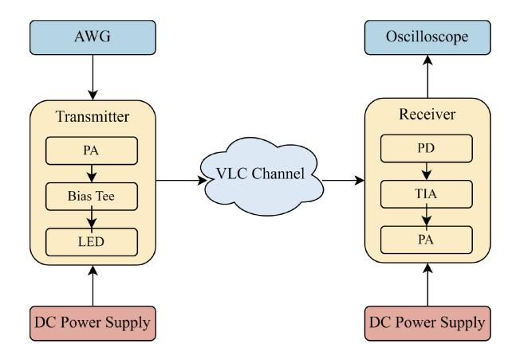

Fig. 6. VLC channel measurement platform in the time domain [\[39\]](#page-20-30).

generation part (generally using the Lambert radiation model), the reflection processing part (mostly walls, etc.), and the response calculation part at the receiver side. The method does not need to divide the reflecting surface into a small surface to calculate, but it needs a lot of rays to ensure accuracy. To address this issue, [\[63\]](#page-21-7) proposed an improved version to ensure that each reflection would eventually be useful for the CIR, thus reducing the amount of computation.

*b) VLC channel measurement in the time domain:* The most straightforward method for time-domain measurements is to send short-time pulses to obtain the CIR, also known as the short pulse method [\[64\]](#page-21-8). Its accuracy depends on the time accuracy of the instrument at the transmitter and receiver. This method is the most direct and time-saving, but the visible band is very high, corresponding to the time delay in the nanosecond. Thus, obtaining sufficient accuracy requires a high time accuracy of the instrument, which is often expensive.

Another time domain measurement method is the pseudorandom noise code (PN) method, which is a new method proposed in recent years. The basic principle of the PN method is to use the characteristics of the generated random sequence of autocorrelation functions as the impulse function to obtain CIRs. The Tx sends a pseudo-random sequence, and the Rx uses the same pseudo-random sequence to convolve it. The CIRs can be obtained like

$$PN * (PN * h) = PN * PN * h \approx \delta * h = h.$$
 (7)

By setting up a comparison with the attenuator, [\[66\]](#page-21-10) eliminates the transfer functions of Tx and Rx contained in the PN method.

The channel sounding setup in the time domain in [\[39\]](#page-20-30) is illustrated in Fig. [6.](#page-4-0) On the transmitting end, an Arbitrary Waveform Generator is employed to produce a wave. This electrical signal is then routed to a transmitter module that includes a power amplifier (PA), a Bias Tee, and an LED. The module operates using a 12-V direct current (DC) power supply. The photodiode (PD) captured the light signal and transformed it into an electrical signal in direct proportion. Subsequently, the electrical signal was directed into an oscilloscope following its passage through the transimpedance amplifier and PA, which are incorporated within the receiver module.

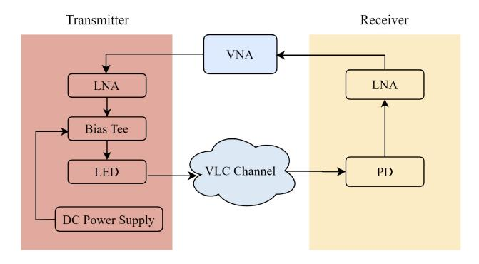

Fig. 7. VLC channel measurement platform in the frequency domain [\[68\]](#page-21-12).

In [\[67\]](#page-21-11), a VLC channel measurement platform is built to measure large-scale fading. On the transmitting end, we use a DC power source to provide the necessary operating voltage to the Bias-Tee, enabling the offset voltage to be added to the electrical signal. Subsequently, LEDs with different transmitted light, i.e., blue, red, green, and purple, are utilized individually to send signals across VLC channels. These four LED colors are commonly found in commercial applications. At the receiver side, the PD is used to detect the light rays that have traversed the VLC channels. The optical power monitor software on the receiver's personal computer shows the received optical power through the liquid crystal display (LCD) interface. Based on this platform, a series of VLC channel measurements in indoor scenarios were conducted [\[38\]](#page-20-29), [\[39\]](#page-20-30), [\[67\]](#page-21-11).

*c) VLC channel measurement in the frequency domain:* Frequency-domain channel measurement is another alternative channel measurement method. The measurement principle is to send and obtain signals from different frequency bands, and then combine them. For example, a vector network analyzer (VNA) is used for sweep synthesis to obtain the channel frequency response (CFR), and then use the inverse Fourier transform to get CIRs. Obtaining the CFR and converting it to CIR is easier to measure than obtaining the CIR directly. Although it is more time-consuming than the direct time-domain measurement method with one more conversion process and sweep synthesis, the equipment cost is much lower than the former because it does not require such a high timeaccuracy instrument as the direct measurement.

The frequency-domain VLC channel measurement platform is illustrated in [\[68\]](#page-21-12) as Fig. [7.](#page-5-1) The signal is sent from port 1 of the VNA and received at port 2. To enhance the received power and consequently achieve a better signal-to-noise ratio (SNR), a PA is connected to the output of port 1, and a lownoise amplifier is employed at the input of receiving port 2.

#### *C. Summary and Prospects*

As discussed above, each model mentioned in this section has its characteristics and is applicable to different scenarios. The characteristics of the centralized models are shown in Table [I.](#page-5-2) For deterministic models, the recursive model and CBM are suitable for simple indoor scenes, while geometric-based deterministic models (GBDMs) are suitable for complex scenes. For statistical models, they are more

TABLE I SUMMARY OF VLC CHANNEL MODELING METHODS

| Model        | Accuracy  | Complexity | Application   |  |
|--------------|-----------|------------|---------------|--|
| Recursive    | Moderate  | Moderate   | Simple Indoor |  |
| CBM          | Moderate  | Low        | Simple Indoor |  |
| GBDM         | High      | High       | Precision     |  |
| GBSM         | Moderate  | Low        | General       |  |
| non-GBSM-    | High      | High       | General       |  |
| Monte Carlo  | riigii    | nigii      |               |  |
| non-GBSM-    | Moderate  | Moderate   | General       |  |
| Measurements | Wioderate | Wioderate  |               |  |

suitable for standardized general scenarios. GBSM can achieve moderately accurate models with low computational complexity. The Monte Carlo method can achieve higher accuracy in modeling channels for flexible scenarios by increasing computational complexity. Modeling methods based on time-domain or frequency-domain measurements require high measurement costs to achieve low-complexity high-accuracy channel models. In the future, to support the evaluation of VLC-IoE systems in 6G standardization work, a standard VLC channel model is needed, which follows the modeling framework in ITU M. 2412. Also, this model should have a good tradeoff between complexity and accuracy.

# III. VLC CHANNEL CHARACTERIZATION AND MODELING FOR TYPICAL IOE APPLICATION SCENARIOS

Based on the straightforward and distinctive advantages of VLC discussed earlier, VLC is anticipated to facilitate IoE applications in typical indoor and outdoor scenarios for 6G. The VLC channels, influenced by both LoS and Non-LoS (NLoS) components, are highly sensitive to the transceiver and environmental parameters [\[67\]](#page-21-11). These parameters include the light source's radiation pattern, the scenario size, and the configuration of surrounding objects. Consequently, it is crucial to model the VLC channel considering the varying characteristics of different scenarios to accurately predict propagation characteristics. In this section, we would introduce the characteristics of typical IoE application scenarios. Furthermore, a review of recent advances in VLC channel characterization and modeling in these scenarios is given, as shown in Table [II.](#page-6-0)

# *A. Indoor Scenarios*

Indoor offices and corridors are usually composed of furniture, such as doors, desks, and tables, which are the typical indoor scenarios in IoE applications. The size of the scenario is a crucial parameter influencing both the communication quality and the maximum transmission rate in indoor environments. This is because it directly impacts the reflectance model and the multipath propagation characteristics of the channel. For an office room, the dimensions are defined as *S*× *S* × *H* m3, where *S* ranges from 5 to 30 m, and *H* is typically assumed to be 3 m. The width of the corridor is set to be narrower than that of the office.

| Scenarios                                                    | Characteristics of scenarios                                                           | Modeling Approach                                     | Channel characteristics      | Influence factors                                                                                                                                                                                                                                                                | Ref        |
|--------------------------------------------------------------|----------------------------------------------------------------------------------------|-------------------------------------------------------|------------------------------|----------------------------------------------------------------------------------------------------------------------------------------------------------------------------------------------------------------------------------------------------------------------------------|------------|
|                                                              |                                                                                        | Iterative                                             | OPL                          | Reflection                                                                                                                                                                                                                                                                       | [75], [76] |
| Indoor scenarios (e.g., office.conference room and corridor) | Small size, partial shading brought by furniture                                    | GBDMs Based on Ray-Tracing                            | RMS DS, OPL                  | User location                                                                                                                                                                                                                                                                    | [77]       |
|                                                              |                                                                                        | GBDMs Based on Ray-Tracing                            | OPL                          | Scenario size, coating material                                                                                                                                                                                                                                                  | [78]       |
|                                                              |                                                                                        | GBDMs Based on Ray-Tracing                            | CIR, OPL, RMS DS, K-factor   | Reflection                                                                                                                                                                                                                                                                       | [38]       |
|                                                              |                                                                                        | non-GBSMs(VLC Channel Measurement in the Time Domain) | OPL, K-factor, AS            | Propation distance                                                                                                                                                                                                                                                               | [65]       |
|                                                              |                                                                                        | non-GBSMs(VLC Channel Measurement in the Time Domain) | CIR, OPL                     | Propagation distance                                                                                                                                                                                                                                                             | [79]       |
|                                                              |                                                                                        | non-GBSMs(VLC Channel Measurement in the Time Domain) | OPL                          | Scenario size, wavelength dependence                                                                                                                                                                                                                                             | [67]       |
|                                                              |                                                                                        | GBDMs Based on Ray-Tracing                            | CIR                          | Reflection                                                                                                                                                                                                                                                                       | [53]       |
|                                                              |                                                                                        | GBDMs Based on Ray-Tracing                            | CIR, OPL, RMS DS, AS         | Reflection, blocking effect                                                                                                                                                                                                                                                      | [80]       |
|                                                              | Large size, scattering and blocking effects from abundant surrounding scatterers | GBSM                                                  | OPL                          | Reflection                                                                                                                                                                                                                                                                       | [47], [81] |
| Industrial scenarios                                         |                                                                                        | GBSM                                                  | CIR                          | Absorption and scattering                                                                                                                                                                                                                                                        | [82]       |
|                                                              |                                                                                        | GBSM                                                  | CIR                          | Shadowing and scattering                                                                                                                                                                                                                                                         | [83]       |
|                                                              |                                                                                        | GBDMs Based on Ray-Tracing                            | CIR,OPL                      | Shadowing and scattering                                                                                                                                                                                                                                                         | [84]       |
|                                                              |                                                                                        | GBDMs Based on Ray-Tracing                            | CIR, channel DC gain, RMS DS | User location                                                                                                                                                                                                                                                                    | [43]       |
|                                                              |                                                                                        | GBDMs Based on Ray-Tracing                            | OPL, RMS DS                  | User location                                                                                                                                                                                                                                                                    | [52]       |
|                                                              |                                                                                        | GBDMs Based on Ray-Tracing                            | channel DC gain              | S User location in User location                                                                                                                                                                                                                                                 | [85]       |
|                                                              |                                                                                        | GBDMs Based on Ray-Tracing                            | OPL                          | Scenario size, coating material Reflection Propation distance Propagation distance Scenario size, wavelength dependent Reflection Reflection, blocking effect Reflection Absorption and scattering Shadowing and scattering Shadowing and scattering User location User location | [86], [87] |
|                                                              | Effects of weather, scattering from vehicles                                           | non-GBSMs(VLC Channel Measurement in the Time Domain) | OPL                          | Density of fog                                                                                                                                                                                                                                                                   | [88], [89] |
|                                                              |                                                                                        | GBDMs Based on Ray-Tracing                            | OPL                          | weather type                                                                                                                                                                                                                                                                     | [90]       |
|                                                              |                                                                                        | GBDMs Based on Ray-Tracing                            | OPL                          | Lambertian model                                                                                                                                                                                                                                                                 | [91], [92] |
|                                                              |                                                                                        | non-GBSMs(VLC Channel Measurement in the Time Domain) | OPL                          | Low beam pattern                                                                                                                                                                                                                                                                 | [71]       |
|                                                              |                                                                                        | non-GBSMs(VLC Channel Measurement in the Time Domain) | OPL                          | Low beam pattern                                                                                                                                                                                                                                                                 | [93]       |
|                                                              |                                                                                        | GBDMs Based on Ray-Tracing                            | CIR                          | Streetlight                                                                                                                                                                                                                                                                      | [94], [95] |
|                                                              |                                                                                        | GBDMs Based on Ray-Tracing                            | OPL, BER                     | Streetlight                                                                                                                                                                                                                                                                      | [96]       |
|                                                              |                                                                                        | GBDMs Based on Ray-Tracing                            | OPL, BER                     | Reflections of roads                                                                                                                                                                                                                                                             | [97], [98] |
|                                                              |                                                                                        | non-GBSMs(VLC Channel Measurement in the Time Domain) | CIR, BER                     | Reflections of cars                                                                                                                                                                                                                                                              | [99]       |
|                                                              |                                                                                        | CRDMo Board on Boy Tracing                            | DMC DC                       |                                                                                                                                                                                                                                                                                  | [100]      |

TABLE II RECENT ADVANCES IN VLC CHANNEL CHARACTERIZATION AND MODELING FOR TYPICAL IOE APPLICATION SCENARIOS

Regarding VLC channel modeling in typical indoor scenarios, there are two groups of research efforts: 1) simulations-based and 2) measurements-based. In the first group, theoretical VLC channel models are explored, such as recursive and iterative models, and GBDMs that use ray-tracing simulations to describe indoor VLC channels. For instance, the OPL of NLoS components was investigated in [\[75\]](#page-21-19) based on simulations with an iterative model. However, these studies often incorporate simplifying assumptions like empty rooms and constant reflectance. To achieve more realistic indoor VLC channel modeling, studies, such as [\[43\]](#page-20-34) and [\[51\]](#page-20-42), utilize Zemax to derive CIRs for various indoor environments. Miramirkhani [\[78\]](#page-21-20) conducted comprehensive advanced ray-tracing simulations to derive the CIR within a room. Then, an OPL model that is a function of distance, room size, and coating material is presented. This model can be expressed as

$$OPL = -10\log_{10}\left(\frac{a}{d^n}\right) \tag{8}$$

where *a* is the channel coefficient, *d* is the distance between the light source and PD, and *n* is the path-loss exponent (PLE), which was in the range of 3.6–5.4. It can also be observed that the effect of higher order reflections was less pronounced as the increased room size. Furthermore, Miramirkhani et al. [\[77\]](#page-21-21) derived CIRs for points along user movement trajectories. Then, the models for OPL and delay spread (DS) as functions of distance were proposed. These models can be represented as

$$OPL = \sum_{j=1}^{n} \sin(l_j d + m_j)$$
 (9)

$$\tau_{\text{RMS}} = \sum_{j=1}^{n} \sin(v_j d + w_j)$$
 (10)

where *d* is the distance of the human from the start point, and *n* is related to the number of LEDs. Liu et al. [\[38\]](#page-20-29) compared the propagation characteristics, e.g., OPL, rootmean square (RMS) DS, and *K*-factor, in mmWave and VLC bands in a conference room. The reflection factors caused by the walls and furniture in the conference room are considered when analyzing the channel characteristics. As illustrated in Fig. [8\(](#page-7-0)a), the OPL of VLC channels is significantly influenced by the physical dimensions of the PDs. An OPL model, expressed as a function of the distance and the size of the PDs, can be formulated as

OPL
$$(d, r) = \beta + 10\alpha \log_{10}(d) + \gamma \log_{10}\left(\frac{1}{r^3}\right) + X_{\sigma}$$
 (11)

where *r* denotes the radial size of PDs. The parameter α, known as PLE, is 1.73, which is higher than the PLE in mmWave (1.31). This indicates that VLC channels experience faster signal attenuation with increasing distance compared to

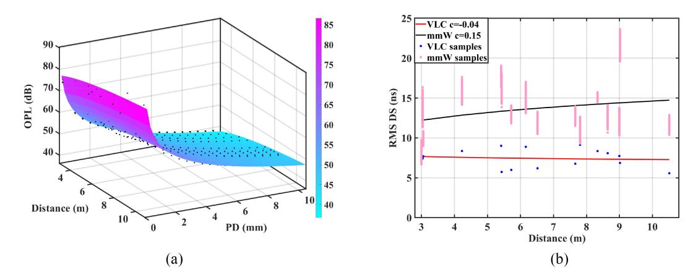

Fig. 8. (a) OPL fitting results considering the physical size of PDs [38]. (b) RMS DS fitting results in mmWave and VLC bands [38].

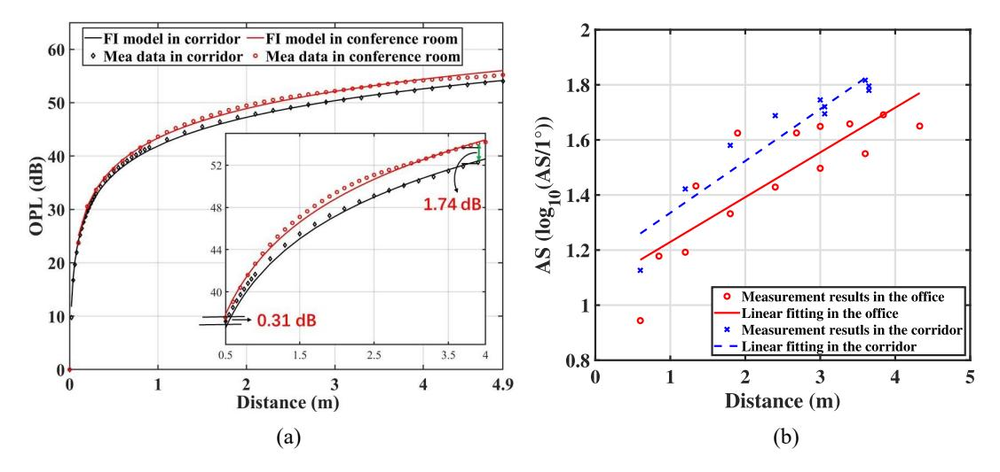

Fig. 9. (a) Measured OPL with  $\lambda = 625$  nm in the corridor and conference room [67]. (b) Distance dependence of AS [65].

mmWave channels. Additionally, as shown in Fig. 8(b), the RMS DS for VLC channels range from 5 to 10 ns, which are lower than those for mmWave channels, which range from 10 to 15 ns. It suggests that delay dispersion is weaker in VLC bands compared to mmWave bands. This is because the few received multipath rays in VLC channels undergo fewer complex reflections with significant excess delay.

In the second group, [79] presented channel measurement results in an empty room, in which both LoS and NLoS scenarios are considered. It was observed that OPL decreases as distance increases when there is an LoS component or firstorder reflections. In [67], the wavelength dependence of OPL was analyzed and modeled based on channel measurements in a conference room and corridor. This study demonstrated that the scenario size has a nonlinear positive effect on indoor VLC channel characteristics. For example, the PLE in the corridor  $(\beta_{PL} = 1.77)$  is lower than in the conference room  $(\beta_{PL} =$ 1.83). Furthermore, as shown in Fig. 9(a), the measured OPL in the corridor is 1.74 dB lower than that in the conference room at a distance of 3.9 m. In [65], multipath dispersion characteristics, such as power angular spread (PAS), angular spread (AS), and clustering characteristics, were analyzed and modeled for the conference room and corridor. The distance dependence of AS in the office and corridor is fitted by the linear model

$$AS(\log_{10}(AS/1^\circ)) = \alpha_{AS} \cdot d + \beta_{AS} + X_{\sigma}^{AS}$$
 (12)

where  $\alpha_{AS}$  is the slope,  $\beta_{AS}$  is the intercept of fitting curves, and  $X_{\sigma}^{AS}$  is the standard deviation between measured AS and fitting curve. The distance dependence of AS is analyzed in Fig. 9(b). The slope of the AS in the corridor ( $\alpha_{AS}=0.19$ ) is greater than that in the office ( $\alpha_{AS}=0.16$ ). This is primarily due to the increasing impact of the corridor corners with distance, causing more fluctuations in the PAS and resulting in a larger AS. Moreover, The CIR is usually represented by the superposition of amplitude, excess delay, and initial phase of each subpath within each cluster. However, since it is not able to accurately obtain the delay of each subpath in VLC measurements, this article uses only the received power and angular parameters to describe the CIR

$$h(\phi) = \sum_{n=1}^{N} \sum_{m=1}^{M} P_{m,n} \delta(\phi - \phi_{m,n})$$
 (13)

where  $\phi$  is the azimuth angle of arrival (AOA), n and m denote the number of clusters and the number of subpaths, respectively, and  $P_{m,n}$  and  $\phi_{m,n}$  are the power and azimuth AOA

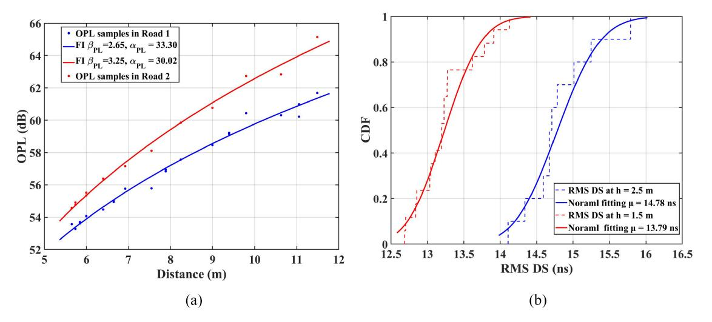

Fig. 10. (a) Distance dependence of OPL under single Tx case [\[80\]](#page-21-23). (b) Cumulative distribution function of RMS DS under the multiple Txs' cases [\[80\]](#page-21-23).

of the *m*th subpath belonging to the *n*th cluster. In [\[101\]](#page-22-0), the OPL is modeled as a function of LED and PD specifications, which can be written as

OPL[dB)] = 
$$\alpha + 10\beta \log_{10}(d) + \mu \log_{10}(\varphi) + \nu \log_{10}(\omega) + \gamma \log_{10}(D_{PD})$$
 (14)

where ϕ represents the AOD, ω denotes the half-power angle (HPA), and *DPD* refers to the diameter of the receiving area.

# *B. Industrial Scenarios*

There are already indoor VLC channel models in existing VLC channel standards. However, the industrial scenarios composed of irregular materials are diverse and complex, which present features that do not appear in typical indoor environments [\[102\]](#page-22-1). Thus, many new channel characteristics can be exhibited, which can be divided into four aspects. In the first aspect, compared with the propagation distance between the Tx and Rx in indoor general scenarios (10 m or lower) shown in the previous section, the propagation distance in the industrial scenarios is much longer. The longer path can result in higher OPL and weaken the system's performance [\[67\]](#page-21-11). Second, the transmission medium is typically assumed to be clear air. However, this assumption does not always hold in industrial environments, which show specific conditions, e.g., oil vapor, water mist, industrial fumes, or coal particles. These conditions interfere with the VLC signal by causing attenuation through processes like absorption and scattering, as outlined in [\[103\]](#page-22-2). Third, in terms of the propagation mechanism of the signal, the dense multipath reflected by the abundance of metallic objects has a significant effect on the signal. Finally, in terms of the occlusion effect, the equipment and assembly lines in the scenarios also have a significant effect on the signal, which results in great deterioration of users' communication quality due to the shadow area caused by the blockage [\[104\]](#page-22-3). Generally, it is necessary to model the VLC channel for applications in the industrial scenario.

Until now, there have been some research works about VLC channel modeling in these industrial scenarios. These works can be divided into three groups based on the VLC applications in the industrial, i.e., the manufacturing cells, the downhole applications, the underground mines, and the medical scenarios. In terms of the manufacturing cells, Uysal et al. [\[53\]](#page-20-44) conducted channel modeling for a manufacturing cell using Zemax to derive the CIRs. It is observed that the amplitude of T6 (located in the middle of the cell boundary) was significantly larger than that of T7 (positioned in a corner) because T6 was closer to the array of transmitters. Conversely, T7, being situated at the corner, experienced more scattering from the boundaries, resulting in a heavily scattered signal due to multipath signals from NLOS paths with delays spanning tens of nanoseconds. Furthermore, in [\[80\]](#page-21-23), the raytracing simulation was adopted to investigate the VLC channel in manufacturing cells. The large-scale fading and multipath characteristics were analyzed and modeled, including CIR, OPL, RMS DS, and AS. The reflection and the blocking effect on these channel characteristics are also investigated. As depicted in Fig. [10\(](#page-8-0)a), the PLE of the FI model in Road 1 (βPL = 2.65) is lower than that of Road 2 (βPL = 3.25). This suggests that light signals decay more rapidly in Road 2 compared to Road 1 as the propagation distance increases. Moreover, Fig. [10\(](#page-8-0)b) illustrates that the mean value of RMS DS at a height of 1.5 m is 13.79 ns, which is smaller than the value of 14.78 ns at a height of 2.5 m. The study also indicates larger RMS DS and AS of arrival (ASA) under multiple TXs. This can be attributed to the manufacturing cell's larger physical size and complex equipment, in contrast to the smaller and emptier indoor scenarios. In the manufacturing cell, light rays generated by multiple TXs undergo intricate reflections from various directions, resulting in more multipath reaching the RXs and consequently leading to larger RMS DS for VLC channels.

In terms of underground mines, theoretical VLC channel models and ray-tracing simulations are usually used to characterize the VLC channel. In [\[47\]](#page-20-38) and [\[81\]](#page-21-24), an OPL model for mining VLC communication scenarios is proposed, which can be expressed as

$$PL = PL(d_r) + 10n\log_{10}\left(\frac{d}{d_r}\right) + X \tag{15}$$

where the distance between the TX and RX exceeds a reference distance, denoted as *dr*, and *n* represents the PLE, various VLC channel characteristics in underground mining come into play. Specifically, the mean excess delay for the first reflection from infrastructure to the miner differs between the mining roadway and the working face, with values of 9.4 and 9.77 ns, respectively. Notably, the RMS DS in the working face is lower than that in the mining roadway. However, these findings stem from the VLC channel model that lacks consideration of crucial components affecting underground mining tunnels. In [\[82\]](#page-21-25), the first analysis of the VLC channel model accounts for intrinsic features like the absorption and scattering of light caused by factors such as dust particles. This study delves into the impact of coal dust particles on optical signal degradation and identifies optimal transmitter positions to mitigate this degradation. However, a drawback of this article is the omission of direct consideration of scattering effects in the channel's theoretical model. Moreover, in [\[83\]](#page-21-26), the analysis of VLC channels in underground mines treats shadowing and scattering as phenomena independent of the channel. Consequently, the analytical model of the VLC channel overlooks these effects, representing a notable limitation. To address this deficiency, [\[84\]](#page-21-27) proposed a ray-tracing-based model specifically tailored to underground mining environments. This model incorporates the effects of scattering and shadowing induced by dust particles and machinery, respectively. The results show that the shadowing and scattering by the dust particles have an obvious influence on the magnitude and temporal dispersion of multipaths.

In terms of the medical scenarios of IoE application scenarios, Donmez et al. [\[43\]](#page-20-34) introduced a practical channel modeling ray-tracing simulation. This method accounts for the intricacies of skin tissue in modeling the channels for MBSNs within authentic hospital environments, such as intensive care units (ICUs) wards, clinics, semi-private patient rooms, and family-centered patient rooms. Their findings revealed that the channel DC gains vary depending on the positions of both the user and the sensor nodes on the patient's body. Additionally, the RMS DS ranged from 5.29 to 9.18 ns, suggesting that the multipath components are indistinguishable, allowing for modeling the channel as single-tap (frequency-flat). In [\[52\]](#page-20-43), a ray-tracing-channel modeling method is adopted to characterize VLC-based MBSN channel parameters. Furthermore, statistical models were proposed for OPL and RMS DS within realistic ICU wards and Family-Type Patient Rooms, where users move with random trajectories. Simulation results demonstrated that both OPL and RMS DS conform to lognormal distributions.

# *C. Outdoor Scenarios*

Intelligent transportation systems play a critical role in the IoE and the development of future smart cities. In these systems, wireless connectivity is essential for facilitating vehicle-to-vehicle (V2V), vehicle-to-infrastructure, and infrastructure-to-vehicle (I2V) communication links, typically relying on RF technologies [\[105\]](#page-22-4). However, VLC technology offers an alternative approach, primarily utilizing LOS links for communication, ensuring robust connectivity even in high-traffic scenarios. Channel modeling is crucial for understanding the propagation conditions of VLC systems, particularly in the context of Vehicle-VLC (V-VLC) systems, where unique challenges arise. These challenges include adverse weather conditions like fog, snow, and rain, as well as the influence of vehicle headlights and taillights on V-VLC communication. Furthermore, the effect of the vehicle headlights and taillights on the V-VLC is also considered. Moreover, The NLoS V-VLC transmissions are also demonstrated to increase the received signal strength (RSS) of the LoS V-VLC link through object reflections.

Several existing works have considered the influence of such factors on the V-VLC channel characteristics. Investigations into weather effects, including fog, snow, and rain, have predominantly utilized simulation or measurements conducted in laboratory atmospheric chambers. For instance, research efforts, such as [\[106\]](#page-22-5) and [\[107\]](#page-22-6), have employed simulation or chamber measurements to investigate the influence of these weather conditions. In [\[86\]](#page-21-28), the impact of fog and rain on V2V links was studied through simulation, presenting a linear OPL model applicable to distances up to 20 m under varying weather conditions. Additionally, an enhanced OPL model was proposed suitable for larger transmission ranges in [\[87\]](#page-21-29). Despite these advancements, there remains ongoing research, such as [\[88\]](#page-21-30), which relies on simulation-based approaches. However, validating simulation results through experimental investigations remains a crucial aspect of such research. In [\[89\]](#page-21-31), the effect of fog conditions was experimentally analyzed using a real taillight as a TX. Although this study considered only two scenarios—light fog and heavy fog it provided valuable insights into the practical implications of fog on V-VLC communication. Rabiepoor et al. [\[90\]](#page-21-32) developed a channel model for RIS-assisted VVLC systems. Then, the OPL results as a function of propagation distance under various conditions was investigated, including different weather conditions and radiation patterns.

In terms of LED patterns in V-VLC systems, there has been limited research on modeling vehicular optical channels using low-beam headlights [\[71\]](#page-21-15), [\[91\]](#page-21-33), [\[92\]](#page-21-34), [\[97\]](#page-21-35). References [\[91\]](#page-21-33) and [\[92\]](#page-21-34) offer analytical approaches using the Lambertian channel model. However, due to the asymmetrical pattern of the headlights, the Lambertian channel model is not suitable for vehicular VLC channels. In [\[71\]](#page-21-15), measurements were taken using low-beam headlights and then approximated using the Lambertian model. Additionally, Aly et al. [\[93\]](#page-21-36) measured the optical channel for V2V communication considering low-beam headlights and proposed a closed-form OPL expression based on data fitting. The proposed measurementbased optical channel model is as follows:

$$h_{\text{opt}}(dB) = 10 \log_{10} \left( \frac{4D_R}{3(d+d_h^2)} \right)^2$$
 (16)

where *DR* is the power meter effective area's diameter, *dh* is the lateral displacement, and *d* is the intervehicle distance.

Researchers have extensively explored the achievable system capacity supported by VLC transmitters, particularly in the context of I2V communications where traffic lights and streetlights serve as VLC transmitters. Studies, such as [\[94\]](#page-21-37) and [\[95\]](#page-21-38), utilized ray-tracing methods to analyze the CIR for I2V VLC systems, leveraging the radiation pattern of LED street lamps from the Dialux library. However, these investigations typically focused solely on numerical results without providing specific OPL models for the I2V channel. In response to this gap, [\[96\]](#page-21-39) introduced a closed-form OPL expression, offering a comprehensive understanding of OPL in I2V VLC systems. This expression, dependent on transceiver and infrastructure parameters, facilitates system design and optimization, providing valuable insights into the performance of VLC-based I2V communication. The expression can be listed as follows:

$$h_{dB} = C_{P}z + C_{SA}$$

$$C_{P} = 0.5f(D_{r}, H_{P}, H_{V}, d_{T}, d_{h}, b_{1})$$

$$-0.5f(D_{R}, H_{P}, H_{V}, d_{T}, d_{h}, b_{2})$$

$$C_{SA} = 0.5f(D_{r}, H_{P}, H_{V}, d_{T}, d_{h}, b_{1})$$

$$+0.5f(D_{R}, H_{P}, H_{V}, d_{T}, d_{h}, b_{2})$$
(17)

where *CP* and *CSA* can be determined for a specific scenario. Their values depend on several factors: the height of the lighting pole (*HP*), the height of the vehicle (*HV*), the distance between two lighting poles (*dT* ), lateral shift (*dh*), and the diameter of the PD (*Dr*) in cm. The authors then conducted a statistical analysis of the OPL and derived a closed-form expression for its probability distribution function.

Limited research has delved into the NLOS V-VLC channel, specifically focusing on the impact of reflections from vehicle surfaces. While studies, such as [\[98\]](#page-21-40) and [\[97\]](#page-21-35), have explored the effects of highly reflective road surfaces on the RSS and BER performance degradation of V-VLC, the characterization of the NLoS V-VLC channel due to vehicle reflections remains scarce. Addressing this gap, a novel approach was proposed in [\[99\]](#page-21-41) to model the NLoS V-VLC channel, considering the characteristics of reflection surfaces and the influence of vehicle reflections. Their model incorporates a distance-based OPL model and a CIR formulation that accounts for temporal broadening effects caused by vehicle reflections. Specifically, the NLoS V-VLC CIR provided valuable insights into the temporal dynamics of the channel in NLoS scenarios affected by vehicle reflections. The NLoS V-VLC CIR is approximated as

$$h(t) = C_1 \Delta t_{\alpha} \exp(-C_2 \Delta t) + C_3 \Delta t_{\beta} \exp(-C_4 \Delta t)$$
 (18)

where *C*1, *C*2, *C*3, *C*4, α, and β represent coefficients that are determined through least-squares fitting to the measurement data. *t* is the time scale of the CIR peak. Then, the leastsquares fitting-based empirical NLoS channel OPL model is obtained as

$$PL[dB] = 10 \log_{10} \left( (\alpha \exp(-n\frac{d_0}{d}))^{d-d_0} \left( \frac{d}{d_0} \right)^{\beta} \right) + PL_{REF}$$
(19)

where PLREF represents the OPL at the reference distance *d*0, *d* is the reflection surface to receiver distance, and α, β, and *n* are model coefficients dependent on the reflection surface. Furthermore, the performance of DC-biased optical orthogonal frequency-division multiplexing V-VLC scheme for the NLoS channel was evaluated. Raissouni et al. [\[100\]](#page-22-7) proposed a new multipath channel model for V2V-VLC in unfavorable situations by using a position sensitive detector (PSD) sensor. The discrepancy between the RMS delay values of the proposed model and the Lambertian model indicates that the specific characteristics of the environment and the nature of the reflections have a significant influence on the characteristics of multipath propagation, affecting RMS DS and overall system performance.

#### *D. Summary and Prospects*

In summary, there have been some advances in VLC channel characterization and modeling for typical IoE application scenarios. In terms of the VLC channel characterization, related research mainly focuses on the large-scale fading characteristics and multipath dispersion characteristics, including OPL, CIR, RMS DS, ASA, etc. Also, the influence of the transceiver and environmental parameters on VLC channel propagation is investigated. For instance, VLC channels in industrial scenarios exhibit greater time domain and spatial domain dispersion compared to indoor environments. These differences can be attributed to the unique characteristics of industrial settings, such as the larger physical size and the prevalence of metal scatterers. As more VLC-IoE applications appear in the future, more channel measurements and simulations need to be conducted to understand the channel characteristics in new scenarios, such as IIoT and aircraft. By analyzing the differences in channel characteristics brought by scenario characteristics, it can better assist in the design, deployment, and optimization of VLC-IoE systems.

In terms of channel modeling, relevant research work primarily focuses on deterministic channel modeling and statistical channel modeling. The influencing factors, including transmitter/receiver angles, received power, and channel characteristics in the spatial domain, are considered in the related works for VLC channel modeling. Furthermore, for the establishment of VLC OPL models, distance-dependent models (with floating intercept) and 3-D models (with intercept, PLE, and a coefficient for an influencing factor) are commonly used. These models are then used to fit the data and provide parameter statistical tables. However, these channel models have significant limitations. For example, some channel models are only applicable to specific scenarios or consider a few environmental factors during channel modeling, making it difficult to accurately describe actual propagation channels. Hence, future efforts for VLC channel modeling need to pay more attention to proposing a general VLC channel model and incorporating more information from real propagation environments to enhance the accuracy of describing VLC channels.

## IV. VLC CHANNEL CHARACTERIZATION AND MODELING RELATED TO NEW TECHNOLOGIES

To enable emerging applications and guarantee performance, 6G may adopt diverse technologies, such as RIS,

TABLE III RECENT ADVANCES OF VLC CHANNEL CHARACTERIZATION AND MODELING RELATED TO NEW TECHNOLOGIES

| Type | Scenario   | Modeling approach    | Important characteristics      | Key factors                                                            | Ref.  |
|------|------------|----------------------|--------------------------------|------------------------------------------------------------------------|-------|
|      | Indoor     | Deterministic Theory | H(0), coverage                 | The presence or absence of RIS                                         | [108] |
|      | Indoor     | Deterministic Theory | Pr                             | The power focusing capability of RIS                                   | [109] |
| MSA  | /          | Deterministic Theory | H(0), BER                      | RIS size, position and phase-shift configuration                       | [110] |
|      | Indoor     | Monte-Carlo          | Symbol error rate, SNR         | RIS deployment, optimization and real-time control                     | [111] |
|      | Outdoor    | Deterministic Theory | Pt, energy consumption         | RIS number and elements number                                         | [112] |
|      | Indoor     | Deterministic Theory | Delay, H(0)                    | RIS elements number, size and aspect ratio                             | [113] |
|      | Indoor     | Deterministic Theory | Achievable rate                | RIS position                                                           | [114] |
|      | Indoor     | Deterministic Theory | H(0), data rate                | RIS as reveicer                                                        | [115] |
|      | Indoor     | Deterministic Theory | H(0), spectral efficiency      | Multiple RIS                                                           | [116] |
|      | Indoor     | Deterministic Theory | BER and OP                     | Multi-branch RIS                                                       | [117] |
|      | Underwater | Monte-Carlo          | Average SNR                    | Turbulence, beam attenuation, occlusion or blockage                    | [118] |
|      | Outdoor    | Monte-Carlo          | OP, BER, ergodic capacity, SNR | Atmospheric turbulence, pointing errors, and weather conditions  | [119] |
|      | Indoor     | Deterministic Theory | Average SNR                    | Joint RIS and ADR                                                      | [120] |
|      | Indoor     | Deterministic Theory | Pr                             | The power focusing capability of RIS                                   | [109] |
|      | Indoor     | Monte-Carlo          | Symbol error rate, SNR         | RIS deployment, optimization and real-time control                     | [111] |
| MA   | Indoor     | Deterministic Theory | Delay, H(0)                    | RIS elements number, size and aspect ratio                             | [113] |
|      | Indoor     | Deterministic Theory | Pr                             | MA's location                                                          | [121] |
|      | Indoor     | Deterministic Theory | Asymptotic capacity            | RIS parameters                                                         | [122] |
|      | Indoor     | Deterministic Theory | Asymptotic capacity            | RIS deployment, number of mirrors, and the distance between RIS and Rx | [123] |
|      | V2V        | Deterministic Theory | Energy efficiency              | Number of mirrors                                                      | [124] |
|      | Indoor     | Deterministic Theory | LoS blockage                   | Orientation of MA                                                      | [125] |
|      | V2V        | Deterministic Theory | SNR                            | Numbers of mirrors and distance between adjacent MAs                   | [126] |

ISAC, etc. However, these emerging technologies bring new characteristics to the channel. Thus, new challenges are caused to accurately capture the new characteristics and laws of the channels under these technologies, and integrate them into the theoretical framework of the 6G model with low complexity. Until now, some research progress has been reported on VLC channel modeling of new 6G technologies. Here, we summarize the current status of VLC channel characterization and modeling, taking into account new enabling technologies for 6G, as shown in Table [III.](#page-11-0)

## *A. RIS-Assisted VLC Channel Characterization and Modeling*

For an efficient VLC communications system, one of the key problems is the signal loss caused by the blockage of human bodies, cars, buildings, etc. Compared with traditional low-frequency RF communication, VL has a high frequency

and results in poor penetration and diffraction abilities. During propagation, these blockage causes the optical signal to be blocked and a shadow to be formed in the receiving plane. Especially in NLoS scenarios, the signal is almost unable to be received and the communication is interrupted, which seriously impacts system performance. Therefore, the establishment of an LoS link is needed to avoid system performance degradation caused by blocking. Utilizing RIS on diverse objects within the wireless transmission environment is anticipated to mitigate blind spots resulting from blockages [\[127\]](#page-22-8), [\[128\]](#page-22-9).

Modeling of the RIS-assisted VLC channel is one of the key issues to be addressed. The existing research of RIS-assisted VLC channel models is mainly based on Monte Carlo, formula derivation, and software simulations, as shown in Table [III.](#page-11-0) In [\[109\]](#page-22-10), two kinds of RISs, i.e., metasurface array (MSA) and mirror array (MA), were introduced for VLC systems to direct incident optical power toward a VLC receiver. As

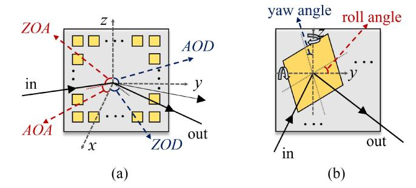

Fig. 11. Schematic of (a) MSA and (b) MA for RIS-assisted VLC channels.

shown in Fig. 11(a), MSA refers to a 2-D artificial structure comprising programmable subwavelength metallic or dielectric arrangements. Indeed, MSA consists of numerous adjacent patches, each capable of independently adjusting its phase shift to reflect an incident optical wave in any direction. This anomalous reflection makes it possible to adjust the reflected direction into the desired AOD and zenith of departure those no longer equal to the AOA and zenith of arrival. In Fig. 11(b), an MA consists of multiple small mirrors. Each mirror is able to flip freely on the y and z axes shown here so that the yaw angle and roll angle can be adjusted and controlled. The MA can control the incident angle of the optical wave without altering its amplitude or polarity, thereby steering the beam toward each user with improved light intensity. In a nutshell, the focusing ability of RIS can be used to steer the beams, thus overcoming the influence of random orientations of Tx or Rx. Blockage in VLC propagation can also be addressed by establishing indirect LoS links using RIS.

1) MSA: In the MSA channel, two types of characteristics are worth paying attention to, namely, the geometric properties and electromagnetic characteristics. On the one hand, the RIS is one of the most important nodes in the RIS channel, and its number, size, and position determine the response of the RIS channel. On the other hand, the characteristics of RIS depend on the characteristics of each element, including the design of the coding matrix and effective reflecting area. The existing channel modeling research of MAS in VLC bands mainly focuses on the former. Furthermore, the channel is mainly in the ideal assumption, that the phase discontinuities of all MA patches are tuned and the PD location is perfectly known at the MA controller.

In an RIS link channel, the received power correlates with the distance from the transmitter to the RIS ( $d_{tx}$ ) and the distance from the RIS to the receiver ( $d_{rx}$ ). The received power of the RIS-assisted channel can be described using two formulations: additive and multiplicative relations. On the one hand, some researchers regard  $d_{tx}$  and  $d_{rx}$  as additive relations. The channel gain reflected by the RIS can be represented as [109], [113], [114], [129], [130]

$$h_{\text{DC},1}^{\text{MSA}} = \frac{\rho(m+1)A_{PD}}{2\pi (d_{tr} + d_{rr})^2} \cos^m \left(\theta_R^S\right) \cos(\phi_R^D)$$
 (20)

where S refers to the LED; D represents the PD; R denotes the RIS;  $\rho$  represents the reflection coefficient of the MSA element; and  $A_{PD}$  is the area of the PD.  $\theta_R^S$  and  $\phi_R^D$  denote the angles of irradiance of the LED and incidence of the PD, respectively. Based on the additive model, Wu et al. [114]

presented that with proper position design of the MSA, the communication performance can be enhanced to a greater degree. Abdelhady et al. [113] studied the temporal characteristics of the MSA-assisted VLC channels. The study examines the influence of several factors on the channel DS, which include the number of reflecting elements, the area of the light source, the size of the reflector, the aspect ratio of the reflector, and the location of the detector. Simulation results indicate that as the source area decreases, the upper and lower bounds derived become increasingly constrained. Furthermore, it was observed that the DS demonstrates unimodal behavior, with a local maximum occurring as the number of elements increases.

On the other hand, when the surface comprises an inhomogeneous medium, incident light will undergo diffuse reflection, scattering in various directions. In this case, the channel gain reflected via the MSA can be expressed via a multiplicative relation [112], [116]

$$h_{\text{DC},2}^{\text{MSA}} = \frac{\rho(m+1)^2 A_{PD}}{2\pi d_{tx}^2 d_{tx}^2} \times \cos^m(\theta_R^S) \cos(\phi_R^S) \cos^m(\phi_R^D) \cos(\theta_D^S)$$
(21)

where  $A_{RIS}$  denotes the area of each MA element. Recent studies mostly regard  $d_{tx}$  and  $d_{rx}$  as additive relations. It is not able to directly ascertain their physical correctness due to the uncertainty surrounding how various channels impact the model.

While the mentioned aspects are crucial for enhancing the performance of VLC systems, focusing on the design and performance analysis of VLC receivers equipped with light steering and amplification capabilities can notably enhance the received SNR. Aboagye et al. [115] proposed an RIS-based receiver channel model. They implemented voltage-controlled tunable liquid crystals as integral components of the VLC receiver. The channel model can be expressed as

$$h_{\mathrm{RX,RIS}}^{\mathrm{MSA}} = H_{\mathrm{LoS}} \times \alpha_{LC}$$
 (22)

where  $H_{\text{LoS}}$  represents the DC gain of the LoS link and  $\alpha_{LC}$  denotes the transition coefficient. Due to the limitation of space, please obtain the detailed derivation process of  $\alpha_{LC}$  from the original paper.

The assumption of plane wavefronts and uniform power distribution across the MSA is too ideal. Thus, Ajam et al. [110] proposed the assumption that the incident wave has the form of a Gaussian beam with a nonuniform power distribution across the MSA. The channel model for MSA-assisted VLC systems was formulated as

$$h_{\text{Gaus}} = h_p h_{\text{Gaus}}^{\text{MSA}} h_a \tag{23}$$

where  $h_a$  is the random atmospheric turbulence component and Gamma–Gamma distributed;  $h_p$  is the atmospheric loss, and  $h_{\rm Gaus}^{\rm MSA}$  indicates the proportion of power reflected by the MSA and captured by the PD and is given by

$$h_{\text{Gaus}}^{\text{MSA}} = \frac{1}{P_o} \int_{(x_r, y_r \in A)} \int I_{\text{MSA}}(r_r) dx_r dy_r$$
 (24)

where  $I_{MSA}$  represents the power density of the reflected beam at the lens plane. The channel gain was analyzed using the proposed model, considering factors, such as MSA size, source and MSA positions, lens position, and MSA phase-shift configuration. Simulation findings demonstrated the model's validity for intermediate distances in contrast to a geometric optics-based model relying on the far-field approximation.

2) MA: In the MA channel, specular reflection occurs on each mirror element. In such cases, energy loss primarily arises from medium absorption, resulting in reflected light traveling in a singular direction. The reflector surface depicted in Fig. 11(b) should exhibit homogeneity, comprising either a planar mirror or a medium featuring a compact periodic microstructure. Geometrically, the angle of irradiance equals the angle of incidence, a principle known as Snell's law of reflection. In MA channels, the main consideration is the spatial geometric properties of MA, namely, the MA deployment, orientation and quantity needs to be considered in the channel modeling.

Abdelhady [109], [113] and Zhan et al. [126] et al. employed (20) to obtain the channel DC gain. In the study of RIS power gain, Zhan et al. [126] comprehensively studied the impact of MA on optical power in the V2V scenario. This included assessing how variations in the number of mirrors within the RIS affect received power, as well as investigating the impact of the distance between adjacent MAs on the direction of reflected light and received optical power. The simulation results indicated that the necessary SNR could be met by employing only three MAs operating concurrently when the interval between adjacent MAs is 32 m. The remaining MAs can then be allocated to support VLC for additional vehicles, enhancing resource utilization efficiency. In the study of time-domain channel characteristics, Abdelhady et al. [113] investigated the effects of various factors on channel DS for MAs, which include the number of reflecting elements, reflector dimensions, reflector aspect ratio, source area, and PD location. They also evaluated the systems performance for MSA and MA, respectively.

Like the MSA, LC-MA can also be integrated into the VLC receiver to improve receiving capabilities. Maraqa and Ngatched [131] proposed a VLC system leveraging the dual support of an MA-based RIS within the channel and an LC-based RIS-enhanced VLC receiver. The gain of the channel is expressed as

$$H_{LC}^{MA} = \iota H_{LoS} \times \psi_{LC-LoS} + \sum_{k=1}^{\kappa} H_{NLoS}^{RIS_k} \times \psi_{LC-NLoS}$$
 (25)

where  $\iota \in 0,1$  serves as an indicator function indicating if the LoS path is blocked.  $H_{\text{LoS}}$  signifies the channel gain of the LoS path, while  $H_{\text{NLoS}}$  represents the NLoS channel gain.  $\psi_{LC-\text{LoS}}$  and  $\psi_{LC-\text{NLoS}}$  denote the transition coefficients for the LoS and NLoS paths, respectively. Additionally,  $\kappa$  represents the number of squared surfaces (i.e., elements) in the MA-based RIS. Simulation results indicated that blockages caused by both LoS link obstructions and device orientation can be addressed by the proposed system.

For MIMO systems, MAs work well on increasing spatial diversity, improving channel capacity, reducing interference, and enhancing beamforming. For each RIS link, the channel

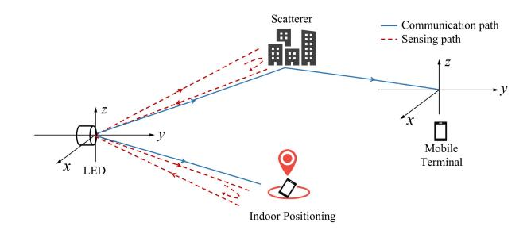

Fig. 12. Depiction of VLC-ISAC channels. The interrupted paths are denoted by dashed lines.

DC gain can be derived using (20), following the same approach as in [122] and [123]. The assumption is made that the signal transmitted from a single LED is mirrored by only one MA element, and the reflected signal reaches the corresponding PD aligned with the LED. Hence, the channel DC gain from the *n*th LED to the *n*th PD is expressed as

$$h_{DC}^{MA} = \mathbf{f_n} \mathbf{h_n^{MA}} \tag{26}$$

where  $\mathbf{f_n}$  represents the *n*th row of the assignment matrix,  $f_{n,k} = 1$  indicates that the kth RIS element is selected by the *n*th LED as the reflector for transmitting signals to the *n*th PD. The vector  $\mathbf{h}_{\mathbf{n}}^{\mathbf{MA}}$  represents the channel gain from the *n*th LED to the nth PD through each RIS element. For the multipleinput-single-output (MISO)-VLC system, Wu et al. [123] modeled the MA-assisted MISO-VLC channel by using a controllable MA. It has been demonstrated that as the number of mirrors increases, the performance of VLC systems improves. Additionally, the closer the receiver is to the MA and the more uniform the layout of the MA, the more significant the performance enhancement becomes. Besides, for the MIMO-VLC system, Wu et al. [122] proposed the channel model of the MA-assisted MIMO-VLC system. Simulation results suggest that increasing the MA units number can enhance the system capacity.

# B. ISAC-Assisted VLC Channel Characterization and Modeling

For VL sensing, VL utilizes an extremely wide bandwidth, allowing for ultrahigh-speed communications and ultrahigh-precision sensing. At present, the VL laser has been able to achieve higher power output, and the size of detecting devices can be high-density integration, which is suitable for portable terminals. In addition, due to the widespread availability of VL lighting facilities, it is also very convenient to deploy. Thus, the VL band is a potential spectrum resource for ISAC system applications. For ISAC-assisted channel models, different channel characteristics, such as time-domain fading, Doppler effect, scattering, and reflection, are potential but key influences on channel modeling. It needs to consider both the communication channel and the sensing channel. And, the correlation between the communication channel and the sensing channel needs to be fully considered.

Theoretically, both communication and sensing processes are governed by the fundamental laws of electromagnetic propagation. In Fig. 12, the base station transmits the communication signals to the mobile terminal, which are then

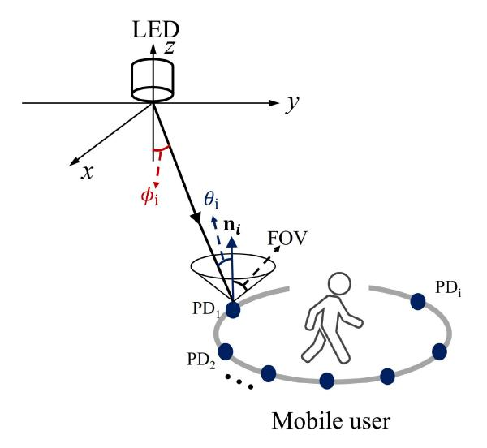

Fig. 13. Diagram of positioning and communication channels.

reflected by the scatterer. Conversely, sensing signals directed toward the scatterer are reflected back to the base station. The ISAC channel model encompasses both communication and sensing channels. In this scenario, signal transmission from the base station, depicted by the blue lines in Fig. [12,](#page-13-0) is then received by the mobile terminal following interaction with scatterers. Simultaneously, echo signals reflecting the surrounding environment are perceived by the base station, as depicted by the red lines in Fig. [12.](#page-13-0)

In recent years, VL has been used for sensing, such as VL positioning (VLP) and scatterer sensing in field networks. Rx\_S and Rx\_C are used to describe the receiving devices of sensing and communication, respectively. When Rx\_S and Tx are in the same position, the sensing signals are scattered by scatterers and returned to Tx at the same angle, creating an echo channel. This mode is defined as mono-static sensing. However, the Rx\_S and Rx\_C are the same in some VLP systems. Ma et al. [\[132\]](#page-22-23) considered a retroreflective VLC and positioning (R-VLCP) system as Fig. [13,](#page-14-1) where a single LED directs its light vertically downward, and a mobile user possesses a receiver equipped with multiple PDs (*M*≥3). The channel of the VLCP system can be assumed to be the singleinput–multiple-output channel in which the Tx consists of one LED and the Rx contains multiple PD arrays. For the channel between the LED and the *i*th PD, there are two types of links, i.e., the LOS link and the NLOS link. In each LoS link, φ*i* and θ*i* are the radiance and incidence angles, respectively, and **n***i* are unit direction vectors of the *i*th PD. The channel gain between the LED and the *i*th PD can be calculated by [\(1\)](#page-3-2) and [\(2\).](#page-3-3) Furthermore, Shao et al. [\[133\]](#page-22-24) derived a retroreflection channel model for retroreflective communication and positioning. The system primarily comprises LEDs and retro-tags. LED panels incorporate PDs to detect visible light rays reflected from the tags. Retro-tags consist of cornercube retroreflectors (CCRs) with an LCD shutter mounted on them. The received optical power is

$$P_r = P_t \frac{(m+1)A_{PD}}{8\pi d^2} \cos^{m+1} \theta \epsilon \tag{27}$$

where represents a weighting factor that characterizes the ratio of the current location-dependent PD sensing area to the maximum PD sensing area. In [\[133\]](#page-22-24), the channel model has been validated via the ray-tracing simulation. The findings indicate that received power can be improved by increasing the size of PDs and the density of CCRs, albeit with diminishing returns.

#### *C. Summary and Prospects*

Overall, the combination of VLC and 6G new technologies holds great promise for IoE applications and plays a significant role in the development of 6G communication systems. For the RIS channel, the main two-channel modeling method adopts either the multiplicative model or the additive model. Moreover, OPL and delay characteristics affected by parameters of RIS, including location, number, and size, have been well studied. Future investigations should focus on the RIS channel in complex and realistic scenarios, considering the reflected light from ambient objects. In addition, the unique characteristics of the VLC channel, such as the influence of air particles and sunlight interference should also be considered.

Regarding the characterization and modeling of ISAC channels in VLC bands, it is still at an early stage, with only a few studies focusing on characterizing the ISAC channel using an echo mode. The echo OPL model has been derived and analyzed within the R-VLCP system, showing promise for warehouse automation planning in IoE scenarios by leveraging retroreflected uplink signals for positioning. Moving forward, the properties of sensing targets, such as PD position and PD number, as well as the distance between Tx and Rx, require further investigation. Moreover, there should be an increased emphasis on the multipath dispersion characteristics, including the delay and spatial channel characteristics of the echo mode. Additionally, investigating the channel model of the echo mode presents a practical yet challenging topic for future research.

# V. SPECIAL CHANNEL CHARACTERISTICS FOR VLC-IOE APPLICATIONS

VLC channel exhibits several special characteristics compared to the RF communication channel. First, the signal wavelength range of VL is extra-wide, the reflection coefficient increases with the increasing signal wavelength, resulting in wavelength dependence of the VLC channel. Second, the frequency of VL is much higher than that of RF signal. As the frequency increases, the penetration and diffraction ability of the signal weaken noticeably [\[134\]](#page-22-25). Once encountering human blockage, the receiver can hardly receive any signal. Third, as the frequency of electromagnetic waves increases, the signal absorption of water vapor and liquid particles in the atmosphere increases, leading to severe weather effects on the VL channel. Finally, the use of PD introduces shot noise into the VLC channel, which is dependent on the signal. And, the ubiquitous light sources cause interference for VLC. In the following subsections, we highlight some recent advances in the special characteristics of the VLC channel, including wavelength dependence, human blockage, weather impact, and shot noise, as shown in Table [IV.](#page-15-0)

TABLE IV RECENT ADVANCES IN VLC CHANNEL CHARACTERIZATION AND MODELING FOR SPECIAL CHARACTERISTICS

#### *A. Wavelength Dependence*

Some existing works have been conducted on the wavelength dependence of the VLC channel. These works can be divided into two groups, i.e., the wavelength dependence of the reflective coefficient and the wavelength dependence of the OPL.

In the first group, Lee [\[135\]](#page-22-26) first extended Barry's model, which includes wavelength-dependent white LED and spectral reflectance of indoor reflectors. In [\[51\]](#page-20-42), the reflective coefficient values for some typical materials were compared to analyze the different characteristics between IR and VL spectral bands by using the ray-tracing simulation method. It is observed that the reflectance of most materials can be regarded as a constant in the IR band for most practical purposes. While the reflection coefficient for the VL band fluctuates greatly. For example, for plaster materials that are commonly used in the wall, the reflection coefficient changes from 0.35 to 0.82 when the wavelength changes from 400 to 700 nm. Moreover, [\[136\]](#page-22-27) studied the reflection coefficient of fluorescent materials, in which the wavelength distribution of the incident signal will be changed after being reflected by the fluorescent material. It is found that when characterizing optical channels of different wavelengths, serious distortion will occur if the reflection coefficient is considered a constant.

In the second group, [\[67\]](#page-21-11) investigated the impact of wavelength dependence on OPL by channel measurement campaign. The OPL at 4 light wavelength points, i.e., 405, 455, 525, and 625 nm, is obtained for two indoor scenarios. It is observed that in the corridor scenario, at the transceiver distance of 10 m, the maximum OPL difference can reach 2.26 dB. Moreover, in the conference room scenario, the maximum OPL difference is 1.30 dB when the transceiver distance is 5 m. To characterize the distance dependence as well as the wavelength dependence of OPL, the ABG model is used to fit the OPL which can be expressed as

$$PL_{single}(d, \lambda) = \beta + 10\alpha \log_{10} d + \gamma \log_{10} \frac{1}{\lambda} + X_{\sigma} \quad (28)$$

where α is the PLE, *d* is the transceiver distance, β is the optimized offset, γ is the signal wavelength exponent, and λ denotes the signal wavelength. The parameter γ is 9.93 and 3.48 for the corridor and the conference room, respectively. The larger γ for the corridor indicates that there is a stronger wavelength dependency in the scenario with a smaller size. In [\[137\]](#page-22-28), the wavelength-dependent OPL model is extended to multisources scenarios. The multiwavelength OPL model for multisources scenarios is derived from the single-wavelength OPL model. In a multisources scenario, the OPL of a receiving location is determined by the wavelength of the light sources and the distance from the receiving location to each light source, which is expressed as follows:

$$PL_{\text{multi}}(d_1, \dots, d_N; \lambda_1, \dots, \lambda_N)$$

$$= 10 \log 10 \left( \frac{P_{T1} + \dots + P_{TN}}{\frac{10P_{T1}}{PL_{\text{single}}(d_1, \lambda_1)} + \dots + \frac{10P_{TN}}{PL_{\text{single}}(d_N, \lambda_N)}} \right) (29)$$

where  $d_N$  indicates the distance from the receiver to the light source N.  $\lambda_N$  and  $P_{\text{TN}}$  indicate the wavelength and the power of light source N, respectively.

However, the existing research mainly adopts simulation methods. To improve the accuracy of the wavelength-dependent OPL model, more measurement-based data should be obtained to verify the model. Furthermore, for a wider variety of commonly used materials and many emerging materials, the wavelength-dependent reflective coefficient characteristics should be obtained.

#### B. Human Blockage

The existing research for human blockage mainly focuses on three aspects. The first is human shadow modeling, the second is modeling the outage probability caused by human blockage, and the third is modeling the OPL considering human blockage. In the first group, the human is modeled into a cylinder that has a specific height and width. The human body shadow area is mainly derived from the solid geometry method and the theoretical derivation. Tang et al. [104], [138] proposed a detailed process to calculate the shadowing area formed by the human blockage in the VLC channel which considers the room boundaries and overlaps between shadows.

In the second group, [139] proposes a mobile terminalcentric analytical framework that characterizes the channel characteristics with human blockage in a mobile VLC system. Research has found that the probability of outage caused by human blockage is symmetric in space. From a temporal perspective, when users wander indoors, the probability distribution of outage and channel gains is stable and dominated by user trajectories. Reference [140] proposes a weighted function to describe the probability of optical paths not being blocked, and analyzes the impact of random shadows on communication performance by simulation. The results indicate that the presence of static blocking may cause an outage of illumination and communication at certain receiving positions. In [154], the coverage probability caused by human blockage is modeled by a closed-form expression and validated against simulations. Yin et al. [141] analyzed and modeled the blockage probability (BP) in the channel under mobile human blockage. The semi-Markov renew process and Levy walk are used to get a human moving trajectory which is consistent with the realistic human walking behavior. It is found that when the human height, human width, and transceiver distance are constant, the outage probability follows a Gaussian distribution.

In the third group, [142] analyzes human blockage impact on OPL for the underwater scenario in three cases of blockage position, i.e., without LoS blockage, partial LoS blockage, and complete LoS blockage. It is shown that the blockage loss can be compensated by using smaller transmitters semi-angle or larger receiver sizes. Yin et al. [137] analyzed and modeled the OPL under mobile human blockage in both single-source and multisource scenarios. In the single-source scenario, the OPL

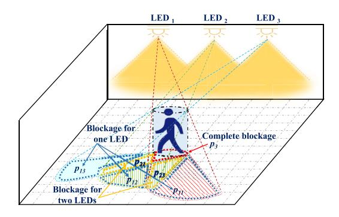

Fig. 14. Diagram of human blockage in the 3-sources scenario [137].

shows two-state properties and is modeled into a piecewise function. In the multisources scenario, the number of blockage types shows dependence on the number of light sources. Assuming that the light source number is N, the number of blockage types is  $C_N^0 + C_N^1 + \cdots + C_N^N$ . Therefore, the possible cases for OPL at each receiving position are  $C_N^0 + C_N^1 + \cdots + C_N^N$ . Fig. 14 shows the diagram of human blockage in the 3-sources scenario. In this case, 8 blockage types need to be considered in modeling the multiwavelength OPL with human blockage, which is given by (30), shown at the bottom of the next page, in which  $p_0, p_{11}, p_{12}, p_{13}, p_{21}, p_{22}, p_{23}, p_3$  are the eight BPs, respectively.

However, Although the outage probability models and OPL models considering human blockage have been proposed, the accuracy of the models has not been verified by measurement data. And, there is a lack of measurement data on VL channels with realistic human blockage. Moreover, the human blockage impact in scenarios with different system deployments is rarely studied and needs further investigation.

#### C. Weather Impact

Research on the weather impact of VL channels mainly focuses on channel attenuation analysis and OPL modeling. The most concerning weather conditions are fog, rain, and snow. Among these atmospheric components, fog has the greatest impact on optical propagation, as the size of droplets is of the same order of magnitude as the wavelength of VL, which means high extinction efficiency. In [86], the effects of fog and rain on the V2V link were studied through raytracing simulation. Research has found that the impact of fog is much more significant, and the CIR amplitude in fog decreases to 45% of sunny weather. And, in the case of fog and rain, a linear OPL model limited to 20 m was proposed. In [88], a closed-form OPL model that can be used for different weather conditions is proposed by theoretical derivation. The correction coefficients in the model for four kinds of weather conditions, i.e., clean weather, rain, moderate fog, and thick fog, are obtained by ray tracing. Esmail et al. [143] derived a unified channel attenuation model based on the collected fog measurement data from several locations in the United States and Europe. The statistical characteristic of the channel has been investigated and a probabilistic model is developed under stochastic fog conditions. In [144], the channel attenuation caused by adverse weather conditions is presented and it is

found that the dense fog and dry snow conditions cause the greatest attenuation in VLC.

It can be seen that research on the weather impacts of VLC channels is still in its early stages. Only the large-scale channel fading characteristics under a few types of weather conditions have been studied. Further investigation can focus on other adverse weather conditions, such as sand storms which are common in northern China's cities. In addition, the impact of weather on multipath dispersion characteristics should also be studied.

#### D. Shot Noise and Light Sources Interference

In the VLC system, the use of the PD as a receiver leads to the distinguished characteristics of VL noise. The noise in the PD can be divided into shot noise, thermal noise, and amplifier noise. The shot noise from carriers is generated by signal photons, background photos, and dark current. It can be classified into two parts: 1) the signal-dependent part and 2) the signal-independent part. The thermal noise is the white spectrum noise in the bias and load resistances. The amplifier noise is generated by the front-end amplifiers of PD. In terms of statistical distribution, they are all considered as Gaussian distribution with zero mean and certain variance. Specifically, the variance for the signal-dependent part of shot noise is dependent on the signal itself. While the variance for the signal-independent part of shot noise, the thermal noise, and the amplifier noise are fixed values.

There are two mainstream noise modeling methods for VLC. The first method is to separately model the shot noise and uniformly model the thermal noise and amplifier noise as equivalent thermal noise [145]

$$\sigma_1^2 = \sigma_{\text{shot}1}^2 + \sigma_{\text{thermal}1}^2 \tag{31}$$

in which  $\sigma_{\rm shot1}^2$  is the variance of shot noise, and  $\sigma_{\rm thermal1}^2$  is the variance of equivalent thermal noise.  $\sigma_{\rm shot1}^2$  can be given by

$$\sigma_{\text{shot1}}^2 = 2q\gamma P_R B + 2q I_{bg} I_2 B \tag{32}$$

where q is the unit electric charge, B is the data rate,  $\gamma$  is the PD responsivity, and  $I_{bg}$  is the background current.  $I_2$  represents the noise bandwidth factors and is equal to 0.562 generally. Fig. 15 shows the power of the shot noise in a 4-sources scenario. It can be found that the intensity of shot noise is closely related to the strength of the received signal. At the position below the light sources, the received signal power is at its maximum, and the power of shot noise is also at its maximum.

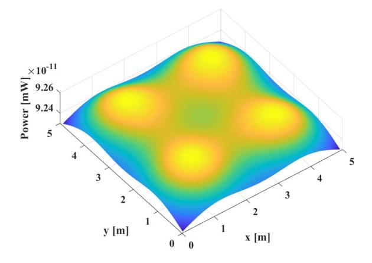

Fig. 15. Shot noise power in the 4-sources scenario.

The variance of equivalent thermal noise can be expressed by

$$\sigma_{\text{thermal }1}^{2} = \frac{8\pi kT}{G} \eta A_{\text{det}} I_{2} B^{2} + \frac{16\pi^{2} KT\Gamma}{g_{m}} \eta^{2} A^{2} I_{3} B^{3}$$
 (33)

in which k is Boltzmann's constant, G is the open-loop voltage gain, T is absolute temperature,  $\eta$  is the fixed capacitance of PD per unit area,  $\Gamma$  is the field-effect transistor (FET) channel noise factor,  $g_m$  is the FET transconductance, and  $I_3 = 0.0868$ .

The second noise modeling method is to model the shot noise, thermal noise and amplifier noise separately which can be expressed as [146]

$$\sigma_2^2 = \sigma_{\text{shot}2}^2 + \sigma_{\text{thermal}2}^2 + \sigma_{\text{amplifier}2}^2. \tag{34}$$

In the second noise model, the variance of shot noise can be given by

$$\sigma_{\text{shot2}}^2 = 2q\gamma P_R B + 2q I_{bg} B. \tag{35}$$

The thermal noise variance can be given by

$$\sigma_{\text{thermal2}}^2 = \frac{4\pi TB}{R_L} \tag{36}$$

where  $R_L$  is the load resistance. The amplifier noise variance can be given by

$$\sigma_{\text{amplifier2}}^2 = I_a^a B_a \tag{37}$$

in which  $I_a$  is the amplifier current noise density, and  $B_a$  is the amplifier bandwidth. Furthermore, some literature has also adopted the above-mentioned separate noise modeling method [147], [148]. However, the difference is that they did not take full consideration of the three types of noise, and only

$$PL_{\text{multi}}(d_{1}, d_{2}, d_{3}; \lambda_{1}, \lambda_{2}, \lambda_{3}), p_{0}$$

$$PL'_{\text{multi}}(d_{2}, d_{3}; \lambda_{2}, \lambda_{3}), p_{11}$$

$$PL'_{\text{multi}}(d_{1}, d_{3}; \lambda_{1}, \lambda_{3}), p_{12}$$

$$PL'_{\text{multi}}(d_{1}, d_{2}; \lambda_{1}, \lambda_{2}), p_{13}$$

$$PL'_{\text{multi}}(d_{3}; \lambda_{3}), p_{21}$$

$$PL'_{\text{multi}}(d_{3}; \lambda_{3}), p_{21}$$

$$PL'_{\text{multi}}(d_{2}; \lambda_{2}), p_{22}$$

$$PL'_{\text{multi}}(d_{3}; \lambda_{3}), p_{23}$$

$$Blockage, p_{3}$$

$$(30)$$

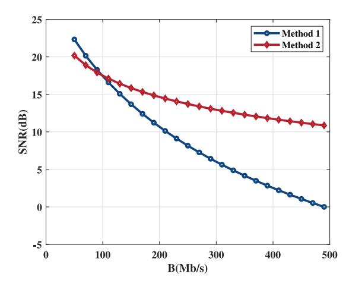

Fig. 16. SNR versus transmission rate for the two noise modeling methods [\[149\]](#page-23-6).

considered the shot noise with either the amplifier noise or the thermal noise.

To investigate the impact of noise model selection on analyzing the system performance, [\[149\]](#page-23-6) studies the SNR when choosing a different type of noise and compares the two mainstream noise modeling methods under various parameter settings. The results show that the SNR obtained by the two noise modeling methods is more consistent if the shot noise from both the signal and the background light is considered simultaneously. And, it is found that there is a significant difference in SNR obtained using the two models under various parameter settings. For example, at a transmission rate of 250 Mb/s, the SNR results obtained by using two noise models have a variation of 6 dB, as shown in Fig. [16.](#page-18-0) This indicates that the selection of noise models can greatly affect the analysis results of system performance.

In terms of interference in the VLC channel, it can be divided into two groups: 1) the interference caused by natural light sources and 2) the interference caused by artificial light sources. And, the research focuses mainly concentrate on the performance of VLC systems. In the first group, the natural light source interference mainly refers to sunlight. In [\[150\]](#page-23-7), the impact of solar irradiance is studied from the perspective of degradations in SNR, data rate, and BER.

In the second group, the artificial light source interference is mainly caused by traffic lights, street lights, vehicles, and artificial white light sources used for illumination. In [\[151\]](#page-23-8), an interference model for contemporary artificial light sources in VLC channels is proposed considering both low-frequency and high-frequency components. In [\[152\]](#page-23-9), a night background light model of a vehicle network VLC system was expressed by double Gaussian function superposition based on measurement data, which considers traffic lights, street lights, front and rear lights of vehicles, and high-brightness billboards. Tawfik et al. [\[153\]](#page-23-10) analyzed the performance of the VLC system for LoS and NLoS V2V scenarios under the influence of artificial light sources. The proposed system model includes a practical vehicular laser diode, a street lamp, and an avalanche photodiode.

Regarding the noise and interference in VL channels, on the one hand, it can be seen that among all VLC noise models, shot noise is nonnegligible and modeled separately from the thermal noise and the amplifier noise. At present, there is no unified noise modeling method, and there are two mainstream theoretical VLC noise models. Moreover, the theoretical noise model lacks the verification of measurement data and the accuracy of the theoretical noise model remains unknown. On the other hand, there are several studies on the interference of artificial light sources, and there is a lack of research on the interference of natural light sources. The VLC channel interference model has not been established yet.

#### *E. Summary and Prospects*

In summary, the research on the special characteristics of VLC channels mainly focuses on wavelength dependence, human blockage, weather impact, and shot noise. First, the work on wavelength dependence mainly concentrated on the reflective coefficient and the OPL. The wavelength-dependent reflective coefficient for commonly used material has been obtained and the OPL model considered wavelength and distance has been proposed by both simulations and measurements. In the future, the wavelength-dependent reflective coefficient characteristics should be obtained for a wider variety of commonly used materials and many emerging materials.

Second, the research for human blockage mainly focuses on human shadow modeling, outage probability, and OPL. The human shadow modeling is mainly derived by the solid geometry method and the theoretical derivation. The outage probability model and OPL model considering human blockage have been proposed by simulation method. However, the current models can only support modeling the outage probability and OPL with human blockage for scenarios with simple transceiver deployment. In the future, the human blockage impact in scenarios with different transceiver deployments needs further investigation.

Third, for the research on the weather impact, the most concerning weather conditions are fog, rain, and snow, and the fog has the largest impact on optical propagation. It is still in the early stages and there are only several works that conducted the channel attenuation analysis and OPL modeling under weather impact. Further investigation can focus on other adverse weather conditions, such as sand storms which are common in northern China's cities. In addition, the impact of weather on multipath dispersion characteristics should also be studied.

Finally, for the shot noise and light source interference research, on the one hand, the theoretical-based shot noise models have been proposed. There are two mainstream noise modeling methods in which the shot noise is all separately modeled from the thermal noise and the amplifier noise. However, the accuracy of the theoretical noise model remains unknown due to a lack of measurement data and the measurement noise data should be obtained in the future. On the other hand, interference from natural light sources is rarely studied, while more attention is paid to interference from artificial light sources. And, the VLC channel interference model has not been established yet.

TABLE V ABBREVIATION LIST

| Phrase                                                    | Abbreviation | Phrase                                         | Abbreviation |
|-----------------------------------------------------------|--------------|------------------------------------------------|--------------|
| the fifth generation                                      | 5G           | the sixth generation                           | 6G           |
| artificial intelligence                                   | AI           | the angle of deviation                         | AoD          |
| angular spread                                            | AS           | the azimuth angle of arrival                   | AOA          |
| angular spread of arrival                                 | ASA          | bit-error-rate                                 | BER          |
| the blockage probability                                  | BP           | ceiling bounce model                           | CBM          |
| channel impulse response                                  | CIR          | computer-Aided Design                          | CAD          |
| the channel frequency response                            | CFR          | corner-cube retroreflectors                    | CCR          |
| deoxyribonucleic acid                                     | DNA          | direct current                                 | DC           |
| delay spread                                              | DS           | the field effect transistor                    | FET          |
| geometry-based statistical model                          | GBSM         | integrated sensing and communication           | ISAC         |
| Internet of Everything                                    | IoE          | Internet of Things                             | IoT          |
| International Telecommunications Union Radiocommunication | ITU-R        | Infrared                                       | IR           |
| infrastructure-to-vehicle                                 | I2V          | intensive care unit                            | ICU          |
| light-emitting diodes                                     | LEDs         | line of sight                                  | LoS          |
| the Liquid Crystal Display                                | LCD          | multile input multiple output                  | MIMO         |
| metasurface array                                         | MSA          | mirror array                                   | MA           |
| the multiple input single output                          | MISO         | the medical body sensor networks               | MBSNs        |
| non-geometric statistical model                           | non-GBSM     | nonstationary geometry-based stochastic models | NS-GBSMs     |
| non-LoS                                                   | NLoS         | the optical path loss                          | OPL          |
| photodiodes                                               | PDs          | power amplifier                                | PA           |
| pseudorandom noise code                                   | PN           | path loss exponent                             | PLE          |
| power angular spread                                      | PAS          | reconfigurable intelligent surface             | RIS          |
| radio frequency                                           | RF           | regularshapes geometry-based stochastic models | RS-GBSMs     |
| the receiver                                              | Rx           | the received signal strength                   | RSS          |
| root mean spread                                          | RMS          | retroreflective VLC and positioning            | R-VLCP       |
| signal-to-noise ratio                                     | SNR          | terahertz                                      | THz          |
| the transmitter                                           | Tx           | ultraviolet                                    | UV           |
| visible light                                             | VL           | vehicle-to-vehicle                             | V2V          |
| Visible light communication                               | VLC          | the Vehicle-VLC                                | V-VLC        |
| vector network analyzer                                   | VNA          | visible light positioning                      | VLP          |

# VI. CONCLUSION

VLC-IoE channel research is crucial for the development, standardization, and application of VLC-IoE technologies in 6G. In this article, we provide an overview of ongoing research in the field of channel characterization and modeling for 6G VLC-IoE systems. Recent advances are presented in terms of channel modeling methods, application scenarios, emerging new technologies, and special channel characteristics. Also, a summary and future research directions are discussed in each part. Generally, this survey can give a comprehensive understanding of the current state of VLC-IoE channel research in 6G and insights into future work.

# APPENDIX

# LIST OF ALL ABBREVIATIONS

Since this article cites a lot of literature, many abbreviations are referenced and defined. To make readers search them more conveniently, a list of all abbreviations is given in Table [V.](#page-19-9)

## REFERENCES

- [\[1\]](#page-0-1) P. Gokhale, O. Bhat, and S. Bhat, "Introduction to IoT," *Int. Adv. Res. J. Sci., Eng. Technol.*, vol. 5, no. 1, pp. 41–44, 2018.
- [\[2\]](#page-0-2) K. Ashton, "That 'Internet of Things' thing," *RFID J.*, vol. 22, no. 7, pp. 97–114, 2009.
- [\[3\]](#page-0-3) A. Colakovi ˇ c and M. Hadžiali ´ c, "Internet of Things (IoT): A review of ´ enabling technologies, challenges, and open research issues," *Comput. Netw.*, vol. 144, pp. 17–39, Oct. 2018.
- [\[4\]](#page-0-4) D. Oladimeji, K. Gupta, N. A. Kose, K. Gundogan, L. Ge, and F. Liang, "Smart transportation: An overview of technologies and applications," *Sensors*, vol. 23, no. 8, p. 3880, 2023.
- [\[5\]](#page-0-5) Y. Shaikh, V. Parvati, and S. Biradar, "Survey of smart healthcare systems using Internet of Things (IoT)," in *Proc. Int. Conf. Commun., Comput. Internet Things (IC3IoT)*, 2018, pp. 508–513.
- [\[6\]](#page-0-6) Y. Liu, W. Yu, W. Rahayu, and T. Dillon, "An evaluative study on IoT ecosystem for smart predictive maintenance (IoT-SPM) in manufacturing: Multiview requirements and data quality," *IEEE Internet Things J.*, vol. 10, no. 13, pp. 11160–11184, Jul. 2023.
- [\[7\]](#page-0-7) M. S. Farooq, S. Riaz, A. Abid, K. Abid, and M. A. Naeem, "A survey on the role of IoT in agriculture for the implementation of smart farming," *IEEE Access*, vol. 7, pp. 156237–156271, 2019.
- [\[8\]](#page-0-8) F. A. Almalki et al., "Green IoT for eco-friendly and sustainable smart cities: Future directions and opportunities," *Mobile Netw. Appl.*, vol. 28, no. 1, pp. 178–202, 2023.

- [\[9\]](#page-0-9) (Statista, Hamburg, Germany). *Number of Internet of Things Connected Devices Worldwide From 2019 to 2023, With Forecasts From 2022 to 2030*. (2023). [Online]. Available: https://explodingtopics.com/blog/ number-of-iot-devices
- [\[10\]](#page-0-10) F. Guo, F. R. Yu, H. Zhang, X. Li, H. Ji, and V. C. M. Leung, "Enabling massive IoT toward 6G: A comprehensive survey," *IEEE Internet Things J.*, vol. 8, no. 15, pp. 11891–11915, Aug. 2021.
- [\[11\]](#page-0-11) W. Saad, M. Bennis, and M. Chen, "A vision of 6G wireless systems: Applications, trends, technologies, and open research problems," *IEEE Netw.*, vol. 34, no. 3, pp. 134–142, May/Jun. 2020.
- [\[12\]](#page-0-12) (Int. Telecommun. Union, Geneva, Switzerland). *Framework and Overall Objectives of the Future Development of IMT for 2030 and Beyond*. (2023). [Online]. Available: https://www.itu.int/dms\_pubrec/ itu-r/rec/m/R-REC-M.2160-0-202311-I2121PDF-E.pdf
- [\[13\]](#page-0-13) Y. Liu, J. Zhang, Y. Zhang, Z. Yuan, and G. Liu, "A shared cluster-based stochastic channel model for integrated sensing and communication systems," *IEEE Trans. Veh. Technol.*, vol. 73, no. 5, pp. 6032–6044, May 2024.
- [\[14\]](#page-0-13) Y. Yang et al., "Positioning using wireless networks: Applications, recent progress and future challenges," 2024, *arXiv:2403.11417*.
- [\[15\]](#page-0-14) M. Chen et al., "Distributed learning in wireless networks: Recent progress and future challenges," *IEEE J. Sel. Areas Commun.*, vol. 39, no. 12, pp. 3579–3605, Dec. 2021.
- [\[16\]](#page-0-15) J. Zhang et al., "Integrated sensing and communication channel: Measurements, characteristics, and modeling," *IEEE Commun. Mag.*, vol. 62, no. 6, pp. 98–104, Jun. 2024.
- [17] M. Polese, J. M. Jornet, T. Melodia, and M. Zorzi, "Toward end-toend, full-stack 6G terahertz networks," *IEEE Commun. Mag.*, vol. 58, no. 11, pp. 48–54, Nov. 2020.
- [\[18\]](#page-0-16) J. Zhang et al., "Channel measurement, modeling, and simulation for 6G: A survey and tutorial," 2023, *arXiv:2305.16616*.
- [\[19\]](#page-0-16) N. Chi, Y. Zhou, Y. Wei, and F. Hu, "Visible light communication in 6G: Advances, challenges, and prospects," *IEEE Veh. Technol. Mag.*, vol. 15, no. 4, pp. 93–102, Dec. 2020.
- [\[20\]](#page-0-16) Z. Wang et al., "A tutorial on extremely large-scale MIMO for 6G: Fundamentals, signal processing, and applications," *IEEE Commun. Surveys Tuts.*, early access, Jan. 2, 2024, doi: [10.1109/COMST.2023.3349276.](http://dx.doi.org/10.1109/COMST.2023.3349276)
- [\[21\]](#page-0-17) S. Basharat, S. A. Hassan, H. Pervaiz, A. Mahmood, Z. Ding, and M. Gidlund, "Reconfigurable intelligent surfaces: Potentials, applications, and challenges for 6G wireless networks," *IEEE Wireless Commun.*, vol. 28, no. 6, pp. 184–191, Dec. 2021.
- [\[22\]](#page-0-18) D. K. P. Tan et al., "Integrated sensing and communication in 6G: Motivations, use cases, requirements, challenges and future directions," in *Proc. 1st IEEE Int. Online Symp. Joint Commun. Sens. (JC S)*, 2021, pp. 1–6.
- [\[23\]](#page-0-18) S. Sorooshyari, "Introduction to mobile radio propagation and characterization of frequency bands," *Wireless Comm. Technol., IEEE*, vol. 16, p. 332, 1996.
- [\[24\]](#page-1-2) S. N. Ismail and M. H. Salih, "A review of visible light communication (VLC) technology," *AIP Conf. Proc.*, vol. 2213, no. 1, 2020, Art. no. 020289.
- [\[25\]](#page-1-3) O. Ergul, E. Dinc, and O. B. Akan, "Communicate to illuminate: Stateof-the-art and research challenges for visible light communications," *Phys. Commun.*, vol. 17, pp. 72–85, Dec. 2015.
- [\[26\]](#page-1-4) R. Bian, I. Tavakkolnia, and H. Haas, "15.73 Gb/s visible light communication with off-the-shelf LEDs," *J. Lightw. Technol.*, vol. 37, no. 10, pp. 2418–2424, May 15, 2019.
- [\[27\]](#page-1-5) A. R. Ndjiongue, T. M. Ngatched, O. A. Dobre, and A. G. Armada, "VLC-based networking: Feasibility and challenges," *IEEE Netw.*, vol. 34, no. 4, pp. 158–165, Jul./Aug. 2020.
- [\[28\]](#page-1-6) L. Feng, R. Q. Hu, J. Wang, P. Xu, and Y. Qian, "Applying VLC in 5G networks: Architectures and key technologies," *IEEE Netw.*, vol. 30, no. 6, pp. 77–83, Nov./Dec. 2016.
- [\[29\]](#page-1-7) M. A. Arfaoui et al., "Physical layer security for visible light communication systems: A survey," *IEEE Commun. Surveys Tuts.*, vol. 22, no. 3, pp. 1887–1908, 3rd Quart., 2020.
- [\[30\]](#page-1-8) A. Costanzo, V. Loscrí, V. Deniau, and J. Rioult, "On the interference immunity of visible light communication (VLC)," in *Proc. IEEE Glob. Commun. Conf.*, 2020, pp. 1–6.
- [\[31\]](#page-1-9) J. Gancarz, H. Elgala, and T. D. Little, "Impact of lighting requirements on VLC systems," *IEEE Commun. Mag.*, vol. 51, no. 12, pp. 34–41, Dec. 2013.
- [\[32\]](#page-1-10) M. A. S. Sejan and W.-Y. Chung, "Indoor fine particulate matter monitoring in a large area using bidirectional multihop VLC," *IEEE Internet Things J.*, vol. 8, no. 9, pp. 7214–7228, May 2021.

- [\[33\]](#page-1-11) A. F. Molisch, *Wireless Communications*, vol. 34. Hoboken, NJ, USA: Wiley, 2012.
- [\[34\]](#page-1-12) H. Jiang, M. Mukherjee, J. Zhou, and J. Lloret, "Channel modeling and characteristics for 6G wireless communications," *IEEE Netw.*, vol. 35, no. 1, pp. 296–303, Jan./Feb. 2021.
- [\[35\]](#page-1-13) Y. Qiu, H.-H. Chen, and W.-X. Meng, "Channel modeling for visible light communications—A survey," *Wireless Commun. Mobile Comput.*, vol. 16, no. 14, pp. 2016–2034, 2016.
- [\[36\]](#page-2-2) H. Abuella et al., "Hybrid RF/VLC systems: A comprehensive survey on network topologies, performance analyses, applications, and future directions," *IEEE Access*, vol. 9, pp. 160402–160436, 2021.
- [\[37\]](#page-2-3) X. Li, Y. Zheng, W. U. Khan, M. Zeng, and L. Li, "Physical layer security of cognitive ambient backscatter communications for green Internet-of-Things," *IEEE Trans. Cogn. Commun. Netw.*, vol. 5, no. 3, pp. 1066–1076, Sep. 2021.
- [\[38\]](#page-2-3) B. Liu, P. Tang, J. Zhang, Y. Yin, G. Liu, and L. Xia, "Propagation characteristics comparisons between mmwave and visible light bands in the conference scenario," *Photonics*, vol. 9, no. 4, p. 228, 2022.
- [\[39\]](#page-2-4) B. Liu, P. Tang, Y. Yin, J. Zhang, and L. Xia, "Measurement-based analysis of atmospheric attenuation by considering different weather types for visible light communications," in *Proc. 16th Eur. Conf. Antennas Propagat. (EuCAP)*, 2022, pp. 1–5.
- [\[40\]](#page-2-5) K. Anbarasi, C. Hemanth, and R. Sangeetha, "A review on channel models in free space optical communication systems," *Opt. Laser Technol.*, vol. 97, pp. 161–171, Dec. 2017.
- [\[41\]](#page-2-6) A. Al-Kinani, C.-X. Wang, L. Zhou, and W. Zhang, "Optical wireless communication channel measurements and models," *IEEE Commun. Surveys Tuts.*, vol. 20, no. 3, pp. 1939–1962, 3rd Quart., 2018.
- [\[42\]](#page-2-7) F. Miramirkhani and M. Uysal, "Channel modelling for indoor visible light communications," *Philosoph. Trans. Roy. Soc. A*, vol. 378, no. 2169, 2020, Art. no. 20190187.
- [\[43\]](#page-2-8) B. Donmez, R. Mitra, and F. Miramirkhani, "Channel modeling and Characterization for VLC-based medical body sensor networks: Trends and challenges," *IEEE Access*, vol. 9, pp. 153401–153419, 2021.
- [\[44\]](#page-2-9) S. Yahia, Y. Meraihi, A. Ramdane-Cherif, A. B. Gabis, D. Acheli, and H. Guan, "A survey of channel modeling techniques for visible light communications," *J. Netw. Comput. Appl.*, vol. 194, Nov. 2021, Art. no. 103206.
- [\[45\]](#page-2-10) J. Barry, J. Kahn, W. Krause, E. Lee, and D. Messerschmitt, "Simulation of multipath impulse response for indoor wireless optical channels," *IEEE J. Sel. Areas Commun.*, vol. 11, no. 3, pp. 367–379, Apr. 1993.
- [\[46\]](#page-2-11) J. Carruthers and P. Kannan, "Iterative site-based modeling for wireless infrared channels," *IEEE Trans. Antennas Propag.*, vol. 50, no. 5, pp. 759–765, May 2002.
- [\[47\]](#page-3-4) J. Wang, A. Al-Kinani, J. Sun, W. Zhang, and C.-X. Wang, "A path loss channel model for visible light communications in underground mines," in *Proc. IEEE/CIC Int. Conf. Commun. China (ICCC)*, 2017, pp. 1–5.
- [\[48\]](#page-3-4) A. Mamus, A. Yesilkaya, and E. Panayirci, "Modeling and equalization of indoor visible light channnels," in *Proc. 24th Signal Process. Commun. Appl. Conf. (SIU)*, 2016, pp. 1077–1080.
- [\[49\]](#page-3-4) J. Carruthers and J. Kahn, "Modeling of nondirected wireless infrared channels," in *Proc. Int. Conf. Commun.*, 1996, pp. 1227–1231.
- [\[50\]](#page-3-5) M. E. Yousefi, S. M. Idrus, C. H. Lee, M. Arsat, A. S. M. Supa'at, and N. M. Safri, "Indoor free space optical communications for aircraft passenger cabin," in *Proc. 4th Int. Conf. Model., Simul. Appl. Optim.*, 2011, pp. 1–5.
- [\[51\]](#page-3-5) F. Miramirkhani and M. Uysal, "Channel modeling and characterization for visible light communications," *IEEE Photon. J.*, vol. 7, no. 6, pp. 1–16, Dec. 2015.
- [\[52\]](#page-3-6) B. Donmez and F. Miramirkhani, "Path loss and RMS delay spread model for VLC-based patient health monitoring system," in *Proc. 4th West Asian Symp. Opt. Millim. Wave Wireless Commun. (WASOWC)*, 2022, pp. 1–5.
- [\[53\]](#page-3-6) M. Uysal, F. Miramirkhani, O. Narmanlioglu, T. Baykas, and E. Panayirci, "IEEE 802.15.7r1 reference channel models for visible light communications," *IEEE Commun. Mag.*, vol. 55, no. 1, pp. 212–217, Jan. 2017.
- [\[54\]](#page-3-6) L. Li, P. Tang, Y. Tong, S. Liu, Y. Yin, and J. Zhang, "Indoor 3D adaptive visible light positioning framework with resistance to shadows and reflections," in *Proc. IEEE 98th Veh. Technol. Conf. (VTC)*, 2023, pp. 1–6.
- [\[55\]](#page-3-6) V. Pohl, V. Jungnickel, R. Hentges, and C. Von Helmolt, "Integrating sphere diffuser for wireless infrared communication," in *Proc. IEE Colloq. Opt. Wireless Commun.*, 1999, pp. 4/1–4/6.

- [\[56\]](#page-3-7) A. Al-Kinani et al., "A 3D non-stationary GBSM for vehicular visible light communication MISO channels," *IEEE Access*, vol. 8, pp. 140333–140347, 2020.
- [\[57\]](#page-3-7) F. M. Alsalami, Z. Ahmad, O. Haas, and S. Rajbhandari, "Regularshaped geometry-based stochastic model for vehicle-to-vehicle visible light communication channel," in *Proc. IEEE Jordan Int. Joint Conf. Electr. Eng. Inf. Technol. (JEEIT)*, 2019, pp. 297–301.
- [\[58\]](#page-3-7) A. Al-Kinani, C.-X. Wang, H. Haas, and Y. Yang, "Characterization and modeling of visible light communication channels," in *Proc. IEEE 83rd Veh. Technol. Conf. (VTC)*, 2016, pp. 1–5.
- [\[59\]](#page-3-7) Z. Yuan, J. Zhang, Y. Ji, G. F. Pedersen, and W. Fan, "Spatial non-stationary near-field channel modeling and validation for massive MIMO systems," *IEEE Trans. Antennas Propag.*, vol. 71, no. 1, pp. 921–933, Jan. 2023.
- [\[60\]](#page-3-7) X. Zhu, C.-X. Wang, J. Huang, M. Chen, and H. Haas, "A novel 3D non-stationary channel model for 6G indoor visible light communication systems," *IEEE Trans. Wireless Commun.*, vol. 21, no. 10, pp. 8292–8307, Oct. 2022.
- [\[61\]](#page-3-7) N. Hayasaka and T. Ito, "Channel modeling of nondirected wireless infrared indoor diffuse link," *Electron. Commun. Jpn. (Part I, Commun.)*, vol. 90, no. 6, pp. 9–19, 2007.
- [\[62\]](#page-3-7) F. Lopez-Hernandez, R. Perez-Jimenez, and A. Santamaria, "Monte Carlo calculation of impulse response on diffuse IR wireless indoor channels," *Electron. Lett.*, vol. 34, no. 12, pp. 1260–1262, Jun 1998.
- [\[63\]](#page-3-8) J. Chen and T. Shu, "Statistical modeling and analysis on the confidentiality of indoor VLC systems," *IEEE Trans. Wireless Commun.*, vol. 19, no. 7, pp. 4744–4757, Jul. 2020.
- [\[64\]](#page-3-8) X. Zhang, K. Cui, M. Yao, H. Zhang, and Z. Xu, "Experimental characterization of indoor visible light communication channels," in *Proc. 8th Int. Symp. Commun. Syst., Netw. Digit. Signal Process. (CSNDSP)*, 2012, pp. 1–5.
- [\[65\]](#page-3-9) S. Liu et al., "Statistical channel modeling for indoor VLC communications based on channel measurements," *China Commun.*, vol. 21, no. 1, pp. 131–147, 2024.
- [\[66\]](#page-3-9) D. Novotny, A. Curtin, C. Remley, P. Papazian, J. Quimby, and R. Candell, "A tetherless, absolute-time channel sounder, processing, and results for a complex environment," in *Proc. 38th Antenna Meas. Techn. Assoc.*, 2016, pp. 1–6.
- [\[67\]](#page-3-9) Y. Tong et al., "Measurement-based optical path loss model for indoor visible light communication," in *Proc. IEEE Globecom Workshops (GC Wkshps)*, 2022, pp. 1046–1050.
- [68] B. Turan, G. Gurbilek, A. Uyrus, and S. C. Ergen, "Vehicular VLC frequency domain channel sounding and characterization," in *Proc. IEEE Veh. Netw. Conf. (VNC)*, 2018, pp. 1–8.
- [\[69\]](#page-3-9) B. Turan, O. Narmanlioglu, S. C. Ergen, and M. Uysal, "Physical layer implementation of standard compliant vehicular VLC," in *Proc. IEEE 84th Veh. Technol. Conf. (VTC)*, 2016, pp. 1–5.
- [70] B. Aly, M. Elamassie, and M. Uysal, "Vehicular VLC system with selection combining," *IEEE Trans. Veh. Technol.*, vol. 71, no. 11, pp. 12350–12355, Nov. 2022.
- [\[71\]](#page-3-9) H.-Y. Tseng, Y.-L. Wei, A.-L. Chen, H.-P. Wu, H. Hsu, and H.-M. Tsai, "Characterizing to-vehicle visible light communications," in *Proc. IEEE Veh. Netw. Conf. (VNC)*, 2015, pp. 88–95.
- [\[72\]](#page-3-9) F. Miramirkhani, T. Baykas, M. Elamassie, and M. Uysal, "IEEE 802.11BB reference channel models for light communications," *IEEE Commun. Stand. Mag.*, vol. 7, no. 4, pp. 84–89, Dec. 2023.
- [\[73\]](#page-3-9) C.-X. Wang, Z. Lv, Y. Chen, and H. Haas, "A complete study of space-time-frequency statistical properties of the 6G pervasive channel model," *IEEE Trans. Commun.*, vol. 71, no. 12, pp. 7273–7287, Dec. 2023.
- [\[74\]](#page-3-9) N. P. Ratchagar, K. G. Krishna, and A. Mishra, "Advanced channel modelling for 6G gigabit small-cell systems (GBSMS)," in *Proc. Int. Conf. Adv. Comput., Commun. Inf. Technol. (ICAICCIT)*, 2023, pp. 1186–1191.
- [\[75\]](#page-3-10) L. Feng, H. Yang, R. Q. Hu, and J. Wang, "MmWave and VLCbased indoor channel models in 5G wireless networks," *IEEE Wireless Commun.*, vol. 25, no. 5, pp. 70–77, Oct. 2018.
- [\[76\]](#page-4-1) L. Feng, R. Q. Hu, J. Wang, and Y. Qian, "Deployment issues and performance study in a relay-assisted indoor visible light communication system," *IEEE Syst. J.*, vol. 13, no. 1, pp. 562–570, Mar. 2019.
- [\[77\]](#page-4-2) F. Miramirkhani, O. Narmanlioglu, M. Uysal, and E. Panayirci, "A mobile channel model for VLC and application to adaptive system design," *IEEE Commun. Lett.*, vol. 21, no. 5, pp. 1035–1038, May 2017.
- [\[78\]](#page-6-1) F. Miramirkhani, "A path loss model for link budget analysis of indoor visible light communications," *Electrica*, vol. 21, no. 2, pp. 242–249, May 2021.

- [79] H. B. Eldeeb, M. Uysal, S. M. Mana, P. Hellwig, J. Hilt, and V. Jungnickel, "Channel modelling for light communications: Validation of ray tracing by measurements," in *Proc. 12th Int. Symp. Communication Syst., Netw. Digit. Signal Process.*, 2020, pp. 1–6.
- [\[80\]](#page-6-2) Y. Tong et al., "Channel characteristics and link adaption for visible light communication in an industrial scenario," *Sensors*, vol. 23, no. 7, p. 3442, 2023.
- [\[81\]](#page-6-3) J. Wang, A. Al-Kinani, W. Zhang, and C.-X. Wang, "A new VLC channel model for underground mining environments," in *Proc. 13th Int. Wireless Commun. Mobile Comput. Conf. (IWCMC)*, 2017, pp. 2134–2139.
- [\[82\]](#page-7-2) Y. Zhai and S. Zhang, "Visible light communication channel models and simulation of coal workface energy coupling," *Math. Probl. Eng.*, vol. 2015, no. 1, 2015, Art. no. 271352.
- [83] J. Wang, A. Al-Kinani, W. Zhang, C.-X. Wang, and L. Zhou, "A general channel model for visible light communications in underground mines," *China Commun.*, vol. 15, no. 9, pp. 95–105, 2018.
- [\[84\]](#page-8-1) P. P. Játiva et al., "A VLC channel model for underground mining environments with scattering and shadowing," *IEEE Access*, vol. 8, pp. 185445–185464, 2020.
- [\[85\]](#page-8-2) B. Donmez and F. Miramirkhani, "Channel modeling and Characterization for VLC-based MBSNs impaired by 3D user mobility," in *Proc. 13th Int. Conf. Elect. Electron. Eng. (ELECO)*, 2021, pp. 485–489.
- [\[86\]](#page-9-0) M. Elamassie, M. Karbalayghareh, F. Miramirkhani, R. C. Kizilirmak, and M. Uysal, "Effect of fog and rain on the performance of vehicular visible light communications," in *Proc. IEEE 87th Veh. Technol. Conf. (VTC)*, 2018, pp. 1–6.
- [\[87\]](#page-9-1) H. B. Eldeeb, F. Miramirkhani, and M. Uysal, "A path loss model for vehicle-to-vehicle visible light communications," in *Proc. 15th Int. Conf. Telecommun. (ConTEL)*, 2019, pp. 1–5.
- [\[88\]](#page-9-2) M. Karbalayghareh, F. Miramirkhani, H. B. Eldeeb, R. C. Kizilirmak, S. M. Sait, and M. Uysal, "Channel modelling and performance limits of vehicular visible light communication systems," *IEEE Trans. Veh. Technol.*, vol. 69, no. 7, pp. 6891–6901, Jul. 2020.
- [89] Y. H. Kim, W. A. Cahyadi, and Y. H. Chung, "Experimental demonstration of VLC-based vehicle-to-vehicle communications under fog conditions," *IEEE Photon. J.*, vol. 7, no. 6, pp. 1–9, Dec. 2015.
- [90] A. Rabiepoor, S. A. Nezamalhosseini, and L. R. Chen, "IRS-assisted vehicular visible light communications systems: Channel modeling and performance analysis," *Appl. Opt.*, vol. 63, no. 1, pp. 167–178, 2024.
- [91] A. Al-Kinani, J. Sun, C.-X. Wang, W. Zhang, X. Ge, and H. Haas, "A 2-D non-stationary GBSM for vehicular visible light communication channels," *IEEE Trans. Wireless Commun.*, vol. 17, no. 12, pp. 7981–7992, Dec. 2018.
- [\[92\]](#page-9-3) Q. Chen, C.-X. Wang, J. Sun, W. Zhang, and Q. Zhu, "A non-stationary VVLC MIMO channel model for street corner scenarios," in *Proc. Int. Wireless Commun. Mobile Comput. (IWCMC)*, 2020, pp. 365–370.
- [\[93\]](#page-9-4) B. Aly, M. Elamassie, and M. Uysal, "Vehicular VLC channel model for a low-beam headlight transmitter," in *Proc. 17th Int. Symp. Wireless Commun. Syst. (ISWCS)*, 2021, pp. 1–5.
- [\[94\]](#page-9-5) J.-H. Lee and S.-Y. Jung, "SNR Analyses of the multi-spectral light channels for optical wireless LED communications in intelligent transportation system," in *Proc. IEEE 79th Veh. Technol. Conf. (VTC)*, 2014, pp. 1–5.
- [\[95\]](#page-9-6) S. Lee, J. K. Kwon, S.-Y. Jung, and Y.-H. Kwon, "Evaluation of visible light communication channel delay profiles for automotive applications," *EURASIP J. Wireless Commun. Netw.*, vol. 370, pp. 1–8, Dec. 2012.
- [\[96\]](#page-9-7) H. B. Eldeeb, M. Elamassie, S. M. Sait, and M. Uysal, "Infrastructureto-vehicle visible light communications: Channel modelling and performance analysis," *IEEE Trans. Veh. Technol.*, vol. 71, no. 3, pp. 2240–2250, Mar. 2022.
- [\[97\]](#page-9-8) P. Luo, Z. Ghassemlooy, H. Minh, E. Bentley, An. Burton, and X. Tang, "Performance analysis of a car-to-car visible light communication system," *Appl. Opt.*, vol. 54, no. 7, pp. 1696–1706, Mar. 2015.
- [\[98\]](#page-9-8) C. Tebruegge, A. Memedi, and F. Dressler, "Empirical characterization of the NLOS component for vehicular visible light communication," in *Proc. IEEE Veh. Netw. Conf. (VNC)*, 2019, pp. 1–4.
- [\[99\]](#page-9-9) B. Turan, O. Narmanlioglu, O. N. Koc, E. Kar, S. Coleri, and M. Uysal, "Measurement based non-line-of-sight vehicular visible light communication channel characterization," *IEEE Trans. Veh. Technol.*, vol. 71, no. 9, pp. 10110–10114, Sep. 2022.

- [\[100\]](#page-10-1) F. Z. Raissouni, Á. De-La-Llana-Calvo, J. L. Lázaro-Galilea, A. Gardel-Vicente, and A. Cherkaoui, "Vehicle-to-vehicle VLC based on PSD sensor: System modeling and effects of multipath in unfavorable situations," *IEEE Sensors J.*, vol. 24, no. 10, pp. 16912–16925, May 2024.
- [\[101\]](#page-10-2) S. Liu et al., "Impact of device specifications on VLC path loss and system performance: An empirical study," in *Proc. IEEE/CIC Int. Conf. Commun. China (ICCC)*, 2023, pp. 1–6.
- [\[102\]](#page-10-3) T. Jiang et al., "3GPP standardized 5G channel model for IIoT scenarios: A survey," *IEEE Internet Things J.*, vol. 8, no. 11, pp. 8799–8815, Jun. 2021.
- [\[103\]](#page-9-8) Y. Almadani et al., "Visible light communications for industrial applications—Challenges and potentials," *Electronics*, vol. 9, no. 12, p. 2157, 2020.
- [\[104\]](#page-10-4) T. Tang, T. Shang, and Q. Li, "Impact of multiple shadows on visible light communication channel," *IEEE Commun. Lett.*, vol. 25, no. 2, pp. 513–517, Feb. 2021.
- [\[105\]](#page-10-5) K. Qu, W. Zhuang, Q. Ye, W. Wu, and X. Shen, "Model-assisted learning for adaptive cooperative perception of connected autonomous vehicles," *IEEE Trans. Wireless Commun.*, early access, Jan. 24, 2024, doi: [10.1109/TWC.2024.3354507.](http://dx.doi.org/10.1109/TWC.2024.3354507)
- [\[106\]](#page-10-6) A. Memedi and F. Dressler, "Vehicular visible light communications: A survey," *IEEE Commun. Surveys Tuts.*, vol. 23, no. 1, pp. 161–181, 1st Quart., 2021.
- [\[107\]](#page-8-3) S.-A. Avat˘ am˘ ani¸ ˘ tei, A.-M. Cailean, A. Done, M. Dimian, and V. Popa, ˘ "Experimental evaluation of traffic light to vehicle visible light communications in snowfall conditions," in *Proc. 7th Int. Conf. Control, Decis. Inf. Technol. (CoDIT)*, 2020, pp. 693–696.
- [\[108\]](#page-8-4) H. Abumarshoud, L. Mohjazi, O. A. Dobre, M. Di Renzo, M. A. Imran, and H. Haas, "LiFi through reconfigurable intelligent surfaces: A new frontier for 6G?" *IEEE Veh. Technol. Mag.*, vol. 17, no. 1, pp. 37–46, Mar. 2022.
- [\[109\]](#page-8-5) A. M. Abdelhady, A. K. S. Salem, O. Amin, B. Shihada, and M.- S. Alouini, "Visible light communications via intelligent reflecting surfaces: Metasurfaces vs mirror arrays," *IEEE Open J. Commun. Soc.*, vol. 2, pp. 1–20, 2021.
- [\[110\]](#page-8-6) H. Ajam, M. Naja, V. Jamali, and R. Schober, "Channel modeling for IRS-assisted FSO systems," in *Proc. IEEE Wireless Commun. Netw. Conf. (WCNC)*, 2021, pp. 1–7.
- [\[111\]](#page-9-10) M. A. Arfaoui, A. Ghrayeb, and C. Assi, "Integration of IRS in indoor VLC systems: Challenges, potential and promising solutions," 2021, *arXiv:2101.05927*.
- [\[112\]](#page-9-11) Y. Cang, M. Chen, Z. Yang, M. Chen, and C. Huang, "Optimal resource allocation for multi-UAV assisted visible light communication," 2020, *arXiv:2012.13200*.
- [\[113\]](#page-9-12) A. M. Abdelhady, O. Amin, A. K. S. Salem, M.-S. Alouini, and B. Shihada, "Channel characterization of IRS-based visible light communication systems," *IEEE Trans. Commun.*, vol. 70, no. 3, pp. 1913–1926, Mar. 2022.
- [114] Q. Wu, J. Zhang, and J.-N. Guo, "Position design for reconfigurable intelligent-surface-aided indoor visible light communication systems," *Electronics*, vol. 11, no. 19, p. 3076, 2022.
- [\[115\]](#page-11-1) S. Aboagye, A. R. Ndjiongue, T. M. Ngatched, and O. A. Dobre, "Design and optimization of liquid crystal RIS-based visible light communication receivers," *IEEE Photon. J.*, vol. 14, no. 6, pp. 1–7, Dec. 2022.
- [\[116\]](#page-12-2) S. Sun, F. Yang, J. Song, and Z. Han, "Joint resource management for intelligent reflecting surface–aided visible light communications," *IEEE Trans. Wireless Commun.*, vol. 21, no. 8, pp. 6508–6522, Aug. 2022.
- [117] H. Wang et al., "Performance analysis of multi-branch reconfigurable intelligent surfaces-assisted optical wireless communication system in environment with obstacles," *IEEE Trans. Veh. Technol.*, vol. 70, no. 10, pp. 9986–10001, Oct. 2021.
- [\[118\]](#page-12-3) R. P. Naik and W.-Y. Chung, "Evaluation of reconfigurable intelligent surface-assisted underwater wireless optical communication system," *J. Lightw. Technol.*, vol. 40, no. 13, pp. 4257–4267, Jul. 1, 2022.
- [\[119\]](#page-12-4) V. K. Chapala and S. M. Zafaruddin, "Unified performance analysis of reconfigurable intelligent surface empowered free-space optical communications," *IEEE Trans. Commun.*, vol. 70, no. 4, pp. 2575–2592, Apr. 2021.
- [\[120\]](#page-12-4) T. Yang et al., "Average signal-to-noise ratio maximization for an intelligent reflecting surface and angle diversity receiver jointly assisted indoor visible light communication system," *Appl. Opt.*, vol. 61, no. 35, pp. 10390–10399, 2022.
- [\[121\]](#page-12-5) M. Lu, F. Wang, R. Li, T. Zuo, and J. Zhang, "Mirror array aided indoor SSK visible light downlink," *Opt. Commun.*, vol. 528, Feb. 2023, Art. no. 129004.

- [\[122\]](#page-12-3) Q. Wu, J. Zhang, Y. Zhang, G. Xin, and J. Guo, "Configuring reconfigurable intelligent surface for parallel MIMO visible light communications with asymptotic capacity maximization," *Appl. Sci.*, vol. 13, no. 1, p. 563, 2022.
- [123] Q. Wu, J. Zhang, and J. Guo, "Capacity Maximization for reconfigurable intelligent surface-aided MISO visible light communications," *Photonics*, vol. 9, no. 7, p. 487, 2022.
- [124] L. Zhan, H. Zhao, W. Zhang, and J. Lin, "An optimal scheme for the number of mirrors in vehicular visible light communication via mirror array-based intelligent reflecting surfaces," *Photonics*, vol. 9, no. 3, p. 129, 2022.
- [125] S. Aboagye, T. M. Ngatched, O. A. Dobre, and A. R. Ndjiongue, "Intelligent reflecting surface-aided indoor visible light communication systems," *IEEE Commun. Lett.*, vol. 25, no. 12, pp. 3913–3917, Dec. 2021.
- [126] L. Zhan, H. Zhao, W. Zhang, J. Lin, and X. Zhao, "Performance analysis and node selection of intelligent reflecting surface-aided visible light communication for parallel vehicles," *Wireless Commun. Mobile Comput.*, vol. 2022, no. 1, 2022, Art. no. 1462960.
- [127] X. Li, Y. Zheng, J. Zhang, S. Dang, A. Nallanathan, and S. Mumtaz, "Finite SNR diversity-multiplexing trade-off in hybrid ABCom/RComassisted NOMA networks," *IEEE Trans. Mobile Comput.*, early access, Jan. 23, 2024, doi: [10.1109/TMC.2024.3357753.](http://dx.doi.org/10.1109/TMC.2024.3357753)
- [\[128\]](#page-13-1) X. Li et al., "Reliability and security of CR-STAR-RIS-NOMA assisted IoT networks," *IEEE Internet Things J.*, early access, Dec. 7, 2023, doi: [10.1109/JIOT.2023.3340371.](http://dx.doi.org/10.1109/JIOT.2023.3340371)
- [\[129\]](#page-13-2) B. Cao, M. Chen, Z. Yang, M. Zhang, J. Zhao, and M. Chen, "Reflecting the light: Energy efficient visible light communication with reconfigurable intelligent surface," in *Proc. IEEE 92nd Veh. Technol. Conf. (VTC)*, 2020, pp. 1–5.
- [130] Y. Wang, S. Wu, L. Yu, C. Xu, Z. Wang, and X. Cai, "RIS-assisted indoor visible light positioning based on sparse Bayesian learning," in *Proc. 3rd Int. Conf. Intell. Commun. Comput. (ICC)*, 2023, pp. 90–97.
- [131] O. Maraqa and T. M. Ngatched, "Optimized design of joint mirror array and liquid crystal-based RIS-aided VLC systems," *IEEE Photon. J.*, vol. 15, no. 4, pp. 1–11, Aug. 2023.
- [\[132\]](#page-13-3) S. Ma et al., "Optimal power allocation for integrated visible light positioning and communication system with a single LED-lamp," *IEEE Trans. Commun.*, vol. 70, no. 10, pp. 6734–6747, Oct. 2022.
- [\[133\]](#page-11-2) S. Shao, A. Salustri, A. Khreishah, C. Xu, and S. Ma, "R-VLCP: Channel modeling and simulation in Retroreflective visible light communication and positioning systems," *IEEE Internet Things J.*, vol. 10, no. 13, pp. 11429–11439, Jul. 2023.
- [\[134\]](#page-11-2) Y. Xiang et al., "Human shadowing effect on indoor visible light communications channel characteristics," *Opt. Eng.*, vol. 53, no. 8, pp. 086113–086113, 2014.
- [\[135\]](#page-12-4) K. Lee, H. Park, and J. R. Barry, "Indoor channel characteristics for visible light communications," *IEEE Commun. Lett.*, vol. 15, no. 2, pp. 217–219, 2011.
- [\[136\]](#page-12-6) A. Ramirez-Aguilera, J. Luna-Rivera, V. Guerra, J. Rabadan, R. Perez-Jimenez, and F. Lopez-Hernandez, "Multi-wavelength modelling for VLC indoor channels using Monte Carlo simulation," in *Proc. 10th Int. Symp. Commun. Syst., Netw. Digit. Signal Process. (CSNDSP)*, 2016, pp. 1–6.
- [\[137\]](#page-13-4) Y. Yin, P. Tang, J. Zhang, Z. Hu, L. Xia, and G. Liu, "Multi-wavelength path loss model for indoor VLC with mobile human blockage," *Electronics*, vol. 12, no. 24, p. 5036, 2023.
- [\[138\]](#page-14-2) T. Tang, T. Shang, Q. Li, and P. H. Qian, "Shadowing effects on indoor visible light communication channel modeling," in *Proc. Inf. Commun. Technol. Conf. (ICTC)*, 2020, pp. 7–11.
- [\[139\]](#page-14-3) Z.-Y. Wu, M. Ismail, J. Kong, E. Serpedin, and J. Wang, "Channel characterization and realization of mobile optical wireless communications," *IEEE Trans. Commun.*, vol. 68, no. 10, pp. 6426–6439, Oct. 2020.
- [\[140\]](#page-14-4) Z. Dong, T. Shang, Y. Gao, and Q. Li, "Study on VLC channel modeling under random shadowing," *IEEE Photon. J.*, vol. 9, no. 6, pp. 1–16, Dec. 2017.
- [\[141\]](#page-15-1) Y. Yin, P. Tang, J. Zhang, Z. Hu, L. Xia, and G. Liu, "Outage probability modeling with human blockage for mobile VLC systems," in *Proc. 17th Eur. Conf. Antennas Propag. (EuCAP)*, 2023, to be published.
- [\[142\]](#page-15-2) F. Miramirkhani and M. Uysal, "Visible light communication channel modeling for underwater environments with blocking and shadowing," *IEEE Access*, vol. 6, pp. 1082–1090, 2018.
- [\[143\]](#page-15-3) M. A. Esmail, H. Fathallah, and M.-S. Alouini, "Outdoor FSO communications under fog: Attenuation modeling and performance evaluation," *IEEE Photon. J.*, vol. 8, no. 4, pp. 1–22, Aug. 2016.

- [\[144\]](#page-16-1) G. Singh, A. Srivastava, and V. A. Bohara, "Impact of weather conditions and interference on the performance of VLC based V2V communication," in *Proc. 21st Int. Conf. Transp. Opt. Netw. (ICTON)*, 2019, pp. 1–4.
- [\[145\]](#page-16-2) T. Komine and M. Nakagawa, "Fundamental analysis for visiblelight communication system using LED lights," *IEEE Trans. Consum. Electron.*, vol. 50, no. 1, pp. 100–107, Feb. 2004.
- [\[146\]](#page-16-3) Q. Chen, T. Zhang, and W. Zheng, "Optimization of LED layout to improve uniformity of illumination and SNR for indoor visible light communication," in *Proc. 28th Int. Telecommun. Netw. Appl. Conf. (ITNAC)*, 2018, pp. 1–3.
- [\[147\]](#page-16-4) L. Zeng, D. O'Brien, H. Le-Minh, K. Lee, D. Jung, and Y. Oh, "Improvement of date rate by using equalization in an indoor visible light communication system," in *Proc. 4th IEEE Int. Conf. Circuits Syst. Commun.*, 2008, pp. 678–682.
- [\[148\]](#page-16-5) H. Lu, Z. Su, and B. Yuan, "SNR and optical power distribution in an indoor visible light communication system," in *Proc. 7th Int. Congr. Image Signal Process.*, 2014, pp. 1063–1067.
- [\[149\]](#page-16-6) Y. Yin, P. Tang, B. Liu, J. Zhang, L. Xia, and B. Liu, "The comparison and analysis of different noise models for visible light communication," in *Proc. Int. Conf. Front. Electron., Inf. Comput. Technol.*, 2021, pp. 1–6.
- [\[150\]](#page-16-7) M. S. Islim et al., "The impact of solar irradiance on visible light communications," *J. Lightw. Technol.*, vol. 36, no. 12, pp. 2376–2386, Jun. 15, 2018.
- [\[151\]](#page-17-2) M. Galal, W. Pang Ng, A. A. El Aziz, and R. Binns, "Characterisation and interference model of contemporary artificial light sources noise on a VLC channel," in *Proc. 11th Int. Symp. Commun. Syst., Netw. Digit. Signal Process. (CSNDSP)*, 2018, pp. 1–6.
- [\[152\]](#page-17-3) X. Ke, H. Qin, S. Yang, J. Wu, and X. Pan, "Night background light noise model of visible light communication system in vehicle networking environment," *Chin. J. Radio Sci.*, vol. 36, no. 6, pp. 986–990, 2021.
- [\[153\]](#page-17-4) N. Tawfik, E. El-Mokadem, M. Aly, and W. El-Deeb, "Non-line of sight analysis for vehicular visible light communication system: Impact of artificial light source and weather conditions," *Opto-Electron. Rev.*, vol. 32, May 2024, Art. no. 150180.
- [\[154\]](#page-17-4) X. Wu, "Performance analysis of visible light communications with channel blockage caused by human bodies," in *Proc. IEEE Int. Conf. Commun.*, 2023, pp. 6541–6545.

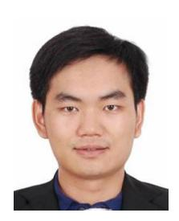

**Pan Tang** (Member, IEEE) received the B.S. degree in electrical information engineering from the South China University of Technology, Guangzhou, China, in 2013, and the Ph.D. degree in information and communication engineering from Beijing University of Posts and Telecommunications, Beijing, China, in 2019.

In 2017, he was a Visiting Scholar with the University of Southern California, Los Angeles, CA, USA. From 2019 to 2021, he was a Postdoctoral Researcher with the State Key Laboratory of

Networking and Switching Technology, Beijing University of Posts and Telecommunications, where he has been an Associate Professor since 2021. He has published more than 70 papers. His current research interests include XL-MIMO, THz, and VLC channel measurements and modeling.

Dr. Tang received several paper awards, e.g., the 2023 IEEE VTS Neal Shepherd Memorial Best Propagation Paper and the 2019 SCIENCE China Information Hot Paper.

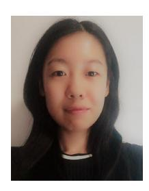

**Yue Yin** received the B.S. degree in electrical information engineering from Hebei University of Technology, Tianjin, China, in 2020. She is currently pursuing the Ph.D. degree with the State Key Laboratory of Networking and Switching Technology, Beijing University of Posts and Telecommunications, Beijing, China.

Her research interest is VLC channel measurements and modeling.

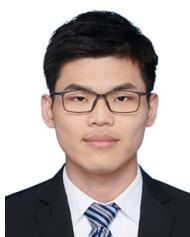

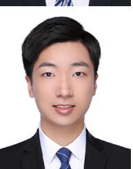

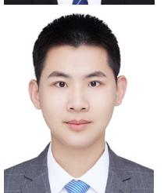

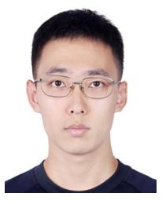

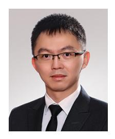

**Yu Tong** received the B.S. degree in electrical information engineering from Hangzhou Dianzi University, Hangzhou, China, in 2021, and the M.S. degree in information and communication engineering from the Beijing University of Posts and Telecommunications, Beijing, China, in 2024.

His current research interests include VLC channel measurements and modeling.

**Shou Liu** received the B.S. degree in electrical information engineering from Beijing Jiaotong University, Beijing, China, in 2021, and the M.S. degree in information and communication engineering from Beijing University of Posts and Telecommunications, Beijing, in 2024.

His current research interests include VLC channel measurements and modeling.

**Linchao Li** received the B.E. degree in communication engineering from Beijing University of Science and Technology, Beijing, China, in 2022. He is currently pursuing the MA.Eng. degree with the State Key Laboratory of Networking and Switching Technology, Beijing University of Posts and Telecommunications, Beijing.

His current research interests include visible light positioning, and VLC channel measurement and modeling.

**Tao Jiang** received the B.S. degree from Huazhong University of Science and Technology, Wuhan, China, in 2015, and the Ph.D. degree from Beijing University of Posts and Telecommunications, Beijing, China, in 2021.

He is currently a Technical Staff Member with the Future Research Laboratory, China Mobile Research Institute, Beijing. His current research interests include mmWave channel modeling, ISAC channel modeling, and wireless communication system design.

**Qixing Wang** received the B.S., M.S., and Ph.D. degrees in information and communication engineering from Beijing University of Posts and Telecommunications, Beijing, China, in 2002, 2005, and 2008, respectively.

He is currently a Principal Member of Technical Staff responsible for 6G with the Future Research Laboratory, China Mobile Research Institute, Beijing. His research interests include virtual multi-input–multi-output, holographic multi-input– multi-output, and 4-D multi-input–multi-output.

**Mingzhe Chen** (Senior Member, IEEE) received the Ph.D. degree from Beijing University of Posts and Telecommunications, Beijing, China, in 2019.

From 2016 to 2019, he was a Visiting Researcher with the Department of Electrical and Computer Engineering, Virginia Tech, Blacksburg, VA, USA. He is currently an Assistant Professor with the Department of Electrical and Computer Engineering and the Frost Institute for Data Science and Computing, University of Miami, Coral Gables, FL, USA. His research interests include federated

learning, reinforcement learning, virtual reality, unmanned aerial vehicles, and Internet of Things.

Dr. Chen has received four IEEE Communication Society journal paper awards, including the IEEE Marconi Prize Paper Award in Wireless Communications in 2023, the Young Author Best Paper Award in 2021 and 2023, and the Fred W. Ellersick Prize Award in 2022, and four conference best paper awards at ICCCN in 2023, IEEE WCNC in 2021, IEEE ICC in 2020, and IEEE GLOBECOM in 2020. He currently serves as an Associate Editor for IEEE TRANSACTIONS ON MOBILE COMPUTING, IEEE TRANSACTIONS ON COMMUNICATIONS, IEEE WIRELESS COMMUNICATIONS LETTERS, IEEE TRANSACTIONS ON GREEN COMMUNICATIONS AND NETWORKING, and IEEE TRANSACTIONS ON MACHINE LEARNING IN COMMUNICATIONS AND NETWORKING.