# 6G-EWOC: AI-Enhanced Fiber-Wireless Optical 6G Network in Support of Connected Mobility

Eleni Theodoropoulou, George Lyberopoulos, Foteini Setaki R&D Fixed and Mobile Hellenic Telecom. Org. SA (OTE SA) Athens, Greece ORCID: 0000-0002-4789-6022 ORCID: 0000-0002-3645-902X ORCID: 0000-0003-1495-0237

Pablo Garcia Santiago Royo Beamagine, Barcelona, Spain ORCID: 0000-0003-0136-8301

Carina Marcus, Olof Eriksson Research & Innovation Magna Electronics Vårgårda, Sweden ORCID: 0000-0003-4147-1805

Josep M. Fàbrega, Ricardo Martínez, Ramon Casellas CTTC - Centre Tecnològic deTelecomunicacions de Catalunya Castelldefels, Barcelona, Spain ORCID: 0000-0001-9285-9768

Bernhard Schrenk Center for Digital Safety & Security AIT Austrian Institute of Technology Vienna, Austria ORCID: 0000-0001-5374-0078

Josep Ramon Casas, José Antonio Lázaro Signal Theory and Comm. Dept. UPC - Univ. Politècnica de Catalunya Barcelona, Spain ORCID: 0000-0003-4639-6904

ORCID: 0000-0002-5592-8434

Abstract— The 6G-EWOC project seeks to create an AIenhanced fiber-wireless optical 6G network to support advanced use cases for Fully Autonomous Vehicles (FAVs) by establishing a new access network incorporating the integration of both fixed/wireless optical and wireless/RF technologies. The access network will be supported by a fast, reconfigurable, highly dynamic and customizable optical fiber-based fronthaul infrastructure which will minimize optoelectronic transitions through tunable and programmable devices, as well as low energy photonic switching of (packet/optical) spectrum and spatial resources, managed by AI-enabled SDN. End-to-end connectivity between AI-based edge computation units will enable advanced Connected and Automated Mobility (CAM) services over a rapid, adaptable network architecture.

Keywords— Sixth generation of wireless communication technology (6G), Autonomous Driving, Optical wireless Communications, V2V, V2I, V2X, Joint Communication and Sensing (JCAS), AI-based situational awareness & connectivity, high-capacity fiber fronthaul, edge data centers, AI-Orchestration, 6G-enabled vehicular connectivity.

# I. INTRODUCTION

Autonomous Vehicles (AVs) promise to increase road safety, improve traffic efficiency, reduce CO2 emissions and improve mobility. The advent of AVs will revolutionize transport as we know it today and transform the daily lives of all citizens by improving productivity and quality of life, but also provide mobility solutions for those who are unable to drive [15]. On top of those, the rise of AVs will spur new industries and job opportunities, from software development and cybersecurity to vehicle maintenance and fleet management. Moreover, autonomous ride-sharing and delivery services could reduce transportation and logistics related costs, benefiting both consumers and businesses [10].

However, for AVs to reach their full potentials, that is, to become fully autonomous (level 4 and level 5) and collisionfree, there are significant technological (and other) issues (e.g., regulatory ones) that need to be addressed.

To unlock the true potential of autonomous driving, advanced sensors, ultra-high speed, ultra-low latency, robust, multitechnology and reliable communication networks, mobile edge computing, artificial intelligence/machine learning (AI/ML), etc., are just some examples of the building blocks that shall constitute the end-to-end, 6G-V2X ecosystem [6].

 The global rollout of 5G communication systems, supporting advanced technologies such as Ultra-reliable lowlatency communication (URLLC) services, edge computing, massive multiple-input multiple-output (mMIMO), millimeter wave (mmWave), device-to-device (D2D) communications, etc., is underway. Apart from the higher throughputs and the lower latencies realized, 5G shall also support CAM1 related applications which will push 5G to its limits, especially in very crowded urban areas such as busy intersections.

However, it seems that the 5G/NR-V2X (Vehicle-to-Everything) technologies alone are insufficient for ensuring safe, collision-free navigation, efficiently and reliably, under diverse and complex traffic environments ([7][8][9]). To achieve this goal, a better understanding of the environment is required, through "Collective Perception", where enriched information from multiple sources, incl. pedestrians, cyclists, fixed cameras and radars, is gathered and assessed in realtime; thus, enhancing the vehicles' situation awareness accuracy and finally lead to (even) better navigation-related decisions. Collective Perception will realize the Digital Twin of the traffic environment -which will be made available to the road users-, but also, among others, support smoother traffic flow (with less or no congestions), improved safety for Vulnerable Road Users (VRUs) by "illuminating" blind spots and efficient routing for emergency vehicles across the cities.

To realize these benefits, more advanced Cellular-V2X (C-V2X) networks2 need to be developed, capable of receiving, transporting and processing huge amounts of data, generated from advanced "sensors" -attached to vehicles, infrastructure or even VRUs-, while providing continuous connectivity and robust edge computing capabilities. For instance, a FAV may require upload speeds that exceed 3 Gb/s, to send raw sensor data to the infrastructure/network or other nearby vehicles ([11][12]).

1 CAM applications aim to reduce accidents and improve road capacity and efficiency by enabling real-time information exchange between highly automated vehicles, as studied by industry associations. (5GAA, 3G Americas, 3GPP, 5GIA, etc.) [14].

2 A comprehensive list of the key requirements (and their respective KPIs) that FAVs pose on C-V2X networks, alongside with "how these can be achieved" and whether the NR-V2X can meet them can be found in [5].

The 6G-EWOC project (https://6g-ewoc.eu/) addresses these needs by defining an e2e network that enables FAVs to achieve enhanced situational awareness (through 3D maps) and informed decision-making, leading to collision-free navigation, smoother traffic flow and enhanced VRUs safety, among others. Indicative key features of 6G-EWOC include:

- Support of V2V, V2I and fronthaul communications by integrating Optical Wireless communication (OWC) technologies in the access network
- Support of Joint Communication and Sensing (JCAS) through the development of connected LiDAR and RaDAR technologies and Simultaneous Localization and Mapping (SLAM)
- Seamless access to edge data centers through a highcapacity fiber fronthaul, utilizing low-energy photonic switching
- Real-time AI-driven processing of the collected vehicle and road-side data through high-end edge data centers
- Flexibility and optimization of network resources through AI-based orchestration.

The rest of the paper is organized as follows: Section II explores the role of the OWC technologies in future transportation systems. Section III presents the goals and the objectives of the 6G-EWOC project, while Section IV describes the envisioned use cases / scenarios. Section V illustrates the 6G-EWOC high-level network architecture, followed by the foreseen demonstrations in Section VI. Finally, conclusions are drawn in Section VII.

# II. THE ROLE OF OWC IN AUTONOMOUS DRIVING

NR-V2X technology is well-positioned to meet most of the performance requirements of AVs due to its capabilities in low latency, high reliability, wide coverage, relatively high bandwidth and robust security features. However, in specific high-density or short-range scenarios, OWC can play a valuable complementary role to traditional C-V2X systems by ensuring redundancy while addressing various challenges including additional capacity, fault tolerance and interference mitigation esp. in areas like "busy intersections", where 5G signals may encounter severe interference or congestion. Additionally, OWC's confined line-of-sight nature of the light signals may enhance security (by reducing interception risks), while it may be quickly deployed in areas where laying cables is impractical, such as in temporary setups, disaster recovery and urban canyons, offering deployment flexibility.

In the context of 6G-EWOC, three (3) OWC technologies will be considered/investigated: (a) V2V communication in busy intersections with high electromagnetic interference (EMI), (b) V2I communication for offloading vehicle data to the 6G infrastructure and (c) a Fiber-Wireless-Fiber (Fi-Wi-Fi) scenario to bridge 6G network segments in fiber-scarce brownfield areas (Figure 1(a)).

# A. Wide-Beam V2V OWC

At busy intersections, vehicles need to communicate directly with each other. V2V OWC may utilize the existing lighting technology, such as LED or laser-based systems, to transmit data at high speeds (100 Mb/s to multi-Gb/s) using line-of-sight links. By integrating OWC into vehicle headlights and taillights, data can be instantly exchanged through wide-beam OWC schemes to adjacent traffic participants, while occluded network users can be reached through packet forwarding. This system may support a high vehicle density (up to 50 per intersection) with robust, lowlatency communication that avoids retransmissions. This seethrough effect in platooned vehicles can be supported by minimizing the latency in the OWC link (using simple baseband signalling), enabling thus the omission of digital signal processing (DSP) which are required for multi-carrier modulation schemes. Co-existence with 6G-V2X ensures the support for non-LoS communication over an extended range, indirectly facilitated by OWC through offloading large data volumes to the spectral range beyond 180 THz and thus, out of the RF-based wireless communication spectrum.

While V2V OWC builds on mature high-power LED technology, achieving high-datarate optical communications yet requires the support of high electro-optic modulation bandwidths. Though LED technology intended for lighting applications exhibits limited electro-optic (e/o) modulation bandwidth [1], analogue equalization with its typically 2-3 fold bandwidth extension [2] renders 100 Mb/s on-off keyed transmission over a reach of 100 m, feasible. Figure 1(b) compares the e/o bandwidth of a LED and a visible laser source, with the latter clearly indicating the possibility to realize data rates towards 10 Gb/s through coherent light in combination with optical diffusors [3].

# B. Pencil-Beam V2I OWC

Apart from direct V2V communication, road-side data that shall be processed by the edge 6G infrastructure, necessitates effective V2I communications. Exchange of such kind of information between street furniture and vehicles through the fiber-based 6G infrastructure, can be supported via multi-Gb/s/user V2I OWC based on pencil beams sourced by coherent light of 10 Gb/s directly modulated lasers. Optical beamforming may generate very narrow beams with exceptionally small (few mrads) beam divergence, while at the same time may provide means for an agile steering of the beam through phased-array or focal plane array (FPA) configurations of the remote radio head, whose antenna elements operating in the 182-238 THz range are spaced by a few to tens of µm. Figure 1(c) illustrates the lab-scale setup of an FPA-based RRH utilizing a multi-core photonic lantern to realize its antenna elements [4]. Through the spectral wideband support of standard ITU-T G-652B-compatible single-mode fiber (SMF) technology between 1260 nm and 1650 nm, the RRH can combine simultaneous pencil- and wide-beam communication to support pointing, acquisition and tracking of the mobile road-side users, while providing sufficient spectral resources to accommodate multiple beams for multiple network users. Full-duplex V2I OWC is addressed through chip-scale beamformer technology.

#### C. Fi-Wi-Fi Bridge Ensuring Fiber-Grade 6G Continuity

OWC can play a crucial role in linking 6G network segments in a fiber-scarce area, where low-loss connectivity between two SMF-based demarcation points is accomplished through free-space optics (FSOs). Although free-space bridges are typically complex and thus costly, FPA-based RRHs used in a face-to-face configuration can minimize the free-space link loss after initial coarse pointing while stability of the OWC link between the network segments is ensured through active optimization of the SMF-to-SMF coupling. Figure 1(d) depicts the histogram for the Received Optical Power (ROP), illustrating this stability. The availability of an OWC-based Fi-Wi-Fi bridge may alleviate the 6G-V2X infrastructure from an early termination of the lightpath; thus, ensuring transparent fiber-grade connectivity till the very last meter of the 6G network.

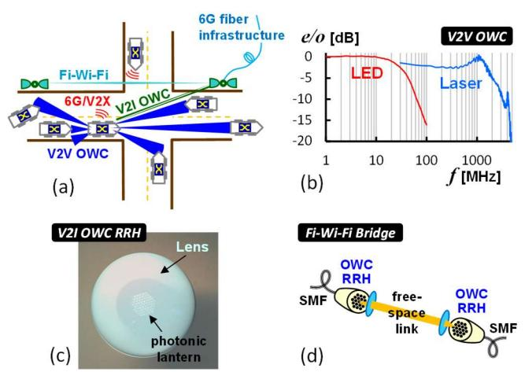

Figure 1: (a) OWC scenarios applied to connected mobility. (b) Comparison of LED- and laser-based electro-optic bandwidths when sourcing V2V OWC links. (c) V2I Remote radio head involving optical beamforming through a photonic lantern serving as optical focal-plane array antenna. (d) Fi-Wi-Fi bridge to ensure transparent high-capacity bandwidth extension between two single-mode fiber networks.

It shall be stressed that weather resiliency does not fall within the main scope of 6G-EWOC since investigations will primarily take place on a system-level. Component-related advances in the mid-infrared region promises robustness to poor weather conditions and can be straight-forwardly integrated in the developed V2V and V2I OWC systems once they become available. Moreover, the short transmission distances in the V2V scenarios, paired with highly sensitive receivers, and the availability of multi-element optical antennas that in principle allow the adoption of optical MIMO schemes can –to some degree– address challenging weather conditions such as elevated channel attenuation or strong scintillation.

# III. 6G-EWOC PROJECT GOALS AND OBJECTIVES

As a whole, 6G-EWOC project aims at the development of a high-speed 6G-V2X network that combines fiber-optic and wireless technologies, as well as AI to support advanced network and CAM services. More specifically, the project will develop a new access network that can handle high mobility (and capacity) scenarios, extend the 6G coverage and improve network availability and resilience through the integration of OWC technologies, including JCAS capabilities. The optical fiber fronthaul infrastructure will operate at a speed of 100 Gb/s/λ and it will be programmable, extremely dynamic and customizable. The project focuses on the following objectives:

- O1: OWC for V2V and high-rate (Gb/s) V2I applications, using chip-scale optical beamformers.
- O2: Efficient deployment of low-complexity connected laser/radio detection, ranging and communication (LiDAR/ RaDAR) technology.
- O3: Development of Programmable Integrated Circuits (PIC) and Application-Specific Integrated Circuits (ASIC) for adaptable transmitter and receiver systems. These systems will be used in fiber-based fronthaul networks to enable high-speed

data transmission at speeds of 50 Gb/s and 100 Gb/s per wavelength channel. The transmission will be carried out using dense wavelength division multiplexed (DWDM) fiber connections.

- O4: SDN supporting the programmability of a flexible fronthaul network in connected mobility scenarios and intradata center networks.
- O5: AI-assisted control and orchestration of network resources in the 6G-EWOC architecture.
- O6: AI-based applications for AVs employing multiple sensor technologies.

### IV. 6G-EWOC USE CASES

6G-EWOC focuses on use cases / scenarios that will put a strain on V2V and V2I communications and infrastructure resources. As such, (complex) busy intersections and urban environments (Figure 2), have been selected, where a large number of road users i.e., cars, trucks, motorcyclists, pedestrians, e-scooterers, -each with varying levels of autonomy, sensing and transmission capabilities-, may reside. Initially, a single intersection is considered and challenges associated with it are discussed. Subsequently, use cases involving several "connected" intersections, "simulating" a more realistic city traffic environment, are considered.

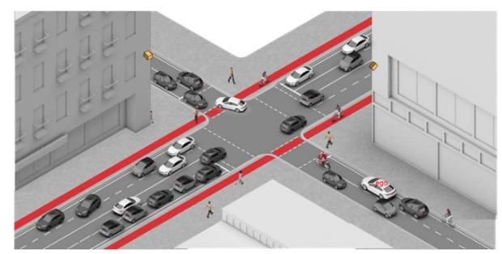

Figure 2: Busy Urban Intersection

More specifically, the following four use cases (UCs) are envisioned in the context of the project:

#### UC#1: Intersection drive-through

In this UC, a host vehicle (HV) that navigates through an intersection, shares and receives information on vehicle type, position, speed, heading and intent from other connected road users. Non-connected users are detected and reported by connected vehicles and infrastructure equipment (such as cameras and radars). Given the urban setting with a speed limit of 50 km/h, communication must be frequent (around 10 Hz) to ensure safety and efficiency. The system needs to create a shared perception of the traffic situation and coordinate and communicate the expected actions among all road participants. The latter requires fast and robust bidirectional communications, ultra-fast fronthaul network and AI-assisted processing at the (far)edge data centers to support the data load and system overhead.

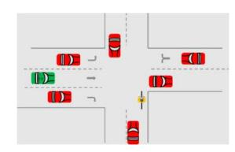

Figure 3: Intersection Drive-Through

#### UC#2: Improvement/Optimization of Traffic Flow

This UC focuses on optimizing urban traffic flow to reduce congestion, energy consumption, CO2 emissions and travel times. It necessitates real-time processing of data from multiple connected intersections so as to dynamically control the traffic lights, the vehicles' velocity, the signs, etc., and maximize thus the road utilization. The system leverages collective perception data from vehicles/VRUs in real-time, while incorporating longer-term information such as maps and planned road works for broader city-scale optimization. Effective data processing (at the edge) and rapid communications are crucial for transmitting relevant information to all road users in real-time.

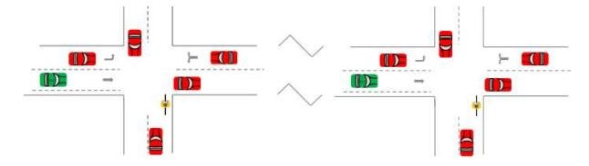

Figure 4: Traffic flow optimization in a wider city area covering adjacent intersections

### UC#3: Emergency Services Vehicle Prioritization

In emergency situations, emergency vehicles route prioritization is crucial for saving lives and property. Ambulances, fire trucks and police cars need to reach their destinations as quickly as possible, crossing many (busy) intersections, covering big parts of the city. Since time is a critical factor in emergency cases, delays (either in the access part or at the edge due to processing of large amounts of data) may have severe consequences. Excessive disruptions can lead to traffic jams, accidents or delayed commutes, which will indirectly impact the emergency response times. As such, a sophisticated and efficient traffic management system that concurrently prioritizes emergency vehicles along their route (by e.g., freeing lanes, controlling traffic lights), without compromising the regular traffic and VRUs safety, is essential.

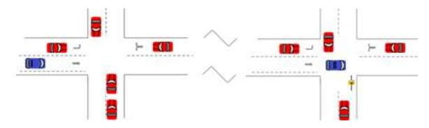

Figure 5: Emergency service vehicle prioritization (free lane, control of traffic lights)

# UC#4: Enhanced VRU Safety

VRUs often exhibit unpredictable movements or are situated in "blind spots", increasing the risk of accidents. This UC aims to enhance the VRUs safety by taking advantage of the Collective Perception implementation which informs the nearby road participants regarding their position and trajectory in real-time.

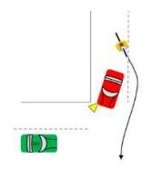

Figure 6: Occluded overtaking by a cyclist (right)

For example, in scenarios like occluded overtaking in intersections, it is critical to relay timely information about VRUs to prevent collisions. The system shall minimize communication delays and focus on delivering crucial warnings to the host vehicle.

#### V. 6G-EWOC ARHCITECTURE

The ultimate goal of the 6G-EWOC project is to significantly improve vehicle connectivity and safety for all road participants as well as vehicular traffic flow, by developing a multi-access, ultra-high throughput, ultra-low latency, energy efficient, resilient, e2e 6G-V2X network with advanced sensing capabilities for interconnected transportation ecosystems. The 6G-EWOC solution will utilize: (a) Advanced, "connected" laser sensors and related technologies (JCAS, SLAM, etc.) for accurate object detection and localization, (b) OWC technologies for V2V and V2I communications, to achieve the required throughput and resilience, (c) high-capacity optical switches, to achieve superfast connectivity between the vehicles/VRUs and the edge data processing centers and (d) AI methods to achieve both the generation of 3D maps by processing large volumes of sensor data in real-time (at the edge) and optimal optical network resources allocation under any traffic conditions.

The integration of C-V2X with OWC technologies will enhance the capabilities and the reliability of the existing C-V2X systems to achieve enhanced safety for all road participants, shorter driving times, reduced CO2 emissions, etc. Indicative integration options are listed below:

- Hybrid Approach: Supports concurrent/ parallel use of both technologies based on the context and requirements. The expected benefits include: enhanced reliability, increased (combined) throughput (e.g., for real-time 3D mapping), ultra-low latency (via OWC) in use cases / scenarios which require immediate response, continuous connectivity even if one technology is unavailable or compromised. However, adaptive switching mechanisms need to be introduced for the dynamic selection of the optimal channel.
- Cooperative Approach: Necessitates the co-operation between RF (C-V2X) and OWC to enhance the overall system performance in terms of situational awareness and load balancing/ optimization. (Intelligent) information is required to be exchanged between the two systems e.g., for ensuring seamless connectivity/handover, esp. in enviroments where one system may face limitations. For example, OWC could provide ultra high-speed, highresolution data exchange in specific scenarios ("busy intersection"), while NR-V2X could maintain broader situational awareness. Apart from data fusion techniques that need to be implemented, cross-layer optimization protocols may be also required to enable efficient communication and resource management between C-V2X and OWC.
- Redundant / Backup Approach: In this approach, for example, the OWC will act as a backup system for the C-V2X and vice-versa. This approach, although ensuring continuous communication (through failover mechanisms) even if one system fails or experiences degradation (e.g., non-LOS in case of OWC), does not fullfil the project performance-related requirements/KPIs and as such, it will not be considered for further investigation.

- Usage vs. Dedicated UCs Approach: According to this approach, each technology will be utilized based on the UC requirements (e.g., NR-V2X for "long"-range communications and OWC for close-proximity interactions). The benefit of this approach is that each technology will be utilized where it is most effective, allowing for better utilization of resources, maximizing thus, the overall efficiency.
- Coordinated Use of Spectrum Approach: This approach aims at optimal spectrum utilization and interference reduction. Although interference minimization can be achieved (by dynamically allocating resources between NR-V2X and OWC based on the current traffic demands and environmental conditions), this approach may not fulfill the performance-related 6G-EWOC requirements.

The 6G-EWOC high-level architecture, depicted in Figure 7, is capable of seamlessly integrating JCAS capabilities (supporting connected LiDARs and RaDARs), by leveraging OWC in the access part for V2V/ V2I and fronthaul connectivity, along with existing C-V2X systems.

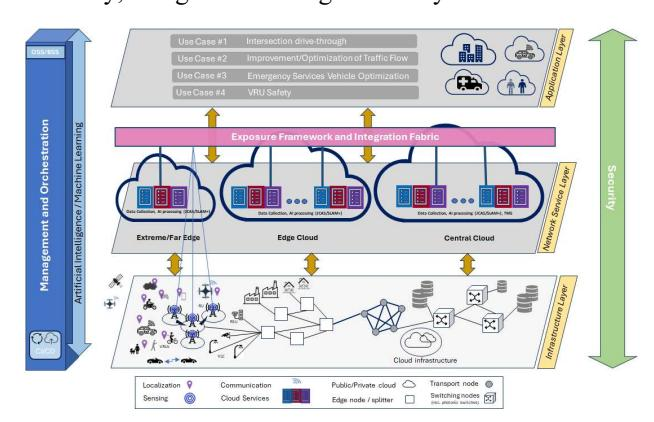

Figure 7: 6G-EWOC high-level architecture

This multi-access architecture is capable of supporting disruptive use cases/ automotive applications, "covering" busy intersections, wider city areas (i.e., multiple interconnected intersections) or even entire cities, since it may achieve:

- Seamless mobility by integrating OWC and C-V2X
- Ultra-high throughput esp. utilizing OWC where available
- Ultra-fast data transfer of sensor/ other data by incorporating SDN-enabled photonic switching
- AI-driven real-time processing capabilities at the edge
- AI-assisted optimal utilization of optical network resources
- Cost affordability by leveraging OWC technologies
- Energy-efficiency by utilizing PIC and ASIC components and AI algorithms for optimal processing/ connectivity (while minimizing environmental impact).

 Figure 8 depits the 6G-EWOC connectivity architecture incorporating the OWC transceivers, the photonic switches, the edge data centers, the SDN orchestrator, etc.

# VI. DEMOS

In the context of the project, three (3) demos are envisaged:

- OWC connectivity (Figure 9)
- High-capacity fiber-optic transmission and networking

 e2e 6G-EWOC network operation incl. automotive applications, networking and data fusion (Figure 10 and Figure 11).

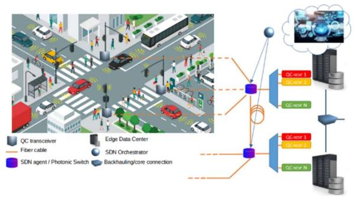

Figure 8: 6G-EWOC connectivity architecture

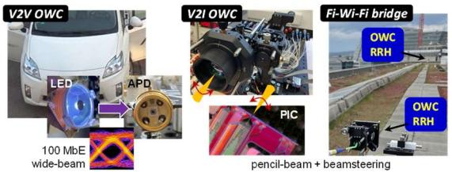

Figure 9: OWC connectivity demo (indoors and outdoors)

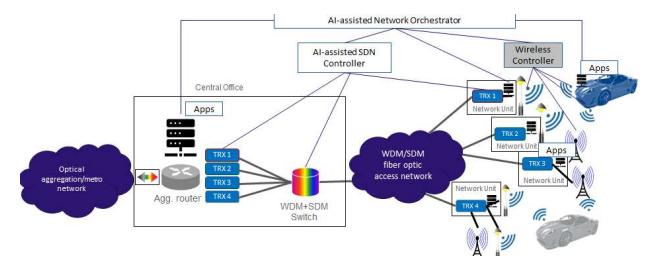

Figure 10: e2e demo – App, Access/Core Network, Data Fusion

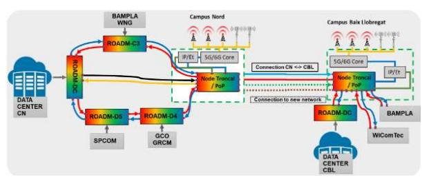

Figure 11: e2e demo – Utilization of fiber-optic and 5G (w/ mmW) networks

The aim of these demos is multifold: (a) the integration of the OWC and fiber-based fronthaul incl. the control plane and the automotive/ vertical applications, (b) the functional validation of the integrated solutions and (c) the assessment of the project KPIs which "cover" all the project objectives. More specifically, the KPIs that will be evaluated during the demos, on a per project objective basis, are the following:

O1: OWC for V2V and high-rate (Gb/s) V2I applications, leveraging chip-scale optical beamformers.

- KPI O.1.1: V2V data rate of >100 Mb/s for short-range (>100 m) head/rear-lamp OWC channel
- KPI O.1.2: User data rate of >1 Gb/s for long-range (>200 m) V2I OWC channel
- KPI O.1.3: User data rate of 10+ Gb/s (better than LTE for terrestrial 5G-NR radio, as motivated by [16]).
- KPI O.1.4: Transparency of Fi-Wi-Fi bridge via loss of <13dB for FPA-enabled mid-range (100m) OWC channel.

- O2: Connected laser/radio detection, ranging and communication (LiDAR/RaDAR).
- KPI O.2.1: Demo of an enhanced pulsed MEMS-based LiDAR with sensing (high density point clouds within a camera-like FOV of 30ºx20º at 7 fps) and FSO communication capabilities up to 200 m and <500 kHz PRR (bitrate) for ISAC applications in autonomous navigation systems
- KPI O.2.2: Demo of a connected RaDAR, incl. simultaneously detection and communication capabilities for a range of <200 m and between 0.5 and 1 Gb/s.
- O3: PIC and ASIC for tunable transmitter and receiver concepts for fiber-based fronthaul supporting net data rates of 50 Gb/s and 100 Gb/s per wavelength channel over DWDM fiber links.
- KPI O.3.1: Demo of 50 Gb/s PAM4 Quasi-Coherent ASIC with built-in dispersion compensation
- KPI O.3.2: Demo of a 100 Gb/s PAM4 Quasi-Coherent ASIC with built-in dispersion compensation
- KPI O.3.3: Demo of an integrated QC receiver photonic chip with 10mW on chip tunable LO and 40 GHz photoreceptor
- KPI O.3.4: Demo of an integrated QC receiver photonic chip with 10mW on chip tunable LO and 100 GHz photoreceptor.

# O4: WDM-SDM Enhanced Photonic Switching

- KPI O.4.1: Demo of 16x16 switch with 9 dB fiber-to-fiber loss and sub-microsecond reconfiguration time
- KPI O.4.2: Time slotted operation with guaranteed operation (i.e. no out-of-order packets) for a min of 50us slot duration.
- O5: AI-assisted control and orchestration of resources for the EWOC network concept
- KPI O.5.1: Provisioning of traffic flows achieving 50% reduction of the energy consumption
- KPI O.5.2: Provisioning of traffic flows in < 60 sec, considering packet and optical layers
- KPI O.5.3: AI-assisted energy-efficiency algorithm(s) and/or heuristics for multi-layer (packet/optical) networks.

#### O6: AI-based applications for AVs

- KPI O.6.1: Demo of a data fusion sensor suite with low parallax error based on connected LiDARs / RaDARs
- KPI O.6.2: Incremental reconstruction of scenes from multi ego-poses and discrimination of dynamic elements with range precision better than 0.5m and ACC, better than 60%.

This set of KPIs is intended to support and demonstrate the 3 project demos, as main 3 pillars to support the described UCs. On the one hand, the proposed KPIs are in accordance with the Strategic Research and Innovation Agenda (SRIA) [16], which specifies the essential KPIs for 6G networks. This effort aligns future 6G technologies with the FAVs needs (reflected in UC 1-4). A detailed analysis of the impact of each KPI on the UCs depends on the specific UC-based architectural instantiation of the 6G-EWOC. On the other hand, developing the technology for validating these KPIs constitutes the main technological effort to be carried out as a collaborative effort to achieve the goals proposed at SRIA.

# VII. CONCLUDING REMARKS

The 6G-EWOC project aims at the development of 6G technologies to support (fully) autonomous driving. This initiative plans to integrate a range of advanced technologies, including precise sensing and mapping, OWC, high-capacity fronthaul connectivity and efficient (edge) data center technologies. The project components will be interconnected via photonic integrated circuit technology and powered by AI for both processing and resources optimization purposes. The project will not only reduce size and cost of its constituent sensing, communication and processing technologies, but will also bring application-level performance improvements in the context of "connected" vehicles. During the demos that have been planned, 17 KPIs will be assessed.

#### ACKNOWLEDGMENT

This work is supported by the European Union's Horizon research and innovation 6G-EWOC Project under Grant Agreement No. 101139182 and has received funding from the Smart Networks and Services Joint Undertaking (SNS JU).

#### REFERENCES

- [1] X. Li, Z. Ghassemlooy, S. Zvanovec, and L.N. Alves, "An Equivalent Circuit Model of a Commercial LED With an ESD Protection Component for VLC," Phot. Technol. Lett., vol. 33, no. 15, pp. 777- 779, Aug. 2021.
- [2] B. Schrenk, G. de Valicourt, M. Omella, J.A. Lazaro, R. Brenot, and J. Prat, "Direct 10 Gb/s Modulation of a Single-Section RSOA in PONs with High Optical Budget," Phot. Technol. Lett., vol. 22, no. 6, pp. 392- 394, Mar. 2010.
- [3] J. Hu et al., "46.4 Gbps visible light communication system utilizing a compact tricolor laser transmitter," Opt. Expr., vol. 30, no. 3, pp. 4365- 4373, Jan. 2022.
- [4] B. Schrenk, "Optical Fi-Wi-Fi Bridge with 32-Port Focal Plane Fiber Array for Robust Waveguide Coupling," in Proc. IEEE Summer Topicals Meeting '24, Bridgetown, Barbados, Jul. 2024, paper MB3.3.
- [5] 6G-EWOC: D2.1 "Report on use cases, user and system requirements", June/2024.
- [6] Manzoor A. Khan et al. Level-5 Autonomous Driving—Are We There Yet? A Review of Research Literature, DOI: 10.1145/3485767
- [7] A. Takacs et al. A Method for Mapping V2X Communication Requirements to Highily Automated and Autonomous Vehicle Functions, https://doi.org/10.3390/fi16040108
- [8] Evolution of V2X Communication and Integration of Blockchain Security Enhancements, doi:10.3390/electronics9091338 www.mdpi.com/journal/electronics
- [9] "The Challenges and Opportunities With Implementing V2X", https://www.microwavejournal.com/articles/41092-the-challengesand-opportunities-with-implementing-v2x
- [10] Autonomous vehicle implementation predictions: Implications for transport planning, https://www.vtpi.org/avip.pdf3
- [11] "Autonomous Vehicles: Memory Requirements & Deep Neural Net Limitations", https://www.rambus.com/blogs/autonomous-vehiclesmemory-requirements-deep-neural-net-limitations/
- [12] "The Data Deluge: What do we do with the data generated by AVs?", Jan/2021, https://blogs.sw.siemens.com/polarion/the-data-delugewhat-do-we-do-with-the-data-generated-by-avs/
- [13] S. Heinrich, "Flash Memory in the emerging age of autonomy", https://files.futurememorystorage.com/proceedings/2017/20170808\_F T12\_Heinrich.pdf, Flash Memory Summit 2017, Santa Clara
- [14] 5GPP.EU, "Trials and pilots for Connected and Automated Mobility", May/2021
- [15] "The Impact of Autonomous Vehicles on Cities: A Review", http://senseable.mit.edu/papers/pdf/20180727\_Duarte-Ratti\_ImpactAutonomousVehicles\_JUT.pdf
- [16] "Strategic Research and Innovation Agenda 2022", avaliable at https://bscw.sns-ju.eu/pub/bscw.cgi/d95660/SRIA-2022-WP-Published.pdf