# Radar-Centric Photonic Terahertz Integrated Sensing and Communication System Based on LFM-PSK Waveform

Zhidong Lyu [,](https://orcid.org/0009-0009-6610-8819) Lu Zhan[g](https://orcid.org/0000-0001-9567-155X) , *Member, IEEE*, Hongqi Zhan[g](https://orcid.org/0000-0003-4992-5285) , Zuomin Yan[g](https://orcid.org/0000-0001-5250-5113) , Hang Yan[g](https://orcid.org/0000-0002-0078-420X) , Nan L[i](https://orcid.org/0000-0003-4871-2376) , Lianyi L[i](https://orcid.org/0009-0007-0803-3180) , Vj[ace](https://orcid.org/0000-0003-4906-1704)slavs Bobrov[s](https://orcid.org/0000-0002-5156-5162) ˇ , *Member, IEEE*, Oskar[s O](https://orcid.org/0000-0003-0063-4460)zolin[s](https://orcid.org/0000-0001-9839-7488) , *Member, IEEE*, Xiaodan Pang , *Senior Member, IEEE*, and Xianbin Yu , *Senior Member, IEEE*

*Abstract*— The radar-centric terahertz integrated sensing and communication (THz-ISAC) is identified as a significant application in future wireless access networks. Up to date, previously reported demonstrations regarding radar sensing performance lack sufficient support in a complex environment with a strong target masking effect. This work tacks this problem by proposing a radar-centric waveform combining linear frequency modulation (LFM) waveform and phase shift keying (PSK). We first derive sensing metrics of the LFM-PSK waveform through theoretical analysis, including range resolution, peak sidelobe ratio (PSLR), and Cramér-Rao lower bound (CRLB). Then a proofof-concept experiment on a photonics-assisted integrated sensing and communication (ISAC) system operating at 330 with 18 GHz bandwidth is conducted to verify the performance of the proposed LFM-PSK waveform. In the experiment, the proposed waveform can reach a PSLR of up to 20.9 dB and a range resolution of 1.3 cm, simultaneously accommodating a data transmission of 6 Gbit/s. In addition, the effect of embedding symbols on sensing metrics is also discussed, and by comparing the range

Manuscript received 22 December 2022; revised 21 February 2023 and 24 March 2023; accepted 4 April 2023. Date of publication 28 April 2023; date of current version 6 November 2023. This work was supported in part by the National Key Research and Development Program of China under Grant 2020YFB1805700, in part by the "Pioneer" and "Leading Goose" Research and Development Program of Zhejiang under Grant 2023C01139, in part by the Natural National Science Foundation of China under Grant 62101483, in part by the Natural Science Foundation of Zhejiang Province under Grant LQ21F010015, in part by the Zhejiang Laboratory under Grant 2020LC0AD01, and in part by the Vetenskapsrådet under Grant 2019-05197. *(Corresponding authors: Xianbin Yu; Lu Zhang.)*

Zhidong Lyu, Lu Zhang, Hongqi Zhang, Zuomin Yang, Hang Yang, Nan Li, and Lianyi Li are with the College of Information Science and Electronic Engineering, Zhejiang University, Hangzhou 310027, China (e-mail: zdlyu@zju.edu.cn; zhanglu1993@zju.edu.cn; zhanghongqi@ zju.edu.cn; yangzuomin@zju.edu.cn; yanghange@zju.edu.cn; 12031106@ zju.edu.cn; lilianyi@zju.edu.cn).

Vjaceslavs Bobrovs is with the Institute of Telecommunications, Riga ˇ Technical University, 1048 Riga, Latvia (e-mail: vjaceslavs.bobrovs@rtu.lv).

Oskars Ozolins is with the Institute of Telecommunications, Riga Technical University, 1048 Riga, Latvia, also with the Applied Physics Department, KTH Royal Institute of Technology, 106 91 Stockholm, Sweden, and also with the RISE Research Institutes of Sweden, 164 40 Stockholm, Sweden (e-mail: oskars.ozolins@rtu.lv).

Xiaodan Pang is with the Applied Physics Department, KTH Royal Institute of Technology, 106 91 Stockholm, Sweden, and also with the RISE Research Institutes of Sweden, 164 40 Stockholm, Sweden (e-mail: xiaodan@kth.se).

Xianbin Yu is with the Zhejiang Laboratory, Hangzhou 311121, China, and also with the College of Information Science and Electronic Engineering, Zhejiang University, Hangzhou 310027, China (e-mail: xyu@zhejianglab.com).

Color versions of one or more figures in this article are available at https://doi.org/10.1109/TMTT.2023.3267546.

Digital Object Identifier 10.1109/TMTT.2023.3267546

solution and PSLR with various data rates, around ∼6 dB gain in the PSLR without any deterioration of range resolution is observed.

*Index Terms*— Integrated sensing and communication, linear frequency modulated waveform and phase shift keying (LFM-PSK), peak sidelobe ratio (PSLR), radar-centric design, terahertz photonics.

#### I. INTRODUCTION

R ECENTLY, the concept of integrated sensing and communication (ISAC) has been gaining a lot of attention, with an expectation of enabling efficiency improvement of hardware resources, mutual performance benefits, and robustness to the dynamic environment [\[1\], \[2\]. In](#page-7-1) common sense, boosting operation frequency toward the terahertz band (THz, 0.3–10 THz) can provide ultra-broad available bandwidth, which can support both high-capacity communication and high-accuracy sensing for the emerging ISAC services [\[3\].](#page-7-2) Moreover, numerous research efforts on communication and sensing systems operating at the THz band have made impressive progress [\[4\], \[5\], \[6\]. A](#page-7-5)mongst them, a photonics-based approach with distinct advantages of large operating bandwidth, electromagnetic interference (EMI) immunity, and less harmonic interference [\[7\] ca](#page-7-6)n accommodate the future ISAC systems operating at the millimeter-wave (mmW) band and the THz band. Therefore, the photonic terahertz integrated sensing and communication (THz-ISAC) systems can potentially enhance sensing and communication performance by bridging the THz wireless links with existing optical fiber networks.

In ISAC systems, the dual-functional waveform plays an essential part, which is desirable to feature the ability to simultaneously obtain high-performance sensing and communication. Initially, the waveforms are straightforwardly combined based on multiplexing schemes, such as time division multiplexing (TDM) [\[8\] an](#page-7-7)d frequency division multiplexing (FDM) [\[9\], \[10\].](#page-7-9) However, these multiplexing techniques loosely couple two inherent waveforms and introduce additional overhead on hardware resources. Alternatively, the integrated waveforms are very promising, and can tightly couple both time and frequency resources. Depending on the application scenarios, the integrated waveforms can be so far divided into two categories: communication-centric waveforms

0018-9480 © 2023 IEEE. Personal use is permitted, but republication/redistribution requires IEEE permission. See https://www.ieee.org/publications/rights/index.html for more information.

and radar-centric waveforms [11]. The communication-centric utilizes existing communication modulation formats, such as orthogonal FDM (OFDM), to perform radar sensing while maintaining a high-speed data transmission [12], [13], [14]. For example, a 30 GHz radio-over-fiber (RoF) OFDM system with 14.5 Gbit/s data rate and target detection over 5 m has been realized [12], which is enabled by a wideband photonic transceiver module and digital predistortion. In addition, an optoelectronic oscillator (OEO) has been also introduced into a tunable K/W-band OFDM integrated system with phase noise sensitivity reduction, achieving 12.8 Gbit/s back-to-back transmissions with 7.5 cm range resolution at the 25–27 GHz band, and 32 Gbit/s with 1.5 cm resolution at the 89-99 GHz band, respectively [14]. In fact, the communication-centric waveform design emphasizes extracting radar information from a communication waveform. The attained information is typically used to perform channel estimation and resource allocation, so as to improve communication performance metrics.

In contrast, in radar-centric scenarios, the waveforms are designed for embedding communication symbols to transmit radar information. Therefore, the radar-centric waveforms concern more about the high peak sidelobe ratio (PSLR) and the range resolution, while a limited data rate is acceptable. The application scenarios orient high-precise detection and environment reconstruction, where communication symbols are used to improve radar timelines. The typical techniques employ the direct spread spectrum (DSS) [15], [16] or embedding information operation [17], [18]. In [15], two phase-orthogonal integrated signals are generated by an OEO loop with an m-sequence DSS, and as a result, both the maximum unambiguous range and communication capacity are promoted through two transmission channels. The spread spectrum gain is discussed in [16], where the Walsh-Hadamard (WH) sequence and the m-sequence serve as spread spectrum and scramble sequences, achieving 3.5 cm range resolution, a PSLR of  $\sim$ 12 dB at 35 GHz, as well as 1 Gbit/s coding rate. The sensing performance of spread spectrum-based waveforms depends on the selected sequence while sacrificing the signalto-noise ratio (SNR). This kind of waveform transmits communication symbols by manipulating the phase of sequences and generally leads to a low obtainable data rate. Another type of radar-centric waveform is to embed symbols into existing radar waveforms, such as linear frequency modulation (LFM) waveforms. For instance, an amplitude shift keying (ASK)-LFM waveform has been realized by two cascaded Mach-Zehnder modulators (MZMs) for simultaneous data transmission and target imaging [17]. However, the ASK modulation deteriorates the PSLR from 14 to 9.5 dB. Furthermore, a 60 GHz integrated system combining constant-envelop OFDM and LFM carriers by angle modulation has been validated with 8 Gbit/s data transmission and 1.5 cm range resolution for 2-D imaging [18]. Please note that these achievements above are all based on photonic methods. In addition, it has been highlighted that an electronic integrated system operating at 2 GHz with 200 MHz bandwidth based on LFM-BPSK waveform is proposed and demonstrated in [19], to improve system performance through multiple-input multiple-output (MIMO) and code-division multiplexing (CDM) techniques,

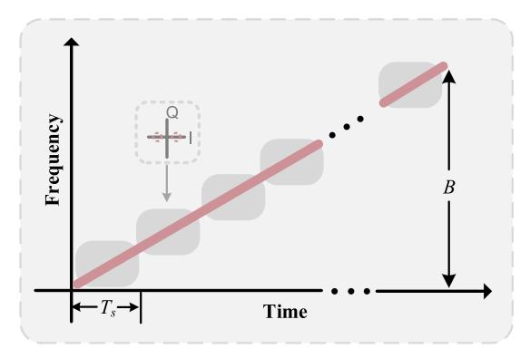

Fig. 1. Principle of LFM-BPSK waveform generation illustrated in the time-frequency domain.

while the trade-off between radar and communication for such a waveform remains to be addressed, along with the expectation on exploiting large bandwidth supporting both high-capacity communication and high-accuracy sensing.

As aforementioned, research efforts have been put into promoting the photonic ISAC system from multiplexed waveforms to integrated waveforms. However, the sensing performance is not yet sufficiently explored for radar-centric cases. In this article, we propose a photonic radar-centric THz-ISAC system beyond 300 GHz based on an LFM-PSK waveform. The basic sensing performance of the LFM-PSK waveform will be theoretically analyzed, where the range resolution and PSLR are derived and discussed as key indicators. Subsequently, a proof-of-concept experiment is conducted using the proposed LFM-PSK waveform, reaching PSLR of 20.9 and 19.7 dB in the cases of a back-to-back and 1 m wireless link, respectively, and achieving a range resolution of 1.3 cm and 6 Gbit/s data rate transmission.

#### II. OPERATION PRINCIPLE

As we know, the LFM waveform is widely used for target detection. In the case of continuous wave (CW), the LFM can be expressed as

$$s_{\text{LFM}}(t) = \exp\left[j\pi\left(2f_0t + ut^2\right)\right] \tag{1}$$

where  $f_0$  is the initial frequency and u is the chirp rate. The LFM signal sweeps linearly over bandwidth B within the temporal duration T with a rate of u = B/T. After being reflected from a target, the echoes are collected at the receiver side. Then, a matched filter based on pulse compression theory is applied, and the output amplitude of the filter is given by

$$r_{\text{LFM}}(\tau) = \left| \int_{-\infty}^{+\infty} s_{\text{LFM}}(t) \cdot s_{\text{LFM}}^*(t - \tau) dt \right|$$
$$= (T - |\tau|) \cdot |\text{sinc}[\pi u \tau (T - |\tau|)]| \tag{2}$$

where  $(\cdot)^*$  denotes the conjugate operator, and the variable  $\tau$  represents the time delay. Then, we solve  $r_{\rm LFM}(\tau)=0$  and obtain the zero-point  $\tau_{\rm LFM}=1/B$ , which corresponds to the time resolution of the LFM waveform.

The schematic for generating an integrated LFM-phase shift keying (PSK) waveform is illustrated in Fig. 1 in the time-frequency domain. Here, the LFM waveform serves as

the communication carrier, and symbols are embedded by changing the phase of the LFM waveform with a symbol rate of  $R_b$ . In each time slot  $T_s = 1/R_b$ , a symbol is mapped to an additional phase

$$\varphi(t) = \frac{2\pi}{M} a_i \tag{3}$$

where M and  $a_i$  represent the order of PSK modulation and communication symbol, respectively. Assuming the BPSK format modulation, namely M = 2, the symbol  $a_i \in \{0, 1\}$  and the additional phase  $\varphi(t) \in \{0, \pi\}$ .

Thus, the integrated waveform can be written as

$$s_{\text{LFM-BPSK}}(t) = \exp[j\pi(2f_0t + ut^2) + j\varphi(t)]$$
 (4)

and the amplitude of the matched filter output is

$$\begin{aligned} & = \left| E \left[ \int_{-\infty}^{+\infty} s_{\text{LFM-BPSK}}(t) \cdot s_{\text{LFM-BPSK}}^*(t - \tau) dt \right] \right| \\ & = \left( T_s - |\tau| \right) \cdot \left| \text{sinc}[\pi u \tau (T_s - |\tau|)] \cdot \frac{\sin(\pi u \tau T)}{\sin(\pi u \tau T_s)} \right| \end{aligned}$$
(5)

where  $E(\cdot)$  denotes the expectation operator. Here, the expectation operation is used to eliminate the randomness of modulated symbol [20], which can be regarded as an approximation of the output of the real matched filter. By setting  $r_{\text{LFM-BPSK}}(\tau) = 0$ , the obtained the first zero-points can be expressed as

$$\tau_{\text{LFM-BPSK}} = \begin{cases} \frac{1}{uT}, & R_b \le B\\ \frac{T_s}{2} \pm \sqrt{\frac{T_s^2}{4} - \frac{1}{u}}, & R_b > B. \end{cases}$$
(6)

Under the condition of  $R_b \leq B$ , the first zero-point is  $\tau_{\text{LFM-BPSK}} = 1/(uT) = 1/B$ , which is consistent with the LFM waveform. But under the condition of  $R_b > B$ , they are no longer consistent. This means that an overly high symbol rate will destroy the range resolution of the integrated waveform.

Thus, the first-order sidelobe is located between 1/B and 2/B. To obtain the position of the first sidelobe, we assume  $\tau_s = \alpha/B$ , in which  $1 < \alpha < 2$ , and denote the bandwidth ratio of LFM and BPSK signal with  $\rho = B/(2R_b)$ . Substituting the condition into (5), we have

$$r_{\text{LFM-BPSK}}(\tau_s) = T \cdot \left| \frac{\sin \left[ \frac{\pi \alpha}{T R_b} \left( 1 - \frac{\alpha}{2\rho} \right) \right]}{\sin \left( \frac{\pi \alpha}{T R_b} \right)} \cdot \frac{\sin(\pi \alpha)}{\pi \alpha} \right|.$$
 (7)

Since the amplitude of the first-order sidelobe represents the maximum value of (7). Let the derivative of  $r_{\text{LFM-BPSK}}(\tau_s)$  equal to zero, and substitute the obtained zero-point  $\tau_{s0}$  into (7), the approximate solution of PSLR can be given as

$$PSLR = \frac{r_{LFM-BPSK}(0)}{r_{LFM-BPSK}(\tau_{s0})} \approx 2\pi\rho \cdot \frac{1 - 11\rho^2}{16\rho^3 - 11\rho^2 + 1} \cdot \csc\left(\frac{11\rho^2 - 1}{8\rho^2}\pi\right). \quad (8)$$

For a fixed LFM bandwidth B, with a decreasing bandwidth radio  $\rho$ , namely an increasing symbol rate, the PSLR increases

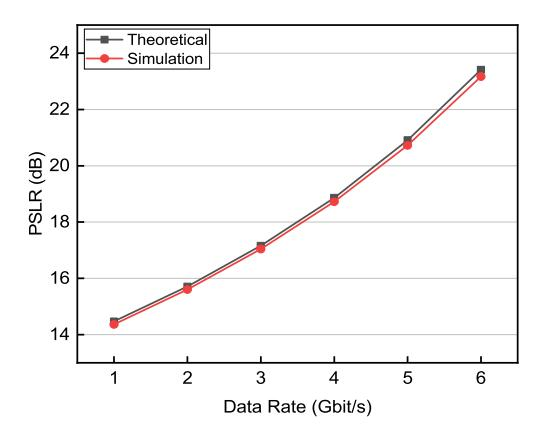

Fig. 2. Simulated PSLR performance versus data rate.

and tends to infinity. From (6) and (8), we can conclude that when the symbol rate satisfies  $R_b \leq B$ , the larger  $R_b$  is, and the better PSLR we have, as the proposed waveform is closer to a random signal, and as a result, an LFM-BPSK waveform with high PSLR will be immune to the masking effect of strong targets [21]. Moreover, both (7) and (8) indicate that the radar performance is independent of the modulation order. Therefore, we choose BPSK communication symbols in our experiment as proof-of-concept with a digital processing routine.

Fig. 2 shows the PSLR performance versus data rate in theoretical analysis and simulation with an LFM bandwidth of 12 GHz, which corresponds to the bandwidth in our experimental setup afterward. The simulation is carried out based on the commercial optical system simulation platform OptiSystem. It can be seen that the simulation results agree well with the theoretical analysis.

In addition, we numerically evaluate the radar accuracy through the Cramér-Rao lower bound (CRLB) in the case of an additional Gaussian channel with an LFM bandwidth of 12 GHz. The CRLB is defined as the lower bound of estimation error variance for unbiased estimators [22], [23], which is denoted as the inverse of the Fisher information matrix (FIM). A smaller CRLB means better radar performance. The CRLB can be derived from the output of the matched filter [24]. Therefore, according to (7), the CRLB on time delay estimation error is as follows:

$$CRLB(\tau) = -\left[2\eta \frac{\partial^2 |r_{LFM-MPSK}(\tau)|}{\partial \tau^2}\right]^{-1}$$
(9)

where  $\eta$  denotes the SNR. In practical applications, the concerned range estimation error can be presented as

$$CRLB(R) = \frac{c^2}{4}CRLB(\tau)$$
 (10)

where *c* represents the speed of electromagnetic waves. Fig. 3 presents the normalized CRLB on range estimation error, which is estimated by the numerical differentiation approach. As can be seen, the CRLB performance enhances with the SNR. Moreover, when the data rate increases from 2 to 6 Gbit/s at a fixed SNR, the CRLB decreases by

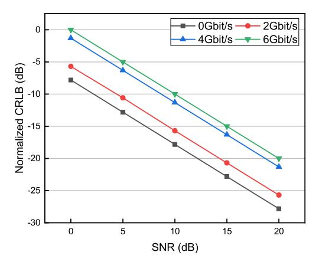

Fig. 3. Normalized CRLB on range estimation error versus the SNR at different data rates.

around 5.6 dB, indicating a higher data rate will compromise the radar accuracy.

According to the theoretical analysis and the numerical simulation results above, we can conclude that the PSLR and the radar accuracy of the LFM-BPSK waveform are inversely proportional to its data rate. Therefore, there should have an optimal data rate, where the most adequate performance can be achieved. Assuming that the two metrics are equally weighted, and then the optimization problem for an LFM-BPSK waveform can be formulated as

$$R_{b,\text{opt}} = \arg \max_{R_b} \text{PSLR} + \sigma_R$$
  
s.t.  $R_b \le R_{b,\text{th}}$  (11)

where *Rb*,opt and *Rb*,th denotes the optimal and the threshold values of the data rate, respectively, and σ*R* represents the range estimation error. Besides, the PSLR and estimation error are completely different physical quantities, they should be normalized by reference before being added. Here, we choose the corresponding performance of the unmodulated LFM waveform as a reference. Therefore, the objective function of the optimization problem aims to maximize the performance gain induced by the BPSK communication symbols. Note that the optimization described in [\(11\)](#page-3-1) with respect to the PSLR and range estimation error features equal weights, which will be various in specific different scenarios. To generally balance the sidelobe level and estimation accuracy performance, a scenario-dependent preference factor should be taken into account.

### III. EXPERIMENTAL SETUP

The schematic of the proposed photonic LFM-PSK THz-ISAC system is depicted in Fig. [4.](#page-4-0) A continuous-wave optical signal emitted from an external cavity laser (ECL, 1552 nm, <100 kHz linewidth) is injected into a phase modulator (PM, EOSPACE) to create a coherent optical frequency comb (OFC), in-between a polarization controller (PC1) is employed to optimize the polarization state. The PM is driven by a 33 GHz radio frequency (RF) signal generated from an RF synthesizer (Keysight, E8257D) and amplified by a 38 dB-gain electrical amplifier. Fig. [5\(a\)](#page-4-1) shows the optical spectrum of the generated OFC with 30 GHz comb line spacing measured by an optical spectrum analyzer (OSA, FINISAR, WaveAnalyzer 1500S, 150 MHz resolution).

Subsequently, two coherent optical tones with 330 GHz spacing are filtered by a wavelength-selective switch (WSS, FINISAR, WaveShaper 4000A) and separately launched into two branches. The optical tone centered at 193.283 THz in the lower branch is first amplified by an Erbium-doped fiber amplifier (EDFA), and then launched into an in-phase (I) and quadrature (Q) modulator (IQ-MOD, IDPHOTONICS, 40 GHz bandwidth) for carrying an integrated LFM-BPSK waveform, and the other in the upper branch centered at 192.953 THz serves as the optical local oscillator (LO) for heterodyning to generate an integrated waveform in the THz band.

In the experiment, the integrated LFM-BPSK signal is generated from an arbitrary waveform generator (AWG, Keysight M8194A, 120 GSa/s) to drive the IQ-MOD with an amplitude of 80 mV. The waveform is composed of a pseudorandom bit sequence with a length of 215 − 1 (PRBS-15), which is mapped onto the additional phase as described in [\(3\)](#page-2-5), and then embedded into an LFM signal with a bandwidth of 12 GHz and a time duration of 2 µs. The selected optical LO is combined with the modulated tone utilizing a 3 dB optical coupler (OC). Fig. [5\(b\)](#page-4-1) shows the optical spectrum of the combined optical LO and modulated optical signals, with a frequency spacing of 330 GHz. After photomixing in a uni-traveling carrier photodiode (UTC-PD, IOD-PMJ-13001), a 330 GHz integrated signal is generated and radiated by a horn antenna. Here, the incident polarization alignment to the UTC-PD is optimized by a polarization controller (PC3 in Fig. [1\)](#page-1-0) and a polarizer, and a polarization-maintaining variable optical attenuator (VOA) is used to adjust the incident optical power. In this experiment, we keep 12.6 dBm constant input power to the UTC-PD, corresponding to a photocurrent of 3 mA.

After propagation in a 1 m line-of-sight (LOS) wireless link, the integrated THz signal is amplified by a THz low noise amplifier (THz-LNA) with a 22 dB gain. Then, a Schottky mixer (VDI WR3.4, 40 GHz intermediate frequency (IF) bandwidth) is used to perform frequency down-conversion into the IF band, which is driven by a 24-order frequency multiplied electrical LO signal. The LO signal is generated by using an analog signal generator (ROHDE and SCHWARZ, SMB100A) operating at 12.875 GHz with an output power of −2 dBm. After mixing with the multiplied electrical LO in this case, the IF signal centered at 21 GHz is sent to a real-time digital storage oscilloscope (DSO, Keysight, DSOZ594A, 160 GSa/s), where separate radar and communication demodulation are performed offline in the digital domain, as shown in the inset of Fig. [4.](#page-4-0)

#### IV. RESULTS AND DISCUSSIONS

## *A. Sensing Performance of LFM-BPSK Waveform*

To validate the performance of our proposed waveform and system, the THz-ISAC system shown in Fig. [4](#page-4-0) is implemented in two cases, namely back-to-back and with 1 m LOS wireless transmission. We estimate the sensing performance by

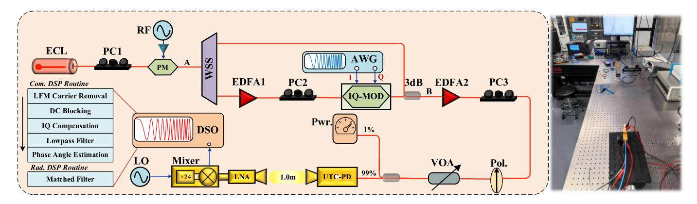

Fig. 4. Schematic of the proposed photonic LFM-BPSK THz-ISAC system. ECL: external cavity laser, PC: polarization controller, PM: phase modulator, RF: radio frequency, WSS: wavelength selective switch, EDFA: Erbium-doped fiber amplifier, AWG: arbitrary waveform generator, IQ-MOD: in-phase and quadrature modulator, Pol.: polarizer, VOA: variable optical attenuator, Pwr.: power meter, UTC-PD: uni-traveling carrier photodiode, DSO: digital storage oscilloscope, LO: local oscillator.

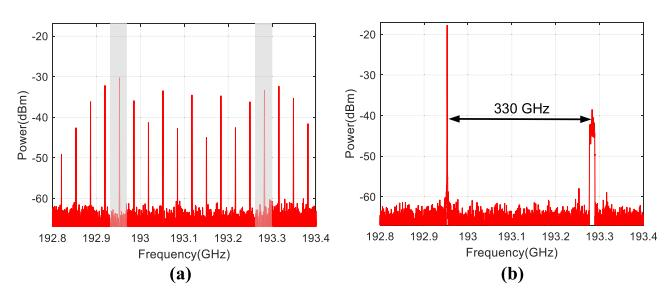

Fig. 5. (a) Optical spectrum of OFC generated at the PM (Point A). (b) Optical spectrum at the output of the 3 dB coupler (Point B).

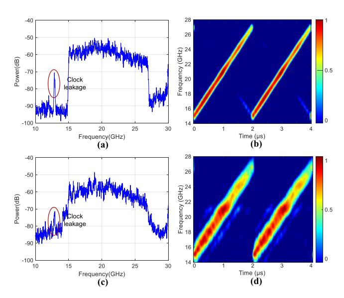

Fig. 6. Electrical spectrum and STFT analysis of the received signals before digital down-conversion to baseband. (a) and (b) are LFM signals. (c) and (d) are LFM-BPSK signals.

measuring the resolution and the PSLR in the range profile and simultaneously evaluate the communication performance in terms of bit error rate (BER).

Fig. [6](#page-4-2) illustrates the electrical spectrum and short-time Fourier transform (STFT) of the received IF LFM signals and LFM-BPSK signals before the digital down-conversion. It is noted that the tone centered at around 13 GHz in the

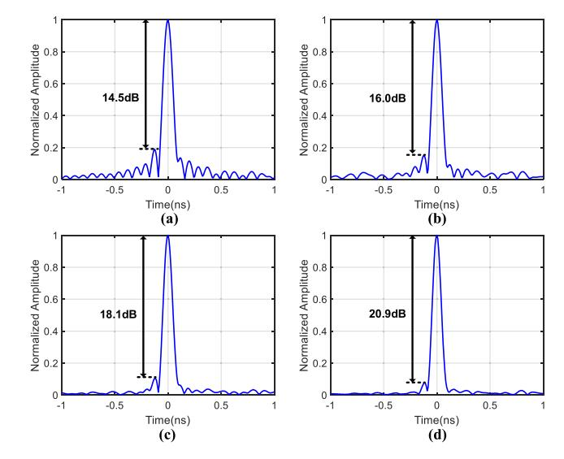

Fig. 7. Back-to-back autocorrelation of LFM-BPSK waveform with data rate at (a) 0 Gbit/s, (b) 2 Gbit/s, (c) 4 Gbit/s, and (d) 6 Gbit/s.

electrical spectrum is the clock leakage from the electrical LO. From the STFT analysis, we can see that the signal frequency sweeps linearly from 15 to 27 GHz in 2 µs duration, which corresponds to 324–336 GHz in the THz region. By comparing Fig. [6\(a\)](#page-4-2) and [\(b\)](#page-4-2) with Fig. [6\(c\)](#page-4-2) and [\(d\),](#page-4-2) we can observe the existence of the additional phase not only broaden the bandwidth of the LFM carriers, but also boost the noise floor, which is caused by the convolution of LFM and BPSK signals in the frequency domain.

In the ISAC receiver for radar information processing, a 1-D range profile of the generated LFM-BPSK waveform is acquired by performing an autocorrelation operation. As shown in Fig. [7,](#page-4-3) the obtained back-to-back autocorrelation range profiles are with a thumbtack-type shape. When the data rate increases from 0 to 6 Gbit/s, the corresponding sidelobe power obviously decreases, whereas the time resolution and full-width half-maximum (FWHM) are maintained.

After performing the autocorrelation operation, the range resolution 1*R* of the generated waveform can be calculated by 1*R* = *c*1τ/2, where 1τ represents the first zero-point of

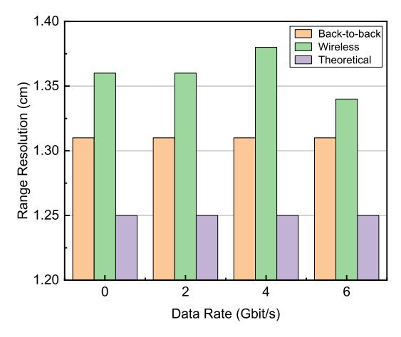

Fig. 8. Theoretical and experimental range resolution performance versus the data rate embedded into the LFM carriers.

the main lobe of the autocorrelation profile. The experimental and theoretical range resolution is analyzed and shown in Fig. [8.](#page-5-0) When the data rate is 0 Gbit/s, which is actually an unmodulated pure LFM waveform, the ideally obtainable range resolution is 1.25 cm for theoretical analysis, which is experimentally measured to be 1.31 and 1.36 cm in back-toback and wireless transmission cases, respectively. The slight degradation in the experiment is due to the limited system bandwidth broadening the main lobe of the LFM-BPSK waveform, and thus reducing the range resolution, whereas unlimited system bandwidth is assumed in the theoretical analysis. As the data rate increases, the range resolution stays very stable in the back-to-back and exhibits slight variations after 1 m wireless transmission. We believe this is induced by the time-varying property of the wireless link.

We also analyze the PSLR performance of the LFM-BPSK waveform, which is another key indicator to reveal the sensing ability. The back-to-back results can be seen in Fig. [7,](#page-4-3) and the PSLR increases from 14.5 to 20.9 dB while the BPSK data rate increases. Fig. [9](#page-5-1) displays the PSLR results in theoretical analysis, back-to-back, as well as wireless transmission. We can notice that when the data rate varies from 0 to 6 Gbit/s, the PSLR of the generated LFM-BPSK signals can increase by more than 5 dB in both the back-to-back and the wireless cases. The reason is that the LFM-BPSK waveform becomes more random as the data rate increases. In this context, as long as meeting the restriction of *Rb* ≤ *B*, an appropriate increment of data rate will bring some PSLR gain, which is beneficial to reduce the masking effect of strong targets. Note that the experimental PSLR performance of integrated waveform suffers from deterioration compared with theoretical analysis, which is caused by the non-ideal response of system components and interference from the environment.

To further verify the practical sensing performance of the proposed waveform, as shown in Fig. [10\(a\),](#page-5-2) two static metal targets with a size of 11 × 10 cm are placed on a fixed platform and separated approximately by 2.0 cm in range direction, in order to measure sensing resolution. The distance between the antenna pairs and the reference target is set as 50.0 cm, and both the transceiver and the targets standstill. Fig. [10\(b\)](#page-5-2)

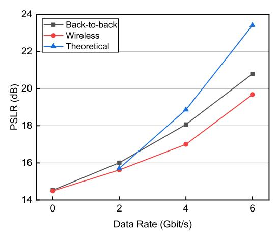

Fig. 9. PSLR performance versus the data rate embedded into the LFM carriers.

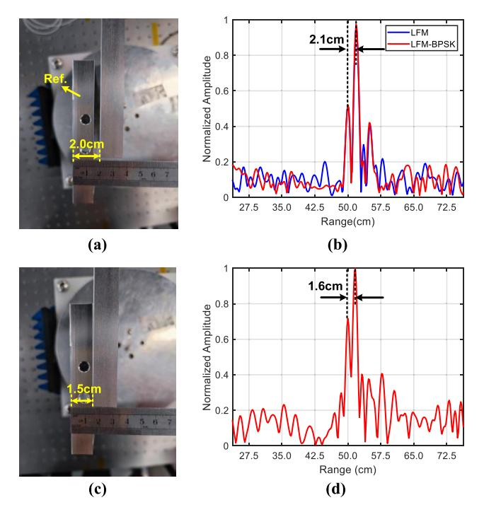

Fig. 10. Practical targets and the measured radar range profile for two adjacent targets with different distances. (a) and (b) are 2.0 cm. (c) and (d) are 1.5 cm.

shows the obtained range profile. As can be seen, after a digitally matched filter, there are two clear peaks separated by 2.1 cm, which is close to the actual value of 2 cm. Moreover, the sidelobe level of the proposed LFM-BPSK waveform is quite lower than a traditional LFM waveform, exhibiting the superiority of such a waveform. Note that there is a strong peak at around 55 cm in Fig. [10\(b\),](#page-5-2) which could be due to the reflection from the experimental environment. Subsequently, when the targets are moved closer to each other, little by little, the two metal targets can still be distinguished clearly for the measured distance of 1.6 cm, resulting in a 0.1 cm measurement error to the actual value of 1.5 m. Therefore, a range resolution of 1.5 cm is successfully achieved, which is close to the theoretical 1.3 cm range resolution of the proposed LFM-BPSK waveform with 12 GHz bandwidth.

TABLE I COMPARISON BETWEEN REPRESENTATIVE DEMONSTRATIONS AND OUR SCHEME IN TERMS OF SENSING PERFORMANCE

| Ref.         | Method   | Operation frequency (GHz) | PSLR (dB) | Theoretical resolution (cm) | Minimum measured distance (cm) |
|--------------|----------|---------------------------------|--------------|-----------------------------|-----------------------------------------|
| [8]          | TDM      | 340                             | ~13.0        | 1.58                        | 10.0                                    |
| [13]         | OFDM     | 28                              | 14.5         | 30.0                        | 176.0                                   |
| [14]         | OFDM     | 24                              | 13.0         | 7.5                         | /                                       |
| [15]         | DSS      | 24                              | 20.0         | 7.5                         | /                                       |
| [16]         | DSS      | 35                              | 12.1         | 3.0                         | 3.53                                    |
| [17]         | LFM-ASK  | 22                              | 9.5          | 1.8                         | 2.0                                     |
| [18]         | LFM-OFDM | 60                              | 15.0         | 1.5                         | 1.58                                    |
| [25]         | FDM      | 100                             | ~14.0        | 15.0                        | 28.8                                    |
| [26]         | FDM      | 94.5                            | ~15.0        | 3.0                         | 18.0                                    |
| [27]         | OFDM     | 140                             | 13.7         | 1.5                         | /                                       |
| This work | LFM-BPSK | 330                             | 20.9         | 1.3                         | 1.5                                     |

Table [I](#page-6-0) summarizes some representative ISAC system demonstrations recently reported to the best of our knowledge, with respect to the sensing performance. Most efforts have been placed to develop multiplexing schemes, such as TDM and FDM, with additional resource overhead. Furthermore, the existing integrated waveforms, such as radar-centric DSS and LFM-based waveforms do not yet achieve impressive sensing metrics in PSLR and range resolution, and the performance on both PSLR and the range resolution in our proposed scheme presents the best so far.

# *B. Communication Performance of LFM-BPSK Waveform and Data Rate Optimization*

Furthermore, we also evaluate the communication performance based on the integrated LFM-BPSK waveform. In the digital domain, the sampled IF signal is first down-converted to the baseband through a digital LFM carrier removal process. Then after applying a digital current blocking, functional blocks, such as IQ imbalance compensation, and a lowpass filter are used to estimate the phase angle for recovering the transmitted communication symbols embedded into the phase-domain of LFM carriers. The BER performance is estimated by measuring the *Q*-factor of the demodulated phase angle [\[28\],](#page-8-7) [\[29\], w](#page-8-8)hen the UTC-PD photocurrent is fixed at 3 mA with different data rates. The transmission BER of data rates of 2, 4, and 6 Gbit/s is shown in Fig. [11.](#page-6-1) It can be seen that the BER performance becomes worse as the data rate increases in both cases of a back-to-back and 1 m wireless transmission, due to the deterioration of received SNR at a fixed output THz power. Moreover, the measured BER in all cases stays below the hard-decision forward error correction (HD-FEC) threshold with 7% overhead, which confirms the proposed waveform can support the integration of communication and sensing, with a special advantage on the radar-centric applications. It should be noted that the narrow beamwidth of the THz waveform could mitigate the clutter and multipath effect [\[30\], w](#page-8-9)hile easily causing the misalignment of the

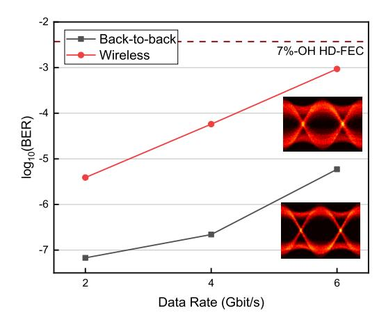

Fig. 11. BER performance versus the data rate embedded into the LFM carriers.

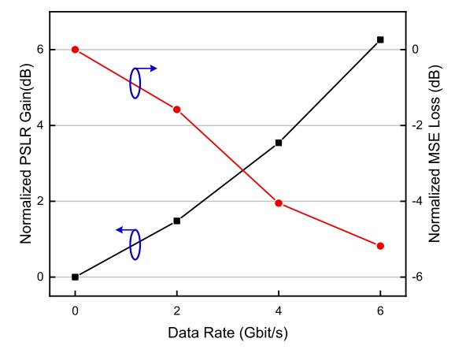

Fig. 12. Normalized PSLR and range estimation MSE versus the data rates embedded into the LFM carriers.

transceiver in a movement environment where compensation algorithms would be needed [\[31\], \[32\].](#page-8-11)

According to the results above, the data rate embedded into the LFM carriers has a significant impact on the LFM-BPSK waveform, and the waveform can be optimally designed to provide the most adequate performance. Specifically, the higher the data rate, the better PSLR, with compromised CRLB. Fig. [12](#page-6-2) shows the measured PSLR and the range estimation mean square error (MSE), both of which are normalized by the corresponding unmodulated LFM waveform. We can see that the range estimation error increases rapidly with the growing data rate, but tends to slow down when it exceeds 4 Gbit/s, which is consistent with the analysis in Fig. [3.](#page-3-0) Moreover, the PSLR performance increases more rapidly than the range estimation MSE. According to the optimization revealed in [\(11\)](#page-3-1), the optimized data rate for our experimental setup reaches 6 Gbit/s.

#### *C. Comparison Between LFM-PSK and LFM-ASK Waveform*

Additionally, we also conduct the wireless transmission of the LFM-ASK waveform to reveal the difference between these two integrated waveforms on the photonic THz platform. The basic concept of the LFM-ASK waveform has been discussed extensively in [\[17\]. T](#page-7-16)he experimental setup is similar

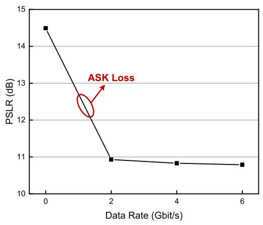

Fig. 13. PSLR performance versus the data rate of the LFM-ASK waveform.

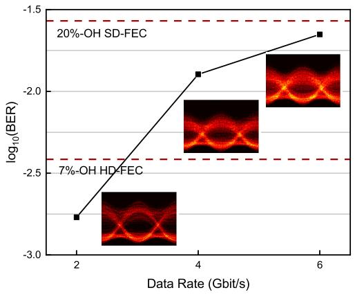

Fig. 14. BER performance and the eye diagram versus the data rate of the LFM-ASK waveform.

to the one in Fig. [4,](#page-4-0) except that the signal generated by the AWG is replaced by the LFM-ASK waveform and the communication symbols are recovered by using a digital envelop detector. It can be seen in Fig. [13,](#page-7-17) that the PSLR of the LFM-ASK waveform is roughly stable at ∼11 dB, and slightly decreases due to the reduction of SNR. Compared with the unmodulated LFM waveform, about 3 dB PSLR loss is induced by the ASK modulation, which makes it more robust for an environment with slight interference. In the case of the LFM-PSK waveform, the embedding of communication symbols will not deteriorate the envelope of LFM waveforms, and as a benefit, the randomness of the symbols might reduce the sidelobe level, while the sensing accuracy will not deteriorate marginally.

Also, we measure the BER performance of the LFM-ASK waveform with different data rates. Fig. [14](#page-7-18) presents the measured BER and the eye diagram at 2, 4, and 6 Gbit/s, respectively, and all the data rate performance can reach below the soft decision forward-error-correction (SD-FEC) threshold. However, the BER performance of the LFM-ASK waveform is about two orders of magnitude worse than that of the LFM-PSK waveform.

# V. CONCLUSION

In summary, a photonic ISAC system based on an LFM-PSK waveform is proposed and experimentally demonstrated to achieve high PSLR performance with a cm-scale precise range resolution at 330 GHz band. The waveform integration is implemented by embedding the communication symbols into the phase-domain of the LFM waveform, to randomize traditional LFM waveform and acquire PSLR gain. Both theoretical analysis and a proof-of-concept experiment have been carried out and we experimentally achieve up to 20.9 dB PSLR and 1.3 cm range resolution, with 6 Gbit/s data rate transmission over a 1 m wireless link. A PSLR gain brought by the increment of data rate is experimentally confirmed without range resolution degradation. The proposed approach has the potential to deal with the issue of strong targets masking effect in radar-centric scenarios and is a promising candidate for further THz-ISAC systems.

#### REFERENCES

- [\[1\]](#page-0-0) Z. Chen et al., "Terahertz wireless communications for 2030 and beyond: A cutting-edge frontier," *IEEE Commun. Mag.*, vol. 59, no. 11, pp. 66–72, Nov. 2021.
- [\[2\]](#page-0-1) A. R. Chiriyath, B. Paul, and D. W. Bliss, "Radar-communications convergence: Coexistence, cooperation, and co-design," *IEEE Trans. Cognit. Commun. Netw.*, vol. 3, no. 1, pp. 1–12, Mar. 2017.
- [\[3\]](#page-0-2) C. Chaccour, M. N. Soorki, W. Saad, M. Bennis, P. Popovski, and M. Debbah, "Seven defining features of terahertz (THz) wireless systems: A fellowship of communication and sensing," *IEEE Commun. Surveys Tuts.*, vol. 24, no. 2, pp. 967–993, 2nd Quart., 2022.
- [\[4\]](#page-0-3) X. Yu et al., "160 Gbit/s photonics wireless transmission in the 300–500 GHz band," *APL Photon.*, vol. 1, no. 8, Nov. 2016, Art. no. 081301.
- [\[5\]](#page-0-4) H. Zhang et al., "Tbit/s multi-dimensional multiplexing THz-over-fiber for 6G wireless communication," *J. Lightw. Technol.*, vol. 39, no. 18, pp. 5783–5790, Sep. 2021.
- [\[6\]](#page-0-5) Z. Yang et al., "Robust photonic terahertz vector imaging scheme using an optical frequency comb," *J. Lightw. Technol.*, vol. 40, no. 9, pp. 2717–2723, May 1, 2022.
- [\[7\]](#page-0-6) S. Pan and Y. Zhang, "Microwave photonic radars," *J. Lightw. Technol.*, vol. 38, no. 19, pp. 5450–5484, Oct. 1, 2020.
- [\[8\]](#page-0-7) Y. Wang et al., "Integrated high-resolution radar and long-distance communication based-on photonic in terahertz band," *J. Lightw. Technol.*, vol. 40, no. 9, pp. 2731–2738, May 1, 2022.
- [\[9\]](#page-0-8) S. Melo et al., "Dual-use system combining simultaneous active radar & communication, based on a single photonics-assisted transceiver," in *Proc. 17th Int. Radar Symp. (IRS)*, May 2016, pp. 1–4.
- [\[10\]](#page-0-9) S. Jia et al., "A unified system with integrated generation of highspeed communication and high-resolution sensing signals based on THz photonics," *J. Lightw. Technol.*, vol. 36, no. 19, pp. 4549–4556, Oct. 2018.
- [\[11\]](#page-1-1) F. Liu et al., "Integrated sensing and communications: Toward dualfunctional wireless networks for 6G and beyond," *IEEE J. Sel. Areas Commun.*, vol. 40, no. 6, pp. 1728–1767, Jun. 2022.
- [\[12\]](#page-1-2) T. Umezawa, K. Jitsuno, A. Kanno, N. Yamamoto, and T. Kawanishi, "30-GHz OFDM radar and wireless communication experiment using radio over fiber technology," in *Proc. Prog. Electromagn. Res. Symp. Spring (PIERS)*, May 2017, pp. 3098–3101.
- [\[13\]](#page-1-3) L. Huang, R. Li, S. Liu, P. Dai, and X. Chen, "Centralized fiberdistributed data communication and sensing convergence system based on microwave photonics," *J. Lightw. Technol.*, vol. 37, no. 21, pp. 5406–5416, Nov. 1, 2019.
- [\[14\]](#page-1-4) Z. Xue, S. Li, J. Li, X. Xue, X. Zheng, and B. Zhou, "Tunable K/W-band OFDM integrated radar and communication system based on optoelectronic oscillator for intelligent transportation," *Opt. Exp.*, vol. 30, no. 20, pp. 35270–35281, Sep. 2022.
- [\[15\]](#page-1-5) Z. Xue, S. Li, X. Xue, X. Zheng, and B. Zhou, "Photonics-assisted joint radar and communication system based on an optoelectronic oscillator," *Opt. Exp.*, vol. 29, no. 14, pp. 22442–22454, Jul. 2021.
- [\[16\]](#page-1-6) W. Bai et al., "Photonic millimeter-wave joint radar communication system using spectrum-spreading phase-coding," *IEEE Trans. Microw. Theory Techn.*, vol. 70, no. 3, pp. 1552–1561, Mar. 2022.
- [\[17\]](#page-1-7) H. Nie, F. Zhang, Y. Yang, and S. Pan, "Photonics-based integrated communication and radar system," in *Proc. Int. Topical Meeting Microw. Photon. (MWP)*, Oct. 2019, pp. 1–4.

- [\[18\]](#page-1-8) W. Bai et al., "Millimeter-wave joint radar and communication system based on photonic frequency-multiplying constant envelope LFM-OFDM," *Opt. Exp.*, vol. 30, no. 15, pp. 26407–26425, Jul. 2022.
- [\[19\]](#page-1-9) M. Bekar, C. J. Baker, E. G. Hoare, and M. Gashinova, "Joint MIMO radar and communication system using a PSK-LFM waveform with TDM and CDM approaches," *IEEE Sensors J.*, vol. 21, no. 5, pp. 6115–6124, Mar. 2021.
- [\[20\]](#page-2-6) R. Xie, K. Luo, and T. Jiang, "Waveform design for LFM-MPSK-based integrated radar and communication toward IoT applications," *IEEE Internet Things J.*, vol. 9, no. 7, pp. 5128–5141, Apr. 2022.
- [\[21\]](#page-2-7) J. S. Kulpa, L. Maslikowski, and M. Malanowski, "Filter-based design of noise radar waveform with reduced sidelobes," *IEEE Trans. Aerosp. Electron. Syst.*, vol. 53, no. 2, pp. 816–825, Apr. 2017.
- [\[22\]](#page-2-8) B. Paul, A. R. Chiriyath, and D. W. Bliss, "Joint communications and radar performance bounds under continuous waveform optimization: The waveform awakens," in *Proc. IEEE Radar Conf. (RadarConf)*, May 2016, pp. 865–870.
- [\[23\]](#page-2-9) R. Senanayake, P. J. Smith, T. Han, J. Evans, W. Moran, and R. Evans, "Frequency permutations for joint radar and communications," *IEEE Trans. Wireless Commun.*, vol. 21, no. 11, pp. 9025–9040, Nov. 2022.
- [\[24\]](#page-2-10) H. L. Trees, *Detection, Estimation, and Modulation Theory: Part III. Radar-Sonar Signal Processing and Gaussian Signal in Noise*. Hoboken, NJ, USA: Wiley, 2001.
- [\[25\]](#page-0-10) R. Song and J. He, "OFDM-NOMA combined with LFM signal for W-band communication and radar detection simultaneously," *Opt. Lett.*, vol. 47, no. 11, pp. 2931–2934, May 2022.
- [\[26\]](#page-0-10) Y. Wang et al., "Joint communication and radar sensing functions system based on photonics at the W-band," *Opt. Exp.*, vol. 30, no. 8, pp. 13404–13415, Apr. 2022.
- [\[27\]](#page-0-10) O. Li et al., "Integrated sensing and communication in 6G a prototype of high resolution THz sensing on portable device," in *Proc. Joint Eur. Conf. Netw. Commun. 6G Summit (EuCNC/6G Summit)*, Jun. 2021, pp. 544–549.
- [\[28\]](#page-6-3) I. Shake, H. Takara, and S. Kawanishi, "Simple Q factor monitoring for BER estimation using opened eye diagrams captured by high-speed asynchronous electrooptical sampling," *IEEE Photon. Technol. Lett.*, vol. 15, no. 4, pp. 620–622, Apr. 2003.
- [\[29\]](#page-6-4) H.-J. Song, J.-Y. Kim, K. Ajito, M. Yaita, and N. Kukutsu, "Fully integrated ASK receiver MMIC for terahertz communications at 300 GHz," *IEEE Trans. THz Sci. Technol.*, vol. 3, no. 4, pp. 445–452, Jul. 2013.
- [\[30\]](#page-6-5) T. Mao, J. Chen, Q. Wang, C. Han, Z. Wang, and G. K. Karagiannidis, "Waveform design for joint sensing and communications in millimeterwave and low terahertz bands," *IEEE Trans. Commun.*, vol. 70, no. 10, pp. 7023–7039, Oct. 2022.
- [\[31\]](#page-6-6) V. Petrov, D. Moltchanov, Y. Koucheryavy, and J. M. Jornet, "Capacity and outage of terahertz communications with user micro-mobility and beam misalignment," *IEEE Trans. Veh. Technol.*, vol. 69, no. 6, pp. 6822–6827, Jun. 2020.
- [\[32\]](#page-6-7) W. Chen, L. Li, Z. Chen, T. Quek, and S. Li, "Enhancing THz/mmWave network beam alignment with integrated sensing and communication," *IEEE Commun. Lett.*, vol. 26, no. 7, pp. 1698–1702, Jul. 2022.

Zhidong Lyu received the B.S. degree from Central South University, Changsha, China, in 2021. He is currently pursuing the Ph.D. degree at the College of Information Science and Electronic Engineering, Zhejiang University, Hangzhou, China.

His current research interests include THz integrated sensing and communication technologies.

Lu Zhang (Member, IEEE) received the bachelor's degree from Southeast University, Nanjing, China, in 2014, and the Ph.D. degree from Shanghai Jiao Tong University, Shanghai, China, in 2019.

From 2016 to 2017, he was a Visiting Ph.D. Student with the KTH Royal Institute of Technology, Stockholm, Sweden, sponsored by China Scholarship Council. Since 2018, he has been a Visiting Research Engineer with the KTH Royal Institute of Technology and Kista High-Speed Transmission Laboratory, RISE Research Institutes of Sweden, Stockholm. He is currently a Research Professor with the College of Information Science and Electronic Engineering, Zhejiang University, Hangzhou, China. His research interests include ultrafast THz communications, fiber-optic communications, digital signal processing algorithms for optical, and THz transmission systems.

Hongqi Zhang, photograph and biography not available at the time of publication.

Zuomin Yang, photograph and biography not available at the time of publication.

Hang Yang, photograph and biography not available at the time of publication.

Nan Li, photograph and biography not available at the time of publication.

Lianyi Li, photograph and biography not available at the time of publication.

Vjaceslavs Bobrovs ˇ , photograph and biography not available at the time of publication.

Oskars Ozolins, photograph and biography not available at the time of publication.

Xiaodan Pang (Senior Member, IEEE) received the M.Sc. degree from the KTH Royal Institute of Technology, Stockholm, Sweden, in 2010, and the Ph.D. degree from the DTU Fotonik, Technical University of Denmark, Kongens Lyngby, Denmark, in 2013.

He was a Post-Doctoral Researcher with the RISE Research Institutes of Sweden, Stockholm, from October 2013 to March 2017, formerly ACREO Swedish ICT and was a Researcher with the KTH Optical Networks Laboratory (ONLab), Stockholm, from March 2017 to February 2018. From March 2018 to February 2020, he was a Staff Opto Engineer and a Marie Curie Research Fellow with Infinera Corporation, San Jose, CA, USA. Since March 2020, he has been a Senior Researcher with the Department of Applied Physics, KTH Royal Institute of Technology. He has authored or coauthored more than 190 publications in journals and conferences. He has been the PI of a Swedish Research Council Starting Grant, EU H2020 Marie Curie Individual Fellowship Project NEWMAN, and a Swedish SRA ICT-TNG Post-Doctoral Project. His research interests include ultrafast communications with millimeter-wave/terahertz free-space optics, and fiber optics.

Dr. Pang has been a TPC Member of in total of 19 conferences, including OFC 2020–2022, ACP 2018–2020, and GLOBECOM 2020–2021. He is a Senior Member of OSA and a Board Member of IEEE Photonics Society Sweden Chapter.

Xianbin Yu (Senior Member, IEEE) received the Ph.D. degree from Zhejiang University, Hangzhou, China, in 2005.

From 2005 to 2007, he was a Post-Doctoral Researcher with Tsinghua University, Beijing, China. Since November 2007, he has been with the DTU Fotonik, Technical University of Denmark, Kongens Lyngby, Denmark, where he became an Assistant Professor in 2009 and was promoted to a Senior Researcher in 2013. He is currently a Professor with Zhejiang University. He has coauthored more than 180 peer-reviewed international journal and conference papers within the fields of microwave photonics and optical fiber communications. His research interests include mm-wave/THz photonics and its applications, THz communications, ultrafast photonic RF signal processing, and high-speed photonic wireless access technologies.

Dr. Yu has given more than 40 invited conference presentations and was the session chair/TPC member of a number of international conferences.