## 运动探测及可见光通信一体化氮化物光电子芯片

冯萧萧 韩明宇 陈美鹏 方倩 王永进 李欣

#### **Integrated Nitride optoelectronic chip for motion detection and visible light communication**

FENG Xiao-xiao, HAN Ming-yu, CHEN Mei-peng, FANG Qian, WANG Yong-jin, LI Xin

#### 引用本文:

冯萧萧,韩明宇,陈美鹏,方倩,王永进,李欣. 运动探测及可见光通信一体化氮化物光电子芯片[J]. [中国光学](http://www.chineseoptics.net.cn), 2023, 16(5): 1257-1272. doi: 10.37188/CO.2023-0028

FENG Xiao-xiao, HAN Ming-yu, CHEN Mei-peng, FANG Qian, WANG Yong-jin, LI Xin. Integrated Nitride optoelectronic chip for motion detection and visible light communication[J]. [Chinese Optics](http://www.chineseoptics.net.cn), 2023, 16(5): 1257-1272. doi: 10.37188/CO.2023-0028

在线阅读 View online: [https://doi.org/10.37188/CO.2023-0028](http://www.chineseoptics.net.cn/cn/article/doi/10.37188/CO.2023-0028)

## 您可能感兴趣的其他文章

**Articles you may be interested in**

## [大视场空间可见光相机的杂散光分析与抑制](http://www.chineseoptics.net.cn/cn/article/doi/10.3788/CO.20191203.0678)

Analysis and suppression of space stray light of visible cameras with wide field of view 中国光学(中英文). 2019, 12(3): 678 https://doi.org/10.3788/CO.20191203.0678

#### [ZnO纳米棒/CdS量子点的制备及紫外-可见探测性能研究](http://www.chineseoptics.net.cn/cn/article/doi/10.3788/CO.20191206.1271)

Fabrication of ZnO nanorods/CdS quantum dots and its detection performance in UV-Visible waveband 中国光学(中英文). 2019, 12(6): 1271 https://doi.org/10.3788/CO.20191206.1271

#### [空间激光通信最新进展与发展趋势](http://www.chineseoptics.net.cn/cn/article/doi/10.3788/CO.20181106.0901)

Latest developments and trends of space laser communication 中国光学(中英文). 2018, 11(6): 901 https://doi.org/10.3788/CO.20181106.0901

## [二次成像型库德式激光通信终端粗跟踪技术](http://www.chineseoptics.net.cn/cn/article/doi/10.3788/CO.20181104.0644)

Coarse tracking technology of secondary imaging Coude-type laser communication terminal 中国光学(中英文). 2018, 11(4): 644 https://doi.org/10.3788/CO.20181104.0644

#### [星载激光通信技术研究进展](http://www.chineseoptics.net.cn/cn/article/doi/10.3788/CO.20191206.1260)

Progress of research on satellite-borne laser communication technology 中国光学(中英文). 2019, 12(6): 1260 https://doi.org/10.3788/CO.20191206.1260

#### [空间引力波探测中的绝对距离测量及通信技术](http://www.chineseoptics.net.cn/cn/article/doi/10.3788/CO.20191203.0486)

Laser ranging and data communication for space gravitational wave detection 中国光学(中英文). 2019, 12(3): 486 https://doi.org/10.3788/CO.20191203.0486 文章编号 2097-1842(2023)05-1257-16

## **Integrated Nitride optoelectronic chip for motion detection and visible light communication**

FENG Xiao-xiao1,HAN Ming-yu1,CHEN Mei-peng1,FANG Qian1,WANG Yong-jin1,LI Xin1,2 \*

- (1. *GaN Optoelectronic Integration International Cooperation Joint Laboratory of Jiangsu Province*, *College of Telecommunications and Information Engineering*, *Nanjing University of Posts and Telecommunications*, *Nanjing* 210003, *China*;
- 2. *Key Laboratory of Broadband Wireless Communication and Sensor Network Technology*, *Ministry of Education*, *Nanjing University of Posts and Telecommunications*, *Nanjing* 210023, *China*) \* *Corresponding author*,*E-mail*: *lixin*1984*@njupt.edu.cn*

**Abstract**: The movement of objects is everywhere in nature. With the rapid development of smart vehicle and 6G mobile communications, the demand for highly Integrated Sensing and Communication (ISAC) devices with communication and motion sensing is increasing. Based on the coexistence of luminescence and detection characteristics of GaN multiple quantum wells, an integrated optoelectronic chip based on the epitaxial GaN multiple quantum wells material on sapphire substrate with sensitive motion detection and visible light communication. The transmitter of the optoelectronic chip transmits a visible light signal in blue band to the moving target object. The visible light signal modulated by the motion of the target object is reflected back to the receiver of the chip to stimulate the changing photocurrent. By analyzing the changing photocurrent, the motion of the target object rotating at different speeds can be detected. The change period of the photocurrent curve is consistent with the rotation period of the target object. We also study the optoelectronic characteristics and the visible light communication performance of the optoelectronic chip. This chip can be used as transceiver terminal of visible light communication system and can also process and transmit the motion detection signals collected by the chip. The optoelectronic chip based on GaN multiple quantum wells materials is a highly integrated ISAC terminal device with application value.

**Key words**: motion detection; multiple quantum wells; III-nitride; optoelectronic chips; visible light communication

收稿日期:2023-02-13;修订日期:2023-03-14

## 运动探测及可见光通信一体化氮化物光电子芯片

冯萧萧1,韩明宇1,陈美鹏1,方 倩1,王永进1,李 欣1,2 \*

- (1. 南京邮电大学 通信与信息工程学院 江苏省氮化镓光电子集成国际合作联合实验室, 江苏 南京 210003;
  - 2. 南京邮电大学 宽带无线通信与传感网技术教育部重点实验室, 江苏 南京 210003)

摘要:在自然界中,物体运动无处不在,随着智能汽车、6G 移动通信的高速发展,对通信和运动探测传感融合的高集成度 通感一体器件的需求日益增加。本文基于氮化镓多量子阱结构发光和探测并存的特点,提出了一种基于蓝宝石衬底外 延生长氮化镓多量子阱材料的集成式光电子芯片,该芯片具有灵敏的运动探测功能及可见光通信功能。该光电子芯片 发射器向运动的目标物体发射蓝光波段可见光信号,经目标物体运动调制的可见光信号反射回光电子芯片的接收器部 分,激发变化的光电流。通过分析接收器的光电流变化,可探测以不同速度旋转的目标物体的运动情况,光电流曲线变 化周期与目标物体旋转周期一致。本文还研究了光电子芯片的各项光电指标及可见光通信性能,该芯片可用作可见光 通信系统的收发终端,可以处理和传输芯片采集到的运动探测信号。基于氮化镓多量子阱材料的光电子芯片是一种具 有实用价值的高集成度通感一体终端器件。

关键词:运动探测;多量子阱;三族氮化物;光电子芯片;可见光通信

中图分类号:TN256 文献标志码:A **doi**:[10.37188/CO.2023-0028](https://doi.org/10.37188/CO.2023-0028)

## 1 Introduction

Integrated Sensing and Communication (ISAC) refers to the integration of communication technology and sensing technology, which realizes the perception of the environment while communicating, and uses a single terminal to provide complex functions. Environmental perception technology is a kind of essential technology for ISAC applications such as autopilot driving, Internet of Things (IoT), smart city and other adaptive intelligent systems[\[1-](#page-15-0)[2\]](#page-15-1) . For the perception technology, the non-contact environmental perception ability is of critical importance. This technology has the characteristics of high sensitivity, various application scenarios, and nondestructive and non-interference detection[\[3](#page-15-2)[-4](#page-15-3)] . Noncontact motion detection technology has great application potential in security systems, IoT healthcare, autopilot, and other fields[[5-](#page-15-4)[7\]](#page-16-0) .

Traditional motion detection technology, including radar[[8\]](#page-16-1) and (Light Detection and Ranging, LiDAR)[\[9](#page-16-2)[-10](#page-16-3)] , is mainly used for motion tracking of large moving objects in a large field of view. Radar and LiDAR use the echo principle to analyze the flight time of the pulse by transmitting microwave or laser pulses and receiving echoes reflected from the surface of the target object, thereby obtaining the spatial position and motion of the object. It is more difficult to achieve the real-time object tracking because radar takes longer time to track the target object due to the need for full field of view detection scanning. LiDAR locates objects by laser pulses and therefore has a faster response time. However, both radar and LiDAR have high cost. In contrast, moving object tracking based on imaging technology has lower cost. Images of moving objects can be obtained by using imaging systems. The spatial location and motion information of target objects can be extracted from the images by using image processing and analysis algorithms. However, due to the factors such as relative displacement and motion blur, it is more difficult for imaging systems to simultaneously achieve high spatial resolution, high temporal resolution, and high signal-to-noise ratio[[10\]](#page-16-3) . Each of the above motion detection techniques has its own advantages and limitations, so it is of application value and scientific significance to

study new methods of accurate and reliable noncontact environmental motion perception, such as new techniques of environmental perception using visible light signals.

Motion detection techniques using visible light signals and LiDAR are based on similar physical principles, both of which realize motion detection by detecting the modulation of light signals by the target object. The difference being that the medium of the visible light signal is ordinary Gaussian light rather than a laser, resulting in lower power consumption, better environmental adaptability, smaller size, and lower cost. Abuella H and Ekin S of Oklahoma State University, USA, studied visible light motion detection systems for vehicle speed measurement and indoor localization by using Light Emitting Diode (LED) headlights of automobiles and interior lighting as light sources[[11-](#page-16-4)[13](#page-16-5)] . The motion detection systems in the above studies require a separate light source and a network of photodetectors, so there are still some challenges, such as system size, high cost, and limited application scenarios.

As a third-generation semiconductor, nitride materials have excellent optical, electrical, mechanical and piezoelectric properties. By varying the content of In, Ga, and Al in the material system and modulating the band gap of nitride materials, optical signals covering the UV, visible, and nea[r-](#page-16-6)[in](#page-16-7)frared wavelength can be transmitted or detected[\[14](#page-16-6)-[15\]](#page-16-7) . Nitride multiple quantum wells materials have superior optoelectronic properties compared to bulk nitride materials and also have an integrated function of light-emitting and detection. Lin Chen of Huazhong University of Science and Technology integrated light emitting diodes and photodetectors on a single photonic chip based on multiple quantum well materials, and developed a single integrated LED and photodiode (PD) chip, which can be used as both a light transmitter and a detector, and can detect changes in the signal of cardi[ac](#page-16-8) pulses without relying on external photodetectors[\[16](#page-16-8)] . Aihua Zhong of Shenzhen University realized a capacitive hydrogen gas sensor using GaN (gallium nitride) material with honeycomb nanonetwork structure epitaxially grown on silicon substrate, which has the advantages of high safety and low energy consumption and it is an ideal device for hydrogen gas detection[\[17\]](#page-16-9) . Shuai Zhang of Nanjing University of Posts and Telecommunications implemented sensors by the piezoelectric effect of thin-film light-emitting diodes, these sensors were used for non-contact air flow detection, including flow sensing, pressure sensing, and environmental detection[\[18](#page-16-10)] . The above study broadens the application scenario of III-nitride photonic integrated chip for non-contact visible light sensing and detection. Qingxi Yin in our group prepared multiple quantum wells diode devices with the same structure on a single optoelectronic chip as light-emitting and detecting devices, respectively. They built a free-space reverse optical communication system and explored the integrated chip for visible light communication and sensing[\[19](#page-16-11)] . All these studies present that GaN optoelectronic chips have superior performance and promising development in ISAC and environmental detection.

In this paper, an optoelectronic integrated chip with integrated transceiver function for visible light signals in the blue band is developed by using the co-existence of luminescence and detection characteristics of III-nitride multiple quantum wells structure. The nondestructive motion detection and stable visible light communication are realized using this chip. The visible light signal from the transmitter of this optoelectronic chip is modulated by the motion of the target object and reflected back to the receiver of the optoelectronic chip. By detecting the change of photocurrent of the receiver, the motion of the target object rotating at different speeds can be detected. In addition, the optoelectronic characteristics and visible light communication performance of the chip are also investigated. The study provides a valuable method for the application of optoelectronic integrated chips in the field of optical motion detection and communication with low cost, low power consumption and high integration. Finally, an integrated ISAC terminal device with application value was developed.

# 2 Design and fabrication of optoelectronic chips

# 2.1 Working principle and fabrication process of optoelectronic chip

As shown in Figure 1(a) (color online), under the forward bias, the nitride multiple quantum well diode device excites photons and transmits visible light signals, as a transmitter. When the diode device of the same structure is applied with reverse bias, the nitride multiple quantum wells transforms into photoelectric detection mode and absorbs the incident photons to excite electron-hole pairs and works as a receiver. Thus the diode device realizes the electro-optic/optical-electro bi-directional energy and information conversion in the homogeneous integrated system. The layered structure of the III-nitride multiple quantum wells material used in this study is shown in Figure 1(b) (color online). The nitride epitaxial layer, including buffer layer, n-GaN layer, Multiple Quantum Wells (MQWs) layer and p-GaN layer. The bottom substrate is a patterned sapphire substrate. The patterned substrate can compensate the material defects caused by the different lattice constants and thermal expansion coefficients of sapphire substrate and nitride epitaxial layer, and improve the performance of optoelectronic chips. As a high-reflectance mirror for a specific wavelength, the Distributed Bragg Reflection (DBR) is formed by periodic alternating layers of silicon dioxide (SiO2) and titanium dioxide (TiO2). The thickness and period of the DBR are determined by the target wavelength, and the optical thickness of each layer is 1/4 of the target wavelength, which can reduce the leakage of optical signals and improve the optical performance of optoelectronic chips.

As shown in Figure 2(a), we designed a III-ni-

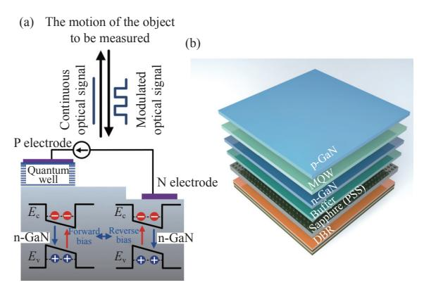

Fig. 1 (a) GaN materials with multiple quantum wells can realize the bi-directional conversion of optoelectronic/ electro-optic signals; (b) layered structure of III-nitride materials with multiple quantum wells

图 1 (a) 可实现光电/电光信号双向转换带有多量子阱结构的 GaN 材料; (b) III 族氮化物多量子阱材料的分层结构

tride optoelectronic chip with a diode device in the center being used as a visible light signal transmitter. The surrounding diode devices in the chip were used as visible light signal receivers to facilitate the use of a larger number of receivers to collect the modulated light signals in a composite manner, for a larger photocurrent detection signal. However, when the actual motion detection system was used, we found that using four receivers at the same time made it difficult to adjust the reflected light path and thus result the uniform coverage of the modulated light signal to the four receivers. In addition, the photo currents between the four receivers connected in the peripheral circuit would cause crosstalk. Finally, after considering the feasibility of the optical path adjustment of the test system and the stability of the test results, one transmitter and one receiver were used for one-to-one testing in the experiment. As shown in Figure 2(b), a positive bias is applied to the transmitter by the signal generator, and the transmitter achieves electro-optical conversion and transmits a visible light signal in blue band to the surface of the target object, and the visible light signal modulated by the motion of the target object is reflected back to a receiver at the corners of the chip. When the receiver is applied negative bias, the modulated visible light signal will be output as a

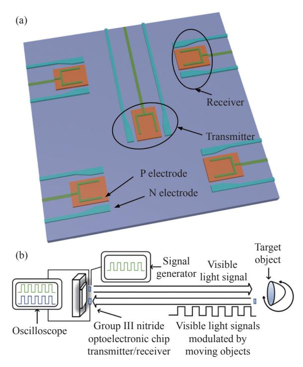

Fig. 2 (a) Schematic diagram of III-nitride optoelectronic chip and its (b) schematic diagram of motion detection system

图 2 (a) III 族氮化物光电子芯片示意图及其 (b) 运动探 测系统示意图

photocurrent signal by photoelectric conversion, and the motion detection of the target object can be achieved through the monitoring of photocurrent by the optoelectronic chip.

The fabrication process of III-nitride optoelectronic chips using standard semiconductor processes is shown as [Fig.3](#page-5-1) (color online). (a) The patterns of the transmitter's light-emitting region and the receiver's detection region are defined on the photoresist layer by photolithography, and the pattern is transferred to the nitride epitaxial layer by using Inductively Coupled Plasma (ICP) etching. (b) The patterns of the transmitter and receiver is defined on the photoresist layer using photolithography, and the pattern is transferred to the nitride epitaxial layer by using ICP etching. The overall etch penetrates the nitride epitaxial layer to achieve the electrical isolation of the transmitter and receiver, thus preventing the crosstalk current. (c) Magnetron sputter coating and etching of the Indium Tin Oxide (ITO) layer is completed to form a current

spreading layer on the transmitter and receiver surfaces. (d) is the process for the preparation of Ni/Al/Ti/Pt/Au positive and negative metal electrodes of the transmitter and receiver by using electron-beam evaporation and lift-off techniques. (e) is the process for the preparation of SiO2 films to protect the transmitter and receiver surfaces using electron-beam evaporation. (f) is the process for the preparation of Ni/Al/Ti/Pt/Au lead electrodes for the transmitter and receiver using electron beam evaporation and lift-off techniques.

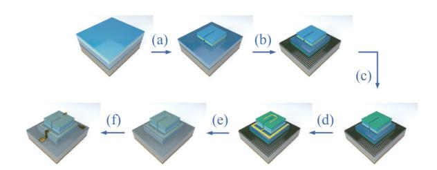

Fig. 3 Fabrication process of III-nitride optoelectronic chip 图 3 III 族氮化物光电子芯片的加工流程图

## 2.2 Morphological characterization of optoelec[tronic ch](#page-5-2)ips

[Figure 4](#page-5-2)(a) shows the overall optical microscope image of the optoelectronic chip. The transmitter and receiver are connected to the circuit board with leads for the electrical connection of [the mo](#page-5-2)tion detection experiment, respectively. [Figure 4](#page-5-2)(b) shows the optical microscope image of

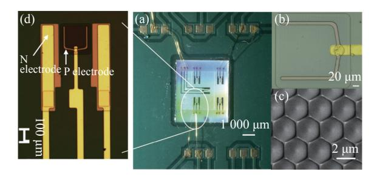

Fig. 4 Morphological images of optoelectronic chip. (a) Overall optical microscope image of optoelectronic chip; (b) optical microscope image of transmitting/ receiving region; (c) SEM image of DBR layer; (d) enlarged optical microscope image of a single transmitter/receiver

图 4 光电子芯片形貌图。(a) 光电子芯片的整体光镜图; (b) 发射/接收区域光镜图;(c) DBR 层电子显微镜 图;(d) 单个发射器/接收器的局部放大光镜图

the transmitting/receiving region, which is a square structure with a side length of 240 μm. [Figure 4](#page-5-2)(c) shows the SEM image of the DBR layer with a microstructure of a hemispherical structure with a period of 2 μm hexagonal arrangement. The DBR layer at the bottom of the sapphire substrate can reduce the visible light signal leakage at the bottom of the chip, enhance the absorption of photons inside the chip, and improve the photoelectric conversion efficiency of the optoelectronic chip. [Figure 4](#page-5-2)(d) shows the enlarged optical microscope image of a single transmitter/receiver, which can clearly show the good fabrication quality of the device.

## 3 Characterization of optoelectronic performance of optoelectronic chips

#### 3.1 Electrical characteristics test

Electrical characterization of optoelectronic chips is tested by an Agilent B1500A semiconductor device analyzer. The transmitter operates at positive bias and the receiver at negative bias. Therefore, the voltage is ranged from −5 V to 5 V. Due to equipment safety restric[tions, the](#page-6-0) measured saturation current is 100 mA. [Figure 5](#page-6-0)(a) shows the current-voltage characteristics of the transmitter/receiver, where the transmitter turns on at 2.5 V and reaches a saturation current of 100 mA at 4.0 V. The differential resistance of the transmitter is calculated from the linear region of the current-voltage (I-V) curve to be about 15 Ω. The negatively biased region generates almost no current, indicating that the receiver has no significant leakage current phenomenon and good performance. The carrier compounding process occurs inside the multiple quantum wells and the transmitter emits visible light signal that is linearly modulated by the bias voltage. The receiver absorbs the visible light signal, then releases electron-hole pairs and generates photocurrent. The good electrical properties guarantee the operational stability of the optoelectronic chip. The capacitance-voltage curve in [Figure 5](#page-6-0)(b) (color online) shows that the transmitter has a negative capacitance behavior in the positive bias voltage interval under AC signals with different frequencies. As the positive bias voltage increases, the capacitance decreases and drops to negative values after the transmitter reaches the turn-on voltage. Reducing the Resistance-Capacitance (RC) time constant (a constant indicating the transition response time, which in the resistor-capacitance circuit of the transmitter is the product of the resistance and the capacitance) can improve the response speed of the transmitter, and the smaller the absolute value of the negative junction capacitance, the smaller the RC time constant. The lower the frequency of the AC signal, the higher the positive bias voltage, and the larger the absolute value of the negative junction capacitance. The absolute value of the negative capacitance of the capacitance-voltage curve is in the pF mag-

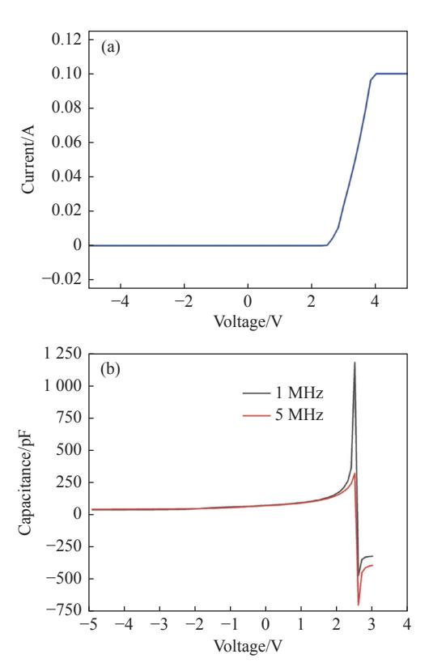

Fig. 5 Electrical characteristics test results. (a) Currentvoltage curve of transmitter/receiver; (b) capacitance-voltage curve of transmitter/receiver

图 5 光电芯片电性能测试结果。(a) 发射器/接收器的电 流-电压 (I-V) 曲线;(b) 电容-电压 (C-V) 曲线

nitude, and the absolute value is very small, indicating that the transmitter has a good response speed and is suitable as a fast-response integrated sensing and communication device.

#### 3.2 Optical characteristic test

[Figure 6](#page-7-0) (color online) shows the electroluminescence spectra and spectral responsivity of the optoelectronic chip measured at different injection currents. The visible light signal was collected at 5 mm from the upper surface of the transmitter using a 200 μm diameter multimode fiber in dark and coupled to an Ocean Optics USB4000 spectrometer for characterization. The five Gaussian distribution curves with different colors in [Figure 6](#page-7-0) are the electroluminescence spectra of the transmitter with different drive currents, and the peak wavelength is at 461.61 nm, which is the visible signal in the blue band. The luminescence intensity of the transmitter gradually increases for currents from 20 μA to 100 μA. The pink curve of the connecting point corresponding to the right axis in [Figure 6](#page-7-0) is the spectral responsivity of the receiver, which is measured by the IQE-200B quantum efficiency measurement system. The light blue region indicated by the arrow is the spectral overlap region between the electroluminescence spectrum and the spectral responsivity. The visible light signal transmitted from the photoelectric chip transmitter can be detected by the receiver on the same chip in the blue light band

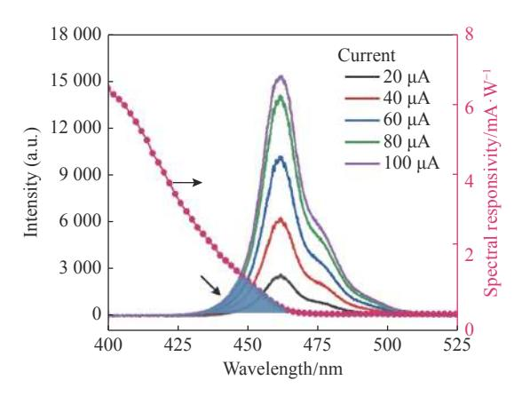

Fig. 6 Electroluminescence (EL) spectrum of transmitter and spectral responsivity of receiver

图 6 光电子芯片发射器的电致发光 (EL) 谱和接收器的 探测谱

from 431 nm to 461 nm, which realizes the single integrated electro-optical/optical-electro conversion of the visible light signal and verifies the feasibility of using a single photoelectric chip to realize the sensing and communication function in principle.

[Figure 7](#page-7-1) shows the luminescence photographs for transmitter under currents of 10 μA, 50 μA, and 100 μA. Different currents were applied through the probe stage by using an Agilent B1500A semiconductor device analyzer in dark. It can be clearly observed that the intensity of the visible light signal in the blue band transmitted by the transmitter intensifies with increasing current. The experimental results show that when the optoelectronic chip is applied to motion detection, increasing the injected current can enhance the intensity of the receiver photocurrent converted by the visible light signal modulated by the object motion to be measured. It indicates that the non-destructive photodetection signal intensity of the optoelectronic chip can be freely and flexibly modulated by the driving current.

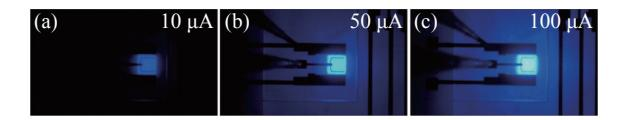

Fig. 7 Luminescence photographs of transmitter with different injected currents

图 7 注入不同电流的发射器发光图片

## 4 Motion detection of optoelectronic chips

The motion detection system of this optoelectronic chip is shown in [Figure 8](#page-8-0), and the main part of the system is the reflective optical path. The reflector is used as the measurement object to perform rotational motion driven by a rotation table. The reflector is a GMH-11-K9 reinforced aluminum standard precision planar reflector with 25.4 mm diameter and 4 mm thickness produced by United Optical Technology, and the base material is finely annealed H-K9L optical glass with a protective UVreflective aluminum film coating. The reflector has

a reflectivity of approximately 90% in visible range. A DC power supply is used to drive the transmitter in positive bias mode to transmit visible light signals in the blue band. A semiconductor parameter analyzer is used to drive the receiver with zero-bias voltage for detecting the visible light signal modulated by the rotational motion of the reflector and converting it into photocurrent for motion detection. A convex lens is set in the middle of reflective optical path to converge the visible light signal. The distance from the optoelectronic chip to the lens is 10 cm, and the distance from the lens to the reflector is 5 cm. The visible light signal transmitted by the calibrated transmitter is focused on the reflector, and the visible light signal modulated by the reflector is focused by the convex lens again after passing through the reflected optical path, and is returned to the receiver

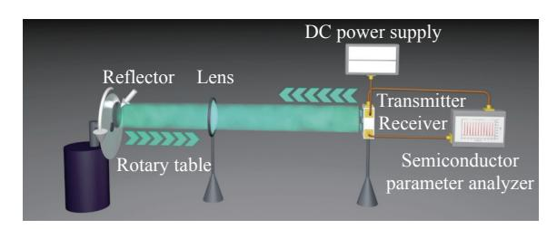

Fig. 8 Schematic diagram of motion detection system of optoelectronic chip

图 8 光电子芯片的运动探测系统示意图

#### 4.1 Motion detection with variable speed

In this experiment, we apply the same positive bias voltage on the transmitter, change the rotation speed of the mirror, and study the effect of the variable rotation speed on the test results. As shown in Figure 9, the transmitter positive bias voltage was set to 2.9 V, and the reflector rotational speed was set to 100 rpm, 200 rpm and 319 rpm, as shown in Figure 9 for a test duration of 10 seconds. The visible light signal is modulated by a rotating mirror, so that the receiver photocurrent changes. The change period of the photocurrent curve is consistent with the rotation period of the mirror.

The effect of the transmitter bias voltage on the magnitude of the receiver photocurrent change is

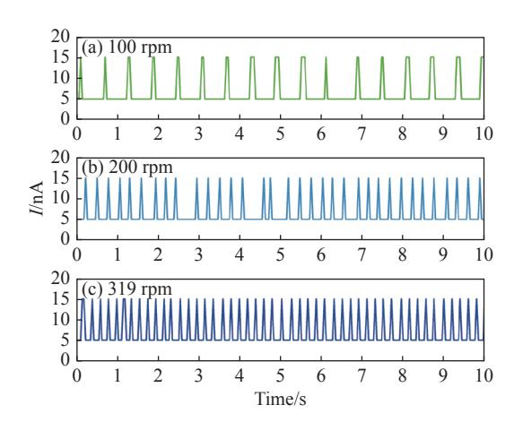

Fig. 9 Detected photocurrent of the receiver from the reflector moving at different rotating speeds when the transmitter is applied 2.9 V bias voltage

图 9 发射器偏压为 2.9 V 时, 不同转速反射镜运动下接 受器的探测光电流

also investigated for a constant rotation speed. The same test duration of 10 seconds was set at the reflector speed of 200 rpm. The transmitter bias voltage is 2.7 V~2.9 V (Figure 10). The change period of the photocurrent curves at different bias voltages all correspond to the rotation speed of the reflector, and the change of the receiver photocurrent increases from 6 nA to 10 nA. It indicates that within the linear bias dynamic operating range of the transmitter, the larger the bias voltage, i.e., the greater the intensity of the transmitted visible light

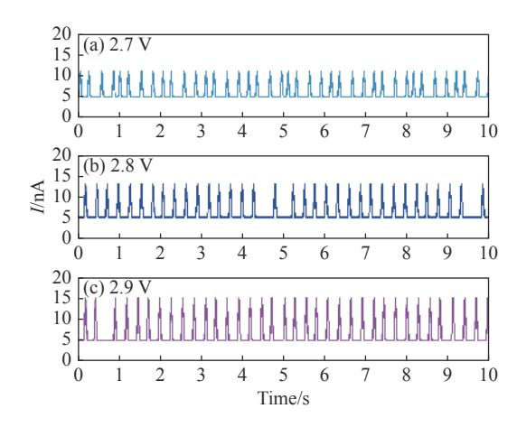

Fig. 10 Detected photocurrent of the receiver under 200 rpm, rotating speed of mirror when the bias voltages applied to the transmitter are set as 2.7 V, 2.8 V, 2.9 V

图 10 反射镜的运动转速为 200 rpm, 发射器偏压分别设置为 2.7 V、2.8 V、2.9 V 时接收器的探测光电流

signal, the greater change in the excited receiver photocurrent pulse, and the better the corresponding motion detection effect. The above experiments show that the optoelectronic integrated chip can achieve non-contact and highly sensitive motion detection of the target object.

#### 4.2 Variable speed motion detection

Considering that most of the objects in nature move at variable speeds, a speed-adjustable rotating motor with a speed range of 0 to 100 rpm as shown in [Figure 11](#page-9-0)(a) is used to control the target object with variable speed motion to test the detection performance of objects with variable speed by the optoelectronic chip. As shown in [Figure 11](#page-9-0)(b), the test was performed with the bias voltage of the optoelectronic chip transmitter at 3 V and the bias voltage of the receiver at 0 V. The initial rotation speed of the target object is 30 rpm, and the rotation speed increases by 30 rpm every 10 seconds, and finally the rotation speed reaches 90 rpm, and the current change period of each time period is consistent with the rotation period of the target object, then good and stable motion detection of the variable speed

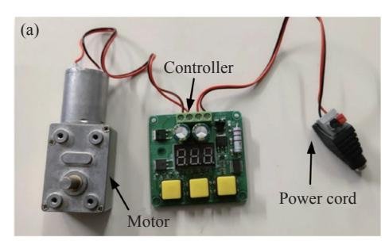

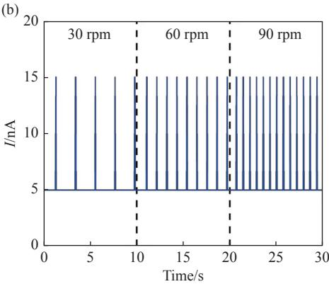

Fig. 11 (a) Variable speed motor and (b) photocurrent curve of variable speed motion detection

图 11 (a) 变速电机和 (b) 变速运动探测的光电流曲线

object is achieved. It shows that the optoelectronic chip can not only detect objects with stable motion in real time, but its effect of detecting objects with variable speed motion is still very good.

## 5 Visible light communication testing of optoelectronic chips

## 5.1 Single-emission visible light communication test

A free-space visible light communication test was performed to investigate the communication performance of the optoelectronic chip. As shown in [Figure 12](#page-10-0)(a), digital signals were loaded by a signal generator (Keysight, 81160A) to a transmitter. A commercial avalanche photodiode (Hamamatsu, C12702-12) is used as the receiver to convert the received optical signal into an electrical signal. The transceiver signal is characterized by an Agilent D[SO9254A](#page-10-0) digital storage oscilloscope. As shown in [Figure 12](#page-10-0)(b), the transceiver signal waveforms are well maintained duri[ng transmi](#page-10-0)ssion at a transmission rate of 25 Mbps. [Figure 12\(](#page-10-0)c) shows the eye diagram at the corresponding transmission rate with acceptable overshoot amplitude, clear open eye, small signal amplitude distortion, and clear rising and falling edges, indicating that the signal noise is small and the visible light communication transmission performance of [the optoel](#page-10-0)ectronic chip as a transmitter is good. [Figure 12](#page-10-0)(d) (color online) shows the 3 dB bandwidth of the optoelectronic chip as a transmitter tested with the Keysight E5080A vector network analyzer, which characterizes the visible light communication response characteristics of the optoelectronic chip. At 2 V, 2.2 V, and 2.4 V bias voltages, the 3 dB band width are 10.1 MHz, 16.7 MHz, and 23.1 MHz, respectively. It can be seen that as the bias voltage increases, the 3 dB bandwidth becomes progressively larger and the communication response speed of the optoelectronic chip increases. The above experiments show that the optoelectronic chip as a transmitter can real-

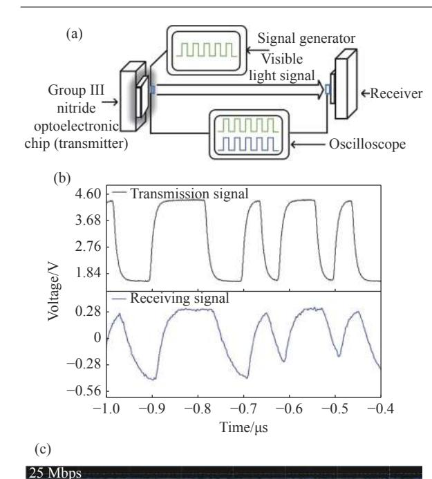

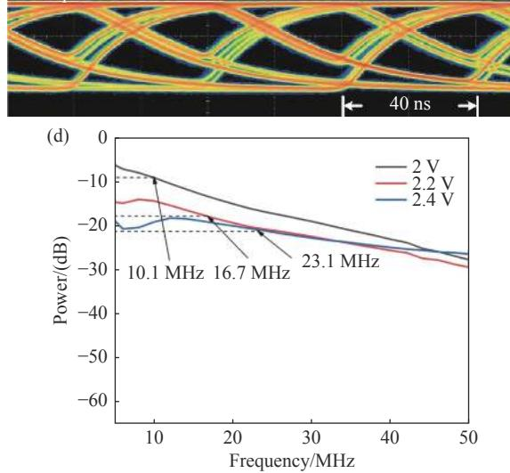

Fig. 12 (a) Visible light communication test system of optoelectronic chip as a transmitter. Signal waveforms (b) and eye diagram (c) of optoelectronic chip as a transmitter at 25 Mbps. (d) 3 dB bandwidth of optoelectronic chip as a transmitter at different bias voltages

图 12 (a) 作为发射器的光电子芯片的可见光通信测试系统。作为发射器的光电子芯片在 25 Mbps 传输速率下的收发信号波形 (b) 和眼图 (c), 以及 (d) 不同电压下作为发射器的光电子芯片 3 dB 带宽

ize high-speed visible light communication transmission.

5.2 Transceiver-integrated visible light communication test

In the transceiver-integrated visible light communication test, the optoelectronic chip works as both transmitter and receiver, as shown in Figure 13 (a). The visible light signal loaded with digital signals transmitted by the transmitter is reflected back to the same optoelectronic chip through the reflected light path of the reflector and then received by the receiver. Figure 13(b) shows the visible light communication transceiver signal at 5 Kbps speed with the optoelectronic chip acting as transmitter/receiver at the same time. The random digital signal transmitted by the optoelectronic chip as a transmitter is well retained at the receiver end, realizing the visible light communication with integrated transceiver. The up and down overshoot amplitude of the eye diagram in Figure 13(c) is small, the open eye is clear, the signal amplitude distortion is not large, and the rising and falling edges are clear although

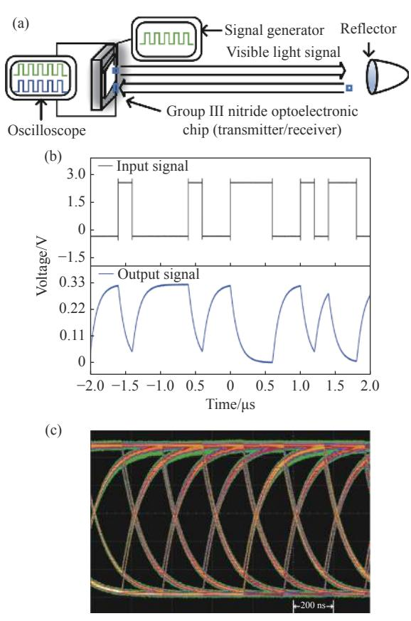

Fig. 13 (a) Visible light communication test system of the optoelectronic chip as a transceiver. (b) Signal waveform and (c) eye diagram at 5 Kbps transmission rate

图 13 (a) 同时作为发射器和接收器的光电子芯片的可见 光通信测试系统。作为收发一体终端的光电子芯 片在 5 Kbps 传输速率下的收发信号波形 (b) 和眼 图 (c) there is a certain degree of zero-crossing distortion. It indicates that the signal noise is small and the optoelectronic chip can be used as the transceiver terminal of the visible light communication system with good transmission performance.

## 6 Conclusion

Based on the co-existence of luminescence and detection characteristics of Group III nitride multiquantum wells structure, an integrated optoelectronic chip based on epitaxially grown multi-quantum wells GaN material on sapphire substrate is proposed. As an ISAC terminal device, this optoelectronic chip has motion detection and visible light communication functions. The diode on the optoelectronic chip works in transmitter mode when a forward bias voltage is applied, transmitting a visible light signal in the blue band with a central wavelength of 462 nm. The diode on the optoelectronic chip works in receiver mode when a negative bias voltage is applied, detecting visible light signals in the same band. The electroluminescence spectrum of the transmitter has a spectral overlap of about 30 nm with the spectral responsivity of the receiver, enabling integrated communication and sensing applications for transceiver in this band.

The transmitter of this optoelectronic chip sends visible light signals to the target object, and enables motion detection of the target object at a maximum speed of 319 rpm by monitoring the photocurrent converted from the modulated light signals received by the receiver in a non-contact detection mode. The bias voltage of the transmitter increases from 2.7 V to 2.9 V when the target object moves at 200 rpm, and the corresponding photocurrent variation of the receiver increases from 6 nA to 10 nA. This paper also investigates the visible light communication performance of the optoelectronic chip, which can achieve 25 Mbps digital signal communication as a transmitter and 5 Kbps digital signal communication as a transceiver terminal under reflected light path. The optoelectronic chip as an ISAC terminal device can process and transmit the signals collected by motion detection, and is suitable for application scenarios such as Internet of Things, autopilot, and smart cities. This study provides a promising way to implement nitride optoelectronic chips in low-cost, low-power, and highly integrated ISAC terminal devices.

#### ——中文对照版——

## 1 引 言

通感一体化是将通信技术与感知技术相融 合,在通信的同时实现对周围环境的感知,利用单 一终端提供复合功能。环境感知技术是自动驾 驶、物联网和智慧城市等自适应智慧运行系统等 通感一体应用场景的重要支撑技术[[1-](#page-15-0)[2\]](#page-15-1)。对于感 知技术, 非接触式环境感知能力极其重要,该技术 具有灵敏度高、适用场景多样和无损无干扰检测 的特点[[3-](#page-15-2)[4\]](#page-15-3)。非接触式运动探测技术在安防系统、 物联网、医疗保健、自动驾驶等领域都有巨大的 应用潜力[\[5](#page-15-4)[-7](#page-16-0)]。

传统运动探测方式,包括雷达[\[8](#page-16-1)] 和激光雷

达[\[9](#page-16-2)[-10](#page-16-3)] 等,主要用于针对大视场、大型运动物体的 运动追踪。雷达和激光雷达利用回波原理,通过 发送微波或激光脉冲并接收经目标物体表面反射 的回波,计算出脉冲的飞行时间,从而获得物体的 空间位置和运动情况。由于需要进行全视场探测 扫描,雷达要花费较长的时间追踪目标物体,因此 较难实现实时物体追踪。激光雷达利用激光脉冲 进行物体定位,响应速度更快。但雷达和激光雷 达成本均较高。与之相比,基于成像技术的运动 物体追踪技术成本较低。其利用成像系统获得运 动物体图像,利用图像处理和分析算法从图像中 提取目标物体的空间位置和运动信息。然而由于 相对位移和运动模糊等因素,成像系统较难同时 实现高空间分辨率、高时间分辨率和高信噪比[[10](#page-16-3)]。 上述运动探测技术各有优点和局限性,需继续研 究准确可靠的非接触式环境运动感知新手段,如 利用可见光信号的环境感知新技术,具有重要的 实用价值和科学意义。

使用可见光信号的运动探测技术和激光雷 达的物理原理类似:都是通过探测目标物体对 光信号的调制来实现运动探测。区别是可见光信 号的媒介是普通的高斯光而不是激光,功耗更低, 环境适应性更好,体积更小,成本更低。美国俄克 拉何马州立大学的 Abuella H 和 Ekin S 以汽车的 LED(发光二极管)大灯和室内照明为光源,研究 了用于车速测量和室内定位的可见光运动探测系 统[\[11](#page-16-4)[-13\]](#page-16-5)。上述研究中的运动探测系统需设置单独 光源和光电探测器网络,仍存在一些挑战,如系统 体积大、成本高、使用场景有限等。

作为第三代半导体,氮化物材料具有优异的 光学、电学、机械和压电性能。通过改变 In、Ga、 Al 等元素在材料体系中的含量,调控氮化物材料 的禁带宽度可以发射或探测覆盖紫外、可见光及 近红外波段的光信号[\[14](#page-16-6)[-15](#page-16-7)]。氮化物多量子阱材料 的光电性能相较于体形态的氮化物材料更为优 异,并且具有发光探测一体效应。华中科技大学 的陈林将发光二极管和光电探测器集成在基于多 量子阱材料的单片光子芯片上,研发了单片集成 LED 和 PD(光电二极管)芯片。该芯片同时作为 光发射器和探测器,可在不依赖外部光电探测器 的情况下探测心脏脉冲的信号变化[\[16\]](#page-16-8)。深圳大学 的钟爱华利用在硅衬底上外延生长的具有蜂窝状 纳米网络结构的 GaN(氮化镓)材料实现了电容式 氢气气体传感器。其[具](#page-16-9)有高安全性和低能耗,是 检测氢气的理想设备[\[17\]](#page-16-9)。南京邮电大学的张帅利 用薄膜发光二极管的压电效应实现的传感器可以 进行非接触式空气[流量](#page-16-10)检测,可用于流量传感、 压力传感和环境探测[\[18\]](#page-16-10)。上述研究拓宽了用于非 接触式可见光传感探测的 III 族氮化物光子集成 芯片的应用场景。本课题组的尹清溪将具有相同 结构的量子阱二极管器件制备在单一光电子芯片 上,分别作为发光和接收器件,构建自由空间逆向 光通信系统[,](#page-16-11)探索了可见光通信感知一体化芯片 及关键技术[\[19](#page-16-11)]。这些研究都表明氮化镓光电子芯 片在通感一体和环境探测方面有着优越的性能和 有前景的发展空间。

本文利用 III 族氮化物多量子阱结构的发光 探测并存的特点,研发了具有蓝光波段可见光信 号收发一体功能的光电子集成芯片,并利用该芯 片实现了无损式运动探测和稳定的可见光通信。 该光电子芯片发射器发出的可见光信号受目标物 体运动情况调制,反射回光电子芯片的接收器。 检测接收器的光电流变化就可以探测以不同速度 旋转的目标物体的运动情况。同时还研究了该芯 片的光电特性和可见光通信性能。本文研发了具 有实用价值的高集成度通感一体终端器件。本研 究为光电子集成芯片在低成本、低功耗、高集成 度的光学运动探测和通信领域的应用提供了有价 值的途径。

## 2 光电子芯片的设计与制备

## 2.1 光电子芯片的工作原理与制备流程

如[图](#page-4-0) [1](#page-4-0)(a)(彩图见期刊电子版)所示,氮化物 多量子阱二极管器件在正向偏压作用下激发光 子,发射可见光信号,作为发射器工作。同样结 构的二极管器件施加反向偏压时,氮化物多量子 阱转变为光电探测模式,吸收入射光子激发电子 空穴对,作为接收器工作,完成同质集成体系下电 光/光电双向能量及信息转换。本研究[使用](#page-4-0)的 III 族氮化物多量子阱材料的分层结构如[图](#page-4-0) [1](#page-4-0)(b) (彩图见期刊电子版)所示。氮化物外延层包括缓 冲层、n-GaN 层、多量子阱层 (Multiple Quantum Well, MQW) 及 p-GaN 层。底部为图形化的蓝宝 石衬底,图形化衬底可以弥补蓝宝石衬底和氮化 物外延层的晶格常数、热膨胀系数不同造成的材 料缺陷,提升光电子芯片性能。分布式布拉格反 射镜(Distributed Bragg Reflection, DBR)由二氧 化硅 (SiO2) 和二氧化钛 (TiO2) 周期性交替层叠 而成,厚度和周期由目标波长决定,每层的光学厚 度为目标波长的 1/4,作为针对特定波长的高反射 率反射镜,可减少光信号泄漏,提升光电子芯片的 光学性能。

设计了 III 族氮化物光电子芯片,如[图](#page-5-0) [2](#page-5-0)(a) 所 示。其中心的二极管器件作为可见光信号发射 器,四周的二极管器件作为可见光信号接收器,这 样有利于使用较多的接收器复合收集调制光信 号,获得更大的光电流探测信号。然而在实际运 动探测系统的调试中,我们发现,同时使用 4 个接 收器会使反射光路调整困难,难以实现调制光信 号对 4 个接收器的均匀覆盖。此外,在外围电路 中连接的 4 个接收器之间的光电流也会出现串 扰。最终通过权衡测试系统光路调整可行性和测 试结果稳定性后,在本文实验中使用一个发射器 和一个接收器进行一对一测试。如[图](#page-5-0) [2](#page-5-0)(b) 所示, 由信号发生器施加正偏压,发射器实现电光转换 后发射蓝光波段的可见光信号到目标物体表面, 经目标物体运动情况调制的可见光信号反射回芯 片四角的一个接收器。对接收器施加负偏压,将 调制可见光信号进行光电转换输出为光电流信 号,监测光电流可以实现光电子芯片对目标物体 的运动探测。

利用标准半导体工艺制备 III 族氮化物光电 子芯片的加工流程[如图](#page-5-1) [3](#page-5-1)(彩图见期刊电子版)所 示:(a) 利用光刻技术在光刻胶层确定发射器的发 光区和接收器的探测区的图形结构,并利用感应 耦合等离子体刻蚀法 (Inductively Coupled Plasma, ICP) 将图形结构转移至氮化物外延层。(b) 利用 光刻技术在光刻胶层确定发射器和接收器的整体 图形结构,并利用 ICP 刻蚀将图形结构转移至氮 化物外延层,整体刻蚀穿透氮化物外延层,实现发 射器和接收器的电隔离,防止串扰电流的出现。 (c) 磁控溅射镀膜并刻蚀氧化铟锡 (ITO) 层,形 成发射器和接收器表面的电流拓展层。(d) 利用 电子束蒸镀和剥离技术制备发射器和接收器的 Ni/Al/Ti/Pt /Au 正负金属电极。(e) 利用电子束蒸 镀制备二氧化硅薄膜保护发射器和接收器表面。 (f) 利用电子束蒸镀和剥离技术制备发射器和接 收器的 Ni/Al/Ti/Pt /Au 引线电极。

## 2.2 光电子芯片的形貌表征

[图](#page-5-2) [4](#page-5-2)(a) 为光电子芯片整体光镜图,发射器和 接收器分别用引线连接在电路板上,用于进行运 动探测实验的电连接。[图](#page-5-2) [4](#page-5-2)(b) 为发射/探测区域 的放大光镜图,发射/探测区域为边长 240 μm 的 正方形结构。[图](#page-5-2) [4](#page-5-2)(c) 为 DBR 层的电子显微镜 图,微观结构为周期 2 μm 六边形排布的半球状 结构。蓝宝石衬底底部的分布式 DBR 层能够 减少芯片底部的可见光信号泄露,增强光子在芯 片内部的吸收,提升光电子芯片的光电转换能力。 [图](#page-5-2) [4](#page-5-2)(d) 为单个发射器/接收器的局部放大光镜图, 可以清晰看出器件加工质量良好。

## 3 光电子芯片的光电性能表征

## 3.1 电学特性测试

使用安捷伦 B1500A 半导体器件分析仪对光 电子芯片进行电学特性测试。发射器在正向偏压 下工作,接收器在负向偏压下工作。因此电压取 值范围为−5 V~5 V,由于设备安全限制,测量饱和 电流为 100 mA。[图](#page-6-0) [5\(](#page-6-0)a) 为发射器/接收器的电 流-电压曲线,发射器开启电压为 2.5 V,到 4.0 V 时达到饱和电流 100 mA,从电流-电压(I-V)曲线 的线性区域计算发射器的微分电阻约为 15 Ω。 负偏压区域几乎无电流产生,说明接收器无明显 漏电流现象,性能良好。在多量子阱内部发生载 流子复合过程,发射器发射可见光信号,并且受偏 置电压线性调制。接收器吸收可见光信号释放电 子-空穴对,产生光电流。良好的电学性能保障了 光电子芯片的工作稳定性。[图](#page-6-0) [5](#page-6-0)(b)(彩图见期刊 电子版)的电容-电压曲线表明在不同频率交流信 号下发射器在正偏压区间具有负电容行为。随着 正偏置电压增加,发射器达到开启电压后电容减 小并下降到负值。降低 RC 时间常数(表示过渡 反应时间的常数,在发射器的电阻电容电路中,是 电阻和电容的乘积)可以提高发射器的响应速度, 负结电容绝对值越小,RC 时间常数越小。交流信 号频率越低,正偏置电压越高,负结电容绝对值越 大。电容-电压曲线的负电容绝对值在 pF 量级, 绝对数值很小,说明发射器具有良好的响应速度, 适合作为快速响应的通感一体器件。

## 3.2 光学特性测试

[图](#page-7-0) [6](#page-7-0)(彩图见期刊电子版)为不同注入电流下 测得的光电子芯片的电致发光光谱和光谱响应 度。在黑暗无光环境下,利用 200 μm 直径的多模 光纤在发射器上表面 5 mm 处收集可见光信号, 并耦合到 Ocean Optics USB4000 光谱仪中进行表 征。图中 5 条不同颜色的高斯分布曲线为不同驱 动电流下发射器的电致发光光谱,主光谱峰为 461.61 nm,为蓝色波段可见光信号。电流从 20 μA 增大到 100 μA,发射器的发光强度逐渐增加。图 中右轴对应的连点粉红色曲线为接收器的探测 谱,其采用 IQE-200B 量子效率测量系统测得。箭 头所指浅蓝色区域为电致发光光谱和响应度光谱 间的光谱重叠区域。即在 431 nm~461 nm 的蓝光

波段范围内,光电子芯片发射器发射的可见光信 号可以利用同一芯片上的接收器进行探测,实现 可见光信号的单片集成式电光/光电转换,从原理 上验证了利用单个光电子芯片实现通感一体功能 的可行性。

[图](#page-7-1)[7](#page-7-1) 为发射器注入电流为10 μA、50 μA、100 μA 时的发光图片。在黑暗环境下,采用安捷伦 B1500A 半导体器件分析仪通过探针台施加不同的电流。 可明显观察到发射器发射的蓝光波段可见光信号 强度随着电流增加而加强。实验结果表明,光电 子芯片应用于运动探测时,提升注入电流可以提 升经待测物体运动情况调制的可见光信号转换的 接收器光电流强度。表明光电子芯片的无损光探 测信号强度可经由驱动电流进行自由灵活调控。

## 4 光电子芯片的运动探测

III 族氮化物光电子芯片的运动探测系统如 [图](#page-8-0) [8](#page-8-0) 所示,系统主体为反射光路。反射镜作为待 测物体在旋转工作台的带动下进行旋转运动。反 射镜为联合光科公司生产的 GMH-11-K9 加强铝 标准精度平面反射镜,直径为 25.4 mm,厚度为 4 mm,基材为精退火 H-K9L 光学玻璃,表面镀层 为保护性紫外反射铝膜。在光子芯片工作的可见 光波段,该反射镜的反射率约为 90%。采用直流 电源以正偏压模式驱动发射器发射蓝光波段可见 光信号。采用半导体参数仪,以零偏压驱动接收 器,用于探测经反射镜旋转运动调制的可见光信 号,并将其转化为光电流,实现运动探测。反射光 路中间设置凸透镜以汇聚可见光信号,光电子芯 片到透镜的距离为 10 cm,透镜到反射镜的距离 为 5 cm。校准发射器发射出的可见光信号聚焦 在反射镜上,反射镜调制的可见光信号经过反射 光路,再次经过凸透镜聚焦,回射入接收器。

### 4.1 匀速运动探测

首先对发射器施加相同的正偏压,改变反射 镜转速,研究转速对测试结果的影响。如[图](#page-8-1) [9](#page-8-1) 所 示,发射器正偏压设置为 2.9 V,反射镜转速设置 为 100 rpm、200 rpm 和 319 rpm,分别对[应图](#page-8-1) [9](#page-8-1)(a)、 [9](#page-8-1)(b)、[9](#page-8-1)(c),测试时长为 10 s。旋转反射镜调制可 见光信号,使得接收器光电流发生变化。光电流 曲线的变化周期与反射镜的旋转周期相符。

同时研究反射镜转速不变的情况下,发射器

偏置电压对接收器光电流变化幅度的影响。反射 镜转速为 200 rpm 时,同样设置 10 s 测试时长。发 射器偏置电压为 2.7 V、2.8 V、2.9 V,对[应图](#page-8-2) [10](#page-8-2)(a)、 [10](#page-8-2)(b)、[10\(](#page-8-2)c)。可见,不同偏置电压下光电流曲线 的变化周期均与反射镜的旋转转速相符,接收器 的光电流变化幅度从 6 nA 增加至 10 nA。说明 在发射器的线性偏压动态工作范围内,偏置电压 越大,即发射的可见光信号强度越大,激发的接收 器光电流脉冲变化越明显,相应的运动探测效果 越好。上述实验说明光电子集成芯片可以实现对 目标物体运动情况的非接触高灵敏探测。

## 4.2 变速运动探测

考虑到自然界中大部分物体是变速运动,利 用如[图](#page-9-0) [11\(](#page-9-0)a) 所示的调速范围为 0 至 100 rpm 的 可调速旋转电机,设置变速运动的目标物体,用 来测试光电子芯片对变速运动物体的探测。如 [图](#page-9-0) [11\(](#page-9-0)b) 所示,在光电子芯片发射器的偏置电压 为 3 V,接收器偏置电压为 0 V 时进行测试,目 标物体起始转速为 30 rpm,每隔 10 s 转速增加 30 rpm,最后转速达到 90 rpm。可见,每个时间段 的电流变化周期均与目标物体的旋转周期一致, 说明所设计的光电子芯片实现了对变速物体良好 稳定的运动探测。

表明该光电子芯片不仅可以对运动情况稳定 的物体进行实时探测,对于变速运动的物体探测 效果依然良好。

## 5 光电子芯片的可见光通信测试

## 5.1 单发射可见光通信测试

进行自由空间可见光通信测试,研究光电子 芯片的通信性能。如[图](#page-10-0) [12](#page-10-0)(a) 所示,数字信号由信 号发生器(Keysight,81160A)加载到发射器上。 以商用雪崩光电二极管(Hamamatsu,C12702–12) 作为接收器,将接收到的光信号转换为电信号。 收发信号由安捷伦 DSO9254A 数字存储示波器 表征。如[图](#page-10-0) [12](#page-10-0)(b) 所示,在 25 Mbps 的传输速率 下,收发信号波形在传输过程中保持良好。[图](#page-10-0) [12](#page-10-0) (c) 为对应传输速率下的眼图,其过冲幅度可以接 受,开眼清晰,信号幅度畸变小,上升、下降沿清 晰,表明信号噪声较小,作为发射器的光电子芯片 的可见光通信传输性能整体良好。[图](#page-10-0) [12\(](#page-10-0)d) 为使 用矢量网络分析仪 Keysight E5080A 测试的光电

子芯片作为发射器的 3 dB 带宽,用以表征光电 子芯片的可见光通信响应特性。在 2 V、2.2 V、 2.4 V 偏置电压下,3 dB 带宽分别为 10.1 MHz、 16.7 MHz、23.1 MHz。可以看出:随着偏置电压 的增大,3 dB 带宽值也逐渐变大,光电子芯片的 通信响应速度不断上升。上述实验表明,该光电 子芯片作为发射器能够实现可见光通信高速 传输。

### 5.2 收发一体的可见光通信测试

在收发一体的可见光通信测试中,光电子芯 片同时作为发射器和接收器,[如图](#page-10-1) [13\(](#page-10-1)a) 所示。发 射器发射的加载数字信号的可见光信号,通过反 射镜的反射光路回到同一光电子芯片上,由接收 器接收。[图](#page-10-1) [13](#page-10-1)(b) 为光电子芯片同时作为发射器/ 接收器在 5 Kbps 速度下的可见光通信收发信 号。光电子芯片作为发射器发射的随机数字信号 在接收器一端得到良好保留,实现了收发一体的 可见光通信。[图](#page-10-1) [13\(](#page-10-1)c) 中眼图的上下过冲幅度较 小,开眼清晰,信号幅度畸变不大,虽然存在一定 程度的过零点失真,但上升、下降沿清晰。说明 信号噪声较小,光电子芯片可以作为可见光通信 系统的收发一体终端,具有良好的传输性能。

## 6 结 论

鉴于 III 族氮化物多量子阱结构具有发光和

探测并存的特点,提出了一种基于蓝宝石衬底外 延生长多量子阱氮化镓材料的集成式光电子芯 片。作为通感一体终端器件,该光电子芯片具有 运动探测和可见光通信功能。光电子芯片上的二 极管在施加正向偏置电压时以发射器模式工作, 发射中心波长为 462 nm 的蓝光波段的可见光信 号。光电子芯片上的二极管在施加负向偏置电压 时以接收器模式工作,可以探测同一波段的可见 光信号。发射器的电致发光光谱与接收器的响应 光谱有 30 nm 左右的光谱重叠,可以在该波段实 现可见光信号的收发一体通信和传感应用。

该光电子芯片发射器向目标物体发射可见光 信号,以非接触探测方式,通过监控接收器接收的 由调制光信号转化的光电流,实现对最高转速为 319 rpm 的目标物体的运动探测。目标物体运动 转速为 200 rpm 时,发射器偏置电压从 2.7 V 增加 到 2.9 V,相应接收器的光电流变化幅度从 6 nA 增加到 10 nA。本文还研究了该光电子芯片的可 见光通信性能,其作为发射器可实现 33 Mbps 的 数字信号通信,作为收发一体终端在反射光路下 可实现 5 Kbps 的数字信号通信。该光电子芯片 作为通感一体终端器件,能够对运动探测采集的 信号进行处理和传输,适用于物联网、自动驾驶、 智慧城市等应用场景。本研究为氮化物光电子芯 片在低成本、低功耗、高集成度的通感一体终端 器件的实现提供了很有希望的途径。

#### **References**:

- SCHWEIKER M, AMPATZ E, ANDARGIE M S, *et al*.. Review of multi-domain approaches to indoor environmental perception and behaviour[J]. *[Building and Environment](https://doi.org/10.1016/j.buildenv.2020.106804)*, 2020, 176: 106804. [1]
- 陈熙霖, 胡事民, 孙立峰. 面向真实世界的智能感知与交互[J]. [中国科学](https://doi.org/10.1360/N112016-00072)[:](https://doi.org/10.1360/N112016-00072)[信息科学](https://doi.org/10.1360/N112016-00072),2016,46(8):969-981. CHEN X L, HU SH M, SUN L F. Towards real world perception and interaction[J]. *[Scientia Sinic](https://doi.org/10.1360/N112016-00072)a [Informationis](https://doi.org/10.1360/N112016-00072)*, 2016, 46(8): 969-981. [2]
- 李爱武, 单天奇, 国旗, 等. 光纤法布里-珀罗干涉仪高温传感器研究进展[J]. 中国光学 (中英文),2022,15(4):609- 624. [3]
  - LI A W, SHAN T Q, GUO Q, *et al*.. Research progress of optical fiber Fabry-Perot interferometer high temperature sensors[J]. *Chinese Optics*, 2022, 15(4): 609-624.
- 张爽, 朱万彬, 李健, 等. 激光位移传感器传感探头微小型光学系统设计[J]. [中国光学](https://doi.org/10.3788/co.20181106.1001),2018,11(6):1001-1010. ZHANG SH, ZHU W B, LI J, *et al*.. Design of micro-optical system for laser displacement sensor sensing probe[J]. *[Chinese Optics](https://doi.org/10.3788/co.20181106.1001)*, 2018, 11(6): 1001-1010. [4]
- SASI G. Motion detection using passive infrared sensor using IoT[J]. *[Journal of Physics:Conference Serie](https://doi.org/10.1088/1742-6596/1717/1/012067)s*, 2021, 1717: 012067. [5]
- SINGH P, CHAULYA S K, SINGH V K, *et al*. Motion detection and tracking using microwave sensor for eliminating illegal mine activities[C]. *2018 3rd International Conference on Microwave and Photonics (ICMAP)*, IEEE, 2018: 1-5. [6]

- HE J, HUANG ZH, YU K. High-accuracy scheme based on a look-up table for motion detection in an optical camera communication system[J]. *[Optics Express](https://doi.org/10.1364/OE.389107)*, 2020, 28(7): 10270-10279. [7]
- PARK S T, LEE J G. Improved Kalman filter design for three-dimensional radar tracking[J]. *[IEEE Transactions on](https://doi.org/10.1109/7.937485) [Aerospace and Electronic Systems](https://doi.org/10.1109/7.937485)*, 2001, 37(2): 727-739. [8]
- ACKERMANN F. Airborne laser scanning —present status and future expectations[J]. *[ISPRS Journal](https://doi.org/10.1016/S0924-2716(99)00009-X) of [Photogrammetry and Remote Sensing](https://doi.org/10.1016/S0924-2716(99)00009-X)*, 1999, 54(2-3): 64-67. [9]
- 邓绮雯. 免成像快速运动物体探测与三维追踪[D]. 广州: 暨南大学, 2021. DENG Q W. Imaging-free fast-moving object detection and 3-D tracking[D]. Guangzhou: Jinan University, 2021. (in Chinese) [10]
- FILATOV A, RYKOV A, MURASHKIN V. Any motion detector: learning class-agnostic scene dynamics from a sequence of LiDAR point clouds[C]. *2020 IEEE International Conference on Robotics and Automation (ICRA)*, IEEE, 2020: 9498-9504. [11]
- ABUELLA H, MIRAMIRKHANI F, EKIN S, *et al*.. ViLDAR —visible light sensing-based speed estimation using vehicle headlamps[J]. *[IEEE Transactions on Vehicular Technology](https://doi.org/10.1109/TVT.2019.2941705)*, 2019, 68(11): 10406-10417. [12]
- SEWAIWAR A, TIWARI S V, CHUNG Y H. Visible light communication based motion detection[J]. *[Optics](https://doi.org/10.1364/OE.23.018769) [Express](https://doi.org/10.1364/OE.23.018769)*, 2015, 23(14): 18769-18776. [13]
- SAWAKI N, HONDA Y. Semi-polar GaN LEDs on Si substrate[J]. *[Science China Technological Science](https://doi.org/10.1007/s11431-010-4182-2)s*, 2011, 54(1): 38-41. [14]
- LI D B, JIANG K, SUN X J, *et al*.. AlGaN photonics: recent advances in materials and ultraviolet devices[J]. *[Advances](https://doi.org/10.1364/AOP.10.000043) [in Optics and Photonics](https://doi.org/10.1364/AOP.10.000043)*, 2018, 10(1): 43-110. [15]
- CHEN L, WU Y P, LI K H. Monolithic InGaN/GaN photonic chips for heart pulse monitoring[J]. *[Optics Letters](https://doi.org/10.1364/OL.400733)*, 2020, 45(18): 4992-4995. [16]
- YU H M, SUN A F, LIU Y Q, *et al*.. Capacitive sensor based on GaN honeycomb nanonetwork for ultrafast and low temperature hydrogen gas detection[J]. *[Sensors and Actuators B:Chemical](https://doi.org/10.1016/j.snb.2021.130488)*, 2021, 346: 130488. [17]
- ZHANG SH, SHI ZH, YUAN J L, *et al*.. Membrane light-emitting diode flow sensor[J]. *[Advanced Materials](https://doi.org/10.1002/admt.201700285) [Technologies](https://doi.org/10.1002/admt.201700285)*, 2018, 3(3): 1700285. [18]
- 王永进, 尹清溪, 叶子琪, 等. 可见光通信感知一体化芯片及关键技术[J]. [电子与信息学报](https://doi.org/10.11999/JEIT211559),2022,44(8):2725-2729. WANG Y J, YIN Q X, YE Z Q, *et al*.. Chip and its key technology for monolithically integrated visible light communication and sensing[J]. *[Journal of Electronics & Information Technology](https://doi.org/10.11999/JEIT211559)*, 2022, 44(8): 2725-2729. [19]

#### Author Biographics:

FENG Xiao-xiao (1999—), female, born in Xuzhou, Jiangsu Province. She received her bachelor's degree from Jinling University of Science and Technology in 2021, and is now a master's candidate in the School of Communication and Information Engineering of Nanjing University of Posts and Telecommunications. She mainly engages in research on Group III nitride optoelectronic devices. E-mail: [1222014634@njupt.edu.cn](mailto:1222014634@njupt.edu.cn)

冯萧萧(1999—),女,江苏徐州人,硕士 研究生,2021 年于金陵科技学院获得 学士学位,现为南京邮电大学通信与信 息工程学院硕士研究生,主要从事三族 氮化物光电子器件方面的研究。E-mail: [1222014634@njupt.edu.cn](mailto:1222014634@njupt.edu.cn)

LI Xin (1984 —), female, born in Sanyuan, Shannxi Province, received her doctor degree from the Xi'an Jiaotong University in 2013. She is currently an associate professor in the School of Communication and Information Engineering of Nanjing University of Posts and Telecommunications, mainly engaged in the research of silicon-based GaN optoelectronic devices. E-mail: [lixin1984@njupt.edu.](mailto:lixin1984@njupt.edu.cn) [cn](mailto:lixin1984@njupt.edu.cn)

李 欣(1984—),女,陕西三原人,博士, 2013 年于西安交通大学获得博士学位, 现为南京邮电大学通信与信息工程学院 副教授,主要从事硅基氮化镓光电子器 件方面的研究。E-mail:[lixin1984@njupt.](mailto:lixin1984@njupt.edu.cn) [edu.cn](mailto:lixin1984@njupt.edu.cn)