Contents lists available at [ScienceDirect](https://www.elsevier.com/locate/optcom)

# Optics Communications

journal homepage: [www.elsevier.com/locate/optcom](http://www.elsevier.com/locate/optcom)

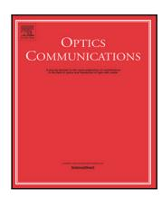

# Integrated high precision time-of-flight depth sensing and optical communication based on Hamiltonian coding

Lijuan Tang [a](#page-0-0) , Zetian Hu [a](#page-0-0) , Dongdong Teng [b](#page-0-1) , Lilin Liu [a](#page-0-0),[∗](#page-0-2)

- a *School of Electronics and Information Technology, State Key Lab of Optoelectronic Materials and Technology, Sun Yat-Sen University, Xin'gang West Road135#, Guangzhou, Guangdong Province, 510275, China*
- b *School of Physics, Sun Yat-Sen University, Xin'gang West Road135#, Guangzhou, Guangdong Province, 510275, China*

# A R T I C L E I N F O

#### *Keywords:* Integrated sensing and communication (ISAC) Hamiltonian coding Time-of-flight (ToF) Multi-frequency fusion

## A B S T R A C T

Convergence of sensing and communication in the same architecture is being considered for implementation in the future sixth-generation (6G) networks due to spectrum congestion and cost efficiency. This paper presents an integrated architecture for time-of-flight (ToF) depth sensing and optical communication simultaneously based on Hamiltonian coding function. The feasibility and performance of this framework are verified by theoretical simulation and experiments. Compared with sinusoid coding scheme, the proposed system based on single-frequency Hamiltonian coding modulation achieves a depth measurement accuracy of tens of millimeters and zero error code in communication, and the data rate 20 Mbps. By developing a multi-frequency Hamiltonian coding fusion algorithm, not only the maximum unambiguous range is increased from 15 m to 60 m, but the average ranging precision is improved to 4.46 mm as well. Experimentally, information of 1000 bits carried by single-frequency is demonstrated. Multi-frequency fusion system can accommodate three times that of single frequency. Within the maximum measurable experimental scope, the value of communication bit error rate (BER) always tends to be zero, under 7% pre-forward error correction (pre-FEC) limit of 3*.*8 × 10−3

# **1. Introduction**

Sensing is evolving into an indispensable technology in future sixth generation (6G) wireless networks due to new emerging applications, such as robot navigation, augmented reality, smart home, auto-driving, smart cities and human–machine interaction [[1](#page-8-0)–[4\]](#page-8-1). These intelligent applications and services require the capability of highly-reliable wireless communication and high-accuracy environment sensing simultaneously. With the rapid advances of wireless mobile devices, conventional independent design of communication and sensing systems generally occupies a mass of different spectrum resources, profoundly aggravating spectrum congestion [[5](#page-8-2)]. Fortunately, thanks to the development of wireless communication systems to wider frequency bands, e.g., millimeter wave (mmWave) [[6](#page-8-3)], terahertz (THz) [\[7\]](#page-8-4) and visible light (VL) [[8](#page-8-5)], there is an increasing overlap with wireless sensing spectrum, prompting communication and sensing to share the same hardware platform and signal waveform. Thus, it motivates tremendous research interest in integrated sensing and communication (ISAC) [[9](#page-8-6)], a number of academic papers have been published recently, ranging from waveform design [[10\]](#page-8-7), signal processing [[11\]](#page-8-8), fundamental limitation [[12\]](#page-8-9), to proof-of-concept prototype [\[13](#page-8-10)]. However, most of these researches are concentrated in the field of joint communication and radar sensing (JCR), where problems such as electromagnetic interference, high sidelobes and reconstruction complexity still remain.

3D time-of-flight (ToF) imaging technology has made great strides in recent years [\[14](#page-8-11)[–16](#page-8-12)]. As an active detection technique that is able to generate both intensity and depth maps, the distance from a ToF camera to scene object is calculated by exploiting the round-trip time or phase shift of the modulated light signal. Compared with stereoscopy and structured light methods requiring more cameras and heavy computational loads [\[17](#page-8-13),[18\]](#page-8-14), ToF based depth sensing can provide more accurate imaging information in high ambient light scenarios with compactness and low calculation complexity. Typically, ToF cameras are segregated into two categories, i.e., direct ToF (DToF) and indirect ToF (IToF). DToF cameras are commonly used in radar systems, requiring high-gain photodetectors, such as avalanche photodiodes (APD) and single-photon avalanche diode (SPAD) [[19,](#page-8-15)[20\]](#page-8-16). In contrast, IToF cameras aim to measure phase shifts between the illumination and reflection, which is adopted commercially in the computer vision community [\[21](#page-8-17)[–24](#page-8-18)] due to their low-cost and low-power consumption (e.g. Microsoft Kinect, PMD and SoftKinectic). The light source (a solid-state laser or a LED) of IToF can be modulated by a continuous-wave (CW-ToF) or a non-continuous wave (e.g., an impulse train, PL-ToF). As well known, LED-based visible light communication (VLC) is also a promising and accessible technology due to costeffectiveness, license-free, immunity to electromagnetic interference, and unregulated wide spectrum [[25\]](#page-8-19). VLC and ToF sensing have made

*E-mail addresses:* [tengdd@mail.sysu.edu.cn](mailto:tengdd@mail.sysu.edu.cn) (D. Teng), [liullin@mail.sysu.edu.cn](mailto:liullin@mail.sysu.edu.cn) (L. Liu).

∗ Corresponding author.

unprecedented achievements independently in the recent past, but without intersecting each other. The functions of ToF depth sensing and VLC could be implemented separately based on LED lighting, thus it inspires prominent research interest to perform them within a single infrastructure, which allows to synergistically provide illumination, communication and sensing services. So far, simultaneous communication and ToF sensing with the same light source have not been extensively studied. In [[26\]](#page-8-20), Mizui et al. proposed the concept of boomerang transmission supporting both communication and vehicular ranging based on laser source. And further works on this system presented in [\[27](#page-8-21)[,28](#page-8-22)]. A visible light communication rangefinder (VLCR) was designed in [[8\]](#page-8-5), using the round-trip TOF technique to estimate the vehicle-to-vehicle (V2V) distance. Also, a VLC-enabled passive ToF system that can simultaneously achieve illumination, communication and 3D sensing was shown in [\[29\]](#page-8-23).

Integrated communication and sensing based on ToF imaging system is a novel research field for the future wireless network industry, which utilizes the same waveform and hardware resources. But most existing IToF imaging systems exploit sinusoid or square wave as modulation function [[22,](#page-8-24)[30\]](#page-8-25), which, although easy to implement, has limited depth resolution in the scenarios of low signal-to-noise ratio (SNR). In parallel, other specific coding schemes, such as triangular functions, ramp functions, and pseudo-random binary sequences [\[31](#page-8-26)[–33](#page-8-27)] are also sub-optimal in terms of achieving depth resolution. Thus, high-performance coding scheme that could provide higher accuracy is desirable. The Hamiltonian coding, adopted in present paper, is proved to be optimal based on spatial coding theory [[34\]](#page-8-28). Besides, there still exists the typical problem of phase ambiguity because the scene depth value is calculated indirectly by measuring the phase shift of per-pixel, efforts to remove measurement ambiguity include, for example, reducing the modulation frequency, pseudo-noise modulation and multi-frequency fusion algorithms [[35–](#page-9-0)[37\]](#page-9-1). Nonetheless, previous researches focused more on improving the resolution, accuracy and depth range of TOF imaging system, no prior works have studied the implementation of both communication and 3D sensing function using a single waveform based on ToF imaging system.

In this article, we propose and design an integrated architecture of simultaneous optical communication and ToF depth sensing based on Hamiltonian coding, which provides a novel research field for ISAC in the future 6G sensing networks. The scene depth is characterized by the total light propagation distance, which estimates indirectly by the phase shift between the emitted and reflected light at a pixel-wise basis. In our proof-of-concept experiment, the integrated communication and sensing system is based on a single photo-diode (PD) verification setup, where an avalanche photodiode (APD) is utilized, that is, an equivalent pixel unit of ToF pixel array sensor. The feasibility and performance of this framework are verified by theoretical simulation and experiments. Compared with sinusoid coding scheme, the proposed system achieves a depth measurement accuracy of tens of millimeters and zero error code at the communication data rate of 20 Mbps. To remove the phase ambiguity problem as well as improve the accuracy, a multi-frequency Hamiltonian coding fusion algorithm is developed. Results confirm that not only the maximum unambiguous range is increased from 15 m to 60 m, but the average ranging accuracy is improved to 4.46 mm as well. And the maximum number of data bits carried by multi-frequency fusion system is three times (3000 bits) that of single frequency. Within the maximum unambiguous experimental scope, the number of communication error codes is always 0, under 7% pre-forward error correction (pre-FEC) limit of 3*.*8 × 10−3 .

## **2. Proposed sensing and communication system**

# *2.1. System model consideration*

In most conventional ToF imaging system, the transceiver is colocated and typically utilizes laser diodes (LDs) as the transmitter. In our system model, we consider using LED as the lighting source due to its compactness and security. [Fig.](#page-2-0) [1](#page-2-0) shows the schematic geometry model of our proposed integrated ToF sensing and communication, i.e., the VLC source and ToF sensing receiver are not necessarily co-located. [Fig.](#page-2-0) [1\(](#page-2-0)a) presents an example of target tracking, in this model, labels 1 and 2 represent the static or mobile reconnaissance devices/bases, each equipped with a light source and a ToF camera receiver. Label 3 indicates a moving object. For any scenic spot of the object, the modulated light from label 1 is projected onto the scene spot with an incident angle , the reflected light with angle is received by ToF camera of label 2, at which the total non-line-ofsight (NLOS) distance 13 + 23 can be obtained and the information carried can be exchanged each other. The target tracking geometry model is categorized into three cases according to the incident angle and reflected angle , i.e., = , ≠ , and = = 0, as depicted in [Fig.](#page-2-0) [1\(](#page-2-0)a). And it should be noted that there is also a special case that the target to be monitored is situated in a collinear position between two reconnaissance devices, which is a blind zone.

For the purpose of simultaneous triangular target tracking and mutual communication within a certain range, we analyze the model in two scenarios. One is assuming that the moving object is also equipped with detection and communication devices, labels 1, 2 and 3 can be targets for each other: (1) label 1 is the target, labels 2 and 3 can achieve simultaneously target monitoring and communication, with a total light propagation distance of 12 + 13. (2) label 2 is the target, a distance of 12 +23 can be obtained. (3) label 3 is the target, similarly, 13 + 23 is obtained. Thus, the triangular geometric relationship of cooperative networking can be determined by combining the above three equations. The other is to regard label 3 only as the target being scouted, labels 1 and 2 are able to monitor target and communicate with each other regardless of whether the reconnaissance devices are relatively static or mobile, i.e., 12 and 13 + 23 are known. If label 1 or 2 is equipped with another TOF system with the same end of emitting and receiving, 13 or 23 will be available, as shown in the green lines in [Fig.](#page-2-0) [1](#page-2-0)(a), so the geometric characteristics can also be determined. Noting that the above analysis is only for a single scene spot of the target, corresponding to a sensor pixel. In fact, multiple scene spots of the target object can be captured simultaneously by the ToF sensor, which permits the integration of target tracking, imaging and communication. Meanwhile, the echoes with phase shift are proportional to the total light propagation distance within a period . Assuming the emitted frequency of a periodic signal is , the total light propagation distance can be computed according to light-velocity *c* and phase-shift by:

$$d = \frac{c}{f_e} \cdot \frac{\varphi}{2\pi},\tag{1}$$

As can be seen from Eq. ([1\)](#page-1-0), the total propagation distance only depends on phase-shift while the modulation frequency is constant. Therefore, although the bistatic geometry model architecture (the is equal to ) in [Fig.](#page-2-0) [1](#page-2-0) is destroyed, the total NLOS distance among light source, target and ToF camera is still available. And for communication purposes, the received signals are transmitted back to the computer for demodulation and decoding to extract raw information bits. In ToF camera receiver, information is detected by plurality pixels of CMOS sensor, each of which is composed of a sensitization unit, i.e., a PD. [Fig.](#page-2-0) [1](#page-2-0)(b) shows the model framework of our proof-ofconcept experiment based on an equivalent pixel unit APD. The target scene is a depth staircase, which is used to simulate different depth values of 3D scene. At the transmitter, the emitted light from LED is collimated by a lens to illuminate the target scene. After reflection through the free space scene, the reflected light with phase shift is focused by another lens and arrives at the APD receiving end.

## *2.2. Principle of the system*

In IToF imaging system, Hamiltonian coding is theoretically proven to be optimal coding scheme due to its excellent properties, such as

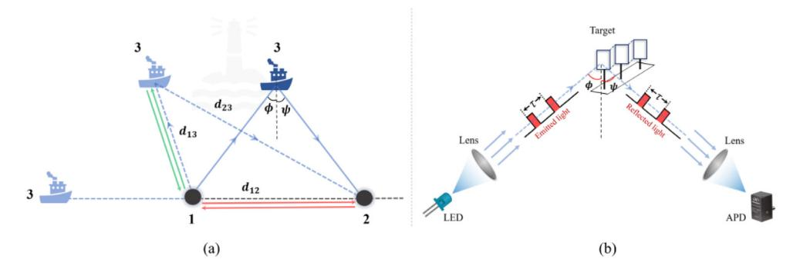

**Fig. 1.** Schematic geometry model of integrated ToF sensing and communication (a) based on ToF cameras and (b) an avalanche photodiode for proof-of-concept.

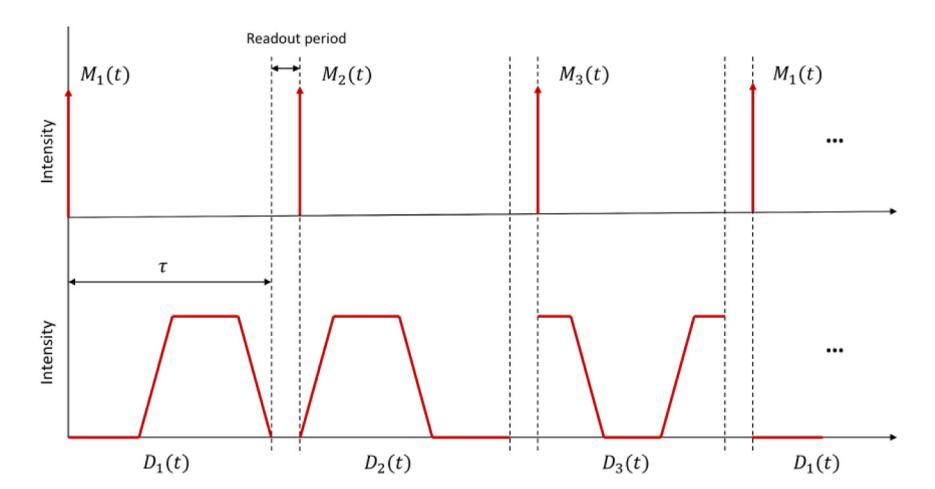

**Fig. 2.** Timing diagram of modulation and demodulation signals for a Hamiltonian coding.

long-coding curve, non-self-intersection and locality preservation [[34\]](#page-8-28). Herein, an impulse (delta) train is adopted as the light source modulation function. Note that IToF system utilizing a non-continuous wave (e.g., an impulse train, PL-ToF) is not an impulse ToF system, as such systems, i.e., DToF, directly measure the time delay between the transmitted and the reflected pulse. In contrast, IToF system measures the time delay indirectly by measuring the temporal correlation between the reflected signal and the demodulation signal, thus usually requiring multiple measurements. *K* denotes the number of intensity measurements. [Fig.](#page-2-1) [2](#page-2-1) illustrates the timing diagram of the modulation and demodulation functions for a Hamiltonian coding scheme. The modulation function () is an impulse train used at the beginning of each integration period . The demodulation function () corresponding to each measurement period is different (e.g., with different profiles), which could be generated by an arbitrary waveform generator (AWG) with multiple channels, or by proper number of AWGs. Each measurement is obtained using a different pair of modulation and demodulation functions. The target scene depth is determined by *K* measurements.

In practice, emitting an impulse (delta) train requires an ideal light source with infinite peak power, which is impractical due to the limited peak source power and limited available bandwidth. To physically implement the Hamiltonian coding scheme, Felipe et al. proposed a practical coding function design that adhered to hardware constraints [[38\]](#page-9-2), that is, the correlation functions are factorized into physically realizable modulation and demodulation functions. [Fig.](#page-3-0) [3](#page-3-0) shows an example of this decomposition. The red lines represent the pulsed ToF implementation of a high-performance correlation function [\[34](#page-8-28)]. To comply with peak power and binary constraints, the impulse train function is approximated by a shorter but wider pulse sequence (e.g., a square or a Gaussian), as shown by the blue line in [Fig.](#page-3-0) [3](#page-3-0)(a), and thus, most commercial light sources such as lasers or lowpower LEDs can be used for this system to accommodate such input modulation and demodulation functions.

Integrated waveform design is the basis for jointing communication and sensing. In an imaging-based ToF system, employing Hamiltonian coding as the ranging signal can achieve a high peak power, which brings a higher SNR and longer unambiguous range, while maintaining a relatively low average power. Also inspired by spread spectrum (SS) code of the optical communication system, which is robust against multipath interference and noise. Therefore, in this system, we propose to employ Hamiltonian code as the pulsed SS waveform, that is, information bits are modulated by Hamiltonian code as the integrated waveform to simultaneously realize communication and sensing functions, which transcends the communication-only or sensing-only philosophy. Before modulation, the pulsed SS waveform is designed as a typical discrete phase modulation signal, such as phase shift keying (PSK) for increasing system robustness and high-interference levels. The composite signal is represented by:

$$c(t) = \sum_{i=0}^{N-1} a(i)g(t - iT)$$
 (2)

where *N* is the number of modulation symbols constituting a signal frame, *T* is the period duration, () denotes the discrete phase states from any PSK, and () represents the pulsed SS waveform. Then the raw information bits are embedded into the Hamiltonian function waveform based on the spread spectrum communication principle, the encoding procedure is expressed as follows:

$$d(t) = x(t) \oplus c(t) \tag{3}$$

where *⊕* denotes exclusive-or (XOR) operator and () is the information bit sequence aimed at communication. Each element of the data

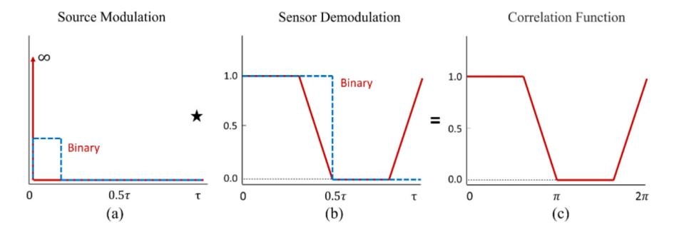

Fig. 3. Optimized coding function design adhere to practical constraints.

sequence is replaced by the result of its multiplication with N elements of the SS code sequence, assuming the data sequence is  $L_c$ , the total length of the resulting sequence d(t) amounts  $L_cN$ .

The reflected integrated signals from the target scene are captured during measurement period i using pixel array or an APD, which is modulated by a demodulation signal corresponding to the ith measurement period. For a sensor pixel p that images a scene spot S, the image formation equation can be characterized as [34]:

$$B(p) = \beta(p)C(L) + A(p) \tag{4}$$

$$C(L) = \frac{\int_0^{\tau} D_i(t) M_i(t - \frac{2L}{c}) dt}{M_{out}}, 1 \le i \le K,$$
 (5)

where C(L) is the normalized correlation function, L denotes the scene depth,  $M_{total} = \int_0^\tau M_i(t) \, dt$  is the total energy emitted by light source towards scene within an integration period  $\tau$ . There are three unknowns in Eq. (4), which are depth L, albedo factor  $\beta(p)$ , and ambient brightness A(p), and thus,  $K \geq 3$  intensity measurements are required.

For each measurement,  $B_i(1 \leq i \leq K)$  is taken by a different pair of modulation and demodulation functions, corresponding to the ith correlation function  $C_i(L)$ . For any coding scheme, there is a one-to-one mapping between the correlation function  $C_i(L)$  and the depth value L, thus the depth value can be calculated by determining the correlation function. Two approaches can be taken to computed the correlation function  $C_i(L)$  according to Eqs. (4) and (5), one is performing the correlation operation between the modulation and demodulation functions according to the phase shift, the other is directly capturing the light intensity  $B_i$  in a per-pixel basis and estimating the unknowns  $\beta$  and A, and then obtaining  $C_i(L)$ . And the former one is adopted in our paper.

#### 2.3. Multi-frequency fusion algorithm based on Hamiltonian coding

In Section 2.1, the maximum measurable light propagation distance is within the wavelength range of the signal. In fact, the target object in the scene may be further away than this limit, thus resulting in phase ambiguity as shown in Fig. 4, which is an example of ITOF system with the same end of emitting and receiving. In this illustration, the actual target distance is farther than the unambiguous range, where the ambiguity x = 3. Given that, the total light propagation distance Eq. (1) can be rewritten as:

$$d = \frac{c}{f_o} \times \left(\frac{\varphi}{2\pi} + x\right), x = 0, 1, 2, \dots,$$
 (6)

where x is an integer representing the number of phase wraps, and  $c/f_e$  is the unambiguous measurable range. The scene depth can be characterized by the total light propagation distance. Typically, x is assumed to be 0 in the single frequency case, indicating the phase shift being confined within  $2\pi$  radians. Although the maximum measurable range can be extended by decreasing the periodic signal frequency  $f_e$ , it commonly results in a reduction of measurement accuracy.

To obtain a trade-off between the maximum unambiguous range and measurement precision, multi-frequency phase modulations are utilized to remove the ambiguity x. In [36], the scene depth was

Table 1
Cascaded multi-frequency fusion algorithm based on Hamiltonian coding.

**Input:** Modulation frequency  $f_i$ , The number of frequencies F, Maximum distance for each frequency  $D_i$  and Light propagation distance  $d_i$ Output: The fused distance  $\hat{D}$ For i = 0: i < F - 1: i = i + 1 do  $d_{\text{max}} = \frac{c}{\gcd(f_i, f_{i+1})} = \frac{c}{f_E};$  $M_i = \frac{f_i}{f_c} = \frac{d_{\max}}{D_i}, M_{i+1} = \frac{f_{i+1}}{f_c} = \frac{d_{\max}}{D_{i+1}};$  $p_i = \frac{d_i}{D_i}, p_{i+1} = \frac{d_{i+1}}{D_{i+1}};$  $e = p_i M_{i+1} - p_{i+1} M_i;$  $k_i = \text{mod}[c_{i+1} round(-e), M_i]$  where  $c_{i+1}$  satisfies  $\text{mod}(c_{i+1} M_{i+1}, M_i) = 1$ ;  $k_{i+1} = \text{mod}[c_i round(e), M_{i+1}]$  where  $c_i$  satisfies  $\text{mod}(c_i M_i, M_{i+1}) = 1$ ;  $\omega_i = \frac{M_i I_i}{M_i I_i + M_{i+1} I_{i+1}}, \omega_{i+1} = 1 - \omega_i;$  $R_i = d_i + k_i D_i, R_{i+1} = d_{i+1} + k_{i+1} D_{i+1};$  $D_{tem} = \omega_i R_i + \omega_{i+1} R_{i+1};$ if  $\omega_i > \omega_{i+1}$  then  $e_{tem} = abs(D_{tem} - R_i);$  $e_{tem} = abs(D_{tem} - R_{i+1});$ end if i < 1 or  $e_{tem} < \hat{e}$  then  $\hat{e} = e_{tem}$ ,  $\hat{D} = D_{tem}$ ; end end

estimated using multi-frequency phase measurements with a minimum variance search algorithm, but it had heavy computational complexity. Referring to the idea in [37], a cascaded multi-frequency fusion algorithm based on Hamiltonian coding is proposed, as shown in Table 1. Two sequential frequencies are fused in an iterative way, and the phase ambiguity x is evaluated based on the modified Chinese remainder theorem. The maximum measurable range can be determined by common factors of multiple frequencies, as  $d_{max}$  and  $f_E$  in the proposed algorithm. The adoption of the Hamiltonian waveform instead of conventional sinusoid waveform provides a higher measurement accuracy of millimeter scale and extends significantly the maximum unambiguous range.

#### 3. System architecture overview

A block diagram of the proposed depth sensing and communication system based on Hamiltonian coding is depicted in Fig. 5. In this scheme, first, the information bits are embedded into the designed Hamiltonian function waveform to generate the integrated waveform d(t) according to Eq. (3). Then a LED light source transmits the resulting sequence waveform to the target object, the light echo signal focused by lens is captured by an APD. After photo-electric conversion, electrical signal is transmitted to the switch module, one channel performs correlation operation between the modulation function with phase delay and demodulation functions to obtain the depth value, and the other channel utilizes XOR operation for communication decoding. Noting

**Fig. 4.** The phase ambiguity of IToF camera.

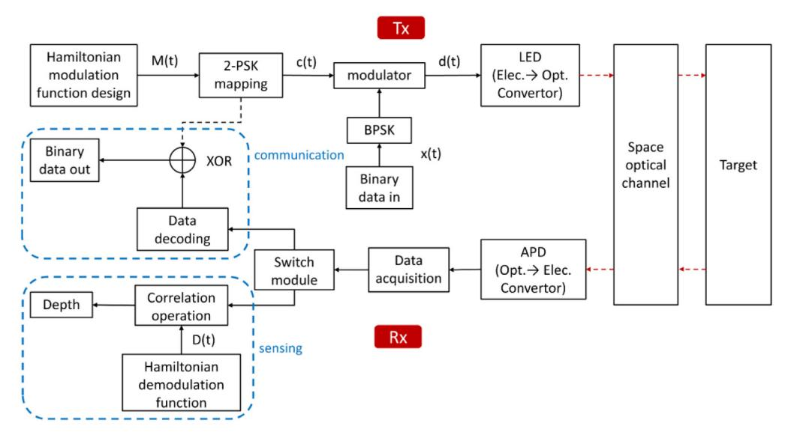

**Fig. 5.** Block diagram of integrated depth sensing and communication system.

that, thanks to a single identical LED light source and a single APDbased receiving pixel unit are adopted in this integrated system, it can be regarded as highly directional transmission, which is beneficial to alleviate the broadcasting problem that occurs in radio frequency (RF) method.

The key system parameters of the integrated system based on single frequency and multi-frequency fusion are given in [Table](#page-4-2) [2](#page-4-2). The simulation target scene is set as a staircase of varying depth (e.g., 10 random depth) within the maximal unambiguous distance. The simulation environment is represented by additive white Gaussian noise (AWGN) channel. Scene reflectivity is Lambertian BRDF with an albedo of 0–1. For single-frequency modulation, the maximum measurable range at the fundamental frequency of 20 MHz is 15 m, the number of information bits carried varies from 1000 to 4000 bits. For multifrequency fusion modulation where three frequencies 1 , 2 an 3 are employed, the unambiguous range depends on their common factor, calculated as follows by:

$$d_{\max} = \frac{c}{f_E} = \frac{c}{\gcd(f_1, f_2, f_3)}$$
 (7)

where is the effective frequency, determined by the greatest common divisor of these three frequencies. According to the simulated step chain in [Fig.](#page-4-1) [5](#page-4-1) and the parameters in [Table](#page-4-2) [2](#page-4-2), we simulate and estimate the depth sensing accuracy and communication performance of the integrated system. Simulation results based on single-frequency and multi-frequency Hamiltonian coding modulation are compared in [Fig.](#page-5-0) [6.](#page-5-0)

For each target depth, the simulation is repeated 5000 times to stably evaluate the ranging standard deviation and communication bit

**Table 2** Key system parameters of the simulation model.

| Item                            | Single-frequency | Multi-frequency  |  |  |
|---------------------------------|------------------|------------------|--|--|
| Modulation frequency/MHz        | 20               | 20, 75, 95       |  |  |
| Effective frequency 𝑓𝐸 /MHz  | 20               | 5                |  |  |
| Modulation sequence length/bits | 7500             | 7500, 2000, 1579 |  |  |
| Bit rate/Mbps                   | 20               | 20, 75, 95       |  |  |
| Data number/bits                | 103              | 3 × 103          |  |  |
| Light propagation range/m       | 0∼15             | 0∼60             |  |  |
| Modulation                      | BPSK             | BPSK             |  |  |
| Total exposure time/s           | 0.1              | 0.3              |  |  |
| Read noise/electron             | 20               | 20               |  |  |
| Mean effective albedo           | 1 × 10−4         | 1 × 10−4         |  |  |
| Channel SNR/dB                  | 5                | 5                |  |  |
| Simulation times per depth      | 5000             | 5000             |  |  |

error rate (BER). [Fig.](#page-5-0) [6](#page-5-0)(a) shows the depth error and BER for singlefrequency modulation @K=3, as the functions of light propagation distances, where the transmission ranges from 0 to 15 m. As expected, the target sensing performance achieves a relatively small average depth error of 18.82 mm, and the mean BER tends to be zero within the maximum unambiguous range. The information bits carried herein are 1000 bits, thus the mean BER is less than 1*.*0 × 10−3. And the maximum number of information bits carried is 4000 bits which is limited by the computing capacity of our computer. The communication bit rate is 20 Mbit/s. Meanwhile, for comparison, the multi-frequency fusion results are shown in [Fig.](#page-5-0) [6](#page-5-0)(b), clearly the depth error corresponding to each propagation distance is less than 10 mm, and the total average depth error is 5 mm, which is more accurate than single-frequency Hamiltonian coding modulation. And the information bits carried are

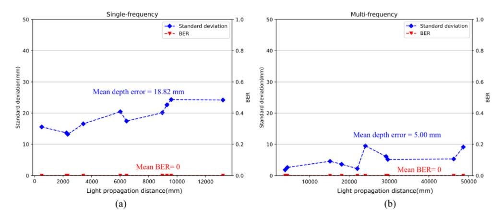

**Fig. 6.** Simulation results: Single-frequency vs. Multi-frequency.

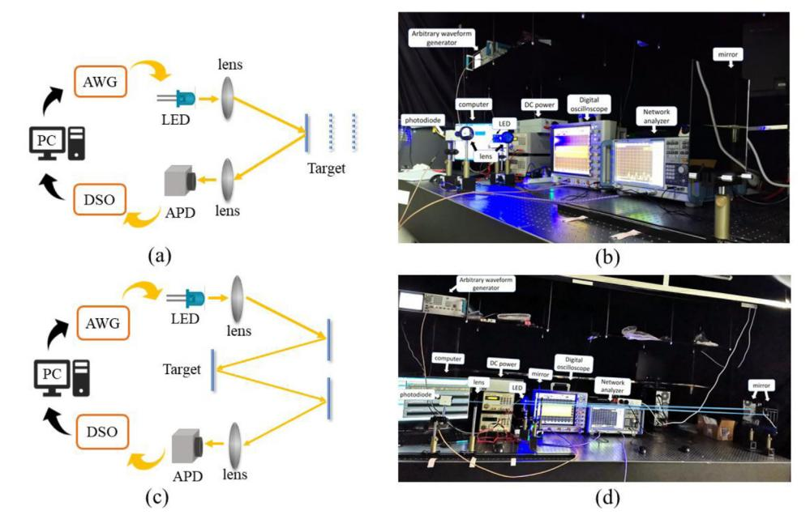

**Fig. 7.** A proof-of-concept experimental setup of the integrated system: (a) block diagram for single frequency, (b) experimental setup for single frequency, (c) block diagram for multi-frequency, and (d) experimental setup for multi-frequency.

three times of those using single frequency, the communication performance within the unambiguous distance of 60 m also exhibits excellent characteristics, i.e., the mean BER approaches zero infinitely. The above simulation results verify the feasibility of the proposed integrated system, adopting multi-frequency fusion algorithm based on Hamiltonian coding can effectively settle the phase ambiguity issue with higher measurement precision and as well carry more information bits.

## **4. Experimental setup**

A proof-of-concept experimental system based on model framework of [Fig.](#page-2-0) [1](#page-2-0)(b) is set up, as shown in [Fig.](#page-5-1) [7](#page-5-1), which works equivalently as a pixel unit of the image sensor of ToF camera, implementing the integrated functions of depth sensing and data communication at a pixel scale. If an addressable scanning device is introduced into the system in the future to deflect the light source's direction, it can work as an integrated system for simultaneously ranging imaging and communication. The experiments are conducted indoors with all artificial lights acting as the ambient light noise.

[Fig.](#page-5-1) [7](#page-5-1)(a) and (b) present the process framework and system setup of our experiment based on single-frequency modulation. The target scene consists of a single common planar mirror, which is placed on a sliding rail so that its depth value can be varied from 1 m to 2 m with position-shift accuracy 1 mm. At each depth, we have evaluated the total light propagation distance and decoded the raw information bits. At the transmitter end, the illumination source is a 442 nm blue LED with a nominal operation voltage ∼9 V and a maximum optical power of ∼150 mW, which is fabricated by on-chip cascading three sub-chips in our lab. The integrated modulation signals are generated by MATLAB software, and the generated signals are loaded into an arbitrary waveform generator (AWG, Tektronix, AWG710) whose maximum bandwidth is 4 GHz and peak-to-peak voltage is 750 mV. Then the output signals are used to drive LED after equalization and amplification, and the modulated light is collimated by a lens before arriving the target. At the receiver end, an avalanche photodiode (Thorlabs APD210) is applied to capture the reflected light signals with another lens to focus the energy. The captured signals are recorded by a 20 GSa/s digital storage oscilloscope (DSO, Rohde & Schwarz, RTO2024) with an analog-to-digital converter (ADC) operating at 16-bit vertical resolution, and then processed by MATLAB offline. Additionally, a multi-frequency fusion verification experiment based on Hamiltonian coding is also conducted, as shown in [Fig.](#page-5-1) [7\(](#page-5-1)c) and (d). Different from single-frequency modulation, the optical path is reflected three times to extend the measurable range due to limited laboratory space.

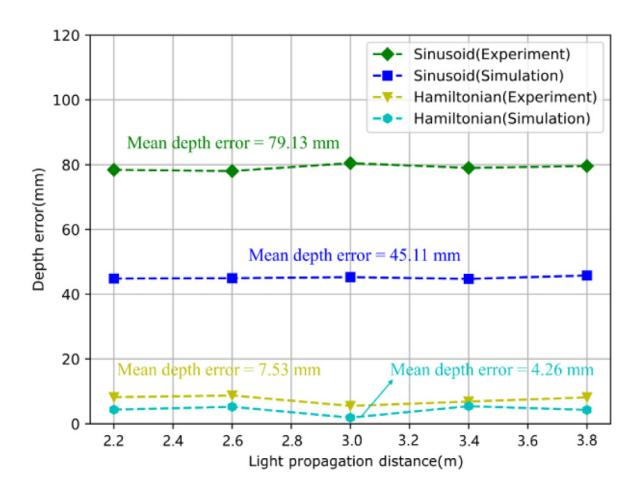

**Fig. 8.** Depth error comparisons with different coding schemes.

The receiver is mounted on a slide rail of 1 m length. The second planar mirror serves as the location of the target scene. The total light propagation distance is set to vary from 16.2 m to 17.0 m (*>*15 m of single-frequency), with an interval of 0.4 m. At each location, the distance is estimated 5000 times, and the depth error and BER are calculated in our system, which are used to quantitatively evaluate depth measurement accuracy and communication performance.

## **5. Results and discussion**

## *5.1. Results for single-frequency*

**Comparisons with the sinusoid coding scheme:** Sinusoid coding is commonly used in commercial IToF cameras. To illustrate that the Hamiltonian coding utilized in this paper is superior to sinusoid coding scheme in depth measurement, comparisons about them are performed using the same setup. For this experiment, the modulation frequency is the same of 20 MHz, that is, the maximum unambiguous distance is 15 m. Take several locations within this range for measurement, as shown in [Fig.](#page-6-0) [8,](#page-6-0) the measured distance varies from 2.2 to 3.8 m, with an interval of 0.4 m. The sampling frequency of DSO is set to 2.5 GSa/s, data storage depth is 100 Kpts, and intensity measurements = 5. Experimental and simulation results prove that Hamiltonian coding is able to achieve considerably lower depth error compared to sinusoid coding. Obviously, the mean depth error of sinusoid coding scheme is approximately 10 times that of Hamiltonian coding, indicating that the system adopting Hamiltonian coding scheme for depth measurement could accomplish higher-accuracy depth estimation and has stronger anti-ambient interference ability.

**Effects of intensity measurement times** *K***:** The system setup and experimental design are the same as those in [Fig.](#page-6-0) [8,](#page-6-0) except for the value of K. [Fig.](#page-7-0) [9](#page-7-0) presents the performance of integrated system based on single-frequency Hamiltonian coding for = 3, = 4 and = 5. The information bits carried herein are 100 bits, the sampling frequency and data storage depth of DSO are set to 1.25 GSa/s and 1 Mpts respectively according to the amount of data transmitted. As expected, the ranging precision is improved, with mean depth errors of 11.64 mm, 10.55 mm and 7.53 mm corresponding to = 3, = 4 and = 5, respectively. This is consistent with the theory, since a larger *K* results in a longer length of the spatial coding curve, thereby improving the depth measurement accuracy of Hamiltonian coding scheme. On the other hand, within the maximum measurable range, the communication performance has been proved to always exhibit superior characteristics, that is, zero error among 100 binary numbers, which benefits from the adoption of highly reliable Hamiltonian functions to modulate information bits.

**Table 3** Measured depth difference results.

| Actual difference/mm | Measured difference/mm | Deviation |
|----------------------|---------------------------|-----------|
| 16200–16600          | 402.18                    | 0.54%     |
| 16600–17000          | 406.2                     | 1.55%     |
| 16200–17000          | 804.02                    | 0.5%      |

**Effects of communication capacity:** The total light propagation distance is fixed at 2.2 m, and intensity measurements = 3. [Fig.](#page-7-1) [10](#page-7-1) shows the experimental and simulation results under different information bits. Obviously, the depth error increases with the number of information bits, but the communication BER constantly tends to be 0 within the maximum unambiguous range. The minimum depth error (nearly 10 mm) occurs between the communication capacity of 300 and 500 bits, which exhibits very good agreement with the simulation results.

So far, the effects of intensity measurement times *K* and different communication capacities on the performance of integrated system have been measured and evaluated. A higher *K* and appropriate information bits can be chosen to optimize system performance. In our single-frequency experiments, at least it has been proved that within the maximum unambiguous range, the measurement accuracy based on Hamiltonian coding scheme is higher than that of traditional sinusoid coding, and the communication performance always maintains the excellent characteristic of zero error code, which paves the way for the research on the integrated system of 3D imaging and optical communication.

#### *5.2. Results of multi-frequency fusion*

To further extend the maximum unambiguous distance with higher sensing accuracy and simultaneously carry more information bits, the multi-frequency fusion experiment based on Hamiltonian coding scheme is implemented according to the setup in [Fig.](#page-5-1) [7\(](#page-5-1)d). The three frequencies chosen for fusion are 20 MHz, 75 MHz and 95 MHz respectively, the information bits carried herein are 300 bits (3 times that of single frequency), and = 3. The sampling frequency and data storage depth of DSO are set to 1.25 GSa/s and 1 Mpts respectively. To qualitatively evaluate the effects of extended distance and multiple reflections, we calculate the relative difference between two different propagation distances and as well the absolute distances. Herein we assume that the conditions are the same for every measurement except for the distance variation. [Table](#page-6-1) [3](#page-6-1) shows the obtained results and deviations, it can be found that there is a very small deviation between the measured difference and the actual difference (less than 2%). [Fig.](#page-7-2) [11](#page-7-2) plots the absolute depth error and communication BER versus different light propagation distances. Although the depth error increases with total scene distance, overall exhibits very small measurement error (a few millimeters) compared to single-frequency Hamiltonian coding modulation. At the same time, for each measurement, the communication performance always shows nearly zero error code, and BER is below 3*.*8 × 10−3 .

[Table](#page-7-3) [4](#page-7-3) summarizes the experimental results based on single frequency and multi-frequency fusion for = 3, respectively. Obviously, multi-frequency fusion based on Hamiltonian coding is able to remove the phase ambiguity with a high measurement precision of millimeter scale and carry more information bits with zero error code. Although there may still be phase ambiguity issue for target scene very far away after multi-frequency fusion, the maximum unambiguous range has been greatly extended to meet the proposed system for simultaneously depth sensing and visible light communication.

### **6. Conclusions and future outlook**

In this paper, we propose an integrated architecture for simultaneously IToF depth sensing and optical communication based on

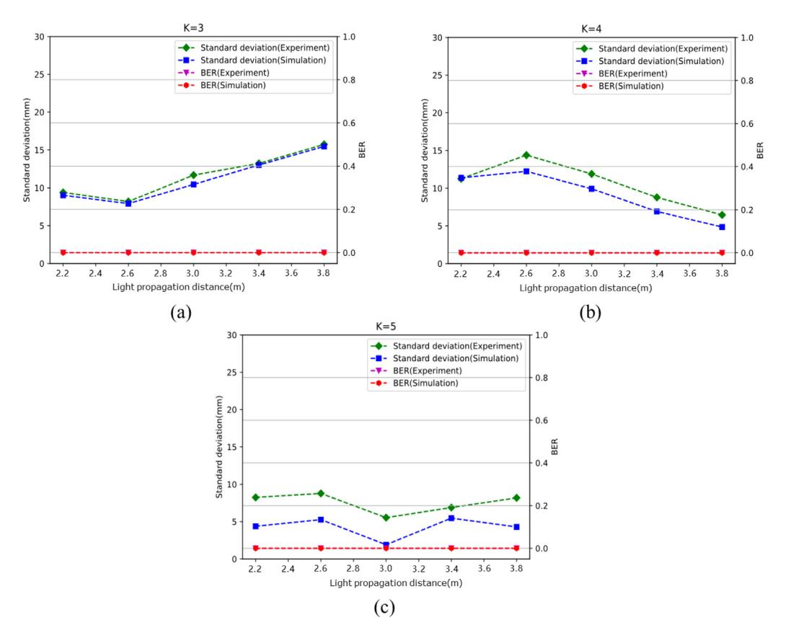

**Fig. 9.** Performance analysis of integrated system for K=3, K=4 and K=5.

**Table 4** Experimental results comparison of single-frequency and multi-frequency.

| Single-frequency |                |             |                      |                     | Multi-frequency            |                |             |                      |                     |
|------------------|----------------|-------------|----------------------|---------------------|----------------------------|----------------|-------------|----------------------|---------------------|
| Frequency        | Depth error | Mean BER | Carrying data bit | Maximum distance | Frequency                  | Depth error | Mean BER | Carrying data bit | Maximum distance |
| 20 MHz           | 11.64 mm       | nearly 0    | 100 bits             | 15 m                | 20 MHz 75 MHz 95 MHz | 4.46 mm        | nearly 0    | 300 bits             | 60 m                |

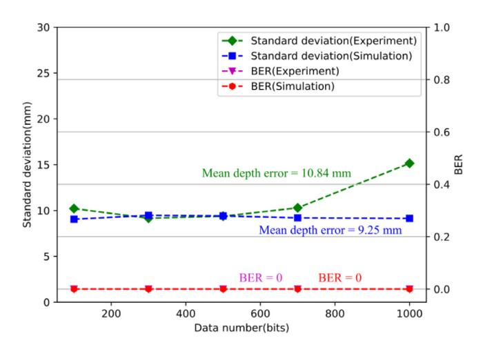

**Fig. 10.** Performance analysis of different communication capacities.

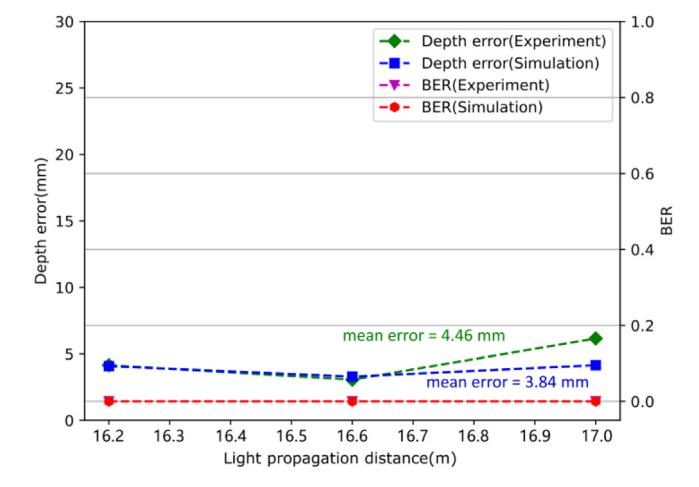

**Fig. 11.** Experimental results based on multi-frequency fusion.

Hamiltonian coding scheme, and the scene depth is characterized by the total light propagation distance. The feasibility and performance of

this framework are verified by theoretical simulation and experiments. Compared with sinusoid coding scheme, the proposed system based on single-frequency modulation achieves a measurement accuracy of tens of millimeters and zero error code in communication, and the data rate reaches 20 Mbps. To settle the phase ambiguity issue with higher ranging precision and as well carry more information bits, a multi-frequency Hamiltonian coding fusion algorithm is developed. Experimental results confirm that not only the maximum unambiguous range is increased from 15 m to 60 m, but the average ranging accuracy is improved to 4.46 mm as well. And the maximum number of data bits carried by multi-frequency fusion system is three times (3000 bits) that of single frequency. Within the maximum unambiguous experimental scope, the value of communication BER always tends to be zero, under 7% pre-FEC limit of 3*.*8 × 10−3 .

It is worth mentioning that in our proof-of-concept experiment, a single APD, that is, an equivalent pixel unit of ToF sensor, serves as the receiver to collect reflected signals, which has strong anti-ambient interference ability and indirectly improves the reliability of the system. In the future, it is possible to develop a full-frame 3D imaging and optical communication prototype system by combining a single PD with an addressable scanning setup, or employing the image sensors such as image intensifier tubes (Kawakita et al. 2004) or a PD array (Shcherbakova et al. 2013) as receivers, which is superior to a single PD due to no need for point-to-point alignment, decreasing hardware complexity and cost overhead effectively. Meanwhile, another possibility is to integrate our code algorithm framework into ITOF imaging system in place of the existing sinusoid scheme. Such a converged platform would provide unique possibilities for emerging new applications.

#### **Declaration of competing interest**

The authors declare that they have no known competing financial interests or personal relationships that could have appeared to influence the work reported in this paper.

### **Data availability**

Data will be made available on request.

# **Acknowledgments**

Authors thank Guangdong Province Key R&D projects under Grant 2019B010154002, National Natural Science Foundation of China (11772359).

## **References**

- [1] [D. Ma, N. Shlezinger, T. Huang, Y. Liu, Y.C. Eldar, Joint radar-communication](http://refhub.elsevier.com/S0030-4018(23)00231-6/sb1) [strategies for autonomous vehicles: Combining two key automotive technologies,](http://refhub.elsevier.com/S0030-4018(23)00231-6/sb1) [IEEE Signal Process. Mag. 37 \(4\) \(2020\) 85–97.](http://refhub.elsevier.com/S0030-4018(23)00231-6/sb1)
- [2] [Q. Huang, H. Chen, Q. Zhang, Joint design of sensing and communication](http://refhub.elsevier.com/S0030-4018(23)00231-6/sb2) [systems for smart homes, IEEE Netw. 34 \(6\) \(2020\) 191–197.](http://refhub.elsevier.com/S0030-4018(23)00231-6/sb2)
- [3] [A. Zhang, M.L. Rahman, X. Huang, Y.J. Guo, S. Chen, R.W. Heath, Perceptive](http://refhub.elsevier.com/S0030-4018(23)00231-6/sb3) [mobile networks: Cellular networks with radio vision via joint communication](http://refhub.elsevier.com/S0030-4018(23)00231-6/sb3) [and Radar sensing, IEEE Veh. Technol. Mag. 16 \(2\) \(2021\) 20–30.](http://refhub.elsevier.com/S0030-4018(23)00231-6/sb3)
- [4] [F. Liu, Y. Cui, C. Masouros, J. Xu, T.X. Han, Y.C. Eldar, S. Buzzi, Integrated](http://refhub.elsevier.com/S0030-4018(23)00231-6/sb4) [sensing and communications: Toward dual-functional wireless networks for 6G](http://refhub.elsevier.com/S0030-4018(23)00231-6/sb4) [and beyond, IEEE J. Sel. Areas Commun. 40 \(6\) \(2022\) 1728–1767.](http://refhub.elsevier.com/S0030-4018(23)00231-6/sb4)
- [5] [H.T. Hayvaci, B. Tavli, Spectrum sharing in radar and wireless communication](http://refhub.elsevier.com/S0030-4018(23)00231-6/sb5) [systems: A review, in: 2014 International Conference on Electromagnetics in](http://refhub.elsevier.com/S0030-4018(23)00231-6/sb5) [Advanced Applications \(ICEAA\), 2014, pp. 810–813.](http://refhub.elsevier.com/S0030-4018(23)00231-6/sb5)
- [6] [R.W. Heath, N. González-Prelcic, S. Rangan, W. Roh, A.M. Sayeed, An overview](http://refhub.elsevier.com/S0030-4018(23)00231-6/sb6) [of signal processing techniques for millimeter wave MIMO systems, IEEE J. Sel.](http://refhub.elsevier.com/S0030-4018(23)00231-6/sb6) [Top. Sign. Proces. 10 \(3\) \(2016\) 436–453.](http://refhub.elsevier.com/S0030-4018(23)00231-6/sb6)
- [7] [Z. Chen, C. Han, Y. Wu, L. Li, C. Huang, Z. Zhang, G. Wang, W. Tong, Terahertz](http://refhub.elsevier.com/S0030-4018(23)00231-6/sb7) [wireless communications for 2030 and beyond: A cutting-edge frontier, IEEE](http://refhub.elsevier.com/S0030-4018(23)00231-6/sb7) [Commun. Mag. 59 \(11\) \(2021\) 66–72.](http://refhub.elsevier.com/S0030-4018(23)00231-6/sb7)

- [8] [B. Béchadergue, L. Chassagne, H. Guan, Simultaneous visible light communica](http://refhub.elsevier.com/S0030-4018(23)00231-6/sb8)[tion and distance measurement based on the automotive lighting, IEEE Trans.](http://refhub.elsevier.com/S0030-4018(23)00231-6/sb8) [Intell. Vehic. 4 \(4\) \(2019\) 532–547.](http://refhub.elsevier.com/S0030-4018(23)00231-6/sb8)
- [9] [Y. Cui, F. Liu, X. Jing, J. Mu, Integrating sensing and communications for](http://refhub.elsevier.com/S0030-4018(23)00231-6/sb9) [ubiquitous IoT: Applications trends, and challenges, IEEE Netw. 35 \(5\) \(2021\)](http://refhub.elsevier.com/S0030-4018(23)00231-6/sb9) [158–167.](http://refhub.elsevier.com/S0030-4018(23)00231-6/sb9)
- [10] [C. Sturm, W. Wiesbeck, Waveform design and signal processing aspects for](http://refhub.elsevier.com/S0030-4018(23)00231-6/sb10) [fusion of wireless communications and radar sensing, Proc. IEEE 99 \(7\) \(2011\)](http://refhub.elsevier.com/S0030-4018(23)00231-6/sb10) [1236–1259.](http://refhub.elsevier.com/S0030-4018(23)00231-6/sb10)
- [11] [J.A. Zhang, F. Liu, C. Masouros, R.W. Heath, Z. Feng, L. Zheng, A. Petropulu,](http://refhub.elsevier.com/S0030-4018(23)00231-6/sb11) [An overview of signal processing techniques for joint communication and radar](http://refhub.elsevier.com/S0030-4018(23)00231-6/sb11) [sensing, IEEE J. Sel. Top. Sign. Proces. 15 \(6\) \(2021\) 1295–1315.](http://refhub.elsevier.com/S0030-4018(23)00231-6/sb11)
- [12] [A. Liu, Z. Huang, M. Li, Y. Wan, W. Li, T.X. Han, C. Liu, R. Du, D.K.P.](http://refhub.elsevier.com/S0030-4018(23)00231-6/sb12) [Tan, J. Lu, Y. Shen, F. Colone, K. Chetty, A survey on fundamental limits of](http://refhub.elsevier.com/S0030-4018(23)00231-6/sb12) [integrated sensing and communication, IEEE Commun. Surv. Tutor. 24 \(2\) \(2022\)](http://refhub.elsevier.com/S0030-4018(23)00231-6/sb12) [994–1034.](http://refhub.elsevier.com/S0030-4018(23)00231-6/sb12)
- [13] [P. Kumari, A. Mezghani, R.W. Heath, JCR70: A low-complexity millimeter-wave](http://refhub.elsevier.com/S0030-4018(23)00231-6/sb13) [proof-of-concept platform for a fully-digital SIMO joint communication-radar,](http://refhub.elsevier.com/S0030-4018(23)00231-6/sb13) [IEEE Open J. Vehic. Technol. 2 \(2021\) 218–234.](http://refhub.elsevier.com/S0030-4018(23)00231-6/sb13)
- [14] [M. Heredia Conde, Compressive sensing for the photonic mixer device, in:](http://refhub.elsevier.com/S0030-4018(23)00231-6/sb14) [M. Heredia Conde \(Ed.\), Compressive Sensing for the Photonic Mixer Device:](http://refhub.elsevier.com/S0030-4018(23)00231-6/sb14) [Fundamentals, Methods and Results, Springer Fachmedien Wiesbaden, 2017, pp.](http://refhub.elsevier.com/S0030-4018(23)00231-6/sb14) [207–352.](http://refhub.elsevier.com/S0030-4018(23)00231-6/sb14)
- [15] [A. Tontini, L. Gasparini, M. Perenzoni, Numerical model of SPAD-based direct](http://refhub.elsevier.com/S0030-4018(23)00231-6/sb15) [time-of-flight flash LIDAR CMOS image sensors, Sensors \(2020\).](http://refhub.elsevier.com/S0030-4018(23)00231-6/sb15)
- [16] [A.D. Griffiths, H. Chen, D.D.-U. Li, R.K. Henderson, J. Herrnsdorf, M.D. Dawson,](http://refhub.elsevier.com/S0030-4018(23)00231-6/sb16) [M.J. Strain, Multispectral time-of-flight imaging using light-emitting diodes, Opt.](http://refhub.elsevier.com/S0030-4018(23)00231-6/sb16) [Express 27 \(24\) \(2019\) 35485–35498.](http://refhub.elsevier.com/S0030-4018(23)00231-6/sb16)
- [17] [D. Murray, J.J. Little, Using real-time stereo vision for mobile robot navigation,](http://refhub.elsevier.com/S0030-4018(23)00231-6/sb17) [Auton. Robots 8 \(2\) \(2000\) 161–171.](http://refhub.elsevier.com/S0030-4018(23)00231-6/sb17)
- [18] [J. Geng, Structured-light 3D surface imaging: a tutorial, Adv. Opt. Photon. 3 \(2\)](http://refhub.elsevier.com/S0030-4018(23)00231-6/sb18) [\(2011\) 128–160.](http://refhub.elsevier.com/S0030-4018(23)00231-6/sb18)
- [19] [S.W. Hutchings, N. Johnston, I. Gyongy, T.A. Abbas, N.A.W. Dutton, M. Tyler,](http://refhub.elsevier.com/S0030-4018(23)00231-6/sb19) [S. Chan, J. Leach, R.K. Henderson, A reconfigurable 3-D-stacked SPAD imager](http://refhub.elsevier.com/S0030-4018(23)00231-6/sb19) [with in-pixel histogramming for flash LIDAR or high-speed time-of-flight imaging,](http://refhub.elsevier.com/S0030-4018(23)00231-6/sb19) [IEEE J. Solid-State Circuits 54 \(11\) \(2019\) 2947–2956.](http://refhub.elsevier.com/S0030-4018(23)00231-6/sb19)
- [20] [F.M.D. Rocca, H. Mai, S.W. Hutchings, T.A. Abbas, K. Buckbee, A. Tsiamis, P.](http://refhub.elsevier.com/S0030-4018(23)00231-6/sb20) [Lomax, I. Gyongy, N.A.W. Dutton, R.K. Henderson, A 128](http://refhub.elsevier.com/S0030-4018(23)00231-6/sb20) ×128 SPAD motion[triggered time-of-flight image sensor with in-pixel histogram and column-parallel](http://refhub.elsevier.com/S0030-4018(23)00231-6/sb20) [vision processor, IEEE J. Solid-State Circuits 55 \(7\) \(2020\) 1762–1775.](http://refhub.elsevier.com/S0030-4018(23)00231-6/sb20)
- [21] [T. Möller, H. Kraft, J. Frey, M. Albrecht, R. Lange, Robust 3D measurement with](http://refhub.elsevier.com/S0030-4018(23)00231-6/sb21) [PMD sensors, in: Proceedings of the 1st Range Imaging Research Day at ETH,](http://refhub.elsevier.com/S0030-4018(23)00231-6/sb21) [2005.](http://refhub.elsevier.com/S0030-4018(23)00231-6/sb21)
- [22] [R. Lange, P. Seitz, Solid-state time-of-flight range camera, IEEE J. Quantum](http://refhub.elsevier.com/S0030-4018(23)00231-6/sb22) [Electron. 37 \(3\) \(2001\) 390–397.](http://refhub.elsevier.com/S0030-4018(23)00231-6/sb22)
- [23] [M. Lehmann, T. Oggier, B. Büttgen, C. Gimkiewicz, M. Schweizer, R. Kaufmann,](http://refhub.elsevier.com/S0030-4018(23)00231-6/sb23) [F. Lustenberger, N. Blanc, Smart pixels for future 3-D-TOF sensors, in: IEEE](http://refhub.elsevier.com/S0030-4018(23)00231-6/sb23) [Workshop CCD and Advanced Image Sensors, 2005.](http://refhub.elsevier.com/S0030-4018(23)00231-6/sb23)
- [24] [S. Foix, G. Alenya, C. Torras, Lock-in time-of-flight \(ToF\) cameras: A survey,](http://refhub.elsevier.com/S0030-4018(23)00231-6/sb24) [IEEE Sens. J. 11 \(9\) \(2011\) 1917–1926.](http://refhub.elsevier.com/S0030-4018(23)00231-6/sb24)
- [25] [L.E.M. Matheus, A.B. Vieira, L.F.M. Vieira, M.A.M. Vieira, O. Gnawali, Visible](http://refhub.elsevier.com/S0030-4018(23)00231-6/sb25) [light communication: Concepts applications and challenges, IEEE Commun. Surv.](http://refhub.elsevier.com/S0030-4018(23)00231-6/sb25) [Tutor. 21 \(4\) \(2019\) 3204–3237.](http://refhub.elsevier.com/S0030-4018(23)00231-6/sb25)
- [26] [K. Mizui, M. Uchida, M. Nakagawa, Vehicle-to-vehicle communication and rang](http://refhub.elsevier.com/S0030-4018(23)00231-6/sb26)[ing system using spread spectrum technique \(proposal of boomerang transmission](http://refhub.elsevier.com/S0030-4018(23)00231-6/sb26) [system\), in: IEEE 43rd Vehicular Technology Conference, 1993, pp. 335–338.](http://refhub.elsevier.com/S0030-4018(23)00231-6/sb26)
- [27] [A.J. Suzuki, K. Mizui, Laser radar and visible light in a bidirectional v2v](http://refhub.elsevier.com/S0030-4018(23)00231-6/sb27) [communication and ranging system, in: 2015 IEEE International Conference on](http://refhub.elsevier.com/S0030-4018(23)00231-6/sb27) [Vehicular Electronics and Safety \(ICVES\), 2015, pp. 19–24.](http://refhub.elsevier.com/S0030-4018(23)00231-6/sb27)
- [28] [Z. Li, L. Liao, A. Wang, G. Chen, Vehicular optical ranging and communication](http://refhub.elsevier.com/S0030-4018(23)00231-6/sb28) [system, EURASIP J. Wireless Commun. Networking 2015 \(1\) \(2015\) 190.](http://refhub.elsevier.com/S0030-4018(23)00231-6/sb28)
- [29] [F. Ahmed, M.H. Conde, P.L. Martínez, T. Kerstein, B. Buxbaum, Pseudo](http://refhub.elsevier.com/S0030-4018(23)00231-6/sb29)[passive time-of-flight imaging: Simultaneous illumination communication, and](http://refhub.elsevier.com/S0030-4018(23)00231-6/sb29) [3D sensing, IEEE Sensors J. 22 \(21\) \(2022\) 21218–21231.](http://refhub.elsevier.com/S0030-4018(23)00231-6/sb29)
- [30] [R. Grootjans, W. Van der Tempel, D. Van Nieuwenhove, C. de Tandt, M. Kuijk,](http://refhub.elsevier.com/S0030-4018(23)00231-6/sb30) [Improved modulation techniques for time-of-flight ranging cameras using pseudo](http://refhub.elsevier.com/S0030-4018(23)00231-6/sb30) [random binary sequences, in: Eleventh Annual Symposium of the IEEE/LEOS](http://refhub.elsevier.com/S0030-4018(23)00231-6/sb30) [Benelux Chapter, 2006, p. 217.](http://refhub.elsevier.com/S0030-4018(23)00231-6/sb30)
- [31] [B. Buttgen, M.A.E. Mechat, F. Lustenberger, P. Seitz, Pseudonoise optical modu](http://refhub.elsevier.com/S0030-4018(23)00231-6/sb31)[lation for real-time 3-D imaging with minimum interference, IEEE Trans. Circuits](http://refhub.elsevier.com/S0030-4018(23)00231-6/sb31) [Syst. I. Regul. Pap. 54 \(10\) \(2007\) 2109–2119.](http://refhub.elsevier.com/S0030-4018(23)00231-6/sb31)
- [32] [M. Dong-Ki, O. Ilia, N. Yohwan, K. Wanghyun, J. Sunhwa, L. Joonho, S. Deokha,](http://refhub.elsevier.com/S0030-4018(23)00231-6/sb32) [J. Hyekyung, K. Lawrence, W. Grzegorz, S. Lilong, P. Yoondong, C. Chilhee,](http://refhub.elsevier.com/S0030-4018(23)00231-6/sb32) [Pseudo-random modulation for multiple 3d time-of-flight camera operation, in:](http://refhub.elsevier.com/S0030-4018(23)00231-6/sb32) [Proc.SPIE \(2013\), p. 865008.](http://refhub.elsevier.com/S0030-4018(23)00231-6/sb32)
- [33] [J.A. Paredes, T. Aguilera, F.J. Álvarez, J.A. Moreno, D. Gualda, Spreading](http://refhub.elsevier.com/S0030-4018(23)00231-6/sb33) [sequences performance on time-of-flight smart pixels, in: 2015 IEEE 9th Inter](http://refhub.elsevier.com/S0030-4018(23)00231-6/sb33)[national Symposium on Intelligent Signal Processing \(WISP\) Proceedings, 2015,](http://refhub.elsevier.com/S0030-4018(23)00231-6/sb33) [pp. 1–4.](http://refhub.elsevier.com/S0030-4018(23)00231-6/sb33)
- [34] [M. Gupta, A. Velten, S.K. Nayar, E. Breitbach, What are optimal coding functions](http://refhub.elsevier.com/S0030-4018(23)00231-6/sb34) [for time-of-flight imaging? ACM Trans. Graph. 37 \(2\) \(2018\) 1–18.](http://refhub.elsevier.com/S0030-4018(23)00231-6/sb34)

- [35] [B. Buttgen, P. Seitz, Robust optical time-of-flight range imaging based on](http://refhub.elsevier.com/S0030-4018(23)00231-6/sb35) [smart pixel structures, IEEE Trans. Circuits Syst. I. Regul. Pap. 55 \(6\) \(2008\)](http://refhub.elsevier.com/S0030-4018(23)00231-6/sb35) [1512–1525.](http://refhub.elsevier.com/S0030-4018(23)00231-6/sb35)
- [36] [A.P.P. Jongenelen, D.G. Bailey, A.D. Payne, A.A. Dorrington, D.A. Carnegie,](http://refhub.elsevier.com/S0030-4018(23)00231-6/sb36) [Analysis of errors in ToF range imaging with dual-frequency modulation, IEEE](http://refhub.elsevier.com/S0030-4018(23)00231-6/sb36) [Trans. Instrum. Meas. 60 \(5\) \(2011\) 1861–1868.](http://refhub.elsevier.com/S0030-4018(23)00231-6/sb36)
- [37] [F. Chen, R. Ying, J. Xue, F. Wen, P. Liu, A configurable and real-time multi](http://refhub.elsevier.com/S0030-4018(23)00231-6/sb37)[frequency 3D image signal processor for indirect time-of-flight sensors, IEEE Sens.](http://refhub.elsevier.com/S0030-4018(23)00231-6/sb37) [J. 22 \(8\) \(2022\) 7834–7845.](http://refhub.elsevier.com/S0030-4018(23)00231-6/sb37)
- [38] [F. Gutierrez-Barragan, S.A. Reza, A. Velten, M. Gupta, Practical coding function](http://refhub.elsevier.com/S0030-4018(23)00231-6/sb38) [design for time-of-flight imaging, in: Proceedings of the IEEE/CVF Conference](http://refhub.elsevier.com/S0030-4018(23)00231-6/sb38) [on Computer Vision and Pattern Recognition, 2019, pp. 1566–1574.](http://refhub.elsevier.com/S0030-4018(23)00231-6/sb38)