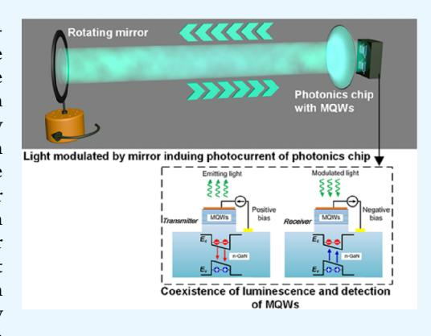
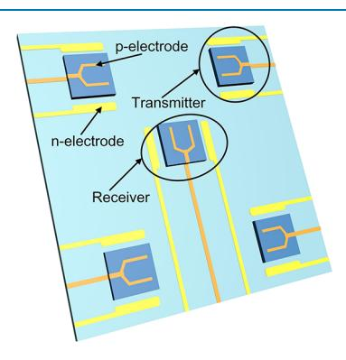
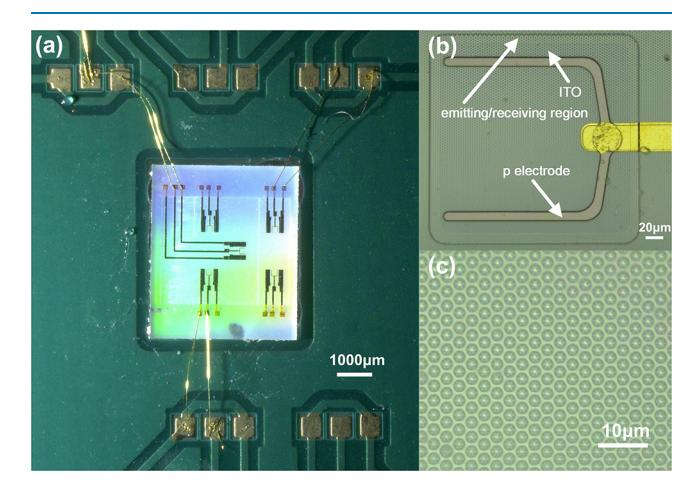
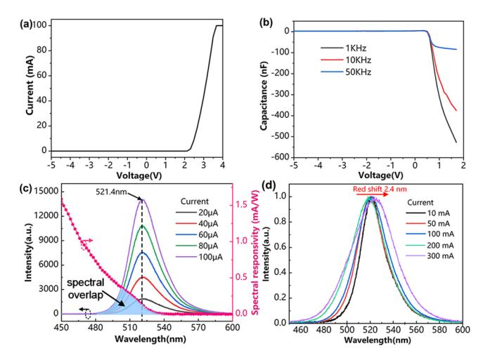
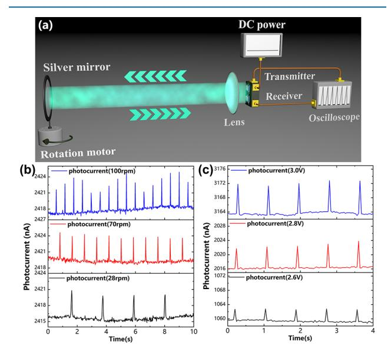
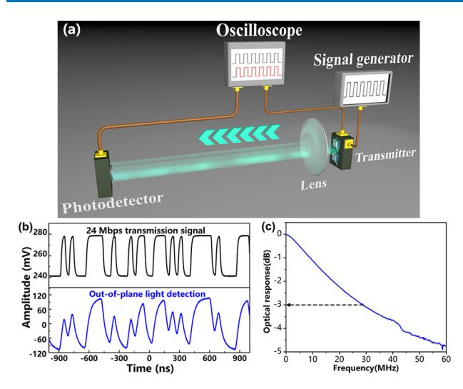
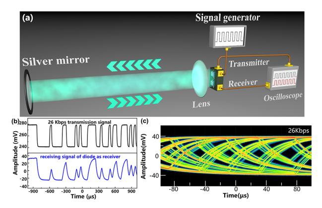

[http://pubs.acs.org/journal/acsodf](http://pubs.acs.org/journal/acsodf?ref=pdf) Article

### **Integrated Sensing and Communication Chip Based on III-Nitride for Motion Detection**

[Xin](https://pubs.acs.org/action/doSearch?field1=Contrib&text1="Xin+Li"&field2=AllField&text2=&publication=&accessType=allContent&Earliest=&ref=pdf) Li,[\\*](#page-3-0) [Mingyu](https://pubs.acs.org/action/doSearch?field1=Contrib&text1="Mingyu+Han"&field2=AllField&text2=&publication=&accessType=allContent&Earliest=&ref=pdf) Han, [Meipeng](https://pubs.acs.org/action/doSearch?field1=Contrib&text1="Meipeng+Chen"&field2=AllField&text2=&publication=&accessType=allContent&Earliest=&ref=pdf) Chen, [Yun](https://pubs.acs.org/action/doSearch?field1=Contrib&text1="Yun+Li"&field2=AllField&text2=&publication=&accessType=allContent&Earliest=&ref=pdf) Li, [Feifei](https://pubs.acs.org/action/doSearch?field1=Contrib&text1="Feifei+Qin"&field2=AllField&text2=&publication=&accessType=allContent&Earliest=&ref=pdf) Qin, [Gangyi](https://pubs.acs.org/action/doSearch?field1=Contrib&text1="Gangyi+Zhu"&field2=AllField&text2=&publication=&accessType=allContent&Earliest=&ref=pdf) Zhu, [Linning](https://pubs.acs.org/action/doSearch?field1=Contrib&text1="Linning+Wang"&field2=AllField&text2=&publication=&accessType=allContent&Earliest=&ref=pdf) Wang, and [Yongjin](https://pubs.acs.org/action/doSearch?field1=Contrib&text1="Yongjin+Wang"&field2=AllField&text2=&publication=&accessType=allContent&Earliest=&ref=pdf) Wang[\\*](#page-3-0)

**Cite This:** *ACS Omega* 2023, 8, [14656−14661](https://pubs.acs.org/action/showCitFormats?doi=10.1021/acsomega.3c00521&ref=pdf) **Read [Online](https://pubs.acs.org/doi/10.1021/acsomega.3c00521?ref=pdf)**

ACCESS [Metrics](https://pubs.acs.org/doi/10.1021/acsomega.3c00521?goto=articleMetrics&ref=pdf) & More Article [Recommendations](https://pubs.acs.org/doi/10.1021/acsomega.3c00521?goto=recommendations&?ref=pdf)

ABSTRACT: Integrated Sensing and Communication (ISAC) involves incorporating wireless sensing capabilities into communication systems. The integration of ISAC affords improvements in the performance of the communication system, as well as the ability to perform high-precision motion detection, positioning, imaging, and other related functions. Therefore, it is highly valuable to develop an ISAC terminal device that has a high degree of integration and energy efficiency. Here, we propose an ISAC chip that utilizes the coexistence of luminescence and detection properties of III-nitride multiple quantum wells for motion detection and visible light communication. The ISAC chip includes both a transmitter and a receiver of visible light and is fabricated on a sapphire wafer with InGaN/GaN multiple quantum wells. A rotating mirror is used as the object for motion detection and modulates the light signal emitted by the transmitter in a reflected light path. The variation period of the photocurrent curve generated by the modulated light signal is consistent with the rotation period of the mirror. We

also investigate the performance of this chip as a transmitter and transceiver terminal of visible light communication systems. The results of the study provide a promising approach for the integration of motion sensing and visible light communication.

# ■ **INTRODUCTION**

Integrated Sensing and Communication (ISAC) is a technology that enables the integration of sensing and communication functionalities within a single transmission, device, and ultimately a unified network infrastructure.[1](#page-4-0) The communication band of ISAC extends to higher frequencies, such as terahertz and visible light, which overlaps with the sensing band. This advancement has led to numerous applications in various fields, including Internet of Vehicles, smart cities/homes, and military communications[.2,3](#page-4-0) These applications have a strong demand for high-precision motion detection and positioning capabilities, making ISAC an ideal solution to address these needs.

Motion detection technology has a broad range of potential application, including security system, IoT (internet of things), elderly care, autopilot systems, and smart cities, among others[.4](#page-4-0)−[6](#page-4-0) Currently, motion detection technologies such as PIR (passive infrared), optical camera, LIDAR (light detection and ranging), and microwave are widely used.[7](#page-4-0)−[9](#page-4-0) These technologies have their own advantages and limitations, thus highlighting the need to pursue the development of accurate and reliable new motion detection technologies in the future. One promising area of research is the use of visible light signals for motion detection, which utilizes the physical principles similar to those of LIDAR but employs vehicle LED (lightemitting diode) headlamps instead of laser sources[.10](#page-4-0) Some researchers have already developed visible light motion detection systems for vehicle speed estimation and indoor positioning by using the LED headlamps and the indoor lighting as light sources.[11](#page-4-0)−[13](#page-4-0) However, these systems still face critical challenges due to the need to set up a separate network of light sources and photodetectors, including issues related to large size, high cost, and limited application scenarios. Therefore, further research is necessary to overcome these challenges and advance the development of visible light motion detection technology.

Monolithic III-nitride photonic chips with MQWs offer desirable properties such as detection and communications in the visible range[.14](#page-4-0)−[16](#page-4-0) Because of the coexistence of visible light emission and detection in III-nitride MQWs, it makes them a suitable material choice for developing integrated optical sensing devices that are low-cost and consume less power[.17](#page-4-0)−[20](#page-4-0) Li et al. have demonstrated a monolithic LED-PD

Received: January 25, 2023 Accepted: April 4, 2023 Published: April 13, 2023

(photodiode) chip with III-nitride MQWs to monitor the PPG (photoplethysmographic) signal variations for heart pulse without relying on external PD.21 Zhong et al. utilized GaN with a honeycomb nanonetwork structure epitaxially grown on Si wafer for capacitive H2 gas sensors.22 Zhang et al. fabricated a membrane light-emitting diode sensor utilizing the piezoelectric signals for real-time flow rate detection.23 We have also proposed an integrated photonics chip with micro-LED and free-standing bended waveguide based on InGaN/GaN MQWs to change the propagation direction of light and achieve visible light communication (VLC) with high speed.24

In this paper, we proposed an ISAC chip for motion detection and VLC based on the coexistence of luminescence and detection properties of III-nitride multiple quantum wells. The chip is designed for motion detection and VLC applications and features a transmitter and receiver on a sapphire wafer with InGaN/GaN MQWs. To enable motion detection, the light emitting from the transmitter is modulated by a rotating mirror, which serves as the motion detection object. As the modulated light is reflected back to the receiver, we can monitor the rotating speeds of the mirror by detecting the photocurrent of the receiver. In addition to motion detection, we also evaluate the VLC performance of the photonics chip. The stable communication performance ensures that the chip can process and transmit the signals collected by motion detection. The work presents in this paper a promising approach for integrating motion sensing and VLC, opening up new possibilities for future applications. It can also enable the micro LED array devices for lighting and display with motion sensing capabilities. The motion sensing signals can then be loaded into the micro LED devices through a photocurrent carrier waveform and transmitted via VLC. The chip in this paper can be used in some scenarios where composite functional terminals are needed, such as smart lighting, intelligent vehicle, and IoT. Moreover, the relatively small loss of green light in the underwater transmission provides unique opportunities for using this photonics chip in the field of underwater ISAC applications.25

The III-nitride diodes of the photonics chip with four transmitters in the corner and a receiver in the center is presented in Figure 1. The green light emitted from the transmitter is modulated by the motion of a target object and reflected back to the receiver. By monitoring the variation of the photocurrent in the receiver, we can detect the motion of the target object with high accuracy and precision.

**Figure 1.** Schematic of a monolithic III-nitride photonics chip for motion detection.

#### MATERIALS AND METHODS

The epitaxial films are grown by metal—organic chemical vapor deposition (MOCVD) on a 4-inch sapphire substrate. The epitaxial films consist of 1.4 μm n-GaN, 500 nm InGaN/GaN MQWs, and 350 nm p-GaN. The active regions are defined by photolithography, followed by ICP (inductively coupled plasma) etching. A deep ICP etching is performed to achieve complete electrical isolation between diodes. A 230 nm transparent ITO (indium tin oxide) current spreading layer is deposited by sputtering, followed by rapid thermal annealing in  $N_2$ . The ITO layer is etched by ICP to expose n-GaN regions. The Ni/Al/Ti/Pt/Ti/Pt/Au/Ti/Pt/Ti metal films as p/n electrodes are deposited on n-GaN and ITO by e-beam evaporation, followed by a lift-off process. Then, a 1000 nmthick SiO2 layer is deposited by PECVD (plasma-enhanced chemical vapor deposition). The bonding pad is defined by photolithography, and Ni/Al/Ti/Pt/Ti/Pt/Au metal films are deposited by e-beam evaporation, followed by a lift-off process. The sapphire substrate is thinned to 200  $\mu$ m. The DBR (distributed Bragg reflection) layers with 2  $\mu$ m thickness consist of pairs of 13 pairs of periodically arranged SiO2 layer and TiO2 layer. To achieve high reflectivity at the target wavelength, the DBR has an inhomogeneous thickness distribution of the SiO2/TiO2 pair. The thickness of the SiO2 layer is 40-90 nm, and the thickness of the TiO2 layer is 30-120 nm. The chips are finally diced by ultraviolet nanosecond laser micromachining and connected to the PCB (printed circuit board).

#### RESULTS AND DISCUSSION

Figure 2a shows the optical microscope image of the monolithic III-nitride photonics chip for motion detection.

**Figure 2.** Optical microscope image of a monolithic III-nitride photonics chip for motion detection. (a) Photonics chip connected to the PCB. (b) Magnified image of the emitting/receiving region. (c) Magnified image of the DBR.

One receiver and two transmitters are separately wire-bonded on the PCB for further testing. As shown in Figure 2b, the emitting/receiving region is etched into a square with a length of 240  $\mu$ m. The DBR layer on the bottom of the sapphire substrate in Figure 2c is an array of columnar structures with a period of 3  $\mu$ m and a diameter of 2.5  $\mu$ m.

The I–V (current–voltage) characteristic of the transmitter/receiver is illustrated in Figure 3a and was characterized using an Agilent B1500A semiconductor device analyzer with a

Figure 3. (a) I−V curve of the transmitter/receiver on the monolithic III-nitride photonics chip. (b) C−V curve of the transmitter/receiver. (c) EL spectra of the transmitter and spectral responsivity of the receiver. (d) Normalized EL spectra of the transmitter with 10−300 mA currents.

saturation current of 100 mA. The transmitter's turn-on voltage is 2.3 V, and it reaches a 100 mA saturation current at 3.7 V. By examining the linear region of the I−V curve, a dynamic resistance of 12.86 Ω was extracted. The transmitter emits green light with a broad spectrum due to the complicated recombination of confined carriers inside the MQWs. Additionally, the high-energy photons generated by the receiver may be absorbed to liberate electron−hole pairs. In Figure 3b, the C−V (capacitance−voltage) characteristics demonstrate the negative capacitance behavior of the transmitter under an AC (alternating current) signal with different frequencies (1−50 kHz). The junction capacitance value is positive under negative bias voltage, decreases, and then drops down to a negative value after reaching the turn-on voltage with increasing positive bias voltage. To improve the response speed of the transmitter, reducing of the RC (resistor capacitance) time constant is recommended. Lower RC time constants are always accompanied by a lower absolute value of negative junction capacitance. The absolute value of negative junction capacitance increases at a lower AC signal frequency and a higher positive bias voltage. At the 1 V bias voltage, the absolute value of negative junction capacitance for 1, 10, and 50 kHz AC signals were 309, 224.7, and 75.1 nF, respectively. The emitted light of the transmitter was collected by an optical fiber and coupled into an Ocean Optics USB4000 spectrometer for characterization. Figure 3c shows the EL (electroluminescence) spectra of the transmitter versus injection currents. The dominant spectral peak is 521.4 nm in the green range, and the FWHM (full width at half maximum) is 28.9 nm. Using the Oriel IQE-200B (Newport Corp) system as shown in the pink line in Figure 3c, the spectral responsivity of the receiver was measured by illumination with monochromatic light. The responsivity decreases as the wavelength increases. The spectral overlap refers to the range of wavelengths where the emitted light from the transmitter can be modulated and converted into photocurrent in the MQWs of the receiver. The spectral overlap is the range between 490 and 536 nm, which spans at 46 nm. The spectral overlap ensures the realization of optical monitoring using the monolithic III-nitride photonics chip with two diodes as transmitter/receiver. As the current increased from 10 to 300 mA, we observed a shift in the peak wavelength of the EL spectrum from 521.4 to 523.8 nm, as illustrated in Figure 3d. Despite the red shift of 2.4 nm caused by the Joule heating effect, the EL spectrum still overlaps with the spectral responsivity at higher currents.

Figure 4a illustrates the motion detection test setup for the monolithic III-nitride photonics chip, shown in Figure 4. A

Figure 4. (a) Schematic of the motion detection test setup for the monolithic III-nitride photonics chip. (b) Photocurrent for motion detection of the mirror with different rotational speed and the transmitter with 2.8 V bias. (c) Photocurrent for motion detection of the mirror with 70 rpm rotational speed and the transmitter with different bias voltages.

rotation motor with variable speed is installed at the bottom of the silver mirror, at the end of the reflected light path. The transmitter was subjected to a bias voltage of 2.8 V, while the rotation speeds of the motor were set to 28, 70, and 100 rpm. As the rotating mirror modulates the reflected light signal, it causes the change of the photocurrent of the receiver, resulting in a variation period consistent with the rotation period of the mirror, as depicted in Figure 4b. Therefore, the photonics chip can detect motion by sensing changes of photocurrent. Additionally, we explored the effect of transmitter bias voltage on the variation amplitude of the receiver's photocurrent, as shown in Figure 4c. At 70 rpm of rotation motor, increasing the bias voltage from 2.6 to 3 V resulted in the corresponding variation amplitude of photocurrent changing from 3 to 9 nA. In the linear dynamic range of the transmitter, higher bias voltage corresponded to greater emitting light signal intensity and better motion monitoring performance.

[Figure](#page-3-0) 5a shows the results of a free-space VLC test conducted to investigate the transmission speed of the monolithic III-nitride photonics chip used as a transmitter. To load the transmission signal onto the transmitter, an arbitrary waveform generator (Keysight 81160A) was employed, which generated a 24 Mbps random binary sequence. An aspheric condenser lens was placed to capture the optical signal that was then sent to an avalanche photodiode (Hamamatsu C12702-12) to amplify the received light signal to electrical signal. The transmission and receiving signals were characterized by an Agilent DSO9254A digital

Figure 5. (a) Schematic of the free-space visible light communication test setup for the monolithic III-nitride photonics chip as a transmitter. (b) The transmission/receiving signal characterized by an oscilloscope at 24 Mbps. (c) 3 dB modulation bandwidth of the monolithic III-nitride photonics chip as a transmitter at 10 mA current.

storage oscilloscope, as illustrated in Figure 5b, and the signal waveform at 24 Mbps remained well-preserved during transmission. In addition, the 3 dB modulation bandwidth of the transmitter at 10 mA current is presented in Figure 5c, and it achieved 28.2 MHz (as tested by a vector network analyzer, Keysight E5080A). These results demonstrate that the monolithic III-nitride photonics chip as a transmitter has the capability to achieve high-speed transmission in optical communication in the green band. The 3 dB modulation bandwidth can be estimated by 26

$$f = 2\pi/RC \tag{1}$$

To increase the 3 dB modulation bandwidth, one can reduce the active region's area and decrease the capacitance, where *R* represents the series resistance and *C* represents the diode capacitance. However, it is important to note that excessively small active regions may negatively impact the diode's lighting and detection performance. Additionally, the minority carrier lifetime is a significant factor that limits the 3 dB modulation bandwidth, in addition to the RC constant. In future work, we anticipate enhancing the 3 dB modulation bandwidth by utilizing multiple quantum wells with shorter carrier lifetimes.

Figure 6a displays the utilization of diodes in the monolithic III-nitride photonics chip as the transmitter and receiver, respectively, in VLC testing. The light signal travels to the receiver on the same chip via the reflected light path using a silver mirror. The receiver operates on zero bias. The oscilloscope characterizes the transmission and receiving signal, as presented in Figure 6b, with the signal waveform remaining intact throughout transmission. The open eye diagram at 26 kbps is illustrated in Figure 6c. With the ability to emit and detect visible light signals simultaneously, the monolithic III-nitride photonics chip can construct an efficient VLC system.

In conclusion, an ISAC chip for motion detection and VLC has been developed using sapphire wafer with epitaxial films consisting of InGaN/GaN MQWs. Based on the coexistence of luminescence and detection properties in InGaN/GaN MQWs, the diodes on the photonics chip can emit and

**Figure 6.** (a) Schematic of the free-space visible light communication test setup for the monolithic III-nitride photonics chip as transmitter and receiver. (b) Transmission/receiving signal characterized by an oscilloscope at 26 kbps. (c) Eye diagrams measured at 26 kbps.

receive visible light signals in the green band. The EL of the transmitter and responsivity spectra of the receiver overlap by 46 nm. The transmitter emits green light that is modulated by a rotating mirror and then reflected back to the receiver on the same chip. The rotation speed of the mirror is monitored by detecting the photocurrent of the receiver. The variation period of the photocurrent is consistent with the rotation speed of the mirror, which is set at either 28, 70, or 100 rpm. We study the effect of transmitter bias voltage on the variation amplitude of photocurrent of the receiver. The effect of transmitter bias voltage on the variation amplitude of the photocurrent of the receiver was studied, with the bias voltage increased from 2.6 to 3 V. Results indicate that the variation amplitude of photocurrent increases from 3 to 9 nA at a rotation speed of 70 rpm. The VLC performance of the photonics chip was also investigated, with transmission speeds reaching 24 Mbps as a transmitter and 26 kbps as a transceiver. The stable communication performance of the photonics chip ensures reliable processing and transmission of signals collected by motion detection. This work offers a promising solution for low-cost, low-power consumption, and highintegration applications of the photonics chip based on IIInitride MQWs in ISAC fields.

#### AUTHOR INFORMATION

#### **Corresponding Authors**

Xin Li — GaN Optoelectronic Integration International Cooperation Joint Laboratory of Jiangsu Province, Nanjing University of Posts and Telecommunications, Nanjing 210003, China; Key Lab of Broadband Wireless Communication and Sensor Network Technology (Nanjing University of Posts and Telecommunications), Ministry of Education, Nanjing 210003, China; oorcid.org/0000-0002-3370-013X; Email: lixin1984@njupt.edu.cn

Yongjin Wang — GaN Optoelectronic Integration International Cooperation Joint Laboratory of Jiangsu Province, Nanjing University of Posts and Telecommunications, Nanjing 210003, China; ⊚ orcid.org/ 0000-0001-8109-4640; Email: wangyj@njupt.edu.cn

#### **Authors**

Mingyu Han — GaN Optoelectronic Integration International Cooperation Joint Laboratory of Jiangsu Province, Nanjing University of Posts and Telecommunications, Nanjing 210003, China

- Meipeng Chen − *GaN Optoelectronic Integration International Cooperation Joint Laboratory of Jiangsu Province, Nanjing University of Posts and Telecommunications, Nanjing 210003, China*
- Yun Li − *GaN Optoelectronic Integration International Cooperation Joint Laboratory of Jiangsu Province, Nanjing University of Posts and Telecommunications, Nanjing 210003, China*
- Feifei Qin − *GaN Optoelectronic Integration International Cooperation Joint Laboratory of Jiangsu Province, Nanjing University of Posts and Telecommunications, Nanjing 210003, China*
- Gangyi Zhu − *GaN Optoelectronic Integration International Cooperation Joint Laboratory of Jiangsu Province, Nanjing University of Posts and Telecommunications, Nanjing 210003, China;* [orcid.org/0000-0002-0109-9837](https://orcid.org/0000-0002-0109-9837)
- Linning Wang − *GaN Optoelectronic Integration International Cooperation Joint Laboratory of Jiangsu Province, Nanjing University of Posts and Telecommunications, Nanjing 210003, China*

Complete contact information is available at: [https://pubs.acs.org/10.1021/acsomega.3c00521](https://pubs.acs.org/doi/10.1021/acsomega.3c00521?ref=pdf)

### **Author Contributions**

The manuscript was written through contributions of all authors. All authors have given approval to the final version of the manuscript.

### **Notes**

The authors declare no competing financial interest.

# ■ **ACKNOWLEDGMENTS**

This work was jointly supported by the open research fund of the Key Lab of Broadband Wireless Communication and Sensor Network Technology (Nanjing University of Posts and Telecommunications), Ministry of Education (JZNY202109), the National Natural Science Foundation of China (NSFC) (62204127, 61827804), the "111" project (D17018), and the Natural Science Foundation of Jiangsu Province (No.BK20210593).

# ■ **REFERENCES**

- (1) Wei, Z.; Liu, F.; Masouros, C.; Su, N.; Petropulu, A. P. [Toward](https://doi.org/10.1109/MCOM.002.2100972) [Multi-Functional](https://doi.org/10.1109/MCOM.002.2100972) 6G Wireless Networks: Integrating Sensing, [Communication,](https://doi.org/10.1109/MCOM.002.2100972) and Security. *IEEE Commun. Mag.* 2022, *60*, 65−71.
- (2) Zhang, Q.; Sun, H.; Wei, Z.; Feng, Z. Sensing and Communication Integrated System for Autonomous Driving Vehicles. *In IEEE INFOCOM 2020 - IEEE Conference on Computer Communications Workshops (INFOCOM WKSHPS);* IEEE, 2020; pp. 1278−1279.
- (3) Wymeersch, H.; Shrestha, D.; De Lima, C. M.; Yajnanarayana, V.; Richerzhagen, B.; Keskin, M. F.; Schindhelm, K.; Ramirez, A.; Wolfgang, A.; De Guzman, M. F.; Haneda, K.; Svensson, T.; Baldemair, R.; Parkvall, S. Integration of Communication and Sensing in 6G: A Joint Industrial and Academic Perspective. *In IEEE International Symposium on Personal, Indoor and Mobile Radio Communications,* PIMRC*;* IEEE, 2021; Vol. *2021-Septe*, pp. 1−7.
- (4) Sasi, G. Motion [Detection](https://doi.org/10.1088/1742-6596/1717/1/012067) Using Passive Infrared Sensor Using [IoT.](https://doi.org/10.1088/1742-6596/1717/1/012067) *J. Phys. Conf. Ser.* 2021, *1717*, No. 012067.
- (5) Zhang, J.; Song, R.; Zhao, X.; Fang, R.; Zhang, B.; Qian, W.; Zhang, J.; Liu, C.; He, D. Flexible [Graphene-Assembled](https://doi.org/10.1021/acsomega.0c00263?urlappend=%3Fref%3DPDF&jav=VoR&rel=cite-as) Film-Based Antenna for Wireless Wearable Sensor with [Miniaturized](https://doi.org/10.1021/acsomega.0c00263?urlappend=%3Fref%3DPDF&jav=VoR&rel=cite-as) Size and High [Sensitivity.](https://doi.org/10.1021/acsomega.0c00263?urlappend=%3Fref%3DPDF&jav=VoR&rel=cite-as) *ACS Omega* 2020, *5*, 12937−12943.

- (6) He, J.; Huang, Z.; Yu, K. [High-Accuracy](https://doi.org/10.1364/OE.389107) Scheme Based on a Look-up Table for Motion [Detection](https://doi.org/10.1364/OE.389107) in an Optical Camera [Communication](https://doi.org/10.1364/OE.389107) System. *Opt. Express* 2020, *28*, 10270.
- (7) Paul, S. J.; Elizabeth, I.; Srivastava, S.; Tawale, J. S.; Chandra, P.; Barshilia, H. C.; Gupta, B. K. [Epidermal](https://doi.org/10.1021/acsomega.2c04563?urlappend=%3Fref%3DPDF&jav=VoR&rel=cite-as) Inspired Flexible Sensor with [Buckypaper/PDMS](https://doi.org/10.1021/acsomega.2c04563?urlappend=%3Fref%3DPDF&jav=VoR&rel=cite-as) Interfaces for Multimodal and Human Motion Monitoring [Applications.](https://doi.org/10.1021/acsomega.2c04563?urlappend=%3Fref%3DPDF&jav=VoR&rel=cite-as) *ACS Omega* 2022, *7*, 37674−37682.
- (8) Li, C.; Peng, Z.; Huang, T. Y.; Fan, T.; Wang, F. K.; Horng, T. S.; Munoz-Ferreras, J. M.; Gomez-Garcia, R.; Ran, L.; Lin, J. A [Review](https://doi.org/10.1109/TMTT.2017.2650911) on Recent Progress of Portable [Short-Range](https://doi.org/10.1109/TMTT.2017.2650911) Noncontact Microwave Radar [Systems.](https://doi.org/10.1109/TMTT.2017.2650911) *IEEE Trans. Microwave Theory Tech.* 2017, *65*, 1692− 1706.
- (9) Teli, S.; Cahyadi, W. A.; Chung, Y. H. Optical [Camera](https://doi.org/10.1109/MCOM.2017.1600923) [Communication:](https://doi.org/10.1109/MCOM.2017.1600923) Motion over Camera. *IEEE Commun. Mag.* 2017, *55*, 156−162.
- (10) Abuella, H.; Miramirkhani, F.; Ekin, S.; Uysal, M.; Ahmed, S. ViLDAR - Visible Light [Sensing-Based](https://doi.org/10.1109/TVT.2019.2941705) Speed Estimation Using Vehicle [Headlamps.](https://doi.org/10.1109/TVT.2019.2941705) *IEEE Trans. Veh. Technol.* 2019, *68*, 10406− 10417.
- (11) Sewaiwar, A.; Tiwari, S. V.; Chung, Y.-H. [Visible](https://doi.org/10.1364/OE.23.018769) Light [Communication](https://doi.org/10.1364/OE.23.018769) Based Motion Detection. *Opt. Express* 2015, *23*, 18769.
- (12) Memedi, A.; Dressler, F. Vehicular Visible Light [Communica](https://doi.org/10.1109/COMST.2020.3034224)tions: A [Survey.](https://doi.org/10.1109/COMST.2020.3034224) *IEEE Commun. Surv. Tutorials* 2021, *23*, 161−181.
- (13) Xie, C.; Guan, W.; Wu, Y.; Fang, L.; Cai, Y. The [LED-ID](https://doi.org/10.1109/JPHOT.2018.2809731) Detection and [Recognition](https://doi.org/10.1109/JPHOT.2018.2809731) Method Based on Visible Light Positioning Using [Proximity](https://doi.org/10.1109/JPHOT.2018.2809731) Method. *IEEE Photonics J.* 2018, *10*, 1−16.
- (14) Kao, Y. H.; Chao, P. C. P.; Hung, Y.; Wey, C. L. A New Reflective PPG LED-PD Sensor Module for Cuffless Blood Pressure Measurement at Wrist Artery. *Proc. IEEE Sensors 2017*, 2017; Vol. *2017*pp. 1−3.
- (15) Cho, I.; Sim, Y. C.; Cho, M.; Cho, Y. H.; Park, I. [Monolithic](https://doi.org/10.1021/acssensors.9b02487?urlappend=%3Fref%3DPDF&jav=VoR&rel=cite-as) Micro [Light-Emitting](https://doi.org/10.1021/acssensors.9b02487?urlappend=%3Fref%3DPDF&jav=VoR&rel=cite-as) Diode/Metal Oxide Nanowire Gas Sensor with [Microwatt-Level](https://doi.org/10.1021/acssensors.9b02487?urlappend=%3Fref%3DPDF&jav=VoR&rel=cite-as) Power Consumption. *ACS Sensors* 2020, *5*, 563− 570.
- (16) Wang, L.; Li, X.; Gao, X.; Jia, B.; Guan, Q.; Ye, Z.; Fu, K.; Jin, R.; Wang, Y. [Asymmetric](https://doi.org/10.1364/OL.415007) Optical Links Using Monolithic III-Nitride [Diodes.](https://doi.org/10.1364/OL.415007) *Opt. Lett.* 2021, *46*, 376.
- (17) Zhu, Y.; Xu, G.; Yuan, J.; Jo, J.; Gandikota, G.; Demirci, H.; Agano, T.; Sato, N.; Shigeta, Y.; Wang, X. Light [Emitting](https://doi.org/10.1038/s41598-018-28131-4) Diodes Based [Photoacoustic](https://doi.org/10.1038/s41598-018-28131-4) Imaging and Potential Clinical Applications. *Sci. Rep.* 2018, *8*, 9885.
- (18) Wang, Y.; Wang, X.; Zhu, B.; Shi, Z.; Yuan, J.; Gao, X.; Liu, Y.; Sun, X.; Li, D.; Amano, H. Full-Duplex Light [Communication](https://doi.org/10.1038/s41377-018-0083-0) with a Monolithic [Multicomponent](https://doi.org/10.1038/s41377-018-0083-0) System. *Light Sci. Appl.* 2018, *7*, 83.
- (19) Li, K. H.; Fu, W. Y.; Cheung, Y. F.; Wong, K. K. Y.; Wang, Y.; Lau, K. M.; Choi, H. W. [Monolithically](https://doi.org/10.1364/OPTICA.5.000564) Integrated InGaN/GaN Light-Emitting Diodes, [Photodetectors,](https://doi.org/10.1364/OPTICA.5.000564) and Waveguides on Si [Substrate.](https://doi.org/10.1364/OPTICA.5.000564) *Optica* 2018, *5*, 564.
- (20) Feng, M.; Wang, J.; Zhou, R.; Sun, Q.; Gao, H.; Zhou, Y.; Liu, J.; Huang, Y.; Zhang, S.; Ikeda, M.; Wang, H.; Zhang, Y.; Wang, Y.; Yang, H. On-Chip Integration of [GaN-Based](https://doi.org/10.1109/JSTQE.2018.2815906) Laser, Modulator, and [Photodetector](https://doi.org/10.1109/JSTQE.2018.2815906) Grown on Si. *IEEE J. Sel. Top. Quantum Electron.* 2018, *24*, 1−5.
- (21) Chen, L.; Wu, Y. P.; Li, K. H. Monolithic [InGaN/GaN](https://doi.org/10.1364/OL.400733) Photonic Chips for Heart Pulse [Monitoring.](https://doi.org/10.1364/OL.400733) *Opt. Lett.* 2020, *45*, 4992. (22) Yu, H.; Sun, A.; Liu, Y.; Zhou, Y.; Fan, P.; Luo, J.; Zhong, A. Capacitive Sensor Based on GaN Honeycomb [Nanonetwork](https://doi.org/10.1016/j.snb.2021.130488) for Ultrafast and Low [Temperature](https://doi.org/10.1016/j.snb.2021.130488) Hydrogen Gas Detection. *Sens. Actuators, B* 2021, *346*, No. 130488.
- (23) Zhang, S.; Shi, Z.; Yuan, J.; Gao, X.; Cai, W.; Jiang, Y.; Liu, Y.; Wang, Y. Membrane [Light-Emitting](https://doi.org/10.1002/admt.201700285) Diode Flow Sensor. *Adv. Mater. Technol.* 2018, *3*, 1700285.
- (24) Li, X.; Jiang, Y.; Li, J.; Shi, Z.; Zhu, G.; Wang, Y. [Integrated](https://doi.org/10.1016/j.optlastec.2019.01.041) Photonics Chip with InGaN/GaN [Light-Emitting](https://doi.org/10.1016/j.optlastec.2019.01.041) Diode and Bended Waveguide for Visible-Light [Communications.](https://doi.org/10.1016/j.optlastec.2019.01.041) *Opt. Laser Technol.* 2019, *114*, 103−109.
- (25) Wang, F.; Liu, Y.; Jiang, F.; Nan, C. High Speed [Underwater](https://doi.org/10.1016/j.optcom.2018.04.073) Visible Light [Communication](https://doi.org/10.1016/j.optcom.2018.04.073) System Based on LED Employing

Maximum Ratio [Combination](https://doi.org/10.1016/j.optcom.2018.04.073) with Multi-PIN Reception. *Opt. Commun.* 2018, *425*, 106−112.

(26) Zhou, Z.; Yan, B.; Teng, D.; Liu, L.; Wang, G. [Improving](https://doi.org/10.1016/j.optcom.2017.01.050) the −3dB Bandwidth of Medium Power [GaN-based](https://doi.org/10.1016/j.optcom.2017.01.050) LEDs through Periodic Micro Via-holes for Visible Light [Communications.](https://doi.org/10.1016/j.optcom.2017.01.050) *Opt. Commun.* 2017, *392*, 175−179.

