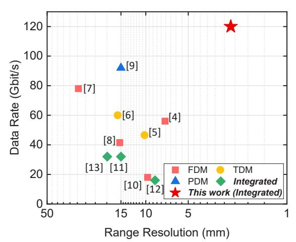
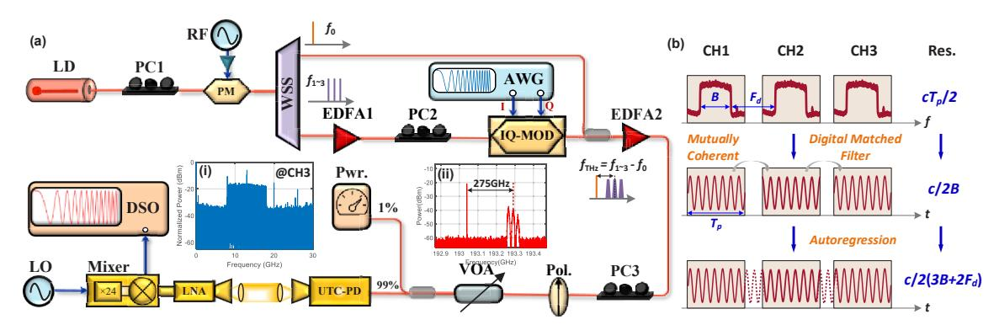
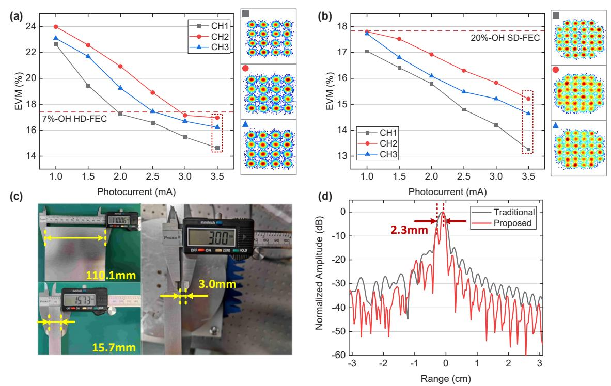

# Photonic THz-ISAC Demonstration with Simultaneous 120Gbit/s Communication and 2.5mm Sensing Resolution

Zhidong Lyu(1), Lu Zhang(1\*), Zuomin Yang(1), Hongqi Zhang(1), Changming Zhang(2), Hang Yang(1), Nan Li(1), Vjačeslavs Bobrovs(5), Oskars Ozolins(3, 4, 5), Xiaodan Pang(3, 4, 5), and Xianbin Yu(1\*)

- (1) College of Information Science and Electronic Engineering, Zhejiang University, 310027 Hangzhou, China, zhanglu1993@zju.edu.cn, xyu@zju.edu.cn
- (2) Zhejiang Lab, Hangzhou 311121 China
- (3) Applied Physics Department, KTH Royal Institute of Technology, 106 91 Stockholm, Sweden
- (4) RISE Research Institutes of Sweden, 164 40 Kista, Sweden
- (5) Institute of Telecommunications, Riga Technical University, 1048 Riga, Latvia

**Abstract** *We demonstrate a photonic terahertz integrated sensing and communication (THz-ISAC) system, with simultaneously achieving record-high 120 Gbit/s data rate communication and 2.5 mm range sensing resolution at 240-310 GHz band, enabled by the dual-chirp-based integrated waveform and coherent fusion processing.* 

## **Introduction**

Integrated sensing and communication (ISAC) has been envisioned as a promising technology in the next generation wireless access due to spectral congestion and increasing complexity of existing wireless networks [1]. Compared with traditional all-solid-state electronic systems, the photonics-based approach can provide ultrabroad bandwidth and mitigate in-band harmonic interference [2,3]. Recent photonic ISAC demonstrations were realized with frequency-, time-, and polarization-division multiplexing (FDM, TDM, and PDM). However, they suffer from additional resources overhead, limited timefrequency product, and fail to achieve expected mutual gain [4-11], therefore motivating the research on the integrated waveforms [12-14]. Fig. 1 summarizes the recent demonstrations on photonic ISAC in millimetre-wave (MMW) and THz bands. Amongst those efforts, an electromagnetic PDM-based system has achieved wireless communication of close to 100 Gbit/s, but only with a centimeter-scale resolution [10]. Additionally, enabled by the multiband coherent fusion processing (CFP) algorithm, range resolutions of 9.7 mm and 8.6 mm have been realized, however, only with communication rates below 20 Gbit/s [11,13].

In this paper, we propose and experimentally demonstrate a 3-channel photonic THz-ISAC transmission at 275 GHz with a channel spacing of 25 GHz, each channel combining 16 quadrature amplitude modulation (QAM) or 32- QAM signals with the chirp carrier. The resulting wireless communication rates of up to 120 Gbit/s are higher than other reported photonic ISAC systems. Furthermore, the range sensing resolution record of 2.5 mm is achieved simultaneously using the CFP algorithm. The proposed photonic THz-ISAC scheme highlights the strong potential of integrated waveforms in high-capacity and high-resolution fibre-wireless transmission systems.

## **Experimental Setup**

The experimental setup for the demonstration of 120 Gbit/s transmission and 2.5 mm range resolution is depicted in Fig. 2(a). A continuous lightwave centered at 1552 nm is radiated from a laser diode (LD), and then launched into an optical phase modulator (PM) to generate the coherent optical frequency comb (OFC). Here, a polarization controller (PC1) is employed to optimize the incident polarization state of the PM. A 25 GHz radio frequency source (RF) is amplified to 34 dBm by a power amplifier (PA) with a 22 dB gain to drive the PM. Subsequently, a programmable wavelength selective switch (WSS) is used to filter out one comb line for the optical local oscillator (LO), and 3 other comb

**Fig. 1:** Recent reported ISAC demonstrations with respect to the data rates and range resolutions.

Fig. 2: (a) Experimental setup. (b) Principle of the coherent fusion processing algorithm.

lines spaced 25 GHz apart for multi-channel baseband integrated signal modulation. The frequency spacing of the LO line and 3 optical carriers are 250 GHz, 275 GHz, and 300 GHz, respectively. After that, the optical carriers in the lower branch shown in Fig. 2(a) are amplified by the Erbium-doped fiber amplifier (EDFA1), and then injected into an optical in-phase and quadrature modulator (IQ-MOD) for the designed dual-chirp-based waveform modulation, in-between the PC2 is used to maximize the output power of IQ-MOD.

In our experiment, the baseband dual-chirpbased integrated signal is generated from a 120 GSa/s arbitrary waveform generation (AWG). In the digital domain, the 15-order pseudorandom bit sequence (PRBS), serving as the data sequence, is mapped into the 16- or 32-QAM format and modulated onto the up-chirp carrier, with a 10 GHz bandwidth and 1  $\mu$ s time duration. Subsequently, the down-chirp synchronization pilot, with the same bandwidth and duration as the up-chirp carrier but one-fifteenth of the amplitude, is periodically inserted for chirp carrier mismatch compensation. Experimental results have shown that the communication modulation on chirp carriers can introduce sidelobe level suppression ratio gains without deterioration of resolution [15]. The modulated optical carriers are then combined together with the optical LO using a 3 dB optical coupler (OC), and power amplification is performed in the EDFA2. The inset of Fig. 2(a) shows the measured optical spectra of the amplified signal by an optical spectrum analyzer (OSA). It should be noted that, due to its location at a high-order sideband, the power of the third channel corresponding to the 300 GHz signal suffers from slight attenuation compared with the other 2 channels. However, it also corresponds to the high-response band region of the uni-traveling carrier photodiode (UTC-PD), which can compensate for its loss in the optical domain, resulting in its performance comparable to the other channels. After

polarization optimization by the PC3 and a polarizer, the 3-channel optical signals are injected into the UTC-PD for photonic heterodyning generation of 3-channel integrated signals in the THz band. Herein, a variable optical attenuator (VOA) is employed to adjust the incident optical power of UTC-PD. The obtained THz-ISAC signal is radiated into a 0.5 m line-of-sight (LOS) wireless link and collected at the receiver side, where a pair of THz lenses are used to collimate the THz beams.

The received signals are amplified by a THz low noise amplifier (THz-LNA) with a 22 dB gain and then down-converted to the intermediated frequency (IF) band by a Schottky mixer driven by a 24-order multiplied electrical LO signal. By changing the tunable electrical LO, the 3-channel signals can be individually digitized and analyzed by a 160 GSa/s real-time digital storage oscilloscope (DSO) for further offline digital communication demodulation and radar sensing. As an example, the acquired electrical spectrum of channel 3 is shown in the inset of Fig. 2(a). Fig. 2(b) shows the details of the CFP algorithm. Note that, benefiting from the coherence of the 3channel chirp-based integrated waveform due to OFC, the range resolution of the 3-channel signals can be promoted from c/2B to  $c/2(2F_d + 3B)$  , enhancing from 15 mm to 2.5 mm, and the data rate is 3 times that of a single channel.

#### **Results and Discussions**

At the communication receiver, the sampled IF integrated signal needs to perform synchronization with a down-chirp, digital mixer, and chirp removal process in the digital domain. At that point, the obtained baseband signal can be demodulated as an ordinary QAM signal, including pre-equalizer, frequency offset estimation, phase noise compensation, and postequalizer [16]. Fig. 3(a) illustrates the 3-channel

Fig. 3: (a) Measured 3-channel EVM performance of 16-QAM. (b) Measured 3-channel EVM performance of 32-QAM. (c) Photograph of targets. (d) Measured radar range profile for two targets.

error vector magnitude (EVM) performance and the constellations, where 10 GBaud data rate 16-QAM symbols are modulated onto the up-chirp carriers. We can observe that when the photocurrent is greater than 3 mA, all the 3 channels reach the hard-decision forward error correction (HD-FEC) limit with an overhead of 7% [17], resulting in a row data rate of 10 GBaud × 4 bit/s/Hz × 3 channels = 120 Gbit/s with a net data rate of 112.15 Gbit/s. There is a performance penalty between adjacent channels of approximately 0.5 mA, which is caused by the non-flat frequency responses of the optical carriers and the THz devices. Moreover, we also conduct the wireless transmission of 8 GBaud 32-QAM, and the results are shown in Fig. 3(b). As can be seen, the measured EVM can stay below the soft-decision forward error correction (SD-FEC) with 20% overhead in all 3 channels and photocurrents, corresponding to a row data rate of 8 GBaud × 5 bit/s/Hz × 3 channels = 120 Gbit/s with a net data rate of 100 Gbit/s.

The practical sensing performance of the proposed system is also evaluated, as displayed in Fig. 3(c). Here, two static metal targets are placed on a fixed platform, and separated by 3.0 mm in the range direction. Besides, the distance between the transceiver antennas and the platform is set to 0.25 m. Fig. 3(d) shows the measured radar range profile by the traditional approach and the proposed one, respectively. It can be seen that the traditional approach with a

range resolution of 15 mm cannot distinguish the two targets. However, after the CFP processing, there are two clear peaks separated by 0.92 MHz, resulting in a measured distance of 3 × 108 m/s × 0.92 MHz × 1  $\mu$ s / 60 GHz / 2 = 2.3 mm, which is close to the theoretical value of 2.5 mm and exist 0.7 mm error with the measured results in Fig. 3(c), exhibiting the superiority mm-scale range resolution of the proposed system.

#### **Conclusions**

In summary, we experimentally demonstrate the wireless transmission of a photonic THz-ISAC system using a dual-chirp-based integrated waveform. A record communication data rate of 120 Gbit/s and a range sensing resolution of 2.5 mm are simultaneously achieved with the integrated waveform, revealing its strong potential in high-capacity and high-resolution fibre-wireless transmission systems.

#### **Acknowledgements**

This work is supported by the National Key Research and Development Program of China (2022YFB2903800) and "Pioneer" and "Leading Goose" R&D Program of Zhejiang 2023C01139, in part by the Natural National Science Foundation of China under Grant 62101483, the Natural Science Foundation of Zhejiang Province under Grant LQ21F010015.

# **References**

- [1] J. A. Zhang, M. L. Rahman, K. Wu, X. Huang, Y. J. Guo, S. Chen, and J. Yuan, "Enabling joint communication and radar sensing in mobile networks—A survey," *IEEE Communications Surveys & Tutorials*, vol. 24, no. 1, pp. 306-345, 2022. DOI: 10.1109/COMST.2021.3122519.
- [2] J. Yao, "Microwave photonic systems," *Journal of Lightwave Technology*, vol. 40, no. 20, pp. 6595-6607, 2022. DOI: 10.1109/JLT.2022.3201776.
- [3] X. Yu, H. Zhang, Z. Yang, Z. Lyu, H. Yang, Y. He, S. Liu, N. Li, O. Ozolins, X. Pang, L. Zhang, and X. Zhang, "Photonic-wireless communication and sensing in the terahertz band," in *Optical Fiber Communications Conference and Exhibition* (OFC), San Diego, CA, USA, 2023. DOI: 10.1364/OFC.2023.W4J.1.
- [4] Y. Xiong, F. Liu, Y. Cui, W. Yuan, T. X. Han, and G. Caire, "On the fundamental tradeoff of integrated sensing and communications under Gaussian channels," *IEEE Transactions on Information Theory*, vol. 69, no. 9, pp. 5723-5751, 2023. DOI: 10.1109/TIT.2023.3284449.
- [5] S. Jia, S. Wang K. Liu, X. Pang, H. Zhang, X. Jin, S. Zheng, H. Chi, X. Zhang, and X. Yu, "A unified system with integrated generation of high-speed communication and high-resolution sensing signals based on THz photonics," *Journal of Lightwave Technology*, vol. 36, no. 19, pp. 4549-4556, 2018. DOI: 10.1109/JLT.2018.2863684.
- [6] Y. Wang, Z. Dong, J. Ding, W. Li, M. Wang, F. Zhao, and J. Yu, "Photonics-assisted joint high-speed communication and high-resolution radar detection system," *Optics Letters*, vol. 46, no. 24, pp. 6103-6106, 2021. DOI: 10.1364/OL.444252.
- [7] Y. Wang, W. Li, J. Ding, J. Zhang, F. Wang, C. Wang, L. Zhao, C. Liu, W. Zhou, J. Yu, M. Lei, F. Zhao, and J. Yu, "Integrated 1.58 cm range resolution radar and 60 Gbit/s 50m wireless communication based-on photonics technology in terahertz band," in *Optical Fiber Communications Conference and Exhibition (OFC)*, San Diego, CA, USA, 2022. DOI: 10.1364/OFC.2022.Th3G.4.
- [8] Y. Wang, J. Liu, J. Ding, M. Wang, F. Zhao, and J. Yu, "Joint communication and radar sensing functions system based on photonics at the W-band," *Optics Express*, vol. 30, no. 8, pp. 13404-13415, 2022. DOI: 10.1364/OE.449153.
- [9] B. Dong, J. Jia, G. Li, J. Shi, H. Wang, J. Zhang, and N. Chi, "Demonstration of photonics-based flexible integration of sensing and communication with adaptive waveforms for a W-band fiber-wireless integrated network," *Optics Express*, vol. 30, no. 22, pp. 40936- 40950, 2022. DOI: 10.1364/OE.472693.
- [10] M. Lei, M. Zhu, Y. Cai, M. Fang, W. Luo, J. Zhang, B. Hua, Y. Zou, X. Liu, W. Tong, and J. Yu, "Integration of sensing and communication in a W-band fiber-wireless link enabled by electromagnetic polarization multiplexing," *Journal of Lightwave Technology*, 2023. DOI: 10.1109/JLT.2023.3280388.
- [11] N. Zhong, P. Li, W. Bai, W. Pan, L. Yan, and X. Zou, "Spectral-efficient frequency-division photonic millimeterwave integrated sensing and communication system using improved sparse LFM sub-bands fusion," *Journal of Lightwave Technology*, 2023. DOI: 10.1109/JLT.2023.3265799.
- [12] Z. Xue, S. Li, X. Xue, X. Zheng, and B. Zhou, "Tunable K/W-band OFDM integrated radar and communication system based on optoelectronic oscillator for intelligent transportation," *Optics Express*, vol. 30, no. 20, pp. 35270-35281, 2022. DOI: 10.1364/OE.465197.

- [13] W. Bai., P. Li, X. Zou, N. Zhong, W. Pan, X. Deng, and L. Yan, "Photonics-assisted millimeter-wave multiband integrated sensing and communication system using coherent receiving," *IEEE Journal of Selected Topics in Quantum Electronics*, vol. 29, no. 6, pp. 1-11, 2023, Art no. 7601111. DOI: 10.1109/JSTQE.2023.3276903.
- [14] L. Li, L. Zhang, H. Zhang, Z. Lyu, Z. Yang, C. Zhang, and X. Yu, "THz-over-fiber system with orthogonal chirp division multiplexing for integrated sensing and communication," in *Opto-Electronics and Communications Conference (OECC)*, Shanghai, China, 2023. DOI: 10.1109/OECC56963.2023.10209717.
- [15] Z. Lyu, L. Zhang, H. Zhang Z. Yang, L. Li, C. Zhang, and X. Yu, "LFM-PSK-based integrated sensing and communication system in the THz band," in *Opto-Electronics and Communications Conference (OECC)*, Shanghai, China, 2023. DOI: 10.1109/OECC56963.2023.10209671.
- [16] M. Sung, S. R. Moon, E. S. Kim, S. Cho, J. K. Lee, S. H. Cho, T. Kawanishi, and H. J. Song, "Design considerations of photonic THz communications for 6G networks," *IEEE Wireless Communications*, vol. 28, no. 5, pp. 185-191, 2021. DOI: 10.1109/MWC.001.2100002.
- [17] Z. K. Weng, A. Kanno, T. Kawanishi, "2-bit delta-sigma modulated 32-QAM OFDM based dual-wavelength digital RoF link," in *Optical Fiber Communication Conference (OFC)*, Washington, DC United States, 2021. DOI: 10.1364/OFC.2021.Th1A.50.