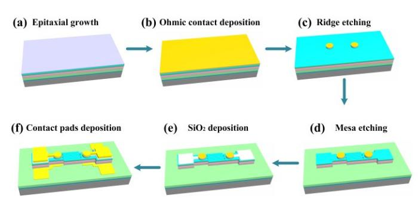
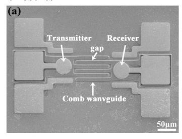
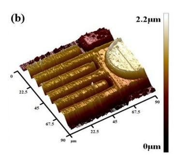
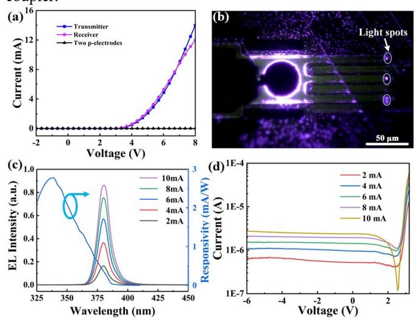
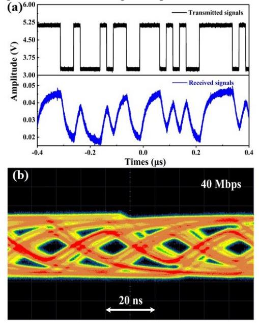
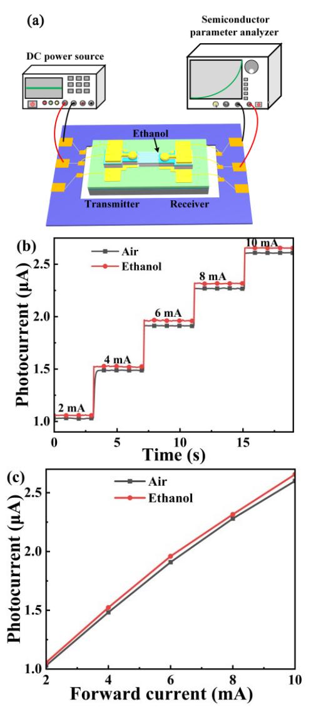

# **Monolithic III-nitride photonic circuit for integrated sensing and communication system**

Yan Jiang, Mingyuan Xie, Zheng Shi, and Yongjin Wang\* GaN Optoelectronic Integration International Cooperation Joint Laboratory of Jiangsu Province, Nanjing University of Posts and Telecommunications, Nanjing, China

E-mail: jiangyan@njupt.edu.cn

#### **Abstract**

Multifunctional optoelectronic systems are highly demanded for the Internet of Things era. Here, we propose and fabricate a monolithic III-nitride photonic circuit to achieve on-chip sensing and communication simultaneously. Two identical InGaN/AlGaN multiple quantum well (MQW) diode separately work as light transmitter and receiver in the photonic circuit due to the electroluminescence/responsivity spectra overlap of the MQW diodes. The modulated light from the transmitter is guided by the comb waveguides and finally coupled into the receiver. The channels among the comb waveguides are capable of liquid sensing at the same time. Both on-chip light communication with a data rate of 40 Mbps and dynamic liquid sensing are achieved, opening a feasible route for the development of advanced monolithic IIInitride photonic circuit toward integrated sensing and communication system.

#### **1 Introduction**

Silicon photonics chips have emerged as key players in numerous applications, including data center network, optical interconnects, quantum computing, and on-chip optical sensing, thanks to their integration on silicon substrates [1, 2]. The utilization of Si process technology has revolutionized the field of photonics by enabling the integration of various photonic components on a silicon substrate. This breakthrough has paved the way for the fabrication of complex and compact photonic circuits with enhanced functionality and performance [3]. III-nitride semiconductor is a viable candidate for optoelectronic device, owing to the characteristics of high efficiency, longevity, and stability [4, 5]. In particular, the InGaN/GaN MQW structures were manufactured into light-emitting diodes, lasers, waveguides, modulators, enabling on chip multi-component integration, and offering the various functionalities, including of detection, communication, modulator, sensing, and energy harvesting [6-8]. The structures make III-nitride-on-silicon photonic systems viable for the Internet of Things and on-chip visible light communication systems.

Optical waveguide devices are paramount in integrated photonic devices. These devices serve as channels for transmitting optical information and offer various functionalities. As the outstanding performance of large refractive index, GaN-based waveguide become an excellent chose for the in-plane photonic integrated systems. Numerous research efforts were focused on developing different waveguide designs aimed at achieving efficient light coupling and propagation for in-plane light communication [9, 10]. In addition to optical communication, optical waveguides can also be designed for various sensor. Several micro-/nano-scale optical structures have achieved sensing through the different

transduction mechanism. Elshorbagy et al. reported a refractive sensor relying on the surface plasmon resonators [11]. Lee et al. measured the refractive index of liquids by diffraction gratings [12]. It is evident that these structures each have their own advantages. However, they also exhibit a drawback in terms of process complexity. Nevertheless, a critical challenge in real-time efficient light extraction and collection techniques remain under exploration.

In this study, we introduce and fabricate a monolithic photonic circuit on a platform based on III-nitride, which consists of two identical InGaN/AlGaN MQW-diodes and a comb waveguide. The InGaN/AlGaN MQW-diodes are employed as transmitter and receiver, respectively. On the chip, the transmitter is driven to emit light and receiver detects the coupled light. The overlapping emission and detection spectra of the diode facilitated in-plane light communication. Although prior GaN-based photonic chips exhibited the ability of monitoring color, millinewton force, and optical reflected temperature [13-14], none of this chip associated with the coupler. In this work, the comb coupler acts as a channel to change optical coupling efficiency between the transmitter and receiver. Through the utilization of a comb waveguide, monitoring complexities are minimized as it exploits the modification of light propagation by the passage of liquids through its gap. This real-time monitoring capability allows for the assessment of changes in optical coupling efficiency, which is reflected by the photocurrent.

#### **2 Design and fabrication**

The integration of monolithic III-nitride circuit is fabricated on a 2-inch GaN-on-silicon wafer. The upper layer of this wafer is a ~25 nm p-GaN layer, followed by a ~500 nm p-AlGaN cladding layer, ~20 nm p-AlGaN electron blocking (EBL) layer. Next, the ~52 nm InGaN/AlGaN MQW active region is sandwiched by ~60 nm p-GaN waveguide layer, and ~80 nm n-GaN waveguide layer. This design confines photons to the active layer and waveguide layer, thereby minimizing internal light propagation losses in the device. Below the n-GaN waveguide layer are ~750 nm n-AlGaN cladding layer, ~2450 nm n-AlGaN layer, ~1030 nm n-GaN layer and ~750 nm AlN/AlGaN multilayer buffer. These layers are deposited layer by layer on the substrate through metal organic chemical vapor deposition equipment.

Figure 1 schematically illustrates the manufacturing process of the multicomponent system, employing wafer-scale microfabrication. Initially, an ohmic contact is deposited on the top of wafer via electron-beam evaporation. The deposited ohmic contact layer consists of 20-nm-thick Ni film and 100 nm-thick Au film. This is followed by rapid thermal annealing in air at 600℃ for 90 seconds. A 720-nm-thick isolation mesa is shaped by photolithography and ridge is etched by ion beam etching (IBE) to avoid undesired optical absorption. Subsequent steps involve creating GaN-based LEDs coupled to a 100-μm-long waveguide, using AZ4620 photoresist as a mask. Reactive ion etching (RIE) etched the LEDs and waveguide to the n-contact layer. To ensure no current leakage, plasma-enhanced chemical vapor deposition is applied to form a 200-nm-thick SiO2 insulation layer. After excess SiO2 removal using a buffered oxide etch, the, 50 nm/100 nm/500 nm Ti/Pt/Au layers are deposited onto the top of the n- and p-electrode contact layers as contact pads. Lastly, utilizing the lift-off technique forms the complete contact pads.

Fig. 1. The manufacturing process of the multicomponent system.

#### **3 Measurement results**

Fig. 2. (a) SEM morphology image of the chip; (b) AFM characterization of the comb coupler

Figure 2(a) presents a scanning electron microscope (SEM) morphology image of the integrated system, encompassing a transmitter, an InGaN/AlGaN comb waveguide, and a receiver. When using a SiO2 insulation layer, the fabricated 42-μm-diameter MQW diodes are connected with the bonding pads, making it easy to connect the chip to the printed circuit board for measurement. The comb waveguide dimensions are 100 μm in length and 10 μm in width, and the logarithm of the comb waveguide is three. The width of gap between the output of the InGaN/AlGaN comb waveguides and MQW-diode is defined as 5 μm. Figure 2(b) depicts a three-dimensional atomic force microscope (AFM) characterization of the comb coupler, displaying dimensions of 90\*90 μm. Aiming to ensure that ethanol flow into the gap, the comb waveguide's etched depth is approximately 1.907 μm. In order to suppress the appearance of excess light absorption, the deep gap are fullnessly etched.

All the characterizations of GaN based MQW-LEDs were conducted at the room temperature. The current-voltage (I-V) characteristics of both the transmitter and receiver were measured by a source measure unit (Keithley 4600), as depicted in Figure 3(a). The turn-on voltage for MQW-diodes is approximately 4.3 V. I-V measurements across the two pelectrodes indicated a relatively high resistance, approximately 0.27GΩ. This high resistance ensures minimal leakage current between the two MQW diodes, allowing both to operate independently. Figure 3(b) displays the luminous image of the transmitter at a forward current of 5 mA. The bright emission spots are distinctly observable at the output ports of the waveguide. This result indicated that we successfully realized the light propagation in the comb coupler.

Fig. 3. (a) The I-V curve of transmitter, receiver and two p-electrode; (b) The luminous image of the transmitter at a forward current of 5 mA; (c) EL spectra at different injection current and the responsivity spectra; (d) The relationship between the log-scaled photocurrent and the transmitter's injection current.

The chip was placed on the probe table to capture the emitted light through a multimode fiber, which was subsequently channeled to a spectrometer for analysis. Figure 3(c) shows the measured electroluminescence (EL) spectra of the transmitter, delineated based on injection current. The peak emission wavelength increased as the injection current variations from 2 mA to 10 mA, and was found to be approximately 385 nm. A rise in injection current corresponded with amplified light emission intensity, suggesting that light intensity modulation is achievable through current adjustments, a pivotal feature for visible light communication systems. The superposition of the EL and responsivity spectra suggested that the diode can detect the higher-energy light emitted by the diode itself. Therefore, the simultaneous emission-detection ability of the diodes offers a potential to obtain optical communication between two identical MQW-diodes.

Figure 3(d) exhibits the relationship between the logscaled photocurrent and the transmitter's injection current. Enhancing the forward current of the transmitter augments the intensity of radiated light, directly influencing the photocurrent. Consequently, the transmitter's injection current can modulate the receiver's photocurrent, underscoring the potential of a monolithic photonic circuit with augmented functionalities. While the receiver can discern the leakage of EL emission through free space, the main source of the induced photocurrent is the light coupled to the comb coupler.

Fig. 4. (a) The waveform of the transmitted and received signals at 40 Mbps; (b) Open eye diagram for the in-plane communication at 40 Mbps.

With an identical InGaN/AlGaN MQW structure, one MQW-diode produces modulated light. The comb waveguide facilitates in-plane light coupling. After that, the second MQW-diode detects the guided light, culminating in an inplane communication system. In this communication system, the transmitter is driven directly by a waveform generator, while the received signal is displayed on the Keysight DSOS604A oscilloscope connected to the receiver. The waveform generator outputs the 27 -1 pseudorandom bit sequence signals at a frequency of 40 Mbps. The voltage peak-peak of the signals is 2.8 V, and the offset voltage is 6.4 V. The signals loaded to the transmitter and captured by the receiver at a 0 V bias voltage are depicted in Figure 4(a). It is noteworthy that such minimal distortion in the received signals does not significantly impact the formation of the eye diagram. The open eye diagram for the in-plane communication is obtained at 40 Mbps, as shown in Figure 4(b). The wider open eye indicates that the received signal quality is reasonably good in this light communication on a GaN-on-Si platform.

Fig. 5. (a) Schematic diagram of the monolithic photonic chip sensing liquid test setup; (b) The photocurrent of the receiver response of different forward current with air and ethanol; (c) The plot of photocurrent vs varying forward current.

The integrated chip sensing the inflow of liquid using optical phenomena via the comb coupler. When the transmitter emits light, the receiver absorbs light photons, and results electron hole pairs, resulting in a light-induced photocurrent. Due to the existence of two waveguide layers, the light is confined to the active layer, preventing escape into space. Figure 5(a) illustrates the monolithic photonic chip sensing liquid test setup diagram. A direct current power source drives the transmitter, and the receiver connects the semiconductor parameter analyzer to show the real-time detected photocurrent. We use a dropper tool to drop ethanol into the gap of the coupler, to altering coupling efficiency. The coupling efficiency of the comb coupler varies with the inflow of ethanol. To ensure accuracy, it is necessary to clean the residual liquid in the gap and then dry between multiple measurements. Figure 5(b) shows that the photocurrent of the receiver measured at varying forward current with air and ethanol. The receiver's photocurrent is measured under a biased voltage of 0 V, and the induced photocurrent amplifies with transmitter current injection levels ranging from 2mA to 10mA. Figure 5(c) plots the photocurrent at various forward currents extracted from Figure 5(b). The observed linear relationship between the forward current and photocurrent highlights the dependable and predictable nature of photodetection capabilities of MQW-diode. Meanwhile, the results show that that no matter which forward current loaded on the transmitter, the photocurrent measured within ethanol is greater than air. In conclusion, the dynamic sensing liquid capabilities of the on-chip MQW-diode indicate its potential as a versatile sensor for the Internet of Things.

## **Conclusions**

In summary, we monolithically integrated III-nitride MQW transmitter, comb waveguides and receiver into a single chip due to the intriguing overlap between the EL and responsivity spectra of the MQW diodes. The isolation trenches among the comb waveguides not only make these optical components work independently, but also create channels for liquid sensing. On-chip data communication with a rate of 40 Mbps as well as dynamic ethanol sensing are experimentally demonstrated. These results open up horizons for monolithic III-nitride photonic circuit toward integrated sensing and communication system.

#### **Acknowledgments**

This work is supported in part by the National Natural Science Foundation of China (62274096, 61904086), Jiangsu Province Major Research Project in Basic Science (Natural Science) for Higher Education Institutions (22KJA510003), the Higher Education Discipline Innovation Project (D17018), National Key Research and Development Program of China (2022YFE0112000), and NUPTSF (NY220049).

### **References**

- 1. Wang, J., et al, "Integrated photonic quantum technologies," Nat. Photonics, Vol. 14 (2022), pp. 273- 284.
- 2. Yang Z., et al, "Miniaturization of optical spectrometers," Science, Vol. 371 (2021).
- 3. Wang Y., et al, "Silicon photonics multi-function integrated optical circuit for miniaturized fiber optic gyroscope," J. of Lightwave Technol., Vol. 41, No. 19 (2023), pp. 6324-6332.
- 4. Nakamura S., "The Roles of Structural Imperfections in InGaN-based blue light-emitting diodes and laser diodes," Science, Vol. 281 (1998), pp. 956-961.
- 5. Krost A., "GaN-based optoelectronics on silicon substrates," Mater. Sci. Eng. B., Vol. 93 (2002), pp. 77- 84.
- 6. Yahyazadeh R., et al , "Non-radiative auger current in a InGaN/GaN multiple quantum well laser diode under hydrostatic pressure and temperature," J. Optoelect. Nanostructures, Vol. 2, No. 2 (2023), pp. 81-107.
- 7. Xie M., et al, "Uniting GaN transmitter, waveguide, modulator and receiver on a single chip," Adv. Eng. Mater., Vol. 23, No. 12 (2021).
- 8. Jia B., et al, "Monolithically integrated sensing, communication, and energy harvester," Energy Technology: Generation, Conversion, Storage, Distribution, Vol. 10, No. 4 (2022).

- 9. Zhang F., et al, "On chip multicomponent system made with an InGaN directional coupler," Opt. Lett., Vol. 43, No. 8 (2018), pp. 1874-1877.
- 10. He R., et al, "Monolithically integrated photonic chips with asymmetric MQWs structure for suppressing Stokes shift," Appl. Phys. Lett., Vol. 122 (2023), pp. 021105.
- 11. Elshorbagy M., et al, "Opto-electronic refractometric sensor based on surface plasmon resonances and the bolometric effect," Appl. Sci., Vol. 10, No. 1211 ( 2020).
- 12. Lee S., et al, "Fabrication of uniform diffraction gratings using laser interference lithography for simultaneous measurement of refractive index," Jpn. J. Appl. Phys., Vol. 60, No. 10 (2021), pp.105001.
- 13. Yan L., et al, "InGaN micro-LED array with integrated emission and detection functions for color detection application," Opt. Lett., Vol. 48, No. 11 (2023), pp. 2861- 2864.
- 14. Chen T., et al, "Optical millinewton force sensors based on GaN devices integrated with bionic-structured PMDS films," IEEE T. Electron Dev., Vol. 70, No. 7 (2023), pp.3827-3832.
- 15. Wang B., et al, "Miniature GaN optoelectronic temperature sensor," Opt. Lett., Vol. 48, No. 16 (2023).