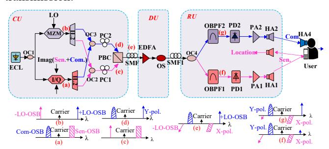
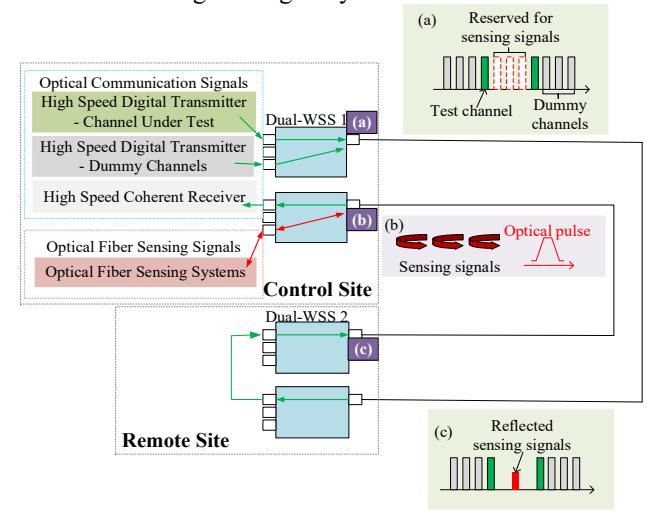
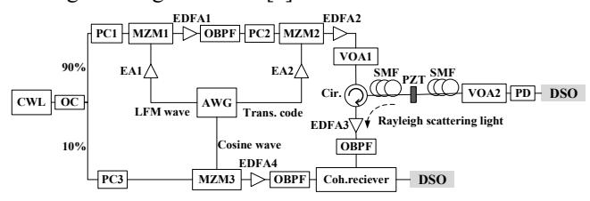
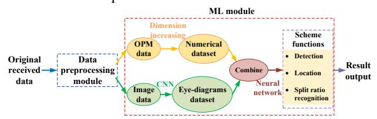

# A Technical Review of Integrated Sensing and Communication in Optical Transmission System

Jing Yan, 1 Fusheng Zheng, 2 Yajie Li, 1 Mengwen Pan, 1 Ying Wu, 1 Jun Liu, 2 Fang Chen, 2 Ying Wang, 2 Guangzhe Wu, 2 Xi Li, 3 Qun Wang, 3 Xin An, 3 Zhiyi Chen, 4 Peizhe Xin, 4 Yongli Zhao 1 and Jie Zhang 1,\*

1Beijing University of Posts and Telecommunications, Beijing, China

2State Grid Information & Telecommunication Branch, Beijing, China

3State Grid Liaoning Information and Communication Company, Shenyang, China

4State Grid Economic and Technology Research Institute Co., Ltd., Beijing, China

\*Email: jie.zhang@bupt.edu.cn

Abstract—We investigate the state of art technologies of integrated sensing and communication in optical transmission system. A detailed comparison is conducted among the available solutions. Meanwhile, the potential research directions and challenges are also discussed.

Keywords—Optical Transmission System, Integrated Sensing and Communication

#### I. INTRODUCTION

With the advantages of low loss, large bandwidth and high interference immunity, optical fibers are widely used for data transmission in various scenarios. Up to now, optical fiber communication has accounted for more than 90% of global data transmission [1]. Apart from its applications in transmission, optical fibers can also be employed for sensing. Fiber optic sensing is a technology that uses the transmission characteristics of light to measure environmental parameters or detect physical quantities. Fiber optic sensing has the advantages of high electromagnetic interference immunity, high sensitivity, and remote monitoring of optical signal. Optical fiber can maintain high-precision sensing even in harsh environments such as high temperature, underwater, and radiation [2].

As the demand for data transmission continues to increase, the utilization of fiber-optic network is expanding at an unprecedented rate. Managing vast-scale fiber-optic networks requires more intelligent monitoring technology [3]. Consequently, it has become a research trend and hot spot to realize real-time sensing and monitoring of optical fibers during data transmission. Integrated sensing and communication (ISAC) technology is proposed to enable the convergence of hardware structure and information processing [4].

In this paper, we summarize the latest ISAC schemes in optical transmission, including photonics-assisted technique [5], integrating distributed optical fiber sensing (DOFS) [7,8], and observing optical fiber channel characteristics [9,10]. Meanwhile, we analyze the differences among these schemes and discuss the potential technical challenges.

### II. KEY TECHNOLOGIES

# A. Photonics-Assisted Technique

With the intersection and integration of optical and wireless transmission technology, some researchers have incorporated photonics knowledge into the wireless field, forming a photonics-assisted ISAC technique [4].

Lei et al. demonstrated a novel spectrum-efficient millimeter wave (MMW)-over-fiber (MoF) architecture for

ISAC in beyond fifth-generation (B5G) optical-wireless converged networks [5]. The architecture diagram is shown in Fig. 1. In this architecture, the sensing and communication sidebands are generated simultaneously through asymmetrical single-sideband (ASSB) modulation, whereas the two local oscillator (LO) sidebands are obtained by carrier-suppressed double-sideband (CS-DSB) modulation. By interleaving the two sets of sidebands for sensing and communication in two orthogonal polarizations, the recombined sidebands are polarization-interleaved. Then it is delivered over a singlemode fiber (SMF) to the distributed unit (DU). Due to polarization interleaving, no photocurrent impacting the optical sideband is generated in two orthogonal polarizations. Therefore, the pure sensing and pure communication signals are separated by simply filtering out the +LO-OSB or -LO-OSB at the remote unit (RU). Finally, the pure sensing and pure communication signals are applied to wireless transmission for distance sensing and information transmission.

Fig. 1. The MoF architecture for ISAC

Photonics assistance plays a vital part in optimizing communication and sensing performance. By interleaving the two sets of sidebands for sensing and communication in two orthogonal polarizations, the demand for high bandwidth devices and the occupied spectral grid are thus effectively reduced. The polarization-insensitive filtering removes the need for complicated polarization tracking, resulting in a simple structure at RUs and polarization-free digital signal processing (DSP) at the user ends.

## B. DOFS

DOFS is a sensing technology based on the scattering effects in optical fibers, which uses Raman scattering, Brillouin scattering and Rayleigh scattering to detect strain, vibration, temperature, fracture, and other parameters at different locations of optical fiber. It has widespread applications in petrochemical, electric power industry, environmental monitoring, and other fields [6].

# 1) DOFS combined with Wavelength Division Multiplexing (WDM)

Huang et al. proposed an integrated system of distributed sensing and 36.8Tb/s data transmission [7]. They realized the first field trial to combine distributed optical fiber sensing and high-speed communication. The system realizes the detection of vehicle speed, traffic flow, and street pavement deterioration through distributed sensing based on Rayleigh scattering while transmitting communication data.

As shown in Fig. 2, two dual-wavelength selector switches are used to multiplex the communication signals and sensing signals. In addition to test and virtual channels required for the optical communication channel at control site, port (a) reserves three 50 GHz channels for receiving signals of backscattering in the distributed sensing system. The green line represents the transmission direction of communication signals, while the red line represents the transmission direction of sensing signals. As displayed in port (b), the communication and the sensing signals are back-propagated in optical fiber, so the influence of nonlinearity on the communication signals is greatly reduced.

Fig. 2. Experimental setup. Schematical spectrum of (a) communication signals (c) received data and sensing signals

#### 2) DOFS combined with joint waveform

Although ISAC can be realized through WDM or frequency division multiplexing (FDM), both WDM and FDM integrating schemes need to reserve channels for sensing. The probes used in DOFS can easily produce nonlinear effects, resulting in the reduction of communication performance.

To solve this problem, He et al. proposed a scheme to integrate intensity modulation communication and distributed sensing in a single channel [8].

Fig. 3. Configuration of DOFS combined with joint waveform for ISAC

Specifically, a linear frequency modulation (LFM) wave is generated by an arbitrary waveform generator (AWG), and the wave becomes an optical carrier after periodic single-sideband (SSB) modulation. Then the LFM wave carries a 4-level pulse amplitude modulation (PAM4) signal into the optical fiber. LFM is not only the carrier of PAM4 signal, but also the sensing probe of DOFS. With a strong suppression of stimulated Brillouin scattering, LFM optical carrier can effectively improve the transmission performance.

#### C. Channel Characteristics

Most of the existing ISAC schemes in optical transmission systems need external devices to obtain sensing signals. To reduce the cost of ISAC, some schemes are proposed to achieve sensing functions by monitoring the channel characteristics during optical transmission.

# 1) Machine Learning (ML)-based Eavesdropping Detection

As a common eavesdropping method, splitting eavesdropping affects some physical parameters in optical fiber channel, which can be analysed to locate the eavesdropping points. The smaller the splitting ratio, the more difficult it is to identify the variation of these parameters.

With the ability to accurately analyse subtle data changes, ML provides an effective way to process these parameters. ML is proposed to handle optical performance by monitoring data and eye diagrams, and then to make an appropriate prediction result based on the small differences between samples [9]. The processing module of ML is shown in Fig. 4. The combination of channel characteristics at the receiver and ML can achieve the ISAC in optical transmission system without extra complicated hardware.

Fig. 4. ML-based detection of splitting eavesdropping

#### 2) Polarization rotation vector

The sensitivity of polarization rotation vector of optical fiber channel transmission matrix to environmental perturbations is discussed in [10]. An environmental sensing scheme is proposed based on coherent detection without the help of extra equipment.

Assuming the transmitted signal is polarization multiplexed in a digital coherent optical transmission system, the information is independently encoded on a pair of orthogonal polarization. The coherent receiver provides estimated inverse matrix of the transmission matrix during the adaptive equalization. The polarization rotation vector can be extracted easily from the estimated transmission matrix through singular value decomposition.

To improve the accuracy of experiment monitoring, the authors filtered out the effect of slowly-varying changes by removing the average rotation.

### III. OPEN ISSUES

Table 1 compares all the ISAC systems mentioned in this paper and suggests several potential research directions. According to the comparison table, we can see that the main challenges in ISAC optical transmission systems are as follows:

TABLE I. TECHNOLOGY COMPARISON

| ISAC system | Methodologies                                                         | Sensing Object | Advantages                                                                                                                                                             | Potential research directions                                                                                                                                                                                                                             |
|----------------|-----------------------------------------------------------------------|-------------------|------------------------------------------------------------------------------------------------------------------------------------------------------------------------|-----------------------------------------------------------------------------------------------------------------------------------------------------------------------------------------------------------------------------------------------------------|
| [5]            | <ul><li>Polarization interweaving</li><li>Photonics assist</li></ul>  | Distance          | Reduce the need for high-bandwidth devices and the occupation of spectrum grid     Achieve wide area wireless coverage     Reduce DSP complexity and power consumption | Reduce cost and improve frequency tunability through replacing ILs with fiber Bragg gratings     Use low-speed digital-to-analog conversion followed by two-stage analog I/Q upconversion to generate combined intermediate frequency signals             |
| [7]            | <ul><li>DOFS</li><li>WDM</li></ul>                                    | Vibration         | Achieve coexistence of high-speed transmission and DOFS     Achieve long distance transmission and sensing                                                             | Incorporate distributed sensors based on different scattering to realize more sensing objects                                                                                                                                                       |
| [8]            | DOFS     Joint waveform (PAM4+LFM)                                    | Vibration         | Improve spectral efficiency     Reduce the complexity of transmission and demodulation     Improve transmission performance                                            | Apply other amplitude-modulation-based signals     Use optical injection locking to generate high-performance LFM optical carrier     Implement pre-distortion to compensate LFM waveform amplitude fluctuations                                          |
| [9]            | • ML                                                                  | Eavesdropping     | Avoid misjudgment caused by tiny vibration     Create a foundation for detecting eavesdropping combined with ML                                                        | Optimize the flexibility of the location function, reduce the data requirement for the dataset and utilize recurrent neural networks to adjust the model parameters     Consider the network environment to achieve effective deployment of ML algorithms |
| [10]           | <ul><li>Polarization rotation vector</li><li>Mueller matrix</li></ul> | Perturbation      | Monitor environmental changes through polarization rotation vector without any external devices                                                                  | Explore other information contained in the transmission matrix     Study the effects of perturbation on different components                                                                                                                              |

- Most ISAC systems can only sense vibrations during transmission. It is a major challenge to combine different sensing objects. For example, multiplexed sensing fibers are used to achieve dual-parameter distributed sensing, measuring temperature and strain simultaneously [11].
- For the ISAC system combined with DOFS, how to optimally balance the performance of communication and sensing should be considered. The nonlinear caused by DOFS has a significant impact on the communication system. Compared with the scheme in [7], the combination of designed joint waveform and DOFS can greatly reduce the nonlinear impact on communication performance [8]. It is a meaningful research direction to explore a combined waveform that is both beneficial for communication and sensing.
- For the ISAC system based on channel characteristics, it is necessary to consider how to further optimize the algorithm to eliminate the interference factors and improve accuracy of detection and locating. We should study the sensitivity of other channel characteristics to different external factors (including temperature, pressure, physics layer eavesdropping, etc.). It is also a major research to realize ISAC based on these channel characteristics.

#### IV. CONCLUSION

In this paper, we analyse the principles and techniques in five ISAC systems. We compare the advantages of these five systems and present the challenges in future research.

#### ACKNOWLEDGMENT

This work is supported by the Science and Technology

Project of State Grid Corporation of China (No. 5700-202352265A-1-1-ZN).

# REFERENCES

- S. Yu, & W. He, "Latest survey on optical fiber communication," Scientia Sinica Informationis, vol. 50, 2020
- [2] L. Yuan et al., "Road Map of Fiber Optic Sensor Technology in China," Acta Optica Sinica, vol. 42, 2022
- [3] C. Zhang, X. Tang, G. Wang, M. Zhang, & S. Shen, "Research Frontier of Communication and Sensing Integration Technology for Optical Networks," Laser & Optoelectronics Progress, vol. 60, 2023
- [4] Y. Cui, F. Liu, X. Jing, & J. Mu, "Integrating sensing and communications for ubiquitous IoT: Applications, trends, and challenges," IEEE Network, vol. 35, 2021
- [5] M. Lei et al., "A Spectrum-Efficient MoF Architecture /for Joint Sensing and Communication in B5G Based on Polarization Interleaving and Polarization-Insensitive Filtering," Journal of Lightwave Technology, vol. 40, 2022
- [6] Y. Yan et al., "Distributed Optical Fiber Sensing Assisted by Optical Communication Techniques," Journal of Lightwave Technology, vol. 39, 2021
- [7] M. Huang et al., "First Field Trial of Distributed Fiber Optical Sensing and High-Speed Communication Over an Operational Telecom Network," Journal of Lightwave Technology, vol. 38, 2020
- [8] H. He et al., "Integrated sensing and communication in an optical fibre," Light: Science & Applications, vol. 12, 2023
- [9] H. Song et al., "Experimental study of machine-learning-based detection and location of eavesdropping in end-to-end optical fiber communications," Optical Fiber Technology, vol. 68, 2022
- [10] A. Mecozzi et al., "Use of Optical Coherent Detection for Environmental Sensing," Journal of Lightwave Technology, vol. 41, 2023
- [11] K. Naeem et al., "Multiparameter Distributed Fiber Sensor Based on Optical Frequency-Domain Reflectometry and Bandwidth-Division Multiplexing," IEEE Sensors Journal, vol. 21, 2021