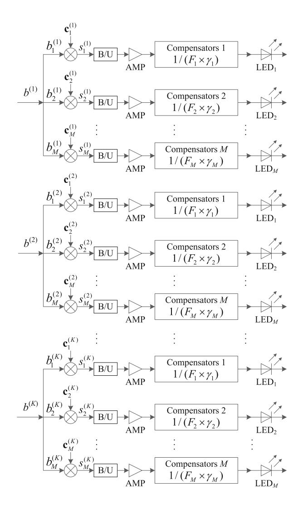
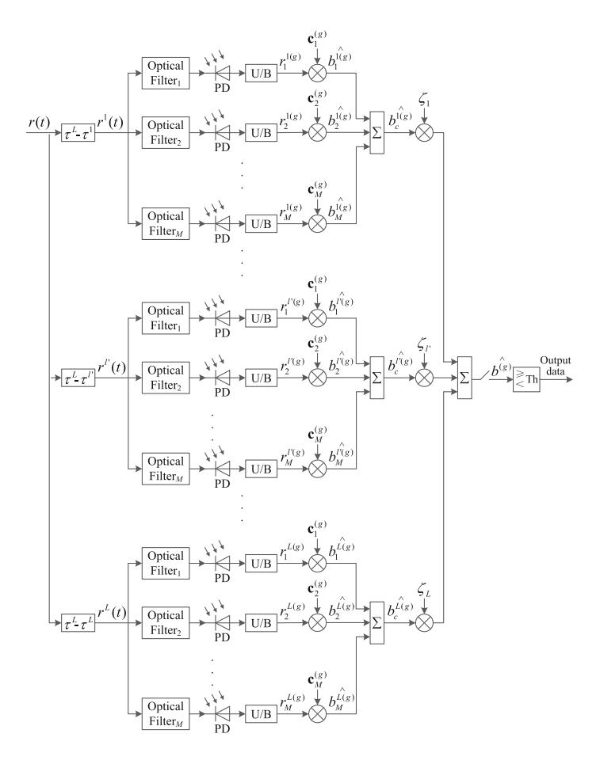
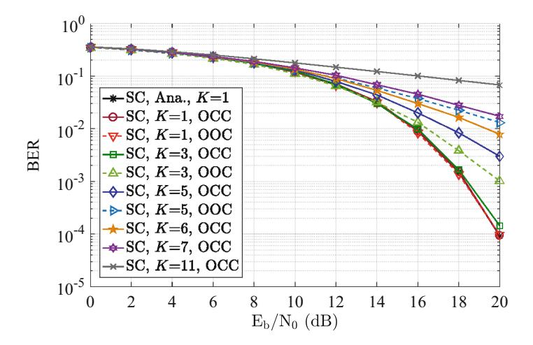
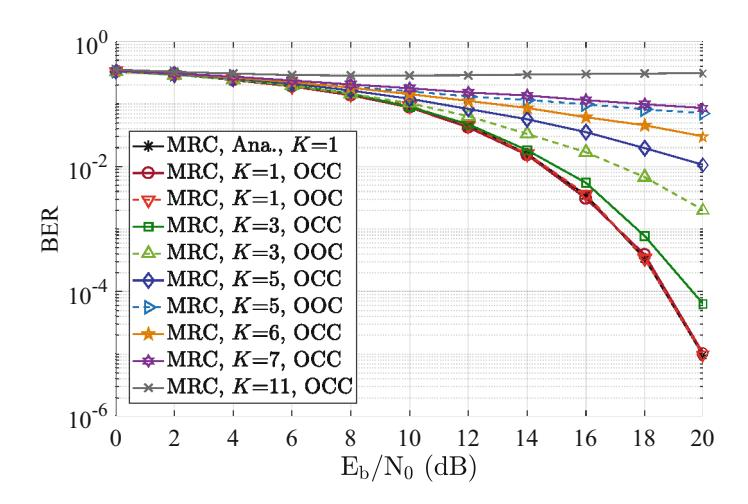
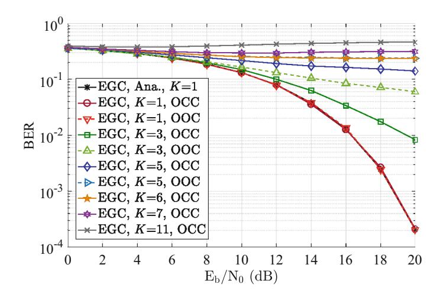

# Design and Analysis of VLC-OCC-CDMA Rake System

Qiu Yang  $^{1(\boxtimes)}$ , Si Yujuan $^{2(\boxtimes)}$ , Yu Xiaoyu $^{3(\boxtimes)}$ , Yang  $\mathrm{Dong}^{4(\boxtimes)}$ , Chen Yuexin $^2$ , and Yang Wenke $^2$ 

1 Zhuhai College of Science and Technology, Zhuhai 519041, China qiuy@zcst.edu.cn

Jilin University, Changchun 130012, China siyj@jlu.edu.cn, {cyx21,yangwk21}@mails.jlu.edu.cn Sun Yat-Sen University, Zhuhai 519082, China

yuxy69@mail.sysu.edu.cn

4 Zhuhai Micro Creative Technology Limited Liability Company, Zhuhai 519082,
China

yd@microcreative.org

Abstract. Visible light communication (VLC) is one of green communication technologies, which realizes dual functions of lighting and communication on the basis of indoor lighting facilities. Code Division Multiple Access (CDMA) has a wealth of signature codes, which can effectively resist narrowband interference and multipath fading by using signature codes with ideal correlation. In this paper, optical complementary code (OCC) is used as the signature code of VLC-CDMA system to meet nonnegative characteristics of visible light communication. This paper mainly studies VLC-OCC-CDMA system in multi light sources scenario. Channel model expression that only considers channel impulse response is proposed. The VLC-OCC-CDMA Rake receiver structure is designed and system performance of different combination criteria is analyzed. The results show that OCCs used in the VLC-CDMA system have good correlation characteristics, which can superpose separated multipath information effectively.

**Keywords:** VLC · CDMA · Channel model · Multiple sources · Rake

#### 1 Introduction

VLC adopts indoor basic lighting facilities, which has dual functions of lighting and communication, and has become one of the key technologies of 6G [1–3]. In

This research was funded in part by the 2022 Featured Innovation Projects of General Colleges and Universities in Guangdong Province, the 2022 Enhancement of Key Construction Discipline Research Ability Project of Guangdong Province, Natural Science Foundation of Guangdong Province, Project of Major Health Industry Related Disciplines at Zhuhai College of Science and Technology (Nos. 2022KTSCX189, 2022ZDJS140, 2023A1515011302, 2023DJKCY010) and Doctoral Promotion Program of Zhuhai College of Science and Technology.

© The Author(s), under exclusive license to Springer Nature Switzerland AG 2023 Y. Tan et al. (Eds.): ICSI 2023, LNCS 13969, pp. 111–124, 2023. https://doi.org/10.1007/978-3-031-36625-3\_10

the multi-user scenario, a suitable multiple access method is needed to meet the requirements of multi-user communication. CDMA technology has the function of satisfying the simultaneous access of multiple users to network [\[4](#page-12-2)[–7](#page-12-3)]. OCC is a kind of unipolar complementary code, which can meet the physical characteristics of VLC. Meanwhile, OCC has ideal autocorrelation characteristics and minimum cross-correlation sidelobe interference, which can ensure that VLC-CDMA systems can completely eliminate multi-user interference (MUI) in line of sight (LOS) [\[5](#page-12-4)].

Intensity modulation/direct detection (IM/DD) is usually used in VLC systems. Compared with the system communication rate, the movement rate of transmitters, receivers and other objects is very slow, and there is no multipath fading [\[8](#page-12-5)[–11\]](#page-13-0). Therefore, the impulse response can be used to represent the channel model [\[10](#page-12-6)[,12](#page-13-1)[–14](#page-13-2)]. In VLC-OCC-CDMA system, the transmitting end of VLC-OCC-CDMA system usually adopts LED array composed of multiple LED chips [\[4,](#page-12-2)[15\]](#page-13-3). The multiple light source system in this paper adopts a four light source structure. Each light source contains 38 groups of RGB LED arrays, namely 152 LED chips. It can meet the international lighting standards, the illumination is more moderate, and will not cause waste of resources.

The main principle of Rake receiver is to collect the energy of multi-path transmission. Then, the received signal is enhanced by superimposing the multipath energy using the good correlation characteristics of signature codes [\[16](#page-13-4)[–18\]](#page-13-5). Partial Rake receivers collect the optical signals of L paths. This method can directly collect part of the multipath energy, and directly combine the previous L paths without the process of selection [\[19](#page-13-6),[20\]](#page-13-7).

The above discussions motivate us to work out a better way to implement VLC-OCC-CDMA Rake systems. The major contributions of this work can be summarized as follows. In this work, we introduce VLC-OCC-CDMA using Rake receiver, which is named as VLC-OCC-CDMA Rake system; We give the transmitter structure of VLC-OCC-CDMA system and analyze channel model of VLC system. We propose the channel model expression that only considers the channel impulse response; We design the VLC-OCC-CDMA Rake receiver. We conduct a theoretical analysis on the system performance with different combing methods, and show that the signature codes used in the VLC-OCC-CDMA system have good correlation characteristics, which can superpose the separated multipath information effectively.

# **2 System Model**

### **2.1 Transmitter**

The multiple sub-codes are used in VLC-OCC-CDMA system, and different subcodes are transmitted by LEDs with different wavelengths at the transmitter. The system transmitter model is shown in Fig. [1.](#page-2-0)

Transmitters are white LEDs and use OOK modulation. b(k) is signal of the kth user after modulation. b (k) m is the mth data stream of the kth user, where  $m \in \{1, 2, \dots, M\}$ ,  $k \in \{1, 2, \dots, K\}$ . A set of complementary codes  $\mathcal{C}(K, M, N)$  are used as signature codes for K users in the system. Assume that  $\mathbf{C}^{(k)} = \{\mathbf{c}_m^{(k)}\}_{m=1}^M$  is signature code for user k [5].

Fig. 1. Transmitters structure of the VLC-CC-CDMA system.

The number of active users in the system is K, each user is assigned a OCC, the length of each sub-code is N. B/U module is used to convert bipolar signals into unipolar signals. AMP is used to amplify signals. The optical filter gain at the receiving end is  $F_m$ , whose center wavelength is the same as the peak

wavelength of LEDs approximately. The PD response sensitivity is  $\gamma_m$ . We add compensator circuits for LEDs with the gains of  $1/(F_m \times \gamma_m)$ .

Each data stream of a user is assigned a separate LED to ensure that users can work in linear regions of LEDs [21]. Each sub-code of a user is transmitted by a LED with a different peak wavelength to avoid interference among sub-codes of the same user. Therefore, M LEDs with different peak wavelengths are required to send the data of M sub-codes. The corresponding sub-codes of each user are transmitted through indoor VLC channels, and the specific process is explained as follows.

The spreading waveform of the mth sub-code for user k is,

$$C_m^{(k)}(t) = \sum_{n=1}^{N} c_{m,n}^{(k)} q(t - nT_c + T_c), \tag{1}$$

where  $m \in \{1, 2, \dots, M\}$ ,  $n \in \{1, 2, \dots, N\}$ ,  $k \in \{1, 2, \dots, K\}$ , which are the same definitions in the rest of the paper.  $T_c$  is duration of one chip, q(t) is chip pulse waveform with q(t) being a rectangular pulse. When  $0 \le t < T_c$ ,  $q(t) = 1/\sqrt{MNT_c}$ .

#### 2.2 Channel Model

Lee and others established VLC channel model based on infrared communication channel model in 2011, which is widely used in VLC systems [22,23]. Considering LOS and reflection paths, the power delay profile (PDP) is used to characterize channel model of VLC system. In practical analysis, if we want to get the pure channel impulse response, we usually use the method of removing the power term. The LOS channel impulse response  $h^{(0)}(t)$  obtained by this method is shown as,

$$h^{(0)}(t) = \frac{A_{\text{PD}}(m+1)}{2\pi d_0^2} \cos^m \varphi_0 \cos \theta_0, \tag{2}$$

where  $d_0$  represents distance from transmitter to receiver in LOS,  $\varphi_0$  represents radiation angle of light source, and  $\theta_0$  represents incidence angle of receiver. It is the same as the expression of LOS channel impulse response in [8], which indicate that our method is correct.

Channel impulse response of p reflections is obtained shown as,

$$h^{(p)}(t) = \int_{S} \left[ \mathfrak{L}_{1} \mathfrak{L}_{2} \cdots \mathfrak{L}_{p+1} \operatorname{rect}\left(\frac{\theta_{p+1}}{FOV}\right) \delta\left(t - \frac{d_{1} + d_{2} + \cdots d_{p+1}}{c}\right) \right] dA_{\operatorname{ref}}, \quad p \geq 1. \quad (3)$$

The channel impulse response can be obtained as,

$$h(t) = \sum_{q=1}^{Q_{\text{LED}}} \sum_{p=0}^{\infty} h^{(p)}(t),$$
 (4)

where  $Q_{\text{LED}}$  is the number of LEDs.

Based on the analysis of channel model proposed by Lee et al., the channel impulse response expression (4) using in this paper is obtained [22]. The correctness of this representation is illustrated by comparing existing literature. The model expression will be used as channel model in the system design and simulation analysis in this paper.

## 3 Design and Analysis for VLC-OCC-CDMA Rake Receiver

#### 3.1 Design of Rake Receiver for VLC-OCC-CDMA System

The main principle of Rake receiver is to collect energy of multi-path transmission, and use good correlation characteristic of signature codes to superimpose the multi-path energy to enhance received signal. Figure 2 shows block diagram of VLC-OCC-CDMA Rake receiver.

The number of paths L is the tap coefficient of Rake receiver. The difference between the previous receiver and Rake receiver is that the received signal r(t) delayed by multipath firstly and aligned each path. The method is to delay the received signal  $\tau^L - \tau^{l'}$ ,  $l' = 1, 2, \dots L$  is the total number of paths. After signal delay and alignment, the desired receiving signal of the l'th path is expressed as  $r^{l'}(t)$ , that is,  $r^{l'}(t) = r[t - (\tau^L - \tau^{l'})]$ .

The next step is despreading process of the desired signal on each path.  $\mathbf{c}_m^{(g)}$  indicates signature code of the *m*th sub-code for the *g*th user.  $\hat{b}_m^{l'(g)}$  is result of equal gain combination of sub-codes in the *l'*th path for the *g*th user.  $\hat{b}_c^{l'(g)}$  representes combination coefficient of the signal from the *l'*th path. The final output signal is obtained by setting an appropriate decision threshold. The decision threshold is usually set to half of detection peak, i.e. $w_M/2$ .

#### 3.2 Analysis of Rake Receiver for VLC-OCC-CDMA System

The transmitted signal of the kth user is shown as,

$$s^{(k)}(t) = \sum_{m=1}^{M} s_m^{(k)}(t) S_m(\lambda) \frac{1}{F_m \gamma_m},$$
 (5)

where  $\lambda$  is wavelength,  $S_m(\lambda)$  is spectrum function of LED at transmitter. The received signal is shown as,

$$r(t) = \sum_{k=1}^{K} \sum_{l=1}^{L} h^{l(k)}(t) s^{l(k)}(t) + n(t),$$
(6)

where,  $h^{l(k)}(t)$  is channel impulse response of the kth user on the lth path. Therefore, the channel impulse response of the kth user can be expressed as  $h^{(k)}(t) = \sum_{l=1}^{L} h^{l(k)}(t)$ .  $s^{l(k)}(t) = s^{(k)}(t-\tau^l)$  represents the signal of the kth user after delay on the lth path, and  $\tau^l$  is delay of the lth path. n(t) is noise.

Fig. 2. Diagram of VLC-CC-CDMA Rake system.

 $r^{l'}(t) = r\left[t - (\tau^L - \tau^{l'})\right]$  is the received signal after delay alignment, indicating the signal of the l'th path among received signals. It is required to multiply gains of optical filters and PDs. Taking despreading a single user as an example, the received signal of the gth user on the l'th path is shown as,

$$r_m^{l'(g)}(t) = \sum_{k=1}^K \sum_{l=1}^L h^{l(k)}(t) s_m^{l(k)} \left[ t - \tau_k - (\tau^L - \tau^{l'}) \right] + n_m(t), \tag{7}$$

where, the channel impulse response of the kth user on the lth path should be expressed as  $h_m^{l(k)}(t)$ . Assuming that the impulse response of each sub-code is the same, which is  $h^{l(k)}(t)$ .  $n_m(t)$  is noise of the mth data stream.

 $\mathbf{c}_{m}^{(g)}$  indicates the *m*th sub-code of the desired user *g*, where the same signature code is used in each path.  $\hat{b}_{m}^{l'(g)}(t)$  is despreaded result of the mth sub-code for the *j*th data on the *l'*th path, shown as,

$$\widehat{b}_{m}^{l'(g)}(j) = \int_{0}^{NT_{c}} r_{m}^{l'(g)}(t + jT_{b} + \tau_{g}) C_{m}^{(g)}(t) dt = \sqrt{P_{t}} h^{l'(g)} b^{l'(g)}(j) + I_{m}^{l'(g)} + \Im_{m}^{l'(g)} + v_{m}^{l'}.$$
(8)

The multi-path transmission of VLC channel models only has energy gain. When the system adopts selective combining, the weighting coefficient on the selected path l'=1,  $\zeta_1=1$ . When the system adopts maximum ratio combining, the weighting coefficient  $\zeta_{l'}=\frac{E^{l'}}{\sum_{l'=1}^{L}E^{l'}}$ . Since the path coefficient is normalized, the combination coefficient  $\zeta_{l'}=h^{l'}$ . When the system adopts equal gain combining, the combining coefficients  $\zeta_1=\cdots=\zeta_{l'}=\cdots=\zeta_L=\frac{1}{L}$ . We can get the jth data of the gth user  $\widehat{b}_{\rm SC}^{(g)}(j)$ ,  $\widehat{b}_{\rm MRC}^{(g)}(j)$ , and  $\widehat{b}_{\rm EGC}^{(g)}(j)$  above three combination modes are shown as,

$$\begin{cases}
\hat{b}_{SC}^{(g)}(j) = \zeta_{1}\hat{b}_{c}^{1(g)}(j) = \hat{b}_{c}^{1(g)}(j) = \sqrt{P_{t}}\sum_{m=1}^{M}h^{1(g)}b_{m}^{1(g)}(j) + I^{1(g)} + \mathfrak{I}^{1(g)} + V^{1}, \\
\hat{b}_{MRC}^{(g)}(j) = \sqrt{P_{t}}\sum_{l'=1}^{L}\sum_{m=1}^{M}\left[h^{l'(g)}\right]^{2}b_{m}^{l'(g)}(j) + \sum_{l'=1}^{L}h^{l'(g)}I^{l'(g)} \\
+ \sum_{l'=1}^{L}h^{l'(g)}\mathfrak{I}^{l'(g)} + \sum_{l'=1}^{L}h^{l'(g)}V^{l'}, \\
\hat{b}_{EGC}^{(g)}(j) = \frac{\sqrt{P_{t}}}{L}\sum_{l'=1}^{L}\sum_{l'=1}^{M}\sum_{m=1}^{M}h^{l'(g)}b_{m}^{l'(g)}(j) + \frac{1}{L}\sum_{l'=1}^{L}I^{l'(g)} + \frac{1}{L}\sum_{l'=1}^{L}\mathfrak{I}^{l'(g)} \\
+ \frac{1}{L}\sum_{l'=1}^{L}V^{l'}.
\end{cases} \tag{9}$$

On the basis of the assumption that transmission power is normalized, the desired decision variable, namely  $w_M/2$ , can be obtained. Thus, the appropriate decision variable cannot be set by interference problem can be avoided.

### 3.3 Theoretical Analysis on Elimination of Interference and BER

The first item in the decision variable is user data to be recovered, and the second item is interference from other users, where,  $I^{l'(g)} = \sum_{m=1}^{M} I_m^{l'(g)}$ ,  $I_m^{l'(g)}$  is interference of the gth user from other users in the mth sub-code on the l'th path. The third term is multipath interference, where  $\mathfrak{I}^{l'(g)} = \sum_{m=1}^{M} \mathfrak{I}_m^{l'(g)}$ ,  $\mathfrak{I}_m^{l'(g)}$  is interference of the gth user from other paths in the mth sub-code on the l'th path, and the multi-user interference  $I_m^{l'(g)}$  be expressed as:

$$I_m^{l'(g)} = \sum_{k=1}^K \sum_{k\neq a}^L \sqrt{P_t} h^{l(k)} \left\{ \alpha_m^{l(k)} b_m^{l(k)}(j) + \beta_m^{l(k)} b_m^{l(k)} \left[ j + \operatorname{sgn}(\delta_k^l) \right] \right\}, \quad (10)$$

where,  $\operatorname{sgn}(x)$  is equal to 1 when  $x \geq 0$  and -1 when x < 0,  $\delta_k^l = (\tau_g - \tau_k + \tau^{l'} - \tau^l)/T_c$ . The values of  $\alpha_m^{l(k)}$  and  $\beta_m^{l(k)}$  are determined by relative delay of data stream of the lth path of the kth user and the lth path of the lth user. Since L paths need to be considered,  $\alpha_m^{l(k)}$  and  $\beta_m^{l(k)}$  of the lth path are shown as,

$$\begin{cases} \delta_{k}^{l} > 0 : \alpha_{m}^{l(k)} = \phi(\mathbf{c}_{m}^{l(g)}, \mathbf{c}_{m}^{l(k)}; \delta_{k}^{l}), & \beta_{m}^{l(k)} = \phi(\mathbf{c}_{m}^{l(k)}, \mathbf{c}_{m}^{l(g)}; N - \delta_{k}^{l}) \\ \delta_{k}^{l} < 0 : \alpha_{m}^{l(k)} = \phi(\mathbf{c}_{m}^{l(k)}, \mathbf{c}_{m}^{l(g)}; -\delta_{k}^{l}), & \beta_{m}^{l(k)} = \phi(\mathbf{c}_{m}^{l(g)}, \mathbf{c}_{m}^{l(k)}; N + \delta_{k}^{l}) \\ \delta_{k}^{l} = 0 : \alpha_{m}^{l(k)} = \phi(\mathbf{c}_{m}^{l(g)}, \mathbf{c}_{m}^{l(k)}; 0), & \beta_{m}^{l(k)} = 0 \end{cases}$$

$$(11)$$

where  $\phi(\mathbf{a}, \mathbf{b}; \delta)$  is aperiodic correlation function of  $\mathbf{a}$  and  $\mathbf{b}$ .

Multipath interference can be expressed as:

$$\mathfrak{I}_{m}^{l'(g)} = \sum_{l=1, l \neq l'}^{L} \sqrt{P_{t}} h^{l(g)} b^{l(g)}(j) \phi(\mathbf{c}_{m}^{l(g)}, \mathbf{c}_{m}^{l(g)}; \delta^{l}) 
+ \sum_{l=1, l \neq l'}^{L} \sqrt{P_{t}} h^{l(g)} b^{l(g)}[j + \operatorname{sgn}(\delta^{l})] \phi(\mathbf{c}_{m}^{l(g)}, \mathbf{c}_{m}^{l(g)}; N - \delta^{l}),$$
(12)

where,  $\delta^l = (\tau^{l'} - \tau^l)/T_c$ . When path variable l' = 1, the result is interference expression of selective combining.

Assuming  $\Delta^{l(g)}$  and  $\mathfrak{d}^{l(g)}$  are expressed as,

$$\begin{cases}
\Delta^{l(g)} = \sum_{m=1}^{M} \sum_{k=1, k \neq g}^{K} \sum_{l=1}^{L} \sqrt{P_{t}} h^{l(k)} \left\{ \alpha_{m}^{l(k)} b_{m}^{l(k)}(j) + \beta_{m}^{l(k)} b_{m}^{l(k)} \left[ j + \operatorname{sgn}(\delta_{k}^{l}) \right] \right\}, \\
\mathfrak{d}^{l(g)} = \sum_{m=1}^{M} \left\{ \sum_{l=1, l \neq l'}^{L} \sqrt{P_{t}} h^{l(g)} b^{l(g)}(j) \phi(\mathbf{c}_{m}^{l(g)}, \mathbf{c}_{m}^{l(g)}; \delta^{l}) \\
+ \sum_{l=1, l \neq l'}^{L} \sqrt{P_{t}} h^{l(g)} b^{l(g)}[j + \operatorname{sgn}(\delta^{l})] \phi(\mathbf{c}_{m}^{l(g)}, \mathbf{c}_{m}^{l(g)}; N - \delta^{l}) \right\}.
\end{cases} (13)$$

Interference of the three combination modes can be shown as,

$$\begin{cases} I_{\text{SC}}^{(g)} = \frac{1}{h^{l(9)}} \Delta^{l(g)}, \mathfrak{I}_{\text{SC}}^{(g)} = \frac{1}{h^{1(g)}} \mathfrak{d}^{l(g)} \\ I_{\text{MRC}}^{(g)} = \frac{\sum_{l'=1}^{L} h^{l'(g)}}{\sum_{l'=1}^{L} [h^{l'(g)}]^2} \Delta^{l(g)}, \mathfrak{I}_{\text{MRC}}^{(g)} = \frac{\sum_{l'=1}^{L} h^{l'(g)}}{\sum_{l'=1}^{L} [h^{l'(g)}]^2} \mathfrak{d}^{l(g)} \\ I_{\text{EGC}}^{(g)} = \frac{\sum_{l'=1}^{L} h^{l'(g)}}{\sum_{l'=1}^{L} h^{l'(g)}} \Delta^{l(g)}, \mathfrak{I}_{\text{EGC}}^{(g)} = \frac{\sum_{l'=1}^{L} h^{l'(g)}}{\sum_{l'=1}^{L} h^{l'(g)}} \mathfrak{d}^{l(g)}. \end{cases}$$
(14)

According to the correlation characteristics of OCC, the maximum value of cross-correlation of sub-codes is 1. When there is only one LOS, VLC-OCC-CDMA system can eliminate interference by designing different positions of 1 in sub-codes. However, VLC-OCC-CDMA system is still affected by interference in case of multipath due to poor cross-correlation and side lobe.

The last item of the decision variable is noise, where  $V^{l'} = \sum_{m=1}^{M} v_m^{l'}$ . It is still a Gaussian process and its distribution is the same as  $v_m^{l'}$ .  $v_m^{l'}$  is noise of the mth sub-code. The mean value is zero, and the variance is shown as,

$$\sigma_{\text{thermal}}^2 = \frac{8\pi k_B \mathcal{T}_{\mathcal{K}} \eta A_{\text{PD}} I_2 B^2}{\mathcal{G}} + \frac{16\pi^2 k_B \mathcal{T}_{\mathcal{K}} \varepsilon \eta^2 A_{\text{PD}}^2 I_3 B^3}{\mathfrak{g}}, \tag{15}$$

where  $k_B$  is Boltzmann constant,  $\mathcal{T}_{\mathcal{K}}$  is absolute temperature,  $\eta$  is fixed capacitance per unit area of the PD,  $A_{\rm PD}$  is the area of the PD, and  $I_2$  is noise

bandwidth factor. B is noise bandwidth equal to the value of data rate  $(R_b)$ .  $\mathcal{G}$  is openloop voltage gain.  $\varepsilon$  is the channel noise factor of field effect transistor (FET),  $I_3$  is noise bandwidth factor, and  $\mathfrak{g}$  is the transconductance of the FET,

$$\sigma_{\text{shot}}^2 = 2qP_rB + 2qI_{bg}I_2B,\tag{16}$$

where q is the electron charge,  $P_r$  is received optical power, and  $I_{bg}$  is background current.

The variances of the noise term (var[ $V_{SC}$ ], var[ $V_{MRC}$ ] and var[ $V_{EGC}$ ]) in the three combination modes can be updated as,

$$\begin{cases}
\operatorname{var}[V_{\text{SC}}] = \operatorname{var}\left[\frac{V^{1}}{h^{1(g)}}\right] = \frac{1}{[h^{1(g)}]^{2}}(\sigma_{\text{shot}}^{2} + \sigma_{\text{thermal}}^{2}), \\
\operatorname{var}[V_{\text{MRC}}] = \operatorname{var}\left[\frac{\sum_{l'=1}^{L} h^{l'(g)} V^{l'}}{\sum_{l'=1}^{L} \left[h^{l'(g)}\right]^{2}}\right] = \left\{\frac{\sum_{l'=1}^{L} h^{l'(g)}}{\sum_{l'=1}^{L} \left[h^{l'(g)}\right]^{2}}\right\}^{2}(\sigma_{\text{shot}}^{2} + \sigma_{\text{thermal}}^{2}), \\
\operatorname{var}[V_{\text{EGC}}] = \operatorname{var}\left[\frac{\sum_{l'=1}^{L} V^{l'}}{\sum_{l'=1}^{L} h^{l'(g)}}\right] = \sum_{l'=1}^{L} \left\{\frac{1}{\sum_{l'=1}^{L} h^{l'(g)}}\right\}^{2}(\sigma_{\text{shot}}^{2} + \sigma_{\text{thermal}}^{2}).
\end{cases} \tag{17}$$

Assume  $E_b$  is bit energy. The energy is  $E_{b1} = P_t PGT_c$  when sending "1". Where,  $P_t$  is chip transmission power, PG = MN is processing gain,  $T_c$  is chip time. There is only one "1" in each sub-code of OCC. The processing gain does not need to consider the length of sub-code (N). Assuming that "0" and "1" are transmitted as equal probabilities, the average bit energy is  $E_b = (E_{b1} + E_{b0})/2$ . Signal to interference and noise ratio (SINR) can be expressed as:

$$\begin{cases}
SINR_{SC} = \frac{E_b}{\text{var}\left[I_{SC}^{(g)}\right] + \text{var}\left[\mathfrak{I}_{SC}^{(g)}\right] + \text{var}\left[V_{SC}\right]}, \\
SINR_{MRC} = \frac{E_b}{\text{var}\left[I_{MRC}^{(g)}\right] + \text{var}\left[\mathfrak{I}_{MRC}^{(g)}\right] + \text{var}\left[V_{MRC}\right]}, \\
SINR_{EGC} = \frac{E_b}{\text{var}\left[I_{EGC}^{(g)}\right] + \text{var}\left[\mathfrak{I}_{EGC}^{(g)}\right] + \text{var}\left[V_{EGC}\right]}.
\end{cases} (18)$$

OOK modulation is applied in the system, BER can be expressed as:  $T_{\text{BEROOK}} = Q\left(\sqrt{\frac{E_b/N_0}{2}}\right)$ , where Q function is  $Q(x) = \frac{1}{2\pi} \int_x^{\infty} e^{\frac{-t^2}{2}} dt$ .

The decision variable after sub-code combination is multiplied by corresponding coefficient when the VLC-OCC-CDMA Rake system uses different combination modes. The theoretical BER ( $T_{\rm BER_{SC}}$ ,  $T_{\rm BER_{MRC}}$  and  $T_{\rm BER_{EGC}}$ ) can be expressed as:

$$\begin{cases}
T_{\text{BER}_{\text{SC}}} = Q\left(\sqrt{\frac{E_b/N_0}{2}(h^1)^2}\right), \\
T_{\text{BER}_{\text{MRC}}} = Q\left(\sqrt{\frac{E_b/N_0}{2}\sum_{l'=1}^{L}(h^{l'})^2}\right), \\
T_{\text{BER}_{\text{EGC}}} = Q\left(\sqrt{\frac{E_b/N_0}{2}\frac{(\sum_{l'=1}^{L}h^l)^2}{L}}\right),
\end{cases} (19)$$

where, TBERSC , TBERMRC and TBEREGC are single user theoretical BER expressions when the system adopts selectivity, maximum ratio and equal gain combining, respectively.

# **4 Simulation Details and Results**

### **4.1 Simulation Setup**

The simulation parameters are shown in Table [1.](#page-9-0) Assumed that data rate Rb = 125 Mbps and data length is 106. The positions of 1s for OCC (16, 1, 4, 0, 1) are: [1 1 1 1], [2 3 4 5], [3 2 6 8], [4 6 2 10], [5 8 10 13], [6 4 3 2], [7 11 8 4], [8 5 12 15] [9 15 5 11], [13 9 7 12] and [16 10 15 9], respectively. The length of sub-code N = 16, the number of sub-code M = 4, and the detection peak value is also 4. The autocorrelation sidelobe is 0, the maximum value of the cross-correlation interference is 1, and the maximum number of cross-correlation interference is 4. The chip rate Rc = 2 Gcps and chip time Tc = 0.5 ns. The channel impulse response calculation method in Sect. [2.2.](#page-3-1) OOC (64, 4, 1) is selected as the system performance comparison, the positions of 1s for the five codes are: [8 15 27 37], [1 2 6 26], [4 7 25 34], [9 17 23 40] and [3 5 16 31], respectively.

**Table 1.** Simulation parameters of channel impulse response for visible light communication.

| Parameters                                           | Values                          |
|------------------------------------------------------|---------------------------------|
| Room size [8]                                        | 5×5×3 m3                        |
| Locations of sources [8]                             | (1.25, 1.25, 3) (3.75, 1.25, 3) |
|                                                      | (1.25, 3.75, 3) (3.75, 3.75, 3) |
| Height of receiver (h) [8]                        | 0.85 m                          |
| Reflection index of walls [22]                       | 0.8                             |
| half-power angle of LED (ϕ1 /2) [24]              | 60◦                             |
| Receiving area of PD (APD) [24]                   | 1 cm2                           |
| Field of view of PD (FOV) [24]                       | 70◦                             |
| Reflection index of optical concentrator ( ) [24] | 1.5                             |
| n transmitted power of LED [24]                   | 249.6 mW                        |
| transmitted power of RGBY LED [24]                   | 4.308W                          |
| luminous intensity of RGBY LED [24]                  | 76.2 cd                         |

### **4.2 Simulation Results**

The designed OCCs and OOCs are used as signature codes of VLC-CDMA Rake system for comparative analysis. The system performance of selective, maximum ratio and equal gain combining are given as Figs. [3,](#page-10-0) [4](#page-11-0) and [5.](#page-11-1) It can be seen that BER performances get better with increase of SNR and worse with increase of K, which is caused by multi-user interferences. When the number of users K = 1, the simulation results using the two signature codes coincide with theoretical curve. This is because there are no multi-user interferences when there is only one user in the system, which also shows the accuracy of our theoretical BER analysis. With the increase of the number of users, the performance of using OCCs is obviously better than that of using OOCs. This is because the OCCs has ideal autocorrelation characteristics and minimum cross-correlation interference.

**Fig. 3.** SC results of VLC-CC-CDMA Rake system with OCCs and OOCs.

The figures also show performance of using OCCs when K = 6 and K = 7. Since OCC supported users of OCCs and OOCs are 11 and 5, respectively, the performance using OCCs (K = 6) is better than using OOCs (K = 5). However, when K = 7, the performance using OCCs starts to be worse than that of OOCs. The main purpose of showing this trend is to conclude that VLC-OCC-CDMA system has more advantages than VLC-OOC-CDMA system in terms of number of users. In addition, the performance of the maximum number of users (K = 11) using OCCs is also given in order to observe the performance changes with different users. The chip rates of OCCs and OOCs are assumed as the same in VLC-CDMA system simulations. The length of OCC and OCC are 16 and 64, respectively, the communication rate of the system using OCCs is 4 times than that of OOCs.

From Figs. [3,](#page-10-0) [4](#page-11-0) and [5,](#page-11-1) BER performance is getting worse with the increases of number of users. BER performance with a large SNR is generally better than with small SNR. The result of equal gain combining is the worst. When the number of users is small, BER performance with the maximum ratio combining is the best. However, with the increase of users, the best BER performance becomes the system with selective combining. The main reason is that when the number of users is relatively large, the multi-user interference has a significant impact on the system performance.

**Fig. 4.** MRC results of VLC-CC-CDMA Rake system with OCCs and OOCs.

**Fig. 5.** EGC results of Rake-VLC-CC-CDMA system with OCCs and OOCs.

In the above analysis, corresponding coefficients have been multiplied to maintain the judgment variable as wM/2. The original multi-user and multipath interferences also change, and the interferences with selectivity, maximum ratio and equal gain combining shown as [\(14\)](#page-7-0). The multipath energy gain in VLC only comes from each path loss and no gain generated by multipath fading.

# **5 Conclusions**

This paper mainly studies the design and analysis of Rake receiver in VLC-OCC-CDMA system with multiple light sources. In this paper, the optical complementary code (OCC) is used as signature codes of VLC-CDMA system to meet the nonnegative characteristics of visible light communication. In practical application environment, the illumination and receiving power of multiple light sources are more uniform than that of single light source. Therefore, this paper mainly studies VLC-OCC-CDMA system in multi light sources scenario. Rake receiving technology is used to make full use of multi-path energy, which is caused by multi-path transmission in the multi-light sources. The VLC-OCC-CDMA Rake receiver structure is designed and the system performance of different combination criteria is analyzed. The results show that the signature codes used in the VLC-OCC-CDMA system have good correlation characteristics, which can superpose the separated multipath information effectively.

# **References**

- 1. Naser, S., et al.: Toward federated-learning-enabled visible light communication in 6G systems. IEEE Wirel. Commun. **29**(1), 48–56 (2022)
- 2. Abumarshoud, H., Mohjazi, L., Dobre, O.A., Di Renzo, M., Imran, M.A., Haas, H.: LiFi through reconfigurable intelligent surfaces: A new frontier for 6G? IEEE Vehicul. Technol. Magaz. **17**(1), 37–46 (2022)
- 3. Stefano, C., Lorenzo, M., Muhammad, A.U., Marco, M., Marco, S., Jacopo, C.: The role of bidirectional VLC systems in low-latency 6G vehicular networks and comparison with IEEE802.11p and LTE/5G C-V2X. Sensors **22**(22), 8618 (2022)
- 4. Krohn, A., Harlakin, A., Arms, S., Pachnicke, S., Hoeher, P.A.: Impact of liquid crystal based interference mitigation and precoding on the multiuser performance of VLC massive MIMO arrays. IEEE Photon. J. **14**(5), 1–12 (2022)
- 5. Qiu, Y., Chen, H.H., Li, J.Q., Meng, W.X.: VLC-CDMA systems based on optical complementary codes. IEEE Wirel. Commun. **27**(1), 147–153 (2020)
- 6. Wang, X., Chen, H.H., Liu, X.Q., Guo, Q.: Complementary coded CDMA with multi-Layer quadrature modulation. IEEE Trans. Vehicul. Technol. **71**(3), 2991– 3007 (2022)
- 7. Qiu, Y., Chen, S.Y., Chen, H.H., Meng, W.X.: Visible light communications based on CDMA technology. IEEE Wirel. Commun. **25**(2), 178–185 (2018)
- 8. Komine, T., Nakagawa, M.: Fundamental analysis for visible-light communication system using LED lights. IEEE Trans. Consum. Electron. **50**(1), 100–107 (2004)
- 9. Kahn, J.M., Krause, W.J., Carruthers, J.B.: Experimental characterization of nondirected indoor infrared channels. IEEE Trans. Commun. **43**(2/3/4), 1613–1623 (1995)
- 10. Higgins, M.D., Green, R.J., Leeson M.S.: A. Genetic algorithm method for optical wireless channel control. J. Lightwave Technol. **27**(6), 760–772 (2009)

- 11. Yang, S.H., Jung, E.M., Han, S.K.: Indoor location estimation based on LED visible light communication using multiple optical receivers. IEEE Commun. Lett. **17**(9), 1834–1837 (2013)
- 12. Barry, J.R., Kahn, J.M., Krause, W.J., Lee, E.A., Messerschmitt, D.G.: Simulation of multipath impulse response for indoor wireless optical channels. IEEE J. Select. Areas Commun. **11**(3), 367–379 (1993)
- 13. Higgins, M.D., Green, R.J., Leeson, M.S.: Optical wireless for intravehicle communications: A channel viability analysis. IEEE Trans. Vehicul. Commun. **61**(1), 123–129 (2012)
- 14. Turan, B., Narmanlioglu, O., Koc, O.N., Kar, E., Coleri, S., Uysal, M.: Measurement based non-line-of-sight vehicular visible light communication channel characterization. IEEE Trans. Vehicul. Technol. **71**(9), 10110–10114 (2022)
- 15. Niu, W.Q., et al.: Phosphor-free golden light LED array for 5.4-Gbps visible light communication using MIMO tomlinson-harashima precoding. J. Lightwave Technol. **40**(15), 5031–5040 (2022)
- 16. Ali, W., Manousiadis, P.P., O'Brien, D.C., Turnbull, G.A., Samuel, I.D.W., Collins, S.: A gigabit VLC receiver that incorporates a fluorescent antenna and a SiPM. J. Lightwave Technol. **40**(16), 5369–5375 (2022)
- 17. Demeslay, C., Rostaing, P., Gautier, R.: Simple and efficient LoRa receiver scheme for multipath channel. IEEE Internet Things J. **9**(17), 15771–15785 (2022)
- 18. Weisman, R., Shlomo, T., Tourbabin, V., Calamia, P., Rafaely, B.: Robustness of acoustic Rake filters in minimum variance beamforming. IEEE/ACM Trans. Audio Speech Lang. Process. **29**, 3668–3678 (2021)
- 19. Ershadh, M.: A computationally lightest and robust neural network receiver for ultra wideband time hopping communication systems. IEEE Trans. Vehicul. Technol. **70**(5), 4657–4668 (2021)
- 20. Hamza, A., AlShammary, H., Hill, C., Buckwalter, J.F.: A full-duplex Rake receiver using RF code-domain signal processing for multipath environments. IEEE J. Solid-State Circuits **56**(10), 3094–3108 (2021)
- 21. Qian, H., Dai, S.C., Zhao, S., Cai, S.Z., Zhang, H.: A robust CDMA VLC system against front-end nonlinearity. IEEE Photon. J. **7**(5), 7801809 (2015)
- 22. Lee, K., Park, H., Barry, J.: Indoor channel characteristics for visible light communications. IEEE Commun. Lett. **15**(2), 217–219 (2011)
- 23. Lee, K., Park, H.: Channel model and modulation schemes for visible light communications. In: 54th International Midwest Symposium on Circuits and Systems, pp. 1–4. IEEE, Seoul (2011)
- 24. Komine, T., Lee, J.H., Haruyama, S., Haruyama, S., Nakagawa, M.: Adaptive equalization system for visible light wireless communication utilizing multiple white LED lighting equipment. IEEE Trans. Wirel. Commun. **8**(6), 2892–2900 (2009)