# **Photonics-aided integrated sensing and communications in mmW bands based on a DC-offset QPSK-encoded LFMCW**

**MINGZHEN[G](https://orcid.org/0000-0002-6947-6002) LEI, 1 BINGCHANG HUA, 1 YUANCHENG CAI, 1,2 JIAO ZHANG, 1,2 YUCONG ZOU, 1 WEIDONG TONG, 2 XIANG LIU, 2 MIAOMIAO FANG, 2 JIANJUN YU, 1,3 AND MIN ZHU1,2,\***

**Abstract:** The evolution of mobile communications towards millimeter-wave (mmW) bands provides a strong opportunity for the seamless integration of radar and wireless communications. We present a photonics-aided mmW integrated sensing and communications (ISAC) system constructed by photonic up-conversion using a coherent optical frequency comb, which facilitates zero frequency offset of the resulting mmW signal. The sensing and communications functions are enabled by a joint waveform that encodes a DC-offset QPSK signal on a linear frequencymodulated continuous wave (LFMCW) in baseband. The QPSK encoding ensures the constant envelope of the mmW ISAC signal for long-distance radar detection. The optimized DC offset preserves the distinctive chirp phase and good cross-correlation of the original LFMCW, which can achieve high-resolution sensing by radar de-chirping and assist in communication sequence synchronization by pulse compression, respectively. Experimental results show that the single-user detection with less than 20-mm sensing error and dual-user detection with a 10.4-cm ranging resolution are realized at 28-GHz band, respectively. The wireless communication with a 11.5-Gbit/s transmission rate also at 28-GHz band is successfully tested. Moreover, the proof-of-concept experiments demonstrate the good frequency tunability and wavelength tolerance of the proposed ISAC system.

© 2022 Optica Publishing Group under the terms of the [Optica Open Access Publishing Agreement](https://doi.org/10.1364/OA_License_v2#VOR-OA)

# **1. Introduction**

In recent years, the boom of mobile apps, such as short videos and online meetings, has put forward an urgent need for high-speed wireless communications. Currently, it is difficult for mobile communications focused on sub-6 GHz to provide a superior experience for short videos and online meetings due to the limited bandwidth [\[1–](#page-14-0)[3\]](#page-14-1). Millimeter-wave (mmW) bands with large bandwidth have been thus recommended for the fifth generation (5G) and beyond (B5G) to improve wireless communication performance by the World Radio Communication Conference 2019 (WRC-19) [\[4\]](#page-14-2). On the other hand, mmW has been widely used in civil radars owing to its large bandwidth and narrow beam characteristics, which can provide ultra-high detection accuracy [\[5](#page-14-3)[–7\]](#page-14-4). The application of mmW in radars and mobile communications, as well as the urgent needs for high-precision sensing and high-speed wireless communications in emerging smart services provide a strong opportunity for the seamless integration of radar and wireless communications. Conventionally, mmW integrated sensing and communications (ISAC) system can be constructed by direct digital synthesis followed by electronic up-conversion [\[8\]](#page-14-5). However, the generated mmW signals suffer from narrow operating bandwidth and large transmission loss due to the well-known electronic bottleneck.

*1Purple Mountain Laboratories, Nanjing 211111, China*

*2National Mobile Communications Research Laboratory, Southeast University, Nanjing 210096, China*

*3Key Laboratory for Information Science of Electromagnetic Waves, Fudan University, Shanghai 200433, China*

*\*minzhu@seu.edu.cn*

To address the defects of electronic up-conversion, photonics-aided mmW up-conversion, with inherent wide bandwidth and low transmission loss, have been intensively explored as a promising solution for future 5G mmW and B5G [\[9\]](#page-14-6). Assisted by photonic up-conversion, the generation and deliver of ultra-wideband (UWB) mmW signals have been reported [\[10–](#page-14-7)[12\]](#page-14-8). As a result, radar detections with cm-level resolution [\[13](#page-14-9)[–15\]](#page-14-10) and wireless communications with more than 30 Gbit/s data rate [\[16–](#page-14-11)[18\]](#page-14-12) have been independently demonstrated. However, implementing the two functions independently not only wastes a lot of software and hardware resources, but also is difficult to manage.

To integrate radar and wireless communications in one shared architecture, several photonic methods have been reported recently. According to the waveform characteristics, these joint radar and communication (JRC) methods can be classified into three main categories, namely the time division multiplexing (TDM) [\[19](#page-14-13)[–21\]](#page-14-14), frequency division multiplexing (FDM) [\[22](#page-14-15)[–25\]](#page-14-16), and integrated waveforms [\[26](#page-14-17)[–31\]](#page-15-0). These photonics-assisted JRC systems are summarized in Table [1](#page-1-0) in terms of the waveform characteristic, radar resolution, communication rate, and digital-to-analog converter (DAC) frequency.

| Waveform   | Measured resolution (cm) | Data rate (Gbit/s) | DAC Frequency | Year | Ref.      |
|------------|--------------------------|--------------------|---------------|------|-----------|
| TDM        | 19                       | 1 (net)            | Baseband      | 2015 | 19        |
| TDM        | 10                       | 10 (line)          | IF            | 2022 | 20        |
| TDM        | 10                       | 46.55 (line)       | IF            | 2021 | 21        |
| FDM        | Not tested               | 56 (net)           | Baseband      | 2018 | 22        |
| FDM        | Not tested               | 2.3 (net)          | IF            | 2021 | 23        |
| FDM        | 30                       | 23 (net)           | IF            | 2022 | 24        |
| FDM        | 30                       | 3.125 (line)       | IF            | 2022 | 25        |
| Integrated | 1.8                      | 0.1 (net)          | IF            | 2019 | 26        |
| Integrated | 1.7                      | 1 (net)            | IF            | 2021 | 27        |
| Integrated | 7.5                      | 0.336 (net)        | Baseband      | 2021 | 28        |
| Integrated | 17                       | 0.211 (net)        | IF            | 2022 | 29        |
| Integrated | 188                      | 1.56 (net)         | IF            | 2019 | 30        |
| Integrated | 1.5                      | 8 (net)            | IF            | 2022 | 31        |
| Integrated | 10.4                     | 11.5 (net)         | Baseband      | 2022 | This work |

**Table 1. Comparison of photonics-aided JRC systems**

# *1.1. Time division multiplexing (TDM)*

The TDM scheme allocates radar and communication functions at different time slots. In [\[19\]](#page-14-13), an envelope-detector-based JRC system in 300-GHz band was proposed. The radar and communication functions were achieved by alternately coupling an optical on-off keying (OOK) sequence and an optical linear frequency-modulated continuous wave (LFMCW) into a shared uni-traveling-carrier photodiode. Despite the ultra-high carrier frequency, the spatial resolution and communication rate were limited to only 19 cm and 1 Gbit/s, respectively. To simplify the system configuration, a JRC system in W band based on frequency quadrupling was reported [\[20\]](#page-14-18). The frequency quadrupling avoids the involving of an optical local oscillation (LO), but an extra phase precoding algorithm was required. By optimizing the time slots for radar and communication, the spatial resolution of dual-target detection and the communication rate were measured to be 10 cm and 10 Gbit/s, respectively. To generate JRC signal with higher bandwidth, the frequency quadrupling was replaced by coherent up-conversion in [\[21\]](#page-14-14). Although the communication rate was improved to be 46.55 Gbit/s by a sophisticated frequency offset

estimation (FOE), the measured spatial resolution for dual-target detection was still in a 10-cm level. In particular, the TDM mode leads to interruptions in radar detection and communication.

# *1.2. Frequency division multiplexing (FDM)*

The FDM scheme allocates radar and communication functions at different frequency bands. Compared with the TDM, the FDM enables uninterrupted detection and communication. In [\[22\]](#page-14-15), an optical infrastructure for simultaneous generation of UWB sensing and communication signals in 300-GHz band were presented. The generated LFM wave was as wide as 21 GHz, and the net rate was up to 56 Gbit/s. However, the two optical signals corresponding to the FDM-based radar and communication sequence were separately generated, resulting in a very complex photonic front-end. In addition, the radar ranging was not effectively tested. To improve the structure compactness, a JRC system implemented by photonic mixing and frequency doubling via a sharing transmitter was demonstrated [\[23\]](#page-14-19). Though the generated dual-chirp LFMCW wave can achieve simultaneous range and velocity detection, there is still no relevant experimental verification. To reduce the complexity of frequency de-multiplexing and post-processing, we built a user-friendly JRC system by polarization interleaving and polarization-insensitive filtering in our previous work [\[24\]](#page-14-20). The wireless rate reached 23 Gbit/s, but the spatial resolution for dual-target detection was only 30 cm. To communicate with multiple users, a FDM-based JRC system combining with non-orthogonal multiple access was proposed [\[25\]](#page-14-16). By optimizing the power ratio between the communication signal and LFMCW, dual-user communication and ranging were realized simultaneously, but the data rate and spatial resolution only reached 3.125 Gbit/s and 30 cm, respectively. Additionally, the FDM mode usually introduces mutual interference between the detection and communication bands.

# *1.3. Integrated waveforms*

The integrated waveforms realize radar and communication functions in a co-frequency and co-time mode, which not only enables uninterrupted detection and communication, but also avoids the mutual interference between different frequency bands in a FDM-based JRC system. In [\[26\]](#page-14-17), an ISAC system at K band was proposed by precoding an amplitude-shift keying (ASK) signal onto the amplitude of a LFMCW. The imaging resolution was as high as 1.8 cm thanks to the frequency quadrupling, but the peak-to-sidelobe ratio (PSR) was deteriorated because of the amplitude precoding. Due to the duality of the ASK signal, the communication capacity was limited to only 100 Mbit/s. The data rate was improved to 1 Gbit/s in [\[27\]](#page-15-1) by replacing the ASK signal with an OOK one. To improve the PSR, a scheme that loads the communication sequences on the polarity of a phase-coded radar pulse was reported [\[28\]](#page-15-2). The range resolution was boosted to 7.5 cm by data fusion, however, the wireless rate still only reached 335.6 Mbit/s. To improve the modulation order of communication, an X-band JRC architecture using a QPSK-sliced LFM wave was put forward [\[29\]](#page-15-3). Unfortunately, only a 210.52-Mbit/s rate was transmitted due to the limitation that the echo delay should be smaller than the symbol length of the QPSK-sliced LFM wave. To improve the transmission rate, an ISAC network at 28-GHz band using the 16QAM orthogonal frequency division multiplexing (OFDM) format was given in [\[30\]](#page-15-4). Though the data rate was increased to 1.56 Gbit/s, it only reached a m-level ranging resolution. To optimize the power-to-average power ratio of the OFDM format, the angle modulation of a LFM wave was proposed [\[31\]](#page-15-0). With the aid of the photonic frequency doubling, the data rate and range resolution were improved to 8 Gbit/s and 1.5 cm, respectively. Nevertheless, a high-speed DAC operating at intermediate frequency (IF) must be utilized to generate the IF LFM-OFDM JRC signal, resulting in relatively high hardware costs. More regrettably, at least one of the sensing and communication performance of these JRC systems was limited, as illustrated in Table [1.](#page-1-0)

In this work, we propose a photonics-aided ISAC system at Ka band for future mmW mobile communications. The ISAC sequence before photonic up-conversion is obtained by encoding a

LFMCW with a DC-offset QPSK signal in baseband, thereby eliminating the need for IF-band DACs. The generated mmW ISAC signal is characterized with ultra-stable frequency owing to the using of a coherent optical frequency comb (OFC) for up-conversion. The QPSK encoding ensures the constant envelope of the resulting ISAC signal, which is critical for long-distance radar ranging. The optimized DC offset preserves the distinctive chirp phase of the original LFMCW. The simple de-chirping-based delay evaluation can thus be applied to achieve radar sensing. Also, the DC offset preserves the good cross-correlation of the original LFMCW, which can assist in communication sequence synchronization by pulse compression. Moreover, the optimized DC offset removes the constraint of echo delay on the symbol duration in Ref. [29] or starting frequency in Ref. [31] of the communication sequences. Consequently, high-resolution ranging and high-speed communication in a co-frequency and co-time mode can be conducted. The proof-of-concept experiments show that dual-user detection with a 10.4-cm ranging resolution and wireless communications with a 11.5-Gbit/s data rate are simultaneously realized at 28-GHz band by sharing one ISAC signal. Besides, the frequency tunability, wavelength tolerance, and the DC value are experimentally evaluated.

# 2. Principle

Figure 1 shows the schematic diagram of the proposed photonics-aided mmW ISAC architecture, which mainly includes 3 parts, namely the ISAC transmitter (Tx), radar receiver (Rx), and communication Rx.

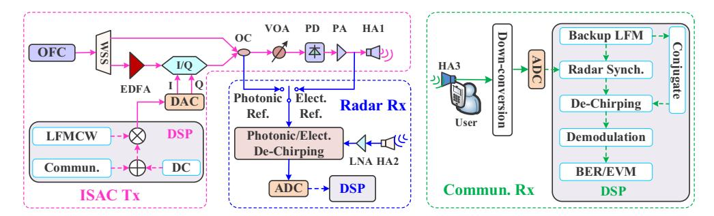

**Fig. 1.** Schematic diagram of the proposed photonics-aided mmW ISAC architecture; OFC, optical frequency comb; WSS, wavelength selective switch; EDFA, erbium doped fiber amplifier; I/Q, I/Q modulator; OC, optical coupler; VOA, variable optical attenuator; PD, photodetector; PA, power amplifier; HA, horn antenna; LNA, low noise amplifier; DAC, digital-to-analog converter; ADC, analog-to-digital converter; DSP, digital signal processing.

# 2.1. ISAC transmitter

In the ISAC Tx, a coherent OFC is first generated and injected into a wavelength selective switch (WSS). The WSS selects two coherent tones at the desired mmW frequency separation. One is used as the signal light (SL) for electro-optic modulation after power compensation by an erbium doped fiber amplifier (EDFA), the other is used as an optical LO for coherent up-conversion. The electro-optic modulation is implemented using an in-phase/quadrature modulator (I/Q MOD). The pair of baseband ISAC signals driving the I/Q MOD are obtained by the ISAC Tx digital signal processing (DSP) followed by the digital-to-analog conversion. The Tx DSP is a two-step process: first generate DC-offset the communication sequence, and then encode the DC-offset communication sequence on a LFMCW in baseband. Since the encoding is performed in baseband, IF-band DACs used in [20,21,23–27,29–31] are not necessary. Mathematically, the

encoded LFMCW, i.e. the digital ISAC signal, can be expressed by

$$s(t)_{IO} = [c(t) + \alpha] \cdot e^{j2\pi(-f_s t + 0.5kt^2)}, \ t \in [-T/2, \ T/2],$$
 (1)

where c(t) represents the communication sequence;  $\alpha$  is the DC offset which is defined as the ratio compared to the communication sequence without pulse shaping.;  $f_s$ , k, and T is the initial frequency, chirp rate, and duration of the LFMCW, respectively.

To further minimize the DAC bandwidth, the frequency range of the digital LFMCW should be symmetric about DC. Correspondingly, the initial frequency of the LFMCW should satisfy

$$f_s = 0.5kT. (2)$$

After the Tx DSP, the baseband DAC converts the digital ISAC signal into two mutually orthogonal analog ISAC signals to drive the two sub-modulators of the integrated I/Q MOD, respectively. The I/Q MOD is appropriately biased as used in a coherent communication system [32] or carrier-suppressed single-sideband (CS-SSB) link [33]. Thus, the baseband ISAC signal is linearly mapped to the optical domain. Followed with the I/Q MOD, an optical coupler (OC) recombines the linearly mapped optical signal and the LO. The coupled signals can be written as

$$E \propto [c(t) + \alpha] \cdot e^{j2\pi(f_c t - f_s t + 0.5kt^2)} + \beta e^{j2\pi f_{LO}t}, \tag{3}$$

where  $f_c$  and  $f_{LO}$  is the frequencies of the SL and LO tones, respectively; and  $\beta$  represents the amplitude ratio between the modulation signal and LO tone.

The coupled optical signals are finally photo-electrically converted into a mmW ISAC signal in a photodetector (PD) after power optimization using a variable optical attenuator (VOA). The resulting mmW signal is first boosted by a power amplifier (PA) and further radiated into free space via a horn antenna (HA1). Considering the band-pass frequency of the RF devices, the generated mmW signal of interest can be expressed as

$$i_{mmW}(t) \propto \beta[c(t) + \alpha] \cdot \cos\{2\pi[(f_c - f_{LO})t - f_s t + 0.5kt^2]\}$$

$$= \beta c(t) \cos\{2\pi[(f_c - f_{LO})t - f_s t + 0.5kt^2]\}$$

$$+\alpha\beta \cos\{2\pi[(f_c - f_{LO})t - f_s t + 0.5kt^2]\}.$$
(4)

As can be seen, an ISAC signal is successfully obtained with its frequency equal to the frequency separation of the two coherent tones. Thanks to the use of a coherent OFC, the mmW ISAC signal has an ultra-stable frequency. The resulting ISAC signal can also be expanded into two terms. The first term is a mmW LFMCW encoded by the communication sequence, while the second term is a pure LFMCW related to the DC offset. The pure LFMCW preserves the distinctive chirp phase and good cross-correlation of the original LFMCW, which can achieve high-resolution sensing by radar de-chirping and assist in communication sequence synchronization by pulse compression, respectively. To meet the needs of long-distance radar detection, QPSK signals characterized by constant envelope are selected as the communication sequences. In free space, a part of the mmW ISAC signal is reflected back to the Tx for user positioning, and the other part is downlink to the user for wireless communication.

# 2.2. Radar receiver

The reflected mmW ISAC signal is finally received by a radar Rx. In the Rx, the echo received by the HA2 is first power compensated by a low noise amplifier (LNA) and then de-chirped in a de-chirping module. The de-chirping can be accomplished either by a photonic method [13–15] or an electronic method [24,29]. Accordingly, the optical signal from the I/Q MOD and electrical

signal from the PA can be used as the optical reference and electrical reference, respectively. Mathematically, the de-chirping process can be given by

$$i_{radar}(t) \propto \beta[c(t) + \alpha] \cdot \cos\{2\pi[(f_c - f_{LO} - f_s)t + 0.5kt^2]\} \times \beta[c(t+\tau) + \alpha] \cdot \cos\{2\pi[(f_c - f_{LO} - f_s)(t+\tau) + 0.5k(t+\tau)^2]\},$$
(5)

where is time delay between the echo and reference. Because the high-frequency component will be blocked by the ADC with low sampling rate, only the IF photocurrents of interested will be collected, as expressed by

$$i_{IF}(t) \propto \beta^{2} \{\alpha[c(t) + c(t+\tau)] + c(t)c(t+\tau)\}$$

$$\times \cos\{2\pi[k\tau t + (f_{c} - f_{LO} - f_{s})\tau + 0.5k\tau^{2}]\}$$

$$+\alpha^{2}\beta^{2}\cos\{2\pi[k\tau t + (f_{c} - f_{LO} - f_{s})\tau + 0.5k\tau^{2}]\}.$$
(6)

The first term is a de-chirped carrier, which is modulated by the QPSK sequence and signal-to-signal beating interference (SSBI). Accordingly, the spectrum of the de-chirped carrier will be broadened, causing the de-chirped carrier to be submerged in the stretched spectrum. As a result, the delay-related frequency can not be extracted when the delay is larger than the symbol length of the QPSK-encoded LFMCW [29]. The second term is a pure de-chirped carrier resulting from the pure mmW LFMCW in Eq. (4) owing to the DC offset. Because the power is concentrate on the single tone, the pure de-chirped carrier is more dominant than the modulated one in frequency domain. By further optimizing the DC offset to highlight the pure de-chirped carrier, the effects of spectral broadening caused by the QPSK and SSBI modulation can be effectively weakened, thereby getting rid of the restriction of echo delay on the symbol duration in Ref. [29] or starting frequency in Ref. [31] of the communication sequences. The delay-related frequency can thus be accurately extracted from the de-chirped signals. Meanwhile, higher communication rates can also be achieved.

# 2.3. Communication receiver

The downlink mmW ISAC signal is finally received by a communication Rx. In the Rx, the downlink signal received by the HA3 is first down-converted to baseband and then digitized by a baseband ADC for further DSP. In the communication DSP module, the digitized signal is first sequence-synchronized with a backup LFM, which has the same bandwidth and chirp rate as the original LFMCW in the Tx. Because the resulting mmW ISAC signal retains the good cross-correlation of the original LFMCW thanks to the DC offset, precise radar synchronization can be performed through pulse compression. The baseband synchronized ISAC signal is then mixed with the conjugate of the backup LFM for de-chirping, as described by

$$i_{commun}(t) \propto \beta[c(t) + \alpha] \cdot e^{j[2\pi(-f_s t + 0.5kt^2)]} \times conj\{e^{j[2\pi(-f_s + 0.5kt^2)]}\},$$
 (7)

where *conj* represents the conjugate transformation. The de-chirped baseband component can be written as

$$i_{BB}(t) \propto \beta[c(t) + \alpha].$$
 (8)

It can be seen that the LFM interference to the communication signal is completely eliminated, thereby successfully reconstructing the DC-offset QPSK signal to baseband. As for the DC offset, it can be easily subtracted by averaging, because no frequency offset exists owing to the coherent OFC. The reconstructed QPSK signal is finally equalized by commonly used communication algorithms except the FOE for performance evaluation.

From the configuration process, high-resolution ranging and high-speed communication in a co-frequency and co-time waveform are constructed based on a DC-offset QPSK-encoded

LFMCW. Since the all involved devices are commercially available, the proposed photonic front-end is easy for on-chip integration.

# 3. Experimental set-up and results

# 3.1. mmW ISAC signal generation

Figure 2(a) illustrates the experimental set-up of our proposed photonics-aided mmW ISAC system according to the principle in Section 2. The OFC is structured by a 14.5-dBm external cavity laser (ECL) and a null-biased Mach-Zehnder modulator (MZM). A two-tone OFC is obtained by driving the MZM with an RF clock, which is then separated by a 50-GHz interleaver (IL). In the lower path, the separated SL is injected into a I/Q MOD after power amplification in the EDFA1 and polarization alignment by the polarization controller (PC1). The offline-generated digital ISAC signal is converted into a pair of analog signals in baseband by a 92-GSa/s ( $f_{AWG}$ ) arbitrary waveform generator (AWG) for driving the I/Q MOD. The I/Q MOD is automatically biased to implement linear electro-optical mapping. In the upper path, the separated LO is compensated polarization-aligned with the modulated SL through the PC2 after power compensation by the EDFA2. Notably, the delay introduced by the modulator is far less than that of the EDFA. Hence the EDFA2 also roughly matches the delay with the lower path to maintain the coherence. For more accurate delay matching, a vector network analyzer is needed to measure the delay difference between the upper and lower paths [34], and then the corresponding length of optical fiber can be applied for delay compensation [17]. The optical power into the PD is attenuated from about 5 dBm to -1 dBm by the VOA for linear photoelectric conversion. A band-pass PA, working at 20-40 GHz, boosts the generated mmW ISAC signal by 30 dB. An electrical coupler (EC) followed with the PA divides the boosted mmW signal into two equal path. One is used as the electrical reference for radar sensing, the other part is radiated into free space via the Ka-band HA1.

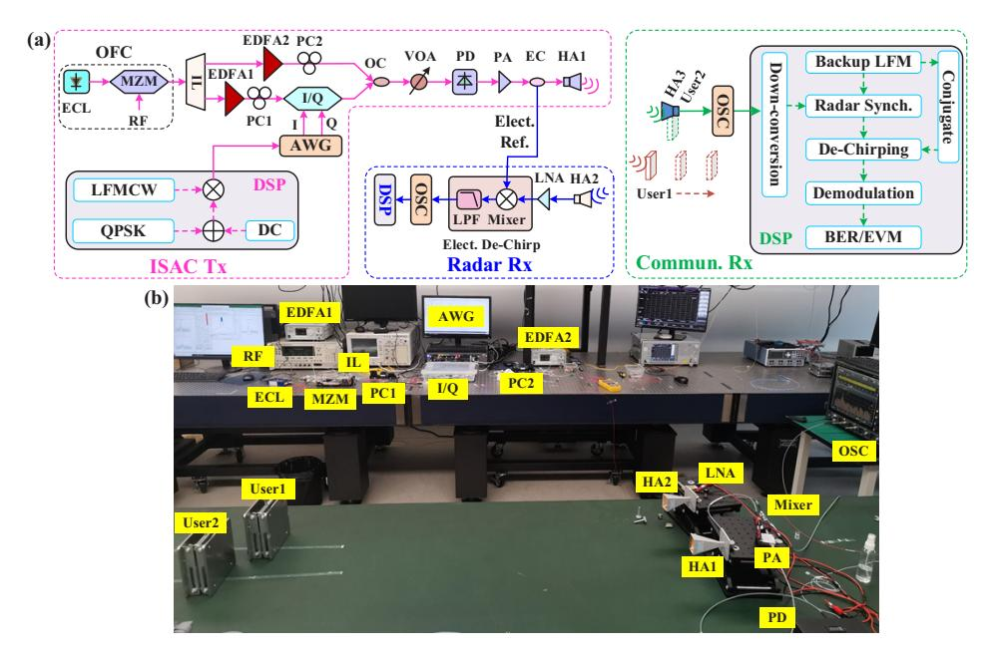

**Fig. 2.** (a) Experimental set-up of the proposed photonics-aided mmW ISAC architecture; (b) scene photo of the dual-user radar ranging. ECL, external cavity laser; MZM, Mach-Zehnder modulator; IL, interleaver; PC, polarization controller; EC, electrical coupler; LPF, low-pass filter; OSC, oscilloscope.

First, we measure the transmission responses of the IL as shown by the dotted lines in Fig. 3(a). The ECL operates around the center of two adjacent passbands of the IL for better separation of the two tones. The RF clock operates at 14 GHz. Accordingly, two tones spaced at 0.227 nm are observed as shown by the solid black line in Fig. 3(a). The residual carrier is 30.68 dB lower than the +1st sideband owing to the null biasing of the MZM. Initially, the baud rate and shaping factor of the QPSK sequence are set at 5.75 G and 0.3, respectively. The DC offset is set at 1, which is the same amplitude as the QPSK sequence before pulse shaping. The digital LFMCW with a  $2^{18}$  length (L) and a 1.4375-GHz bandwidth (B) lasts for 2.8494  $\mu$ s (T). The modulation signal and amplified LO before recombination are shown as the pink and blue solid lines in Fig. 3(a), respectively. The modulated SL is 20.29 dB higher than the residual -1st sideband. Afterwards, we measure the electrical spectrum of the generated mmW ISAC signal. The measurement is performed by capturing the waveform with a 128-GSa/s oscilloscope (OSC) followed by offline fast Fourier transform (FFT). The measured result at the output of the EC is shown in Fig. 3(b). We can see that the mmW ISAC signal with more than 30-dB signal to noise ratio (SNR) is centered at precisely 28 GHz. The precise 28-GHz carrier frequency is thanks to the use of an OFC. The dominate peak in the spectrum is due to the residual -1st sideband as pointed in Fig. 3(a). The attenuation at higher frequency is caused by frequency-dependent optoelectronics and RF devices.

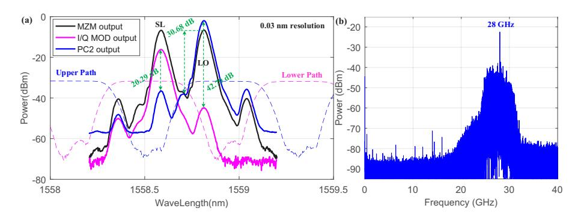

**Fig. 3.** Measured (a) optical spectra at different nodes and (b) electrical spectrum at the output of the EC.

Figure 4(a) shows the instantaneous frequency of the mmW ISAC signal, where a periodic yellow ribbon region with strong energy can be observed around 28 GHz. The yellow ribbon region is the mmW LFMCW encoded by the QPSK sequence, which can be inferred from the first term in Eq. (4). Meanwhile, a more energetic yellow line can be observed in the center of the yellow ribbon area. The linear yellow line corresponds to the pure mmW LFMCW related to the DC offset, which can be inferred from the second term in Eq. (4). Moreover, the energetic yellow line also indicates that distinctive chirp phase of the original LFMCW is preserved. Here, the original LFMCW is defined as the LFMCW generated by the DSP module at the ISAC Tx and then resampled at the sampling rate of the receiver. The blue line in Fig. 4(b) shows the normalized cross-correlation result between the down-converted ISAC signal and original LFMCW. The normalized cross-correlation is almost the same with the normalized auto-correlation (pink) result of the original LFMCW thanks to the linear electro-optical mapping and photoelectric conversion. The cross-correlation with good PSR can assist in communication sequence synchronization by pulse compression.

#### 3.2. mmW sensing

For radar detection, the electrical de-chirping method is adopted. The de-chirping is achieved by first mixing the electrical reference with the received echo in a mixer and then filtering the

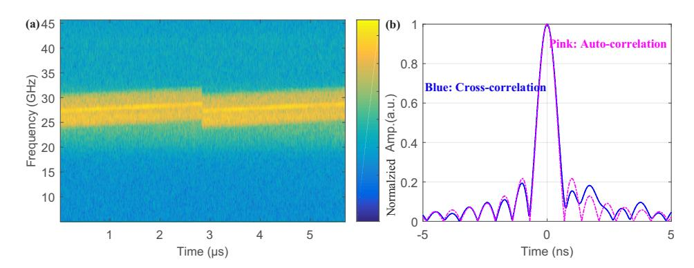

**Fig. 4.** (a) Time-frequency characteristics of the generated mmW ISAC signal; (b) normalized cross-correlation result (blue) between the down-converted ISAC signal and original LFMCW, and normalized auto-correlation result (pink) of the original LFMCW.

de-chirped IF component using a low-pass filter (LPF). The filtered IF signal is digitalized by an OSC for offline DSP.

First, we detect the distance of a single user. A square metal plate with a side length of 15 cm acts as the user1. The metal plate is placed along one side of the mid-perpendicular line of the HA1 and HA2. The two HAs are spaced by 28 cm. During the detection, we manually move the user1 away from the Tx in a 10-cm step within 1200-1600 mm. Figures 5(a)-(c) illustrate the spectra of the de-chirped IF signals captured at 1200 mm, 1400 mm, and 1600 mm, respectively. Thanks to the DC offset, the de-chirped IF signals with concentrated energy successfully resist the interference of the QPSK- and SSBI-coded LFMCW, as pointed out in Section 2.2. Therefore, a distinct peak in the broadened spectra can be observed from each figure. The adjacent peaks are separated by  $\Delta f = 0.35 \ MHz$ , which corresponds to a distance separation of  $\Delta R = \frac{\Delta fcT}{2R} = \frac{\Delta fcT}{2Bf_{AWG}} = 10.40 \ cm$  (c is the light speed). The observed signal-to-interference ratio (SIR) at 1400 mm is up to 14.46 dB thanks to the DC offset. Figure 5(d) shows the distances calculated from the de-chirped IF signals and the measured errors. The distances detected by the mmW radar closely match the distances measured by a band tap. The calculated errors are within 20 mm.

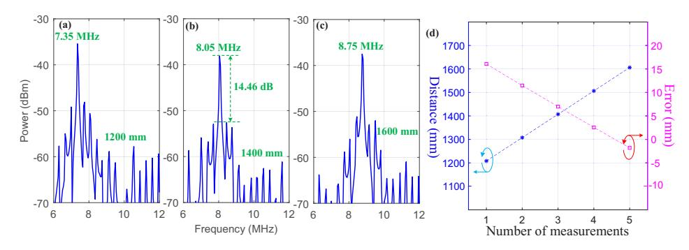

**Fig. 5.** (a)-(c) Spectra of the de-chirped IF signals under single-user detection; (d) distances calculated from the de-chirped IF signals and the measured errors.

Then, we detect the distances of two users. The user2, placed one the other side of the mid-perpendicular line, is also a metal plate of the same size as the user1. The scene photo of the dual-user radar ranging is shown in Fig. 2(b). During the measurement, user2 is fixed at 1400 mm, while user1 is manually moved away from the Tx in a 10-cm step within 1200-1600 mm.

Figures 6(a)-(c) illustrate the spectra of the de-chirped IF signals captured at 1300 mm, 1400 mm, and 1500 mm, respectively. From both Figs. 6(a) and (c), we can observe two dominate peaks separated by 0.35 MHz, indicating that there are two users separated by 10.40 cm. When the vertical distance is closer than 10.40 cm, it cannot be distinguished by the radar. As a result, only one power-enhancing peak appears as shown in Fig. 6(b). Figure 6(d) shows the distance intervals between the two users calculated from the de-chirped IF signals and the measured errors. Apparently, the detection results also agree perfectly with the actual values. The calculated errors are less than 15 mm.

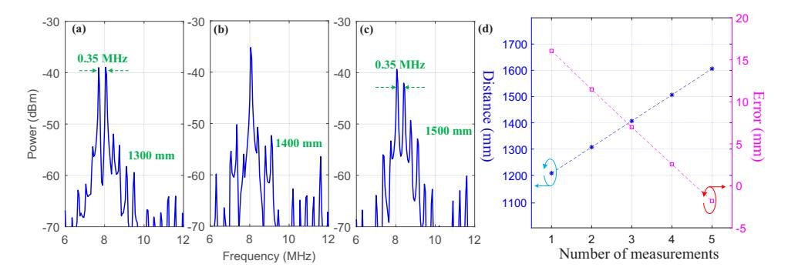

**Fig. 6.** (a)-(c) Spectra of the de-chirped IF signals under dual-user detection; (d) distances calculated from the de-chirped IF signals and the measured errors.

Next, we explore the frequency tunability of the mmW radar by fixing the user2 at 1400 mm. The frequency of the generated mmW ISAC signal is swept from 26-40 GHz in a 1-GHz step by adjusting the RF. During the detection, the optical power into the PD is slightly raised at 32-36 GHz due to the frequency-dependent loss. The detected SIR exhibits a gradual decay trend with increasing frequency, as shown in Fig. 7 (a). Figures 7(b) and (c) plot the de-chirped IF signals at 26 GHz and 36 GHz, respectively. Both of the de-chirped IF signals locate at 8.05 MHz, indicating a position-fixed user. The SIR is up to 16.52 dB at 26 GHz, while the SIR is attenuated to 6.67 dB because of the large losses. Nevertheless, the structured mmW radar successfully covers almost the entire Ka band.

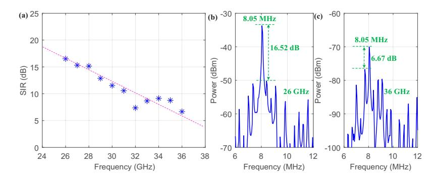

**Fig. 7.** (a) Measured SIR at different frequencies; (b) and (c) spectra of the de-chirped IF signals at 26 GHz and 36 GHz, respectively.

Also, the wavelength tolerance is explored by shifting the ECL from the center of the IL. The detected SIR is more than 12.5 dB within -8.75-11.25 GHz, as shown in Fig. 8. The 20-GHz tolerance greatly relaxes the frequency stability requirements of the ECL and the roll-off coefficient requirements of the IL.

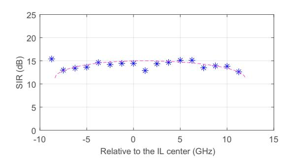

**Fig. 8.** Measured SIR at different ECL offset frequencies.

# *3.3. mmW wireless communications*

For wireless communications, the downlink mmW ISAC signal is received by the fixed user2 via the HA3. For simplicity, the received signal is directly digitized by the 128-GSa/s OSC for offline DSP. The digitized signal is first down-converted to baseband for sequence synchronization. The synchronization is achieved by pulse-compressing the down-converted ISAC signal with the backup LFM wave. Thanks to the DC offset, the ISAC signal can be perfectly aligned with the backup LFM wave with zero lag, as shown in Fig. [4\(](#page-8-0)b). After the synchronization, the ISAC signal is also mixed with the conjugate of the backup LFM wave for de-chirping. The de-chirped signal is finally equalized by commonly used communication algorithms for performance evaluation. Notably, the traditional communication synchronization methods do not consider the implementation of sensing function. The pulse compression used here is an ingenious method for both high-capacity communication and high-precision detection, rather than a challenge to mature communication synchronization methods. Furthermore, the FOE is not applied thanks to the stable frequency caused by the coherent OFC, reducing the complexity and power consumption of the DSP at the user end.

First, we measure the optical power margin of the mmW ISAC system by calculating the error vector magnitudes (EVMs) under different received optical powers (ROPs). The ROP is controlled by adjusting the VOA in a 1-dB step. The calculated EVM versus the ROP is marked in pink in Fig. [9\(](#page-11-0)a). The EVM improves significantly with the increase of the ROP. The communication performance reaches the 7%-forward error correction (FEC) threshold at a -8 dBm ROP. The constellation diagram at the 3-dBm ROP is plot in Fig. [9\(](#page-11-0)c), where the constellation points are well clustered. To investigate the effect of communication rate on communication performance, the QPSK signal is halved to 2.875 GBaud. The calculated EVM as a function the ROP is marked in blue in Fig. [9\(](#page-11-0)a). The receiving sensitivity at the FEC limit is improved by about 1.5 dB. At the 3-dBm ROP, the performance is almost the same as the 5.75-Gbaud one, as observed from the Fig. [9\(](#page-11-0)b). The effect of LFWCW bandwidth on communication performance is also investigated by halving the LFMCW to 0.71875 GHz while fixing the QPSK at 5.75 GBaud. The relationship between the ROP and EVM is marked in green in Fig. [9\(](#page-11-0)a). The receiving sensitivity is slightly worse at the FEC limit, but the EVM is improved by about 1% at the 3-dBm ROP. Therefore, the constellation points are more clustered as presented in Fig. [9\(](#page-11-0)c). In addition, when the ROP reaches -3 dBm, error-free transmission can be achieved in all three cases, resulting in a net rate up to 11.5 Gbit/s. This also indicates that the constraint of sensing on communication is lifted owing to the DC offset.

Afterwards, we explore the frequency range of the downstream communication. The frequency of the generated mmW ISAC signal is also adjusted from 26-40 GHz in a 1-GHz step by sweeping the RF. Figure [10](#page-11-1) plots the calculated EVM at different frequencies, in which the communication performance tends to deteriorate with the increase of frequency. The performance degradation is

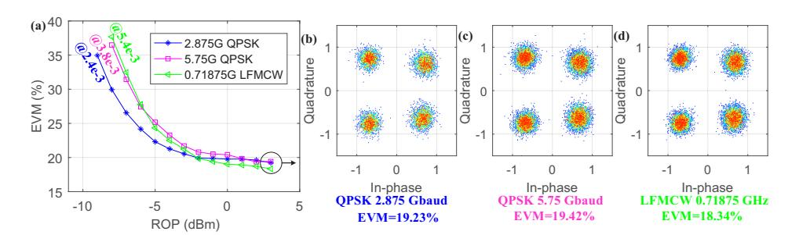

**Fig. 9.** (a) Calculated EVM as a function of the ROP, (b)-(d) constellation diagrams at the 3-dB ROP; QPSK (GBaud)/LFMCW (GHz): 2.875/1.4375 (blue), 5.75/1.4375 (pink), 5.75/0.71875 (green).

mainly caused by the lower response rates of the RF and optoelectronic components at higher frequencies. From Fig. 10, the EVM is better than 22% when the carrier frequency of the mmW ISAC signal operates at 26-30 GHz. Despite the performance degradation at 36 GHz, the constellation points are generally concentrated near the theoretical positions, as inserted in the right of Fig. 10. Hence, the established MMW wireless communications is also sufficient to cover the entire Ka band.

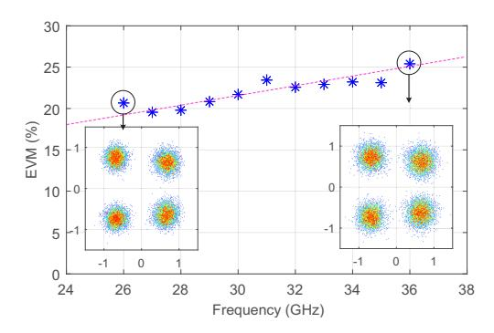

Fig. 10. Calculated EVM at different frequencies; inset: left (26 GHz), right (36 GHz).

Next, the wavelength tolerance for wireless communications is also explored, which is carried out by shifting the ECL from the center of the IL in a 1.25-GHz step. The calculated EVM is better than 22% in the range of -8.75-12.5 GHz, as shown in Fig. 11. Additionally, slow degradation is revealed as the ECL deviates from either side of the IL center. The constellation diagrams for the -8.75-GHz and 12.5-GHz frequency offsets are illustrated in Figs. 10(b) and (c), respectively. The slightly divergent constellation points indicate that the communication performance is insensitive to the ECL frequency offset.

#### 3.4. Discussion

As demonstrated above, the DC offset facilitates high-resolution sensing via radar de-chirping and aids communication sequence synchronization by pulse compression. Here, we explore the effect of DC offset on the performance of both radar and wireless communications. The exploration is measured by fixing the user2 at 1400 mm and sweeping the DC offset in a 0.1 step. The measured SIR and EVM at different DC offsets are marked in blue and pink, respectively, in Fig. 12(a). For radar detection, the SIR improves significantly in the range of 0.1-0.7. When DC offset is greater than 0.7, the SIR increases linearly at a slower rate. The SIR reaches 15.48 dB at

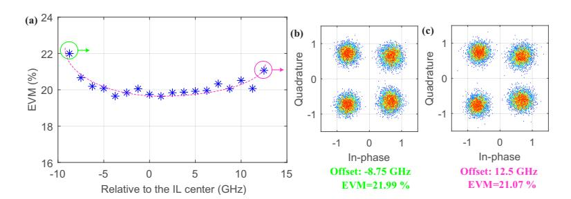

**Fig. 11.** (a) Calculated EVM at different ECL offset frequencies; (b) and (c) constellation diagrams at the -8.75-GHz and 12.5-GHz frequency offset, respectively.

the 1.2 DC offset, as illustrated in Fig. 12(b). The rapid increase in SIR is due to the positive correlation of the pure de-chirped carrier with the DC offset, as revealed by Eq. (6). When the DC offset reaches a certain value, the performance of ISAC for sensing gradually approaches that of a pure LFMCW. To illustrate, the de-chirped IF signals without QPSK signal is shown in Fig. 12(c), where the SIR is 17.12 dB. It can be seen from the comparison that the ISAC signal only loses 1.64-dB SIR due to the co-existence of communication. Notably, since the communication signal occupies a part of the energy, the peak power of the delay-related IF signal is reduced by about 15 dB. For wireless communication, the EVM deteriorates linearly in the range of 0.1-1.2. Nonetheless, the EVM is better than 22% EVM at the maximum DC offset. Figure 12(d) show the constellation at 0.1 DC, where the constellation points are well clustered. As a comparison, the constellation without LFMCW is shown in Fig. 12(e), where the EVM is improved to 10.53%. From the comparison, co-existence of sensing introduces about 3.23% EVM penalty. Moreover, from Fig. 12(a), the DC offset in the range of 0.8-1.0 is preferred for achieving a ISR above 10 dB and EVM below 20%. The EVM degradation is due to the good performance of pulse compression that enables sequence synchronization being completed at a small DC offset. Excessive DC offset will instead cause the signal to deviate from the center of the constellation. In practical applications, the DC offset can be adjusted according to the emphasis of the two functions.

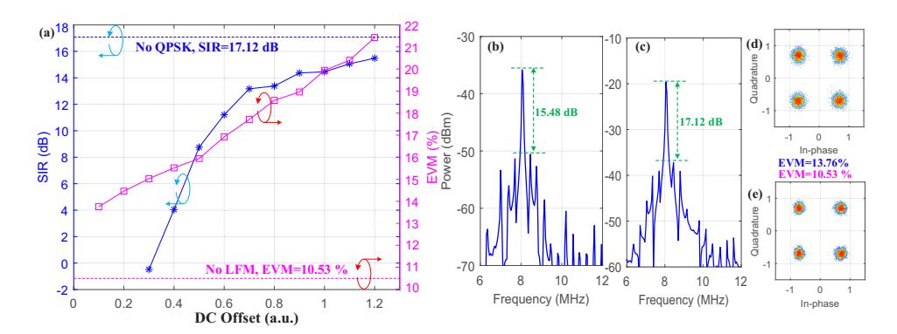

**Fig. 12.** (a) Measured SIR (blue) and EVM (pink) at different DC offsets; (b) de-chirped IF signal at 1.2 DC; (c) de-chirped IF signal without QPSK signal; (d) constellation at 0.1 DC; (e) constellation without LFMCW.

In addition, the QPSK signal is selected as the communication waveform for the consideration of radar envelope constancy. To achieve higher data rates, angle modulation [31,35] can be applied to obtain higher modulation orders with constant envelopes. Based on higher order

modulation formats, more bandwidth can be allocated to the LFMCW. In this way, our proposed mmW ISAC system is expected to simultaneously achieve higher spatial resolution and higher wireless rates. As for the operation frequency, both the radar and communication functions have been well verified to operate in the full Ka band. The proposed mmW ISAC system can be easily scaled to higher bands by introducing an ultra-wideband OFC [36–38]. Beneficially, the radar and communication performance can also be improved simultaneously owing to the larger operating bandwidth.

In the radar ranging, the users are in a static condition, so the whole sequence of the received ISAC signal can be synchronized with the backup LFM accurately. Under a moving scene, due to the Doppler frequency shift, the received ISAC signal cannot be accurately synchronized with the backup LFM on the timeslot. Therefore, frequency offset sweeping of the backup LFM is required or a dual-chirp LFMCW is applied [23] to extract the Doppler frequency shift. In this way, the DC-Offset QPSK-encoded LFMCW sequence can be de-chirped successfully.

In addition, we added a frequency shift to the backup LFM to simulate the impact of Doppler frequency shift on communication. The measured EVM fluctuation is less than 0.7% within  $\pm 5$ -MHz frequency shift, as shown in Fig. 13. The test results show that the proposed system has a good ability to resist frequency shift. For a user with a speed of 100 m/s, the Doppler frequency shift is only  $f_d = 2 \frac{v_{user}}{\lambda_{mmW}} = 2 \cdot \frac{100 m/s}{10 mm} = 20 \text{ kHz}$  at a 30-GHz carrier frequency. Therefore, the pure LFMCW superimposed in the ISAC signal can also be exploited for communication synchronization by pulse-compressing in the mobile scene.

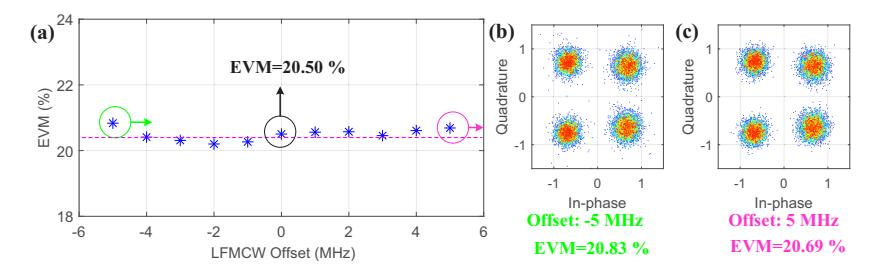

**Fig. 13.** Time-frequency of the backup LFM and radar echo for a (a) stationary and (c) moving user before synchronization; Time-frequency of the backup LFM and radar echo for a (b) stationary and (d) moving user after synchronization.

#### 4. Conclusion

To summarize, we propose a photonics-aided ISAC system in the mmW bands. The mmW ISAC signal is obtained by encoding a LFMCW with a DC-offset QPSK signal followed by photonic up-conversion using a coherent OFC. The OFC contributes to the stable frequency of the resulting mmW signal. The QPSK encoding ensures the constant envelope of the mmW ISAC signal, which is beneficial for long-range radar detection. The optimized DC offset facilitates not only high-resolution sensing via radar de-chirping, but also communication sequence synchronization by pulse compression. Experimental results show that a 10.4-cm spatial resolution and 11.5-Gbit/s transmission rate are simultaneously realized at 28-GHz band by sharing one mmW ISAC signal. The proposed ISAC system with good frequency tunability and wavelength tolerance is expected to play an important role in the upcoming 5G mmW and B5G.

**Funding.** Natural Science Foundation of Jiangsu Province (BK20220210); Open Fund of IPOC (BUPT) (IPOC2021A01); National Natural Science Foundation of China (62101121, 62101126).

**Disclosures.** The authors declare no conflicts of interest.

**Data availability.** Data underlying the results presented in this paper are not publicly available at this time but may be obtained from the authors upon reasonable request.

#### **References**

- 1. L. Huang, J. He, Y. W. Chen, P. Dai, P. C. Peng, G. K. Chang, and X. Chen, "Simple Multi-RAT RoF System with 2×2 MIMO Wireless Transmission," [IEEE Photonics Technol. Lett.](https://doi.org/10.1109/LPT.2019.2916658) **31**(13), 1025–1028 (2019).
- 2. D. N. Nguyen, J. Bohata, J. Spacil, M. Komanec, N. Stevens, Z. Ghassemlooy, P. T. Dat, and S. Zvanovec, "Polarization Division Multiplexing-Based Hybrid Microwave Photonic Links for Simultaneous mmW and Sub-6 GHz Wireless Transmissions," [IEEE Photonics J.](https://doi.org/10.1109/JPHOT.2020.3036440) **12**(6), 1–14 (2020).
- 3. F. Shi, Y. Fan, X. Wang, W. Zhang, and Y. Gao, "High-performance dual-band radio-over-fiber link for future 5 G radio access applications," [J. Opt. Commun. Netw.](https://doi.org/10.1364/JOCN.440530) **14**(4), 267–277 (2022).
- 4. D. Brenner, "Global 5 G Spectrum Update," SVP, Spectrum Strategy & Technology Poilcy, 2020.
- 5. S. Zhu, X. Fan, M. Li, N. Zhu, and W. Li, "FCC-compliant millimeter-wave ultra-wideband pulse generator based on optoelectronic oscillation," [Opt. Lett.](https://doi.org/10.1364/OL.44.003530) **44**(14), 3530–3533 (2019).
- 6. B. Liu, S. Seshadri, J. M. Wun, N. P. O'Malley, D. E. Leaird, N. W. Chen, J. W. Shi, and A. M. Weiner, "W-Band Photonic Pulse Compression Radar with Dual Transmission Mode Beamforming," [J. Lightwave Technol.](https://doi.org/10.1109/JLT.2020.3038846) **39**(6), 1619–1628 (2021).
- 7. Y. Tong, "Advanced Photonics-Based Radar Signal Generation Technology for Practical Radar Application," [J.](https://doi.org/10.1109/JLT.2021.3066588) [Lightwave Technol.](https://doi.org/10.1109/JLT.2021.3066588) **39**(11), 3371–3382 (2021).
- 8. X. Yu, Z. Lyu, L. Li, and L. Zhang, "Waveform design and signal processing for terahertz integrated sensing and communication," [J. Commun.](https://doi.org/10.11959/j.issn.1000-436x.2022015) **43**(2), 76–88 (2022).
- 9. J. Yao, "Microwave Photonics," [J. Lightwave Technol.](https://doi.org/10.1109/JLT.2008.2009551) **27**(3), 314–335 (2009).
- 10. Y. Men, A. Wen, Y. Li, and Y. Tong, "Photonic approach to flexible multi-band linearly frequency modulated microwave signals generation," [Opt. Lett.](https://doi.org/10.1364/OL.421930) **46**(7), 1696–1699 (2021).
- 11. Y. Gao, A. Wen, W. Zhang, W. Jiang, J. Ge, and Y. Fan, "Ultra-Wideband Photonic Microwave I/Q Mixer for Zero-IF Receiver," [IEEE Trans. Microwave Theory Tech.](https://doi.org/10.1109/TMTT.2017.2695184) **65**(11), 4513–4525 (2017).
- 12. T. Li, E. H. W. Chan, X. Wang, X. Feng, B. Guan, and J. Yao, "Broadband Photonic Microwave Signal Processor with Frequency Up/Down Conversion and Phase Shifting Capability," [IEEE Photonics J.](https://doi.org/10.1109/JPHOT.2017.2778287) **10**(1), 1–12 (2018).
- 13. F. Zhang, Q. Guo, Z. Wang, P. Zhou, G. Zhang, J. Sun, and S. Pan, "Photonics-based broadband radar for high-resolution and real-time inverse synthetic aperture imaging," [Opt. Express](https://doi.org/10.1364/OE.25.016274) **25**(14), 16274–16281 (2017).
- 14. S. Wang, Z. Lu, N. Idrees, S. Zheng, X. Jin, X. Zhang, and X. Yu, "Photonic Generation and De-Chirping of Broadband THz Linear-Frequency-Modulated Signals," [IEEE Photonics Technol. Lett.](https://doi.org/10.1109/LPT.2019.2911539) **31**(11), 881–884 (2019).
- 15. X. Zhang, Q. Sun, J. Yang, J. Cao, and W. Li, "Reconfigurable multi-band microwave photonic radar transmitter with a wide operating frequency range," [Opt. Express](https://doi.org/10.1364/OE.27.034519) **27**(24), 34519–34529 (2019).
- 16. T. Nagatsuma, "Generating millimeter and terahertz waves by photonics for communications and sensing," in *MTT-S International Microwave Symposium Digest (MTT)*, (IEEE, 2013), pp. 1–3.
- 17. H. Song, W. Cheng, L. Dai, C. Huang, Y. Yang, Z. Liu, X. Xiong, M. Cheng, Q. Yang, D. Liu, and L. Deng, "DSP-free remote antenna unit in a coherent radio over fiber mobile fronthaul for 5 G mm-wave mobile communication," [Opt.](https://doi.org/10.1364/OE.433371) [Express](https://doi.org/10.1364/OE.433371) **29**(17), 27481–27492 (2021).
- 18. S. Shen, Q. Zhou, Y. Chen, S. Yao, R. Zhang, Y. Alfadhli, S. Su, J. Finkelstein, and G. Chang, "Hybrid W-Band/Baseband Transmission for Fixed-Mobile Convergence Supported by Heterodyne Detection with Data-Carrying Local Oscillator," in *Optical Fiber Communication Conference (OFC)*, (Optica, 2020), paper M2H.6.
- 19. A. Kanno, N. Sekine, Y. Uzawa, I. Hosako, and T. Kawanishi, "300-GHz versatile transceiver front-end for both communication and imaging," in *40th International Conference on Infrared, Millimeter, and Terahertz waves (IRMMW-THz)*, (IEEE, 2015), pp. 1–2.
- 20. Y. Wang, J. Ding, M. Wang, Z. Dong, F. Zhao, and J. Yu, "W-band simultaneous vector signal generation and radar detection based on photonic frequency quadrupling," [Opt. Lett.](https://doi.org/10.1364/OL.447876) **47**(3), 537–540 (2022).
- 21. Y. Wang, Z. Dong, J. Ding, W. Li, M. Wang, F. Zhao, and J. Yu, "Photonics-assisted joint high-speed communication and high-resolution radar detection system," [Opt. Lett.](https://doi.org/10.1364/OL.444252) **46**(24), 6103–6106 (2021).
- 22. S. Ja, S. Wang, K. Liu, X. Pang, H. Zhang, X. Jin, S. Zheng, H. Chi, X. Zhang, and X. Yu, "A unified system with integrated generation of high-speed communication and high-resolution sensing signals based on THz photonics," [J.](https://doi.org/10.1109/JLT.2018.2863684) [Lightwave Technol.](https://doi.org/10.1109/JLT.2018.2863684) **36**(19), 4549–4556 (2018).
- 23. M. Lei, A. Li, Y. Cai, J. Zhang, B. Hua, Y. Zou, W. Xu, J. Wu, J. Yu, and M. Zhu, "Integrated Wireless Communication and mmW Radar Sensing System for Intelligent Vehicle Driving Enabled by Photonics," in *19th International Conference on Optical Communications and Networks (ICOCN)*, (IEEE, 2021), pp. 1–3.
- 24. M. Lei, M. Zhu, B. Hua, J. Zhang, Y. Cai, Y. Zou, X. Liu, and J. Yu, "A Spectrum-Efficient MoF Architecture for Joint Sensing and Communication in B5G Based on Polarization Interleaving and Polarization-Insensitive Filtering," [J. Lightwave Technol.](https://doi.org/10.1109/JLT.2022.3181608) **40**(20), 1–12 (2022).
- 25. R. Song and J. He, "OFDM-NOMA combined with LFM signal for W-band communication and radar detection simultaneously," [Opt. Lett.](https://doi.org/10.1364/OL.460188) **47**(11), 2931–2934 (2022).
- 26. H. Nie, F. Zhang, Y. Yang, and S. Pan, "Photonics-based integrated communication and radar system," in *International Topical Meeting on Microwave Photonics (MWP)*, (IEEE, 2019), pp. 1–4.

- 27. W. Bai, X. Zou, P. Li, W. Pan, L. Yan, and B. Luo, "60-GHz photonic millimeter-wave joint radar-communication system," in *International Conference on Microwave and Millimeter Wave Technology (ICMMT)*, (IEEE, 2021), pp. 1–3.
- 28. Z. Xue, S. Li, X. Xue, X. Zheng, and B. Zhou, "Photonics-assisted joint radar and communication system based on an optoelectronic oscillator," [Opt. Express](https://doi.org/10.1364/OE.430910) **29**(14), 22442–22454 (2021).
- 29. S. Wang, D. Liang, and C. Yang, "Photonics-assisted joint communication-radar system based on a QPSK-sliced linearly frequency-modulated signal," [Appl. Opt.](https://doi.org/10.1364/AO.456287) **61**(16), 4752–4760 (2022).
- 30. L. Huang, R. Li, S. Liu, P. Dai, and X. Chen, "Centralized fiber-distributed data communication and sensing convergence system based on microwave photonics," [J. Lightwave Technol.](https://doi.org/10.1109/JLT.2019.2935903) **37**(21), 5406–5416 (2019).
- 31. W. Bai, P. Li, X. Zou, Z. Zhou, W. Pan, L. Yan, B. Luo, X. Fang, L. Jiang, and L. Chen, "Millimeter-wave joint radar and communication system based on photonic frequency-multiplying constant envelope LFM-OFDM," [Opt. Express](https://doi.org/10.1364/OE.461508) **30**(15), 26407–26425 (2022).
- 32. Z. Zheng, R. Ding, F. Zhang, and Z. Chen, "1.76Tb/s Nyquist PDM 16QAM signal transmission over 714 km SSMF with the modified SCFDE technique," [Opt. Express](https://doi.org/10.1364/OE.21.017505) **21**(15), 17505–17511 (2013).
- 33. Y. Wang, J. Li, D. Wang, T. Zhou, J. Xu, X. Zhong, D. Yang, and L. Rong, "Ultra-wideband microwave photonic frequency downconverter based on carrier-suppressed single-sideband modulation," [Opt. Commun.](https://doi.org/10.1016/j.optcom.2017.11.046) **410**, 799–804 (2018).
- 34. M. Xie, M. Zhao, M. Lei, Y. Wu, Y. Liu, X. Gao, and S. Huang, "Anti-dispersion phase-tunable microwave mixer based on a dual-drive dual-parallel Mach-Zehnder modulator," [Opt. Express](https://doi.org/10.1364/OE.26.000454) **26**(1), 454–462 (2018).
- 35. D. Chi, F. Yuan, and W. Shieh, "High-fidelity angle-modulated analog optical link," [Opt. Express](https://doi.org/10.1364/OE.24.016320) **24**(15), 16320–16328 (2016).
- 36. H. Shams, K. Balakier, L. Gonzalez-Guerrero, M. J. Fice, L. Ponnampalam, C. S. Graham, C. C. Renaud, and A. J. Seeds, "Optical Frequency Tuning for Coherent THz Wireless Signals," [J. Lightwave Technol.](https://doi.org/10.1109/JLT.2018.2846031) **36**(19), 4664–4670 (2018).
- 37. N. Deng, Z. Liu, X. Wang, T. Fu, W. Xie, and Y. Dong, "Distribution of a phase-stabilized 100.02 GHz millimeter-wave signal over a 160 km optical fiber with 4.1 × 10−17 instability," [Opt. Express](https://doi.org/10.1364/OE.26.000339) **26**(1), 339–346 (2018).
- 38. G. K. M. Hasanuzzaman, H. Shams, C. C. Renaud, J. Mitchell, A. J. Seeds, and S. Iezekiel, "Tunable THz Signal Generation and Radio-Over-Fiber Link Based on an Optoelectronic Oscillator-Driven Optical Frequency Comb," [J.](https://doi.org/10.1109/JLT.2019.2953070) [Lightwave Technol.](https://doi.org/10.1109/JLT.2019.2953070) **38**(19), 5240–5247 (2020).