# **Demonstration of photonics-based flexible integration of sensing and communication with adaptive waveforms for a W-band fiber-wireless integrated network**

**BOYU [D](https://orcid.org/0000-0002-5478-3704)ONG, 1,2 JUNLIAN JIA, 1,2 GUOQIANG LI, 1,2 JIANYANG SHI, 1,2 [H](https://orcid.org/0000-0003-4966-3844)AIPENG WANG, 1,2 JUNWEN ZHANG, 1,2,3,\* AND NAN CHI1,2,3**

**Abstract:** The integration of sensing and communication (ISAC) in millimeter-waves (MMW) will play an important role in future 6G applications. Photonics-based radar sensing and communication systems have the advantages of high bandwidth in terms of high-resolution sensing and high-speed data transmission and can be inherently integrated with fiber-optic networks. To support flexible application scenarios, in this paper, we proposed and experimentally demonstrated an MMW photonics-based flexible ISAC system with adaptive signal waveforms for a W-band fiber-wireless integrated network. Photonics-based W-band ISAC signals are generated by heterodyning two free-running external cavity lasers. Microwave photonics-based radar signal processing supports centralized and seamless fiber-wireless communication and sensing networks. In our proposed system, orthogonal frequency-division multiplexing (OFDM) and linear frequency modulation (LFM) signals were combined by frequency-division multiplexing to share this bandwidth. Therefore, we can adaptively allocate bandwidths to OFDM and LFM signals according to the application requirements and realize a flexible ISAC system with high-speed communication and high-resolution radar sensing. As a proof-of-concept, a flexible W-band fiber-wireless ISAC system at 96.5 GHz over 10-km fiber transmission was demonstrated, achieving adaptive access rates from 5.98 to 41.48 Gbit/s after transmission over 1-m free space, and adaptive sensing resolutions from 1.53 to 6.94 cm with the distance error after calibration less than 4 cm. The performance of both communication and sensing under different bandwidth ratios was also studied.

© 2022 Optica Publishing Group under the terms of the [Optica Open Access Publishing Agreement](https://doi.org/10.1364/OA_License_v2#VOR-OA)

### **1. Introduction**

With the widespread deployment of 5G, which promotes the "Internet of Everything," the next-generation mobile communication network 6G is expected to provide a platform for the "Intelligent Connection of Everything" [\[1\]](#page-13-0). Under the 6G network architecture, there are more potential applications such as smart cities, smart homes, smart medical care, and vehicle-toeverything, where sensing is important [\[2\]](#page-13-1). Therefore, in 6G, sensing will not only be a discrete function but also be more closely integrated with communication. The integration of sensing and communication (ISAC) improves the performance of both and provides integration and coordination gains [\[3\]](#page-13-2). However, 6G is expected to provide 100 times the access speed and 1000 times the capacity compared with 5G to support the explosive growth in bandwidth requirements. Millimeter-wave (MMW) or even higher-frequency bands are required to provide more spectrum resources [\[4\]](#page-13-3) and have the advantages of wide bandwidth for both communication and sensing.

*1Key Laboratory of EMW Information (MoE), Fudan University, Shanghai, China*

*2Shanghai ERC of LEO Satellite Communication and Applications, Shanghai CIC of LEO Satellite Communication Technology, Fudan University, Shanghai, China*

*3Peng Cheng Laboratory, Shenzhen, China*

*\* junwenzhang@fudan.edu.cn*

Based on the above factors, ISAC in the MMW or higher-frequency bands has become a key technology in the future 6G architecture [\[5\]](#page-13-4).

Compared with traditional all-electronic ISAC systems, whose signal bandwidth is strictly limited and performance degrades rapidly as the carrier frequency increases [\[6\]](#page-13-5), photonics-based ISAC systems have more advantages, such as exploiting the inherently broad bandwidth of optical systems, and the direct production of high frequencies that can be tuned rapidly [\[7\]](#page-13-6). Moreover, photonics-based ISAC systems can be perfectly integrated with existing high-speed optical fiber communication systems to achieve seamless fiber-wireless integration for communication and sensing [\[8,](#page-13-7)[9\]](#page-13-8). To serve the high-speed transmission demand of 6G as well as the ultra-dense cell distributions, one of the key enablers is the MMW fiber-wireless integration network [\[10\]](#page-13-9), which simplifies the antenna site architecture of remote radio units in 6G radio access networks (RANs) by providing signals for MMW carrier modulation after photodetection.

Photonics-based MMW generation has been demonstrated to be effective for ultra-high-speed fiber-wireless integration access and has great potential for use in 6G RAN [\[9\]](#page-13-8). Similarly, the use of photonics-based technology can significantly improve the sensing performance owing to the wide-bandwidth and ultra-low-loss of fiber distributions [\[11\]](#page-13-10). In [\[12\]](#page-13-11), photonics-based technology was used to achieve real-time inverse synthetic aperture radar imaging with a broad bandwidth and high resolution. Recently, ISAC systems based on the photonic method have attracted considerable research attention [\[8](#page-13-7)[,13–](#page-14-0)[21\]](#page-14-1). In [\[13–](#page-14-0)[17\]](#page-14-2), joint radar communication was achieved by directly modulating the communication data on a radar signal, such as an linear frequency modulation (LFM) signal. Although this method can ensure maximum sensing performance, the communication data rate is relatively low, and it is difficult to apply on some occasions that require a higher communication rate. ISAC signals based on photonic methods have been demonstrated in the W-band or THz using frequency-division multiplexing (FDM) [\[8](#page-13-7)[,18](#page-14-3)[–20\]](#page-14-4) or time-division multiplexing (TDM) [\[21\]](#page-14-1), achieving high-speed transmission and high-resolution sensing. However, only a fixed combination of different signal waveforms was considered, and distributed fiber transmission was not considered in these demonstrations.

To fully explore photonics-based ISAC, in this study, we developed and experimentally demonstrated a novel W-band photonics-based flexible ISAC system with adaptive waveforms for a fiber-wireless integrated network. Photonics-based W-band ISAC signals were generated by heterodyning two free-running external cavity lasers (ECLs). For ISAC signal generation, an adaptive integrated signal, where orthogonal frequency-division multiplexing (OFDM) and LFM share the bandwidth by FDM, and the bandwidth ratio between OFDM and LFM can be flexibly allocated and adaptively adjusted according to the needs of the application scenarios. Furthermore, microwave-photonics-based radar signal processing is applied to support centralized and seamless fiber-wireless communication and sensing networks, where the echo reflected by the target is converted into an intermediate frequency (IF) band, and then drives a Mach-Zehnder modulator (MZM) to remodulate the reference LFM signal for de-chirping. In comparison to the structure mentioned in [\[18\]](#page-14-3), we employed envelope detectors in the receive part of communication and sensing. The use of envelope detectors reduces the complexity of the base station without the need of local oscillator (LO). In addition, optical fiber transmission was included in the centralized photonic ISAC system. We have demonstrated a flexible, photonics-based, W-band fiber-wireless ISAC system at 96.5 GHz over 10-km fiber transmission, achieving adaptive access rates from 5.98 to 41.48 Gbps after transmission over 1-m free space, and adaptive sensing resolutions from 1.53 to 6.94 cm with the distance error after calibration less than 4 cm. The performance of both communication and sensing under different bandwidth ratios was also studied.

The remainder of this paper is organized as follows. In Section [2,](#page-2-0) we describe the principle of the proposed photonics-based fiber-wireless ISAC system using adaptive waveforms. The

experimental setup is described in Section [3.](#page-5-0) The results and analysis are presented in Section [4.](#page-8-0) Finally, Section [5](#page-13-12) presents the conclusion of the study.

# **2. Principle**

A typical architecture of a centralized and seamless fiber-wireless radar sensing and commutation system, as well as its use scenarios are shown in Fig. [1.](#page-2-1) For future 6G fiber-wireless RAN, flexible ISAC signals will be generated and processed in centralized units, which consist of adaptive OFDM signals for communication and LFM signals for sensing. The two types of signals share a certain bandwidth by FDM and are transmitted over the fiber to a remote base station (BS), where the signals are converted into MMW through optical-to-electrical conversion based on the photonic method. The MMW signal is used to communicate with the users, and simultaneously sense the surrounding environment. For long-range targets, a smaller bandwidth is allocated to the LFM, whereas for short-range targets higher bandwidth is allocated to the LFM to obtain a higher resolution. After electrical-to-optical conversion through the microwave-photonic method in the BS, the de-chirped echo signals from the targets are sent back to the centralized units through the fiber for centralized processing. Through the transmission and interconnection of optical fibers, a center-distributed ISAC network was built.

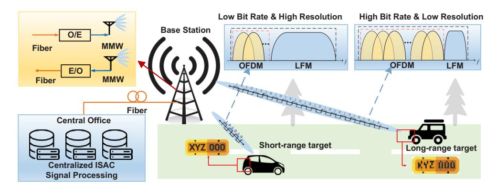

**Fig. 1.** Concept of adaptive photonics-based ISAC networks based on MMW over fiber. E/O: electrical-to-optical conversion, O/E: optical-to-electrical conversion.

As described above, the proposed adaptive ISAC waveform can be expressed as

$$x(t) = x_{com}(t) + x_{radar}(t)$$
 (1)

where *xcom(t)* represents an OFDM signal for communication, *xradar(t)* represents an LFM signal for radar sensing, and *xcom(t)* can be formulated as

$$x_{com}(t) = \sum_{n=0}^{N-1} a_n \exp[j2\pi(f_n + f_{IF})t]$$
 (2)

where *N* is the number of OFDM signal subcarriers, and *an* is a complex number representing the information modulated on each subcarrier. We employed 16-quadrature amplitude modulation (16-QAM) here. *fn*∈{*f*0*, . . . , fN*−1}, *fn* = *nfv*, *fv* is the frequency interval of the subcarrier, and *fIF* is the IF band where we move the baseband signal at. The peak value of each subcarrier frequency of OFDM corresponds to the position of the zero point of the other subcarriers, which indicates that within the duration of one symbol, the subcarriers of each channel are orthogonal.

LFM signal *xradar(t)* can be formulated as

$$x_{radar}(t) = rect\left(\frac{t}{T_{LFM}}\right) \exp[j2\pi(f_{IF} + B_{com} + f_{GAP})t + j\pi kt^2]$$
 (3)

where *TLFM* is the duration of one chirp; *fGAP* is the guard interval frequency to prevent mutual interference between the two signals; *Bcom* is the bandwidth of the OFDM signal, which can be expressed as *Bcom* =*Nfv*; *k* is the slope of the chirp signal, and *rect(.)* is the unit rectangular window function. The expression shows that the instantaneous frequency of the chirp signal varies linearly with time.

The total bandwidth of the integrated waveform can be written as

$$B_s = B_{com} + B_{radar} \tag{4}$$

The total bandwidth of the OFDM signal can be controlled according to the number of effective subcarriers. The bandwidth of an LFM signal can be expressed as *Bradar* = *kTLFM*. We can maintain *TLFM* unchanged, and control the LFM signal bandwidth by changing slope *k*. By controlling *Bcom* and *Bradar*, we can see a trade-off between communication and radar sensing.

As shown in Fig. [2,](#page-4-0) the W-band MMW adaptive signal is captured and down-converted to the IF band at the user end (UE), and the sensing signal is eliminated. Finally, for communication, the maximum achievable data information rate (DIR) can be expressed as

$$DIR = B_{com} \log_2(1 + SNR) \tag{5}$$

As for the sensing part, the echo from users or other targets is captured and down-converted to the IF band in the same way as in the BS, as shown in Fig. [2.](#page-4-0) The IF signal, which contains the range information of the targets, modulates a reference light using MZM-2. Thus, in MZM-2, the LFM signal is de-chirped, and we can obtain the frequency difference between the echo and reference signals, which is related to the target distance. The signal containing the frequency difference obtained from the BS is then sent to the central office through an optical fiber, where the optical signal is converted into an electrical signal through the PD. The relationship between the frequency and target distance can be described as

$$\Delta f = k\Delta t = k \frac{2\Delta R}{c} = \frac{B_{radar}}{T_{LFM}} \frac{2\Delta R}{c}$$
 (6)

$$\Delta R = \frac{cT_{LFM}\Delta f}{2B_{radar}} \tag{7}$$

where *c* is the velocity of light, ∆*f* is the frequency difference, ∆*t* is the time delay caused by the reflection of the targets, and ∆*R* is the target distance. In particular, we can perform a simple fast Fourier transform (FFT) to obtain the distance to the target. Two other key metrics for radar sensing are range resolution and maximum detection distance. The range resolution represents the smallest distance between objects that can be distinguished in a single measurement and can be expressed as

$$\delta_r = \frac{c}{2B_{radar}} \tag{8}$$

In our system, the maximum detection distance of radar sensing is limited by the *fIF* in addition to the maximum unambiguous distance and signal-to-noise ratio (SNR). According to Eq. (6), the detection distance corresponding to the *fIF* is *RIF* = *cTLFMfIF/2Bradar*. The maximum unambiguous distance is determined by the *TLFM* of the LFM signal and can be expressed as

$$R_{non-blur} = \frac{cT_{LFM}}{2} \tag{9}$$

When this distance is exceeded, the echo signal will be de-chirped by the reference chirp at the current moment as well as by the adjacent chirp, which confuses the detection of the target distance.

## Optics EXPRESS

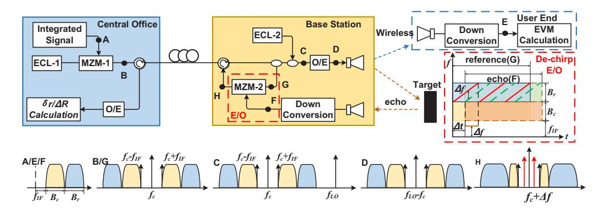

**Fig. 2.** Principle of the W-band photonics-based flexible ISAC system.

According to the radar equation, the corresponding relationship between SNR and detection distance is

$$R_{SNR} = \left[ \frac{P_t G_t G_r \sigma \lambda^2}{(4\pi)^3 S_{tmin}} \right]^{1/4} \tag{10}$$

where  $P_t$  is the transmit power,  $G_t$  and  $G_r$  are the gains of the transmit and receive antennas, respectively,  $\sigma$  is the radar cross section,  $\lambda$  is the signal wavelength, and  $S_{imin}$  is the minimum signal detectable by the receiver, which is related to the SNR.

The maximum detection distance should be the minimum of  $R_{IF}$ ,  $R_{non-blur}$  and  $R_{SNR}$ .

$$R_{\text{max}} = [R_{IF}, R_{non-blur}, R_{SNR}]_{\text{min}}$$

$$\tag{11}$$

In Fig. 3, we can observe that if the target is extremely far,  $\Delta f$ , which can be determined from Eq. (6), is similar to that of the IF signal and even exceeds  $f_{IF}$ . As long as the detected target does not exceed the maximum detection distance, it will not fall in the bandwidth of shared RF spectrum band. When  $T_{LFM}$  and  $f_{IF}$  of the signal are determined, slope k increases as  $B_{radar}$  increases, resulting in  $\Delta f$  increases, as shown in Fig. 3(a). Thus, the actual achievable maximum detection distance decreased. However, if we decrease  $B_{radar}$ ,  $\Delta f$  will also decrease for the same distance target, as shown in Fig. 3(b), and the maximum detection distance will become larger.

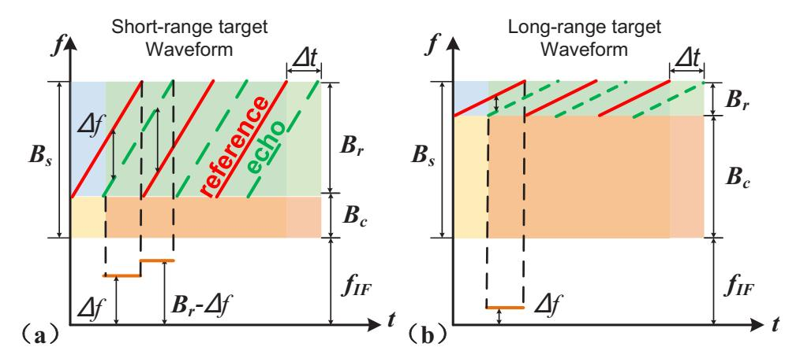

**Fig. 3.** Principle of the adaptive waveform. (a) Waveform for short-range target; (b) waveform for long-range target.

According to Eqs. (5), (7), (8), (9), and Fig. [3,](#page-4-1) for long-distance targets, we can reduce *Bradar* and increase *Bcom*, resulting in high-speed communication but relatively low-resolution sensing in which the detection distance is sufficiently large. For short-range targets, a greater bandwidth can be allocated for radar sensing, enabling higher-resolution detection or imaging.

Therefore, by designing communication to sense the bandwidth ratio of the integrated signal, we can realize the trade-off and adjustment of communication and sensing performance according to different application requirements. The centralized fiber-distributed structure allows the BS to reduce the amount of equipment while making the signal processing more flexible.

### **3. Experimental section**

As a proof-of-concept, we set up an experiment of a photonics-based flexible ISAC system with adaptive waveforms for a fiber-wireless integrated network, as shown in Fig. [4.](#page-6-0) On the transmitting side, the data sequence was first generated and mapped according to the regular 16-QAM. Subsequently, after an inverse fast Fourier transform with a size of 128 and cyclic prefix (CP) insertion with a length of 8 which was used to resist inter-symbol interference and inter-carrier interference, we obtained a baseband OFDM signal. The signal was moved to an IF band (*fIF* = *2.5 GHz)* after up-sampling. Meanwhile, an LFM signal was generated and converted to another IF band, which was determined by the bandwidth ratio between OFDM and LFM. The duration of the LFM signal *TLFM* was 66.13 ns. To prevent the LFM signal from interfering with OFDM, the LFM signal was filtered. After 16-QAM OFDM and LFM signals with different bandwidth ratios were generated, they were normalized in the time domain and combined using FDM. The power ratio between was 1:1 in this work. It is worth noting that the power ratio between the OFDM and LFM signals will impact the sensing and communication performances. In general, when the total power remains unchanged, improving the power of the LFM signal will improve sensing performance and communication performance will decrease, and vice versa. Therefore, by adjusting the signal power ratio between two signals, a further trade-off of sensing and communication can be achieved. The complete DSP is shown in Fig. [4.](#page-6-0) After these steps, the signal was sent to an arbitrary waveform generator (AWG) with a sampling rate of 60 GSa/s to generate a signal with a total bandwidth of 12 GHz. Subsequently, the integrated signal was amplified using an electrical amplifier (EA) to drive MZM-1. The ECL-1 working at 193.1 THz with a linewidth of 100 kHz was applied as the light source. The output of the light source was 13 dBm, and the light was modulated by MZM-1, which operated at the quadrature bias point.

After passing through the optical circulator and a 10 km optical fiber, the light from the ECL-1 entered a polarization-maintaining erbium-doped fiber amplifier (PM-EDFA) to compensate for the loss. A variable optical attenuator (VOA) was used to adjust the optical power. After passing through the polarization controller (PC), the optical signal successively passed through two cascaded 3-dB polarization-maintaining optical couplers (PM-OCs). After the first OC, one part of the optical signal was modulated by MZM-2, which operated at the quadrature bias point, as a reference signal. The other part passed the second OC combined with the optical signal from the tunable ECL-2, which served as the local oscillator (LO) for photonics MMW generation. The output of the LO light was 6 dBm. The optical signal was sent to a 100 GHz high-speed PD to generate a W-band signal, which was amplified by a power amplifier (PA) before being launched by a horn antenna (HA).

On the communication receiving side, the W-band MMW signal was captured by an HA after 1 m of wireless transmission. Due to the limited antenna gain and power amplifier gain, only 1-m wireless transmission is applied in current proof-of-concept experiment. With high-gain components, communication or sensing over a longer wireless distance can be achieved. The signal was amplified by a low-noise amplifier (LNA) and down-converted to the IF band using an envelope detector (ED). Finally, the IF signal was amplified by an EA and captured by an oscilloscope (OSC) at a sampling rate of 80 GSa/s. The communication DSP blocks are shown

### Optics EXPRESS

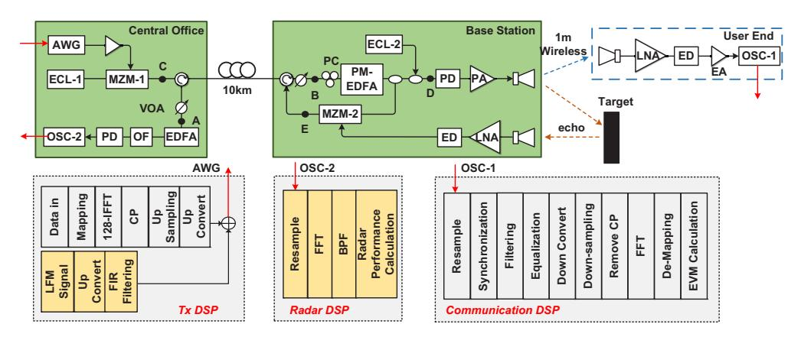

**Fig. 4.** Schematic of the experiment setup and DSP. AWG: arbitrary waveform generator, ECL: external cavity laser, EA: electrical amplifier, MZM: Mach-Zehnder modulator, VOA: variable optical attenuator, PM-EDFA: polarization-maintaining erbium-doped fiber amplifier, PC: polarization controller, OC: optical coupler, PA: power amplifier, PD: photodiode, HA: horn antenna, LNA: low noise amplifier, ED: envelope detector, OF: optical filter OSC: oscilloscope.

in Fig. 4. The signal should be resampled and synchronized first, and then filtered by a digital low-pass filter to eliminate the LFM signal. To improve communication performance, least mean square equalization was performed. After down-converting, down-sampling, and CP removal, an FFT was used to demodulate the signal, and then calculated the error vector magnitude (EVM) to evaluate the communication performance.

On the radar sensing receiving side, the echo from the reflection of a corner reflector was captured by an HA and amplified by an LNA. After being down-converted by an ED, the electrical signal was amplified by an EA to drive MZM-2. The use of ED makes it unnecessary of an additional LO signal for MMW reception, reducing the amount of equipment and complexity in the base station. In MZM-2, the reference optical signal from the OC was modulated by the IF band signal. The de-chirping process was accomplished using MZM-2, as shown in Fig. 2. After passing through the optical circulator and a 10 km optical fiber, the modulated optical signal returned to the central office, in which the signal successively passed through the VOA, EDFA, an optical filter (OF), and entered into a PD. Subsequently, the electrical signal was captured using the OSC. The radar DSP blocks are shown in Fig. 4. After the FFT operation, we obtained clear peaks that were related to the targets in the frequency spectrum. Ultimately, we could obtain the measured distances and resolutions by analyzing the peaks according to Eqs. (7) and (8), respectively.

To verify our idea of adaptive waveforms, we designed signals with six different communication-to-sensing bandwidth ratios as shown in Fig. 5. In the figure, the six different waveforms include: the full-band OFDM signal, as shown in Fig. 5(d), communication bandwidth accounts for 0.8 to 0.2, as shown in Figs. 5(e) to (h), and full-band LFM signal, as shown in Fig. 5(i). For a long-distance target, we can choose a waveform with a larger C-T ratio to ensure that  $\Delta f$  does not fall in the bandwidth of shared RF spectrum band while achieving high-speed communication. For a short-distance target, we can choose a waveform with a smaller C-T ratio to achieve high resolution radar sensing. And for a certain wireless distance, the optimal C-T ratio should be to maximize the communication rate when the radar sensing can work normally and the resolution meet the requirements.

To avoid mutual interference between the OFDM and LFM signals, in addition to filtering the LFM, we designed a guard band between the OFDM and LFM signals. The frequency interval

was equal to the bandwidth corresponding to the six OFDM subcarriers. In addition, to improve the performance of the OFDM signal, we vacated two subcarriers at the low-frequency and zero-frequency OFDM. In our experiments, we considered different waveforms at the transmitting side and analyzed the performance of communication and sensing to verify the feasibility of our concept.

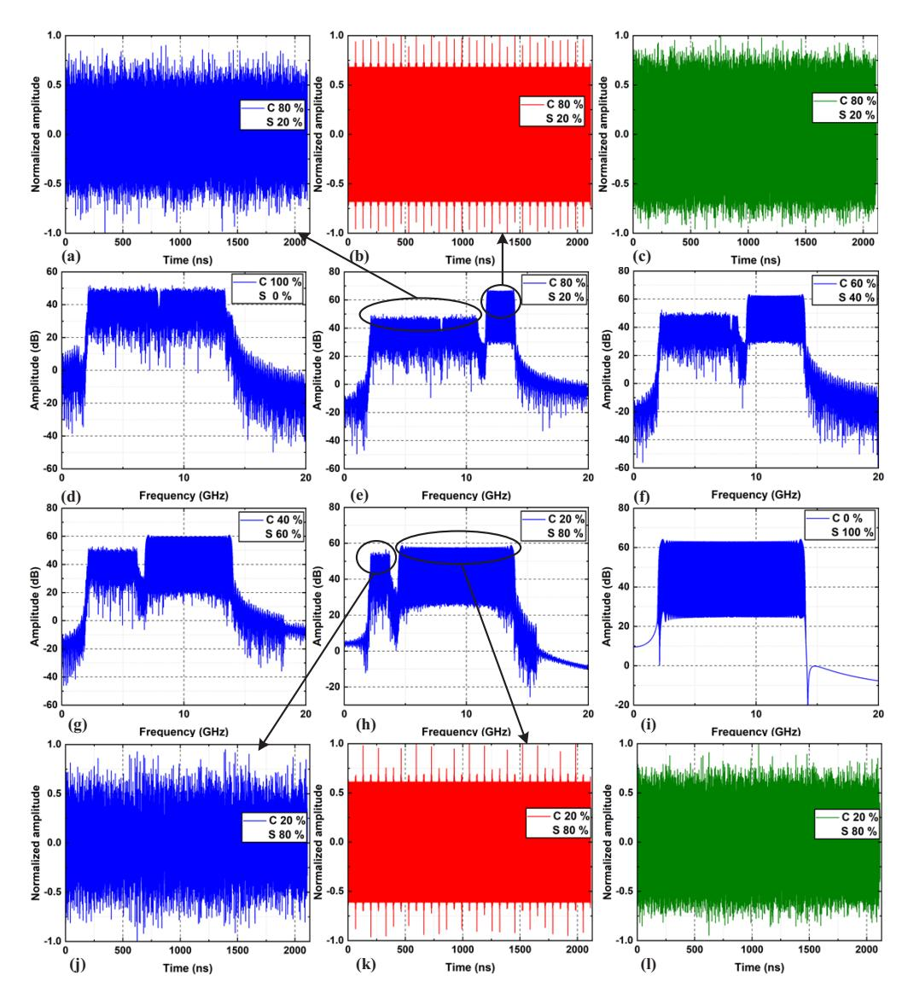

**Fig. 5.** Electrical spectrum and time-domain waveform of the adaptive signals (a) OFDM time-domain waveform of 0.8 communication to total (C-T) bandwidth ratio (b) LFM time-domain waveform of 0.8 C-T bandwidth ratio (c) time-domain waveform of 0.8 C-T bandwidth ratio (d) full-band OFDM spectrum (e) spectrum when the C-T bandwidth ratio is 0.8 (f) spectrum when the C-T bandwidth ratio is 0.6 (g) spectrum when the C-T bandwidth ratio is 0.4 (h) spectrum when the C-T bandwidth ratio is 0.2 (i) full-band LFM spectrum (j) OFDM time-domain waveform of 0.2 C-T bandwidth ratio (k) LFM time-domain waveform of 0.2 C-T bandwidth ratio (l) time-domain waveform of 0.2 C-T bandwidth ratio.

# **4. Result**

In Fig. [6,](#page-8-1) we can observe the optical spectra at different points in the setup shown in Fig. [4.](#page-6-0) Figure [6\(](#page-8-1)a) shows the spectrum of the light emitted by ECL-1 after modulation by MZM-1. It can be observed from the figure a double-sideband (DSB) modulation. The optical spectrum obtained after the second OC is shown in Fig. [6\(](#page-8-1)b). The light emitted by ECL-2 was coupled with the modulated signal light, whose frequencies were *fLO* and *fc*. The offset between ECL-1 and ECL-2 is *fLO- fc*, that is, the carrier frequency of the W-band MMW signal was *fLO- fc*. As shown in Fig. [6\(](#page-8-1)c), the optical signal modulated by MZM-2 was also a DSB signal, which included the difference frequency after de-chirping. The results shown in Fig. [6](#page-8-1) are consistent with those in Fig. [2.](#page-4-0)

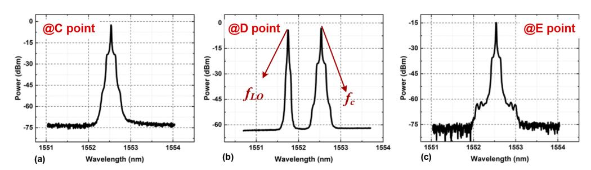

**Fig. 6.** Optical spectra (a) the optical spectrum at point C (b) the optical spectrum at point D (c) the optical spectrum at point E.

# *4.1. Back-to-back experimental result*

### 4.1.1. Carrier frequency

In the back-to-back experiments, we removed a 10 km optical fiber to simulate the direct connection between the central units and BS. First, to determine the optimal carrier frequency in our system over the entire working frequency band, we changed the carrier frequency of the MMW signals by adjusting the wavelength of the tunable ECL-2, and then analyzed the performance of communication and radar sensing. In this experiment, we first conducted a communication experiment in the line-of-sight direction, and the wireless transmission distance was 1 m. In this communication experiment, we chose a full-band OFDM signal as our waveform, which is shown in Fig. [5\(](#page-7-0)d), and the Vpp of the signal was 200 mV. Figure [7\(](#page-9-0)a) shows the measured bit error rate (BER) and EVM performance versus the carrier frequency. As shown in Fig. [7\(](#page-9-0)a), the BER and EVM increase, and then decrease as the carrier frequency increases. When the carrier frequency is 96.5 GHz, the BER and EVM are the smallest, indicating that the system communication performance is optimal.

Thereafter, we used a controllable rotatable platform to align the two HAs in the BS with a corner reflector to conduct the radar sensing experiment. The distance between the corner reflector and transceiver antennas was 1.2 m, and the waveform we chose was a full-band LFM signal, as shown in Fig. [3\(](#page-4-1)i). In the experiment, we characterized the range resolution by measuring the 3-dB width of the range profile of a single corner reflector. In addition to the resolution, we introduced the peak-to-maximum noise ratio (PMNR) to evaluate the SNR of the photoelectrically converted signal by PD. As shown in Fig. [7\(](#page-9-0)b), the definition of PMNR can be described as the ratio of the peak amplitude, which represents the target to the maximum noise that represents the clutter or system noise. We believe that when the PMNR is less than 6 dB, the peak related to the target cannot be distinguished from the clutter or system noise. As shown in Fig. [6\(](#page-8-1)c), we can observe that when the carrier frequency is 96.5 GHz, the PMNR has a maximum value, indicating that the SNR of the received signal is the best at this time, and the

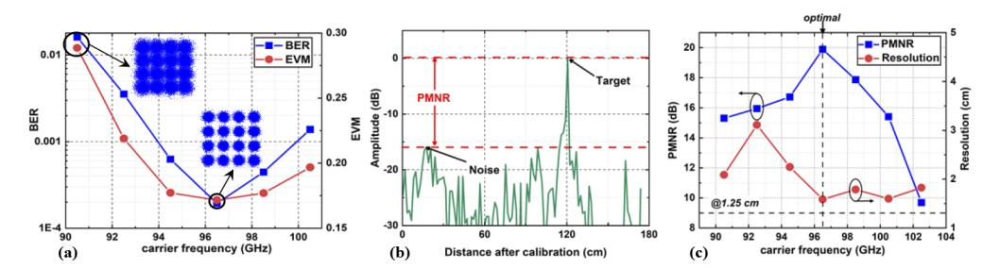

**Fig. 7.** (a) EVM and BER as a function of carrier frequency. (b) Schematic diagram of PMNR definition. (c) PMNR and resolution as a function of carrier frequency.

resolution is closest to the theoretical resolution of 1.25 cm with this carrier frequency. This proves that the optimal carrier frequency for radar sensing is 96.5 GHz, which is the same as that of the communication experiment.

### 4.1.2. Working Vpp

Subsequently, in our experiment, we measured the EVM for evaluating communication performance and analyzed the resolution and PMNR for evaluating radar sensing performance as a function of Vpp to determine the optimal working Vpps with different communication to total bandwidth ratios. The results are shown in Figs. [8\(](#page-9-1)a)–(c).

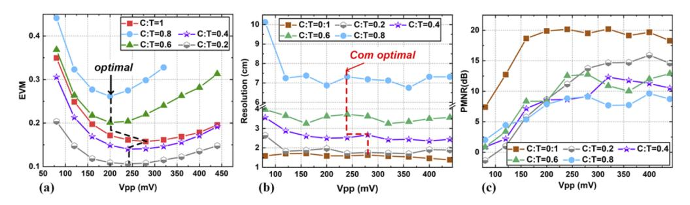

**Fig. 8.** (a) EVM versus Vpp with different communication to total (C:T) bandwidth ratios (b) resolution versus Vpp with different C:T bandwidth ratios (c) PMNR versus Vpp with different C:T bandwidth ratios.

In Fig. [8\(](#page-9-1)a), we can observe that with different bandwidth ratios, the EVM changes in a V-shape with an increase in Vpp, indicating that with an increase in Vpp, the performance of communication is improved first, and then decreases after reaching the optimum value. This is because, within a certain value, with a higher Vpp, it can provide a system with a higher SNR. After Vpp increases to the optimal value, continuing to increase Vpp causes the amplifiers to enter the saturation region, resulting in nonlinear distortion and degradation of communication performance.

Except for full-band OFDM, the presence of LFM affects the peak-to-average power ratio (PAPR) of the integrated signal. Owing to the randomness of the information, the PAPR of the OFDM signal is high; therefore, it is easier for the OFDM signal to enter the saturation region without sufficient amplification. However, an LFM signal is a constant-envelope signal. With the same Vpp, when the communication bandwidth is relatively low, the low PAPR of the LFM signal makes it impossible for the integrated signal to enter the saturation region, avoiding nonlinear distortion. Therefore, in Fig. [8\(](#page-9-1)a), except for full-band OFDM signal, the optimal Vpp is higher when the communication bandwidth is low.

For the sensing part, it can be observed from Fig. [8\(](#page-9-1)b) that with different bandwidth ratios, the measurement resolution fluctuates in a stable range with Vpp changes, except for a low Vpp. Figure [8\(](#page-9-1)c) shows the relationship between PMNR and Vpp with different bandwidth ratios. With a low Vpp, such as 80 or 120 mV, the PMNR was less than 6 dB. Therefore, the SNR is insufficient to distinguish the peak caused by the target and system noise. As Vpp increased, the amplitude of the peak also increased and eventually saturated. For radar sensing, it is expected that the LFM signal is fully amplified to ensure that a higher Vpp corresponds to a longer detection distance; however, to ensure that the communication performance does not deteriorate, the selection of Vpp should be considered collaboratively. In our system, the PMNR of all bandwidth ratios was greater than 6 dB with the optimal Vpp for communication. Specifically, Vpp with optimal communication can be selected for radar sensing.

# *4.2. Centralized and seamless fiber-wireless experimental result*

### 4.2.1. Received optical power

We performed a completely centralized and seamless fiber-wireless ISAC experiment using the setup shown in Fig. [4.](#page-6-0) First, we studied the effect of the received optical power (ROP) on system performance. For communication, we changed the optical power at point B by adjusting the VOA in the BS and simultaneously measured the EVM of the signal received at the UE. The results are shown in Fig. [9\(](#page-10-0)a). With the three typical bandwidth ratios (full-band OFDM, C-T bandwidth ratio 0.2 and C-T bandwidth ratio 0.8), the EVM increases with a decrease in the optical power. This is because, with the decrease in the optical power at point B, the SNR of the signal passing through the PD is insufficient, resulting in degradation of the communication performance.

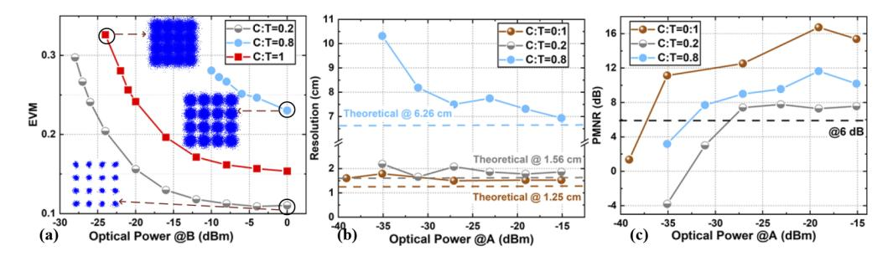

**Fig. 9.** (a) EVM versus optical power at point B (b) resolution versus optical power at point A (c) PMNR versus optical power at point A

For radar sensing, we changed the optical power at point A by adjusting the VOA in the central units and analyzed the resolution and PMNR. As shown in Fig. [9\(](#page-10-0)b), when changing the optical power at point A, the resolution fluctuates slightly within a certain value; however, when the optical power at point A is lower than a certain value, the resolution deteriorates rapidly. The same conclusion can be observed in Fig. [9\(](#page-10-0)c). Because the signal was de-chirped in MZM-2, when the optical power was reduced to a certain value, the PMNR did not change significantly. However, when the optical power was lower than a certain threshold, the PMNR deteriorated rapidly, and the target peak and background noise could not be distinguished in the spectrum. This was because the input optical power of the PD was lower than its sensitivity.

### 4.2.2. Flexible communication and sensing

Finally, we verified the feasibility of our flexible adjustment between communication and sensing in a centralized and seamless fiber-wireless experimental system. In Fig. [10\(](#page-11-0)a), we showed the results of the EVM versus different bandwidth ratios. Moreover, the BER was below the threshold of 3.8E-3 under all conditions of different bandwidth ratios. Therefore, when the C-T bandwidth

ratio is changed from 0.2 to 0.8, the data rate can be flexibly adjusted within the range of 5.98 to 32.34 Gbit/s, and even in the case of a full-band OFDM, the data rate can reach 41.48 Gbit/s.

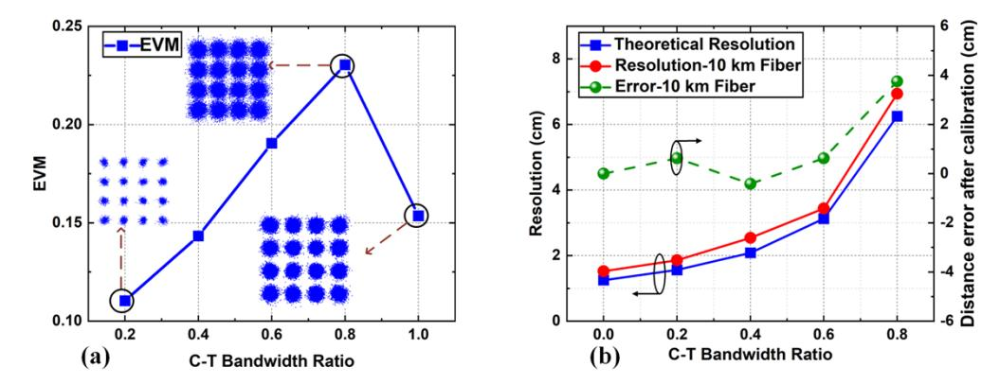

**Fig. 10.** (a) EVM versus C:T bandwidth ratio under the optimal Vpp (b) resolution and distance error after calibration versus bandwidth ratios under the optimal Vpp for communication.

Figure [10\(](#page-11-0)b) is shown the comparison of measured resolution and theoretical resolution with different bandwidth ratios. As observed in Fig. [10\(](#page-11-0)b), the measurement resolution is slightly higher than the theoretical value. When the C-T bandwidth ratio is changed from 0.2 to 0.8, the resolution can reach 1.86 to 6.94 cm. If the full-band LFM signal is used, the highest resolution can be 1.53 cm.

In the previous experiments on sensing, we did not provide the results of the distance error because, in our system, the estimated target distance does not change with the carrier frequency or Vpp. However, note that in our system, the transmitted optical signal must pass through the optical fiber and other optical devices after passing through the first OC, which introduces an additional delay in the system. Owing to this delay, the measured distance is larger than the actual distance, thereby introducing additional distance errors. However, the time delay error can be eliminated by external calibration, because the optical path in the BS does not change.

In the experiment, we arranged a corner reflector at a distance of 1.2 m and used the full-band LFM signal at the transmitting side. The measured distance can be obtained using Eq. (9). Thereafter, we subtracted the actual distance from the obtained distance, and the distance error introduced by the delay error was obtained as 32.5 cm. In the subsequent sensing experiments, we used this fixed distance error obtained from external calibration to calibrate the detected target distance.

The results for the distance errors after calibration with different bandwidth ratios are shown in Fig. [10\(](#page-11-0)b). From the results, we can observe that when the *Bradar* is relatively high, the distance error after calibration is small (less than 1 cm when the C-T bandwidth ratio is equal to 0.2), whereas when the *Bradar* is relatively low, the distance error after calibration is relatively high (less than 4 cm when the C-T bandwidth ratio is equal to 0.8).

In Fig. [11,](#page-12-0) we can observe additional radar sensing results. In the experiment, we placed the corner reflector at distances of 58, 65, 100, 120 and 150 cm. The C-T bandwidth ratio of the integrated waveform was 0.2. The spectral peaks related to the distances are shown in Fig. [11\(](#page-12-0)a), along with the measured distances. The measured resolution and distance errors after calibration at various locations are shown in Fig. [11\(](#page-12-0)b), in which we can observe that the resolution is close to the theoretical value at all positions and the distance error after calibration is less than 1 cm.

To further identify the range resolution performance, we arranged two corner reflectors with a close distance, and the range profiles are shown in Fig. [12.](#page-12-1) First, the line-of-sight distance

### Optics EXPRESS

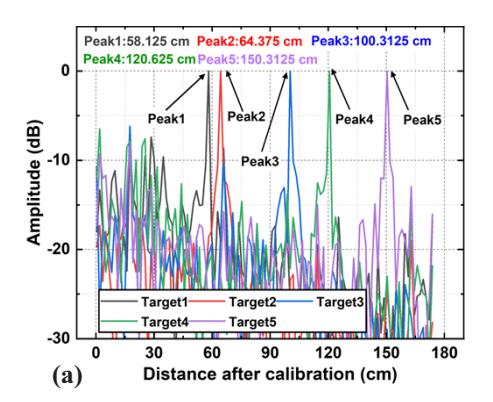

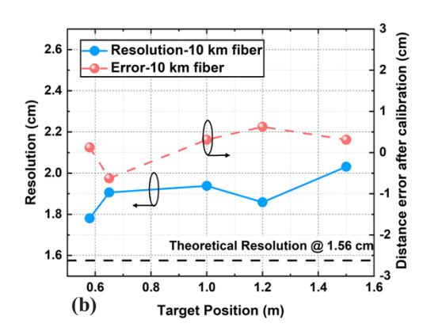

**Fig. 11.** (a) Spectra of the different de-chirped echos in which the target distance is 58, 65, 100, 120, and 150 cm, respectively (C-T bandwidth ratio 0.2). (b) Distance error after calibration and measured resolution of the target at different distances.

between the two corner reflectors was 8 cm. At this time, we used a waveform with a C-T ratio of 0.8 for detection. The range profile is shown in Fig. 12(a). According to Eq. (8), the theoretical

was  $19.5368\,\mathrm{MHz}$ . According to Eq. (7), it can be concluded that the distance between the two targets was  $8.08\,\mathrm{cm}$ . Next, we set the distance between the line-of-sight directions of the two corner reflectors to be  $2\,\mathrm{cm}$ . At this time, we used a waveform with a C-T ratio of 0 for detection. According to Eq. (8), the theoretical resolution was  $1.25\,\mathrm{cm}$ , and the measured frequency interval between the two peaks was  $18.9015\,\mathrm{MHz}$  as shown in Fig. 12(b). According to Eq. (7), it can be concluded that the distance between the two peaks was  $1.56\,\mathrm{cm}$ . The above results show that the measured resolution of the system is close to the theoretical value.

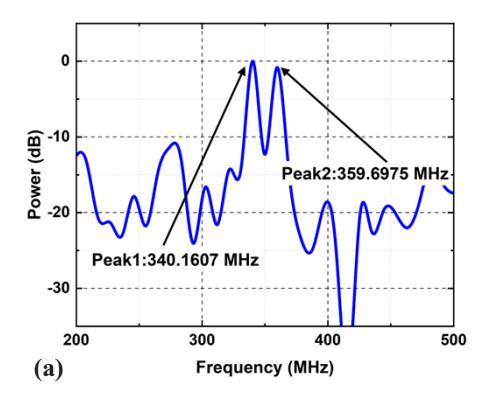

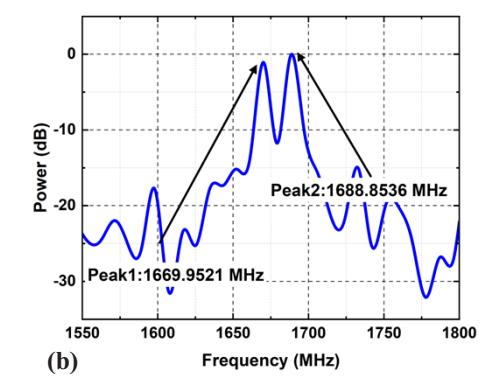

**Fig. 12.** Range profile of two targets. (a) The distance between two targets was 8 cm, and a waveform with a C-T ratio of 0.8 was used; (b) the distance between two targets was 2 cm, and a waveform with a C-T ratio of 0 was used.

In addition to the results in Fig. 12, we showed more single-target detection results in this work. We found that the self-mixing between MMW LFM echoes from different targets will occur due to the square-law detection in ED. And this will cause the false target problem. One possible solution is to add a high pass filter after the envelope detection. The frequency generated by the self-mixing between echoes from multiple targets within detection distance will not exceed the  $f_{IF}$ . Therefore, after the envelope detection, the high-pass filter is used to filter out the signal

below the *fIF*, so as to avoid the interference between multiple targets. This will be studied in our future work with multi-target sensing and imaging.

# **5. Conclusion**

In this study, we developed and experimentally demonstrated a W-band photonics-based flexible ISAC system with adaptive waveforms for a fiber-wireless integrated network. With the assistance of photonics, high-bandwidth and high-frequency signals are generated, resulting in higher communication rates and resolutions. The feasibility of the centralized and seamless fiber-wireless ISAC architecture was verified by experimental results. In the experiments, we investigated the effects of Vpp and ROP on the sensing performance for the first time. By designing multiple sets of transmitting signals, we successfully achieved trade-offs and flexible adjustments between the communication and sensing performance. In the experiment, the communication rate can be adjusted from 5.98 to 41.48 Gbit/s, and the resolution for sensing can be adjusted from 1.53 to 6.94 cm when the distance error after calibration is less than 4 cm. Five different distances were successfully detected, and the distance errors after calibration were less than 1 cm.

**Funding.** National Key Research and Development Program of China (2022YFB2903600); Major Key Project PCL; Natural Science Foundation of Shanghai (21ZR1408700); National Natural Science Foundation of China (61925104, 62031011, 62171137, 62235005).

**Acknowledgment.** This work is partially supported by National Key Research and Development Program of China (2022YFB2903600), National Natural Science Foundation of China (62235005, 62171137, 61925104, 62031011), Natural Science Foundation of Shanghai (21ZR1408700), and the Major Key Project PCL.

**Disclosures.** The authors declare no conflicts of interest.

**Data availability.** The data underlying the results presented in this paper are not publicly available at this time; but may be obtained from the authors upon reasonable request.

### **References**

- 1. D. K. Pin Tan, J. He, Y. Li, A. Bayesteh, Y. Chen, P. Zhu, and W. Tong, "Integrated Sensing and Communication in 6G: Motivations, Use Cases, Requirements, Challenges and Future Directions," in *1st International Online Symposium on Joint Communications & Sensing (JC&S)* (IEEE, 2021), pp. 1–6.
- 2. W. Saad, M. Bennis, and M. Chen, "A Vision of 6 G Wireless Systems: Applications, Trends, Technologies, and Open Research Problems," [IEEE Network](https://doi.org/10.1109/MNET.001.1900287) **34**(3), 134–142 (2020).
- 3. Y. Cui, F. Liu, X. Jing, and J. Mu, "Integrating Sensing and Communications for Ubiquitous IoT: Applications, Trends, and Challenges," [IEEE Network](https://doi.org/10.1109/MNET.010.2100152) **35**(5), 158–167 (2021).
- 4. N. Al-Falahy and O. Y. K. Alani, "Millimetre wave frequency band as a candidate spectrum for 5 G network architecture: A survey," [Phys. Commun.](https://doi.org/10.1016/j.phycom.2018.11.003) **32**, 120–144 (2019).
- 5. O. Li, J. He, K. Zeng, Z. Yu, X. Du, Y. Liang, G. Wang, Y. Chen, P. Zhu, W. Tong, D. Lister, and L. Ibbotson, "Integrated Sensing and Communication in 6 G A Prototype of High Resolution THz Sensing on Portable Device," in *Joint European Conference on Networks and Communications & 6 G Summit (EuCNC/6 G Summit)* (IEEE, 2021), pp. 544–549.
- 6. S. Pan and Y. Zhang, "Microwave Photonic Radars," [J. Lightwave Technol.](https://doi.org/10.1109/JLT.2020.2993166) **38**(19), 5450–5484 (2020).
- 7. E. A. Kittlaus, D. Eliyahu, S. Ganji, S. Williams, A. B. Matsko, K. B. Cooper, and S. Forouhar, "A low-noise photonic heterodyne synthesizer and its application to millimeter-wave radar," [Nat. Commun.](https://doi.org/10.1038/s41467-021-24637-0) **12**(1), 4397 (2021).
- 8. S. Jia, X. Yu, S. Wang, K. Liu, X. Pang, H. Zhang, X. Jin, S. Zheng, H. Chi, and X. Zhang, "A Unified System With Integrated Generation of High-Speed Communication and High-Resolution Sensing Signals Based on THz Photonics," [J. Lightwave Technol.](https://doi.org/10.1109/JLT.2018.2863684) **36**(19), 4549–4556 (2018).
- 9. K. Wang, L. Zhao, and J. Yu, "200 Gbit/s Photonics-Aided MMW PS-OFDM Signals Transmission at W-Band Enabled by Hybrid Time-Frequency Domain Equalization," [J. Lightwave Technol.](https://doi.org/10.1109/JLT.2021.3062387) **39**(10), 3137–3144 (2021).
- 10. L. Yu, J. Wu, A. Zhou, E. G. Larsson, and P. Fan, "Massively Distributed Antenna Systems With Nonideal Optical Fiber Fronthauls: A Promising Technology for 6 G Wireless Communication Systems," [IEEE Veh. Technol. Mag.](https://doi.org/10.1109/MVT.2020.3018100) **15**(4), 43–51 (2020).
- 11. J.-W. Lin, C.-L. Lu, H.-P. Chuang, F.-M. Kuo, J.-W. Shi, C.-B. Huang, and C.-L. Pan, "Photonic Generation and Detection of W-Band Chirped Millimeter-Wave Pulses for Radar," [IEEE Photonics Technol. Lett.](https://doi.org/10.1109/LPT.2012.2205914) **24**(16), 1437–1439 (2012).
- 12. F. Zhang, Q. Guo, Z. Wang, P. Zhou, G. Zhang, J. Sun, and S. Pan, "Photonics-based broadband radar for high-resolution and real-time inverse synthetic aperture imaging," [Opt. Express](https://doi.org/10.1364/OE.25.016274) **25**(14), 16274 (2017).

- 13. W. Bai, X. Zou, P. Li, W. Pan, L. Yan, and B. Luo, "60-GHz photonic millimeter-wave joint radar-communication system," in *International Conference on Microwave and Millimeter Wave Technology (ICMMT)* (IEEE, 2021), pp. 1–3.
- 14. W. Bai, X. Zou, P. Li, J. Ye, Y. Yang, L. Yan, W. Pan, and L. Yan, "Photonic Millimeter-Wave Joint Radar Communication System Using Spectrum-Spreading Phase-Coding," [IEEE Trans. Microwave Theory Techn.](https://doi.org/10.1109/TMTT.2021.3138069) **70**(3), 1552–1561 (2022).
- 15. M. Lei, A. Li, Y. Cai, J. Zhang, B. Hua, Y. Zou, W. Xu, J. Wang, J. Yu, and M. Zhu, "Integrated Wireless Communication and mmW Radar Sensing System for Intelligent Vehicle Driving Enabled by Photonics," in *19th International Conference on Optical Communications and Networks (ICOCN)* (IEEE, 2021), pp. 1–3.
- 16. X. Li, S. Zhao, G. Wang, and Y. Zhou, "Photonic Generation and Application of a Bandwidth Multiplied Linearly Chirped Signal With Phase Modulation Capability," [IEEE Access](https://doi.org/10.1109/ACCESS.2021.3081566) **9**, 82618–82629 (2021).
- 17. H. Nie, F. Zhang, Y. Yang, and S. Pan, "Photonics-based integrated communication and radar system," in *International Topical Meeting on Microwave Photonics (MWP)* (2019), pp. 1–4.
- 18. Y. Wang, J. Liu, J. Ding, M. Wang, F. Zhao, and J. Yu, "Joint communication and radar sensing functions system based on photonics at the W-band," [Opt. Express](https://doi.org/10.1364/OE.449153) **30**(8), 13404 (2022).
- 19. Y. Wang, F. Zhao, K. Wang, J. Zhang, M. Lei, M. Zhu, C. Liu, L. Zhao, J. Ding, W. Zhou, and J. Yu, "Integrated Terahertz High-Speed Data Communication and High-Resolution Radar Sensing System Based-on Photonics," in *European Conference on Optical Communication (ECOC)* (IEEE, 2021), pp. 1–4.
- 20. R. Song and J. He, "OFDM-NOMA combined with LFM signal for W-band communication and radar detection simultaneously," [Opt. Lett.](https://doi.org/10.1364/OL.460188) **47**(11), 2931 (2022).
- 21. Y. Wang, Z. Dong, J. Ding, W. Li, M. Wang, F. Zhao, and J. Yu, "Photonics-assisted joint high-speed communication and high-resolution radar detection system," [Opt. Lett.](https://doi.org/10.1364/OL.444252) **46**(24), 6103 (2021).