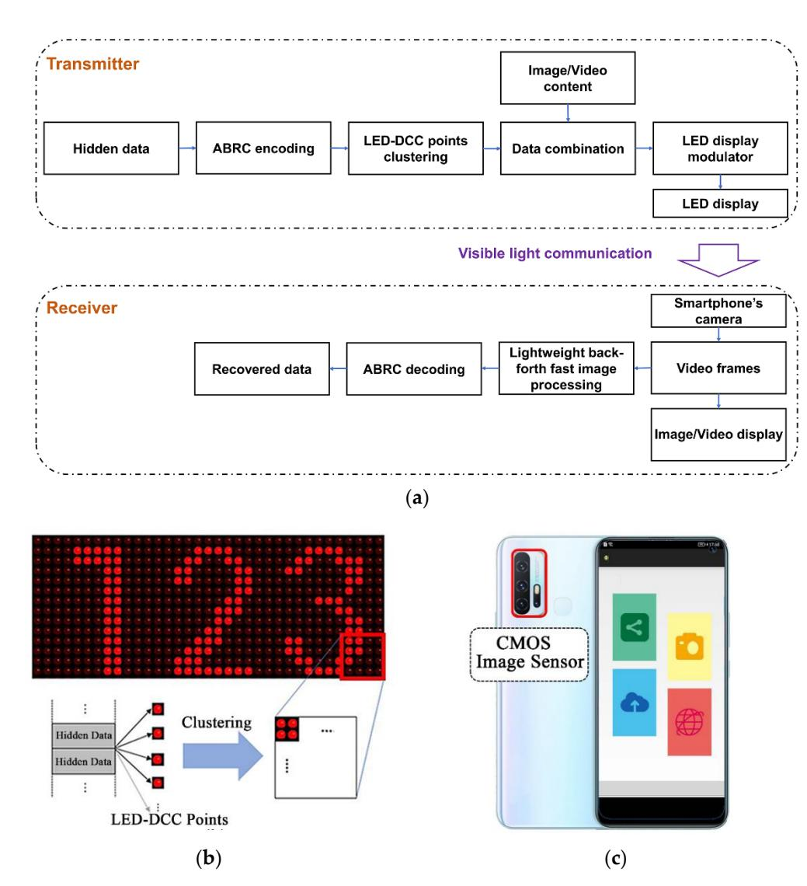
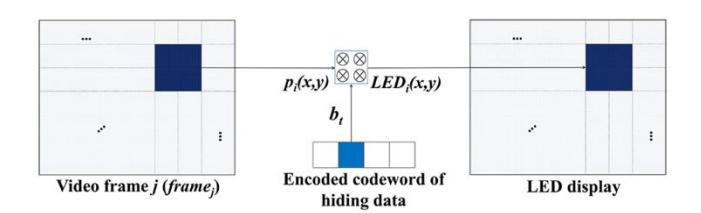
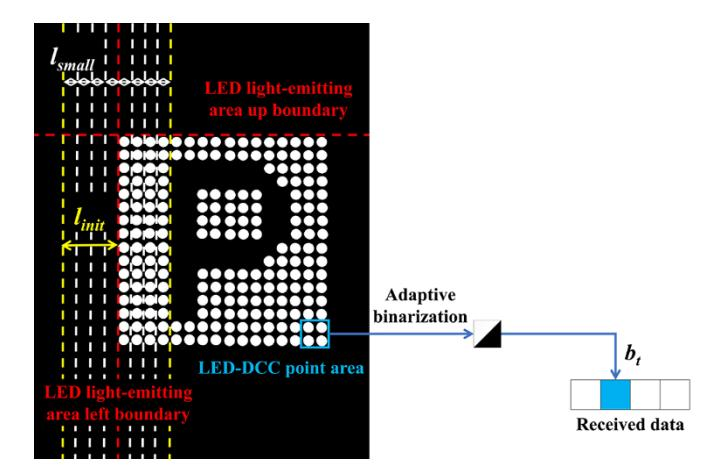
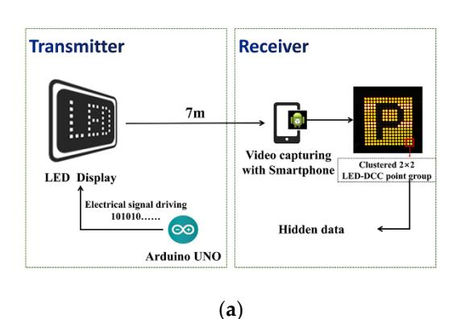
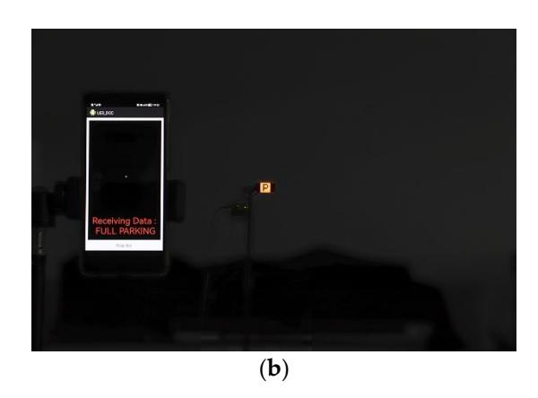
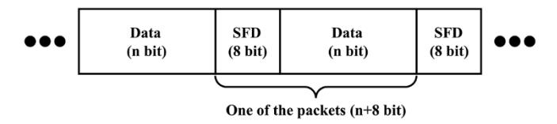
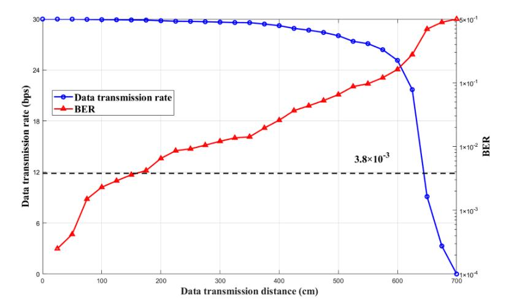
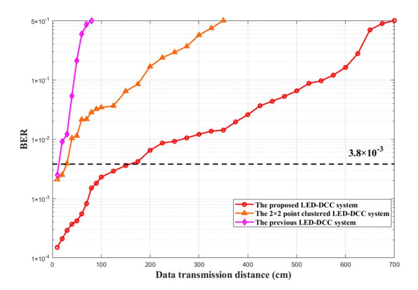

*Article*

# **Long-Distance, Real-Time LED Display-Camera Communication System Based on LED Point Clustering and Lightweight Image Processing**

**Jingwen Li 1,2,3,4,†, Chuhan Pan 1,2,3,4,†, Junxing Pan 1,2,3,4,†, Jiajun Lin 1,2,3,4, Mingli Lu 5 , Zoe Lin Jiang [6](https://orcid.org/0000-0002-8944-7444) and Junbin Fang 1,2,3,4,\***

- 1 Guangdong Provincial Key Laboratory of Optical Fiber Sensing and Communications, Guangzhou 510632, China
- 2 Guangdong Provincial Engineering Technology Research Center on Visible Light Communication, Guangzhou 510632, China
- 3 Guangzhou Municipal Key Laboratory of Engineering Technology on Visible Light Communication, Guangzhou 510632, China
- 4 Department of Optoelectronic Engineering, Jinan University, Guangzhou 510632, China
- 5 Academic Affairs Office of Beijing Vocational College of Agriculture, Beijing 102442, China
- 6 School of Computer Science and Technology, Harbin Institute of Technology, Shenzhen 518055, China
- **\*** Correspondence: tjunbinfang@jnu.edu.cn
- † These authors contributed equally to this work.

**Abstract:** LED displays can be used to realize the dual functions of display and communication simultaneously. However, existing LED display-based visible light communication (VLC) systems suffer due to their short transmission distance and are not practical. A long-distance, real-time display-camera communication (DCC) system is proposed in this paper. First, a LED-DCC point clustering scheme is proposed to increase the transmission distance by clustering multiple adjacent LED display points for improving the quality of the VLC signal captured by an image sensor. Then, a lightweight, back-forth, fast image processing algorithm is proposed to reduce the introduced additional computational complexity caused by point clustering and enhance the reliability of information extraction from the real-time captured images/video frames. The experimental system was implemented with a 2.2-inch 16 × 16 point LED display and the CMOS camera on the smartphone. Experimental results show that the proposed system can achieve a maximum data transmission distance of 7 m under a bit error rate (BER) of 0.5, which is about 9 times that of the previous LED-DCC system, and can achieve a data transmission distance of 175 cm under the 7% forward error correction (FEC) limit, which is about 12 times that of the previous LED-DCC system. Additionally, the decoding latency for extracting information from each video frame is only 13.26 ms, which guarantees real-time data reception.

**Keywords:** LED display; visible light communication (VLC); display-camera communication (DCC); clustered LED points; lightweight image processing; CMOS image sensor

**Citation:** Li, J.; Pan, C.; Pan, J.; Lin, J.; Lu, M.; Jiang, Z.L.; Fang, J. Long-Distance, Real-Time LED Display-Camera Communication System Based on LED Point Clustering and Lightweight Image Processing. *Photonics* **2022**, *9*, 721. [https://doi.org/10.3390/](https://doi.org/10.3390/photonics9100721) [photonics9100721](https://doi.org/10.3390/photonics9100721)

Received: 4 August 2022 Accepted: 28 September 2022 Published: 3 October 2022

**Publisher's Note:** MDPI stays neutral with regard to jurisdictional claims in published maps and institutional affiliations.

**Copyright:** © 2022 by the authors. Licensee MDPI, Basel, Switzerland. This article is an open access article distributed under the terms and conditions of the Creative Commons Attribution (CC BY) license [\(https://](https://creativecommons.org/licenses/by/4.0/) [creativecommons.org/licenses/by/](https://creativecommons.org/licenses/by/4.0/) 4.0/).

# **1. Introduction**

As a new display technology, LED displays are widely used in public as information displays, cluster displays, outdoor media, and in other fields, including financial information displays of the stock exchange, passenger guidance information displays at ports and stations, dynamic information displays for airport flights, road traffic information displays, information releases for large exhibitions, command centers, etc. [\[1\]](#page-10-0). Modulating the flicker frequency of the LED display's light-emitting unit element (i.e., display pixel) above the flicker fusion threshold can enable the LED display to display normally while emitting high-speed visible light communication (VLC) signals that are imperceptible to the human eye for covert information transmission, thus providing the LED display with

*Photonics* **2022**, *9*, 721 2 of 11

the dual-use function of displaying and broadcasting information simultaneously [\[2](#page-10-1)[–5\]](#page-10-2). At the same time, the VLC signal emitted by the LED display can be received by the complementary metal oxide semiconductor (CMOS) image sensor, which can recover the transmitted information. At present, many portable mobile electronic devices (i.e., smartphones) are equipped with high-resolution CMOS cameras, which can easily build up an LED display-camera communication (LED-DCC) system and realize some novel industry applications [\[4\]](#page-10-3); for example, real-time road information broadcasting and reception based on LED traffic lights, invisible advertising pushing based on airport flight dynamic displays, etc., which can provide mobile value-added service functions for LED displays.

Unlike conventional optical camera communication (OCC) [\[6\]](#page-10-4), the optical signal transmitting element of LED-DCC is the LED display pixel point, which is constrained by display conditions and has the characteristics of a small, single-point, light-emitting area and low-signal power, limiting the communication performance of LED-DCC. Based on the potential application prospects of DCC, there has been some research carried out on DCC systems that make a trade-off between the visual experience and communication performance, including the data rate and bit error rate (BER) [\[7\]](#page-10-5). In 2016, Nguyen, V. et al. proposed a spatially adaptive embedding scheme, TextureCode, to achieve flicker-free communication by exploiting the low sensitivity of the human visual system in the texturerich region, and also proposed a TextureCode-Hybrid scheme, which is a mix of the HiLight and TextureCode schemes under plain and high-texture blocks, achieving a higher transmission rate [\[8\]](#page-10-6). RainBar [\[9\]](#page-10-7) features a code locator detection and localization scheme to allow flexible frame synchronization and accurate code extraction. ChromaCode [\[10\]](#page-10-8) proposed an outcome-based adaptive embedding scheme, which adapts to both pixel lightness and frame texture. In 2019, RU codes and vRU codes [\[11\]](#page-10-9) were proposed to combine 2D barcodes with images and videos for unobtrusive DCC at high data rates, based on the properties of the human visual system and the concept of a complementary framework. In the DaViD system [\[12\]](#page-10-10), Xu, J. et al. addressed the spatial synchronization problem by utilizing localization patterns for detecting the modulation area and a separate optimization of columns and rows for data resampling. Based on that, clean data frames can be reconstructed by using a slight temporal oversampling. In 2021, Ryu et al. proposed a DCC method based on spatial frequency modulation by hiding data bits through the modulation of the high spatial frequency on the discrete cosine domain, and "0" and "1" bits are embedded in the transition between blurred and sharpened frames [\[13\]](#page-10-11). In 2022, Klein, J. et al. proposed a frame recovery method based on differential modulation to solve the synchronization problem for the invisible DCC system, in which the original display frames are recovered from asynchronous recordings in the receiver [\[4\]](#page-10-3). To avoid flicker and the resulting interference with the displayed content, these DCC systems use different modulation schemes for the raw pixel intensities of images and videos. Due to the distortion from the interframe interference problem [\[9\]](#page-10-7), the schemes for embedding data in video content are more complex with regard to the design of channel coding and demodulation, which leads to higher computational complexity and difficulty in real-time communication.

In 2021, a real-time DCC system based on LED displays and smartphones with an Alternate Bit-flipping Repeat Coding (ABRC) scheme for the synchronization problem between LED displays and the smartphones' cameras, and a fast image processing algorithm to decrease the computational complexity of image processing were proposed [\[14\]](#page-10-12). The previous work modulates a single pixel on a 16 × 16 point LED display, which can achieve a data transmission rate of 30 bps, and the data decoding latency on the Android smartphone for data extraction is only 11.83 ms. However, the maximum data transmission distance is only 80 cm under a BER of 0.5 and the data transmission distance is 15 cm under the 7% forward error correction (FEC) limit, limiting its practical use. The main reason for the short communication distance is that the real-time processing capability of the fast image processing algorithm cannot support the real-time information extraction of larger area pixel points, which limits the quality of the received visible light signal. To

*Photonics* **2022**, *9*, 721 3 of 11

increase the data transmission distance, it is important to enhance the quality of the received VLC signals, i.e., either increasing the DCC light-emitting area on the transmitter side or increasing the resolution of the image sensor on the receiver side in the LED-DCC system. However, both solutions will multiply the computational latency for image processing several times and will eventually degrade the real-time data transmission performance of the LED-DCC system.

In this paper, we propose a long-distance, real-time DCC system based on LED point clustering and lightweight image processing. First, we propose a LED-DCC point clustering scheme, which uses multiple LED display points to cluster together to increase the light-emitting area for sending information, as well as the data transmission distance. Then, to solve the problem of processing latency introduced by point clustering and improve the reliability of information extraction, a lightweight, back-forth, fast image processing algorithm is proposed, which can quickly realize the high-precision positioning and data extraction of the LED-DCC area using the adaptive scanning method and variable step lengths.

The proposed LED-DCC system has been experimentally verified and demonstrated on a 2.2-inch 16 × 16 point LED display with a refresh rate of 150 fps and on a commercial Android smartphone with a camera image sensor with a resolution of 3840 × 2160. Experimental results show that the proposed LED-DCC system can reach the maximum data transmission distance of 7 m under a BER of 0.5, which is about 9 times that of the previous LED-DCC system, and can reach a data transmission distance of 175 cm under the 7% FEC limit, which is about 12 times that of the previous LED-DCC system. Additionally, the data decoding latency caused by extracting information from each video frame is only 13.26 ms, which is similar to the previous LED-DCC system [\[14\]](#page-10-12), even though the proposed system needs to process many more pixels (about 10 times) than the previous LED-DCC system. Therefore, the proposed system has advantages not only in data transmission distance, but also in data transmission rate and system reliability.

The remainder of this paper is structured as follows: Section [2](#page-2-0) presents a detailed description of the proposed LED-DCC system, including the system architecture, the proposed LED-DCC point clustering scheme, and the proposed lightweight, back-forth, fast image processing algorithm. The experimental results and discussion are provided in Section [3.](#page-5-0) Finally, conclusions and future works are presented in Section [4.](#page-9-0)

### **2. The Proposed Long-Distance, Real-Time LED-DCC System**

The schematic diagram of the proposed long-distance, real-time LED-DCC system is shown in Figure [1a](#page-3-0). The system can be divided into a transmitter side with the LED display with VLC function and a receiver side with the smartphone's CMOS camera used as a photoelectric sensor array.

On the transmitter side, the hidden data is encoded via the ABRC scheme [\[14\]](#page-10-12) that replicates the original information bits multiple times in an alternating flip for synchronization between the transmitter and the receiver. To increase the LED-DCC light-emitting area for communication, as well as the transmission distance, each data bit in the encoded data frame is inserted in several nearby pixels of the video frame to be displayed on the LED display. Since each LED display point is modulated by the value of each pixel, each hidden data bit can be carried by multiple clustered LED-DCC points at the same time. Finally, the high-speed, modulated LED display points broadcast high-speed visible light signals at a baud rate, the same as the refresh rate of the LED display, which is imperceptible to human eyes.

On the receiver side, the modulated signal transmitted through the VLC channel is captured by the smartphone's CMOS camera. To solve the problem of processing latency introduced by point clustering and improve the reliability of information extraction, a lightweight, back-forth, fast image processing algorithm is proposed to quickly locate the LED-DCC display area from the high-resolution video frame and extract the transmitted Photonics **2022**, 9, 721 4 of 11

data bits in a real-time mode. Finally, the extracted data frame is decoded with the ABRC scheme to recover the hidden data.

**Figure 1.** (a) The overall block diagram of the proposed long-distance, real-time LED-DCC system. (b) LED displays for displaying and communication. (c) Smartphone's CMOS camera for receiving VLC signals.

In the long-distance, real-time LED-DCC system, two key technologies are proposed: a LED-DCC point clustering scheme for improving the system communication performance and a lightweight, back-forth, fast image processing algorithm for high-precision, real-time data reception.

#### 2.1. LED-DCC Point Clustering Scheme

In the previous work, the maximum achievable distance at which the VLC signal broadcast by an LED display point could be received and recovered was only 15 cm under the 7% FEC limit. The data transmission distance is limited by the quality of the received VLC signal. Increasing the light-emitting area or the brightness of the LED-DCC point can help improve the visible signal quality captured by the image sensor. Increasing the brightness of LED display points requires the support of hardware, e.g., the driving circuit and the LED display element. Furthermore, increasing the brightness of LED display points may not only change the brightness of the display screen, but also the other display parameters, such as contrast and/or sharpness, as well as the viewing experience.

Photonics **2022**, 9, 721 5 of 11

Therefore, to solve the problem of the short transmission distance in the LED-DCC systems, the LED-DCC point clustering scheme is proposed to increase the light-emitting area by making use of a large number of pixels in the LED display, improving data transmission distance and system reliability.

As shown in Figure 2, each data bit in the codeword encoded by the ABRC scheme is synthesized with N adjacent LED display points. Therefore, the value of the data bit is carried by N LED display points. Since the N LED display points are adjacent, they can be processed as a clustered point group.

$$LED_i(x, y) = bt \times p_i(x, y), i \in [1, N]$$
(1)

where  $p_i(x, y)$  is the value of the i-th pixel located at the coordinates (x, y) in the light-emitting area of N adjacent pixels in each video frame (frame $_j$ ), N is the total number of pixels in the clustered group, and  $b_t$  is the spread-spectrum code chip that encodes each original data bit based on the ABRC scheme.  $b_t$  is combined with  $p_i(x, y)$ ,  $i \in [1, N]$  in each frame $_j$  of the video. Finally, the hidden data is broadcasted by the LED-DCC clustering points (LED $_i(x, y)$ ),  $i \in [1, N]$ ) located at the coordinates (x, y) in a 2D point array at the same baud rate as the refresh rate of the LED display while avoiding flicker perceived by the human eye.

Figure 2. The LED-DCC point clustering scheme.

#### 2.2. Lightweight, Back-Forth, Fast Image Processing Algorithm

As described in the proposed schemes in Section 1, the LED-DCC point clustering scheme and high-resolution image sensor can effectively improve the quality of the received VLC signals and support long-distance LED-DCC. The high resolution, e.g.,  $3840 \times 2160$ , brings more photoelectric imaging pixels to support reliable long-distance communication. However, it also brings a higher data processing capacity; therefore, there are higher requirements for the real-time image processing speed of a smartphone's software and hardware. The extraction of the LED light-emitting area in the captured image is the main factor affecting the image processing speed. To reduce the latency of data decoding, a fast image processing algorithm [14] can detect the contour of the LED light-emitting area and segment it from the captured video image in real time. However, the algorithm just supports the real-time LED-DCC data reception at a short transmission distance due to its limited real-time processing capability for larger area pixel points. For the proposed LED-DCC system, there is a high processing latency introduced by the high-resolution image and the enlarged light-emitting area containing the clustered points. In this paper, we propose a lightweight, back-forth, fast image processing algorithm that uses variable step lengths to search back and forth to quickly locate the LED light-emitting area from the high-precision video frame and an adaptive binarization method to convert the pixel value of the LED-DCC point into a bit and then recover the transmitted data through the ABRC scheme. With the proposed lightweight, back-forth, fast image processing algorithm, the problem of processing latency introduced by LED-DCC point clustering is solved, and the reliability of the LED-DCC system can be improved. Therefore, the proposed LED-DCC system is able to support long-distance, real-time data reception.

Figure 3 shows an example of processing a captured image frame via a lightweight, back-forth, fast image processing algorithm. Due to the CMOS camera of the smartphone being set to work in underexposure mode with a fast exposure time and small aperture, the

Photonics **2022**, 9, 721 6 of 11

brightness value of pixels in most areas in the captured image frame, except for in the LED light-emitting area, is zero. That is, except for outside the LED display area, the sum of pixel values in each row (column) is close to zero. The video frame captured by the camera in the YUV format is processed in real time by the proposed lightweight, back-forth, fast image processing algorithm, which performs two steps of LED light-emitting area detection and LED-DCC data bit extraction. The specific demodulation procedure can be divided into the following two steps:

- LED light-emitting area detection. After the brightness (Y) data of each video frame is extracted as a gray image, the method of pixel sampling is used with the initial sampling step length  $l_{init}$  to perform vertical integration processing on the Y value of the pixels with a constant distance, and to quickly detect the fuzzy left or right boundary of the LED light-emitting area. To avoid the error caused by sampling, the left or right boundary of the blur is taken as the center, and the left or right side is separated by  $2 \times l_{init}$ . Then, the algorithm adjusts the step length to a smaller step length ( $l_{small}$ ) and performs vertical integration processing on the pixels in this nearby area to determine the precise boundaries of the LED light-emitting area. Similarly, the precise top and bottom boundaries can be determined by horizontal integration with variable sampling step lengths. As shown in Figure 3, the red dashed lines indicate the precise left and top boundaries of the LED light-emitting area detected. Appropriately increasing  $l_{init}$  can improve the positioning speed of the LED display area, and reducing  $l_{small}$  can improve the positioning accuracy of the LED display area. In our system, the value of  $l_{init}$  is set as 5 and the value of  $l_{small}$  is set as 1.
- LED-DCC data bit extraction. Once the vertical and horizontal boundaries of the LED lighting-emitting areas are detected, the pixel coordinates of the corners of the LED-DCC emitting areas are easily obtained. Thus, the coordinates of the LED-DCC light-emitting area are quickly detected through the relative position offset based on the coordinates of the pixels in the upper left and lower right corners, and the y values of all pixels in the LED-DCC area are integrated. Then, the symbol value of the LED-DCC clustered points is determined by the Sauvola-based adaptive binarization method [15], converting the y value of the LED-DCC clustered points into the bit. Finally, ABRC decoding is conducted to recover the transmitted data.

Figure 3. The demodulation procedure of lightweight, back-forth, fast image processing algorithm.

#### 3. Experimental Results

An experimental system was implemented on a 2.2-inch  $16 \times 16$  point LED display and on a demodulator APP for an Android smartphone, and a series of experiments were conducted to verify the performance of the proposed long-distance LED-DCC system, including data transmission distance, data transmission rate, and data decoding latency, which are critical for real-time data reception.

Photonics **2022**, 9, 721 7 of 11

#### 3.1. Experimental System

As shown in Figure 4a, the experimental system mainly consists of an LED display that is  $4 \times 4$  cm2 for transmitting hidden data while displaying image/video, and the smartphone's CMOS camera with a capture frame rate of 30 fps for VLC signal capturing and data reception. As shown in Figure 4b, the experimental system was tested in a dim environment to avoid interference from other light sources, and the main hardware configurations of the experimental system are listed in Table 1.

**Figure 4.** (a) The schematic diagram and (b) photography of the long-distance, real-time LED-DCC system experimental setup.

Table 1. The experimental system hardware configuration.

|                        | Hardware                               | Configuration                        |  |
|------------------------|----------------------------------------|--------------------------------------|--|
|                        | MCU                                    | ATmega328P-PU                        |  |
| LED-DCC Transmitter | Clock Speed                            | 16 MHz                               |  |
|                        | LED Display Panel Resolution           | $16 \times 16$                       |  |
|                        | LED Display Panel Size                 | $4 \times 4 \text{ cm}^2$ (2.2-inch) |  |
|                        | Area of a LED-DCC Point                | $3.14 \text{ mm}^2$                  |  |
|                        | Area of Clustered 2 $\times$ 2 LED-DCC | 12.56 mm 2                |  |
|                        | Point                                  |                                      |  |
|                        | LED Display Panel Refresh Rate         | 150 fps                              |  |
|                        | LED Display Panel Driver               | 74HC595 8-bit Shift Register         |  |
| LED-DCC Receiver    | Smartphone Model                       | HUAWEI P30                           |  |
|                        | Operating System                       | Android 10                           |  |
|                        | Processor                              | Kirin 980 @ 2.6 GHz                  |  |
|                        | Camera Resolution                      | $3840 \times 2160$                   |  |
|                        | Capture Frame Rate                     | 30 fps                               |  |

The Arduino microcontroller is used to encode the hidden data via the ABRC scheme and embed it in the VLC signal. The modulated VLC signal is then emitted from an LED display driven by the integrated 74HC595 8-bit Shift Register. In our experiment, the LED display with  $16 \times 16$  LED display points is controlled to display a "parking" pattern, and four adjacent LED display points at the bottom right corner of the LED display are selected as a clustered  $2 \times 2$  LED-DCC point group, whose area is 12.56 mm2.

On the receiver side, an 8-megapixel HUAWEI P30 is employed as a receiver, which captures modulated VLC signals via its CMOS camera and recovers the hidden data with the demodulator APP. The lightweight, back-forth, fast image processing algorithm and the ABRC decoding information are integrated into the demodulator APP of the smartphone. In addition, the exposure mode of the smartphone's CMOS camera is fixed in the demodulator APP to an ISO value of 50 and an exposure time of 1/150 s in the experimental setup.

Photonics **2022**, 9, 721 8 of 11

#### 3.2. Data Transmission Performance

In our demonstration, the LED display is controlled to display the pattern of the parking sign and broadcast the packets. One packet consists of an 8-bit start frame delimiter (SFD) and a character string "FULL PARKING" as the content of the hidden data, as shown in Figure 5. After ASCII encoding, the total length of the data frame is 104 bits. Then, the original information bit is repeatedly encoded by alternate bit-flipping five times according to the ABRC coding scheme, and thus, the final length of the encoded data frame is 520 symbols. The encoded data frame was repeatedly sent 100 times and compared with the received data of the smartphone's APP to measure the BER of the transmission. The BER was used to evaluate the channel capacity, and therefore, we did not utilize any error correction coding in the data transmission experiments.

**Figure 5.** The structure of the packet.

As shown in Figure 6, the BER performance and the data transmission rate with the data transmission distance are evaluated. The black dashed line shows the 7% FEC limit which corresponds to a BER of  $3.8 \times 10^{-3}$ . When the data transmission distance between the LED display and the smartphone's CMOS camera is increased from 10 cm to 700 cm, the measured BER reaches 0.5, which means that the channel capacity reaches 0. As a result, the experimental proposed LED-DCC system can reach a maximum transmission distance of 700 cm, at which the usable capacity is close to 0, demonstrating the superiority of the proposed long-distance LED-DCC system over the existing LED-DCC systems in terms of data transmission distance. Furthermore, when the data transmission distance is within 175 cm, the proposed system can still achieve successful data transmission under a BER of less than  $3.8 \times 10^{-3}$  and a data transmission rate of up to 30 bps, meaning that the proposed system is robust within 175 cm. Note that in this experiment, a clustered  $2 \times 2$ LED-DCC point is used as a data transmission channel. An LED display can be viewed as a multi-parallel array of emitters with a high pixel count; thus, it is possible to achieve high data rates of several Mbit/s, despite being limited by the low capture frame rate of CMOS cameras.

Figure 6. The data transmission performance of the proposed LED-DCC system.

To verify the effect of the proposed LED-DCC point clustering scheme and the lightweight, back-forth, fast image processing algorithm, the data transmission distance of

Photonics 2022, 9, 721 9 of 11

the proposed system is compared with that of the previous LED-DCC system [14] and a  $2 \times 2$  point clustered LED-DCC system, i.e., the previous LED-DCC system using  $2 \times 2$  clustered LED-DCC points. The experimental results are shown in Figure 7.

Figure 7. The BER performance of different LED-DCC systems versus data transmission distance.

As shown in Figure 7, the BER increases dramatically with the increment of the data transmission distance. When the BER of the LED-DCC system is higher than  $3.8 \times 10^{-3}$ , it may not ensure successful data transmission. The previous LED-DCC system can achieve a maximum transmission distance of 15 cm, whereas that of the  $2 \times 2$  point clustered LED-DCC system is 40 cm, which is about 3 times that of the previous LED-DCC system under the BER less than  $3.8 \times 10^{-3}$ . This is attributed to the LED-DCC point clustering scheme since it improves the power of transmitted VLC signals by enlarging the light-emitting area in the LED-DCC system. Furthermore, due to the proposed lightweight, back-forth, fast image processing algorithm, which enables high-precision LED light-emitting area detection and, therefore, increases the signal detection on the receiver's side, the proposed LED-DCC system can achieve a maximum distance of 175 cm under the 7% FEC limit, which is about 4 times that of the  $2 \times 2$  point clustered LED-DCC system. Therefore, the proposed LED-DCC system has a longer data transmission distance and higher data transmission rate.

Based on basic principles of trigonometric and optical measurements, it is speculated that the  $2 \times 2$  point clustered LED-DCC system should only double the maximum data transmission distance compared with the previous LED-DCC system. However, the experimental results show that the data transmission distance achieved by the proposed LED-DCC system is about 12 times that of the previous LED-DCC system under the 7% FEC limit, which clearly demonstrates that the LED-DCC point clustering scheme and the lightweight, back-forth, fast image processing algorithm effectively improve the data transmission distance, as analyzed in Section 2. It is anticipated that a much longer distance can be achieved if more adjacent LED display points are clustered and the proposed image processing algorithm is utilized. However, considering the characteristics of the optical wireless channel [16,17], the performance of the system would degrade with the decline in channel capacity as the distance increases, which is challenging in practical applications.

#### 3.3. Data Decoding Latency

Data decoding latency is another key factor for the performance of the LED-DCC system, especially for real-time data reception. In the above experiments, the data decoding latency of each frame for the data reception of the proposed LED-DCC system and the previous LED-DCC system were measured. As shown in Table 2, the proposed LED-DCC

*Photonics* **2022**, *9*, 721 10 of 11

system decodes a single video frame with an average data decoding latency of only about 13.26 ms, which still supports real-time data reception at a capture frame rate of 30 fps. Therefore, the proposed LED-DCC system can support real-time data reception.

**Table 2.** The average data decoding latency for data reception.

|                                   | The Previous LED-DCC System [14] | The Proposed LED-DCC System |
|-----------------------------------|-------------------------------------|--------------------------------|
| LED light-emitting area detection | 10.34 ms                            | 13.07 ms                       |
| LED-DCC data bit extraction       | 1.49 ms                             | 0.19 ms                        |
| Total                             | 11.83 ms                            | 13.26 ms                       |

Note that although the proposed LED-DCC system has a higher processing latency than the previous LED-DCC system due to a larger light-emitting area in the images and more precise image processing, the data decoding latency does not increase significantly and becomes a bottleneck for real-time data reception, which verifies the efficiency of the proposed image processing algorithm.

## **4. Conclusions**

In this paper, a long-distance, real-time DCC system based on LED point clustering and lightweight image processing is proposed. The proposed LED-DCC point clustering scheme has solved the problem of a short transmission distance in existing LED-DCC systems. Meanwhile, this paper also proposes the lightweight, back-forth, fast image processing algorithm to solve the problem of processing latency introduced by point clustering and to improve the reliability of information extraction. The experimental setup is implemented on a 2.2-inch 16 × 16 point LED display and a CMOS camera on a smartphone with a resolution of 3840 × 2160, and an Android smartphone demodulator APP was engineered. The experiment results show that the maximum data transmission distance of the proposed LED-DCC system can reach 7 m under a BER of 0.5, which is about 9 times that of the previous LED-DCC system, and can reach a data transmission distance of 175 cm under the 7% FEC limit, which is about 12 times that of the previous LED-DCC system. Additionally, the data decoding latency caused by extracting information from each video frame is only 13.26 ms, which guarantees real-time data reception.

In the LED-DCC systems, the main limitation of the current maximum transmission distance and the transmission rate is the low frame rate and resolution of the image sensor. However, it is possible to achieve high data rates in the range of several Mbit/s by using MIMO or using more than one color channel for data modulation, e.g., the R, G, and B channels, and achieve a longer transmission distance by using a high-resolution image sensor. Future works should be directed towards improving the channel capacity of the LED-DCC system while testing the performance under outdoor conditions, promoting the expansion of more potential application scenarios of LED-DCC.

**Author Contributions:** Conceptualization, J.L. (Jingwen Li) and C.P.; methodology, J.L. (Jingwen Li); software, C.P. and J.P.; validation, C.P.; formal analysis, J.L. (Jingwen Li) and J.P.; investigation, C.P. and J.L. (Jiajun Lin); resources, M.L., J.F. and Z.L.J.; data curation, J.P.; writing—original draft preparation, J.L. and C.P.; writing—review and editing, J.L. (Jingwen Li), C.P., J.P., J.L. (Jiajun Lin), M.L., J.F. and Z.L.J.; visualization, J.P. and J.L. (Jiajun Lin); supervision, M.L., J.F. and Z.L.J.; project administration, J.F.; funding acquisition, J.F. All authors contributed to the critical reading and writing of the manuscript. All authors have read and agreed to the published version of the manuscript.

**Funding:** This work was funded by the National Key Research and Development Program of China (No. 2018YFB1801900, No. 2019YFE0123600), National Natural Science Foundation of China (No. 62171202), Guangdong Provincial Postgraduate Education Innovation Project (No. 2019SFKC08), European Union's Horizon 2020 Research and Innovation Programme under the Marie SklodowskaCurie grant agreement No. 872172 (TESTBED2 project: <www.testbed2.org> (accessed on 1 September 2022)), HKU-SCF FinTech Academy and themebased research funding (T35-710/20-R) of RGC from the HK

*Photonics* **2022**, *9*, 721 11 of 11

Government, and National Innovation and Entrepreneurship Training Program for Undergraduate (No. 202010559036).

**Institutional Review Board Statement:** Not applicable.

**Informed Consent Statement:** Not applicable.

**Data Availability Statement:** The data that supports the findings of this study are available within the article.

**Conflicts of Interest:** The authors declare no conflict of interest.

# **References**

- 1. Kasilingam, G. A Survey of Light Emitting Diode (LED) Display Board. *Indian J. Sci. Technol.* **2013**, *7*, 185–188. [\[CrossRef\]](http://doi.org/10.17485/ijst/2014/v7i2.3)
- 2. Goto, Y.; Takai, I.; Yamazato, T.; Okada, H.; Fujii, T.; Kawahito, S.; Arai, S.; Yendo, T.; Kamakura, K. A New Automotive VLC System Using Optical Communication Image Sensor. *IEEE Photonics J.* **2016**, *8*, 1–17. [\[CrossRef\]](http://doi.org/10.1109/JPHOT.2016.2555582)
- 3. Karunatilaka, D.; Zafar, F.; Kalavally, V.; Parthiban, R. LED Based Indoor Visible Light Communications: State of the Art. *IEEE Commun. Surv. Tutor.* **2015**, *17*, 1649–1678. [\[CrossRef\]](http://doi.org/10.1109/COMST.2015.2417576)
- 4. Klein, J.; Xu, J.; Brauers, C.; Jochims, J.; Kays, R. Investigations on Temporal Sampling and Patternless Frame Recovery for Asynchronous Display-Camera Communication. *IEEE Trans. Circuits Syst. Video Technol.* **2022**, *32*, 4004–4015. [\[CrossRef\]](http://doi.org/10.1109/TCSVT.2021.3106711)
- 5. Wang, J.; Huang, W.; Xu, Z. Demonstration of a Covert Camera-Screen Communication System. In Proceedings of the International Wireless Communications and Mobile Computing Conference, IWCMC, Valencia, Spain, 26–30 June 2017; pp. 910–915. [\[CrossRef\]](http://doi.org/10.1109/IWCMC.2017.7986407)
- 6. Le, N.T.; Hossain, M.A.; Jang, Y.M. A Survey of Design and Implementation for Optical Camera Communication. *Signal Process. Image Commun.* **2017**, *53*, 95–109. [\[CrossRef\]](http://doi.org/10.1016/j.image.2017.02.001)
- 7. Liu, W.; Xu, Z. Some Practical Constraints and Solutions for Optical Camera Communication. *Philos. Trans. R. Soc. A Math. Phys. Eng. Sci.* **2020**, *378*, 20190191. [\[CrossRef\]](http://doi.org/10.1098/rsta.2019.0191)
- 8. Nguyen, V.; Tang, Y.; Ashok, A.; Gruteser, M.; Dana, K.; Hu, W.; Wengrowski, E.; Mandayam, N. High-Rate Flicker-Free Screen-Camera Communication with Spatially Adaptive Embedding. In Proceedings of the IEEE INFOCOM 2016—The 35th Annual IEEE International Conference on Computer Communications, San Francisko, CA, USA, 10–14 April 2016; IEEE: New York, NY, USA, 2016; pp. 1–9.
- 9. Wang, Q.; Zhou, M.; Ren, K.; Lei, T.; Li, J.; Wang, Z. Rain Bar: Robust Application-Driven Visual Communication Using Color Barcodes. In Proceedings of the 2015 IEEE 35th International Conference on Distributed Computing Systems, Columbus, OH, USA, 29 June–2 July 2015; IEEE: New York, NY, USA, 2015; pp. 537–546.
- 10. Zhang, K.; Wu, C.; Yang, C.; Zhao, Y.; Huang, K.; Peng, C.; Liu, Y.; Yang, Z. ChromaCode. In Proceedings of the 24th Annual International Conference on Mobile Computing and Networking, New Delhi, India, 29 October–2 November 2018; ACM: New York, NY, USA, 2018; pp. 575–590.
- 11. Chen, C.; Huang, W.; Zhang, L.; Mow, W.H. Robust and Unobtrusive Display-to-Camera Communications via Blue Channel Embedding. *IEEE Trans. Image Process.* **2019**, *28*, 156–169. [\[CrossRef\]](http://doi.org/10.1109/TIP.2018.2865681)
- 12. Xu, J.; Klein, J.; Brauers, C.; Kays, R. Transmitter Design and Synchronization Concepts for DaViD Display Camera Communication. In Proceedings of the 2019 28th Wireless and Optical Communications Conference (WOCC), Beijing, China, 9–10 May 2019; pp. 2–6. [\[CrossRef\]](http://doi.org/10.1109/WOCC.2019.8770659)
- 13. Ryu, S.-S.; Lee, K.-H.; Bae, J.-S.; Kim, J.-O. Spatial Frequency Modulation for Display-Camera Communication. In Proceedings of the 2021 International Conference on Electronics, Information and Communication (ICEIC), Jeju, South Korea, 31 January–3 February 2021; IEEE: New York, NY, USA, 2021; Volume 2015, pp. 1–5.
- 14. Bao, X.; Pan, J.; Cai, Z.; Li, J.; Huang, X.; Chen, R.; Fang, J. Real-Time Display Camera Communication System Based on LED Displays and Smartphones. *Opt. Express* **2021**, *29*, 23558–23568. [\[CrossRef\]](http://doi.org/10.1364/OE.431665) [\[PubMed\]](http://www.ncbi.nlm.nih.gov/pubmed/34614620)
- 15. ZBar. ZBar Bar Code Reader. 2011. Available online: <http://zbar.sourceforge.net/> (accessed on 15 July 2011).
- 16. Al-Kinani, A.; Wang, C.-X.; Zhou, L.; Zhang, W. Optical Wireless Communication Channel Measurements and Models. *IEEE Commun. Surv. Tutor.* **2018**, *20*, 1939–1962. [\[CrossRef\]](http://doi.org/10.1109/COMST.2018.2838096)
- 17. Basha, M.; Sibley, M.J.N.; Mather, P.J.; Makama, A. Design and Implementation of a Tuned Analog Front-End for Extending VLC Transmission Range. In Proceedings of the 2018 International Conference on Computing, Electronics & Communications Engineering (iCCECE), Southend, UK, 6–17 August 2018; IEEE: New York, NY, USA, 2018; Volume 20, pp. 173–177.