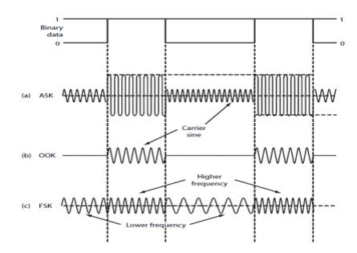
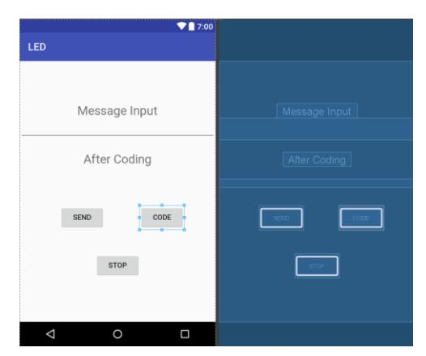
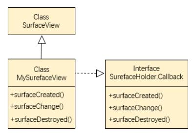
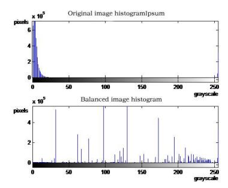
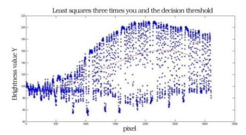
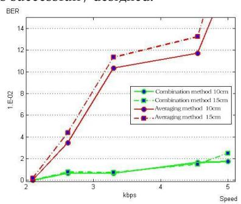
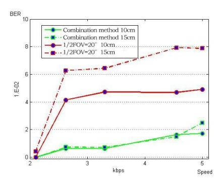

# Design of Visible Light Communication Transceiver System Based on Intelligent Terminal

Han Liu,1

School of Computer & Communication Engineering University of Science and Technology Beijing Beijing, China e-mail: ustblh2018@163.com

Abstract—Visible light communication technology is a wireless optical communication technology based on LED lighting.[1] Making use of the high speed response characteristic of LED, visible light communication technology can realize the dual functions of lighting and communication. As a new way of data access and a supplement to radio frequency communication, visible light communication has been widely concerned. This paper is based on the development of application-oriented visible light communication system based on intelligent terminal, in order to accelerate the practical process of visible light communication. By changing the traditional visible light receiving scheme and using smart phone as the receiving device of the visible light system, a visible light communication system based on intelligent terminal is built[2]. Through the research on the existing receiving algorithm, a new receiving algorithm is proposed to improve the adaptability and BER performance of the system.

Keywords-Visible Light Communication; Intelligent Terminal; Android

#### I. INTRODUCTION

Visible light communication is a kind of communication technology that transmits information through the light-emitting diode state transition. Since the beginning of the 21st century, the visible light communication association has been established in Japan, and the OMEGA research group has been established in Germany, France and the United Kingdom. They have successively studied the OOK-RZ coding mode, optical orthogonal frequency division multiplexing technology. system bandwidth and transmission rate of the visible light communication technology, and are committed to improving the performance of the visible light communication system.

Although the research in this field started late in China, it has developed rapidly. The national "973" project "Research on wireless transmission theory and method of broad spectrum signal" was officially launched in January 2013, aiming to study the theory and method of optical signal transmission and communication in various bands. In April 2013, based on the "863" project, "China visible light communication industry technology alliance" was established, aiming to achieve 480MB / s visible light communication. [8]

Fanshu Ma,2 (Corresponding Author)
School of Computer & Communication Engineering
University of Science and Technology Beijing
Beijing, China
e-mail: mafanshu@ustb.edu.cn

Since 2010, with the rapid development of smart phone technology, the research of visible light intelligent communication device with flash as the emission light source and CMOS camera as the receiver has attracted the attention of major mobile phone manufacturers at home and abroad. On the one hand, with the mobile phone flash as the transmitter, it has the characteristics of portable, mobile and high-frequency transmission, and can send the high-speed modulation light and dark flicker optical carrier signal which can not be detected by the naked eye. On the other hand, CMOS camera can be used as a visible light signal receiver instead of PD because of its high integration, low power consumption and high noise sensitivity.

This paper presents the overall design of the visible light communication system based on the intelligent terminal, using Android platform to develop software to realize the control of the flash on and off, realize the modulation and transmission of the visible light signal, and move the algorithm design of the receiver verified by MATLAB to the software of the sender to realize the design of the duplex visible light communication system.[11]

#### II. TRANSMITTER DESIGN AND IMPLEMENTATION

This chapter first develops a software with information input, binary encoding, and flash control on the Android platform to realize the design of the visible light emitting end based on the smart terminal, and then adopts the single-chip microcomputer (STC89C52) plus the visible light emitting circuit as the circuit emitting end. It is used to debug the visible light receiving end software designed and developed based on the intelligent terminal.

# A. Design of Transmitting Terminal Based on Smart Terminal

- Launcher UI design. Taking into account the realization of the function of the transmitter, the two text display windows of the user input dialog box and the coded display box are embedded in the page layout of the transmitter, and the three buttons of code, send and stop are embedded to ensure the basic transmitter function.
- Manchester encoding is a synchronous clock encoding technique used by the physical layer to encode the clock and data of a synchronous bit stream. In the design of the transmitter, first, through

the code, link the encoding button with the encoding action, the listener, and set a click event for the encoding button. In this stand-alone event, there are two sub-actions. The first sub-action is divided into three small steps. First, the text information input by the user is received, and then the characters are converted into binary numbers and stored in the binary array. Finally, in order for the user to see the encoded information, a text box that displays the text information is added.

• OOK is a special case of ASK modulation (amplitude keying), which uses a unipolar nonreturn-to-zero code sequence to control the opening and closing of the sinusoidal carrier. In this article, the mobile phone flash is turned on and off for OOK modulation. The method of calling the flash in the Android environment is not independent, but is called as part of the flash.

Figure 1. OOK modulation method.

• Cyclic send and stop function. In the Android platform, there is a method that can control the start time of code execution and the cycle execution interval time-TimerTask() timer method, which can plan to execute a task or execute a task repeatedly. For functional needs, this design adopts the schedule method with period parameters. Among them, the schedule method has three parameters.

Figure 2. Design of transmitting terminal based on smart terminal.

The first parameter is an object of type TimerTask. The run() method of TimerTask is a task to be executed periodically. The two parameters have two types, the first is long type, which means how long to start execution, the other is Date type, which means execution starts after that time; the third parameter is the execution cycle, which is long type. In addition, you need to set the switch and release the camera permissions to quickly end the launch process.

# *B. Design of Transmitter Based on Single Chip Microcomputer*

- Light emission circuit design. The light emitting circuit is an important part of the VLC communication system. Its function is to convert electrical signals into light signals for transmission. The physical structure is roughly composed of two parts: the light source and the LED drive circuit. Because the signal drive capability drawn from LM319 is insufficient, it is necessary to add postamplification to complete the emission of optical signals with information. 74LS04 is a high-speed CMOS device. Its pins are compatible with the lowpower Schottky TTL series. It is a Schmitt trigger inverter with 6 NOT gates, which can transform the changing input signal into a stable and clear output signal.
- Joint Debugging of Single Chip Computer and Transmitting Circuit. After the single-chip encoding is completed, the frame information sequence is output cyclically, and the information sequence is output from the output port of the single-chip microcomputer to the input end of the transmitting circuit via the DuPont line. The input TTL level can control the light-emitting state of the LED: when the input is high level (binary data "1"), the LED emits light, and when the input is high level (binary data "0"), the LED is off. After adopting 0805 packaged triode for two-stage amplification and filtering, it is loaded on the LED lamp bead. The triode sets an appropriate static operating point through a simple resistor divider method, and filter capacitors are added before and after each level of triode to filter out noise signals. By adding a pull-up resistor, the brightness of the LED is significantly improved, reaching the brightness level that the receiving end can receive normally.

### III. RECEIVER DESIGN AND IMPLEMENTATION

#### *A. Receiving Module Design*

The light receiving module uses the CMOS camera embedded in the mobile phone to receive the visible light signal. Through the rolling door feature of the CMOS camera, the visible light alternating signal can be recorded by continuous shooting or video recording. In this design, continuous shooting is used. Compared with video, continuous shooting can reduce the complexity of subsequent mobile phone processing procedures and save mobile phone memory; the image quality obtained is also higher than that of video recording, with more data points, The fitting of the subsequent decision threshold is more accurate.

Figure 3. MysurefaceView class implementation.

#### B. Receiver Algorithm Design

The equalization of the histogram is a gray-scale transformation process. The current gray-scale distribution is transformed into an image with a wider range and a more uniform gray-scale distribution through a transformation function. That is, the histogram of the original image is modified to be approximately evenly distributed in the entire grayscale interval, thus expanding the dynamic range of the image and enhancing the contrast of the image. Usually the transformation function selected for equalization is the cumulative probability of grayscale, the steps of the histogram equalization algorithm:

Calculate the gray histogram of the original image:

$$P(S_k) = \frac{n_k}{n}$$

where n is the total number of pixels, and nk is the number of pixels of the gray level Sk.

Calculate the cumulative histogram of the original image:

$$CDF(S_k) = \sum_{i=0}^{k} \frac{n_i}{n} = \sum_{i=0}^{k} P_s(S_i)$$

Use the above cumulative distribution function to equalize the histogram, so that the pixels are evenly distributed in the range of 0~255, and improve the overall brightness of the image:

$$D_{i} = L * CDF(S_{i})$$

Among them, Di is the pixel of the target image, CDF (Si) is the cumulative distribution of the source image gray level i, and L is the maximum gray level in the image (the gray level is 255).

After the histogram equalization process is performed on the picture, the overall brightness of the picture is improved, and the contrast between the bright and dark stripes in the picture is also clearly distinguishable.

Highlight bloom error elimination. The CMOS image sensor is responsible for collecting photons, converting the photons into electric charges, and then forming an image through a series of processing.

Figure 4. Comparison of histograms before and after equalization.

Once the received photons exceed the maximum value that the pixel can receive, the charge converted into extra photons will overflow. When the charge overflows to the pixels next to it, the pixels next to it are over-exposed in the process of processing photons. In order to improve the bit error rate of the system, it is necessary to solve the sampling error caused by the highlight overflow effect. By deleting the part that produces the highlight effect, the part of the bright and dark stripes can be clearly distinguished for the subsequent sampling decision processing, which not only reduces the complexity of the post-decoding algorithm, but also because it is an image interception operation performed after the histogram equalization processing. Therefore, it will not affect the histogram equalization due to too few pixels, and the remaining image can also clearly distinguish between bright and dark stripes.

Figure 5. Finding the decision threshold by using a cubic fitting polynomial

- Calculate pixel average and binarization decision. After processing all the columns of the picture, a gray value array containing the average gray value of each column can be obtained. This array is used as the fitted data point to perform a cubic polynomial fitting, and the fitted curve (red line in the figure) is the subsequent decision threshold used for decision processing. Binarize each data point. Points above the decision threshold curve are judged as binary "1" and points below the curve are judged as binary "0".
- Automatic frame structure. When the frame structure needs to be detected, since the useful information (location information and user information) has been encoded by Manchester, the number of consecutive occurrences of binary "1" will not exceed twice, so only 3 "1"s need to be detected. This segment is the

frame header part of the frame structure. The "0" at the end of the frame is to avoid misjudgment when the frame header is "01" before (that is, the case of "01111"). Similarly, a "0" needs to be set after the 3 "1"s in the frame head.

# *C. Receiving end Function Realization and Joint Debugging Experiment*

- System test results. The correct receiving process at the receiving end APP is as follows: align the LED preview and continuous shooting → automatically start the background thread after the continuous shooting is completed to perform histogram equalization processing on the picture → all image processing is completed → click the button to start a new thread for decoding operation → update the UI Display decoding information.
- Rate adaptability test. For the verification of the automatic frame structure detection function, you only need to repeat the receiving operation after changing the rate. If it can be successfully decoded, it proves that the algorithm successfully recognizes the frame structure and achieves the purpose of automatic detection. In the experiment, the speeds of 3k, 4k, and 5k were tested, and the correct user information was displayed after the UI update, which proved that the automatic detection algorithm was successfully designed.

Figure 6. Comparison of bit error rate curves of different decoding methods.

Figure 7. System bit error rate curve when FOV=20°

• Next, using the bit error rate as an indicator, the combined decoding method and the method of

- sampling five points per bit after direct averaging are compared, and the bit error rates of each at different rates are plotted as a bit error rate curve.
- Angle adaptability test. In addition, compared with the traditional visible light communication system that uses PD as the receiving end, this system does not require strict alignment, so this article tested the system's information reception under non-strict alignment angles, and plotted the bit error rate curve as follows.

#### IV. CONCLUSION

In this paper, a visible light communication system based on smart terminals is designed, and the duplex visible light communication transceiver software is realized by writing software. Among them, an algorithm that can automatically identify the frame structure and a set of decoding methods are designed, and include certain error correction capabilities, and the feasibility of the system is verified through circuit transmission and software transmission.

#### REFERENCES

- [1] Yuan, J. . Visible light communication.
- [2] Sui M , Gu X , Han C , et al. Recent advance in visible-lightsensitive and Z-scheme Ag\_3PO\_4 heterojunction photocatalyst[J]. New Chemical Materials, 2017.
- [3] Camacho P . Front-end design for visible light communications systems. 2017.
- [4] Digital Image Processing in LED Visible Light Communications Using Mobile Phone Camera[C]. Proceedings of NIDC2016, 2016:28-38.
- [5] Lu H , Zhen S . An indoor visible light communication model under the condition of multipath transmission[C]// International Congress on Image & Signal Processing. IEEE, 2016.
- [6] X Wang, Wang L , Jian K , et al. A RGB LED PAM-4 Visible Light Communication Transmitter Based on a System Design with Equalization[C]// 2020 IEEE International Conference on Artificial Intelligence and Computer Applications (ICAICA). IEEE, 2020.
- [7] Fuada S , Adiono T , Aska Y , et al. Trans-impedance Amplifier (TIA) Design for Visible Light Communication (VLC) using Commercially Available OP-AMP[C]// 2016 3rd International Conference on Information Technology, Computer, and Electrical Engineering (ICITACEE 2016). IEEE, 2016.
- [8] Che Z , Fang J , Jiang Z L , et al. A Physical-Layer Secure Coding Scheme for Indoor Visible Light Communication Based on Polar Codes[J]. IEEE Photonics Journal, 2018, 10(5):1-1.
- [9] Fan L , Liu Q , Jiang C , et al. Visible light communication using the flash light LED of the smart phone as a light source and its application in the access control system[C]// Wireless Symposium. IEEE, 2016.
- [10] Naeem A , Hassan N U , Pasha M A , et al. Performance Analysis of TDOA-based Indoor Positioning Systems using Visible LED Lights[C]// 2018 IEEE 4th International Symposium on Wireless Systems within the International Conferences on Intelligent Data Acquisition and Advanced Computing Systems (IDAACS-SWS). IEEE, 2018.
- [11] Fan L , Ding L , F Liu, et al. Design of wireless optical access system using LED based android mobile[J]. Optics & Photonics Journal, 2013, 3(2B):148-152.
- [12] Chen C W , Chi-Wai C , Yang L , et al. Efficient demodulation scheme for rolling-shutter-patterning of CMOS image sensor based visible light communications[J]. Optics Express, 2017, 25(20):24362.

- [13] Tran T K , Huynh H T , Nguyen D P , et al. Demonstration of A Visible Light Receiver Using Rolling-Shutter Smartphone Camera[C]// 2018 International Conference on Advanced Technologies for Communications (ATC). 2018.
- [14] Kaftanniko V I L , Kozlova A V , Khlyzo V A D . Prototype of a Li-Fi Communication System for Data Exchange Between Mobile Devices[C]// 2020 Global Smart Industry Conference (GloSIC). 2020.
- [15] Yu-Cheng, Chuang, Chi-Wai, et al. Using logistic regression classification for mitigating high noise-ratio advisement light-panel in rolling-shutter based visible light communications[J]. Optics express, 27(21):29924-29929.
- [16] Nam-Tuan Le. Optical Camera Communications: Future Approach of Visible Light Communication, The Jounal of Korean Institute of Communications and Information Sciences '15-02 Vol.40 No.02, 2015
- [17] B. Fahs et al., "A 6-m OOK VLC Link Using CMOS-Compatible p-n Photodiode and Red LED," in IEEE Photonics Technology Letters, vol. 28, no. 24, pp. 2846-2849, Dec.15, 15 2016.
- [18] Chen C , He Z , Kai H , et al. Visible light communication using the microphone jack of the smart phone as an optical receiver and its application in the indoor localization system[C]// 2017 International Conference on Electron Devices and Solid-State Circuits (EDSSC). 2017.
- [19] Zhang Z , Qiao Y , Zhang T , et al. Using piecewise polynomial fitting as threshold to improve the performance of mobile phone

- camera based VLC system[C]// 2018 Asia Communications and Photonics Conference (ACP). 2018.
- [20] Song P , Li Z . Research on Visible Light Communication Control System Based on Steady-State Visual Evoked Potential[C]// International Conference on Intelligent Human-machine Systems & Cybernetics. IEEE, 2015.
- [21] Mobile phone Camera Based Visible Light Communication Using Non-Line-of-Sight (NLOS) Link[C]// International Conference on Network Infrastructure and Digital Content. 0.
- [22] Zhang Z , Zhang T , Tang X , et al. Reducing grayscale value fluctuation for mobile-phone camera based VLC system[J]. IEEE Photonics Journal, 2018, PP:1-1.
- [23] Liu C , Liu T , Xing C , et al. LED Visible Light Communication Indoor Positioning Method Based on Mobile Phone at Any Horizontal Orientation[C]/. 0.
- [24] Arora A , Rao A , Bhutani M . A Matlab Simulation Model for MAC Layer of Visible Light Communication[C]// 2020 7th International Conference on Signal Processing and Integrated Networks (SPIN). 2020.
- [25] Katz M , Ahmed I . Opportunities and Challenges for Visible Light Communications in 6G[C]// 2020 2nd 6G Wireless Summit (6G SUMMIT). 2020.