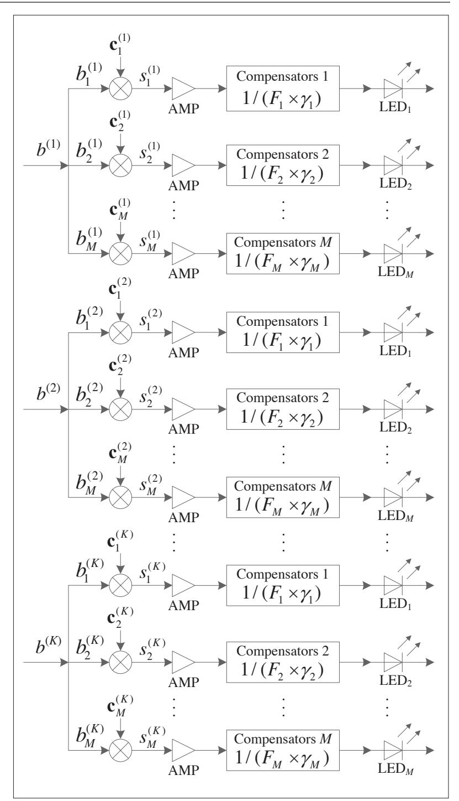
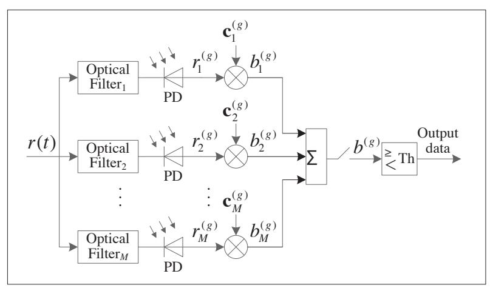
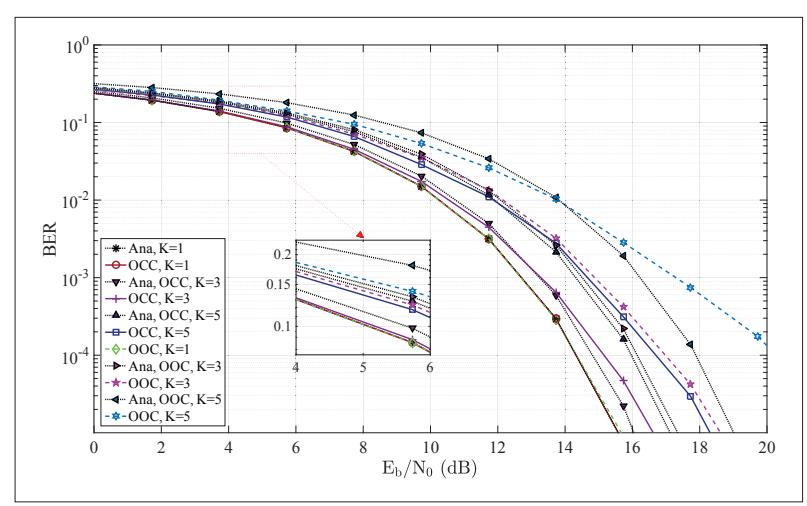
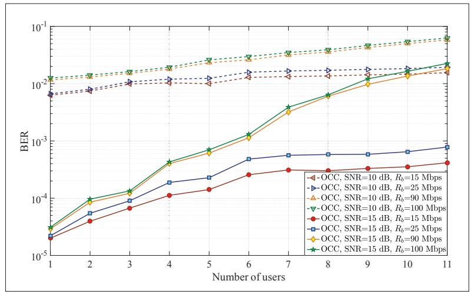
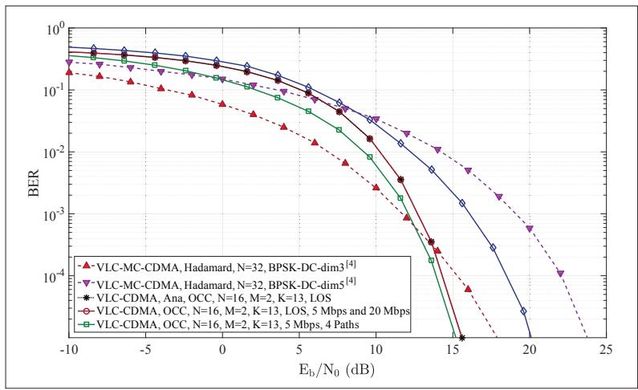
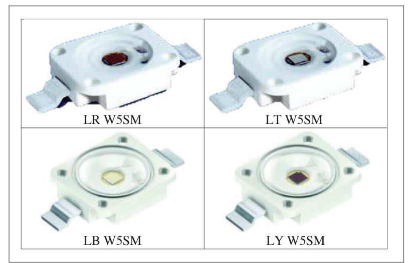

# VLC-CDMA Systems Based on Optical Complementary Codes

Yang Qiu, Hsiao-Hwa Chen, Jinqiang Li, and Weixiao Meng

# Abstract

VLC performs the dual-functions of communication and lighting and will play an important role in next-generation wireless communications. Proper multiple access methods should be identified for VLC in multi-user scenarios. This article proposes a VLC-CDMA system using OCCs, which are unipolar codes with a multiple sub-codes structure. OCCs offer good autocorrelation and cross-correlation functions. The issues on encoding criteria and application of OCCs in VLC-CDMA systems are discussed. The transmitters use LEDs with different wavelengths to distinguish different sub-codes. Compensator circuits are used to achieve equal gain combining at receivers to exploit the good correlation properties of OCCs. The receivers use the filters with different center wavelengths to distinguish different sub-codes. The performance of VLC-CDMA systems with OCC is compared to OOCs and multi-carrier CDMA systems, to verify that the proposed system is robust for its applications in multi-user scenarios.

# Introduction

Visible light communication (VLC) makes use of indoor lighting infrastructure to perform the dual functions of communications and lighting. Indoor illumination sources are used as transmitters to send information through high-speed visible light pulses. A VLC channel includes line of sight (LOS) and scattering links[1]. The bandwidth of VLC is about 300 THz, which is much wider than that of traditional radio frequency (RF) wireless communications and does not require spectrum regulation. Meanwhile, VLC is more secure because the light cannot penetrate non-transparent objects. Moreover, there is no electromagnetic interferences between VLC and RF bands because of their widely separated frequency bands. Therefore, VLC can be used in hospitals, airports, and gas stations, which are sensitive to electromagnetic interferences or safety concerns. In addition, VLC can also be used in indoor positioning, V2V (vehicle-to-vehicle) communications, and MIMO (multiple input multiple output) systems due to its unique features [2, 3].}

Due to the numerous advantages of VLC, it is in particular suitable to operate in a multi-user scenario, such as shopping malls, conference rooms, and so on [1, 4]. Code division multiple access (CDMA) technology is a robust technology to allow multiple users to access the network simultaneously [3, 5]. The use of CDMA technologies in VLC leads to a VLC-CDMA system. However, an indoor scattering environment causes VLC signals to suffer from multipath propagation, and thus we need to mitigate multipath interferences in VLC-CDMA systems [6]. In addition, multi-user interference cancellation techniques are needed to eliminate or at least to reduce multi-user interference (MUI) [7].

The design of the signature codes is extremely important in VLC-CDMA systems. The bipolar codes have been widely used to separate users and eliminate multipath interference and multiple access interference (MAI) among users in RF wireless communications. However, VLC-CDMA systems with intensity modulation/direct detection (IM/DD) require that real unipolar signals should be loaded on LEDs, and thus the bipolar codes suitable for traditional RF wireless communications should not be used directly in VLC communications if bias units are not available. It is not possible to use "0" directly to replace "–1" in bipolar codes to generate unipolar codes, because the change from "–1" to "0" may destroy the original correlation properties of the bipolar codes, which increases MAI and undermines system performance [2].

There are usually two approaches to address this problem. One is to modify the circuitry in a VLC-CDMA system that uses bipolar codes plus bias units to guarantee that the signals loaded on LEDs are always positive [3, 4]. The other approach is to design unipolar codes directly to spread baseband signals, which include the unipolar codes modified from bipolar codes [2] and the unipolar codes used in non-coherent optical CDMA (OCDMA) systems [8, 9]. The unipolar codes designed for non-coherent OCDMA systems include random optical codes (ROC) [8], prime codes (PC) [8, 10], and optical orthogonal codes (OOC) [9]. The correlations of ROC are not optimal, but it can support a relatively large number of users. The advantage of PC is its simple code generation process, but its auto-correlation sidelobes are too high. The OOC offers better correlations, but the number of codes in a set is relatively small.

The above discussions on the design of VLC signature codes motivate us to work out a better way to implement VLC-CDMA systems in this article. Before the introduction of the proposed VLC-CD-MA system, we would like to summarize the major contributions of this work in the sequel.

In this work, we introduce unipolar complementary codes, namely optical complementary codes (OCCs), for VLC-CDMA applications, which is called a VLC-OCC-CDMA system.

*Yang Qiu, Jinqiang Li, and Weixiao Meng are with Harbin Institute of Technology; Hsiao-Hwa Chen (corresponding author) is with the National Cheng Kung University.*

Digital Object Identifier: 10.1109/MWC.2019.1900071 In an indoor VLC scenario with IM/DD, the transmitter, receiver, and anything in-between are slow moving objects, such that the coherent time of the channel is much longer than a bit duration. Such a channel can be viewed as a linear time-invariant system.

We design the transmitters and receivers for a VLC-OCC-CDMA system. A transmitter uses different LEDs to distinguish different sub-codes in an OCC. According to the gains of receiver filters and photodetectors (PDs), we add compensator circuits at transmitting ends to achieve equal gain combining at receiving ends. The receivers use the filters with different center wavelengths to separate the signals carried by different sub-codes. In addition, we present a way to implement the proposed VLC-OCC-CDMA system and identify the parameters of the devices used in the system.

We evaluate the anti-interference capability of the proposed VLC-OCC-CDMA system. Based on the simulation results, we compare a VLC-OCC-CDMA system with OOC (namely VLC-OOC-CDMA), and a multi-carrier CDMA system with Hadamard sequences (namely VLC-MC-CDMA) [4] to verify the effectiveness of the proposed VLC-OCC-CDMA system.

### SYSTEM MODEL

In this section, we introduce a typical VLC system model, including a transmitter, channel, and receiver. Then, we discuss the preliminaries of OCCs, which are the signature codes used in the proposed VLC-OCC-CDMA system.

#### CHANNEL MODEL

Let us consider an indoor VLC environment, where the user data signals are modulated by b(t) and go through spreading modulation as s(t). Then, the signals are transmitted by LEDs, which are installed on the ceiling to transmit data and provide lighting at the same time. A receiver usually uses PDs to convert optical signals to electrical signals. The received signals are despread to obtain b(t), which is recovered after a demodulation process.

In an indoor VLC scenario with IM/DD, the transmitter, receiver, and anything in-between are slow moving objects, such that the coherent time of the channel is much longer than a bit duration. Such a channel can be viewed as a linear time-invariant system. A fundamental feature of a linear time-invariant system can be characterized by its impulse response h(t). With the given characteristic features of transmitters and receivers, the baseband impulse response for an IM/DD communication channel can be determined.

Let us take a look at a VLC channel model as suggested by Lee et al. [6], which is a model derived for infrared communications. The model was proposed for an empty regular room in a static indoor environment, where the noise source in the model is Gaussian white noise, and the line of sight (LOS) and reflected paths are present. The mathematical expression of the channel impulse response was deduced by a ray tracing method to capture the channel characteristics. Multipath propagation caused by reflections results in a delay profile of the received signals, and the channel impulse response h(t) is used to describe the time dispersion nature of the channel. The channel model captures path loss, path delay, and reflected power, which are related to the distance between the transmitters and receivers, as well as the reflectivity coefficients of the materials of the objects in the room.

### PRELIMINARIES OF OCC

In this article, we use unipolar complementary codes called OCC in the proposed system and introduce the OCC briefly as follows. An optical comple-

mentary code can be represented by OCC(N, w, M,  $\lambda_a$ ,  $\lambda_c$ ), where N is the length of sub-codes, w is the number of "1s" in each sub-code, M is the number of the sub-codes,  $\lambda_a$  is an auto-correlation constraint, and  $\lambda_c$  is a cross-correlation constraint.

**Code Design Criterions:** The code design criterions for the OCC are summarized as follows. The auto-correlation constraint should be  $\lambda_a = 0$ , and the cross-correlation constraint is  $\lambda_c = 1$ . It means that each sub-code contains only one "1," and the positions and the relative distances of "1s" in sub-codes are not repeated. The number of sub-codes is limited to  $2 \le M \le N$ .

**Code Generation Methods:** As discussed earlier on code design criterions, the OCC for user k can be defined as  $OCC^{(k)} = \{a_1^{(k)}, a_2^{(k)}, \cdots, a_N^{(k)}\}$ , where  $a_m^{(k)}$  indicates the position of "1" in the mth sub-code of the kth user,  $m \in \{1, 2, \cdots, M\}$ ,  $k \in \{1, 2, \cdots, K\}$ , and  $a_m^{(k)} \in \{1, 2, \cdots, N\}$ . Two code design methods are available based on the lengths of sub-codes, which include the prime and non-prime methods and can be explained as follows.

When the length of sub-codes N is a prime number, the position of "1" in each sub-code of OCC can be constructed in Galois field, which is given as  $a_m^{(k)} = [(m-1)(k-1)]_N + 1$ , where  $[(m-1)(k-1)]_N$  denotes m-1 multiplying k-1 in modulo N, and  $a_m^{(k)}$  expresses the position of "1" for the mth sub-code of the kth user.

When the length of sub-codes *N* is a non-prime number, the generation process for OCCs can be illustrated in four steps as follows.

**Step 1:** Generate a code set that meets the ideal auto-correlation constraint  $\lambda_a = 0$ . There are  $N^M$  codes in a code set, each code has M subcodes, and the length of the sub-codes is N.

**Step 2:** Construct OCCs according to the cross-correlation constraint  $\lambda_c = 1$ . Choose one of the  $N^M$  codes as the first OCC.

**Step 3:** Select another code from the other ( $N^{M}$ –1) codes to compare with the first OCC in terms of their cross-correlations. If it meets the cross-correlation constraint, it can be the second OCC.

**Step 4:** Select a code from the other ( $N^M$ –2) codes to compare the cross-correlations with the first and the second OCCs, respectively. If it satisfies the cross-correlation constraint, it can be the third OCC. Repeat the above steps to obtain the fourth, fifth, …, the Kth OCCs.

Based on the above introduction of the preliminaries of OCC, we can generate OCCs with different code parameters. Moreover, if the length of subcodes is a prime number, we can have the number of users *K* that is equal to the length of sub-codes *N*, which is independent of the number of sub-codes *M*. However, the number of users *K* decreases with an increasing number of sub-codes *M* when the length of sub-codes is a non-prime number.

### System Architecture

In this section, we present the transmitters and receivers in a VLC-OCC-CDMA system. Let us consider an indoor VLC system, whose transmitter is an LED array that is installed on the ceiling to transmit data and provide lighting. The receivers are PDs in user terminals to convert optical signals to electrical signals. Meanwhile, we will also illustrate the ways for the proposed VLC-OCC-CDMA system to eliminate interference to ensure a satisfactory performance.

#### **TRANSMITTER**

The proposed VLC-OCC-CDMA system employs a multiple sub-codes structure and LEDs with different peak wavelengths to separate the signals carried by different sub-codes.

The transmitter model of the VLC-OCC-CDMA system is shown in Fig. 1. Transmitters are LEDs and use on-off keying (OOK) modulation.  $b^{(k)}$  is the signal of the kth user after modulation. Each user data is copied to M data streams, and  $b^{(k)}_m$  is the mth data stream of the kth user, where  $m \in \{1, 2, \cdots, M\}$ , and  $k \in \{1, 2, \cdots, K\}$ . The VLC-OCC-CDMA system uses a set of optical complementary codes OCC(N, M, M,  $\lambda_a$ ,  $\lambda_c$ ) as the signature codes for K users. Assume that the OCC assigned to user k is  $\mathbf{C}^{(k)} = \{\mathbf{c}^{(k)}_m\}_{m=1}^M$ ,  $k \in \{1, 2, \cdots, K\}$ , where  $\mathbf{c}^{(k)}_m = [\mathbf{c}^{(k)}_{m,1}, \mathbf{c}^{(k)}_{m,2}, \cdots, \mathbf{c}^{(k)}_{m,N}]$  is the Mth sub-code, M is the Mth sub-code, Mthe length of the OCC is M, the number of "1s" in each sub-code is M, the auto-correlation constraint is  $\lambda_a = 0$ , and the cross-correlation constraint is  $\lambda_c = 1$ .

Assume that the number of active users in the system is K. Each user is assigned an OCC, and each data stream of a user is multiplied by one sub-code. The spreading signals are transmitted through LEDs. The optical filter gain at a receiver is  $F_m$ ,  $m \in \{1, 2, \cdots, M\}$ , whose center wavelength is approximately the same as the peak wavelength of the LED. The PD response sensitivity is  $\gamma_m$ ,  $m \in \{1, 2, \cdots, M\}$ . We add compensators for LEDs with the gains of  $1/(F_m \times \gamma_m)$ ,  $m \in \{1, 2, \cdots, M\}$ . Therefore, the signals after despreading can achieve an equal gain combining at the receiver to reconstruct the ideal correlation functions of OCCs to improve system performance.

Each data stream of a user is assigned a separate LED to ensure that users can work in the linear regions of LEDs to avoid nonlinear distortion [3]. Each sub-code of a user is transmitted by an LED with a different peak wavelength to avoid interference among sub-codes of the same user. Therefore, *M* LEDs with different peak wavelengths are required to send the data carried on *M* sub-codes. The corresponding sub-codes of each user are sent through indoor VLC channels.

Different streams from a user employ the LEDs with different peak wavelengths to transmit data, and different users use the same set of LEDs. It is known from the literatures that a minimum interval of peak wavelength for different LEDs should be made larger than 33 nm to avoid cross-talk. Meanwhile, theoretical calculations showed that the FWHM of LEDs is from 18.3 nm to 34.7 nm at room temperature. In this work, due to the characteristics of LEDs, the designed system can support up to 12 separated channels to transmit data simultaneously [11].

#### RECEIVER

Let us take a single-user receiver as an example to illustrate the reception process of a VLC-OCC-CDMA system, as shown in Fig. 2.

As the transmitters use *M* different LEDs to send data, the received signal is the sum of all different LED signals. Therefore, it is necessary to separate data streams, which are spread by different sub-codes, using *M* bandpass filters with different center wavelengths. The filtered signals are converted to electrical signals

**FIGURE 1.** Transmitter structure of a VLC-OCC-CDMA system. User data  $b^{(k)}$  is copied to  $b_1^{(k)}$ ,  $b_2^{(k)}$ , ...,  $b_M^{(k)}$ , and then multiplied by the kth OCC as  $\mathbf{c}_1^{(k)}$ ,  $\mathbf{c}_2^{(k)}$ , ...,  $\mathbf{c}_M^{(k)}$ , respectively. AMP is used to amplify signals, and compensators are used to achieve equal gain combining at receivers. Each data stream is loaded on LEDs with different peak wavelengths to distinguish data streams with different sub-codes of the same OCC.

by PDs. We can obtain corresponding response sensitivity parameters for different wavelengths according to the spectral sensitivity curves of the PDs.

The despread OCCs recover transmitted signals based on their correlation characteristics. Because the same data stream of a user is loaded on the same set of LEDs, the signals through bandpass filters are the sum of K user signals. PDs convert optical signals into electrical signals. We use  $\mathbf{c}_{n}^{(g)}$ 

FIGURE 2. Receiver structure of a VLC-OCC-CDMA system with a single user. The received signals are filtered by optical filters with *M* different center wavelengths, and then the filtered optical signals are converted to electrical signals by PDs. The despreading OCC is the same as the spreading OCC at transmitter. *M* data streams after despresding are combined and decoded by a threshold.

to despread data streams as  $\hat{b}_{n}^{(g)}$ . Finally, M data streams of the same user are combined and detected by a threshold to restore original data.

Assume that the noises from *M* optical filters are independent. Let us explain the despread process of the VLC-OCC-CDMA system, as shown in Fig. 2.

**Step 1:** Perform despread modulation for the *j*th data of the *m*th data stream for the *g*th user. For the user *g*, the optical signals filtered by each optical filter are converted to electrical signals by PDs. The *M* sub-codes of an OCC allocated to user *g* are used to despread data streams of the user.

**Step 2:** Combine *M* data streams. The output of *M* data streams of the gth user can be combined with an equal gain before making decisions.

**Step 3:** Recover data through decision. Based on Steps 1 and 2, which illustrated the despreading process of an OCC used by a user, the *j*th data bit of user *g* is the summation of the *M* data streams of the *j*th data bit. By setting a proper decision threshold that is usually  $w_M/2$ , the *j*th data bit on the *m*th data stream for user *g* can be obtained.

### SIMULATION SETUP AND RESULTS

In this section, we showcase the simulation results of VLC-CDMA systems. In particular, we will present BERs of VLC-OCC-CDMA and VLC-OCC-CDMA systems, and compare the VLC-OCC-CDMA and VLC-MC-CDMA systems.

#### SIMULATION SETUP

Let us define the system parameters before showing the simulation results. The length, width, and height of a room are assumed to be 5 m, 5 m, and 3 m, respectively, which is empty without interferences by other lighting sources. The transmitter configuration is shown in Fig. 1, where LEDs formed as an array are installed on the ceiling, and the same user data is transmitted through four different LEDs. The peak wavelengths of the four LEDs are 632 nm, 520 nm, 465 nm, and 590 nm, respectively, and their FWHMs are 18 nm, 33 nm, 25 nm, and 18 nm, respectively. The power of the four LEDs is the same as 0.88 W. The four different LEDs aim to synthesize white light to provide

indoor lighting as well as communication functions. The signals are sent through indoor VLC channels, whose models were introduced earlier. As shown in Fig. 2, the receivers are located on the desktop with a height of 0.85 m. That is, the distance between a receiver and the transmitter is 2.15 m. The gains of optical filters  $F_1$ ,  $F_2$ ,  $F_3$ , and  $F_4$  are 78.8 percent, 73.1 percent, 68.1 percent, and 80.4 percent, respectively. The gains of PDs  $\gamma_1$ ,  $\gamma_2$ ,  $\gamma_3$ , and  $\gamma_4$  are 0.42, 0.25, 0.16, and 0.35, respectively.

We used OCC(16, 1, 4, 0, 1) as the signature codes of the VLC-OCC-CDMA system, that is, the length of sub-codes (N) is 16, the number of sub-codes (M) is four, and the number of "1s" (W) in each sub-codes is one. The auto-correlation side-lobes ( $A_a$ ) are zero, and the peak auto-correlation is four, which is equal to the number of sub-codes (M). The maximum value of cross-correlation interferences ( $A_c$ ) is one, and the maximum number of cross-correlation interferences is M, which is the same as the number of sub-codes.

We choose OOC(64, 4, 1) in a comparison experiment, which has been widely used in OCDMA systems. Specifically, the length of the OOC (N) is 64, the number of "1s" (w) in each code is four, and the correlation constraint is one [9]. The OOC(64, 4, 1) can support five users, and each of the five codes has its length of 64 chips, which is equal to the processing gain (NM = 64) of its counterpart OCC(16, 1, 4, 0, 1). For example, the fifth code of OOC(64, 4, 1) is expressed by (0 0 0 0 0 0 0 1 0 0 0 0 0 0 0 1 0 0 0 0

For the fairness of comparisons, the processing gains *MN* of the two codes (i.e., OCC and OOC) are the same, which is 64, and the peak auto-correlation is four. OCC has no auto-correlation sidelobe and it achieves an ideal auto-correlation, while the OOC has non-zero auto-correlation sidelobes. In addition, the two unipolar codes do not satisfy the ideal cross-correlation characteristics, and the maximum cross-correlation levels are one. The maximal cross-correlation interference of OCC is *M*, and the cross-correlation interference of OOC is *N/w*. The number of users supported by OCCs is 11, which is larger than that of OOCs, which can support only five users.

#### SIMULATION RESULTS

The aforementioned OCCs and OOCs are used as the signature codes in the proposed VLC-CDMA system. We will show their simulation results. Moreover, we will compare the proposed VLC-OCC-CD-MA system with a VLC-MC-CDMA system.

Figure 3 gives the BER performances of the VLC-OCC-CDMA and VLC-OOC-CDMA systems, which have the same chip rate with a different number of users. The channel model is given above, which includes the LOS and three reflection paths. The delays of the four paths are [0, 2, 4, 6] (ns), and their normalized powers are [1, 0.379, 0.171, 0.087] (mW), respectively [6]. The chip rate  $(R_c)$  and data bit duration are 1.6 Gcps and  $10^6$  in the simulations. It is seen from Fig. 3 that the BER performances of both systems improve as SNR increases. The smaller the number of users is, the better the performance will be. This is due to the fact that under the same SNR, the more users

&lt;sup>1Due to the space limit of a magazine article, we have to omit the detail information about code generation processes for OOCs and OCCs. For those who are interested, please refer to our cloud file (https://drive.google.com/file/d/1DQH-fjHYyFjsltmq-vssJWPo3CRQ-pH2UY/view?usp=sharing).

appear in the system, the greater the interferences among users occur.

The dash lines show the theoretical BER curves when the number of users is one, three, and five, respectively, for the proposed VLC-OCC-CDMA and VLC-OOC-CDMA systems in Fig. 3. When there is only one user in the two systems, the simulation results coincide with the theoretical curve, because there is no MUI when the system has only one user. In addition, when the number of users K is three and five, the simulation results of the VLC-OCCt-CDMA and VLC-OOC-CDMA systems approximatively coincide with the theoretical curves. The deviations between the simulations and theoretical curves are due to the interferences among the users. The performance of the VLC-OCC-CDMA system is better than that of the VLC-OOC-CDMA system when SNR is relatively high in Fig. 3, owing to the ideal auto-correlations and minimum cross-correlations of OCCs if compared to OOCs. Meanwhile, the VLC-OOC-CDMA system can support five users at most, and thus a higher MUI is the main cause that impairs BER. Therefore, the deviations between the simulation and theoretical curves are larger than those in other scenarios. The VLC-OCC-CDMA system can support up to 11 users, and MUI will be relatively low when there are only five users. the VLC-OCC-CDMA system can support more users than the VLC-OOC-CDMA system. We should note that the data rate  $(R_b)$  of the two systems is 100 Mb/s and 25 Mb/s, respectively, as code lengths N are 16 and 64 ( $R_c = NR_b$ ), respectively. Thus, the BER changes with the number of users for different SNR and  $R_b$  in Fig. 4.

Figure 4 shows the BER performances of a VLC-OCC-CDMA system versus the number of users with different SNR and  $R_b$ . The system can support up to 11 users, and the BER degrades with an increasing number of users due to the MUI in multi-user scenarios. With the same number of users and data rate, the greater the SNR is, the better the BER performance will be. In addition, the lower the data rate is, the better the BER performance will be with a given SNR and number of users, which can be explained as follows. The channel model assumed in the system consists of the LOS component and three reflection paths, and the power vector of the four paths is [1, 0.379, 0.171, 0.087]. The path delay vector is [0, 2, 4, 6] (ns). When  $R_b$  is 15 Mb/s, 25 Mb/s, 80 Mb/s, and 100 Mb/s,  $T_c$  ( $T_c$ =  $1/NR_b$ ) is 4.17 ns, 2.5 ns, 0.69 ns, and 0.625 ns, respectively. That is, the values of  $T_c$  in the four data rates are all smaller than the delay spread (6 ns), which induces the ISI due to multipath propagation. The higher the date rate is, the more severe the multipath interference will be, which results in a worse off BER performance. Moreover, when  $R_b$  is 100 Mb/s, the BER performances with one, three, and five users at 10 dB and 15 dB are consistent with those as shown in Fig. 3.

Figure 5 compares the performances of the proposed VLC-OCC-CDMA system and VLC-MC-CDMA system [4]. The modulations in VLC-OCC-CDMA and VLC-MC-CDMA are OOK and BPSK, respectively. The length of the Hadamard sequences in VLC-MC-CDMA is 32. To ensure the same processing gain of the two signature codes, the OCC parameters are set to N = 16 and M = 2, with only one "1" in each sub-code to support up to 13 users. The channel model for the VLC-OCC-CDMA sys-

FIGURE 3. BER performance of the VLC-CDMA systems using OCC(16, 1, 4, 0, 1) and OOC(64, 4, 1). The maximum numbers of users supported by OCCs and OOCs are 11 and 5, respectively. "Ana" denotes the analytical results. The chip rate is 1.6 Gcps, the normalized powers of the channel model are [1, 0.379, 0.171, 0.087] ( $\mu$ W), and the delays for the four paths are [0, 2, 4, 6] (ns), respectively [6].

FIGURE 4. BER performance versus the number of users in VLC-OCC-CDMA system with two typical values of SNR (10 dB, 15 dB) and data rates (15 Mb/s, 25 Mb/s, 90 Mb/s, 100 Mb/s). The normalized powers of the channel model are [1, 0.379, 0.171, 0.087] (μW), and the delays for the four paths are [0, 2, 4, 6] (ns), respectively [6].}

tem contains an LOS component and four paths [6], and that for the VLC-MC-CDMA system is a LOS channel[6]. The power vector of the four paths is [1, 0.379, 0.171, 0.087], and the path delay vector is [0, 2, 4, 6] (ns). We show the performances of the VLC-OCC-CDMA system with its data transmission rates as 5 Mb/s and 20 Mb/s, respectively.

In an LOS scenario, when SNR is relatively low, the performance of the VLC-OCC-CDMA system is worse than that of the VLC-MC-CDMA system [4]. However, the VLC-OCC-CDMA system performs better than the VLC-MC-CDMA system as SNR goes higher. The reason is that OCCs possess ideal auto-correlation functions and the positions of "1s" in each sub-code are not repeated, which reduces MAI in a LOS channel.

In multipath scenarios, we show the performances of a VLC-OCC-CDMA system with two values of  $R_b$ . With a lower  $R_b$  (say 5 Mb/s), the performance

FIGURE 5. BER performance comparison for VLC-OCC-CDMA and VLC-MC-CDMA systems [4]. The parameters of OCCs are N = 16, and M = 2. The length of Hadamard sequences is 32. The modulations of the two systems are OOK and BPSK. The channel model for the VLC-OCC-CDMA system consists of LOS component and four paths with its power vector and path delay vector as [1, 0.379, 0.171, 0.087] and [0, 2, 4, 6] (ns), respectively [6]. The data rates are 5 Mb/s and 20 Mb/s. The channel in the VLC-MC-CDMA system is an LOS channel[6].

FIGURE 6. The models of the four LEDs, that is, red LED is LR W5SM, green LED is LT W5SM, blue LED is LB W5SM, and yellow LED is LY W5SM, respectively [12].

in the four-path channel is better than that in a LOS channel. The chip duration  $T_{\rm C}$  ( $T_{\rm C}$  = 1/N $R_{\rm b}$ ) is 12.5 ns, and the delay spread is 6 ns, which is only about a half of the chip duration. Therefore, the multipath returns enhance the received signals and improve the system performance. When  $R_{\rm b}$  is higher (say 20 Mb/s), the VLC-OCC-CDMA system is worse than BPSK-DC-dim3 [4], but better than BPSK-DC-dim5 [4] at a relatively high SNR, because the multipath channel induces ISI when  $T_{\rm c}$  (3.125 ns) is shorter than the delay spread of the channel. Due to a poor multipath-mitigating capability of the Hadamard sequences, only LOS was considered in the proposed VLC-MC-CDMA system.

To summarize, the simulations were conducted in this article under an assumption that only one LED array is used for lighting and transmitting, meaning that we did not consider the interferences from other lighting sources. The system perfor-

mances will be impaired with the increase in the interferences from other lighting sources. However, we can still use some techniques to eliminate or at least reduce the impact of the interferences to the system performances, which is one of our future works.

#### IMPLEMENTATION ISSUES

In this section, let us discuss the implementation issues of the proposed VLC-OCC-CDMA system. At the transmitter side, we can use four LEDs with different colors to synthesize the white light for indoor illumination purposes. The four LEDs with different peak wavelengths are used to distinguish four different sub-codes in each OCC for VLC. The reasons for using four LEDs with different wavelengths to synthesize white light are given as follows. On one hand, currently these four LEDs are available for synthesizing white light for indoor lighting. On the other hand, the proposed VLC-OCC-CDMA system with multiple sub-codes requires more than two sub-codes. The larger the number of sub-codes is, the more users can be supported in a VLC system.

We can choose to use four LEDs with red, green, blue, and yellow colors as the emitting ends from OSRAM, which is one of the major LED light source manufacturers [3]. The chip models are LR W5SM, LT W5SM, LB W5SM, and LY W5SM [12]. The pictures of the four LEDs are shown in Fig. 6. Due to the selection of the same series of LEDs, the package structures are the same and the implementation will be made easier.

The peak wavelengths of the four LEDs are 632 nm, 520 nm, 465 nm, and 590 nm, and their FWHMs are 18 nm, 33 nm, 25 nm, and 18 nm, respectively. Therefore, we can present the spectral function  $S(\lambda)$  of the four-chip LED to compose white light, based on the gains of optical filters and PDs at the receivers.  $F_m$ , where m=1, 2, 3, 4, is the gain of the mth optical filter, and  $\gamma_m$ , where m=1, 2, 3, 4, is the gain of the mth PDs at a receiver. The general color rendering index ( $R_a$ ) is 82 as obtained by theoretical calculation, which can satisfy normal indoor lighting requirements [13].

At the receiver end, we use optical filters to distinguish the data streams transmitted by different LEDs with different wavelengths. Corresponding to the transmitters, we need to select the same set of filters with different center wavelengths from Asahi [14]. The models of the filters corresponding to red, green, blue, and yellow colors are ZBPB112, ZBPB032, ZBPB010, and ZBPB082, respectively. The center wavelengths of the four optical filters are  $630 \pm 5$  nm,  $520 \pm 5$  nm,  $470 \pm 5$  nm, and  $590 \pm 5$ nm, respectively, and their FWHMs are 40 ± 10 nm,  $60 \pm 10$  nm,  $40 \pm 10$  nm, and  $40 \pm 10$  nm, respectively. Their transmittances at 632 nm, 520 nm, 465 nm, and 590 nm are 78.8 percent, 73.1 percent, 68.1 percent, and 80.4 percent, respectively. This means that the center wavelengths and FWHMs of the optical filters can match those of LEDs, which can separate data streams with different sub-codes.

Assume that the PDs are silicon photodetectors (whose model is BPX61) from OSRAM [4, 15]. The photoelectric conversion efficiency of this chip is higher (up to 0.62 A/W), and the FOV is larger (55°). Its responsitivity values for 632 nm, 520 nm, 465 nm, and 590 nm are 0.42 A/W, 0.25 A/W, 0.16 A/W, and 0.35 A/W, respectively.

# Future Work

In this work, we have proposed a VLC-OCC-CD-MA system, but there are still many issues that remain to be investigated in our future work. In the transmitters, we will optimize the design of LEDs layout with the developments of LED technologies, in order to provide uniform illumination and to improve system performance. When we consider to use more than one LED array as transmitters, we need to find suitable methods to eliminate or reduce the interferences caused by multiple LED arrays. In this case, the channel models of different users should not be assumed as the same due to the fact that multiple LED arrays will have different channel impulse responses. Interferences analysis at a receiver will also be different from the current system due to the different channel gains. We may need to use a RAKE receiver or pre-coding schemes to mitigate the multipath interferences with multiple sources.

# Conclusions

In this work, we introduced a VLC-CDMA system based on OCCs. CDMA helps to realize simultaneous transmission of signals for different users, and different users can be distinguished effectively by OCCs with their ideal auto-correlation and low cross-correlation properties. We illustrated the ways to construct OCCs with various lengths and different numbers of sub-codes according to the system requirements. The transmitters use the LEDs with different peak wavelengths to send different sub-codes. The receivers use the optical filters with different center wavelengths to distinguish different sub-codes. The compensators are used to ensure equal gain combining at the receivers, which assists to reconstruct the ideal correlations of OCCs. We conducted the simulations to verify the effectiveness of the proposed VLC-CDMA system. In addition, the implementation issues of the proposed VLC-CDMA system were discussed.

# Acknowledgment

The work presented in this article was sponsored in part by the Natural Science Foundation of China (Nos. 61671186 & U1764263) and the Taiwan Ministry of Science & Technology (Nos. 106-2221-E-006-028-MY3 & 106-2221-E-006-021- MY3).

# References

- [1] H. Ma, L. Lampe, and S. Hranilovic, "Hybrid Visible Light and Power Line Communication for Indoor Multiuser Downlink," *J. Optical Commun. and Networking*, vol. 9, no. 8, Aug. 2017, pp. 635–47.
- [2] Y. A. Chen *et al*., "A Framework for Simultaneous Message Broadcasting Using CDMA-Based Visible Light Communications," *IEEE Sensors J*., vol. 15, no. 12, Dec. 2015, pp. 6819–27.
- [3] H. Qian *et al.*, "A Robust CDMA VLC System against Front-End Nonlinearity," *IEEE Photonics J*., vol. 7, no. 5, Oct. 2015, pp. 780–809 (1-10).
- [4] M. H. Shoreh, A. Fallahpour, and J. A. Salehi, "Design Concepts and Performance Analysis of Multicarrier CDMA for Indoor Visible Light Communications," *J. Optical Commun. and Networking*, vol. 7, no. 6, June 2015, pp. 554–562.
- [5] S. H. Chen and C. W. Chow, "Color-Shift Keying and Code-Division Multiple-Access Transmission for RGB-LED Visible Light Communications Using Mobile Phone Camera," *IEEE Photonics J.*, vol. 6, no. 6, Dec. 2014, pp. 7904106 (1-7).
- [6] K. Lee, H. Park, and J. R. Barry, "Indoor Channel Characteristics for Visible Light Communications," *IEEE Commun. Lett.*, vol. 15, no. 2, Feb. 2011, pp. 217–19.

- [7] M. Rahaim and T. D. C. Little, "Interference in IM/DD Optical Wireless Communication Networks," *J. Optical Commun. Networking*, vol. 9, no. 9, Sept. 2017, pp. D51–63.
- [8] O. Gonzalez *et al*., "Cyclic Code-Shift Extension Keying for Multi-user Optical Wireless Communications," *Electronics Lett.*, vol. 51, no. 11, May 2015, pp. 847–49.
- [9] M. Noshad and M. Brandt-Pearce, "Application of Expurgated PPM to Indoor Visible Light Communications Part II: Access Networks," *J. Lightwave Technology*, vol. 32, no. 5, Mar. 2014, pp. 883–90.
- [10] H. H. Chen, *The Next Generation CDMA Technologies*, First Ed., John Wiley & Sons Ltd, 2007.
- [11] J. M. Dong, Y. Y. Zhang, and Y. J. Zhu, "Convex Relaxation for Illumination Control of Multi-color Multiple-Input- Multiple-Output Visible Light Communications with Linear Minimum Mean Square Error Detection," *Applied Optics*, vol. 56, no. 23, Aug. 2017, pp. 6587–95.
- [12] https://www.osram.com/os/.
- [13] D. Y. Lin, P. Zhong, and G. X. He, "Color Temperature Tunable White LED Cluster with Color Rendering Index above 98," *IEEE Photonics Technology Lett.*, vol. 29, no. 12, June 15 2017, pp. 1050–53.
- [14] http://www.asahi-spectra.com/index.asp
- [15] S. D. Lausnay *et al*., "A Test Bench for a VLP System Using CDMA as Multiple Access Technology," *Proc. Int'l. Conf. Transparent Optical Networks*, 2015, pp. 1–4.

# Biographies

Yang Qiu received her B.E. degree in communications engineering from Qiqihar University, Qiqihar, China, in 2010, and the M.Sc. degree in measurement technology and instruments from Harbin University of Science and Technology, Harbin, China, in 2013. She is currently working toward her Ph.D. degree at the School of Electronics and Information Engineering, Harbin Institute of Technology, China. Her current research interests include visible light communications and complementary codes CDMA.

Hsiao-Hwa Chen (S'89-M'91-SM'00-F'10) is currently a Distinguished Professor in the Department of Engineering Science, National Cheng Kung University, Taiwan. He obtained his B.Sc. and M.Sc. degrees from Zhejiang University, China, and a Ph.D. degree from the University of Oulu, Finland, in 1982, 1985, and 1991, respectively. He has authored or co-authored over 400 technical papers in major international journals and conferences, six books, and more than 10 book chapters in the areas of communications. He has served as the general chair, TPC chair, and symposium chair for many international conferences. He served or is serving as an editor or guest editor for numerous technical journals. He is the founding Editor-in-Chief of Wiley's *Security and Communication Networks Journal*. He is the recipient of the best paper award in IEEE WCNC 2008 and the recipient of IEEE 2016 Jack Neubauer Memorial Award. He served as the Editor-in-Chief for *IEEE Wireless Communications* from 2012 to 2015. He was an elected Member-at-Large of IEEE ComSoc from 2015 to 2016. He is a Fellow of IEEE and a Fellow of IET.

Jinqiang Li (S'18) received his B.E. degree and M.Sc. degree in communications engineering from Harbin Institute of Technology (HIT), Harbin, China, in 2012 and 2014, respectively. He is currently working toward his Ph.D. degree at the School of Electronics and Information Engineering with HIT. His current research interests include NOMA, SCMA, and MIMO for wireless communications.

Weixiao Meng [SM'10] received the B.Eng., M.Eng., and Ph.D. degrees from Harbin Institute of Technology (HIT), Harbin, China, in 1990, 1995, and 2000, respectively. From 1998 to 1999, he worked at NTT DoCoMo on adaptive array antennas and dynamic resource allocation for beyond 3G as a senior visiting researcher. He is now a full professor and the vice dean of the School of Electronics and Information Engineering of HIT. His research interests include broadband wireless communications and networking, MIMO, GNSS receivers and wireless localization technologies. He has published three books and over 220 papers in journals and international conferences. He is the chair of IEEE Communications Society Harbin Chapter, a Fellow of the China Institute of Electronics, a senior member of the IEEE Communications Society and the China Institute of Communication. He has been an editorial board member for Wiley's WCMC Journal since 2010, an area editor for PHYCOM journal since 2014, an editorial board member for *IEEE Communications Surveys and Tutorials* since 2014 and *IEEE Wireless Communications* since 2015. He acted as leading TPC co-chair of ChinaCom2011 and ChinaCom2016, leading Services and Applications track co-chair of IEEE WCNC2013, awards co-chair of IEEE ICC2015 and Wireless Networking Symposia co-Chair of IEEE Globecom2015.

In this work, we have proposed a VLC-OCC-CDMA system, but there are still many issues that remain to be investigated in our future work. In the transmitters, we will optimize the design of LEDs layout with the developments of LED technologies, in order to provide uniform illumination and to improve system performance.