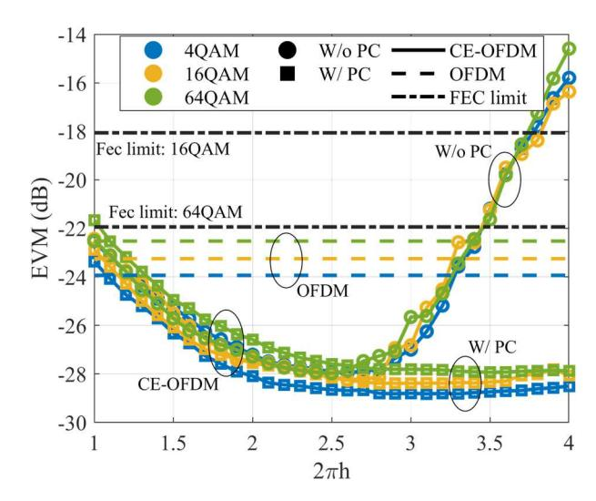

{0}------------------------------------------------

# Modulation Strategies for Robust Optical Wireless Communications and Sensing in 6G

Bruno M.S.R. Rosmaninho Instituto de Telecomunicações and Department of Electrical and Computer Engineering (DEEC), University of Coimbra 3030-290 Coimbra, Portugal bruno.rosmaninho@co.it.pt

Paulo P. Monteiro

 Instituto de Telecomunicações and Department of Electronic, Telecommunications, and Informatics (DETI), University of Aveiro 43810-193, Aveiro, Portugal paulo.monteiro@ua.pt

*Abstract***—Optical Wireless Communications (OWC) is expected to play a significant role in the 6G ecosystem as a complementary technology to RF for indoor, outdoor and space applications. This paper reviews key modulation strategies for OWC that support both robust communication and sensing functionalities. We explore constant envelope OFDM (CE-OFDM), a waveform that mitigates nonlinearities and enhances performance under noise, as well as standard OFDM's potential for supporting joint communication and sensing tasks such as localization and material classification. The synergy between communication and sensing in OWC systems represents a key advancement toward the intelligent, efficient, and multifunctional wireless networks required in 6G.**

*Keywords—Visible Light Communication (VLC), Constant envelope orthogonal frequency division multiplexing (CE-OFDM), Integrated Sensing and Communication (ISAC)* 

## I. INTRODUCTION

The next generation of wireless networks, commonly referred to as 6G, is expected to revolutionize the landscape of telecommunication by enabling ubiquitous connectivity, extreme reliability, ultra-low latency, and integration with sensing and intelligence. Optical Wireless Communication (OWC), which includes free-space communications mainly in visible light (VLC) or infrared free space optics (FSO), is gaining recognition as a complementary technology to traditional radio frequency (RF) communication [1]. OWC offers several advantages, including ultra-large unlicensed bandwidth, immunity to electromagnetic interference, and enhanced physical layer security due to its spatial confinement [2].

However, OWC systems face unique challenges, including sensitivity to ambient light interference, alignment issues, and nonlinearities in light-emitting components such as light-emitting diodes (LEDs) and laser diodes (LDs). To address these issues, advanced modulation techniques are being investigated. Moreover, the push for integration of

This work was partially supported by the European Regional Development Fund (FEDER), through the Regional Operational Programme of Centre (CENTRO 2020) of the Portugal 2020 framework, through project CENTRO-01-0145-FEDER-022141, RETIOT (POCI-01-0145-FEDER-016432, PhD grant UI/BD/152290/2021, Fundação de Amparao à Pesquisa do Rio de Janeiro ((FAPRJ) through projects E-26/200.161/2023 and E-26/211.184/2019) and Brazilian National Council for Scientific and Technological Development (CNPq) through projects 407517/2023-5, 307370/2020-8 and 403784/2023-9.

Vinicius. N.H. Silva Universidade Federal Fluminense, Departament of Telecommunication Enginering 24210-240 Rio de Janeiro, Brazil viniciusnhs@id.uff.br

Maria C.R. Medeiros

Instituto de Telecomunicações and Department of Electrical and Computer Engineering (DEEC), University of Coimbra 3030-290 Coimbra, Portugal cmedeiros@deec.uc.pt

communication and sensing in 6G opens up new possibilities for designing waveforms that serve both purposes [3].

 In VLC systems, OFDM-based modulation schemes such as DC-biased optical OFDM (DCO-OFDM) and asymmetrically clipped optical OFDM (ACO-OFDM) are widely adopted due to their compatibility with intensity modulation and direct detection (IM/DD). However, both suffer from a high peak-to-average power ratio (PAPR). Over the past decade, numerous techniques have been proposed to address this issue. The most common is signal clipping, although more sophisticated approaches, such as active constellation extension [4], which reduces PAPR by adjusting constellation points and DFT spreading [5] have also been explored. Among these solutions, CE-OFDM) has recently attracted attention for its potential to improve power efficiency in wireless communications [6]. This is due not only to its inherent ability to mitigate the high PAPR associated with conventional OFDM systems, but also to its enhanced robustness against system nonlinearities. CE-OFDM has been successfully applied to visible light communication (VLC) systems [7], where it has demonstrated particular effectiveness under low signal-to-noise ratio (SNR) conditions [8].

The dual use of communication signals for both data transmission and environmental sensing is emerging as a key feature in 6G wireless systems. This approach, often referred to as integrated sensing and communication (ISAC), enables devices to extract contextual information, such as position, motion, or occupancy. from the same signals used for communication, reducing hardware complexity and power consumption. While ISAC has been primarily explored in the RF domain, its application to VLC [9,10] systems is gaining traction due to the unique properties of optical carriers. VLC inherently offers high spatial resolution and low interference, making it well-suited for indoor sensing tasks such as gesture recognition, object detection, and user localization. By leveraging the high bandwidth and directionality of optical channels, VLC systems can support high-speed communication while simultaneously enabling fine-grained sensing capabilities. This dual functionality is particularly attractive for smart environments, such as intelligent homes, offices, and factories, where minimizing infrastructure costs and maximizing system intelligence are crucial. Moreover, integrating sensing into VLC may enhance security and context-awareness, enabling adaptive communication strategies. As research progresses, new waveform designs, 

{1}------------------------------------------------

including CE-OFDM and other low-complexity schemes, are being considered to optimize the trade-off between sensing accuracy and communication performance.

In addition to localization, the information embedded in reflected or transmitted optical signals can be used to infer the physical properties of materials. In [11], it was introduced a framework for material classification using features derived from OFDM-based OWC signals. Their setup involved measuring Error Vector Magnitude (EVM) and distance between the laser source and target material, which were then fed into machine learning models to classify objects as glass, plastic, or aluminum.

The remainder of this paper is organized as follows. Section II introduces the fundamental concepts of CE-OFDM and its implementation in VLC systems. Section III presents an experimental performance evaluation, comparing CE-OFDM with conventional OFDM under various modulation indices. Section IV explores the suitability of CE-OFDM for localization, highlighting its potential for ISAC. Finally, Section V concludes the paper and outlines potential directions for future research.

#### II. VLC SYSTEM EMPLOYING CE-OFDM

#### A. VLC CE-OFDM Transmitter

The time continuous CE-OFDM bandpass signal can be written as:

$$s(t) = A\cos(2\pi f_c t + \phi(t)), \tag{1}$$

where A is the signal amplitude,  $f_c$  is the carrier frequency and  $\phi(t)$  is the phase signal which is given by:

$$\phi(t) = 2\pi h x(t),\tag{3}$$

where  $2\pi h$  is the modulation index and x(t) is a real-valued OFDM signal which is normalized between -1 and 1. The bandwidth of the CE-OFDM signal can be expressed by [6]:

$$B_{CE-OFDM} = max(2\pi h, 1) \times B_{OFDM}, \tag{3}$$

which is a root-mean-square (RMS) bandwidth, lower bounded by the bandwidth of the OFDM signal,  $B_{OFDM}$ .

The digital signal processing (DSP) generation of a CE-OFDM signal begins with the modulation of input data symbols using a standard digital modulation scheme, such as QPSK or QAM. These complex-valued symbols are assigned to a set of N subcarriers in the frequency domain. To ensure that the resulting time-domain signal is real-valued after inverse transformation, a Hermitian symmetry is imposed on the subcarrier vector, X.

$$X = [0, X_1, X_2, \cdots, X_N, 0, X_N^*, \cdots, X_2^*, X_1^*]. \tag{4}$$

where (\*), stands for the complex conjugate operation. After, the inverse Fourier transform (IFFT) is performed and the time domain real-valued OFDM sequence is obtained:

$$x_n = \sum_{k=1}^{N} X_k e^{j2\pi kn/N}, \quad n = 1, 2, \dots, N.$$
 (5)

Subsequently, the cyclic prefix (CP) is added and square root-raised cosine shaping filter (SRRC) with up-sample

factor,  $N_{up}$  and roll-off factor  $\beta$  is applied. The amplitude of the filtered signal  $x_m$  is normalized,  $|x_m| \le 1$ , and performs phase modulation on the carrier of frequency  $f_c$ , the resulting discrete CE-OFDM bandpass signal is expressed as;

$$s_m = A\cos\left(2\pi f_c m + 2\pi h x_m\right),\tag{6}$$

In an experimental setup the digital signal is converted to the analog signal, s(t), by an Arbitrary Waveform Generator (AWG), added to a DC current component and used to modulate a LD.

### B. VLC CE-OFDM Receiver

At the receiver, the optical signal is first detected by a photodiode and converted into an electrical signal. This analog waveform, which corresponds to the bandpass signal, given by:

$$s_r(t) = A_r \cos(2\pi f_c t + \phi(t)) + n(t) \tag{7}$$

Where  $A_r$  is the received signal amplitude and n(t) represents additive noise and impairments introduced by the channel.

The first step in the receiver DSP chain is carrier frequency down-conversion, where the received bandpass signal is mixed with a locally generated sinusoidal oscillator at frequency  $f_c$ . This operation shifts the signal to baseband and it can be expressed as:

$$r(t) = A_r \cos(2\pi h x(t)) + n(t), \tag{8}$$

Due to the nonlinearity of the cosine function, recovering from x(t) from r(t) is a nonlinear estimation problem. One effective approach is to implement a phase demodulator implemented by an arc-tangent processor that calculates the signal phase, followed by a phase correction algorithm [8], which compensates for the effect of phase ambiguities and discontinuities introduced during transmission.

# III. VLC CE-OFDM PERFORMANCE ASSESSMENT

Fig. 1 presents the experimental performance evaluation results of the VLC CE-OFDM system, conducted using the same laboratory setup described in [8]. In the experiment, the CE-OFDM signal was generated using 64 QAM-modulated subcarriers occupying 250 MHz bandwidth, the OFDM modulator is followed by Hermitian symmetry enforcement, inverse FFT, cyclic prefix insertion, and SRRC filtering with a roll-off factor  $\beta$ =0.1 and an up-sampling factor of  $N_{up}$  = 10. The resulting constant-envelope signal was generated by phase modulating a 300 MHz carrier and subsequently transmitted through a 2-meter free-space optical link using a directly modulated laser diode (Thorlabs L638P040). The light was collimated and focused at the receiver side, where it was detected using an avalanche photodiode with integrated amplification. The received signal was digitized at 25 GSa/s and processed by a custom DSP chain implementing decimation, synchronization, digital filtering, phase demodulation and correction. The peak-to-peak amplitude of both the OFDM and CE-OFDM signals was kept at 1.8 V at the AWG. Performance was quantified in terms of the error vector magnitude (EVM) averaged over multiple transmission bursts.

{2}------------------------------------------------

**Fig. 1** Measured EVM as a function of modulation index for OFDM and CE-OFDM signals.

As illustrated in Fig.1, the EVM performance of CE-OFDM was assessed as a function of the modulation index for three modulation orders: 4QAM, 16QAM, and 64QAM. The results clearly show that CE-OFDM achieves superior performance compared to conventional OFDM, particularly at moderate modulation indices where the EVM reaches its minimum. This behavior is attributed to the constant-envelope nature of the CE-OFDM waveform, which makes it more robust against the nonlinear distortions introduced by the directly modulated LD.

Moreover, the results reveal a trade-off between modulation index and system performance. At low modulation indices, the CE-OFDM signal exhibits higher sensitivity to noise, resulting in increased EVM. As the modulation index increases, the signal becomes more resilient to noise, and the EVM improves until a critical point beyond which phase ambiguities, known as cycle slips, begin to dominate. To address this limitation, the phase correction (PC) algorithm proposed in [8] was introduced and experimentally validated. The dashed curves in Fig. 1 show the effect of applying the PC algorithm, which significantly reduces the EVM across all modulation orders, particularly at high modulation indices where the uncorrected system would otherwise suffer from cycle slip-induced degradation. Fig. 2 presents the power spectral density (PSD) of CE-OFDM

**Fig. 2** Simulated CE-OFDM spectra for different modulation indices.

signals centered at 300 MHz, evaluated for different modulation indices. A consistent feature across all curves is the spectral line at the carrier frequency (300 MHz), which is a characteristic of CE-OFDM due to its constant-envelope phase modulation structure. This line corresponds to the residual carrier component and remains dominant regardless of the modulation index.

As the modulation index increases, the energy distribution across the spectrum becomes broader and more uniform. For low modulation indices (e.g., 2ℎ = 1), a significant portion of the signal power is concentrated around the carrier, resulting in a narrower bandwidth. This implies a less effective spreading of the OFDM subcarriers, which may degrade system performance in frequency-selective channels. Conversely, at higher modulation indices (e.g., 2ℎ = 4), the signal spectrum becomes broader and more evenly distributed around the carrier. This is a result of increased phase variation, which reduces the dominance of the carrier component and distributes power across more frequencies. However, this broader spectrum implies a trade-off, while the signal may become more robust to certain impairments (e.g., fading or nonlinearity), it does so at the cost of increased bandwidth, reducing spectral efficiency. The signal exhibits a flatter and more evenly distributed spectrum, indicating improved subcarrier orthogonality and better spectral shaping. The broader spectrum enhances robustness to system impairments and facilitates better separation of subcarriers at the receiver, collectively leading to improved system performance.

## IV. ON THE SUITABILITY OF CE-OFDM FOR LOCALIZATION IN VLC SYSTEMS

CE-OFDM can serve as a strong candidate waveform for VLC in future 6G systems, especially where dualfunctionality for communication and localization is desired. CE-OFDM combines the spectral efficiency and subcarrierbased structure of conventional OFDM with the hardware compatibility of constant-envelope transmission, which is particularly advantageous for nonlinear optical devices like LEDs and laser diodes. Unlike standard OFDM, CE-OFDM modulates information in the phase domain, producing a constant-envelope signal that enables efficient transmission through power-limited or nonlinear channels without distortion. This feature directly benefits VLC systems, where nonlinear optical front-ends often limit the performance of amplitude-varying signals.

Furthermore, recent research has shown that CE-OFDM signals possess favorable ambiguity function (AF) properties that are traditionally desired in radar and localization systems. In [12] it was demonstrated that CE-OFDM with PSK symbol encoding exhibits a "thumbtack-like" ambiguity function, characterized by high resolution in both range and Doppler, due to its wide RMS bandwidth and low range-Doppler coupling. These properties are essential for accurate time-offlight (ToF) or phase-based localization, both of which are relevant in VLC-based positioning. In addition, in [13] it was shown that CE-OFDM naturally produces spectrally shaped, random frequency modulated (FM) waveforms without requiring real-time optimization, making it computationally efficient. Their experimental results confirm that CE-OFDM waveforms can achieve low sidelobe levels and exhibit high diversity across multiple pulses, which is beneficial for localization in dynamic indoor environments. Taken together, these properties, constant envelope, low sidelobes, favorable AF structure, and spectral flexibility, make CE-OFDM 

{3}------------------------------------------------

potentially efficient waveform for joint communication and localization in VLC. This aligns well with 6G objectives, where energy efficiency, spectrum coexistence, and ISAC are key priorities.

## V. CONCLUSION

In summary, CE-OFDM emerges as a compelling waveform for VLC systems in 6G, offering advantages in both communication robustness and potential for localization. Its constant-envelope nature ensures compatibility with nonlinear optical front-ends, while its favorable ambiguity function properties support high-resolution sensing. These attributes make CE-OFDM a strong candidate for integrated communication and sensing tasks in future optical wireless networks.

## REFERENCES

- [1] C.-X. Wang et al., "On the road to 6G: Visions, requirements, key technologies, and testbeds," IEEE Commun. Surveys Tuts., vol. 25, no. 2, pp. 905–974, 2nd Quart. 2023. doi: 10.1109/COMST.2023.3249835.
- [2] L. E. M. Matheus, A. B. Vieira, L. F. M. Vieira, M. A. M. Vieira and O. Gnawali, "Visible Light Communication: Concepts, Applications and Challenges," in IEEE Communications Surveys & Tutorials, vol. 21, no. 4, pp. 3204-3237, Fourthquarter 2019, doi: 10.1109/COMST.2019.2913348.
- [3] A. Liu et al., "A Survey on Fundamental Limits of Integrated Sensing and Communication," in IEEE Communications Surveys & Tutorials, vol. 24, no. 2, pp. 994-1034, Secondquarter 2022, doi: 10.1109/COMST.2022.3149272.
- [4] W. -L. Lin and F. -S. Tseng, "Theory and Applications of Active Constellation Extension," in IEEE Access, vol. 9, pp. 93111-93118, 2021, doi: 10.1109/ACCESS.2021.3093103.
- [5] Cheng, J. Zhang, J. Zhang, M. Xiao, R. Deng and L. Chen, "DFT-Spread Combined with Clipping Method to Reduce the PAPR in VLC-

- OFDM System," 2017 4th International Conference on Information Science and Control Engineering (ICISCE), Changsha, China, 2017, pp. 1462-1466, doi: 10.1109/ICISCE.2017.305.
- [6] S. C. Thompson,et al,, "Constant Envelope OFDM," IEEE Transactions on Communications, vol. 56, no. 8, pp. 1300-1312, August 2008, doi: 10.1109/TCOMM.2008.070043.
- [7] H. Camporez et al, "Increasing the reach of visible light communication links through constant-envelope OFDM signal," Optics Communications, vol. 530, March 2023, doi:10.1016/j.optcom.2022.129179.
- [8] B. M. S. R. Rosmaninho, V. N. H. Silva, P. P. Monteiro and M. C. R. Medeiros, "Enhancing Noise Resilience of CE-OFDM in Visible Light Communication Systems," in IEEE Photonics Technology Letters, doi: 10.1109/LPT.2025.3577779
- [9] E. B. Muller, V. N. H. Silva, P. P. Monteiro and M. C. R. Medeiros, "Joint Optical Wireless Communication and Localization Using OFDM," in IEEE Photonics Technology Letters, vol. 34, no. 14, pp. 757-760, 15 July15, 2022, doi: 10.1109/LPT.2022.3186734.
- [10] S. Chen, C. Chen, Z. Zeng, Y. Yang and H. Haas, "Full-Duplex RO-ISAC System: Wavelength Division Duplexing and Hybrid Waveform Design," in IEEE Photonics Technology Letters, vol. 37, no. 15, pp. 869-872, 1 Aug.1, 2025, doi: 10.1109/LPT.2025.3570997.
- [11] A. Duarte, A. Lima, M. Tcheou, M. Medeiros, V. Silva and F. Henriques, "Material Classification Using Optical Wireless Communications Data and Machine Learning," 2025 IEEE 16th Latin America Symposium on Circuits and Systems (LASCAS), Bento Gonçalves, Brazil, 2025, pp. 1-5, doi: 10.1109/LASCAS64004.2025.10966357.
- [12] D. G. Felton and D. A. Hague, "Characterizing the Ambiguity Function of Constant-Envelope OFDM Waveforms," 2023 IEEE Radar Conference (RadarConf23), San Antonio, TX, USA, 2023, pp. 1-6, doi: 10.1109/RadarConf2351548.2023.10149678.
- [13] E. R. Biehl, C. A. Mohr, B. Ravenscroft and S. D. Blunt, "Assessment of Constant Envelope OFDM as a Class of Random FM Radar Waveforms," 2020 IEEE Radar Conference (RadarConf20), Florence, Italy, 2020, pp. 1-6, doi: 10.1109/RadarConf2043947.2020.9266427.

**.**