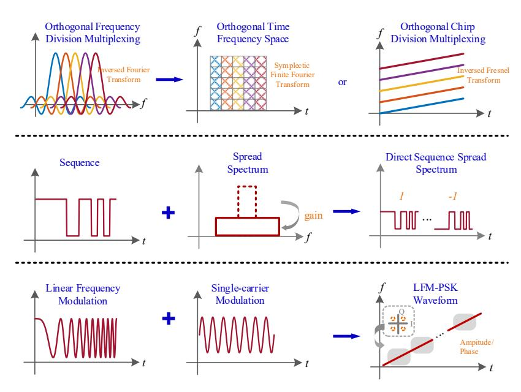
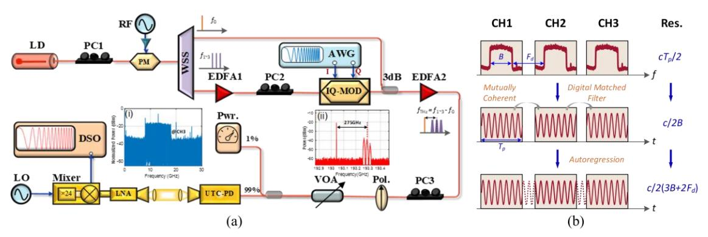

{0}------------------------------------------------

# **Photonic Terahertz Integrated Sensing and Communication (ISAC) Systems**

**Lu Zhang1,\* , Zhidong Lyu1,4 , Oskars Ozolins2,3,4, Xiaodan Pang1,2,3 , Xianbin Yu1**

*1College of Information Science and Electronic Engineering, Zhejiang University, Hangzhou 310027, China Institute of Photonics, Electronics and Telecommunications, Riga Technical University, 1048 Riga, Latvia 3RISE Research Institutes of Sweden, 164 40 Kista, Sweden 4Applied Physics Department, KTH Royal Institute of Technology, 106 91 Stockholm, Sweden Author e-mail address: zhanglu1993@zju.edu.cn*

**Abstract:** This paper explores the role of photonic terahertz technologies in integrated sensing and communication systems, focusing on integrated waveform design, optical processing, and algorithms to enhance communication capabilities and sensing performance. © 2025 The Author(s)

### **1. Introduction**

The growing complexity of the electromagnetic environment has heightened the need for reliable connectivity in wireless networks, leading to increased interest in integrated sensing and communication (ISAC) technologies [1]. Recent advancements in photonic integrated circuits and digital signal processing (DSP) have been pivotal in expanding the deployment of wireless communication and sensing across a diverse array of hardware platforms. Operating in the terahertz (THz) range (0.1-10 THz) offers significant advantages due to its broad spectrum, which meets the high-capacity communication and precise sensing requirements of ISAC applications [2]. Progress in THz communication and sensing has achieved communication rates exceeding 100 Gbps and radar sensing with millimeter-level resolution [3]. Photonics-based THz solutions are particularly advantageous, as they utilize the unique properties of broadband photonic devices, providing substantial bandwidth while minimizing susceptibility to electromagnetic interference [4]. The integration of photonic technologies into THz systems greatly enhances ISAC capabilities. By linking THz wireless connections with fiber-optic networks, these systems achieve greatly improved communication and sensing performance [5-11]. The benefits of photonic devices and advanced signal processing are crucial for the effective deployment of ISAC applications.

Despite the development of various THz-ISAC systems utilizing multi-dimensional multiplexing, challenges remain, including high hardware costs and a lack of additional integration gains [5-6]. These issues limit the synergy between communication and sensing, underscoring the need for new waveform and system design research that optimally aligns time and frequency resources to enhance ISAC system performance [12]. This paper overviews the vital role of photonic THz technologies in ISAC systems, with a focus on key areas such as integrated waveform design, optical coherent fusion processing for THz ISAC systems, and the development of algorithms and system designs that use photonic THz sensing to enhance communication capabilities.

### **2. Photonic THz ISAC Waveform Design**

The photonic THz-ISAC system needs to effectively balance target sensing and information transmission, each imposing distinct requirements on waveform modulation, transmission power, and bandwidth. Consequently, waveform design must integrate these considerations. Communication waveforms can be classified into singlecarrier and multi-carrier types. Multi-carrier waveforms, such as orthogonal frequency division multiplexing (OFDM), are prevalent in current wireless communication and sensing systems due to their design flexibility and ability to suppress frequency-selective fading [7]. In high-frequency millimeter-wave and terahertz systems, however, single-carrier waveforms emerge as more promising options [8]. The high directivity of terahertz antennas limits multipath effects, increasing coherent bandwidth and reducing frequency selectivity. Additionally, singlecarrier waveforms offer a lower peak-to-average power ratio compared to their multi-carrier counterparts, which mitigates power backoff effects in amplifiers. This is vital for improving average transmission power and overall efficiency in power-constrained photonic terahertz systems.

We have proposed a radar-centric waveform that combines linear frequency modulation (LFM) with phase shift keying (PSK) [8], i.e. LFM-PSK waveform. Through theoretical analysis, we derive key sensing metrics for the LFM-PSK waveform, including range resolution, peak sidelobe ratio (PSLR), and Cramér-Rao lower bound (CRLB). Our theoretical findings are supported by a proof-of-concept experiment, where we achieve a PSLR of 20.9 dB and a range resolution of 1.3 cm, along with a data transmission rate of 6 Gbit/s over a 1-meter wireless link. We also experimentally confirm a ~6 dB PSLR improvement associated with the increased data rate, without compromising range resolution.

{1}------------------------------------------------

Fig. 1 Principles of typical ISAC waveform implementation.

#### 3. Photonic THz Coherent Fusion ISAC System

Photonic terahertz ISAC systems use integrated waveforms to enhance resource efficiency and overall performance, surpassing that of conventional waveforms. Despite these advancements, current ISAC demonstrations still underperform compared to separate, dedicated communication or sensing systems [9]. To address this gap, a multichannel photonic THz-ISAC system has been developed that combines integrated LFM with quadrature amplitude modulation (QAM) waveforms, as well as optical wavelength division multiplexing (WDM) techniques [9]. As shown in Fig. 2, the system uses the optical frequency comb's coherence (Fig. 2a) and applies a coherent fusion sensing algorithm (Fig. 2b), enabling simultaneous achievements of a high communication data rate, up to 120 Gbit/s, along with precise range resolution down to 2.5 mm.

Fig. 2 Schematic of the proposed multi-channel coherent fusion ISAC system architecture.

#### 4. Photonic THz Sensing enhanced Communications

Recent photonic THz-ISAC prototypes have achieved timing resolution at the nanosecond level and positioning resolution on a millimeter scale, highlighting their potential to enhance communication performance without the need for separate sensing devices. Using the proposed LFM-PSK waveform depicted in Fig. 1, a complementary LFM sensing signal—featuring an opposite chirp slope and fractional amplitude—is periodically inserted to compensate for communication performance, as shown in Fig. 3a [10]. Theoretical analysis confirms that this LFM pair exhibits quasi-orthogonality, which enables adaptive synchronization in both time and frequency domains. Through matched filtering and the fractional Fourier transform (FrFT), time and frequency synchronization (in Fig. 3b) have been achieved in a 20 Gbit/s wireless link with a minimal synchronization overhead of only 0.5% [10-11]. Additionally, this concurrent sensing signal can support multipath channel estimation using a frequency-domain

{2}------------------------------------------------

equalizer with sparse coefficients. Experimental results, shown in Fig. 3c, demonstrate that after frequency-domain processing, the system can effectively compensate for the frequency-selective effects of a 20-meter wireless channel, achieving ~ 8 dB compensation gain.

Fig. 3 Experimental results of photonic THz sensing-enhanced communications on (a) time-synchronization, (b) frequency-synchronization, and (c) multipath channel compensation.

### **5. Conclusions**

This paper presents advancements in photonic THz-ISAC systems, emphasizing integrated waveform design, coherent fusion processing, and communication enhancements through sensing. The demonstrations highlight the exceptional performance achievable with THz photonics, underscoring its potential for ISAC applications.

## **Acknowledgments**

This work is supported by the National Key Research and Development Program of China (2022YFB2903800), the "Pioneer" and "Leading Goose" Research and Development Program of Zhejiang (2023C01139), the China Scholarship Council (202406320060), the Sweden's Innovation Agency (VINNOVA) funded project (2024-02451), and the strategic innovation program Smarter Electronic Systems - a joint venture by Vinnova, Formas and the Swedish Energy Agency A-FRONTAHUL project (2023-00659).

### **References**

- [1] F. Liu et al., "Seventy years of radar and communications: The road from separation to integration," IEEE Signal Process. Mag. **40**, 106-121 (2023).
- [2] Z. Liu et al., "Closed-form model for performance analysis of THz joint radar-communication systems," IEEE Trans. Wireless Commun. **22**, 8694-8706 (2023).
- [3] X. Yu et al., "Photonic-wireless communication and sensing in the terahertz band," in Proc. OFC 2023, Paper W4J.1.
- [4] T. Nagatsuma et al., "Advances in terahertz communications accelerated by photonics," Nat. Photon. **10**, 371-379 (2016).
- [5] M. Lei et al., "Integration of sensing and communication in a W-band fiber-wireless link enabled by electromagnetic polarization multiplexing," J. Lightw. Technol. **41**, 7128-7138 (2023).
- [6] B. Dong et al., "Photonic-based W-band integrated sensing and communication system with flexible time-frequency division multiplexed waveforms for fiber-wireless network," J. Lightw. Technol. **42**, 1281-1295 (2024).
- [7] L. Li et al., "THz-over-fiber system with orthogonal chirp division multiplexing for integrated sensing and communication," J. Lightw. Technol. **42**, 176-183 (2024).
- [8] Z. Lyu et al., "Radar-centric photonic terahertz integrated sensing and communication system based on LFM-PSK waveform," IEEE Trans. Microw. Theory Techn. **71**, 5019-5027 (2023).
- [9] Z. Lyu et al., "Multi-channel photonic THz-ISAC system based on integrated LFM-QAM waveform," J. Lightw. Technol. **42**, 3981-3988 (2024).
- [10] Z. Lyu et al., "Preamble-free synchronization based on dual-chirp waveforms for photonic THz-ISAC," J. Lightw. Technol. **42**, 2657-2665 (2024).
- [11] Z. Lyu et al., "Dual-chirp-based photonic THz-ISAC system with adaptive frequency synchronization," Opt. Lett. **49**, 4493-4496 (2024).
- [12] Y. Xiong et al., "On the fundamental tradeoff of integrated sensing and communications under Gaussian channels," IEEE Trans. Inf. Theory **69**, 5723-5751 (2023).