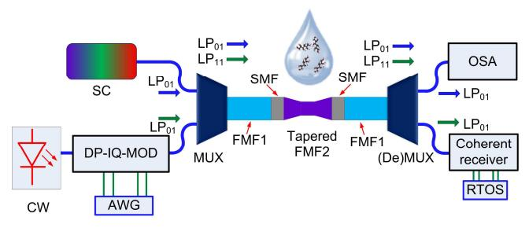
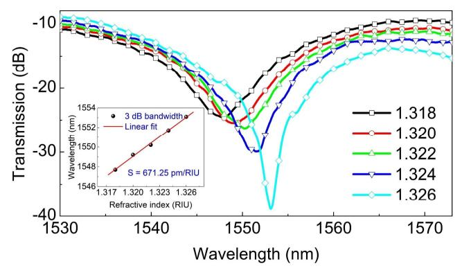
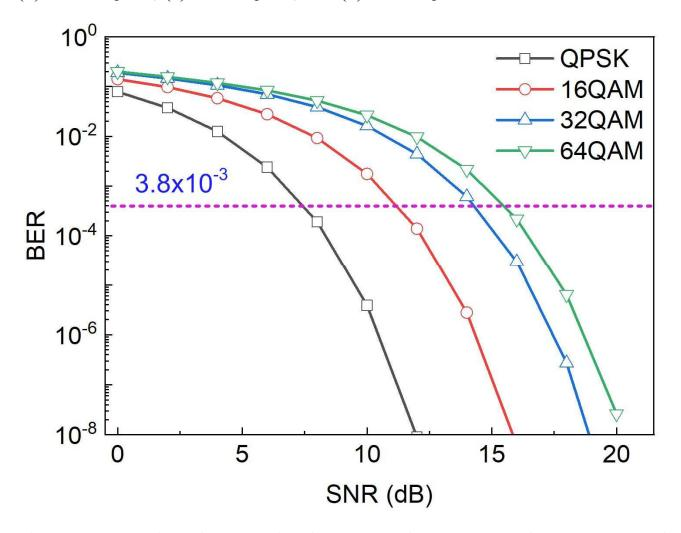

{0}------------------------------------------------

# Adiabatic-tapered few-mode-fiber-based system for integrating optical fiber sensing and telecommunication

*Quandong Huang1,2,3,\* Yahao Li, 1,2,3 Ou Xu, 1,2,3 Xinyong Dong, 1,2,3 Sławomir Ertman,4 Tomasz R. Woliński,4 Perry Ping Shum,5 and Yuwen Qin1,2,3*

4Warsaw University of Technology, Warsaw, Poland

*Abstract*—**We demonstrated an adiabatic-tapered fewmode-fiber-based system for integrating sensing and telecommunication, where the system shows a salinity sensitivity of 0.1 nm/**‰ **and transmission rate of 128 Gbit/s via QPSK, 16QAM, 32QAM and 64QAM modulation.** 

Keywords—*Optical fiber sensor; Telecommunication; Adiabatic-tapered fiber* 

## I. INTRODUCTION

Optical fiber sensing and signal transmission play an important role in the development of optical communication. During the past decades, optical fiber sensors have been widely used in many areas due to their excellent performance and capability in complex environments, i.e., the applications of optical fiber sensors in the areas of refractive index detecting [1], magnetic field measurement [2], temperature [3] and displacement monitoring [4], etc. In the meantime, telecommunication is based on the foundation of an optical fiber system via data transmission, and with the help of mode multiplexing and (de) multiplexing technology [5, 6], the transmission capacity can reach the petabit/s level [7]. However, the above-reported arts are independent systems that only process the sensing signal or the telecommunication signal, the further development of optical communication systems should mix them. The telecommunication system serves as the operations and the sensing system serves as the observations; thus, the mixture of the optical fiber sensing system and the optical telecommunication system will be the future developing trend. In this paper, we propose a concept to mix the optical fiber sensing system and the optical fiberbased telecommunication system as a demonstration. The integration of optical fiber sensing and telecommunication uses the same optical fiber infrastructure to perform both data transmission and sensing functions simultaneously, and the dual-use approach can improve cost efficiency and enable smart monitoring in telecommunication networks.

## II. PRINCIPLE AND DESIGN

Diagram of the proposed system is shown in Fig. 1, which composes two setups including the optical fiber sensing system and the optical telecommunication system. For the optical fiber sensing system, the setup is formed by a supercontinuum (SC) laser light source, a multiplexer (MUX) and a demultiplexer ((De)MUX), two types of few-mode fiber (FMF), and an optical spectrum analyzer (OSA). In the design, the sensing head is formed by single-mode fiber (SMF) and FMF2, and the interference dips are generated by the modal interference of the LP01 mode and the LP02 mode. Here, the LP02 mode is excited by the mode field of the SMF and the FMF2. For the optical fiber-based telecommunication transmission system, continuum wave (CW) laser source, dual-polarization (DP) IQ Modulator (DP-IQ-MOD), and arbitrary waveform generator (AWG) are applied to generate serial signals for serial communication. Mode multiplexer and (de)multiplexer are applied to multiplex and (de)multiplex the LP01 mode and the LP11 mode in the FMF. In the output, a coherent receiver and real-time operation system are utilized to process the transmitted signal. For the LP01 mode, the transmission loss can be negligible because it is used for the sensing application. However, the loss of the LP11 mode should be well controlled because it serves to transmit the communication signal. The adiabatic-tapered FMF2 is carefully designed, on one hand, to enhance to sensitivity of the sensing head, and on another hand to minimize to radiation loss of the LP11 mode. One typical design is shown in Fig. 2, where the inserted picture is the tapered FMF2. By launching the LP11 mode in the adiabatic-tapered FMF2, the transmission loss of the LP11 mode can be measured by detecting the output power. We characterize the propagation of the LP11 mode through the taper against different fiber core diameters during the tapering process, and transmission loss of the LP11 mode across the C-band is obtained to be lower than −0.8 dB with a core diameter of 40 μm.

Fig. 1. Diagram of the proposed system for integrated optical sensing and signal transmission.

979-8-3315-4875-9/25/\$31.00 ©2025 IEEE

1Institute of Advanced Photonics Technology, School of Information Engineering, Guangdong University of Technology, Guangzhou, China

2Key Laboratory of Photonic Technology for Integrated Sensing and Communication, Ministry of Education of China, Guangdong University of Technology, Guangzhou, China

3Guangdong Provincial Key Laboratory of Information Photonics Technology, Guangdong University of Technology, Guangzhou, China

5Department of Electrical and Electronic Engineering, Southern University of Science and Technology, Shenzhen, China \* E-mail: qdhuang@gdut.edu.cn

{1}------------------------------------------------

Fig. 2. Transmission loss of the adiabatic-tapered taper for the LP11 mode in the C-band, where the inserted photo is the tapered taper in the sensing area and the sensing area induces the loss of the LP11 mode.

## III. RESULTS AND DISCUSSIONS

To test the sensitivity of the sensor, we characterize the device both in simulation and experiment. In the simulation, the adiabatic-tapered FMF2 is applied in the seawater salinity monitoring by changing the ambient refractive index. As shown in Fig. 3, the interference dips show a red shift with the ambient refractive index increases. The sensitivity is obtained to be 681.23 pm/RIU by linear fitting the 3 dB width of the interference dips. We also study the temperature sensitivity of the fiber sensor by calculating the thermos-optic effect of the FMF2, where the temperature sensitivity of the fiber sensor is only 13.20 pm/℃.

Fig. 3. Simulated sensitivity of fiber sensors against the ambient refractive index.

Fig. 4. Experimentally measured the sensitivity of fiber sensors against the ambient refractive index.

To demonstrate the idea, we design and fabricate the adiabatic-tapered FMF2 via a laser fusion splicing system (Fujikura LZM-100). In the experiment, we use the fabricated adiabatic-tapered FMF2 via a laser fusion splicing system to monitor the seawater salinity change. In the experiment, the refractive index of the seawater is selected ranging from 1.318 to 1.326 with a step of 0.002. The experimental is shown in Fig. 4, where sensitivity is obtained to be 671.25 pm/RIU and the temperature sensitivity is only 13.16 pm/℃. As a result, the device shows a salinity sensitivity of 0.1 nm/‰ at the wavelength of 1550 nm for the seawater monitoring.

Fig. 5. Received constellation map with the SNR set at 30 dB for (a) the QPSK, (b) the 16 QAM, (c) the 32QAM, and (d) the 64QAM modulation format.

Fig. 6. BER against the SNR for the QPSK, the 16 QAM, the 32QAM, and the 64QAM modulation format.

In the meanwhile, the device also serves the function of telecommunications. The QPSK, 16QAM, 32QAM, and 64QAM modulation formats are applied for the testing of the proposed system that can support the transmission of high transmission rate signals. A transmission rate of 128 Gbit/s by using QPSK, 16QAM, 32QAM, and 64QAM modulating is studied via VPI photonics serve and MATLAB. A 3 kHz narrow bandwidth light source and 80 km long SMF with 

{2}------------------------------------------------

dispersion of 20 ps/km.nm are applied for the study. Erbiumdoped fiber Amplifiers (EDFA) and dispersion fiber are also utilized in the system to ensure the gain and compensate for the dispersion of SMF. As shown in Fig. 5, the received constellation map by using QPSK, 16QAM, 32QAM, and 64QAM modulating with the SNR set at 30 dB is obtained. The bit error rate (BER) against the signal-to-noise ratio (SNR) is shown in Fig. 6. With the hard decision set at 3.8 × 10 , the higher the modulation format is used, the larger SNR is required. Thus, the limitation of the proposed system is based on the insertion loss of the LP11 mode in FMF2. As shown in Fig.6, we can see that the required SNR is only 7 dB to transmit a 128 Gbit/s signal by using QPSK modulation format, but the required SNR research 16 dB by using 64QAM modulation format. The transmission rate depends on the actual applications.

### IV. CONCLUSION

In conclusion, we propose an adiabatic-tapered few-modefiber-based system for integrating sensing and telecommunication functions in a long-haul FMF, which can effectively integrate the existing infrastructure of fiber optical systems and telecommunication systems. The integration of optical fiber sensing and telecommunication transforms passive fiber networks into intelligent, self-monitoring systems, where the applications include smart cities, defense, and healthcare, with ongoing advancements in artificial intelligence and distributed sensing enhancing performance.

## ACKNOWLEDGMENT

This work is supported by the National Natural Science Foundation of China (Grant No. 62361136584), and by the National Science Centre, Poland under the Chinese-Polish SHENG 3 Grant No. 2023/48/Q/ST7/00242.

## REFERENCES

- [1] B. Jin, D. N. Wang, B. Xu, L. Chen, K. Yang, "Optical fiber inline Mach-Zehnder interferometer based on down-up tapers for refractive index measurement," Optical Fiber Technology 80, 103427, 2023.
- [2] S. Zhang, X. Li, Y. Liu, W. Chen, H. Niu, Q. Yan, "A MMF-TSMF-MMF Structure Coated Magnetic Fluid for Magnetic Field Measurement," IEEE Photonics Technol. Lett., 33(19), 1105–1108, 2021.
- [3] J. Ma, S. Wu, H. Cheng, X. Yang, S. Wang, and P. Lu, " Sensitivity-enhanced temperature sensor based on encapsulated S-taper fiber Modal interferometer," Opt. Laser Technol., vol. 139, p. 106933, Jul. 2021.
- [4] L. Guillen-Ruiz, G. Anzueto-Sanchez, A. Martínez-Rios, J. Camas-Anzueto, R. E. Nuñez-Gomez, and J. A. Martin-Vela, " Demonstration of Improving the Performance of a Fibre Optic Displacement Sensor Using the Optical Harmonic Vernier Effect by Cascading Tapered Optical Single-Mode Fibres," IEEE Photonics J. 15(5), 1–9, 2023.
- [5] Q. Huang, J. Zhang, L. Zhong, Z. Zheng, J. Li, and O. Xu, "Three-dimensional mode multiplexer based on adiabatictapered waveguides forming vertical directional couplers over C + L band and beyond," Optics Letters 48 (4), 1044-1047, 2023.
- [6] Q. Huang, J. He, Z. Zheng, and X. Zhou, "Ultra-Broadband and Low-Modal-Crosstalk Mode Multiplexer Based on Cascaded Vertical Directional Couplers Formed by Adiabatic-Tapered Waveguides Without Mode Conversion," Journal of Lightwave Technology 42(5), 1566-1572, 2024.
- [7] M. van den Hout et al., "Reaching the pinnacle of high-capacity optical transmission using a standard cladding diameter coupled-core multi-core fiber," Nat. Commun. 16(1), 3833, 2025.