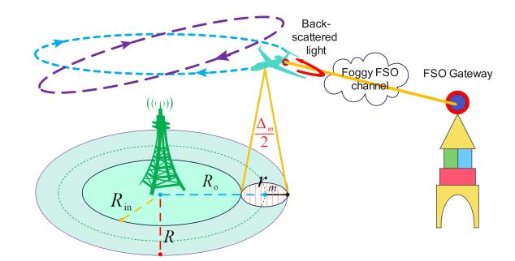
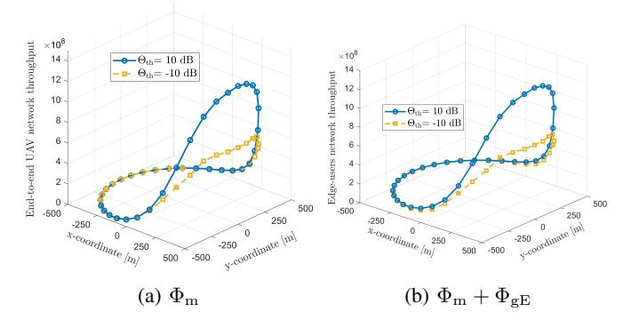
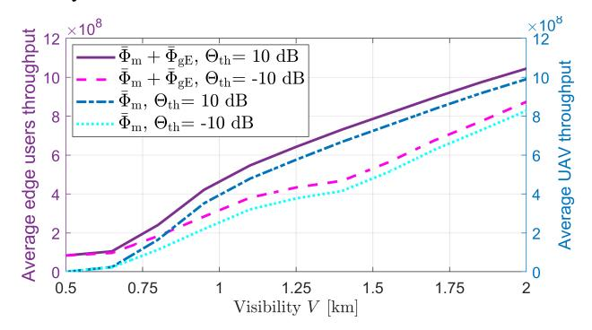

{0}------------------------------------------------

# Integrated Sensing and Communication for UAV Trajectory Optimization in Mixed FSO-RF Networks in Dynamic Weather Conditions

Muhammad Nafees, Mohammadamin Baniasadi, James R. Hopgood, Majid Safari and John S. Thompson School of Engineering, Institute for Imaging, Data and Communications, The University of Edinburgh, UK Email: {m.nafees, amin.baniasadi, james.hopgood, majid.safari, john.thompson}@ed.ac.uk

*Abstract*—Integrated sensing and communication (ISAC) is expected to transform data transmission and real-time sensing, enhancing sixth-generation (6G) networks. Free-space optical (FSO) communication is a key 6G backhaul solution, complementing radio frequency (RF) technologies like millimeter wave (mmWave) for improved network reliability. However, adverse weather can significantly reduce FSO link reliability due to atmospheric attenuation. Such adverse weather conditions also increase the level of back-scattered light, potentially enabling the real-time sensing of the atmospheric channel gain at the transmitter side. Therefore, this paper proposes a novel optical ISAC (O-ISAC) framework, where the back-scattered light from the FSO communication signal is used as the sensing feedback signal. This O-ISAC framework is analyzed considering a single-cell network aided by an unmanned aerial vehicle (UAV) to support edge users. The UAV is connected to the gateway via a FSO backhaul link while estimating the FSO channel gain based on the backscattered light and dynamically optimizing its trajectory. The aim of this adaptive O-ISAC system is to maximize the end-toend network throughput of the edge users while considering FSO backhaul capacity and the UAV's directional antenna beamwidth and bandwidth allocation. Numerical results demonstrate that UAV can effectively optimize its trajectory by adjusting the antenna beamwidth and downlink bandwidth allocation at different weather conditions. The proposed framework is tested using hourly visibility data from Edinburgh, demonstrating that optical channel sensing is crucial for the system's overall performance.

*Index Terms*—Optical integrated sensing and communication (O-ISAC), Sixth-generation (6G), unmanned aerial vehicles (UAVs), free-space optical (FSO), millimeter wave (mmWave).

### I. INTRODUCTION

Sixth-generation (6G) wireless networks are expected to significantly enhance data speeds and quality-of-service (QoS) by resolving the limitations present in current networks. These advancements aim to offer unprecedented connectivity and performance, enabling new applications and services that require ultra-reliable and high-capacity communication. Optical integrated sensing and communication (O-ISAC) technologies in 6G are expected to further revolutionize network performance by enabling simultaneous data transmission and sensing capability [1]. Additionally, free-space optical (FSO) communication is predicted to play a crucial role in 6G backhauling, providing high-capacity, low-latency links that complement traditional radio frequency (RF) systems [2]. Due to their simple deployment, quick setup, and low maintenance costs, FSO links are a promising alternative to traditional fiber optics for backhaul connectivity. However, FSO links experience atmospheric losses due to fog and scintillation. In bidirectional transmission, the impact of light backscattering on the FSO transceiver is frequently neglected.

The integration of FSO technology with unmanned aerial vehicles (UAVs) significantly enhances connectivity by enabling flexible and high-capacity communication links, particularly in challenging environments [3]. Various studies have demonstrated that UAV-to-everything (U2X) connections can be effectively achieved using FSO beams [4]. However, a critical challenge remains in optimizing UAV positioning within wireless networks. The UAV placement may be optimized by incorporating real-time sensing technologies by potentially leveraging the feedback signal generated from the light backscattered to the FSO transmitters. Given the growing demand for FSO links, it is crucial to recognize that not all FSO links can be feasibly paired with parallel RF transmission links, and vice versa. In fact, mixed FSO-RF relaying using UAVs is often seen as a versatile solution for enhancing communication networks, as it leverages the high-speed capabilities of FSO in the backhaul while ensuring reliability with RF links in the access link.

Driven by the increasing demand for UAVs as relays, the rise in FSO backhauling, and advancements in optical sensing, this study examines optimizing UAV trajectories, considering the impact of FSO channel sensing on the onboard FSO transceiver. We introduce an O-ISAC framework to boost network capacity by deploying an aerial base station (BS) on a UAV with an FSO backhaul, which supports an existing ground BS (GBS). The GBS operates in the millimeter wave (mmWave) spectrum to serve all users, while the UAV uses part of the mmWave band to enhance edge-user performance and FSO for high-speed backhaul. Focusing on edgeuser performance, we optimize the UAV's trajectory through a backhaul-aware approach in both favorable and adverse weather. The UAV's trajectory is dynamically optimized based on weather changes, where the backscattered light (e.g., from haze, fog, etc.) is used as a sensing feedback signal to establish an O-ISAC framework. The problem involves maximizing the edge users' sum rate by jointly optimizing the UAV's directional antenna beamwidth and bandwidth allocation under backhaul capacity constraints. We utilize the powerful Qlearning technique to efficiently address this problem. Our key contributions include:

{1}------------------------------------------------

- This study introduces a novel O-ISAC framework designed to optimize the FSO backhaul-aware trajectory of a UAV supporting the GBS, aiming to enhance edgeuser capacity. It optimizes the UAV's directional antenna beamwidth and bandwidth allocation to achieve optimal end-to-end performance, effectively addressing challenges such as weather attenuation.
- The study examines how the light back-scattered from the onboard FSO transceiver signal in adverse weather can be used to optimize the parameters of the UAV's RF downlink, thereby influencing the system's overall endto-end performance.
- Extensive numerical results show that the UAV's circular trajectory is significantly influenced by the reliability of its FSO backhaul and the quality of the sensing feedback channel. The UAV dynamically adjusts its trajectory parameters, especially during adverse weather conditions, to maintain optimal performance.

The rest of this paper is organized as follows: The system model of the proposed O-ISAC UAV-aided mixed FSO-RF network is presented in Section II. The trajectory optimization for achieving optimal end-to-end performance is detailed in Section III. Some numerical results are presented and discussed in Section IV. Finally, conclusions are given in Section V.

#### II. SYSTEM MODEL

This paper considers a wireless network with a single GBS at the center of a cell of radius R, where K users are uniformly and randomly distributed within the cell. As shown in Fig. 1, the GBS serves all users via the millimeterwave (mmWave) band, while a fixed-wing UAV, acting as an aerial BS, enhances performance for edge users located beyond radius  $R_{\rm in}$ . The UAV, equipped with an FSO backhaul to a nearby gateway G, follows a circular trajectory [5], [6]. It flies in cycles with constant flight time T, divided into N equal time slots with the assumption that the UAV's position remains approximately constant within each time slot, periodically serving users with a homogeneous, symmetric beam pattern [7]. The total mmWave RF bandwidth  $\Omega_s$  is shared between the GBS and the UAV, with the UAV using  $\Omega_{\rm m}$  to serve edge users in each time slot, while the GBS employs the larger portion,  $\Omega_{\rm g}$ , to serve all users, including edge users, i.e.,  $\Omega_{\rm s} = \Omega_{\rm m} + \Omega_{\rm g}$ . The FSO gateway is stationed at  $[x_{\mathcal{G}}, y_{\mathcal{G}}, h_{\mathcal{G}}]$  and resides at a distance  $d_{\mathcal{G}}$  from the GBS's origin. Then, the time-varying position of the UAV is denoted as  $[x_m[n], y_m[n], h_m[n]]^T$ , n = 1, 2, ..., N. Note that adverse weather such as fog can significantly increase the path loss of the UAV FSO backhaul link. To mitigate these, the UAV can adjust its flight trajectory by optimizing antenna beamwidth and bandwidth allocation, thereby reducing signal degradation and enhancing resource efficiency.

Optical sensing in FSO systems enables precise estimation of channel conditions, allowing adaptive adjustments of network parameters—such as bandwidth and UAV trajectory—to maintain reliable links despite varying atmospheric conditions.

Fig. 1. The proposed ISAC system model.

Here, we propose using the light backscattered from a foggy FSO channel as the sensing feedback signal to estimate FSO channel condition in real-time and dynamically adjust the network parameters (e.g., UAV trajectory) as shown in Fig. 1. Using this sensing mechanism, we introduce an O-ISAC framework, where the backscattered light from the FSO communication signal is utilized to estimate the FSO channel gain and optimize its trajectory dynamically. The goal of this adaptive O-ISAC system is to maximize the network's end-to-end throughput for edge users while accounting for FSO backhaul capacity, UAV antenna beamwidth, and bandwidth allocation.

#### A. FSO Backhaul Communication

In an FSO link using intensity modulation direct detection (IM/DD), the received electrical signal can be denoted as

$$s_{o} = \rho g_{o} q_{o} x_{o} + z_{o}, \tag{1}$$

where  $\rho$  is the photodetector's responsivity,  $g_0$  is the average optical power gain,  $x_0$  is the transmitted intensity,  $s_0$  is the received signal, and  $z_0$  is zero-mean Gaussian noise with variance  $\sigma_0^2$ . An advanced pointing, acquisition, and tracking (PAT) method is assumed to correct pointing errors [8]. Given the inverse correlation between fog and atmospheric turbulence [9], and some studies that disregard these factors [10], this analysis focuses fog effects, but excludes turbulence-induced intensity fading  $q_0$  to assess the backhaul capacity.

The average gain  $g_0$  accounts for geometric loss and atmospheric channel gain  $h_0 = \exp^{-(\vartheta L_{\rm SD})}$ . The average gain  $g_0$  is defined as [11]

$$g_o = \left[ \operatorname{erf} \left( \frac{\sqrt{\pi \gamma}}{2\sqrt{2}\phi L_{\rm SD}} \right) \right]^2 \times h_o,$$
 (2)

where the first term represents the geometric loss. Wherein the diameter of the receiver aperture is denoted by  $\gamma,~\phi$  represents the beam divergence angle,  $L_{\rm SD}=\sqrt{(x_m-x_{\mathcal{G}})^2+(y_m-y_{\mathcal{G}})^2+(h_m-h_{\mathcal{G}})^2}$  shows the point-to-point link distance from the FSO gateway to the current UAV location, and  $\vartheta$  is a weather-dependent attenuation coefficient determined based on the Beer-Lambert law. The attenuation coefficient  $\vartheta$  and the visibility V in km are related as  $\vartheta=\frac{3.91}{V}\left(\frac{\lambda_o}{550\times 10^{-9}}\right)^{-\xi},$  where  $\lambda_o$  is the optical wavelength and  $\xi$  is the weather condition-based size distribution of the

{2}------------------------------------------------

scattering particles which is defined as a function of visibility distance in [12].

Utilizing the FSO channel capacity model from [13] and the equation (1), we determine the achievable backhaul rate of the FSO link for a UAV positioned along its circular trajectory as

$$C_{\rm SD} = \frac{1}{2} \Omega_o \log_2 \left( 1 + \frac{e \zeta_o^2 g_o^2 \rho^2}{2\pi \sigma_o^2} \right), \tag{3}$$

where  $\Omega_o$  denotes the bandwidth of the FSO link, e is the base of the natural logarithm, and  $\zeta_o$  represents the optical transmission power.

#### B. FSO Backhaul Sensing

As the level of fog increases over the atmospheric backhaul channel, a significant part of the transmitted FSO signal may be back-scattered towards the transmitter, creating a sensing feedback signal for the proposed O-ISAC system. It is worth emphasizing that the level of the back-scattered light is inversely related to the forward FSO channel gain,  $h_o$ , and therefore, an estimation technique can be developed to map the measured back-scattered light levels to an estimation of the channel gain. Here, we assume that this mapping is not perfect and therefore it provides a noisy version of the channel gain. For simplicity, we model this imperfect estimation of the channel gain as  $\hat{h}_o = h_o + n_f$ , where  $n_f$  is an estimation noise, assumed to be Gaussian distributed with zero mean and variance  $\sigma_f^2$ .

#### C. UAV-User Communication

Although line-of-sight (LoS) communications dominate UAV-user channels [5], non-LoS (NLoS) transmission is crucial, especially in urban areas. As a result, the channel between the UAV and its users includes both LoS and NLoS components. The probability of a LoS link between the UAV and the kth user can be expressed as

$$P_{\mathrm{m}k}^{\mathrm{LoS}}(\theta_k) = \frac{1}{1 + \varpi_1 \exp\left(-\varpi_2[\theta_k - \varpi_1]\right)},\tag{4}$$

where  $\varpi_1$  and  $\varpi_2$  are constant parameters that depend on carrier frequency and the communication environment, and  $\theta_k = \frac{180}{\pi} \times \sin^{-1}\left(\frac{h_{\rm m}}{d_{\rm m}k}\right)$  is the elevation angle between the kth user and the UAV. The distance  $d_{\rm m}k = \sqrt{(x_{\rm m}-x_k)^2+(y_{\rm m}-y_k)^2+h_{\rm m}^2}$  represents the separation between the kth user and the UAV, which has an altitude of  $h_{\rm m}$ . The path loss (PL) for the LoS and NLoS links can be expressed as [14]

$$\begin{cases} \mathcal{L}_{\mathrm{m}k}^{\mathrm{LoS}} = \Upsilon_{1} \left( \frac{4\pi f_{\mathrm{c}} d_{\mathrm{m}k}}{c} \right)^{\eta}, \mathrm{LoS \ link} \\ \mathcal{L}_{\mathrm{m}k}^{\mathrm{NLoS}} = \Upsilon_{2} \left( \frac{4\pi f_{\mathrm{c}} d_{\mathrm{m}k}}{c} \right)^{\eta}, \mathrm{NLoS \ link} \end{cases}$$
(5)

where  $f_c$  is the mmWave carrier frequency, and  $\Upsilon_1$  and  $\Upsilon_2$  represent the mean values of excessive PL for LoS and NLoS scenarios, respectively. The impact of small-scale fading on

the mmWave AtG channel is neglected [14]. Then, the average PL could be expressed as [14]

$$\bar{\mathcal{L}}_{mk} = P_{mk}^{LoS}(\theta_k) \cdot \mathcal{L}_{mk}^{LoS} + \left[1 - P_{mk}^{LoS}(\theta_k)\right] \cdot \mathcal{L}_{mk}^{NLoS}.$$
 (6)

The aerial position of the UAV aerial BS is a function of its antenna beamwidth  $\Lambda_{\rm m}$  in degrees, the coverage radius  $r_{\rm m}$ , and the height  $h_{\rm m}$ . We adopt a commonly used simplified antenna pattern that assumes flat gains in the mainlobe and sidelobe, respectively. The simplified beam pattern of a directional beamforming antenna array is approximately represented as [15]

$$G_t \triangleq G_t\left(\phi_{\mathrm{a}}, \phi_{\mathrm{e}}\right) = \begin{cases} \frac{G_0}{(\Lambda_{\mathrm{m}}/2)^2}, \phi_{\mathrm{a}} \in [0, 2\pi), & |\phi_{\mathrm{e}}| \leqslant \frac{\Lambda_{\mathrm{m}}}{2}, \\ \mathsf{g}_0, & \text{otherwise.}, \end{cases}$$
(7)

where  $\phi_{\rm a}$  and  $\phi_{\rm e}$  are the azimuth and elevation angles of direction. The directional gain of the main lobe is  $\frac{G_0}{(\Lambda_{\rm m}/2)^2}$  with  $G_0=7500$ . In practice, the antenna power gain  $g_0$  is considered insignificant outside the main-lobe. Thus, the projection of the main-lobe on the ground is a disc of radius  $r_{\rm m}=h_{\rm m}\tan(\Lambda_{\rm m}/2)$ . That is, the coverage cell of the UAV is the projection disc of the main lobe due to the huge gap between the main lobe level and the side lobe level [15].

It is assumed that the Doppler effect caused by the UAV's motion is completely adjusted at all user terminals. As a result, the achievable rate at the kth user in the access link (downlink) with UAV transmit power  $\zeta_{\rm m}^{\rm T}$  can be stated as

$$\hat{\Phi}_{\mathrm{m}k} = \frac{\Omega_{\mathrm{m}}}{K_{\mathrm{m}}} \log_2 \left( 1 + \frac{\zeta_{\mathrm{m}}^{\mathrm{T}} G_t G_r / \bar{\mathcal{L}}_{\mathrm{m}k}}{N_0} \right), \tag{8}$$

where  $G_t$  and  $G_r$  are the transmit and receive antenna gains, respectively,  $K_{\rm m}$  is the number of users within the UAV's coverage, and  $N_0$  is the thermal noise power. The term  $\frac{\Omega_{\rm m}}{K_{\rm m}}$  reflects an equal bandwidth allocation policy. However, unreliable backhaul—due to weather attenuation—can constrain the user data rate. Consequently, if the total access link throughput exceeds the FSO backhaul capacity at any point along the UAV's trajectory, the user rate described in (8) may not be sustainable. Thus, the effective throughput for the kth user connected to the UAV aerial BS is expressed as

$$\Phi_{mk} = \begin{cases}
\hat{\Phi}_{mk} & \text{if } \sum_{k=1}^{K_{m}} \hat{\Phi}_{mk} \le C_{SD} \\
\frac{\hat{\Phi}_{mk}C_{SD}}{\sum_{k=1}^{K_{m}} \hat{\Phi}_{mk}} & \text{if } \sum_{k=1}^{K_{m}} \hat{\Phi}_{mk} > C_{SD}.
\end{cases} \tag{9}$$

In the nth time slot, the UAV's sum-throughput is expressed as  $\Phi_{\rm m} = \sum_{k=1}^{K_{\rm m},n} \Phi_{\rm m}k(k,n)$ , where  $K_{\rm m},n$  is the number of users covered by the UAV, and  $\Phi_{\rm m}k(k,n)$  is the throughput for the kth user in that slot.

#### D. GBS-User Communication

In contrast to the UAV-to-user wireless channel, the NLoS component dominates the GBS-to-user channels. As a result, the PL expression could be written as [16]

$$\bar{\mathcal{L}}_{gk} = \Upsilon_2 \left( \frac{4\pi f_c d_{gk}}{c} \right)^{\eta}, \tag{10}$$

{3}------------------------------------------------

where  $d_{gk}$  is the GBS to user distance. To this end, the data rate of the kth user with GBS load K (which denotes all users) can be expressed as

$$\Phi_{gk} = \frac{\Omega_g}{K} \log_2 \left( 1 + \frac{\zeta_g^T / \bar{\mathcal{L}}_{gk}}{N_0} \right), \tag{11}$$

where  $\zeta_{\mathrm{g}}^{\mathrm{T}}$  is the transmit power of the GBS. Note that the GBS-user association does not change as the UAV completes its trajectory. That is, the GBS serves all the users while the UAV serves a portion of the users during the UAV's trajectory. Thus, the GBS's sum throughput for  $K_{\mathrm{E}}$  edge users that are located outside  $R_{\mathrm{in}}$  could be calculated as  $\Phi_{\mathrm{gE}} = \sum_{k=1}^{K_{\mathrm{E}}} \Phi_{\mathrm{g}k}$ .

## III. PROBLEM FORMULATION AND RESOURCE ALLOCATION

#### A. Problem Formulation

With known user coordinates, our goal is to maximize end-to-end network throughput of the cell-edge users by optimizing the UAV aerial BS's trajectory on a circular path, considering antenna beamwidth, bandwidth allocation, and FSO backhaul capacity constraints. The UAV's altitude  $h_{\rm m}$  is governed by the antenna beamwidth  $\Lambda_{\rm m}$  and a fixed coverage radius  $r_{\rm m}$ , following the equation  $h_{\rm m}=r_{\rm m}\cot(\Lambda_{\rm m}/2)$ . Thus, any variation in the beamwidth leads to a change in possible UAV altitude. The optimization problem is formulated to enhance the edge users' total network capacity as follows

(P0): 
$$\max_{\Lambda_{\rm m},\Omega_{\rm m}} \Phi_{\rm m}(\Omega_{\rm m},\Lambda_{\rm m}) + \Phi_{\rm gE}(\Lambda_{\rm m})$$
 (12)

s.t. 
$$\Phi_{\rm m}(\Omega_{\rm m}, \Lambda_{\rm m}) < C_{\rm SD},$$
 (13)

$$\Lambda_{\min} < \Lambda_{\mathrm{m}} < \Lambda_{\max},$$
 (14)

$$\Omega_{\min} \le \Omega_{\mathrm{m}} \le \Omega_{\max},$$
(15)

where constraint (13) denotes that the UAV's mmWave access link throughput cannot exceed its average FSO backhaul capacity, it is ensured to be satisfied by using (9). However, the bandwidth allocation could also be reduced to avoid or reduce the data rate slashing when the access link rate exceeds the FSO backhaul capacity. The constraints in (14) and (15) define the operational limits of the UAV's antenna beamwidth  $\Lambda_m$  and bandwidth resource  $\Omega_m$ , respectively.

## B. Resource Optimization using Reinforcement Learning

In reinforcement learning (RL), an agent interacts with the environment by taking actions and receiving rewards, positive for favorable actions, and negative otherwise. A popular method, Q-learning [19], helps the agent learn the action-value function Q, which estimates the expected reward for stateaction pairs. The UAV agent uses this method to iteratively adjust its beamwidth and bandwidth allocation by updating the Q values using

$$Q(s_{t+1}, a_{t+1}) \leftarrow Q(s_t, a_t) + \alpha [r_{t+1} + \nu \max_{a} Q(s'_t, a'_t)]$$
 (16)

where  $\alpha$  and  $\nu$  represent the learning rate and discount factor, respectively. The UAV functions as a Q-learning agent with

TABLE I. Simulation parameters.

| FSO Link [17]                  |                                                                    |               |
|--------------------------------|--------------------------------------------------------------------|---------------|
| Parameter                      | Symbol                                                             | Value         |
| FSO wavelength                 | $\lambda_o$                                                        | 1550 nm       |
| Receiver diameter              | $\gamma$                                                           | 5 cm          |
| Beam divergence                | $\phi$                                                             | 2.5 mrad      |
| Responsivity                   | $\rho$                                                             | $0.5V^{-1}$   |
| Noise variance                 | $\sigma_o^2$                                                       | $10^{-14}A^2$ |
| Transmit power                 | $\zeta_o$                                                          | 20 mW         |
| Bandwidth                      | $\Omega_o$                                                         | 1 GHz         |
| RF Link [18]                   |                                                                    |               |
| Parameter                      | Symbol                                                             | Value         |
| Carrier Frequency              | $f_c$                                                              | 28 GHz        |
| Bandwidth                      | $\Omega_{\mathrm{m}}$                                              | 50-250 MHz    |
| Transmit power                 | $\zeta_{\mathrm{m}}^{\mathrm{T}}, \zeta_{\mathrm{g}}^{\mathrm{T}}$ | 35 dBm        |
| Additional path loss LoS, NLoS | $\Upsilon_1, \Upsilon_2$                                           | 3 dB, 23 dB   |
| Environment parameter          | $\varpi_1, \varpi_2$                                               | 12.08, 0.11   |
| Noise power                    | $N_0$                                                              | -95 dBm       |
|                                |                                                                    |               |

four components: states, actions, rewards, and Q values. The goal of Q-learning is to develop a policy that maximizes rewards throughout the agent's interactions. The UAV agent

## Algorithm 1: RL for UAV Trajectory Optimization

Input: Beamwidth bounds  $\Lambda_{\min}$ ,  $\Lambda_{\max}$ , Bandwidth bounds  $\Omega_{\min}$ ,  $\Omega_{\max}$ , Episodes  $\mathcal{E}$ , Steps  $\mathcal{S}$ Output: Q-table Q(s,a),  $\Lambda_{\mathrm{opt}}$ ,  $\Omega_{\mathrm{opt}}$ Initialize:  $\alpha \leftarrow 0.1$ ,  $\nu \leftarrow 0.95$ ,  $\ell \leftarrow 1$ ,  $Q(s,a) \leftarrow 0$ Discretize beamwidth from  $\Lambda_{\min}$  to  $\Lambda_{\max}$  with step size  $\delta_{\Lambda}$  and bandwidth from  $\Omega_{\min}$  to  $\Omega_{\max}$  with  $\delta_{\Omega}$ for  $episode = 0: \mathcal{E}$  do

Reset  $s_0 \leftarrow (\Lambda_{\min}, \Omega_{\min})$ for  $t = 0: \mathcal{S}$  do

Select action  $a_t$ :  $a_t \leftarrow \begin{cases} \arg\max_a Q(s_t, a_t) & \text{with prob. } 1 - \ell \\ \text{random action} & \text{with prob. } \ell \end{cases}$ Calculate reward  $r_{t+1}$  and update  $Q(s_t, a_t)$ :  $Q(s_t, a_t) \leftarrow Q(s_t, a_t)$   $+ \alpha \left[ r_{t+1} + \nu \max_a Q(s_t', a_t') - Q(s_t, a_t) \right]$ end
Update  $\ell \leftarrow \ell - \frac{\ell}{\mathcal{E}_{-1}}$ 

employs a state model comprised of  $\varrho=(\Lambda_{\rm UAV},\Omega_{\rm UAV})$ , where  $\Lambda_{\rm UAV}$  is the beamwidth of UAV and  $\Omega_{\rm UAV}$  denotes the bandwidth. The state for a UAV deployment can be denoted as  $\Lambda_{\rm UAV}:\{\Lambda_{\rm min},...,\Lambda_{\rm max}\}$ ,  $\Omega_{\rm UAV}:\{\Omega_{\rm min},...,\Omega_{\rm max}\}$ . The agent carries out an action  $a_t\in A$  at each step, which comprises adjusting the beamwidth  $\Lambda$  (increase or decrease) and the bandwidth allocation  $\Omega$  (increase or decrease) based on the decision policy  $\mathcal P$  which is determined the Q-table,  $Q(s_t,a_t)$ . The conditional transition probability  $p(s_{t+1},r_t|s_t,a_t)$  describes the transition from state  $s_t$  to state  $s_{t+1}$  with reward  $r_t$  when action  $a_t$  is taken. Through the use of Q-learning, our goal is to optimize the long-term reward, denoted as  $\mathcal Z_t$ ,

end

{4}------------------------------------------------

Fig. 2. Optimal beamwidth and bandwidth allocation for the UAV over its circular trajectory for visibility V=1 km.

expressed as

$$\mathcal{Z}_t = \mathbf{E} \left[ \sum_{n=0}^{\infty} \nu^n r_{t+n} \right], \tag{17}$$

where  $\nu$  is the discount factor and the reward is calculated based on objective function in  $P_0$ . The reward function is based on the end-to-end network throughput  $\Phi_{\rm UAV}$ . If the UAV's action at time t improves  $\Phi_{\rm UAV}$ , it receives a positive reward; otherwise, it gets a negative reward. Algorithm 1 outlines the complete RL approach for solving P0 with the reward function defined as [20]

$$r_t = \begin{cases} 1, & \text{if } \Phi_{\text{UAV,new}} > \Phi_{\text{UAV,old}}, \\ -0.1, & \text{if } \Phi_{\text{UAV,new}} = \Phi_{\text{UAV,old}}, \\ -1, & \text{if } \Phi_{\text{UAV,new}} < \Phi_{\text{UAV,old}}. \end{cases}$$
(18)

## IV. RESULTS AND SYSTEM PERFORMANCE

This section presents some simulation results for our proposed UAV-aided O-ISAC system depicted in Fig. 1. The mmWave RF link is allocated a total system bandwidth of  $\Omega_{\rm s} = 500$  MHz. Note that the optical channel sensing is evaluated for two SNR threshold levels,  $\Theta_{\rm th}$ , specifically at 10 dB and -10 dB. The system parameters used in the numerical simulations are listed in Table I. In Fig. 2, we present the optimal configurations for the UAV's directional antenna beamwidth  $\Lambda_{\rm opt}$  and bandwidth allocation  $\Omega_{\rm opt}$ . It is important to highlight that both optimal parameters can vary significantly as the UAV completes its circular trajectory. Although RF bandwidth is not directly correlated with the FSO backhaul, changes in backhaul conditions require the UAV to adjust not only its beamwidth but also its bandwidth allocation for the RF downlink to enhance overall network performance. Furthermore, it is particularly noteworthy that the optimal values for both beamwidth  $\Lambda_{\mathrm{opt}}$  and bandwidth allocation  $\Omega_{\rm opt}$  in Fig. 2(a) and Fig. 2(b), respectively, vary substantially as the SNR threshold  $\Theta_{\rm th}$ , a measure of optical channel sensing (back-scattering) performance, changes from 10 dB to -10 dB. This emphasizes the need to consider the light back-scattering for the optimization of UAV parameters, which eventually influence the performance of the network.

Fig. 3. Optimal end-to-end UAV throughput  $\Phi_{\rm m}$  and edge-users sum rate  $\Phi_{\rm m}+\Phi_{\rm gE}$  over the circular trajectory for visibility V= 1 km.

Fig. 4. Optimal end-to-end UAV throughput  $\bar{\Phi}_{\rm m}$  and edge-users sum rate  $\bar{\Phi}_{\rm m} + \bar{\Phi}_{\rm gE}$  over the circular trajectory for varying visibility V conditions.

The plot in Fig. 3 shows the end-to-end UAV throughput  $\Phi_m$  and the total throughput of edge users  $\Phi_m + \Phi_{gE}$  over UAV's circular trajectory. As expected,  $\Phi_m$  significantly changes with the altering UAV backhaul distance during UAV movement. Interestingly, the total throughput of edge users mirrors this trend, suggesting that the UAV's performance largely determines edge user performance, even though the GBS is also serving them. Varying the SNR threshold  $\Theta_{th}$  clearly affects the achievable throughputs. Changes in light backscattering affect the system, influencing overall throughput performance. These findings underscore the importance of optical channel sensing, which plays a crucial role in the

Fig. 5. End-to-end UAV throughput and total edge users throughput under measured hourly visibility V (0.5 to 2 km) in Edinburgh for the year 2022.

{5}------------------------------------------------

system's performance. Next, we plot the average edge users' throughput  $\bar{\Phi}_{\rm m} + \bar{\Phi}_{\rm gE}$  and average UAV throughput  $\bar{\Phi}_{\rm m}$  in Fig. 4 to illustrate the impact on overall network performance. The average values are calculated over the N points along the UAV's circular trajectory using the corresponding optimal values of beamwidth  $\Lambda_{\rm opt}$  and bandwidth  $\Omega_{\rm opt}$ . The plot shows a clear gap between the two SNR thresholds,  $\Theta_{\rm th}$ , emphasizing the crucial role of optical channel sensing in impacting system performance under varying visibility conditions.

Finally, we evaluate the performance of the proposed model using a realistic channel model that uses climatic data from the city of Edinburgh for the calendar year 2022 as provided by the Met Office of the UK. We extract the visibility V in the range 0.5 km to 2 km, which accounts for a total of 91 fog events (hours). In Fig. 5, we plot the end-to-end average UAV throughput and average throughput of the cell-edge users using the optimal beamwidth  $\Lambda_{\rm opt}$  and bandwidth  $\Omega_{\rm opt}$  values over the entire UAV trajectory, evaluated under two SNR thresholds. The results demonstrate that the optical channel sensing, indicated by the two SNR thresholds, significantly impacts average user data rates across the circular trajectory. Consequently, the proposed O-ISAC framework shows that accurate sensing not only enhances location or target tracking in various applications, but it can also impact the communication performance under real-world conditions.

#### V. CONCLUSION

In this paper, we propose a novel framework that significantly enhances the end-to-end performance of a network by an O-ISAC with FSO communication, combined with UAVaided relaying. This approach is shown to be crucial for facilitating high-reliability backhaul solutions in the presence of adverse weather conditions and sensing feedback signal. By optimizing the UAV's trajectory using the directional antenna beamwidth, and bandwidth allocation, our framework effectively maximizes network throughput for edge users in a mixed FSO-RF network. The numerical results, supported by practical hourly visibility data from Edinburgh, highlight the crucial role of optical channel sensing in optimizing system performance and underscore its importance in overcoming the limitations imposed by atmospheric attenuation and light backscattering. By focusing on maximizing end-to-end network throughput while addressing backhaul limitations, the proposed solution underscores the potential of O-ISAC to significantly enhance network capacity and reliability, positioning it as an integral component of future 6G networks. Future work could explore the impact of variable UAV speed, while also considering interference management and trajectory design in multi-BSs to gain valuable insights.

#### VI. ACKNOWLEDGEMENT

This work was supported by the UK Engineering and Physical Sciences Research Council (EPSRC) projects EP/X04047X/2 and EP/Y037243/1. For the purpose of open access, the author has applied a Creative Commons Attribution (CC BY) licence to any Author Accepted Manuscript version

arising from this submission. The authors are grateful to the UK Met Office for providing measured hourly visibility data from the Edinburgh Gogarbank station for the year 2022.

#### REFERENCES

- Y. Wen, F. Yang, J. Song, and Z. Han, "Optical integrated sensing and communication: Architectures, potentials and challenges," *IEEE IoT Magazine*, vol. 7, no. 4, pp. 68–74, 2024.
- [2] E. T. Michailidis, P. S. Bithas, N. Nomikos, D. Vouyioukas, and A. G. Kanatas, "Outage probability analysis in multi-user FSO/RF and UAVenabled MIMO communication networks," *Physical Commun.*, vol. 49, p. 101475, 2021.
- [3] A. Gunasekar, L. B. Kumar, P. Krishnan, R. Natarajan, and D. N. K. Jayakody, "All-optical UAV-based triple-hop FSO-FSO-VLC cooperative system for high-speed broadband internet access in high-speed trains," *IEEE Access*, vol. 11, pp. 124228–124239, 2023.
- [4] T. Hou, Y. Liu, Z. Song, X. Sun, and Y. Chen, "UAV-to-everything (U2X) networks relying on NOMA: A stochastic geometry model," *IEEE Trans. on Vehicular Tech.*, vol. 69, no. 7, pp. 7558–7568, 2020.
- [5] J. Lyu, Y. Zeng, and R. Zhang, "UAV-aided offloading for cellular hotspot," *IEEE Trans. Wireless Commun.*, vol. 17, no. 6, pp. 3988–4001, 2018.
- [6] M. Nafees, S. Huang, J. Thompson, and M. Safari, "Backhaul-aware UAV-aided capacity enhancement in mixed FSO-RF network," *IEEE Open J. Commun. Soc.*, vol. 5, pp. 4400–4416, 2024.
- [7] C. A. Balanis, Antenna theory: analysis and design. John wiley & sons, 2015.
- [8] J.-H. Lee, K.-H. Park, Y.-C. Ko, and M. S. Alouini, "Throughput maximization of mixed FSO/RF UAV-aided mobile relaying with a buffer," *IEEE Trans. on Wireless Commun.*, vol. 20, no. 1, pp. 683– 694, 2021.
- [9] M. Grabner and V. Kvicera, "Multiple scattering in rain and fog on freespace optical links," *J. Lightw. Technol.*, vol. 32, no. 3, pp. 513–520, 2013
- [10] J.-H. Lee, K.-H. Park, Y.-C. Ko, and M.-S. Alouini, "A UAV-mounted free space optical communication: Trajectory optimization for flight time," *IEEE Trans. Wireless Commun.*, vol. 19, no. 3, pp. 1610–1621, 2020.
- [11] V. Jamali, D. S. Michalopoulos, M. Uysal, and R. Schober, "Link allocation for multiuser systems with hybrid RF/FSO backhaul: Delaylimited and delay-tolerant designs," *IEEE Trans. on Wireless Commun.*, vol. 15, no. 5, pp. 3281–3295, 2016.
- [12] H. E. Nistazakis, T. A. Tsiftsis, and G. S. Tombras, "Performance analysis of free-space optical communication systems over atmospheric turbulence channels," *IET Commun.*, vol. 3, no. 8, pp. 1402–1409, 2009.
- [13] S. Zhang and N. Ansari, "3D drone base station placement and resource allocation with FSO-based backhaul in hotspots," *IEEE Trans. Veh. Technol.*, vol. 69, no. 3, pp. 3322–3329, 2020.
- [14] Y. Huo, X. Dong, T. Lu, W. Xu, and M. Yuen, "Distributed and multilayer UAV networks for next-generation wireless communication and power transfer: A feasibility study," *IEEE IoT J.*, vol. 6, no. 4, pp. 7103–7115, 2019.
- [15] H. Wu, Z. Wei, Y. Hou, N. Zhang, and X. Tao, "Cell-edge user offloading via flying UAV in non-uniform heterogeneous cellular networks," *IEEE Trans. Wireless Commun.*, vol. 19, no. 4, pp. 2411–2426, 2020.
- [16] Z. Hu, Z. Zheng, L. Song, T. Wang, and X. Li, "UAV offloading: Spectrum trading contract design for UAV-assisted cellular networks," *IEEE Trans. on Wireless Commun.*, vol. 17, pp. 6093–6107, Sep. 2018.
- [17] S. Huang, V. Shah-Mansouri, and M. Safari, "Game-theoretic spectrum trading in RF relay-assisted free-space optical communications," *IEEE Trans. on Wireless Commun.*, vol. 18, no. 10, pp. 4803–4815, 2019.
- [18] A. A. Raja, H. Pervaiz, S. A. Hassan, S. Garg, M. S. Hossain, and M. Jalil Piran, "Coverage analysis of mmwave and THz-enabled aerial and terrestrial heterogeneous networks," *IEEE Trans. on Intell. Transp. Syst.*, vol. 23, no. 11, pp. 22478–22491, 2022.
- [19] J. Wu, Y. Sun, D. Li, J. Shi, X. Li, L. Gao, L. Yu, G. Han, and J. Wu, "An adaptive conversion speed Q-learning algorithm for search and rescue UAV path planning in unknown environments," *IEEE Trans. on Veh. Technol.*, vol. 72, no. 12, pp. 15391–15404, 2023.
- [20] X. Liu, Y. Liu, and Y. Chen, "Reinforcement learning in multiple-UAV networks: Deployment and movement design," *IEEE Trans. Veh. Technol.*, vol. 68, no. 8, pp. 8036–8049, 2019.